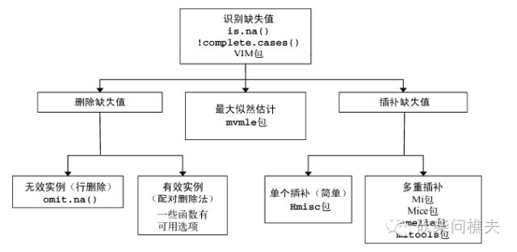
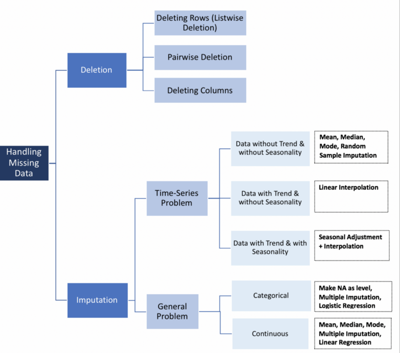

```{r setup}
suppressPackageStartupMessages(require('BBmisc'))

## 读取程序包
pkg <- c('tidyverse', 'timetk', 'lubridate', 'plyr', 'dplyr', 'magrittr', 'purrr', 'stringr', 'reshape', 'formattable', 'microbenchmark', 'knitr', 'kableExtra', 'VIM', 'mice', 'miceAdds', 'mi', 'mitools', 'Amelia', 'missForest', 'Hmisc', 'DMwR', 'imputeTS', 'tidyimpute', 'xts', 'forecast')

suppressAll(lib(pkg))
rm(pkg)
```

# 简介

由于在科研[binary.com Interview Question I - Interday High Frequency Trading Models Comparison](https://rpubs.com/englianhu/binary-Q1Inter-HFT)测试高频率量化交易时，从[fxcm/MarketData](https://github.com/fxcm/MarketData)下载的数据并不完整^[欲知更多详情，请查阅[binary.com Interview Question I - Interday High Frequency Trading Models Comparison](https://rpubs.com/englianhu/binary-Q1Inter-HFT)。]，今天僕尝试测试下弥补来的缺失值是否可信。

`NA`：代表缺失值；
`NaN`：代表不可能的值；
`Inf`：代表正无穷；
`-Inf`：代表负无穷。
`is.na（）`：识别缺失值；
`is.nan（）`：识别不可能值；
`is.infinite（）`：无穷值。
`is.na（）`、`is.nan（）`和`is.infinte（）`函数的返回值示例

| x       | is.na（x） | is.nan（x） | is.infinite（x）|
|:-------:|:----------:|:-----------:|:---------------:|
| x<-NA   | TRUE       | FALSE       | FALSE           |
| x<-0/0  | TRUE       | TRUE        | FALSE           |
| x<-1/0  | FALSE      | FALSE       | TRUE            |

*本文来自 feng_lilan 的CSDN 博客 ，全文地址请点击：[R语言处理缺失数据的高级方法](https://blog.csdn.net/lilanfeng1991/article/details/36467891?utm_source=copy)*

[How to use auto.arima to impute missing values](https://stats.stackexchange.com/questions/104565/how-to-use-auto-arima-to-impute-missing-values)

[What should be the allowed percentage of Missing Values?](https://discuss.analyticsvidhya.com/t/what-should-be-the-allowed-percentage-of-missing-values/2456)讨论着一个数据最多可以允许20%~30%的缺失值，过多的缺失值的话，该数据基本上就无法使用了。一些统计学家有本事将50%缺失值的数据复原，不过是基于许多附属变量和数据才能弥补回数据。

[How much missing data is too much? Multiple Imputation (MICE) & R](https://stats.stackexchange.com/questions/149140/how-much-missing-data-is-too-much-multiple-imputation-mice-r)

[Principled Missing Data Methods for Researchers](https://www.ncbi.nlm.nih.gov/pmc/articles/PMC3701793/)讲述许多弥补数据缺失值的方法与数学模式。

# 数据

首先，僕先随机导入每分钟为1个时间单位的数据。

```{r warning=FALSE}
Y2015W1_m1 <- readRDS('C:/Users/scibr/Documents/GitHub/scibrokes/real-time-fxcm/data/USDJPY/Y2015W1_m1.rds')

Y2015W1_m1 %<>% mutate(DateTime = mdy_hms(DateTime))
dim(Y2015W1_m1)

Y2015W1_m1
```

接着，导入Tick数据^[欲知更多详情，请参阅[一、什么是Tick Data](https://www.fmz.com/bbs-topic/457)。]，并且转为每分钟为1时间单位。

```{r, warning=FALSE}
Y2015W1 <- readRDS('C:/Users/scibr/Documents/GitHub/scibrokes/real-time-fxcm/data/USDJPY/Y2015W1.rds')

Y2015W1 %<>% mutate(DateTime = mdy_hms(DateTime))
dim(Y2015W1)

Y2015W1

Y2015W1_tm1A <- Y2015W1 %>% 
  dplyr::select(DateTime, Ask) %>% tk_xts %>% 
  to.period(period = 'minute') %>% 
  tk_tbl %>% 
  mutate(index = round_date(index, 'minutes')) %>% 
  dplyr::rename_all(str_replace_all, '^\\.{2}', 'Ask')

Y2015W1_tm1B <- Y2015W1 %>% 
  dplyr::select(DateTime, Bid) %>% tk_xts %>% 
  to.period(period = 'minute') %>% 
  tk_tbl %>% 
  mutate(index = round_date(index, 'minutes')) %>% 
  dplyr::rename_all(str_replace_all, '^\\.{2}', 'Bid')

Y2015W1_tm1 <- merge(Y2015W1_tm1B, Y2015W1_tm1A) %>% tbl_df
Y2015W1_tm1
```

然后测试下该数据是否拥有缺失值。

数据1

```{r warning=FALSE}
Y2015W1_m1 %>% is.na %>% which
Y2015W1_m1 %>% complete.cases
Y2015W1_m1 %>% md.pattern
```

数据2

```{r warning=FALSE}
Y2015W1_tm1 %>% is.na %>% which
Y2015W1_tm1 %>% complete.cases
Y2015W1_tm1 %>% md.pattern
```

数据1

```{r warning=FALSE}
imp_m1 <- mice(Y2015W1_m1, m = 8)
fit_m1 <- with(imp_m1, DateTime ~ .)
#pooled <- pool(fit, data = imp)
```

数据2

```{r warning=FALSE}
imp_tm1 <- mice(Y2015W1_tm1, m = 8)
fit_tm1 <- with(imp_tm1, index ~ .)
#pooled <- pool(fit, data = imp)
```

# 统计模式

## 设置缺失值

现在尝试随机设置缺失值。

数据1

```{r warning=FALSE}
#Y2015W1_m1_NA <- Y2015W1_m1 %>% map_df(function(x) {
#  x[sample(c(TRUE, NA), prob = c(0.99, 0.01), size = length(x), replace = TRUE)]
#  })
Y2015W1_m1_NA <- Y2015W1_m1 %>% prodNA(noNA = 0.01)
Y2015W1_m1_NA

# Y2015W1_m1_NA[-1] %>% knnImputation %>% anyNA
Y2015W1_m1_NA %>% complete.cases
Y2015W1_m1_NA %>% md.pattern
#Y2015W1_m1_NA %>% mice::complete
```

数据2

```{r warning=FALSE}
#Y2015W1_tm1_NA <- Y2015W1_m1 %>% map_df(function(x) {
#  x[sample(c(TRUE, NA), prob = c(0.99, 0.01), size = length(x), replace = TRUE)]
#  })
Y2015W1_tm1_NA <- Y2015W1_tm1 %>% prodNA(noNA = 0.01)
Y2015W1_tm1_NA

# Y2015W1_tm1_NA[-1] %>% knnImputation %>% anyNA
Y2015W1_tm1_NA %>% complete.cases
Y2015W1_tm1_NA %>% md.pattern
#Y2015W1_tm1_NA %>% mice::complete
```

## 处理缺失值

- [Dealing with Missing Data using R](https://medium.com/coinmonks/dealing-with-missing-data-using-r-3ae428da2d17)
- [How to use auto.arima to impute missing values](https://stats.stackexchange.com/questions/104565/how-to-use-auto-arima-to-impute-missing-values)





数据1

```{r warning=FALSE}
## We can use the `na.locf` if that is a homogeneous process.
# Y2015W1_m1_NA %>% na.locf
Y2015W1_m1_NA[!complete.cases(Y2015W1_m1_NA),]
sum(is.na(Y2015W1_m1_NA))

Y2015W1_m1_NA %>% aggr(prop = FALSE, numbers = TRUE)
# Y2015W1_m1_NA %>% marginplot(pch = c(20), col = c('darkgray','red','blue'))

#imp <- Y2015W1_m1_NA %>% mice(m = 8, method = 'pmm', maxit = 100)
methods(mice)
#fit <- lm(DateTime~., data = Y2015W1_m1_NA)
#pooled <- pool(fit)
#summary(pooled)

#Y2015W1_m1_NA %>% complete(action = 3)
Y2015W1_m1_NA %>% md.pattern
Y2015W1_m1_NA %>% aggr(prop = FALSE, numbers = TRUE)
```

数据1

```{r warning=FALSE}
corr1 <- Y2015W1_m1_NA[, 2:9] %>% cor(use = 'complete.obs')
corr1
corr2 <- Y2015W1_m1_NA[, 2:9] %>% cor(use = 'pairwise.complete.obs')
corr2
```

数据2

```{r warning=FALSE}
## We can use the `na.locf` if that is a homogeneous process.
# Y2015W1_tm1_NA %>% na.locf
Y2015W1_tm1_NA[!complete.cases(Y2015W1_tm1_NA),]
sum(is.na(Y2015W1_tm1_NA))

Y2015W1_tm1_NA %>% aggr(prop = FALSE, numbers = TRUE)
# Y2015W1_tm1_NA %>% marginplot(pch = c(20), col = c('darkgray','red','blue'))

#imp <- Y2015W1_tm1_NA %>% mice(m = 8, method = 'pmm', maxit = 100)
methods(mice)
#fit <- lm(index~., data = Y2015W1_tm1_NA)
#pooled <- pool(fit)
#summary(pooled)

#Y2015W1_tm1_NA %>% complete(action = 3)
Y2015W1_tm1_NA %>% md.pattern
Y2015W1_tm1_NA %>% aggr(prop = FALSE, numbers = TRUE)
```

数据2

```{r warning=FALSE}
corr1 <- Y2015W1_tm1_NA[, 2:9] %>% cor(use = 'complete.obs')
corr1
corr2 <- Y2015W1_tm1_NA[, 2:9] %>% cor(use = 'pairwise.complete.obs')
corr2
```

数据1

```{r warning=FALSE}
Y2015W1_m1_NA %>% impute_mean

Y2015W1_m1_filled <- Y2015W1_m1_NA %>% 
    dplyr::select(starts_with('Ask'), starts_with('Bid')) %>% 
    map(na.seadec, algorithm = 'interpolation') %>% as.tibble
```

数据2

```{r warning=FALSE}
Y2015W1_tm1_NA %>% impute_mean

Y2015W1_tm1_filled <- Y2015W1_tm1_NA %>% 
    dplyr::select(starts_with('Ask'), starts_with('Bid')) %>% 
    map(na.seadec, algorithm = 'interpolation') %>% as.tibble
```

## 处理缺失值的其他方法

处理缺失数据的专业方法

|软件包                                | 描述                                                     |
|:------------------------------------:|:--------------------------------------------------------:|
| Hmisc                                | 包含多种函数，支持简单插补、多重插补和典型变量插补       |
| mvnmle                               | 对多元正态颁数据中缺失值的最大似然估计                   |
| cat                                  | 对数线性模型中多元类别型变量的多重插补                   |
| arrayImpute\arraryMissPattern、SeqKn | 处理微阵列缺失值数据的实用函数                           |
| longitudinalData	                   | 相关的函数列表，比如对时间序列缺失值进行插补的一系列函数 |
| kmi	                                 | 处理生存分析缺失值的Kaplan-Meier多重插补                 |
| mix	                                 | 一般位置模型中混合类别型和连续型数据的多重插补           |
| pan	                                 | 多元面板数据或聚类的多重插补                             |

*本文来自 feng_lilan 的CSDN 博客 ，全文地址请点击：[R语言处理缺失数据的高级方法](https://blog.csdn.net/lilanfeng1991/article/details/36467891?utm_source=copy)*

# 数据比较

```{r warning=FALSE}
Y2015W1_m1_filled %>% 
  kable(caption = '1min filled dataset') %>% 
  kable_styling(bootstrap_options = c('striped', 'hover', 'condensed', 'responsive')) %>%
  scroll_box(width = '100%', height = '400px')
Y2015W1_tm1_filled %>% 
  kable(caption = 'tick-to-1min filled dataset') %>% 
  kable_styling(bootstrap_options = c('striped', 'hover', 'condensed', 'responsive')) %>%
  scroll_box(width = '100%', height = '400px')
```

```{r warning=FALSE}
comp1 <- list(Y2015W1_m1 = Y2015W1_m1[,-1] %>% 
               colMeans %>% t %>% as_data_frame, 
             
             Y2015W1_m1_filled = Y2015W1_m1_filled %>% 
               colMeans %>% t %>% as_data_frame, 
             
             Y2015W1_tm1 = Y2015W1_tm1[,-1] %>% 
               colMeans %>% t %>% as_data_frame, 
             
             Y2015W1_tm1_filled = Y2015W1_tm1_filled %>% 
               colMeans %>% t %>% as_data_frame) %>% bind_rows
comp1 %<>% cbind(Dataset = c('Y2015W1_m1', 'Y2015W1_m1_filled_1%', 
                            'Y2015W1_tm1', 'Y2015W1_tm1_filled_1%'), .)

comp1 %>% 
  kable(caption = 'Mean Value Comparison') %>% 
  kable_styling(bootstrap_options = c('striped', 'hover', 'condensed', 'responsive')) %>%
  scroll_box(width = '100%')#, height = '400px')
```

```{r warning=FALSE}
mse1 <- colMeans(Y2015W1_m1_filled - Y2015W1_m1[,-1])^2
```

# 不同数据缺失值

## 10%

```{r warning=FALSE}
Y2015W1_m1_NA <- Y2015W1_m1 %>% prodNA(noNA = 0.1)
Y2015W1_tm1_NA <- Y2015W1_tm1 %>% prodNA(noNA = 0.1)

Y2015W1_m1_filled <- Y2015W1_m1_NA %>% 
    dplyr::select(starts_with('Ask'), starts_with('Bid')) %>% 
    map(na.seadec, algorithm = 'interpolation') %>% as.tibble

Y2015W1_tm1_filled <- Y2015W1_tm1_NA %>% 
    dplyr::select(starts_with('Ask'), starts_with('Bid')) %>% 
    map(na.seadec, algorithm = 'interpolation') %>% as.tibble
```

```{r warning=FALSE}
comp10 <- list(Y2015W1_m1 = Y2015W1_m1[,-1] %>% 
               colMeans %>% t %>% as_data_frame, 
             
             Y2015W1_m1_filled = Y2015W1_m1_filled %>% 
               colMeans %>% t %>% as_data_frame, 
             
             Y2015W1_tm1 = Y2015W1_tm1[,-1] %>% 
               colMeans %>% t %>% as_data_frame, 
             
             Y2015W1_tm1_filled = Y2015W1_tm1_filled %>% 
               colMeans %>% t %>% as_data_frame) %>% bind_rows
comp10 %<>% cbind(Dataset = c('Y2015W1_m1', 'Y2015W1_m1_filled_10%', 
                            'Y2015W1_tm1', 'Y2015W1_tm1_filled_10%'), .)

comp10 %>% 
  kable(caption = 'Mean Value Comparison') %>% 
  kable_styling(bootstrap_options = c('striped', 'hover', 'condensed', 'responsive')) %>%
  scroll_box(width = '100%')#, height = '400px')
```

```{r warning=FALSE}
mse10 <- colMeans(Y2015W1_m1_filled - Y2015W1_m1[,-1])^2
```

## 20%

```{r warning=FALSE}
Y2015W1_m1_NA <- Y2015W1_m1 %>% prodNA(noNA = 0.2)
Y2015W1_tm1_NA <- Y2015W1_tm1 %>% prodNA(noNA = 0.2)

Y2015W1_m1_filled <- Y2015W1_m1_NA %>% 
    dplyr::select(starts_with('Ask'), starts_with('Bid')) %>% 
    map(na.seadec, algorithm = 'interpolation') %>% as.tibble

Y2015W1_tm1_filled <- Y2015W1_tm1_NA %>% 
    dplyr::select(starts_with('Ask'), starts_with('Bid')) %>% 
    map(na.seadec, algorithm = 'interpolation') %>% as.tibble
```

```{r warning=FALSE}
comp20 <- list(Y2015W1_m1 = Y2015W1_m1[,-1] %>% 
               colMeans %>% t %>% as_data_frame, 
             
             Y2015W1_m1_filled = Y2015W1_m1_filled %>% 
               colMeans %>% t %>% as_data_frame, 
             
             Y2015W1_tm1 = Y2015W1_tm1[,-1] %>% 
               colMeans %>% t %>% as_data_frame, 
             
             Y2015W1_tm1_filled = Y2015W1_tm1_filled %>% 
               colMeans %>% t %>% as_data_frame) %>% bind_rows
comp20 %<>% cbind(Dataset = c('Y2015W1_m1', 'Y2015W1_m1_filled_20%', 
                            'Y2015W1_tm1', 'Y2015W1_tm1_filled_20%'), .)

comp20 %>% 
  kable(caption = 'Mean Value Comparison') %>% 
  kable_styling(bootstrap_options = c('striped', 'hover', 'condensed', 'responsive')) %>%
  scroll_box(width = '100%')#, height = '400px')
```

```{r warning=FALSE}
mse20 <- colMeans(Y2015W1_m1_filled - Y2015W1_m1[,-1])^2
```

## 30%

```{r warning=FALSE}
Y2015W1_m1_NA <- Y2015W1_m1 %>% prodNA(noNA = 0.3)
Y2015W1_tm1_NA <- Y2015W1_tm1 %>% prodNA(noNA = 0.3)

Y2015W1_m1_filled <- Y2015W1_m1_NA %>% 
    dplyr::select(starts_with('Ask'), starts_with('Bid')) %>% 
    map(na.seadec, algorithm = 'interpolation') %>% as.tibble

Y2015W1_tm1_filled <- Y2015W1_tm1_NA %>% 
    dplyr::select(starts_with('Ask'), starts_with('Bid')) %>% 
    map(na.seadec, algorithm = 'interpolation') %>% as.tibble
```

```{r warning=FALSE}
comp30 <- list(Y2015W1_m1 = Y2015W1_m1[,-1] %>% 
               colMeans %>% t %>% as_data_frame, 
             
             Y2015W1_m1_filled = Y2015W1_m1_filled %>% 
               colMeans %>% t %>% as_data_frame, 
             
             Y2015W1_tm1 = Y2015W1_tm1[,-1] %>% 
               colMeans %>% t %>% as_data_frame, 
             
             Y2015W1_tm1_filled = Y2015W1_tm1_filled %>% 
               colMeans %>% t %>% as_data_frame) %>% bind_rows
comp30 %<>% cbind(Dataset = c('Y2015W1_m1', 'Y2015W1_m1_filled_30%', 
                            'Y2015W1_tm1', 'Y2015W1_tm1_filled_30%'), .)

comp30 %>% 
  kable(caption = 'Mean Value Comparison') %>% 
  kable_styling(bootstrap_options = c('striped', 'hover', 'condensed', 'responsive')) %>%
  scroll_box(width = '100%')#, height = '400px')
```

```{r warning=FALSE}
mse30 <- colMeans(Y2015W1_m1_filled - Y2015W1_m1[,-1])^2
```

## 50%

```{r warning=FALSE}
Y2015W1_m1_NA <- Y2015W1_m1 %>% prodNA(noNA = 0.5)
Y2015W1_tm1_NA <- Y2015W1_tm1 %>% prodNA(noNA = 0.5)

Y2015W1_m1_filled <- Y2015W1_m1_NA %>% 
    dplyr::select(starts_with('Ask'), starts_with('Bid')) %>% 
    map(na.seadec, algorithm = 'interpolation') %>% as.tibble

Y2015W1_tm1_filled <- Y2015W1_tm1_NA %>% 
    dplyr::select(starts_with('Ask'), starts_with('Bid')) %>% 
    map(na.seadec, algorithm = 'interpolation') %>% as.tibble
```

```{r warning=FALSE}
comp50 <- list(Y2015W1_m1 = Y2015W1_m1[,-1] %>% 
               colMeans %>% t %>% as_data_frame, 
             
             Y2015W1_m1_filled = Y2015W1_m1_filled %>% 
               colMeans %>% t %>% as_data_frame, 
             
             Y2015W1_tm1 = Y2015W1_tm1[,-1] %>% 
               colMeans %>% t %>% as_data_frame, 
             
             Y2015W1_tm1_filled = Y2015W1_tm1_filled %>% 
               colMeans %>% t %>% as_data_frame) %>% bind_rows
comp50 %<>% cbind(Dataset = c('Y2015W1_m1', 'Y2015W1_m1_filled_50%', 
                            'Y2015W1_tm1', 'Y2015W1_tm1_filled_50%'), .)

comp50 %>% 
  kable(caption = 'Mean Value Comparison') %>% 
  kable_styling(bootstrap_options = c('striped', 'hover', 'condensed', 'responsive')) %>%
  scroll_box(width = '100%')#, height = '400px')
```

```{r warning=FALSE}
mse50 <- colMeans(Y2015W1_m1_filled - Y2015W1_m1[,-1])^2
```

## 65%

```{r warning=FALSE}
Y2015W1_m1_NA <- Y2015W1_m1 %>% prodNA(noNA = 0.65)
Y2015W1_tm1_NA <- Y2015W1_tm1 %>% prodNA(noNA = 0.65)

Y2015W1_m1_filled <- Y2015W1_m1_NA %>% 
    dplyr::select(starts_with('Ask'), starts_with('Bid')) %>% 
    map(na.seadec, algorithm = 'interpolation') %>% as.tibble

Y2015W1_tm1_filled <- Y2015W1_tm1_NA %>% 
    dplyr::select(starts_with('Ask'), starts_with('Bid')) %>% 
    map(na.seadec, algorithm = 'interpolation') %>% as.tibble
```

```{r warning=FALSE}
comp65 <- list(Y2015W1_m1 = Y2015W1_m1[,-1] %>% 
               colMeans %>% t %>% as_data_frame, 
             
             Y2015W1_m1_filled = Y2015W1_m1_filled %>% 
               colMeans %>% t %>% as_data_frame, 
             
             Y2015W1_tm1 = Y2015W1_tm1[,-1] %>% 
               colMeans %>% t %>% as_data_frame, 
             
             Y2015W1_tm1_filled = Y2015W1_tm1_filled %>% 
               colMeans %>% t %>% as_data_frame) %>% bind_rows
comp65 %<>% cbind(Dataset = c('Y2015W1_m1', 'Y2015W1_m1_filled_65%', 
                            'Y2015W1_tm1', 'Y2015W1_tm1_filled_65%'), .)

comp65 %>% 
  kable(caption = 'Mean Value Comparison') %>% 
  kable_styling(bootstrap_options = c('striped', 'hover', 'condensed', 'responsive')) %>%
  scroll_box(width = '100%')#, height = '400px')
```

```{r warning=FALSE}
mse65 <- colMeans(Y2015W1_m1_filled - Y2015W1_m1[,-1])^2
```

## 70%

```{r warning=FALSE}
Y2015W1_m1_NA <- Y2015W1_m1 %>% prodNA(noNA = 0.7)
Y2015W1_tm1_NA <- Y2015W1_tm1 %>% prodNA(noNA = 0.7)

Y2015W1_m1_filled <- Y2015W1_m1_NA %>% 
    dplyr::select(starts_with('Ask'), starts_with('Bid')) %>% 
    map(na.seadec, algorithm = 'interpolation') %>% as.tibble

Y2015W1_tm1_filled <- Y2015W1_tm1_NA %>% 
    dplyr::select(starts_with('Ask'), starts_with('Bid')) %>% 
    map(na.seadec, algorithm = 'interpolation') %>% as.tibble
```

```{r warning=FALSE}
comp70 <- list(Y2015W1_m1 = Y2015W1_m1[,-1] %>% 
               colMeans %>% t %>% as_data_frame, 
             
             Y2015W1_m1_filled = Y2015W1_m1_filled %>% 
               colMeans %>% t %>% as_data_frame, 
             
             Y2015W1_tm1 = Y2015W1_tm1[,-1] %>% 
               colMeans %>% t %>% as_data_frame, 
             
             Y2015W1_tm1_filled = Y2015W1_tm1_filled %>% 
               colMeans %>% t %>% as_data_frame) %>% bind_rows
comp70 %<>% cbind(Dataset = c('Y2015W1_m1', 'Y2015W1_m1_filled_70%', 
                            'Y2015W1_tm1', 'Y2015W1_tm1_filled_70%'), .)

comp70 %>% 
  kable(caption = 'Mean Value Comparison') %>% 
  kable_styling(bootstrap_options = c('striped', 'hover', 'condensed', 'responsive')) %>%
  scroll_box(width = '100%')#, height = '400px')
```

```{r warning=FALSE}
mse70 <- colMeans(Y2015W1_m1_filled - Y2015W1_m1[,-1])^2
```

## 80%

```{r warning=FALSE}
Y2015W1_m1_NA <- Y2015W1_m1 %>% prodNA(noNA = 0.8)
Y2015W1_tm1_NA <- Y2015W1_tm1 %>% prodNA(noNA = 0.8)

Y2015W1_m1_filled <- Y2015W1_m1_NA %>% 
    dplyr::select(starts_with('Ask'), starts_with('Bid')) %>% 
    map(na.seadec, algorithm = 'interpolation') %>% as.tibble

Y2015W1_tm1_filled <- Y2015W1_tm1_NA %>% 
    dplyr::select(starts_with('Ask'), starts_with('Bid')) %>% 
    map(na.seadec, algorithm = 'interpolation') %>% as.tibble
```

```{r warning=FALSE}
comp80 <- list(Y2015W1_m1 = Y2015W1_m1[,-1] %>% 
               colMeans %>% t %>% as_data_frame, 
             
             Y2015W1_m1_filled = Y2015W1_m1_filled %>% 
               colMeans %>% t %>% as_data_frame, 
             
             Y2015W1_tm1 = Y2015W1_tm1[,-1] %>% 
               colMeans %>% t %>% as_data_frame, 
             
             Y2015W1_tm1_filled = Y2015W1_tm1_filled %>% 
               colMeans %>% t %>% as_data_frame) %>% bind_rows
comp80 %<>% cbind(Dataset = c('Y2015W1_m1', 'Y2015W1_m1_filled_80%', 
                            'Y2015W1_tm1', 'Y2015W1_tm1_filled_80%'), .)

comp80 %>% 
  kable(caption = 'Mean Value Comparison') %>% 
  kable_styling(bootstrap_options = c('striped', 'hover', 'condensed', 'responsive')) %>%
  scroll_box(width = '100%')#, height = '400px')
```

```{r warning=FALSE}
mse80 <- colMeans(Y2015W1_m1_filled - Y2015W1_m1[,-1])^2
```

## 85%

```{r warning=FALSE}
Y2015W1_m1_NA <- Y2015W1_m1 %>% prodNA(noNA = 0.85)
Y2015W1_tm1_NA <- Y2015W1_tm1 %>% prodNA(noNA = 0.85)

Y2015W1_m1_filled <- Y2015W1_m1_NA %>% 
    dplyr::select(starts_with('Ask'), starts_with('Bid')) %>% 
    map(na.seadec, algorithm = 'interpolation') %>% as.tibble

Y2015W1_tm1_filled <- Y2015W1_tm1_NA %>% 
    dplyr::select(starts_with('Ask'), starts_with('Bid')) %>% 
    map(na.seadec, algorithm = 'interpolation') %>% as.tibble
```

```{r warning=FALSE}
comp85 <- list(Y2015W1_m1 = Y2015W1_m1[,-1] %>% 
               colMeans %>% t %>% as_data_frame, 
             
             Y2015W1_m1_filled = Y2015W1_m1_filled %>% 
               colMeans %>% t %>% as_data_frame, 
             
             Y2015W1_tm1 = Y2015W1_tm1[,-1] %>% 
               colMeans %>% t %>% as_data_frame, 
             
             Y2015W1_tm1_filled = Y2015W1_tm1_filled %>% 
               colMeans %>% t %>% as_data_frame) %>% bind_rows
comp85 %<>% cbind(Dataset = c('Y2015W1_m1', 'Y2015W1_m1_filled_85%', 
                            'Y2015W1_tm1', 'Y2015W1_tm1_filled_85%'), .)

comp85 %>% 
  kable(caption = 'Mean Value Comparison') %>% 
  kable_styling(bootstrap_options = c('striped', 'hover', 'condensed', 'responsive')) %>%
  scroll_box(width = '100%')#, height = '400px')
```

```{r warning=FALSE}
mse85 <- colMeans(Y2015W1_m1_filled - Y2015W1_m1[,-1])^2
```

# 结论

```{r warning=FALSE}
compAll <- list(comp1, comp10, comp20, comp30, comp50, comp65, comp70, comp80, comp85) %>% merge_all %>% tbl_df %>% 
  mutate(Margin = rowMeans(.[,-1]))

c1 <- compAll %>% dplyr::filter(str_detect(Dataset, '_m1'))
c2 <- compAll %>% dplyr::filter(str_detect(Dataset, '_tm1'))
compAll <- rbind(c1, c2)

compAll %>% 
  kable(caption = 'Mean Value Comparison') %>% 
  kable_styling(bootstrap_options = c('striped', 'hover', 'condensed', 'responsive')) %>% 
  group_rows('1分钟数据', 1, 10, label_row_css = 'background-color: #003399; color: #fff;') %>%
  group_rows('Tick数据转换为1分钟数据', 11, 20, label_row_css = 'background-color: #003399; color: #fff;') %>% 
  scroll_box(width = '100%', height = '400px')
```

以上图表与边缘平均价格显示，无论是1%至85%的缺失值都不会影响原始数据，因为价格与原始数据的误差非常渺小。无论如何，倘若逐个查询数据的误差大小会更加。

```{r warning=FALSE}
mseAll <- list(mse1, mse10, mse20, mse30, mse50, mse65, mse70, mse80, mse85)
mseAll %<>% do.call('rbind', .) %>% 
    data.frame(`Missing Value` = c('NA 1%', 'NA 10%', 'NA 20%', 'NA 30%', 'NA 50%', 'NA 65%', 'NA 70%', 'NA 80%', 'NA 85%'), .) %>% tbl_df %>% 
  mutate(Margin = rowMeans(.[,-1]))

mseAll %>% 
  kable(caption = '均方误比较') %>% 
  kable_styling(bootstrap_options = c('striped', 'hover', 'condensed', 'responsive')) %>% 
  scroll_box(width = '100%', height = '400px')
```

以上比较均方误差，而边缘误差为`0.0000084`至`0.0000160`，故此弥补来的数据还是可行的，那目前还得查阅数据才能知晓。

```{r}
Y2015W1_m1_filled %>% mutate(
  VA = if_else(AskOpen <= AskHigh & AskOpen >= AskLow & 
               AskClose <= AskHigh & AskClose >= AskLow & 
               AskHigh >= AskLow, 1, 0), 
  VB = if_else(BidOpen <= BidHigh & BidOpen >= BidLow & 
               BidClose <= BidHigh & BidClose >= BidLow & 
               BidHigh >= BidLow, 1, 0)) %>% 
  dplyr::filter(VA == 0|VB == 0) %>% data.frame %>% 
  kable(caption = '数据误差') %>% 
  kable_styling(bootstrap_options = c('striped', 'hover', 'condensed', 'responsive')) %>% 
  scroll_box(width = '100%', height = '400px')
```

从以上数据证明，弥补来的数据确实有误，如之前单变量的误差（开市或闭市价高于最高价、低于最低价）。僕们可以通过`auto.arima`、`ETS`、`GARCH`或者其它方式回测数据和弥补缺失值<s>，不过那就比较费时了。根据以上的`imputeTS::na.seadec()`弥补来的数据的误差是`0`至`0.0001`，基本上还算可行</s>，不过最有效的方法就是使用多变量`DCC`模式弥补缺失值，不过会非常耗时。

# 附录

## 文件与系统资讯

以下乃此文献资讯：

- 文件建立日期：2018-10-08
- 文件最新更新日期：`r today('Asia/Tokyo')`
- `r R.version.string`
- R语言版本：`r getRversion()`
- [**rmarkdown** 程序包](https://github.com/rstudio/rmarkdown)版本：`r packageVersion('rmarkdown')`
- 文件版本：1.0.1
- 作者简历：[®γσ, Eng Lian Hu](https://beta.rstudioconnect.com/content/3091/ryo-eng.html)
- GitHub：[源代码](https://github.com/englianhu/binary.com-interview-question)
- 其它系统资讯：

```{r info, echo=FALSE, warning=FALSE, results='asis'}
suppressMessages(require('dplyr', quietly = TRUE))
suppressMessages(require('formattable', quietly = TRUE))
suppressMessages(require('knitr', quietly = TRUE))
suppressMessages(require('kableExtra', quietly = TRUE))

sys1 <- devtools::session_info()$platform %>% 
  unlist %>% data.frame(Category = names(.), session_info = .)
rownames(sys1) <- NULL

#sys1 %<>% rbind(., data.frame(
#  Category = 'Current time', 
#  session_info = paste(as.character(lubridate::now('Asia/Tokyo')), 'JST'))) %>% 
#  dplyr::filter(Category != 'os')

sys2 <- data.frame(Sys.info()) %>% mutate(Category = rownames(.)) %>% .[2:1]
names(sys2)[2] <- c('Sys.info')
rownames(sys2) <- NULL

sys2 %<>% rbind(., data.frame(
  Category = 'Current time', 
  Sys.info = paste(as.character(lubridate::now('Asia/Tokyo')), 'JST')))

cbind(sys1, sys2) %>% 
  kable(caption = 'Additional session information:') %>% 
  kable_styling(bootstrap_options = c('striped', 'hover', 'condensed', 'responsive'))

rm(sys1, sys2)
```

## 参考文献

1. [R语言缺失值处理](https://zhuanlan.zhihu.com/p/27312695)
2. [R语言中缺失值NA的处理](https://blog.csdn.net/Ssxysxy123/article/details/51774472)
3. [R语言处理缺失数据的高级方法](https://blog.csdn.net/lilanfeng1991/article/details/36467891)
4. [HTML Color Names](https://www.w3schools.com/tags/ref_colornames.asp)
5. [Missing Values, Data Science and R](https://rviews.rstudio.com/2016/11/30/missing-values-data-science-and-r/)
6. [Imputing Missing Data with R; MICE package](https://datascienceplus.com/imputing-missing-data-with-r-mice-package/)
7. [Markov Chain process - Missing values](https://stats.stackexchange.com/questions/47965/markov-chain-process-missing-values)
8. [Randomly insert NAs into dataframe proportionaly](https://stackoverflow.com/questions/27454265/randomly-insert-nas-into-dataframe-proportionaly)
9. [Insert random NAs in a vector in R](https://paleocave.sciencesortof.com/2014/07/insert-random-nas-in-a-vector-in-r/)
10. [[R] Fill in missing times in a timeseries with NA](https://stat.ethz.ch/pipermail/r-help/2010-October/257749.html)
11. [How to Replace NA's in a Date Column](https://stackoverflow.com/questions/39899997/how-to-replace-nas-in-a-date-column)
12. [How to Fill NAs with `na.locf` by factors in data frame split by country](https://stackoverflow.com/questions/13616965/how-to-fill-nas-with-locf-by-factors-in-data-frame-split-by-country)
13. [数据预处理之缺失值插补 — 基于R语言](https://blog.csdn.net/qq_31584157/article/details/52562830)
14. [imputeTS - Time Series Missing Value Imputation in R](https://github.com/englianhu/binary.com-interview-question/blob/master/reference/imputeTS%20-%20Time%20Series%20Missing%20Value%20Imputation%20in%20R)

---

<span style='color:RoyalBlue'>**Powered by - Copyright® Intellectual Property Rights of [®](http://www.scibrokes.com)個人の経営企業**</span>
