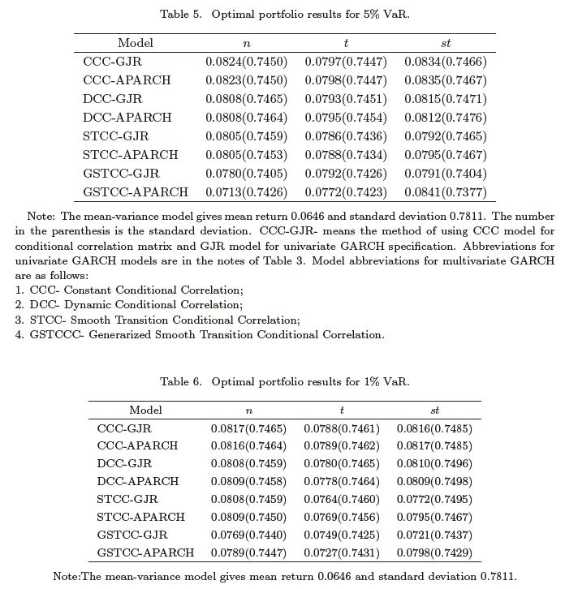

```{r setup, include = FALSE}
suppressPackageStartupMessages(library('BBmisc'))
pkgs <- c('knitr', 'kableExtra', 'tint', 'devtools', 'lubridate', 'plyr', 'stringr', 'magrittr', 'dplyr', 'tidyr', 'tidyverse', 'tidyquant', 'turner', 'readr', 'quantmod', 'htmltools', 'highcharter', 'googleVis', 'formattable', 'ggfortify', 'DT', 'forecast', 'PerformanceAnalytics', 'broom', 'microbenchmark', 'doParallel', 'Boruta', 'fBasics', 'fPortfolio', 'rugarch', 'parma', 'rmgarch')

suppressAll(lib(pkgs))

#'@ suppressAll(l_ply(c('last.R', 'Mn.R', 'has.Mn.R', 'simAutoArima.R', 'simStakesAutoArima.R', 'simETS.R', 'simStakesETS.R', 'plotChart2.R', 'armaSearch.R', 'simGarch.R', 'simStakesGarch.R'), function(pkg) source(paste0('./function/', pkg))))

## Set option to below if you want to plot an independent webpage with graph 
#'@ op <- options(gvis.plot.tag=NULL)
op <- options(gvis.plot.tag = 'chart')
options(gvis.plot.tag = 'chart', warn = -1)
#'@ options(rpubs.upload.method = 'internal')

## R: llply fully reproducible results in parallel
## https://stackoverflow.com/questions/34946177/r-llply-fully-reproducible-results-in-parallel
cl <- makeCluster(detectCores())
registerDoParallel(cl)

# Create a cluster object to be used for rugarcgh and rmgarch models.
#'@ cluster = makePSOCKcluster(15)
suppressPackageStartupMessages(library('BBmisc'))
pkgs <- c('knitr', 'kableExtra', 'tint', 'devtools', 'lubridate', 'plyr', 'stringr', 'magrittr', 'dplyr', 'tidyr', 'tidyverse', 'tidyquant', 'turner', 'readr', 'R.utils', 'quantmod', 'htmltools', 'highcharter', 'googleVis', 'formattable', 'ggfortify', 'DT', 'forecast', 'PerformanceAnalytics', 'broom', 'microbenchmark', 'doParallel', 'Boruta', 'fBasics', 'fPortfolio', 'rugarch', 'parma', 'rmgarch')

suppressAll(lib(pkgs))

#'@ suppressAll(l_ply(c('last.R', 'Mn.R', 'has.Mn.R', 'simAutoArima.R', 'simStakesAutoArima.R', 'simETS.R', 'simStakesETS.R', 'plotChart2.R', 'armaSearch.R', 'simGarch.R', 'simStakesGarch.R'), function(pkg) source(paste0('./function/', pkg))))

# invalidate cache when the package version changes
#'@ knitr::opts_chunk$set(tidy = FALSE, cache.extra = packageVersion('tint'))
rm(pkgs)
#'@ options(htmltools.dir.version = FALSE)
```

# Introduction

## Abstract

In order to test the timeline of daily highest and lowest price, here I created this file to read the high volume tick-data-history to test the efficiency of Kelly Criterion betting models. Kindly refer to [Reference] for further information.

*binary.com Interview Question I - Tick-Data-HiLo For Daily Trading (Blooper)* descript that the VaR figure required in order to place orders. [What is the difference between Sharpe ratio and value at risk?](https://www.quora.com/What-is-the-difference-between-Sharpe-ratio-and-value-at-risk) states the difference between VaR and shape ratio where the shape ratio will be use in the future research.

[ARIMA+GARCH Trading Strategy on the S&P500 Stock Market Index Using R](https://www.quantstart.com/articles/ARIMA-GARCH-Trading-Strategy-on-the-SP500-Stock-Market-Index-Using-R) compares the ROI of buy and hold and application of ARIMA + GARCH model.

[Systematic Investor Blog : Trading Strategies](https://systematicinvestor.wordpress.com/category/trading-strategies/) introduce various trading strategies.

## Intro Reference

*Currency Hedging Strategies Using Dynamic Multivariate GARCH* compares DCC, BEKK, CCC and VARMA-AGARCH models to examine the conditional volatilities among the spot and two distint futures maturities, namely near-month and next-to-near-month contracts. The estimated conditionl covariances matrices from these models were used to calculate the optimal portfolios weights and optimal hedge ratios. The empirical results in the paper reveal that there are not big differences either the near-month or next-to-near-month contract is used for hedge spot position on currencies. They also reveal that hedging ratios are lower for near-month contract when the USD/EUR and USD/JPY exchange rates are anlyzed. This result is explained in terms of the higher correlation between spot prices and the next-to-near-month future prices than that with near-month contract and additionally because of the lower volatility of the long maturity futures. Finally across all currencies and error densities, the CCC and VARMA-AGARCH models provide similar results in terms of hedging ratios, portfolio variance reduction and hedging effectiveness. Some difference might appear when the DCC and BEKK models are used. Below is the table summary of the paper.


*Figure 3.1.1A : comparison of hedge strategy.*


*Figure 3.1.1B : comparison of hedge strategy.*


*Figure 3.1.1C : comparison of hedge strategy.*

Tables 8A-8C report the average OHR values, the hedge effectiveness, the variance of the portfolio, the hedging effectiveness along with the average value of the optimal portfolio weights for the three currencies using FUT1 and FUT2 contracts when both the Student t and normal error distributions are assumed. We show the results for the four multivariate volatility models.

Tables 8A-8C show that hedging is effective in reducing the risks for every model, currency and maturity. In particular, we find that the average OHR using FUT2 contracts are slightly higher than when FUT1 contracts are used, except for GBP. The highest average OHR value is 0.854 for USD/JPY when FUT2 contracts are used, meaning that, in order to minimize risk, a long (buy) position of one dollar in such a currency should be hedged by a short (sell) position of $0.854 in JPYFUT2 contracts.

Additionally, when using the Gaussian error distribution, Tables 8A-8C report lower average OHR values for the three currencies analyzed. The average OHRs from each model are not particularly different, slightly smaller for the DCC and BEKK models when the Student t is used, but larger for GBP and JPY when using the Gaussian distribution. The average OHR values are higher for the USD/JPY exchange rate. On the contrary, hedging effectiveness is higher for the DCC and BEKK models.


*Figure 3.1.2 : comparison of hedge strategy.*

The correlations of the dynamic patterns in Tables 8A-8C are given in Tables 9A-9C. It is clear that, across all currencies and both error densities, the OHRs are most similar between CCC and VARMA-AGARCH, which suggests that dynamic asymmetry may not be crucial empirically, and also between DCC and BEKK.

In summary, the estimates based on both OHR and optimal weight values recommend holding more FUT2 than FUT1 contracts for USD/EUR and USD/JPY spot/futures portfolios, meaning that we should increase the percentage of futures contracts for longer term portfolios when these currencies are used.

*Dynamic Portfolio Optimization using Generalized Dynamic Conditional Heteroskedastic Factor Models* compares . The paper studies the portfolio selection problem based on a generalized dynamic factor model (GDFM) with conditional heteroskedasticity in the idiosyncratic components. We propose a Generalized Smooth Transition Conditional Correlation (GSTCC) model for the idiosyncratic components combined with the GDFM. Among all the multivariate GARCH models that the authors propose, the generalized smooth transition conditional correlation provides the best result.





I try to surf over internet and the model has no yet widely use. Here I can only use the CCC, DCC models but the best performance GSTCC is not yet available in r packages. The `cccgarch` has STCC model but there has no examples to use it.

# Data

## Read Data

  I use more than 3 years data (from week 1 2015 until week 27 2018)^[You are feel feel to get the data via [FXCMTickData](https://github.com/fxcm/FXCMTickData)] for the question as experiment, 1st year data is burn-in data for statistical modelling and prediction purpose while following 2 years data for forecasting and staking. There have 52 trading weeks within a year.

```{r read-data, echo = FALSE, eval = FALSE}
## ================== eval = FALSE =============================
## Do not execute...
## 
## Remove all objects include hidden objects.
#'@ rm(list = ls(all.names = TRUE))

## get currency dataset online.
yr <- c(2015, 2016, 2017, 2018)
wk <- 1:53

## https://www.epochconverter.com/years
llply(yr, function(i) {
  #'@ if(i == 2015) wk <- 1:53 else wk <- 1:52
  lnk <- paste0('https://tickdata.fxcorporate.com/USDJPY/', i, '/', wk, '.csv.gz')
  if(!dir.exists('data/tickdata')) dir.create('data/tickdata')
  if(!file.exists(paste0('data/tickdata/Y', i, 'W', wk, '.csv.gz'))) 
    download.file(lnk, destfile = paste0('data/tickdata/Y', i, 'W', wk, '.csv.gz'))
  })

llply(yr, function(i) {
  llply(wk, function(j) {
  if(file.exists(paste0('data/tickdata/Y', i, 'W', j, '.csv.gz')) & 
    !file.exists(paste0('data/tickdata/Y', i, 'W', j, '.csv')))
    R.utils::gunzip(paste0('data/tickdata/Y', i, 'W', j, '.csv.gz'), remove = FALSE)
  })
})

llply(yr, function(i) {
  llply(wk, function(j) {
  if(file.exists(paste0('data/tickdata/Y', i, 'W', j, '.csv.gz')))
    unzip(paste0('data/tickdata/Y', i, 'W', j, '.csv.gz'), exdir = 'data/tickdata')
  })
})


for(i in yr){
    for(j in wk) {
        R.utils::gunzip(paste0('data/tickdata/Y', i, 'W', j, '.csv.gz'), remove = FALSE)
      Sys.sleep(5)
      cat(paste0('data/tickdata/Y', i, 'W', j, '.csv.gz extracted!\n'))
    }
}

for(i in yr){
    for(j in wk) {
        R.utils::gunzip(paste0('data/tickdata/Y', i, 'W', j, '.csv.gz'), remove = FALSE)
      Sys.sleep(5)
      if(file.exists(paste0('data/tickdata/Y', i, 'W', j, '.csv'))) 
        cat(paste0('data/tickdata/Y', i, 'W', j, '.csv.gz extracted!\n'))
    }
}

### ----------------------------------------
## get currency dataset online.
yr <- c(2015, 2016, 2017, 2018)
wk <- 1:53

## https://www.epochconverter.com/years
llply(yr, function(i) {
  if(i == 2015) wk <- 1:53 else wk <- 1:52
  llply(wk, function(j) {
    lnk <- paste0(
      'https://tickdata.fxcorporate.com/USDJPY/', i, '/', j, '.csv.gz')
    if(!dir.exists('data/tickdata')) dir.create('data/tickdata')
    if(!file.exists(paste0('data/tickdata/Y', i, 'W', j, '.csv.gz'))) {
      download.file(lnk, destfile = paste0(
        'data/tickdata/Y', i, 'W', j, '.csv.gz'))
      cat(paste0('data/tickdata/Y', i, 'W', j, '.csv.gz downloaded!\n'))
    }
  })
})

llply(yr, function(i) {
  llply(wk, function(j) {
    if(file.exists(paste0('data/tickdata/Y', i, 'W', j, '.csv.gz'))) {
      R.utils::gunzip(paste0('data/tickdata/Y', i, 'W', j, '.csv.gz'), 
                      remove = FALSE)
      cat(paste0('data/tickdata/Y', i, 'W', j, '.csv.gz extracted!\n'))
    }
  })
})


### ----------------------------------------

## https://stackoverflow.com/questions/43642708/fread-with-gunzip-whats-the-more-memory-efficient-way/43643513
## https://stackoverflow.com/questions/37727865/how-can-i-use-fread-to-read-gz-files-in-r?noredirect=1&lq=1
#'@ data.table::fread("gunzip -c data/tickdata/Y2015W1.csv.gz")

l_ply(dir('data/tickdata', pattern = '.csv$'), function(x) file.remove(paste0('data/tickdata/', x)))

for(i in yr){
    for(j in wk) {
        assign(paste0('Y', i, 'W', j), data.table::fread(paste0('data/tickdata/Y', i, 'W', j, '.csv')))
    }
}


#'@ USDJPY <- readRDS('./data/USDJPY.rds')
USDJPY <- xts(USDJPY[, -1], order.by = USDJPY$Date)

## dateID
dateID <- index(mbase)
dateID0 <- ymd('2015-01-01')
dateID <- dateID[dateID > dateID0]
obs.data <- USDJPY[index(USDJPY) > dateID0]

## Now we try to use the daily mean value which is (Hi + Lo) / 2.
pred.data <- ldply(dateID, function(dt) {
  smp = USDJPY
  dtr = last(index(smp[index(smp) < dt]))
  smp = smp[paste0(dtr %m-% years(1), '/', dtr)]
  frd = as.numeric(difftime(dt, dtr), units = 'days')
  fit = ets(smp) #https://www.otexts.org/fpp/7/7
  data.frame(Date = dt, forecast(fit, h = frd)) %>% tbl_df
  }, .parallel = FALSE) %>% tbl_df

cmp.data <- xts(pred.data[, -1], order.by = pred.data$Date)
cmp.data <- cbind(cmp.data, obs.data)
rm(obs.data, pred.data)

# Test the models
lm(Point.Forecast~ USD.JPY, data = cmp.data)
MCMCregress(Point.Forecast~ USD.JPY, data = cmp.data)

plot(forecast(fit))
forecast(fit, h = 4)
```

```{r read-data2, warning = FALSE}
## get currency dataset online.
## http://stackoverflow.com/questions/24219694/get-symbols-quantmod-ohlc-currency-data
#'@ getFX('USD/JPY', from = '2014-01-01', to = '2017-01-20')

## getFX() doesn't shows Op, Hi, Lo, Cl price but only price. Therefore no idea to place bets.
#'@ USDJPY <- getSymbols('JPY=X', src = 'yahoo', from = '2014-01-01', 
#'@                      to = '2017-01-20', auto.assign = FALSE)
#'@ names(USDJPY) <- str_replace_all(names(USDJPY), 'JPY=X', 'USDJPY')
#'@ USDJPY <- xts(USDJPY[, -1], order.by = USDJPY$Date)

#'@ saveRDS(USDJPY, './data/USDJPY.rds')
USDJPY <- read_rds(path = './data/USDJPY.rds')
mbase <- USDJPY

## dateID
dateID <- index(mbase)
dateID0 <- ymd('2015-01-01')
dateID <- dateID[dateID > dateID0]
```

```{r data-summary}
dim(mbase)
summary(mbase) %>% kable(width = 'auto')
```

# Betting Strategy


# Model Comparison

```{r tidy-data1}
##数据1
fx1 <- llply(names(cr_code), function(x) {
    fls <- list.files(paste0('data/fx/', x), pattern = '^pred1')
    dfm <- ldply(fls, function(y) {
        readRDS(paste0('data/fx/', x, '/', y))
    }) %>% data.frame(Cat = 'pred1', .) %>% tbl_df
    names(dfm)[4:5] <- c('Price', 'Price.T1')
    dfm
 })
names(fx1) <- names(cr_code)

##数据2
fx2 <- llply(names(cr_code), function(x) {
    fls <- list.files(paste0('data/fx/', x), pattern = '^pred2')
    dfm <- ldply(fls, function(y) {
        readRDS(paste0('data/fx/', x, '/', y))
    }) %>% data.frame(Cat = 'pred2', .) %>% tbl_df
    names(dfm)[4:5] <- c('Price', 'Price.T1')
    dfm
 })
names(fx2) <- names(cr_code)

## Merge and tidy dataset.
fx1 %<>% ldply %>% tbl_df
fx2 %<>% ldply %>% tbl_df
fx <- suppressAll(
  bind_rows(fx1, fx2) %>% arrange(Date) %>% 
    mutate(.id = factor(.id), Cat = factor(Cat), Price.T1 = lag(Price.T1, 56)) %>% 
    dplyr::filter(Date >= ymd('2013-01-01') & Date <= ymd('2017-08-30')))

rm(fx1, fx2)
```

# Conclusion


```{r option, echo = FALSE}
## Set options back to original options
options(warn = 0)
```

# Appendix

## Documenting File Creation 

It's useful to record some information about how your file was created.

- File creation date: 2018-09-04
- File latest updated date: `r today('Asia/Tokyo')`
- `r R.version.string`
- R version (short form): `r getRversion()`
- [**rmarkdown** package](https://github.com/rstudio/rmarkdown) version: `r packageVersion('rmarkdown')`
- File version: 1.0.1
- Author Profile: [®γσ, Eng Lian Hu](https://beta.rstudioconnect.com/content/3091/ryo-eng.html)
- GitHub: [Source Code](https://github.com/englianhu/binary.com-interview-question)
- Additional session information:

```{r info, echo=FALSE, warning=FALSE, results='asis'}
suppressMessages(require('dplyr', quietly = TRUE))
suppressMessages(require('formattable', quietly = TRUE))

sys1 <- devtools::session_info()$platform %>% unlist %>% data.frame(Category = names(.), session_info = .)
rownames(sys1) <- NULL

sys1 %<>% rbind(., data.frame(Category = 'Current time', session_info = paste(as.character(now('Asia/Tokyo')), 'JST')))

sys2 <- data.frame(Sys.info()) %>% mutate(Category = rownames(.)) %>% .[2:1]
names(sys2)[2] <- c('Sys.info')
rownames(sys2) <- NULL

cbind(sys1, sys2) %>% 
  kable(caption = 'Additional session information:') %>% 
  kable_styling(bootstrap_options = c('striped', 'hover', 'condensed', 'responsive'))

rm(sys1, sys2)
```

## Reference

01. [Betting Strategy and Model Validation - Part II](https://englianhu.github.io/2017/10/Betting_Strategy_and_Model_Validation_-_Part_02/)
02. [**binary.com Job Application - Quantitative Analyst** *sample question*](https://github.com/englianhu/binary.com-interview-question)
03. [The Kelly Criterion - Implementation, Simulation and Backtest](https://github.com/englianhu/binary.com-interview-question/blob/master/reference/The%20Kelly%20Criterion%20-%20Implementation%2C%20Simulation%20and%20Backtest.pdf)
04. [The Kelly Criterion and Bet Comparison in Spread Betting](https://github.com/englianhu/binary.com-interview-question/blob/master/reference/The%20Kelly%20Criterion%20and%20Bet%20Comparisons%20in%20Spread%20Betting.pdf)
05. [The Kelly Criterion for Spread Bets](https://github.com/englianhu/binary.com-interview-question/blob/master/reference/The%20Kelly%20Criterion%20for%20Spread%20Bets.pdf)
06. [The Market for English Premier League (EPL) Odds](https://github.com/englianhu/binary.com-interview-question/blob/master/reference/The%20market%20for%20English%20Premier%20League%20(EPL)%20Odds.pdf)
07. [Valuation of Soccer Spread Bets](https://github.com/englianhu/binary.com-interview-question/blob/master/reference/Valuation%20of%20Soccer%20Spread%20Bets.pdf)
08. [Stochastic Modelling and Optimization Methods in Investments](https://github.com/englianhu/binary.com-interview-question/blob/master/reference/Stochastic%20Modeling%20and%20Optimization%20Methods%20in%20Investments.pdf)
09. [How Does the Fortune's Formula-Kelly Capital Growth Model Perform](https://github.com/englianhu/binary.com-interview-question/blob/master/reference/How%20does%20the%20Fortune's%20Formula-Kelly%20Capital%20Growth%20Model%20Perform.pdf)
10. [Information Theory and Gambling or Economics](https://github.com/englianhu/binary.com-interview-question/blob/master/reference/Information%20Theory%20and%20Gambling%20or%20Economics.pdf)
11. [Investment Portfolio Optimization with GARCH Models](https://github.com/englianhu/binary.com-interview-question/blob/master/reference/Investment%20Portfolio%20Optimization%20with%20GARCH%20Models.pdf)
12. [Kelly Criterion Revisited - Optimal Bets](https://github.com/englianhu/binary.com-interview-question/blob/master/reference/Kelly%20Criterion%20Revisited%20-%20Optimal%20Bets.pdf)
13. [Markov-Switching Autoregressive Models for Wind Times Series (ppt)](https://github.com/englianhu/binary.com-interview-question/blob/master/reference/Markov-Switching%20Autoregressive%20Models%20for%20Wind%20Time%20Series%20(ppt).pdf)
14. [Markov-Switching Autoregressive Models for Wind Times Series](https://github.com/englianhu/binary.com-interview-question/blob/master/reference/Markov-Switching%20Autoregressive%20Models%20for%20Wind%20Time%20Series.pdf)
15. [Medium Term Simulations of the Full Kelly and Fractional](https://github.com/englianhu/binary.com-interview-question/blob/master/reference/Medium%20Term%20Simulations%20of%20The%20Full%20Kelly%20and%20Fractional.pdf)
16. [Modelling Exchange Rates using Regime Switching Models](https://github.com/englianhu/binary.com-interview-question/blob/master/reference/Modelling%20Exchange%20Rates%20using%20Regime%20Switching%20Models.pdf)
17. [Money Management (V1)](https://github.com/englianhu/binary.com-interview-question/blob/master/reference/Money%20Management%20(V1).pdf)
18. [Money Management (V2)](https://github.com/englianhu/binary.com-interview-question/blob/master/reference/Money%20Management%20(V2).pdf)
19. [Optimal Betting under Parameter Uncertainty - Improving the Kelly Criterion](https://github.com/englianhu/binary.com-interview-question/blob/master/reference/Optimal%20Betting%20under%20Parameter%20Uncertainty%20-%20Improving%20the%20Kelly%20Criterion.pdf)
20. [Enhancing Trading Strategies with Order Book Signals](https://github.com/englianhu/binary.com-interview-question/blob/master/reference/Enhancing%20Trading%20Strategies%20with%20Order%20Book%20Signals.pdf)
21. [Creating Optimal Portfolios of Stocks with Time-Varying Risk](https://github.com/englianhu/binary.com-interview-question/blob/master/reference/Creating%20Optimal%20Portfolios%20of%20Stocks%20with%20Time-Varying%20Risk.pdf)
22. [Dynamic Portfolio Optimization using Generalized Dynamic Conditoinal Heteroskedastic Factor Models](https://github.com/englianhu/binary.com-interview-question/blob/master/reference/Dynamic%20Portfolio%20Optimization%20using%20Generalized%20Dynamic%20Conditional%20Heteroskedastic%20Factor%20Models.pdf)
23. [Comparison of BEKK GARCH and DCC GARCH Models - An Empirical Study](https://github.com/englianhu/binary.com-interview-question/blob/master/reference/Comparison%20of%20BEKK%20GARCH%20and%20DCC%20GARCH%20Models%20-%20An%20Empirical%20Study.pdf)
24. [Do We Really Need Both BEKK and DCC - A Tale of Two Multivariate GARCH Models](https://github.com/englianhu/binary.com-interview-question/blob/master/reference/Do%20We%20Really%20Need%20Both%20BEKK%20and%20DCC%20-%20A%20Tale%20of%20Two%20Multivariate%20GARCH%20Models.pdf)
25. [Forecasting Conditional Correlation for Exchange Rates using Multivariate GARCH Models with Historical Value-at-Risk Application](https://github.com/englianhu/binary.com-interview-question/blob/master/reference/Forecasting%20Conditional%20Correlation%20for%20Exchange%20Rates%20using%20Multivariate%20GARCH%20Models%20with%20Historical%20Value-at-Risk%20Application.pdf)
26. [Volatility Spillover and Time-Varying Conditional Correlation between the European and US Stock Markets](https://github.com/englianhu/binary.com-interview-question/blob/master/reference/Volatility%20Spillover%20and%20Time-Varying%20Conditional%20Correl%3Bation%20between%20the%20European%20and%20US%20Stock%20Markets.pdf)
27. [Applying MGARCH Models in Finance](https://github.com/englianhu/binary.com-interview-question/blob/master/reference/Applying%20MGARCH%20Models%20in%20Finance.pdf)
28. [Comparison of Multivariate GARCH Models with Application to Zero-Coupon Bond Volatility](https://github.com/englianhu/binary.com-interview-question/blob/master/reference/Comparison%20of%20Multivariate%20GARCH%20Models%20with%20Application%20to%20Zero-Coupon%20Bond%20Volatility.pdf)
29. [Forecasting the Daily Dynamic Hedge Ratios by GARCH Models - Evidence from the Agricultural Futures Markets](https://github.com/englianhu/binary.com-interview-question/blob/master/reference/Forecasting%20the%20Daily%20Dynamic%20Hedge%20Ratios%20by%20GARCH%20Models%20-%20Evidence%20from%20the%20Agricultural%20Futures%20Markets.pdf)
30. [Currency Hedging Strategies Using Dynamic Multivariate GARCH](https://github.com/englianhu/binary.com-interview-question/blob/master/reference/Currency%20Hedging%20Strategies%20Using%20Dynamic%20Multivariate%20GARCH.pdf)
31. [Which GARCH model is best for Value-at-Risk](https://github.com/englianhu/binary.com-interview-question/blob/master/reference/Which%20GARCH%20Model%20is%20Best%20for%20Value-at-Risk.pdf)
32. [Comparison of Value-at-Risk Estimates from GARCH Models](https://github.com/englianhu/binary.com-interview-question/blob/master/reference/Comparison%20of%20Value-at-Risk%20Estimates%20from%20GARCH%20Models.pdf)
33. [Comparison of Value at Risk Models and Forecasting Realized Volatility by using Intraday Data](https://github.com/scibrokes/real-time-fxcm/blob/master/reference/Comparison%20of%20Value%20at%20Risk%20Models%20and%20Forecasting%20Realized%20Volatility%20by%20using%20Intraday%20Data.pdf)
34. [binary.com Interview Question I - Tick-Data-HiLo For Daily Trading (Blooper)](http://rpubs.com/englianhu/binary-Q1TD)


---

**Powered by - Copyright® Intellectual Property Rights of  [Scibrokes®](http://www.scibrokes.com)個人の経営企業**
