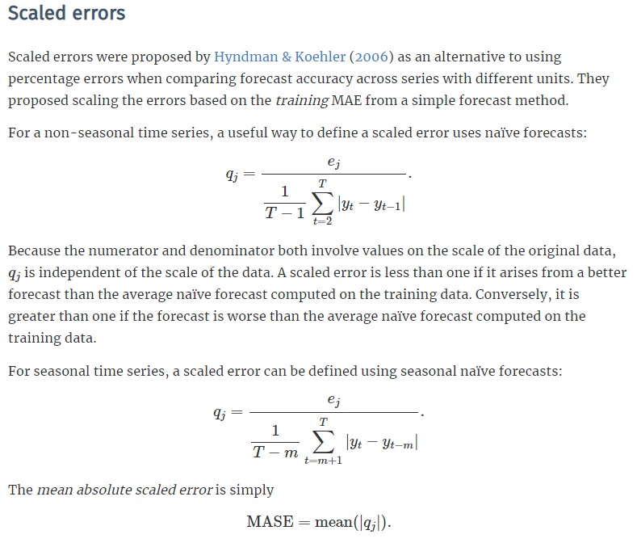
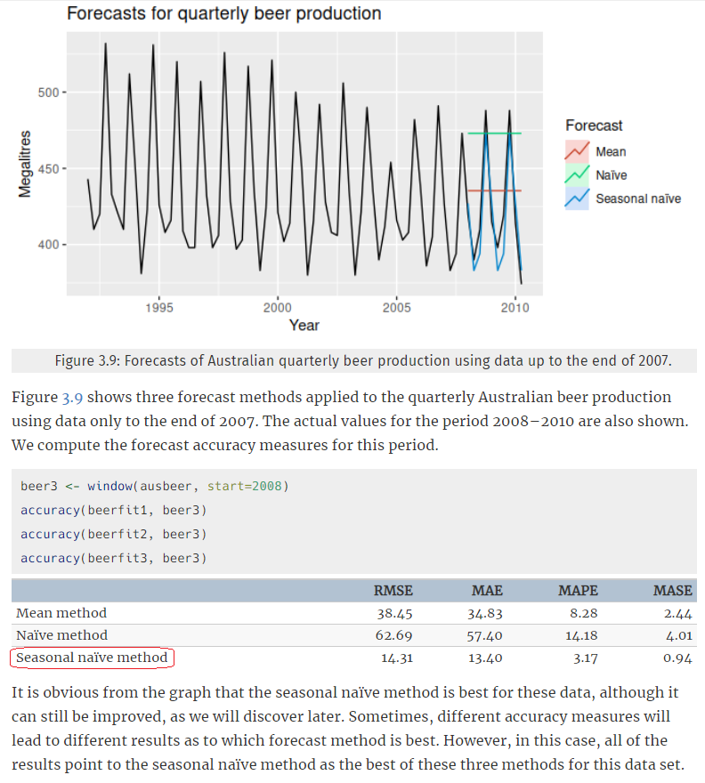
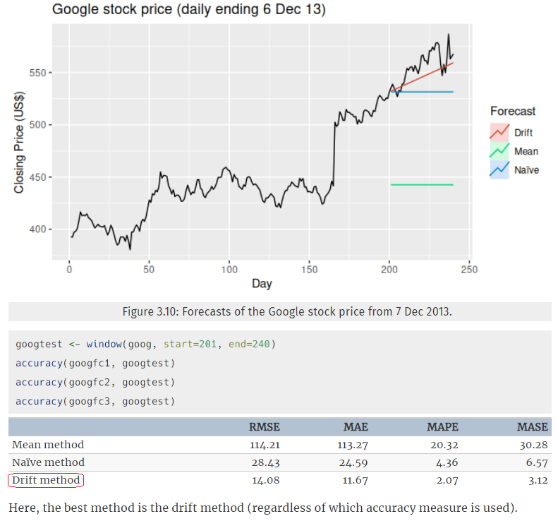

# Abstract

Due to below isseus from [<span style='color:goldenrod'>*Deriv.com - Interday High Frequency Trading Models Comparison</span> <span style='color:red'>**Blooper**</span>](https://rpubs.com/englianhu/binary-Q1Inter-HFT), here I review the researh by using same dataset.

- Weekly dataset `7200` mins forecast in advanced despite `Saturday` and `Sunday`.
- Use the dataset `data_m1` from `2015-01-05` to `2017-12-31`.
- Use `Close Price` to ease the workload and some errors (ex: OHLC abnor, NA price).

<span style='color:red'>**Load Packages**</span>

```{r, warning = FALSE, message = FALSE}
if(!suppressPackageStartupMessages(require('BBmisc'))) {
  install.packages('BBmisc', dependencies = TRUE, INSTALL_opts = '--no-lock')
}
suppressPackageStartupMessages(require('BBmisc'))
# suppressPackageStartupMessages(require('rmsfuns'))

pkgs <- c('devtools', 'knitr', 'kableExtra', 'tint', 'dygraphs', 
          'devtools','readr', 'lubridate', 'data.table', 'reprex', 
          'feather', 'purrr', 'quantmod', 'tidyquant', 'plotly', 
          'tibbletime', 'furrr', 'flyingfox', 'tidyr', 'jsonlite', 
          'timetk', 'plyr', 'dplyr', 'stringr', 'magrittr', 'tdplyr', 
          'tidyverse', 'memoise', 'htmltools', 'formattable', 'rbokeh', 
          'dash', 'dashCoreComponents', 'dashHtmlComponents', 'dtplyr', 
          ##https://dashr.plotly.com
          'zoo', 'forecast', 'seasonal', 'seasonalview', 'rjson', 
          'rugarch', 'rmgarch', 'mfGARCH', 'sparklyr', 'jcolors', 
          'microbenchmark', 'dendextend', 'lhmetools', 'ggthemr', 
          'stringr', 'pacman', 'profmem', 'DescTools', 'ggthemes', 
          'htmltools', 'echarts4r', 'viridis', 'hrbrthemes', 
          'fable', 'fabletools', 'Rfast', 'Metrics', 'MLmetrics')

## https://www.jianshu.com/p/4beb3d34ced2
#unlink('C:/Program Files/R/R-4.0.3/library/withr', recursive = TRUE)
#install.packages('withr', dependencies = TRUE, INSTALL_opts = '--no-lock')

# https://github.com/mpiktas/midasr
# https://github.com/onnokleen/mfGARCH
# devtools::install_github("business-science/tibbletime")
# devtools::install_github("DavisVaughan/furrr")

suppressAll(lib(pkgs))
# load_pkg(pkgs)

dtr <- 'C:/Users/User/Documents/GitHub/binary.com-interview-question-data/'

## Set the timezone but not change the datetime
Sys.setenv(TZ = 'Asia/Tokyo')
## options(knitr.table.format = 'html') will set all kableExtra tables to be 'html', otherwise need to set the parameter on every single table.
options(warn = -1, knitr.table.format = 'html')#, digits.secs = 6)

## https://stackoverflow.com/questions/39417003/long-vectors-not-supported-yet-abnor-in-rmd-but-not-in-r-script
knitr::opts_chunk$set(cache = TRUE, warning = FALSE, 
                      message = FALSE, cache.lazy = FALSE)

rm(pkgs)
```

<span style='color:red'>**Progress Function**</span>

```{r}
task_progress <- function(mbase, timeID0 = NULL, scs = 60, .pattern = '^mts|^sets', .loops = TRUE) {
  ## ------------- 定时查询进度 ----------------------
  ## 每分钟自动查询与更新以上模拟预测汇价进度（储存文件量）。
  require('magrittr')
  require('tibble')
  
  if(!is.data.frame(class(mbase))) { 
	mbase %<>% data.frame
  }
  
  if (.loops == TRUE) {
    while(1) {
      cat('Current Tokyo Time :', as.character(now('Asia/Tokyo')), '\n\n')
      
      y = as_date(mbase$index) %>% 
			unique
      y <- y[weekdays(y) != 'Saturday'] #filter and omit the weekly last price which is 12:00am on saturday
	    datee = y
	    
	    if(is.null(timeID0)) { 
		    timeID0 = y[1]
	    } else if (is.Date(timeID0)) { 
		    timeID0 = as_date(timeID0)
	    } else {
		    timeID0 = as_date(mbase$index) %>% 
		    unique
	    }
  	  
	    y = y[y >= timeID0]
      
      x = list.files(paste0(dtr, 'data/fx/USDJPY/'), pattern = .pattern) %>% 
	      str_replace_all('.rds', '') %>% 
		  str_replace_all('.201', '_201') %>% 
		  str_split_fixed('_', '2') %>% 
		  as_tibble %>% 
		  dplyr::rename('Model' = 'V1', 'Date' = 'V2') %>% 
		  dplyr::mutate(Model = factor(Model), Date = as_date(Date))
		
	  x = join(tibble(Date = datee), x) %>% 
		  as_tibble	  
	  x %<>% na.omit
	  
      x %<>% dplyr::mutate(binary = if_else(is.na(Model), 0, 1)) %>% 
		  spread(Model, binary)
      
      z <- ldply(x[,-1], function(zz) {
		  na.omit(zz) %>% length }) %>% 
		  dplyr::rename(x = V1) %>% 
		  dplyr::mutate(n = length(y), progress = percent(x/n))
      
      print(z)
      
      prg = sum(z$x)/sum(z$n)
      cat('\n================', as.character(percent(prg)), '================\n\n')
      
      if (prg == 1) break #倘若进度达到100%就停止更新。
      
      Sys.sleep(scs) #以上ldply()耗时3~5秒，而休息时间60秒。
    }
  } else {
    
    cat('Current Tokyo Time :', as.character(now('Asia/Tokyo')), '\n\n')
      
    
      y = as_date(mbase$index) %>% 
			unique
	  datee = y
		
	  if(is.null(timeID0)) { 
		  timeID0 = y[1]
	  } else if (is.Date(timeID0)) { 
		  timeID0 = as_date(timeID0)
	  } else {
		  timeID0 = as_date(mbase$index) %>% 
		  unique
	  }
	
	  y = y[y >= timeID0]
    
      x = list.files(paste0(dtr, 'data/fx/USDJPY/'), pattern = .pattern) %>% 
	      str_replace_all('.rds', '') %>% 
		  str_replace_all('.201', '_201') %>% 
		  str_split_fixed('_', '2') %>% 
		  as_tibble %>% 
		  dplyr::rename('Model' = 'V1', 'Date' = 'V2') %>% 
		  dplyr::mutate(Model = factor(Model), Date = as_date(Date))
		
	  x = join(tibble(Date = datee), x) %>% 
		  as_tibble
	  x %<>% na.omit
	  
      x %<>% dplyr::mutate(binary = if_else(is.na(Model), 0, 1)) %>% 
		  spread(Model, binary)
        
      z <- ldply(x[,-1], function(zz) {
		  na.omit(zz) %>% length }) %>% 
		  dplyr::rename(x = V1) %>% 
		  dplyr::mutate(n = length(y), progress = percent(x/n))
                
    print(z)
    
    prg = sum(z$x)/sum(z$n)
    cat('\n================', as.character(percent(prg)), '================\n\n')
    }
  }
```

# Introduction

Review the [<span style='color:goldenrod'>*Deriv.com - Interday High Frequency Trading Models Comparison</span> <span style='color:red'>**Blooper**</span>](https://rpubs.com/englianhu/binary-Q1Inter-HFT).

# Data

## Read Data

### Raw Data

```{r, warning = FALSE, message = FALSE, results = 'asis'}
data_m1 <- read_rds('C:/Users/User/Documents/GitHub/real-time-fxcm/data/USDJPY/data_m1.rds') %>% 
  data.table
data_m1 %<>% .[order(index)]

## plot sample data
data_m1[c(1:3, (nrow(data_m1)-3):nrow(data_m1)),] %>% 
  kbl('html', caption = '1 min Raw Dataset', escape = FALSE) %>% 
  ## https://www.w3schools.com/cssref/css_colors.asp
  row_spec(0, background = 'DimGrey') %>% 
  column_spec(1, background = 'CornflowerBlue') %>% 
  column_spec(2, background = 'DarkGrey') %>% 
  column_spec(3, background = 'LightSlateGrey') %>% 
  column_spec(4, background = 'LightGray', color = 'goldenrod') %>% 
  column_spec(5, background = 'Gainsboro', color = 'goldenrod') %>% 
  column_spec(6, background = 'LightGray', color = 'goldenrod') %>% 
  column_spec(7, background = 'Gainsboro', color = 'goldenrod') %>% 
  column_spec(8, background = 'LightGray', color = 'goldenrod') %>% 
  column_spec(9, background = 'Gainsboro', color = 'goldenrod') %>% 
  column_spec(10, background = 'LightGray', color = 'goldenrod') %>% 
  column_spec(11, background = 'Gainsboro', color = 'goldenrod') %>% 
  kable_styling(bootstrap_options = c('striped', 'hover', 'condensed', 'responsive')) %>% 
  kable_material(full_width = FALSE) %>% ##`full_width = FALSE` will auto adjust every single columns width to fit the table full width.
  scroll_box(width = '100%', fixed_thead = TRUE, height = '400px')
```

*source : `r paste0(dim(data_m1), collapse = ' x ')`*

As we can know there has few errors from [<span style='color:goldenrod'>*Deriv.com - Interday High Frequency Trading Models Comparison</span> <span style='color:red'>**Blooper**</span>](https://rpubs.com/englianhu/binary-Q1Inter-HFT):

- open price higher than highest price
- open price lower than lowest price
- close price higher than highest price
- close price lower than lowest price

### OHLC Data

Convert to OHLC data as we know from [<span style='color:goldenrod'>*Deriv.com - Interday High Frequency Trading Models Comparison</span> <span style='color:red'>**Blooper**</span>](https://rpubs.com/englianhu/binary-Q1Inter-HFT).

```{r, warning = FALSE, message = FALSE, results = 'asis'}
if(names(data_m1) %>% str_detect('Bid|Ask') %>% any()) {
  dsmp <- data_m1[,{
    open = (BidOpen + AskOpen)/2 
    high = (BidHigh + AskHigh)/2 
    low = (BidLow + AskLow)/2 
    close = (BidClose + AskClose)/2
    .SD[,.(index = index, year = year, week = week, 
           open = open, high = high, low = low, close = close), ]}, ]
}

## plot sample data
dsmp[c(1:3, (nrow(dsmp)-3):nrow(dsmp)),] %>% 
  kbl('html', caption = '1 min OHLC Dataset', escape = FALSE) %>% 
  ## https://www.w3schools.com/cssref/css_colors.asp
  row_spec(0, background = 'DimGrey') %>% 
  column_spec(1, background = 'CornflowerBlue') %>% 
  column_spec(2, background = 'DarkGrey') %>% 
  column_spec(3, background = 'LightSlateGrey') %>% 
  column_spec(4, background = 'LightGray', color = 'goldenrod') %>% 
  column_spec(5, background = 'Gainsboro', color = 'goldenrod') %>% 
  column_spec(6, background = 'LightGray', color = 'goldenrod') %>% 
  column_spec(7, background = 'Gainsboro', color = 'goldenrod') %>% 
  kable_styling(bootstrap_options = c('striped', 'hover', 'condensed', 'responsive')) %>% 
  kable_material(full_width = FALSE) %>% ##`full_width = FALSE` will auto adjust every single columns width to fit the table full width.
  scroll_box(width = '100%', fixed_thead = TRUE, height = '400px')
```

*source : `r paste0(dim(dsmp), collapse = ' x ')`*

## Data Cleaning

```{r, warning = FALSE, message = FALSE, results = 'asis'}
dsmp <- dsmp[,{
  quarter = quarter(index)
  month = month(index)
  wkdays = weekdays(index)
  wk_1m = 1:7200
  dy_1m = 1:1440
  hr_1m = 1:60
  date = as_date(index)
  .SD[,.(index = index, year = year, quarter = quarter, 
         month = month, week = week, wkdays = wkdays, 
         wk_1m = wk_1m, dy_1m = dy_1m, hr_1m = hr_1m, 
         sq = 1:.N, date = date, close = close), ]}, ]
```

```{r, warning = FALSE, message = FALSE, results = 'asis'}
## plot sample data
dsmp[c(1:3, (nrow(dsmp)-3):nrow(dsmp)),] %>% 
  kbl('html', caption = '1 min Close Price Dataset', escape = FALSE) %>% 
  ## https://www.w3schools.com/cssref/css_colors.asp
  ## https://public.tableau.com/en-us/gallery/100-color-palettes?gallery=votd
  row_spec(0, background = 'DimGrey', color = 'gold', bold = TRUE) %>% 
  column_spec(1, background = 'CornflowerBlue') %>% 
  column_spec(2, background = 'Gray') %>% 
  column_spec(3, background = 'DarkGrey') %>% 
  column_spec(4, background = 'Gray') %>% 
  column_spec(5, background = 'DarkGrey') %>% 
  column_spec(6, background = '#4897D8') %>% 
  column_spec(7, background = '#556DAC') %>% 
  column_spec(8, background = '#92AAC7') %>% 
  column_spec(9, background = '#556DAC') %>% 
  column_spec(10, background = '#375E97') %>% 
  column_spec(11, background = 'CornflowerBlue') %>% 
  column_spec(12, background = 'LightGray', color = 'goldenrod') %>% 
  kable_styling(bootstrap_options = c('striped', 'hover', 'condensed', 'responsive')) %>% 
  kable_material(full_width = FALSE) %>% ##`full_width = FALSE` will auto adjust every single columns width to fit the table full width.
  scroll_box(width = '100%', fixed_thead = TRUE, height = '400px')
```

*source : `r paste0(dim(dsmp), collapse = ' x ')`*

```{r, warning = FALSE, message = FALSE, results = 'asis'}
## Below codes list out all Tuesday to Sunday data details.
# data_abn <- dsmp[wkdays %chin% 'Saturday' & !str_detect(index, '00:00:00') | wkdays %chin% 'Sunday']$date_1m
# date_abn2 <- date_abn[1:length(date_abn) %% 2 == 0]
## --------------------------------------------
date_abn <- dsmp[wkdays %chin% 'Sunday']$date_1m %>% 
  unique
date_abn_seq <- llply(date_abn, function(dte) 
  as.character(seq(dte - days(6), dte, by = 'day'))) %>% 
  unlist %>% 
  as_date

rm(date_abn, date_abn2)
data_abn <- dsmp[date_1m %in% date_abn_seq]

## plot sample data
data_abn[c(1:3, (nrow(data_abn)-3):nrow(data_abn)),] %>% 
  kbl('html', caption = '1 min Close Price Dataset (abnor : Tuesday - Sunday)', escape = FALSE) %>% 
  ## https://www.w3schools.com/cssref/css_colors.asp
  row_spec(0, background = 'DimGrey') %>% 
  column_spec(1, background = 'CornflowerBlue') %>% 
  column_spec(2, background = 'DarkGrey') %>% 
  column_spec(3, background = 'LightSlateGrey') %>% 
  column_spec(4, background = '#4E79A7') %>% 
  column_spec(5, background = 'LightSlateGrey') %>% 
  column_spec(6, background = 'CornflowerBlue') %>% 
  column_spec(7, background = '#4E79A7') %>% 
  column_spec(8, background = 'LightGray', color = 'goldenrod') %>% 
  kable_styling(bootstrap_options = c('striped', 'hover', 'condensed', 'responsive')) %>% 
  kable_material(full_width = FALSE) %>% ##`full_width = FALSE` will auto adjust every single columns width to fit the table full width.
  scroll_box(width = '100%', fixed_thead = TRUE, height = '400px')
```

There has transactions in from *Tuesday (12:01AM)* to *Sunday (12:00AM)* as we can know from above and below.

```{r, eval = FALSE, warning = FALSE, message = FALSE}
## -------------------- eval = FALSE --------------------
matrix(weekdays(unique(as_date(dsmp$index))), ncol = 6, byrow = TRUE)
[104,] "Tuesday" "Wednesday" "Thursday"  "Friday"   "Saturday" "Sunday"  
[105,] "Tuesday" "Wednesday" "Thursday"  "Friday"   "Saturday" "Sunday"
...
[156,] "Tuesday" "Wednesday" "Thursday"  "Friday"   "Saturday" "Sunday" 
[157,] "Tuesday" "Wednesday" "Thursday"  "Friday"   "Saturday" "Sunday"
```

There has 2 weeks abnormal data (`r paste(date_abn_seq[c(1,(length(date_abn_seq)/2))], collapse = ' to ')` and `r paste(date_abn_seq[c(((length(date_abn_seq)/2)+1),length(date_abn_seq))], collapse = ' to ')`).

There might probably because of Christmas to postpone 1 day, here I forecast `7200` trading datetime in advanced despite the date and weekdays. Every forecast price will base on the out of sample date. There will no any effects .

```{r, warning = FALSE, message = FALSE}
## check if data path set
if(!exists('dtr')) {
  dtr <- 'C:/Users/User/Documents/GitHub/binary.com-interview-question-data/'}

## save files if not exists
if(!file.exists(paste0(dtr, 'data/fx/USDJPY/dsmp.rds')) & exists('dsmp')) {
  saveRDS(dsmp, paste0(dtr, 'data/fx/USDJPY/dsmp.rds'))}

## read files if not exists
if(!exists('dsmp')) {
  dsmp <- readRDS(paste0(dtr, 'data/fx/USDJPY/dsmp.rds'))}
```

# Modelling

Due to I have annually length dataset, here I start my 1st forecast date from 1st trading datetime of 2016 (`r dsmp)[year == 2016]$date_1m[1]` which is 2nd year in dataset).

## Seasonal `ts()`

### Daily Seasonal Data

#### Seasonal Data Modeling

I set the length of data as weekly (`7200` minutes which is 5 trading days) to forecast `1440` minutes (`1440` minutes is a trading day).

[*Chapter 7 Multivariate TS Analysis* in **Introduction to Time Series Analysis and Forecasting in R**](https://bookdown.org/singh_pratap_tejendra/intro_time_series_r/multivariate-ts-analysis.html), but I use univariate due to some errors as mentioned in beginning.

I tried to use `weeks(1)`, `months(3)`, `years(1)` but there is not constant observations, we can refer to [`The seasonal period`](https://otexts.com/fpp3/tsibble-objects.html).

Here I filter up the data as below :

- `5 days * 1440 mins = 7200 mins` = weekly
- `22 days * 1440 mins = 31680 mins` = monthly
- `3 months * 22 days * 1440 mins = 95040 mins` = quarterly
- `52 weeks * 5 days * 1440 mins = 374400 mins` = yearly

```{r, warning = FALSE, message = FALSE, results = 'asis'}
timeID <- unique(dsmp$date)
bse <- dsmp[year == 2016]$date[1] #"2016-01-04" #1st trading date in 2nd year
timeID %<>% .[. >= bse]
#timeID %<>% .[. >= as_date('2016-01-04')]
data_len <- 7200 #last 7200  observations dsmp[(.N - (data_len - 1)):.N]
hrz1 <- 1440

for (i in c(1, 6:8, length(timeID) - 1, length(timeID))) { #Here I print 8 elements as examples
  
  if(i == 1) {
    
    cat('\n')
    cat('===========================================\n')
    cat('train[', i, ']\n')
    print(train <- dsmp[date < timeID[i]][(.N - (data_len - 1)):.N])
    ctr <- train$sq[1]:(range(train$sq)[2] + hrz1)
    
    cat('\n')
    cat('-------------------------------------------\n')
    cat('train_test[', i, ']\n')
    
    print(train_test <- dsmp[sq %in% ctr])
    
    sets <- train[, .(index, close)] %>% 
      tk_ts(frequency = hrz1) %>% 
      forecast(h = hrz1) %>% 
      tk_tbl %>% 
	    dplyr::mutate(index = train_test[(.N - hrz1 + 1):.N,]$index, 
	                  mk.price = train_test[(.N - hrz1 + 1):.N,]$close) %>% 
      dplyr::rename(fc.price = `Point Forecast`) %>% 
      dplyr::select(index, mk.price, fc.price)
    
    cat('\n')
    cat('-------------------------------------------\n')
    cat('forecast[', i, ']\n')
    
    print(sets %>% as.data.table)
    
    saveRDS(sets, paste0(
      dtr, 'data/fx/USDJPY/ts_', data_len, '_', hrz1, '.', 
      as_date(sets$index[1]), '.rds'))

    cat('\n')
    cat(i, '=', paste0('~/data/fx/USDJPY/ts_', data_len, '_', hrz1, '.', 
                       as_date(sets$index[1]), '.rds saved!\n'))
    cat('\n\n')
    
  } else if(i %in% seq(1, length(timeID), by = 6)[-1]) {
    
    
  } else if(i == length(timeID)) {
    
    
  } else  {
    
    lst_sq <- dsmp[date < timeID[i],][.N]$sq + 1
    
    cat('\n')
    cat('===========================================\n')
    cat('train[', i, ']\n')
    
    print(train <- dsmp[(lst_sq - data_len + 1):lst_sq])
    ctr <- train$sq[1]:(range(train$sq)[2] + hrz1)
    
    cat('\n')
    cat('-------------------------------------------\n')
    cat('train_test[', i, ']\n')
    
    print(train_test <- dsmp[sq %in% ctr])
    
    sets <- train[, .(index, close)] %>% 
      tk_ts(frequency = hrz1) %>% 
      forecast(h = hrz1) %>% 
      tk_tbl %>% 
      dplyr::mutate(index = train_test[(.N - hrz1 + 1):.N,]$index, 
                    mk.price = train_test[(.N - hrz1 + 1):.N,]$close) %>% 
      dplyr::rename(fc.price = `Point Forecast`) %>% 
      dplyr::select(index, mk.price, fc.price)
    
    cat('\n')
    cat('-------------------------------------------\n')
    cat('forecast[', i, ']\n')
    
    print(sets %>% as.data.table)
    
    saveRDS(sets, paste0(
      dtr, 'data/fx/USDJPY/ts_', data_len, '_', hrz1, '.', 
      as_date(sets$index[1]), '.rds'))

    cat('\n')
    cat(i, '=', paste0('~/data/fx/USDJPY/ts_', data_len, '_', hrz1, '.', 
                       as_date(sets$index[1]), '.rds saved!\n'))
    cat('\n\n')
    
  }
}
```

#### Wk >> Dy

I set the length of data as weekly (`5 days * 1440 mins = 7200 mins` minutes which is 5 trading days) to forecast `1440` minutes (`1440` minutes is a trading day).

```{r, eval = FALSE}
# --------- eval=FALSE ---------
timeID <- unique(dsmp$date)
bse <- dsmp[year == 2016]$date[1] #"2016-01-04" #1st trading date in 2nd year
timeID %<>% .[. >= bse]
#timeID %<>% .[. >= as_date('2016-01-04')]
data_len <- 7200 #last 7200  observations dsmp[(.N - (data_len - 1)):.N]
hrz1 <- 1440

for (i in 1:length(timeID)) {

  if(i == 1) {
    
    cat('\n')
    cat('===========================================\n')
    cat('train[', i, ']\n')
    print(train <- dsmp[date < timeID[i]][(.N - (data_len - 1)):.N])
    ctr <- train$sq[1]:(range(train$sq)[2] + hrz1)
    
    cat('\n')
    cat('-------------------------------------------\n')
    cat('train_test[', i, ']\n')
    
    print(train_test <- dsmp[sq %in% ctr])
    
    sets <- train[, .(index, close)] %>% 
      tk_ts(frequency = hrz1) %>% 
      forecast(h = hrz1) %>% 
      tk_tbl %>% 
	    dplyr::mutate(index = train_test[(.N - hrz1 + 1):.N,]$index, 
	                  mk.price = train_test[(.N - hrz1 + 1):.N,]$close) %>% 
      dplyr::rename(fc.price = `Point Forecast`) %>% 
      dplyr::select(index, mk.price, fc.price)
    
    cat('\n')
    cat('-------------------------------------------\n')
    cat('forecast[', i, ']\n')
    
    print(sets %>% as.data.table)
    
    saveRDS(sets, paste0(
      dtr, 'data/fx/USDJPY/ts_', data_len, '_', hrz1, '.', 
      as_date(sets$index[1]), '.rds'))

    cat('\n')
    cat(i, '=', paste0('~/data/fx/USDJPY/ts_', data_len, '_', hrz1, '.', 
                       as_date(sets$index[1]), '.rds saved!\n'))
    cat('\n\n')
    
  } else if(i %in% seq(1, length(timeID), by = 6)[-1]) {
    
    
  } else if(i == length(timeID)) {
    
    
  } else  {
    
    lst_sq <- dsmp[date < timeID[i],][.N]$sq + 1
    
    cat('\n')
    cat('===========================================\n')
    cat('train[', i, ']\n')
    
    print(train <- dsmp[(lst_sq - data_len + 1):lst_sq])
    ctr <- train$sq[1]:(range(train$sq)[2] + hrz1)
    
    cat('\n')
    cat('-------------------------------------------\n')
    cat('train_test[', i, ']\n')
    
    print(train_test <- dsmp[sq %in% ctr])
    
    sets <- train[, .(index, close)] %>% 
      tk_ts(frequency = hrz1) %>% 
      forecast(h = hrz1) %>% 
      tk_tbl %>% 
      dplyr::mutate(index = train_test[(.N - hrz1 + 1):.N,]$index, 
                    mk.price = train_test[(.N - hrz1 + 1):.N,]$close) %>% 
      dplyr::rename(fc.price = `Point Forecast`) %>% 
      dplyr::select(index, mk.price, fc.price)
    
    cat('\n')
    cat('-------------------------------------------\n')
    cat('forecast[', i, ']\n')
    
    print(sets %>% as.data.table)
    
    saveRDS(sets, paste0(
      dtr, 'data/fx/USDJPY/ts', data_len, '_', hrz1, '.', 
      as_date(sets$index[1]), '.rds'))
    
    cat('\n')
    cat(i, '=', paste0('~/data/fx/USDJPY/ts_', data_len, '_', hrz1, '.', 
                       as_date(sets$index[1]), '.rds saved!\n'))
    cat('\n\n')
  }
}
```

#### Mn >> Dy

I set the length of data as monthly (`22 days * 1440 mins = 31680 mins` minutes which is 22 trading days) to forecast `1440` minutes (`1440` minutes is a trading day).

```{r, eval = FALSE}
# --------- eval=FALSE ---------
timeID <- unique(dsmp$date)
bse <- dsmp[year == 2016]$date[1] #"2016-01-04" #1st trading date in 2nd year
timeID %<>% .[. >= bse]
#timeID %<>% .[. >= as_date('2016-01-04')]
data_len <- 22 * 1440 #last 31680  observations dsmp[(.N - (data_len - 1)):.N]
hrz1 <- 1440

for (i in 1:length(timeID)) {
  
  if(i == 1) {
    
    cat('\n')
    cat('===========================================\n')
    train <- dsmp[date < timeID[i]][(.N - (data_len - 1)):.N]
    ctr <- train$sq[1]:(range(train$sq)[2] + hrz1)
    train_test <- dsmp[sq %in% ctr]
    
    sets <- train[, .(index, close)] %>% 
      tk_ts(frequency = hrz1) %>% 
      forecast(h = hrz1) %>% 
      tk_tbl %>% 
	    dplyr::mutate(index = train_test[(.N - hrz1 + 1):.N,]$index, 
	                  mk.price = train_test[(.N - hrz1 + 1):.N,]$close) %>% 
      dplyr::rename(fc.price = `Point Forecast`) %>% 
      dplyr::select(index, mk.price, fc.price)
    
    saveRDS(sets, paste0(
      dtr, 'data/fx/USDJPY/ts_', data_len, '_', hrz1, '.', 
      as_date(sets$index[1]), '.rds'))

    cat(i, '=', paste0('~/data/fx/USDJPY/ts', data_len, '_', hrz1, '.', 
                       as_date(sets$index[1]), '.rds saved!\n'))

  } else if(i %in% seq(1, length(timeID), by = 6)[-1]) {
    
    
  } else if(i == length(timeID)) {
    
    
  } else  {
    
    lst_sq <- dsmp[date < timeID[i],][.N]$sq + 1
    train <- dsmp[(lst_sq - data_len + 1):lst_sq]
    ctr <- train$sq[1]:(range(train$sq)[2] + hrz1)
    train_test <- dsmp[sq %in% ctr]
    
    sets <- train[, .(index, close)] %>% 
      tk_ts(frequency = hrz1) %>% 
      forecast(h = hrz1) %>% 
      tk_tbl %>% 
      dplyr::mutate(index = train_test[(.N - hrz1 + 1):.N,]$index, 
                    mk.price = train_test[(.N - hrz1 + 1):.N,]$close) %>% 
      dplyr::rename(fc.price = `Point Forecast`) %>% 
      dplyr::select(index, mk.price, fc.price)
    
    saveRDS(sets, paste0(
      dtr, 'data/fx/USDJPY/ts_', data_len, '_', hrz1, '.', 
      as_date(sets$index[1]), '.rds'))
    
    cat(i, '=', paste0('~/data/fx/USDJPY/ts_', data_len, '_', hrz1, '.', 
                       as_date(sets$index[1]), '.rds saved!\n'))
  }
}
```

#### Qt >> Dy

I set the length of data as quarterly (`3 months * 22 days * 1440 mins = 95040 mins` minutes which is 66 trading days) to forecast `1440` minutes (`1440` minutes is a trading day).

```{r, eval = FALSE}
# --------- eval=FALSE ---------
timeID <- unique(dsmp$date)
bse <- dsmp[year == 2016]$date[1] #"2016-01-04" #1st trading date in 2nd year
timeID %<>% .[. >= bse]
#timeID %<>% .[. >= as_date('2016-01-04')]
data_len <- 3 * 22 * 1440 #last 95040  observations dsmp[(.N - (data_len - 1)):.N]
hrz1 <- 1440

for (i in 1:length(timeID)) {
  
  if(i == 1) {
    
    cat('\n')
    cat('===========================================\n')
    train <- dsmp[date < timeID[i]][(.N - (data_len - 1)):.N]
    ctr <- train$sq[1]:(range(train$sq)[2] + hrz1)
    train_test <- dsmp[sq %in% ctr]
    
    sets <- train[, .(index, close)] %>% 
      tk_ts(frequency = hrz1) %>% 
      forecast(h = hrz1) %>% 
      tk_tbl %>% 
	    dplyr::mutate(index = train_test[(.N - hrz1 + 1):.N,]$index, 
	                  mk.price = train_test[(.N - hrz1 + 1):.N,]$close) %>% 
      dplyr::rename(fc.price = `Point Forecast`) %>% 
      dplyr::select(index, mk.price, fc.price)
    
    saveRDS(sets, paste0(
      dtr, 'data/fx/USDJPY/ts_', data_len, '_', hrz1, '.', 
      as_date(sets$index[1]), '.rds'))

    cat(i, '=', paste0('~/data/fx/USDJPY/ts_', data_len, '_', hrz1, '.', 
                       as_date(sets$index[1]), '.rds saved!\n'))

  } else if(i %in% seq(1, length(timeID), by = 6)[-1]) {
    
    
  } else if(i == length(timeID)) {
    
    
  } else  {
    
    lst_sq <- dsmp[date < timeID[i],][.N]$sq + 1
    train <- dsmp[(lst_sq - data_len + 1):lst_sq]
    ctr <- train$sq[1]:(range(train$sq)[2] + hrz1)
    train_test <- dsmp[sq %in% ctr]
    
    sets <- train[, .(index, close)] %>% 
      tk_ts(frequency = hrz1) %>% 
      forecast(h = hrz1) %>% 
      tk_tbl %>% 
      dplyr::mutate(index = train_test[(.N - hrz1 + 1):.N,]$index, 
                    mk.price = train_test[(.N - hrz1 + 1):.N,]$close) %>% 
      dplyr::rename(fc.price = `Point Forecast`) %>% 
      dplyr::select(index, mk.price, fc.price)
    
    saveRDS(sets, paste0(
      dtr, 'data/fx/USDJPY/ts_', data_len, '_', hrz1, '.', 
      as_date(sets$index[1]), '.rds'))
    
    cat(i, '=', paste0('~/data/fx/USDJPY/ts_', data_len, '_', hrz1, '.', 
                       as_date(sets$index[1]), '.rds saved!\n'))
  }
}
```

#### Yr >> Dy

I set the length of data as quarterly (`52 weeks * 5 days * 1440 mins = 374400 mins` minutes which is 260 trading days) to forecast `1440` minutes (`1440` minutes is a trading day).

```{r, eval = FALSE}
# --------- eval=FALSE ---------
timeID <- unique(dsmp$date)
bse <- dsmp[year == 2016]$date[1] #"2016-01-04" #1st trading date in 2nd year
timeID %<>% .[. >= bse]
#timeID %<>% .[. >= as_date('2016-01-04')]
data_len <- 52 * 5 * 1440 #last 374400  observations dsmp[(.N - (data_len - 1)):.N]
hrz1 <- 1440

for (i in 1:length(timeID)) {
  
  if(i == 1) {
    
    cat('\n')
    cat('===========================================\n')
    train <- dsmp[date < timeID[i]][(.N - (data_len - 1)):.N]
    ctr <- train$sq[1]:(range(train$sq)[2] + hrz1)
    train_test <- dsmp[sq %in% ctr]
    
    sets <- train[, .(index, close)] %>% 
      tk_ts(frequency = hrz1) %>% 
      forecast(h = hrz1) %>% 
      tk_tbl %>% 
	    dplyr::mutate(index = train_test[(.N - hrz1 + 1):.N,]$index, 
	                  mk.price = train_test[(.N - hrz1 + 1):.N,]$close) %>% 
      dplyr::rename(fc.price = `Point Forecast`) %>% 
      dplyr::select(index, mk.price, fc.price)
    
    saveRDS(sets, paste0(
      dtr, 'data/fx/USDJPY/ts_', data_len, '_', hrz1, '.', 
      as_date(sets$index[1]), '.rds'))
    
    cat(i, '=', paste0('~/data/fx/USDJPY/ts_', data_len, '_', hrz1, '.', 
                       as_date(sets$index[1]), '.rds saved!\n'))
  
  } else if(i %in% seq(1, length(timeID), by = 6)[-1]) {
    
    
  } else if(i == length(timeID)) {
    
    
  } else  {
    
    lst_sq <- dsmp[date < timeID[i],][.N]$sq + 1
    train <- dsmp[(lst_sq - data_len + 1):lst_sq]
    ctr <- train$sq[1]:(range(train$sq)[2] + hrz1)
    train_test <- dsmp[sq %in% ctr]
    
    sets <- train[, .(index, close)] %>% 
      tk_ts(frequency = hrz1) %>% 
      forecast(h = hrz1) %>% 
      tk_tbl %>% 
      dplyr::mutate(index = train_test[(.N - hrz1 + 1):.N,]$index, 
                    mk.price = train_test[(.N - hrz1 + 1):.N,]$close) %>% 
      dplyr::rename(fc.price = `Point Forecast`) %>% 
      dplyr::select(index, mk.price, fc.price)
    
    saveRDS(sets, paste0(
      dtr, 'data/fx/USDJPY/ts_', data_len, '_', hrz1, '.', 
      as_date(sets$index[1]), '.rds'))
    
    cat(i, '=', paste0('~/data/fx/USDJPY/ts_', data_len, '_', hrz1, '.', 
                       as_date(sets$index[1]), '.rds saved!\n'))
  }
}
```

### Weekly Seasonal Data

#### Wk >> Wk

I set the length of data as weekly (`5 days * 1440 mins = 7200 mins` minutes which is 22 trading days) to forecast `7200` minutes (`7200` minutes is 5 trading day).

```{r, eval = FALSE}
# --------- eval=FALSE ---------
timeID <- unique(dsmp$date)
bse <- dsmp[year == 2016]$date[1] #"2016-01-04" #1st trading date in 2nd year
timeID %<>% .[. >= bse]
#timeID %<>% .[. >= as_date('2016-01-04')]
data_len <- 7200 #last 7200  observations dsmp[(.N - (data_len - 1)):.N]
hrz1 <- 7200
hrz2 <- 1440

for (i in 1:length(timeID)) {
  
  if(i == 1) {
    
    cat('\n')
    cat('===========================================\n')
    cat('train[', i, ']\n')
    print(train <- dsmp[date < timeID[i]][(.N - (data_len - 1)):.N])
    ctr <- train$sq[1]:(range(train$sq)[2] + hrz1)
    
    cat('\n')
    cat('-------------------------------------------\n')
    cat('train_test[', i, ']\n')
    
    print(train_test <- dsmp[sq %in% ctr])
    
    sets <- train[, .(index, close)] %>% 
      tk_ts(frequency = hrz1) %>% 
      forecast(h = hrz1) %>% 
      tk_tbl %>% 
	    dplyr::mutate(index = train_test[(.N - hrz1 + 1):.N,]$index, 
	                  mk.price = train_test[(.N - hrz1 + 1):.N,]$close) %>% 
      dplyr::rename(fc.price = `Point Forecast`) %>% 
      dplyr::select(index, mk.price, fc.price)
    
    cat('\n')
    cat('-------------------------------------------\n')
    cat('forecast[', i, ']\n')
    
    print(sets %>% as.data.table)
    
    saveRDS(sets, paste0(
      dtr, 'data/fx/USDJPY/ts_', data_len, '_', hrz1, '.', 
      as_date(sets$index[1]), '.rds'))

    cat('\n')
    cat(i, '=', paste0('~/data/fx/USDJPY/ts_', data_len, '_', hrz1, '.', 
                       as_date(sets$index[1]), '.rds saved!\n'))
    cat('\n\n')
    
  } else if(i > (length(timeID) - hrz1/hrz2) & i != length(timeID)) {
    
    lst_sq <- dsmp[date < timeID[i],][.N]$sq + 1
    ## filter the length of forecasted data to fit with train_test data 
    ##   when the length of forecasted data more then length of test data.
    #lst_date <- timeID[(length(timeID) - (hrz1/hrz2)):length(timeID)]
    lst_date <- timeID[timeID >= timeID[i]]
    lst_date_sq <- grep(
      timeID[i], timeID[(length(timeID) - (hrz1/hrz2 - 1)):length(timeID)])
    
    cat('\n')
    cat('===========================================\n')
    cat('train[', i, ']\n')
    
    print(train <- dsmp[(lst_sq - data_len + 1):lst_sq])
    ctr <- train$sq[1]:(range(train$sq)[2] + hrz1)
    
    cat('\n')
    cat('-------------------------------------------\n')
    cat('train_test[', i, ']\n')
    
    print(train_test <- dsmp[sq %in% ctr])
    
    sets <- train[, .(index, close)] %>% 
      tk_ts(frequency = hrz1) %>% 
      forecast(h = hrz1) %>% 
      tk_tbl
    
    sets <- sets[1:(hrz1 - (hrz2 * lst_date_sq)),] %>% 
      dplyr::mutate(index = train_test[
        (.N - (hrz1 - (hrz2 * lst_date_sq)) + 1):.N, ]$index, 
        mk.price = train_test[
          (.N - (hrz1 - (hrz2 * lst_date_sq)) + 1):.N, ]$close) %>% 
      dplyr::rename(fc.price = `Point Forecast`) %>% 
      dplyr::select(index, mk.price, fc.price)
    
    cat('\n')
    cat('-------------------------------------------\n')
    cat('forecast[', i, ']\n')
    
    print(sets %>% as.data.table)
    
    saveRDS(sets, paste0(
      dtr, 'data/fx/USDJPY/ts_', data_len, '_', hrz1, '.', 
      as_date(sets$index[1]), '.rds'))
    
    cat('\n')
    cat(i, '=', paste0('~/data/fx/USDJPY/ts_', data_len, '_', hrz1, '.', 
                       as_date(sets$index[1]), '.rds saved!\n'))
    cat('\n\n')    
	
  } else if(i %in% seq(1, length(timeID), by = 6)[-1]) {
    
    
  } else if(i == length(timeID)) {
    
    
  } else {
    
    lst_sq <- dsmp[date < timeID[i],][.N]$sq + 1
    
    cat('\n')
    cat('===========================================\n')
    cat('train[', i, ']\n')
    
    print(train <- dsmp[(lst_sq - data_len + 1):lst_sq])
    ctr <- train$sq[1]:(range(train$sq)[2] + hrz1)
    
    cat('\n')
    cat('-------------------------------------------\n')
    cat('train_test[', i, ']\n')
    
    print(train_test <- dsmp[sq %in% ctr])
    
    sets <- train[, .(index, close)] %>% 
      tk_ts(frequency = hrz1) %>% 
      forecast(h = hrz1) %>% 
      tk_tbl %>% 
      dplyr::mutate(index = train_test[(.N - hrz1 + 1):.N,]$index, 
                    mk.price = train_test[(.N - hrz1 + 1):.N,]$close) %>% 
      dplyr::rename(fc.price = `Point Forecast`) %>% 
      dplyr::select(index, mk.price, fc.price)
    
    cat('\n')
    cat('-------------------------------------------\n')
    cat('forecast[', i, ']\n')
    
    print(sets %>% as.data.table)
    
    saveRDS(sets, paste0(
      dtr, 'data/fx/USDJPY/ts_', data_len, '_', hrz1, '.', 
      as_date(sets$index[1]), '.rds'))
    
    cat('\n')
    cat(i, '=', paste0('~/data/fx/USDJPY/ts_', data_len, '_', hrz1, '.', 
                       as_date(sets$index[1]), '.rds saved!\n'))
    cat('\n\n')
  }
}
```

#### Mn >> Wk

I set the length of data as monthly (`22 days * 1440 mins = 31680 mins` minutes which is 22 trading days) to forecast `7200` minutes (`7200` minutes is 5 trading day).

```{r, eval = FALSE}
# --------- eval=FALSE ---------
timeID <- unique(dsmp$date)
bse <- dsmp[year == 2016]$date[1] #"2016-01-04" #1st trading date in 2nd year
timeID %<>% .[. >= bse]
#timeID %<>% .[. >= as_date('2016-01-04')]
data_len <- 22 * 1440 #last 31680  observations dsmp[(.N - (data_len - 1)):.N]
hrz1 <- 7200
hrz2 <- 1440

for (i in 1:length(timeID)) {
  
  if(i == 1) {
    
    cat('\n')
    cat('===========================================\n')
    train <- dsmp[date < timeID[i]][(.N - (data_len - 1)):.N]
    ctr <- train$sq[1]:(range(train$sq)[2] + hrz1)
    train_test <- dsmp[sq %in% ctr]
    
    sets <- train[, .(index, close)] %>% 
      tk_ts(frequency = hrz1) %>% 
      forecast(h = hrz1) %>% 
      tk_tbl %>% 
	    dplyr::mutate(index = train_test[(.N - hrz1 + 1):.N,]$index, 
	                  mk.price = train_test[(.N - hrz1 + 1):.N,]$close) %>% 
      dplyr::rename(fc.price = `Point Forecast`) %>% 
      dplyr::select(index, mk.price, fc.price)
    
    saveRDS(sets, paste0(
      dtr, 'data/fx/USDJPY/ts_', data_len, '_', hrz1, '.', 
      as_date(sets$index[1]), '.rds'))
    
    cat(i, '=', paste0('~/data/fx/USDJPY/ts_', data_len, '_', hrz1, '.', 
                       as_date(sets$index[1]), '.rds saved!\n'))
    
  } else if(i > (length(timeID) - hrz1/hrz2) & i != length(timeID)) {
    
    lst_sq <- dsmp[date < timeID[i],][.N]$sq + 1
    ## filter the length of forecasted data to fit with train_test data 
    ##   when the length of forecasted data more then length of test data.
    #lst_date <- timeID[(length(timeID) - (hrz1/hrz2)):length(timeID)]
    lst_date <- timeID[timeID >= timeID[i]]
    lst_date_sq <- grep(
      timeID[i], timeID[(length(timeID) - (hrz1/hrz2 - 1)):length(timeID)])
    
    cat('\n')
    cat('===========================================\n')
    train <- dsmp[(lst_sq - data_len + 1):lst_sq]
    ctr <- train$sq[1]:(range(train$sq)[2] + hrz1)
    train_test <- dsmp[sq %in% ctr]
    
    sets <- train[, .(index, close)] %>% 
      tk_ts(frequency = hrz1) %>% 
      forecast(h = hrz1) %>% 
      tk_tbl
    
    sets <- sets[1:(hrz1 - (hrz2 * lst_date_sq)),] %>% 
      dplyr::mutate(index = train_test[
        (.N - (hrz1 - (hrz2 * lst_date_sq)) + 1):.N, ]$index, 
        mk.price = train_test[
          (.N - (hrz1 - (hrz2 * lst_date_sq)) + 1):.N, ]$close) %>% 
      dplyr::rename(fc.price = `Point Forecast`) %>% 
      dplyr::select(index, mk.price, fc.price)
    
    saveRDS(sets, paste0(
      dtr, 'data/fx/USDJPY/ts_', data_len, '_', hrz1, '.', 
      as_date(sets$index[1]), '.rds'))
    
    cat(i, '=', paste0('~/data/fx/USDJPY/ts_', data_len, '_', hrz1, '.', 
                       as_date(sets$index[1]), '.rds saved!\n'))
  } else if(i %in% seq(1, length(timeID), by = 6)[-1]) {
    
    
  } else if(i == length(timeID)) {
    
    
  } else {
    
    lst_sq <- dsmp[date < timeID[i],][.N]$sq + 1
    train <- dsmp[(lst_sq - data_len + 1):lst_sq]
    ctr <- train$sq[1]:(range(train$sq)[2] + hrz1)
    train_test <- dsmp[sq %in% ctr]
    
    sets <- train[, .(index, close)] %>% 
      tk_ts(frequency = hrz1) %>% 
      forecast(h = hrz1) %>% 
      tk_tbl %>% 
      dplyr::mutate(index = train_test[(.N - hrz1 + 1):.N,]$index, 
                    mk.price = train_test[(.N - hrz1 + 1):.N,]$close) %>% 
      dplyr::rename(fc.price = `Point Forecast`) %>% 
      dplyr::select(index, mk.price, fc.price)
    
    saveRDS(sets, paste0(
      dtr, 'data/fx/USDJPY/ts_', data_len, '_', hrz1, '.', 
      as_date(sets$index[1]), '.rds'))
    
    cat(i, '=', paste0('~/data/fx/USDJPY/ts_', data_len, '_', hrz1, '.', 
                       as_date(sets$index[1]), '.rds saved!\n'))
  }
}
```

#### Qt >> Wk

I set the length of data as quarterly (`3 months * 22 days * 1440 mins = 95040 mins` minutes which is 66 trading days) to forecast `7200` minutes (`7200` minutes is 5 trading day).

```{r, eval = FALSE}
# --------- eval=FALSE ---------
timeID <- unique(dsmp$date)
bse <- dsmp[year == 2016]$date[1] #"2016-01-04" #1st trading date in 2nd year
timeID %<>% .[. >= bse]
#timeID %<>% .[. >= as_date('2016-01-04')]
data_len <- 3 * 22 * 1440 #last 95040  observations dsmp[(.N - (data_len - 1)):.N]
hrz1 <- 7200
hrz2 <- 1440

for (i in 1:length(timeID)) {
  
  if(i == 1) {
    
    cat('\n')
    cat('===========================================\n')
    train <- dsmp[date < timeID[i]][(.N - (data_len - 1)):.N]
    ctr <- train$sq[1]:(range(train$sq)[2] + hrz1)
    train_test <- dsmp[sq %in% ctr]
    
    sets <- train[, .(index, close)] %>% 
      tk_ts(frequency = hrz1) %>% 
      forecast(h = hrz1) %>% 
      tk_tbl %>% 
	    dplyr::mutate(index = train_test[(.N - hrz1 + 1):.N,]$index, 
	                  mk.price = train_test[(.N - hrz1 + 1):.N,]$close) %>% 
      dplyr::rename(fc.price = `Point Forecast`) %>% 
      dplyr::select(index, mk.price, fc.price)
    
    saveRDS(sets, paste0(
      dtr, 'data/fx/USDJPY/ts_', data_len, '_', hrz1, '.', 
      as_date(sets$index[1]), '.rds'))
    
    cat(i, '=', paste0('~/data/fx/USDJPY/ts_', data_len, '_', hrz1, '.', 
                       as_date(sets$index[1]), '.rds saved!\n'))
    
  } else if(i > (length(timeID) - hrz1/hrz2) & i != length(timeID)) {
    
    lst_sq <- dsmp[date < timeID[i],][.N]$sq + 1
    ## filter the length of forecasted data to fit with train_test data 
    ##   when the length of forecasted data more then length of test data.
    #lst_date <- timeID[(length(timeID) - (hrz1/hrz2)):length(timeID)]
    lst_date <- timeID[timeID >= timeID[i]]
    lst_date_sq <- grep(
      timeID[i], timeID[(length(timeID) - (hrz1/hrz2 - 1)):length(timeID)])
    
    cat('\n')
    cat('===========================================\n')
    train <- dsmp[(lst_sq - data_len + 1):lst_sq]
    ctr <- train$sq[1]:(range(train$sq)[2] + hrz1)
    train_test <- dsmp[sq %in% ctr]
    
    sets <- train[, .(index, close)] %>% 
      tk_ts(frequency = hrz1) %>% 
      forecast(h = hrz1) %>% 
      tk_tbl
    
    sets <- sets[1:(hrz1 - (hrz2 * lst_date_sq)),] %>% 
      dplyr::mutate(index = train_test[
        (.N - (hrz1 - (hrz2 * lst_date_sq)) + 1):.N, ]$index, 
        mk.price = train_test[
          (.N - (hrz1 - (hrz2 * lst_date_sq)) + 1):.N, ]$close) %>% 
      dplyr::rename(fc.price = `Point Forecast`) %>% 
      dplyr::select(index, mk.price, fc.price)
    
    saveRDS(sets, paste0(
      dtr, 'data/fx/USDJPY/ts_', data_len, '_', hrz1, '.', 
      as_date(sets$index[1]), '.rds'))
    
    cat(i, '=', paste0('~/data/fx/USDJPY/ts_', data_len, '_', hrz1, '.', 
                       as_date(sets$index[1]), '.rds saved!\n'))
  } else if(i %in% seq(1, length(timeID), by = 6)[-1]) {
    
    
  } else if(i == length(timeID)) {
    
    
  } else {
    
    lst_sq <- dsmp[date < timeID[i],][.N]$sq + 1
    train <- dsmp[(lst_sq - data_len + 1):lst_sq]
    ctr <- train$sq[1]:(range(train$sq)[2] + hrz1)
    train_test <- dsmp[sq %in% ctr]
    
    sets <- train[, .(index, close)] %>% 
      tk_ts(frequency = hrz1) %>% 
      forecast(h = hrz1) %>% 
      tk_tbl %>% 
      dplyr::mutate(index = train_test[(.N - hrz1 + 1):.N,]$index, 
                    mk.price = train_test[(.N - hrz1 + 1):.N,]$close) %>% 
      dplyr::rename(fc.price = `Point Forecast`) %>% 
      dplyr::select(index, mk.price, fc.price)
    
    saveRDS(sets, paste0(
      dtr, 'data/fx/USDJPY/ts_', data_len, '_', hrz1, '.', 
      as_date(sets$index[1]), '.rds'))
    
    cat(i, '=', paste0('~/data/fx/USDJPY/ts_', data_len, '_', hrz1, '.', 
                       as_date(sets$index[1]), '.rds saved!\n'))
  }
}
```

#### Yr >> Wk

I set the length of data as quarterly (`52 weeks * 5 days * 1440 mins = 374400 mins` minutes which is 260 trading days) to forecast `7200` minutes (`7200` minutes is 5 trading day).

```{r, eval = FALSE}
# --------- eval=FALSE ---------
timeID <- unique(dsmp$date)
bse <- dsmp[year == 2016]$date[1] #"2016-01-04" #1st trading date in 2nd year
timeID %<>% .[. >= bse]
#timeID %<>% .[. >= as_date('2016-01-04')]
data_len <- 52 * 5 * 1440 #last 374400  observations dsmp[(.N - (data_len - 1)):.N]
hrz1 <- 7200
hrz2 <- 1440

for (i in 1:length(timeID)) {
  
  if(i == 1) {
    
    cat('\n')
    cat('===========================================\n')
    train <- dsmp[date < timeID[i]][(.N - (data_len - 1)):.N]
    ctr <- train$sq[1]:(range(train$sq)[2] + hrz1)
    train_test <- dsmp[sq %in% ctr]
    
    sets <- train[, .(index, close)] %>% 
      tk_ts(frequency = hrz1) %>% 
      forecast(h = hrz1) %>% 
      tk_tbl %>% 
	    dplyr::mutate(index = train_test[(.N - hrz1 + 1):.N,]$index, 
	                  mk.price = train_test[(.N - hrz1 + 1):.N,]$close) %>% 
      dplyr::rename(fc.price = `Point Forecast`) %>% 
      dplyr::select(index, mk.price, fc.price)
    
    saveRDS(sets, paste0(
      dtr, 'data/fx/USDJPY/ts_', data_len, '_', hrz1, '.', 
      as_date(sets$index[1]), '.rds'))
    
    cat(i, '=', paste0('~/data/fx/USDJPY/ts_', data_len, '_', hrz1, '.', 
                       as_date(sets$index[1]), '.rds saved!\n'))
    
  } else if(i > (length(timeID) - hrz1/hrz2) & i != length(timeID)) {
    
    lst_sq <- dsmp[date < timeID[i],][.N]$sq + 1
    ## filter the length of forecasted data to fit with train_test data 
    ##   when the length of forecasted data more then length of test data.
    #lst_date <- timeID[(length(timeID) - (hrz1/hrz2)):length(timeID)]
    lst_date <- timeID[timeID >= timeID[i]]
    lst_date_sq <- grep(
      timeID[i], timeID[(length(timeID) - (hrz1/hrz2 - 1)):length(timeID)])
    
    cat('\n')
    cat('===========================================\n')
    train <- dsmp[(lst_sq - data_len + 1):lst_sq]
    ctr <- train$sq[1]:(range(train$sq)[2] + hrz1)
    train_test <- dsmp[sq %in% ctr]
    
    sets <- train[, .(index, close)] %>% 
      tk_ts(frequency = hrz1) %>% 
      forecast(h = hrz1) %>% 
      tk_tbl
    
    sets <- sets[1:(hrz1 - (hrz2 * lst_date_sq)),] %>% 
      dplyr::mutate(index = train_test[
        (.N - (hrz1 - (hrz2 * lst_date_sq)) + 1):.N, ]$index, 
        mk.price = train_test[
          (.N - (hrz1 - (hrz2 * lst_date_sq)) + 1):.N, ]$close) %>% 
      dplyr::rename(fc.price = `Point Forecast`) %>% 
      dplyr::select(index, mk.price, fc.price)
    
    saveRDS(sets, paste0(
      dtr, 'data/fx/USDJPY/ts_', data_len, '_', hrz1, '.', 
      as_date(sets$index[1]), '.rds'))
    
    cat(i, '=', paste0('~/data/fx/USDJPY/ts_', data_len, '_', hrz1, '.', 
                       as_date(sets$index[1]), '.rds saved!\n'))
  } else if(i %in% seq(1, length(timeID), by = 6)[-1]) {
    
    
  } else if(i == length(timeID)) {
    
    
  } else {
    
    lst_sq <- dsmp[date < timeID[i],][.N]$sq + 1
    train <- dsmp[(lst_sq - data_len + 1):lst_sq]
    ctr <- train$sq[1]:(range(train$sq)[2] + hrz1)
    train_test <- dsmp[sq %in% ctr]
    
    sets <- train[, .(index, close)] %>% 
      tk_ts(frequency = hrz1) %>% 
      forecast(h = hrz1) %>% 
      tk_tbl %>% 
      dplyr::mutate(index = train_test[(.N - hrz1 + 1):.N,]$index, 
                    mk.price = train_test[(.N - hrz1 + 1):.N,]$close) %>% 
      dplyr::rename(fc.price = `Point Forecast`) %>% 
      dplyr::select(index, mk.price, fc.price)
    
    saveRDS(sets, paste0(
      dtr, 'data/fx/USDJPY/ts_', data_len, '_', hrz1, '.', 
      as_date(sets$index[1]), '.rds'))
    
    cat(i, '=', paste0('~/data/fx/USDJPY/ts_', data_len, '_', hrz1, '.', 
                       as_date(sets$index[1]), '.rds saved!\n'))
  }
}
```

## Seasonal ARIMA

### Introduce SARIMA

- [Seasonal model with auto.arima](https://stats.stackexchange.com/questions/355839/seasonal-model-with-auto-arima)
- [Seasonality not taken account of in `auto.arima()`](https://stats.stackexchange.com/questions/213201/seasonality-not-taken-account-of-in-auto-arima) ask about why there has no 
- [8.5 Non-seasonal ARIMA models](https://otexts.org/fpp2/non-seasonal-arima.html) introduce a non-seasonal ARIMA model.
- [8.9 Seasonal ARIMA models](https://otexts.org/fpp2/seasonal-arima.html) introduce the arima and also sarima models, teach we how to get the `P,D,Q`.
- [Seasonality in `auto.arima()` from forecast package](https://stackoverflow.com/questions/37400062/seasonality-in-auto-arima-from-forecast-package) ask the question which is what I am trying to know (normal arima model only get `(p,d,q)` but not `(P,D,Q)`). The answer is do NOT set both `approximation` and `stepwise` to `FALSE`.
- [Is there a way to force seasonality from `auto.arima`](https://stackoverflow.com/questions/37046275/is-there-a-way-to-force-seasonality-from-auto-arima) ask about how to model a force-seasonal-ARIMA. The topic talk about the `D` parameter in `auto.arima` which governs seasonal differencing. The example shows that `D=1` will get a smaller AIC/BIC figures than default `D=NULL`.
- [Why does `auto.arima` drop my seasonality component when `stepwise=FALSE` and `approximation=FALSE`](https://stackoverflow.com/questions/24390859/why-does-auto-arima-drop-my-seasonality-component-when-stepwise-false-and-approx) ask about why the `stepwise=FALSE` and `approximation=FALSE` got the better AIC than default model. The answer describe that normally `max.order=5` where we can get a better truly seasonal model, just increase the `max.order=10`. There is not too much gained using `approximation=FALSE`. What that does is force it to evaluate the likelihood more accurately for each model, but the approximation is quite good and much faster, so is usually acceptable.
- [How to read p,d and q of `auto.arima()`?](https://stats.stackexchange.com/questions/178577/how-to-read-p-d-and-q-of-auto-arima) ask about what is the meaning of `a$arma` and somebody answer the help page in `auto.arima()` has descibe that `a$arma` is `(p, q, P, Q, s, d, D)`.
- [In R, `auto.arima` fails to capture seasonality](https://stackoverflow.com/questions/43600827/in-r-auto.arima-fails-to-capture-seasonality) simulate an annual dataset with set `trace=TRUE`, `stepwise=FALSE` and `D=1` but didn't provides the answer to get optimal `P,D,Q`.
- [How I can get best arima model in R (closed)](https://stats.stackexchange.com/questions/160343/how-i-can-get-best-arima-model-in-r) only say the `auto.arima()` able get the best model, however does not provides the answer how to get the optimal `P,D,Q` instead of only `p,d,q`.
- [how to extract integration order (d) from auto.arima](https://stackoverflow.com/questions/19483952/how-to-extract-integration-order-d-from-auto-arima) ask that the `ndiffs()` sometimes give the different resukt than best model, describe the `a$arma`. More generally, the order `(d)` is the next to last element; the seasonal order `(D)` is the last. So `a$arma[length(a$arma)-1]` is the order d and `a$arma[length(a$arma)]` is the seasonal order.
- [How to read p,d and q of `auto.arima()`?](https://stats.stackexchange.com/questions/178577/how-to-read-p-d-and-q-of-auto-arima) describe the help page in `auto.arima()` has descibe that `a$arma` is `(p, q, P, Q, d, D)`.
- [How to interpret the second part of an auto arima result in R?](https://stackoverflow.com/questions/47119765/how-to-interpret-the-second-part-of-an-auto-arima-result-in-r) interpret the seasonal arima model.
- [extract ARIMA specificaiton](https://stackoverflow.com/questions/23617662/extract-arima-specificaiton) provides a function how to extract the `a$arma[c(1, 6, 2, 3, 7, 4, 5)]` from an `auto.arima()`.
- [How to include seasonality in auto arima with regressors in R?](https://stats.stackexchange.com/questions/295004/how-to-include-seasonality-in-auto-arima-with-regressors-in-r) use a `xreg` for seasonal model.
- [Step-by-Step Graphic Guide to Forecasting through ARIMA Modeling using R – Manufacturing Case Study Example (Part 4)](http://ucanalytics.com/blogs/step-by-step-graphic-guide-to-forecasting-through-arima-modeling-in-r-manufacturing-case-study-example/) forecast seasonal sales by using `auto.arima()`.
- [Frequency parameter and its impact on auto.arima results](https://stats.stackexchange.com/questions/187304/frequency-parameter-and-its-impact-on-auto-arima-results)^[[Seasonal periods](https://robjhyndman.com/hyndsight/seasonal-periods/) describe very details on the `seasonal period` parameters determination.] ask about the determination of frequency parameter for `seasonal period` where the author of `forecast` package provides a details and concise answer.
- [`auto.arima` Warns `NaNs` Produced on Std abnor](https://stats.stackexchange.com/questions/26999/auto-arima-warns-nans-produced-on-std-abnor) suggested set `stepwise=FALSE` and `approximation=FALSE` is better model.

> If you look at the help file of auto.arima and navigate to the section "Value", you are directed to the help file of arima function and there you find the following (under the section "Value") regarding the arma slot:
A compact form of the specification, as a vector giving the number of AR, MA, seasonal AR and seasonal MA coefficients, plus the period and the number of non-seasonal and seasonal differences.
That is what the seven elements you reported correspond to. In your case, you have a non-seasonal `ARIMA(1,2,0)`.

*Source : How to read p,d and q of `auto.arima()`? (which is 1 among the reference link above.)*

> So far, we have restricted our attention to non-seasonal data and non-seasonal ARIMA models. However, ARIMA models are also capable of modelling a wide range of seasonal data.
A seasonal ARIMA model is formed by including additional seasonal terms in the ARIMA models we have seen so far. It is written as follows:

| ARIMA   | $\underbrace{(p, d, q)}$       | $\underbrace{(P, D, Q)_{m}}$  |
|:-------:|:------------------------------:|:-----------------------------:|
|         |             ↑                  |             ↑                 |
|         | Non-seasonal part	of the model | Seasonal part of the model    |

where `m = number of observations per year`. We use uppercase notation for the seasonal parts of the model, and lowercase notation for the non-seasonal parts of the model.

The seasonal part of the model consists of terms that are similar to the non-seasonal components of the model, but involve backshifts of the seasonal period. For example, an $ARIMA(1,1,1)(1,1,1)_{4}$ model (without a constant) is for quarterly data (m = 4), and can be written as

$$(1 - {\color{Red}\phi_{1}}B)~(1 - {\color{Red}\Phi_{1}}B^{4}) (1 - B) (1 - B^{4})y_{t} = (1 + {\color{Red}\theta_{1}}B)~ (1 + {\color{Red}\Theta_{1}}B^{4})\varepsilon_{t}$$

The additional seasonal terms are simply multiplied by the non-seasonal terms.

`auto.arima(euretail, stepwise=FALSE, approximation=FALSE)` is better than `auto.arima(euretail)`.

> The `auto.arima()` function uses `nsdiffs()` to determine D (the number of seasonal differences to use), and `ndiffs()` to determine d (the number of ordinary differences to use). The selection of the other model parameters `(p, q, P and Q)` are all determined by minimizing the AICc, as with non-seasonal ARIMA models.
 
*Source : 8.9 Seasonal ARIMA models (which is 1 among the reference link above.)*

Above *8.5 Non-seasonal ARIMA models* reference link describe the `auto.arima()` and the default setting is `seasonal=TRUE` where it will automatically model^[help of `auto.arima()` describe the `seasonal : If FALSE, restricts search to non-seasonal models.`] .

> The default arguments are designed for rapid estimation of models for many time series. If you are analysing just one time series, and can afford to take some more time, it is recommended that you set stepwise=FALSE and approximation=FALSE.
Non-stepwise selection can be slow, especially for seasonal data. The stepwise algorithm outlined in Hyndman & Khandakar (2008) is used except that the default method for selecting seasonal differences is now based on an estimate of seasonal strength (Wang, Smith & Hyndman, 2006) rather than the Canova-Hansen test. There are also some other minor variations to the algorithm described in Hyndman and Khandakar (2008).

*Source : help section of `auto.arima()`.*

>`ARIMA(2,1,1)(1,0,0)[12]` is seasonal ARIMA. `[12]` stands for number of periods in season, i.e. months in year in this case. `(1,0,0)` stands for seasonal part of model. Take a look at [this](https://onlinecourses.science.psu.edu/stat510/node/67).

*Source : extract ARIMA specificaiton (which is 1 among the reference link above.)*

> You can force a seasonal model by setting `D=1`, although `auto.arima()` runs for quite some time with forced seasonality. (Note that the information criteria are not comparable between the original and the differenced series.)
$$
\begin{array}{l,l,l}
&\text{Training} & \text{Test}\\
\mathrm{ARIMA}(2,1,1) & 5.729 & 7.657\\
\mathrm{SARIMA}(1,1,0)_{52}\text{ with drift} & 6.481 & 7.390\\
\text{3 harmonics, }\mathrm{ARIMA}(2,1,0) & 5.578 & 5.151\\
\text{4 harmonics, }\mathrm{ARIMA}(2,1,1) & 5.219 & 5.188
\end{array}
$$

*Source : Seasonality not taken account of in `auto.arima()` (which is 1 among the reference link above.)*

> The problem with fitting seasonal ARIMA to daily data is that the "seasonal component" may only operate on the weekends or maybe just the weekdays thus overall there is a non-significnat "seasonal component". Now what you have to do is to augment your data set with 6 dummies representing the days of the week and perhaps monthly indicators to represent annual effects. Now consider incorporating events such as holidays and include any lead, contemoraneous or lag effect around these known variables. No there may be unusual values (pulses) or level shifts or local time trends in the data. Furthermore the day-of-the-week effects may have changed over time e.g. there was no Saturday effect for the first 20 weeks but a Saturday effect for the last 50 weeks.If you wish to post tour daily data I will give it a try and maybe other readers of the list might also contribute their analysis to help guide you through this.

*Source : Auto.arima with daily data: how to capture seasonality/periodicity?*

### Modelling SARIMA

#### Seasonal Data

- [*Seasonality not taken account of in `auto.arima()`*](https://stats.stackexchange.com/a/213455/68357) compares few models and concludes that the harmonics ARIMA is the best fit model.
- Non-stepwise model will slow down the seasonal model.
- `a$arma[c(1, 6, 2, 3, 7, 4, 5)]` is $(p,d,q)(P,D,Q)_{s}$.
- [How does R's auto.arima() function determine the order of differencing when estimating a regression with seasonal ARIMA abnors?](https://stats.stackexchange.com/questions/30220/how-does-rs-auto-arima-function-determine-the-order-of-differencing-when-esti?answertab=votes#tab-top) talk about the OCSB test where [Major changes to the forecast package](https://robjhyndman.com/hyndsight/forecast3/) describe the improvement in `forecast` package.
- [Frequency parameter and its impact on auto.arima results](https://stats.stackexchange.com/questions/187304/frequency-parameter-and-its-impact-on-auto-arima-results) talk about the frequency parameter for `seasonal period` while the author of `forecast` package provides [Seasonal periods](https://robjhyndman.com/hyndsight/seasonal-periods/) where describe very details on the `seasonal period` parameters determination.
- [Auto.arima with daily data: how to capture seasonality/periodicity?](https://stats.stackexchange.com/questions/14742/auto-arima-with-daily-data-how-to-capture-seasonality-periodicity), the author of `forecast` package answered `salests <- ts(data,start=2010,frequency=7)` and `modArima <- auto.arima(salests)` for weekly seasonality determination.
- [Why is this xts frequency always 1?](https://stackoverflow.com/questions/34454947/why-is-this-xts-frequency-always-1)

>**Improved auto.arima()**
The `auto.arima()` function is widely used for automatically selecting ARIMA models. It works quite well, except that selection of $D$, the order of seasonal differencing, has always been poor. Up until now, the default has been to use the Canova-Hansen test to select $D$. Because the CH test has a null hypothesis of deterministic seasonality based on dummy variables, the function will often select $D=0$. So I’ve now switched to using the OCSB test for selecting $D$ which has a null hypothesis involving a seasonal difference, so it is much more likely to choose $D=1$ than previously. I’ve done extensive testing of the forecasts obtained under the two methods, and the OCSB test leads to better forecasts. Hence it is now the default. This means that the function may return a different ARIMA model than previously when the data are seasonal.
A separate function for selecting the seasonal order has also been made visible. So you can now call `nsdiffs()` to find the recommended number of seasonal differences without calling auto.arima(). There is also a `ndiffs()` function for selecting the number of first differences. Within `auto.arima()`, `nsdiffs()` is called first to select $D$, and then `ndiffs()` is applied to `diff(x,D)` if $D > 0$ or to $x$ if $D=0$.

> **Double-seasonal Holt-Winters**
The new dshw() function implements *Taylor’s (2003)* double-seasonal Holt-Winters method. This allows for two levels of seasonality. For example, with hourly data, there is often a daily period of 24 and a weekly period of 168. These are modelled separately in the `dshw()` function.

> I am planning some major new functionality to extend this to the various types of complex seasonality discussed in my recent JASA paper. Hopefully that will be ready in the next few weeks – I have a research assistant working on the new code.

*Source : Major changes to the forecast package*

- [Forecasting Daily Data with Multiple Seasonality in R](http://www.dbenson.co.uk/Rparts/subpages/forecastR/) provides the example for seasonal modelling. Now we start modelling harmonics model (which is using `xreg`).
- [R/msts.R](https://rdrr.io/cran/forecast/src/R/msts.R) introduced a multi seasonal time series objects, intended to be used for models that support multiple seasonal periods. The msts class inherits from the ts class and has an additional "msts" attribute which contains the vector of seasonal periods. All methods that work on a ts class, should also work on a msts class.
- [Multiseasonal models for multivariate time series](https://stats.stackexchange.com/questions/355746/multiseasonal-models-for-multivariate-time-series) and [Forecast double seasonal time series with multiple linear regression in R](https://petolau.github.io/Forecast-double-seasonal-time-series-with-multiple-linear-regression-in-R/) provides example for multi-seasonal modelling.
- [How to setup `xreg` argument in `auto.arima()` in R? [closed]](https://stats.stackexchange.com/questions/41070/how-to-setup-xreg-argument-in-auto-arima-in-r) using `xreg` for multivariate modelling.
- [Find Arima equation using auto.arima, daily long-term data (msts), 3 seasonal regressors, and calculating K in fourier](https://stats.stackexchange.com/questions/135521/find-arima-equation-using-auto-arima-daily-long-term-data-msts-3-seasonal-re) introduced 3 seasonal modelling.
- [R - Putting time series with frequency of 20 min into the function `stl()`](https://stackoverflow.com/questions/17738746/r-putting-time-series-with-frequency-of-20-min-into-the-function-stl)
- ["Frequency" value for seconds/minutes intervals data in R](https://stats.stackexchange.com/questions/120806/frequency-value-for-seconds-minutes-intervals-data-in-r)
- [Time Series and Forecasting using R](http://manishbarnwal.com/blog/2017/05/03/time_series_and_forecasting_using_R/)

```
library(forecast)
# create some artifical data
modelfitsample <- data.frame(Customer_Visit=rpois(49,3000),Weekday=rep(1:7,7),
                             Christmas=c(rep(0,40),1,rep(0,8)),Day=1:49)

# Create matrix of numeric predictors
xreg <- cbind(Weekday=model.matrix(~as.factor(modelfitsample$Weekday)), 
                  Day=modelfitsample$Day,
              Christmas=modelfitsample$Christmas)

# Remove intercept
xreg <- xreg[,-1]

# Rename columns
colnames(xreg) <- c("Mon","Tue","Wed","Thu","Fri","Sat","Day","Christmas")

# Variable to be modelled
visits <- ts(modelfitsample$Customer_Visit, frequency=7)

# Find ARIMAX model
modArima <- auto.arima(visits, xreg=xreg)
```

*Source : [How to setup `xreg` argument in `auto.arima()` in R? [closed]](https://stats.stackexchange.com/questions/41070/how-to-setup-xreg-argument-in-auto-arima-in-r)*

```
library(forecast)
ts_ <- ts(PaulsData$Temperature, frequency = 1)
msts_ <- msts(ts_, c(7,30,365))
fit <- auto.arima(ts_, seasonal=F, xreg=fourier(msts_, K=c(3,5,10)))  # i,j,k
```

*Source : [Find Arima equation using auto.arima, daily long-term data (msts), 3 seasonal regressors, and calculating K in fourier](https://stats.stackexchange.com/questions/135521/find-arima-equation-using-auto-arima-daily-long-term-data-msts-3-seasonal-re)*

```{r, eval = FALSE}
ts_ <- data_m1$close %>% 
  ts()
mts_ <- data_m1 %>% 
  msts(seasonal.periods = c(1440, 7200), start = index(.)[1])
fit1 <- auto.arima(ts_, seasonal = FALSE, xreg=fourier(mts_, K=c(3,5,10)))
fit2 <- auto.arima(ts_, seasonal = FALSE, xreg=mts_)
fit3 <- auto.arima(ts_, D = 1, xreg=mts_)

## https://stackoverflow.com/questions/12161984/how-to-elegantly-convert-datetime-from-decimal-to-d-m-y-hms
## https://stackoverflow.com/questions/17738746/r-putting-time-series-with-frequency-of-20-min-into-the-function-stl
## https://stats.stackexchange.com/questions/120806/frequency-value-for-seconds-minutes-intervals-data-in-r
## http://manishbarnwal.com/blog/2017/05/03/time_series_and_forecasting_using_R/
smp %>% 
  tk_ts(start = index(index)[1], frequency = c(1440, 7200)) %>% 
  forecast %>% 
  llply(tk_tbl)
```

#### Weekly >> Daily `ts()`

Here I use `ts()` for seasonal data modeling and set `auto.arima(D = 1, seasonal = TRUE)` as **sarima** model, **sarimax** models will be modeled in next paper.

- [Auto.arima with xreg in R, restriction on forecast periods](https://datascience.stackexchange.com/questions/53955/auto-arima-with-xreg-in-r-restriction-on-forecast-periods)
- [How to setup xreg argument in auto.arima() in R?](https://stats.stackexchange.com/questions/41070/how-to-setup-xreg-argument-in-auto-arima-in-r)
- [Introducing seasonality to an ARIMA model in R](https://stats.stackexchange.com/questions/329433/introducing-seasonality-to-an-arima-model-in-r)
- [Seasonality not taken account of in `auto.arima()`](https://stats.stackexchange.com/questions/213201/seasonality-not-taken-account-of-in-auto-arima)
- [purrr auto.arima xreg combination](https://stackoverflow.com/questions/52096188/purrr-auto-arima-xreg-combination)
- [Forecasting using R - Dynamic Regression (ch5).pdf](https://raw.githubusercontent.com/englianhu/binary.com-interview-question/a26550f8fa1280e4d77cd92d2420fe57cba9d0bb/reference/Forecasting%20using%20R%20-%20Dynamic%20Regression%20(ch5).pdf)
- [Daily timeseries forecasting, with weekly and annual cycle](https://stackoverflow.com/questions/35649734/daily-timeseries-forecasting-with-weekly-and-annual-cycle)
- [Forecasting Daily Data with Multiple Seasonality in R](http://www.dbenson.co.uk/Rparts/subpages/forecastR)
- [**Time Series Forecasting, a Summarize of Data visualization and prediction**](https://rpubs.com/tedding/long-term-time-series-forecasting)
- [Time Series Analysis and Forecasting with the TSstudio Package](https://rpubs.com/ramkrisp/TSstudioDemo)
- [Find Arima equation using auto.arima, daily long-term data (msts), 3 seasonal regressors, and calculating K in fourier](https://stats.stackexchange.com/questions/135521/find-arima-equation-using-auto-arima-daily-long-term-data-msts-3-seasonal-re)

I set the length of dataset as nested seasonal dataset as weekly (1 week = 5 trading days = 7200 minutes) and daily (1 trading day = 1440 minutes).

```{r, eval = FALSE}
# --------- eval=FALSE ---------
# sample, not run
> suppressWarnings(Y2015W1 %>% 
                     tk_xts %>% 
                     to.daily %>% 
                     Cl %>% 
                     opt_arma(arma=TRUE))
Using column `index` for date_var.
p d q P D Q s 
0 0 0 0 0 0 1
```

```{r, eval = FALSE}
# --------- eval=FALSE ---------
# eval(parse(text = paste0(fs, "<- read_rds('", fls[[7]], "') %>% as_tibble")))
# sample, not run

sarima <- list()
for(i in (1:length(fs))) {
    smp <- data_m1 %>% tk_xts(silent = TRUE)
    timeID <- c(index(smp), xts::last(index(smp)) + minutes(1)) %>% 
      .[. > force_tz(ymd_hms('2015-01-05 00:00:00 EET'))]
    
    if (dt %in% timeID) {
      smp <- smp[paste0(dt, '/', dt %m+% weeks(1) - seconds(59))]
      
      sarima[[i]] <- tryCatch({llply(price_type, function(y) {
        df = auto.arima(smp, parallel=FALSE, num.cores = 2)
        df = data.frame(Date = index(df$latestPrice[1]), 
                        Type = paste0(names(df$latestPrice), '.', y), 
                        df$latestPrice, df$forecastPrice, t(df$AIC))
        names(df)[4] %<>% str_replace_all('1', 'T+1')
        df
      }) %>% as_tibble %>% bind_rows}, abnor = function(e) NULL)
      
      if (!dir.exists(paste0('data/fx/', names(sarima[[i]])[3]))) 
        dir.create(paste0('data/fx/', names(sarima[[i]])[3]))
      
      saveRDS(sarima[[i]], paste0(
        'data/fx/', names(sarima[[i]])[3], '/sarima.', 
        unique(sarima[[i]]$Date), '.rds'))
      
      cat(paste0(
        'data/fx/', names(sarima[[i]])[3], '/sarima.', 
        unique(sarima[[i]]$Date), '.rds saved!\n'))
      }
  }
```

```{r, eval = FALSE}
# --------- eval=FALSE ---------
# sample, not run
smp <- data_m1 %>% tk_xts(silent = TRUE)
timeID <- c(index(smp), xts::last(index(smp)) + minutes(1)) %>% 
  .[. > force_tz(ymd_hms('2015-01-05 00:00:00 EET'))]
dt <- timeID[1]
smp <- smp[paste0(dt, '/', dt %m+% weeks(1) - seconds(59))]

smp %>% tk_ts %>% forecast %>% llply(tk_tbl)

mts <- multi_seasons(smp)
aar <- multi_seasons(smp, auto_arima=TRUE)

```

Below `Arima()` and `auto.arima()` functions prove that `auto.arima()` is better model since it auto adjust the best `arima(p,d,q)` values.

```{r, eval = FALSE}
# --------- eval=FALSE ---------
# sample, not run
> n <- 2000
> m <- 200
> y <- ts(rnorm(n) + (1:n)%%100/30, f=m)

> library(forecast)
> fit <- Arima(y, order=c(2,0,1), xreg=fourier(y, K=4))
> fit
Series: y 
Regression with ARIMA(2,0,1) abnors 

Coefficients:
         ar1     ar2      ma1  intercept  S1-200  C1-200   S2-200   C2-200  S3-200   C3-200   S4-200
      0.3846  0.0649  -0.2794     1.6168  0.0354  0.0308  -1.0026  -0.0222  0.0677  -0.0163  -0.5295
s.e.  0.1588  0.0324   0.1584     0.0320  0.0453  0.0452   0.0452   0.0451  0.0450   0.0450   0.0448
      C4-200
      0.0059
s.e.  0.0447

sigma^2 estimated as 1.204:  log likelihood=-3017.65
AIC=6061.3   AICc=6061.49   BIC=6134.11

> fit2 <- auto.arima(y, seasonal=FALSE, xreg=fourier(y, K=4))
> fit2
Series: y 
Regression with ARIMA(1,0,2) abnors 

Coefficients:
         ar1      ma1     ma2  intercept  S1-200  C1-200   S2-200   C2-200  S3-200   C3-200   S4-200
      0.4605  -0.3566  0.0605     1.6168  0.0354  0.0309  -1.0026  -0.0222  0.0677  -0.0164  -0.5296
s.e.  0.1319   0.1322  0.0297     0.0319  0.0451  0.0451   0.0450   0.0450  0.0449   0.0449   0.0447
      C4-200
      0.0057
s.e.  0.0447

sigma^2 estimated as 1.204:  log likelihood=-3017.44
AIC=6060.87   AICc=6061.06   BIC=6133.69

> fit$aic
[1] 6061.302
> fit2$aic
[1] 6060.873
```

**Modeling**

```{r, eval = FALSE}
# --------- eval=FALSE ---------
# measure as sample take from next chunk
timeID <- data_m1$index %>% 
  as_date %>% 
  unique %>% 
  sort
timeID %<>% .[. > as_date('2015-01-11')]
dt <- timeID[1]

smp <- data_m1 %>% 
    tk_xts(silent = TRUE)
dt %<>% as_date
smp <- smp[paste0(dt %m-% weeks(1) + seconds(59), '/', dt + seconds(59))]

sarimats <- smp %>% 
    tk_ts(frequency = 1440)

## 
fit_ts <- auto.arima(Op(sarimats), D = 1)#, trace = TRUE)
saveRDS(fit_ts, 'data/fx/USDJPY/sarima_ts_sample.rds')

## 
fr_ts <- forecast(fit_ts, h = 1440)
saveRDS(fr_ts, 'data/fx/USDJPY/sarima_frts_sample.rds')

## 
sq <- smp %>% 
  tail(1) %>% 
  index
if(weekdays(sq) == '土曜日'|weekdays(sq) == 'Saturday') sq <- sq + days(2)
sq <- seq(from = sq + minutes(1), sq + days(1), by = 'min')
fr_ts.sample <- as_tibble(data.frame(index = sq, fr_ts)) %>% 
  dplyr::select(index, Point.Forecast)
dt.sample <- dplyr::filter(data_m1, index %in% fr_ts.sample$index) %>% 
  dplyr::select(index, open)
fr_ts.sample <- join(dt.sample, fr_ts.sample) %>% 
  as_tibble %>% 
  dplyr::rename(sarima_ts = Point.Forecast)

if(!dir.exists(paste0('data/fx/USDJPY'))) 
    dir.create(paste0('data/fx/USDJPY'))

saveRDS(fr_ts.sample, paste0('data/fx/USDJPY/fr_ts.sample.wk.1440.', 
                         as_date(fr_ts.sample$index[1]), '.rds'))

cat(paste0(
    'data/fx/USDJPY/fr_ts.sample.wk.1440.', 
    as_date(fr_ts.sample$index[1]), '.rds saved!\n'))
```

Due to above model consume few hours, here I can only use a sample to compare the accuracy.

```{r, eval = FALSE}
# --------- eval=FALSE ---------
#Not run
#sq <- seq(1 , length(data_m1$index), by = 1440)
#sets <- list()
timeID <- data_m1$index %>% 
  as_date %>% 
  unique %>% 
  sort
timeID %<>% .[. > as_date('2015-01-11')]

for (dt in timeID) {
  smp <- data_m1 %>% 
    tk_xts(silent = TRUE)
  dt %<>% as_date
  smp <- smp[paste0(dt %m-% weeks(1) + seconds(59), '/', dt + seconds(59))]
  
  sarimats <- smp %>% 
    tk_ts(frequency = 1440)
    #https://stackoverflow.com/a/37046276/3806250 #auto.arima(x, D = 1)
    #https://stackoverflow.com/a/37400899/3806250 #auto.arima(x, seasonal = TRUE)
  
  sarimats <- llply(., function(x) {
    auto.arima(x, D = 1) %>% #, trace = TRUE) %>% 
      forecast(h = 1440)
    }) %>% 
    llply(tk_tbl)
  
  ## ----------------------------------------
  ## Not yet test run
  sq <- smp %>% 
    tail(1) %>% 
    index
  if(weekdays(sq) == '土曜日'|weekdays(sq) == 'Saturday') sq <- sq + days(2)
  sq <- seq(from = sq + minutes(1), sq + days(1), by = 'min')
  dtf <- as_tibble(data.frame(index = sq, sarimats)) %>% 
    dplyr::select(index, Point.Forecast)
  dts <- dplyr::filter(data_m1, index %in% dtf$index) %>% 
    dplyr::select(index, open)
  dtf <- join(dt.sample, dtf) %>% 
    as_tibble
  
  if(!dir.exists(paste0('data/fx/USDJPY'))) 
    dir.create(paste0('data/fx/USDJPY'))

  saveRDS(dtf, paste0('data/fx/USDJPY/sarima_ts.wk.1440.', 
                        as_date(dtf$index[1]), '.rds'))

  cat(paste0('data/fx/USDJPY/sarima_ts.wk.1440.', 
             as_date(dtf$index[1]), '.rds saved!\n'))
  ## ----------------------------------------
  }
```

#### Monthly >> Weekly >> Daily `ts()`

I set the length of dataset as 3 level nested seasonal dataset as monthly (), weekly (1 week = 5 trading days = 7200 minutes) and daily (1 trading day = 1440 minutes).

#### Yearly >> Weekly >> Daily `ts()`

I set the length of dataset as 3 level nested seasonal dataset as monthly (1 year = ), weekly (1 week = 5 trading days = 7200 minutes) and daily (1 trading day = 1440 minutes).

#### Weekly >> Daily `msts()`

**Modeling**

```{r, eval = FALSE}
# --------- eval=FALSE ---------
# measure as sample take from next chunk
timeID <- data_m1$index %>% 
  as_date %>% 
  unique %>% 
  sort
timeID %<>% .[. > as_date('2015-01-11')]
dt <- timeID[1]

smp <- data_m1 %>% 
    tk_xts(silent = TRUE)
dt %<>% as_date
smp <- smp[paste0(dt %m-% weeks(1) + seconds(59), '/', dt + seconds(59))]

## Dataset has 7200 observations which is 7200 mins per week
## due to not enough data to run, here I set as 60 mins and 1440 mins, therefore it can loop 5 days.
#mts <- smp %>% 
#    msts(seasonal.periods = c(1440, 7200))
sarimamsts <- smp %>% 
  msts(seasonal.periods = c(60, 1440))

##
fit_msts <- auto.arima(Op(sarimamsts), D = 1)#, trace = TRUE)
saveRDS(fit_msts, 'data/fx/USDJPY/sarima_msts_sample.rds')

##
fr_msts <- forecast(fit_msts, h = 1440)
saveRDS(fr_msts, 'data/fx/USDJPY/sarima_frmsts_sample.rds')

##

## 
sq <- smp %>% 
  tail(1) %>% 
  index
if(weekdays(sq) == '土曜日'|weekdays(sq) == 'Saturday') sq <- sq + days(2)
sq <- seq(from = sq + minutes(1), sq + days(1), by = 'min')

fr_msts.sample <- data.frame(index = sq, fr_msts) %>% 
  dplyr::select(index, Point.Forecast) %>% as_tibble
rownames(fr_msts.sample) <- NULL
dt.sample <- dplyr::filter(data_m1, index %in% fr_msts.sample$index) %>% 
  dplyr::select(index, open)
fr_msts.sample <- join(dt.sample, fr_msts.sample) %>% 
  as_tibble %>% 
  dplyr::rename(sarima_msts = Point.Forecast)

if(!dir.exists(paste0('data/fx/USDJPY'))) 
    dir.create(paste0('data/fx/USDJPY'))

saveRDS(fr_msts.sample, paste0('data/fx/USDJPY/fr_msts.sample.wk.1440.', 
                         as_date(fr_msts.sample$index[1]), '.rds'))

cat(paste0(
    'data/fx/USDJPY/fr_msts.sample.wk.1440.', 
    as_date(fr_msts.sample$index[1]), '.rds saved!\n'))
```

```{r, eval = FALSE}
# --------- eval=FALSE ---------
#sq <- seq(1 , length(data_m1$index), by = 1440)
#mts <- list()
timeID <- data_m1$index %>% 
  as_date %>% 
  unique %>% 
  sort
timeID %<>% .[. > as_date('2015-01-11')]

for (dt in timeID) {
  smp <- data_m1 %>% 
    tk_xts(silent = TRUE)
  dt %<>% as_date
  smp <- smp[paste0(dt %m-% weeks(1) + seconds(59), '/', dt + seconds(59))]
  
  sarimamsts <- smp %>% 
    msts(seasonal.periods = c(1440, 7200))
  
  sarimamsts <- llply(1:ncol(sarimamsts), function(i) {
    y <- sarimamsts[,i] %>% 
      auto.arima(D = 1) %>% 
      forecast(h = 1440) %>% 
      as_tibble
      #names(y)[1] <- names(smp)[i]
      #names(y)[2:ncol(y)] <- paste0(names(y)[1], '.', names(y)[2:ncol(y)])
      #names(y)[1] <- paste0(names(smp)[i], '.Point.Forecast')
      names(y)[1] <- names(smp)[i]
      y
    }) %>% 
    bind_rows %>% 
    dplyr::mutate(Model = factor('tbats'), Period = factor('dy.wk'), type = case_when(
      !is.na(open) ~ 'open', 
      !is.na(high) ~ 'high', 
      !is.na(low) ~ 'low', 
      !is.na(close) ~ 'close')) %>% 
    dlply(.(type, Period), function(x) {
      x %<>% dplyr::rename(open.Point.Forecast = open, 
                           high.Point.Forecast = high, 
                           low.Point.Forecast = low, 
                           close.Point.Forecast = close)
      names(x)[str_detect(names(x), '80|95')] <- paste0(x$type[1], '.', names(x)[str_detect(names(x), '80|95')])
      x[colSums(!is.na(x)) > 0] %>% 
        data.frame %>% 
        as_tibble %>% 
        dplyr::select(-type)
      
      }) %>% 
    bind_cols %>% 
    as_tibble 
  sarimamsts <- sarimamsts[c('open.Point.Forecast', 'high.Point.Forecast', 'low.Point.Forecast', 'close.Point.Forecast', 
               'open.Lo.80', 'open.Hi.80', 'open.Lo.95', 'open.Hi.95', 
               'high.Lo.80', 'high.Hi.80', 'high.Lo.95', 'high.Hi.95', 
               'low.Lo.80', 'low.Hi.80', 'low.Lo.95', 'low.Hi.95', 
               'close.Lo.80', 'close.Hi.80', 'close.Lo.95', 'close.Hi.95')]
  #sarimamsts[str_detect(names(sarimamsts), 'Model.|Period.')] <- NULL
  
  ## ----------------------------------------
  ## Not yet test run  if(is.numeric(index(sarimamsts)[1])){
    sq <- smp %>% 
      tail(1) %>% 
      index
    if(weekdays(sq) == '土曜日'|weekdays(sq) == 'Saturday') sq <- sq + days(2)
    sq <- seq(from = sq + minutes(1), sq + days(1), by = 'min')
    n <- nrow(sarimamsts) / length(sq)
    
    sarimamsts <- cbind(index = rep(sq, n), sarimamsts) %>% 
      as_tibble
    
  } else {
    stop('index of dataset does not assign.')
    #sarimamsts$forecast$index <- data_m1$index[
    #(which(data_m1$index == smp %>% 
    #         index %>% 
    #         xts::last()) + 1):(
    # which(data_m1$index == smp %>% 
    #         index %>% 
    #         xts::last()) + 1440)]
  }
  
  if (!dir.exists(paste0('data/fx/USDJPY'))) 
    dir.create(paste0('data/fx/USDJPY'))
  
  saveRDS(sarimamsts, paste0('data/fx/USDJPY/sarimamsts.sample.dy.wk.', 
                       as_date(sarimamsts$index[1]), '.rds'))
  
  cat(paste0(
    'data/fx/USDJPY/sarimamsts.sample.dy.wk.', 
    as_date(sarimamsts$index[1]), '.rds saved!\n'))
  ## ----------------------------------------
  }
```

Due to above model consume few hours, here I can only use a sample to compare the accuracy.

## Seasonal `msts() & tbats()`

### Modelling

### Nested Daily-Weekly Model

```{r, eval = FALSE}
# --------- eval=FALSE ---------
#sq <- seq(1 , length(data_m1$index), by = 1440)
#mts <- list()
timeID <- data_m1$index %>% 
  as_date %>% 
  unique %>% 
  sort
timeID %<>% .[. > as_date('2015-01-11')]

for (dt in timeID) {
  smp <- data_m1 %>% 
    tk_xts(silent = TRUE)
  dt %<>% as_date
  smp <- smp[paste0(dt %m-% weeks(1) + seconds(59), '/', dt + seconds(59))]
  
  mts <- smp %>% 
    msts(seasonal.periods = c(1440, 7200))
  
  mts <- llply(1:ncol(mts), function(i) {
    y <- mts[,i] %>% 
      tbats %>% 
      forecast(h = 1440) %>% 
      as_tibble
      #names(y)[1] <- names(smp)[i]
      #names(y)[2:ncol(y)] <- paste0(names(y)[1], '.', names(y)[2:ncol(y)])
      #names(y)[1] <- paste0(names(smp)[i], '.Point.Forecast')
      names(y)[1] <- names(smp)[i]
      y
    }) %>% 
    bind_rows %>% 
    dplyr::mutate(Model = factor('tbats'), Period = factor('dy.wk'), type = case_when(
      !is.na(open) ~ 'open', 
      !is.na(high) ~ 'high', 
      !is.na(low) ~ 'low', 
      !is.na(close) ~ 'close')) %>% 
    dlply(.(type, Period), function(x) {
      x %<>% dplyr::rename(open.Point.Forecast = open, 
                           high.Point.Forecast = high, 
                           low.Point.Forecast = low, 
                           close.Point.Forecast = close)
      names(x)[str_detect(names(x), '80|95')] <- paste0(x$type[1], '.', names(x)[str_detect(names(x), '80|95')])
      x[colSums(!is.na(x)) > 0] %>% 
        data.frame %>% 
        as_tibble %>% 
        dplyr::select(-type)
      
      }) %>% 
    bind_cols %>% 
    as_tibble 
  mts <- mts[c('open.Point.Forecast', 'high.Point.Forecast', 'low.Point.Forecast', 'close.Point.Forecast', 
               'open.Lo.80', 'open.Hi.80', 'open.Lo.95', 'open.Hi.95', 
               'high.Lo.80', 'high.Hi.80', 'high.Lo.95', 'high.Hi.95', 
               'low.Lo.80', 'low.Hi.80', 'low.Lo.95', 'low.Hi.95', 
               'close.Lo.80', 'close.Hi.80', 'close.Lo.95', 'close.Hi.95')]
  #mts[str_detect(names(mts), 'Model.|Period.')] <- NULL
  
  if(is.numeric(index(mts)[1])){
    sq <- smp %>% 
      tail(1) %>% 
      index
    if(weekdays(sq) == '土曜日'|weekdays(sq) == 'Saturday') sq <- sq + days(2)
    sq <- seq(from = sq + minutes(1), sq + days(1), by = 'min')
    n <- nrow(mts) / length(sq)
    
    mts <- cbind(index = rep(sq, n), mts) %>% 
      as_tibble
    
  } else {
    stop('index of dataset does not assign.')
    #mts$forecast$index <- data_m1$index[
    #(which(data_m1$index == smp %>% 
    #         index %>% 
    #         xts::last()) + 1):(
    # which(data_m1$index == smp %>% 
    #         index %>% 
    #         xts::last()) + 1440)]
  }
  
  if (!dir.exists(paste0('data/fx/USDJPY'))) 
    dir.create(paste0('data/fx/USDJPY'))
  
  saveRDS(mts, paste0('data/fx/USDJPY/mts.dy.wk.', 
                       as_date(mts$index[1]), '.rds'))
  
  cat(paste0(
    'data/fx/USDJPY/mts.dy.wk.', 
    as_date(mts$index[1]), '.rds saved!\n'))
  }
```

### Nested Daily-Weekly-Monthly Model

```{r, eval = FALSE}
# --------- eval=FALSE ---------
#sq <- seq(1 , length(data_m1$index), by = 1440)
#mts <- list()
timeID <- data_m1$index %>% 
  as_date %>% 
  unique %>% 
  sort
timeID %<>% .[. > as_date('2015-01-11')]

for (dt in timeID) {
  smp <- data_m1 %>% 
    tk_xts(silent = TRUE)
  dt %<>% as_date
  smp <- smp[paste0(dt %m-% months(1) + seconds(59), '/', dt + seconds(59))]
  
  mts <- smp %>% 
    msts(seasonal.periods = c(1440, 7200, nrow(smp)))
  
  mts <- llply(1:ncol(mts), function(i) {
    y <- mts[,i] %>% 
      tbats %>% 
      forecast(h = 1440) %>% 
      as_tibble
      names(y)[1] <- names(smp)[i]
      y
    }) %>% 
    bind_rows %>% 
    dplyr::mutate(Model = factor('tbats'), Period = factor('dy.wk.mo'), type = case_when(
      !is.na(open) ~ 'open', 
      !is.na(high) ~ 'high', 
      !is.na(low) ~ 'low', 
      !is.na(close) ~ 'close')) %>% 
    dlply(.(type, Period), function(x) {
      x %<>% dplyr::rename(open.Point.Forecast = open, 
                           high.Point.Forecast = high, 
                           low.Point.Forecast = low, 
                           close.Point.Forecast = close)
      names(x)[str_detect(names(x), '80|95')] <- paste0(x$type[1], '.', names(x)[str_detect(names(x), '80|95')])
      x[colSums(!is.na(x)) > 0] %>% 
        data.frame %>% 
        as_tibble %>% 
        dplyr::select(-type)
      
      }) %>% 
    join_all %>% 
    as_tibble
  
  if(is.numeric(index(mts)[1])){
    sq <- smp %>% 
      tail(1) %>% 
      index
    if(weekdays(sq) == '土曜日'|weekdays(sq) == 'Saturday') sq <- sq + days(2)
    sq <- seq(from = sq + minutes(1), sq + days(1), by = 'min')
    n <- nrow(mts) / length(sq)
    
    mts <- cbind(index = rep(sq, n), mts) %>% 
      as_tibble
    
  } else {
    stop('index of dataset does not assign.')
    #mts$forecast$index <- data_m1$index[
    #(which(data_m1$index == smp %>% 
    #         index %>% 
    #         xts::last()) + 1):(
    # which(data_m1$index == smp %>% 
    #         index %>% 
    #         xts::last()) + 1440)]
  }
  
  if (!dir.exists(paste0('data/fx/USDJPY'))) 
    dir.create(paste0('data/fx/USDJPY'))
  
  saveRDS(mts, paste0('data/fx/USDJPY/mts.dy.wk.mo.', 
                       as_date(mts$index[1]), '.rds'))
  
  cat(paste0(
    'data/fx/USDJPY/mts.dy.wk.mo.', 
    as_date(mts$index[1]), '.rds saved!\n'))
  }
```

### Nested Daily-Weekly-Quarterly Model

```{r, eval = FALSE}
# --------- eval=FALSE ---------
#sq <- seq(1 , length(data_m1$index), by = 1440)
#mts <- list()
timeID <- data_m1$index %>% 
  as_date %>% 
  unique %>% 
  sort
timeID %<>% .[. > as_date('2015-01-11')]

for (dt in timeID) {
  smp <- data_m1 %>% 
    tk_xts(silent = TRUE)
  dt %<>% as_date
  smp <- smp[paste0(dt %m-% months(3) + seconds(59), '/', dt + seconds(59))]
  
  mts <- smp %>% 
    msts(seasonal.periods = c(1440, 7200, nrow(smp)))
  
  mts <- llply(1:ncol(mts), function(i) {
    y <- mts[,i] %>% 
      tbats %>% 
      forecast(h = 1440) %>% 
      as_tibble
      names(y)[1] <- names(smp)[i]
      y
    }) %>% 
    bind_rows %>% 
    dplyr::mutate(Model = factor('tbats'), Period = factor('dy.wk.qt'), type = case_when(
      !is.na(open) ~ 'open', 
      !is.na(high) ~ 'high', 
      !is.na(low) ~ 'low', 
      !is.na(close) ~ 'close')) %>% 
    dlply(.(type, Period), function(x) {
      x %<>% dplyr::rename(open.Point.Forecast = open, 
                           high.Point.Forecast = high, 
                           low.Point.Forecast = low, 
                           close.Point.Forecast = close)
      names(x)[str_detect(names(x), '80|95')] <- paste0(x$type[1], '.', names(x)[str_detect(names(x), '80|95')])
      x[colSums(!is.na(x)) > 0] %>% 
        data.frame %>% 
        as_tibble %>% 
        dplyr::select(-type)
      
      }) %>% 
    join_all %>% 
    as_tibble
  
  if(is.numeric(index(mts)[1])){
    sq <- smp %>% 
      tail(1) %>% 
      index
    if(weekdays(sq) == '土曜日'|weekdays(sq) == 'Saturday') sq <- sq + days(2)
    sq <- seq(from = sq + minutes(1), sq + days(1), by = 'min')
    n <- nrow(mts) / length(sq)
    
    mts <- cbind(index = rep(sq, n), mts) %>% 
      as_tibble
    
  } else {
    stop('index of dataset does not assign.')
    #mts$forecast$index <- data_m1$index[
    #(which(data_m1$index == smp %>% 
    #         index %>% 
    #         xts::last()) + 1):(
    # which(data_m1$index == smp %>% 
    #         index %>% 
    #         xts::last()) + 1440)]
  }
  
  if (!dir.exists(paste0('data/fx/USDJPY'))) 
    dir.create(paste0('data/fx/USDJPY'))
  
  saveRDS(mts, paste0('data/fx/USDJPY/mts.dy.wk.qt.', 
                       as_date(mts$index[1]), '.rds'))
  
  cat(paste0(
    'data/fx/USDJPY/mts.dy.wk.qt.', 
    as_date(mts$index[1]), '.rds saved!\n'))
  }
```

Due to heavily calculation and based on the comparison section proved that 2 levels (or layers) nested model more effective than 3 levels (or layers) models, here I skip above model.

### Nested Daily-Weekly-Yearly Model

```{r, eval = FALSE}
# --------- eval=FALSE ---------
#sq <- seq(1 , length(data_m1$index), by = 1440)
#mts <- list()
timeID <- data_m1$index %>% 
  as_date %>% 
  unique %>% 
  sort
timeID %<>% .[. > as_date('2015-01-11')]

for (dt in timeID) {
  smp <- data_m1 %>% 
    tk_xts(silent = TRUE)
  dt %<>% as_date
  smp <- smp[paste0(dt %m-% years(1) + seconds(59), '/', dt + seconds(59))]
  
  mts <- smp %>% 
    msts(seasonal.periods = c(1440, 7200, nrow(smp)))
  
  mts <- llply(1:ncol(mts), function(i) {
    y <- mts[,i] %>% 
      tbats %>% 
      forecast(h = 1440) %>% 
      as_tibble
      names(y)[1] <- names(smp)[i]
      y
    }) %>% 
    bind_rows %>% 
    dplyr::mutate(Model = factor('tbats'), Period = factor('dy.wk.yr'), type = case_when(
      !is.na(open) ~ 'open', 
      !is.na(high) ~ 'high', 
      !is.na(low) ~ 'low', 
      !is.na(close) ~ 'close')) %>% 
    dlply(.(type, Period), function(x) {
      x %<>% dplyr::rename(open.Point.Forecast = open, 
                           high.Point.Forecast = high, 
                           low.Point.Forecast = low, 
                           close.Point.Forecast = close)
      names(x)[str_detect(names(x), '80|95')] <- paste0(x$type[1], '.', names(x)[str_detect(names(x), '80|95')])
      x[colSums(!is.na(x)) > 0] %>% 
        data.frame %>% 
        as_tibble %>% 
        dplyr::select(-type)
      
      }) %>% 
    join_all %>% 
    as_tibble
  
  if(is.numeric(index(mts)[1])){
    sq <- smp %>% 
      tail(1) %>% 
      index
    if(weekdays(sq) == '土曜日'|weekdays(sq) == 'Saturday') sq <- sq + days(2)
    sq <- seq(from = sq + minutes(1), sq + days(1), by = 'min')
    n <- nrow(mts) / length(sq)
    
    mts <- cbind(index = rep(sq, n), mts) %>% 
      as_tibble
    
  } else {
    stop('index of dataset does not assign.')
    #mts$forecast$index <- data_m1$index[
    #(which(data_m1$index == smp %>% 
    #         index %>% 
    #         xts::last()) + 1):(
    # which(data_m1$index == smp %>% 
    #         index %>% 
    #         xts::last()) + 1440)]
  }
  
  if (!dir.exists(paste0('data/fx/USDJPY'))) 
    dir.create(paste0('data/fx/USDJPY'))
  
  saveRDS(mts, paste0('data/fx/USDJPY/mts.dy.wk.yr.', 
                       as_date(mts$index[1]), '.rds'))
  
  cat(paste0(
    'data/fx/USDJPY/mts.dy.wk.yr.', 
    as_date(mts$index[1]), '.rds saved!\n'))
  }
```

Due to heavily calculation and based on the comparison section proved that 2 levels (or layers) nested model more effective than 3 levels (or layers) models, here I skip above model.

### Nested Daily-Weekly-Monthly-Quarterly-Yearly Model

```{r, eval = FALSE}
# --------- eval=FALSE ---------
#sq <- seq(1 , length(data_m1$index), by = 1440)
#mts <- list()
timeID <- data_m1$index %>% 
  as_date %>% 
  unique %>% 
  sort
timeID %<>% .[. > as_date('2015-01-11')]

for (dt in timeID) {
  smp <- data_m1 %>% 
    tk_xts(silent = TRUE)
  dt %<>% as_date
  
  ##https://robjhyndman.com/hyndsight/seasonal-periods/
  yr1 <- smp[paste0(dt %m-% years(1) + seconds(59), '/', dt + seconds(59))]
  qt1 <- smp[paste0(dt %m-% months(3) + seconds(59), '/', dt + seconds(59))]
  
  mts <- smp %>% 
    msts(seasonal.periods = c(1440, 7200, nrow(qt1), nrow(yr1)))
  
  mts <- llply(1:ncol(mts), function(i) {
    y <- mts[,i] %>% 
      tbats %>% 
      forecast(h = 1440) %>% 
      as_tibble
      names(y)[1] <- names(smp)[i]
      y
    }) %>% 
    bind_rows %>% 
    dplyr::mutate(Model = factor('tbats'), Period = factor('dy.wk.qt.yr'), type = case_when(
      !is.na(open) ~ 'open', 
      !is.na(high) ~ 'high', 
      !is.na(low) ~ 'low', 
      !is.na(close) ~ 'close')) %>% 
    dlply(.(type, Period), function(x) {
      x %<>% dplyr::rename(open.Point.Forecast = open, 
                           high.Point.Forecast = high, 
                           low.Point.Forecast = low, 
                           close.Point.Forecast = close)
      names(x)[str_detect(names(x), '80|95')] <- paste0(x$type[1], '.', names(x)[str_detect(names(x), '80|95')])
      x[colSums(!is.na(x)) > 0] %>% 
        data.frame %>% 
        as_tibble %>% 
        dplyr::select(-type)
      
      }) %>% 
    join_all %>% 
    as_tibble
  
  if(is.numeric(index(mts)[1])){
    sq <- smp %>% 
      tail(1) %>% 
      index
    if(weekdays(sq) == '土曜日'|weekdays(sq) == 'Saturday') sq <- sq + days(2)
    sq <- seq(from = sq + minutes(1), sq + days(1), by = 'min')
    n <- nrow(mts) / length(sq)
    
    mts <- cbind(index = rep(sq, n), mts) %>% 
      as_tibble
    
  } else {
    stop('index of dataset does not assign.')
    #mts$forecast$index <- data_m1$index[
    #(which(data_m1$index == smp %>% 
    #         index %>% 
    #         xts::last()) + 1):(
    # which(data_m1$index == smp %>% 
    #         index %>% 
    #         xts::last()) + 1440)]
  }
  
  if (!dir.exists(paste0('data/fx/USDJPY'))) 
    dir.create(paste0('data/fx/USDJPY'))
  
  saveRDS(mts, paste0('data/fx/USDJPY/mts.dy.wk.qt.yr.', 
                       as_date(mts$index[1]), '.rds'))
  
  cat(paste0(
    'data/fx/USDJPY/mts.dy.wk.qt.yr.', 
    as_date(mts$index[1]), '.rds saved!\n'))
  }
```

Due to heavily calculation and based on the comparison section proved that 2 levels (or layers) nested model more effective than 3 levels (or layers) models, here I skip above model.

### Nested Daily-Quarterly Model

```{r, eval = FALSE}
# --------- eval=FALSE ---------
#sq <- seq(1 , length(data_m1$index), by = 1440)
#mts <- list()
timeID <- data_m1$index %>% 
  as_date %>% 
  unique %>% 
  sort
timeID %<>% .[. > as_date('2015-01-11')]

for (dt in timeID) {
  smp <- data_m1 %>% 
    tk_xts(silent = TRUE)
  dt %<>% as_date
  smp <- smp[paste0(dt %m-% months(3) + seconds(59), '/', dt + seconds(59))]
  
  mts <- smp %>% 
    msts(seasonal.periods = c(1440, nrow(smp)))
  
  mts <- llply(1:ncol(mts), function(i) {
    y <- mts[,i] %>% 
      tbats %>% 
      forecast(h = 1440) %>% 
      as_tibble
      names(y)[1] <- names(smp)[i]
      y
    }) %>% 
    bind_rows %>% 
    dplyr::mutate(Model = factor('tbats'), Period = factor('dy.qt'), type = case_when(
      !is.na(open) ~ 'open', 
      !is.na(high) ~ 'high', 
      !is.na(low) ~ 'low', 
      !is.na(close) ~ 'close')) %>% 
    dlply(.(type, Period), function(x) {
      x %<>% dplyr::rename(open.Point.Forecast = open, 
                           high.Point.Forecast = high, 
                           low.Point.Forecast = low, 
                           close.Point.Forecast = close)
      names(x)[str_detect(names(x), '80|95')] <- paste0(x$type[1], '.', names(x)[str_detect(names(x), '80|95')])
      x[colSums(!is.na(x)) > 0] %>% 
        data.frame %>% 
        as_tibble %>% 
        dplyr::select(-type)
      
      }) %>% 
    bind_cols %>% 
    as_tibble 
  mts <- mts[c('open.Point.Forecast', 'high.Point.Forecast', 'low.Point.Forecast', 'close.Point.Forecast', 
               'open.Lo.80', 'open.Hi.80', 'open.Lo.95', 'open.Hi.95', 
               'high.Lo.80', 'high.Hi.80', 'high.Lo.95', 'high.Hi.95', 
               'low.Lo.80', 'low.Hi.80', 'low.Lo.95', 'low.Hi.95', 
               'close.Lo.80', 'close.Hi.80', 'close.Lo.95', 'close.Hi.95')]
  #mts[str_detect(names(mts), 'Model.|Period.')] <- NULL
  
  if(is.numeric(index(mts)[1])){
    sq <- smp %>% 
      tail(1) %>% 
      index
    if(weekdays(sq) == '土曜日'|weekdays(sq) == 'Saturday') sq <- sq + days(2)
    sq <- seq(from = sq + minutes(1), sq + days(1), by = 'min')
    n <- nrow(mts) / length(sq)
    
    mts <- cbind(index = rep(sq, n), mts) %>% 
      as_tibble
    
  } else {
    stop('index of dataset does not assign.')
    #mts$forecast$index <- data_m1$index[
    #(which(data_m1$index == smp %>% 
    #         index %>% 
    #         xts::last()) + 1):(
    # which(data_m1$index == smp %>% 
    #         index %>% 
    #         xts::last()) + 1440)]
  }
  
  if (!dir.exists(paste0('data/fx/USDJPY'))) 
    dir.create(paste0('data/fx/USDJPY'))
  
  saveRDS(mts, paste0('data/fx/USDJPY/mts.dy.qt.', 
                       as_date(mts$index[1]), '.rds'))
  
  cat(paste0(
    'data/fx/USDJPY/mts.dy.qt.', 
    as_date(mts$index[1]), '.rds saved!\n'))
  }
```

### Nested Daily-Yearly Model

```{r, eval = FALSE}
# --------- eval=FALSE ---------
#sq <- seq(1 , length(data_m1$index), by = 1440)
#mts <- list()
timeID <- data_m1$index %>% 
  as_date %>% 
  unique %>% 
  sort
timeID %<>% .[. > as_date('2015-01-11')]

for (dt in timeID) {
  smp <- data_m1 %>% 
    tk_xts(silent = TRUE)
  dt %<>% as_date
  smp <- smp[paste0(dt %m-% years(1) + seconds(59), '/', dt + seconds(59))]
  
  mts <- smp %>% 
    msts(seasonal.periods = c(1440, nrow(smp)))
  
  mts <- llply(1:ncol(mts), function(i) {
    y <- mts[,i] %>% 
      tbats %>% 
      forecast(h = 1440) %>% 
      as_tibble
      names(y)[1] <- names(smp)[i]
      y
    }) %>% 
    bind_rows %>% 
    dplyr::mutate(Model = factor('tbats'), Period = factor('dy.yr'), type = case_when(
      !is.na(open) ~ 'open', 
      !is.na(high) ~ 'high', 
      !is.na(low) ~ 'low', 
      !is.na(close) ~ 'close')) %>% 
    dlply(.(type, Period), function(x) {
      x %<>% dplyr::rename(open.Point.Forecast = open, 
                           high.Point.Forecast = high, 
                           low.Point.Forecast = low, 
                           close.Point.Forecast = close)
      names(x)[str_detect(names(x), '80|95')] <- paste0(x$type[1], '.', names(x)[str_detect(names(x), '80|95')])
      x[colSums(!is.na(x)) > 0] %<>% 
        data.frame %>% 
        as_tibble %>% 
        dplyr::select(-type)
      #x[c(ncol(x), ncol(x)-1, x[1:(ncol(x)-2)])] #Due to xts format attr, there will be not in order.
      
      }) %>% 
    bind_cols %>% 
    as_tibble 
  mts <- mts[c('open.Point.Forecast', 'high.Point.Forecast', 'low.Point.Forecast', 'close.Point.Forecast', 
               'open.Lo.80', 'open.Hi.80', 'open.Lo.95', 'open.Hi.95', 
               'high.Lo.80', 'high.Hi.80', 'high.Lo.95', 'high.Hi.95', 
               'low.Lo.80', 'low.Hi.80', 'low.Lo.95', 'low.Hi.95', 
               'close.Lo.80', 'close.Hi.80', 'close.Lo.95', 'close.Hi.95')]
  #mts[str_detect(names(mts), 'Model.|Period.')] <- NULL
  
  if(is.numeric(index(mts)[1])){
    sq <- smp %>% 
      tail(1) %>% 
      index
    if(weekdays(sq) == '土曜日'|weekdays(sq) == 'Saturday') sq <- sq + days(2)
    sq <- seq(from = sq + minutes(1), sq + days(1), by = 'min')
    n <- nrow(mts) / length(sq)
    
    mts <- cbind(index = rep(sq, n), mts) %>% 
      as_tibble
    
  } else {
    stop('index of dataset does not assign.')
    #mts$forecast$index <- data_m1$index[
    #(which(data_m1$index == smp %>% 
    #         index %>% 
    #         xts::last()) + 1):(
    # which(data_m1$index == smp %>% 
    #         index %>% 
    #         xts::last()) + 1440)]
  }
  
  if (!dir.exists(paste0('data/fx/USDJPY'))) 
    dir.create(paste0('data/fx/USDJPY'))
  
  saveRDS(mts, paste0('data/fx/USDJPY/mts.dy.yr.', 
                       as_date(mts$index[1]), '.rds'))
  
  cat(paste0(
    'data/fx/USDJPY/mts.dy.yr.', 
    as_date(mts$index[1]), '.rds saved!\n'))
  }
```

```{r, eval = FALSE}
seasonal_m1 <- read_rds('data/fx/USDJPY/seasonal_m1.rds')
yr_2018 <- data.table(seasonal_m1)[as_date(index) > as_date('2017-12-31')]

dy.qt_dy.yr_2018 <- yr_2018[Model == 'tbats' & Period %in% c('dy.qt', 'dy.yr')]
```

### Nested Weekly-Weekly Model

Based on the comparison section proved that daily (1440 mins) nested model more effective than weekly (7200 mins) nested models, here I skip above model.

### Nested Weekly-Monthly Model

Based on the comparison section proved that daily (1440 mins) nested model more effective than weekly (7200 mins) nested models, here I skip above model.

### Nested Weekly-Quarterly Model

Based on the comparison section proved that daily (1440 mins) nested model more effective than weekly (7200 mins) nested models, here I skip above model.

### Nested Weekly-Yearly Model

Based on the comparison section proved that daily (1440 mins) nested model more effective than weekly (7200 mins) nested models, here I skip above model.

```{r, eval = FALSE}
## Due to notice there have bias on `qt` and `yr` models after 2 years 2020 from 2018... might probably due to different reasons.

## mts.dy.wk.
ffl <- list.files('data/fx/USDJPY', pattern = 'mts.dy.wk.[0-9]{4}')
smp <- llply(ffl, function(x) {
    read_rds(paste0('data/fx/USDJPY/', x))
  })

smp_wk <- smp %>% 
  bind_rows()
smp_wk %<>% 
  .[c('index', 'open.Point.Forecast', 'high.Point.Forecast',
  'low.Point.Forecast', 'close.Point.Forecast')]
smp_wk <- join(data_m1, smp_wk)
smp_wk %<>% 
  tibble %>% 
  na.omit

## mts.dy.wk.mo
ffl <- list.files('data/fx/USDJPY', pattern = 'mts.dy.wk.mo.[0-9]{4}')
smp <- llply(ffl, function(x) {
    read_rds(paste0('data/fx/USDJPY/', x))
  })

smp_wk.mo <- smp %>% 
  bind_rows()
smp_wk.mo %<>% 
  .[c('index', 'open.Point.Forecast', 'high.Point.Forecast',
  'low.Point.Forecast', 'close.Point.Forecast')]
smp_wk.mo <- join(data_m1, smp_wk.mo)
smp_wk.mo %<>% 
  tibble %>% 
  na.omit

## mts.dy.qt.
ffl <- list.files('data/fx/USDJPY', pattern = 'mts.dy.qt.[0-9]{4}')
smp <- llply(ffl, function(x) {
    read_rds(paste0('data/fx/USDJPY/', x))
  })

smp_qt <- smp %>% 
  bind_rows()
smp_qt %<>% 
  .[c('index', 'open.Point.Forecast', 'high.Point.Forecast',
  'low.Point.Forecast', 'close.Point.Forecast')]
smp_qt <- join(data_m1, smp_qt)
smp_qt %<>% 
  tibble %>% 
  na.omit

## mts.dy.yr.
ffl <- list.files('data/fx/USDJPY', pattern = 'mts.dy.yr.[0-9]{4}')
smp <- llply(ffl, function(x) {
    read_rds(paste0('data/fx/USDJPY/', x))
  })

smp_yr <- smp %>% 
  bind_rows()
smp_yr %<>% 
  .[c('index', 'open.Point.Forecast', 'high.Point.Forecast', 
      'low.Point.Forecast', 'close.Point.Forecast')]
smp_yr <- join(data_m1, smp_yr)
smp_yr %<>% 
  tibble %>% 
  na.omit

rm(ffl, smp)

## trace and check the bias
smp_wkc <- smp_wk %>% 
    ddply(.(date = as_date(index)), summarise, 
          MSE.open = mean((open.Point.Forecast - open)^2, na.rm=TRUE), 
          MSE.high = mean((high.Point.Forecast - high)^2, na.rm=TRUE), 
          MSE.low = mean((low.Point.Forecast - low)^2, na.rm=TRUE), 
          MSE.close = mean((close.Point.Forecast - close)^2, na.rm=TRUE), 
          MSE.HLC = (MSE.high + MSE.low + MSE.close)/3, 
          MSE.OHLC = (MSE.open + MSE.high + MSE.low + MSE.close)/4, 
          n = length(index)) %>% 
    as_tibble
smp_wkc <- data.frame(model = factor('mts.dy.wk'), smp_wkc) %>% 
  tibble

smp_wk.moc <- smp_wk.mo %>% 
    ddply(.(date = as_date(index)), summarise, 
          MSE.open = mean((open.Point.Forecast - open)^2, na.rm=TRUE), 
          MSE.high = mean((high.Point.Forecast - high)^2, na.rm=TRUE), 
          MSE.low = mean((low.Point.Forecast - low)^2, na.rm=TRUE), 
          MSE.close = mean((close.Point.Forecast - close)^2, na.rm=TRUE), 
          MSE.HLC = (MSE.high + MSE.low + MSE.close)/3, 
          MSE.OHLC = (MSE.open + MSE.high + MSE.low + MSE.close)/4, 
          n = length(index)) %>% 
    as_tibble
smp_wk.moc <- data.frame(model = factor('mts.dy.wk.mo'), smp_wk.moc) %>% 
  tibble

smp_qtc <- smp_qt %>% 
    ddply(.(date = as_date(index)), summarise, 
          MSE.open = mean((open.Point.Forecast - open)^2, na.rm=TRUE), 
          MSE.high = mean((high.Point.Forecast - high)^2, na.rm=TRUE), 
          MSE.low = mean((low.Point.Forecast - low)^2, na.rm=TRUE), 
          MSE.close = mean((close.Point.Forecast - close)^2, na.rm=TRUE), 
          MSE.HLC = (MSE.high + MSE.low + MSE.close)/3, 
          MSE.OHLC = (MSE.open + MSE.high + MSE.low + MSE.close)/4, 
          n = length(index)) %>% 
    as_tibble
smp_qtc <- data.frame(model = factor('mts.dy.qt'), smp_qtc) %>% 
  tibble

smp_yrc <- smp_yr %>% 
    ddply(.(date = as_date(index)), summarise, 
          MSE.open = mean((open.Point.Forecast - open)^2, na.rm=TRUE), 
          MSE.high = mean((high.Point.Forecast - high)^2, na.rm=TRUE), 
          MSE.low = mean((low.Point.Forecast - low)^2, na.rm=TRUE), 
          MSE.close = mean((close.Point.Forecast - close)^2, na.rm=TRUE), 
          MSE.HLC = (MSE.high + MSE.low + MSE.close)/3, 
          MSE.OHLC = (MSE.open + MSE.high + MSE.low + MSE.close)/4, 
          n = length(index)) %>% 
    as_tibble
smp_yrc <- data.frame(model = factor('mts.dy.yr'), smp_yrc) %>% 
  tibble

smpp <- list(smp_wkc, smp_wk.moc, smp_qtc, smp_yrc) %>% 
  bind_rows

MSE.open <- smpp %>% 
    dplyr::select(date, model, MSE.open, n) %>% 
    spread(model, MSE.open) %>% 
  na.omit %>% 
    dplyr::mutate(mean = rowMeans(
      select(., mts.dy.wk, mts.dy.wk.mo, mts.dy.qt, mts.dy.yr)))

MSE.high <- smpp %>% 
    dplyr::select(date, model, MSE.high, n) %>% 
    spread(model, MSE.high) %>% 
  na.omit %>% 
    dplyr::mutate(mean = rowMeans(
      select(., mts.dy.wk, mts.dy.wk.mo, mts.dy.qt, mts.dy.yr)))

MSE.low <- smpp %>% 
    dplyr::select(date, model, MSE.low, n) %>% 
    spread(model, MSE.low) %>% 
  na.omit %>% 
    dplyr::mutate(mean = rowMeans(
      select(., mts.dy.wk, mts.dy.wk.mo, mts.dy.qt, mts.dy.yr)))

MSE.close <- smpp %>% 
    dplyr::select(date, model, MSE.close, n) %>% 
    spread(model, MSE.close) %>% 
  na.omit %>% 
    dplyr::mutate(mean = rowMeans(
      select(., mts.dy.wk, mts.dy.wk.mo, mts.dy.qt, mts.dy.yr)))

select(MSE.open, c(mts.dy.wk, mts.dy.wk.mo, mts.dy.qt, mts.dy.yr, mean)) %>% colMeans
#   mts.dy.wk mts.dy.wk.mo    mts.dy.qt    mts.dy.yr         mean 
#   0.2931847    0.3066926    0.6637179    3.0892483    1.0882109 
select(MSE.high, c(mts.dy.wk, mts.dy.wk.mo, mts.dy.qt, mts.dy.yr, mean)) %>% colMeans
#   mts.dy.wk mts.dy.wk.mo    mts.dy.qt    mts.dy.yr         mean 
#   0.2824914    0.3044910    0.6679225    3.1030069    1.0894780 
select(MSE.low, c(mts.dy.wk, mts.dy.wk.mo, mts.dy.qt, mts.dy.yr, mean)) %>% colMeans
#   mts.dy.wk mts.dy.wk.mo    mts.dy.qt    mts.dy.yr         mean 
#   0.2798276    0.3028962    0.6615109    3.0781766    1.0806028 
select(MSE.close, c(mts.dy.wk, mts.dy.wk.mo, mts.dy.qt, mts.dy.yr, mean)) %>% colMeans
#   mts.dy.wk mts.dy.wk.mo    mts.dy.qt    mts.dy.yr         mean 
#   0.2997343    0.2947651    0.6627861    3.0969951    1.0885702
```

```{r, eval = FALSE}
> list(smp_wkc, smp_wk.moc, smp_qtc, smp_yrc) %>% 
  l_ply(function(x) length(x$n), .print = TRUE)
[1] 1084
[1] 1076
[1] 1084
[1] 1084

chk1 <- MSE.open %>% 
    dplyr::mutate(
        diff1 = abs(mts.dy.wk - mean), 
        diff2 = abs(mts.dy.wk.mo - mean),
        diff3 = abs(mts.dy.qt - mean),
        diff4 = abs(mts.dy.yr - mean)) %>% 
    dplyr::mutate_if(is.numeric, round, 4) %>% 
    data.frame

chk1a <- chk1 %>% 
  dplyr::filter(diff1 >= 0.05 | diff2 >= 0.05 | diff3 >= 0.05 | diff4 >= 0.05)
chk1a[1:100,]

```

## Seasonal Models `seasonal::seas()` 

```{r, warning = FALSE, message = FALSE, eval=FALSE}
# --------- eval=FALSE ---------
#sq <- seq(1 , length(data_m1$index), by = 1440)
#mts <- list()
timeID <- data_m1$index %>% 
  as_date %>% 
  unique %>% 
  sort
timeID %<>% .[. > as_date('2015-01-11')]

for (dt in timeID) {
  smp <- data_m1 %>% 
    tk_xts(silent = TRUE)
  dt %<>% as_date
  smp <- smp[paste0(dt %m-% weeks(1) + seconds(59), '/', dt + seconds(59))]
  
  mts <- smp %>% 
    msts(seasonal.periods = c(1440, 7200))
  
  mts <- llply(1:ncol(mts), function(i) {
    y <- mts[,i] %>% 
      tbats %>% 
      forecast(h = 1440) %>% 
      as_tibble
      names(y)[1] <- names(smp)[i]
      y
    }) %>% bind_rows
  
  if(is.double(mts$forecast$index[1])){
    sq <- smp %>% 
      tail(1) %>% 
      index
    if(weekdays(sq) == '土曜日'|weekdays(sq) == 'Saturday') sq <- sq + days(2)
    sq <- seq(from = sq + minutes(1), sq + days(1), by = 'min')
    mts$forecast$index <- sq
    
  } else {
    mts$forecast$index <- data_m1$index[
    (which(data_m1$index == smp %>% 
             index %>% 
             xts::last()) + 1):(
     which(data_m1$index == smp %>% 
             index %>% 
             xts::last()) + 1440)]
  }
  
  if (!dir.exists(paste0('data/fx/USDJPY'))) 
    dir.create(paste0('data/fx/USDJPY'))
  
  saveRDS(sets, paste0('data/fx/USDJPY/sets.wk.1440.', 
                       as_date(sets$forecast$index[1]), '.rds'))
  
  cat(paste0(
    'data/fx/USDJPY/sets.wk.1440.', 
    as_date(sets$forecast$index[1]), '.rds saved!\n'))
  }
```

## MIDAS

<span style='color:goldenrod'>*Mixed Frequency Data Sampling Regression Models - The R Package midasr*</span> introduce a midas model.

## GARCH-MIDAS

## mcsGARCH

I have just noticed there has another GARCH model in `rugarch` package and then I roughly read through below articles. This `multiplicative component GARCH` model is different with normal GARCH model due to it includes the effects of volatility within a day. It is designate for intraday dataset.

- [High Frequency GARCH: The multiplicative component GARCH (mcsGARCH) model](http://www.unstarched.net/2013/03/20/high-frequency-garch-the-multiplicative-component-garch-mcmcsGARCH-model/)
- [Simulating returns from ARMA(1,1) - mcsGARCH(1,1) model](https://stackoverflow.com/questions/45177126/simulating-returns-from-arma1-1-mcmcsGARCH1-1-model?answertab=votes#tab-top)
- [Query about mcsGARCH (rugarch package)](http://r.789695.n4.nabble.com/Query-about-mcmcsGARCH-rugarch-package-td4692890.html)
- [R语言改进高频GARCH模型：乘法分量GARCH（mcsGARCH）模型](https://blog.csdn.net/qq_19600291/article/details/79542442)

```{r, msemcsGARCH3, eval=FALSE}
## ------------- Simulate uv_fx() ----------------------
## uv_fx just made the model and some argument flexible.
mcsGARCH <- list()

for (dt in timeID) {
  
  for (i in seq(cr_code)) {
    
    smp <- mbase[[names(cr_code)[i]]]
    timeID2 <- c(index(smp), xts::last(index(smp)) + days(1))
    
    if (dt %in% timeID2) {
      dtr <- xts::last(index(smp[index(smp) < dt]), 1) #tail(..., 1)
      smp <- smp[paste0(dtr %m-% years(1), '/', dtr)]
      
      mcsGARCH[[i]] <- tryCatch({llply(price_type, function(y) {
        df = uv_fx(smp, .model = 'mcsGARCH', currency = cr_code[i], 
                   price = y, .cluster = .cl)
        df = data.frame(Date = index(df$latestPrice[1]), 
                        Type = paste0(names(df$latestPrice), '.', y), 
                        df$latestPrice, df$forecastPrice, t(df$AIC))
        names(df)[4] %<>% str_replace_all('1', 'T+1')
        df
      }) %>% as_tibble %>% bind_rows}, abnor = function(e) NULL)
      
      if (!dir.exists(paste0('data/fx/', names(mcsGARCH[[i]])[3]))) 
        dir.create(paste0('data/fx/', names(mcsGARCH[[i]])[3]))
      
      saveRDS(mcsGARCH[[i]], paste0(
        'data/fx/', names(mcsGARCH[[i]])[3], '/mcsGARCH.', 
        unique(mcsGARCH[[i]]$Date), '.rds'))
    
      cat(paste0(
        'data/fx/', names(mcsGARCH[[i]])[3], '/mcsGARCH.', 
        unique(mcsGARCH[[i]]$Date), '.rds saved!\n'))
    }
    }; rm(i)
  }
```

## Levy Process

# Comparison

## 1 min per unit

### Seasonal `ts` and `msts`

Here I read the saved models.

```{r, eval=FALSE, warning = FALSE, message = FALSE}
## Get all files.
fls <- paste0('data/fx/USDJPY/', list.files(
  'data/fx/USDJPY/', pattern = '^sets|^mts'))

## Shows example.
# read_rds(grep('sets', fls, value = TRUE)[1])
# read_rds(grep('mts', fls, value = TRUE)[1]) %>% as_tibble

seasonal_m <- llply(1:length(fls), function(i) {
  
  x <- fls[i]
  y <- list()
  
  if(str_detect(x, 'sets.wk.1440.')) {
    y[[i]] <- read_rds(x)$forecast %>% 
      dplyr::mutate(Model = factor('ts'), Period = factor('wk.1440'))

  } else if(str_detect(x, 'sets.mo.1440.')) {
    y[[i]] <- read_rds(x)$forecast %>% 
      dplyr::mutate(Model = factor('ts'), Period = factor('mo.1440'))
    
  } else if(str_detect(x, 'sets.qt.1440.')) {
    y[[i]] <- read_rds(x)$forecast %>% 
      dplyr::mutate(Model = factor('ts'), Period = factor('qt.1440'))
    
  } else if(str_detect(x, 'sets.yr.1440.')) {
    y[[i]] <- read_rds(x)$forecast %>% 
      dplyr::mutate(Model = factor('ts'), Period = factor('yr.1440'))
    
  } else if(str_detect(x, 'sets.wk.7200.')) {
    y[[i]] <- read_rds(x)$forecast %>% 
      dplyr::mutate(Model = factor('ts'), Period = factor('wk.7200'))
    
  } else if(str_detect(x, 'sets.mo.7200.')) {
    y[[i]] <- read_rds(x)$forecast %>% 
      dplyr::mutate(Model = factor('ts'), Period = factor('mo.7200'))
    
  } else if(str_detect(x, 'sets.qt.7200.')) {
    y[[i]] <- read_rds(x)$forecast %>% 
      dplyr::mutate(Model = factor('ts'), Period = factor('qt.7200'))
    
  } else if(str_detect(x, 'sets.yr.7200.')) {
    y[[i]] <- read_rds(x)$forecast %>% 
      dplyr::mutate(Model = factor('ts'), Period = factor('yr.7200'))
    
  } else if(str_detect(x, 'mts.dy.wk.[0-9]{4}')) {
    y[[i]] <- read_rds(x) %>% 
      dplyr::mutate(Model = factor('tbats'), Period = factor('dy.wk'))
    
  } else if(str_detect(x, 'mts.dy.qt.[0-9]{4}')) {
    y[[i]] <- read_rds(x) %>% 
      dplyr::mutate(Model = factor('tbats'), Period = factor('dy.qt'))
    
  } else if(str_detect(x, 'mts.dy.yr.[0-9]{4}')) {
    y[[i]] <- read_rds(x) %>% 
      dplyr::mutate(Model = factor('tbats'), Period = factor('dy.yr'))
    
  } else if(str_detect(x, 'mts.wk.qt.[0-9]{4}')) {
    y[[i]] <- read_rds(x) %>% 
      dplyr::mutate(Model = factor('tbats'), Period = factor('wk.qt'))
    
  } else if(str_detect(x, 'mts.wk.qt.[0-9]{4}')) {
    y[[i]] <- read_rds(x) %>% 
      dplyr::mutate(Model = factor('tbats'), Period = factor('wk.yr'))
    
  } else if(str_detect(x, 'mts.qt.yr.[0-9]{4}')) {
    y[[i]] <- read_rds(x) %>% 
      dplyr::mutate(Model = factor('tbats'), Period = factor('qt.yr'))
    
  }  else if(str_detect(x, 'mts.dy.wk.mo.[0-9]{4}')) {
    y[[i]] <- read_rds(x) %>% # i = 2077
      dplyr::mutate(Model = factor('tbats'), Period = factor('dy.wk.mo'))# %>% 
            #dplyr::rename(high.Point.Forecast = high.high.Point.Forecast)
    
  } else if(str_detect(x, 'mts.dy.wk.mo.qt.[0-9]{4}')) {
    y[[i]] <- read_rds(x) %>% 
      dplyr::mutate(Model = factor('tbats'), Period = factor('dy.wk.mo.qt'))
    
  } else if(str_detect(x, 'mts.dy.wk.mo.yr.[0-9]{4}')) {
    y[[i]] <- read_rds(x) %>% 
      dplyr::mutate(Model = factor('tbats'), Period = factor('dy.wk.mo.yr'))
    
  } else {
    cat('No such files.\n')
  }
  
  y[[i]] %<>% .[c('index', 'Model', 'Period', 
                 'open.Point.Forecast', 'high.Point.Forecast', 
                 'low.Point.Forecast','close.Point.Forecast')]
  #saveRDS(y[[i]], x)
  #cat(x, '\n')
  
  }) %>% 
  bind_rows %>% 
  as_tibble

# seasonal_m[c('Lo.80', 
#              'close.Lo.80', 'close.Hi.80', 'close.Lo.95', 'close.Hi.95', 
#              'high.Hi.80', 'high.Lo.95', 'high.Hi.95', 
#              'high.high.Point.Forecast', 'low.Hi.80', 'low.Lo.95', 
#              'low.Hi.95', 'open.Hi.80', 'open.Lo.95', 'open.Hi.95', 
#              'open.Lo.80', 'high.Lo.80', 'low.Lo.80', 'close.Lo.80')] <- NULL

#a1 <- rbind(aa1, aa2)
#a2 <- rbind(aa3, aa4)
#seasonal_m <- rbind(a1, a2)

## don't use complete.cases() since there has some NA elements in ts models.
#seasonal_m <- seasonal_m[complete.cases(seasonal_m),]
#dataset with 23
#write_rds(seasonal_m, 'data/fx/USDJPY/seasonal_m.rds')
#seasonal_m1 <- seasonal_m
#rm(seasonal_m, data_m1)

#seasonal_m1 %<>% 
#  .[c('index','Model','Period',
#  'open.Point.Forecast','high.Point.Forecast',
#  'low.Point.Forecast','close.Point.Forecast')]#,
#  'open.Point.Forecast.Hi 80','open.Point.Forecast.Lo 80',
#  'open.Point.Forecast.Lo 95','open.Point.Forecast.Hi 95',
#  'high.Point.Forecast.Lo 80','high.Point.Forecast.Hi 80',
#  'high.Point.Forecast.Lo 95','high.Point.Forecast.Hi 95',
#  'low.Point.Forecast.Lo 80','low.Point.Forecast.Hi 80',
#  'low.Point.Forecast.Lo 95','low.Point.Forecast.Hi 95',
#  'close.Point.Forecast.Lo 80','close.Point.Forecast.Hi 80',
#  'close.Point.Forecast.Lo 95','close.Point.Forecast.Hi 95')]

##
#seasonal_m <- llply(fls, function(x) {
#  read_rds(x)$forecast %>% 
#    dplyr::mutate(
#      Model = case_when(
#        grepl('sets.wk.1440.', x) ~ factor('ts'), 
#        grepl('sets.mo.1440.', x) ~ factor('ts'), 
#        grepl('sets.qt.1440.', x) ~ factor('ts'), 
#        grepl('sets.yr.1440.', x) ~ factor('ts'), 
#        grepl('sets.wk.7200.', x) ~ factor('ts'), 
#        grepl('sets.mo.7200.', x) ~ factor('ts'), 
#        grepl('sets.qt.7200.', x) ~ factor('ts'), 
#        grepl('sets.yr.7200.', x) ~ factor('ts'), 
#        grepl('mts.dy.wk.[0-9]{4}', x) ~ factor('tbats'), 
#        grepl('mts.dy.wk.mo.[0-9]{4}', x) ~ factor('tbats'), 
#        grepl('mts.dy.wk.mo.qt.[0-9]{4}', x) ~ factor('tbats'), 
#        grepl('mts.dy.wk.mo.yr.[0-9]{4}', x) ~ factor('tbats'), 
#        FALSE~ stop('No such files.')), 
#      Period = factor('wk.1440'), 
#      Period = factor('mo.1440'), 
#      Period = factor('qt.1440'), 
#      Period = factor('yr.1440'), 
#      Period = factor('wk.7200'), 
#      Period = factor('mo.7200'), 
#      Period = factor('qt.7200'), 
#      Period = factor('yr.7200'), 
#      Period = factor('dy.wk'), 
#      Period = factor('dy.wk.mo'), 
#      Period = factor('dy.wk.mo.qt'), 
#      Period = factor('dy.wk.mo.yr'))
#
  #} else {
  #  stop('No such files.')
  #}
#  }) %>% 
#  bind_rows %>% 
#  as_tibble

##The last observation of Friday is Saturday 00:00:00 but not next Monday 00:00:00. Therefore the Saturday forecasted price will not be merge with Next Monday market price.
#comp %<>% .[colSums(!is.na(.)) > 0]
#seasonal_m1 <- join(data_m1, seasonal_m1) %>% 
#  bind_rows %>% 
#  as_tibble
seasonal_m1 <- join(data_m1, seasonal_m) %>% 
  bind_rows %>% 
  as_tibble

#seasonal_m1 %<>% 
#  .[c('index','Model','Period','open','high','low','close',
#  'open.Point.Forecast','high.Point.Forecast',
#  'low.Point.Forecast','close.Point.Forecast')]#,
#  'open.Point.Forecast.Hi 80','open.Point.Forecast.Lo 80',
#  'open.Point.Forecast.Lo 95','open.Point.Forecast.Hi 95',
#  'high.Point.Forecast.Lo 80','high.Point.Forecast.Hi 80',
#  'high.Point.Forecast.Lo 95','high.Point.Forecast.Hi 95',
#  'low.Point.Forecast.Lo 80','low.Point.Forecast.Hi 80',
#  'low.Point.Forecast.Lo 95','low.Point.Forecast.Hi 95',
#  'close.Point.Forecast.Lo 80','close.Point.Forecast.Hi 80',
#  'close.Point.Forecast.Lo 95','close.Point.Forecast.Hi 95')]

seasonal_m1 %<>% na.omit

seasonal_m1 %<>% .[c('index', 'Model', 'Period', 
                'open', 'high', 'low', 'close', 
                'open.Point.Forecast', 'high.Point.Forecast', 
                'low.Point.Forecast','close.Point.Forecast')]
seasonal_m1 %<>% data.table

## don't use complete.cases() since there has some NA elements in ts models.
#seasonal_m <- seasonal_m[complete.cases(seasonal_m),]
write_rds(seasonal_m1, 'data/fx/USDJPY/seasonal_m1.rds')
#zip it to be splited 99MB for each file.

## ------------------------------------------
## zip above files to be splitted small files since file sizes restriction on GitHub.
## ------------------------------------------
```

```{r message=FALSE, warning=FALSE}
#dir('data/fx/USDJPY', pattern = '*.z') %>% 
#  llply(., function(x) {
#    suppressAll(unzip(paste0('data/fx/USDJPY/', x)))
#  })
seasonal_m1 <- read_rds('data/fx/USDJPY/seasonal_m1.rds')

## https://stackoverflow.com/a/52490634/3806250
#seasonal_m1[is.nan(seasonal_m1)] <- NA
```

#### Line Graph & Trend

Below graph shows the forecast price and actual price.

##### Overview

```{r, eval = FALSE, warning = FALSE, results = 'asis'}
grph <- seasonal_m1 %>% 
  tidyr::unite(Model, Model:Period) %>% 
  data.table
prc <- unique(grph[, .(index, open, high, low, close)])
prc <- prc[, Model := 'Market.Price'][]
grph <- grph[, (c('open', 'high', 'low', 'close')) := NULL]
names(grph) <- c('index', 'Model', 'open', 'high', 'low', 'close')
grph <- rbind(grph, prc)
grph <- data.table(grph)[order(index)]
rm(prc)

## save dataset in data.table format
saveRDS(grph, 'data/fx/USDJPY/grph.rds')
# fwrite(data.table(grph), 'data/fx/USDJPY/grph.csv')
# write.table(data.table(grph), 'data/fx/USDJPY/grph.txt')

## https://rstudio-pubs-static.s3.amazonaws.com/31702_9c22e3d1a0c44968a4a1f9656f1800ab.html
grph_json <- rjson::toJSON(grph)
write(grph_json, 'data/fx/USDJPY/grph_json.json')

#grph_json <- fromJSON('data/fx/USDJPY/grph_json.json')
```

```{r, warning = FALSE, results = 'asis'}
grph <- readRDS('data/fx/USDJPY/grph.rds')
data.frame(grph)[c(1:5, (nrow(grph)-5):nrow(grph)),] %>% 
  kbl('html', caption = 'Data Sample', escape = FALSE) %>% 
  ## https://www.w3schools.com/cssref/css_colors.asp
  row_spec(0, background = 'DimGrey') %>% 
  column_spec(1, background = 'CornflowerBlue') %>% 
  column_spec(2, background = 'LightSlateGrey') %>% 
  column_spec(3, background = 'DarkGrey') %>% 
  column_spec(5, background = 'DarkGrey') %>% 
  column_spec(7, background = 'DarkGrey') %>% 
  kable_styling(bootstrap_options = c('striped', 'hover', 'condensed', 'responsive')) %>% 
  kable_material(full_width = FALSE) %>% ##`full_width = FALSE` will auto adjust every single columns width to fit the table full width.
  scroll_box(width = '100%', fixed_thead = TRUE)#, height = '400px')
```

the dataset above has `r paste(dim(grph), 'x')` dimensions.

```{r, eval = FALSE, warning = FALSE, message = FALSE, results = 'asis'}
## https://plotly.com/r/embedding-graphs-in-rmarkdown
## https://stackoverflow.com/questions/25186022/embedding-plotly-output-in-r-markdown/25192691
## 
fig <- plot_ly(grph, x = ~index, y = ~open, color = ~Model) 
fig <- fig %>% add_lines()
fig
```

##### Open Price

```{r, eval = FALSE, warning = FALSE, results = 'asis'}
## ------------ eval = FALSE -------------------
## Due to high volume dataset and heavily ploting, here I ommit it.
grph %>% 
    group_by(Model) %>% 
    e_charts(x = index) %>% 
    e_line(open.Point.Forecast, smooth = TRUE) %>% 
  e_datazoom(
    type = 'slider', 
    toolbox = FALSE,
    bottom = -5) %>% 
  e_tooltip() %>% 
  e_title(text = 'Model', subtext = 'open.Point.Forecast', left = 'center') %>% 
  e_axis_labels(x = 'index', y = 'open.Point.Forecast') %>%
  e_x_axis(index, axisPointer = list(show = TRUE)) %>% 
  e_legend(
    orient = 'vertical', 
    type = c('scroll'), 
    #selectedMode = 'multiple', #https://echarts.apache.org/en/option.html#legend
    #selected = list('Model'), 
    left = 0, top = 80) %>% 
  e_grid(left = 150, top = 90) %>% 
  #e_theme('shine') %>% 
  e_toolbox_feature('saveAsImage', title = 'Screenshot')
```

```{r, eval = FALSE, warning = FALSE, results = 'asis'}
## ggthemes
palettes1 <- ggthemes_data[['tableau']][['color-palettes']][['ordered-sequential']]
## https://github.com/BTJ01/ggthemes/blob/master/inst/examples/ex-scale_color_tableau.R
palettes2 <- ggthemes_data[["tableau"]][["color-palettes"]][["regular"]]

## -------------------------------
## ggthemr
## https://www.shanelynn.ie/themes-and-colours-for-r-ggplots-with-ggthemr/

#tableau_colours <- c('#1F77B4', '#FF7F0E', '#2CA02C', '#D62728', '#9467BD', '#8C564B', '#CFECF9', '#7F7F7F', '#BCBD22', '#17BECF')
tableau_colours <- palettes2$`Tableau 20`$value
names(tableau_colours) <- palettes2$`Tableau 20`$name

#names(tableau_colours) <- unique(grph$Model)

## https://colorbrewer2.org/#type=qualitative&scheme=Paired&n=12
#tableau_colours <- c('#a6cee3', '#1f78b4', '#b2df8a', '#33a02c', '#fb9a99', '#e31a1c', '#fdbf6f', '#ff7f00', '#cab2d6', '#6a3d9a', '#ffff99', '#b15928')

# you have to add a colour at the start of your palette for outlining boxes, we'll use a grey:
#tableau_colours <- c("#555555", tableau_colours)
# remove previous effects:
ggthemr_reset()

# Define colours for your figures with define_palette
tableau <- define_palette(
    swatch = tableau_colours, # colours for plotting points and bars
    ## https://stackoverflow.com/questions/7014387/whats-the-difference-between-1l-and-1
    gradient = c(lower = tableau_colours[1L], upper = tableau_colours[length(tableau_colours)]), #upper and lower colours for continuous colours
    #background = "#EEEEEE" #defining a grey-ish background 
)
# set the theme for your figures:
ggthemr(tableau)

## ------------------------
## https://stackoverflow.com/questions/34601194/change-colours-to-defined-palette-for-ggplot-objects
change_colours <- function(p, palette) {
  n <- nlevels(p$data[[deparse(p$mapping$group)]])
  tryCatch(as.character(palette), 
           abnor=function(e) stop('palette should be a vector of colours', call.=FALSE))
  if(n > length(palette)) stop('Not enough colours in palette.')
  pal <- function(n) palette[seq_len(n)]
  p + theme_light() + discrete_scale('colour', 'foo', pal)
}
```

```{r, warning = FALSE, results = 'asis'}
md1 <- sort(unique(grph$Model)[str_detect(unique(grph$Model), '^ts_')])
md2 <- unique(grph$Model)[!unique(grph$Model) %in% md1]
```

```{r, eval = FALSE, warning = FALSE, results = 'asis'}
## https://www.r-graph-gallery.com/line-chart-several-groups-ggplot2.html
p1a <- grph[Model %in% md1] %>% 
  ggplot(aes(x = index, y = open, group = Model, color = Model)) + 
  geom_line() + 
  #scale_colour_gradient2_tableau(palette = names(palettes)[1]) + #first palettes list in name
  #scale_color_viridis(discrete = TRUE) + 
  labs(title = '1 min Open Price Forecasting', 
       subtitle = paste('From', range(unique(grph$index))[1L], 'to', range(unique(grph$index))[2L]), 
       caption = "Data source: fxcm") + 
  ylab('Exchange Rates USD/JPY') + 
  theme_economist() + 
  #scale_color_economist() + 
  ##scale_fill_manual(values = tableau_colours) + 
  #scale_color_brewer(tableau_colours) + 
  #scale_color_jcolors(palette = palettes2$`Tableau 20`$value) + #choose color set among palettes
  #theme(axis.text.x = element_text(hjust = c(0, 0.5, 0.5, 0.5, 1))) + 
  theme(legend.position = 'right')

#p1a
ggplotly(p1a)
```

Due to large size, here I do not plot the graph. 

```{r eval = FALSE, include = FALSE}
rm(p1a)
```

```{r, eval = FALSE, warning = FALSE, results = 'asis'}
## https://www.r-graph-gallery.com/line-chart-several-groups-ggplot2.html
p1b <- grph[Model %in% md2] %>% 
  ggplot(aes(x = index, y = open, group = Model, color = Model)) + 
  geom_line() + 
  #scale_colour_gradient2_tableau(palette = names(palettes)[1]) + #first palettes list in name
  #scale_color_viridis(discrete = TRUE) + 
  labs(title = '1 min Open Price Forecasting', 
       subtitle = paste('From', range(unique(grph$index))[1L], 'to', range(unique(grph$index))[2L]), 
       caption = "Data source: fxcm") + 
  ylab('Exchange Rates USD/JPY') + 
  theme_economist() + 
  #scale_color_economist() + 
  ##scale_fill_manual(values = tableau_colours) + 
  #scale_color_brewer(tableau_colours) + 
  #scale_color_jcolors(palette = palettes2$`Tableau 20`$value) + #choose color set among palettes
  #theme(axis.text.x = element_text(hjust = c(0, 0.5, 0.5, 0.5, 1))) + 
  theme(legend.position = 'right')

#p1b
ggplotly(p1b)
```

Due to large size, here I do not plot the graph. 

```{r eval = FALSE, include = FALSE}
rm(p1b)
```

##### High Price

```{r, eval = FALSE, warning = FALSE, results = 'asis'}
## https://www.r-graph-gallery.com/line-chart-several-groups-ggplot2.html
p2a <- grph[Model %in% md1] %>% 
  ggplot(aes(x = index, y = high, group = Model, color = Model)) + 
  geom_line() + 
  #scale_color_viridis(discrete = TRUE) + 
  labs(title = '1 min High Price Forecasting', 
       subtitle = paste('From', range(unique(grph$index))[1L], 'to', range(unique(grph$index))[2L]), 
       caption = "Data source: fxcm") + 
  ylab('Exchange Rates USD/JPY') + 
  theme_economist() + 
  #scale_color_economist() + 
  #theme(axis.text.x = element_text(hjust = c(0, 0.5, 0.5, 0.5, 1))) + 
  theme(legend.position = 'right')

#p2a
ggplotly(p2a)
```

Due to large size, here I do not plot the graph. 

```{r eval = FALSE, include = FALSE}
rm(p2a)
```

```{r, eval = FALSE, warning = FALSE, results = 'asis'}
## https://www.r-graph-gallery.com/line-chart-several-groups-ggplot2.html
p2b <- grph[Model %in% md2] %>% 
  ggplot(aes(x = index, y = high, group = Model, color = Model)) + 
  geom_line() + 
  #scale_color_viridis(discrete = TRUE) + 
  labs(title = '1 min High Price Forecasting', 
       subtitle = paste('From', range(unique(grph$index))[1L], 'to', range(unique(grph$index))[2L]), 
       caption = "Data source: fxcm") + 
  ylab('Exchange Rates USD/JPY') + 
  theme_economist() + 
  #scale_color_economist() + 
  #theme(axis.text.x = element_text(hjust = c(0, 0.5, 0.5, 0.5, 1))) + 
  theme(legend.position = 'right')

#p2b
ggplotly(p2b)
```

Due to large size, here I do not plot the graph. 

```{r eval = FALSE, include = FALSE}
rm(p2b)
```

##### Low Price

```{r, eval = FALSE, warning = FALSE, results = 'asis'}
## https://www.r-graph-gallery.com/line-chart-several-groups-ggplot2.html
p3a <- grph[Model %in% md1] %>% 
  ggplot(aes(x = index, y = low, group = Model, color = Model)) + 
  geom_line() + 
  #scale_color_viridis(discrete = TRUE) + 
  labs(title = '1 min Low Price Forecasting', 
       subtitle = paste('From', range(unique(grph$index))[1], 'to', range(unique(grph$index))[2]), 
       caption = "Data source: fxcm") + 
  ylab('Exchange Rates USD/JPY') + 
  theme_economist() + 
  #scale_color_economist() + 
  #theme(axis.text.x = element_text(hjust = c(0, 0.5, 0.5, 0.5, 1))) + 
  theme(legend.position = 'right')

#p3a
ggplotly(p3a)
```

Due to large size, here I do not plot the graph. 

```{r eval = FALSE, include = FALSE}
rm(p3a)
```

```{r, eval = FALSE, warning = FALSE, results = 'asis'}
## https://www.r-graph-gallery.com/line-chart-several-groups-ggplot2.html
p3b <- grph[Model %in% md2] %>% 
  ggplot(aes(x = index, y = low, group = Model, color = Model)) + 
  geom_line() + 
  #scale_color_viridis(discrete = TRUE) + 
  labs(title = '1 min Low Price Forecasting', 
       subtitle = paste('From', range(unique(grph$index))[1], 'to', range(unique(grph$index))[2]), 
       caption = "Data source: fxcm") + 
  ylab('Exchange Rates USD/JPY') + 
  theme_economist() + 
  #scale_color_economist() + 
  #theme(axis.text.x = element_text(hjust = c(0, 0.5, 0.5, 0.5, 1))) + 
  theme(legend.position = 'right')

#p3b
ggplotly(p3b)
```

Due to large size, here I do not plot the graph. 

```{r eval = FALSE, include = FALSE}
rm(p3b)
```

##### Close Price

```{r, eval = FALSE, warning = FALSE, results = 'asis'}
## https://www.r-graph-gallery.com/line-chart-several-groups-ggplot2.html
p4a <- grph[Model %in% md1] %>% 
  ggplot(aes(x = index, y = close, group = Model, color = Model)) + 
  geom_line() + 
  #scale_color_viridis(discrete = TRUE) + 
  labs(title = '1 min Close Price Forecasting', 
       subtitle = paste('From', range(unique(grph$index))[1], 'to', range(unique(grph$index))[2]), 
       caption = "Data source: fxcm") + 
  ylab('Exchange Rates USD/JPY') + 
  theme_economist() + 
  #scale_color_economist() + 
  #theme(axis.text.x = element_text(hjust = c(0, 0.5, 0.5, 0.5, 1))) + 
  theme(legend.position = 'right')

p4a
ggplotly(p4a)
```

Due to large size, here I do not plot the graph. 

```{r eval = FALSE, include = FALSE}
rm(p4a)
```

```{r, eval = FALSE, warning = FALSE, results = 'asis'}
## https://www.r-graph-gallery.com/line-chart-several-groups-ggplot2.html
p4b <- grph[Model %in% md2] %>% 
  ggplot(aes(x = index, y = close, group = Model, color = Model)) + 
  geom_line() + 
  #scale_color_viridis(discrete = TRUE) + 
  labs(title = '1 min Close Price Forecasting', 
       subtitle = paste('From', range(unique(grph$index))[1], 'to', range(unique(grph$index))[2]), 
       caption = "Data source: fxcm") + 
  ylab('Exchange Rates USD/JPY') + 
  theme_economist() + 
  #scale_color_economist() + 
  #theme(axis.text.x = element_text(hjust = c(0, 0.5, 0.5, 0.5, 1))) + 
  theme(legend.position = 'right')

p4b
ggplotly(p4b)
```

Due to large size, here I do not plot the graph. 

```{r eval = FALSE, include = FALSE}
rm(p4b)
```

#### MSE Table

Below table compares the models.

```{r, warning = FALSE, message = FALSE}
mse1 <- seasonal_m1 %>% 
  ddply(.(Model, Period), summarise, 
        MSE.open = mean((open.Point.Forecast - open)^2, na.rm=TRUE), 
        MSE.high = mean((high.Point.Forecast - high)^2, na.rm=TRUE), 
        MSE.low = mean((low.Point.Forecast - low)^2, na.rm=TRUE), 
        MSE.close = mean((close.Point.Forecast - close)^2, na.rm=TRUE), 
        MSE.HLC = (MSE.high + MSE.low + MSE.close)/3, 
        MSE.OHLC = (MSE.open + MSE.high + MSE.low + MSE.close)/4, 
        n = length(index)) %>% 
  as_tibble
```

```{r, warning = FALSE, message = FALSE, results='asis'}
tb6 <- mse1 %>% 
  dplyr::mutate(
    MSE.open = ifelse(
      rank(MSE.open) <= 3, 
      cell_spec(
        paste0(round(MSE.open, 7), ' (rank: ', sprintf('%1.f', rank(MSE.open)), ')'), 
        'html', color = 'darkgoldenrod', bold = TRUE), 
      cell_spec(
        paste0(round(MSE.open, 7), ' (rank: ', sprintf('%1.f', rank(MSE.open)), ')'), 
        'html', color = 'grey', italic = TRUE)), 
    MSE.high = ifelse(
      rank(MSE.high) <= 3, 
      cell_spec(
        paste0(round(MSE.high, 7), ' (rank: ', sprintf('%1.f', rank(MSE.high)), ')'), 
        'html', color = 'darkgoldenrod', bold = TRUE), 
      cell_spec(
        paste0(round(MSE.high, 7), ' (rank: ', sprintf('%1.f', rank(MSE.high)), ')'), 
        'html', color = 'grey', italic = TRUE)), 
    MSE.low = ifelse(
      rank(MSE.low) <= 3, 
      cell_spec(
        paste0(round(MSE.low, 7), ' (rank: ', sprintf('%1.f', rank(MSE.low)), ')'), 
        'html', color = 'darkgoldenrod', bold = TRUE), 
      cell_spec(
        paste0(round(MSE.low, 7), ' (rank: ', sprintf('%1.f', rank(MSE.low)), ')'), 
        'html', color = 'grey', italic = TRUE)), 
    MSE.close = ifelse(
      rank(MSE.close) <= 3, 
      cell_spec(
        paste0(round(MSE.close, 7), ' (rank: ', sprintf('%1.f', rank(MSE.close)), ')'), 
        'html', color = 'darkgoldenrod', bold = TRUE), 
      cell_spec(
        paste0(round(MSE.close, 7), ' (rank: ', sprintf('%1.f', rank(MSE.close)), ')'), 
        'html', color = 'grey', italic = TRUE)), 
    MSE.HLC = ifelse(
      rank(MSE.HLC) <= 3, 
      cell_spec(
        paste0(round(MSE.HLC, 7), ' (rank: ', sprintf('%1.f', rank(MSE.HLC)), ')'), 
        'html', color = 'darkgoldenrod', bold = TRUE), 
      cell_spec(
        paste0(round(MSE.HLC, 7), ' (rank: ', sprintf('%1.f', rank(MSE.HLC)), ')'), 
        'html', color = 'grey', italic = TRUE)), 
    MSE.OHLC = ifelse(
      rank(MSE.OHLC) <= 3, 
      cell_spec(
        paste0(round(MSE.OHLC, 7), ' (rank: ', sprintf('%1.f', rank(MSE.OHLC)), ')'), 
        'html', color = 'darkgoldenrod', bold = TRUE), 
      cell_spec(
        paste0(round(MSE.OHLC, 7), ' (rank: ', sprintf('%1.f', rank(MSE.OHLC)), ')'), 
        'html', color = 'grey', italic = TRUE))) %>% 
  kbl('html', caption = 'MSE of Seasonal Daily 1440 minutes ETS Model (Accumulated Period from Weekly)', escape = FALSE) %>% 
  ## https://www.w3schools.com/cssref/css_colors.asp
  row_spec(0, background = 'DimGrey') %>% 
  column_spec(1, background = 'CornflowerBlue') %>% 
  column_spec(2, background = 'DarkGrey') %>% 
  column_spec(3, background = 'Gainsboro') %>% 
  column_spec(4, background = 'LightGray') %>% 
  column_spec(5, background = 'Gainsboro') %>% 
  column_spec(6, background = 'LightGray') %>% 
  column_spec(7, background = 'Gainsboro') %>%  
  column_spec(8, background = 'LightGray') %>% 
  column_spec(9, background = 'LightSlateGrey') %>% 
  kable_styling(bootstrap_options = c('striped', 'hover', 'condensed', 'responsive')) %>% 
  kable_material(full_width = FALSE) %>% ##`full_width = FALSE` will auto adjust every single columns width to fit the table full width.
  scroll_box(width = '100%', fixed_thead = TRUE)#, height = '400px')

tb6
```

```{r include = FALSE}
rm(mse1, tb6)
```

from above models we know the βest model.

### Interday Models

Here I summarize 1440 of 1 min data to be 1 day and choose the best fitted model. Below table compares the models.

```{r, eval = FALSE, message = FALSE, warning = FALSE, results = 'asis'}
# mse2 <- seasonal_m1 %>% 
#   ddply(.(Model, Period, index), summarise, 
#         MSE.open = mean((open.Point.Forecast - open)^2, na.rm=TRUE), 
#         MSE.high = mean((high.Point.Forecast - high)^2, na.rm=TRUE), 
#         MSE.low = mean((low.Point.Forecast - low)^2, na.rm=TRUE), 
#         MSE.close = mean((close.Point.Forecast - close)^2, na.rm=TRUE), 
#         MSE.HLC = (MSE.high + MSE.low + MSE.close)/3, 
#         MSE.OHLC = (MSE.open + MSE.high + MSE.low + MSE.close)/4, 
#         n = length(index)) %>% 
#   as_tibble

## https://tysonbarrett.com/jekyll/update/2019/10/06/datatable_memory/
## http://brooksandrew.github.io/simpleblog/articles/advanced-data-table/
seasonal_m1 <- data.table(seasonal_m1)
setorder(seasonal_m1, index)

open.accr <- seasonal_m1[, {
  open = open
  open.Point.Forecast = open.Point.Forecast
  .SD[, .(.N, open.mape = MLmetrics::MAPE(y_true = open, open.Point.Forecast), 
          open.smape = Metrics::smape(actual = open, predicted = open.Point.Forecast), 
          open.mse = MLmetrics::MSE(y_true = open, open.Point.Forecast), 
          open.rmse = MLmetrics::RMSE(y_true = open, y_pred = open.Point.Forecast)), 
      by={index=as_date(index)}]}, 
  by=.(Model, Period)]

saveRDS(open.accr, 'data/fx/USDJPY/open.accr.rds')

high.accr <- seasonal_m1[, {
  high = high
  high.Point.Forecast = high.Point.Forecast
  .SD[, .(.N, high.mape = MLmetrics::MAPE(y_true = high, high.Point.Forecast), 
          high.smape = Metrics::smape(actual = high, predicted = high.Point.Forecast), 
          high.mse = MLmetrics::MSE(y_true = high, high.Point.Forecast), 
          high.rmse = MLmetrics::RMSE(y_true = high, high.Point.Forecast)), 
      by={index=as_date(index)}]}, 
  by=.(Model, Period)]

low.accr <- seasonal_m1[, {
  low = low
  low.Point.Forecast = low.Point.Forecast
  .SD[, .(.N, low.mape = MLmetrics::MAPE(y_true = low, low.Point.Forecast), 
          low.smape = Metrics::smape(actual = low, predicted = low.Point.Forecast), 
          low.mse = MLmetrics::MSE(y_true = low, low.Point.Forecast), 
          low.rmse = MLmetrics::RMSE(y_true = low, y_pred = low.Point.Forecast)), 
      by={index=as_date(index)}]}, 
  by=.(Model, Period)]

close.accr <- seasonal_m1[, {
  close = close
  close.Point.Forecast = close.Point.Forecast
  .SD[, .(.N, close.mape = MLmetrics::MAPE(y_true = close, close.Point.Forecast), 
          close.smape = Metrics::smape(actual = close, predicted = close.Point.Forecast), 
          close.mse = MLmetrics::MSE(y_true = close, close.Point.Forecast), 
          close.rmse = MLmetrics::RMSE(y_true = close, y_pred = close.Point.Forecast)), 
      by={index=as_date(index)}]}, 
  by=.(Model, Period)]
```

```{r, eval = FALSE, warning = FALSE, message = FALSE, results = 'asis'}
open.sm <- open.accr[, list(open.mape = mean(open.mape), 
                            open.smape = mean(open.smape), 
                            open.mse = mean(open.mse), 
                            open.rmse = mean(open.rmse)), 
                       by=.(Model, Period)]

high.sm <- high.accr[, list(high.mape = mean(high.mape), 
                            high.smape = mean(high.smape), 
                            high.mse = mean(high.mse), 
                            high.rmse = mean(high.rmse)), 
                       by=.(Model, Period)]

low.sm <- low.accr[, list(low.mape = mean(low.mape), 
                          low.smape = mean(low.smape), 
                          low.mse = mean(low.mse), 
                          low.rmse = mean(low.rmse)), 
                       by=.(Model, Period)]

close.sm <- close.accr[, list(close.mape = mean(close.mape), 
                              close.smape = mean(close.smape), 
                              close.mse = mean(close.mse), 
                              close.rmse = mean(close.rmse)), 
                       by=.(Model, Period)]

daily.sm <- join_all(list(open.sm, high.sm, low.sm, close.sm)) %>% 
  tibble

saveRDS(daily.sm, 'data/fx/USDJPY/best_m.rds')
rm(open.accr, high.accr, low.accr, close.accr)
rm(open.sm, high.sm, low.sm, close.sm)
```

```{r, warning = FALSE, message = FALSE, results = 'asis'}
open.accr <- readRDS('data/fx/USDJPY/open.accr.rds')

data.frame(open.accr)[c(1:5, (nrow(open.accr)-5):nrow(open.accr)),] %>% 
  kbl('html', caption = 'Data Sample', escape = FALSE) %>% 
  ## https://www.w3schools.com/cssref/css_colors.asp
  ## https://jrnold.github.io/ggthemes/reference/tableau_color_pal.html
  row_spec(0, background = 'DimGrey') %>% 
  column_spec(1, background = '#4E79A7') %>% 
  column_spec(2, background = 'CornflowerBlue') %>% 
  column_spec(3, background = 'CornflowerBlue') %>% 
  column_spec(4, background = '#5b65a7') %>% 
  column_spec(5, background = '#A0CBE8') %>% 
  column_spec(6, background = 'DarkGrey') %>% 
  column_spec(8, background = 'DarkGrey') %>% 
  kable_styling(bootstrap_options = c('striped', 'hover', 'condensed', 'responsive')) %>% 
  kable_material(full_width = FALSE) %>% ##`full_width = FALSE` will auto adjust every single columns width to fit the table full width.
  scroll_box(width = '100%', fixed_thead = TRUE)#, height = '400px')
```

From above table, we can know the models with `7200` has more observations due to using `7200` observations per forecast day.

#### Open Price

```{r, warning = FALSE, message = FALSE, results = 'asis'}
daily.sm <- readRDS('data/fx/USDJPY/best_m.rds')

tb7 <- daily.sm %>% 
  dplyr::select(contains(c('Model', 'Period', 'open'))) %>% 
  dplyr::mutate(
    open.mape = ifelse(
      rank(open.mape) <= 3, 
      cell_spec(
        paste0(round(open.mape, 7), ' (rank: ', sprintf('%1.f', rank(open.mape)), ')'), 
        'html', color = 'darkgoldenrod', bold = TRUE), 
      cell_spec(
        paste0(round(open.mape, 7), ' (rank: ', sprintf('%1.f', rank(open.mape)), ')'), 
        'html', color = 'grey', italic = TRUE)), 
    open.smape = ifelse(
      rank(open.smape) <= 3, 
      cell_spec(
        paste0(round(open.smape, 7), ' (rank: ', sprintf('%1.f', rank(open.smape)), ')'), 
        'html', color = 'darkgoldenrod', bold = TRUE), 
      cell_spec(
        paste0(round(open.smape, 7), ' (rank: ', sprintf('%1.f', rank(open.smape)), ')'), 
        'html', color = 'grey', italic = TRUE)), 
    open.mse = ifelse(
      rank(open.mse) <= 3, 
      cell_spec(
        paste0(round(open.mse, 7), ' (rank: ', sprintf('%1.f', rank(open.mse)), ')'), 
        'html', color = 'darkgoldenrod', bold = TRUE), 
      cell_spec(
        paste0(round(open.mse, 7), ' (rank: ', sprintf('%1.f', rank(open.mse)), ')'), 
        'html', color = 'grey', italic = TRUE)), 
    open.rmse = ifelse(
      rank(open.rmse) <= 3, 
      cell_spec(
        paste0(round(open.rmse, 7), ' (rank: ', sprintf('%1.f', rank(open.rmse)), ')'), 
        'html', color = 'darkgoldenrod', bold = TRUE), 
      cell_spec(
        paste0(round(open.rmse, 7), ' (rank: ', sprintf('%1.f', rank(open.rmse)), ')'), 
        'html', color = 'grey', italic = TRUE))) %>% 
  kbl('html', caption = 'Comparison of Models (1 min Open Price Summarised to 1 Day per Unit)', escape = FALSE) %>% 
  ## https://www.w3schools.com/cssref/css_colors.asp
  row_spec(0, background = 'DimGrey') %>% 
  column_spec(1, background = 'CornflowerBlue') %>% 
  column_spec(2, background = 'DarkGrey') %>% 
  column_spec(3, background = 'Gainsboro') %>% 
  column_spec(4, background = 'LightGray') %>% 
  column_spec(5, background = 'Gainsboro') %>% 
  column_spec(6, background = 'LightGray') %>%   
  kable_styling(bootstrap_options = c('striped', 'hover', 'condensed', 'responsive')) %>% 
  kable_material(full_width = FALSE) %>% ##`full_width = FALSE` will auto adjust every single columns width to fit the table full width.
  scroll_box(width = '100%', fixed_thead = TRUE)#, height = '400px')

tb7
```

```{r include = FALSE}
rm(tb7)
```

#### High Price

```{r, warning = FALSE, message = FALSE, results = 'asis'}
tb8 <- daily.sm %>% 
  dplyr::select(contains(c('Model', 'Period', 'high'))) %>% 
  dplyr::mutate(
    high.mape = ifelse(
      rank(high.mape) <= 3, 
      cell_spec(
        paste0(round(high.mape, 7), ' (rank: ', sprintf('%1.f', rank(high.mape)), ')'), 
        'html', color = 'darkgoldenrod', bold = TRUE), 
      cell_spec(
        paste0(round(high.mape, 7), ' (rank: ', sprintf('%1.f', rank(high.mape)), ')'), 
        'html', color = 'grey', italic = TRUE)), 
    high.smape = ifelse(
      rank(high.smape) <= 3, 
      cell_spec(
        paste0(round(high.smape, 7), ' (rank: ', sprintf('%1.f', rank(high.smape)), ')'), 
        'html', color = 'darkgoldenrod', bold = TRUE), 
      cell_spec(
        paste0(round(high.smape, 7), ' (rank: ', sprintf('%1.f', rank(high.smape)), ')'), 
        'html', color = 'grey', italic = TRUE)), 
    high.mse = ifelse(
      rank(high.mse) <= 3, 
      cell_spec(
        paste0(round(high.mse, 7), ' (rank: ', sprintf('%1.f', rank(high.mse)), ')'), 
        'html', color = 'darkgoldenrod', bold = TRUE), 
      cell_spec(
        paste0(round(high.mse, 7), ' (rank: ', sprintf('%1.f', rank(high.mse)), ')'), 
        'html', color = 'grey', italic = TRUE)), 
    high.rmse = ifelse(
      rank(high.rmse) <= 3, 
      cell_spec(
        paste0(round(high.rmse, 7), ' (rank: ', sprintf('%1.f', rank(high.rmse)), ')'), 
        'html', color = 'darkgoldenrod', bold = TRUE), 
      cell_spec(
        paste0(round(high.rmse, 7), ' (rank: ', sprintf('%1.f', rank(high.rmse)), ')'), 
        'html', color = 'grey', italic = TRUE))) %>% 
  kbl('html', caption = 'Comparison of Models (1 min High Price Summarised to 1 Day per Unit)', escape = FALSE) %>% 
  ## https://www.w3schools.com/cssref/css_colors.asp
  row_spec(0, background = 'DimGrey') %>% 
  column_spec(1, background = 'CornflowerBlue') %>% 
  column_spec(2, background = 'DarkGrey') %>% 
  column_spec(3, background = 'Gainsboro') %>% 
  column_spec(4, background = 'LightGray') %>% 
  column_spec(5, background = 'Gainsboro') %>% 
  column_spec(6, background = 'LightGray') %>%   
  kable_styling(bootstrap_options = c('striped', 'hover', 'condensed', 'responsive')) %>% 
  kable_material(full_width = FALSE) %>% ##`full_width = FALSE` will auto adjust every single columns width to fit the table full width.
  scroll_box(width = '100%', fixed_thead = TRUE)#, height = '400px')

tb8
```

```{r include = FALSE}
rm(tb8)
```

#### Low Price

```{r, warning = FALSE, message = FALSE, results = 'asis'}
tb9 <- daily.sm %>% 
  dplyr::select(contains(c('Model', 'Period', 'low'))) %>% 
  dplyr::mutate(
    low.mape = ifelse(
      rank(low.mape) <= 3, 
      cell_spec(
        paste0(round(low.mape, 7), ' (rank: ', sprintf('%1.f', rank(low.mape)), ')'), 
        'html', color = 'darkgoldenrod', bold = TRUE), 
      cell_spec(
        paste0(round(low.mape, 7), ' (rank: ', sprintf('%1.f', rank(low.mape)), ')'), 
        'html', color = 'grey', italic = TRUE)), 
    low.smape = ifelse(
      rank(low.smape) <= 3, 
      cell_spec(
        paste0(round(low.smape, 7), ' (rank: ', sprintf('%1.f', rank(low.smape)), ')'), 
        'html', color = 'darkgoldenrod', bold = TRUE), 
      cell_spec(
        paste0(round(low.smape, 7), ' (rank: ', sprintf('%1.f', rank(low.smape)), ')'), 
        'html', color = 'grey', italic = TRUE)), 
    low.mse = ifelse(
      rank(low.mse) <= 3, 
      cell_spec(
        paste0(round(low.mse, 7), ' (rank: ', sprintf('%1.f', rank(low.mse)), ')'), 
        'html', color = 'darkgoldenrod', bold = TRUE), 
      cell_spec(
        paste0(round(low.mse, 7), ' (rank: ', sprintf('%1.f', rank(low.mse)), ')'), 
        'html', color = 'grey', italic = TRUE)), 
    low.rmse = ifelse(
      rank(low.rmse) <= 3, 
      cell_spec(
        paste0(round(low.rmse, 7), ' (rank: ', sprintf('%1.f', rank(low.rmse)), ')'), 
        'html', color = 'darkgoldenrod', bold = TRUE), 
      cell_spec(
        paste0(round(low.rmse, 7), ' (rank: ', sprintf('%1.f', rank(low.rmse)), ')'), 
        'html', color = 'grey', italic = TRUE))) %>% 
  kbl('html', caption = 'Comparison of Models (1 min Open Price Summarised to 1 Day per Unit)', escape = FALSE) %>% 
  ## https://www.w3schools.com/cssref/css_colors.asp
  row_spec(0, background = 'DimGrey') %>% 
  column_spec(1, background = 'CornflowerBlue') %>% 
  column_spec(2, background = 'DarkGrey') %>% 
  column_spec(3, background = 'Gainsboro') %>% 
  column_spec(4, background = 'LightGray') %>% 
  column_spec(5, background = 'Gainsboro') %>% 
  column_spec(6, background = 'LightGray') %>%   
  kable_styling(bootstrap_options = c('striped', 'hover', 'condensed', 'responsive')) %>% 
  kable_material(full_width = FALSE) %>% ##`full_width = FALSE` will auto adjust every single columns width to fit the table full width.
  scroll_box(width = '100%', fixed_thead = TRUE)#, height = '400px')

tb9
```

```{r include = FALSE}
rm(tb9)
```

#### Close Price

```{r, warning = FALSE, message = FALSE, results = 'asis'}
tb10 <- daily.sm %>% 
  dplyr::select(contains(c('Model', 'Period', 'close'))) %>% 
  dplyr::mutate(
    close.mape = ifelse(
      rank(close.mape) <= 3, 
      cell_spec(
        paste0(round(close.mape, 7), ' (rank: ', sprintf('%1.f', rank(close.mape)), ')'), 
        'html', color = 'darkgoldenrod', bold = TRUE), 
      cell_spec(
        paste0(round(close.mape, 7), ' (rank: ', sprintf('%1.f', rank(close.mape)), ')'), 
        'html', color = 'grey', italic = TRUE)), 
    close.smape = ifelse(
      rank(close.smape) <= 3, 
      cell_spec(
        paste0(round(close.smape, 7), ' (rank: ', sprintf('%1.f', rank(close.smape)), ')'), 
        'html', color = 'darkgoldenrod', bold = TRUE), 
      cell_spec(
        paste0(round(close.smape, 7), ' (rank: ', sprintf('%1.f', rank(close.smape)), ')'), 
        'html', color = 'grey', italic = TRUE)), 
    close.mse = ifelse(
      rank(close.mse) <= 3, 
      cell_spec(
        paste0(round(close.mse, 7), ' (rank: ', sprintf('%1.f', rank(close.mse)), ')'), 
        'html', color = 'darkgoldenrod', bold = TRUE), 
      cell_spec(
        paste0(round(close.mse, 7), ' (rank: ', sprintf('%1.f', rank(close.mse)), ')'), 
        'html', color = 'grey', italic = TRUE)), 
    close.rmse = ifelse(
      rank(close.rmse) <= 3, 
      cell_spec(
        paste0(round(close.rmse, 7), ' (rank: ', sprintf('%1.f', rank(close.rmse)), ')'), 
        'html', color = 'darkgoldenrod', bold = TRUE), 
      cell_spec(
        paste0(round(close.rmse, 7), ' (rank: ', sprintf('%1.f', rank(close.rmse)), ')'), 
        'html', color = 'grey', italic = TRUE))) %>% 
  kbl('html', caption = 'Comparison of Models (1 min Close Price Summarised to 1 Day per Unit)', escape = FALSE) %>% 
  ## https://www.w3schools.com/cssref/css_colors.asp
  row_spec(0, background = 'DimGrey') %>% 
  column_spec(1, background = 'CornflowerBlue') %>% 
  column_spec(2, background = 'DarkGrey') %>% 
  column_spec(3, background = 'Gainsboro') %>% 
  column_spec(4, background = 'LightGray') %>% 
  column_spec(5, background = 'Gainsboro') %>% 
  column_spec(6, background = 'LightGray') %>%   
  kable_styling(bootstrap_options = c('striped', 'hover', 'condensed', 'responsive')) %>% 
  kable_material(full_width = FALSE) %>% ##`full_width = FALSE` will auto adjust every single columns width to fit the table full width.
  scroll_box(width = '100%', fixed_thead = TRUE)#, height = '400px')

tb10
```

```{r include = FALSE}
rm(tb10)
```

#### Summary

```{r, warning = FALSE, message = FALSE, results = 'asis'}
tb11 <- daily.sm %>% 
  dplyr::mutate(
    open.mape = ifelse(
      rank(open.mape) <= 3, 
      cell_spec(
        paste0(round(open.mape, 7), ' (rank: ', sprintf('%1.f', rank(open.mape)), ')'), 
        'html', color = 'darkgoldenrod', bold = TRUE), 
      cell_spec(
        paste0(round(open.mape, 7), ' (rank: ', sprintf('%1.f', rank(open.mape)), ')'), 
        'html', color = 'grey', italic = TRUE)), 
    open.smape = ifelse(
      rank(open.smape) <= 3, 
      cell_spec(
        paste0(round(open.smape, 7), ' (rank: ', sprintf('%1.f', rank(open.smape)), ')'), 
        'html', color = 'darkgoldenrod', bold = TRUE), 
      cell_spec(
        paste0(round(open.smape, 7), ' (rank: ', sprintf('%1.f', rank(open.smape)), ')'), 
        'html', color = 'grey', italic = TRUE)), 
    open.mse = ifelse(
      rank(open.mse) <= 3, 
      cell_spec(
        paste0(round(open.mse, 7), ' (rank: ', sprintf('%1.f', rank(open.mse)), ')'), 
        'html', color = 'darkgoldenrod', bold = TRUE), 
      cell_spec(
        paste0(round(open.mse, 7), ' (rank: ', sprintf('%1.f', rank(open.mse)), ')'), 
        'html', color = 'grey', italic = TRUE)), 
    open.rmse = ifelse(
      rank(open.rmse) <= 3, 
      cell_spec(
        paste0(round(open.rmse, 7), ' (rank: ', sprintf('%1.f', rank(open.rmse)), ')'), 
        'html', color = 'darkgoldenrod', bold = TRUE), 
      cell_spec(
        paste0(round(open.rmse, 7), ' (rank: ', sprintf('%1.f', rank(open.rmse)), ')'), 
        'html', color = 'grey', italic = TRUE)), 
    
    high.mape = ifelse(
      rank(high.mape) <= 3, 
      cell_spec(
        paste0(round(high.mape, 7), ' (rank: ', sprintf('%1.f', rank(high.mape)), ')'), 
        'html', color = 'darkgoldenrod', bold = TRUE), 
      cell_spec(
        paste0(round(high.mape, 7), ' (rank: ', sprintf('%1.f', rank(high.mape)), ')'), 
        'html', color = 'grey', italic = TRUE)), 
    high.smape = ifelse(
      rank(high.smape) <= 3, 
      cell_spec(
        paste0(round(high.smape, 7), ' (rank: ', sprintf('%1.f', rank(high.smape)), ')'), 
        'html', color = 'darkgoldenrod', bold = TRUE), 
      cell_spec(
        paste0(round(high.smape, 7), ' (rank: ', sprintf('%1.f', rank(high.smape)), ')'), 
        'html', color = 'grey', italic = TRUE)), 
    high.mse = ifelse(
      rank(high.mse) <= 3, 
      cell_spec(
        paste0(round(high.mse, 7), ' (rank: ', sprintf('%1.f', rank(high.mse)), ')'), 
        'html', color = 'darkgoldenrod', bold = TRUE), 
      cell_spec(
        paste0(round(high.mse, 7), ' (rank: ', sprintf('%1.f', rank(high.mse)), ')'), 
        'html', color = 'grey', italic = TRUE)), 
    high.rmse = ifelse(
      rank(high.rmse) <= 3, 
      cell_spec(
        paste0(round(high.rmse, 7), ' (rank: ', sprintf('%1.f', rank(high.rmse)), ')'), 
        'html', color = 'darkgoldenrod', bold = TRUE), 
      cell_spec(
        paste0(round(high.rmse, 7), ' (rank: ', sprintf('%1.f', rank(high.rmse)), ')'), 
        'html', color = 'grey', italic = TRUE)), 
    
    low.mape = ifelse(
      rank(low.mape) <= 3, 
      cell_spec(
        paste0(round(low.mape, 7), ' (rank: ', sprintf('%1.f', rank(low.mape)), ')'), 
        'html', color = 'darkgoldenrod', bold = TRUE), 
      cell_spec(
        paste0(round(low.mape, 7), ' (rank: ', sprintf('%1.f', rank(low.mape)), ')'), 
        'html', color = 'grey', italic = TRUE)), 
    low.smape = ifelse(
      rank(low.smape) <= 3, 
      cell_spec(
        paste0(round(low.smape, 7), ' (rank: ', sprintf('%1.f', rank(low.smape)), ')'), 
        'html', color = 'darkgoldenrod', bold = TRUE), 
      cell_spec(
        paste0(round(low.smape, 7), ' (rank: ', sprintf('%1.f', rank(low.smape)), ')'), 
        'html', color = 'grey', italic = TRUE)), 
    low.mse = ifelse(
      rank(low.mse) <= 3, 
      cell_spec(
        paste0(round(low.mse, 7), ' (rank: ', sprintf('%1.f', rank(low.mse)), ')'), 
        'html', color = 'darkgoldenrod', bold = TRUE), 
      cell_spec(
        paste0(round(low.mse, 7), ' (rank: ', sprintf('%1.f', rank(low.mse)), ')'), 
        'html', color = 'grey', italic = TRUE)), 
    low.rmse = ifelse(
      rank(low.rmse) <= 3, 
      cell_spec(
        paste0(round(low.rmse, 7), ' (rank: ', sprintf('%1.f', rank(low.rmse)), ')'), 
        'html', color = 'darkgoldenrod', bold = TRUE), 
      cell_spec(
        paste0(round(low.rmse, 7), ' (rank: ', sprintf('%1.f', rank(low.rmse)), ')'), 
        'html', color = 'grey', italic = TRUE)), 
    
    close.mape = ifelse(
      rank(close.mape) <= 3, 
      cell_spec(
        paste0(round(close.mape, 7), ' (rank: ', sprintf('%1.f', rank(close.mape)), ')'), 
        'html', color = 'darkgoldenrod', bold = TRUE), 
      cell_spec(
        paste0(round(close.mape, 7), ' (rank: ', sprintf('%1.f', rank(close.mape)), ')'), 
        'html', color = 'grey', italic = TRUE)), 
    close.smape = ifelse(
      rank(close.smape) <= 3, 
      cell_spec(
        paste0(round(close.smape, 7), ' (rank: ', sprintf('%1.f', rank(close.smape)), ')'), 
        'html', color = 'darkgoldenrod', bold = TRUE), 
      cell_spec(
        paste0(round(close.smape, 7), ' (rank: ', sprintf('%1.f', rank(close.smape)), ')'), 
        'html', color = 'grey', italic = TRUE)), 
    close.mse = ifelse(
      rank(close.mse) <= 3, 
      cell_spec(
        paste0(round(close.mse, 7), ' (rank: ', sprintf('%1.f', rank(close.mse)), ')'), 
        'html', color = 'darkgoldenrod', bold = TRUE), 
      cell_spec(
        paste0(round(close.mse, 7), ' (rank: ', sprintf('%1.f', rank(close.mse)), ')'), 
        'html', color = 'grey', italic = TRUE)), 
    close.rmse = ifelse(
      rank(close.rmse) <= 3, 
      cell_spec(
        paste0(round(close.rmse, 7), ' (rank: ', sprintf('%1.f', rank(close.rmse)), ')'), 
        'html', color = 'darkgoldenrod', bold = TRUE), 
      cell_spec(
        paste0(round(close.rmse, 7), ' (rank: ', sprintf('%1.f', rank(close.rmse)), ')'), 
        'html', color = 'grey', italic = TRUE))) %>% 
  kbl('html', caption = 'Comparison of Models (1 min summarised to 1 day per unit)', escape = FALSE) %>% 
  ## https://www.w3schools.com/cssref/css_colors.asp
  row_spec(0, background = 'DimGrey') %>% 
  column_spec(1, background = 'CornflowerBlue') %>% 
  column_spec(2, background = 'DarkGrey') %>% 
  #column_spec(3, background = 'LightSlateGrey') %>% 
  column_spec(3, background = 'LightGray') %>% 
  column_spec(4, background = 'Gainsboro') %>% 
  column_spec(5, background = 'LightGray') %>%   
  column_spec(6, background = 'Gainsboro') %>% 
  column_spec(7, background = 'LightGray') %>% 
  column_spec(8, background = 'Gainsboro') %>% 
  column_spec(9, background = 'LightGray') %>%   
  column_spec(10, background = 'Gainsboro') %>% 
  column_spec(11, background = 'LightGray') %>% 
  column_spec(12, background = 'Gainsboro') %>% 
  column_spec(13, background = 'LightGray') %>%   
  column_spec(14, background = 'Gainsboro') %>% 
  column_spec(15, background = 'LightGray') %>% 
  column_spec(16, background = 'Gainsboro') %>% 
  column_spec(17, background = 'LightGray') %>%   
  column_spec(18, background = 'Gainsboro') %>% 
  kable_styling(bootstrap_options = c('striped', 'hover', 'condensed', 'responsive')) %>% 
  kable_material(full_width = FALSE) %>% ##`full_width = FALSE` will auto adjust every single columns width to fit the table full width.
  scroll_box(width = '100%', fixed_thead = TRUE)#, height = '400px')

tb11
```

```{r include = FALSE}
rm(daily.sm, tb11)
```

Above table summarized the daily `mape`, `smape`, `mse` and `rmse` values and then summarized again the models (which is nested summarize <span style='color:red'>due to daily settlement</span>), we can interpret from above table :

- Weekly or `7200 mins` length's dataset with `msts(seasonal.periods = c(1440, 7200)) %>% tbats %>% forecast(h = 1440)`.
- Quarterly length's dataset with `tk_ts(frequency = 1440) %>% forecast(h=1440)`.
- Annum length's dataset with `tk_ts(frequency = 1440) %>% forecast(h=1440)`.

### Miscellaneous

#### Best Model

```{r, eval = FALSE, warning = FALSE, message = FALSE, results = 'asis'}
#best_model <- seasonal_m1 %>% 
#    ddply(.(Model, Period), summarize, 
#        mape = MLmetrics::MAPE(y_true = open, open.Point.Forecast), 
#        smape = Metrics::smape(actual = open, predicted = open.Point.Forecast), 
#        mse = MLmetrics::MSE(y_true = open, open.Point.Forecast), 
#        rmse = MLmetrics::RMSE(y_true = open, y_pred = open.Point.Forecast))

## https://tysonbarrett.com/jekyll/update/2019/10/06/datatable_memory/
## http://brooksandrew.github.io/simpleblog/articles/advanced-data-table/
if(!is.data.table(seasonal_m1)) seasonal_m1 <- data.table(seasonal_m1)
setorder(seasonal_m1, index)

m.op <- seasonal_m1[, {
  open = open
  open.Point.Forecast = open.Point.Forecast
  .SD[, .(.N, open.mape = MLmetrics::MAPE(y_true = open, open.Point.Forecast), 
          open.smape = Metrics::smape(actual = open, predicted = open.Point.Forecast), 
          open.mse = MLmetrics::MSE(y_true = open, open.Point.Forecast), 
          open.rmse = MLmetrics::RMSE(y_true = open, open.Point.Forecast)), 
      by=.(Model, Period)]}][order(Model, Period), ]

m.hi <- seasonal_m1[, {
  high = high
  high.Point.Forecast = high.Point.Forecast
  .SD[, .(.N, high.mape = MLmetrics::MAPE(y_true = high, high.Point.Forecast), 
          high.smape = Metrics::smape(actual = high, predicted = high.Point.Forecast), 
          high.mse = MLmetrics::MSE(y_true = high, high.Point.Forecast), 
          high.rmse = MLmetrics::RMSE(y_true = high, y_pred = high.Point.Forecast)), 
      by=.(Model, Period)]}][order(Model, Period), ]

m.lo <- seasonal_m1[, {
  low = low
  low.Point.Forecast = low.Point.Forecast
  .SD[, .(.N, low.mape = MLmetrics::MAPE(y_true = low, low.Point.Forecast), 
          low.smape = Metrics::smape(actual = low, predicted = low.Point.Forecast), 
          low.mse = MLmetrics::MSE(y_true = low, low.Point.Forecast), 
          low.rmse = MLmetrics::RMSE(y_true = low, low.Point.Forecast)), 
      by=.(Model, Period)]}][order(Model, Period), ]

m.cl <- seasonal_m1[, {
  close = close
  close.Point.Forecast = close.Point.Forecast
  .SD[, .(.N, close.mape = MLmetrics::MAPE(y_true = close, close.Point.Forecast), 
          close.smape = Metrics::smape(actual = close, predicted = close.Point.Forecast), 
          close.mse = MLmetrics::MSE(y_true = close, close.Point.Forecast), 
          close.rmse = MLmetrics::RMSE(y_true = close, y_pred = close.Point.Forecast)), 
      by=.(Model, Period)]}][order(Model, Period), ]

best_model <- join_all(list(m.op, m.hi, m.lo, m.cl)) %>% tibble
saveRDS(best_model, 'data/fx/USDJPY/best_m_daily.rds')
rm(m.op, m.hi, m.lo, m.cl)
```

```{r, warning = FALSE, message = FALSE, results = 'asis'}
best_model <- readRDS('data/fx/USDJPY/best_m_daily.rds')

tb12 <- best_model %>% 
  dplyr::mutate(
    open.mape = ifelse(
      rank(open.mape) <= 3, 
      cell_spec(
        paste0(round(open.mape, 7), ' (rank: ', sprintf('%1.f', rank(open.mape)), ')'), 
        'html', color = 'darkgoldenrod', bold = TRUE), 
      cell_spec(
        paste0(round(open.mape, 7), ' (rank: ', sprintf('%1.f', rank(open.mape)), ')'), 
        'html', color = 'grey', italic = TRUE)), 
    open.smape = ifelse(
      rank(open.smape) <= 3, 
      cell_spec(
        paste0(round(open.smape, 7), ' (rank: ', sprintf('%1.f', rank(open.smape)), ')'), 
        'html', color = 'darkgoldenrod', bold = TRUE), 
      cell_spec(
        paste0(round(open.smape, 7), ' (rank: ', sprintf('%1.f', rank(open.smape)), ')'), 
        'html', color = 'grey', italic = TRUE)), 
    open.mse = ifelse(
      rank(open.mse) <= 3, 
      cell_spec(
        paste0(round(open.mse, 7), ' (rank: ', sprintf('%1.f', rank(open.mse)), ')'), 
        'html', color = 'darkgoldenrod', bold = TRUE), 
      cell_spec(
        paste0(round(open.mse, 7), ' (rank: ', sprintf('%1.f', rank(open.mse)), ')'), 
        'html', color = 'grey', italic = TRUE)), 
    open.rmse = ifelse(
      rank(open.rmse) <= 3, 
      cell_spec(
        paste0(round(open.rmse, 7), ' (rank: ', sprintf('%1.f', rank(open.rmse)), ')'), 
        'html', color = 'darkgoldenrod', bold = TRUE), 
      cell_spec(
        paste0(round(open.rmse, 7), ' (rank: ', sprintf('%1.f', rank(open.rmse)), ')'), 
        'html', color = 'grey', italic = TRUE)), 
    
    high.mape = ifelse(
      rank(high.mape) <= 3, 
      cell_spec(
        paste0(round(high.mape, 7), ' (rank: ', sprintf('%1.f', rank(high.mape)), ')'), 
        'html', color = 'darkgoldenrod', bold = TRUE), 
      cell_spec(
        paste0(round(high.mape, 7), ' (rank: ', sprintf('%1.f', rank(high.mape)), ')'), 
        'html', color = 'grey', italic = TRUE)), 
    high.smape = ifelse(
      rank(high.smape) <= 3, 
      cell_spec(
        paste0(round(high.smape, 7), ' (rank: ', sprintf('%1.f', rank(high.smape)), ')'), 
        'html', color = 'darkgoldenrod', bold = TRUE), 
      cell_spec(
        paste0(round(high.smape, 7), ' (rank: ', sprintf('%1.f', rank(high.smape)), ')'), 
        'html', color = 'grey', italic = TRUE)), 
    high.mse = ifelse(
      rank(high.mse) <= 3, 
      cell_spec(
        paste0(round(high.mse, 7), ' (rank: ', sprintf('%1.f', rank(high.mse)), ')'), 
        'html', color = 'darkgoldenrod', bold = TRUE), 
      cell_spec(
        paste0(round(high.mse, 7), ' (rank: ', sprintf('%1.f', rank(high.mse)), ')'), 
        'html', color = 'grey', italic = TRUE)), 
    high.rmse = ifelse(
      rank(high.rmse) <= 3, 
      cell_spec(
        paste0(round(high.rmse, 7), ' (rank: ', sprintf('%1.f', rank(high.rmse)), ')'), 
        'html', color = 'darkgoldenrod', bold = TRUE), 
      cell_spec(
        paste0(round(high.rmse, 7), ' (rank: ', sprintf('%1.f', rank(high.rmse)), ')'), 
        'html', color = 'grey', italic = TRUE)), 
    
    low.mape = ifelse(
      rank(low.mape) <= 3, 
      cell_spec(
        paste0(round(low.mape, 7), ' (rank: ', sprintf('%1.f', rank(low.mape)), ')'), 
        'html', color = 'darkgoldenrod', bold = TRUE), 
      cell_spec(
        paste0(round(low.mape, 7), ' (rank: ', sprintf('%1.f', rank(low.mape)), ')'), 
        'html', color = 'grey', italic = TRUE)), 
    low.smape = ifelse(
      rank(low.smape) <= 3, 
      cell_spec(
        paste0(round(low.smape, 7), ' (rank: ', sprintf('%1.f', rank(low.smape)), ')'), 
        'html', color = 'darkgoldenrod', bold = TRUE), 
      cell_spec(
        paste0(round(low.smape, 7), ' (rank: ', sprintf('%1.f', rank(low.smape)), ')'), 
        'html', color = 'grey', italic = TRUE)), 
    low.mse = ifelse(
      rank(low.mse) <= 3, 
      cell_spec(
        paste0(round(low.mse, 7), ' (rank: ', sprintf('%1.f', rank(low.mse)), ')'), 
        'html', color = 'darkgoldenrod', bold = TRUE), 
      cell_spec(
        paste0(round(low.mse, 7), ' (rank: ', sprintf('%1.f', rank(low.mse)), ')'), 
        'html', color = 'grey', italic = TRUE)), 
    low.rmse = ifelse(
      rank(low.rmse) <= 3, 
      cell_spec(
        paste0(round(low.rmse, 7), ' (rank: ', sprintf('%1.f', rank(low.rmse)), ')'), 
        'html', color = 'darkgoldenrod', bold = TRUE), 
      cell_spec(
        paste0(round(low.rmse, 7), ' (rank: ', sprintf('%1.f', rank(low.rmse)), ')'), 
        'html', color = 'grey', italic = TRUE)), 
    
    close.mape = ifelse(
      rank(close.mape) <= 3, 
      cell_spec(
        paste0(round(close.mape, 7), ' (rank: ', sprintf('%1.f', rank(close.mape)), ')'), 
        'html', color = 'darkgoldenrod', bold = TRUE), 
      cell_spec(
        paste0(round(close.mape, 7), ' (rank: ', sprintf('%1.f', rank(close.mape)), ')'), 
        'html', color = 'grey', italic = TRUE)), 
    close.smape = ifelse(
      rank(close.smape) <= 3, 
      cell_spec(
        paste0(round(close.smape, 7), ' (rank: ', sprintf('%1.f', rank(close.smape)), ')'), 
        'html', color = 'darkgoldenrod', bold = TRUE), 
      cell_spec(
        paste0(round(close.smape, 7), ' (rank: ', sprintf('%1.f', rank(close.smape)), ')'), 
        'html', color = 'grey', italic = TRUE)), 
    close.mse = ifelse(
      rank(close.mse) <= 3, 
      cell_spec(
        paste0(round(close.mse, 7), ' (rank: ', sprintf('%1.f', rank(close.mse)), ')'), 
        'html', color = 'darkgoldenrod', bold = TRUE), 
      cell_spec(
        paste0(round(close.mse, 7), ' (rank: ', sprintf('%1.f', rank(close.mse)), ')'), 
        'html', color = 'grey', italic = TRUE)), 
    close.rmse = ifelse(
      rank(close.rmse) <= 3, 
      cell_spec(
        paste0(round(close.rmse, 7), ' (rank: ', sprintf('%1.f', rank(close.rmse)), ')'), 
        'html', color = 'darkgoldenrod', bold = TRUE), 
      cell_spec(
        paste0(round(close.rmse, 7), ' (rank: ', sprintf('%1.f', rank(close.rmse)), ')'), 
        'html', color = 'grey', italic = TRUE))) %>% 
  kbl('html', caption = 'Comparison of Models', escape = FALSE) %>% 
  ## https://www.w3schools.com/cssref/css_colors.asp
  row_spec(0, background = 'DimGrey') %>% 
  column_spec(1, background = 'CornflowerBlue') %>% 
  column_spec(2, background = 'DarkGrey') %>% 
  column_spec(3, background = 'LightSlateGrey') %>% 
  column_spec(4, background = 'LightGray') %>% 
  column_spec(5, background = 'Gainsboro') %>% 
  column_spec(6, background = 'LightGray') %>%   
  column_spec(7, background = 'Gainsboro') %>% 
  column_spec(8, background = 'LightGray') %>% 
  column_spec(9, background = 'Gainsboro') %>% 
  column_spec(10, background = 'LightGray') %>%   
  column_spec(11, background = 'Gainsboro') %>% 
  column_spec(12, background = 'LightGray') %>% 
  column_spec(13, background = 'Gainsboro') %>% 
  column_spec(14, background = 'LightGray') %>%   
  column_spec(15, background = 'Gainsboro') %>% 
  column_spec(16, background = 'LightGray') %>% 
  column_spec(17, background = 'Gainsboro') %>% 
  column_spec(18, background = 'LightGray') %>%   
  column_spec(19, background = 'Gainsboro') %>% 
  kable_styling(bootstrap_options = c('striped', 'hover', 'condensed', 'responsive')) %>% 
  kable_material(full_width = FALSE) %>% ##`full_width = FALSE` will auto adjust every single columns width to fit the table full width.
  scroll_box(width = '100%', fixed_thead = TRUE)#, height = '400px')

tb12
```

```{r include = FALSE}
rm(tb12)
```

Above table summarized the total observations with `mape`, `smape`, `mse` and `rmse` values (which is not nested summarize <span style='color:red'>not daily settlement for P&L</span>), we can interpret from above table :

- Weekly or `7200 mins` length's dataset with `msts(seasonal.periods = c(1440, 7200)) %>% tbats %>% forecast(h = 1440)`.
- Quarterly length's dataset with `tk_ts(frequency = 1440) %>% forecast(h=1440)`.
- Annum length's dataset with `tk_ts(frequency = 1440) %>% forecast(h=1440)`.

#### Sarima

```{r, warning = FALSE, message = FALSE, results = 'asis'}
##Below model use open price dataset where contain 7200 mins and forecast 1440 mins.
fit_ts <- readRDS('data/fx/USDJPY/sarima_ts_sample.rds')
#fr_ts <- forecast(fit_ts, h = 1440)
fr_ts <- readRDS('data/fx/USDJPY/sarima_frts_sample.rds')
fr_ts.sample <- readRDS('data/fx/USDJPY/fr_ts.sample.wk.1440.2015-01-12.rds')

##Below model use open price dataset where contain 7200 mins and forecast nested 60mins & 1440 mins.
fit_msts <- readRDS('data/fx/USDJPY/sarima_msts_sample.rds')
fr_msts <- readRDS('data/fx/USDJPY/sarima_frmsts_sample.rds')
fr_msts.sample <- readRDS('data/fx/USDJPY/fr_msts.sample.wk.1440.2015-01-12.rds')
```

Due to heavily calculation on sarima models, here I only use 1st week `r paste('from', range(fr_ts.sample$index), collapse = ' to ')`` calculate.

```{r, warning = FALSE, message = FALSE, results = 'asis'}
cmp1 <- join(fr_ts.sample, fr_msts.sample) %>% 
  as_tibble %>% na.omit

lst1 <- list.files('data/fx/USDJPY', pattern = '^mts.*.2015-01-12.rds$')
cmp2 <- llply(lst1, function(x) {
    readRDS(paste0('data/fx/USDJPY/', x)) %>% 
    dplyr::select(contains(c('index', 'open.Point.Forecast'))) %>% 
    .[,1:2]
  })
names(cmp2) <- str_replace_all(lst1, '.[1-9].*', '')
cmp2 %<>% ldply %>% 
  as_tibble %>% 
  spread(.id, open.Point.Forecast)
cmp2 <- data.frame(open = cmp1$open, cmp2) %>% 
  as_tibble %>% 
  .[c(2:1, 3:ncol(.))]

lst2 <- list.files('data/fx/USDJPY', pattern = '^sets.*.2015-01-12.rds$')
cmp3 <- llply(lst2, function(x) {
    readRDS(paste0('data/fx/USDJPY/', x))$forecast %>% 
    dplyr::select(contains(c('index', 'open.Point.Forecast'))) %>% 
    .[1:1440,1:2]
  })
names(cmp3) <- substr(lst2, 1, 12) #manual filter characters
cmp3 %<>% ldply %>% 
  as_tibble %>% 
  spread(.id, open.Point.Forecast)
cmp3 <- data.frame(open = cmp1$open, cmp3) %>% 
  as_tibble %>% 
  .[c(2:1, 3:ncol(.))]

## ------------------------
cmp1 <- data.frame(
  Model = c('sarima_ts', 'sarima_msts'), 
  n = nrow(cmp1), 
  mae = c(MAE(cmp1$open, cmp1$sarima_ts, na.rm = TRUE), 
           MAE(cmp1$open, cmp1$sarima_msts, na.rm = TRUE)), 
  mape = c(MAPE(cmp1$open, cmp1$sarima_ts, na.rm = TRUE), 
           MAPE(cmp1$open, cmp1$sarima_msts, na.rm = TRUE)), 
  smape = c(Metrics::smape(actual = cmp1$open, predicted = cmp1$sarima_ts, na.rm = TRUE), 
            Metrics::smape(actual = cmp1$open, predicted = cmp1$sarima_msts, na.rm = TRUE)), 
  mse = c(MSE(cmp1$open, cmp1$sarima_ts, na.rm = TRUE), 
          MSE(cmp1$open, cmp1$sarima_msts, na.rm = TRUE)), 
  rmse = c(MLmetrics::RMSE(y_true = cmp1$open, y_pred = cmp1$sarima_ts, na.rm = TRUE), 
           MLmetrics::RMSE(y_true = cmp1$open, y_pred = cmp1$sarima_msts, na.rm = TRUE))) %>% 
  as_tibble

cmp2 <- data.frame(
  Model = names(cmp2[3:ncol(cmp2)]), 
  n = nrow(cmp2), 
  mae = c(MAE(cmp2$open, cmp2$mts.dy.qt, na.rm = TRUE), 
          MAE(cmp2$open, cmp2$mts.dy.wk, na.rm = TRUE), 
          MAE(cmp2$open, cmp2$mts.dy.wk.mo, na.rm = TRUE), 
          MAE(cmp2$open, cmp2$mts.dy.yr, na.rm = TRUE)), 
  mape = c(MAPE(cmp2$open, cmp2$mts.dy.qt, na.rm = TRUE), 
           MAPE(cmp2$open, cmp2$mts.dy.wk, na.rm = TRUE), 
           MAPE(cmp2$open, cmp2$mts.dy.wk.mo, na.rm = TRUE), 
           MAPE(cmp2$open, cmp2$mts.dy.yr, na.rm = TRUE)), 
  smape = c(Metrics::smape(cmp2$open, cmp2$mts.dy.qt, na.rm = TRUE), 
            Metrics::smape(cmp2$open, cmp2$mts.dy.wk, na.rm = TRUE), 
            Metrics::smape(cmp2$open, cmp2$mts.dy.wk.mo, na.rm = TRUE), 
            Metrics::smape(cmp2$open, cmp2$mts.dy.yr, na.rm = TRUE)), 
  mse = c(MSE(cmp2$open, cmp2$mts.dy.qt, na.rm = TRUE), 
          MSE(cmp2$open, cmp2$mts.dy.wk, na.rm = TRUE), 
          MSE(cmp2$open, cmp2$mts.dy.wk.mo, na.rm = TRUE), 
          MSE(cmp2$open, cmp2$mts.dy.yr, na.rm = TRUE)), 
  rmse = c(MLmetrics::RMSE(y_true = cmp2$open, y_pred = cmp2$mts.dy.qt, na.rm = TRUE), 
           MLmetrics::RMSE(y_true = cmp2$open, y_pred = cmp2$mts.dy.wk, na.rm = TRUE), 
           MLmetrics::RMSE(y_true = cmp2$open, y_pred = cmp2$mts.dy.wk.mo, na.rm = TRUE), 
           MLmetrics::RMSE(y_true = cmp2$open, y_pred = cmp2$mts.dy.yr, na.rm = TRUE))) %>% 
  as_tibble

cmp3 <- data.frame(
  Model = names(cmp3)[3:ncol(cmp3)], 
  n = nrow(cmp3), 
  mae = c(MAE(cmp3$open, cmp3$sets.mo.1440, na.rm = TRUE), 
          MAE(cmp3$open, cmp3$sets.mo.7200, na.rm = TRUE), 
          MAE(cmp3$open, cmp3$sets.qt.1440, na.rm = TRUE), 
          MAE(cmp3$open, cmp3$sets.qt.7200, na.rm = TRUE), 
          MAE(cmp3$open, cmp3$sets.wk.1440, na.rm = TRUE), 
          MAE(cmp3$open, cmp3$sets.wk.7200, na.rm = TRUE), 
          MAE(cmp3$open, cmp3$sets.yr.1440, na.rm = TRUE), 
          MAE(cmp3$open, cmp3$sets.yr.7200, na.rm = TRUE)), 
  mape = c(MAPE(cmp3$open, cmp3$sets.mo.1440, na.rm = TRUE), 
           MAPE(cmp3$open, cmp3$sets.mo.7200, na.rm = TRUE), 
           MAPE(cmp3$open, cmp3$sets.qt.1440, na.rm = TRUE), 
           MAPE(cmp3$open, cmp3$sets.qt.7200, na.rm = TRUE), 
           MAPE(cmp3$open, cmp3$sets.wk.1440, na.rm = TRUE), 
           MAPE(cmp3$open, cmp3$sets.wk.7200, na.rm = TRUE), 
           MAPE(cmp3$open, cmp3$sets.yr.1440, na.rm = TRUE), 
           MAPE(cmp3$open, cmp3$sets.yr.7200, na.rm = TRUE)), 
  smape = c(Metrics::smape(actual = cmp3$open, predicted = cmp3$sets.mo.1440, na.rm = TRUE), 
            Metrics::smape(actual = cmp3$open, predicted = cmp3$sets.mo.7200, na.rm = TRUE), 
            Metrics::smape(actual = cmp3$open, predicted = cmp3$sets.qt.1440, na.rm = TRUE), 
            Metrics::smape(actual = cmp3$open, predicted = cmp3$sets.qt.7200, na.rm = TRUE), 
            Metrics::smape(actual = cmp3$open, predicted = cmp3$sets.wk.1440, na.rm = TRUE), 
            Metrics::smape(actual = cmp3$open, predicted = cmp3$sets.wk.7200, na.rm = TRUE), 
            Metrics::smape(actual = cmp3$open, predicted = cmp3$sets.yr.1440, na.rm = TRUE), 
            Metrics::smape(actual = cmp3$open, predicted = cmp3$sets.yr.7200, na.rm = TRUE)), 
  mse = c(MSE(cmp3$open, cmp3$sets.mo.1440, na.rm = TRUE), 
          MSE(cmp3$open, cmp3$sets.mo.7200, na.rm = TRUE), 
          MSE(cmp3$open, cmp3$sets.qt.1440, na.rm = TRUE), 
          MSE(cmp3$open, cmp3$sets.qt.7200, na.rm = TRUE), 
          MSE(cmp3$open, cmp3$sets.wk.1440, na.rm = TRUE), 
          MSE(cmp3$open, cmp3$sets.wk.7200, na.rm = TRUE), 
          MSE(cmp3$open, cmp3$sets.yr.1440, na.rm = TRUE), 
          MSE(cmp3$open, cmp3$sets.yr.7200, na.rm = TRUE)), 
  rmse = c(MLmetrics::RMSE(y_true = cmp3$open, y_pred = cmp3$sets.mo.1440, na.rm = TRUE), 
           MLmetrics::RMSE(y_true = cmp3$open, y_pred = cmp3$sets.mo.7200, na.rm = TRUE), 
           MLmetrics::RMSE(y_true = cmp3$open, y_pred = cmp3$sets.qt.1440, na.rm = TRUE), 
           MLmetrics::RMSE(y_true = cmp3$open, y_pred = cmp3$sets.qt.7200, na.rm = TRUE), 
           MLmetrics::RMSE(y_true = cmp3$open, y_pred = cmp3$sets.wk.1440, na.rm = TRUE), 
           MLmetrics::RMSE(y_true = cmp3$open, y_pred = cmp3$sets.wk.7200, na.rm = TRUE), 
           MLmetrics::RMSE(y_true = cmp3$open, y_pred = cmp3$sets.yr.1440, na.rm = TRUE), 
           MLmetrics::RMSE(y_true = cmp3$open, y_pred = cmp3$sets.yr.7200, na.rm = TRUE))) %>% 
  as_tibble

cmp <- bind_rows(cmp1, cmp2, cmp3) %>% 
  as_tibble
```

```{r, warning = FALSE, message = FALSE, results = 'asis'}
tb13 <- cmp %>% 
  dplyr::mutate(
    mae = ifelse(
      rank(mae) <= 3, 
      cell_spec(
        paste0(round(mae, 7), ' (rank: ', sprintf('%1.f', rank(mae)), ')'), 
        'html', color = 'darkgoldenrod', bold = TRUE), 
      cell_spec(
        paste0(round(mae, 7), ' (rank: ', sprintf('%1.f', rank(mae)), ')'), 
        'html', color = 'grey', italic = TRUE)), 
    mape = ifelse(
      rank(mape) <= 3, 
      cell_spec(
        paste0(round(mape, 7), ' (rank: ', sprintf('%1.f', rank(mape)), ')'), 
        'html', color = 'darkgoldenrod', bold = TRUE), 
      cell_spec(
        paste0(round(mape, 7), ' (rank: ', sprintf('%1.f', rank(mape)), ')'), 
        'html', color = 'grey', italic = TRUE)), 
    smape = ifelse(
      rank(smape) <= 3, 
      cell_spec(
        paste0(round(smape, 7), ' (rank: ', sprintf('%1.f', rank(smape)), ')'), 
        'html', color = 'darkgoldenrod', bold = TRUE), 
      cell_spec(
        paste0(round(smape, 7), ' (rank: ', sprintf('%1.f', rank(smape)), ')'), 
        'html', color = 'grey', italic = TRUE)), 
    mse = ifelse(
      rank(mse) <= 3, 
      cell_spec(
        paste0(round(mse, 7), ' (rank: ', sprintf('%1.f', rank(mse)), ')'), 
        'html', color = 'darkgoldenrod', bold = TRUE), 
      cell_spec(
        paste0(round(mse, 7), ' (rank: ', sprintf('%1.f', rank(mse)), ')'), 
        'html', color = 'grey', italic = TRUE)), 
    rmse = ifelse(
      rank(rmse) <= 3, 
      cell_spec(
        paste0(round(rmse, 7), ' (rank: ', sprintf('%1.f', rank(rmse)), ')'), 
        'html', color = 'darkgoldenrod', bold = TRUE), 
      cell_spec(
        paste0(round(rmse, 7), ' (rank: ', sprintf('%1.f', rank(rmse)), ')'), 
        'html', color = 'grey', italic = TRUE))) %>% 
  kbl('html', caption = 'Comparison of Sarima_ts & Sarima_msts Models etc', escape = FALSE) %>% 
  ## https://www.w3schools.com/cssref/css_colors.asp
  row_spec(0, background = 'DimGrey') %>% 
  column_spec(1, background = 'CornflowerBlue') %>% 
  column_spec(2, background = 'DarkGrey') %>% 
  #column_spec(3, background = 'LightSlateGrey') %>% 
  column_spec(3, background = 'LightGray') %>% 
  column_spec(4, background = 'Gainsboro') %>% 
  column_spec(5, background = 'LightGray') %>% 
  column_spec(6, background = 'Gainsboro') %>% 
  column_spec(7, background = 'LightGray') %>% 
  kable_styling(bootstrap_options = c('striped', 'hover', 'condensed', 'responsive')) %>% 
  kable_material(full_width = FALSE) %>% ##`full_width = FALSE` will auto adjust every single columns width to fit the table full width.
  scroll_box(width = '100%', fixed_thead = TRUE)#, height = '400px')

tb13
```

```{r include = FALSE}
rm(cmp, tb13)
```

[Application of `auto.arima()` on both `ts()` and `msts()` seasonal datasets](https://stackoverflow.com/questions/65699784/application-of-auto-arima-on-both-ts-and-msts-seasonal-dataset) compare the `ts()` and `msts()` sarima models.

## 1 day per unit

### Interday `ETS` Model

Below I recall the `ETS` models for interday price prediction in previous paper for comparison.

```{r, warning = FALSE, message = FALSE, results = 'asis'}
ets.fls <- list.files('data', pattern = '^[A-Z]{3}\\.[A-Za-z]{4}')
ETS.MSE <- llply(ets.fls, function(x) {
    nm <- x %>% 
      str_replace_all('.rds', '') %>% 
      str_split_fixed('\\.', 2) %>% 
      as_data_frame
    names(nm) <- c('Model', 'Type')
    
    y <- paste0('data/', x) %>% 
      read_rds
    
    data.frame(nm, y) %>% as_tibble
  }) %>% bind_rows %>% 
  dplyr::select(Date, Model,Type, Point.Forecast, forClose, 
                USDJPY.Open, USDJPY.High, USDJPY.Low, USDJPY.Close)

ETS.MSE %<>% dplyr::mutate(
    MSE.1 = case_when(
        substr(Type, 1, 2) == 'Op' ~ mean((Point.Forecast - USDJPY.Open)^2, 
                                          na.rm = TRUE), 
        substr(Type, 1, 2) == 'Hi' ~ mean((Point.Forecast - USDJPY.High)^2, 
                                          na.rm = TRUE), 
        substr(Type, 1, 2) == 'Mn' ~ mean((Point.Forecast - (USDJPY.High + USDJPY.Low)/2)^2, na.rm = TRUE), 
        substr(Type, 1, 2) == 'Lo' ~ mean((Point.Forecast - USDJPY.Low)^2, 
                                          na.rm = TRUE), 
        substr(Type, 1, 2) == 'Cl' ~ mean((Point.Forecast - USDJPY.Close)^2, 
                                          na.rm = TRUE)), 
    MSE.2 = case_when(
        substr(Type, 3, 4) == 'Op' ~ mean((Point.Forecast - USDJPY.Open)^2, 
                                          na.rm = TRUE), 
        substr(Type, 3, 4) == 'Hi' ~ mean((Point.Forecast - USDJPY.High)^2, 
                                          na.rm = TRUE), 
        substr(Type, 3, 4) == 'Mn' ~ mean((Point.Forecast - (USDJPY.High + USDJPY.Low)/2)^2, na.rm = TRUE), 
        substr(Type, 3, 4) == 'Lo' ~ mean((Point.Forecast - USDJPY.Low)^2, 
                                          na.rm = TRUE), 
        substr(Type, 3, 4) == 'Cl' ~ mean((Point.Forecast - USDJPY.Close)^2, 
                                          na.rm = TRUE)))

ETS.MSE %<>% 
    ddply(.(Model, Type), summarise, 
          MSE.1 = mean(MSE.1, na.rm=TRUE), 
          MSE.2 = mean(MSE.2, na.rm=TRUE))

tb14 <- ETS.MSE %>% dplyr::mutate(
    MSE.1 = ifelse(
      rank(MSE.1) <= 3, 
      cell_spec(
        paste0(round(MSE.1, 7), ' (rank: ', sprintf('%1.f', rank(MSE.1)), ')'), 
        'html', color = 'darkgoldenrod', bold = TRUE), 
      cell_spec(
        paste0(round(MSE.1, 7), ' (rank: ', sprintf('%1.f', rank(MSE.1)), ')'), 
        'html', color = 'grey', italic = TRUE)), 
    MSE.2 = ifelse(
      rank(MSE.2) <= 3, 
      cell_spec(
        paste0(round(MSE.2, 7), ' (rank: ', sprintf('%1.f', rank(MSE.2)), ')'), 
        'html', color = 'darkgoldenrod', bold = TRUE), 
      cell_spec(
        paste0(round(MSE.2, 7), ' (rank: ', sprintf('%1.f', rank(MSE.2)), ')'), 
        'html', color = 'grey', italic = TRUE))) %>% 
  kbl('html', caption = 'MSE of daily Opened and Closed Transaction Orders', escape = FALSE) %>% 
  kable_styling(bootstrap_options = c('striped', 'hover', 'condensed', 'responsive')) %>% 
  kableExtra::group_rows('AAN', 1, 25, label_row_css = 'background-color: #e68a00; color: #fff;') %>%
  kableExtra::group_rows('AAZ', 26, 50, label_row_css = 'background-color: #ff0000; color: #fff;') %>%
  kableExtra::group_rows('ANN', 51, 75, label_row_css = 'background-color: #bf80ff; color: #fff;') %>%
  kableExtra::group_rows('ANZ', 76, 100, label_row_css = 'background-color: #66ff33; color: #fff;') %>%
  kableExtra::group_rows('AZN', 101, 125, label_row_css = 'background-color: #6666ff; color: #fff;') %>%
  kableExtra::group_rows('AZZ', 126, 150, label_row_css = 'background-color: #66e0ff; color: #fff;') %>%
  kableExtra::group_rows('MAN', 151, 175, label_row_css = 'background-color:#0066ff; color: #fff;') %>%
  kableExtra::group_rows('MAZ', 176, 200, label_row_css = 'background-color: #ff9900; color: #fff;') %>%
  kableExtra::group_rows('MMN', 201, 225, label_row_css = 'background-color: #33ff33; color: #fff;') %>%
  kableExtra::group_rows('MMZ', 226, 250, label_row_css = 'background-color: #339966; color: #fff;') %>%
  kableExtra::group_rows('MNN', 251, 275, label_row_css = 'background-color: #5900b3; color: #fff;') %>%
  kableExtra::group_rows('MNZ', 276, 300, label_row_css = 'background-color: #269900; color: #fff;') %>%
  kableExtra::group_rows('MZN', 301, 325, label_row_css = 'background-color: #808000; color: #fff;') %>%
  kableExtra::group_rows('MZZ', 326, 350, label_row_css = 'background-color: #3399ff; color: #fff;') %>%
  kableExtra::group_rows('ZAN', 351, 375, label_row_css = 'background-color: #003380; color: #fff;') %>%
  kableExtra::group_rows('ZAZ', 376, 400, label_row_css = 'background-color: #804d00; color: #fff;') %>%
  kableExtra::group_rows('ZMN', 401, 425, label_row_css = 'background-color: #d279d2; color: #fff;') %>%
  kableExtra::group_rows('ZMZ', 426, 450, label_row_css = 'background-color: #666; color: #fff;') %>%
  kableExtra::group_rows('ZNN', 451, 475, label_row_css = 'background-color: #ff3377; color: #fff;') %>%
  kableExtra::group_rows('ZNZ', 476, 500, label_row_css = 'background-color: #993399; color: #fff;') %>%
  kableExtra::group_rows('ZZN', 501, 525, label_row_css = 'background-color: #00a3cc; color: #fff;') %>%
  kableExtra::group_rows('ZZZ', 526, 550, label_row_css = 'background-color: #e60000; color: #fff;') %>%
  scroll_box(width = '100%', fixed_thead = TRUE, height = '400px')

tb14
```

```{r include = FALSE}
rm(tb14)
```

*Source : [Binary.com Interview Q1 (Extention)](http://rpubs.com/englianhu/binary-Q1E)*

From above `MSE` comparison with intraday-dataset, we know that the intraday data will be more accurate than just daily dataset.

### Interday `auto.arima` Model

- [Forecasting: Principles and Practice - *11.1 Complex seasonality*](https://otexts.com/fpp2/complexseasonality.html#complexseasonality)
- [Forecasting: Principles and Practice - *12.1 Weekly, daily and sub-daily data*](https://otexts.com/fpp2/weekly.html#weekly)

```{r, warning = FALSE, message = FALSE, results = 'asis'}
ar.fls <- list.files('data', pattern = '^fundAutoArima')
ARIMA.MSE <- llply(ar.fls, function(x) {
    nm <- x %>% 
      str_replace_all('.rds', '') %>% 
      substring(nchar(.) - 3)
    
    y <- paste0('data/', x) %>% 
      read_rds
    
    data.frame(Model = 'auto.arima', Type = nm, y) %>% as_tibble
  }) %>% bind_rows %>% 
  dplyr::mutate(index = Date) %>% 
  dplyr::select(index, Model, Type, Point.Forecast, forClose, 
                USDJPY.Open, USDJPY.High, USDJPY.Low, USDJPY.Close, 
                -Date)

ARIMA.MSE %<>% dplyr::mutate(
  MSE.1 = case_when(
    substr(Type, 1, 2) == 'OP' ~ mean((Point.Forecast - USDJPY.Open)^2), 
    substr(Type, 1, 2) == 'HI' ~ mean((Point.Forecast - USDJPY.High)^2), 
    substr(Type, 1, 2) == 'MN' ~ mean((Point.Forecast - (USDJPY.High + USDJPY.Low)/2)^2), 
    substr(Type, 1, 2) == 'LO' ~ mean((Point.Forecast - USDJPY.Low)^2), 
    substr(Type, 1, 2) == 'CL' ~ mean((Point.Forecast - USDJPY.Close)^2)), 
  MSE.2 = case_when(
    substr(Type, 3, 4) == 'OP' ~ mean((Point.Forecast - USDJPY.Open)^2), 
    substr(Type, 3, 4) == 'HI' ~ mean((Point.Forecast - USDJPY.High)^2), 
    substr(Type, 3, 4) == 'MN' ~ mean((Point.Forecast - (USDJPY.High + USDJPY.Low)/2)^2), 
    substr(Type, 3, 4) == 'LO' ~ mean((Point.Forecast - USDJPY.Low)^2), 
    substr(Type, 3, 4) == 'CL' ~ mean((Point.Forecast - USDJPY.Close)^2)))

tb15 <- ARIMA.MSE %>% 
    ddply(.(Model), summarise, 
          MSE.1 = mean(MSE.1, na.rm=TRUE), 
          MSE.2 = mean(MSE.2, na.rm=TRUE)) %>% 
  arrange(MSE.1, MSE.2) %>% 
  kable(caption = 'MSE of daily Opened and Closed Transaction Orders') %>% 
  kable_styling(bootstrap_options = c('striped', 'hover', 'condensed', 'responsive'))

tb15
```

```{r include = FALSE}
rm(tb15)
```

By refer to section [7.1.3 Unexpected abnor](https://rpubs.com/englianhu/binary-Q1Inter-HFT.html#713_Unexpected_abnor), here I omitted the data from year `2018-01-01` to `2018-07-09` but the outcome is same. Here I forced to omit the mentioned dataset.

## Filtered Dataset From `2015-01-05` to `2017-12-31`

### Unfilter `7200` mins Dataset

#### Overview

```{r, eval = FALSE, warning = FALSE, message = FALSE, results = 'asis'}
if(!exists('seasonal_m1')) {
  seasonal_m1 <- read_rds('data/fx/USDJPY/seasonal_m1.rds')}

## https://dtplyr.tidyverse.org for future use, otherwise need to recode and rerun.
#ftl1 <- seasonal_m1 %>% lazy_dt()
#ftl1 %<>% filter(index <= as_date('2017-12-31'))
#ftl1 %<>% as.data.table()
ftl1 <- seasonal_m1[index <= as_date('2017-12-31')]
#setkey(ftl1)
#setkeyv(ftl1, c('index', 'Model', 'Period'))
```

```{r, eval = FALSE, warning = FALSE, message = FALSE, results = 'asis'}
yr_2015_2017 <- seasonal_m1[index <= as_date('2017-12-31')]
saveRDS(yr_2015_2017, 'data/fx/USDJPY/yr_2015_2017.rds')
#fwrite(yr_2015_2017, 'data/fx/USDJPY/yr_2015_2017.csv')
```

```{r, include = FALSE}
rm(seaonal_m1)
gc()
```

```{r, warning = FALSE, message = FALSE, results = 'asis'}
#yr_2015_2017 <- read_rds('data/fx/USDJPY/yr_2015_2017.rds')
#ftl1 <- fread('data/fx/USDJPY/yr_2015_2017.csv')
ftl1 <- read_rds('data/fx/USDJPY/yr_2015_2017.rds')

m.op <- ftl1[, {
    open = open
    open.Point.Forecast = open.Point.Forecast
    .SD[, .(.N, 
            open.mae = MAE(open, open.Point.Forecast), 
            open.mape = MLmetrics::MAPE(y_true = open, open.Point.Forecast), 
            open.smape = Metrics::smape(actual = open, predicted = open.Point.Forecast), 
            open.mse = MLmetrics::MSE(y_true = open, open.Point.Forecast), 
            open.rmse = MLmetrics::RMSE(y_true = open, y_pred = open.Point.Forecast)), 
        by=.(Model, Period)]}][order(Model, Period), ]

m.hi <- ftl1[, {
    high = high
    high.Point.Forecast = high.Point.Forecast
    .SD[, .(.N, 
            high.mae = MAE(high, high.Point.Forecast), 
            high.mape = MLmetrics::MAPE(y_true = high, high.Point.Forecast), 
            high.smape = Metrics::smape(actual = high, predicted = high.Point.Forecast), 
            high.mse = MLmetrics::MSE(y_true = high, high.Point.Forecast), 
            high.rmse = MLmetrics::RMSE(y_true = high, high.Point.Forecast)), 
        by=.(Model, Period)]}][order(Model, Period), ]

m.lo <- ftl1[, {
    low = low
    low.Point.Forecast = low.Point.Forecast
    .SD[, .(.N, 
            low.mae = MAE(low, low.Point.Forecast), 
            low.mape = MLmetrics::MAPE(y_true = low, low.Point.Forecast), 
            low.smape = Metrics::smape(actual = low, predicted = low.Point.Forecast), 
            low.mse = MLmetrics::MSE(y_true = low, low.Point.Forecast), 
            low.rmse = MLmetrics::RMSE(y_true = low, y_pred = low.Point.Forecast)), 
        by=.(Model, Period)]}][order(Model, Period), ]

m.cl <- ftl1[, {
    close = close
    close.Point.Forecast = close.Point.Forecast
    .SD[, .(.N, 
            close.mae = MAE(close, close.Point.Forecast), 
            close.mape = MLmetrics::MAPE(y_true = close, close.Point.Forecast), 
            close.smape = Metrics::smape(actual = close, predicted = close.Point.Forecast), 
            close.mse = MLmetrics::MSE(y_true = close, close.Point.Forecast), 
            close.rmse = MLmetrics::RMSE(y_true = close, y_pred = close.Point.Forecast)), 
        by=.(Model, Period)]}][order(Model, Period), ]

ftl_dat1a <- join_all(list(m.op, m.hi, m.lo, m.cl)) %>% 
  as_tibble
```

The models `r paste(unique(ftl1$Period)[str_detect(unique(ftl1$Period), '7200')], collapse = ', ')` predict `7200` mins data in advanced per day. But models `r paste(unique(ftl1$Period)[str_detect(unique(ftl1$Period), '1440')], collapse = ', ')` only predict `1440` mins data in advanced per day. Therefore there will be different data size and duplicate forecasted price.

#### Overall Dataset

```{r, warning = FALSE, message = FALSE, results = 'asis'}
tb16 <- ftl_dat1a %>% 
  dplyr::mutate(
    open.mae = ifelse(
      rank(open.mape) <= 3, 
      cell_spec(
        paste0(round(open.mae, 7), ' (rank: ', sprintf('%1.f', rank(open.mae)), ')'), 
        'html', color = 'darkgoldenrod', bold = TRUE), 
      cell_spec(
        paste0(round(open.mae, 7), ' (rank: ', sprintf('%1.f', rank(open.mae)), ')'), 
        'html', color = 'grey', italic = TRUE)), 
    open.mape = ifelse(
      rank(open.mape) <= 3, 
      cell_spec(
        paste0(round(open.mape, 7), ' (rank: ', sprintf('%1.f', rank(open.mape)), ')'), 
        'html', color = 'darkgoldenrod', bold = TRUE), 
      cell_spec(
        paste0(round(open.mape, 7), ' (rank: ', sprintf('%1.f', rank(open.mape)), ')'), 
        'html', color = 'grey', italic = TRUE)), 
    open.smape = ifelse(
      rank(open.smape) <= 3, 
      cell_spec(
        paste0(round(open.smape, 7), ' (rank: ', sprintf('%1.f', rank(open.smape)), ')'), 
        'html', color = 'darkgoldenrod', bold = TRUE), 
      cell_spec(
        paste0(round(open.smape, 7), ' (rank: ', sprintf('%1.f', rank(open.smape)), ')'), 
        'html', color = 'grey', italic = TRUE)), 
    open.mse = ifelse(
      rank(open.mse) <= 3, 
      cell_spec(
        paste0(round(open.mse, 7), ' (rank: ', sprintf('%1.f', rank(open.mse)), ')'), 
        'html', color = 'darkgoldenrod', bold = TRUE), 
      cell_spec(
        paste0(round(open.mse, 7), ' (rank: ', sprintf('%1.f', rank(open.mse)), ')'), 
        'html', color = 'grey', italic = TRUE)), 
    open.rmse = ifelse(
      rank(open.rmse) <= 3, 
      cell_spec(
        paste0(round(open.rmse, 7), ' (rank: ', sprintf('%1.f', rank(open.rmse)), ')'), 
        'html', color = 'darkgoldenrod', bold = TRUE), 
      cell_spec(
        paste0(round(open.rmse, 7), ' (rank: ', sprintf('%1.f', rank(open.rmse)), ')'), 
        'html', color = 'grey', italic = TRUE)), 
    
    high.mape = ifelse(
      rank(high.mape) <= 3, 
      cell_spec(
        paste0(round(high.mape, 7), ' (rank: ', sprintf('%1.f', rank(high.mape)), ')'), 
        'html', color = 'darkgoldenrod', bold = TRUE), 
      cell_spec(
        paste0(round(high.mape, 7), ' (rank: ', sprintf('%1.f', rank(high.mape)), ')'), 
        'html', color = 'grey', italic = TRUE)), 
    high.smape = ifelse(
      rank(high.smape) <= 3, 
      cell_spec(
        paste0(round(high.smape, 7), ' (rank: ', sprintf('%1.f', rank(high.smape)), ')'), 
        'html', color = 'darkgoldenrod', bold = TRUE), 
      cell_spec(
        paste0(round(high.smape, 7), ' (rank: ', sprintf('%1.f', rank(high.smape)), ')'), 
        'html', color = 'grey', italic = TRUE)), 
    high.mse = ifelse(
      rank(high.mse) <= 3, 
      cell_spec(
        paste0(round(high.mse, 7), ' (rank: ', sprintf('%1.f', rank(high.mse)), ')'), 
        'html', color = 'darkgoldenrod', bold = TRUE), 
      cell_spec(
        paste0(round(high.mse, 7), ' (rank: ', sprintf('%1.f', rank(high.mse)), ')'), 
        'html', color = 'grey', italic = TRUE)), 
    high.rmse = ifelse(
      rank(high.rmse) <= 3, 
      cell_spec(
        paste0(round(high.rmse, 7), ' (rank: ', sprintf('%1.f', rank(high.rmse)), ')'), 
        'html', color = 'darkgoldenrod', bold = TRUE), 
      cell_spec(
        paste0(round(high.rmse, 7), ' (rank: ', sprintf('%1.f', rank(high.rmse)), ')'), 
        'html', color = 'grey', italic = TRUE)), 
    
    low.mape = ifelse(
      rank(low.mape) <= 3, 
      cell_spec(
        paste0(round(low.mape, 7), ' (rank: ', sprintf('%1.f', rank(low.mape)), ')'), 
        'html', color = 'darkgoldenrod', bold = TRUE), 
      cell_spec(
        paste0(round(low.mape, 7), ' (rank: ', sprintf('%1.f', rank(low.mape)), ')'), 
        'html', color = 'grey', italic = TRUE)), 
    low.smape = ifelse(
      rank(low.smape) <= 3, 
      cell_spec(
        paste0(round(low.smape, 7), ' (rank: ', sprintf('%1.f', rank(low.smape)), ')'), 
        'html', color = 'darkgoldenrod', bold = TRUE), 
      cell_spec(
        paste0(round(low.smape, 7), ' (rank: ', sprintf('%1.f', rank(low.smape)), ')'), 
        'html', color = 'grey', italic = TRUE)), 
    low.mse = ifelse(
      rank(low.mse) <= 3, 
      cell_spec(
        paste0(round(low.mse, 7), ' (rank: ', sprintf('%1.f', rank(low.mse)), ')'), 
        'html', color = 'darkgoldenrod', bold = TRUE), 
      cell_spec(
        paste0(round(low.mse, 7), ' (rank: ', sprintf('%1.f', rank(low.mse)), ')'), 
        'html', color = 'grey', italic = TRUE)), 
    low.rmse = ifelse(
      rank(low.rmse) <= 3, 
      cell_spec(
        paste0(round(low.rmse, 7), ' (rank: ', sprintf('%1.f', rank(low.rmse)), ')'), 
        'html', color = 'darkgoldenrod', bold = TRUE), 
      cell_spec(
        paste0(round(low.rmse, 7), ' (rank: ', sprintf('%1.f', rank(low.rmse)), ')'), 
        'html', color = 'grey', italic = TRUE)), 
    
    close.mape = ifelse(
      rank(close.mape) <= 3, 
      cell_spec(
        paste0(round(close.mape, 7), ' (rank: ', sprintf('%1.f', rank(close.mape)), ')'), 
        'html', color = 'darkgoldenrod', bold = TRUE), 
      cell_spec(
        paste0(round(close.mape, 7), ' (rank: ', sprintf('%1.f', rank(close.mape)), ')'), 
        'html', color = 'grey', italic = TRUE)), 
    close.smape = ifelse(
      rank(close.smape) <= 3, 
      cell_spec(
        paste0(round(close.smape, 7), ' (rank: ', sprintf('%1.f', rank(close.smape)), ')'), 
        'html', color = 'darkgoldenrod', bold = TRUE), 
      cell_spec(
        paste0(round(close.smape, 7), ' (rank: ', sprintf('%1.f', rank(close.smape)), ')'), 
        'html', color = 'grey', italic = TRUE)), 
    close.mse = ifelse(
      rank(close.mse) <= 3, 
      cell_spec(
        paste0(round(close.mse, 7), ' (rank: ', sprintf('%1.f', rank(close.mse)), ')'), 
        'html', color = 'darkgoldenrod', bold = TRUE), 
      cell_spec(
        paste0(round(close.mse, 7), ' (rank: ', sprintf('%1.f', rank(close.mse)), ')'), 
        'html', color = 'grey', italic = TRUE)), 
    close.rmse = ifelse(
      rank(close.rmse) <= 3, 
      cell_spec(
        paste0(round(close.rmse, 7), ' (rank: ', sprintf('%1.f', rank(close.rmse)), ')'), 
        'html', color = 'darkgoldenrod', bold = TRUE), 
      cell_spec(
        paste0(round(close.rmse, 7), ' (rank: ', sprintf('%1.f', rank(close.rmse)), ')'), 
        'html', color = 'grey', italic = TRUE))) %>% 
  kbl('html', caption = 'Comparison of Models (1 min summarised to 1 day per unit)', escape = FALSE) %>% 
  ## https://www.w3schools.com/cssref/css_colors.asp
  row_spec(0, background = 'DimGrey') %>% 
  column_spec(1, background = 'CornflowerBlue') %>% 
  column_spec(2, background = 'DarkGrey') %>% 
  column_spec(3, background = 'LightSlateGrey') %>% 
  column_spec(4, background = 'LightGray') %>% 
  column_spec(5, background = 'Gainsboro') %>% 
  column_spec(6, background = 'LightGray') %>%   
  column_spec(7, background = 'Gainsboro') %>% 
  column_spec(8, background = 'LightGray') %>% 
  column_spec(9, background = 'Gainsboro') %>% 
  column_spec(10, background = 'LightGray') %>%   
  column_spec(11, background = 'Gainsboro') %>% 
  column_spec(12, background = 'LightGray') %>% 
  column_spec(13, background = 'Gainsboro') %>% 
  column_spec(14, background = 'LightGray') %>%   
  column_spec(15, background = 'Gainsboro') %>% 
  column_spec(16, background = 'LightGray') %>% 
  column_spec(17, background = 'Gainsboro') %>% 
  column_spec(18, background = 'LightGray') %>% 
  column_spec(19, background = 'Gainsboro') %>% 
  column_spec(20, background = 'LightGray') %>% 
  column_spec(21, background = 'Gainsboro') %>% 
  column_spec(22, background = 'LightGray') %>% 
  column_spec(23, background = 'Gainsboro') %>% 
  kable_styling(bootstrap_options = c('striped', 'hover', 'condensed', 'responsive')) %>% 
  kable_material(full_width = FALSE) %>% ##`full_width = FALSE` will auto adjust every single columns width to fit the table full width.
  scroll_box(width = '100%', fixed_thead = TRUE)#, height = '400px')

tb16
```

```{r include = FALSE}
rm(tb16)
```

Above table summarized the total observations with `mape`, `smape`, `mse` and `rmse` values (which is not nested summarize <span style='color:red'>not daily settlement for P&L</span>).

#### Daily Dataset

```{r, warning = FALSE, message = FALSE, results = 'asis'}
open.accr <- ftl1[, {
  open = open
  open.Point.Forecast = open.Point.Forecast
  .SD[, .(.N, 
          open.mae = MAE(open, open.Point.Forecast), 
          open.mape = MLmetrics::MAPE(y_true = open, open.Point.Forecast), 
          open.smape = Metrics::smape(actual = open, predicted = open.Point.Forecast), 
          open.mse = MLmetrics::MSE(y_true = open, open.Point.Forecast), 
          open.rmse = MLmetrics::RMSE(y_true = open, y_pred = open.Point.Forecast)), 
      by={index=as_date(index)}]}, 
  by=.(Model, Period)]

high.accr <- ftl1[, {
  high = high
  high.Point.Forecast = high.Point.Forecast
  .SD[, .(.N, 
          high.mae = MAE(high, high.Point.Forecast), 
          high.mape = MLmetrics::MAPE(y_true = high, high.Point.Forecast), 
          high.smape = Metrics::smape(actual = high, predicted = high.Point.Forecast), 
          high.mse = MLmetrics::MSE(y_true = high, high.Point.Forecast), 
          high.rmse = MLmetrics::RMSE(y_true = high, y_pred = high.Point.Forecast)), 
      by={index=as_date(index)}]}, 
  by=.(Model, Period)]

low.accr <- ftl1[, {
  low = low
  low.Point.Forecast = low.Point.Forecast
  .SD[, .(.N, 
          low.mae = MAE(low, low.Point.Forecast), 
          low.mape = MLmetrics::MAPE(y_true = low, low.Point.Forecast), 
          low.smape = Metrics::smape(actual = low, predicted = low.Point.Forecast), 
          low.mse = MLmetrics::MSE(y_true = low, low.Point.Forecast), 
          low.rmse = MLmetrics::RMSE(y_true = low, y_pred = low.Point.Forecast)), 
      by={index=as_date(index)}]}, 
  by=.(Model, Period)]

close.accr <- ftl1[, {
  close = close
  close.Point.Forecast = close.Point.Forecast
  .SD[, .(.N, 
          close.mae = MAE(close, close.Point.Forecast), 
          close.mape = MLmetrics::MAPE(y_true = close, close.Point.Forecast), 
          close.smape = Metrics::smape(actual = close, predicted = close.Point.Forecast), 
          close.mse = MLmetrics::MSE(y_true = close, close.Point.Forecast), 
          close.rmse = MLmetrics::RMSE(y_true = close, y_pred = close.Point.Forecast)), 
      by={index=as_date(index)}]}, 
  by=.(Model, Period)]

open.sm <- open.accr[, list(
  N = mean(N), 
  open.mae = mean(open.mae), 
  open.mape = mean(open.mape), 
  open.smape = mean(open.smape), 
  open.mse = mean(open.mse), 
  open.rmse = mean(open.rmse)), 
  by=.(Model, Period)]

high.sm <- high.accr[, list(
  N = mean(N), 
  high.mae = mean(high.mae), 
  high.mape = mean(high.mape), 
  high.smape = mean(high.smape), 
  high.mse = mean(high.mse), 
  high.rmse = mean(high.rmse)), 
  by=.(Model, Period)]

low.sm <- low.accr[, list(
  N = mean(N), 
  low.mae = mean(low.mae), 
  low.mape = mean(low.mape), 
  low.smape = mean(low.smape), 
  low.mse = mean(low.mse), 
  low.rmse = mean(low.rmse)), 
  by=.(Model, Period)]

close.sm <- close.accr[, list(
  N = mean(N), 
  close.mae = mean(close.mae), 
  close.mape = mean(close.mape), 
  close.smape = mean(close.smape), 
  close.mse = mean(close.mse), 
  close.rmse = mean(close.rmse)), 
  by=.(Model, Period)]

ftl_dat1b <- join_all(list(open.sm, high.sm, low.sm, close.sm)) %>% 
  as_tibble
```

```{r, warning = FALSE, message = FALSE, results = 'asis'}
tb17 <- ftl_dat1b %>% 
  dplyr::mutate(
    open.mae = ifelse(
      rank(open.mae) <= 3, 
      cell_spec(
        paste0(round(open.mae, 7), ' (rank: ', sprintf('%1.f', rank(open.mae)), ')'), 
        'html', color = 'darkgoldenrod', bold = TRUE), 
      cell_spec(
        paste0(round(open.mae, 7), ' (rank: ', sprintf('%1.f', rank(open.mae)), ')'), 
        'html', color = 'grey', italic = TRUE)), 
    open.mape = ifelse(
      rank(open.mape) <= 3, 
      cell_spec(
        paste0(round(open.mape, 7), ' (rank: ', sprintf('%1.f', rank(open.mape)), ')'), 
        'html', color = 'darkgoldenrod', bold = TRUE), 
      cell_spec(
        paste0(round(open.mape, 7), ' (rank: ', sprintf('%1.f', rank(open.mape)), ')'), 
        'html', color = 'grey', italic = TRUE)), 
    open.smape = ifelse(
      rank(open.smape) <= 3, 
      cell_spec(
        paste0(round(open.smape, 7), ' (rank: ', sprintf('%1.f', rank(open.smape)), ')'), 
        'html', color = 'darkgoldenrod', bold = TRUE), 
      cell_spec(
        paste0(round(open.smape, 7), ' (rank: ', sprintf('%1.f', rank(open.smape)), ')'), 
        'html', color = 'grey', italic = TRUE)), 
    open.mse = ifelse(
      rank(open.mse) <= 3, 
      cell_spec(
        paste0(round(open.mse, 7), ' (rank: ', sprintf('%1.f', rank(open.mse)), ')'), 
        'html', color = 'darkgoldenrod', bold = TRUE), 
      cell_spec(
        paste0(round(open.mse, 7), ' (rank: ', sprintf('%1.f', rank(open.mse)), ')'), 
        'html', color = 'grey', italic = TRUE)), 
    open.rmse = ifelse(
      rank(open.rmse) <= 3, 
      cell_spec(
        paste0(round(open.rmse, 7), ' (rank: ', sprintf('%1.f', rank(open.rmse)), ')'), 
        'html', color = 'darkgoldenrod', bold = TRUE), 
      cell_spec(
        paste0(round(open.rmse, 7), ' (rank: ', sprintf('%1.f', rank(open.rmse)), ')'), 
        'html', color = 'grey', italic = TRUE)), 
    
    high.mape = ifelse(
      rank(high.mape) <= 3, 
      cell_spec(
        paste0(round(high.mape, 7), ' (rank: ', sprintf('%1.f', rank(high.mape)), ')'), 
        'html', color = 'darkgoldenrod', bold = TRUE), 
      cell_spec(
        paste0(round(high.mape, 7), ' (rank: ', sprintf('%1.f', rank(high.mape)), ')'), 
        'html', color = 'grey', italic = TRUE)), 
    high.smape = ifelse(
      rank(high.smape) <= 3, 
      cell_spec(
        paste0(round(high.smape, 7), ' (rank: ', sprintf('%1.f', rank(high.smape)), ')'), 
        'html', color = 'darkgoldenrod', bold = TRUE), 
      cell_spec(
        paste0(round(high.smape, 7), ' (rank: ', sprintf('%1.f', rank(high.smape)), ')'), 
        'html', color = 'grey', italic = TRUE)), 
    high.mse = ifelse(
      rank(high.mse) <= 3, 
      cell_spec(
        paste0(round(high.mse, 7), ' (rank: ', sprintf('%1.f', rank(high.mse)), ')'), 
        'html', color = 'darkgoldenrod', bold = TRUE), 
      cell_spec(
        paste0(round(high.mse, 7), ' (rank: ', sprintf('%1.f', rank(high.mse)), ')'), 
        'html', color = 'grey', italic = TRUE)), 
    high.rmse = ifelse(
      rank(high.rmse) <= 3, 
      cell_spec(
        paste0(round(high.rmse, 7), ' (rank: ', sprintf('%1.f', rank(high.rmse)), ')'), 
        'html', color = 'darkgoldenrod', bold = TRUE), 
      cell_spec(
        paste0(round(high.rmse, 7), ' (rank: ', sprintf('%1.f', rank(high.rmse)), ')'), 
        'html', color = 'grey', italic = TRUE)), 
    
    low.mape = ifelse(
      rank(low.mape) <= 3, 
      cell_spec(
        paste0(round(low.mape, 7), ' (rank: ', sprintf('%1.f', rank(low.mape)), ')'), 
        'html', color = 'darkgoldenrod', bold = TRUE), 
      cell_spec(
        paste0(round(low.mape, 7), ' (rank: ', sprintf('%1.f', rank(low.mape)), ')'), 
        'html', color = 'grey', italic = TRUE)), 
    low.smape = ifelse(
      rank(low.smape) <= 3, 
      cell_spec(
        paste0(round(low.smape, 7), ' (rank: ', sprintf('%1.f', rank(low.smape)), ')'), 
        'html', color = 'darkgoldenrod', bold = TRUE), 
      cell_spec(
        paste0(round(low.smape, 7), ' (rank: ', sprintf('%1.f', rank(low.smape)), ')'), 
        'html', color = 'grey', italic = TRUE)), 
    low.mse = ifelse(
      rank(low.mse) <= 3, 
      cell_spec(
        paste0(round(low.mse, 7), ' (rank: ', sprintf('%1.f', rank(low.mse)), ')'), 
        'html', color = 'darkgoldenrod', bold = TRUE), 
      cell_spec(
        paste0(round(low.mse, 7), ' (rank: ', sprintf('%1.f', rank(low.mse)), ')'), 
        'html', color = 'grey', italic = TRUE)), 
    low.rmse = ifelse(
      rank(low.rmse) <= 3, 
      cell_spec(
        paste0(round(low.rmse, 7), ' (rank: ', sprintf('%1.f', rank(low.rmse)), ')'), 
        'html', color = 'darkgoldenrod', bold = TRUE), 
      cell_spec(
        paste0(round(low.rmse, 7), ' (rank: ', sprintf('%1.f', rank(low.rmse)), ')'), 
        'html', color = 'grey', italic = TRUE)), 
    
    close.mape = ifelse(
      rank(close.mape) <= 3, 
      cell_spec(
        paste0(round(close.mape, 7), ' (rank: ', sprintf('%1.f', rank(close.mape)), ')'), 
        'html', color = 'darkgoldenrod', bold = TRUE), 
      cell_spec(
        paste0(round(close.mape, 7), ' (rank: ', sprintf('%1.f', rank(close.mape)), ')'), 
        'html', color = 'grey', italic = TRUE)), 
    close.smape = ifelse(
      rank(close.smape) <= 3, 
      cell_spec(
        paste0(round(close.smape, 7), ' (rank: ', sprintf('%1.f', rank(close.smape)), ')'), 
        'html', color = 'darkgoldenrod', bold = TRUE), 
      cell_spec(
        paste0(round(close.smape, 7), ' (rank: ', sprintf('%1.f', rank(close.smape)), ')'), 
        'html', color = 'grey', italic = TRUE)), 
    close.mse = ifelse(
      rank(close.mse) <= 3, 
      cell_spec(
        paste0(round(close.mse, 7), ' (rank: ', sprintf('%1.f', rank(close.mse)), ')'), 
        'html', color = 'darkgoldenrod', bold = TRUE), 
      cell_spec(
        paste0(round(close.mse, 7), ' (rank: ', sprintf('%1.f', rank(close.mse)), ')'), 
        'html', color = 'grey', italic = TRUE)), 
    close.rmse = ifelse(
      rank(close.rmse) <= 3, 
      cell_spec(
        paste0(round(close.rmse, 7), ' (rank: ', sprintf('%1.f', rank(close.rmse)), ')'), 
        'html', color = 'darkgoldenrod', bold = TRUE), 
      cell_spec(
        paste0(round(close.rmse, 7), ' (rank: ', sprintf('%1.f', rank(close.rmse)), ')'), 
        'html', color = 'grey', italic = TRUE))) %>% 
  kbl('html', caption = 'Comparison of Models (1 min summarised to 1 day per unit)', escape = FALSE) %>% 
  ## https://www.w3schools.com/cssref/css_colors.asp
  row_spec(0, background = 'DimGrey') %>% 
  column_spec(1, background = 'CornflowerBlue') %>% 
  column_spec(2, background = 'DarkGrey') %>% 
  #column_spec(3, background = 'LightSlateGrey') %>% 
  column_spec(3, background = 'LightSlateGrey') %>% 
  column_spec(4, background = 'LightGray') %>% 
  column_spec(5, background = 'Gainsboro') %>% 
  column_spec(6, background = 'LightGray') %>%   
  column_spec(7, background = 'Gainsboro') %>% 
  column_spec(8, background = 'LightGray') %>% 
  column_spec(9, background = 'Gainsboro') %>% 
  column_spec(10, background = 'LightGray') %>%   
  column_spec(11, background = 'Gainsboro') %>% 
  column_spec(12, background = 'LightGray') %>% 
  column_spec(13, background = 'Gainsboro') %>% 
  column_spec(14, background = 'LightGray') %>%   
  column_spec(15, background = 'Gainsboro') %>% 
  column_spec(16, background = 'LightGray') %>% 
  column_spec(17, background = 'Gainsboro') %>% 
  column_spec(18, background = 'LightGray') %>%   
  column_spec(19, background = 'Gainsboro') %>% 
  column_spec(20, background = 'LightGray') %>%  
  column_spec(21, background = 'Gainsboro') %>% 
  column_spec(22, background = 'LightGray') %>% 
  column_spec(23, background = 'Gainsboro') %>% 
  kable_styling(bootstrap_options = c('striped', 'hover', 'condensed', 'responsive')) %>% 
  kable_material(full_width = FALSE) %>% ##`full_width = FALSE` will auto adjust every single columns width to fit the table full width.
  scroll_box(width = '100%', fixed_thead = TRUE)#, height = '400px')

tb17
```

```{r include = FALSE}
rm(tb17)
```

Above table summarized the daily `mape`, `smape`, `mse` and `rmse` values and then summarized again the models (which is nested summarize <span style='color:red'>due to daily settlement for P&L</span>).

### Filtered `7200` mins `unique(x, fromLast = FALSE)` Dataset

#### Overview

```{r, warning = FALSE, message = FALSE, results = 'asis'}
ftl2 <- unique(ftl1, fromLast = FALSE, by = c('index', 'Period'))#[Period == 'mo.7200']#[11440:12900]#[order(index)]
#setkey(ftl2)
setkeyv(ftl2, c('index', 'Model', 'Period'))

m.op <- ftl2[, {
    open = open
    open.Point.Forecast = open.Point.Forecast
    .SD[, .(.N, 
            open.mae = MAE(open, open.Point.Forecast), 
            open.mape = MLmetrics::MAPE(y_true = open, open.Point.Forecast), 
            open.smape = Metrics::smape(actual = open, predicted = open.Point.Forecast), 
            open.mse = MLmetrics::MSE(y_true = open, open.Point.Forecast), 
            open.rmse = MLmetrics::RMSE(y_true = open, y_pred = open.Point.Forecast)), 
        by=.(Model, Period)]}][order(Model, Period), ]

m.hi <- ftl2[, {
    high = high
    high.Point.Forecast = high.Point.Forecast
    .SD[, .(.N, 
            high.mae = MAE(high, high.Point.Forecast), 
            high.mape = MLmetrics::MAPE(y_true = high, high.Point.Forecast), 
            high.smape = Metrics::smape(actual = high, predicted = high.Point.Forecast), 
            high.mse = MLmetrics::MSE(y_true = high, high.Point.Forecast), 
            high.rmse = MLmetrics::RMSE(y_true = high, y_pred = high.Point.Forecast)), 
        by=.(Model, Period)]}][order(Model, Period), ]

m.lo <- ftl2[, {
    low = low
    low.Point.Forecast = low.Point.Forecast
    .SD[, .(.N, 
            low.mae = MAE(low, low.Point.Forecast), 
            low.mape = MLmetrics::MAPE(y_true = low, low.Point.Forecast), 
            low.smape = Metrics::smape(actual = low, predicted = low.Point.Forecast), 
            low.mse = MLmetrics::MSE(y_true = low, low.Point.Forecast), 
            low.rmse = MLmetrics::RMSE(y_true = low, y_pred = low.Point.Forecast)), 
        by=.(Model, Period)]}][order(Model, Period), ]

m.cl <- ftl2[, {
    close = close
    close.Point.Forecast = close.Point.Forecast
    .SD[, .(.N, 
            close.mae = MAE(close, close.Point.Forecast), 
            close.mape = MLmetrics::MAPE(y_true = close, close.Point.Forecast), 
            close.smape = Metrics::smape(actual = close, predicted = close.Point.Forecast), 
            close.mse = MLmetrics::MSE(y_true = close, close.Point.Forecast), 
            close.rmse = MLmetrics::RMSE(y_true = close, y_pred = close.Point.Forecast)), 
        by=.(Model, Period)]}][order(Model, Period), ]

ftl_dat2a <- join_all(list(m.op, m.hi, m.lo, m.cl)) %>% 
  as_tibble
```

The models `r paste(unique(ftl2$Period)[str_detect(unique(ftl2$Period), '7200')], collapse = ', ')` predict `7200` mins data in advanced per day. But models `r paste(unique(ftl2$Period)[str_detect(unique(ftl2$Period), '1440')], collapse = ', ')` only predict `1440` mins data in advanced per day. Therefore there will be different data size and **duplicate forecasted price**.

Here I filtered to be unique forecasted price but `7200` mins in advanced per week. That means when I forecast data on `2015-01-17` for `2015-01-20` to `2015-01-25` which is `7200` mins in advanced. (All dataset will be forecast `7200` in advanced since I only filter and take **first row of every single min**)

#### Overall Dataset

```{r, warning = FALSE, message = FALSE, results = 'asis'}
tb18 <- ftl_dat2a %>% 
  dplyr::mutate(
    open.mae = ifelse(
      rank(open.mae) <= 3, 
      cell_spec(
        paste0(round(open.mae, 7), ' (rank: ', sprintf('%1.f', rank(open.mae)), ')'), 
        'html', color = 'darkgoldenrod', bold = TRUE), 
      cell_spec(
        paste0(round(open.mae, 7), ' (rank: ', sprintf('%1.f', rank(open.mae)), ')'), 
        'html', color = 'grey', italic = TRUE)), 
    open.mape = ifelse(
      rank(open.mape) <= 3, 
      cell_spec(
        paste0(round(open.mape, 7), ' (rank: ', sprintf('%1.f', rank(open.mape)), ')'), 
        'html', color = 'darkgoldenrod', bold = TRUE), 
      cell_spec(
        paste0(round(open.mape, 7), ' (rank: ', sprintf('%1.f', rank(open.mape)), ')'), 
        'html', color = 'grey', italic = TRUE)), 
    open.smape = ifelse(
      rank(open.smape) <= 3, 
      cell_spec(
        paste0(round(open.smape, 7), ' (rank: ', sprintf('%1.f', rank(open.smape)), ')'), 
        'html', color = 'darkgoldenrod', bold = TRUE), 
      cell_spec(
        paste0(round(open.smape, 7), ' (rank: ', sprintf('%1.f', rank(open.smape)), ')'), 
        'html', color = 'grey', italic = TRUE)), 
    open.mse = ifelse(
      rank(open.mse) <= 3, 
      cell_spec(
        paste0(round(open.mse, 7), ' (rank: ', sprintf('%1.f', rank(open.mse)), ')'), 
        'html', color = 'darkgoldenrod', bold = TRUE), 
      cell_spec(
        paste0(round(open.mse, 7), ' (rank: ', sprintf('%1.f', rank(open.mse)), ')'), 
        'html', color = 'grey', italic = TRUE)), 
    open.rmse = ifelse(
      rank(open.rmse) <= 3, 
      cell_spec(
        paste0(round(open.rmse, 7), ' (rank: ', sprintf('%1.f', rank(open.rmse)), ')'), 
        'html', color = 'darkgoldenrod', bold = TRUE), 
      cell_spec(
        paste0(round(open.rmse, 7), ' (rank: ', sprintf('%1.f', rank(open.rmse)), ')'), 
        'html', color = 'grey', italic = TRUE)), 
    
    high.mape = ifelse(
      rank(high.mape) <= 3, 
      cell_spec(
        paste0(round(high.mape, 7), ' (rank: ', sprintf('%1.f', rank(high.mape)), ')'), 
        'html', color = 'darkgoldenrod', bold = TRUE), 
      cell_spec(
        paste0(round(high.mape, 7), ' (rank: ', sprintf('%1.f', rank(high.mape)), ')'), 
        'html', color = 'grey', italic = TRUE)), 
    high.smape = ifelse(
      rank(high.smape) <= 3, 
      cell_spec(
        paste0(round(high.smape, 7), ' (rank: ', sprintf('%1.f', rank(high.smape)), ')'), 
        'html', color = 'darkgoldenrod', bold = TRUE), 
      cell_spec(
        paste0(round(high.smape, 7), ' (rank: ', sprintf('%1.f', rank(high.smape)), ')'), 
        'html', color = 'grey', italic = TRUE)), 
    high.mse = ifelse(
      rank(high.mse) <= 3, 
      cell_spec(
        paste0(round(high.mse, 7), ' (rank: ', sprintf('%1.f', rank(high.mse)), ')'), 
        'html', color = 'darkgoldenrod', bold = TRUE), 
      cell_spec(
        paste0(round(high.mse, 7), ' (rank: ', sprintf('%1.f', rank(high.mse)), ')'), 
        'html', color = 'grey', italic = TRUE)), 
    high.rmse = ifelse(
      rank(high.rmse) <= 3, 
      cell_spec(
        paste0(round(high.rmse, 7), ' (rank: ', sprintf('%1.f', rank(high.rmse)), ')'), 
        'html', color = 'darkgoldenrod', bold = TRUE), 
      cell_spec(
        paste0(round(high.rmse, 7), ' (rank: ', sprintf('%1.f', rank(high.rmse)), ')'), 
        'html', color = 'grey', italic = TRUE)), 
    
    low.mape = ifelse(
      rank(low.mape) <= 3, 
      cell_spec(
        paste0(round(low.mape, 7), ' (rank: ', sprintf('%1.f', rank(low.mape)), ')'), 
        'html', color = 'darkgoldenrod', bold = TRUE), 
      cell_spec(
        paste0(round(low.mape, 7), ' (rank: ', sprintf('%1.f', rank(low.mape)), ')'), 
        'html', color = 'grey', italic = TRUE)), 
    low.smape = ifelse(
      rank(low.smape) <= 3, 
      cell_spec(
        paste0(round(low.smape, 7), ' (rank: ', sprintf('%1.f', rank(low.smape)), ')'), 
        'html', color = 'darkgoldenrod', bold = TRUE), 
      cell_spec(
        paste0(round(low.smape, 7), ' (rank: ', sprintf('%1.f', rank(low.smape)), ')'), 
        'html', color = 'grey', italic = TRUE)), 
    low.mse = ifelse(
      rank(low.mse) <= 3, 
      cell_spec(
        paste0(round(low.mse, 7), ' (rank: ', sprintf('%1.f', rank(low.mse)), ')'), 
        'html', color = 'darkgoldenrod', bold = TRUE), 
      cell_spec(
        paste0(round(low.mse, 7), ' (rank: ', sprintf('%1.f', rank(low.mse)), ')'), 
        'html', color = 'grey', italic = TRUE)), 
    low.rmse = ifelse(
      rank(low.rmse) <= 3, 
      cell_spec(
        paste0(round(low.rmse, 7), ' (rank: ', sprintf('%1.f', rank(low.rmse)), ')'), 
        'html', color = 'darkgoldenrod', bold = TRUE), 
      cell_spec(
        paste0(round(low.rmse, 7), ' (rank: ', sprintf('%1.f', rank(low.rmse)), ')'), 
        'html', color = 'grey', italic = TRUE)), 
    
    close.mape = ifelse(
      rank(close.mape) <= 3, 
      cell_spec(
        paste0(round(close.mape, 7), ' (rank: ', sprintf('%1.f', rank(close.mape)), ')'), 
        'html', color = 'darkgoldenrod', bold = TRUE), 
      cell_spec(
        paste0(round(close.mape, 7), ' (rank: ', sprintf('%1.f', rank(close.mape)), ')'), 
        'html', color = 'grey', italic = TRUE)), 
    close.smape = ifelse(
      rank(close.smape) <= 3, 
      cell_spec(
        paste0(round(close.smape, 7), ' (rank: ', sprintf('%1.f', rank(close.smape)), ')'), 
        'html', color = 'darkgoldenrod', bold = TRUE), 
      cell_spec(
        paste0(round(close.smape, 7), ' (rank: ', sprintf('%1.f', rank(close.smape)), ')'), 
        'html', color = 'grey', italic = TRUE)), 
    close.mse = ifelse(
      rank(close.mse) <= 3, 
      cell_spec(
        paste0(round(close.mse, 7), ' (rank: ', sprintf('%1.f', rank(close.mse)), ')'), 
        'html', color = 'darkgoldenrod', bold = TRUE), 
      cell_spec(
        paste0(round(close.mse, 7), ' (rank: ', sprintf('%1.f', rank(close.mse)), ')'), 
        'html', color = 'grey', italic = TRUE)), 
    close.rmse = ifelse(
      rank(close.rmse) <= 3, 
      cell_spec(
        paste0(round(close.rmse, 7), ' (rank: ', sprintf('%1.f', rank(close.rmse)), ')'), 
        'html', color = 'darkgoldenrod', bold = TRUE), 
      cell_spec(
        paste0(round(close.rmse, 7), ' (rank: ', sprintf('%1.f', rank(close.rmse)), ')'), 
        'html', color = 'grey', italic = TRUE))) %>% 
  kbl('html', caption = 'Comparison of Models (1 min summarised to 1 day per unit)', escape = FALSE) %>% 
  ## https://www.w3schools.com/cssref/css_colors.asp
  row_spec(0, background = 'DimGrey') %>% 
  column_spec(1, background = 'CornflowerBlue') %>% 
  column_spec(2, background = 'DarkGrey') %>% 
  column_spec(3, background = 'LightSlateGrey') %>% 
  column_spec(4, background = 'LightGray') %>% 
  column_spec(5, background = 'Gainsboro') %>% 
  column_spec(6, background = 'LightGray') %>%   
  column_spec(7, background = 'Gainsboro') %>% 
  column_spec(8, background = 'LightGray') %>% 
  column_spec(9, background = 'Gainsboro') %>% 
  column_spec(10, background = 'LightGray') %>%   
  column_spec(11, background = 'Gainsboro') %>% 
  column_spec(12, background = 'LightGray') %>% 
  column_spec(13, background = 'Gainsboro') %>% 
  column_spec(14, background = 'LightGray') %>%   
  column_spec(15, background = 'Gainsboro') %>% 
  column_spec(16, background = 'LightGray') %>% 
  column_spec(17, background = 'Gainsboro') %>% 
  column_spec(18, background = 'LightGray') %>% 
  column_spec(19, background = 'Gainsboro') %>% 
  column_spec(20, background = 'LightGray') %>%  
  column_spec(21, background = 'Gainsboro') %>% 
  column_spec(22, background = 'LightGray') %>% 
  column_spec(23, background = 'Gainsboro') %>% 
  kable_styling(bootstrap_options = c('striped', 'hover', 'condensed', 'responsive')) %>% 
  kable_material(full_width = FALSE) %>% ##`full_width = FALSE` will auto adjust every single columns width to fit the table full width.
  scroll_box(width = '100%', fixed_thead = TRUE)#, height = '400px')

tb18
```

```{r include = FALSE}
rm(tb18)
```

Above table summarized the total observations with `mape`, `smape`, `mse` and `rmse` values (which is not nested summarize <span style='color:red'>not daily settlement for P&L</span>).

#### Daily Dataset

```{r, warning = FALSE, message = FALSE, results = 'asis'}
open.accr <- ftl2[, {
  open = open
  open.Point.Forecast = open.Point.Forecast
  .SD[, .(.N, 
          open.mae = MAE(open, open.Point.Forecast), 
          open.mape = MLmetrics::MAPE(y_true = open, open.Point.Forecast), 
          open.smape = Metrics::smape(actual = open, predicted = open.Point.Forecast), 
          open.mse = MLmetrics::MSE(y_true = open, open.Point.Forecast), 
          open.rmse = MLmetrics::RMSE(y_true = open, y_pred = open.Point.Forecast)), 
      by={index=as_date(index)}]}, 
  by=.(Model, Period)]

high.accr <- ftl2[, {
  high = high
  high.Point.Forecast = high.Point.Forecast
  .SD[, .(.N, 
          high.mae = MAE(high, high.Point.Forecast), 
          high.mape = MLmetrics::MAPE(y_true = high, high.Point.Forecast), 
          high.smape = Metrics::smape(actual = high, predicted = high.Point.Forecast), 
          high.mse = MLmetrics::MSE(y_true = high, high.Point.Forecast), 
          high.rmse = MLmetrics::RMSE(y_true = high, y_pred = high.Point.Forecast)), 
      by={index=as_date(index)}]}, 
  by=.(Model, Period)]

low.accr <- ftl2[, {
  low = low
  low.Point.Forecast = low.Point.Forecast
  .SD[, .(.N, 
          low.mae = MAE(low, low.Point.Forecast), 
          low.mape = MLmetrics::MAPE(y_true = low, low.Point.Forecast), 
          low.smape = Metrics::smape(actual = low, predicted = low.Point.Forecast), 
          low.mse = MLmetrics::MSE(y_true = low, low.Point.Forecast), 
          low.rmse = MLmetrics::RMSE(y_true = low, y_pred = low.Point.Forecast)), 
      by={index=as_date(index)}]}, 
  by=.(Model, Period)]

close.accr <- ftl2[, {
  close = close
  close.Point.Forecast = close.Point.Forecast
  .SD[, .(.N, 
          close.mae = MAE(close, close.Point.Forecast), 
          close.mape = MLmetrics::MAPE(y_true = close, close.Point.Forecast), 
          close.smape = Metrics::smape(actual = close, predicted = close.Point.Forecast), 
          close.mse = MLmetrics::MSE(y_true = close, close.Point.Forecast), 
          close.rmse = MLmetrics::RMSE(y_true = close, y_pred = close.Point.Forecast)), 
      by={index=as_date(index)}]}, 
  by=.(Model, Period)]

open.sm <- open.accr[, list(
  N = mean(N), 
  open.mae = mean(open.mae), 
  open.mape = mean(open.mape), 
  open.smape = mean(open.smape), 
  open.mse = mean(open.mse), 
  open.rmse = mean(open.rmse)), 
  by=.(Model, Period)]

high.sm <- high.accr[, list(
  N = mean(N), 
  high.mae = mean(high.mae), 
  high.mape = mean(high.mape), 
  high.smape = mean(high.smape), 
  high.mse = mean(high.mse), 
  high.rmse = mean(high.rmse)), 
  by=.(Model, Period)]

low.sm <- low.accr[, list(
  N = mean(N), 
  low.mae = mean(low.mae), 
  low.mape = mean(low.mape), 
  low.smape = mean(low.smape), 
  low.mse = mean(low.mse), 
  low.rmse = mean(low.rmse)), 
  by=.(Model, Period)]

close.sm <- close.accr[, list(
  N = mean(N), 
  close.mae = mean(close.mae), 
  close.mape = mean(close.mape), 
  close.smape = mean(close.smape), 
  close.mse = mean(close.mse), 
  close.rmse = mean(close.rmse)), 
  by=.(Model, Period)]

ftl_dat2b <- join_all(list(open.sm, high.sm, low.sm, close.sm)) %>% 
  as_tibble
```

```{r, warning = FALSE, message = FALSE, results = 'asis'}
tb19 <- ftl_dat2b %>% 
  dplyr::mutate(
    open.mae = ifelse(
      rank(open.mae) <= 3, 
      cell_spec(
        paste0(round(open.mae, 7), ' (rank: ', sprintf('%1.f', rank(open.mae)), ')'), 
        'html', color = 'darkgoldenrod', bold = TRUE), 
      cell_spec(
        paste0(round(open.mae, 7), ' (rank: ', sprintf('%1.f', rank(open.mae)), ')'), 
        'html', color = 'grey', italic = TRUE)), 
    open.mape = ifelse(
      rank(open.mape) <= 3, 
      cell_spec(
        paste0(round(open.mape, 7), ' (rank: ', sprintf('%1.f', rank(open.mape)), ')'), 
        'html', color = 'darkgoldenrod', bold = TRUE), 
      cell_spec(
        paste0(round(open.mape, 7), ' (rank: ', sprintf('%1.f', rank(open.mape)), ')'), 
        'html', color = 'grey', italic = TRUE)), 
    open.smape = ifelse(
      rank(open.smape) <= 3, 
      cell_spec(
        paste0(round(open.smape, 7), ' (rank: ', sprintf('%1.f', rank(open.smape)), ')'), 
        'html', color = 'darkgoldenrod', bold = TRUE), 
      cell_spec(
        paste0(round(open.smape, 7), ' (rank: ', sprintf('%1.f', rank(open.smape)), ')'), 
        'html', color = 'grey', italic = TRUE)), 
    open.mse = ifelse(
      rank(open.mse) <= 3, 
      cell_spec(
        paste0(round(open.mse, 7), ' (rank: ', sprintf('%1.f', rank(open.mse)), ')'), 
        'html', color = 'darkgoldenrod', bold = TRUE), 
      cell_spec(
        paste0(round(open.mse, 7), ' (rank: ', sprintf('%1.f', rank(open.mse)), ')'), 
        'html', color = 'grey', italic = TRUE)), 
    open.rmse = ifelse(
      rank(open.rmse) <= 3, 
      cell_spec(
        paste0(round(open.rmse, 7), ' (rank: ', sprintf('%1.f', rank(open.rmse)), ')'), 
        'html', color = 'darkgoldenrod', bold = TRUE), 
      cell_spec(
        paste0(round(open.rmse, 7), ' (rank: ', sprintf('%1.f', rank(open.rmse)), ')'), 
        'html', color = 'grey', italic = TRUE)), 
    
    high.mape = ifelse(
      rank(high.mape) <= 3, 
      cell_spec(
        paste0(round(high.mape, 7), ' (rank: ', sprintf('%1.f', rank(high.mape)), ')'), 
        'html', color = 'darkgoldenrod', bold = TRUE), 
      cell_spec(
        paste0(round(high.mape, 7), ' (rank: ', sprintf('%1.f', rank(high.mape)), ')'), 
        'html', color = 'grey', italic = TRUE)), 
    high.smape = ifelse(
      rank(high.smape) <= 3, 
      cell_spec(
        paste0(round(high.smape, 7), ' (rank: ', sprintf('%1.f', rank(high.smape)), ')'), 
        'html', color = 'darkgoldenrod', bold = TRUE), 
      cell_spec(
        paste0(round(high.smape, 7), ' (rank: ', sprintf('%1.f', rank(high.smape)), ')'), 
        'html', color = 'grey', italic = TRUE)), 
    high.mse = ifelse(
      rank(high.mse) <= 3, 
      cell_spec(
        paste0(round(high.mse, 7), ' (rank: ', sprintf('%1.f', rank(high.mse)), ')'), 
        'html', color = 'darkgoldenrod', bold = TRUE), 
      cell_spec(
        paste0(round(high.mse, 7), ' (rank: ', sprintf('%1.f', rank(high.mse)), ')'), 
        'html', color = 'grey', italic = TRUE)), 
    high.rmse = ifelse(
      rank(high.rmse) <= 3, 
      cell_spec(
        paste0(round(high.rmse, 7), ' (rank: ', sprintf('%1.f', rank(high.rmse)), ')'), 
        'html', color = 'darkgoldenrod', bold = TRUE), 
      cell_spec(
        paste0(round(high.rmse, 7), ' (rank: ', sprintf('%1.f', rank(high.rmse)), ')'), 
        'html', color = 'grey', italic = TRUE)), 
    
    low.mape = ifelse(
      rank(low.mape) <= 3, 
      cell_spec(
        paste0(round(low.mape, 7), ' (rank: ', sprintf('%1.f', rank(low.mape)), ')'), 
        'html', color = 'darkgoldenrod', bold = TRUE), 
      cell_spec(
        paste0(round(low.mape, 7), ' (rank: ', sprintf('%1.f', rank(low.mape)), ')'), 
        'html', color = 'grey', italic = TRUE)), 
    low.smape = ifelse(
      rank(low.smape) <= 3, 
      cell_spec(
        paste0(round(low.smape, 7), ' (rank: ', sprintf('%1.f', rank(low.smape)), ')'), 
        'html', color = 'darkgoldenrod', bold = TRUE), 
      cell_spec(
        paste0(round(low.smape, 7), ' (rank: ', sprintf('%1.f', rank(low.smape)), ')'), 
        'html', color = 'grey', italic = TRUE)), 
    low.mse = ifelse(
      rank(low.mse) <= 3, 
      cell_spec(
        paste0(round(low.mse, 7), ' (rank: ', sprintf('%1.f', rank(low.mse)), ')'), 
        'html', color = 'darkgoldenrod', bold = TRUE), 
      cell_spec(
        paste0(round(low.mse, 7), ' (rank: ', sprintf('%1.f', rank(low.mse)), ')'), 
        'html', color = 'grey', italic = TRUE)), 
    low.rmse = ifelse(
      rank(low.rmse) <= 3, 
      cell_spec(
        paste0(round(low.rmse, 7), ' (rank: ', sprintf('%1.f', rank(low.rmse)), ')'), 
        'html', color = 'darkgoldenrod', bold = TRUE), 
      cell_spec(
        paste0(round(low.rmse, 7), ' (rank: ', sprintf('%1.f', rank(low.rmse)), ')'), 
        'html', color = 'grey', italic = TRUE)), 
    
    close.mape = ifelse(
      rank(close.mape) <= 3, 
      cell_spec(
        paste0(round(close.mape, 7), ' (rank: ', sprintf('%1.f', rank(close.mape)), ')'), 
        'html', color = 'darkgoldenrod', bold = TRUE), 
      cell_spec(
        paste0(round(close.mape, 7), ' (rank: ', sprintf('%1.f', rank(close.mape)), ')'), 
        'html', color = 'grey', italic = TRUE)), 
    close.smape = ifelse(
      rank(close.smape) <= 3, 
      cell_spec(
        paste0(round(close.smape, 7), ' (rank: ', sprintf('%1.f', rank(close.smape)), ')'), 
        'html', color = 'darkgoldenrod', bold = TRUE), 
      cell_spec(
        paste0(round(close.smape, 7), ' (rank: ', sprintf('%1.f', rank(close.smape)), ')'), 
        'html', color = 'grey', italic = TRUE)), 
    close.mse = ifelse(
      rank(close.mse) <= 3, 
      cell_spec(
        paste0(round(close.mse, 7), ' (rank: ', sprintf('%1.f', rank(close.mse)), ')'), 
        'html', color = 'darkgoldenrod', bold = TRUE), 
      cell_spec(
        paste0(round(close.mse, 7), ' (rank: ', sprintf('%1.f', rank(close.mse)), ')'), 
        'html', color = 'grey', italic = TRUE)), 
    close.rmse = ifelse(
      rank(close.rmse) <= 3, 
      cell_spec(
        paste0(round(close.rmse, 7), ' (rank: ', sprintf('%1.f', rank(close.rmse)), ')'), 
        'html', color = 'darkgoldenrod', bold = TRUE), 
      cell_spec(
        paste0(round(close.rmse, 7), ' (rank: ', sprintf('%1.f', rank(close.rmse)), ')'), 
        'html', color = 'grey', italic = TRUE))) %>% 
  kbl('html', caption = 'Comparison of Models (1 min summarised to 1 day per unit)', escape = FALSE) %>% 
  ## https://www.w3schools.com/cssref/css_colors.asp
  row_spec(0, background = 'DimGrey') %>% 
  column_spec(1, background = 'CornflowerBlue') %>% 
  column_spec(2, background = 'DarkGrey') %>% 
  #column_spec(3, background = 'LightSlateGrey') %>% 
  column_spec(3, background = 'LightSlateGrey') %>% 
  column_spec(4, background = 'LightGray') %>% 
  column_spec(5, background = 'Gainsboro') %>% 
  column_spec(6, background = 'LightGray') %>%   
  column_spec(7, background = 'Gainsboro') %>% 
  column_spec(8, background = 'LightGray') %>% 
  column_spec(9, background = 'Gainsboro') %>% 
  column_spec(10, background = 'LightGray') %>%   
  column_spec(11, background = 'Gainsboro') %>% 
  column_spec(12, background = 'LightGray') %>% 
  column_spec(13, background = 'Gainsboro') %>% 
  column_spec(14, background = 'LightGray') %>%   
  column_spec(15, background = 'Gainsboro') %>% 
  column_spec(16, background = 'LightGray') %>% 
  column_spec(17, background = 'Gainsboro') %>% 
  column_spec(18, background = 'LightGray') %>%  
  column_spec(19, background = 'Gainsboro') %>% 
  column_spec(20, background = 'LightGray') %>%  
  column_spec(21, background = 'Gainsboro') %>% 
  column_spec(22, background = 'LightGray') %>% 
  column_spec(23, background = 'Gainsboro') %>% 
  kable_styling(bootstrap_options = c('striped', 'hover', 'condensed', 'responsive')) %>% 
  kable_material(full_width = FALSE) %>% ##`full_width = FALSE` will auto adjust every single columns width to fit the table full width.
  scroll_box(width = '100%', fixed_thead = TRUE)#, height = '400px')

tb19
```

```{r include = FALSE}
rm(tb19)
```

Above table summarized the daily `mape`, `smape`, `mse` and `rmse` values and then summarized again the models (which is nested summarize <span style='color:red'>due to daily settlement for P&L</span>).

### Filtered `7200` mins `unique(x, fromLast = TRUE)` Dataset

#### Overview

```{r, warning = FALSE, message = FALSE, results = 'asis'}
ftl3 <- unique(ftl1, fromLast = TRUE, by = c('index', 'Period'))#[Period == 'mo.7200']#[11440:12900]#[order(index)]
#setkey(ftl3)
setkeyv(ftl3, c('index', 'Model', 'Period'))

m.op <- ftl3[, {
    open = open
    open.Point.Forecast = open.Point.Forecast
    .SD[, .(.N, 
            open.mae = MAE(open, open.Point.Forecast), 
            open.mape = MLmetrics::MAPE(y_true = open, open.Point.Forecast), 
            open.smape = Metrics::smape(actual = open, predicted = open.Point.Forecast), 
            open.mse = MLmetrics::MSE(y_true = open, open.Point.Forecast), 
            open.rmse = MLmetrics::RMSE(y_true = open, y_pred = open.Point.Forecast)), 
        by=.(Model, Period)]}][order(Model, Period), ]

m.hi <- ftl3[, {
    high = high
    high.Point.Forecast = high.Point.Forecast
    .SD[, .(.N, 
            high.mae = MAE(high, high.Point.Forecast), 
            high.mape = MLmetrics::MAPE(y_true = high, high.Point.Forecast), 
            high.smape = Metrics::smape(actual = high, predicted = high.Point.Forecast), 
            high.mse = MLmetrics::MSE(y_true = high, high.Point.Forecast), 
            high.rmse = MLmetrics::RMSE(y_true = high, y_pred = high.Point.Forecast)), 
        by=.(Model, Period)]}][order(Model, Period), ]

m.lo <- ftl3[, {
    low = low
    low.Point.Forecast = low.Point.Forecast
    .SD[, .(.N, 
            low.mae = MAE(low, low.Point.Forecast), 
            low.mape = MLmetrics::MAPE(y_true = low, low.Point.Forecast), 
            low.smape = Metrics::smape(actual = low, predicted = low.Point.Forecast), 
            low.mse = MLmetrics::MSE(y_true = low, low.Point.Forecast), 
            low.rmse = MLmetrics::RMSE(y_true = low, y_pred = low.Point.Forecast)), 
        by=.(Model, Period)]}][order(Model, Period), ]

m.cl <- ftl3[, {
    close = close
    close.Point.Forecast = close.Point.Forecast
    .SD[, .(.N, 
            close.mae = MAE(close, close.Point.Forecast), 
            close.mape = MLmetrics::MAPE(y_true = close, close.Point.Forecast), 
            close.smape = Metrics::smape(actual = close, predicted = close.Point.Forecast), 
            close.mse = MLmetrics::MSE(y_true = close, close.Point.Forecast), 
            close.rmse = MLmetrics::RMSE(y_true = close, y_pred = close.Point.Forecast)), 
        by=.(Model, Period)]}][order(Model, Period), ]

ftl_dat3a <- join_all(list(m.op, m.hi, m.lo, m.cl)) %>% 
  as_tibble
```

The models `r paste(unique(ftl2$Period)[str_detect(unique(ftl2$Period), '7200')], collapse = ', ')` predict `7200` mins data in advanced per day. But models `r paste(unique(ftl2$Period)[str_detect(unique(ftl2$Period), '1440')], collapse = ', ')` only predict `1440` mins data in advanced per day. Therefore there will be different data size and **duplicate forecasted price**.

Here I filtered to be unique forecasted price but `7200` mins in advanced per week. That means when I forecast data on `2015-01-17` for `2015-01-20` to `2015-01-25` which is the last `1440` mins among `7200` mins in advanced. (All dataset will be forecast `7200` in advanced since I only filter and take **last row of every single min**)

#### Overall Dataset

```{r, warning = FALSE, message = FALSE, results = 'asis'}
tb20 <- ftl_dat3a %>% 
  dplyr::mutate(
    open.mae = ifelse(
      rank(open.mae) <= 3, 
      cell_spec(
        paste0(round(open.mae, 7), ' (rank: ', sprintf('%1.f', rank(open.mae)), ')'), 
        'html', color = 'darkgoldenrod', bold = TRUE), 
      cell_spec(
        paste0(round(open.mae, 7), ' (rank: ', sprintf('%1.f', rank(open.mae)), ')'), 
        'html', color = 'grey', italic = TRUE)), 
    open.mape = ifelse(
      rank(open.mape) <= 3, 
      cell_spec(
        paste0(round(open.mape, 7), ' (rank: ', sprintf('%1.f', rank(open.mape)), ')'), 
        'html', color = 'darkgoldenrod', bold = TRUE), 
      cell_spec(
        paste0(round(open.mape, 7), ' (rank: ', sprintf('%1.f', rank(open.mape)), ')'), 
        'html', color = 'grey', italic = TRUE)), 
    open.smape = ifelse(
      rank(open.smape) <= 3, 
      cell_spec(
        paste0(round(open.smape, 7), ' (rank: ', sprintf('%1.f', rank(open.smape)), ')'), 
        'html', color = 'darkgoldenrod', bold = TRUE), 
      cell_spec(
        paste0(round(open.smape, 7), ' (rank: ', sprintf('%1.f', rank(open.smape)), ')'), 
        'html', color = 'grey', italic = TRUE)), 
    open.mse = ifelse(
      rank(open.mse) <= 3, 
      cell_spec(
        paste0(round(open.mse, 7), ' (rank: ', sprintf('%1.f', rank(open.mse)), ')'), 
        'html', color = 'darkgoldenrod', bold = TRUE), 
      cell_spec(
        paste0(round(open.mse, 7), ' (rank: ', sprintf('%1.f', rank(open.mse)), ')'), 
        'html', color = 'grey', italic = TRUE)), 
    open.rmse = ifelse(
      rank(open.rmse) <= 3, 
      cell_spec(
        paste0(round(open.rmse, 7), ' (rank: ', sprintf('%1.f', rank(open.rmse)), ')'), 
        'html', color = 'darkgoldenrod', bold = TRUE), 
      cell_spec(
        paste0(round(open.rmse, 7), ' (rank: ', sprintf('%1.f', rank(open.rmse)), ')'), 
        'html', color = 'grey', italic = TRUE)), 
    
    high.mape = ifelse(
      rank(high.mape) <= 3, 
      cell_spec(
        paste0(round(high.mape, 7), ' (rank: ', sprintf('%1.f', rank(high.mape)), ')'), 
        'html', color = 'darkgoldenrod', bold = TRUE), 
      cell_spec(
        paste0(round(high.mape, 7), ' (rank: ', sprintf('%1.f', rank(high.mape)), ')'), 
        'html', color = 'grey', italic = TRUE)), 
    high.smape = ifelse(
      rank(high.smape) <= 3, 
      cell_spec(
        paste0(round(high.smape, 7), ' (rank: ', sprintf('%1.f', rank(high.smape)), ')'), 
        'html', color = 'darkgoldenrod', bold = TRUE), 
      cell_spec(
        paste0(round(high.smape, 7), ' (rank: ', sprintf('%1.f', rank(high.smape)), ')'), 
        'html', color = 'grey', italic = TRUE)), 
    high.mse = ifelse(
      rank(high.mse) <= 3, 
      cell_spec(
        paste0(round(high.mse, 7), ' (rank: ', sprintf('%1.f', rank(high.mse)), ')'), 
        'html', color = 'darkgoldenrod', bold = TRUE), 
      cell_spec(
        paste0(round(high.mse, 7), ' (rank: ', sprintf('%1.f', rank(high.mse)), ')'), 
        'html', color = 'grey', italic = TRUE)), 
    high.rmse = ifelse(
      rank(high.rmse) <= 3, 
      cell_spec(
        paste0(round(high.rmse, 7), ' (rank: ', sprintf('%1.f', rank(high.rmse)), ')'), 
        'html', color = 'darkgoldenrod', bold = TRUE), 
      cell_spec(
        paste0(round(high.rmse, 7), ' (rank: ', sprintf('%1.f', rank(high.rmse)), ')'), 
        'html', color = 'grey', italic = TRUE)), 
    
    low.mape = ifelse(
      rank(low.mape) <= 3, 
      cell_spec(
        paste0(round(low.mape, 7), ' (rank: ', sprintf('%1.f', rank(low.mape)), ')'), 
        'html', color = 'darkgoldenrod', bold = TRUE), 
      cell_spec(
        paste0(round(low.mape, 7), ' (rank: ', sprintf('%1.f', rank(low.mape)), ')'), 
        'html', color = 'grey', italic = TRUE)), 
    low.smape = ifelse(
      rank(low.smape) <= 3, 
      cell_spec(
        paste0(round(low.smape, 7), ' (rank: ', sprintf('%1.f', rank(low.smape)), ')'), 
        'html', color = 'darkgoldenrod', bold = TRUE), 
      cell_spec(
        paste0(round(low.smape, 7), ' (rank: ', sprintf('%1.f', rank(low.smape)), ')'), 
        'html', color = 'grey', italic = TRUE)), 
    low.mse = ifelse(
      rank(low.mse) <= 3, 
      cell_spec(
        paste0(round(low.mse, 7), ' (rank: ', sprintf('%1.f', rank(low.mse)), ')'), 
        'html', color = 'darkgoldenrod', bold = TRUE), 
      cell_spec(
        paste0(round(low.mse, 7), ' (rank: ', sprintf('%1.f', rank(low.mse)), ')'), 
        'html', color = 'grey', italic = TRUE)), 
    low.rmse = ifelse(
      rank(low.rmse) <= 3, 
      cell_spec(
        paste0(round(low.rmse, 7), ' (rank: ', sprintf('%1.f', rank(low.rmse)), ')'), 
        'html', color = 'darkgoldenrod', bold = TRUE), 
      cell_spec(
        paste0(round(low.rmse, 7), ' (rank: ', sprintf('%1.f', rank(low.rmse)), ')'), 
        'html', color = 'grey', italic = TRUE)), 
    
    close.mape = ifelse(
      rank(close.mape) <= 3, 
      cell_spec(
        paste0(round(close.mape, 7), ' (rank: ', sprintf('%1.f', rank(close.mape)), ')'), 
        'html', color = 'darkgoldenrod', bold = TRUE), 
      cell_spec(
        paste0(round(close.mape, 7), ' (rank: ', sprintf('%1.f', rank(close.mape)), ')'), 
        'html', color = 'grey', italic = TRUE)), 
    close.smape = ifelse(
      rank(close.smape) <= 3, 
      cell_spec(
        paste0(round(close.smape, 7), ' (rank: ', sprintf('%1.f', rank(close.smape)), ')'), 
        'html', color = 'darkgoldenrod', bold = TRUE), 
      cell_spec(
        paste0(round(close.smape, 7), ' (rank: ', sprintf('%1.f', rank(close.smape)), ')'), 
        'html', color = 'grey', italic = TRUE)), 
    close.mse = ifelse(
      rank(close.mse) <= 3, 
      cell_spec(
        paste0(round(close.mse, 7), ' (rank: ', sprintf('%1.f', rank(close.mse)), ')'), 
        'html', color = 'darkgoldenrod', bold = TRUE), 
      cell_spec(
        paste0(round(close.mse, 7), ' (rank: ', sprintf('%1.f', rank(close.mse)), ')'), 
        'html', color = 'grey', italic = TRUE)), 
    close.rmse = ifelse(
      rank(close.rmse) <= 3, 
      cell_spec(
        paste0(round(close.rmse, 7), ' (rank: ', sprintf('%1.f', rank(close.rmse)), ')'), 
        'html', color = 'darkgoldenrod', bold = TRUE), 
      cell_spec(
        paste0(round(close.rmse, 7), ' (rank: ', sprintf('%1.f', rank(close.rmse)), ')'), 
        'html', color = 'grey', italic = TRUE))) %>% 
  kbl('html', caption = 'Comparison of Models (1 min summarised to 1 day per unit)', escape = FALSE) %>% 
  ## https://www.w3schools.com/cssref/css_colors.asp
  row_spec(0, background = 'DimGrey') %>% 
  column_spec(1, background = 'CornflowerBlue') %>% 
  column_spec(2, background = 'DarkGrey') %>% 
  column_spec(3, background = 'LightSlateGrey') %>% 
  column_spec(4, background = 'LightGray') %>% 
  column_spec(5, background = 'Gainsboro') %>% 
  column_spec(6, background = 'LightGray') %>%   
  column_spec(7, background = 'Gainsboro') %>% 
  column_spec(8, background = 'LightGray') %>% 
  column_spec(9, background = 'Gainsboro') %>% 
  column_spec(10, background = 'LightGray') %>%   
  column_spec(11, background = 'Gainsboro') %>% 
  column_spec(12, background = 'LightGray') %>% 
  column_spec(13, background = 'Gainsboro') %>% 
  column_spec(14, background = 'LightGray') %>%   
  column_spec(15, background = 'Gainsboro') %>% 
  column_spec(16, background = 'LightGray') %>% 
  column_spec(17, background = 'Gainsboro') %>% 
  column_spec(18, background = 'LightGray') %>% 
  column_spec(19, background = 'Gainsboro') %>% 
  column_spec(20, background = 'LightGray') %>%  
  column_spec(21, background = 'Gainsboro') %>% 
  column_spec(22, background = 'LightGray') %>% 
  column_spec(23, background = 'Gainsboro') %>% 
  kable_styling(bootstrap_options = c('striped', 'hover', 'condensed', 'responsive')) %>% 
  kable_material(full_width = FALSE) %>% ##`full_width = FALSE` will auto adjust every single columns width to fit the table full width.
  scroll_box(width = '100%', fixed_thead = TRUE)#, height = '400px')

tb20
```

```{r include = FALSE}
rm(tb20)
```

Above table summarized the total observations with `mape`, `smape`, `mse` and `rmse` values (which is not nested summarize <span style='color:red'>not daily settlement for P&L</span>).

#### Daily Dataset

```{r, warning = FALSE, message = FALSE, results = 'asis'}
open.accr <- ftl3[, {
  open = open
  open.Point.Forecast = open.Point.Forecast
  .SD[, .(.N, 
          open.mae = MAE(open, open.Point.Forecast), 
          open.mape = MLmetrics::MAPE(y_true = open, open.Point.Forecast), 
          open.smape = Metrics::smape(actual = open, predicted = open.Point.Forecast), 
          open.mse = MLmetrics::MSE(y_true = open, open.Point.Forecast), 
          open.rmse = MLmetrics::RMSE(y_true = open, y_pred = open.Point.Forecast)), 
      by={index=as_date(index)}]}, 
  by=.(Model, Period)]

high.accr <- ftl3[, {
  high = high
  high.Point.Forecast = high.Point.Forecast
  .SD[, .(.N, 
          high.mae = MAE(high, high.Point.Forecast), 
          high.mape = MLmetrics::MAPE(y_true = high, high.Point.Forecast), 
          high.smape = Metrics::smape(high, high.Point.Forecast), 
          high.mse = MLmetrics::MSE(y_true = high, high.Point.Forecast), 
          high.rmse = MLmetrics::RMSE(y_true = high, y_pred = high.Point.Forecast)), 
      by={index=as_date(index)}]}, 
  by=.(Model, Period)]

low.accr <- ftl3[, {
  low = low
  low.Point.Forecast = low.Point.Forecast
  .SD[, .(.N, 
          low.mae = MAE(low, low.Point.Forecast), 
          low.mape = MLmetrics::MAPE(y_true = low, low.Point.Forecast), 
          low.smape = Metrics::smape(actual = low, predicted = low.Point.Forecast), 
          low.mse = MLmetrics::MSE(y_true = low, low.Point.Forecast), 
          low.rmse = MLmetrics::RMSE(y_true = low, y_pred = low.Point.Forecast)), 
      by={index=as_date(index)}]}, 
  by=.(Model, Period)]

close.accr <- ftl3[, {
  close = close
  close.Point.Forecast = close.Point.Forecast
  .SD[, .(.N, 
          close.mae = MAE(close, close.Point.Forecast), 
          close.mape = MLmetrics::MAPE(y_true = close, close.Point.Forecast), 
          close.smape = Metrics::smape(actual = close, predicted = close.Point.Forecast), 
          close.mse = MLmetrics::MSE(y_true = close, close.Point.Forecast), 
          close.rmse = MLmetrics::RMSE(y_true = close, y_pred = close.Point.Forecast)), 
      by={index=as_date(index)}]}, 
  by=.(Model, Period)]

open.sm <- open.accr[, list(
  N = mean(N), 
  open.mae = mean(open.mae), 
  open.mape = mean(open.mape), 
  open.smape = mean(open.smape), 
  open.mse = mean(open.mse), 
  open.rmse = mean(open.rmse)), 
  by=.(Model, Period)]

high.sm <- high.accr[, list(
  N = mean(N), 
  high.mae = mean(high.mae), 
  high.mape = mean(high.mape), 
  high.smape = mean(high.smape), 
  high.mse = mean(high.mse), 
  high.rmse = mean(high.rmse)), 
  by=.(Model, Period)]

low.sm <- low.accr[, list(
  N = mean(N), 
  low.mae = mean(low.mae), 
  low.mape = mean(low.mape), 
  low.smape = mean(low.smape), 
  low.mse = mean(low.mse), 
  low.rmse = mean(low.rmse)), 
  by=.(Model, Period)]

close.sm <- close.accr[, list(
  N = mean(N), 
  close.mae = mean(close.mae), 
  close.mape = mean(close.mape), 
  close.smape = mean(close.smape), 
  close.mse = mean(close.mse), 
  close.rmse = mean(close.rmse)), 
  by=.(Model, Period)]

ftl_dat3b <- join_all(list(open.sm, high.sm, low.sm, close.sm)) %>% 
  as_tibble
```

```{r, warning = FALSE, message = FALSE, results = 'asis'}
tb21 <- ftl_dat3b %>% 
  dplyr::mutate(
    open.mae = ifelse(
      rank(open.mae) <= 3, 
      cell_spec(
        paste0(round(open.mae, 7), ' (rank: ', sprintf('%1.f', rank(open.mae)), ')'), 
        'html', color = 'darkgoldenrod', bold = TRUE), 
      cell_spec(
        paste0(round(open.mae, 7), ' (rank: ', sprintf('%1.f', rank(open.mae)), ')'), 
        'html', color = 'grey', italic = TRUE)), 
    open.mape = ifelse(
      rank(open.mape) <= 3, 
      cell_spec(
        paste0(round(open.mape, 7), ' (rank: ', sprintf('%1.f', rank(open.mape)), ')'), 
        'html', color = 'darkgoldenrod', bold = TRUE), 
      cell_spec(
        paste0(round(open.mape, 7), ' (rank: ', sprintf('%1.f', rank(open.mape)), ')'), 
        'html', color = 'grey', italic = TRUE)), 
    open.smape = ifelse(
      rank(open.smape) <= 3, 
      cell_spec(
        paste0(round(open.smape, 7), ' (rank: ', sprintf('%1.f', rank(open.smape)), ')'), 
        'html', color = 'darkgoldenrod', bold = TRUE), 
      cell_spec(
        paste0(round(open.smape, 7), ' (rank: ', sprintf('%1.f', rank(open.smape)), ')'), 
        'html', color = 'grey', italic = TRUE)), 
    open.mse = ifelse(
      rank(open.mse) <= 3, 
      cell_spec(
        paste0(round(open.mse, 7), ' (rank: ', sprintf('%1.f', rank(open.mse)), ')'), 
        'html', color = 'darkgoldenrod', bold = TRUE), 
      cell_spec(
        paste0(round(open.mse, 7), ' (rank: ', sprintf('%1.f', rank(open.mse)), ')'), 
        'html', color = 'grey', italic = TRUE)), 
    open.rmse = ifelse(
      rank(open.rmse) <= 3, 
      cell_spec(
        paste0(round(open.rmse, 7), ' (rank: ', sprintf('%1.f', rank(open.rmse)), ')'), 
        'html', color = 'darkgoldenrod', bold = TRUE), 
      cell_spec(
        paste0(round(open.rmse, 7), ' (rank: ', sprintf('%1.f', rank(open.rmse)), ')'), 
        'html', color = 'grey', italic = TRUE)), 
    
    high.mape = ifelse(
      rank(high.mape) <= 3, 
      cell_spec(
        paste0(round(high.mape, 7), ' (rank: ', sprintf('%1.f', rank(high.mape)), ')'), 
        'html', color = 'darkgoldenrod', bold = TRUE), 
      cell_spec(
        paste0(round(high.mape, 7), ' (rank: ', sprintf('%1.f', rank(high.mape)), ')'), 
        'html', color = 'grey', italic = TRUE)), 
    high.smape = ifelse(
      rank(high.smape) <= 3, 
      cell_spec(
        paste0(round(high.smape, 7), ' (rank: ', sprintf('%1.f', rank(high.smape)), ')'), 
        'html', color = 'darkgoldenrod', bold = TRUE), 
      cell_spec(
        paste0(round(high.smape, 7), ' (rank: ', sprintf('%1.f', rank(high.smape)), ')'), 
        'html', color = 'grey', italic = TRUE)), 
    high.mse = ifelse(
      rank(high.mse) <= 3, 
      cell_spec(
        paste0(round(high.mse, 7), ' (rank: ', sprintf('%1.f', rank(high.mse)), ')'), 
        'html', color = 'darkgoldenrod', bold = TRUE), 
      cell_spec(
        paste0(round(high.mse, 7), ' (rank: ', sprintf('%1.f', rank(high.mse)), ')'), 
        'html', color = 'grey', italic = TRUE)), 
    high.rmse = ifelse(
      rank(high.rmse) <= 3, 
      cell_spec(
        paste0(round(high.rmse, 7), ' (rank: ', sprintf('%1.f', rank(high.rmse)), ')'), 
        'html', color = 'darkgoldenrod', bold = TRUE), 
      cell_spec(
        paste0(round(high.rmse, 7), ' (rank: ', sprintf('%1.f', rank(high.rmse)), ')'), 
        'html', color = 'grey', italic = TRUE)), 
    
    low.mape = ifelse(
      rank(low.mape) <= 3, 
      cell_spec(
        paste0(round(low.mape, 7), ' (rank: ', sprintf('%1.f', rank(low.mape)), ')'), 
        'html', color = 'darkgoldenrod', bold = TRUE), 
      cell_spec(
        paste0(round(low.mape, 7), ' (rank: ', sprintf('%1.f', rank(low.mape)), ')'), 
        'html', color = 'grey', italic = TRUE)), 
    low.smape = ifelse(
      rank(low.smape) <= 3, 
      cell_spec(
        paste0(round(low.smape, 7), ' (rank: ', sprintf('%1.f', rank(low.smape)), ')'), 
        'html', color = 'darkgoldenrod', bold = TRUE), 
      cell_spec(
        paste0(round(low.smape, 7), ' (rank: ', sprintf('%1.f', rank(low.smape)), ')'), 
        'html', color = 'grey', italic = TRUE)), 
    low.mse = ifelse(
      rank(low.mse) <= 3, 
      cell_spec(
        paste0(round(low.mse, 7), ' (rank: ', sprintf('%1.f', rank(low.mse)), ')'), 
        'html', color = 'darkgoldenrod', bold = TRUE), 
      cell_spec(
        paste0(round(low.mse, 7), ' (rank: ', sprintf('%1.f', rank(low.mse)), ')'), 
        'html', color = 'grey', italic = TRUE)), 
    low.rmse = ifelse(
      rank(low.rmse) <= 3, 
      cell_spec(
        paste0(round(low.rmse, 7), ' (rank: ', sprintf('%1.f', rank(low.rmse)), ')'), 
        'html', color = 'darkgoldenrod', bold = TRUE), 
      cell_spec(
        paste0(round(low.rmse, 7), ' (rank: ', sprintf('%1.f', rank(low.rmse)), ')'), 
        'html', color = 'grey', italic = TRUE)), 
    
    close.mape = ifelse(
      rank(close.mape) <= 3, 
      cell_spec(
        paste0(round(close.mape, 7), ' (rank: ', sprintf('%1.f', rank(close.mape)), ')'), 
        'html', color = 'darkgoldenrod', bold = TRUE), 
      cell_spec(
        paste0(round(close.mape, 7), ' (rank: ', sprintf('%1.f', rank(close.mape)), ')'), 
        'html', color = 'grey', italic = TRUE)), 
    close.smape = ifelse(
      rank(close.smape) <= 3, 
      cell_spec(
        paste0(round(close.smape, 7), ' (rank: ', sprintf('%1.f', rank(close.smape)), ')'), 
        'html', color = 'darkgoldenrod', bold = TRUE), 
      cell_spec(
        paste0(round(close.smape, 7), ' (rank: ', sprintf('%1.f', rank(close.smape)), ')'), 
        'html', color = 'grey', italic = TRUE)), 
    close.mse = ifelse(
      rank(close.mse) <= 3, 
      cell_spec(
        paste0(round(close.mse, 7), ' (rank: ', sprintf('%1.f', rank(close.mse)), ')'), 
        'html', color = 'darkgoldenrod', bold = TRUE), 
      cell_spec(
        paste0(round(close.mse, 7), ' (rank: ', sprintf('%1.f', rank(close.mse)), ')'), 
        'html', color = 'grey', italic = TRUE)), 
    close.rmse = ifelse(
      rank(close.rmse) <= 3, 
      cell_spec(
        paste0(round(close.rmse, 7), ' (rank: ', sprintf('%1.f', rank(close.rmse)), ')'), 
        'html', color = 'darkgoldenrod', bold = TRUE), 
      cell_spec(
        paste0(round(close.rmse, 7), ' (rank: ', sprintf('%1.f', rank(close.rmse)), ')'), 
        'html', color = 'grey', italic = TRUE))) %>% 
  kbl('html', caption = 'Comparison of Models (1 min summarised to 1 day per unit)', escape = FALSE) %>% 
  ## https://www.w3schools.com/cssref/css_colors.asp
  row_spec(0, background = 'DimGrey') %>% 
  column_spec(1, background = 'CornflowerBlue') %>% 
  column_spec(2, background = 'DarkGrey') %>% 
  #column_spec(3, background = 'LightSlateGrey') %>% 
  column_spec(3, background = 'LightSlateGrey') %>% 
  column_spec(4, background = 'LightGray') %>% 
  column_spec(5, background = 'Gainsboro') %>% 
  column_spec(6, background = 'LightGray') %>%   
  column_spec(7, background = 'Gainsboro') %>% 
  column_spec(8, background = 'LightGray') %>% 
  column_spec(9, background = 'Gainsboro') %>% 
  column_spec(10, background = 'LightGray') %>%   
  column_spec(11, background = 'Gainsboro') %>% 
  column_spec(12, background = 'LightGray') %>% 
  column_spec(13, background = 'Gainsboro') %>% 
  column_spec(14, background = 'LightGray') %>%   
  column_spec(15, background = 'Gainsboro') %>% 
  column_spec(16, background = 'LightGray') %>% 
  column_spec(17, background = 'Gainsboro') %>% 
  column_spec(18, background = 'LightGray') %>% 
  column_spec(19, background = 'Gainsboro') %>% 
  column_spec(20, background = 'LightGray') %>%  
  column_spec(21, background = 'Gainsboro') %>% 
  column_spec(22, background = 'LightGray') %>% 
  column_spec(23, background = 'Gainsboro') %>% 
  kable_styling(bootstrap_options = c('striped', 'hover', 'condensed', 'responsive')) %>% 
  kable_material(full_width = FALSE) %>% ##`full_width = FALSE` will auto adjust every single columns width to fit the table full width.
  scroll_box(width = '100%', fixed_thead = TRUE)#, height = '400px')

tb21
```

```{r include = FALSE}
rm(tb21)
```

Above table summarized the daily `mape`, `smape`, `mse` and `rmse` values and then summarized again the models (which is nested summarize <span style='color:red'>due to daily settlement for P&L</span>).

### Comparison All Filtered Data Models

```{r, warning = FALSE, message = FALSE, results = 'asis'}
compf <- list(
  'Unfilter Overall' = ftl_dat1a, 
  'Unfilter Daily' = ftl_dat1b, 
  'from First Overall' = ftl_dat2a, 
  'from First Daily' = ftl_dat2b, 
  'from Last Overvall' = ftl_dat3a, 
  'from Last Daily' = ftl_dat3b) %>% 
    ldply %>% 
    as_tibble %>% 
    dplyr::mutate(.id = factor(.id))

compf2 <- list(
  'from First Overall' = ftl_dat2a, 
  'from First Daily' = ftl_dat2b, 
  'from Last Overvall' = ftl_dat3a, 
  'from Last Daily' = ftl_dat3b) %>% 
    ldply %>% 
    as_tibble %>% 
    dplyr::mutate(.id = factor(.id))

rm(ftl_dat1a, ftl_dat1b, ftl_dat2a, ftl_dat3a, ftl_dat3b)
gc()
```

```{r, warning = FALSE, message = FALSE, results = 'asis'}
tb22 <- compf %>% 
  dplyr::mutate(
    open.mae = ifelse(
      rank(open.mae) <= 3, 
      cell_spec(
        paste0(round(open.mae, 7), ' (rank: ', sprintf('%1.f', rank(open.mae)), ')'), 
        'html', color = 'darkgoldenrod', bold = TRUE), 
      cell_spec(
        paste0(round(open.mae, 7), ' (rank: ', sprintf('%1.f', rank(open.mae)), ')'), 
        'html', color = 'grey', italic = TRUE)), 
    open.mape = ifelse(
      rank(open.mape) <= 3, 
      cell_spec(
        paste0(round(open.mape, 7), ' (rank: ', sprintf('%1.f', rank(open.mape)), ')'), 
        'html', color = 'darkgoldenrod', bold = TRUE), 
      cell_spec(
        paste0(round(open.mape, 7), ' (rank: ', sprintf('%1.f', rank(open.mape)), ')'), 
        'html', color = 'grey', italic = TRUE)), 
    open.smape = ifelse(
      rank(open.smape) <= 3, 
      cell_spec(
        paste0(round(open.smape, 7), ' (rank: ', sprintf('%1.f', rank(open.smape)), ')'), 
        'html', color = 'darkgoldenrod', bold = TRUE), 
      cell_spec(
        paste0(round(open.smape, 7), ' (rank: ', sprintf('%1.f', rank(open.smape)), ')'), 
        'html', color = 'grey', italic = TRUE)), 
    open.mse = ifelse(
      rank(open.mse) <= 3, 
      cell_spec(
        paste0(round(open.mse, 7), ' (rank: ', sprintf('%1.f', rank(open.mse)), ')'), 
        'html', color = 'darkgoldenrod', bold = TRUE), 
      cell_spec(
        paste0(round(open.mse, 7), ' (rank: ', sprintf('%1.f', rank(open.mse)), ')'), 
        'html', color = 'grey', italic = TRUE)), 
    open.rmse = ifelse(
      rank(open.rmse) <= 3, 
      cell_spec(
        paste0(round(open.rmse, 7), ' (rank: ', sprintf('%1.f', rank(open.rmse)), ')'), 
        'html', color = 'darkgoldenrod', bold = TRUE), 
      cell_spec(
        paste0(round(open.rmse, 7), ' (rank: ', sprintf('%1.f', rank(open.rmse)), ')'), 
        'html', color = 'grey', italic = TRUE)), 
    
    high.mape = ifelse(
      rank(high.mape) <= 3, 
      cell_spec(
        paste0(round(high.mape, 7), ' (rank: ', sprintf('%1.f', rank(high.mape)), ')'), 
        'html', color = 'darkgoldenrod', bold = TRUE), 
      cell_spec(
        paste0(round(high.mape, 7), ' (rank: ', sprintf('%1.f', rank(high.mape)), ')'), 
        'html', color = 'grey', italic = TRUE)), 
    high.smape = ifelse(
      rank(high.smape) <= 3, 
      cell_spec(
        paste0(round(high.smape, 7), ' (rank: ', sprintf('%1.f', rank(high.smape)), ')'), 
        'html', color = 'darkgoldenrod', bold = TRUE), 
      cell_spec(
        paste0(round(high.smape, 7), ' (rank: ', sprintf('%1.f', rank(high.smape)), ')'), 
        'html', color = 'grey', italic = TRUE)), 
    high.mse = ifelse(
      rank(high.mse) <= 3, 
      cell_spec(
        paste0(round(high.mse, 7), ' (rank: ', sprintf('%1.f', rank(high.mse)), ')'), 
        'html', color = 'darkgoldenrod', bold = TRUE), 
      cell_spec(
        paste0(round(high.mse, 7), ' (rank: ', sprintf('%1.f', rank(high.mse)), ')'), 
        'html', color = 'grey', italic = TRUE)), 
    high.rmse = ifelse(
      rank(high.rmse) <= 3, 
      cell_spec(
        paste0(round(high.rmse, 7), ' (rank: ', sprintf('%1.f', rank(high.rmse)), ')'), 
        'html', color = 'darkgoldenrod', bold = TRUE), 
      cell_spec(
        paste0(round(high.rmse, 7), ' (rank: ', sprintf('%1.f', rank(high.rmse)), ')'), 
        'html', color = 'grey', italic = TRUE)), 
    
    low.mape = ifelse(
      rank(low.mape) <= 3, 
      cell_spec(
        paste0(round(low.mape, 7), ' (rank: ', sprintf('%1.f', rank(low.mape)), ')'), 
        'html', color = 'darkgoldenrod', bold = TRUE), 
      cell_spec(
        paste0(round(low.mape, 7), ' (rank: ', sprintf('%1.f', rank(low.mape)), ')'), 
        'html', color = 'grey', italic = TRUE)), 
    low.smape = ifelse(
      rank(low.smape) <= 3, 
      cell_spec(
        paste0(round(low.smape, 7), ' (rank: ', sprintf('%1.f', rank(low.smape)), ')'), 
        'html', color = 'darkgoldenrod', bold = TRUE), 
      cell_spec(
        paste0(round(low.smape, 7), ' (rank: ', sprintf('%1.f', rank(low.smape)), ')'), 
        'html', color = 'grey', italic = TRUE)), 
    low.mse = ifelse(
      rank(low.mse) <= 3, 
      cell_spec(
        paste0(round(low.mse, 7), ' (rank: ', sprintf('%1.f', rank(low.mse)), ')'), 
        'html', color = 'darkgoldenrod', bold = TRUE), 
      cell_spec(
        paste0(round(low.mse, 7), ' (rank: ', sprintf('%1.f', rank(low.mse)), ')'), 
        'html', color = 'grey', italic = TRUE)), 
    low.rmse = ifelse(
      rank(low.rmse) <= 3, 
      cell_spec(
        paste0(round(low.rmse, 7), ' (rank: ', sprintf('%1.f', rank(low.rmse)), ')'), 
        'html', color = 'darkgoldenrod', bold = TRUE), 
      cell_spec(
        paste0(round(low.rmse, 7), ' (rank: ', sprintf('%1.f', rank(low.rmse)), ')'), 
        'html', color = 'grey', italic = TRUE)), 
    
    close.mape = ifelse(
      rank(close.mape) <= 3, 
      cell_spec(
        paste0(round(close.mape, 7), ' (rank: ', sprintf('%1.f', rank(close.mape)), ')'), 
        'html', color = 'darkgoldenrod', bold = TRUE), 
      cell_spec(
        paste0(round(close.mape, 7), ' (rank: ', sprintf('%1.f', rank(close.mape)), ')'), 
        'html', color = 'grey', italic = TRUE)), 
    close.smape = ifelse(
      rank(close.smape) <= 3, 
      cell_spec(
        paste0(round(close.smape, 7), ' (rank: ', sprintf('%1.f', rank(close.smape)), ')'), 
        'html', color = 'darkgoldenrod', bold = TRUE), 
      cell_spec(
        paste0(round(close.smape, 7), ' (rank: ', sprintf('%1.f', rank(close.smape)), ')'), 
        'html', color = 'grey', italic = TRUE)), 
    close.mse = ifelse(
      rank(close.mse) <= 3, 
      cell_spec(
        paste0(round(close.mse, 7), ' (rank: ', sprintf('%1.f', rank(close.mse)), ')'), 
        'html', color = 'darkgoldenrod', bold = TRUE), 
      cell_spec(
        paste0(round(close.mse, 7), ' (rank: ', sprintf('%1.f', rank(close.mse)), ')'), 
        'html', color = 'grey', italic = TRUE)), 
    close.rmse = ifelse(
      rank(close.rmse) <= 3, 
      cell_spec(
        paste0(round(close.rmse, 7), ' (rank: ', sprintf('%1.f', rank(close.rmse)), ')'), 
        'html', color = 'darkgoldenrod', bold = TRUE), 
      cell_spec(
        paste0(round(close.rmse, 7), ' (rank: ', sprintf('%1.f', rank(close.rmse)), ')'), 
        'html', color = 'grey', italic = TRUE))) %>% 
  kbl('html', caption = 'Comparison of Models (1 min per unit)', escape = FALSE) %>% 
  ## https://www.w3schools.com/cssref/css_colors.asp
  row_spec(0, background = 'DimGrey') %>% 
  column_spec(1, background = '#4E79A7') %>% 
  column_spec(2, background = 'CornflowerBlue') %>% 
  column_spec(3, background = 'CornflowerBlue') %>% 
  column_spec(4, background = '#5b65a7') %>% 
  #column_spec(5, background = '#A0CBE8') %>% 
  column_spec(5, background = 'LightGray') %>% 
  column_spec(6, background = 'Gainsboro') %>% 
  column_spec(7, background = 'LightGray') %>% 
  column_spec(8, background = 'Gainsboro') %>% 
  column_spec(9, background = 'LightGray') %>%   
  column_spec(10, background = 'Gainsboro') %>% 
  column_spec(11, background = 'LightGray') %>% 
  column_spec(12, background = 'Gainsboro') %>% 
  column_spec(13, background = 'LightGray') %>%   
  column_spec(14, background = 'Gainsboro') %>% 
  column_spec(15, background = 'LightGray') %>% 
  column_spec(16, background = 'Gainsboro') %>% 
  column_spec(17, background = 'LightGray') %>%   
  column_spec(18, background = 'Gainsboro') %>% 
  column_spec(19, background = 'LightGray') %>% 
  column_spec(20, background = 'Gainsboro') %>% 
  column_spec(21, background = 'LightGray') %>%  
  column_spec(22, background = 'Gainsboro') %>% 
  column_spec(23, background = 'LightGray') %>% 
  column_spec(24, background = 'Gainsboro') %>% 
  kable_styling(bootstrap_options = c('striped', 'hover', 'condensed', 'responsive')) %>% 
  kable_material(full_width = FALSE) %>% ##`full_width = FALSE` will auto adjust every single columns width to fit the table full width.
  scroll_box(width = '100%', fixed_thead = TRUE, height = '400px')

tb22
```

```{r include = FALSE}
rm(tb22)
```

### Comparison All Filtered Data Best Models

```{r, warning = FALSE, message = FALSE, results = 'asis'}
## https://stackoverflow.com/questions/2453326/fastest-way-to-find-second-third-highest-lowest-value-in-vector-or-column
b.op.mae <- compf2[order(compf2$open.mae), ] %>% head(3)
b.op.mape <- compf2[order(compf2$open.mape), ] %>% head(3)
b.op.smape <- compf2[order(compf2$open.smape), ] %>% head(3)
b.op.mse <- compf2[order(compf2$open.mse), ] %>% head(3)
b.op.rmse <- compf2[order(compf2$open.rmse), ] %>% head(3)
b.op <- bind_rows(list(b.op.mae, b.op.mape, b.op.smape, b.op.mse, b.op.rmse)) %>% 
  as_tibble %>% unique
b.op %<>% dplyr::select(c(.id, Model, Period, N, contains('open')))
rm(b.op.mae, b.op.mape, b.op.smape, b.op.mse, b.op.rmse)

b.hi.mae <- compf2[order(compf2$high.mae), ] %>% head(3)
b.hi.mape <- compf2[order(compf2$high.mape), ] %>% head(3)
b.hi.smape <- compf2[order(compf2$high.smape), ] %>% head(3)
b.hi.mse <- compf2[order(compf2$high.mse), ] %>% head(3)
b.hi.rmse <- compf2[order(compf2$high.rmse), ] %>% head(3)
b.hi <- bind_rows(list(b.hi.mae, b.hi.mape, b.hi.smape, b.hi.mse, b.hi.rmse)) %>% 
  as_tibble %>% unique
b.hi %<>% dplyr::select(c(.id, Model, Period, N, contains('high')))
rm(b.hi.mae, b.hi.mape, b.hi.smape, b.hi.mse, b.hi.rmse)

b.lo.mae <- compf2[order(compf2$low.mae), ] %>% head(3)
b.lo.mape <- compf2[order(compf2$low.mape), ] %>% head(3)
b.lo.smape <- compf2[order(compf2$low.smape), ] %>% head(3)
b.lo.mse <- compf2[order(compf2$low.mse), ] %>% head(3)
b.lo.rmse <- compf2[order(compf2$low.rmse), ] %>% head(3)
b.lo <- bind_rows(list(b.lo.mae, b.lo.mape, b.lo.smape, b.lo.mse, b.lo.rmse)) %>% 
  as_tibble %>% unique
b.lo %<>% dplyr::select(c(.id, Model, Period, N, contains('low')))
rm(b.lo.mae, b.lo.mape, b.lo.smape, b.lo.mse, b.lo.rmse)

b.cl.mae <- compf2[order(compf2$close.mae), ] %>% head(3)
b.cl.mape <- compf2[order(compf2$close.mape), ] %>% head(3)
b.cl.smape <- compf2[order(compf2$close.smape), ] %>% head(3)
b.cl.mse <- compf2[order(compf2$close.mse), ] %>% head(3)
b.cl.rmse <- compf2[order(compf2$close.rmse), ] %>% head(3)
b.cl <- bind_rows(list(b.cl.mae, b.cl.mape, b.cl.smape, b.cl.mse, b.cl.rmse)) %>% 
  as_tibble %>% unique
b.cl %<>% dplyr::select(c(.id, Model, Period, N, contains('close')))
rm(b.cl.mae, b.cl.mape, b.cl.smape, b.cl.mse, b.cl.rmse)
```

#### Open Price

```{r, warning = FALSE, message = FALSE, results = 'asis'}
b.op %>% 
    dplyr::mutate(
        open.mae = ifelse(
            rank(open.mae) <= 3, 
            cell_spec(
                paste0(round(open.mae, 7), ' (rank: ', sprintf('%1.f', rank(open.mae)), ')'), 
                'html', color = 'darkgoldenrod', bold = TRUE), 
            cell_spec(
                paste0(round(open.mae, 7), ' (rank: ', sprintf('%1.f', rank(open.mae)), ')'), 
                'html', color = 'grey', italic = TRUE)), 
        open.mape = ifelse(
            rank(open.mape) <= 3, 
            cell_spec(
                paste0(round(open.mape, 7), ' (rank: ', sprintf('%1.f', rank(open.mape)), ')'), 
                'html', color = 'darkgoldenrod', bold = TRUE), 
            cell_spec(
                paste0(round(open.mape, 7), ' (rank: ', sprintf('%1.f', rank(open.mape)), ')'), 
                'html', color = 'grey', italic = TRUE)), 
        open.smape = ifelse(
            rank(open.smape) <= 3, 
            cell_spec(
                paste0(round(open.smape, 7), ' (rank: ', sprintf('%1.f', rank(open.smape)), ')'), 
                'html', color = 'darkgoldenrod', bold = TRUE), 
            cell_spec(
                paste0(round(open.smape, 7), ' (rank: ', sprintf('%1.f', rank(open.smape)), ')'), 
                'html', color = 'grey', italic = TRUE)), 
        open.mse = ifelse(
            rank(open.mse) <= 3, 
            cell_spec(
                paste0(round(open.mse, 7), ' (rank: ', sprintf('%1.f', rank(open.mse)), ')'), 
                'html', color = 'darkgoldenrod', bold = TRUE), 
            cell_spec(
                paste0(round(open.mse, 7), ' (rank: ', sprintf('%1.f', rank(open.mse)), ')'), 
                'html', color = 'grey', italic = TRUE)), 
        open.rmse = ifelse(
            rank(open.rmse) <= 3, 
            cell_spec(
                paste0(round(open.rmse, 7), ' (rank: ', sprintf('%1.f', rank(open.rmse)), ')'), 
                'html', color = 'darkgoldenrod', bold = TRUE), 
            cell_spec(
                paste0(round(open.rmse, 7), ' (rank: ', sprintf('%1.f', rank(open.rmse)), ')'), 
                'html', color = 'grey', italic = TRUE))) %>% 
    kbl('html', caption = 'Comparison of Models (Open Price 1 min per unit)', escape = FALSE) %>% 
    row_spec(0, background = 'DimGrey') %>% 
    column_spec(1, background = '#4E79A7') %>% 
    column_spec(2, background = 'CornflowerBlue') %>% 
    column_spec(3, background = 'CornflowerBlue') %>% 
    column_spec(4, background = '#5b65a7') %>% 
    
    kable_styling(bootstrap_options = c('striped', 'hover', 'condensed', 'responsive')) %>% 
    kable_material(full_width = FALSE) %>% ##`full_width = FALSE` will auto adjust every single columns width to fit the table full width.
    scroll_box(width = '100%', fixed_thead = TRUE, height = '400px')
```

#### High Price

```{r, warning = FALSE, message = FALSE, results = 'asis'}
b.hi %>% 
    dplyr::mutate(
        high.mae = ifelse(
            rank(high.mae) <= 3, 
            cell_spec(
                paste0(round(high.mae, 7), ' (rank: ', sprintf('%1.f', rank(high.mae)), ')'), 
                'html', color = 'darkgoldenrod', bold = TRUE), 
            cell_spec(
                paste0(round(high.mae, 7), ' (rank: ', sprintf('%1.f', rank(high.mae)), ')'), 
                'html', color = 'grey', italic = TRUE)), 
        high.mape = ifelse(
            rank(high.mape) <= 3, 
            cell_spec(
                paste0(round(high.mape, 7), ' (rank: ', sprintf('%1.f', rank(high.mape)), ')'), 
                'html', color = 'darkgoldenrod', bold = TRUE), 
            cell_spec(
                paste0(round(high.mape, 7), ' (rank: ', sprintf('%1.f', rank(high.mape)), ')'), 
                'html', color = 'grey', italic = TRUE)), 
        high.smape = ifelse(
            rank(high.smape) <= 3, 
            cell_spec(
                paste0(round(high.smape, 7), ' (rank: ', sprintf('%1.f', rank(high.smape)), ')'), 
                'html', color = 'darkgoldenrod', bold = TRUE), 
            cell_spec(
                paste0(round(high.smape, 7), ' (rank: ', sprintf('%1.f', rank(high.smape)), ')'), 
                'html', color = 'grey', italic = TRUE)), 
        high.mse = ifelse(
            rank(high.mse) <= 3, 
            cell_spec(
                paste0(round(high.mse, 7), ' (rank: ', sprintf('%1.f', rank(high.mse)), ')'), 
                'html', color = 'darkgoldenrod', bold = TRUE), 
            cell_spec(
                paste0(round(high.mse, 7), ' (rank: ', sprintf('%1.f', rank(high.mse)), ')'), 
                'html', color = 'grey', italic = TRUE)), 
        high.rmse = ifelse(
            rank(high.rmse) <= 3, 
            cell_spec(
                paste0(round(high.rmse, 7), ' (rank: ', sprintf('%1.f', rank(high.rmse)), ')'), 
                'html', color = 'darkgoldenrod', bold = TRUE), 
            cell_spec(
                paste0(round(high.rmse, 7), ' (rank: ', sprintf('%1.f', rank(high.rmse)), ')'), 
                'html', color = 'grey', italic = TRUE))) %>% 
    kbl('html', caption = 'Comparison of Models (High Price 1 min per unit)', escape = FALSE) %>% 
    row_spec(0, background = 'DimGrey') %>% 
    column_spec(1, background = '#4E79A7') %>% 
    column_spec(2, background = 'CornflowerBlue') %>% 
    column_spec(3, background = 'CornflowerBlue') %>% 
    column_spec(4, background = '#5b65a7') %>% 
    
    kable_styling(bootstrap_options = c('striped', 'hover', 'condensed', 'responsive')) %>% 
    kable_material(full_width = FALSE) %>% ##`full_width = FALSE` will auto adjust every single columns width to fit the table full width.
    scroll_box(width = '100%', fixed_thead = TRUE, height = '400px')
```

#### Low Price

```{r, warning = FALSE, message = FALSE, results = 'asis'}
b.lo %>% 
    dplyr::mutate(
        low.mae = ifelse(
            rank(low.mae) <= 3, 
            cell_spec(
                paste0(round(low.mae, 7), ' (rank: ', sprintf('%1.f', rank(low.mae)), ')'), 
                'html', color = 'darkgoldenrod', bold = TRUE), 
            cell_spec(
                paste0(round(low.mae, 7), ' (rank: ', sprintf('%1.f', rank(low.mae)), ')'), 
                'html', color = 'grey', italic = TRUE)), 
        low.mape = ifelse(
            rank(low.mape) <= 3, 
            cell_spec(
                paste0(round(low.mape, 7), ' (rank: ', sprintf('%1.f', rank(low.mape)), ')'), 
                'html', color = 'darkgoldenrod', bold = TRUE), 
            cell_spec(
                paste0(round(low.mape, 7), ' (rank: ', sprintf('%1.f', rank(low.mape)), ')'), 
                'html', color = 'grey', italic = TRUE)), 
        low.smape = ifelse(
            rank(low.smape) <= 3, 
            cell_spec(
                paste0(round(low.smape, 7), ' (rank: ', sprintf('%1.f', rank(low.smape)), ')'), 
                'html', color = 'darkgoldenrod', bold = TRUE), 
            cell_spec(
                paste0(round(low.smape, 7), ' (rank: ', sprintf('%1.f', rank(low.smape)), ')'), 
                'html', color = 'grey', italic = TRUE)), 
        low.mse = ifelse(
            rank(low.mse) <= 3, 
            cell_spec(
                paste0(round(low.mse, 7), ' (rank: ', sprintf('%1.f', rank(low.mse)), ')'), 
                'html', color = 'darkgoldenrod', bold = TRUE), 
            cell_spec(
                paste0(round(low.mse, 7), ' (rank: ', sprintf('%1.f', rank(low.mse)), ')'), 
                'html', color = 'grey', italic = TRUE)), 
        low.rmse = ifelse(
            rank(low.rmse) <= 3, 
            cell_spec(
                paste0(round(low.rmse, 7), ' (rank: ', sprintf('%1.f', rank(low.rmse)), ')'), 
                'html', color = 'darkgoldenrod', bold = TRUE), 
            cell_spec(
                paste0(round(low.rmse, 7), ' (rank: ', sprintf('%1.f', rank(low.rmse)), ')'), 
                'html', color = 'grey', italic = TRUE))) %>% 
    kbl('html', caption = 'Comparison of Models (Low Price 1 min per unit)', escape = FALSE) %>% 
    row_spec(0, background = 'DimGrey') %>% 
    column_spec(1, background = '#4E79A7') %>% 
    column_spec(2, background = 'CornflowerBlue') %>% 
    column_spec(3, background = 'CornflowerBlue') %>% 
    column_spec(4, background = '#5b65a7') %>% 
    
    kable_styling(bootstrap_options = c('striped', 'hover', 'condensed', 'responsive')) %>% 
    kable_material(full_width = FALSE) %>% ##`full_width = FALSE` will auto adjust every single columns width to fit the table full width.
    scroll_box(width = '100%', fixed_thead = TRUE, height = '400px')
```

#### Close Price

```{r, warning = FALSE, message = FALSE, results = 'asis'}
b.cl %>% 
    dplyr::mutate(
        close.mae = ifelse(
            rank(close.mae) <= 3, 
            cell_spec(
                paste0(round(close.mae, 7), ' (rank: ', sprintf('%1.f', rank(close.mae)), ')'), 
                'html', color = 'darkgoldenrod', bold = TRUE), 
            cell_spec(
                paste0(round(close.mae, 7), ' (rank: ', sprintf('%1.f', rank(close.mae)), ')'), 
                'html', color = 'grey', italic = TRUE)), 
        close.mape = ifelse(
            rank(close.mape) <= 3, 
            cell_spec(
                paste0(round(close.mape, 7), ' (rank: ', sprintf('%1.f', rank(close.mape)), ')'), 
                'html', color = 'darkgoldenrod', bold = TRUE), 
            cell_spec(
                paste0(round(close.mape, 7), ' (rank: ', sprintf('%1.f', rank(close.mape)), ')'), 
                'html', color = 'grey', italic = TRUE)), 
        close.smape = ifelse(
            rank(close.smape) <= 3, 
            cell_spec(
                paste0(round(close.smape, 7), ' (rank: ', sprintf('%1.f', rank(close.smape)), ')'), 
                'html', color = 'darkgoldenrod', bold = TRUE), 
            cell_spec(
                paste0(round(close.smape, 7), ' (rank: ', sprintf('%1.f', rank(close.smape)), ')'), 
                'html', color = 'grey', italic = TRUE)), 
        close.mse = ifelse(
            rank(close.mse) <= 3, 
            cell_spec(
                paste0(round(close.mse, 7), ' (rank: ', sprintf('%1.f', rank(close.mse)), ')'), 
                'html', color = 'darkgoldenrod', bold = TRUE), 
            cell_spec(
                paste0(round(close.mse, 7), ' (rank: ', sprintf('%1.f', rank(close.mse)), ')'), 
                'html', color = 'grey', italic = TRUE)), 
        close.rmse = ifelse(
            rank(close.rmse) <= 3, 
            cell_spec(
                paste0(round(close.rmse, 7), ' (rank: ', sprintf('%1.f', rank(close.rmse)), ')'), 
                'html', color = 'darkgoldenrod', bold = TRUE), 
            cell_spec(
                paste0(round(close.rmse, 7), ' (rank: ', sprintf('%1.f', rank(close.rmse)), ')'), 
                'html', color = 'grey', italic = TRUE))) %>% 
    kbl('html', caption = 'Comparison of Models (Low Price 1 min per unit)', escape = FALSE) %>% 
    row_spec(0, background = 'DimGrey') %>% 
    column_spec(1, background = '#4E79A7') %>% 
    column_spec(2, background = 'CornflowerBlue') %>% 
    column_spec(3, background = 'CornflowerBlue') %>% 
    column_spec(4, background = '#5b65a7') %>% 
    
    kable_styling(bootstrap_options = c('striped', 'hover', 'condensed', 'responsive')) %>% 
    kable_material(full_width = FALSE) %>% ##`full_width = FALSE` will auto adjust every single columns width to fit the table full width.
    scroll_box(width = '100%', fixed_thead = TRUE, height = '400px')
```


```{r}
tb23 <- compf2 %>% 
  dplyr::mutate(
    open.mae = ifelse(
      rank(open.mae) <= 3, 
      cell_spec(
        paste0(round(open.mae, 7), ' (rank: ', sprintf('%1.f', rank(open.mae)), ')'), 
        'html', color = 'darkgoldenrod', bold = TRUE), 
      cell_spec(
        paste0(round(open.mae, 7), ' (rank: ', sprintf('%1.f', rank(open.mae)), ')'), 
        'html', color = 'grey', italic = TRUE)), 
    open.mape = ifelse(
      rank(open.mape) <= 3, 
      cell_spec(
        paste0(round(open.mape, 7), ' (rank: ', sprintf('%1.f', rank(open.mape)), ')'), 
        'html', color = 'darkgoldenrod', bold = TRUE), 
      cell_spec(
        paste0(round(open.mape, 7), ' (rank: ', sprintf('%1.f', rank(open.mape)), ')'), 
        'html', color = 'grey', italic = TRUE)), 
    open.smape = ifelse(
      rank(open.smape) <= 3, 
      cell_spec(
        paste0(round(open.smape, 7), ' (rank: ', sprintf('%1.f', rank(open.smape)), ')'), 
        'html', color = 'darkgoldenrod', bold = TRUE), 
      cell_spec(
        paste0(round(open.smape, 7), ' (rank: ', sprintf('%1.f', rank(open.smape)), ')'), 
        'html', color = 'grey', italic = TRUE)), 
    open.mse = ifelse(
      rank(open.mse) <= 3, 
      cell_spec(
        paste0(round(open.mse, 7), ' (rank: ', sprintf('%1.f', rank(open.mse)), ')'), 
        'html', color = 'darkgoldenrod', bold = TRUE), 
      cell_spec(
        paste0(round(open.mse, 7), ' (rank: ', sprintf('%1.f', rank(open.mse)), ')'), 
        'html', color = 'grey', italic = TRUE)), 
    open.rmse = ifelse(
      rank(open.rmse) <= 3, 
      cell_spec(
        paste0(round(open.rmse, 7), ' (rank: ', sprintf('%1.f', rank(open.rmse)), ')'), 
        'html', color = 'darkgoldenrod', bold = TRUE), 
      cell_spec(
        paste0(round(open.rmse, 7), ' (rank: ', sprintf('%1.f', rank(open.rmse)), ')'), 
        'html', color = 'grey', italic = TRUE)), 
    
    high.mape = ifelse(
      rank(high.mape) <= 3, 
      cell_spec(
        paste0(round(high.mape, 7), ' (rank: ', sprintf('%1.f', rank(high.mape)), ')'), 
        'html', color = 'darkgoldenrod', bold = TRUE), 
      cell_spec(
        paste0(round(high.mape, 7), ' (rank: ', sprintf('%1.f', rank(high.mape)), ')'), 
        'html', color = 'grey', italic = TRUE)), 
    high.smape = ifelse(
      rank(high.smape) <= 3, 
      cell_spec(
        paste0(round(high.smape, 7), ' (rank: ', sprintf('%1.f', rank(high.smape)), ')'), 
        'html', color = 'darkgoldenrod', bold = TRUE), 
      cell_spec(
        paste0(round(high.smape, 7), ' (rank: ', sprintf('%1.f', rank(high.smape)), ')'), 
        'html', color = 'grey', italic = TRUE)), 
    high.mse = ifelse(
      rank(high.mse) <= 3, 
      cell_spec(
        paste0(round(high.mse, 7), ' (rank: ', sprintf('%1.f', rank(high.mse)), ')'), 
        'html', color = 'darkgoldenrod', bold = TRUE), 
      cell_spec(
        paste0(round(high.mse, 7), ' (rank: ', sprintf('%1.f', rank(high.mse)), ')'), 
        'html', color = 'grey', italic = TRUE)), 
    high.rmse = ifelse(
      rank(high.rmse) <= 3, 
      cell_spec(
        paste0(round(high.rmse, 7), ' (rank: ', sprintf('%1.f', rank(high.rmse)), ')'), 
        'html', color = 'darkgoldenrod', bold = TRUE), 
      cell_spec(
        paste0(round(high.rmse, 7), ' (rank: ', sprintf('%1.f', rank(high.rmse)), ')'), 
        'html', color = 'grey', italic = TRUE)), 
    
    low.mape = ifelse(
      rank(low.mape) <= 3, 
      cell_spec(
        paste0(round(low.mape, 7), ' (rank: ', sprintf('%1.f', rank(low.mape)), ')'), 
        'html', color = 'darkgoldenrod', bold = TRUE), 
      cell_spec(
        paste0(round(low.mape, 7), ' (rank: ', sprintf('%1.f', rank(low.mape)), ')'), 
        'html', color = 'grey', italic = TRUE)), 
    low.smape = ifelse(
      rank(low.smape) <= 3, 
      cell_spec(
        paste0(round(low.smape, 7), ' (rank: ', sprintf('%1.f', rank(low.smape)), ')'), 
        'html', color = 'darkgoldenrod', bold = TRUE), 
      cell_spec(
        paste0(round(low.smape, 7), ' (rank: ', sprintf('%1.f', rank(low.smape)), ')'), 
        'html', color = 'grey', italic = TRUE)), 
    low.mse = ifelse(
      rank(low.mse) <= 3, 
      cell_spec(
        paste0(round(low.mse, 7), ' (rank: ', sprintf('%1.f', rank(low.mse)), ')'), 
        'html', color = 'darkgoldenrod', bold = TRUE), 
      cell_spec(
        paste0(round(low.mse, 7), ' (rank: ', sprintf('%1.f', rank(low.mse)), ')'), 
        'html', color = 'grey', italic = TRUE)), 
    low.rmse = ifelse(
      rank(low.rmse) <= 3, 
      cell_spec(
        paste0(round(low.rmse, 7), ' (rank: ', sprintf('%1.f', rank(low.rmse)), ')'), 
        'html', color = 'darkgoldenrod', bold = TRUE), 
      cell_spec(
        paste0(round(low.rmse, 7), ' (rank: ', sprintf('%1.f', rank(low.rmse)), ')'), 
        'html', color = 'grey', italic = TRUE)), 
    
    close.mape = ifelse(
      rank(close.mape) <= 3, 
      cell_spec(
        paste0(round(close.mape, 7), ' (rank: ', sprintf('%1.f', rank(close.mape)), ')'), 
        'html', color = 'darkgoldenrod', bold = TRUE), 
      cell_spec(
        paste0(round(close.mape, 7), ' (rank: ', sprintf('%1.f', rank(close.mape)), ')'), 
        'html', color = 'grey', italic = TRUE)), 
    close.smape = ifelse(
      rank(close.smape) <= 3, 
      cell_spec(
        paste0(round(close.smape, 7), ' (rank: ', sprintf('%1.f', rank(close.smape)), ')'), 
        'html', color = 'darkgoldenrod', bold = TRUE), 
      cell_spec(
        paste0(round(close.smape, 7), ' (rank: ', sprintf('%1.f', rank(close.smape)), ')'), 
        'html', color = 'grey', italic = TRUE)), 
    close.mse = ifelse(
      rank(close.mse) <= 3, 
      cell_spec(
        paste0(round(close.mse, 7), ' (rank: ', sprintf('%1.f', rank(close.mse)), ')'), 
        'html', color = 'darkgoldenrod', bold = TRUE), 
      cell_spec(
        paste0(round(close.mse, 7), ' (rank: ', sprintf('%1.f', rank(close.mse)), ')'), 
        'html', color = 'grey', italic = TRUE)), 
    close.rmse = ifelse(
      rank(close.rmse) <= 3, 
      cell_spec(
        paste0(round(close.rmse, 7), ' (rank: ', sprintf('%1.f', rank(close.rmse)), ')'), 
        'html', color = 'darkgoldenrod', bold = TRUE), 
      cell_spec(
        paste0(round(close.rmse, 7), ' (rank: ', sprintf('%1.f', rank(close.rmse)), ')'), 
        'html', color = 'grey', italic = TRUE))) %>% 
  kbl('html', caption = 'Comparison of Models (1 min per unit)', escape = FALSE) %>% 
  ## https://www.w3schools.com/cssref/css_colors.asp
  row_spec(0, background = 'DimGrey') %>% 
  column_spec(1, background = '#4E79A7') %>% 
  column_spec(2, background = 'CornflowerBlue') %>% 
  column_spec(3, background = 'CornflowerBlue') %>% 
  column_spec(4, background = '#5b65a7') %>% 
  #column_spec(5, background = '#A0CBE8') %>% 
  column_spec(5, background = 'LightGray') %>% 
  column_spec(6, background = 'Gainsboro') %>% 
  column_spec(7, background = 'LightGray') %>% 
  column_spec(8, background = 'Gainsboro') %>% 
  column_spec(9, background = 'LightGray') %>%   
  column_spec(10, background = 'Gainsboro') %>% 
  column_spec(11, background = 'LightGray') %>% 
  column_spec(12, background = 'Gainsboro') %>% 
  column_spec(13, background = 'LightGray') %>%   
  column_spec(14, background = 'Gainsboro') %>% 
  column_spec(15, background = 'LightGray') %>% 
  column_spec(16, background = 'Gainsboro') %>% 
  column_spec(17, background = 'LightGray') %>%   
  column_spec(18, background = 'Gainsboro') %>% 
  column_spec(19, background = 'LightGray') %>% 
  column_spec(20, background = 'Gainsboro') %>% 
  column_spec(21, background = 'LightGray') %>%  
  column_spec(22, background = 'Gainsboro') %>% 
  column_spec(23, background = 'LightGray') %>% 
  column_spec(24, background = 'Gainsboro') %>% 
  kable_styling(bootstrap_options = c('striped', 'hover', 'condensed', 'responsive')) %>% 
  kable_material(full_width = FALSE) %>% ##`full_width = FALSE` will auto adjust every single columns width to fit the table full width.
  scroll_box(width = '100%', fixed_thead = TRUE, height = '400px')

tb23
```

```{r include = FALSE}
rm(tb23)
```

# Conclusion

## Summary

From the backtest, we concludes that high-frequency-trading **1 min per unit** (`ETS`:0.46 and `auto.arima`:0.69) more accurate than interday-trading **1 day per unit**.

Kindl refer to section [<span style='color:red'>*Small Mistake*</span>](http://rpubs.com/englianhu/binary-Q1Inter-HFT.html#712_Small_Mistake)





> To take a non-seasonal example, consider the Google stock price. The following graph shows the 200 observations ending on 6 Dec 2013, along with forecasts of the next 40 days obtained from three different methods.



*source : [Scaled abnors & Examples](https://otexts.com/fpp2/accuracy.html#scaled-abnors)*

There has an function in `accuracy()` in [`tidyverts/fabletools`](https://github.com/tidyverts/fabletools/blob/master/R/accuracy.R) while I saved the dataset in `actual price` and `predicted price`, here I omit but will use in future.

- [<span style='color:goldenrod'>*3.4 Evaluating forecast accuracy</span> in Forecasting: Principles and Practice](https://otexts.com/fpp2/accuracy.html)
- [常见损失函数和评价指标总结（附代码）](http://www.360doc.com/content/20/0123/09/32196507_887557310.shtml)
- [Forecast KPIs: RMSE, MAE, MAPE & Bias](https://towardsdatascience.com/forecast-kpi-rmse-mae-mape-bias-cdc5703d242d)
- [Which is the best accuracy measuring criteria among rmse, mae & mape?](https://stats.stackexchange.com/questions/59493/which-is-the-best-accuracy-measuring-criteria-among-rmse-mae-mape)
- [What is the different MAE, MAPE, MSE, and RMSE](https://www.kaggle.com/learn-forum/52081accuracy)

## Future Studies

<span style='color:goldenrod'>*High- and Low-Frequency Correlations in European Government Bond Spreads and Their Macroeconomic Drivers*</span> introduce... suggest... DCC-MIDAS etc. Due to heavily calculation, I will put it as referenc in another studies.

- [Time Series Forecasting, a Summarize of Data visualization and prediction](https://rpubs.com/tedding/long-term-time-series-forecasting)
- [Time Series Analysis and Forecasting with the TSstudio Package](https://rpubs.com/ramkrisp/TSstudioDemo)
- [How can I properly forecast sales with skewed data?](https://stats.stackexchange.com/a/175114/68357)

Below models : 

- sarimax
- tbats with xreg
- `fracdiff()`
- `arfimax`
- High-Frequency-Trading GARCH
- midas

```{r, option, echo = FALSE}
## Set options back to original options
options(warn = 0)
```

# Appendix

## Blooper

### Efficiency

<span style='color:red'>**Efficiency**</span>

There cost alot of time for couple models comparison.

```{r, eval = FALSE}
# Test the efficiency
> dim(data_m1)
[1] 1324800       5
> microbenchmark(data_m1$index[1], tidyquant::FIRST(data_m1$index), tail(data_m1$index, 1), data_m1$index %>% .[1], data_m1$index %>% (tidyquant::FIRST), data_m1$index %>% tail(1))
Unit: microseconds
                                 expr  min    lq    mean median    uq    max neval
                     data_m1$index[1]  8.8 10.40  16.352  11.50 14.20  106.9   100
      tidyquant::FIRST(data_m1$index) 34.4 41.25 140.854  46.30 65.15 7256.6   100
               tail(data_m1$index, 1) 20.3 24.25  39.063  27.80 36.45  180.4   100
               data_m1$index %>% .[1] 12.2 14.60  23.498  15.85 18.70  229.3   100
 data_m1$index %>% (tidyquant::FIRST) 39.7 44.05  67.244  50.25 62.60  694.6   100
            data_m1$index %>% tail(1) 25.0 30.60  64.955  36.40 57.65  613.7   100

# Test the efficiency
> system.time({
+     smp <- data_m1 %>% 
+         tk_xts(silent = TRUE);
+     dt %<>% as_date;
+     smp <- smp[paste0(dt %m-% months(3) + seconds(59), '/', dt + seconds(59))];
+     
+     mts <- smp %>% 
+         msts(seasonal.periods = c(1440, nrow(smp)))
+ })
   user  system elapsed 
   0.63    0.09    1.16 
> system.time({
+     smp <- tk_xts(data_m1, silent = TRUE);
+     dt %<>% as_date;
+     smp <- smp[paste0(dt %m-% months(3) + seconds(59), '/', dt + seconds(59))];
+     
+     mts <- msts(smp, seasonal.periods = c(1440, nrow(smp)))
+ })
   user  system elapsed 
   0.16    0.06    0.42

# Test the efficiency
> microbenchmark(
+     as_tibble(matrix(weekdays(unique(na.omit(data.table(data_m1))[weekdays(index) %in% c('Saturday', 'Sunday')]$index)), byrow = TRUE, ncol = 6)), 
+     as_tibble(matrix(weekdays(as_date(data_m1$index))[weekdays(as_date(data_m1$index)) %in% c('Saturday', 'Sunday')], byrow = TRUE, ncol = 6))
+ )
Unit: seconds
                                                                                                                                               expr
 as_tibble(matrix(weekdays(unique(na.omit(data.table(data_m1))[weekdays(index) %in%      c("Saturday", "Sunday")]$index)), byrow = TRUE, ncol = 6))
    as_tibble(matrix(weekdays(as_date(data_m1$index))[weekdays(as_date(data_m1$index)) %in%      c("Saturday", "Sunday")], byrow = TRUE, ncol = 6))
       min        lq      mean    median        uq       max neval
  4.923539  5.102061  5.388813  5.368958  5.552245  6.816211   100
 10.182849 10.652719 11.118986 11.026882 11.546361 13.484108   100
```

```{r}
## https://stackoverflow.com/questions/7014387/whats-the-difference-between-1l-and-1
microbenchmark(seq(1L, 100000000L), seq(1, 100000000), seq(1L, 1e+08), seq(1, 1e+08L), seq(1L, 10L^8L), seq(1, 10^8))
```

```{r, eval = FALSE, warning = FALSE, message = FALSE, results = 'asis'}
if(!exists('seasonal_m1')) {
  seasonal_m1 <- read_rds('data/fx/USDJPY/seasonal_m1.rds')}

## https://dtplyr.tidyverse.org for future use, otherwise need to recode and rerun.
test1 <- seasonal_m1 %>% lazy_dt()
test1 %<>% filter(index <= as_date('2017-12-31'))
test2 <- test1 %>% as.data.table()
#setkey(test2)
setkeyv(test2, c('index', 'Model', 'Period'))

## ---------------------------------------------
## data.table
microbenchmark(
  test_data.table <- test2[, {
    open = open
    open.Point.Forecast = open.Point.Forecast
    .SD[, .(.N, 
            open.mae = MAE(open, open.Point.Forecast, na.rm = TRUE), 
            open.mape = MLmetrics::MAPE(y_true = open, open.Point.Forecast, na.rm = TRUE), 
            open.smape = Metrics::smape(actual = open, predicted = open.Point.Forecast, na.rm = TRUE), 
            open.mse = MLmetrics::MSE(y_true = open, open.Point.Forecast, na.rm = TRUE), 
            open.rmse = MLmetrics::RMSE(y_true = open, y_pred = open.Point.Forecast, na.rm = TRUE)), 
        by=.(Model, Period)]}][order(Model, Period), ], 
  ## dtplyr & dplyr
  test_dtplyr <- test1 %>% 
    #filter(index <= as_date('2017-12-31')) %>% 
    dplyr::mutate(
      open.mae = MAE(open, open.Point.Forecast, na.rm = TRUE), 
      open.mape = MLmetrics::MAPE(y_true = open, open.Point.Forecast, na.rm = TRUE), 
      open.smape = Metrics::smape(actual = open, predicted = open.Point.Forecast, na.rm = TRUE), 
      open.mse = MLmetrics::MSE(y_true = open, open.Point.Forecast, na.rm = TRUE), 
      open.rmse = MLmetrics::RMSE(y_true = open, open.Point.Forecast, na.rm = TRUE)) %>% 
    group_by(Model, Period) %>% 
    summarise(
      open.mae = MAE(open, open.Point.Forecast, na.rm = TRUE), 
      open.mape = MLmetrics::MAPE(y_true = open, open.Point.Forecast, na.rm = TRUE), 
      open.smape = Metrics::smape(actual = open, predicted = open.Point.Forecast, na.rm = TRUE), 
      open.mse = MLmetrics::MSE(y_true = open, open.Point.Forecast, na.rm = TRUE), 
      open.rmse = MLmetrics::RMSE(y_true = open, y_pred = open.Point.Forecast, na.rm = TRUE)) %>% 
    as_tibble())
```

```{r, eval = FALSE, warning = FALSE, message = FALSE, results = 'asis'}
## output data.table
test_data.table

## output dtplyr
test_dtplyr
```

- https://dtplyr.tidyverse.org
- https://atrebas.github.io/post/2019-03-03-datatable-dplyr
- http://brooksandrew.github.io/simpleblog/articles/advanced-data-table

### Small Mistake

<span style='color:red'>**Small Mistake**</span>

Here I noticed that there have transactions in `Saturday` and `Sunday` as show below when I continue R&D after 2 years from 2018 [How Do Orders Execute Over The Weekend?](https://www.fxcm.com/markets/insights/how-do-orders-execute-weekend). It is not a big problem since this paper only compare the models and choose the best fit model for high-frequency-trading.

```{r}
dt_data_m1 <- na.omit(data.table(data_m1))
rm(data_m1)

## date breakdown
dtb <- as_tibble(matrix(unique(as.character(as_date(dt_data_m1$index))), byrow = TRUE, ncol = 6)) %>% dplyr::mutate_if(is.character, as_date)
dtb %>% 
  dplyr::mutate(dif = as.numeric(V1 - lag(V1))) %>% 
  dplyr::filter(dif != 7)

## weekdays breakdown
wkb <- dtb %>% 
    dplyr::mutate_if(is.Date, weekdays) %>% 
  dplyr::mutate_if(is.character, as.factor)
names(wkb) <- unlist(wkb[1,])

wkb %>% 
    dplyr::mutate(
        Monday = ifelse(
            Monday != Monday[1], 
            cell_spec(Monday, 'html', color = 'red', bold = TRUE), 
            cell_spec(Monday, 'html', color = 'grey', italic = TRUE)), 
        Tuesday = ifelse(
            Tuesday != Tuesday[1], 
            cell_spec(Tuesday, 'html', color = 'red', bold = TRUE), 
            cell_spec(Tuesday, 'html', color = 'grey', italic = TRUE)), 
        Wednesday = ifelse(
            Wednesday != Wednesday[1], 
            cell_spec(Wednesday, 'html', color = 'red', bold = TRUE), 
            cell_spec(Wednesday, 'html', color = 'grey', italic = TRUE)), 
        Thursday = ifelse(
            Thursday != Thursday[1], 
            cell_spec(Thursday, 'html', color = 'red', bold = TRUE), 
            cell_spec(Thursday, 'html', color = 'grey', italic = TRUE)), 
        Friday = ifelse(
            Friday != Friday[1], 
            cell_spec(Friday, 'html', color = 'red', bold = TRUE), 
            cell_spec(Friday, 'html', color = 'grey', italic = TRUE)), 
        Saturday = ifelse(
            Saturday != Saturday[1], 
            cell_spec(Saturday, 'html', color = 'red', bold = TRUE), 
            cell_spec(Saturday, 'html', color = 'grey', italic = TRUE))) %>% 
    kbl('html', caption = 'Comparison of Models (1 min per unit)', escape = FALSE) %>% 
    ## https://www.w3schools.com/cssref/css_colors.asp
    row_spec(0, background = 'DimGrey') %>% 
    column_spec(1, background = 'LightGray') %>% 
    column_spec(2, background = 'Gainsboro') %>% 
    column_spec(3, background = 'LightGray') %>% 
    column_spec(4, background = 'Gainsboro') %>% 
    column_spec(5, background = 'LightGray') %>% 
    column_spec(6, background = 'Gainsboro') %>% 
    kable_styling(bootstrap_options = c('striped', 'hover', 'condensed', 'responsive')) %>% 
    kable_material(full_width = FALSE) %>% ##`full_width = FALSE` will auto adjust every single columns width to fit the table full width.
    scroll_box(width = '100%', fixed_thead = TRUE, height = '400px')
```

### Unexpected abnor

##### Open Price

```{r, eval = FALSE, warning = FALSE, results = 'asis'}
## Due to the low precision and low accuracy, here I plot the graph and rerun the code to check the models.
if(!exists('seasonal_m1')) seasonal_m1 <- read_rds('data/fx/USDJPY/seasonal_m1.rds')
yr_2018 <- seasonal_m1[index > as_date('2017-12-31')]
saveRDS(yr_2018, 'data/fx/USDJPY/yr_2018.rds')
```

```{r, warning = FALSE, results = 'asis'}
yr_2018 <- read_rds('data/fx/USDJPY/yr_2018.rds')
dy.qt_dy.yr_2018 <- yr_2018[Model == 'tbats' & Period %in% c('dy.qt', 'dy.yr')]

plt_s1 <- yr_2018[, {
  open = open
  open.Point.Forecast = open.Point.Forecast
  .SD[, .(.N, open.mape = MLmetrics::MAPE(y_true = open, open.Point.Forecast), 
          open.smape = Metrics::smape(actual = open, predicted = open.Point.Forecast), 
          open.mse = MLmetrics::MSE(y_true = open, open.Point.Forecast), 
          open.rmse = MLmetrics::RMSE(y_true = open, y_pred = open.Point.Forecast)), 
      by={index=as_date(index)}]}, 
  by=.(Model, Period)]

plt_s2 <- dy.qt_dy.yr_2018[, {
  open = open
  open.Point.Forecast = open.Point.Forecast
  .SD[, .(.N, open.mape = MLmetrics::MAPE(y_true = open, open.Point.Forecast), 
          open.smape = Metrics::smape(predicted = open, predicted = open.Point.Forecast), 
          open.mse = MLmetrics::MSE(y_true = open, open.Point.Forecast), 
          open.rmse = MLmetrics::RMSE(y_true = open, open.Point.Forecast)), 
      by={index=as_date(index)}]}, 
  by=.(Model, Period)]

## ------------------------------------------
##modify dataset
yr_2018 %<>% 
  tidyr::unite(Model, Model:Period) %>% 
  data.table
prc <- unique(yr_2018[, .(index, open, high, low, close)])
prc <- prc[, Model := 'Market.Price'][]
yr_2018 <- yr_2018[, (c('open', 'high', 'low', 'close')) := NULL]
names(yr_2018) <- c('index', 'Model', 'open', 'high', 'low', 'close')
yr_2018 <- rbind(yr_2018, prc)
yr_2018 <- data.table(yr_2018)[order(index)]
rm(prc)

mDT <- yr_2018 %>% pivot_longer(!c(index, Model), names_to = 'Variable', values_to = 'Price')

mDT %<>% 
  tidyr::unite(Model, Model:Variable) %>% 
  data.table

## ------------------------------------------
plt_s1 %>% 
  kbl('html', caption = 'Data Sample', escape = FALSE) %>% 
  kable_styling(bootstrap_options = c('striped', 'hover', 'condensed', 'responsive')) %>%
  scroll_box(width = '100%', fixed_thead = TRUE, height = '400px')
plt_s2 %>% 
  kbl('html', caption = 'Data Sample', escape = FALSE) %>% 
  kable_styling(bootstrap_options = c('striped', 'hover', 'condensed', 'responsive')) %>%
  scroll_box(width = '100%', fixed_thead = TRUE, height = '400px')
```

```{r warning = FALSE, results = 'asis'}
## https://www.r-graph-gallery.com/line-chart-several-groups-ggplot2.html
p1 <- yr_2018 %>% 
  ggplot(aes(x = index, y = open, group = Model, color = Model)) + 
  geom_line() + 
  #scale_colour_gradient2_tableau(palette = names(palettes)[1]) + #first palettes list in name
  #scale_color_viridis(discrete = TRUE) + 
  labs(title = '1 min Open Price Forecasting', 
       subtitle = paste('From', range(unique(yr_2018$index))[1L], 'to', range(unique(yr_2018$index))[2L]), 
       caption = "Data source: fxcm") + 
  ylab('Exchange Rates USD/JPY') + 
  theme_economist() + 
  #scale_color_economist() + 
  ##scale_fill_manual(values = tableau_colours) + 
  #scale_color_brewer(tableau_colours) + 
  #scale_color_jcolors(palette = palettes2$`Tableau 20`$value) + #choose color set among palettes
  #theme(axis.text.x = element_text(hjust = c(0, 0.5, 0.5, 0.5, 1))) + 
  theme(legend.position = 'right')

## Due to heavily loading in plotly graph, here I use ggplot.
#ply1 <- ggplotly(p1)
#ply1
p1
```

```{r include = FALSE}
rm(p1)
```

##### High Price

```{r, warning = FALSE, results = 'asis'}
rm(p1)

## https://www.r-graph-gallery.com/line-chart-several-groups-ggplot2.html
p2 <- yr_2018 %>% 
  ggplot(aes(x = index, y = high, group = Model, color = Model)) + 
  geom_line() + 
  #scale_color_viridis(discrete = TRUE) + 
  labs(title = '1 min High Price Forecasting', 
       subtitle = paste('From', range(unique(yr_2018$index))[1L], 'to', range(unique(yr_2018$index))[2L]), 
       caption = "Data source: fxcm") + 
  ylab('Exchange Rates USD/JPY') + 
  theme_economist() + 
  #scale_color_economist() + 
  #theme(axis.text.x = element_text(hjust = c(0, 0.5, 0.5, 0.5, 1))) + 
  theme(legend.position = 'right')

## Due to heavily loading in plotly graph, here I use ggplot.
#ply2 <- ggplotly(p2)
#ply2
p2
```

```{r include = FALSE}
rm(p2)
```

##### Low Price

```{r, warning = FALSE, results = 'asis'}
rm(p2)

## https://www.r-graph-gallery.com/line-chart-several-groups-ggplot2.html
p3 <- yr_2018 %>% 
  ggplot(aes(x = index, y = low, group = Model, color = Model)) + 
  geom_line() + 
  #scale_color_viridis(discrete = TRUE) + 
  labs(title = '1 min Low Price Forecasting', 
       subtitle = paste('From', range(unique(yr_2018$index))[1], 'to', range(unique(yr_2018$index))[2]), 
       caption = "Data source: fxcm") + 
  ylab('Exchange Rates USD/JPY') + 
  theme_economist() + 
  #scale_color_economist() + 
  #theme(axis.text.x = element_text(hjust = c(0, 0.5, 0.5, 0.5, 1))) + 
  theme(legend.position = 'right')

## Due to heavily loading in plotly graph, here I use ggplot.
#ply3 <- ggplotly(p3)
#ply3
p3
```

```{r include = FALSE}
rm(p3)
```

##### Close Price

```{r, warning = FALSE, results = 'asis'}
rm(p3)

## https://www.r-graph-gallery.com/line-chart-several-groups-ggplot2.html
p4 <- yr_2018 %>% 
  ggplot(aes(x = index, y = close, group = Model, color = Model)) + 
  geom_line() + 
  #scale_color_viridis(discrete = TRUE) + 
  labs(title = '1 min Close Price Forecasting', 
       subtitle = paste('From', range(unique(yr_2018$index))[1], 'to', range(unique(yr_2018$index))[2]), 
       caption = "Data source: fxcm") + 
  ylab('Exchange Rates USD/JPY') + 
  theme_economist() + 
  #scale_color_economist() + 
  #theme(axis.text.x = element_text(hjust = c(0, 0.5, 0.5, 0.5, 1))) + 
  theme(legend.position = 'right')

## Due to heavily loading in plotly graph, here I use ggplot.
#ply4 <- ggplotly(p4)
#ply4
p4
```

```{r include = FALSE}
rm(p4)
```

##### OHLC Price

```{r, warning = FALSE, results = 'asis'}
## https://www.r-graph-gallery.com/line-chart-several-groups-ggplot2.html
p5 <- mDT %>% 
  ggplot(aes(x = index, y = Price, group = Model, color = Model)) + 
  geom_line() + 
  #scale_colour_gradient2_tableau(palette = names(palettes)[1]) + #first palettes list in name
  #scale_color_viridis(discrete = TRUE) + 
  labs(title = '1 min Open Price Forecasting', 
       subtitle = paste('From', range(unique(mDT$index))[1L], 'to', range(unique(mDT$index))[2L]), 
       caption = "Data source: fxcm") + 
  ylab('Exchange Rates USD/JPY') + 
  theme_economist() + 
  #scale_color_economist() + 
  ##scale_fill_manual(values = tableau_colours) + 
  #scale_color_brewer(tableau_colours) + 
  #scale_color_jcolors(palette = palettes2$`Tableau 20`$value) + #choose color set among palettes
  #theme(axis.text.x = element_text(hjust = c(0, 0.5, 0.5, 0.5, 1))) + 
  theme(legend.position = 'bottom')

## Due to heavily loading in plotly graph, here I use ggplot.
#ply5 <- ggplotly(p5)
#ply5
p5
```

```{r include = FALSE}
rm(p5)
```

```{r, warning = FALSE, eval = FALSE, results = 'asis'}
## rbokeh package
## https://www.htmlwidgets.org/showcase_rbokeh.html
## https://hafen.github.io/rbokeh/articles/rbokeh.html
figure(legend_location = 'top_left') %>%
    ly_lines(Price, group = Model, data = mDT, 
             color = Model, hover = Price)

```

Kindly refer to [`Traceback-HFT.R`](https://github.com/englianhu/binary.com-interview-question/blob/master/Traceback-HFT.R) for more information. Here I tried to recalculate dataset from year `2018-01-01` to `2018-07-09` but the outcome is same. Here I forced to omit the mentioned dataset.

```{r, warning = FALSE, eval = FALSE, results = 'asis'}
## ------------ eval = FALSE -------------------
## Due to high volume dataset and heavily ploting, here I ommit it.
yr_2018 %>% 
    group_by(Model) %>% 
    e_charts(x = index) %>% 
    e_line(open.Point.Forecast, smooth = TRUE) %>% 
  e_datazoom(
    type = 'slider', 
    toolbox = FALSE,
    bottom = -5) %>% 
  e_tooltip() %>% 
  e_title(text = 'Model', subtext = 'open.Point.Forecast', left = 'center') %>% 
  e_axis_labels(x = 'index', y = 'open.Point.Forecast') %>%
  e_x_axis(index, axisPointer = list(show = TRUE)) %>% 
  e_legend(
    orient = 'vertical', 
    type = c('scroll'), 
    #selectedMode = 'multiple', #https://echarts.apache.org/en/option.html#legend
    #selected = list('Model'), 
    left = 0, top = 80) %>% 
  e_grid(left = 150, top = 90) %>% 
  #e_theme('shine') %>% 
  e_toolbox_feature('saveAsImage', title = 'Screenshot')
```

## Documenting File Creation 

It's useful to record some information about how your file was created.

- File creation date: 2018-08-28
- File latest updated date: `r today('Asia/Tokyo')`
- `r R.version.string`
- R version (short form): `r getRversion()`
- [**rmarkdown** package](https://github.com/rstudio/rmarkdown) version: `r packageVersion('rmarkdown')`
- File version: 1.0.1
- Author Profile: [®γσ, Eng Lian Hu](https://beta.rstudioconnect.com/content/4352/)
- GitHub: [Source Code](https://github.com/englianhu/binary.com-interview-question)
- Additional session information:

```{r, warning = FALSE, results = 'asis'}
suppressMessages(require('dplyr', quietly = TRUE))
suppressMessages(require('magrittr', quietly = TRUE))
suppressMessages(require('formattable', quietly = TRUE))
suppressMessages(require('knitr', quietly = TRUE))
suppressMessages(require('kableExtra', quietly = TRUE))

sys1 <- devtools::session_info()$platform %>% 
  unlist %>% data.frame(Category = names(.), session_info = .)
rownames(sys1) <- NULL

sys2 <- data.frame(Sys.info()) %>% 
  dplyr::mutate(Category = rownames(.)) %>% .[2:1]
names(sys2)[2] <- c('Sys.info')
rownames(sys2) <- NULL

if (nrow(sys1) == 9 & nrow(sys2) == 8) {
  sys2 %<>% rbind(., data.frame(
  Category = 'Current time', 
  Sys.info = paste(as.character(lubridate::now('Asia/Tokyo')), 'JST🗾')))
} else {
  sys1 %<>% rbind(., data.frame(
  Category = 'Current time', 
  session_info = paste(as.character(lubridate::now('Asia/Tokyo')), 'JST🗾')))
}

sys <- cbind(sys1, sys2) %>% 
  kbl(caption = 'Additional session information:') %>% 
  kable_styling(bootstrap_options = c('striped', 'hover', 'condensed', 'responsive')) %>% 
  row_spec(0, background = 'DimGrey') %>% 
  column_spec(1, background = 'CornflowerBlue') %>% 
  column_spec(2, background = 'DarkGrey') %>% 
  #column_spec(3, background = 'LightSlateGrey') %>% 
  column_spec(3, background = 'CornflowerBlue') %>% 
  column_spec(4, background = 'DarkGrey') %>% 
  row_spec(9, bold = T, color = 'white', background = '#D7261E')

rm(sys1, sys2)
sys
```

## Reference

01. [Mixed Frequency Data Sampling Regression Models - The R Package midasr](https://github.com/englianhu/binary.com-interview-question/blob/master/reference/Mixed%20Frequency%20Data%20Sampling%20Regression%20Models%20-%20The%20R%20Package%20midasr.pdf)
02. [binary.com Interview Question I - Comparison of Univariate GARCH Models](http://rpubs.com/englianhu/binary-Q1Uni-GARCH)
03. [GARCH模型中的ARIMA(p,d,q)参数最优化](http://rpubs.com/englianhu/binary-Q1FiGJRGARCH)
04. [Forecasting the Return Volatility of Energy Prices - A GARCH-MIDAS Approach](https://github.com/englianhu/binary.com-interview-question/blob/master/reference/Forecasting%20the%20Return%20Volatility%20of%20Energy%20Prices%20-%20A%20GARCH-MIDAS%20Approach.pdf)
05. [Levy Processes For Finance - An Intrudction in R](https://github.com/englianhu/binary.com-interview-question/blob/master/reference/Levy%20Processes%20For%20Finance%20-%20An%20Intrudction%20in%20R.pdf)
06. [MIDAS Regressions - Further Results and New Directions](https://github.com/englianhu/binary.com-interview-question/blob/master/reference/MIDAS%20Regressions%20-%20Further%20Results%20and%20New%20Directions.pdf)
07. [High- and Low-Frequency Correlations in European Government Bond Spreads and Their Macroeconomic Drivers](https://github.com/englianhu/binary.com-interview-question/blob/master/reference/High-%20and%20Low-Frequency%20Correlations%20in%20European%20Government%20Bond%20Spreads%20and%20Their%20Macroeconomic%20Drivers.pdf)
08. [FracSim - An R Package to Simulate Multifractional Levy Motions](https://github.com/englianhu/binary.com-interview-question/blob/master/reference/FracSim%20-%20An%20R%20Package%20to%20Simulate%20Multifractional%20Levy%20Motions.pdf)
09. [Volatility Models and Their Applications](https://github.com/englianhu/binary.com-interview-question/blob/master/reference/Volatility%20Models%20and%20Their%20Applications.pdf)
10. [Using Midas to estimate a Garch-Midas model](http://forums.eviews.com/viewtopic.php?t=18001)
11. [A Comparison of GARCH-class Models and MIDAS Regression with Application in Volatility Prediction and Value at Risk Estimation](https://github.com/englianhu/binary.com-interview-question/blob/master/reference/A%20Comparison%20of%20GARCH-class%20Models%20and%20MIDAS%20Regression%20with%20Application%20in%20Volatility%20Prediction%20and%20Value%20at%20Risk%20Estimation.pdf)
12. [Importance of the Macroeconomic Variables for Variance Prediction - A GARCH-MIDAS Approach](https://github.com/englianhu/binary.com-interview-question/blob/master/reference/Importance%20of%20the%20Macroeconomic%20Variables%20for%20Variance%20Prediction%20-%20A%20GARCH-MIDAS%20Approach.pdf)
13. [Mixed Frequency Data Sampling Regression Models - The R Package midasr (paper)](https://github.com/englianhu/binary.com-interview-question/blob/master/reference/Mixed%20Frequency%20Data%20Sampling%20Regression%20Models%20-%20The%20R%20Package%20midasr%20(paper).pdf)
14. [Forecasting with `midasr` package: Inclusion of new high-frequency value](https://stackoverflow.com/questions/21114841/forecasting-with-midasr-package-inclusion-of-new-high-frequency-value?answertab=votes#tab-top)
15. [Handbook of Volatility Models and Their Applications](https://github.com/englianhu/binary.com-interview-question/blob/master/reference/Handbook%20of%20Volatility%20Models%20and%20Their%20Applications.pdf)
16. [High Frequency Financial Time Series Prediction - Machine Learning Approach](https://github.com/englianhu/binary.com-interview-question/blob/master/reference/High%20Frequency%20Financial%20Time%20Series%20Prediction%20-%20Machine%20Learning%20Approach.pdf)
17. [High Frequency GARCH: The multiplicative component GARCH (mcsGARCH) model](http://www.unstarched.net/2013/03/20/high-frequency-garch-the-multiplicative-component-garch-mcsgarch-model/)
18. [A Review of Literature on Time Zone Difference and Trade](https://github.com/englianhu/binary.com-interview-question/blob/master/reference/A%20Review%20of%20Literature%20on%20Time%20Zone%20Difference%20and%20Trade.pdf)
19. [binary.com Interview Question I - Tick-Data-HiLo For Daily Trading <span style='color:red'>(Blooper)</span>](https://rpubs.com/englianhu/binary-Q1TD)
20. [Forecasting: Principles and Practice](https://otexts.com/fpp2)

---

<span style='color:RoyalBlue'>**Powered by - Copyright® Intellectual Property Rights of  [Sςιβrοκεrs Trαdιηg®️](http://www.scibrokes.com)経営企業**</span>
