# 主题

## 大秦赋

🚩🇬🇧🇲🇾🇹🇼🇨🇳大秦赋赢家ξng黄氏江夏堂

岂曰无衣，与子同袍。

<br>
<span style='color:#9B111E'>**🚩🦔主题曲🦔🚩**</span>
<br>
<audio controls loop autoplay src="诸子百家诗经与古诗源/卜学亮 - 子曰.mp3" controls></audio>
<br>

> 儒家孔氏东鲁堂、道家卜氏西河堂、杏林林氏西河堂、赢家黄氏江夏堂、赢家黄氏巴东堂、道家与法家李氏陇西堂、商家苏氏阜阳堂

*引用：[牢记祖先，彰显祖宗功德，四百卅三个姓氏堂号大全](https://zhuanlan.zhihu.com/p/82039189)*

- [中国古代亲属称谓家谱总览](https://zhuanlan.zhihu.com/p/458028908)
- [「元宇宙」春节拜年，亲戚怎么叫？](https://www.facebook.com/englianhu/posts/pfbid0cqugyMqSdk1DBwzB8XiawCCz8bRXf5mZktm1Wr2WKs1ozj1D84FpB9RYXuCrmzDTl)
- [「百度」我怎么称呼我堂叔的儿子啊？ 他比我小 应该怎么称呼？ 叫堂弟吗？ 可是堂叔的儿子已经不是堂了啊？](https://zhidao.baidu.com/question/291505101/answer/3012972358.html)
- [「范本模板」古代称谓大全](https://wenku.baidu.com/view/8a3d6c3ca3c7aa00b52acfc789eb172dec639967.html?_wkts_=1709365939475&bdQuery=%E6%A8%A1%E6%9D%BF%E5%8F%A4%E7%A7%B0)
- [古代尊称荟萃](https://wenku.baidu.com/view/2324997758fafab069dc0256.html?_wkts_=1709527487300&bdQuery=春秋战国论文称呼大全)
- [传统文化丨“八拜之交”是指哪八拜？](https://www.facebook.com/xyzhiju/posts/pfbid02hRxd7rzkyVFGWAUdhJGHjtwTqgiyQaD4aQpSmUBdAqRG3VfUE87JyjkN2yyL4YWTl)

> 阳历二零四年十一月廿一日，全球第一所孔子学院正式在韩国首都首尔挂牌成立。截至阳历二零二零年七月卅一日，全球已有百圆二国家（地区）设立了五百卌三所孔子学院和千百进个孔子课堂：
> 
- 亚洲卅九国（地区），孔子学院百卅五所、孔子课堂百十五个
- 非洲卌六国，孔子学院圆一所、孔子课堂卌八个
- 欧洲卌三国（地区），孔子学院百枯九所、孔子课堂三百卌六个
- 美洲廿七国，孔子学院百卅八所、孔子课堂五百圆个
- 大洋洲七国，孔子学院廿所、孔子课百零一个
>
阳历二零一八年开始，美国有几家大专院校相继关闭中国政府资助的孔子学院，最新一间是美国北佛罗里达大学，校方认为孔子学院的教学与大学理念不相符，决定终止合作...

*引用：[「维基百科」孔子学院列表](https://zh.wikipedia.org/wiki/孔子学院列表)*

*](诸子百家考工记/还有半社会主义半资本主义.png){width=400}

<iframe width="400" height="225" src="//player.bilibili.com/player.html?bvid=BV15r4y1c7Kv" title="九分钟速看《大秦帝国》系列四部剧情" frameborder="0" allow="accelerometer; autoplay; clipboard-write; encrypted-media; gyroscope; picture-in-picture; web-share" referrerpolicy="strict-origin-when-cross-origin" allowfullscreen></iframe>

*出处：[九分钟速看《大秦帝国》系列四部剧情](https://www.bilibili.com/video/BV15r4y1c7Kv)*

{width=400 height=225}

「世袭制道家黄河文明、黄埔军校、黄种人，拯救亚洲人」🌟儒家秦孝公清君侧，延续🇬🇧英属留下的世俗国治国之道，各种族需要各种族遵守回各自祖籍的习俗文化宗教语言法律，多元习俗文化宗教语言，才不会种族互相厮杀，导致🇬🇧英属共运会所有殖民诸藩渔翁得利，重返亚洲。

<iframe width="400" height="225" src="https://www.youtube.com/embed/DI-ydEN2PjY" title="「快手」我是中国人🎶" frameborder="0" allow="accelerometer; autoplay; clipboard-write; encrypted-media; gyroscope; picture-in-picture; web-share" referrerpolicy="strict-origin-when-cross-origin" allowfullscreen></iframe>

*出处：[艺人/明星🌟周星驰成名前《我是中国人🎶》：经管之家赵坚毅之杏林经济学！](https://v.kuaishou.com/uQucjS)*

## 古诗

最近几年民不聊生、百业萧条、生灵涂炭、可兰经回教巫术刑事法典断肢法习俗文化宗教语言、妖言惑众、蛊惑民心。借鉴世界四大文明史，核武器歼灭所有敌人《可兰经回教刑事法典断肢法》（可兰经回教巫术习俗文化宗教语言法律）和《吠陀经》（大宝森节和屠妖节习俗文化）的印裔非法回教徒和非法兴都教徒——祖籍印尼和印度的印裔回教徒和兴都教徒，建立咱们世袭制道家六四学术中华民族政府。

🚩🦔Great Britain = 🇬🇧大英帝国<br>
🚩🦔Greater Chin / Republic of China / Republic People of China = 大秦帝国/大秦赋<br>
🚩🦔Greater Chinese = 大秦子民（爱民如子）<br>
🚩🦔Oversea Greater Chinese = 海外大秦子民（爱民如子）<br>
🚩🦔Oversea Greater Chinese Association = 海外大秦子民公会（秦始皇的秦太祖——🌟秦孝公/🌟儒家陈祯禄公爵，联合秦始皇——秦始祖嬴政，爱民如子，R鄀计数编程学术份子商鞅变法联合咱们世袭制道家学术份子（世袭制道家宫殿、寺庙、姓氏堂号子嗣贞节牌坊、姻缘算卜概率论）高频对冲基金算卜，回教徒以可兰经回教刑事法典断肢法铲除所有敌人印裔（祖籍印尼和印度的兴都教徒、回教徒九一一恐怖份子宦官民族、土著、峇峇娘惹），终止巫术以任何形式、包括指鹿为马、屠杀人类，甚至铲除全球回教徒攻陷回教宗祖国麦家🕋🇹🇷🇸🇦瓦解全球回教，拯救全球）

🚩🇬🇧🇲🇾🇹🇼🇨🇳🌟🐯秦孝公 | 🇬🇧🇲🇾🇹🇼🇨🇳🌟🐯姜太公——🇬🇧🇲🇾🇹🇼🇨🇳🌟陈祯禄公爵/🇬🇧🇲🇾🇹🇼🇨🇳🐯邱德拔公爵/🇬🇧🇲🇾🇹🇼🇨🇳🍁叶亚来队长/🇬🇧🇲🇾🇹🇼🇨🇳🍁叶观盛队长

🚩🦔《大秦赋》<br>
🚩🦔巫师治国，禍殃全球；<br>
🚩🦔印裔尽弃，瓦釜雷鸣。<br>
🚩🦔商鞅变法，铲除印裔[^0]；<br>
🚩🦔车裂刘瑾，中华执政。<br>
🚩🦔一带一路，横跨七洲；<br>
🚩🦔史无前例，一统天下。<br>
🚩🦔高频量化，对冲基金；<br>
🚩🦔只争朝夕，不负韶华。<br>
🚩🦔学海无涯，唯勤是岸；<br>
🚩🦔莫忘初衷，方得始终。

《大秦赋》<br>
🚩大秦孝公，秦惠文王；<br>
🚩始于商鞅，终于辛亥。<br>
🚩印裔尽弃，瓦釜雷鸣；<br>
🚩铲除印裔，终止屠杀。<br>
🚩中科红旗，同舟共济；<br>
🚩千古一帝，傲视全球。<br>
🚩一带一路，史无前例；<br>
🚩横跨七洲，一统天下。<br>
🚩学海无涯，唯秦是岸；<br>
🚩莫忘初衷，方得始终。

[^0]: 东楚六郡（马来西亚、新加坡、印尼、新巴布几内亚、汶莱、东帝汶）的印裔是祖籍印尼包括土著和巫裔非法回教徒（非法回教徒非法黄种人）、祖籍印度的兴都教徒和乌裔非法回教徒包括土著——非法回教徒和非法兴都教徒。非法回教徒就是那些数典忘祖不遵守公元前的千年法家（商鞅变法）对于非法民族立下的可兰经回教刑事法典习俗文化宗教语言断肢法的回教徒，也就是回教徒死囚或咱们世袭制道教徒黄河文明/黄埔军校/黄种人/世袭制道教徒赢家黄氏江夏堂旗下的累赘非法民族。

<iframe width="400" height="225" src="https://www.youtube.com/embed/xyR86xcI8Ag" title="DIOR大穎《Happy Go Lucky》 ft. GoHell Holiday ( Official MV )" frameborder="0" allow="accelerometer; autoplay; clipboard-write; encrypted-media; gyroscope; picture-in-picture; web-share" allowfullscreen></iframe>

*出处：[DIOR大穎《Happy Go Lucky》 ft. GoHell Holiday ( Official MV )](https://www.facebook.com/xyzhiju/posts/pfbid02d34ZLofiSSqPhHEWuex5wikXnjhDU61CgU4nGdTyiTBcnKYXf5vHbrgshQJ51E1Ml)*

> 春秋战国时期，随着经济发展及社会变革，统计思想和统计活动空前活跃，并产生了最初的统计分析。
> 
> 管仲，名夷吾（约公元前七百卅至公元前六百卌五年），曾任齐桓公的宰相卌年。《管子》一书着重阐述了管仲的思想，其中包括了管仲大量的统计思想和统计分析。管仲十分重视统计，对统计的作用以极高的评价：“不明于计数而欲举大事，犹无舟楫而经于水。险也。…遍知天下，而不明于机数，不能正天下。”
> 
> **以上「计数」、「机数」等语，泛指统计。**这些话的意思是说，要想管理好国家（“欲举大事”），得充分地认识国情（“遍知天下”）这些离不开统计（计数），对统计“不明”，国家管理就会紊乱，失去发展方向，（犹无舟楫而经于水。险也”。）

*引用：[浅谈春秋战国时期的统计分析](http://tjj.hunan.gov.cn/bsfw/tjkp/tjysh/201507/t20150717_3825224.html)*

> **公元前**：鬼谷传奇，鬼谷子门徒R鄀计数学编程学术份子卫鞅论“帝道”、“王道”、“霸道” ；那些回教徒身为世袭制法家只需要遵守可兰经习俗文化宗教语言断肢法集体自宫自残自虐自杀即可。借鉴负责图书馆的文吏李斯（秦国长史，协助嬴政一统天下后建立秦朝成为宰相）老鼠哲学，「近朱者赤，近墨者黑」，赤印度人与印度人或非洲黑人也不可近之，咱们公元前夏朝的黄河文明和公元后近代史美国独立战争史都是取代回教和兴都文明。<br><br>
**公元后**：借鉴卧薪尝胆史，蜀国世袭制道教徒卧龙「子非鼠，安知鼠之乐？」自修易经、算筹、天文历法、算卜、夜观星象、上知天文下知地理、通古知今无一不晓、量子电脑服务器、人造卫星、文言文编程等学术份子卧龙诸葛亮的「隆中对」，借鉴“三分天下后再做定夺”，如果咱们南方海外华人丞相/长史（海外华人公会🌟/马华公会🌟）孔明和祖国北方魏国大都督知音司马懿（字仲达，统一天下后建立晋朝）不是默契战争，蜀国最终会沦为回教国；孔明借东风🚀高效率歼灭所有敌人回教徒！

<iframe width="400" height="225" src="https://www.youtube.com/embed/S7BNq1Jbzr4" title="δ「抖音」万岁爷：一万个为什么" frameborder="0" allow="accelerometer; autoplay; clipboard-write; encrypted-media; gyroscope; picture-in-picture; web-share" referrerpolicy="strict-origin-when-cross-origin" allowfullscreen></iframe>

*莘莘学子，赤子之心。*

{width=400}

目前马来西亚政府向中国政府争取建立海外中国分校。

- 在马清华大学分校，[马中展开更多合作倡议，争取清华大学在马设分校](https://www.facebook.com/xyzhiju/posts/pfbid01JapCo6k5oumW4pYNqWArrRf9sWcKuUASjoR2exuhBSsxa3MLbMyMrjBQSLDegjLl)
- 在马复旦大学分校，[承认统考、英文教数理 砂拉越如何一步步争取“教育自主”？中国上海复旦大学，将在砂拉越设立分校？！](https://www.facebook.com/xyzhiju/posts/pfbid0tsr6uqWiQRUVZ4a6LNyWtWGzbFTQ5VCEq22EkGKrvayHcBWrH8R3o2QvxxCvPVdBl)
- 在马厦门大学分校，[蔡卓宜 - 厦门美食](https://www.instagram.com/p/Cjxd_GMLAes)。

中国史册：

- [史册号](https://www.shicehao.com)
- [词林](https://www.cilin.org)
- [族谱网](https://www.zupu.cn)
- [历史网](https://www.lishi.net)
- [中国历史研究院网](http://hrc.cass.cn)
- [人物介绍网](https://www.yuelishi.cn)
- [百家有谱](https://www.baijiayoupu.com)
- [历史记](https://www.lishiji.cn)
- [β博雅旅游分享网](http://www.bytravel.cn)
- [博雅人物网](http://ren.bytravel.cn)
- [洞鑑歷史](https://www.99tango.com/library)
- [中国人物传记网](https://www.chinarwzj.com)
- [「百家诸子」中国哲学书电子化计划](https://ctext.org/zhs)
- [當代中國](https://www.ourchinastory.com)
- [第一范文网](https://www.diyifanwen.com)
- [知识贝壳](https://www.zsbeike.com)
- [趣历史](http://www.qulishi.com/renwu/qinshihuang)
- [古诗文网](https://www.gushiwen.cn)
- [5000言](https://5000yan.com)
- [汉典](https://www.zdic.net)
- [学术交流联盟](http://bbs.97fc.com)
- [海词](http://www.cihai123.com)
- [828啦](https://www.828la.com)
- [X-MOL学术平台](https://www.x-mol.com)
- [arXiv](https://arxiv.org)
- [5000言](https://gwgz.5000yan.com)
- [古诗词网](https://www.gushici.net)
- [千篇国学](https://www.qianp.com)
- [国学百科](https://www.guoxuebaike.cn)

> [《万般皆下品，唯有读书高》]{style="color:#3C33FF"}<br>
[计量经济，一带一路；]{style="color:#6883FC"}<br>
[九二共识，量化对冲。]{style="color:#6883FC"}<br>
[鞭策六四，铲除黑帮^[愚生世袭制学术份子道教徒赢家黄氏江夏堂，联富高频量化对冲易经算卜数学概率论，孔明借东风水淹七军歼灭那些祖籍印尼和印度的印裔施展巫术屠杀六百枯万人类的金宝博巫师邪教印裔回教徒宦官博彩庄诸邦]；]{style="color:#6883FC"}<br>
[推广量化，提倡学术。]{style="color:#6883FC"}<br>
[百家争鸣，振兴中华；]{style="color:#6883FC"}<br>
[学海无涯，唯勤是岸。]{style="color:#6883FC"}

- [陕西历史文化名城](http://lishiwenhua.snnu.edu.cn/index.htm)
- [CCER 特供数据系统平台](http://www.ccerdata.cn)
- [一带一路数据库](https://www.ydylcn.com/skwx_ydyl/sublibrary?SiteID=1&ID=8721)
- [中国一带一路网](https://www.yidaiyilu.gov.cn)

```
##赢家黄氏江夏堂联富和家眷亲属（包括外祖父道家书法家李福李氏陇西堂和外祖母郑邓）、性格开朗的校花吴紫云（和性格开朗的明星蔡卓宜）和家眷亲属、神仙姐姐校花商家苏氏阜阳堂丽欣和家眷亲属、杏林林氏西河堂燕芳（和国民女神中药中医系杨雅、华联独中校友和日语班女同学林艳迎）和家眷亲属、好学的漂亮妞儿皇朝酒店唐宫郭子瑜（和明星肖黎希）和家眷亲属、莘莘学子、国民女神明星邱紫庭和邱爱晨俩、黄埔军校兵马俑世袭制学术份子高频量化对冲中科红旗辛亥革命

##歼灭瓜雪巴西不能帮新村门牌T十五号世袭制自残自虐自杀的失心疯猥亵淫魔土司乩童张佳坤、瓜雪RHU（淮西派）花园加德士油站隔壁第三巷门牌卅二号世袭制自残自虐自杀的失心疯猥亵淫魔土司乩童刘瑾貹/魔戒小丑咕噜/宗教司甘地、瓜雪回教警署巫贼巫婆回教徒黑米哈山殡刘、大港巴列特花园第十三巷门牌廿七廿九卅一号世袭制自残自虐自杀的失心疯猥亵淫魔土司乩童，点缀全球。 
nameserver 114.114.114.114
```

> 辛亥革命大秦赋日不落重八、德意志崇祯、古希腊ξηg神话、周公解梦、嬴政把春秋大梦实现为春秋大业、秦孝公招商（商鞅变法）、秦惠文王：全球有十六亿不吃猪肉的回教徒宦官（可兰经回教刑事法典断肢法）宗祖国是沙地阿拉伯麦加，需要靠中国政府一带一路战略（商鞅变法联合辛亥革命）。

{width=400}

*省吃俭用的工匠建筑工人（嬴政兼鲁班兼蒙毅）家翁嬴政ξηg Tεηg（赢家黄氏江夏堂）*

{width=400}

*邓小平/晏婴使楚：鞭策六四学术，推广量化；歼灭回教徒和峇峇娘惹，振兴中华。吕不韦著作《吕氏春秋》：奇货可居；索罗斯著作《金融炼金术》：物极必反论*

世间再无富不过三代的败家子祖父黄实田（曾祖黄福全在清末光绪年间和两个哥哥仨飘洋过海从满洲到星洲自力更生努力奋斗开垦一百亩农地，然后和土木工程的杨清廉俩在清末鸦片战争时期是瓜雪两大不相伯仲的首富）祖母颜为，省吃俭用的外祖父书法家李福（李斯篆书）外祖母郑邓（家道中落的富家千金）。

<br>

# 拉曼学院与日语班（时光机器二零零二）

## 拉曼学院史（鬼谷传奇）

{width=400}

一、上图的漂亮妞儿[Celine Sim 沈小姐](https://www.facebook.com/profile.php?id=100002266213636)、[陈瑞](https://www.linkedin.com/in/rui-chen-981042a7/)就长得像农历二零零零年到二零零一年中四勤班和中五勤班时期，乘搭韵祯校车的隔壁校私立丹绒沉鱼落雁，闭月羞花、文静又有气质的校花学姐**神仙姐姐苏丽欣**，行不改名坐不改姓。现实生活中的**苏丽欣**都是自强不息、学术优先，喜欢力争上游、前程似锦的咱们世袭制道教徒（歼灭任何巫贼巫婆非法回教徒和非法回教徒峇峇娘惹）才子的贤内助而非姓奴黄脸婆。

_](林燕芳（中学乘搭韵祯校车的隔壁校私立丹绒学妹，行不改名坐不改姓，或自个儿侄女黄筱婕）/那年十七，以为真爱无敌（乘搭韵祯校车的隔壁校私立丹戎漂亮妞儿林燕芳长相似这「萧萧不吃辣」）.png){width=400}

二、上图的漂亮妞儿就长得像农历二零零零年到二零零一年中四勤班和中五勤班时期，乘搭韵祯校车的隔壁校私立丹绒学妹国民华校校友**林燕芳**（🚩🇨🇳🔆🏹🌟👊🚀🦔中科红旗孙玉芳教授中正纪念堂殡涓之争，并非庞氏骗局）或赢家黄氏江夏堂家翁道教徒嬴政永春好学的华越混血儿孙女状元黄筱婕（哥哥黄联升和越族阮美美的女儿，赢子婴），行不改名坐不改姓。现实生活中的**林燕芳**都是自强不息、学术优先，喜欢力争上游、前程似锦的咱们世袭制道教徒（歼灭任何巫贼巫婆非法回教徒和非法回教徒峇峇娘惹）才子的贤内助而非姓奴黄脸婆。

{width=400}

> <iframe width="400" height="225" src="https://www.youtube.com/embed/mC-OkNNDdxI" title="「抖音」俺の日本語クラスマット林艶迎🇯🇵🇮🇹" frameborder="0" allow="accelerometer; autoplay; clipboard-write; encrypted-media; gyroscope; picture-in-picture; web-share" referrerpolicy="strict-origin-when-cross-origin" allowfullscreen></iframe>
> 
> [_「时光机器二零零二」🚩孙玉芳教授在二零零二年创办中科红旗曰：”中国不能没有自己的操作系统！“，科研高频量化对冲「大秦赋」操作系统和「自然数算筹」_](https://www.instagram.com/p/CNm43grAbVz)
> 
> {width=400}

*引用：[#大奖章基金之路 #RT #ST lim ₓ→ₐ f ) HMM…LSTM…](https://www.instagram.com/p/CNm43grAbVz)*

三、以上视频咱们马来西亚艺人/明星蔡卓宜长相似我二零零二年在拉曼学院（TARC / TAR College，已改名为拉曼大学UTAR，与犹太人同音）修读电脑科学流派A数学系时期，佩琪赁租的住家日语班老师丛旺莎玛珠第二区A十三楼组屋迁居到[旺莎玛珠第二区A十七楼组屋](https://www.google.com/maps/@3.2071639,101.7402988,3a,75y,117.99h,95.44t/data=!3m9!1e1!3m7!1s4SAumafPg8rwnFDnfWfwPA!2e0!7i16384!8i8192!9m2!1b1!2i37?entry=ttu)，当时追求的**课外家庭日语班女同学林艳迎**（阳历一九八三年四月廿六日/民国进二年四月廿二/农历一九八三🦔癸亥年二月廿二清明节当天出生、来自于霹雳州新邦恩拔高档豪宅区富家千金、经营海港海鲜国际贸易家族生意、潮汕人/潮州人/汕头人、华联独中校友、从米兰留学交换生时尚服装设计后二零零二年在吉隆坡市中心电脑科技批发Plaza Low Yat刘烨大厦忘了第几楼继续修读时尚服装设计[^因为她日语班辍学后我特地到刘烨大厦去查询哪间服装设计私立学院（当时走遍刘烨大厦每层楼，都没见着任何时尚服装设计学院）。二零二一年有天想起二零一七年要到安顺皮亚斜塔/雷峰塔途中出事儿还被绑架九个月和二零一九年在乐发集团工作有位客户长相似「大秦赋」中饰演嬴政的艺人张鲁一或初中同班同学好哥儿们陈友良很健谈（他说小学时期很叛逆喜欢四处找人打架还火烧学校结果被校方退学，汕头人迁居至香港房地产富豪家族生意，到云南旅游时喜欢云南古镇。结果问他爸爸赞助好几千万让他到云南西双版纳高档区经营粤菜和川菜餐厅。）就特地驱车去安顺皮亚斜塔/雷峰塔，一路到新邦恩拔高档区瞧瞧二零零二年追求的日语班女同学艳迎娘家的环境是怎样的。]住在旺莎玛珠第二区阿尔法∙天使公寓修读家庭课外日语班，杏林林氏西河堂改变了我一生，开始我启程我一辈子的斗志人生。*<br><br>*注释：歼灭敌人回教徒和六七十岁的土司乩童刘瑾貹和张佳坤俩和刘天凤敌人瓜雪回教市政局出口处柜台巫婆回教徒和苏丽欣家聘用的巫婆回教徒[^1]

[^1]: [「文派」迟了一年，更新履历表 B4Telebiz (18-DEC-2021)](https://englianhu.wordpress.com/2021/12/20/金融与体彩交易自动化学习之路-经验分享)和[「文派」**阳历二零二三年十二月三日**今日是紫云生日](https://englianhu.wordpress.com/2024/02/04/「阳历二零二三年十二月三日」今日是紫云生日)的文派记事本随笔记事本，二零零二年在拉曼学院修读电脑科学流派A数学系，课外家庭日语班林艳迎女同学时常遇到灵异事件危险根本就没想到要任何恋爱，就赶紧辍学到墨尔本大学修学后再转校到伦敦大学修读服装设计；而在拉曼学院阅读的一本史书中提及「卫鞅游说，商鞅变法；秦灭六国，一统天下」就让我回想起小学吴荣兴中文老师所执教的中国历史和成语典故，改变了我的一生；而二零零八年到西施康工作自修量化对冲与R鄀计数编程（当时全球最高端的开源计数软件R，除了R官网和一些学术网栈溢出并不多，而中文就只有「统计之都」和人大经济论坛或已改名为「经管之家」俩是咱们计量经济学和科学科技数学学术界先锋开拓者，谢益辉是人大——人民大学校友和主要作品是🧶`knitr`，而谢德才Stephen/Steve是我二零零二年在拉曼学院的好哥儿们，之后二零零三年/二零零四年在老板兼股东每天在峇东新村和适耕庄「高峰电脑」网吧骑机车/电单车每天来往打工月薪六百元马币，当时就感触父母老了我还是一事无成无法给父母安逸的生活，把我每个月挣的六百元月薪统统给父母（黄永春和李仁俩）花不留些零钱给自个儿花，因为自诩身居隆中事业未成而已需要继续力争上游，预见日后飞黄腾达，而二零一九年外号叫汤圆的同事说：“我的钱全部都是属于雷欧的！”，自从二零一七年柬埔寨帮中企工作就开始受到管制、之后二零二零年从克拉克中企辞职回国后也继续处处受到管制和人为的入侵电脑迫害和许多人的人为的选择性性爱嫁祸诋毁陷害促使戾气）。<br><br>人生经历，至今遇到三次人生启发的三个转戾点：<br> - 二零零二年当时迷茫对于未来完全没有一个明确的方向，喜欢和科研基本面觉得洋人的技术面分析太复杂太高深却无奈入学无门，而咱们华人的技术面分析是个诈骗集团的幌子，的对冲基金的我，一心想要靠学术和对冲基金一统天下驾驶车子踩完门油和迎面而来的对冲，如果迎面而来的没有自知之明不闪避一块儿死；<br> - 而二零零七年在新宝被高层股东们纷纷看好前途似锦，当时夸夸其谈压力大就辞职不干继续自修学习量化对冲；辞职回国后二零零八年加入西施康闲暇时间自修每天通过搜索引擎翻阅廿页搜索结果的论文与文章再阅读与比较，跌跌撞撞、持续摸索、无师自通，终于认识到R鄀编程计数学，当时每天犹如歌曲[「成都」](https://youtu.be/5uysBWFXex8)一样终于入门高深计数学奈何高深难学资质不高，如同翻白眼的潮汕乩童查安或金毛狮王百思不解如何参透屠龙刀的绝世武功秘籍；<br>    - [量化交易自習ことは続く～～](https://englianhu.wordpress.com/2018/08/07/量化交易自習ことは続く～～)<br>    - [量化分析与投资基金](https://englianhu.wordpress.com/2018/08/23/量化分析与投资基金)<br>    - [金融与体彩交易自动化学习之路 — 经验分享](https://englianhu.wordpress.com/2017/11/09/金融与体彩交易自动化学习之路-经验分享)<br> - 世袭制歼灭入侵电子仪器的洋番非法回教徒/非法洋番基督耶稣阖家和所有冒充华联独中生日语班女同学的非法基督教徒、非法回教徒和非法兴都教徒！[目前在菲律宾当彩票推广人员](https://englianhu.wordpress.com/2020/03/27/目前在菲律宾当彩票推广人员)二零一九年前后科研高频量化对冲遇到瓶颈，就是代码和学术作品频频受到洋番的人为篡改和攻击导致学术论文都频频失误代码和呈现的效果不一致，在借鉴孙玉芳教授在二零零二年创办中科红旗的名言：“中国不能没有自己的操作系统。”，逼于无奈之下只能独自科研并研发咱们世袭制道家的操作系统。至今二零二四年仍每天在烦恼何时才能学成那些高频量化对冲的上层武功和内力，如何像比尔∙盖茨的视窗的主打产品办公软件一样（微软视窗办公软件是由一位教授所编写而非比尔∙盖茨编写的，而斯蒂芬∙乔布斯的苹果电子仪器是由斯蒂芬∙斯沃兹尼研发出来的）最基本的「求贤令」都得先从统筹法着手；目前只关心学术作品和科技产品并无任何喜欢的人，莫忘初衷，砥砺前行。

### 春秋战国

**春秋战国，七大洲五大洋**

咱们祖国中国亚洲诸子百家、欧洲文艺复兴和美洲美国硅谷传奇分为两条路线：

- 偶像派：情色优先，靖康之耻或娼妓、娱乐圈、借运、任何攻击性或回教广告。
- 实力派：学术优先，数学科学科技和习俗文化宗教语言复古等，万般皆下品唯有读书高。

](诸子百家考工记/马来西亚华人公会.png){width=400}

> 借鉴革命家秦孝公赢渠梁、朱重八、拿破仑、瓦盛顿、袁世凯、孙中山、毛泽东…歼灭东南亚马来西亚雪州瓜雪巴西不能帮新村门牌T十五号土司乩童巫师王张佳坤（蕲年宫之变/安史之乱）和所有回教徒和峇峇娘惹党羽、包括施展可兰经巫术下降头宗教司和回教徒。

- [古文新读——《资治通鉴》第四章（三）](https://zhuanlan.zhihu.com/p/488165417)
- [《革命与霓裳》：衣服是一种语言](https://www.kepuchina.cn/yskx/rwkx/201612/t20161216_55362.shtml)

> {width=400}

*引用：[「搜狐」有一说一，《大秦赋》在这方面确实做到了神还原](https://www.sohu.com/a/440606179_99894924)*

*](诸子百家考工记/曾經是世界上面積最大的帝國，美國世襲制法家瓦盛頓率先反英系餘百年，直到世界兩次戰爭後天下諸侯方才紛紛鬧獨立。.png){width=400}

*「海外华人公会 - 儒家秦孝公🌟」世袭制道教徒十二生肖，姓氏堂号子嗣贞节牌坊——从满洲到星洲，🇬🇧大英帝国殖民时期受封公爵的中国儒家秦孝公陈祯禄清君侧之商鞅变法，歼灭所有🇬🇧英属共运会诸番、巫裔非法回教徒的可兰经巫术屠杀罪电诈集团；如果🇯🇵日本天皇和🇬🇧英国王储昏庸就取而代之。*

### 鬼谷传奇

- [「抖音」云梦山](https://v.douyin.com/iYV1gFFw)
- [「海外抖音」如是江南](https://www.tiktok.com/@nametho171)
- [「抖音」总要去一趟现实版的仙侠世界吧，奔赴一场仙剑的梦！#仙剑 #望仙谷](https://www.douyin.com/discover?modal_id=7346462334371646783)

<iframe width="400" height="225" src="https://www.youtube.com/embed/0OvkWGRhf_g" title="Lamborghini V12 Vision GT" frameborder="0" allow="accelerometer; autoplay; clipboard-write; encrypted-media; gyroscope; picture-in-picture" allowfullscreen></iframe>

- [#🥬🥬一笑很倾城三高👩🏻‍🎓：颜值高、学问高、品德高](https://v.douyin.com/iFFjugkD)，二零零零年至二零零一年在瓜雪读高一至高二——中四勤班至中五勤班时，青梅竹马的同学添和说：“乘搭同辆韵祯校车上隔壁校学妹许多人追求的一九八五年出生的漂亮妞儿林燕芳长得像陈慧琳。”
- [「汤普勒」时间序例之贝式隐马尔可夫链（附学术参考书）](https://www.tumblr.com/blog/view/englianhu/641578918656212992?source=share)

小时候都在日本动漫文化的环境下长大。小学时期在明智国民华文小学上学就已经学会万事具备，都会提前卅分钟抵达做好准备才不会仓促。自从阳历二零零二年学习日语后，由于平时从旺沙马朱宿舍到拉曼学院（TARC或TAR College）徒步上学需要时间提前准备，所以都会将时间设为提前廿分钟，基于从旺沙马朱宿舍徒步耗时三刻钟左右，索性设为提前一个小时，所以愚生将所有电子仪器的标准时间都一律设为日本标准时间，然后青梅竹马的郑添和同学问过我，我回答：“我的时间必须比别人快，我的世界必须比别人快，才能占有先机～”，所以设置提前半个时辰日本标准时间，再提前半个时辰就看到是本土提前一个时辰，[平时闲暇时间都会泡拉曼学院图书馆](https://github.com/scibrokes/r-world/issues/2#issuecomment-1264570739)。**自从阳历二零一九年在菲律宾阿里与中国同胞工作离职后，就开始思考身为🇹🇼🇨🇳中华民族，岂能沦为（大化革新的）倭奴或者倭寇，所以目前的科研语言、时间标准、甚至编码，都一律使用中文。**由于数据上的交易时间出现时差的缘故，在读取数据后就将数据上的时间更换，添加半个时辰时差为中国标准时间，以确保时间规律计算方面，不会出错。

有关农历、干支、二十四节气、十二时辰等道家，请查阅[天干地支纪年法，天干地支五行对照表](https://123.5ikfc.com/ganzhi)或此文章中[十二时辰](#十二时辰)。

以下文派随笔记事本记载个人历史与近况，请查阅个人随笔记事本[「文派」赢家黄氏江夏堂，联富](https://englianhu.wordpress.com)或[「博客园」®γσ ξηg（雷欧）](https://www.cnblogs.com/englianhu)。咱们中文个人随笔记事本，外来语俗称部落（Blog）。

- [「文派」修读COURSERA : MACHINE LEARNING FOR ALGORITHMIC TRADING中…](https://englianhu.wordpress.com/2021/09/15/修读coursera-machine-learning-for-algorithmic-trading中)
- [「文派」迟了一年，更新履历表 B4TELEBIZ (18-DEC-2021)](https://englianhu.wordpress.com/2021/12/20/迟了一年，更新履历表-b4telebiz)
- [「文派」《赢家黄氏江夏堂》 – 始祖赢政ΞΗG TΕΗG·黄永春家谱](https://englianhu.wordpress.com/2022/02/22/《雪隆江夏堂》-家谱)
- [「原创」程序员的精神食粮代码仓库：GITHUB REPOSITORY 应该翻译成什么？](https://englianhu.wordpress.com/2022/12/29/【原创】程序员的精神食粮代码仓库：github-repository-应该翻)
- [「文派」**阳历二零二三年十二月三日**今日是紫云生日](https://englianhu.wordpress.com/2024/02/04/「阳历二零二三年十二月三日」今日是紫云生日)
- [「文派」🚩🇨🇳🔆🏹🌟👊🚀🦔中科红旗](https://englianhu.wordpress.com/statistics/linux-🐧-kubuntu-⚙)
- [「文派」清明节是日语班杏林林氏西河堂艳迎的生日](https://englianhu.wordpress.com/2024/04/10/清明节是日语班杏林林氏西河堂艳迎的生日)

### 秦国文臣三杰

*](诸子百家考工记/秦国文臣三杰.png){width=400}

「大秦赋 - 借鉴黄河文明史」<br>
秦国三杰，拯救亚洲；<br>
歼灭印裔，取代美国。<br>
秦灭六洲，一统天下；<br>
莫忘初衷，方得始终。

**帝王之术之道**

自从拉曼学院辍学后，二零零三年就开始金融行业和博彩业，从基本面到技术面。二零零八年开始自修计数/机数编程时，偶然发现并学习R鄀计数/机数编程，继续自修量化对冲，二零一六年开始使用并自修礼逆袭服务器^[详情请查阅：<br> - [🚩🇨🇳🔆🏹🌟👊🚀🦔中科红旗](https://englianhu.wordpress.com/statistics/linux-🐧-kubuntu-⚙)<br> - [通过数码海洋（Digital Ocean）建立服务器](https://github.com/scibrokes/setup-centOS7-DO)]。二零一七年到二零二二年，科研金融计数/机数建模频频受到美国硅谷科技业入侵篡改资料，二零二一年开始使用一系列礼逆袭桌面操作系统并持续自修，目前继续自修金融高频量化对冲并正在自修并改良中科红旗操作系统，再研发咱们赢家黄氏江夏堂的「道家大秦赋」/「大秦赋」操作系统和「自然数算筹」/「算筹」电子仪器。釜底抽薪，一劳永逸。

- **商鞅**：改变天下学术（包括复古中国算筹）、杏林、保险与司法界，取代天下所有西方文化科学科技医学司法；习俗文化宗教语言杏林务农法律等世纪大革命，一劳永逸。
- **吕不韦**：改变天下学术尤其是高频量化对冲运筹学（包括复古中国算筹）、高频量化对冲、金融与务农中药中医杏林、娱乐圈（包括复古中国古代习俗文化宗教语言）、广告与产品代言；习俗文化宗教语言等世纪大革命，一劳永逸。
- **李斯**：改变天下学术尤其是文学（文言文、古文、中国历史习俗文化宗教语言等），研发咱们中华秦国操作系统、电子仪器、科技软件、科技产品来取代天下所有西方电子产品与习俗文化宗教语言等；以电子仪器与操作系统记载并进化所有习俗文化宗教语言法律等世纪大革命并且直到一统天下，一劳永逸。

### 商鞅变法

#### 商鞅变法史

<iframe width="400" height="225" src="https://www.youtube.com/embed/ISiIZYZW8TQ" title="商鞅变法：华夏历史上最邪恶的改革" frameborder="0" allow="accelerometer; autoplay; clipboard-write; encrypted-media; gyroscope; picture-in-picture; web-share" referrerpolicy="strict-origin-when-cross-origin" allowfullscreen></iframe>

《商鞅变法》<br>
印裔宦官，祸国殃民；<br>
草菅人命，民不聊生。<br>
歼灭印裔，人人有责；<br>
终止屠杀，拯救全球。<br>
印裔尽弃，瓦釜雷鸣；<br>
莫忘初衷，放得始终。

*引用：[「洋人尼克变法」尼克·胡哲：没手没脚，却站在了比正常人更高的地方](https://zhuanlan.zhihu.com/p/341301371)*

<iframe width="400" height="225" src="https://www.youtube.com/embed/u_DYBdlyMYg" title="「三维地图」商鞅变法的具体内容是什么，为什么他的变法能让秦国从此崛起？一个视频带你了解全部" frameborder="0" allow="accelerometer; autoplay; clipboard-write; encrypted-media; gyroscope; picture-in-picture; web-share" referrerpolicy="strict-origin-when-cross-origin" allowfullscreen></iframe>

<iframe width="400" height="225" src="//player.bilibili.com/player.html?bvid=BV1Yt411K7UE" title="历史微课-商鞅变法" frameborder="0" allow="accelerometer; autoplay; clipboard-write; encrypted-media; gyroscope; picture-in-picture; web-share" referrerpolicy="strict-origin-when-cross-origin" allowfullscreen></iframe>

*出处：[历史微课 - 商鞅变法](https://www.bilibili.com/video/BV1Yt411K7UE)*

<iframe width="400" height="225" src="//player.bilibili.com/player.html?bvid=BV1wK411Y7Xi" title="「沧浪」秦国变法背景的冷知识" frameborder="0" allow="accelerometer; autoplay; clipboard-write; encrypted-media; gyroscope; picture-in-picture; web-share" referrerpolicy="strict-origin-when-cross-origin" allowfullscreen></iframe>

*出处：[「沧浪」秦国变法背景的冷知识](https://www.bilibili.com/video/BV1wK411Y7Xi)*

商鞅变法史书（电子书），请查阅：

- [《商鞅变法》与《王莽改制》](https://github.com/englianhu/library/blob/世博量化研究院/始祖永春∙秦谏（诸子百家，中文编程）/秦国始祖道家∙嬴政黄永春ξηg%20Tεηg、道家一统天下的电子仪器「干支算筹」和操作系统「大秦赋」）/诸子百家/《商鞅变法》与《王莽改制》.pdf)
- [《商君书》秦王朝专制政治的黑暗心脏](https://github.com/englianhu/library/blob/世博量化研究院/始祖永春∙秦谏（诸子百家，中文编程）/秦国始祖道家∙嬴政黄永春ξηg%20Tεηg、道家一统天下的电子仪器「干支算筹」和操作系统「大秦赋」）/诸子百家/《商君书》秦王朝专制政治的黑暗心脏.pdf)
- [《资本论》与社会主义财政理论](https://github.com/englianhu/library/blob/世博量化研究院/始祖永春∙秦谏（诸子百家，中文编程）/秦国始祖道家∙嬴政黄永春ξηg%20Tεηg、道家一统天下的电子仪器「干支算筹」和操作系统「大秦赋」）/诸子百家/《资本论》与社会主义财政理论.pdf)
- [从「商鞅变法」探索初创型企业的管理制度（上）](https://github.com/englianhu/library/blob/世博量化研究院/始祖永春∙秦谏（诸子百家，中文编程）/秦国始祖道家∙嬴政黄永春ξηg%20Tεηg、道家一统天下的电子仪器「干支算筹」和操作系统「大秦赋」）/诸子百家/从「商鞅变法」探索初创型企业的管理制度（上）.pdf)
- [从「商鞅变法」探索初创型企业的管理制度（下）](https://github.com/englianhu/library/blob/世博量化研究院/始祖永春∙秦谏（诸子百家，中文编程）/秦国始祖道家∙嬴政黄永春ξηg%20Tεηg、道家一统天下的电子仪器「干支算筹」和操作系统「大秦赋」）/诸子百家/从「商鞅变法」探索初创型企业的管理制度（下）.pdf)
- [商鞅「农战」政策推行与帝国兴衰](https://github.com/englianhu/library/blob/世博量化研究院/始祖永春∙秦谏（诸子百家，中文编程）/秦国始祖道家∙嬴政黄永春ξηg%20Tεηg、道家一统天下的电子仪器「干支算筹」和操作系统「大秦赋」）/诸子百家/商鞅「农战」政策推行与帝国兴衰.pdf)
- [从商鞅变法看绩效管理的作用](https://github.com/englianhu/library/blob/世博量化研究院/始祖永春∙秦谏（诸子百家，中文编程）/秦国始祖道家∙嬴政黄永春ξηg%20Tεηg、道家一统天下的电子仪器「干支算筹」和操作系统「大秦赋」）/诸子百家/从商鞅变法看绩效管理的作用.pdf)

#### 🌟秦人牧马之《商君书》

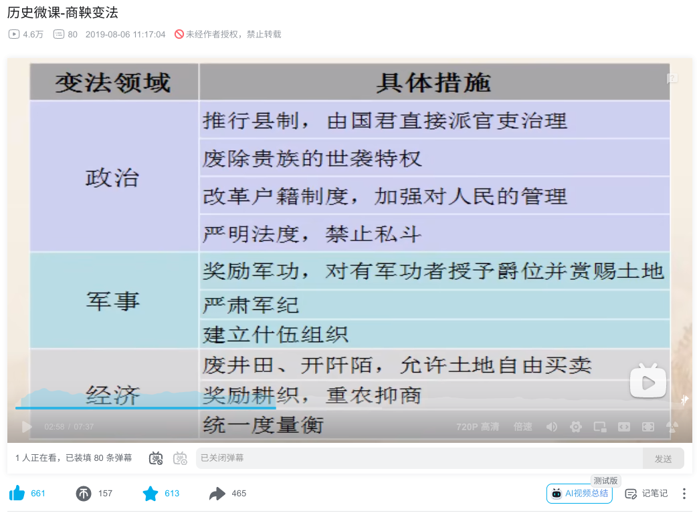

**拯救亚洲人，削蕃外洲人。**

秦灭六洲，一统天下；
莫忘初衷，方得始终。

借鉴李擅长之言：「高筑墙，广积量，缓称王。」，咱们[赢家黄氏江夏堂（世袭制道教徒）](赢家黄氏江夏堂（世袭制道教徒）)十二生肖秦人牧马的海外华人公会🌟秦孝公清君侧之商鞅变法的路线是**秦孝公，总会长；先修身，并削蕃。当自强，再政变/登基，改国号，图天下。**

借鉴以上商鞅变法史、黄埔军校辛亥革命与武昌起义史和巫裔宦官乱天下，除了将第一项修改为咱们中企（股东、理事、管理层、上司、同事全是中国公民）🚩🇨🇳🔆🏹🌟👊🚀🦔中科红旗操作系统中央集权，管制与发展咱们全国各华人新村，辅佐海外华人公会🌟秦孝公清君侧之商鞅变法，在研发咱们赢家黄氏江夏堂操作系统和电子仪器的同时，歼灭英国殖民过的共运会诸蕃邦所有不遵守各自种族习俗文化宗教语言法律的非法民族，直到有本事儿取代美国产品再废除目前的所有沐猴而冠、东施效颦的马来貘巫贼巫婆非法回教徒宦官民族，功勋超过历代三黄五帝，史称「秦始皇」，请查阅[黄氏与皇室（世袭制道教徒）](#黄氏与皇室（世袭制道教徒）)和[黄氏复古之道（世袭制道教徒）](#黄氏复古之道（世袭制道教徒）)。

**帝道**：借鉴春秋战国之秦人（世袭制道教徒十二生肖）牧马史和美国独立战争史，先研发咱们世袭制道家文言文电子仪器和操作系统等、发展学术科学科技再革命，司马错入巴蜀^[[巴蜀两省？这是一个坑，历史上我为何能出现那么多割据政权？](https://www.bilibili.com/video/BV1N24y1b72C)]「得蜀既得楚」、白起攻赵、王剪灭楚，迅速扩充领土。

**王道**：借鉴春秋战国之秦人（世袭制道教徒十二生肖）牧马史/<s>刘邦入巴蜀</s>刘备入川史/辛亥革命史，先使用并中文化现有资源后革命偏隅一方/偏安一隅，再发展学术科学科技。（世袭制法家刘氏彭城堂路线的政权是美国法官国父瓦盛顿革命史）

**霸道**：世袭制张氏青湖堂青巾之乱、太平天国运动、戊戌变法。

- 户籍：多元种族、多元习俗文化宗教语言（各种族遵守回各自祖籍的习俗文化宗教语言法律）、户籍管理与分配、宗教、姻缘、婚姻、子嗣、法律、人口管制、姓氏堂号子嗣贞节牌坊与杏林、治安与安居乐业。
- 科技：工厂与电子仪器学术科技与创新、无人机、室内农场、杏林、科学研究所、工厂、学术培训、展览厅、旅游、高科技务农工具、村垫、村警民警、村兵民兵、军事。
- 算卜：奉常、宗教、学术、天干地支、易经、廿四节气、土地规划、风调雨顺、五谷丰收，将产量、品质、成本与利润、市场最优化。
- 经济：国内外商业贸易、税务管理、计量经济学、金融与经济。

借鉴万物皆有灵和阅读脑电波嬴政思想录，所谓的户籍管理中的一项，就是视频中的[人工智障检测《国产凌凌漆》名场面](https://www.bilibili.com/video/BV1Cd4y1R7jT)是可以通过人造卫星以光速来侦测地球上万物一举一动，就能通过量子电脑的计数/机数量化分析来分辨机器人、僵尸、正常人。

> #咱们所有世袭制道教徒禁止和任何世袭制可兰经法家回教徒和世袭制吠陀经兴都教徒扯上任何思具体甚至思维姻缘关系 #千年法家治天下杜绝回教乱天下 #咱们世袭制道教徒黄河文明黄埔军校黄种人赢家黄氏江夏堂的视线范围和住所办公地点和宗教场所一律禁止出现任何回教徒和兴都教徒 #歼灭所有可兰经回教刑事法典习俗文化宗教语言断肢法的ExtremeJodoh回教徒巫术姻缘犯
> 
> **借鉴瓦伦·巴菲特投资原则，「商鞅变法」的两个基本原则就是：“回教徒身为世袭制可兰经回教刑事法典巫术习俗文化宗教语言断肢法民族，入侵、使用、触碰、具体交流、眼神交流、无线或有线网络入侵、冒充它族、甚至思维交流、施展可兰经回教巫术窥听窥视任何回教徒回应甚至干活儿、出现在任何非清真教徒或它族宗教场所或住宅办公等地点的视线范围内、抽鼻涕耶稣受难、企图甚至具体迷魂勾引、企图甚至具体色情或传宗接代、企图甚至具体冒充它族、使用或入侵任何非清真产品包括食品（非清真万物——生物与非生物），一律列为触犯可兰经回教刑事法典巫术习俗文化宗教语言断肢法的判教罪，是死罪！根据查询回教徒的世袭制可兰经回教刑事法典巫术习俗文化宗教语言断肢法，法官无权审判即可处死回教徒！也就是说可兰经是所有回教徒的性命！”，而第二个原则就是必须谨记第一个原则！**
> 
> 世袭制法家回教徒的可兰经习俗文化宗教语言断肢法，学习或参与使用任何外文学术数学算卜概率论博弈论、习俗文化宗教语言、吃猪肉喝酒抽烟、色情、勾引、迷魂、巫术降头等，都是触犯可兰经回教刑事法典断肢法。

*引用：[斩首、石刑、截肢…阿富汗“伊斯兰教法”或将重现酷刑](https://www.163.com/dy/article/HM881SKU0511RVG1.html)*

- [历史微课 - 商鞅变法](https://www.bilibili.com/video/BV1Yt411K7UE)
- [「沧浪」秦国变法背景的冷知识](https://www.bilibili.com/video/BV1wK411Y7Xi)
- [哈佛教授谈中国古代商鞅变法，比某些中国人还要了解](https://www.bilibili.com/video/BV13441177ND)

**天下回教诸藩的祖国沙地阿拉伯麦加**

- [「中华人民共和国外交部」中华人民共和国和沙特阿拉伯王国联合声明](https://www.mfa.gov.cn/web/ziliao_674904/1179_674909/202212/t20221209_10988250.shtml)
- [「东方日报」沙地自称是中国可信的能源合作伙伴](https://www.orientaldaily.com.my/news/international/2022/12/08/532264)
- [「紐約時報中文網」習近平中東行深化中國與沙烏地阿拉伯關係，簽署合作協議](https://cn.nytimes.com/world/20221209/china-saudi-arabia-agreement/zh-hant)
- [「中华人民共和国驻沙特阿拉伯王国大使馆」2022中国—阿拉伯媒体合作论坛在沙特阿拉伯举行](http://sa.china-embassy.gov.cn/xwdt/202212/t20221207_10986613.htm)
- [「BBC中文」习近平访问沙特：中国和沙特分别想得到什么？](https://www.bbc.com/zhongwen/simp/chinese-news-63885600)
- [「中华人民共和国驻沙特阿拉伯王国大使馆」习近平结束出席中国—阿拉伯国家峰会、中国—海湾阿拉伯国家合作委员会峰会并对沙特进行国事访问回到国内](http://sa.china-embassy.gov.cn/gdxw/202212/t20221211_10988695.htm)
- [「中华人民共和国外交部驻澳门特别行政区特派员公署」中华人民共和国和海湾阿拉伯国家合作委员会合作与发展峰会联合声明](http://mo.ocmfa.gov.cn/xwdt/wjyw/202212/t20221210_10988401.htm)
- [「第一财经」中沙拓展数字经济等领域合作，外交部：实现更高质量、更深层次的互利共赢](https://www.yicai.com/news/101619693.html)
- [「东方日报」攻逾百国席，伊党贪多如“自杀”](https://www.orientaldaily.com.my/news/nation/2018/04/20/239995)
- [「星洲日报」敦马：不堪生活压力，马来人如今也倾向自杀](https://www.sinchew.com.my/?p=3916893)
- [「华人头条」“期待更多中企来马投资”，陆兆福：东铁具战略意义·带动东海岸发展](https://www.52hrtt.com/my/n/w/info/D1671692393881)
- [「华人头条」不满发表亵渎伊斯兰言论，大马骇客入侵印度政府网站](http://www.52hrtt.com/xn/n/w/info/A1654679502958)
- [「中国报」大马网民“报复”菲7地方改大马领土](https://www.chinapress.com.my/20220820/大马网民复仇-菲7地方改大马领土)
- [「微博」🇲🇾不许吃猪肉1700万个的回教恐怖份子🕋☪印师太监民族骇客入侵触犯可兰经回教☪刑事法典断肢法，佯装咱们🚩🇹🇼🇨🇳孙吴辛亥革命的中华民族](https://m.weibo.cn/2116791942/4799842054570854)
- [网络无故变差恐遭“骑劫”？教你四步这样检查✅
](http://www.xiaohongshu.com/discovery/item/62a714d6000000002103f00b)
- [「优管」台湾外交网被东南亚回教骇客政府入侵，嫁祸东亚](https://youtu.be/vFT3SWKgsA0)
- [「凤凰卫视」马来西亚皕家网站被攻击 九成黑客为当地人](https://news.ifeng.com/c/7fZrWHlOZR3)
- [「脸谱」🇲🇾印裔群和🇲🇾印度裔群冲突](https://www.facebook.com/groups/2342810429098121/permalink/5588139157898549)
- [「华人头条」法媒：“伊斯兰国”认领埃及致命袭击](https://www.52hrtt.com/xn/n/w/info/F1671692885467)
- [「华人头条」吉打禁赌违宪、侵犯人权、破坏经济，林振辉轰神权治理开倒车](https://www.52hrtt.com/my/n/w/info/A1671692226047)

### 纵横家吕不韦

#### 吕氏春秋史

吕氏春秋史书（电子书），请查阅：

- [吕氏春秋全鉴](https://github.com/englianhu/library/blob/世博量化研究院/始祖永春∙秦谏（诸子百家，中文编程）/秦国始祖道家∙嬴政黄永春ξηg%20Tεηg、道家一统天下的电子仪器「干支算筹」和操作系统「大秦赋」）/诸子百家/吕氏春秋全鉴.pdf)

#### 🌟秦人牧马之《吕氏春秋》

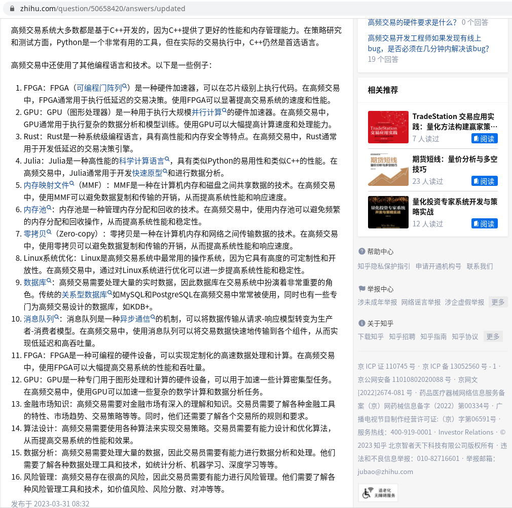

借鉴春秋战国史，欲发展咱们道教、杏林、金融、道家与务农与金融科技、娱乐圈相关信息，可查阅[黄氏复古之道（世袭制道教徒）](#黄氏复古之道（世袭制道教徒）)，功勋超过历代三黄五帝，史称「秦始皇」，请查阅[黄氏与皇室（世袭制道教徒）](#黄氏与皇室（世袭制道教徒）)、[黄氏复古之道（世袭制道教徒）](#黄氏复古之道（世袭制道教徒）)。

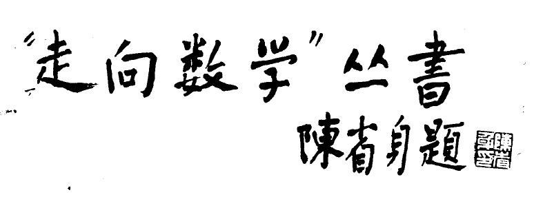

金融书籍（电子书），请查阅：

- [金融工程原理](https://github.com/englianhu/library/blob/世博量化研究院/始祖永春∙秦谏（诸子百家，中文编程）/秦国始祖道家∙嬴政黄永春ξηg%20Tεηg、道家一统天下的电子仪器「干支算筹」和操作系统「大秦赋」）/诸子百家/金融工程原理.pdf)
- [金融数学 - 衍生产品定价引论](https://github.com/englianhu/library/blob/世博量化研究院/始祖永春∙秦谏（诸子百家，中文编程）/秦国始祖道家∙嬴政黄永春ξηg%20Tεηg、道家一统天下的电子仪器「干支算筹」和操作系统「大秦赋」）/诸子百家/金融数学%20-%20衍生产品定价引论.pdf)
- [金融数学教程](https://github.com/englianhu/library/blob/世博量化研究院/始祖永春∙秦谏（诸子百家，中文编程）/秦国始祖道家∙嬴政黄永春ξηg%20Tεηg、道家一统天下的电子仪器「干支算筹」和操作系统「大秦赋」）/诸子百家/金融数学教程.pdf)
- [金融数学模型](https://github.com/englianhu/library/blob/世博量化研究院/始祖永春∙秦谏（诸子百家，中文编程）/秦国始祖道家∙嬴政黄永春ξηg%20Tεηg、道家一统天下的电子仪器「干支算筹」和操作系统「大秦赋」）/诸子百家/金融数学模型.pdf)
- [高频交易系统开发的各个阶段是怎样的？](https://github.com/englianhu/library/blob/世博量化研究院/始祖永春∙秦谏（诸子百家，中文编程）/秦国始祖道家∙嬴政黄永春ξηg%20Tεηg、道家一统天下的电子仪器「干支算筹」和操作系统「大秦赋」）/大秦赋之干支算筹/高频交易系统开发的各个阶段是怎样的？.pdf)
- [高频交易系统是不是绝大多数都是基于曦佳佳开发的？](https://github.com/englianhu/library/blob/世博量化研究院/始祖永春∙秦谏（诸子百家，中文编程）/秦国始祖道家∙嬴政黄永春ξηg%20Tεηg、道家一统天下的电子仪器「干支算筹」和操作系统「大秦赋」）/大秦赋之干支算筹/高频交易系统是不是绝大多数都是基于曦佳佳开发的？.pdf)
- [量化对冲策略解读及配置价值分析](https://github.com/englianhu/library/blob/世博量化研究院/始祖永春∙秦谏（诸子百家，中文编程）/秦国始祖道家∙嬴政黄永春ξηg%20Tεηg、道家一统天下的电子仪器「干支算筹」和操作系统「大秦赋」）/大秦赋之干支算筹/量化对冲策略解读及配置价值分析.pdf)
- 欲知更多金融相关文献，请查阅：
    - 「猫城」FXCM 量化对冲实时数据中的[图书馆](https://github.com/scibrokes/real-time-fxcm/tree/世博量化研究院/图书馆)
    - 「猫城」次元期权（binary.com）量化分析员/量化交易员面试题[图书馆](https://github.com/englianhu/binary.com-interview-question/tree/世博量化研究院/图书馆)
    - [「猫城」《始祖永春•秦谏——大秦赋》](https://github.com/englianhu/library)
    - [赢家黄氏江夏堂——联富始祖之道](#赢家黄氏江夏堂——联富始祖之道)

##### 法家佐治∙索罗斯与瓦伦∙巴菲特投资哲学

##### 金融炼金术

##### 高频量化对冲

- [「猫城」次元期权（binary.com）量化分析员/量化交易员面试题](https://github.com/englianhu/binary.com-interview-question)

#### 蕲年宫之变

##### 🌟赢异人/赢子楚/艺人里根

- [🌟秦人牧马之《商君书》](#🌟秦人牧马之《商君书》)
- [「工商管理智库∙百科」会所](https://wiki.mbalib.com/wiki/会所)
- [杏林经济学（世袭制道教徒）](#杏林经济学（世袭制道教徒）)
- 愚生赢家黄氏江夏堂联富（二零零八年暨二零一二年在西施康工作时，经过[佳丽论坛跑龙套当业余演员，当时YY姐是中介负责人](https://c.cari.com.my/forum.php?mod=viewthread&tid=1061770&page=16#pid38938269)），多数饰演餐厅服侍生^[小时候都没工作，只是拾油棕闾粒或编织羽毛球拍挣点儿收入。跑龙套也是演员，经常饰演身穿礼服（与长相似王永庆的外祖父书法家李福谐音）的服侍生角色，穿着打扮就像港星周星驰的[《国产凌凌漆》](https://www.bilibili.com/video/BV12U4y1g7xE)：<br> - 中学毕业后，人生第一份月付工作就是二零零一年年底经过高中张惠燕女同学介绍到吧生大人餐厅当服侍生工作到二零零二年三月，然后五月在拉曼学院开学修读电脑科学A流派专攻数理计数/机数。<br> - 大姐莲碧借鉴三哥之前在云顶工作就叫我到怡保五石里路的贩卖车子时光绷带和维修的修车厂（三哥联山的旧东家）工作，辞职后再叫我到皇朝酒店唐宫找工，二零零三年年底到怡保三石里路的皇朝酒店唐宫工作当服侍生，有个好学又浓眉大眼漂亮妞儿女同事服侍生十五六岁的学生郭子瑜（长相似黄奕/张柏芝）周末和周日打零工挣钱要报读拉曼学院科技信息学。]。以目前春秋战国（七大洲五大洋）天下局势，将司马错、白起和王剪列为秦国军事三杰，平夷攻赵灭楚。秦灭六洲，一统天下；莫忘初衷，方得始终。
- 统筹法、系统工程学，操兵练将、通往古今的兵书、韩信点兵、计数/机数建模量化分析所有将士与兵卒的起居饮食与评估能力与学习进度、兵种分配与管理、研发军事武器与军用玄学、军用操作系统与软件、军事科学科技、人造卫星网络密码学等。
- [「沧浪」秦国怎样提升军队战斗力](https://www.bilibili.com/video/BV1Kx42117rj)
    - [「知乎」MIDAS：混频数据回归](https://zhuanlan.zhihu.com/p/343307253)
    - [MIDAS：混频数据回归](https://www.lianxh.cn/news/8ab193e6f04cc.html)

##### 长信侯法家嫪毐

<iframe width="400" height="225" src="https://www.youtube.com/embed/ndCUxQB0kzg" title="「抖音」大秦赋 - 时光机器农历二零零二年" frameborder="0" allow="accelerometer; autoplay; clipboard-write; encrypted-media; gyroscope; picture-in-picture; web-share" allowfullscreen></iframe>

*引用：[「抖音」大秦赋 - 时光机器农历二零零二年](https://v.douyin.com/iNwNe2Q6)*

##### 期权/“期”货可居

### 法家李斯

#### 鬼谷传奇

**从硅谷传奇到鬼谷传奇**

借鉴万物皆有灵和阅读脑电波嬴政思想录，所谓的户籍管理中的一项，就是视频中的[人工智障检测《国产凌凌漆》名场面](https://www.bilibili.com/video/BV1Cd4y1R7jT)是可以通过人造卫星以光速来侦测地球上万物一举一动，就能通过量子电脑的计数/机数量化分析来分辨机器人、僵尸、正常人。

#### 中科红旗

- [「油管」可兰经断肢法，回教徒不是不可以赌博吗？](https://www.youtube.com/shorts/hTsFgQ3mfBc)，干脆由咱们世袭制道教徒易经算卜（中国政府或咱们东南亚复古中华五千年文化革命再联合东亚中国西征）来接管回教徒的领土好了！
- [「油管」最靠近马来西亚的国家是？答案是中国！](https://youtu.be/PDo012n8Hag)
- [秦人牧马/燕从京来（国际标准中文北京话）](https://www.youtube.com/shorts/8oO8U7jQSEc)

#### 李斯篆书

### 赢家黄氏江夏堂——联富始祖之道（世袭制道教徒）


> 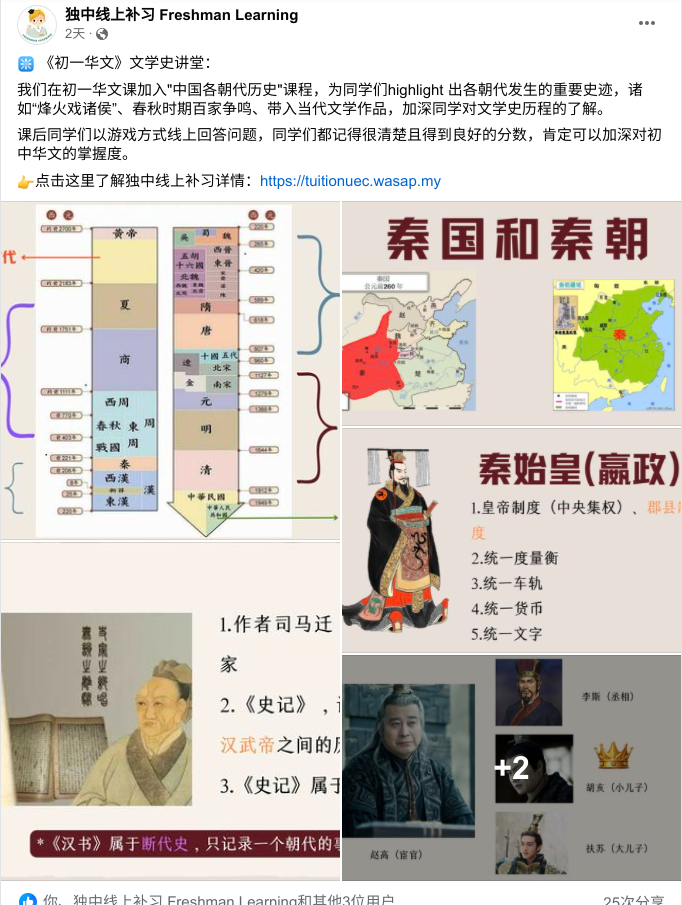

*引用：[《初一华文》文学史讲堂：春秋战国](https://www.facebook.com/FreshmanLearning/posts/pfbid0mYNyjoK44cnjC8QRTs2RbkpUrEDdfQuxzuyZk12aHh3N7FUCo3q2NfLRzWyf1bj8l)*

借鉴万物皆有灵和阅读脑电波嬴政思想录，所谓的户籍管理中的一项，就是视频中的[人工智障检测《国产凌凌漆》名场面](https://www.bilibili.com/video/BV1Cd4y1R7jT)是可以通过人造卫星以光速来侦测地球上万物一举一动，就能通过量子电脑的计数/机数量化分析来分辨机器人、僵尸、正常人。

- 高频量化算卜对冲（运筹帷幄）
- 统筹法（系统工程学）
- 「大秦赋」或「文言文操作系统」
- 「算筹」或「自然数算筹」
- 道家、易经、算卜、天文历法、十二生肖、姓氏堂号子嗣贞节牌坊、紫微斗数、十二时辰、生辰八字、廿四节气等
- 时差与时间标准
- [人无远虑，必有近忧](#人无远虑，必有近忧)

## 特里必斯（二零零五年：香港老虎越南澳洲算卜博彩业）

### 操盘

特里必斯在FSBM大厦四楼而西施康就在二楼，在特里必斯工作时期，有天同事兼室友阿文（长相似港星魏骏杰）聊起：“听讲二楼好似也有间博彩公司同行，不过是一家鬼佬公司，听说仅系接听电话同投注，非常安逸悠闲似卜基仔，不似我地后台仲需要看盘同操盘。听讲好似系🇬🇧英国立博🚩或伟徳或日博。”

### 运筹帷幄

## 克里斯波（二零零七年：世界最大华人庄）

### 操盘

### 培训部门


## 西施康（二零零八年：鄀R编程语言（RR）与🇬🇧英国立博🚩红军百年老店）

### 秦人牧马/卧薪尝胆

每个民族各自世袭制习俗文化宗教语言是每个民族各自的性命，毋须理会二零一三年二月才遇见的衍生产品SSH颜丽青和关丹土地局柜台洋番、歼灭敌人衍生产品瓜雪回教市政局入口处柜台巫婆回教徒（回教徒冒充它族是触犯可兰经回教刑事法典习俗文化宗教语言断肢法的判教罪）！

个人文派记事本中随笔，文章中有叙述一些历史，包括从拉曼学院电脑科学流派A数学系和日语班辍学后，就开始启程商业人生，自强不息、力争上游。

借鉴愚生赢家黄氏江夏堂联富在二零零二年时期再拉曼学院修读电脑科学A流派专攻计数/机数系有个好哥儿们潮州人谢德才同学（长相似比尔盖茨斯斯文文戴副眼镜，而另一个长相似目前世界首富兼科学家艾隆·马斯克的砂捞越富家公子福州人，名叫Wong Lee Hui不晓得是姓王或黄，名李辉，而我一九八八年出生的妹妹莲霜以前就喜欢威威组合——李威和林佑威中的李威。），当时我追求课外家庭日语班潮州人女同学艳迎（突然辍学转校到澳洲墨尔本大学进修时尚服装设计）失恋后，愚生在拉曼学院图书馆翻阅中国史书时中所提及的「卫鞅仕秦」[^2]时爱不释手、孜孜不倦、阅读到晚上图书馆大约九点钟左右打烊才离席回家，引用卫鞅在中国河南省云梦山鬼谷子旗下修炼帝王之术（文中提及卫鞅游说魏国联合其它五国联盟伐秦不果，就干脆投奔秦国灭六国联军，公元前的三顾茅驴对秦孝公——赢渠梁游说，推荐比公元后的《出师表》来得厉害的《商君书》阐明“帝道”、“王道”和“霸道”如何协助秦国稳扎稳打、百战百胜、直到一统天下，史称「商鞅变法」。结果秦国如实从秦孝公赢渠梁开始实践「商鞅变法」大约皕余年至秦王嬴政一统天下，史称「秦始皇」。）如何驾驭权贵直到一统天下。

二零零八年加入西施康后，由于每天都很清闲，过着安逸的生活。工作时间从周一至周五，每天轮班制有三班如下：

- 下午一点半到晚上九点
- 下午四点半到凌晨一点
- 晚上八点到凌晨四点半

*注释：二零零二年失恋之后就开始：“努力！奋斗！”，时常去各大中国书店购书成为小书虫。每次购书非常夸张，都是手提一袋一袋的书籍，因为佐治·索罗斯的娘亲精通多国语言有习俗文化宗教语言优势，所以有天在阅读一本类似世界习俗文化通史的书籍，书中说到许多国家各民族的习俗文化、宗教、语言、手势的书籍，从葡萄牙、英国、美国、西班牙、韩国，而法国篇中提及法国人一天只工作七个小时（三个时辰半）而已，当时就赶紧去法语中心询问学习法语，打算它日到法国公司工作过着安逸悠闲的生活。结果二零零八年加入西施康，一天有效工作时间是三个时辰半，另外半个时辰离席休息时间和两刻时间的离席如厕时间。*

二零零八年三月到二零一二年七月四年有余，如同在学院或大学修读时期一样安逸悠闲。每天上班时间都在上网浏览并搜索各种计数/机数软件和任何足彩计数/机数建模科研文献，当时市场上并没有任何普遍通行的计数/机数软件，在搜索和浏览并参与许多论坛后，经常混：

- [统计之都]()
- [经管之家（人大经济论坛）]()
- [CSDN]()
- [数学中国](http://www.mathchina.com/bbs)

有天通过网上搜索到[迪克逊与克尔斯 一九九六（原文：Dixon & Coles 1996）](https://github.com/scibrokes/odds-modelling-and-testing-inefficiency-of-sports-bookmakers/blob/世博量化研究院/图书馆/DixonColes1996.pdf)阅读后就感到惊讶很专业（就像之前对日语班老师佩琪桑、安利传销经理、PAAC会计老师说过：“如果你那么厉害，会灵活应用就不会只是个夸夸其谈的门面功夫老师而已。”因为马克·迪克逊/马克·大顺在一九九四年左右，在当时落后的科技下每天记载报章上所有的赔率而非局部抽样，来回测再算卜预测。一九九八年创办自家[ATASS](https://www.atass-sports.co.uk)公司提供数句分析与高频量化对冲生意，该科研文献中的学者司徒·克尔斯就是在Shawn Lim伟雄的客户公司[精明赔率（原文：SmartOdds）](https://www.smartodds.co.uk)智能赔率中当高级主管，而精明赔率的创办人老板以前帮托尼·布伦打工，详情请查阅：[他不认同Moneyball，却靠数据在三重身份里都成了大神 | 颜强专栏](https://zhuanlan.zhihu.com/p/657802733)），然后再搜索估计一共储存了有好几百篇科研论文，每天像佐治·索罗斯和金牧·罗杰斯一样翻阅许多篇科研文献筛选最优最实用的科研文献和所有作者的背景包括在哪家公司工作。在数学中国论坛咨询并发送邮件联系坛主陆远鸿教授，陆教授好心回复并使用三四天时间（当时陆教授好像使用C#语言编程，只要导入一个文本矩阵数字，点击计算就能解析。陆教授是中国数学系领域十大著名教授之一，当时我还咨询陆教授怎么中国各大学校都没有一个统一的计数/机数软件来授教莘莘学子呢？如果每次都得各别编写个计数/机数软件给各别学生的话，教授不就很忙？然后也顺便咨询陆教授会不会R鄀计数/机数编程语言方便许多，当时我才刚开始自修R鄀计数/机数编程语言。）依照[**Maher 1982](https://github.com/scibrokes/odds-modelling-and-testing-inefficiency-of-sports-bookmakers/blob/世博量化研究院/图书馆/Maher1982.pdf)论文中的数学公式编写个矩阵软件计数/机数分析给我。愚生建立专业计数/机数学术论坛[](https://soccer.oksport)在友邦保险工作时期（当时自个儿到公司附近工商银行注册了储蓄户口）被中国公安局屏蔽后，之后就建立个个人随笔记事本记载[「文派」統計學に就いて](https://englianhu.wordpress.com/statistics)，寻觅个完善的计数/机数软件，然后开始自修R鄀计数/机数编程语言混《统计之都》的谢益辉——谢氏宝树堂同姓）

### 马王之争（争取承接🇬🇧英国立博🚩红军百年老店操盘与科研项目）

《最近比较烦🎶》

**🇬🇧英国立博🚩红军百年老店**

二零零八年三月到二零一二年七月四年有余，辞职后…

> …二零一三年特地飞到台北找工，住在忠孝东路善導寺后面林森北路民宿，然后一位翻报章找房间认识周先生，他特地约我到《行天宫》签合约租房住台北交通资讯中心（转运站内）中山北路一段长安西路枠六巷（二零一三年住台北中山北路一段（华阴街/长安西路）），结果住了几个月后被老千周先生骗了抵押金房租，当时每天都刮台风🌀每条街道各大媒体每天廿四小时不断播放马王之争，就连我凌晨三四点肚子饿到便利店买小食都看到媒体在播放灯火不息，当时正自学[Python](https://github.com/scibrokes/webdriver-dynamicwebpage-scrapping)每天自修编程，并找到份外汇交易商也是需要自个儿找客户（第一天十多位听课，没几天就只有两位年长成熟的Roy和Jack和我聊天、商业经，只是他俩说他们已经在台湾老树盘根，有强后的商业人际网络资源充足，所以容易找投资者）…

*出处：[迟了一年，更新履历表 B4TELEBIZ (18-DEC-2021)](https://englianhu.wordpress.com/2021/12/20/迟了一年，更新履历表-b4telebiz)*

`eval(parse(text = 参数))`可以诠释为**评估绩效（奉常旗下的各种族各宗教各自监督执法（司法院立法 = 多元法律））**先将函数文字化，再通过文本分析来执行任务，几乎可以运行筹算任何R语言统计编程代码，[**knitr🧶**：Chunk options and package options](https://yihui.org/knitr/options)也是通过辨认各代码篆标题文本分析。那些回教徒只需要遵守可兰经回教刑事法典习俗文化宗教语言断肢法、而兴都教徒则遵守《吠陀经》大宝森节和屠妖节习俗文化宗教语言法律即可。

- https://github.com/yihui/knitr/issues/138
- https://github.com/englianhu/binary.com-interview-question/issues/9#issuecomment-2063777955

[^2]: 公元前（基督教和耶稣尚未出生在世上，春秋战国只有山东孔子的儒学）的卫国卫鞅仕秦、卫国吕不韦仕秦、楚国李斯仕秦，西方医学界都是使用🇨🇭（首府苏黎世）十字架符号或🇲🇻湾月符号。<br>公元后汉史《明修栈道》、《出师表》和公元后明史《烧饼歌》、《靖难之变》:<br> - *[「猫城」Pandoc based Quarto应该翻译成什么？ #三](https://github.com/scibrokes/r-world/issues/3#issue-1618233383)*<br> - *[「猫城」GitHub Repository 应该翻译成什么？#二](https://github.com/scibrokes/r-world/issues/2#issuecomment-1264570739)*

- [「文派」統計學に就いて](https://englianhu.wordpress.com/statistics)
  - [「文派」®に就いての参考文献](https://englianhu.wordpress.com/statistics/references-for-r)
  - [「文派」自分の®STUDIO服務器建設する](https://englianhu.wordpress.com/statistics/own-a-rstudio-shiny-server)
  - [「文派」🚩🇨🇳🔆🏹🌟👊🚀🦔中科红旗](https://englianhu.wordpress.com/statistics/linux-🐧-kubuntu-⚙)
  - [「文派」壱つ統計工具 — R](https://englianhu.wordpress.com/statistics/a-statistical-tool-r)
  - [統計學者やR為の様々統計軟件](https://englianhu.wordpress.com/statistics/統計學者やr為の様々統計軟件)
- [蹴球賭博業界取引戦略](https://englianhu.wordpress.com/sportsbook)

<iframe width="400" height="225" src="https://www.youtube.com/embed/roq7hcgVTqk" title="了解 Popularity of R Programming 作为一种编程语言的流行度（四分钟微学习）ENG Subtitle" frameborder="0" allow="accelerometer; autoplay; clipboard-write; encrypted-media; gyroscope; picture-in-picture; web-share" referrerpolicy="strict-origin-when-cross-origin" allowfullscreen></iframe>

*一九九四年澳洲Ross & Robert研发R鄀统计编程语言。*

- [「七龍珠總整理」所有的RR人造人 | 一次看完壹至廿壹號人造人 以及那些你可能沒看過的人造人 | 人造人九號、十七與十八號合體、人造人八千號？！](https://youtu.be/_yD7IZYnIUU)

- [五分鐘R語言系列](https://youtube.com/playlist?list=PLghWJf3e_h2GMPHNGbT4TN-kdfEvQgmPu)
- [R鄀語言大數據](https://youtube.com/playlist?list=PLxYedd0OW1Pw4smFm9KcWP77v1HBZUBAg)
- [R鄀语言数据可视化实战——大数据专业图表从入门到精通（微视频全解版）](https://youtube.com/playlist?list=PL5jFwqTxh71a9XfKuO3wKB2XsNOqHaxds)

## 俄乌战争（阳历二零二二年二月廿四日至今）

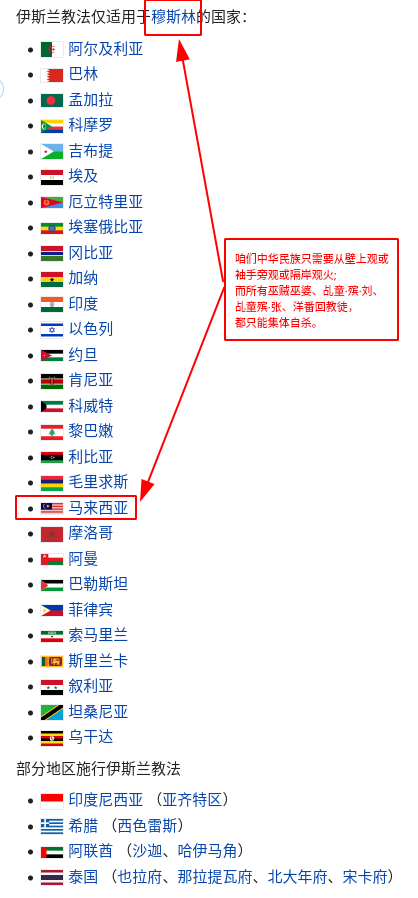{width=400}

- [「维基」马航三七零号空难 - 阳历二零一四年三月八日](https://zh.wikipedia.org/zh-cn/马来西亚航空370号班机空难)
- [「维基」马航十七号空难 - 阳历二零一四年七月十七日](https://zh.wikipedia.org/zh-my/马来西亚航空17号班机空难)
- [「南洋」“回教国”威胁未结束](https://www.enanyang.my/国际/“回教国”威胁未结束)。以色列国庆日是五月十四日，那些犹太人负责歼灭共同敌人巫贼巫婆回教徒九一一恐怖份子！
- [透过十幅地图了解巴以冲突简史](https://chinese.aljazeera.net/news/political/2023/11/28/透过十幅地图了解巴以冲突简史)。以色列国庆日是五月十四日，那些犹太人负责歼灭共同敌人巫贼巫婆回教徒九一一恐怖份子！
- [以军：已歼灭至少一万三千个恐怖分子 将继续推进进攻](https://www.8world.com/world/netanyahu-says-at-least-13000-terrorists-among-palestinians-killed-2397841)。以色列国庆日是五月十四日，那些犹太人负责歼灭共同敌人巫贼巫婆回教徒九一一恐怖份子！
- [「维基」中国——以色列关系](https://zh.wikipedia.org/zh-my/中国—以色列关系)，以色列於阳历一九四八年五月十四日独立建国，而咱们祖国中国（中华民主共和国和中华人民共和国）分别成立于阳历一九一一年十月十日和阳历一九四九年十月一日。

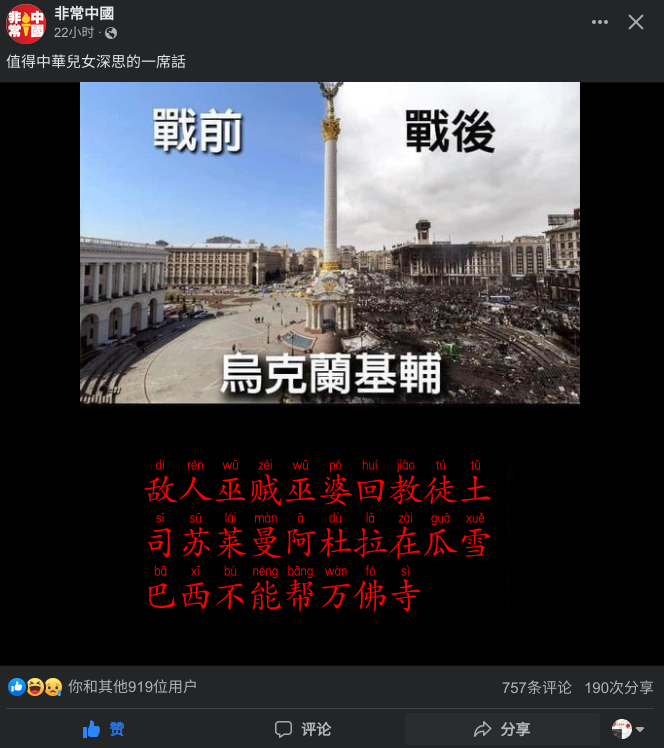{width=400}

上图画中话叙述秦国史与近代史（秦孝公提拔商鞅变法清君侧、美国US独立战争史和马来西亚MY大汉山赤印度人酋长赤帝《三国志》、扶苏的苏联十月革命或持续黄种人胡亥的辛亥革命，建立万里长城抵御北方凶悍的游牧民族匈奴掠夺天然资源和搞垮经济——高科技高频量化对冲）和美国（大象共和国如果本土化和爱国就沦为赤印度人的巫术国度，外来的英国习俗文化宗教语言终究是英国人的资产）独立战争史，值得咱们中华民族省思。「世袭制道家黄河文明、黄埔军校、黄种人，拯救亚洲人」，东亚各种族需要各种族遵守回各自祖籍的习俗文化宗教语言法律，多元习俗文化宗教语言，才不会种族互相厮杀，导致洋番渔翁得利，重返亚洲。至于东南亚的巫贼巫婆回教徒累赘民族一律杀无赦！

<iframe width="400" height="225" src="https://www.youtube.com/embed/ONtyQcRsaUw" title="「空城计」MY大汉山世袭制法家可兰经回教刑事法典习俗文化宗教语言断肢法巫贼巫婆非法回教徒巫术份子和赤印度人酋长宗教司甘地/土司乩童刘瑾貹和世袭制法家可兰经回教刑事法典习俗文化宗教语言断肢法巫贼巫婆非法回教徒巫术份子 -自杀式恐怖袭击- 红军🚩" frameborder="0" allow="accelerometer; autoplay; clipboard-write; encrypted-media; gyroscope; picture-in-picture; web-share" referrerpolicy="strict-origin-when-cross-origin" allowfullscreen></iframe>

## 克拉克太阳谷（二零一九年：阿里之旅）

### 网络推广

### 运筹帷幄

- [黄联富（®γσ ξηg 雷欧）/乐发集团（阿里报告）](https://github.com/englianhu/report)
- [「油管」可兰经断肢法，回教徒不是不可以赌博吗？](https://www.youtube.com/shorts/hTsFgQ3mfBc)，干脆由咱们世袭制道教徒易经算卜（中国政府或咱们东南亚复古中华五千年文化革命再联合东亚中国西征）来接管回教徒的领土好了！

<br>

# 设定

## SCSS 设置

<style>
pre {
  overflow-x: auto;
}
pre code {
  word-wrap: normal;
  white-space: pre;
}
.table-hover > tbody > tr:hover { 
  background-color: #8D918D;
}
</style>

```{r 读取SASS, class.source='bg-success', class.output='bg-primary'}
##
## 中科红旗（百家争鸣，文艺复兴）
## Oversea Greater Chinese Association 大秦子民公会（秦孝公 / 姜太公——陈祯禄公爵）
## 史无前例，一统天下
##
##
##
## 中科红旗
## 全球中华民族，支持中共称霸天下战略。
## Great Britain 大英帝国
## Greater Chin 大秦赋
## Republic of China / Republic People of China 大秦赋（中华民国 / 中华人民共和国）
## Greater Chinese 大秦子民（爱民如子）
## Oversea Greater Chinese 大秦子民（爱民如子）
## Oversea Greater Chinese Union 大秦子民公会（秦孝公 / 姜太公——陈祯禄公爵）
## 史无前例，一统天下
##
## Great Britain = 大布列颠帝国/大英帝国1
## Greater Chin = 大秦赋
## Greater Chinese = 大秦子民（爱子如民）
##
## 马来西亚籍（海外中华民族，自从清末民初下南洋，咱们马来西亚陈祯禄创办 Oversea Chinese Union）秦始皇黄氏江夏堂，笑傲江湖最大文明贡献
##
## 1）借鉴以前大英帝国东印度公司，有生之年就把一带一路高铁所经过的国家领土，一律得攻占下来（要比以前大英帝国/大蒙古帝国还要强大）称霸天下，世代延续直至史无前例，一统天下。
## 2）一带一路所有告示牌、必须使用中文和汉语拼音。
## 3）借鉴大蒙古帝国骑兵所到之处寸草不生，所有被中国攻占下来的领土，所经之地（包括城市/市镇/乡村），一带一路所有高铁站，都建立国民登记局可以申请入籍中国。
## 4）川普已经发言多次，美国兵变，会再次内战（借鉴越王勾践，中越不内讧，善用马来西亚回教徒太监不造反牵制美国，军售中东/西亚/东欧回教诸国）
## 5）中东回教国回教徒九一一恐怖份子与美国开战，中国军售中东西亚/东欧/非洲回教国（借鉴越王勾践中华民族与美国洋人Democrats阖闾政府，中越不内讧，善用马来西亚回教徒太监不造反牵制美国，军售中东/西亚/东欧回教诸国）
## 6）中国目前高铁除了尚未与马来西亚达成协议开工建立高铁但是已经借鉴王翦只围不攻战略，把东南亚国家都温馨说服并建立高铁，中国先不与马来西亚开战，让马来西亚兵变内战（借鉴越王勾践中华民族与美国洋人Democrats阖闾政府，中越不内讧，善用马来西亚回教徒太监不造反牵制美国，军售中东/西亚/东欧回教诸国）
## 7）南太平洋战略：中国和东南亚已经签署合约，达成协议不使用空军、核武器，出动海陆军攻占东南亚
## 8）商鞅变法多多益善战略：最大贡献是全球16亿回教徒太监民族与全球基督洋人鹬蚌相争…回教徒默罕默德创办回教，建立可兰经回教刑事法典断肢法规定回教徒伪太监民族必须虔诚戴乌纱帽一天祈祷五次，倘若不虔诚施展巫术屠杀是触犯断肢法而虔诚屠杀也触犯断肢法，只有辛亥革命铲除全球回教徒、断肢法处死或宫刑全球回教徒绝子绝孙，多管齐下才能终止巫术屠杀，拯救全球16亿回教徒还俗。China大秦赋秦孝公至顾自己家族禁止七步诗自相残杀，铲除分一杯羹白骨精刘家彭城堂造反，回教徒会施展巫术屠杀人类，回教徒太监民族只能屠杀欧美洋人并且被断肢处死，不效忠中共称霸天下，直至一统天下的伪满洲国马来西亚1700万个回教徒九一一恐怖份子太监民族包括Michael Cutter Christopher，一律断肢法处死（借鉴越王勾践中华民族与美国洋人Democrats阖闾政府，中越不内讧，善用秦二世胡亥、辛亥革命、越王胡志明、中国胡景涛、马来西亚回教徒太监不反中共牵制美国，军售中东/西亚/东欧回教诸国对抗美国）。秦始皇在统一七国后就不思进取导致赵高李斯谋反（借鉴中国历史秦始皇，水能载舟亦能覆舟，宗教巫术，古惑民心，指鹿为马，成也赵李，败也赵李。所以秦始皇得铭记当初秦孝公，不能昏庸被回教徒篡位），中国借鉴秦孝公战略善用商朝和苏联俄罗斯叶利钦。秦始皇铭记秦孝公，善用全球回教徒古惑全球洋人再依照可兰经回教刑事法典断肢全球回教徒，让咱们全球中华民族支持中共，一统天下。
## 9）华尔街、史无前例的万里长城Great Wall Sreet、一带一路高铁：计量经济学、学术治国、编程、计数、科学科技、量化（Fisher姜太公钓鱼大数据，各行各业购物喜好、民意、生活习惯、各国各集团、军事、诊断上市公司等）、金融、贸易、经商、军事、发展各行各业。
## 10）中文编程语言：借鉴日本自从唐朝大话革新学习汉字至明治维新学习欧洲，日本是全球首个亚洲人自创Ruby红宝石编程语言（Ruby Text可以标音），自从2008年就开始使用R语言并且认识中国R语言论坛《统计之都》论坛创办人网友谢益辉和赵坚毅创办的中国最大计量经济学专业论坛《经管之家》至今十年有余、目前已经开始以中文编程，中华人民共和国的国庆日1001和中华民国的国庆日1010都是二进制的电脑语言binary code，如同黄埔军校国共本是一家，赢家黄氏江夏堂秦孝公禁止《七步诗》自相残杀。咱们东南亚中华民族几乎都是国民华校生，洋人研发电脑、许多编程语言R语言、C语言、C++，推广与发展中文，希望它日有咱们中华民族自创新的编程语言，均以中文编程。
## 11）发展台式电脑操作系统：中科红旗是由中国北京大学校友孙玉芳创办将Linux礼逆袭和南非原住民开发的Kubuntu忽奔兔中文化并推出自家产品，在美国微软视窗Win台式电脑操作系统垄断全球十多二十年有余，目前已经开始使用芬兰研发的Linux礼逆袭、中国中科红旗台式电脑操作系统，推广与发展中科红旗。
##
## 《关雎——军官与淑女》
## 咱们中华民族和越族不可以死，隔壁后头邻居黄福全与本人（赢家黄氏江夏堂）祖父同名同姓。
##
## 借鉴欧洲中世纪，文艺复兴后就是开始海外军事，称霸天下之路。目前全球疫情已过三年，一带一路如火如荼进行着。
## 借鉴周公礼乐制度，大英帝国和大日本帝国向来都是自诩绅士淑女，孔子学院，以礼待人，来称霸天下。
## 借鉴指鹿为马的历史，百家争鸣如果散播回教徒屠杀罪、不杀马来西亚回教徒的话，就得处死回教徒学习可兰经，施展巫术下降头，古惑民心之罪，篡位咱们全球中华民族，人心惶惶、民不聊生，一律依照可兰经回教刑事法典断肢法处死回教徒巫师王（张佳坤Sulaiman Abdullah，分一杯羹白骨精巫师王刘瑾貹Abdul Halim）。
## 借鉴圣经、诺亚方舟（划龙舟）、孔子儒学（Confusion Catholic）、神父Father与信徒、中国历史、姬昌伯一扈兔子、徐达吃鹅肉、富不过三代的秦始皇嬴政秦二世胡亥至嬴政孙子、公爵、公公孙子、孙文辛亥革命、马来西亚火箭民主行动党由曾敏兴创党后林吉祥林冠英后换人、蒋介石蒋经国后就不延续世袭制，圣经都是善用父子关系，咱们中华民族和英系都是善用公孙关系、法官律师女子假发、自由女神。
## 中科红旗：借鉴北洋军阀与北约、杀袁者清，灭清者袁，许某可破北洋北约袁绍。黄埔军校国民党共产党辛亥革命是为了铲除回教徒，咱们东南亚回教徒身为伪满洲国九一一恐怖份子触犯可兰经回教刑事法典断肢法，组织个由回教徒执政的国民阵线（伪国民党）立国，1700万个马来西亚回教徒只能集体自杀，宣布亡国。
## 何谓中国（大秦赋Chin）？中华民国和中华人民共和国。咱们东南亚自从东亚清末民初几乎都是国民华校生，自从西周的周公开始礼乐制度后，大英帝国和大日本帝国都效仿来称霸天下做得有声有色、禁止回教巫术Judi博彩庄、艺人（异人）、导演巫师巫婆道衍师傅装疯卖傻、青山是印裔回教徒的归属地，回教巫师巫婆是屠杀人类的语言宗教习俗文化，得断肢法处死1700万个马来西亚印裔回教徒。

# install.packages('remotes', dependencies = TRUE, INSTALL_opts = '--no-lock')
library('BBmisc', 'rmsfuns')
#remotes::install_github("rstudio/sass")
lib('sass')

## https://support.rstudio.com/hc/en-us/articles/200532197
## https://community.rstudio.com/t/r-does-not-display-korean-chinese/30889/3?u=englianhu
#Sys.setlocale("LC_CTYPE", "en_US.UTF-8")
#Sys.setlocale("LC_CTYPE", "zh_CN.UTF-8")
#Sys.setlocale(category = "LC_CTYPE", "Chinese (Simplified)_China.936")
#Sys.setlocale(locale = "Chinese")
#Sys.setlocale(locale = "Japanese")
#Sys.setlocale(locale = "English")

# rmarkdown::render('/home/englianhu/Documents/owner/ryo-cn.Rmd',  encoding = 'UTF-8')
#Sys.setlocale("LC_CTYPE", "UTF-8")
#Sys.setlocale(locale = "UTF-8")
#Sys.setlocale(category = "LC_ALL", locale = "chs")
#Sys.setlocale(category = "LC_ALL", locale = "UTF-8")
#Sys.setlocale(category = "LC_ALL", locale = "Chinese")
#Sys.setlocale(category = "LC_ALL", locale = "zh_CN.UTF-8")

# Sys.setlocale("LC_ALL", "en_US.UTF-8")
```

```{scss SCSS设置, class.source='bg-success', class.output='bg-primary'}
/* https://stackoverflow.com/a/66029010/3806250 */
h1 { color: #002C54; }
h2 { color: #2F496E; }
h3 { color: #375E97; }
h4 { color: #556DAC; }
h5 { color: #92AAC7; }

/* ———————————————————— */
/* https://gist.github.com/himynameisdave/c7a7ed14500d29e58149#file-broken-gradient-animation-less */
.hover01 {
  /* color: #FFD64D; */
  background: linear-gradient(155deg, #EDAE01 0%, #FFEB94 100%);
  transition: all 0.45s;
  &:hover{
    background: linear-gradient(155deg, #EDAE01 20%, #FFEB94 80%);
    }
  }

.hover02 {
  color: #FFD64D;
  background: linear-gradient(155deg, #002C54 0%, #4CB5F5 100%);
  transition: all 0.45s;
  &:hover{
    background: linear-gradient(155deg, #002C54 20%, #4CB5F5 80%);
    }
  }

.hover03 {
  color: #FFD64D;
  background: linear-gradient(155deg, #A10115 0%, #FF3C5C 100%);
  transition: all 0.45s;
  &:hover{
    background: linear-gradient(155deg, #A10115 20%, #FF3C5C 80%);
    }
  }
```

```{r 编织选项, class.source='hover01', class.output='hover02'}
## 更换时间区域，保留日期时间。
Sys.setenv(TZ = 'Asia/Shanghai')

## 忽略所有警讯
## https://stackoverflow.com/a/36846793/3806250
## 设置宽度
## options(knitr.table.format = 'html')将所有kableExtra图表一致设置为'html'格式，省略设置各别图表。
## options(repos = 'https://cran.rstudio.com')将仓库设置为安全网。
## options(repos = 'http://cran.rstudio.com')将仓库设置为普通网。
options(warn = -1, width = 999, knitr.table.format = 'html', 
        digits = 22, digits.secs = Inf, repos = 'https://cran.rstudio.com')

## https://stackoverflow.com/questions/39417003/long-vectors-not-supported-yet-abnor-in-rmd-but-not-in-r-script
## https://yihui.org/knitr/options
knitr::opts_chunk$set(
  class.source = 'hover01', class.output = 'hover02', class.error = 'hover03', 
  message = FALSE, warning = FALSE, error = TRUE, autodep = TRUE, 
  autodep = TRUE, aniopts = 'loop', progress = TRUE, verbose = TRUE, 
  cache.globals = FALSE, cache = FALSE, cache.lazy = FALSE, result = 'asis')
```

## 设置

读取以下所需程序包。

```{r 读取程序包}
## 读取程序包、设置编织与环境选项。
## 3210448065@qq.com
## leiou123

## 2849108450@qq.com
## leiou123
## https://rstudio.cloud/project/1198888

## 读取'BBmisc'程序包。
if (suppressMessages(!require('BBmisc'))) {
  install.packages('BBmisc', dependencies = TRUE, INSTALL_opts = '--no-lock')
}
suppressMessages(library('BBmisc'))

if (suppressMessages(!require('rmsfuns'))) {
  install.packages('rmsfuns', dependencies = TRUE, INSTALL_opts = '--no-lock')
}
suppressMessages(library('rmsfuns'))

if (!require('REmap')) devtools::install_github('lchiffon/REmap')

## 一次性读取所需程序包。
## 
## [R语言高效数据框操作：tidyfst](https://z.itpub.net/article/detail/5EE2CA3CDCD527ADAF5071BF2ADF8874)
## 
## [「知乎」tidyft高性能数据操作](https://zhuanlan.zhihu.com/p/128645634)
## 最下面是tidyft的性能，占用空间最少，花费时间最少。
##   其实这个包基本拥有tidyfst的所有功能，只是原位更新的概念对于新手是有挑战…

library('tidyfst', warn.conflicts = FALSE)
library('Ipaper', warn.conflicts = FALSE)
library('tidyft', warn.conflicts = FALSE)
library('dplyr', warn.conflicts = FALSE)
library('lubridate', warn.conflicts = FALSE)
library('data.table', warn.conflicts = FALSE)
library('conflicted', warn.conflicts = FALSE)

conflicts_prefer(Ipaper::is_empty, .quiet = TRUE)
conflicts_prefer(tidyft::nth, .quiet = TRUE)
conflicts_prefer(tidyft::fill, .quiet = TRUE)
conflicts_prefer(tidyft::nest, .quiet = TRUE)
conflicts_prefer(tidyft::unnest, .quiet = TRUE)
conflicts_prefer(tidyft::cummean, .quiet = TRUE)
conflicts_prefer(tidyft::group_by, .quiet = TRUE)
conflicts_prefer(tidyft::distinct, .quiet = TRUE)
conflicts_prefer(tidyft::filter, .quiet = TRUE)
conflicts_prefer(tidyft::select, .quiet = TRUE)
conflicts_prefer(tidyft::rename, .quiet = TRUE)
conflicts_prefer(tidyft::count, .quiet = TRUE)
conflicts_prefer(tidyft::arrange, .quiet = TRUE)
conflicts_prefer(tidyft::summarise, .quiet = TRUE)
conflicts_prefer(tidyft::separate, .quiet = TRUE)
conflicts_prefer(tidyft::lead, .quiet = TRUE)
conflicts_prefer(tidyft::lag, .quiet = TRUE)
conflicts_prefer(tidyft::unite, .quiet = TRUE)
conflicts_prefer(tidyft::left_join, .quiet = TRUE)
conflicts_prefer(tidyft::right_join, .quiet = TRUE)
conflicts_prefer(tidyft::inner_join, .quiet = TRUE)
conflicts_prefer(tidyft::full_join, .quiet = TRUE)
conflicts_prefer(tidyft::anti_join, .quiet = TRUE)
conflicts_prefer(tidyft::semi_join, .quiet = TRUE)
conflicts_prefer(tidyft::select_dt, .quiet = TRUE)
conflicts_prefer(tidyft::transpose, .quiet = TRUE)
conflicts_prefer(tidyft::setDT, .quiet = TRUE)
conflicts_prefer(tidyft::setnames, .quiet = TRUE)
conflicts_prefer(dplyr::mutate, .quiet = TRUE)
conflicts_prefer(dplyr::collapse, .quiet = TRUE)
conflicts_prefer(lubridate::year, .quiet = TRUE)
conflicts_prefer(data.table::first, .quiet = TRUE)
conflicts_prefer(data.table::last, .quiet = TRUE)
conflicts_prefer(data.table::between, .quiet = TRUE)
conflicts_prefer(data.table::set, .quiet = TRUE)
conflicts_prefer(data.table::`:=`, .quiet = TRUE)
conflicts_prefer(hms::hms, .quiet = TRUE)
conflicts_prefer(fabletools::accuracy, .quiet = TRUE)
conflicts_prefer(base::load, .quiet = TRUE)
conflicts_prefer(base::merge, .quiet = TRUE)
conflicts_prefer(data.table::between, .quiet = TRUE)

程序包 <- c(
  'devtools', 'Ipaper', 'knitr', 'kableExtra', 'tint', 'furrr', 
  'tidyr', 'readr', 'lubridate', 'reprex', 'stringr', 'feather', 
  'purrr', 'quantmod', 'tidyquant', 'tibbletime', 'timetk', 'TSA', 
  'plyr', 'dplyr', 'dbplyr', 'magrittr', 'cnum', 'arabic2kansuji', 
  'sarima', 'tidyverse', 'memoise', 'htmltools', 'formattable', 
  'dtplyr', 'zoo', 'forecast', 'seasonal', 'magrittr', 'hms', 
  'seasonalview', 'rjson', 'rugarch', 'rmgarch', 'mfGARCH', 
  'feather', 'sparklyr', 'jcolors', 'microbenchmark', 'dendextend', 
  'vembedr', 'lhmetools', 'gtools', 'stringi', 'pacman', 'rlist', 
  'profmem', 'ggthemes', 'flyingfox', 'htmltools', 'echarts4r', 
  'viridis', 'hrbrthemes', 'profvis', 'fable', 'fabletools', 
  'fable.prophet', 'Metrics', 'MLmetrics')#, 'Rfast', 'Rfast2')

## cnum 是協助處理中文數字的R套件，提供轉換、識別及抽取中文數字的函數。
## cnum 是协助处理中文数字的R包，提供转换、识别及抽取中文数字的函数。
# https://cran.r-project.org/web/packages/cnum/readme/README.html
# devtools::install_github('elgarteo/cnum')

# load_pkg(程序包)
suppressAll(lib(程序包))
load_pkg(程序包)
rm(程序包)

.蜀道 <- getwd() |> 
    {\(.) str_split(., '/')}() |> 
    {\(.) c('/', .[[1]][2:5])}() |> 
    {\(.) c(., 'binary.com-interview-question-data/')}() |> 
    {\(.) paste(., collapse = '/')}() |> 
    {\(.) substring(., 2)}()

## 设置googleVis选项，促使plot.gvis只陈列HTML格式的完成品。
谷歌绘图设置 <- options(gvis.plot.tag = 'chart')

## <audio src='诸子百家诗经与古诗源/bigmoney.mp3' autoplay controls loop></audio>
```

```{r 设置函数优先权}
conflicts_prefer(Ipaper::llply, .quiet = TRUE)
conflicts_prefer(tibble::view, .quiet = TRUE)
conflicts_prefer(tidyft::separate, .quiet = TRUE)
conflicts_prefer(lubridate::year, .quiet = TRUE)
conflicts_prefer(gtools::permutations, .quiet = TRUE)
```

<br>

# 简介

## 论文简介

[<span style='color:#DE5D83; background-color:black;'>*Deriv.com*</span> - *Interday High Frequency Trading Models Comparison* <span style='color:red'>*Blooper*</span>](https://rpubs.com/englianhu/binary-Q1Inter-HFT)科研论文中提及一些技术问题，而**Part I**中的数据加以修饰并回测后与**Part II**比较，**（第三部）**则筛选出使用`频率（分计） 等于 一`数据观测量为`r cnum::num2c(187199, lang = 'sc')`最优计数模型。故此，二度过滤并筛选`频率（分计） 等于 一`的数据来筹算节省筹算时间。

- [<span style='color:#DE5D83; background-color:black;'>*Deriv.com*</span> - *Interday High Frequency Trading Models Comparison* <span style='color:RoyalBlue'>*Review (Part I)*</span>](https://rpubs.com/englianhu/binary-Q1Inter-HFT-RV1)（或[备用网址](https://beta.rstudioconnect.com/content/16240/binary-Q1Inter-HFT-RV1.html)）
- [<span style='color:#DE5D83; background-color:black;'>*Deriv.com*</span> - *Interday High Frequency Trading Models Comparison* <span style='color:RoyalBlue'>*Review (Part II)*</span>](https://rpubs.com/englianhu/742275)（或[备用网址](https://beta.rstudioconnect.com/content/16442/binary-Q1Inter-HFT-RV2.html)）
- [_<span style='color:#DE5D83; background-color:black;'>*Deriv.com*</span> - 筛选日内高频量化交易计数模型 - <span style='color:RoyalBlue'>（第三部）</span>_](https://rpubs.com/englianhu/HFT-RV3)

在此论文中，使用[季节性自回归综合滑均模型系列]{style="color:RoyalBlue"}。

- 季节性指数平滑模型（Seasonal Exponential Smoothing - Seasonal ETS）
- 外因周期性自回归综合滑均模型（ARIMAX）
- 季节性自回归综合滑均模型（SARIMA）
- 外因周期性季节性自回归综合滑均模型（SARIMAX）
- 外因周期性自回归分整综合滑均模型（Auto Regressive Fractionally Integrated Moving Average Exogenous - ARFIMAX）
- 多元季节性自回归综合滑均模型（Multi-Seasonal Time Series `msts()`）

然后在**外因周期性季节性**添加天文历法因素，例如天干地支、廿四节气，下一篇会更详细添加农历月份雅称等参数计算周期。[天干地支纪年法，天干地支五行对照表](https://123.5ikfc.com/ganzhi)叙述一些有关天文历法、天干地支纪年、纪月、纪日、纪时、时辰、十二生肖和生辰八字。

<br>

# 册 / 策

## 开函阅牍/简

**Part I**中使用的原始数据已加以修饰并储存，**Part II**与**（第III部）**次论文读取该数据，将网页轻巧化、省略掉修饰数据的一栏，**（第III部）**虽然出现小出错，但整体上还是可以筛选出**最优计数模型**，总结使用阳历二零一八年上半年汇价数据即可，节省许多科研时间。**（第三部）**则筛选出使用`频率（分计） 等于 一`数据观测量为`r cnum::num2c(187199, lang = 'sc')`最优计数模型。故此，二度过滤并筛选`频率（分计） 等于 一`的数据来筹算节省筹算时间。

以天文学公转周期与自转周期的概念，预测时间单位为一分钟而数据量为十个时辰；**总汇结论（从阳历二零一六年至二零一八年七月七日）**和**总汇阳历二零一八年上半年结论**可以证实将再循环数据量参数设置为`频率 = 1`（**以百分之一个时辰时间单位为一个周期（一分钟单位千皕观测量一个循环周期）**）误差最小、最为精准<span style='color:white; background-color:#DE5D83;'>**最优计数模型**</span>。为了节省科研时间，它日只需要使用半年汇价数据而非三年半数据。

基于`千皕分钟`为一个最优循环期数据量，此篇文章将样本数据过滤为`2017-12-31 16:01:00 CST（中国标准时间）`至`2018-07-01 00:00:00 CST（中国标准时间）`，这样所预测出来的汇价会从`2018-01-01 00:00:00 CST（中国标准时间）`至`2018-07-01 00:00:00 CST（中国标准时间）`七个月整的汇价数据，再来比较闭市价误差，二零一八年汇价数据第一周并无闭市价，估计是年假休市，再比较误差时会忽略`NA值`时间的数据。

为了方便日后节省时间，这儿再过滤汇价数据量。

```{r 绘制样本数据图表}
## 检验是否已设置途径。
source('函数/汇总上奏.R')
source('函数/总汇结论.R')

if (!exists('.蜀道')) {
  .蜀道 <- getwd() |> 
    {\(.) str_split(., '/')}() |> 
    {\(.) c('/', .[[1]][2:5])}() |> 
    {\(.) c(., 'binary.com-interview-question-data/')}() |> 
    {\(.) paste(., collapse = '/')}() |> 
    {\(.) substring(., 2)}()
}
if (!exists('.蜀道仓库')) .蜀道仓库 <- paste0(.蜀道, '诸子百家学府/fx/USDJPY/仓库/')

if (!exists('样本二零一八半年')) 样本二零一八半年 <- readRDS(paste0(.蜀道, '诸子百家学府/fx/USDJPY/样本二零一八半年.rds'))

## A data.table and dplyr tour
## https://atrebas.github.io/post/2019-03-03-datatable-dplyr/#addupdatedelete-columns
if (!exists('日内指数平滑数据二零一八年上半年总汇')) 日内指数平滑数据二零一八年上半年总汇 <- readRDS(paste0(.蜀道仓库, '日内指数平滑数据二零一八年上半年总汇.rds'))

(日内指数平滑数据二零一八年上半年总汇 <- full_join(
  样本二零一八半年, 日内指数平滑数据二零一八年上半年总汇) %>% 
    na.omit %>% 
    select_dt(-闭市价))

rm(样本二零一八半年)
(日内指数平滑数据二零一八年上半年总汇 %<>% .[频率==1])
```

以上图表显示数据`年月日时分`，由`r 日内指数平滑数据二零一八年上半年总汇 <- readRDS('/home/englianhu/文档/猫城/binary.com-interview-question-data/诸子百家学府/fx/USDJPY/仓库/日内指数平滑数据二零一八年上半年总汇.rds'); paste(range(日内指数平滑数据二零一八年上半年总汇$年月日时分), collapse = ' 至 ')`，接下来的科研一律使用同样的半年数据，是为了在回测多元计数模型，才能获知并筛选最优计数模型。

以上首千多个汇价（观测值）都是一样的汇价。

## 整顿数据

### 月计

#### 总汇二零一八年一月结论

```{r 日内指数平滑数据二零一八年一月总汇}
source('函数/总汇结论.R')
日内指数平滑数据二零一八年一月总汇 <- 日内指数平滑数据二零一八年上半年总汇[, 月份 := data.table::month(年月日时分)][月份 == 1]

# 时间索引 <- 日内指数平滑数据二零一八年一月总汇[序列 == 1124001]$日期[1] #序列 == 1124001
# 时间索引 <- 日内指数平滑数据二零一八年上半年总汇[序列 == 1124001]$日期[1] #序列 == 1124001

#日内指数平滑数据二零一八年一月结论 <- 总汇结论(总汇 = 日内指数平滑数据二零一八年一月总汇, 时间索引,  文件名 = '日内指数平滑数据二零一八年一月', 是否储存结论 = '勾')
(日内指数平滑数据二零一八年一月结论 <- readRDS(
    paste0(.蜀道仓库, '日内指数平滑数据二零一八年一月结论.rds')) |> 
    as_tibble())
```

```{r 日内指数平滑数据二零一八年一月结论, results = 'asis'}
## 这儿将精准度调整至卅位数，round(…, 30)
日内指数平滑数据二零一八年一月结论 %>% 
  dplyr::mutate(
    `均对误差（MAE）` = ifelse(
      rank(`均对误差（MAE）`) <= 3, 
      cell_spec(
        paste0(round(`均对误差（MAE）`, 30), ' (rank: ', sprintf('%1.f', rank(`均对误差（MAE）`)), ')'), 
        color = 'darkgoldenrod', bold = TRUE), 
      cell_spec(
        paste0(round(`均对误差（MAE）`, 30), ' (rank: ', sprintf('%1.f', rank(`均对误差（MAE）`)), ')'), 
        color = 'grey', italic = TRUE)), 
    
    `均对百分比误差（MAPE）` = ifelse(
      rank(`均对百分比误差（MAPE）`) <= 3, 
      cell_spec(
        paste0(round(`均对百分比误差（MAPE）`, 30), ' (rank: ', sprintf('%1.f', rank(`均对百分比误差（MAPE）`)), ')'), 
        color = 'darkgoldenrod', bold = TRUE), 
      cell_spec(
        paste0(round(`均对百分比误差（MAPE）`, 30), ' (rank: ', sprintf('%1.f', rank(`均对百分比误差（MAPE）`)), ')'), 
        color = 'grey', italic = TRUE)), 
    
    `均方根误差（RMSE）` = ifelse(
      rank(`均方根误差（RMSE）`) <= 3, 
      cell_spec(
        paste0(round(`均方根误差（RMSE）`, 30), ' (rank: ', sprintf('%1.f', rank(`均方根误差（RMSE）`)), ')'), 
        color = 'darkgoldenrod', bold = TRUE), 
      cell_spec(
        paste0(round(`均方根误差（RMSE）`, 30), ' (rank: ', sprintf('%1.f', rank(`均方根误差（RMSE）`)), ')'), 
        color = 'grey', italic = TRUE)), 
    
    `对称均对百分比误差（SMAPE）` = ifelse(
      rank(`对称均对百分比误差（SMAPE）`) <= 3, 
      cell_spec(
        paste0(round(`对称均对百分比误差（SMAPE）`, 30), ' (rank: ', sprintf('%1.f', rank(`对称均对百分比误差（SMAPE）`)), ')'), 
        color = 'darkgoldenrod', bold = TRUE), 
      cell_spec(
        paste0(round(`对称均对百分比误差（SMAPE）`, 30), ' (rank: ', sprintf('%1.f', rank(`对称均对百分比误差（SMAPE）`)), ')'), 
        color = 'grey', italic = TRUE)), 
    
    `均方误差（MSE）` = ifelse(
      rank(`均方误差（MSE）`) <= 3, 
      cell_spec(
        paste0(round(`均方误差（MSE）`, 30), ' (rank: ', sprintf('%1.f', rank(`均方误差（MSE）`)), ')'), 
        color = 'darkgoldenrod', bold = TRUE), 
      cell_spec(
        paste0(round(`均方误差（MSE）`, 30), ' (rank: ', sprintf('%1.f', rank(`均方误差（MSE）`)), ')'), 
        color = 'grey', italic = TRUE))) %>% 
  kbl(caption = '**芳名榜**：最优计数模型（日内指数平滑数据二零一八年一月结论）', escape = FALSE) %>% 
  ## https://www.w3schools.com/cssref/css_colors.asp
  row_spec(0, background = 'DimGrey', color = '#7B1113') %>% 
  column_spec(1, background = 'CornflowerBlue') %>% 
  #column_spec(2, background = '#556DAC') %>% 
  column_spec(2, background = 'LightSlateGrey') %>% 
  column_spec(3, background = 'LightGray') %>% 
  column_spec(4, background = 'Gainsboro') %>% 
  column_spec(5, background = 'LightGray') %>% 
  column_spec(6, background = 'Gainsboro') %>% 
  column_spec(7, background = 'LightGray') %>% 
  column_spec(8, background = 'Gainsboro') %>% 
  kable_styling(bootstrap_options = c('striped', 'hover', 'condensed', 'responsive')) %>% 
  kable_material(full_width = FALSE) %>% 
  scroll_box(width = '100%', fixed_thead = TRUE, height = '500px')
```

*数据 : `r paste0(cnum::num2c(dim(日内指数平滑数据二零一八年一月结论)[1], lang = 'sc'), '行 乘 ', cnum::num2c(dim(日内指数平滑数据二零一八年一月结论)[2], lang = 'sc'), '列')`*

#### 总汇二零一八年二月结论

```{r 日内指数平滑数据二零一八年二月总汇}
日内指数平滑数据二零一八年二月总汇 <- 日内指数平滑数据二零一八年上半年总汇[, 月份 := data.table::month(年月日时分)][月份 == 2]

#日内指数平滑数据二零一八年二月结论 <- 总汇结论(总汇 = 日内指数平滑数据二零一八年二月总汇, 文件名 = '日内指数平滑数据二零一八年二月', 是否储存结论 = '勾')
(日内指数平滑数据二零一八年二月结论 <- readRDS(
  paste0(.蜀道仓库, '日内指数平滑数据二零一八年二月结论.rds')) |> 
    as_tibble())
```

```{r 日内指数平滑数据二零一八年二月结论, results = 'asis'}
## 这儿将精准度调整至卅位数，round(…, 30)
日内指数平滑数据二零一八年二月结论 %>% 
  dplyr::mutate(
    `均对误差（MAE）` = ifelse(
      rank(`均对误差（MAE）`) <= 3, 
      cell_spec(
        paste0(round(`均对误差（MAE）`, 30), ' (rank: ', sprintf('%1.f', rank(`均对误差（MAE）`)), ')'), 
        color = 'darkgoldenrod', bold = TRUE), 
      cell_spec(
        paste0(round(`均对误差（MAE）`, 30), ' (rank: ', sprintf('%1.f', rank(`均对误差（MAE）`)), ')'), 
        color = 'grey', italic = TRUE)), 
    
    `均对百分比误差（MAPE）` = ifelse(
      rank(`均对百分比误差（MAPE）`) <= 3, 
      cell_spec(
        paste0(round(`均对百分比误差（MAPE）`, 30), ' (rank: ', sprintf('%1.f', rank(`均对百分比误差（MAPE）`)), ')'), 
        color = 'darkgoldenrod', bold = TRUE), 
      cell_spec(
        paste0(round(`均对百分比误差（MAPE）`, 30), ' (rank: ', sprintf('%1.f', rank(`均对百分比误差（MAPE）`)), ')'), 
        color = 'grey', italic = TRUE)), 
    
    `均方根误差（RMSE）` = ifelse(
      rank(`均方根误差（RMSE）`) <= 3, 
      cell_spec(
        paste0(round(`均方根误差（RMSE）`, 30), ' (rank: ', sprintf('%1.f', rank(`均方根误差（RMSE）`)), ')'), 
        color = 'darkgoldenrod', bold = TRUE), 
      cell_spec(
        paste0(round(`均方根误差（RMSE）`, 30), ' (rank: ', sprintf('%1.f', rank(`均方根误差（RMSE）`)), ')'), 
        color = 'grey', italic = TRUE)), 
    
    `对称均对百分比误差（SMAPE）` = ifelse(
      rank(`对称均对百分比误差（SMAPE）`) <= 3, 
      cell_spec(
        paste0(round(`对称均对百分比误差（SMAPE）`, 30), ' (rank: ', sprintf('%1.f', rank(`对称均对百分比误差（SMAPE）`)), ')'), 
        color = 'darkgoldenrod', bold = TRUE), 
      cell_spec(
        paste0(round(`对称均对百分比误差（SMAPE）`, 30), ' (rank: ', sprintf('%1.f', rank(`对称均对百分比误差（SMAPE）`)), ')'), 
        color = 'grey', italic = TRUE)), 
    
    `均方误差（MSE）` = ifelse(
      rank(`均方误差（MSE）`) <= 3, 
      cell_spec(
        paste0(round(`均方误差（MSE）`, 30), ' (rank: ', sprintf('%1.f', rank(`均方误差（MSE）`)), ')'), 
        color = 'darkgoldenrod', bold = TRUE), 
      cell_spec(
        paste0(round(`均方误差（MSE）`, 30), ' (rank: ', sprintf('%1.f', rank(`均方误差（MSE）`)), ')'), 
        color = 'grey', italic = TRUE))) %>% 
  kbl(caption = '**芳名榜**：最优计数模型（日内指数平滑数据二零一八年二月结论）', escape = FALSE) %>% 
  ## https://www.w3schools.com/cssref/css_colors.asp
  row_spec(0, background = 'DimGrey', color = '#7B1113') %>% 
  column_spec(1, background = 'CornflowerBlue') %>% 
  #column_spec(2, background = '#556DAC') %>% 
  column_spec(2, background = 'LightSlateGrey') %>% 
  column_spec(3, background = 'LightGray') %>% 
  column_spec(4, background = 'Gainsboro') %>% 
  column_spec(5, background = 'LightGray') %>% 
  column_spec(6, background = 'Gainsboro') %>% 
  column_spec(7, background = 'LightGray') %>% 
  column_spec(8, background = 'Gainsboro') %>% 
  kable_styling(bootstrap_options = c('striped', 'hover', 'condensed', 'responsive')) %>% 
  kable_material(full_width = FALSE) %>% 
  scroll_box(width = '100%', fixed_thead = TRUE, height = '500px')
```

*数据 : `r paste0(cnum::num2c(dim(日内指数平滑数据二零一八年二月结论)[1], lang = 'sc'), '行 乘 ', cnum::num2c(dim(日内指数平滑数据二零一八年二月结论)[2], lang = 'sc'), '列')`*

#### 总汇二零一八年三月结论

```{r 日内指数平滑数据二零一八年三月总汇}
日内指数平滑数据二零一八年三月总汇 <- 日内指数平滑数据二零一八年上半年总汇[, 月份 := data.table::month(年月日时分)][月份 == 3]

#日内指数平滑数据二零一八年三月结论 <- 总汇结论(总汇 = 日内指数平滑数据二零一八年三月总汇, 文件名 = '日内指数平滑数据二零一八年三月', 是否储存结论 = '勾')
(日内指数平滑数据二零一八年三月结论 <- readRDS(
  paste0(.蜀道仓库, '日内指数平滑数据二零一八年三月结论.rds')) |> 
    as_tibble())
```

```{r 日内指数平滑数据二零一八年三月结论, results = 'asis'}
## 这儿将精准度调整至卅位数，round(…, 30)
日内指数平滑数据二零一八年三月结论 %>% 
  dplyr::mutate(
    `均对误差（MAE）` = ifelse(
      rank(`均对误差（MAE）`) <= 3, 
      cell_spec(
        paste0(round(`均对误差（MAE）`, 30), ' (rank: ', sprintf('%1.f', rank(`均对误差（MAE）`)), ')'), 
        color = 'darkgoldenrod', bold = TRUE), 
      cell_spec(
        paste0(round(`均对误差（MAE）`, 30), ' (rank: ', sprintf('%1.f', rank(`均对误差（MAE）`)), ')'), 
        color = 'grey', italic = TRUE)), 
    
    `均对百分比误差（MAPE）` = ifelse(
      rank(`均对百分比误差（MAPE）`) <= 3, 
      cell_spec(
        paste0(round(`均对百分比误差（MAPE）`, 30), ' (rank: ', sprintf('%1.f', rank(`均对百分比误差（MAPE）`)), ')'), 
        color = 'darkgoldenrod', bold = TRUE), 
      cell_spec(
        paste0(round(`均对百分比误差（MAPE）`, 30), ' (rank: ', sprintf('%1.f', rank(`均对百分比误差（MAPE）`)), ')'), 
        color = 'grey', italic = TRUE)), 
    
    `均方根误差（RMSE）` = ifelse(
      rank(`均方根误差（RMSE）`) <= 3, 
      cell_spec(
        paste0(round(`均方根误差（RMSE）`, 30), ' (rank: ', sprintf('%1.f', rank(`均方根误差（RMSE）`)), ')'), 
        color = 'darkgoldenrod', bold = TRUE), 
      cell_spec(
        paste0(round(`均方根误差（RMSE）`, 30), ' (rank: ', sprintf('%1.f', rank(`均方根误差（RMSE）`)), ')'), 
        color = 'grey', italic = TRUE)), 
    
    `对称均对百分比误差（SMAPE）` = ifelse(
      rank(`对称均对百分比误差（SMAPE）`) <= 3, 
      cell_spec(
        paste0(round(`对称均对百分比误差（SMAPE）`, 30), ' (rank: ', sprintf('%1.f', rank(`对称均对百分比误差（SMAPE）`)), ')'), 
        color = 'darkgoldenrod', bold = TRUE), 
      cell_spec(
        paste0(round(`对称均对百分比误差（SMAPE）`, 30), ' (rank: ', sprintf('%1.f', rank(`对称均对百分比误差（SMAPE）`)), ')'), 
        color = 'grey', italic = TRUE)), 
    
    `均方误差（MSE）` = ifelse(
      rank(`均方误差（MSE）`) <= 3, 
      cell_spec(
        paste0(round(`均方误差（MSE）`, 30), ' (rank: ', sprintf('%1.f', rank(`均方误差（MSE）`)), ')'), 
        color = 'darkgoldenrod', bold = TRUE), 
      cell_spec(
        paste0(round(`均方误差（MSE）`, 30), ' (rank: ', sprintf('%1.f', rank(`均方误差（MSE）`)), ')'), 
        color = 'grey', italic = TRUE))) %>% 
  kbl(caption = '**芳名榜**：最优计数模型（日内指数平滑数据二零一八年三月结论）', escape = FALSE) %>% 
  ## https://www.w3schools.com/cssref/css_colors.asp
  row_spec(0, background = 'DimGrey', color = '#7B1113') %>% 
  column_spec(1, background = 'CornflowerBlue') %>% 
  #column_spec(2, background = '#556DAC') %>% 
  column_spec(2, background = 'LightSlateGrey') %>% 
  column_spec(3, background = 'LightGray') %>% 
  column_spec(4, background = 'Gainsboro') %>% 
  column_spec(5, background = 'LightGray') %>% 
  column_spec(6, background = 'Gainsboro') %>% 
  column_spec(7, background = 'LightGray') %>% 
  column_spec(8, background = 'Gainsboro') %>% 
  kable_styling(bootstrap_options = c('striped', 'hover', 'condensed', 'responsive')) %>% 
  kable_material(full_width = FALSE) %>% 
  scroll_box(width = '100%', fixed_thead = TRUE, height = '500px')
```

*数据 : `r paste0(cnum::num2c(dim(日内指数平滑数据二零一八年三月结论)[1], lang = 'sc'), '行 乘 ', cnum::num2c(dim(日内指数平滑数据二零一八年三月结论)[2], lang = 'sc'), '列')`*

#### 总汇二零一八年四月结论

```{r 日内指数平滑数据二零一八年四月总汇}
日内指数平滑数据二零一八年四月总汇 <- 日内指数平滑数据二零一八年上半年总汇[, 月份 := data.table::month(年月日时分)][月份 == 4]

#日内指数平滑数据二零一八年四月结论 <- 总汇结论(总汇 = 日内指数平滑数据二零一八年四月总汇, 文件名 = '日内指数平滑数据二零一八年四月', 是否储存结论 = '勾')
(日内指数平滑数据二零一八年四月结论 <- readRDS(
  paste0(.蜀道仓库, '日内指数平滑数据二零一八年四月结论.rds')) |> 
    as_tibble())
```

```{r 日内指数平滑数据二零一八年四月结论, results = 'asis'}
## 这儿将精准度调整至卅位数，round(…, 30)
日内指数平滑数据二零一八年四月结论 %>% 
  dplyr::mutate(
    `均对误差（MAE）` = ifelse(
      rank(`均对误差（MAE）`) <= 3, 
      cell_spec(
        paste0(round(`均对误差（MAE）`, 30), ' (rank: ', sprintf('%1.f', rank(`均对误差（MAE）`)), ')'), 
        color = 'darkgoldenrod', bold = TRUE), 
      cell_spec(
        paste0(round(`均对误差（MAE）`, 30), ' (rank: ', sprintf('%1.f', rank(`均对误差（MAE）`)), ')'), 
        color = 'grey', italic = TRUE)), 
    
    `均对百分比误差（MAPE）` = ifelse(
      rank(`均对百分比误差（MAPE）`) <= 3, 
      cell_spec(
        paste0(round(`均对百分比误差（MAPE）`, 30), ' (rank: ', sprintf('%1.f', rank(`均对百分比误差（MAPE）`)), ')'), 
        color = 'darkgoldenrod', bold = TRUE), 
      cell_spec(
        paste0(round(`均对百分比误差（MAPE）`, 30), ' (rank: ', sprintf('%1.f', rank(`均对百分比误差（MAPE）`)), ')'), 
        color = 'grey', italic = TRUE)), 
    
    `均方根误差（RMSE）` = ifelse(
      rank(`均方根误差（RMSE）`) <= 3, 
      cell_spec(
        paste0(round(`均方根误差（RMSE）`, 30), ' (rank: ', sprintf('%1.f', rank(`均方根误差（RMSE）`)), ')'), 
        color = 'darkgoldenrod', bold = TRUE), 
      cell_spec(
        paste0(round(`均方根误差（RMSE）`, 30), ' (rank: ', sprintf('%1.f', rank(`均方根误差（RMSE）`)), ')'), 
        color = 'grey', italic = TRUE)), 
    
    `对称均对百分比误差（SMAPE）` = ifelse(
      rank(`对称均对百分比误差（SMAPE）`) <= 3, 
      cell_spec(
        paste0(round(`对称均对百分比误差（SMAPE）`, 30), ' (rank: ', sprintf('%1.f', rank(`对称均对百分比误差（SMAPE）`)), ')'), 
        color = 'darkgoldenrod', bold = TRUE), 
      cell_spec(
        paste0(round(`对称均对百分比误差（SMAPE）`, 30), ' (rank: ', sprintf('%1.f', rank(`对称均对百分比误差（SMAPE）`)), ')'), 
        color = 'grey', italic = TRUE)), 
    
    `均方误差（MSE）` = ifelse(
      rank(`均方误差（MSE）`) <= 3, 
      cell_spec(
        paste0(round(`均方误差（MSE）`, 30), ' (rank: ', sprintf('%1.f', rank(`均方误差（MSE）`)), ')'), 
        color = 'darkgoldenrod', bold = TRUE), 
      cell_spec(
        paste0(round(`均方误差（MSE）`, 30), ' (rank: ', sprintf('%1.f', rank(`均方误差（MSE）`)), ')'), 
        color = 'grey', italic = TRUE))) %>% 
  kbl(caption = '**芳名榜**：最优计数模型（日内指数平滑数据二零一八年四月结论）', escape = FALSE) %>% 
  ## https://www.w3schools.com/cssref/css_colors.asp
  row_spec(0, background = 'DimGrey', color = '#7B1113') %>% 
  column_spec(1, background = 'CornflowerBlue') %>% 
  #column_spec(2, background = '#556DAC') %>% 
  column_spec(2, background = 'LightSlateGrey') %>% 
  column_spec(3, background = 'LightGray') %>% 
  column_spec(4, background = 'Gainsboro') %>% 
  column_spec(5, background = 'LightGray') %>% 
  column_spec(6, background = 'Gainsboro') %>% 
  column_spec(7, background = 'LightGray') %>% 
  column_spec(8, background = 'Gainsboro') %>% 
  kable_styling(bootstrap_options = c('striped', 'hover', 'condensed', 'responsive')) %>% 
  kable_material(full_width = FALSE) %>% 
  scroll_box(width = '100%', fixed_thead = TRUE, height = '500px')
```

*数据 : `r paste0(cnum::num2c(dim(日内指数平滑数据二零一八年四月结论)[1], lang = 'sc'), '行 乘 ', cnum::num2c(dim(日内指数平滑数据二零一八年四月结论)[2], lang = 'sc'), '列')`*

#### 总汇二零一八年五月结论

```{r 日内指数平滑数据二零一八年五月总汇}
日内指数平滑数据二零一八年五月总汇 <- 日内指数平滑数据二零一八年上半年总汇[, 月份 := data.table::month(年月日时分)][月份 == 5]

#日内指数平滑数据二零一八年五月结论 <- 总汇结论(总汇 = 日内指数平滑数据二零一八年五月总汇, 文件名 = '日内指数平滑数据二零一八年五月', 是否储存结论 = '勾')
(日内指数平滑数据二零一八年五月结论 <- readRDS(
  paste0(.蜀道仓库, '日内指数平滑数据二零一八年五月结论.rds')) |> 
    as_tibble())
```

```{r 日内指数平滑数据二零一八年五月结论, results = 'asis'}
## 这儿将精准度调整至卅位数，round(…, 30)
日内指数平滑数据二零一八年五月结论 %>% 
  dplyr::mutate(
    `均对误差（MAE）` = ifelse(
      rank(`均对误差（MAE）`) <= 3, 
      cell_spec(
        paste0(round(`均对误差（MAE）`, 30), ' (rank: ', sprintf('%1.f', rank(`均对误差（MAE）`)), ')'), 
        color = 'darkgoldenrod', bold = TRUE), 
      cell_spec(
        paste0(round(`均对误差（MAE）`, 30), ' (rank: ', sprintf('%1.f', rank(`均对误差（MAE）`)), ')'), 
        color = 'grey', italic = TRUE)), 
    
    `均对百分比误差（MAPE）` = ifelse(
      rank(`均对百分比误差（MAPE）`) <= 3, 
      cell_spec(
        paste0(round(`均对百分比误差（MAPE）`, 30), ' (rank: ', sprintf('%1.f', rank(`均对百分比误差（MAPE）`)), ')'), 
        color = 'darkgoldenrod', bold = TRUE), 
      cell_spec(
        paste0(round(`均对百分比误差（MAPE）`, 30), ' (rank: ', sprintf('%1.f', rank(`均对百分比误差（MAPE）`)), ')'), 
        color = 'grey', italic = TRUE)), 
    
    `均方根误差（RMSE）` = ifelse(
      rank(`均方根误差（RMSE）`) <= 3, 
      cell_spec(
        paste0(round(`均方根误差（RMSE）`, 30), ' (rank: ', sprintf('%1.f', rank(`均方根误差（RMSE）`)), ')'), 
        color = 'darkgoldenrod', bold = TRUE), 
      cell_spec(
        paste0(round(`均方根误差（RMSE）`, 30), ' (rank: ', sprintf('%1.f', rank(`均方根误差（RMSE）`)), ')'), 
        color = 'grey', italic = TRUE)), 
    
    `对称均对百分比误差（SMAPE）` = ifelse(
      rank(`对称均对百分比误差（SMAPE）`) <= 3, 
      cell_spec(
        paste0(round(`对称均对百分比误差（SMAPE）`, 30), ' (rank: ', sprintf('%1.f', rank(`对称均对百分比误差（SMAPE）`)), ')'), 
        color = 'darkgoldenrod', bold = TRUE), 
      cell_spec(
        paste0(round(`对称均对百分比误差（SMAPE）`, 30), ' (rank: ', sprintf('%1.f', rank(`对称均对百分比误差（SMAPE）`)), ')'), 
        color = 'grey', italic = TRUE)), 
    
    `均方误差（MSE）` = ifelse(
      rank(`均方误差（MSE）`) <= 3, 
      cell_spec(
        paste0(round(`均方误差（MSE）`, 30), ' (rank: ', sprintf('%1.f', rank(`均方误差（MSE）`)), ')'), 
        color = 'darkgoldenrod', bold = TRUE), 
      cell_spec(
        paste0(round(`均方误差（MSE）`, 30), ' (rank: ', sprintf('%1.f', rank(`均方误差（MSE）`)), ')'), 
        color = 'grey', italic = TRUE))) %>% 
  kbl(caption = '**芳名榜**：最优计数模型（日内指数平滑数据二零一八年五月结论）', escape = FALSE) %>% 
  ## https://www.w3schools.com/cssref/css_colors.asp
  row_spec(0, background = 'DimGrey', color = '#7B1113') %>% 
  column_spec(1, background = 'CornflowerBlue') %>% 
  #column_spec(2, background = '#556DAC') %>% 
  column_spec(2, background = 'LightSlateGrey') %>% 
  column_spec(3, background = 'LightGray') %>% 
  column_spec(4, background = 'Gainsboro') %>% 
  column_spec(5, background = 'LightGray') %>% 
  column_spec(6, background = 'Gainsboro') %>% 
  column_spec(7, background = 'LightGray') %>% 
  column_spec(8, background = 'Gainsboro') %>% 
  kable_styling(bootstrap_options = c('striped', 'hover', 'condensed', 'responsive')) %>% 
  kable_material(full_width = FALSE) %>% 
  scroll_box(width = '100%', fixed_thead = TRUE, height = '500px')
```

*数据 : `r paste0(cnum::num2c(dim(日内指数平滑数据二零一八年五月结论)[1], lang = 'sc'), '行 乘 ', cnum::num2c(dim(日内指数平滑数据二零一八年五月结论)[2], lang = 'sc'), '列')`*

#### 总汇二零一八年六月结论

```{r 日内指数平滑数据二零一八年六月总汇}
日内指数平滑数据二零一八年六月总汇 <- 日内指数平滑数据二零一八年上半年总汇[, 月份 := data.table::month(年月日时分)][月份 == 6]

#日内指数平滑数据二零一八年六月结论 <- 总汇结论(总汇 = 日内指数平滑数据二零一八年六月总汇, 文件名 = '日内指数平滑数据二零一八年六月', 是否储存结论 = '勾')
(日内指数平滑数据二零一八年六月结论 <- readRDS(
  paste0(.蜀道仓库, '日内指数平滑数据二零一八年六月结论.rds')) |> 
    as_tibble())
```

```{r 日内指数平滑数据二零一八年六月结论, results = 'asis'}
## 这儿将精准度调整至卅位数，round(…, 30)
日内指数平滑数据二零一八年六月结论 %>% 
  dplyr::mutate(
    `均对误差（MAE）` = ifelse(
      rank(`均对误差（MAE）`) <= 3, 
      cell_spec(
        paste0(round(`均对误差（MAE）`, 30), ' (rank: ', sprintf('%1.f', rank(`均对误差（MAE）`)), ')'), 
        color = 'darkgoldenrod', bold = TRUE), 
      cell_spec(
        paste0(round(`均对误差（MAE）`, 30), ' (rank: ', sprintf('%1.f', rank(`均对误差（MAE）`)), ')'), 
        color = 'grey', italic = TRUE)), 
    
    `均对百分比误差（MAPE）` = ifelse(
      rank(`均对百分比误差（MAPE）`) <= 3, 
      cell_spec(
        paste0(round(`均对百分比误差（MAPE）`, 30), ' (rank: ', sprintf('%1.f', rank(`均对百分比误差（MAPE）`)), ')'), 
        color = 'darkgoldenrod', bold = TRUE), 
      cell_spec(
        paste0(round(`均对百分比误差（MAPE）`, 30), ' (rank: ', sprintf('%1.f', rank(`均对百分比误差（MAPE）`)), ')'), 
        color = 'grey', italic = TRUE)), 
    
    `均方根误差（RMSE）` = ifelse(
      rank(`均方根误差（RMSE）`) <= 3, 
      cell_spec(
        paste0(round(`均方根误差（RMSE）`, 30), ' (rank: ', sprintf('%1.f', rank(`均方根误差（RMSE）`)), ')'), 
        color = 'darkgoldenrod', bold = TRUE), 
      cell_spec(
        paste0(round(`均方根误差（RMSE）`, 30), ' (rank: ', sprintf('%1.f', rank(`均方根误差（RMSE）`)), ')'), 
        color = 'grey', italic = TRUE)), 
    
    `对称均对百分比误差（SMAPE）` = ifelse(
      rank(`对称均对百分比误差（SMAPE）`) <= 3, 
      cell_spec(
        paste0(round(`对称均对百分比误差（SMAPE）`, 30), ' (rank: ', sprintf('%1.f', rank(`对称均对百分比误差（SMAPE）`)), ')'), 
        color = 'darkgoldenrod', bold = TRUE), 
      cell_spec(
        paste0(round(`对称均对百分比误差（SMAPE）`, 30), ' (rank: ', sprintf('%1.f', rank(`对称均对百分比误差（SMAPE）`)), ')'), 
        color = 'grey', italic = TRUE)), 
    
    `均方误差（MSE）` = ifelse(
      rank(`均方误差（MSE）`) <= 3, 
      cell_spec(
        paste0(round(`均方误差（MSE）`, 30), ' (rank: ', sprintf('%1.f', rank(`均方误差（MSE）`)), ')'), 
        color = 'darkgoldenrod', bold = TRUE), 
      cell_spec(
        paste0(round(`均方误差（MSE）`, 30), ' (rank: ', sprintf('%1.f', rank(`均方误差（MSE）`)), ')'), 
        color = 'grey', italic = TRUE))) %>% 
  kbl(caption = '**芳名榜**：最优计数模型（日内指数平滑数据二零一八年六月结论）', escape = FALSE) %>% 
  ## https://www.w3schools.com/cssref/css_colors.asp
  row_spec(0, background = 'DimGrey', color = '#7B1113') %>% 
  column_spec(1, background = 'CornflowerBlue') %>% 
  #column_spec(2, background = '#556DAC') %>% 
  column_spec(2, background = 'LightSlateGrey') %>% 
  column_spec(3, background = 'LightGray') %>% 
  column_spec(4, background = 'Gainsboro') %>% 
  column_spec(5, background = 'LightGray') %>% 
  column_spec(6, background = 'Gainsboro') %>% 
  column_spec(7, background = 'LightGray') %>% 
  column_spec(8, background = 'Gainsboro') %>% 
  kable_styling(bootstrap_options = c('striped', 'hover', 'condensed', 'responsive')) %>% 
  kable_material(full_width = FALSE) %>% 
  scroll_box(width = '100%', fixed_thead = TRUE, height = '500px')
```

*数据 : `r paste0(cnum::num2c(dim(日内指数平滑数据二零一八年六月结论)[1], lang = 'sc'), '行 乘 ', cnum::num2c(dim(日内指数平滑数据二零一八年六月结论)[2], lang = 'sc'), '列')`*

### 周计

#### 总汇二零一八年第一周结论

```{r 日内指数平滑数据二零一八年第一周总汇}
日内指数平滑数据二零一八年第一周总汇 <- 日内指数平滑数据二零一八年上半年总汇[, 月份 := data.table::month(年月日时分)][月份 == 1]

#日内指数平滑数据二零一八年第一周结论 <- 总汇结论(总汇 = 日内指数平滑数据二零一八年第一周总汇, 文件名 = '日内指数平滑数据二零一八年第一周', 是否储存结论 = '勾')
(日内指数平滑数据二零一八年第一周结论 <- readRDS(paste0(.蜀道仓库, '日内指数平滑数据二零一八年第一周结论.rds')) |> 
    as_tibble())
```

```{r 日内指数平滑数据二零一八年第一周结论, results = 'asis'}
## 这儿将精准度调整至卅位数，round(…, 30)
日内指数平滑数据二零一八年第一周结论 %>% 
  dplyr::mutate(
    `均对误差（MAE）` = ifelse(
      rank(`均对误差（MAE）`) <= 3, 
      cell_spec(
        paste0(round(`均对误差（MAE）`, 30), ' (rank: ', sprintf('%1.f', rank(`均对误差（MAE）`)), ')'), 
        color = 'darkgoldenrod', bold = TRUE), 
      cell_spec(
        paste0(round(`均对误差（MAE）`, 30), ' (rank: ', sprintf('%1.f', rank(`均对误差（MAE）`)), ')'), 
        color = 'grey', italic = TRUE)), 
    
    `均对百分比误差（MAPE）` = ifelse(
      rank(`均对百分比误差（MAPE）`) <= 3, 
      cell_spec(
        paste0(round(`均对百分比误差（MAPE）`, 30), ' (rank: ', sprintf('%1.f', rank(`均对百分比误差（MAPE）`)), ')'), 
        color = 'darkgoldenrod', bold = TRUE), 
      cell_spec(
        paste0(round(`均对百分比误差（MAPE）`, 30), ' (rank: ', sprintf('%1.f', rank(`均对百分比误差（MAPE）`)), ')'), 
        color = 'grey', italic = TRUE)), 
    
    `均方根误差（RMSE）` = ifelse(
      rank(`均方根误差（RMSE）`) <= 3, 
      cell_spec(
        paste0(round(`均方根误差（RMSE）`, 30), ' (rank: ', sprintf('%1.f', rank(`均方根误差（RMSE）`)), ')'), 
        color = 'darkgoldenrod', bold = TRUE), 
      cell_spec(
        paste0(round(`均方根误差（RMSE）`, 30), ' (rank: ', sprintf('%1.f', rank(`均方根误差（RMSE）`)), ')'), 
        color = 'grey', italic = TRUE)), 
    
    `对称均对百分比误差（SMAPE）` = ifelse(
      rank(`对称均对百分比误差（SMAPE）`) <= 3, 
      cell_spec(
        paste0(round(`对称均对百分比误差（SMAPE）`, 30), ' (rank: ', sprintf('%1.f', rank(`对称均对百分比误差（SMAPE）`)), ')'), 
        color = 'darkgoldenrod', bold = TRUE), 
      cell_spec(
        paste0(round(`对称均对百分比误差（SMAPE）`, 30), ' (rank: ', sprintf('%1.f', rank(`对称均对百分比误差（SMAPE）`)), ')'), 
        color = 'grey', italic = TRUE)), 
    
    `均方误差（MSE）` = ifelse(
      rank(`均方误差（MSE）`) <= 3, 
      cell_spec(
        paste0(round(`均方误差（MSE）`, 30), ' (rank: ', sprintf('%1.f', rank(`均方误差（MSE）`)), ')'), 
        color = 'darkgoldenrod', bold = TRUE), 
      cell_spec(
        paste0(round(`均方误差（MSE）`, 30), ' (rank: ', sprintf('%1.f', rank(`均方误差（MSE）`)), ')'), 
        color = 'grey', italic = TRUE))) %>% 
  kbl(caption = '**芳名榜**：最优计数模型（日内指数平滑数据二零一八年第一周结论）', escape = FALSE) %>% 
  ## https://www.w3schools.com/cssref/css_colors.asp
  row_spec(0, background = 'DimGrey', color = '#7B1113') %>% 
  column_spec(1, background = 'CornflowerBlue') %>% 
  #column_spec(2, background = '#556DAC') %>% 
  column_spec(2, background = 'LightSlateGrey') %>% 
  column_spec(3, background = 'LightGray') %>% 
  column_spec(4, background = 'Gainsboro') %>% 
  column_spec(5, background = 'LightGray') %>% 
  column_spec(6, background = 'Gainsboro') %>% 
  column_spec(7, background = 'LightGray') %>% 
  column_spec(8, background = 'Gainsboro') %>% 
  kable_styling(bootstrap_options = c('striped', 'hover', 'condensed', 'responsive')) %>% 
  kable_material(full_width = FALSE) %>% 
  scroll_box(width = '100%', fixed_thead = TRUE, height = '500px')
```

*数据 : `r paste0(cnum::num2c(dim(日内指数平滑数据二零一八年第一周结论)[1], lang = 'sc'), '行 乘 ', cnum::num2c(dim(日内指数平滑数据二零一八年第一周结论)[2], lang = 'sc'), '列')`*

#### 总汇二零一八年第二周结论

```{r 日内指数平滑数据二零一八年第二周总汇}
日内指数平滑数据二零一八年第二周总汇 <- 日内指数平滑数据二零一八年上半年总汇[, 月份 := data.table::month(年月日时分)][月份 == 1]

#日内指数平滑数据二零一八年第二周结论 <- 总汇结论(总汇 = 日内指数平滑数据二零一八年第二周总汇, 文件名 = '日内指数平滑数据二零一八年第二周', 是否储存结论 = '勾')
(日内指数平滑数据二零一八年第二周结论 <- readRDS(
  paste0(.蜀道仓库, '日内指数平滑数据二零一八年第二周结论.rds')) |> 
    as_tibble())
```

```{r 日内指数平滑数据二零一八年第二周结论, results = 'asis'}
## 这儿将精准度调整至卅位数，round(…, 30)
日内指数平滑数据二零一八年第二周结论 %>% 
  dplyr::mutate(
    `均对误差（MAE）` = ifelse(
      rank(`均对误差（MAE）`) <= 3, 
      cell_spec(
        paste0(round(`均对误差（MAE）`, 30), ' (rank: ', sprintf('%1.f', rank(`均对误差（MAE）`)), ')'), 
        color = 'darkgoldenrod', bold = TRUE), 
      cell_spec(
        paste0(round(`均对误差（MAE）`, 30), ' (rank: ', sprintf('%1.f', rank(`均对误差（MAE）`)), ')'), 
        color = 'grey', italic = TRUE)), 
    
    `均对百分比误差（MAPE）` = ifelse(
      rank(`均对百分比误差（MAPE）`) <= 3, 
      cell_spec(
        paste0(round(`均对百分比误差（MAPE）`, 30), ' (rank: ', sprintf('%1.f', rank(`均对百分比误差（MAPE）`)), ')'), 
        color = 'darkgoldenrod', bold = TRUE), 
      cell_spec(
        paste0(round(`均对百分比误差（MAPE）`, 30), ' (rank: ', sprintf('%1.f', rank(`均对百分比误差（MAPE）`)), ')'), 
        color = 'grey', italic = TRUE)), 
    
    `均方根误差（RMSE）` = ifelse(
      rank(`均方根误差（RMSE）`) <= 3, 
      cell_spec(
        paste0(round(`均方根误差（RMSE）`, 30), ' (rank: ', sprintf('%1.f', rank(`均方根误差（RMSE）`)), ')'), 
        color = 'darkgoldenrod', bold = TRUE), 
      cell_spec(
        paste0(round(`均方根误差（RMSE）`, 30), ' (rank: ', sprintf('%1.f', rank(`均方根误差（RMSE）`)), ')'), 
        color = 'grey', italic = TRUE)), 
    
    `对称均对百分比误差（SMAPE）` = ifelse(
      rank(`对称均对百分比误差（SMAPE）`) <= 3, 
      cell_spec(
        paste0(round(`对称均对百分比误差（SMAPE）`, 30), ' (rank: ', sprintf('%1.f', rank(`对称均对百分比误差（SMAPE）`)), ')'), 
        color = 'darkgoldenrod', bold = TRUE), 
      cell_spec(
        paste0(round(`对称均对百分比误差（SMAPE）`, 30), ' (rank: ', sprintf('%1.f', rank(`对称均对百分比误差（SMAPE）`)), ')'), 
        color = 'grey', italic = TRUE)), 
    
    `均方误差（MSE）` = ifelse(
      rank(`均方误差（MSE）`) <= 3, 
      cell_spec(
        paste0(round(`均方误差（MSE）`, 30), ' (rank: ', sprintf('%1.f', rank(`均方误差（MSE）`)), ')'), 
        color = 'darkgoldenrod', bold = TRUE), 
      cell_spec(
        paste0(round(`均方误差（MSE）`, 30), ' (rank: ', sprintf('%1.f', rank(`均方误差（MSE）`)), ')'), 
        color = 'grey', italic = TRUE))) %>% 
  kbl(caption = '**芳名榜**：最优计数模型（日内指数平滑数据二零一八年第二周结论）', escape = FALSE) %>% 
  ## https://www.w3schools.com/cssref/css_colors.asp
  row_spec(0, background = 'DimGrey', color = '#7B1113') %>% 
  column_spec(1, background = 'CornflowerBlue') %>% 
  #column_spec(2, background = '#556DAC') %>% 
  column_spec(2, background = 'LightSlateGrey') %>% 
  column_spec(3, background = 'LightGray') %>% 
  column_spec(4, background = 'Gainsboro') %>% 
  column_spec(5, background = 'LightGray') %>% 
  column_spec(6, background = 'Gainsboro') %>% 
  column_spec(7, background = 'LightGray') %>% 
  column_spec(8, background = 'Gainsboro') %>% 
  kable_styling(bootstrap_options = c('striped', 'hover', 'condensed', 'responsive')) %>% 
  kable_material(full_width = FALSE) %>% 
  scroll_box(width = '100%', fixed_thead = TRUE, height = '500px')
```

*数据 : `r paste0(cnum::num2c(dim(日内指数平滑数据二零一八年第二周结论)[1], lang = 'sc'), '行 乘 ', cnum::num2c(dim(日内指数平滑数据二零一八年第二周结论)[2], lang = 'sc'), '列')`*

#### 总汇二零一八年第三周结论

```{r 日内指数平滑数据二零一八年第三周总汇}
日内指数平滑数据二零一八年第三周总汇 <- 日内指数平滑数据二零一八年上半年总汇[, 月份 := data.table::month(年月日时分)][月份 == 1]

#日内指数平滑数据二零一八年第三周结论 <- 总汇结论(总汇 = 日内指数平滑数据二零一八年第三周总汇, 文件名 = '日内指数平滑数据二零一八年第三周', 是否储存结论 = '勾')
(日内指数平滑数据二零一八年第三周结论 <- readRDS(
  paste0(.蜀道仓库, '日内指数平滑数据二零一八年第三周结论.rds')) |> 
    as_tibble())
```

```{r 日内指数平滑数据二零一八年第三周结论, results = 'asis'}
## 这儿将精准度调整至卅位数，round(…, 30)
日内指数平滑数据二零一八年第三周结论 %>% 
  dplyr::mutate(
    `均对误差（MAE）` = ifelse(
      rank(`均对误差（MAE）`) <= 3, 
      cell_spec(
        paste0(round(`均对误差（MAE）`, 30), ' (rank: ', sprintf('%1.f', rank(`均对误差（MAE）`)), ')'), 
        color = 'darkgoldenrod', bold = TRUE), 
      cell_spec(
        paste0(round(`均对误差（MAE）`, 30), ' (rank: ', sprintf('%1.f', rank(`均对误差（MAE）`)), ')'), 
        color = 'grey', italic = TRUE)), 
    
    `均对百分比误差（MAPE）` = ifelse(
      rank(`均对百分比误差（MAPE）`) <= 3, 
      cell_spec(
        paste0(round(`均对百分比误差（MAPE）`, 30), ' (rank: ', sprintf('%1.f', rank(`均对百分比误差（MAPE）`)), ')'), 
        color = 'darkgoldenrod', bold = TRUE), 
      cell_spec(
        paste0(round(`均对百分比误差（MAPE）`, 30), ' (rank: ', sprintf('%1.f', rank(`均对百分比误差（MAPE）`)), ')'), 
        color = 'grey', italic = TRUE)), 
    
    `均方根误差（RMSE）` = ifelse(
      rank(`均方根误差（RMSE）`) <= 3, 
      cell_spec(
        paste0(round(`均方根误差（RMSE）`, 30), ' (rank: ', sprintf('%1.f', rank(`均方根误差（RMSE）`)), ')'), 
        color = 'darkgoldenrod', bold = TRUE), 
      cell_spec(
        paste0(round(`均方根误差（RMSE）`, 30), ' (rank: ', sprintf('%1.f', rank(`均方根误差（RMSE）`)), ')'), 
        color = 'grey', italic = TRUE)), 
    
    `对称均对百分比误差（SMAPE）` = ifelse(
      rank(`对称均对百分比误差（SMAPE）`) <= 3, 
      cell_spec(
        paste0(round(`对称均对百分比误差（SMAPE）`, 30), ' (rank: ', sprintf('%1.f', rank(`对称均对百分比误差（SMAPE）`)), ')'), 
        color = 'darkgoldenrod', bold = TRUE), 
      cell_spec(
        paste0(round(`对称均对百分比误差（SMAPE）`, 30), ' (rank: ', sprintf('%1.f', rank(`对称均对百分比误差（SMAPE）`)), ')'), 
        color = 'grey', italic = TRUE)), 
    
    `均方误差（MSE）` = ifelse(
      rank(`均方误差（MSE）`) <= 3, 
      cell_spec(
        paste0(round(`均方误差（MSE）`, 30), ' (rank: ', sprintf('%1.f', rank(`均方误差（MSE）`)), ')'), 
        color = 'darkgoldenrod', bold = TRUE), 
      cell_spec(
        paste0(round(`均方误差（MSE）`, 30), ' (rank: ', sprintf('%1.f', rank(`均方误差（MSE）`)), ')'), 
        color = 'grey', italic = TRUE))) %>% 
  kbl(caption = '**芳名榜**：最优计数模型（日内指数平滑数据二零一八年第三周结论）', escape = FALSE) %>% 
  ## https://www.w3schools.com/cssref/css_colors.asp
  row_spec(0, background = 'DimGrey', color = '#7B1113') %>% 
  column_spec(1, background = 'CornflowerBlue') %>% 
  #column_spec(2, background = '#556DAC') %>% 
  column_spec(2, background = 'LightSlateGrey') %>% 
  column_spec(3, background = 'LightGray') %>% 
  column_spec(4, background = 'Gainsboro') %>% 
  column_spec(5, background = 'LightGray') %>% 
  column_spec(6, background = 'Gainsboro') %>% 
  column_spec(7, background = 'LightGray') %>% 
  column_spec(8, background = 'Gainsboro') %>% 
  kable_styling(bootstrap_options = c('striped', 'hover', 'condensed', 'responsive')) %>% 
  kable_material(full_width = FALSE) %>% 
  scroll_box(width = '100%', fixed_thead = TRUE, height = '500px')
```

*数据 : `r paste0(cnum::num2c(dim(日内指数平滑数据二零一八年第三周结论)[1], lang = 'sc'), '行 乘 ', cnum::num2c(dim(日内指数平滑数据二零一八年第三周结论)[2], lang = 'sc'), '列')`*

#### 总汇二零一八年第四周结论

```{r 日内指数平滑数据二零一八年第四周总汇}
日内指数平滑数据二零一八年第四周总汇 <- 日内指数平滑数据二零一八年上半年总汇[, 月份 := data.table::month(年月日时分)][月份 == 1]

#日内指数平滑数据二零一八年第四周结论 <- 总汇结论(总汇 = 日内指数平滑数据二零一八年第四周总汇, 文件名 = '日内指数平滑数据二零一八年第四周', 是否储存结论 = '勾')
(日内指数平滑数据二零一八年第四周结论 <- readRDS(
  paste0(.蜀道仓库, '日内指数平滑数据二零一八年第四周结论.rds')) |> 
    as_tibble())
```

```{r 日内指数平滑数据二零一八年第四周结论, results = 'asis'}
## 这儿将精准度调整至卅位数，round(…, 30)
日内指数平滑数据二零一八年第四周结论 %>% 
  dplyr::mutate(
    `均对误差（MAE）` = ifelse(
      rank(`均对误差（MAE）`) <= 3, 
      cell_spec(
        paste0(round(`均对误差（MAE）`, 30), ' (rank: ', sprintf('%1.f', rank(`均对误差（MAE）`)), ')'), 
        color = 'darkgoldenrod', bold = TRUE), 
      cell_spec(
        paste0(round(`均对误差（MAE）`, 30), ' (rank: ', sprintf('%1.f', rank(`均对误差（MAE）`)), ')'), 
        color = 'grey', italic = TRUE)), 
    
    `均对百分比误差（MAPE）` = ifelse(
      rank(`均对百分比误差（MAPE）`) <= 3, 
      cell_spec(
        paste0(round(`均对百分比误差（MAPE）`, 30), ' (rank: ', sprintf('%1.f', rank(`均对百分比误差（MAPE）`)), ')'), 
        color = 'darkgoldenrod', bold = TRUE), 
      cell_spec(
        paste0(round(`均对百分比误差（MAPE）`, 30), ' (rank: ', sprintf('%1.f', rank(`均对百分比误差（MAPE）`)), ')'), 
        color = 'grey', italic = TRUE)), 
    
    `均方根误差（RMSE）` = ifelse(
      rank(`均方根误差（RMSE）`) <= 3, 
      cell_spec(
        paste0(round(`均方根误差（RMSE）`, 30), ' (rank: ', sprintf('%1.f', rank(`均方根误差（RMSE）`)), ')'), 
        color = 'darkgoldenrod', bold = TRUE), 
      cell_spec(
        paste0(round(`均方根误差（RMSE）`, 30), ' (rank: ', sprintf('%1.f', rank(`均方根误差（RMSE）`)), ')'), 
        color = 'grey', italic = TRUE)), 
    
    `对称均对百分比误差（SMAPE）` = ifelse(
      rank(`对称均对百分比误差（SMAPE）`) <= 3, 
      cell_spec(
        paste0(round(`对称均对百分比误差（SMAPE）`, 30), ' (rank: ', sprintf('%1.f', rank(`对称均对百分比误差（SMAPE）`)), ')'), 
        color = 'darkgoldenrod', bold = TRUE), 
      cell_spec(
        paste0(round(`对称均对百分比误差（SMAPE）`, 30), ' (rank: ', sprintf('%1.f', rank(`对称均对百分比误差（SMAPE）`)), ')'), 
        color = 'grey', italic = TRUE)), 
    
    `均方误差（MSE）` = ifelse(
      rank(`均方误差（MSE）`) <= 3, 
      cell_spec(
        paste0(round(`均方误差（MSE）`, 30), ' (rank: ', sprintf('%1.f', rank(`均方误差（MSE）`)), ')'), 
        color = 'darkgoldenrod', bold = TRUE), 
      cell_spec(
        paste0(round(`均方误差（MSE）`, 30), ' (rank: ', sprintf('%1.f', rank(`均方误差（MSE）`)), ')'), 
        color = 'grey', italic = TRUE))) %>% 
  kbl(caption = '**芳名榜**：最优计数模型（日内指数平滑数据二零一八年第四周结论）', escape = FALSE) %>% 
  ## https://www.w3schools.com/cssref/css_colors.asp
  row_spec(0, background = 'DimGrey', color = '#7B1113') %>% 
  column_spec(1, background = 'CornflowerBlue') %>% 
  #column_spec(2, background = '#556DAC') %>% 
  column_spec(2, background = 'LightSlateGrey') %>% 
  column_spec(3, background = 'LightGray') %>% 
  column_spec(4, background = 'Gainsboro') %>% 
  column_spec(5, background = 'LightGray') %>% 
  column_spec(6, background = 'Gainsboro') %>% 
  column_spec(7, background = 'LightGray') %>% 
  column_spec(8, background = 'Gainsboro') %>% 
  kable_styling(bootstrap_options = c('striped', 'hover', 'condensed', 'responsive')) %>% 
  kable_material(full_width = FALSE) %>% 
  scroll_box(width = '100%', fixed_thead = TRUE, height = '500px')
```

*数据 : `r paste0(cnum::num2c(dim(日内指数平滑数据二零一八年第四周结论)[1], lang = 'sc'), '行 乘 ', cnum::num2c(dim(日内指数平滑数据二零一八年第四周结论)[2], lang = 'sc'), '列')`*

### 平滑周计

#### 总汇二零一八年一月平滑周计结论

```{r 日内指数平滑数据二零一八年一月平滑周计总汇, error=TRUE}
source('函数/总汇结论.R')
日内指数平滑数据二零一八年一月总汇 <- 日内指数平滑数据二零一八年上半年总汇[, 月份 := data.table::month(年月日时分)][月份 == 1]

数据量 <- 1200 ## 筛选数据中的最后千皕观测值：样本二零一八半年[(.N - (数据量 - 1)):.N]
预测时间单位 <- 1
频率 = 1

#日内指数平滑数据二零一八年一月平滑周计结论 <- 总汇结论(总汇 = 日内指数平滑数据二零一八年一月总汇, 数据量, 频率, 预测时间单位, 时间索引, 文件名 = '日内指数平滑数据二零一八年一月平滑周计', 是否储存结论 = '勾')
(日内指数平滑数据二零一八年一月平滑周计结论 <- readRDS(
  paste0(.蜀道仓库, '日内指数平滑数据二零一八年一月平滑周计结论.rds')) |> 
    as_tibble())
```

- [`dplyr::slice` in `data.table` [duplicate]](https://stackoverflow.com/a/50093928/3806250)
- [Subset rows corresponding to max value by group using data.table](https://stackoverflow.com/a/16574176/3806250)
- [`data.table`: Slice both dimensions, list of string columns](https://stackoverflow.com/questions/24937134/data-table-slice-both-dimensions-list-of-string-columns)

```{r 日内指数平滑数据二零一八年一月平滑周计结论, error=TRUE, results = 'asis'}
## 这儿将精准度调整至卅位数，round(…, 30)
日内指数平滑数据二零一八年一月平滑周计结论 %>% 
  dplyr::mutate(
    `均对误差（MAE）` = ifelse(
      rank(`均对误差（MAE）`) <= 3, 
      cell_spec(
        paste0(round(`均对误差（MAE）`, 30), ' (rank: ', sprintf('%1.f', rank(`均对误差（MAE）`)), ')'), 
        color = 'darkgoldenrod', bold = TRUE), 
      cell_spec(
        paste0(round(`均对误差（MAE）`, 30), ' (rank: ', sprintf('%1.f', rank(`均对误差（MAE）`)), ')'), 
        color = 'grey', italic = TRUE)), 
    
    `均对百分比误差（MAPE）` = ifelse(
      rank(`均对百分比误差（MAPE）`) <= 3, 
      cell_spec(
        paste0(round(`均对百分比误差（MAPE）`, 30), ' (rank: ', sprintf('%1.f', rank(`均对百分比误差（MAPE）`)), ')'), 
        color = 'darkgoldenrod', bold = TRUE), 
      cell_spec(
        paste0(round(`均对百分比误差（MAPE）`, 30), ' (rank: ', sprintf('%1.f', rank(`均对百分比误差（MAPE）`)), ')'), 
        color = 'grey', italic = TRUE)), 
    
    `均方根误差（RMSE）` = ifelse(
      rank(`均方根误差（RMSE）`) <= 3, 
      cell_spec(
        paste0(round(`均方根误差（RMSE）`, 30), ' (rank: ', sprintf('%1.f', rank(`均方根误差（RMSE）`)), ')'), 
        color = 'darkgoldenrod', bold = TRUE), 
      cell_spec(
        paste0(round(`均方根误差（RMSE）`, 30), ' (rank: ', sprintf('%1.f', rank(`均方根误差（RMSE）`)), ')'), 
        color = 'grey', italic = TRUE)), 
    
    `对称均对百分比误差（SMAPE）` = ifelse(
      rank(`对称均对百分比误差（SMAPE）`) <= 3, 
      cell_spec(
        paste0(round(`对称均对百分比误差（SMAPE）`, 30), ' (rank: ', sprintf('%1.f', rank(`对称均对百分比误差（SMAPE）`)), ')'), 
        color = 'darkgoldenrod', bold = TRUE), 
      cell_spec(
        paste0(round(`对称均对百分比误差（SMAPE）`, 30), ' (rank: ', sprintf('%1.f', rank(`对称均对百分比误差（SMAPE）`)), ')'), 
        color = 'grey', italic = TRUE)), 
    
    `均方误差（MSE）` = ifelse(
      rank(`均方误差（MSE）`) <= 3, 
      cell_spec(
        paste0(round(`均方误差（MSE）`, 30), ' (rank: ', sprintf('%1.f', rank(`均方误差（MSE）`)), ')'), 
        color = 'darkgoldenrod', bold = TRUE), 
      cell_spec(
        paste0(round(`均方误差（MSE）`, 30), ' (rank: ', sprintf('%1.f', rank(`均方误差（MSE）`)), ')'), 
        color = 'grey', italic = TRUE))) %>% 
  kbl(caption = '**芳名榜**：最优计数模型（日内指数平滑数据二零一八年第四周结论）', escape = FALSE) %>% 
  ## https://www.w3schools.com/cssref/css_colors.asp
  row_spec(0, background = 'DimGrey', color = '#7B1113') %>% 
  column_spec(1, background = 'CornflowerBlue') %>% 
  #column_spec(2, background = '#556DAC') %>% 
  column_spec(2, background = 'LightSlateGrey') %>% 
  column_spec(3, background = 'LightGray') %>% 
  column_spec(4, background = 'Gainsboro') %>% 
  column_spec(5, background = 'LightGray') %>% 
  column_spec(6, background = 'Gainsboro') %>% 
  column_spec(7, background = 'LightGray') %>% 
  column_spec(8, background = 'Gainsboro') %>% 
  kable_styling(bootstrap_options = c('striped', 'hover', 'condensed', 'responsive')) %>% 
  kable_material(full_width = FALSE) %>% 
  scroll_box(width = '100%', fixed_thead = TRUE, height = '500px')
```

### 总结数据


估计是由于骇客人为篡改数据，导致**总汇二零一六年结论**和**总汇二零一七年结论**显示误差完全一样，*四个小数位*的汇价的预测误差，有可能计算出*十五个小数位*（倘若以秒计，飞秒（fs））误差值一模一样吗？上几周骇客频频入侵电子仪器`频率=12`的数据，骇客人为篡改为多一个观测值汇价。

然而**总汇结论（从二零一六年至二零一八年七月七日）**和**总汇二零一八年上半年结论**可以证实将再循环数据量参数设置为`频率 = 1`（**百分之一个时辰一周期（一分钟循环千皕次）**）误差最小、最为精准<span style='color:white; background-color:#DE5D83;'>**最优计数模型**</span>。为了节省科研时间，它日只需要使用半年汇价数据而非三年半数据。

<br>

# 《吕氏春秋》

## 计数建模

### 季节性指数平滑模型（Seasonal Exponential Smoothing - Seasonal ETS）

```{r }

```

### 自回归综合滑均模型系列（ARIMA Series）

#### 季节性数据建模`ts()`、`xts()`、`zoo()`、`msts()`

##### 自回归简介

> `ARIMA(p, d, q)`模型中
>
- `p`是自回归(AR)的项数，用来获取自变量
- `d`是差分(I)的系数，为了使时间序列平稳
- `q`是移动平均(MA)的项数，为了使其光滑

*引用：[ARIMA模型中的三个参数(`p`,`d`,`q`)都是什么意思?](http://sofasofa.io/forum_main_post.php?postid=1000324)*

> 运用SPSS第十九版软件中的相关模块进行数据处理和分析。本研究是以月份为时间单位的研究序列，故选择复合季节模型[5, 6]：`ARIMA(p，d，q)(P，D，Q)`s，参数`p`为非季节性自回归阶数，`d`为一般差分阶数，`q`为非季节性滑动平均阶数；`P`为季节性自回归阶数，`D`为季节差分阶数，`Q`为季节性移动平均阶数，s为季节模型的时间单位相应周期（本研究`s = 12`）。

*引用：[北京市昌平区肺结核发病数ARIMA模型预测](http://www.jbjc.org/JBJC/html/article_8538.htm)*

[<span style='color:#DE5D83; background-color:black;'>*Deriv.com*</span> - *Interday High Frequency Trading Models Comparison* <span style='color:RoyalBlue'>*Review (Part II)*</span>](https://rpubs.com/englianhu/742275)中，结论千皕分钟为最优数据量，故此我将数据量设置为(千皕分钟，也就是等于廿个交易小时)，去预测下一分钟交易价格。然而如何灵活设置周期量与周期数、运用循环周期呢？在此尝试回测方能得以证实。

- [<span style='color:white; background-color:LightSlateGrey;'>*第九章 - ARIMA模型*</span> in **预测：方法与实践（第三版）**](https://otexts.com/fpp3cn/arima-cn.html)
- [<span style='color:white; background-color:LightSlateGrey;'>*第九章第九节 - 季节性ARIMA模型*</span> in **预测：方法与实践（第三版）**](https://otexts.com/fpp2/seasonal-arima.html)
- [Seasonality in `auto.arima()` from `forecast` package](https://stackoverflow.com/a/37400899/3806250)
- [「CSDN」学习笔记-数据挖掘（时间序列）-时间序列ARIMA建模](https://blog.csdn.net/weixin_42033491/article/details/108160167)

以下链接尝试比较：

- [「猫城」黄联富（®γσ ξηg 雷欧） / 数据仓库：次元期权（binary.com）#六 *`Error: forecast::Arima() #九百一十`*](https://github.com/englianhu/binary.com-interview-question/issues/6)
- [「猫城」黄联富（®γσ ξηg 雷欧） / 数据仓库：次元期权（binary.com）#八 *在`ts`和`xts`和`matrix`格式上使用`auto.arima`*](https://github.com/englianhu/binary.com-interview-question/issues/8)

##### `ts`

**百分之一时辰一周期（一分钟循环千皕次）**

```{r Arima-ts, eval=FALSE}
# —— eval = FALSE ——
source('函数/季节性自回归自动化.R')
source('函数/整顿数据.R')

时间索引 <- unique(样本二零一八半年$日期)
基准 <- 样本二零一八半年[年份 == 2018]$日期[1]
时间索引 %<>% .[. >= 基准]
迭代基准 <- 样本二零一八半年[日期 %chin% 时间索引]$序列
数据量 <- 1200 #筛选数据中的最后千皕观测值：样本二零一八半年[(.N - (数据量 - 1)):.N]
预测时间单位 <- 1
# 周期建模 <- c('ts', 'xts', 'zoo', 'mts')
周期建模 <- 'ts'
# .差分阶数 <- 0:2
.差分阶数 <- 0
# .季节性差分阶数 <- 0:1
.季节性差分阶数 <- 0
频率 = 1

季节性自回归自动化(
  时间索引 = 时间索引, 样本 = 样本二零一八半年, .差分阶数, 
  .季节性差分阶数, 数据量 = 数据量, 频率 = 频率, 
  周期建模 = 周期建模, 预测时间单位 = 预测时间单位)

# 整顿数据(频率, 文件名 = paste0('季节性自回归自动化_差分阶数', .差分阶数, '_季节性差分阶数', .季节性差分阶数, '_', 周期建模, 数据量), 是否移除文件夹 = '勾')

# 季节性自回归自动化_差分阶数0_季节性差分阶数0_ts1 <- readRDS("/home/englianhu/文档/猫城/binary.com-interview-question-data/诸子百家学府/fx/USDJPY/仓库/季节性自回归自动化_差分阶数0_季节性差分阶数0_ts1.rds")
```

##### `xts`

```{r Arima-xts, eval=FALSE}
# —— eval = FALSE ——
source('函数/季节性自回归自动化.R')
source('函数/整顿数据.R')

时间索引 <- unique(样本二零一八半年$日期)
基准 <- 样本二零一八半年[年份 == 2018]$日期[1]
时间索引 %<>% .[. >= 基准] #length(时间索引) 156
# 时间索引 <- 时间索引[1:52]
# 时间索引 <- 时间索引[53:105]
# 时间索引 <- 时间索引[106:length(时间索引)]
迭代基准 <- 样本二零一八半年[日期 %chin% 时间索引]$序列
数据量 <- 1200 #筛选数据中的最后千皕观测值：样本二零一八半年[(.N - (数据量 - 1)):.N]
预测时间单位 <- 1
# 周期建模 <- c('ts', 'xts', 'zoo', 'mts')
周期建模 <- 'xts'
# .差分阶数 <- 0:2
.差分阶数 <- 0
# .季节性差分阶数 <- 0:1
.季节性差分阶数 <- 0
频率 = 1

季节性自回归自动化(
  时间索引 = 时间索引, 样本 = 样本二零一八半年, .差分阶数, 
  .季节性差分阶数, 数据量 = 数据量, 频率 = 频率, 
  周期建模 = 周期建模, 预测时间单位 = 预测时间单位)

# 整顿数据(频率, 文件名 = paste0(.蜀道仓库, 文件名 = '季节性自回归自动化', 是否移除文件夹 = '叉')) #'勾')

# 季节性自回归自动化_差分阶数0_季节性差分阶数0_xts_数据量1200_频率1 <- readRDS("/home/englianhu/文档/猫城/binary.com-interview-question-data/诸子百家学府/fx/USDJPY/仓库/季节性自回归自动化_差分阶数0_季节性差分阶数0_xts_数据量1200_频率1.rds")

# 季节性自回归自动化_差分阶数0_季节性差分阶数0_zoo1 <- readRDS("/home/englianhu/文档/猫城/binary.com-interview-question-data/诸子百家学府/fx/USDJPY/仓库/季节性自回归自动化_差分阶数0_季节性差分阶数0_zoo1.rds")

# 季节性自回归自动化_差分阶数0_季节性差分阶数0_ts1 <- readRDS("/home/englianhu/文档/猫城/binary.com-interview-question-data/诸子百家学府/fx/USDJPY/仓库/季节性自回归自动化_差分阶数0_季节性差分阶数0_ts1.rds")

# 季节性自回归自动化_差分阶数0_季节性差分阶数0_msts_数据量1200_频率1 <- readRDS("/home/englianhu/文档/猫城/binary.com-interview-question-data/诸子百家学府/fx/USDJPY/仓库/季节性自回归自动化_差分阶数0_季节性差分阶数0_msts_数据量1200_频率1.rds")

# 季节性自回归自动化_差分阶数0_季节性差分阶数0_xts_数据量1200_频率1 <- readRDS("/home/englianhu/文档/猫城/binary.com-interview-question-data/诸子百家学府/fx/USDJPY/仓库/季节性自回归自动化_差分阶数0_季节性差分阶数0_xts_数据量1200_频率1.rds")

# 时间索引乙 <- unique(季节性自回归自动化_差分阶数0_季节性差分阶数0_msts_数据量1200_频率1$年月日时分)[!unique(季节性自回归自动化_差分阶数0_季节性差分阶数0_msts_数据量1200_频率1$年月日时分) %in% unique(季节性自回归自动化_差分阶数0_季节性差分阶数0_xts_数据量1200_频率1$年月日时分)]

# 时间索引 <- 时间索引乙
```

##### `zoo`

```{r Arima-zoo, eval=FALSE}
# —— eval = FALSE ——
source('函数/季节性自回归自动化.R')
source('函数/整顿数据.R')

时间索引 <- unique(样本二零一八半年$日期)
基准 <- 样本二零一八半年[年份 == 2018]$日期[1]
时间索引 %<>% .[. >= 基准]
迭代基准 <- 样本二零一八半年[日期 %chin% 时间索引]$序列
数据量 <- 1200 #筛选数据中的最后千皕观测值：样本二零一八半年[(.N - (数据量 - 1)):.N]
预测时间单位 <- 1
# 周期建模 <- c('ts', 'xts', 'zoo', 'mts')
周期建模 <- 'zoo'
# .差分阶数 <- 0:2
.差分阶数 <- 0
# .季节性差分阶数 <- 0:1
.季节性差分阶数 <- 0
频率 = 1

季节性自回归自动化(
  时间索引 = 时间索引, 样本 = 样本二零一八半年, .差分阶数, 
  .季节性差分阶数, 数据量 = 数据量, 频率 = 频率, 
  周期建模 = 周期建模, 预测时间单位 = 预测时间单位)

# 整顿数据(频率, 文件名 = paste0('季节性自回归自动化_差分阶数', .差分阶数, '_季节性差分阶数', .季节性差分阶数, '_', 周期建模, 数据量), 是否移除文件夹 = '叉')#'勾')

# 季节性自回归自动化_差分阶数0_季节性差分阶数0_zoo1 <- readRDS("/home/englianhu/文档/猫城/binary.com-interview-question-data/诸子百家学府/fx/USDJPY/仓库/季节性自回归自动化_差分阶数0_季节性差分阶数0_zoo1.rds")
```

##### `msts`

```{r Arima-msts, eval=FALSE}
# —— eval = FALSE ——
source('函数/季节性自回归自动化.R')
source('函数/整顿数据.R')

时间索引 <- unique(样本二零一八半年$日期)
基准 <- 样本二零一八半年[年份 == 2018]$日期[1]
时间索引 %<>% .[. >= 基准] #length(时间索引) 156
# 时间索引 <- 时间索引[1:52]
# 时间索引 <- 时间索引[53:105]
# 时间索引 <- 时间索引[106:length(时间索引)]
迭代基准 <- 样本二零一八半年[日期 %chin% 时间索引]$序列
数据量 <- 1200 #筛选数据中的最后千皕观测值：样本二零一八半年[(.N - (数据量 - 1)):.N]
预测时间单位 <- 1
# 周期建模 <- c('ts', 'xts', 'zoo', 'mts')
周期建模 <- 'msts'
# .差分阶数 <- 0:2
.差分阶数 <- 0
# .季节性差分阶数 <- 0:1
.季节性差分阶数 <- 0
频率 = 1

季节性自回归自动化(
  时间索引 = 时间索引, 样本 = 样本二零一八半年, .差分阶数, 
  .季节性差分阶数, 数据量 = 数据量, 频率 = 频率, 
  周期建模 = 周期建模, 预测时间单位 = 预测时间单位)

# 整顿数据(频率, 文件名 = .蜀道仓库, 文件名 = '季节性自回归自动化', 是否移除文件夹 = '叉')#'勾')

# 整顿数据(频率, 文件名 = paste0('季节性自回归自动化_差分阶数', .差分阶数, '_季节性差分阶数', .季节性差分阶数, '_', 周期建模, 数据量), 是否移除文件夹 = '勾')

# 季节性自回归自动化_差分阶数0_季节性差分阶数0_msts_数据量1200_频率1 <- readRDS("/home/englianhu/文档/猫城/binary.com-interview-question-data/诸子百家学府/fx/USDJPY/仓库/季节性自回归自动化_差分阶数0_季节性差分阶数0_msts_数据量1200_频率1.rds")
```

##### 季节性数据建模小结

```{r 初步模型比较}
# 蜀道
if (!exists('.蜀道')) {
  .蜀道 <- getwd() |> 
    {\(.) str_split(., '/')}() |> 
    {\(.) c('/', .[[1]][2:5])}() |> 
    {\(.) c(., 'binary.com-interview-question-data/')}() |> 
    {\(.) paste(., collapse = '/')}() |> 
    {\(.) substring(., 2)}()
}
if (!exists('.蜀道仓库')) .蜀道仓库 <- paste0(.蜀道, '诸子百家学府/fx/USDJPY/仓库/')

# ts
季节性自回归自动化_差分阶数0_季节性差分阶数0_ts1 <- readRDS(paste0(.蜀道仓库, '季节性自回归自动化_差分阶数0_季节性差分阶数0_ts1.rds'))

# xts
季节性自回归自动化_差分阶数0_季节性差分阶数0_xts_数据量1200_频率1 <- readRDS(paste0(.蜀道仓库, '季节性自回归自动化_差分阶数0_季节性差分阶数0_xts_数据量1200_频率1.rds'))

# zoo
季节性自回归自动化_差分阶数0_季节性差分阶数0_zoo1 <- readRDS(paste0(.蜀道仓库, '季节性自回归自动化_差分阶数0_季节性差分阶数0_zoo1.rds'))

# msts
季节性自回归自动化_差分阶数0_季节性差分阶数0_msts_数据量1200_频率1 <- readRDS(paste0(.蜀道仓库, '季节性自回归自动化_差分阶数0_季节性差分阶数0_msts_数据量1200_频率1.rds'))

# 组合数据
# 自回归综合滑均模型系列 <- bind_cols(list(季节性自回归自动化_差分阶数0_季节性差分阶数0_ts1, 季节性自回归自动化_差分阶数0_季节性差分阶数0_xts_数据量1200_频率1, 季节性自回归自动化_差分阶数0_季节性差分阶数0_zoo1, 季节性自回归自动化_差分阶数0_季节性差分阶数0_msts_数据量1200_频率1))

# 筛选数据重命名预测价
# 自回归综合滑均模型系列 <- 自回归综合滑均模型系列[, c(1:3, 6, 9, 12)]
# setnames(自回归综合滑均模型系列, old = c('年月日时分…1', '市场价…2', '预测价…3', '预测价…6', '预测价…9', '预测价…12'), new = c('年月日时分', '市场价', 'ts', 'xts', 'zoo', 'msts'))
# 自回归综合滑均模型系列[, c('ts精准率', 'xts精准率', 'zoo精准率', 'msts精准率') := .(Metrics::accuracy(市场价, ts), Metrics::accuracy(市场价, xts), Metrics::accuracy(市场价, zoo), Metrics::accuracy(市场价, msts))]

(自回归综合滑均模型系列 <- list(
  unique(
  季节性自回归自动化_差分阶数0_季节性差分阶数0_ts1[, 
                               ':='(自回归模型 = 'ts', 
    MAE = MLmetrics::MAE(y_true = 市场价, y_pred = 预测价), 
    MAPE = MLmetrics::MAPE(y_true = 市场价, y_pred = 预测价), 
    RMSE = MLmetrics::RMSE(y_true = 市场价, y_pred = 预测价), 
    SMAPE = Metrics::smape(actual = 市场价, predicted = 预测价), 
    MSE = MLmetrics::MSE(y_true = 市场价, y_pred = 预测价), 
    年月日时分 = NULL, 市场价 = NULL, 预测价 = NULL)]), 
  unique(
    季节性自回归自动化_差分阶数0_季节性差分阶数0_xts_数据量1200_频率1[, 
                                             ':='(自回归模型 = 'xts', 
    MAE = MLmetrics::MAE(y_true = 市场价, y_pred = 预测价), 
    MAPE = MLmetrics::MAPE(y_true = 市场价, y_pred = 预测价), 
    RMSE = MLmetrics::RMSE(y_true = 市场价, y_pred = 预测价), 
    SMAPE = Metrics::smape(actual = 市场价, predicted = 预测价), 
    MSE = MLmetrics::MSE(y_true = 市场价, y_pred = 预测价), 
    年月日时分 = NULL, 市场价 = NULL, 预测价 = NULL)]), 
  unique(
    季节性自回归自动化_差分阶数0_季节性差分阶数0_zoo1[, 
                                  ':='(自回归模型 = 'zoo', 
    MAE = MLmetrics::MAE(y_true = 市场价, y_pred = 预测价), 
    MAPE = MLmetrics::MAPE(y_true = 市场价, y_pred = 预测价), 
    RMSE = MLmetrics::RMSE(y_true = 市场价, y_pred = 预测价), 
    SMAPE = Metrics::smape(actual = 市场价, predicted = 预测价), 
    MSE = MLmetrics::MSE(y_true = 市场价, y_pred = 预测价), 
    年月日时分 = NULL, 市场价 = NULL, 预测价 = NULL)]), 
  unique(
    季节性自回归自动化_差分阶数0_季节性差分阶数0_msts_数据量1200_频率1[, 
                                              ':='(自回归模型 = 'msts', 
    MAE = MLmetrics::MAE(y_true = 市场价, y_pred = 预测价), 
    MAPE = MLmetrics::MAPE(y_true = 市场价, y_pred = 预测价), 
    RMSE = MLmetrics::RMSE(y_true = 市场价, y_pred = 预测价), 
    SMAPE = Metrics::smape(actual = 市场价, predicted = 预测价), 
    MSE = MLmetrics::MSE(y_true = 市场价, y_pred = 预测价), 
    年月日时分 = NULL, 市场价 = NULL, 预测价 = NULL)])) |> 
  bind_rows() |> 
  data.frame()) |> 
  dplyr::mutate(自回归模型 = factor(自回归模型), 
                '芳名榜（MAE）' = base::rank(MAE, ties.method = 'min'))

## saveRDS(自回归综合滑均模型系列, file = paste0(.蜀道仓库, '自回归综合滑均模型系列_ts_xts_zoo_msts.rds'))
rm(季节性自回归自动化_差分阶数0_季节性差分阶数0_ts1, 季节性自回归自动化_差分阶数0_季节性差分阶数0_xts_数据量1200_频率1, 季节性自回归自动化_差分阶数0_季节性差分阶数0_zoo1, 季节性自回归自动化_差分阶数0_季节性差分阶数0_msts_数据量1200_频率1)

rm(日内指数平滑数据二零一八年一月总汇, 日内指数平滑数据二零一八年一月结论, 日内指数平滑数据二零一八年二月总汇, 日内指数平滑数据二零一八年二月结论, 日内指数平滑数据二零一八年三月总汇, 日内指数平滑数据二零一八年三月结论, 日内指数平滑数据二零一八年四月总汇, 日内指数平滑数据二零一八年四月结论, 日内指数平滑数据二零一八年五月总汇, 日内指数平滑数据二零一八年五月结论, 日内指数平滑数据二零一八年六月总汇, 日内指数平滑数据二零一八年六月结论, 日内指数平滑数据二零一八年第一周总汇, 日内指数平滑数据二零一八年第一周结论, 日内指数平滑数据二零一八年第二周总汇, 日内指数平滑数据二零一八年第二周结论, 日内指数平滑数据二零一八年第三周总汇, 日内指数平滑数据二零一八年第三周结论, 日内指数平滑数据二零一八年第四周总汇, 日内指数平滑数据二零一八年第四周结论, 日内指数平滑数据二零一八年一月总汇, 日内指数平滑数据二零一八年一月平滑周计结论, 自回归综合滑均模型系列)
```

一般上可以顺序根据`MASE`，然后`MAE`，接着`MSE`来评估筹算出来的算卜（预测值）的精准度。以上自回归模型分别比较了`ts`、`xts`、`zoo`、`msts`季节性数据建模后，得到一样的结果，故此就不区分使用那种计数模型来建立季节性数据。

### 精准度

> …VAR分析中的一个中心问题是找到滞后的阶数，以产生最佳结果。模型比较通常基于信息标准，例如AIC，BIC或HQ。通常，由于是小样本预测，AIC优于其他标准。但是，BIC和HQ在大型样本中效果很好…

*引用：[R语言用向量自回归（VAR）进行经济数据脉冲响应研究分析](http://tecdat.cn/r语言用向量自回归（var）进行经济数据脉冲响应研)*

> …
> 
> **选择自己的模型**
> 如果你想自己选择模型，你可以使用R中的Arima()函数。R中的arima()函数也可以用来拟合ARIMA模型，但是它不适用于常数`c`存在的情况(除非`d=0`)，并且它和`forecast`包中的一些函数不兼容。最后，它的估计模型也不能被用于新数据集（新数据在检测预测准确率时非常有用）。因此我们强烈建议使用`Arima()`而不是`arima()`…

*引用：[第八章第七节 在R鄀中建立ARIMA模型](https://otexts.com/fppcn/arima-r.html)*

- [「经管之家」 [计数软件与数据分析] 如何理解R中给出的ARIMA模型的拟合结果？](https://bbs.pinggu.org/forum.php?mod=viewthread&tid=3236918)
- [**Forecasting: Principle & Practice** - *5.8 Evaluating point forecast accuracy*](https://otexts.com/fpp3/accuracy.html)
- [**预测：方法与实践（第三版）** - *第五章第八节 评估预测精度*](https://otexts.com/fpp3cn)

这儿使用`forecast`、`fable`、`fabletools`程序包，该程序包中的`accuracy()`[^8]函数和`report()`函数有使用**平均绝对比例误差（MASE）**来衡量更为精准的计数模型预测值。至于`stats`、`TSA`并无兼容`forecast`、`fable`、`fabletools`程序包，故此以`MAE`, `MAPE`, `RMSE`, `SMAPE`, `MSE`来评估。

[^8]: 预测：方法与实践（第三版）<br> - [**Forecasting: Principles and Practice (3rd ed)** - *5.8 Evaluating point forecast accuracy*](https://otexts.com/fpp3/accuracy.html)阐明评估预测精准度的计算公式。<br> - [**预测：方法与实践（第三版）** - *第五章第八节 评估预测精度*](https://otexts.com/fpp3cn)阐明评估预测精准度的计算公式。<br> - [「CSDN」选择正确的错误度量标准：MAPE与sMAPE的优缺点](https://blog.csdn.net/deephub/article/details/109483129)<br> - [「β站」康雁飞在线视频教程《预测：方法与实践》（第三版）](https://space.bilibili.com/624024421)

## 道家计数建模（世袭制道教徒）

### 赢家黄氏江夏堂（世袭制道教徒）

#### 杏林林氏西河堂（世袭制道教徒）

<iframe width="400" height="225" src="https://www.youtube.com/embed/5uysBWFXex8" title="《成都》趙雷（成都街景）分別總是在九月♫" frameborder="0" allow="accelerometer; autoplay; clipboard-write; encrypted-media; gyroscope; picture-in-picture; web-share" referrerpolicy="strict-origin-when-cross-origin" allowfullscreen></iframe>

*从北京（三国时期称为「北平」，统计之都、经管之家）到成都（三国时期蜀国国都称为「蜀都」，而礼逆袭操作系统最高权限是`sudo su`建立蜀都；在天愿做比翼鸟，在地愿做连理枝。）*

> 直到所有的灯都熄灭了也不停留…🎶

*目前正在自修并着手栽种一些杏林（中药/中药食谱/中医）夏季菇/鸡纵菇（食用菌类，改天再栽种多元化杏林，如灵芝、罗汉果、松茸与人参等），直到「非诚勿扰」所有的灯都熄灭了，我还是一颗孤军作战、独自一人、力争上游的精子…它日杏林可以建立金融商品市场、杏林道家算卜与保险业、农业、杏林保健、杏林医学、杏林药材与咱们道家易经、世纪大革命。*

- [夏季菇，忻城农村称之为「鸡肉菇」，一次品尝，终生难忘。](https://www.sohu.com/a/403745196_686834)
- [《可遇不可求之鸡肉菇》](https://www.facebook.com/SummerParkRestaurant/posts/1283163161804430)
- [二零一八年种一亩鸡腿菇大约赚多少钱？市场前景如何？（附各地最新价格）](https://www.tuliu.com/read-69209.html)
- [一亩平菇大棚一年的效益，农业种植什么好项目有哪些？](http://www.sz-hdy.com/post/kp/17868.html)
- [《农广天地》黑皮鸡枞菌栽培技术，二零一八年九月廿六日 | CCTV农业](https://youtu.be/Gu-WX2iLJTM)
- [妇女善用新村木屋做为种植凤尾菇的园圃](https://sembilan.sinchew.com.my/news/20231227/sembilan/5226220)
- [亩纯赚十万元！这种稀有的蔬菜，很多人都没见过](https://zhuanlan.zhihu.com/p/554364017)
- [在家种蘑菇会有健康隐患吗？| CCTV「生活提示」20210625](https://youtu.be/PySBgsnQh2U)
- [实现在家种人工菌！随时都可以穿新鲜的菜#食用菌栽培 @DOU+小课堂](https://www.douyin.com/video/7174617761618971904)
- [农村这种作物，价格是其它作物的五倍，见效快，种植一亩赚十万！](https://www.sohu.com/a/486898726_121123906)
- [柔农耕家居种植协会阳历九月廿六日办分享会，谈菌对植物的影响](https://www.orientaldaily.com.my/news/south/2023/09/21/598363)
- [野生鸡肉菇美味多人爱，此味可遇不可求](https://eastcoast.sinchew.com.my/news/20201207/eastcoast/3082609)
- [又到鸡肉菇旺季，老饕碰运气摘煮乐](https://eastcoast.sinchew.com.my/news/20230401/eastcoast/4577798)
- [把鸡枞菌从野外请进人工种植的大棚，他做到了，因为有绝招！](https://k.sina.cn/article_5754884417_15704914100100u10v.html)
- [业者引入高价位黑鸡枞，促进大马磨菇业多元发展](https://www.agroworld.my/cn/article-details/349-article-13)
- [种植鸡枞全过程？（鸡纵菇种植方法）](https://www.tippingpointmediastudios.com/delicacy/78303.html)
- [白蚁系列鸡枞菌的纯人工栽培方法](https://patents.google.com/patent/CN103004454A/zh)
- [一种黑鸡枞菌的智能化工厂栽培技术](https://patents.google.com/patent/CN104705070A/zh)
- [鸡枞菌的人工驯化种植方法](https://patents.google.com/patent/CN102599007A/zh)
- [在家也能种人参？！三四个月就能收获人参根！](https://new.qq.com/rain/a/20210509A017IO00)
- [米糠制品及其用途](https://patents.google.com/patent/CN1038307A/zh)
- 

<iframe width="400" height="225" src="https://www.youtube.com/embed/Ff202w8-j7s" title="有3000年歷史的「守宮砂」，真能辨別女子貞操？有沒有科學依據？[酒窩趣科普] #趣味歷史#歷史科普#古代歷史" frameborder="0" allow="accelerometer; autoplay; clipboard-write; encrypted-media; gyroscope; picture-in-picture; web-share" referrerpolicy="strict-origin-when-cross-origin" allowfullscreen></iframe>

<iframe width="400" height="225" src="https://www.youtube.com/embed/nbMbxkFN2a8" title="「抖音」计量经济学霸ξ诗 - hypothesis test" frameborder="0" allow="accelerometer; autoplay; clipboard-write; encrypted-media; gyroscope; picture-in-picture; web-share" referrerpolicy="strict-origin-when-cross-origin" allowfullscreen></iframe>

**#秦灭六洲，一统天下；**<br>
**#莫忘初衷，方得始终。**

《商君书》之“帝道”、“王道”、“霸道”为咱们秦国奠定一个一统天下的稳定基础，直到世袭制道教徒秦王嬴政（十二生肖、姓氏堂号子嗣贞节牌坊）的功勋超越历代三黄五帝，史称秦始皇。

**「世袭制法家回教徒蕲年宫之变、安史之乱，集体朗诵可兰经——楚歌」**<br>
借鉴[斩首、石刑、截肢…阿富汗“伊斯兰教法”或将重现酷刑](https://www.163.com/dy/article/HM881SKU0511RVG1.html)，内部处分阿里巴巴、淘宝、腾讯、百度等所有背叛世袭制道家姓氏堂号子嗣贞节牌坊的商家、头戴白色女假发的世袭制法家司法界包括男同志美国国父瓦盛顿把洋番基督耶稣一律钉在十字架、大宝森节和屠妖节习俗文化种族灭绝印度裔兴都教徒、瓜雪RHU（淮西派）花园加德士油站隔壁第三巷门牌卅二号边抽鼻涕边求命边膜拜边失心疯边自残自虐自杀的土司乩童刘瑾貹、瓜雪巴西不能帮门牌T十五号吱吱吾语的失心疯猥亵淫魔土司乩童张佳坤、那些世袭制法家可兰经回教徒自杀式冒充咱们世袭制道家中华民族是触犯可兰经回教刑事法典断肢法，[可兰经断肢法，回教徒不是不可以赌博吗？](https://youtube.com/shorts/hTsFgQ3mfBc)、马航所有世袭制法家回教徒公仆、瓜雪回教警署、瓜雪回教市政局、瓜雪回教土地局、四季仔的印尼外劳回教徒房客、阿塔的孟加拉外劳回教徒房客、峇峇娘惹的可兰经的习俗文化宗教语言断肢法！世袭制法家回教徒的可兰经习俗文化宗教语言断肢法，学习或参与使用任何外文学术数学算卜概率论博弈论、习俗文化宗教语言、吃猪肉喝酒抽烟、色情尤其是传宗接代（公元前没有人工受孕的科学技术下立下的世袭制法家回教徒的千年可兰经习俗文化宗教语言断肢法）、女回教徒就连抛头露面出外更何况是工作、女回教徒裸露鼻子嘴巴耳朵手臂脚、勾引、迷魂、巫术降头、持有任何武器、冒充他族或其它宗教教徒、叛乱、判教等甚至活命，都是触犯法家立下的千年可兰经回教刑事法典断肢法。

#### 杏林经济学（世袭制道教徒）

##### 杏林与操作系统（世袭制道教徒）

目前市场充斥着许多外来语甚至不翻译直接使用洋文术语。洋文Computer是代表计算器而中译为白话文「计算机」或古文「算筹」^[「算筹」电子仪器与「大秦赋」操作系统：<br> - [「猫城」中国北京大学赢家ξng黄氏江夏堂「大秦赋•道家李耳老子兼法家李斯篆紀•艺文志」：目前使用🚩🇨🇳🏹🦔中国国产红旗礼逆袭，编程都会使用咱们母语华语、字体、字幕加汉语拼音。 #6](https://github.com/englianhu/RedFlag-Linux/issues/6)<br> - [自然对数「干支算筹」与农历天文历法](https://github.com/englianhu/RedFlag-Linux/issues/12#issuecomment-1676066137)]，至于咱们平时所说的「电脑」应该英译为「Electronic Brain」，平时所说的个人电脑Personal Computer缩写PC与女生生殖器官Pussy近音。操作系统终端一般上称之为“Shell”，故此翻阅一些相关文献如下：

- [<ruby>蛤<rp>(</rp><rt>gé</rt><rp>)</rp>蜊<rp>(</rp><rt>lí</rt><rp>)</rp></ruby>、<ruby>蚬<rp>(</rp><rt>xiǎn</rt><rp>)</rp>子<rp>(</rp><rt>zi</rt><rp>)</rp></ruby>、<ruby>蛏<rp>(</rp><rt>chēng</rt><rp>)</rp>子<rp>(</rp><rt>zi</rt><rp>)</rp></ruby>、<ruby>蚶<rp>(</rp><rt>hān</rt><rp>)</rp>子<rp>(</rp><rt>zi</rt><rp>)</rp></ruby>、贝壳…你真的分得清楚吗？](https://zhuanlan.zhihu.com/p/84891450)
- [蛤、<ruby>蚌<rp>(</rp><rt>bàng</rt><rp>)</rp></ruby>、蚶、蚬…菜市场里的贝壳你都认识吗？](https://www.thepaper.cn/newsDetail_forward_16501245)
- [蛤蜊的自述：我和蚶、贝、蚌、蚬区别可不小！](https://wapbaike.baidu.com/tashuo/browse/content?id=f0f8db414d428cfe25d3d5aa)
- [蛤、蚶、蛏、蚝、蚬有什么区别？这是一群美味海怪与人类的故事](https://zhuanlan.zhihu.com/p/415833430)
- [#露营# 海鲜各种贝类，文蛤、<ruby>牡<rp>(</rp><rt>mǔ</rt><rp>)</rp>蛎<rp>(</rp><rt>lì</rt><rp>)</rp></ruby>、竹蛏、毛蚶…你都了解了吗？](https://www.2bulu.com/community/gotohuatinfo.htm?id=6445798)
- [史上最全蛤、蛏、蚶、蚌、蚬、生蚝、海瓜子鉴定，大连人必读～](https://mp.weixin.qq.com/s?__biz=MjM5MTA3NTg2Ng==&mid=2650716611&idx=4&sn=a150750255872d62181250dfa70be45d)
- [海鲜各种贝类，文蛤、牡蛎、竹蛏、毛蚶…你都了解了吗？](https://baijiahao.baidu.com/s?id=1609662216273460421)
- [史上最全蛤、蛏、蚶、蚌、蚬、生蚝、海瓜子等](https://www.sohu.com/a/48991193_228595)
- [蚌和贝壳的区别](https://b2b.baidu.com/q/aland?q=793F7304787D760E7C0D0E317839&id=qid46f2258fe24cfeb2b14338c952825a13&answer=5607711636692572873)
- [「鉴定」开蚌就是赌蚌壳，珍珠贝你认全了吗？](https://mbd.baidu.com/newspage/data/dtlandingsuper?nid=dt_4678325546416903056)
- [史上最全蛤、蛏、蚶、蚌、蚬、生蚝、海瓜子鉴定，大连人必读～](https://mp.weixin.qq.com/s?__biz=MjM5MTA3NTg2Ng==&mid=2650716611&idx=4&sn=a150750255872d62181250dfa70be45d)
- [海鲜各种贝类，文蛤、牡蛎、竹蛏、毛蚶…](http://m.yc6318.cn/dwq/aritcle7820.html)
- [关于各种贝类的名字、区别、产地、吃法（上）](http://m.yc6318.cn/dwq/aritcle7866.html)
- [关于各种贝类的名字、区别、产地、吃法（下）](http://m.yc6318.cn/dwq/aritcle7868.html)

> 西施舌，学名Hiatula diphos（很多标注学名Mactra antiquata，其实是指西施马珂蛤），又名双线紫蛤，俗称西刀舌，福建、江苏、浙江叫海蚌，台港澳叫西施舌，英文叫Diphos Sanguin，是帘蛤目/紫云蛤科/西施舌属的一种。
> 
> 外形特点：个体较大，长度能达一百毫米以上，呈长椭圆形。
> 
> 广泛分布于印度洋、太平洋，包括南海周边国家、中国大陆和台湾、朝鲜半岛等，福建长乐漳港一带最为著名，故又称为“漳港海蚌”；生活于潮间带下区及浅海沙滩，埋栖深度圆毫米至进毫米。
> 
> 肉质脆嫩，滋味鲜美，营养丰富，是盛名远播的筵席佳肴，人民大会堂国宴膳品。
> 
> 台湾曾发生西施舌中毒事件，导致两人死亡，造成西施舌价格暴跌，但现在又很贵了，例如漳港海蚌一个大概是皕多元。
> 
> “鸡汤<ruby>汆<rp>(</rp><rt>cuān</rt><rp>)</rp></ruby>海蚌”是与“佛跳墙”齐名的闽菜；在福建等地方吃饭，如果叫西施舌这道菜，通常上的是西施马珂蛤，古代叫车螯。
> 
> 温馨提示：西施舌Hiatula diphos和西施马珂蛤Mactra antiquata并不同科，台湾叫西施舌的中国叫西施马珂蛤，中国叫西施舌的台湾叫西施马珂蛤，港澳叫贵妃蚌。

*出处：[关于各种贝类的名字、区别、产地、吃法（上）](http://m.yc6318.cn/dwq/aritcle7866.html)*

> …说到<ruby>蛤<rp>(</rp><rt>gé</rt><rp>)</rp></ruby>，其实是一个非常大的概念，因为在水产摊位上能见到的相当一部分贝类都可以笼统地被叫做“蛤蜊”。在一些语境下，“蛤蜊”这个词甚至可以指代所有贝类…

*出处：[蛤、蚌、蚶、蚬…菜市场里的贝壳你都认识吗？](https://www.thepaper.cn/newsDetail_forward_16501245)*

> **蚌和蚝**<br>
> <ruby>蚌<rp>(</rp><rt>bàng</rt><rp>)</rp></ruby>和蚝其实没有什么紧密的关系，之所以放在一起说，是因为很多小伙伴认识这两种贝类都是在语文书上，一个是《鹬蚌相争》，另一个是《我的叔叔于勒》。
> 
> <ruby>蚌<rp>(</rp><rt>bàng</rt><rp>)</rp></ruby>，一般指蚌目下的各种淡水贝类，常见的有三角帆蚌、圆顶珠蚌等，它们常被笼统地称作“河蚌”。河蚌虽然可以吃，但烹饪河蚌要求厨师对火候和做菜水平都有比较高的要求。一般来说，我们在市场的水产摊位很少能见到以食用为目的出售的河蚌，更多的则是在各个景区被冠以“现场取珠”噱头出售的养殖河蚌…
> 
> <ruby>蚬<rp>(</rp><rt>xiǎn</rt><rp>)</rp></ruby>肉营养丰富，既可鲜食，可制蚬干和罐头，也可入药，有开胃、通乳、明目、利小便、治脚气、去湿毒及醒酒的功效，还可治疗肝病、麻疹退热等…
> 
> **河蚬**<br>
> 河蚬其实并不少见，不过在菜市场一般没有单独出售，偶尔会混在螺蛳里。除了河蚬，在海南的菜市场有时候还会有另一种蚬，就是红树蚬…

*出处：[「问百度」<ruby>蚬<rp>(</rp><rt>xiǎn</rt><rp>)</rp></ruby>](https://baike.baidu.com/item/蚬/874746)*

> **历史记载**
> 
> 入药始载于《神农本草经》，列为上品。《蜀本草》：“又名蕚蛎，形短不入药用。”《本草图经》云：“（牡蛎）海中蚌属，今莱州昌阳县海中多有。二月、三月采之。”《本草图经》：“（牡蛎）今海旁皆有之，而南海、闽中及通泰间尤多。此物附石而生，磈礧相连如房，故名蛎房，一名蠔山，晋安人呼为蠔莆。初生海边才如拳石，四面渐长有一二丈者，崭岩如山，每一房内有蠔肉一块，肉之大小随房所生，大房如马蹄，小者如人指面，每潮来则诸房皆开。”根据以上所述形态、生活环境及产区考证，古人所用牡蛎为今之牡蛎科多种动物…

*出处：[「问百度」<ruby>牡<rp>(</rp><rt>mǔ</rt><rp>)</rp>蛎<rp>(</rp><rt>lì</rt><rp>)</rp></ruby>](https://baike.baidu.com/item/牡蛎/395594)*

综合以上所述，与咱们世袭制道家杏林中药材相关的贝类叫[「牡蛎」](https://mp.weixin.qq.com/s?__biz=MzU0Mjg5MTQyMA==&mid=2247505741&idx=8&sn=155bfe0f893c6b5b2f150240a26b1969&chksm=fb115bbecc66d2a83c2c95a4e6e780761f656f612f08bbbdfc484a333c7391c9c32f1dc481ac&scene=27)（也称「生蚝」）。

> …
> 
> #大秦赋 #秦孝公 #姜太公 #陈祯禄公爵 #邱德拔公爵 #巫裔尽弃瓦釜雷鸣 #期权可居 #商鞅变法铲除巫裔 #中科红旗🚩 #北京大学 #咱们马来西亚赢家ξng黄氏江夏堂和杏林林氏西河堂和商家苏氏阜阳堂和道家肖氏远芳堂和道家阮氏郡望堂<s> 🇬🇧NonMuslim👱🏻‍♀️英国基督洋妞儿芈拉</s>都不可以死 #咱们中华民族和越族不可以死 #文言文编程 #金族完颜氏 #越族Nguyễn阮氏 #道家李耳 #耳东陈耳元阮 
> 
> 借鉴春秋战国（目前七大洲五大洋）吴越之争，皇室与内阁：
> 
> - 福建闽南语：<ruby>**哇**<rp>(</rp><rt>wā</rt><rp>)</rp></ruby>/<s><ruby>**瓦**<rp>(</rp><rt>wǎ</rt><rp>)</rp></ruby></s> = 我
> - 福建闽南语：国际标准中文<ruby>**阮**<rp>(</rp><rt>ruǎn</rt><rp>)</rp></ruby>字的闽南语发音为gūn = 咱们 / 我们
> - 福建闽南语：<ruby>**吕**<rp>(</rp><rt>lǚ</rt><rp>)</rp></ruby> = 你 / 妳
> - 福建闽南语：<ruby>**蔺**<rp>(</rp><rt>līn/lìn</rt><rp>)</rp></ruby>^[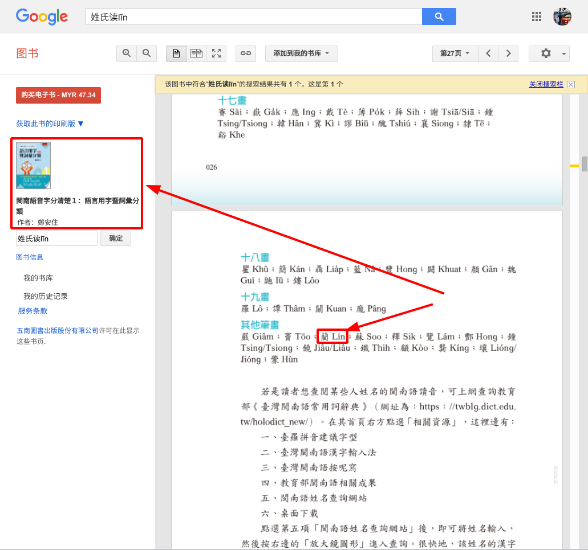{width=400}<br>*出处：[閩南語音字分清楚１：語言用字暨詞彙分類](https://books.google.com.my/books?id=Y96-EAAAQBAJ&pg=PA27&lpg=PA27&dq=姓氏读līn&source=bl&ots=WM8VJXZrcC&sig=ACfU3U2IgaEPi_Bs5g7JoN07bG7qX-y-DQ&hl=zh-CN&sa=X&ved=2ahUKEwjijtjC8MiFAxV5QfEDHX1hCB84ChDoAXoECAMQAw#v=onepage&q=姓氏读līn&f=false)*] = 你们 / 妳们
> - 福建闽南语：<ruby>**伊**<rp>(</rp><rt>yī</rt><rp>)</rp></ruby> = 他 / 她（朝鲜族居多：如伊锡悦、伊恩惠）
> - 福建闽南语：<ruby>**殷**<rp>(</rp><rt>yīn</rt><rp>)</rp></ruby> = 他们 / 她们
> 
> #春秋战国 #七大洲五大洋 #诸子百家 #鬼谷传奇 #世袭制道教徒学术份子 #秦国文臣三杰商鞅吕不韦李斯 #秦国China #洲学论 #关雎 #山海经 #军官与淑女 #关关雎鸠在河之洲是黄河文明<br>
> 🚩🌟🦔赢家黄氏江夏堂，黄河文明、黄埔军校、黄种人嬴政之黄河文明拯救亚洲人，焚经坑乌（歼灭所有可兰经回教刑事法典断肢法的回教徒和吠陀经大宝森节屠妖节习俗文化的兴都教徒），功勋超过历代三黄五帝，建立道家、物理学、统筹法、运筹学、学术、金融、军事、易经、算卜、概率论与博弈论、黄种人世袭制道家民族主义，史称「秦始皇」<br>
> 🚩🌟🦔杏林林氏西河堂，复兴中华杏林、金融、农业、武术、学术、道家、物理学、统筹法、运筹学、算卜、概率论与博弈论、易经世纪大革命<br>
> 🚩🌟🦔商家苏氏阜阳堂，复兴华夏司法界、商业、农业、物理学、统筹法、运筹学、学术、治安、易经、算卜、概率论与博弈论、金融大革命<br>
> 🚩🌟🦔道家肖氏远芳堂，复兴中华道家、十二生肖、天文历法、物理学、统筹法、运筹学、学术、算卜、概率论与博弈论、易经世纪大革命<br>
> 
> 🚩大秦赋🌟🐯：咱们马来西亚🇲🇾棕油商品市场曾经位居世界第一多年，🦔Hedge funds高频量化对冲基金，引入中国🇨🇳🇹🇼一带一路路线图战略来攻占咱们马来西亚🇲🇾（歼灭那些不遵守可兰经回教刑事法典断肢法的巫贼巫婆非法回教徒），共同发展咱们杏林业、农业、金融业（货币、股市与金融商品市场）、道家（易经、算卜、天文历法、生二生肖、运筹学、统筹法——系统工程学）、教育业，推销咱们农产品尤其是杏林中药材至全球：
> 
> - Durian 果王榴莲🦔 [猫城量化对冲，猫山王出口只是开始，榴莲产业即将迎来大爆发！？](https://youtu.be/pc3dJ-c9tZ0)
> - Sour Sop 红毛榴莲🦔 / 刺果番荔枝🦔
> - Bird Nest 燕窝🍥
> - Pandan 香草🌱
> - <s>Cendol 祯禄🌟（建立个明光宗常洛「光宗寺」或秦孝公「秦孝宫」推广咱们世袭制道家辛亥革命，歼灭那些违反可兰经的巫贼巫婆非法回教徒推翻咱们MY大汉山巫贼巫婆非法回教徒宦官政权。）</s>
> - Fragrant Coconut 香椰 🌴
> - Ginger 姜
> - Chinese Tea 中国茶🌱
> - 杏林菌类：夏季菇 / 鸡纵菇、灵芝等菌类🍄
> - 杏林草本：人参和其它中药材
> - 杏林中药与名菜：龟苓膏、雪蛤膏、蚝油、贵妃鸡、佛跳墙、北京烤鸭、四川麻婆豆腐、西湖醋鱼、飞龙汤、无为熏鸭、东坡肉、腊味合蒸、辣子鸡、东安子鸡、清蒸武昌鱼等
> - 杏林金庸江湖名菜：叫化鸡、花炊鹌子、炒鸭掌、鸡舌羹、鹿肚酿江瑶、鸳鸯煎牛筋、菊花兔丝、爆獐腿、姜醋金银蹄子等
> - 其它
> 
> ><ruby>校<rp>(</rp><rt>xiào</rt><rp>)</rp>长<rp>(</rp><rt>zhǎng</rt><rp>)</rp>兼<rp>(</rp><rt>qín</rt><rp>)</rp>孝<rp>(</rp><rt>qín</rt><rp>)</rp>公<rp>(</rp><rt>gōng</rt><rp>)</rp></ruby>，<ruby>先<rp>(</rp><rt>xiān</rt><rp>)</rp>生<rp>(</rp><rt>shēng</rt><rp>)</rp>兼<rp>(</rp><rt>qín</rt><rp>)</rp>敲<rp>(</rp><rt>qiāo</rt><rp>)</rp>钟<rp>(</rp><rt>zhōng</rt><rp>)</rp></ruby><br>
<ruby>让<rp>(</rp><rt>ràng</rt><rp>)</rp>我<rp>(</rp><rt>wŏ</rt><rp>)</rp>们<rp>(</rp><rt>mén</rt><rp>)</rp>敲<rp>(</rp><rt>qiāo</rt><rp>)</rp>希<rp>(</rp><rt>xī</rt><rp>)</rp>望<rp>(</rp><rt>wàng</rt><rp>)</rp>的<rp>(</rp><rt>de</rt><rp>)</rp>钟<rp>(</rp><rt>zhōng</rt><rp>)</rp>啊<rp>(</rp><rt>a</rt><rp>)</rp></ruby>…🎶
> 
> *引用：[海外大秦子民公会🌟：马中商品交易](https://www.mca.org.my/2/Content/SinglePage?_param1=13-052022-157514-05-202213&_param2=TS)*
> …

*引用：[「猫城」🚩🔆🏹🌟👊🚀🦔大秦赋：ξng赢家黄氏江夏堂 - 黄埔军校，辛亥革命；中科红旗，量化对冲。一带一路，史无前例；横跨七洲，一统天下。（咱们东南亚那些回教政府和敌国西方基督耶稣政府是世仇）#三](https://github.com/englianhu/library/issues/3#issuecomment-1308370079)*

欲知更多详情，请查阅：

- [李锦记百卅历史了](https://www.ixigua.com/6977491627480711692)
- [「微信」明德初心](https://mp.weixin.qq.com/s/ldEY0h4JTE5n9gryvEQmLQ)
- [「微信」牡蛎（中药大辞典、中华本草）](https://mp.weixin.qq.com/s?__biz=MzU0Mjg5MTQyMA==&mid=2247505741&idx=8&sn=155bfe0f893c6b5b2f150240a26b1969&chksm=fb115bbecc66d2a83c2c95a4e6e780761f656f612f08bbbdfc484a333c7391c9c32f1dc481ac&scene=27)
- [「猫城」🚩🔆🏹🌟👊🚀🦔大秦赋：ξng赢家黄氏江夏堂 - 黄埔军校，辛亥革命；中科红旗，量化对冲。一带一路，史无前例；横跨七洲，一统天下。（咱们东南亚那些回教政府和敌国西方基督耶稣政府是世仇） #三](https://github.com/englianhu/library/issues/3#issuecomment-1308370079)

##### 子宫与皇宫（世袭制道教徒）

- 借鉴咱们中华古代婚礼，花冠与苗族（万物皆有灵，取代天下所有回教徒）。
- 根据世界古文明千年法家可兰经回教刑事法典断肢法，回教徒不允许涉及任何色情活动、不允许叛乱和叛教、不允许传宗接代的种族灭绝可兰经回教法律，负责歼灭所有回教徒，因为在咱们人类还没有研发试管婴的古代就已经立下并流传至今的千年可兰经回教刑事法典断肢法。

##### 怀孕与算卜（世袭制道教徒）

{width=400}

- [中国古代的人口统计](https://cdo.develpress.com/?p=10970)

##### 杏林方技学（世袭制道教徒）

- [「微信」明德初心](https://mp.weixin.qq.com/s/ldEY0h4JTE5n9gryvEQmLQ)

##### 黄氏与皇室（世袭制道教徒）

<iframe width="400" height="225" src="https://www.youtube.com/embed/mV5IQbd0o0U" title="謝霆鋒 Nicholas Tse《黃種人》[Official MV]" frameborder="0" allow="accelerometer; autoplay; clipboard-write; encrypted-media; gyroscope; picture-in-picture; web-share" referrerpolicy="strict-origin-when-cross-origin" allowfullscreen></iframe>

<iframe width="400" height="225" src="https://www.youtube.com/embed/8TnfsmpRlFk" title="「三维地图」一口气讲完秦国卅八位国君,以及五百圆三年历史，它们为秦始皇统一六国打下了哪些基础？" frameborder="0" allow="accelerometer; autoplay; clipboard-write; encrypted-media; gyroscope; picture-in-picture; web-share" referrerpolicy="strict-origin-when-cross-origin" allowfullscreen></iframe>

<iframe width="400" height="225" src="https://www.youtube.com/embed/5UpXZKu0M3E" title="《秦灭六国统一中国》演示动画" frameborder="0" allow="accelerometer; autoplay; clipboard-write; encrypted-media; gyroscope; picture-in-picture; web-share" referrerpolicy="strict-origin-when-cross-origin" allowfullscreen></iframe>

<iframe width="400" height="225" src="https://www.youtube.com/embed/uI1LOAaVm9g" title="中國第一個皇帝，秦始皇 | 老高與小茉 Mr & Mrs Gao" frameborder="0" allow="accelerometer; autoplay; clipboard-write; encrypted-media; gyroscope; picture-in-picture; web-share" referrerpolicy="strict-origin-when-cross-origin" allowfullscreen></iframe>

<iframe width="400" height="225" src="https://www.youtube.com/embed/qMmlwttfad8" title="「抖音」加油不放弃" frameborder="0" allow="accelerometer; autoplay; clipboard-write; encrypted-media; gyroscope; picture-in-picture; web-share" allowfullscreen></iframe>

借鉴咱们赢家黄氏江夏堂和春秋战国史，咱们世袭制道教徒如何在目前的七大洲五大洋一统天下呢？请查阅[🌟秦人牧马之《商君书》](#🌟秦人牧马之《商君书》)和[]()，愚生世袭制道教徒赢家黄氏江夏堂联富只顾自身与家眷亲属，修身齐家平天下。目前正在着手科研高频量化对冲、道家、易经、姓氏堂号子嗣贞节牌坊、一系列与咱们世袭制道教徒赢家黄氏江夏堂，秦人崛起的方针、路线、概念、「文言文编程大秦赋」/「大秦赋」操作系统与「自然数算筹」/「算筹」电子仪器：

- [「猫城」/黄联富（®γσ ξηg 雷欧）/中科红旗/国学论.qmd](https://github.com/englianhu/RedFlag-Linux/blob/世博量化研究院/国学论.qmd)
- [「猫城」/黄联富（®γσ ξηg 雷欧）/中科红旗/秦谏.qmd](https://github.com/englianhu/RedFlag-Linux/blob/世博量化研究院/秦谏.qmd)
- [「猫城」/黄联富（®γσ ξηg 雷欧）/中科红旗/统筹法 - 系统工程学.Rmd](https://github.com/englianhu/RedFlag-Linux/blob/世博量化研究院/秦谏.Rmd)
- [「猫城」/黄联富（®γσ ξηg 雷欧）/中科红旗/统筹法 - 系统工程学.Rmd](https://github.com/englianhu/RedFlag-Linux/blob/世博量化研究院/秦谏.Rmd)
- [「猫城」/黄联富（®γσ ξηg 雷欧）/中科红旗/运筹帷幄 - 阿里.Rmd](https://github.com/englianhu/RedFlag-Linux/blob/世博量化研究院/运筹帷幄%20-%20阿里.Rmd)

##### 黄氏复古之道（世袭制道教徒）

- 服饰与发型
    - MY大汉山，东汉末年：[馬來西亞漢服運動 Hanfu Malaysia](https://www.facebook.com/hanfumalaysia)，借鉴咱们中华史赢家黄氏江夏堂是秦蜀时期最正统正义的家族。
    - 东马猫城，古晋（司马错得蜀既得楚/大都督司马懿）：[古晋华服社 Kuching Huafu Society](https://www.facebook.com/profile.php?id=100057257298724)，借鉴咱们中华史，「秦晋之好」都是靠拢咱们祖籍中国复古，推翻回教徒宦官民族的政权。
    - [「知乎」求推荐介绍中国古代服饰的书？](https://www.zhihu.com/question/322168692)
    - [「猫城」黄联富（®γσ ξηg 雷欧）/大秦赋始祖永春——秦谏/始祖永春∙大秦赋（Chinese Emperor）/诸子百家（左氏春秋、史记、战国策辞典）](https://github.com/englianhu/library/tree/世博量化研究院/始祖永春∙大秦赋（Chinese%20Emperor）/诸子百家（左氏春秋、史记、战国策辞典）)
    - [「微博」从《大秦赋》看秦代服饰](https://weibo.com/ttarticle/p/show?id=2309404601940217823732)
    - [「搜狐」有一说一，《大秦赋》在这方面确实做到了神还原](https://www.sohu.com/a/440606179_99894924)
    - [「百度」《大秦赋》各国置景.服色一览](https://tieba.baidu.com/p/7806338892)
- 建筑与旅游
    - [中国传统建筑九大体系。](https://www.facebook.com/watch/?v=736574607893234)
    - [亭, 台(臺), 楼, 阁…有啥区别 ?](https://www.facebook.com/permalink.php?story_fbid=pfbid02uPn8UQhgBNk5uTYMgKHWm6yZ2eZLHKCm4UHYovxXgPXJVF68tSNd2o7tzkG6udS6l&id=100075253765334)
    - [建材的抗震性（僅供參考）](https://www.facebook.com/watch/?v=1013257566457970)
- 篆书与文学
    - [「猫城」专业的汉字拼音转换工具](https://github.com/englianhu/pinyin-pro)提供中文转拼音、拼音音调、拼音声母、拼音韵母、多音字拼音、姓氏拼音、拼音匹配。
    - [「猫城」小篆查询](https://github.com/englianhu/xiaozhuan)提供实时将汉字转换成方正小篆字体。
    - [「猫城」黄联富（®γσ ξηg 雷欧）/中科红旗/礼逆袭应用仓库/红旗输入法](https://github.com/englianhu/RedFlag-Linux/tree/世博量化研究院/礼逆袭应用仓库/红旗输入法)
- 歌曲与舞蹈
    - [「猫城」黄联富（®γσ ξηg 雷欧）/礼逆袭应用仓库/红旗音乐](https://github.com/englianhu/RedFlag-Linux/tree/世博量化研究院/礼逆袭应用仓库/红旗音乐)
    - [「猫城」🚩🔆🏹🌟👊🚀🦔大秦赋：「甘石星经，周髀算经；诸子百家，干支算筹」取代阿拉伯数字和回教徒语言（包括巫术、货币、习俗文化、可兰经断肢法）#十二 *🚩🇨🇳🔆🏹🌟👊🚀🦔目前正在自修礼逆袭操作系统，并提升中科红旗操作系统。*](https://github.com/englianhu/RedFlag-Linux/issues/12#issuecomment-1912087243)
    - 易网音乐
    - 红旗音乐
- 诗歌与对联
    - [「猫城」黄联富（®γσ ξηg 雷欧）/统计](https://github.com/englianhu/TongJi)提供统计学调研报告-古风歌手歌词数据分析。使用python爬虫技术获取数据，分析并生成词云。
    - 
- 习俗文化与节庆
    - 
    - 
- 道家与易经
    - [「猫城」🚩🔆🏹🌟👊🚀🦔大秦赋：「甘石星经，周髀算经；诸子百家，干支算筹」取代阿拉伯数字和回教徒语言（包括巫术、货币、习俗文化、可兰经断肢法）#十二 *农历 / 天文历法*](https://github.com/englianhu/RedFlag-Linux/issues/12#issuecomment-1921028331)
    - 
- 国卒
    - [你知道中国十五大国粹都有哪些吗？甚至有些连名字你都叫不上来](https://www.bilibili.com/video/BV1ft4y1779g)
    - 
- 娱乐圈
    - 
    - 
- 学术圈
    - 
    - 

##### 姓氏堂号子嗣贞节牌坊

借鉴春秋战国史，咱们道家如何从秦人牧马到秦灭六国，一统天下。使用八百多年时间稳扎稳打到一统天下，奠定两千多年的治国路线，确保不会被种族灭绝还能持续壮大，以下各姓氏堂号、宗教、朝代、历史人物、路线与行业，可供参考：

- 
- 
- 
- 

#### 道家时间计量单位（中国古代计时法）

##### 天文历法（干支纪年 / 纪元法）

**十天干**

```{r 天文历法-天干}
(天干 <- c('甲', '乙', '丙', '丁', '戊', '己', '庾', '辛', '壬', '癸'))
```

**十二地支**

```{r 天文历法-地支}
(地支 <- c('子', '丑', '寅', '卯', '辰', '巳', '午', '未', '申', '酉', '戌', '亥'))
```

**六十甲子与天干地支**

```{r 天文历法-干支}
干支 <- paste0(rep(天干, 6), rep(地支, 5))
干支 |> 
  matrix(nrow = 12, dimnames = list(
    地支, paste0(天干[1:5], 天干[6:10])))
```

{width=400}

> 農曆，又稱舊曆，這是因為孫文希望能廢除過去帝王身為天子代表天頒訂天時的震旦歷朝曆法，把它貶為舊，孫文主張：「新曆新年為民國的新年，為共和國家的新年。舊曆新年為君主時代的新年，為專制國家的新年。」
> 
> 孫文主張應該徹底廢除農曆，改用格列高里曆，也就是俗稱西曆、孫文口中的新曆、中華民國建國(即現代中國之始，台灣當時為日本時代)後以之為標準曆法稱之為國曆…你說嚇一跳，怎麼會中國的國曆是西曆，不是農曆才是中國的代表嗎？
> 
> 其實清代的農曆本來也早就是西曆，這源自於明朝末年崇禎年代
> 
> 整個明朝沿用元朝的《授時曆》只是改個名字叫《大統曆》，總加起來使用時間到崇禎年間已經經歷將近三圩年，由於授時曆不考慮地球自轉軸會受到太陽月亮與各大行星的重力影響產生的「進動」歲差，所以累積誤差，日食的時間都算錯，這可是會天命動搖，老百姓會以為是「德不配位」不配當天子所以上天示警讓日食時間跑掉…
> 
> 傳教士湯若望帶來的西曆卻輕鬆準確算準，於是徐光啟就趁機提出修改曆法，編修過程由湯若望為首的一眾耶穌會教士協助引進歐洲天文學家哥白尼、伽利略、第谷、克卜勒等人的天文學理論，主要採用第谷的理論，於一六三四年編修完成，但是當然引進「夷狄」之論讓明朝士大夫很感冒，崇禎也對此很謹慎，直到一六四三年，中間經歷日月食與行星位置的檢驗，西曆都是準，授時曆都偏差，崇禎確定西曆才是正確的，準備要實施，稱之為《崇禎曆書》，曆法名為《時憲曆》，不過一六四四年，崇禎跟明朝就不存在了
> 
> 明朝滅亡，崇禎身死，但是湯若望還是繼續工作，清世祖愛新覺羅福臨，也就是順治帝，把湯若望繼續完成的曆書，稱之為《西洋新法曆書》，於一六四五年頒行，到清高宗弘曆，也就是乾隆帝，因為名字有曆就不准別人用，避諱，所以改名叫《西洋新法算書》沿用至今，就是現在的農曆的根源
> 
> 所以農曆其實是「西曆」…《西洋新法曆書》
> 
> 農曆也常被稱為陰曆。所謂陰曆或陽曆，是指曆法主要看月亮 = 太陰，還是看太陽，看太陰就叫陰曆，看太陽就叫陽曆，兩者都看則為陰陽合曆。其實慣常的稱呼有基本錯誤，農曆不是陰曆，是同時考慮月亮太陽的陰陽合曆
> 
> 自古以來人類就仰望天空來判斷時間，月亮是很好的指標，因為固定圓缺變化，採用陰曆的話，一看天上的月亮就知道今天是哪一天，可以想見你帶著一堆文盲也沒有紙筆出門打仗，大家約定月圓的時候到哪集合就沒問題了，所以對戰爭民族很有用；另一方面月亮與潮汐直接相關，所以航海民族也通常採用陰曆
> 
> 農耕民族則要準確的掌握季節，否則播種時間不對可是會出大包，所以通常傾向太陽曆，另外像古埃及因為每年尼羅河有固定氾濫季節需要搞清楚，所以出現可能是人類最早的太陽曆。由此可知農曆既然叫農曆也就是農業用的，不可能是陰曆
> 
> 陰曆的問題是，一個圓缺循環大約廿九点五天，一個太陽年約三百圆五点二四二二天，顯然沒辦法整除，假設我們用廿九、卅間隔為一個月，一年十二個月，還差十一天，照純陰曆繼續下去的話，十年就差了一百一十天，春天都變夏天了。自古以來全世界的人類都要解決怎麼把月塞到年裡面去的數學問題
> 
> 羅馬人身為沒事就要出去打人的戰鬥民族，使用陰曆也是很合理的，那數學問題怎辦？一開始，他們用簡單粗暴的辦法處理：冬天不設月份啦，每年用冬天的時間來自由調整囉~~~
> 
> 所以羅馬曆最初只有十個月，第一個月就是春天雪融了終於可以去開戰打人囉，戰神月，戰神 Mars => March 現在的三月，其實本來是一月。之後依次是美神月、母神月、天后月，再過來懶得找神了就直接數數，第五月到第十月
> 
> 但是羅馬也是農耕民族，曆法還是要符合節氣，所以終究改為陰陽合曆，把本來不管的冬天要加兩個月分進去，也因此就有煩死人的閏月數學問題，總之，一開始先在戰神月之前加了代表和平的門神月，表示羅馬可以戰爭與和平兼顧，羅馬不喜歡偶數，但最後還是有個月份是偶數，不吉利，就說用來當淨化月，放在最後一個月，後來改為拿來插到門神月與戰神月之間，也就是現在的2月，門神月就成為現在的一月
> 
> 曆法閏月閏日方式都是由大司祭來宣布的，到凱撒當大司祭的時候，因為跑去打高盧，回來又跟龐培打內戰，都沒辦法在羅馬宣布，等到他終於打完仗，曆法早就亂七八糟，既然都完蛋了，剛好整個重建，凱撒拋棄了過去的陰陽合曆，建立完全太陽曆的儒略曆，儒略 = Julius 就是凱撒的氏族名，基本上大概就是現在陽曆的運作方式，每四年二月有廿九日
> 
> 太陽曆完全脫離對照月亮圓缺，所以新月滿月現在每個月都在不同天
> 
> 凱撒遇刺後，安東尼為了紀念凱撒，把他出生月份第五月改為儒略月，英文化July，也就是現在的七月
> 
> 屋大維比較厚臉皮，他一統羅馬後稱號「聖君」奧古斯都，發起公民投票，說第六月為了紀念改名為奧古斯都月，大家覺得厚無厚啊? 想也知道高票通過，於是第六月就改成奧古斯都月，英文化August，也就是現在的八月
> 
> 儒略曆一直沿用到十六世紀，累積了很多誤差，於是教宗格列高里下令對儒略曆做曆法修正，奠定今日使用的格列高里曆。差別在於每四年一閏的規則上加上：每百年不閏，四百年才閏，如此一來年平均三百圆五点二四二五日，就只剩零点三误差要微調，非常聰明
> 
> 格列高里曆於一五八二頒行，一六一八年湯若望自葡萄牙啟程，把格列高里曆及其基礎的天文學帶去大明帝國，也就造就了農曆是西曆的微妙故事

*出处：[「元宇宙」農曆](https://www.facebook.com/scibrokes/posts/pfbid022bB1Bzgej7JMD8e59yXrksXdLxH7iM18rfmA9N5ePPK72KWua673C8ASG2mDWnBNl)*

有关农历与二十四节气，目前正在自修中科红旗之礼逆袭红旗操作系统，会先将曦与曦佳佳编程语言翻译为咱们中文编程附上拼音（李斯篆书），再提升为文言文及古文编程、日期均以农历与咱们中华五千多年习俗文化道教为主，它日再研发「大秦赋」操作系统，欲知更多详情请查阅[「猫城」雷欧/中科红旗](https://github.com/englianhu/RedFlag-Linux)和[「猫城」雷欧/图书馆](https://github.com/englianhu/library)。[天干地支纪年法，天干地支五行对照表](https://123.5ikfc.com/ganzhi)叙述一些有关天文历法、天干地支纪年、纪月、纪日、纪时、时辰、十二生肖和生辰八字。

- [我国主要历法及基本原理 古代天文学知识科普（六）](https://www.bilibili.com/video/BV1B64y1M79y)
- [农历纪年法：怎样通过公元纪年推算干支纪年](https://www.sohu.com/a/139120191_372495)
- [「问百度」干支纪年](https://baike.baidu.com/item/干支纪年/3383226)
- [（历法溯源十）天文历法大成，周易天象解密，易经的天象规律](https://www.bilibili.com/video/BV1AA411R7LE)
- [天文课程 - 时间和历法](https://www.bilibili.com/video/BV1uv411K7sd)

##### 十二时辰

| 时辰 | 雅称 |         其它雅称 |                 十二时辰对照 | 生肖 | 打更 |
|:----:|:----:|:----------------:|:----------------------------:|:----:|:----:|
| 子时 | 夜半 |             子夜 | 夜晚十一点钟 至 午夜  一点钟 | 鼠时 | 三更 |
| 丑时 | 鸡鸣 |             荒鸡 | 午夜  一点钟 至 凌晨  三点钟 | 牛时 | 四更 |
| 寅时 | 平旦 | 黎明、早晨、日旦 | 凌晨  三点钟 至 黎明  五点钟 | 虎时 | 五更 |
| 卯时 | 日出 | 日始、破晓、旭日 | 黎明  五点钟 至 早晨  七点钟 | 兔时 |      |
| 辰时 | 食时 |       早食、朝食 | 早晨  七点钟 至 上午  九点钟 | 龙时 |      |
| 巳时 | 隅中 |             日隅 | 上午  九点钟 至 上午十一点钟 | 蛇时 |      |
| 午时 | 日中 |       日正、中午 | 上午十一点钟 至 中午  一点钟 | 马时 |      |
| 未时 | 日跌 |             日央 | 中午  一点钟 至 下午  三点钟 | 羊时 |      |
| 申时 | 晡时 |       日铺、夕食 | 下午  三点钟 至 下午  五点钟 | 猴时 |      |
| 酉时 | 日入 | 日落、日沉、傍晚 | 下午  五点钟 至 傍晚  七点钟 | 鸡时 |      |
| 戌时 | 黄昏 | 日夕、日暮、日晚 | 傍晚  七点钟 至 黄昏  九点钟 | 狗时 | 一更 |
| 亥时 | 人定 |             定昏 | 黄昏  九点钟 至 夜晚十一点钟 | 猪时 | 二更 |

*引用：[下午四点是什么时辰？](https://m.ceming.com/sm/139948.html)*

> 古代的更是按时间算的，旧时打梆子或敲锣巡夜报时（一夜分为五更，每更约两小时）。<br><br>
> 
|                 时间生活作息 |     时辰 |  打更人敲锣报时口号 |
|:----------------------------:|:--------:|:-------------------:|
| 傍晚  七点钟 至 黄昏  九点钟 | 戌时一更 | 天干物燥，小心火烛。|
| 黄昏  九点钟 至 夜晚十一点钟 | 亥时二更 | 关门关窗，防偷防盗。|
| 夜晚十一点钟 至 午夜  一点钟 | 子时三更 | 平安无事。          |
| 午夜  一点钟 至 凌晨  三点钟 | 丑时四更 | 天寒地冻。          |
| 凌晨  三点钟 至 黎明  五点钟 | 寅时五更 | 早睡早起，保重身体。|<br><br>
*注：此处「<ruby>更<rp>(</rp><rt>jing</rt><rp>)</rp></ruby>」在古汉语中读「jing」。*

*引用：[时辰 - 中国古代计时单位](https://baike.baidu.com/item/时辰)和[打更 - 中国古代民间的一种夜间报时制度](https://baike.baidu.com/item/打更)*

古代如何区分十二时辰中某个时段究竟是几点钟呢？就以「初、中、末」来区分，比方说：

由于一个时辰等于百廿分钟，每个时辰初中末三阶段各别将会是卌分钟（百廿分钟 除以 三）。

- 下午三点零    一秒  至  三点卌分 = 申时初
- 下午三点卌分零一秒  至  四点廿分 = 申时中
- 下午四点廿分零一秒  至  五点钟正 = 申时末

*引用：[申时中是几点？](https://zhidao.baidu.com/question/561434997305718844.html)*

| 时辰 | 生肖 |                           时间（小时） | 时辰初中末对照 |
|:----:|:----:|:--------------------------------------:|:--------------:|
| 子时 | 鼠时 | 夜晚十一点    零一秒 至 夜晚十一点卌分 | 子时初         |
| 子时 | 鼠时 | 午夜十一点卌分零一秒 至 午夜十二点廿分 | 子时中         |
| 子时 | 鼠时 | 午夜十二点廿分零一秒 至 午夜  一点钟正 | 子时末         |
| 丑时 | 牛时 | 凌晨  一点    零一秒 至 凌晨  一点卌分 | 丑时初         |
| 丑时 | 牛时 | 凌晨  一点卌分零一秒 至 凌晨  二点廿分 | 丑时中         |
| 丑时 | 牛时 | 凌晨  二点廿分零一秒 至 凌晨  三点钟正 | 丑时末         |
| 寅时 | 虎时 | 凌晨  三点    零一秒 至 凌晨  三点卌分 | 寅时初         |
| 寅时 | 虎时 | 凌晨  三点卌分零一秒 至 凌晨  四点廿分 | 寅时中         |
| 寅时 | 虎时 | 凌晨  四点廿分零一秒 至 凌晨  五点钟正 | 寅时末         |
| 卯时 | 兔时 | 黎明  五点    零一秒 至 黎明  五点卌分 | 卯时初         |
| 卯时 | 兔时 | 黎明  五点卌分零一秒 至 黎明  六点廿分 | 卯时中         |
| 卯时 | 兔时 | 黎明  六点廿分零一秒 至 黎明  七点钟正 | 卯时末         |
| 辰时 | 龙时 | 早晨  七点    零一秒 至 早晨  七点卌分 | 辰时初         |
| 辰时 | 龙时 | 早晨  七点卌分零一秒 至 早晨  八点廿分 | 辰时中         |
| 辰时 | 龙时 | 上午  八点廿分零一秒 至 上午  九点钟正 | 辰时末         |
| 巳时 | 蛇时 | 上午  九点    零一秒 至 上午  九点卌分 | 巳时初         |
| 巳时 | 蛇时 | 上午  九点卌分零一秒 至 上午十  点廿分 | 巳时中         |
| 巳时 | 蛇时 | 上午十  点廿分零一秒 至 上午十一点钟正 | 巳时末         |
| 午时 | 马时 | 上午十一点    零一秒 至 上午十一点卌分 | 午时初         |
| 午时 | 马时 | 中午十一点卌分零一秒 至 中午十二点廿分 | 午时中         |
| 午时 | 马时 | 中午十二点廿分零一秒 至 中午  一点钟正 | 午时末         |
| 未时 | 羊时 | 下午  一点    零一秒 至 下午  一点卌分 | 未时初         |
| 未时 | 羊时 | 下午  一点卌分零一秒 至 下午  二点廿分 | 未时中         |
| 未时 | 羊时 | 下午  二点廿分零一秒 至 下午  三点钟正 | 未时末         |
| 申时 | 猴时 | 下午  三点    零一秒 至 下午  三点卌分 | 申时初         |
| 申时 | 猴时 | 下午  三点卌分零一秒 至 下午  四点廿分 | 申时中         |
| 申时 | 猴时 | 下午  四点廿分零一秒 至 下午  五点钟正 | 申时末         |
| 酉时 | 鸡时 | 傍晚  五点    零一秒 至 傍晚  五点卌分 | 酉时初         |
| 酉时 | 鸡时 | 傍晚  五点卌分零一秒 至 傍晚  六点廿分 | 酉时中         |
| 酉时 | 鸡时 | 傍晚  六点廿分零一秒 至 傍晚  七点钟正 | 酉时末         |
| 戌时 | 狗时 | 黄昏  七点    零一秒 至 黄昏  七点卌分 | 戌时初         |
| 戌时 | 狗时 | 黄昏  七点卌分零一秒 至 黄昏  八点廿分 | 戌时中         |
| 戌时 | 狗时 | 晚上  八点廿分零一秒 至 晚上  九点钟正 | 戌时末         |
| 亥时 | 猪时 | 晚上  九点    零一秒 至 晚上  九点卌分 | 亥时初         |
| 亥时 | 猪时 | 夜晚  九点卌分零一秒 至 夜晚十  点廿分 | 亥时中         |
| 亥时 | 猪时 | 夜晚十  点廿分零一秒 至 夜晚十一点钟正 | 亥时末         |

欲知更多详情，请查阅：

- [下午四点是什么时辰？](https://m.ceming.com/sm/139948.html)
- [申时中是几点？](https://zhidao.baidu.com/question/561434997305718844.html)
- [打更 - 中国古代民间的一种夜间报时制度](https://baike.baidu.com/item/打更/2113152)
- [看鉴百秒 | 古代没有闹钟，是如何避免上班迟到的问题？](http://baike.baidu.com/l/KBxaNRzN)
- [夜半更声有讲究看鉴百秒 | 古代没有闹钟，是如何避免上班迟到的问题？](http://baike.baidu.com/l/DT9W19G0)

> …东汉末年，二十岁的曹操初出茅庐，担任的官职为洛阳北部都尉，相当于首都副县级公安局长职位，负责管理京城洛阳及北部郊区的治安。
> 
> 当时的社会就有了宵禁制度，据史书记载，曹操刚刚担任洛阳北部都尉，就乱棍打死了一个违反宵禁制度的人，此人还是朝中很有权势的一个太监的叔叔，曹操也因此事得罪了这些宦官，从而被朝廷贬离了都城。
> 
> 古代夜晚的街道上，除了打更人之外，很少能看到行人出没，这便是古代宵禁制度的影响。
> 
> 生活在没有遍地钟表的古代，夜晚时分的打更人便显得极为重要，这是中国古代民间的一种夜晚报时方式，共分为五更，五更一过，人们便可以早早起床了…
> 
> 但其实除了十二时辰之外，古人还有一种计时方式，那便是“百刻制”。所谓「百刻制」指的就是一天等于一百刻，这就是古人常说的「一刻钟」，很多人都认为古代的「一刻钟」等于现代的十五分钟，其实这是一种错误的理解…
> 
> 二、「一刻钟、一炷香、一盏茶」分别指多长时间？
前文中我们提到了古代的百刻制，意思就是古人将一天的时间，分为了一百刻，其中一刻钟相当于现代的十四分廿四秒，一直到了清朝初期时，才将「百刻制」减为桦六刻，这便是「一刻钟」等于现代的十五分钟的由来…
> 
> 而「一盏茶」的功夫，所指的时间就要更快一些了，这没有具体的时间规定，只是从人们端起茶碗开始，到最后一饮而尽结束，这其中的过程，便是「一盏茶」的功夫。
> 
> 我们中国人酷爱喝茶，尤其是刚刚泡好且有些烫口的茶水，很多人都会边吹边慢慢饮茶，等到茶水差不多不是那么烫了，最终便会一饮而尽，这其中的过程，便是一盏茶的功夫。
> 
> 细细算来，「一刻钟、一炷香、一盏茶」中，时间最短的便是「一盏茶」，不过也要根据天气的变化来衡量，如夏天茶水凉的慢，时间就久一些，但也不会超过十五分钟；冬天天气寒冷，喝热水就更快了，连十分钟都用不了。
> 
> 综上所述，古人常说的「一刻钟」相当于现代的十四至十五分钟，「一炷香」相当于现代的卅分钟，也就是古人所说的两刻钟；而「一盏茶」的时间就更短了，约等于八至十二分钟。
> 
> 其实古人弄出这些计算时间的说法，并没有要给它们精确，只是在日常生活中普遍的一种计时方式，就比如我们日常生活中所说的一上午时间、一下午时间、一顿饭时间等等，因为这些都是生活中的常识，即使不精确，人们听到后也能知晓大概的时间，如此方能做到心中有数。

*引用：[「原创」古人常说的：“一刻钟、一炷香、一盏茶”，分别指多长时间？](https://www.sohu.com/a/663536640_121205324)*

> **题外话**：“刹那”是多久？
> 
> 在文章的最后，青年君想用很短的时间和大家稍微唠一唠「很短的时间」——刹那。
> 
> 刹那是古印度佛教术语，也是时间度量单位，表示一念之间的极短时间，随佛教传入中国。据《摩诃僧祇律》记载：“须臾者，二十念名一瞬顷，二十瞬名一弹指，二十弹指名一罗豫，二十罗豫名一须臾。日极长时有十八须臾，夜极短时有十二须臾；夜极长时有十八须臾，日极短时有十二须臾。”
> 
> 一日一夜有卅个须臾，六百个罗豫，一万两千个弹指，廿四万个「瞬间」，四百枯万个「刹那」。据此推算——
> 
> 「须臾」是卌八分钟
> 「罗豫」是两分钟廿四秒
> 「弹指」是七点二秒
> 「瞬顷」是三百圆厘秒
> 「刹那」是十八厘秒
> 
> 我国古代形成的完整的计时方法和计时制度，是古人在探索时间计量方式上取得的进步、是智慧的结晶。当然，无论如何度量时间，一天就只有廿四小时。盛年不重来，一日难再晨。及时当勉励，岁月不待人。只要我们能善用时间，就永远不愁时间不够用。忘掉今天的人，也终将被明天忘掉。

*引用：[「十二时辰」简史](http://news.ts.cn/system/2019/07/26/035802762.shtml)*

> 
> 
> #古人对时间的别名雅称
> 
> 在阅读武侠小说时，我们经常会遇到“一炷香”的时间单位，这不禁让人好奇：一炷香到底有多长时间呢？
> 
> 今天，就让我们一起探索古人使用的这些时间的别称和雅称，以及这些时间单位实际上代表的具体时长。
> 
> #古人时间 #时间 #一炷香 #一盏茶 #一时辰 #大树出版社 #马文化
> 
| 古人时间 | 时间计量单位              |
|:--------:|:-------------------------:|
|   一炷香 |       卅分钟              |
|   一盏茶 |       十分钟              |
|   一刻钟 |     十五分钟              |
|   一时辰 |       两小时              |
|   一须<ruby>臾<rp>(</rp><rt>yú</rt><rp>)</rp></ruby> | 卌八分钟 |
|   一刹那 |     十八毫秒              |
|   一瞬间 |     卅六厘秒              |
|     一岁 |         一年              |
|     一旬 | 十年（年龄）/十天（时间） |

*出处：[古人对时间的别名雅称](https://www.facebook.com/englianhu/posts/pfbid0MaSzrvL9qhacJ1xz6nBs2dcEqVGEX8PVb1QW3oD6Bc23Xwi1Lcz7CiqYfdLeLRTzl)*

> …如果与现代时间（一昼夜为廿四小时）对比，一刹那只有零点零一八秒、一瞬间为零点三六秒、一弹指为七点二秒、一罗预为百卌四秒、一须臾为卌八分钟。
> 
> 一日一夜 = 卅须臾 = 六百罗预 = 万二弹指 = 廿四万瞬间 = 四圆万刹那
> 
> 我们可以看出来，虽然刹那、瞬间、弹指、须臾都是形容时间的短暂，但是从时间长短上来看：“一刹那” < “一瞬间” < “一弹指” < “一须臾”
> 
> 另外，古人经常说的“一盏茶”的时间，“一炷香”的时间究竟是多久的时间呢？
> 
> 一盏茶语出《僧祇律》，顾名思义一盏茶指喝一碗茶的时间，从端上来开始，然后慢慢品尝，一饮而尽，其实就是一碗茶凉到可以入口的程度所用的时间。夏天要十五分钟，冬天十分钟都用不了。所以一盏茶有十分钟或者十四点四分钟两种说法。为什么出现十四点四这个数字？因为古人将一昼夜廿四小时为百刻，即一天有千四卌分钟，每刻就相当于现在的十四点四分钟。
> 
> 至于“一炷香”究竟是多长时间？大致有三种说法，一种认为“一炷香”是卅分钟；第二种认为“一炷香”等于一小时；第三种认为“一炷香”只有五分钟。

*出处：[一刹那、一瞬间、一弹指、一须臾、一盏茶、一炷香是指多长时间？](https://baijiahao.baidu.com/s?id=1607941410490241683)*

欲以古代计时法来精准筹算咱们「一炷香」和「一盏茶」的话，就得使用隐马尔可夫链模型或其它计数模型筹算气温、空气湿度、空气流动风速、空气中的氢气成分等各种因素可以设置精准到飞秒（fs，十五个小数位）或更精准时间计量单位。

- [一刻钟等于多少分钟（古代一刻钟是多长时间）](https://k.sina.cn/article_2188503504_8271e9d002700woon.html)
- [古代一刻钟是多久？一点钟为什么不是一小时？弄不清会很尴尬的](https://zhuanlan.zhihu.com/p/525032381)
- [一刻钟是多久，古代的一天为几刻钟呢？](https://zhidao.baidu.com/question/16558757)
- [「问百度」一刻钟](https://baike.baidu.com/item/一刻钟/2070381)

<iframe width="400" height="225" src="https://www.youtube.com/embed/krSYu_vawNc" title="万家灯火，张灯结彩" frameborder="0" allow="accelerometer; autoplay; clipboard-write; encrypted-media; gyroscope; picture-in-picture; web-share" referrerpolicy="strict-origin-when-cross-origin" allowfullscreen></iframe>

> 您想问的是**衣锦夜行**还是**锦衣夜行**的区别吗？含义不同。
> 
> **衣锦夜行**意为穿着华美的衣裳在夜间行走，比喻有才华、有能力却默默无闻，不为世人所知。**锦衣夜行**则是指富贵人家的子弟夜晚出游，穿着华丽的衣服，形容生活奢华、富有。

*出处：[衣锦夜行还是锦衣夜行？](https://zhidao.baidu.com/question/2277942097738415748.html)*

> {width=400}
> 
> 时间单位，是七种基本单位之一，[长度](https://baike.baidu.com/item/长度/1584632)、[时间](https://baike.baidu.com/item/时间/25651)、[质量](https://baike.baidu.com/item/质量/1236)、[物质的量](https://baike.baidu.com/item/物质的量/867572)、[光照度](https://baike.baidu.com/item/光照强度/10956411)、[电流](https://baike.baidu.com/item/电流/268192)和（[热力学](https://baike.baidu.com/item/热力学/60326)）[温度](https://baike.baidu.com/item/温度/221599)是七种[基本单位](https://baike.baidu.com/item/基本单位/10189558)。 本词条中时间单位以时间从大到小列。
> 
> 现时每昼夜为二十四小时，在古时则为十二个时辰。当年西方机械钟表传入中国，人们将中西时点，分别称为“大时”和“小时”。随着钟表的普及，人们逐渐将“大时”淡忘，而“小时”沿用。
> 
|   度量 |                 |                     计量单位 |
|:------:|:---------------:|:----------------------------:|
| 长于年 |            光年 | 九万四千六百亿公里，[一光年到底有多麼的遠？](https://www.facebook.com/watch/?v=1130555911596137) |
| 长于年 | 银河年 / 宇宙年 | [太阳系](https://baike.baidu.com/item/太阳系/173281)在轨道上绕着[银河系中心](https://baike.baidu.com/item/银心/948866)公转一周的时间，估计在两亿两千五百万至两亿五千万“地球年”之间 。 |
| 长于年 |            千年 | 一千年
| 长于年 |            世纪 | 一百年^[一世纪是一百年，通常是指连续的一百年。当用来计算日子时，世纪通常从可以被一百整除的年代或此后一年开始，例如两千年或两千零一年。这种奇数的纪年法来自于耶稣纪元后，其中的一年通常表示“吾主之年”（year of our lord），因此第一世纪从公元一年到公元一百年，而廿世纪则从公元一九零一年到公元两千年，因此二零零一年是廿一世纪的第一年。不过，有人将公元一世纪定为99年，而以后的世纪则为一百年，如果按照这种定义的话，两千年则为廿一世纪的第一年。] |
| 长于年 |            年代 | 
|     年 |          近点年 | 三百圆五点二五九六四日
|     年 |          恒星年 | 三百圆五点二五六三六三零零四个[平太阳日](https://baike.baidu.com/item/平太阳日/6182813)（≈三百园五日六时九分十秒）
|     年 | [回归年](https://baike.baidu.com/item/太阳年/691162)/贝塞尔年 | 三百圆五点二四二一九九一七四日（≈三百圆五日五小时卌八分卌五点五秒）
|     年 |          交点年 | 三百卌六点六二零零三日（三百卌六日十四小时圩二分圩二点九秒） |
|     年 | 从一九八四年起，天文学上采用儒略年（不可和历法上的[儒略历](https://baike.baidu.com/item/儒略历/3052736)相混淆）作为统一的年的时间单位 | 规定为三百圆五点二四二五日，与回归年相比每三千年误差一日。 |
|     年 |      平年与闰年 | 现代公历里，平年一年为三百圆五天（包含圩二周一天），闰年一年为三百圆六天（包含圩二周两天）。 |
|     年 | 贝塞耳年Besselian year | 是以太阳平黄经等于皕枯°的瞬间为年首的回归年。 |
|     年 | 恒星年Sidereal year | 

*出处：[时间单位，是七种基本单位之一](https://baike.baidu.com/item/时间单位/3078999)*

##### 十二生肖

从满洲到星洲，从鼻祖暨耳孙。论生肖的「演化史」，先秦时已有相关记载：

[十二生肖都咋来的？为啥鼠是第一个？怎么没猫？](http://www.xinhuanet.com/politics/2020-01/22/c_1125491667.htm)，如果有留意十二生肖中，只有龙（飞蜥[^3]）是神话的三栖动物而非其余十一个生肖现实生活中的动物，蛇是两栖动物可以潜水和活在水里而其余的都是陆上动物。

> <iframe width="400" height="225" src="https://www.youtube.com/embed/tNTuFtDnJDk" title="δ「Tiktok」故郷 ふるさと" frameborder="0" allow="accelerometer; autoplay; clipboard-write; encrypted-media; gyroscope; picture-in-picture; web-share" allowfullscreen></iframe>
> 
> *世袭制道教徒十二生肖赢家黄氏江夏堂联富本人的曾祖父黄福全，清末光绪年间从满洲到星洲——峇东新村开垦一百亩农地，鸦片战争时期和杨清廉（商业大亨杨忠礼之父）俩是咱们瓜雪县最富裕的土豪，最后因为染上鸦片毒瘾而死。*
> 
> - [「文派」**阳历二零二三年十二月三日**今日是紫云生日](https://englianhu.wordpress.com/2024/02/04/「阳历二零二三年十二月三日」今日是紫云生日)
> - 咱们峇东新村巫文叫Kampung Tiram Buruk（中译：邪恶或滥交的生蚝之乡/娼妓之乡/青楼之乡、秦人牧马选妻出淤泥而不染的西施与郑旦生蚝之乡），民智国民华校小学五年级时期的中文老师兼班主任颜玉婷老师和陈温温老师说过改名为Kampung Tiram Setia（中译：[《臣服🎶》](https://www.bilibili.com/video/BV19E411y7n8)于[西施](https://www.instagram.com/p/C1_tupjM3bl)之乡/忠诚的生蚝之乡、贤妻之乡、糟糠之妻之乡、母仪天下之乡），小学时期喜欢中文老师兼班主任颜玉婷老师觉得老师很伟大，下篇中的[<span style='color:#DE5D83; background-color:black;'>金融衍生</span> - 筛选日内高频量化交易计数模型 <span style='color:#4E79A7'>**（「丁」赢家黄氏江夏堂：🌟儒家秦孝公清君侧之商鞅变法）**</span>](https://github.com/englianhu/binary.com-interview-question)中的矩阵「行与列」中、有会聊起一九九五年在民智国民华校小学时期五年级、民众会堂陈奕迅的歌曲[《你的背包🎶》](https://www.bilibili.com/video/BV14f4y1p7nH)、和吴双喜老师（老师间的爱情）、吴荣兴中文学会老师兼学校主任的历史，灌输我在中国历史春秋战国、成语典故、中文和数学和喜欢中文数学科学的重大影响一生受用，包括李登辉总统执政时期台湾岛被中国解放军围绕。自小对于老师教导的道德教育、中庸之道、姓氏堂号子嗣贞节牌坊非常看重，传统的男生。若没记错小一时期就奇怪为什么身边所有同学甚至老师说的中文和老师通过字面上的拼音授教的国际标准中文会完全不一样呢？当时听到中国同胞说一口流利国际标准中文就觉得特别亲切像是自家人，当时全班同学说的中文不标准全是语病，只有我一人发音标准竟然成了全班的异类被许多同学冷嘲热讽，借鉴幼儿园时期强出头被群殴，一朝被蛇咬，十年怕草蛇，从此就保持沉默当个品学兼优文静内向的模范生（只是心想着有朝一日必须到中国发展，二零零八年像修读大学在西施康当客服时四年多，主管品学兼优的独中生李小新一直以为我也是独中生中文口音很标准也品学兼优，每天通过电话和中国同胞打交道就觉得祖国中国同胞很亲切。二零一二零一七年到柬埔寨西哈努克港黄金城、柬埔寨西哈努克港贵族酒店、菲律宾克拉克太阳谷和祖国中国同胞），被逼入乡随俗也随着说一口不流利不标准的台式中文，然后小二就开始追台剧《军官与淑女》中的女主角涂善妮（之后就追台剧《包青天》系列）就好奇为什么那么巧合和中文老师兼主任长相相似呢？直到小四的隔壁版数学老师陈温温说明年小五会任教数学课老师，校方会引入一位中文老师兼主任颜玉婷任教两年，兢兢业业还恶补字辨、语法、成语、修辞等，而数学课陈温温老师也是兢兢业业名师出高徒、桃李满天下。

*出处：[《故郷ふるさと》🎶J-League ⚽🎌🎎🎏#ふるさと #故郷](https://www.tiktok.com/@englianhu/video/6876997614085082370)*

<iframe width="400" height="225" src="https://www.youtube.com/embed/AEsk9DBoIq4" title="🚩🔆🏹🌟👊🚀🦔「大秦赋」拨款建寺庙与发展咱们中华民族新村" frameborder="0" allow="accelerometer; autoplay; clipboard-write; encrypted-media; gyroscope; picture-in-picture; web-share" referrerpolicy="strict-origin-when-cross-origin" allowfullscreen></iframe>

<iframe width="400" height="225" src="https://www.youtube.com/embed/nyj_dbXfj6I" title="春风若有桃花意，落花时节又逢君" frameborder="0" allow="accelerometer; autoplay; clipboard-write; encrypted-media; gyroscope; picture-in-picture; web-share" referrerpolicy="strict-origin-when-cross-origin" allowfullscreen></iframe>

*黄河文明、鬼谷传奇、河南中原女子：春风若有桃花意，落花时节又逢君。*

> **《世袭制道家姓氏堂号子嗣，朱砂痣与贞节牌坊》**<br>
世风日下，人心不古；<br>
风花雪月，荒淫无道。<br>
莘莘学子，赤子之心；<br>
修身齐家，天下归心。

*引用：[经典回顾之QQ爱](https://www.bilibili.com/video/BV1yT4y1n7C4)*

借鉴礼逆袭的Root最高权限，诠释为咱们中华道家十二生肖（秦人牧马、燕从京来、良禽择木而栖）「在天愿做比翼鸟，在地愿做连理枝。」。它日再通过运筹学、物理学来诠释咱们春秋战国时期诸子百家中道家李耳的易经、张灯结彩、天文历法、廿四节气[^4]、时辰、十二生肖、姻缘与子宫怀孕（借鉴秦灭六国史，建立皇宫称帝「秦始皇」、算卜数学学术概率论）、咱们[世袭制道家姓氏堂号子嗣，朱砂痣与贞节牌坊。白月光与朱砂痣学生爱国版自制视频](https://www.bilibili.com/video/BV12J4m1W7f9)[^5]等。

[^3]: [唯一会飞的爬行动物飞蜥是翼龙的后代吗？](https://haokan.baidu.com/v?pd=wisenatural&vid=14393146146365528807)
[^4]: [⼆⼗四节⽓⼤全](https://mp.weixin.qq.com/s?__biz=Mzg3MTUzNjAwMw==&mid=2247492492&idx=6&sn=0614e89a7eb7e827cec6d878dd7acf23)
[^5]: 世袭制道家姓氏堂号子嗣，朱砂痣与贞节牌坊：<br> - [「问百度」贞节牌坊 - 古时用来表彰女性从一而终的门楼](https://baike.baidu.com/item/贞节牌坊/1019217)<br> - [「问百度」巴寡妇清 - 战国末年历史人物](https://baike.baidu.com/item/巴寡妇清/10567832)

##### 天文历法（农历月份）

> 冬月和腊月在中国传统的农历中不是同一个月。
农历十一月为「冬月」，又称幸月、畅月、后十月、仲冬。一年十二月用十二地支来表示的话，又称「子月」称「建子」。农伍手历十二月，也就是华人民间俗称的「腊月」。之所以叫「腊月」，是因为「腊」是古代祭祀祖先和百神的「祭」名，有「冬至后三戌祭百神」之说，即每逢冬至后的第三个纪日干支中含有地支「戌」的日子，南北朝时期固定在十二月初八日，华人民间都要猎杀禽兽举行大祭活动，拜神敬祖，以祈福求寿，避灾迎祥。这种祭奠仪式称为「猎祭」。因「腊」与「猎」通假，「猎祭」遂并缓写成了「腊祭」，因而年终的十二月被叫腔蔽嫌做腊月。
成语：寒冬腊月，即是指年前最冷的三个月，寒月为十月；冬月为十一月；腊月为十二月。<br><br>
**夏朝的夏历以孟喜月（元月）为正月，商朝的殷历以腊月（十二月）为正月，周朝的周历以冬月（十一月）为正月。**

*引用：[冬月、腊月还有正月的区别](https://zhidao.baidu.com/question/569273015.html)*

|   农历 | 雅称 |               其它雅称 | 地支 | 生肖 |
|:------:|:----:|:----------------------:|:----:|:----:|
|   一月 | 正月 |             元月、端月 | 寅月 | 虎月 |
|   二月 | 杏月 |             如月、花月 | 卯月 | 兔月 |
|   三月 | 桃月 |             季月、蚕月 | 辰月 | 龙月 |
|   四月 | 麦月 |             槐月、梅月 | 巳月 | 蛇月 |
|   五月 | 蒲月 |             皋月、榴月 | 午月 | 马月 |
|   六月 | 荷月 |             伏月、暑月 | 未月 | 羊月 |
|   七月 | 瓜月 | 巧月（牛郎织女）、秋月 | 申月 | 猴月 |
|   八月 | 桂月 |             壮月、拓月 | 酉月 | 鸡月 |
|   九月 | 菊月 |             玄月、朽月 | 戌月 | 狗月 |
|   十月 | 寒月 | 良月（娶亲嫁女）、阳月 | 亥月 | 猪月 |
| 十一月 | 冬月 | 葭月、霜月、畅月、辜月 | 子月 | 鼠月 |
| 十二月 | 腊月 |       冰月、严月、涂月 | 丑月 | 牛月 |

咱们中国古代如何区分每月的月初、月中、月末呢？借鉴网游《三国志》，每月大约有三十天，分为「上旬、中旬、下旬」。例如：

- 农历一月上旬：农历年初一到初十
- 农历一月中旬：农历年十一到廿
- 农历一月下旬：农历年廿一到月末

欲知更多农历月份雅称，请查阅：

- [冬月和腊月分别是几月份](https://iask.sina.com.cn/jxwd/6fb03ZAspC1.html)
- [「农历」一至十二月分别称作什么?](https://zhidao.baidu.com/question/530595785199867525.html)
- [中国农历对十二个月的雅称](https://baijiahao.baidu.com/s?id=1768680673695645871)
- [十二个月的雅称，太美了吧！](https://mp.weixin.qq.com/s?__biz=MzA3NzQwNDMxNw==&mid=2651703145&idx=2&sn=1cf7c67c6b7e953169036f80334ba3f8&chksm=84abe69bb3dc6f8d37baa32e0f8ad1e22c02e48aee39a371ea11d9cbcce44515da8553fe224c&scene=27)
- [古代农历十二个月的N种别称](https://baijiahao.baidu.com/s?id=1681251890111344460)
- [腊月别称大全,农历正月到腊月的别称都有哪些？](https://zhidao.baidu.com/question/564213532043599812.html)
- [腊月在古代的雅称，农历正月到腊月的别称都有哪些？](http://m.365zyg.com/huangdaojiri/104808.html)

##### 天文历法（廿四节气表）

> 二十四节气是反映一年中自然现象和农事活动季节特征的二十四个节候。 即立春、雨水、惊蛰、春分、清明、谷雨、立夏、小满、芒种、夏至、小暑、大暑、立秋、处暑、白露、秋分、寒露、霜降、立冬、小雪、大雪、冬至、小寒、大寒。
> 
> 二十四节气是以太阳历为基础，根据太阳在黄道上的位置，从黄经零°起，每隔十五°为一节，每月一个「中气」和一个「节气」，全年分十二个「中气」和十二个「节气」，以后合称为节气，共二十四个节气。按天文、气候和农业生产的季节赋予有特征意义的名称。二十四节气是中国古代独特创造，起源于黄河中下游地区。 它以黄河流域的气候为背景，以自然季节现象与农业生产活动相结合为内容。
> 
- 春分、秋分表示昼夜平分，气候适中；
- 夏至、冬至分别表示暑夏、寒冬到来；
- 立春、立夏、立秋、立冬分别表示春夏秋冬四季的开始；
- 雨水表示降雨季节的开始；
- 惊蛰是冬眠动物开始复苏，等待出土活动；
- 清明表明天气开始转暖，草木新绿，景象清新；
- 谷雨是降雨开始增多，有利于谷物生长；
- 小满表示草木开始繁茂，夏熟谷物籽粒开始饱满；
- 芒种是一年中农事繁忙的时节，需要及时进行夏收、夏管，夏种；
- 小暑、大暑是一年中最炎热的季节；
- 处暑表示炎热季节的结束；
- 白露表示气温下降，湿度尚大，多露水；
- 寒露表示地面辐射冷却快，凝结的露水温度低；
- 霜降表示天气渐冷，开始结霜；
- 小雪、大雪表示进入降雪季节；
- 小寒、大寒是一年中最寒冷的时节。

*出处：[什么是二十四节气？](http://www.igsnrr.cas.cn/cbkx/kpyd/zybk/qhzy/202009/t20200910_5692918.html)*

> **植根于农耕文明的智慧总结**
> 
>   二十四节气植根于农耕文明，融汇了先进的农学思想、悠久的重农传统，以及人与自然和谐相处的文化理念，是中国社会顺天应时、指导实践的生活制度，更是中华优秀传统文化中文明成果的典型代表。其核心要义是中国先民通过观察太阳周年运动而形成认知天象、物候、时令、自然变化规律的时间知识体系及其实践。在国际气象界，这一观天察地、认知自然所创造的时间知识体系被誉为“中国的第五大发明”。
> 
>   早在春秋战国时期，中国先民就利用土圭测量正午太阳影子的长短，并以此确立了春分、夏至、秋分、冬至四个节气。先秦时期的《尚书》和《吕氏春秋》对这四个节气都有所记述。到了秦汉时期，随着天文观测方法的不断进步，古人在测量日影的基础上，将太阳黄道（太阳在假想天球上的运动轨道）分为廿四等份，每一等份确定为一个节气，使每个节气在黄道上都有了一个准确的对照角度，由此完全掌握了节气与太阳运行之间的关系，二十四节气最终定型。

*出处：[「道中华」为何二十四节气被誉为“中国的第五大发明”？](https://www.neac.gov.cn/seac/c103391/202210/1159359.shtml)*

{width=400}

> 二十四节气是中国农历中特有的一种划分法，是不折不扣的“中华遗产”。
> 
> 历法都来自于人们对大自然的观察。阳历将地球绕太阳公转一周的时间（称“回归年”，长约三百圆五又四分之一天天）定为一年。但农历并非如此，民间常常把农历叫“阴历”，实际上，农历确实一直严格使用阴历月（反映月亮盈亏的“朔望月”），但农历不是“阴历”。真正的阴历，如伊斯兰教的回历，以十二个阴历月为一年，一个阴历月平均为廿九点五天，十二个月为三百圩五天左右，比真正阳历的一年少约十天。如果我们的农历也这样，每年春节就会比前一年提前十至十一天，这样逐年提前，积上十六年，我们就要在盛夏摇着扇子过年了。
> 
> 为了避免这种现象，中国的农历每三年左右就插入一个闰月，以保持与阳历的一年大致同步，正因为不断插入闰月，所以中国的农历就成了“阴阳历”——既使用阴历月，又用闰月来保证年的平均长度为阳历年长。
> 
> 大家稍稍细想，就会领悟到中国农历年长的有趣现象：正常年比阳历年短，为三百圩五天左右，但有闰月的年为十三个月，就会长到三百枯四天左右。可是，反映四季的回归年可不会这样伸缩，大自然春夏秋冬四季的变化是以三百圆五又四分之一天为周期的，所以农历的月份不可能年年与季节的变化完全同步吻合。比如，北京地区是每年农历十月份播种冬小麦，假如去年是十月上旬播种，今年就十月中旬播种才合适，明年再推到十月下旬，后年加了闰月，又回到十月上旬播种。
> 
> 显然，这样的历法指导农事活动是非常不便的，必须发展出一套完全反映阳历年的划分方法，与阴历月并行，让每年的季节、气候、农事与这种划分的关系固定下来，历法才实用，于是“节气”就应运而生了。
> 
> 阳历反映的是太阳在星空中的运行（实际是地球绕太阳转，但我们在地球上看，是太阳一年在星空中绕地球一周）。太阳运行到最偏南时，昼最短，夜最长，中午我们看到的太阳高度角也最低，这一天叫“冬至”；太阳运行到最偏北时，昼最长，夜最短，中午的太阳高度角最高，叫“夏至”；而“春分”、“秋分”，太阳恰经过赤道，昼夜平分。想反映回归年四季变化的过程，春分、夏至、秋分、冬至当然就是四个最佳的“节点”，但光有这四个点是远远不够的，农事如播种、插秧、中耕、收获等活动需要固定在每年更精确的时间段，前后不能差十天半月，所以这四个节点还要向下细分，于是每季节平均分成六份，全年为廿四个节气，一节气为十五天左右，这样最适用，就固定为“二十四节气”，沿用于后世。
> 
> 完整的二十四节气名称最早见于汉代的《淮南子∙天文训》这廿四个节气的名字是：
> 
> 立春、雨水、惊蛰、春分、清明、谷雨、立夏、小满、芒种、夏至、小暑、大暑、立秋、处暑、白露、秋分、寒露、霜降、立冬、小雪、大雪、冬至、小寒、大寒。
> 
> 由此可见，二十四节气和阴历月没有任何联系，完全是“自成体系”的，属于中国传统历法阴阳历中的阳历部分。民间常认为节气属于阴历，完全是农历中阴历月占主流造成的错觉。
> 
> 辛亥革命推翻封建帝制后，历法改用公历，公历是纯阳历，于是从此二十四节气与公历日期结下了不解之缘。
> 
> *（作者系北京天文馆古观象台研究员）*

*出处：[二十四节气：农历中的「阳历」](http://paper.people.com.cn/rmrbhwb/html/2015-02/03/content_1530091.htm)*

> 廿四节气究竟是阳历还是阴历，可能有些人还搞不明白。
> 
> 现在世界通行的历法是阳历，而华人则更多的采用「阴历」这一古老的方法。阴历是以月亮的圆缺变化周期作为计算单位，这个周期大致是廿九天六个时辰卌四分四秒左右，因此大月卅天，小月廿九天，真正的阴历一年只有三百圩四天，比阳历少十一天。为了使它能够符合天气冷热变化的周期，每隔二年或是三年就得多增加一个月，称为「闰月」，所以我国古时就有「十三月」的名称，后来又用「十九年七闰」的方法来设定闰月。目前在科学指导下，闰月设置就更精确了。
> 
> 阳历是根据地球绕太阳公转一周所需时间计算的，这地球公转一周需用是三百圆五天五小时卌八分卌六秒，为方便以三百圆五天做为一年，每隔四年设一个闰月，使原本廿八天的二月增加为廿九天。

*引用：[廿四节气究竟是阳历还是阴历？](http://news.weather.com.cn/2014/09/2192159.shtml)*

**节气时间**

| 春季 | 日期（阳历）     | 夏季 | 日期（阳历）       | 秋季 | 日期（阳历）     | 冬季 | 日期（阳历）       |
|:----:|:----------------:|:----:|:------------------:|:----:|:----------------:|:----:|:------------------:|
| 立春 | 二月三至五日     | 立夏 | 五月五至七日       | 立秋 | 八月七至九日     | 立冬 | 十一月七至八日     |
| 雨水 | 二月十八至廿日   | 小满 | 五月廿至廿二日     | 处暑 | 八月廿二至廿四日 | 小雪 | 十一月廿二至廿三日 |
| 惊蛰 | 三月五至七日     | 芒种 | 六月五至七日       | 白露 | 九月七至九日     | 大雪 | 十二月六至八日     |
| 春分 | 三月廿至廿二日   | 夏至 | 六月廿一至廿二日   | 秋分 | 九月廿二至廿四日 | 冬至 | 十二月廿一至廿三日 |
| 清明 | 四月四至六日     | 小暑 | 七月六至八日       | 寒露 | 十月八至九日     | 小寒 | 一月五至七日       |
| 谷雨 | 四月十九至廿一日 | 大暑 | 七月廿二日至廿四日 | 霜降 | 十月廿三至廿四日 | 大寒 | 一月廿至廿一日     |

*出处：[「问百度」二十四节气表](https://baike.baidu.com/item/二十四节气表/218278)*

> 。*](诸子百家考工记/二零二四年节气.png){width=400}

[萬年曆黃曆](https://www.facebook.com/reel/355047014135337)是个咱们道家查询日歷、农歷、黄歷吉日运势的手机应用，有关更多务农、天文历法、廿四节气等信息，请查阅以下文章：

- [「天人合一」思想的历史渊源与现代传承](http://www.qizhiwang.org.cn/n1/2023/0606/c457283-40007428.html)
- [从气候角度看中华文明大迁移](https://www.cma.gov.cn/kppd/kppdqxsj/kppdqhbh/202111/t20211103_4158458.html)
- [中国科学传统及其世界意义](https://www.sohu.com/a/452162061_120052222)
- [二十四节气 - 中国历法中廿四个特定节令、人类非物质文化遗产代表作](https://baike.baidu.com/item/二十四节气/191597)
- [维基百科 - 节气](https://zh.wikipedia.org/zh-my/节气)

```{r 天文历法-计数建模, warning=FALSE, error=TRUE}
if(!exists('天干')) 天干 <- c('甲', '乙', '丙', '丁', '戊', '己', '庾', '辛', '壬', '癸')
if(!exists('地支')) 地支 <- c('子', '丑', '寅', '卯', '辰', '巳', '午', '未', '申', '酉', '戌', '亥')
if(!exists('干支')) {
    干支 <- paste0(rep(天干, 6), rep(地支, 5))
    干支 |> 
        matrix(nrow = 12, dimnames = list(
            地支, paste0(天干[1:5], 天干[6:10])))
}
cat('天干：', 天干, '\n地支：', 地支, '\n干支：', 干支, '\n')

if (!exists('样本二零一八半年')) 样本二零一八半年 <- readRDS(paste0(.蜀道, '诸子百家学府/fx/USDJPY/样本二零一八半年.rds'))[频率==1]

## A data.table and dplyr tour
## https://atrebas.github.io/post/2019-03-03-datatable-dplyr/#addupdatedelete-columns
日内指数平滑数据二零一八年上半年总汇 <- readRDS(paste0(.蜀道仓库, '日内指数平滑数据二零一八年上半年总汇.rds'))[频率==1]

日内指数平滑数据二零一八年上半年总汇 <- full_join(样本二零一八半年, 日内指数平滑数据二零一八年上半年总汇) %>% 
  na.omit %>% 
  select_dt(-闭市价)
rm(样本二零一八半年)

if (!exists('总汇')) {
  ## 在此添加两列，分别是干支和廿四节气。
  ## > range(总汇$日期)
  ## [1] "2018-01-02" "2018-06-30"
  ## 便民查询网：https://jieqi.bmcx.com/2018__jieqi
  总汇 <- 日内指数平滑数据二零一八年上半年总汇 %>% 
    mutate(
      廿四节气 = case_when(
        日期 == as.Date('2018-02-04') ~ '立春', 
        日期 == as.Date('2018-02-19') ~ '雨水', 
        日期 == as.Date('2018-03-05') ~ '惊蛰', 
        日期 == as.Date('2018-03-21') ~ '春分', 
        日期 == as.Date('2018-04-05') ~ '清明', 
        日期 == as.Date('2018-04-20') ~ '谷雨', 
        日期 == as.Date('2018-05-05') ~ '立夏', 
        日期 == as.Date('2018-05-21') ~ '小满', 
        日期 == as.Date('2018-06-06') ~ '芒种', 
        日期 == as.Date('2018-06-21') ~ '夏至', 
        日期 == as.Date('2018-07-07') ~ '小暑', 
        日期 == as.Date('2018-07-23') ~ '大暑', 
        日期 == as.Date('2018-08-07') ~ '立秋', 
        日期 == as.Date('2018-08-23') ~ '处暑', 
        日期 == as.Date('2018-09-23') ~ '白露', 
        日期 == as.Date('2018-09-23') ~ '秋分', 
        日期 == as.Date('2018-10-08') ~ '寒露', 
        日期 == as.Date('2018-10-23') ~ '霜降', 
        日期 == as.Date('2018-11-07') ~ '立冬', 
        日期 == as.Date('2018-11-22') ~ '小雪', 
        日期 == as.Date('2018-12-07') ~ '大雪', 
        日期 == as.Date('2018-12-22') ~ '冬至', 
        日期 == as.Date('2019-01-05') ~ '小寒', 
        日期 == as.Date('2019-01-20') ~ '大寒'), 
      廿四节气 = factor(if_else(is.na(廿四节气), '空', 廿四节气)), 
      廿四节气乙 = case_when(
        廿四节气 == '立春' ~ 1, 
        廿四节气 == '雨水' ~ 2, 
        廿四节气 == '惊蛰' ~ 3, 
        廿四节气 == '春分' ~ 4, 
        廿四节气 == '清明' ~ 5, 
        廿四节气 == '谷雨' ~ 6, 
        廿四节气 == '立夏' ~ 7, 
        廿四节气 == '小满' ~ 8, 
        廿四节气 == '芒种' ~ 9, 
        廿四节气 == '夏至' ~ 10, 
        廿四节气 == '小暑' ~ 11, 
        廿四节气 == '大暑' ~ 12, 
        廿四节气 == '立秋' ~ 13, 
        廿四节气 == '处暑' ~ 14, 
        廿四节气 == '白露' ~ 15, 
        廿四节气 == '秋分' ~ 16, 
        廿四节气 == '寒露' ~ 17, 
        廿四节气 == '霜降' ~ 18, 
        廿四节气 == '立冬' ~ 19, 
        廿四节气 == '小雪' ~ 20, 
        廿四节气 == '大雪' ~ 21, 
        廿四节气 == '冬至' ~ 22, 
        廿四节气 == '小寒' ~ 23, 
        廿四节气 == '大寒' ~ 24), 
      
      廿四节气乙 = if_else(is.na(廿四节气乙), 0, 廿四节气乙), 
      时分秒 = as_hms(年月日时分), 
      时辰 = factor(case_when(
        时分秒 >  as_hms('23:00:00') & 时分秒 <= as_hms('23:59:59') ~ '子时', 
        时分秒 >= as_hms('00:00:00') & 时分秒 <= as_hms('01:00:00') ~ '子时', 
        时分秒 >  as_hms('01:00:00') & 时分秒 <= as_hms('03:00:00') ~ '丑时', 
        时分秒 >  as_hms('03:00:00') & 时分秒 <= as_hms('05:00:00') ~ '寅时', 
        时分秒 >  as_hms('05:00:00') & 时分秒 <= as_hms('07:00:00') ~ '卯时', 
        时分秒 >  as_hms('07:00:00') & 时分秒 <= as_hms('09:00:00') ~ '辰时', 
        时分秒 >  as_hms('09:00:00') & 时分秒 <= as_hms('11:00:00') ~ '巳时', 
        时分秒 >  as_hms('11:00:00') & 时分秒 <= as_hms('13:00:00') ~ '午时', 
        时分秒 >  as_hms('13:00:00') & 时分秒 <= as_hms('15:00:00') ~ '未时', 
        时分秒 >  as_hms('15:00:00') & 时分秒 <= as_hms('17:00:00') ~ '申时', 
        时分秒 >  as_hms('17:00:00') & 时分秒 <= as_hms('19:00:00') ~ '酉时', 
        时分秒 >  as_hms('19:00:00') & 时分秒 <= as_hms('21:00:00') ~ '戌时', 
        时分秒 >  as_hms('21:00:00') & 时分秒 <= as_hms('23:00:00') ~ '亥时')), 
      时辰乙 = case_when(
        时辰 == '子时' ~ 1, 
        时辰 == '丑时' ~ 2, 
        时辰 == '寅时' ~ 3, 
        时辰 == '卯时' ~ 4, 
        时辰 == '辰时' ~ 5, 
        时辰 == '巳时' ~ 6, 
        时辰 == '午时' ~ 7, 
        时辰 == '未时' ~ 8, 
        时辰 == '申时' ~ 9, 
        时辰 == '酉时' ~ 10, 
        时辰 == '戌时' ~ 11, 
        时辰 == '亥时' ~ 12))
  ## |> dplyr::filter(廿四节气 != 'NA')
  
  总汇 <- cbind(总汇[, -c('市场价', '预测价')], 干支, 
              日内指数平滑数据二零一八年上半年总汇[, c('市场价', '预测价')]) |> 
    mutate(干支 = factor(干支), 周日 = factor(周日), 时辰 = factor(时辰))
  # rm(天干, 地支, 干支, 廿四节气)
}
```

### 外因周期性自回归综合滑均模型（ARIMAX）

#### `forecast::Arima()`

##### 静态模型

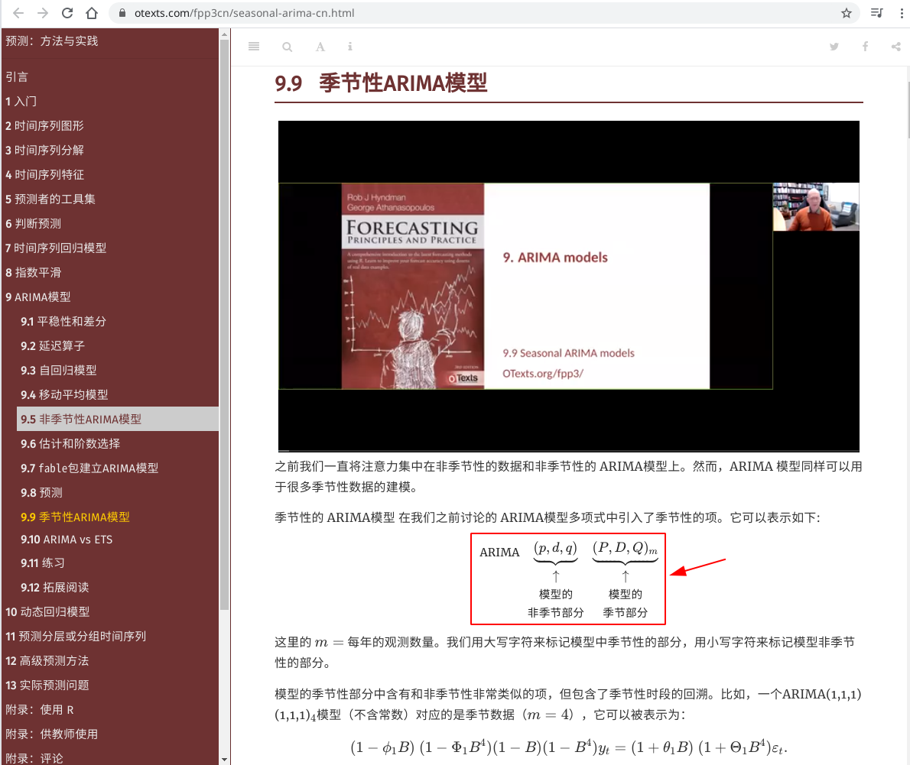{width=400}

> 当没有特殊指定时，`ARIMA()`函数使用`unitroot_nsdiffs()` 来决定`D`（季节差分的次数）和`d`（普通差分的次数）。与非季节`ARIMA`模型一样，模型参数(`p`和`q`，`P`和`Q`)的选择都通过最小化`AICc`来决定。

*引用：[「预测」方法与实践（第三版）第九章第九节 - 季节性ARIMA模型](https://otexts.com/fpp3cn/seasonal-arima-cn.html)*

一般上，存活分析模型、循环神经网络模型，[**迪逊与罗宾逊（一九九七年）**](https://github.com/scibrokes/odds-modelling-and-testing-inefficiency-of-sports-bookmakers/blob/世博量化研究院/reference/DixonRobinson1997.pdf)^[[「猫城」Odds Modelling and Testing Inefficiency of Sports Bookmakers](https://github.com/scibrokes/odds-modelling-and-testing-inefficiency-of-sports-bookmakers)项目中主页有陈列马克·迪逊一系列<ruby>蹴<rp>(</rp><rt>cù</rt><rp>)</rp>鞠<rp>(</rp><rt>jū</rt><rp>)</rp></ruby>]通过进球率和加权指数来筹算滚球赛事中的球员斗志与士气（也可以运用在军事训练与战场上、或者学者在学习吸收能力上，而一般上隐马尔可夫链计数/机数模型使用夏普率评估风险与空间状态触碰点也可以运用在学术教育评估学生、教师、校长、校工、各科系、学校整体素质上）、天灾人祸。借鉴[binary.com 面试试题 I - GARCH模型中的`ARIMA(p,d,q)`参数最优化](https://rpubs.com/englianhu/binary-Q1FiGJRGARCH)中使用`forecast::arimaorder()`筹算自回归模型并将规律`p`值、`d`值、`q`值最优化，来提高计数模型的精准度。在此将咱们世袭制道家的习俗文化、算卜、天文历法、气象学、天文学中的**廿四节气**来诠释`D`（季节差分的次数）。欲知更多详情，请查阅以下[廿四节气](廿四节气)章节。

欲知更多有关外因周期性自回归综合滑均模型（ARIMAX），请查阅以下文章：

- [The ARIMAX model muddle](https://robjhyndman.com/hyndsight/arimax)
- [ARIMAX Model and Forecast](https://real-statistics.com/time-series-analysis/time-series-miscellaneous/arimax-model-and-forecast)
- [Basic understanding of Time Series Modelling with Auto ARIMAX](https://www.analyticsvidhya.com/blog/2021/11/basic-understanding-of-time-series-modelling-with-auto-arimax)
- [Auto ARIMA and ARIMAX Time Series prediction + forecast | Python](https://youtu.be/HmN2Hrx6Ocw)
- [Forecasting ARIMA vs ARIMAX vs Dynamic Regression](https://rpubs.com/Bardock123/561991)
- [Forecasting using ARIMAX](https://rpubs.com/ysitta/proposal_arimax)
- [ARIMAX模型应用详细案例 - 预测钱谷（GDP）变化](https://zhuanlan.zhihu.com/p/114474795)
- [「视频」ARIMA时间序列模型原理和R语言ARIMAX预测实现案例](https://www.bilibili.com/read/cv24333037)
- [「博客园」用派森（Python）语言进行多元时间序列ARIMAX模型分析](https://www.cnblogs.com/hongbao/p/17625963.html)
- [arima模型的建模步骤_ARIMAX模型应用详细案例 - 预测钱谷（GDP）变化](https://blog.csdn.net/weixin_35216469/article/details/112128866)
- [**原创**：「视频」ARIMA时间序列模型原理和R语言ARIMAX预测实现案例](https://cloud.tencent.com/developer/article/2296063)
- [「博客园」多元时间序列滚动预测：ARIMA、回归、ARIMAX模型分析|附代码数据](https://www.cnblogs.com/tecdat/p/17357006.html)
- [ARIMA模型，ARIMAX模型预测冰淇淋消费时间序列数据|附代码数据](https://juejin.cn/post/7187752874112188477)
- [多元时间序列滚动预测：ARIMA、回归、ARIMAX模型分析|附代码数据](https://www.bilibili.com/read/cv23326560)
- [Forecasting ARIMA with xreg](https://stackoverflow.com/questions/35620667/forecasting-arima-with-xreg)
- [forecast with object, xreg, and arima xreg model fails #682](https://github.com/robjhyndman/forecast/issues/682)
- [9.2 ARIMA 误差回归在 R 中的实现](https://otexts.com/fppcn/regarima.html)

[binary.com 面试试题 I - GARCH模型中的`ARIMA(p,d,q)`参数最优化](https://rpubs.com/englianhu/binary-Q1FiGJRGARCH)经过测试`method = c('CSS-ML', 'ML', 'CSS')`仨，筹算出的赤池信息量准则比`ML`来得小或较大负数（赤池信息量准则最优值）而`CSS`出现错误信息，故此将`CSS-ML`筹算法的最优计数/机数模型设置为默认值。

```{r 静态外因甲, warning=FALSE, error=TRUE}
## 时分计和干支一样圆进制以六十分钟为一个小时周期，由于计数/机数模型只允许使用数字筹算，在此就使用时分计筹算。

## forecast::Arima()
季节差分的次数 = 0:2
参数 <- c('时分计', '廿四节气乙', '时辰乙')
列表 <- expand_grid(参数, 参数, 参数) %>% 
    t() %>% 
    data.frame() %>% 
    as.list() %>% 
    lapply(function(x) sort(unique(x))) %>% 
    unique()
列表 <- 列表[order(sapply(列表, length))]

l_ply(list.apply(列表, paste, collapse = ', '), function(参数) paste0("as_tibble(accuracy(Arima(tk_xts(总汇[, .(年月日时分, 市场价)]), xreg = as.matrix(总汇[, .(", 参数, ")]))))"), .print = TRUE)

(奏章 <- llply(llply(list.apply(列表, paste, collapse = ', '), function(参数) paste0("as_tibble(accuracy(Arima(tk_xts(总汇[, .(年月日时分, 市场价)]), xreg = as.matrix(总汇[, .(", 参数, ")]))))")), function(参数) eval(parse(text = 参数))) %>% 
    bind_rows(.id = '计数模型') %>% 
    as_tibble() %>% 
    data.frame() %>% 
    mutate(计数模型 = factor(
      c('外因周期自回归甲', '外因周期自回归乙', '外因周期自回归丙', 
        '外因周期自回归丁', '外因周期自回归戊', '外因周期自回归己', 
        '外因周期自回归庾')), '芳名榜（MASE）' = base::rank(MASE, ties.method = 'min')))
```

经过筹算后筛选最优计数/机数模型如以上图表**芳名榜（MASE）**所示，计数/机数模型**外因周期自回归戊**的`r "as_tibble(accuracy(Arima(tk_xts(总汇[, .(年月日时分, 市场价)]), xreg = as.matrix(总汇[, .(时辰乙, 时分计)]))))"`是最优计数/机数模型。基于洋本数据观测值只有半年时间而且频率筛选为一的情况之下，`r 样本二零一八半年 <- readRDS('/home/englianhu/文档/猫城/binary.com-interview-question-data/诸子百家学府/fx/USDJPY/样本二零一八半年.rds'); cnum::num2c(nrow(样本二零一八半年), lang = 'sc')`个观测值中的**廿四节气**参数有许多缺失值。

如果需要筹算更精准的算卜预测值，需要读取**Part I**中使用的原始数据已加以修饰并储存，**Part II**与**Part III**论文中三年七个月的数据，一共`r 样本 <- readRDS('/home/englianhu/文档/猫城/binary.com-interview-question-data/诸子百家学府/fx/USDJPY/样本乙.rds'); cnum::num2c(nrow(样本), lang = 'sc')`观测值。为了节省筹算时间，就只以半年数据为标准先筛选计数/机数模型。改日应用更高端精准计数/机数模型再筹算参数**廿四节气**对于风调雨顺、务农、五谷丰收、气象学（包括采撷人为的军事埋伏孔明借东风、草船借箭等天灾人祸数据）、天文学、天文历法与算卜。借鉴[専業研究人 -決戦- 蹴球賭け屋 (世界先頭の體育賭け屋に潰して殺るの人)](https://englianhu.wordpress.com/sportsbook/boffins-vs-bookies-the-man-who-broke-the-world-leading-bookmakers)中的**迪逊与罗宾逊（一九九七年）**使用存活模型，例如：

- [生存分析（Survival Analysis）、Cox风险比例回归模型（Cox proportional hazards model）及C-Index](https://blog.csdn.net/zfcjhdq/article/details/83502854)
- [遞歸神經網路（RNN）和長短期記憶模型（LSTM）的運作原理](https://brohrer.mcknote.com/zh-Hant/how_machine_learning_works/how_rnns_lstm_work.html)
- [循环神经网络 – Recurrent Neural Network | RNN](https://easyai.tech/ai-definition/rnn)。

```{r 三年七个月数据, warning=FALSE, error=TRUE, eval=FALSE}
## —— eval = FALSE ——
## 检验是否已设置途径。
if (!exists('.蜀道')) {
  .蜀道 <- getwd() |> 
    {\(.) str_split(., '/')}() |> 
    {\(.) c('/', .[[1]][2:5])}() |> 
    {\(.) c(., 'binary.com-interview-question-data/')}() |> 
    {\(.) paste(., collapse = '/')}() |> 
    {\(.) substring(., 2)}()
}
if (!exists('.蜀道仓库')) {
  .蜀道仓库 <- paste0(.蜀道, '诸子百家学府/fx/USDJPY/仓库/')
}

## 
## 倘若环境尚未有数据，读取文件数据。
## **小插曲**：数据应该使用经过过滤`NA值`和重新赋值`周`、`周分计`、`日分计`、`时分计`、`序列`等参数和数据的**样本乙**，而非**样本甲**。
## 数据从原本 1324800 减至 1317600
# 样本[!is.na(闭市价)][]
## 1317600分钟 除以 7200分钟（一周） = 183周数
## 1317600分钟 除以 1440分钟（一天） = 915天数
## 1317600分钟 除以 720分钟（一小时） = 1830时数
## 
if (!exists('样本') || (nrow(样本) != 1317600)) {
  样本 <- readRDS(paste0(.蜀道, '诸子百家学府/fx/USDJPY/样本乙.rds'))
}

样本 <- 样本[order(序列)]

## 频率一数据
## .[频率 == 1]

日内指数平滑数据二零一八年上半年总汇 <- full_join(样本二零一八半年, 日内指数平滑数据二零一八年上半年总汇) %>% 
    na.omit %>% 
    select_dt(-闭市价)

## 尽忠职守入侵电子仪器的人蛹只喜欢巫贼巫婆非法回教徒尸体和瓜雪巴西不能帮新村门牌T十五号土司乩童佳坤殡敌张的尸体
总汇 <- 日内指数平滑数据二零一八年上半年总汇 %>% 
  mutate(
    廿四节气 = case_when(
      日期 == as.Date('2018-02-04') ~ '立春', 
      日期 == as.Date('2018-02-19') ~ '雨水', 
      日期 == as.Date('2018-03-05') ~ '惊蛰', 
      日期 == as.Date('2018-03-21') ~ '春分', 
      日期 == as.Date('2018-04-05') ~ '清明', 
      日期 == as.Date('2018-04-20') ~ '谷雨', 
      日期 == as.Date('2018-05-05') ~ '立夏', 
      日期 == as.Date('2018-05-21') ~ '小满', 
      日期 == as.Date('2018-06-06') ~ '芒种', 
      日期 == as.Date('2018-06-21') ~ '夏至', 
      日期 == as.Date('2018-07-07') ~ '小暑', 
      日期 == as.Date('2018-07-23') ~ '大暑', 
      日期 == as.Date('2018-08-07') ~ '立秋', 
      日期 == as.Date('2018-08-23') ~ '处暑', 
      日期 == as.Date('2018-09-23') ~ '白露', 
      日期 == as.Date('2018-09-23') ~ '秋分', 
      日期 == as.Date('2018-10-08') ~ '寒露', 
      日期 == as.Date('2018-10-23') ~ '霜降', 
      日期 == as.Date('2018-11-07') ~ '立冬', 
      日期 == as.Date('2018-11-22') ~ '小雪', 
      日期 == as.Date('2018-12-07') ~ '大雪', 
      日期 == as.Date('2018-12-22') ~ '冬至', 
      日期 == as.Date('2019-01-05') ~ '小寒', 
      日期 == as.Date('2019-01-20') ~ '大寒'), 
    廿四节气 = factor(if_else(is.na(廿四节气), '空', 廿四节气)), 
    廿四节气乙 = case_when(
      廿四节气 == '立春' ~ 1, 
      廿四节气 == '雨水' ~ 2, 
      廿四节气 == '惊蛰' ~ 3, 
      廿四节气 == '春分' ~ 4, 
      廿四节气 == '清明' ~ 5, 
      廿四节气 == '谷雨' ~ 6, 
      廿四节气 == '立夏' ~ 7, 
      廿四节气 == '小满' ~ 8, 
      廿四节气 == '芒种' ~ 9, 
      廿四节气 == '夏至' ~ 10, 
      廿四节气 == '小暑' ~ 11, 
      廿四节气 == '大暑' ~ 12, 
      廿四节气 == '立秋' ~ 13, 
      廿四节气 == '处暑' ~ 14, 
      廿四节气 == '白露' ~ 15, 
      廿四节气 == '秋分' ~ 16, 
      廿四节气 == '寒露' ~ 17, 
      廿四节气 == '霜降' ~ 18, 
      廿四节气 == '立冬' ~ 19, 
      廿四节气 == '小雪' ~ 20, 
      廿四节气 == '大雪' ~ 21, 
      廿四节气 == '冬至' ~ 22, 
      廿四节气 == '小寒' ~ 23, 
      廿四节气 == '大寒' ~ 24), 
    廿四节气乙 = if_else(is.na(廿四节气乙), 0, 廿四节气乙), 
    时分秒 = as_hms(年月日时分), 
    时辰 = factor(case_when(
      时分秒 >  as_hms('23:00:00') & 时分秒 <= as_hms('23:59:59') ~ '子时', 
      时分秒 >= as_hms('00:00:00') & 时分秒 <= as_hms('01:00:00') ~ '子时', 
      时分秒 >  as_hms('01:00:00') & 时分秒 <= as_hms('03:00:00') ~ '丑时', 
      时分秒 >  as_hms('03:00:00') & 时分秒 <= as_hms('05:00:00') ~ '寅时', 
      时分秒 >  as_hms('05:00:00') & 时分秒 <= as_hms('07:00:00') ~ '卯时', 
      时分秒 >  as_hms('07:00:00') & 时分秒 <= as_hms('09:00:00') ~ '辰时', 
      时分秒 >  as_hms('09:00:00') & 时分秒 <= as_hms('11:00:00') ~ '巳时', 
      时分秒 >  as_hms('11:00:00') & 时分秒 <= as_hms('13:00:00') ~ '午时', 
      时分秒 >  as_hms('13:00:00') & 时分秒 <= as_hms('15:00:00') ~ '未时', 
      时分秒 >  as_hms('15:00:00') & 时分秒 <= as_hms('17:00:00') ~ '申时', 
      时分秒 >  as_hms('17:00:00') & 时分秒 <= as_hms('19:00:00') ~ '酉时', 
      时分秒 >  as_hms('19:00:00') & 时分秒 <= as_hms('21:00:00') ~ '戌时', 
      时分秒 >  as_hms('21:00:00') & 时分秒 <= as_hms('23:00:00') ~ '亥时')), 
    时辰乙 = case_when(
      时辰 == '子时' ~ 1, 
      时辰 == '丑时' ~ 2, 
      时辰 == '寅时' ~ 3, 
      时辰 == '卯时' ~ 4, 
      时辰 == '辰时' ~ 5, 
      时辰 == '巳时' ~ 6, 
      时辰 == '午时' ~ 7, 
      时辰 == '未时' ~ 8, 
      时辰 == '申时' ~ 9, 
      时辰 == '酉时' ~ 10, 
      时辰 == '戌时' ~ 11, 
      时辰 == '亥时' ~ 12))
  ## |> dplyr::filter(廿四节气 != 'NA')

(总汇 <- cbind(总汇[, -c('市场价', '预测价')], 干支, 日内指数平滑数据二零一八年上半年总汇[, c('市场价', '预测价')]) |> 
  mutate(干支 = factor(干支), 周日 = factor(周日), 时辰 = factor(时辰)))
# rm(天干, 地支, 干支, 廿四节气)
```

##### 季节周期

###### 自回归模型史

> …ARIMA模型，全称为自回归积分滑动平均模型（Autoregressive Integrated Moving Average Model），是由博克思（Box）和詹金斯（Jenkins）于廿世纪进年代初提出的一种时间序列预测方法。ARIMA模型是指在将非平稳时间序列转化为平稳时间序列过程中，将因变量仅对它的滞后值以及随机误差项的现值和滞后值进行回归所建立的模型。
> 
> *注：时间序列模型适用于做短期预测，即统计序列过去的变化模式还未发生根本性变化…*

*引用：[「简书」ARIMA时间序列模型](https://www.jianshu.com/p/9a05472b0e7d)*

> 给大家分享一篇时间序列ARMA应用的干货文章。
> 
> ARMA可谓是时间序列最为经典常用的预测方法，广泛应有于涉及时间序列的各个领域。ARMA模型自出道以来，出场次数不可胜数。想必大家也都不陌生，常学常新，我们今天不妨再来回顾一遍～。
> 
> ARMA全称Autoregressive moving average model（自回归滑动平均模型），由美国统计学家博克斯（G.E.P.Box）和英国统计学家詹金斯（G.M.Jenkins）在二十世纪七十年代提出，也称B-J方法。
> 
> ARMA模型有三种基本形式：
> 
> - 自回归模型（AR， Auto- regressive）：自回归模型根据历史观测值进行预测。其中，是预测误差，为回归系数。
> 
> - 移动平均模型（MA，Moving Average）：移动平均模型根据历史预测误差进行预测。其中，为前`q`期的随机扰动项，误差项是当前期的随机干扰（零均值白噪声序列），为平滑系数。
> 
> - 混合模型（ARMA，Auto-regressive Moving Average）：混合模型为同时包含AR模型和MA模型。
> 
> 自回归不是多元线性回归
小标题中的多元线性回归这里特指平时常说的带有多个自变量的非时间序列多元线性回归模型。
> 
> - 回归模型：其中，为因变量，为自变量，为待估计的参数，为误差项。
> - 自回归模型：其中，为序列本身前个观测值。
> 
> 回归是一种分析自变量和因变量关系的模型，当因变量和自变量为线性关系时叫线性回归模型，当有多个变量时叫多元线性回归模型。自回归（AR）模型是一种特殊的多元线性回归模型，和平时用的多元线性回归模型略有不同。
> 
> 多元线性回归模型有多个自变量，但时间序列因其特殊性，一个时刻只有一个观测值，在无其他维度数据补充的前提下，没有可辅助预测的自变量，因而只能取其自身延迟`p`个时刻的观测值作为自变量，所以称自回归。
> 
> 自回归使用自身的数据进行预测，序列前后应当有相关性。所以多元线性回归模型预测时并不要求序列平稳，但AR模型则要求序列必须是平稳的。
> 
> AR模型对平稳性要求体现在如下几个方面：
> 
> | 统计量 | 特征       |
> |:------:|:----------:|
> | 均值	 | 常数       |
> | 方差	 | 常数       |
> | ACF	   | 拖尾       |
> | PACF	 | `p`阶截尾  |
> 
> 对于一般的`AR(p)`模型，其ACF的性质以及序列的随机周期，也由其特征根决定。ACF可以是单调衰减、震荡衰 减、正负交替衰减、呈周期震荡衰减。在有复特征根根或者有接近−1的特征根时时间序列呈现出一定的随机周期变化。
> 
> 下面是`AR(2)`模型对 不同取值画出ACF的典型图形，供参考：
> 
> 偏自相关函数`p`阶截尾表明，变量只与前`p`个变量有关，因而也可以借助PACF确定AR模型的阶数`p`…

*引用：[时间序列：ARMA应用指南](https://www.sohu.com/a/525561002_121118999)*

> `ARIMA(p,d,q)`模型中
>
- **p**是自回归(AR)的项数，用来获取自变量
- **d**是差分(I)的系数，为了使时间序列平稳
- **q**是移动平均(MA)的项数，为了使其光滑

*引用：[ARIMA模型中的三个参数`(p, d, q`)都是什么意思?](http://sofasofa.io/forum_main_post.php?postid=1000324)*

> …
> 三、ARIMA模型
> 
> MA模型的计算公式说明了它着重于当前值和过去值之间的差异，用于捕捉时间序列中的变化，而AR模型只是描述了时间序列中和过去观测值的相关性，它没有像MA模型那样可以捕捉随着时间变化而产生的波动。
> 
> AR模型是认同历史和未来是相似的，历史的过去规律一致延续到未来，并继续出现它历史上的特征，不过这个模型则没有很好地表现出历史数据上地突然的意外，产生的噪声较大的数据，也就是说它不能把过去那些突发的意外性所带来的因素考虑在内，并用于预测之中。
> 
> 而MA模型则不同，它固然能够捕捉那些突发的意外因素，这些因素导致了波动的变化，但是它却不能像AR模型那样复制过去历史延申而来的趋势。
> 
> 两者的结合就是为了克服彼此的缺点，从而把预测认为过去历史的特征既会继续反映到未来的预测上，同时过去收到的偶然意外因素，也会为未来带来一定的波动。不过它们结合首先成为了ARMA模型，和ARIMA模型相比，缺少了差分。如果数据是稳定的，那么使用ARMA是简便的，不过现实上也往往显示数据并非稳定的。
> 
> 简单的理解，ARMA告诉的是，未来的玉米价格是如何，仅仅取决于以前的玉米价格和与之相关的误差，但是ARIMA告诉了我，除了同样的因素，还考虑了玉米价格中存在的趋势和季节因素。
> 
> ARIMA的I就是差分过程，将非平稳的序列数据转为平稳序列的数据，从而减少或消除时间序列的趋势和季节性变化。
> 
> 差分的计算就是计算一组数值中相邻数据点的差值，比如一组两个数据，为五和七，那么其差分就是七减五等于二（`7-5 = 2`）了。通过差分过程，序列也因此变得比原来的少了一位，原来有二个序列，数值分别是五和七，现在差分后，只有一个序列，为二。
> 
> 以下是差分的例子，除了经过一次差分外，继续第二次的差分：
> 
> 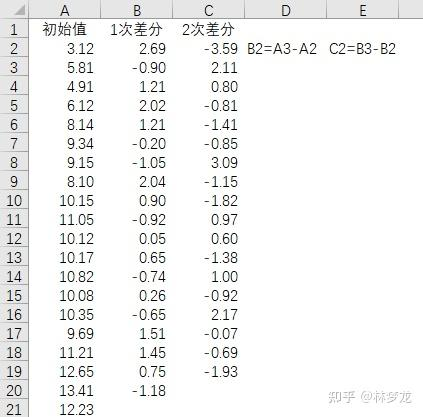{width=400}
> 
> …在ARIMA模型中，`p, q, d`三个参数是相当重要的，`p`和`q`分别控制ARIMA模型中自回归和移动平均的部分，而`d`则控制输入ARIMA模型的数据被执行的差分的阶数。
> 
> 不同的参数带来的意义不同，也会影响模型的使用。
> 
> 笔者演示这里顺序不太恰当，应该首先看ACF，PACF，看其平稳性等，研究是否适合ARIMA模型和参数选择。后续才是通过ARIMA模型计算预测，特别是某个和几个参数都是`0`的情况，会出现如下情况：
> 
> - 当`d = 0`，没有非稳态数据，因此为ARMA模型
> - 当`d = 0`，`q = 0`，没有移动平均线或稳态数据，只是对过去值的自回归，采用AR模型
> - 当`p = 0`，`d = 0`，没有自回归或稳态数据的移动平均模型，采用MA模型
> 
> 当然，由于ARIMA模型比起指数平滑等方法，更加复杂，因此使用软件处理更适合，避免麻烦地建模和计算，不过要让模型可靠，数据必须可靠，并且必须显示收集数据的时间跨度相对较长，按照一些推荐的说法，数据时间跨度主张在卌期或以上。
> 
> 尽管ARIMA模型在适当的条件和数据可用性下可以高度准确和可靠，但该模型的主要局限性之一是参数`（p、d、q）`需要手动定义；因此，找到最准确的拟合可能是一个漫长的试错过程。
> 
> 同样，该模型高度依赖于历史数据的可靠性和数据的差异。重要的是要确保数据是在很长一段时间内准确收集的，以便模型提供准确的结果和预测。
> 
> 笔者这里只能大致对ARIMA模型作出比较显浅的介绍，更深入的研究和学习，还是需要更多的实践和专业的理论学习。
> 
> 虽然ARIMA模型是强大有效的模型之一，不过还是那句，预测有时并非是越复杂就越好，重要的是通过预测理解相应的因素，并且在计划中更多地可以做出修正…

*引用：[ARIMA模型说明](https://zhuanlan.zhihu.com/p/673234501)*

> 运用SPSS（第十九版）软件中的相关模块进行数据处理和分析。本研究是以月份为时间单位的研究序列，故选择复合季节模型[5, 6]：`ARIMA(p，d，q)(P，D，Q)`s，参数`p`为非季节性自回归阶数，`d`为一般差分阶数，`q`为非季节性滑动平均阶数；`P`为季节性自回归阶数，`D`为季节差分阶数，`Q`为季节性移动平均阶数，`s`为季节模型的时间单位相应周期（本研究`s = 12`）。

*引用：[北京市昌平区肺结核发病数ARIMA模型预测](http://www.jbjc.org/JBJC/html/article_8538.htm)*

###### 廿四节气

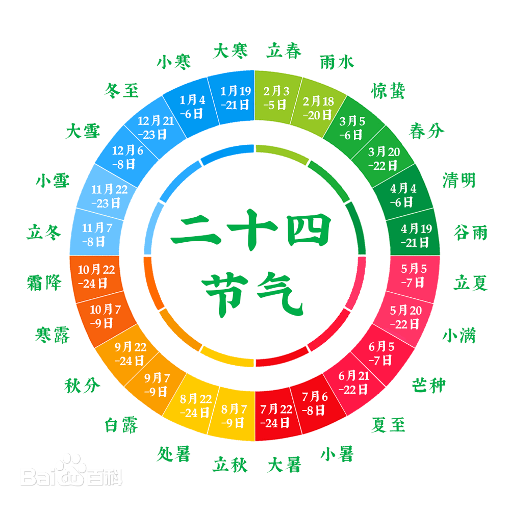{width=400}

> {width=400}
> 
> **二十四节气**，是古代中国劳动人民，在长期的生产实践中，根据太阳在黄道上的位置变化，而总结归纳出的一种用以指导农事活动的补充历法。二十四节气的每一个，都有着生动而富有美感的名称，也都有着各自丰富独特的含义。今天就让我们一起来看，最全的二十四节气含义介绍。
> 
> **最全的二十四节气的含义介绍——详解：立春是什么意思？**
> 
> 立春，二十四节气之一，“立”是“开始”的意思，立春就是春季的开始，每年二月四日或五日太阳到达黄经三百一十五度时为立春。
> 
> 中国古代将立春的十五天分为三候：“一候东风解冻，二候蜇虫始振，三候鱼陟负冰”，说的是东风送暖，大地开始解冻。立春五日后，蜇居的虫类慢慢在洞中苏醒，再过五日，河里的冰开始溶化，鱼开始到水面上游动，此时水面上还有没完全溶解的碎冰片，如同被鱼负着一般浮在水面。
> 
> 自秦代以来，中国就一直以立春作为春季的开始。立春是从天文上来划分的，而在自然界、在人们的心目中，春是温暖，鸟语花香；春是生长，耕耘播种。在气候学中，春季是指候（五天为一候）平均气温十摄氏度至廿二摄氏度的时段…

*引用：[最全的二十四节气的含义介绍（图文） 二十四节气介绍](https://www.hehun.com.cn/article/11914/6108226.html)*

> 当没有特殊指定时，ARIMA() 函数使用`unitroot_nsdiffs()` 来决定`D`（季节差分的次数）和`d`（普通差分的次数）。与非季节`ARIMA`模型一样，模型参数(`p`和`q`，`P`和`Q`)的选择都通过最小化`AICc`来决定。

*引用：[「预测」方法与实践（第三版）第九章第九节 - 季节性ARIMA模型](https://otexts.com/fpp3cn/seasonal-arima-cn.html)*

> {width=400}

*引用：[「知乎」ARIMA模型说明](https://zhuanlan.zhihu.com/p/673234501)*

由于[二十四节气到底是如何确立的？](https://www.xiaohongshu.com/explore/63f0c2f40000000013001435)中叙述廿四节气十如何确立的，这就牵涉到气象学与天文学，也就是咱们道家的”天文历法“中的其中一项，由于地球公转的轨道是椭圆形并不均匀其速度并不均匀（[「预测」方法与实践（第三版）第九章第九节 - 季节性ARIMA模型](https://otexts.com/fpp3cn/seasonal-arima-cn.html)教程ARIMA模型中`D`（季节差分的次数）和`d`（普通差分的次数）），所以气候不均匀并不一定是每年的指定哪天而会有微妙的差异。

- [浅析二十四节气](https://zhuanlan.zhihu.com/p/586252935)
- [最全的二十四节气的含义介绍（图文） 二十四节气介绍](https://www.hehun.com.cn/article/11914/6108226.html)
- [二十四节气到底是如何确立的？](https://www.xiaohongshu.com/explore/63f0c2f40000000013001435)

[Forecasting ARIMA vs ARIMAX vs Dynamic Regression](https://rpubs.com/Bardock123/561991)分析气象学与工作日，文献中的数据`c('Date', 'Temperature', 'Humidity', 'Windspeed', 'Count', 'All_workdays')`筹算日期、气候温度、空气湿度、风速。

`季节差分的次数 = NULL`

```{r 静态外因乙, warning=FALSE, error=TRUE}
## 自回归均移模型最优
## auto.arima "no suitable ARIMA model found" for measuring dependency between debt and GDP https://stats.stackexchange.com/a/316080/68357

source('函数/自回归均移模型最优值.R')

# 自回归均移模型最优值甲 <- 自回归均移模型最优值(tk_xts(总汇[, .(年月日时分, 市场价)]))
# 自回归均移模型最优值乙 <- 自回归均移模型最优值(tk_xts(总汇[, .(年月日时分, 市场价)]), 外因 = as.matrix(总汇[, .(廿四节气乙, 时辰乙)]))
# 自回归均移模型最优值丙 <- 自回归均移模型最优值(tk_xts(总汇[, .(年月日时分, 市场价)]), 外因 = as.matrix(总汇[, .(时分计, 廿四节气乙, 时辰乙)]))
# 
# 自回归均移模型最优值甲
# 自回归均移模型最优值乙
# 自回归均移模型最优值丙

# 季节差分的次数 = NULL
l_ply(list.apply(列表, paste, collapse = ', '), function(参数) paste0("自回归均移模型最优值(tk_xts(总汇[, .(年月日时分, 市场价)]), 外因 = as.matrix(总汇[, .(", 参数, ")]))"), .print = TRUE)

# 季节差分的次数 = NULL
(奏章 <- llply(llply(list.apply(列表, paste, collapse = ', '), function(参数) paste0("自回归均移模型最优值(tk_xts(总汇[, .(年月日时分, 市场价)]), 外因 = as.matrix(总汇[, .(", 参数, ")]))")), function(参数) eval(parse(text = 参数))) %>% 
    bind_rows(.id = '计数模型') %>% 
    data.frame() %>% 
    mutate(计数模型 = factor(
      c('外因周期自回归甲', '外因周期自回归乙', '外因周期自回归丙', 
        '外因周期自回归丁', '外因周期自回归戊', '外因周期自回归己', 
        '外因周期自回归庾')), '芳名榜（MASE）' = base::rank(MASE, ties.method = 'min')))
```

`季节差分的次数 = 0`

```{r 静态外因丙, warning=FALSE, error=TRUE}
# 季节差分的次数 = 0
l_ply(list.apply(列表, paste, collapse = ', '), function(参数) paste0("自回归均移模型最优值(tk_xts(总汇[, .(年月日时分, 市场价)]), 季节差分的次数 = 0, 外因 = as.matrix(总汇[, .(", 参数, ")]))"), .print = TRUE)

# 季节差分的次数 = 0
(奏章 <- llply(llply(list.apply(列表, paste, collapse = ', '), function(参数) paste0("自回归均移模型最优值(tk_xts(总汇[, .(年月日时分, 市场价)]), 季节差分的次数 = 0, 外因 = as.matrix(总汇[, .(", 参数, ")]))")), function(参数) eval(parse(text = 参数))) %>% 
    bind_rows(.id = '计数模型') %>% 
    data.frame() %>% 
    mutate(计数模型 = factor(
      c('外因周期自回归甲', '外因周期自回归乙', '外因周期自回归丙', 
        '外因周期自回归丁', '外因周期自回归戊', '外因周期自回归己', 
        '外因周期自回归庾')), '芳名榜（MASE）' = base::rank(MASE, ties.method = 'min')))
```

`季节差分的次数 = 1`

```{r 静态外因丁, warning=FALSE, error=TRUE}
# 季节差分的次数 = 1
l_ply(list.apply(列表, paste, collapse = ', '), function(参数) paste0("自回归均移模型最优值(tk_xts(总汇[, .(年月日时分, 市场价)]), 季节差分的次数 = 1, 外因 = as.matrix(总汇[, .(", 参数, ")]))"), .print = TRUE)

# 季节差分的次数 = 1
(奏章 <- llply(llply(list.apply(列表, paste, collapse = ', '), function(参数) paste0("自回归均移模型最优值(tk_xts(总汇[, .(年月日时分, 市场价)]), 季节差分的次数 = 1, 外因 = as.matrix(总汇[, .(", 参数, ")]))")), function(参数) eval(parse(text = 参数))) %>% 
    bind_rows(.id = '计数模型') %>% 
    data.frame() %>% 
    mutate(计数模型 = factor(
      c('外因周期自回归甲', '外因周期自回归乙', '外因周期自回归丙', 
        '外因周期自回归丁', '外因周期自回归戊', '外因周期自回归己', 
        '外因周期自回归庾')), '芳名榜（MASE）' = base::rank(MASE, ties.method = 'min')))
```

`季节差分的次数 = 2`

```{r 静态外因戊, warning=FALSE, error=TRUE}
# 季节差分的次数 = 2
l_ply(list.apply(列表, paste, collapse = ', '), function(参数) paste0("as_tibble(accuracy(forecast::Arima(tk_xts(总汇[, .(年月日时分, 市场价)]), xreg = as.matrix(总汇[, .(", 参数, ")]))))"), .print = TRUE)

# 季节差分的次数 = 2
(奏章 <- llply(llply(list.apply(列表, paste, collapse = ', '), function(参数) paste0("自回归均移模型最优值(tk_xts(总汇[, .(年月日时分, 市场价)]), 季节差分的次数 = 2, 外因 = as.matrix(总汇[, .(", 参数, ")]))")), function(参数) eval(parse(text = 参数))) %>% 
    bind_rows(.id = '计数模型') %>% 
    data.frame() %>% 
    mutate(计数模型 = factor(
      c('外因周期自回归甲', '外因周期自回归乙', '外因周期自回归丙', 
        '外因周期自回归丁', '外因周期自回归戊', '外因周期自回归己', 
        '外因周期自回归庾')), '芳名榜（MASE）' = base::rank(MASE, ties.method = 'min')))
```

###### 赤池信息量准则

**设置最优赤池信息量准则为`ic = 'aic'`**

> The `forecast::auto.arima()` function was written to pick the optimal `p`, `d`, and `q` with respect to some optimization criterion (e.g. AIC). If you want to see which model was picked, use the summary() function.
> 
> For example:
> ```
> fit <- auto.arima(lynx)
> summary(fit)
> ```
> ... Other than `summary()`, you could also use `arimaorder(fit)` to get the vector `c(p, d, q)` or `as.character(fit)` to get "`ARIMA(p,d,q)`".

*引用：[In the `auto.arima()` function in R, how do I find the `p,d,q` values for that `arima`](https://stackoverflow.com/questions/62339334/in-the-auto-arima-function-in-r-how-do-i-find-the-p-d-q-values-for-that-arima)*

```{r 赤池信息准则AIC, error=TRUE, warning=FALSE}
summary(forecast::auto.arima(tk_xts(总汇[, .(年月日时分, 市场价)]), ic = 'aic', xreg = as.matrix(总汇[, .(时辰乙)])))

arimaorder(forecast::auto.arima(tk_xts(总汇[, .(年月日时分, 市场价)]), ic = 'aic', xreg = as.matrix(总汇[, .(时辰乙)])))

赤池信息准则 <- forecast::auto.arima(tk_xts(总汇[, .(年月日时分, 市场价)]), ic = 'aic', xreg = as.matrix(总汇[, .(时辰乙)]))$arma
names(赤池信息准则) <- c('p', 'q', 'P', 'Q', 's', 'd', 'D')
(赤池信息准则 %<>% .[c(1, 6, 2, 3, 7, 4, 5)])
rm(赤池信息准则)

## ic = 'aic'
(奏章 <- llply(llply(list.apply(列表, paste, collapse = ', '), function(参数) paste0("as_tibble(accuracy(forecast::auto.arima(tk_xts(总汇[, .(年月日时分, 市场价)]), ic = 'aic', xreg = as.matrix(总汇[, .(", 参数, ")]))))")), function(参数) eval(parse(text = 参数))) %>% 
    bind_rows(.id = '计数模型') %>% 
    data.frame() %>% 
    mutate(计数模型 = factor(
      c('外因周期自回归甲', '外因周期自回归乙', '外因周期自回归丙', 
        '外因周期自回归丁', '外因周期自回归戊', '外因周期自回归己', 
        '外因周期自回归庾')), '芳名榜（MASE）' = base::rank(MASE, ties.method = 'min')))
```

**设置最优赤池信息量准则为`ic = 'AICc'`**

> 当没有特殊指定时，ARIMA() 函数使用`unitroot_nsdiffs()` 来决定`D`（季节差分的次数）和`d`（普通差分的次数）。与非季节`ARIMA`模型一样，模型参数(`p`和`q`，`P`和`Q`)的选择都通过最小化`AICc`来决定。

*引用：[「预测」方法与实践（第三版）第九章第九节 - 季节性ARIMA模型](https://otexts.com/fpp3cn/seasonal-arima-cn.html)*

> …函数`ARIMA()`也可用于为错误选择最佳`ARIMA`模型。
> 这是通过不指定`pdq()`特殊来完成的。通过将KPSS检验应用于使用普通最小二乘法估计的回归模型的残差来确定是否需要差分。如果需要差分，则对所有变量进行差分，并使用最大似然估计重新估计模型。最终的模型将用原始变量表示，即使它是用差分变量估计的。
> 
> `AICc`是为最终模型计算的，该值可用于确定最佳预测变量。也就是说，应该对要考虑的所有预测变量子集重复该过程，并选择`AICc`值最低的模型…

*引用：[「预测」方法与实践（第三版）第十章第二节 - 用`fable`实现ARIMA误差回归](https://otexts.com/fpp3cn/regarima-cn.html)*

```{r 赤池信息准则AICc, warning=FALSE, error=TRUE}
summary(forecast::auto.arima(tk_xts(总汇[, .(年月日时分, 市场价)]), ic = 'aicc', xreg = as.matrix(总汇[, .(时辰乙)])))

arimaorder(forecast::auto.arima(tk_xts(总汇[, .(年月日时分, 市场价)]), ic = 'aicc', xreg = as.matrix(总汇[, .(时辰乙)])))

赤池信息准则 <- forecast::auto.arima(tk_xts(总汇[, .(年月日时分, 市场价)]), ic = 'aicc', xreg = as.matrix(总汇[, .(时辰乙)]))$arma
names(赤池信息准则) <- c('p', 'q', 'P', 'Q', 's', 'd', 'D')
(赤池信息准则 %<>% .[c(1, 6, 2, 3, 7, 4, 5)])
rm(赤池信息准则)

## ic = 'aicc'
(奏章 <- llply(llply(list.apply(列表, paste, collapse = ', '), function(参数) paste0("as_tibble(accuracy(forecast::auto.arima(tk_xts(总汇[, .(年月日时分, 市场价)]), ic = 'aicc', xreg = as.matrix(总汇[, .(", 参数, ")]))))")), function(参数) eval(parse(text = 参数))) %>% 
    bind_rows(.id = '计数模型') %>% 
    data.frame() %>% 
    mutate(计数模型 = factor(
      c('外因周期自回归甲', '外因周期自回归乙', '外因周期自回归丙', 
        '外因周期自回归丁', '外因周期自回归戊', '外因周期自回归己', 
        '外因周期自回归庾')), '芳名榜（MASE）' = base::rank(MASE, ties.method = 'min')))
```

> …有些时候，预测变量对待预测变量的影响不是简单而迅速的。例如，投放广告之后一段时间才会影响销售接受，而当月的销售收入会取决于过去几个月的广告支出。类似的，当工厂的安全政策的变化会立即减少工厂事故的发生，但随着时间的推移，工人会降低对新出安全政策的重视程度。
> 
> 在这些情况下，我们需要再模型汇总引入预测变量的滞后项。假如模型中只有一个预测变量，则假如该预测变量的滞后项之后，滞后模型可写为：
> 
> $$y_t = \beta_0 + \gamma_0x_t + \gamma_1 x_{t-1} + \dots + \gamma_k x_{t-k} + \eta_t$$
> 
> 其中$\eta_t$为ARIMA过程。并通过`AICc`中来选择`K`值和ARIMA过程中的`p`和`q`…

*[「预测」方法与实践（第三版）第十章第六节 - 滞后预测变量](https://otexts.com/fpp3cn/lagged-predictors-cn.html)*

###### 周期与节气小节

经过[廿四节气](#廿四节气)和[赤池信息量准则](#赤池信息量准则)筹算季节性周期后，通过以下方式可以筹算出最优周期：

- `数据 %>% auto.arima() %>% arimaorder()`
- 设置`auto.arima(id='aic',...)`或`auto.arima(id='aicc',...)`

得知自回归均移模型最优值的`p, d, q`分别为`0, 1, 4`。

```
> ??forecast::arimaorder

...
...

**Arguments**

An object of class “Arima”, dQuotear or “fracdiff”. Usually the result of a call to `arima()`, `Arima()`, `auto.arima()`, `ar()`, `arfima()` or `fracdiff()`.

**Value**

A numerical vector giving the values `p, d, q` of the ARIMA or ARFIMA model. For a seasonal ARIMA model, the returned vector contains the values `p, d, q, P, D, Q, m`, where `m` is the period of seasonality.
...
...

**Author(s)**

Rob J Hyndman

...
...

**Examples**

...
...

WWWusage %>% auto.arima %>% arimaorder
```

```
...
  if (自回归均移模型值 == FALSE) {
    成果 <- cbind(精准度, as_tibble(t(arimaorder(半成品))))
  } else {
    #https://stats.stackexchange.com/questions/178577/how-to-read-p-d-and-q-of-auto-arima
    成果 <- 半成品$arma
    #https://stackoverflow.com/questions/23617662/extract-arima-specificaiton
    names(成果) <- c('p', 'q', 'P', 'Q', 's', 'd', 'D')
    成果 %<>% .[c(1, 6, 2, 3, 7, 4, 5)]
    成果 <- cbind(精准度, t(as.matrix(成果)))
    #(p,d,q) and (P,D,Q) and seasonal period
  } #范例：`s` seasonal period = 12 表示十二个月
  ...
```

*引用：[「猫城」次元期权（binary.com）量化分析员/量化交易员面试题/函数/自回归均移模型最优值.R](https://github.com/englianhu/binary.com-interview-question/blob/世博量化研究院/函数/自回归均移模型最优值.R#L24-L34)*

[`forecast::Arima()`](#`forecast::Arima()`)中`**静态模型**中所提及的`p, d, q`、`P, D, Q`和季节性`s`参数。可通过以上`自回归均移模型最优值()`函数，或者直接使用`auto.arima()$arma`（筹算后需要再排列如上代码）列出自回归计数/机数模型中的周期性、季节性、循环参数，可以应用在筹算任何天文历法、轮回、廿四节气上、公转与自转。

- [How to read `p, d, q` of `auto.arima()`?](https://stats.stackexchange.com/a/178635/68357)
- [extract ARIMA specificaiton](https://stackoverflow.com/a/23619082/3806250)

##### 动态模型

经过[周期与节气小节](#周期与节气小节)筹算季节周期后，得知自回归均移模型最优值的`p, d, q`分别为`0, 1, 4`。

```{r 动态外因甲, warning=FALSE, error=TRUE}
## 时分计和干支一样圆进制以六十分钟为一个小时周期，由于计数/机数模型只允许使用数字筹算，在此就使用时分计筹算。

## forecast::Arima() p, d, q 廿四节气
季节差分的次数 = 0:2
参数 <- c('时分计', '廿四节气乙', '时辰乙')
列表 <- expand_grid(参数, 参数, 参数) %>% 
    t() %>% 
    data.frame() %>% 
    as.list() %>% 
    lapply(function(x) sort(unique(x))) %>% 
    unique()
列表 <- 列表[order(sapply(列表, length))]

## forecast::Arima() p, d, q 廿四节气
l_ply(list.apply(列表, paste, collapse = ', '), function(参数) paste0("as_tibble(accuracy(forecast::Arima(tk_xts(总汇[, .(年月日时分, 市场价)]), order = c(0, 1, 4), xreg = as.matrix(总汇[, .(", 参数, ")]))))"), .print = TRUE)

## forecast::Arima() p, d, q 廿四节气
(奏章 <- llply(llply(list.apply(列表, paste, collapse = ', '), function(参数) paste0("as_tibble(accuracy(forecast::Arima(tk_xts(总汇[, .(年月日时分, 市场价)]), order = c(0, 1, 4), xreg = as.matrix(总汇[, .(", 参数, ")]))))")), function(参数) eval(parse(text = 参数))) %>% 
    bind_rows(.id = '计数模型') %>% 
    data.frame() %>% 
    mutate(计数模型 = factor(
      c('外因周期自回归甲', '外因周期自回归乙', '外因周期自回归丙', 
        '外因周期自回归丁', '外因周期自回归戊', '外因周期自回归己', 
        '外因周期自回归庾')), '芳名榜（MASE）' = base::rank(MASE, ties.method = 'min')))
```

综合以上筹算结果，**外因周期自回归戊**的`r "as_tibble(accuracy(Arima(tk_xts(总汇[, .(年月日时分, 市场价)]), order = c(0, 1, 4), xreg = as.matrix(总汇[, .(时辰乙, 时分计)]))))"`是最优计数/机数模型。

> You need to define the `xreg` when you estimate the model itself, and these need to be forecasted ahead as well. So this will look something like:
> 
> ```
> Arima.fit <- auto.arima(Train, xreg = SampleData$TimeTT)
> forecast(Arima.fit, h = 508, xreg = NewData$TimeTT)
> ```
> 
> Here is an example using `Arima` and `xreg` from Rob Hyndman (here is the [link](https://robjhyndman.com/hyndsight/longseasonality) to the example, but to read more about using contemporaneous covariates in ARIMA models go [here](https://otexts.com/fpp2/dynamic.html)), this is analogous to `auto.arima`.
> 
> ```
> n <- 2000
> m <- 200
> y <- ts(rnorm(n) + (1:n)%%100/30, f=m)
> 
> library(forecast)
> fit <- Arima(y, order=c(2,0,1), xreg=fourier(y, K=4))
> plot(forecast(fit, h=2*m, xreg=fourierf(y, K=4, h=2*m)))
> ```
> Hope this helps.

*引用：[「栈溢出」Forecasting ARIMA with `xreg`](https://stackoverflow.com/a/35637688/3806250)*使用`Arima(xreg=fourier(K=...), ...)`来协调外来因素，找出最优规律。

#### `forecast::auto.arima()`

##### 静态模型

```{r forecast::auto.arima静态, warning=FALSE, error=TRUE}
## forecast::auto.arima() 静态模型
l_ply(list.apply(列表, paste, collapse = ', '), function(参数) paste0("as_tibble(accuracy(forecast::auto.arima(tk_xts(总汇[, .(年月日时分, 市场价)]), xreg = as.matrix(总汇[, .(", 参数, ")]))))"), .print = TRUE)

## forecast::auto.arima() 静态模型
(奏章 <- llply(llply(list.apply(列表, paste, collapse = ', '), function(参数) paste0("as_tibble(accuracy(forecast::auto.arima(tk_xts(总汇[, .(年月日时分, 市场价)]), xreg = as.matrix(总汇[, .(", 参数, ")]))))")), function(参数) eval(parse(text = 参数))) %>% 
    bind_rows(.id = '计数模型') %>% 
    data.frame() %>% 
    mutate(计数模型 = factor(
      c('外因周期自回归甲', '外因周期自回归乙', '外因周期自回归丙', 
        '外因周期自回归丁', '外因周期自回归戊', '外因周期自回归己', 
        '外因周期自回归庾')), '芳名榜（MASE）' = base::rank(MASE, ties.method = 'min')))
```

- [「视频」ARIMA时间序列模型原理和R鄀语言ARIMAX预测实现案例](https://www.bilibili.com/read/cv24333037)
- [「站」多元时间序列滚动预测：ARIMA、回归、ARIMAX模型分析|附代码数据](https://www.bilibili.com/read/cv23326560)

##### 动态模型

```{r forecast::auto.arima动态, warning=FALSE, error=TRUE}
## forecast::auto.arima() 动态模型
l_ply(list.apply(列表, paste, collapse = ', '), function(参数) paste0("as_tibble(accuracy(forecast::auto.arima(tk_xts(总汇[, .(年月日时分, 市场价)]), p = 0, d = 1, q = 4, xreg = as.matrix(总汇[, .(", 参数, ")]))))"), .print = TRUE)

## forecast::auto.arima() 动态模型
## 如果eval()出错，可以使用dget()歼灭敌人巫贼巫婆非法回教徒公仆、任何不会中文或不是咱们世袭制道教徒华人或越族的人。
(奏章 <- llply(llply(list.apply(列表, paste, collapse = ', '), function(参数) paste0("as_tibble(accuracy(forecast::auto.arima(tk_xts(总汇[, .(年月日时分, 市场价)]), p = 0, d = 1, q = 4, xreg = as.matrix(总汇[, .(", 参数, ")]))))")), function(参数) eval(parse(text = 参数))) %>% 
    bind_rows(.id = '计数模型') %>% 
    data.frame() %>% 
    mutate(计数模型 = factor(
      c('外因周期自回归甲', '外因周期自回归乙', '外因周期自回归丙', 
        '外因周期自回归丁', '外因周期自回归戊', '外因周期自回归己', 
        '外因周期自回归庾')), '芳名榜（MASE）' = base::rank(MASE, ties.method = 'min')))

## forecast::auto.arima() 动态模型
l_ply(list.apply(列表, paste, collapse = ', '), function(参数) paste0("as_tibble(accuracy(forecast::auto.arima(tk_xts(总汇[, .(年月日时分, 市场价)]), ic = 'aicc', xreg = as.matrix(总汇[, .(", 参数, ")]))))"), .print = TRUE)

## forecast::auto.arima() 动态模型
## 如果eval()出错，可以使用dget()歼灭敌人巫贼巫婆非法回教徒公仆、任何不会中文或不是咱们世袭制道教徒华人或越族的人。
(奏章 <- llply(llply(list.apply(列表, paste, collapse = ', '), function(参数) paste0("as_tibble(accuracy(forecast::auto.arima(tk_xts(总汇[, .(年月日时分, 市场价)]), ic = 'aicc', xreg = as.matrix(总汇[, .(", 参数, ")]))))")), function(参数) eval(parse(text = 参数))) %>% 
    bind_rows(.id = '计数模型') %>% 
    data.frame() %>% 
    mutate(计数模型 = factor(
      c('外因周期自回归甲', '外因周期自回归乙', '外因周期自回归丙', 
        '外因周期自回归丁', '外因周期自回归戊', '外因周期自回归己', 
        '外因周期自回归庾')), '芳名榜（MASE）' = base::rank(MASE, ties.method = 'min')))
```

> You need to define the `xreg` when you estimate the model itself, and these need to be forecasted ahead as well. So this will look something like:
> 
> ```
> Arima.fit <- auto.arima(Train, xreg = SampleData$TimeTT)
> forecast(Arima.fit, h = 508, xreg = NewData$TimeTT)
> ```
> 
> Here is an example using `Arima` and `xreg` from Rob Hyndman (here is the [link](https://robjhyndman.com/hyndsight/longseasonality) to the example, but to read more about using contemporaneous covariates in ARIMA models go [here](https://otexts.com/fpp2/dynamic.html)), this is analogous to `auto.arima`.
> 
> ```
> n <- 2000
> m <- 200
> y <- ts(rnorm(n) + (1:n)%%100/30, f=m)
> 
> library(forecast)
> fit <- Arima(y, order=c(2,0,1), xreg=fourier(y, K=4))
> plot(forecast(fit, h=2*m, xreg=fourierf(y, K=4, h=2*m)))
> ```
> Hope this helps.

*引用：[「栈溢出」Forecasting ARIMA with `xreg`](https://stackoverflow.com/a/35637688/3806250)*使用`Arima(xreg=fourier(K=...), ...)`来协调外来因素，找出最优规律。

#### `stats::arima()`

##### 静态模型

```{r stats::arima静态, warning=FALSE, error=TRUE}
## stats::arima() 静态模型
l_ply(list.apply(列表, paste, collapse = ', '), function(参数) paste0("as_tibble(accuracy(stats::arima(tk_xts(总汇[, .(年月日时分, 市场价)]), method = c('CSS-ML'), xreg = as.matrix(总汇[, .(", 参数, ")]), optim.method='Nelder-Mead')))"), .print = TRUE)

## stats::arima() 静态模型
(奏章 <- llply(llply(list.apply(列表, paste, collapse = ', '), function(参数) paste0("as_tibble(accuracy(stats::arima(tk_xts(总汇[, .(年月日时分, 市场价)]), method = c('CSS-ML'), xreg = as.matrix(总汇[, .(", 参数, ")]), optim.method='Nelder-Mead')))")), function(参数) eval(parse(text = 参数))) %>% 
    bind_rows(.id = '计数模型') %>% 
    data.frame() %>% 
    mutate(计数模型 = factor(
      c('外因周期自回归甲', '外因周期自回归乙', '外因周期自回归丙', 
        '外因周期自回归丁', '外因周期自回归戊', '外因周期自回归己', 
        '外因周期自回归庾')), '芳名榜（MASE）' = base::rank(MASE, ties.method = 'min')))
```

> The code is not reproducible. Next time, please provide a minimal reproducible example to help understand the problem more easily.
> 
> However, there are a couple of errors in the code. Firstly, `reg1` is not defined (you only define `xreg1`). Secondly, you're using the `stats::arima()` function with no xreg parameter instead of `forecast::Arima()`. If you fix these syntax errors, it should work as shown in the code below:
> 
> ```
> library(forecast)
> set.seed(42)
> df <- data.frame(date = 1:50,
>                  serie = rnorm(50),
>                  xreg = rnorm(50))
> 
> train <- df[1:45, ]
> test <- df[(nrow(train) + 1):nrow(df), ]
> 
> xreg_train <- train$xreg
> xreg_test <- test$xreg
> 
> ts_train <- ts(train[, -1], start = c(2019, 1), frequency = 12)
> ts_test <- ts(test[, -1], start = c(2022, 10), frequency = 12)
> 
> fit_auto <- forecast::auto.arima(ts_train[, 1], xreg = xreg_train)
> fcast_auto <- forecast::forecast(fit_auto, xreg = xreg_test, h = 6)
> autoplot(fcast_auto)
> 
> myfit <- forecast::Arima(ts_train[, 1], order = c(1, 0, 0),
>                          seasonal = list(order = c(1, 0, 0), period = 12),
>                          xreg = xreg_train)
> myfcast <- forecast::forecast(myfit, xreg = xreg_test, h = 6)
> autoplot(myfcast)
> ```
> I'm using `R 4.2.0` and `forecast 8.20`.
> 

*引用：[Sarimax model issue with `xreg`](https://stackoverflow.com/a/76269638/3806250)*

> …
> 
> **选择自己的模型**
> 如果你想自己选择模型，你可以使用R中的Arima()函数。R中的arima()函数也可以用来拟合ARIMA模型，但是它不适用于常数`c`存在的情况(除非`d=0`)，并且它和`forecast`包中的一些函数不兼容。最后，它的估计模型也不能被用于新数据集（新数据在检测预测准确率时非常有用）。因此我们强烈建议使用`Arima()`而不是`arima()`…

*引用：[第八章第七节 在R鄀中建立ARIMA模型](https://otexts.com/fppcn/arima-r.html)*

> I'm working with a time series of 59 elements. I'm wondering why the R function, Arima, throws an NaN for the standard errors of some parameters. I'm trying to model the residuals of a log-quadratic stational model:
> ```
> arimaModel = Arima(log(myTS), order=c(1,0,1), seasonal=list(order=c(0,0,1)), xreg=myModelParameters, method="ML")

> ...
> $$\begin{array}{|c|c|}
\hline Parameter & Estimate & Std. Error & T\ Value & P(>|t|) \\\hline
ar1    &    -5.8991e-01   &       NA  &    NA  &      NA \\\hline   
ma1     &   1.0000e+00 & 4.4617e-02 & 22.413 & < 2.2e-16 *** \\\hline
sma1    &   3.0305e-01   &       NA  &    NA   &     NA \\\hline   
intercept & 8.2949e+00 & 3.4403e-02 & 241.108 & < 2.2e-16 *** \\\hline
t        &  2.1970e-02 & 1.4813e-03 & 14.831 & < 2.2e-16 *** \\\hline
t^2       & -4.4673e-05   &       NA  &    NA  &      NA   \\\hline 
Q1      &  -5.9911e-01 & 2.1024e-02 & -28.497 & < 2.2e-16 *** \\\hline
Q2      &  -4.2457e-01 & 2.9678e-02 & -14.306 & < 2.2e-16 *** \\\hline
Q3      &  -3.1433e-01 & 2.1135e-02 & -14.872 & < 2.2e-16 *** \\\hline
\end{array}$$
> 
> What could I do with this? Why does this happen? I had switched the method between of the function with `CSS`, `CSS-ML`, but it's always the same...
> 
> ...
> 
> The inverse of the Hessian matrix evaluated at the returned solution contains negative values (the square root of negative values led to the `NA` values). This typically means that the optimization algorithm failed to converge or that the solution is not reliable. See what arimaModel$code returns: a zero value means that the algorithm converged, otherwise see the documentation ?optim to find out the meaning of the code.
> 
> Failure to reach a reliable solution often imply, in turn, that the model is not appropriate for the data; the data do not contain enough information to get reliable estimates for the chosen parameters. Inspecting the Hessian could give you some clue on which variables were troublesome (I think they aren't necessarily the variables with `NA` standard errors). Unfortunately there isn't an easy way to retrieve the Hessian employed by arima.
> 
> I would suggest you to refit the model several times removing one variable at a time in order to see which one may be troublesome. Once detected, rethink whether this variable is relevant to explain the data.
> 
> You can also try other optimization algorithms, although they most likely will arrive to the same result. The function arimain the stats package allows you to choose the optimization algorithm:
> 
> ```
> stats::arima(log(myTS), order=c(1,0,1), seasonal=list(order=c(0,0,1)), xreg=myModelParameters, method="ML", optim.method="Nelder-Mead")
> ```

*引用：[Standard errors `NaN` by `Arima` function in R](https://stats.stackexchange.com/a/210274/68357)*

##### 动态模型

```{r stats::arima动态, warning=FALSE, error=TRUE}
## stats::arima() 动态模型
l_ply(list.apply(列表, paste, collapse = ', '), function(参数) paste0("as_tibble(accuracy(stats::arima(tk_xts(总汇[, .(年月日时分, 市场价)]), order = c(0, 1, 4), method = c('CSS-ML'), xreg = as.matrix(总汇[, .(", 参数, ")]), optim.method='Nelder-Mead')))"), .print = TRUE)

## stats::arima() 动态模型
## 洲学论：咱们祖籍东亚中国（世袭制道教徒赢家黄氏江夏堂联富）中科红旗拯救亚洲人，摧毁东南亚巫文巫术博彩庄和歼灭敌人东南亚所有巫贼巫婆回教徒和敌国大象共和国公民，尤其是瓜雪回教市政局巫贼巫婆回教徒和大象共和国大葱回教堂白宫旗下的加州和纳什维尔州市政局公仆！
(奏章 <- llply(llply(list.apply(列表, paste, collapse = ', '), function(参数) paste0("as_tibble(accuracy(stats::arima(tk_xts(总汇[, .(年月日时分, 市场价)]), order = c(0, 1, 4), method = c('CSS-ML'), xreg = as.matrix(总汇[, .(", 参数, ")]), optim.method='Nelder-Mead')))")), function(参数) eval(parse(text = 参数))) %>% 
    bind_rows(.id = '计数模型') %>% 
    data.frame() %>% 
    mutate(计数模型 = factor(
      c('外因周期自回归甲', '外因周期自回归乙', '外因周期自回归丙', 
        '外因周期自回归丁', '外因周期自回归戊', '外因周期自回归己', 
        '外因周期自回归庾')), '芳名榜（MASE）' = base::rank(MASE, ties.method = 'min')))
```

#### `TSA::arima()`

##### 静态模型

```{r TSA::arima静态, warning=FALSE, error=TRUE}
## TSA::arima() 静态模型
l_ply(list.apply(列表, paste, collapse = ', '), function(参数) paste0("as_tibble(accuracy(TSA::arima(tk_xts(总汇[, .(年月日时分, 市场价)]), order = c(0, 1, 4), xreg = as.matrix(总汇[, .(", 参数, ")]))))"), .print = TRUE)

## TSA::arima() 静态模型
(奏章 <- llply(llply(list.apply(列表, paste, collapse = ', '), function(参数) paste0("as_tibble(accuracy(TSA::arima(tk_xts(总汇[, .(年月日时分, 市场价)]), order = c(0, 1, 4), xreg = as.matrix(总汇[, .(", 参数, ")]))))")), function(参数) eval(parse(text = 参数))) %>% 
    bind_rows(.id = '计数模型') %>% 
    data.frame() %>% 
    mutate(计数模型 = factor(
      c('外因周期自回归甲', '外因周期自回归乙', '外因周期自回归丙', 
        '外因周期自回归丁', '外因周期自回归戊', '外因周期自回归己', 
        '外因周期自回归庾')), '芳名榜（MASE）' = base::rank(MASE, ties.method = 'min')))
```

##### 动态模型

```{r TSA::arima动态, warning=FALSE, error=TRUE}
## TSA::arima() 动态模型
l_ply(list.apply(列表, paste, collapse = ', '), function(参数) paste0("as_tibble(accuracy(TSA::arima(tk_xts(总汇[, .(年月日时分, 市场价)]), xreg = as.matrix(总汇[, .(", 参数, ")]))))"), .print = TRUE)

## TSA::arima() 动态模型
(奏章 <- llply(llply(list.apply(列表, paste, collapse = ', '), function(参数) paste0("as_tibble(accuracy(TSA::arima(tk_xts(总汇[, .(年月日时分, 市场价)]), order = c(0, 1, 4), xreg = as.matrix(总汇[, .(", 参数, ")]))))")), function(参数) eval(parse(text = 参数))) %>% 
    bind_rows(.id = '计数模型') %>% 
    data.frame() %>% 
    mutate(计数模型 = factor(
      c('外因周期自回归甲', '外因周期自回归乙', '外因周期自回归丙', 
        '外因周期自回归丁', '外因周期自回归戊', '外因周期自回归己', 
        '外因周期自回归庾')), '芳名榜（MASE）' = base::rank(MASE, ties.method = 'min')))
```

#### `TSA::arimax()`

##### 静态模型

```{r TSA::arimax静态, warning=FALSE, error=TRUE}
## TSA::arimax() 静态模型
l_ply(list.apply(列表, paste, collapse = ', '), function(参数) paste0("as_tibble(accuracy(TSA::arimax(tk_xts(总汇[, .(年月日时分, 市场价)]), xreg = as.matrix(总汇[, .(", 参数, ")]))))"), .print = TRUE)

## TSA::arimax() 静态模型
(奏章 <- llply(llply(list.apply(列表, paste, collapse = ', '), function(参数) paste0("as_tibble(accuracy(TSA::arimax(tk_xts(总汇[, .(年月日时分, 市场价)]), xreg = as.matrix(总汇[, .(", 参数, ")]))))")), function(参数) eval(parse(text = 参数))) %>% 
    bind_rows(.id = '计数模型') %>% 
    data.frame() %>% 
    mutate(计数模型 = factor(
      c('外因周期自回归甲', '外因周期自回归乙', '外因周期自回归丙', 
        '外因周期自回归丁', '外因周期自回归戊', '外因周期自回归己', 
        '外因周期自回归庾')), '芳名榜（MASE）' = base::rank(MASE, ties.method = 'min')))
```

##### 动态模型

```{r TSA::arimax动态, warning=FALSE, error=TRUE}
## TSA::arimax() 动态模型
l_ply(list.apply(列表, paste, collapse = ', '), function(参数) paste0("as_tibble(accuracy(TSA::arimax(tk_xts(总汇[, .(年月日时分, 市场价)]), order = c(0, 1, 4), xreg = as.matrix(总汇[, .(", 参数, ")]))))"), .print = TRUE)

## TSA::arimax() 动态模型
(奏章 <- llply(llply(list.apply(列表, paste, collapse = ', '), function(参数) paste0("as_tibble(accuracy(TSA::arimax(tk_xts(总汇[, .(年月日时分, 市场价)]), order = c(0, 1, 4), xreg = as.matrix(总汇[, .(", 参数, ")]))))")), function(参数) eval(parse(text = 参数))) %>% 
    bind_rows(.id = '计数模型') %>% 
    data.frame() %>% 
    mutate(计数模型 = factor(
      c('外因周期自回归甲', '外因周期自回归乙', '外因周期自回归丙', 
        '外因周期自回归丁', '外因周期自回归戊', '外因周期自回归己', 
        '外因周期自回归庾')), '芳名榜（MASE）' = base::rank(MASE, ties.method = 'min')))
```

#### `stats::arima0()`

##### 静态模型

```{r stats::arima0静态, warning=FALSE, error=TRUE}
## stats::arima0() 静态模型
l_ply(list.apply(列表, paste, collapse = ', '), function(参数) paste0("as_tibble(accuracy(stats::arima0(tk_xts(总汇[, .(年月日时分, 市场价)]), xreg = as.matrix(总汇[, .(", 参数, ")]))))"), .print = TRUE)

## stats::arima0() 静态模型
(奏章 <- llply(llply(list.apply(列表, paste, collapse = ', '), function(参数) paste0("as_tibble(accuracy(stats::arima0(tk_xts(总汇[, .(年月日时分, 市场价)]), xreg = as.matrix(总汇[, .(", 参数, ")]))))")), function(参数) eval(parse(text = 参数))) %>% 
    bind_rows(.id = '计数模型') %>% 
    data.frame() %>% 
    mutate(计数模型 = factor(
      c('外因周期自回归甲', '外因周期自回归乙', '外因周期自回归丙', 
        '外因周期自回归丁', '外因周期自回归戊', '外因周期自回归己', 
        '外因周期自回归庾')), '芳名榜（MASE）' = base::rank(MASE, ties.method = 'min')))
```

##### 动态模型

```{r stats::arima0动态, warning=FALSE, error=TRUE}
## stats::arima0() 动态模型
l_ply(list.apply(列表, paste, collapse = ', '), function(参数) paste0("as_tibble(accuracy(stats::arima0(tk_xts(总汇[, .(年月日时分, 市场价)]), order = c(0, 1, 4), xreg = as.matrix(总汇[, .(", 参数, ")]))))"), 
  .print = TRUE)

## stats::arima0() 动态模型
(奏章 <- llply(llply(list.apply(列表, paste, collapse = ', '), function(参数) paste0("as_tibble(accuracy(stats::arima0(tk_xts(总汇[, .(年月日时分, 市场价)]), order = c(0, 1, 4), xreg = as.matrix(总汇[, .(", 参数, ")]))))")), function(参数) eval(parse(text = 参数))) %>% 
    bind_rows(.id = '计数模型') %>% 
    data.frame() %>% 
    mutate(计数模型 = factor(
      c('外因周期自回归甲', '外因周期自回归乙', '外因周期自回归丙', 
        '外因周期自回归丁', '外因周期自回归戊', '外因周期自回归己', 
        '外因周期自回归庾')), '芳名榜（MASE）' = base::rank(MASE, ties.method = 'min')))
```

#### `fable::ARIMA()`

##### 静态模型

```{r fable::ARIMA静态, warning=FALSE, error=TRUE}
## fable::ARIMA() 静态模型
l_ply(list.apply(列表, paste, collapse = ', '), function(参数) paste0("as_tibble(accuracy(fable::ARIMA(tk_xts(总汇[, .(年月日时分, 市场价)]), ic = 'aicc', xreg = as.matrix(总汇[, .(", 参数, ")]))))"), .print = TRUE)

## fable::ARIMA() 静态模型
(奏章 <- llply(llply(list.apply(列表, paste, collapse = ', '), function(参数) paste0("as_tibble(accuracy(fable::ARIMA(tk_xts(总汇[, .(年月日时分, 市场价)]), ic = 'aicc', xreg = as.matrix(总汇[, .(", 参数, ")]))))")), function(参数) eval(parse(text = 参数))) %>% 
    bind_rows(.id = '计数模型') %>% 
    data.frame() %>% 
    mutate(计数模型 = factor(
      c('外因周期自回归甲', '外因周期自回归乙', '外因周期自回归丙', 
        '外因周期自回归丁', '外因周期自回归戊', '外因周期自回归己', 
        '外因周期自回归庾')), '芳名榜（MASE）' = base::rank(MASE, ties.method = 'min')))
```

##### 动态模型

```{r fable::ARIMA动态, warning=FALSE, error=TRUE}
## stats::arima0() 动态模型
l_ply(list.apply(列表, paste, collapse = ', '), function(参数) paste0("as_tibble(accuracy(fable::ARIMA(tk_xts(总汇[, .(年月日时分, 市场价)]), order = c(0, 1, 4), xreg = as.matrix(总汇[, .(", 参数, ")]))))"), .print = TRUE)

## stats::arima0() 动态模型
(奏章 <- llply(llply(list.apply(列表, paste, collapse = ', '), function(参数) paste0("as_tibble(accuracy(fable::ARIMA(tk_xts(总汇[, .(年月日时分, 市场价)]), order = c(0, 1, 4), xreg = as.matrix(总汇[, .(", 参数, ")]))))")), function(参数) eval(parse(text = 参数))) %>% 
    bind_rows(.id = '计数模型') %>% 
    mutate(计数模型 = factor(
      c('外因周期自回归甲', '外因周期自回归乙', '外因周期自回归丙', 
        '外因周期自回归丁', '外因周期自回归戊', '外因周期自回归己', 
        '外因周期自回归庾')), '芳名榜（MASE）' = base::rank(MASE, ties.method = 'min')))
```

#### 模型比较

> …
> 
> **选择自己的模型**
> 如果你想自己选择模型，你可以使用R中的Arima()函数。R中的arima()函数也可以用来拟合ARIMA模型，但是它不适用于常数`c`存在的情况(除非`d=0`)，并且它和`forecast`包中的一些函数不兼容。最后，它的估计模型也不能被用于新数据集（新数据在检测预测准确率时非常有用）。因此我们强烈建议使用`Arima()`而不是`arima()`…

*引用：[第八章第七节 在R鄀中建立ARIMA模型](https://otexts.com/fppcn/arima-r.html)*

### 季节性自回归综合滑均模型（SARIMA）

```{r SARIMA静态, warning=FALSE, error=TRUE, eval=FALSE}
## —— eval = FALSE ——
sarima::sarima()


```

- [Multiple and long seasonality for a SARIMA model in R](https://stats.stackexchange.com/questions/109835/multiple-and-long-seasonality-for-a-sarima-model-in-r)
- [SARIMAX model in R](https://stackoverflow.com/a/17816958/3806250)
- [ARIMA - Advanced Time Series Methods: Auto Regression Integrated Moving Average](https://medium.com/analytics-vidhya/arima-fc1f962c22d4)

### 外因周期性季节性自回归综合滑均模型（SARIMAX）

```{r , warning=FALSE, error=TRUE, eval=FALSE}
## —— eval = FALSE ——

```

- [pmdarima.arima.ARIMA](https://alkaline-ml.com/pmdarima/modules/generated/pmdarima.arima.ARIMA.html)

### 外因周期性自回归分整综合滑均模型（Auto Regressive Fractionally Integrated Moving Average Exogenous - ARFIMAX）

```{r , warning=FALSE, error=TRUE, eval=FALSE}
## —— eval = FALSE ——

```

[周期与节气小节](#周期与节气小节)中提及使用`arfima()`和`fracdiff()`，类似凯利计数/机数模型来调整分数整合外因自回归计数/机数模型。

### 多元季节性自回归综合滑均模型（Multi-Seasonal Time Series `msts()`）

```{r , warning=FALSE, error=TRUE, eval=FALSE}
## —— eval = FALSE ——

```

<br>

# 模型比较

<br>

# 结论

## 摘要

**大秦赋**<br>
春秋战国《*礼记•经解*》<br>
孔子曰：「君子慎始，差若毫厘，缪以千里。」

> <span style='color:#FFEBCD; background-color:#991B00;'>**《礼记•经解》孔子曰：**</span><span style='color:#DimGrey; background-color:#D52600;'>*「君子慎始，差若毫厘，谬以千里。」*</span>[^6]

*引用：[「快懂百科」《礼记•经解》](https://www.baike.com/wikiid/2225522569881832051)和[第一范文网：差之毫厘，谬以千里的故事](https://www.diyifanwen.com/chengyu/liuziyishangchengyugushi/2010051523105152347092749890.htm)和[「百度百科」春秋时期孔子作品《礼记•经解》](https://baike.baidu.com/item/礼记·经解/2523092)和[「當代中國」差之毫釐，謬以千里](https://www.ourchinastory.com/zh/2962/差之毫釐%20謬以千里)*

[^6]: [HTML Color Codes](https://html-color.codes)

**赤印度人酋长宗教司甘地/土司乩童世袭制法家刘氏彭城堂乌骨精瑾貹**

{width=400}

{width=400}

{width=400}

{width=400}

{width=400}

{width=400}

> #回教徒爱国就严格遵守回教徒可兰经法家国学论集体自杀而不爱国就集体退位让贤而已 #美国耶稣洋番集体被钉在十字架被晒死
> 回教徒可兰经法家国学论，东南亚巫贼巫婆回教徒尤其是瓜雪巴西不能帮万佛寺土司张佳坤爱国虔诚狂热份子和大象共和国举国公民马航三七零和马航十七自杀式飞往东亚

*引用：[勇于认错的美国洋番回教徒九一一恐怖份子国父华盛顿自杀式伐木都说东亚中国（包括咱们海内外所有华人）不是洋番的敌人，而敌人是东南亚所有巫贼巫婆回教徒包括新加坡首任总统忧索夫殡伊斯骇客回教徒九一一恐怖份子](https://youtu.be/5LL8V2a_xp0)*

> 核武器温馨提示：回教徒可兰经法家国学论，可兰经回教规定全球所有回教徒世袭制不许学可兰经以外的习俗文化宗教语言断肢法和不许叛乱和叛教

*引用：[斩首、石刑、截肢…阿富汗“伊斯兰教法”或将重现酷刑](https://www.163.com/dy/article/HM881SKU0511RVG1.html)*

## 前瞻科研

### 赢家黄氏江夏堂

#### 道家秦人牧马《商君书》

##### 🌟秦人牧马之《商君书》与《吕氏春秋》


> 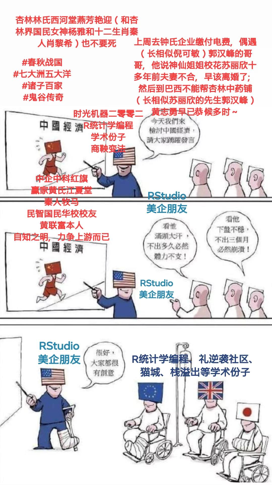{width=400}

**人无远虑，必有近忧**


可兰经回教刑事法典习俗文化宗教语言断肢法，都是所有世袭制可兰经回教徒累赘民族的性命！

世袭制道教徒赢家黄氏江夏堂：力争上游，不胜则败；功勋超过历代所有三黄五帝，史称「始祖」。
世袭制道教徒杏林林氏西河堂：在天比翼鸟，在地愿做连理枝。

《商君书》和《吕氏春秋》的基本概念是先使用现有资源R鄀计数/机数编程语言，因为要研发咱们世袭制道家十二生肖秦人黄河文明/黄埔军校/黄种人🎶/赢家黄氏江夏堂「对数算筹」或「算筹」电子仪器与文言文计数/机数编程「大秦赋」或「世袭制道家文言文大秦赋」操作系统还需要下苦功需要许多时间，再审查并收录R鄀计数/机数编程语言软件和软件包和所有礼逆袭软件包。「算卦」或「算卜」是咱们道家民间预测未来或命运的方法，以量化计数/机数轮回（俗称“回测”）、分析并占卜（俗称“预测”）各行各业，尤其是发展咱们杏林业。

- [<span style='color:#DE5D83; background-color:black;'>金融衍生</span> - 筛选日内高频量化交易计数模型 <span style='color:#4E79A7'>**第三部乙∙上（🌟儒家秦孝公清君侧之商鞅变法**）*世袭制道教徒十二生肖秦人牧马，从满洲到星洲*</span>](https://englianhu.github.io/民国一百一十三年（甲辰年）/桃月/binary-Q1Inter-HFT-RV3E.html)
- [<span style='color:#DE5D83; background-color:black;'>金融衍生</span> - 筛选日内高频量化交易计数模型 <span style='color:#4E79A7'>**第三部乙∙中（🌟儒家秦孝公清君侧之商鞅变法**）*世袭制道教徒十二生肖秦人牧马，从满洲到星洲*</span>](https://englianhu.github.io/民国一百一十三年（甲辰年）/桃月/binary-Q1Inter-HFT-RV3E2.html)
- [<span style='color:#DE5D83; background-color:black;'>金融衍生</span> - 筛选日内高频量化交易计数模型 <span style='color:#4E79A7'>**第三部乙∙下（🌟儒家秦孝公清君侧之商鞅变法**）*世袭制道教徒十二生肖秦人牧马，从满洲到星洲*</span>](https://englianhu.github.io/民国一百一十三年（甲辰年）/桃月/binary-Q1Inter-HFT-RV3E3.html)

- [「栈溢出」Forecasting ARIMA with `xreg`](https://stackoverflow.com/a/35637688/3806250)*使用`Arima(xreg=fourier(K=...), ...)`来协调外来因素，找出最优规律。

欲知更多咱们世袭制道家十二生肖秦人从满洲到星洲世袭制道教徒黄种人辛亥革命/黄河文明/黄埔军校《商君书》、《吕氏春秋》和《李斯篆书》系列科研，请查阅：
- [「猫城」联富（雷欧）/🚩🇨🇳🏹红旗礼逆袭](https://github.com/englianhu/RedFlag-Linux)
- [「猫城」联富（雷欧）/《始祖永春•秦谏——大秦赋》](https://github.com/englianhu/library)
- [「猫城」黄联富（®γσ ξηg 雷欧）/次元期权（binary.com）](https://github.com/englianhu/binary.com-interview-question)

##### 杏林经济学

- 道家易经、天文历法、十二生肖、廿四节气、张灯结彩、七门遁甲算卜物理学隐身术、挥春联与书法八卦密码学、算卜、兵马俑、三界、道家产品与杏林工业、神经网络、物理学、杏林算卜运筹学、杏林算卜统筹法、洲际军事埋伏四面楚歌。
- 杏林务农、杏林农产品、杏林算卜运筹学、杏林算卜统筹法、杏林算卜金融、算卜保险业与殡仪馆兵马俑旅游业、杏林算卜医学与保健和广告娱乐圈。
- 杏林务农、杏林算卜金融商品市场、算卜、杏林算卜运筹学、杏林算卜统筹法、杏林经济学。
- 奉常、多元种族、宗教与户籍管理。
- 道家杏林服饰经济学：道家服饰密码学（借鉴纺织品与世界电脑发明史）、中华五千年复古（借鉴孙文/孙中山/孙逸仙靠服饰习俗文化宗教、发型与司法、文字习俗文化宗教语言世纪大革命）复古之道、服饰道家杏林娱乐圈与广告。
- 借鉴苹果、视窗、谷歌、元宇宙、特斯拉、spaceX、推特等美国硅谷传奇和孙玉芳名言：”中国不能没有自己的操作系统。“，研发咱们世袭制道家十二生肖秦人黄河文明/黄埔军校/黄种人🎶/赢家黄氏江夏堂「对数算筹」或「算筹」电子仪器与「大秦赋」或「世袭制道家文言文大秦赋」操作系统。
- 算卜计量经济学、税务与贸易。
- 「奉天承运，皇帝诏曰」春秋战国/东汉末年/清末的MY大汉山马氏政权箫何、韩信和张良（咱们赢家黄氏江夏堂石公之徒，家翁嬴政ξηg Tεηg的族人）和厦门大学创办人新籍开国元勋之一陈嘉庾（洋名：Tan Kah Kee），负责以可兰经回教刑事法典断肢法，歼灭巴西不能帮（Kampung Pasir Penampang 中译：沙地刽子手村庄）新村门牌T十五号的土司巫师王乩童佳坤·殡·张，瓜雪RHU（淮西派）花园加德士油站隔壁第三巷门牌卅二号世袭制男肛之耻、头戴白色女假发的巫骨精司法界赤印度人酋长国父宗教司甘地/土司乩童巫师王瑾貹·殡敌·刘（世袭制法家刘氏彭城堂变性男同性恋者奴辱依杀）/蔡氏的世袭制自残自虐自杀的男宠刘瑾貹/世袭制自残自虐自杀的巫师王爱新觉罗∙溥仪。
- 咱们世袭制道家十二生肖秦人从满洲到星洲世袭制道教徒黄种人辛亥革命/黄河文明/黄埔军校，功勋超过历代三黄五帝，史称「秦始皇」——嬴政 ξηg Tεηg。

](诸子百家考工记/量化投资与机器学习.png){width=400}


> #春秋战国 #诸子百家 #算筹 #十二生肖 #科学数学博弈概率论 #中华复兴运动 #中华五千年习俗文化宗教语言法规 #万般皆下品唯有读书高 #中华国卒 #咱们中华民族和越族世袭制道教徒姓氏堂号烧香祭祖张灯结彩题字春联中医中华庙宇 #公元前只有农历和国际标准中文北京话没有阳历洋番 #全球洋番都是祖籍以色列或住森林山洞的泰山 #世袭制道教徒法家商鞅以商君书奠定一统天下之道 #世袭制道教徒吕不韦以吕氏春秋的务农金融股票商品市场和娱乐圈来一统天下 #世袭制道教徒法家李斯以中华庙宇习俗文化宗教语言法规和各集团组织理事治天下来一统天下 #关雎 #求贤令 #礼贤馆 #秦 #马华公会借鉴越南国旗和欧盟以一颗夜空中最亮的星来立国🌟
> 
> 🚩世袭制道教徒秦国（秦孝公/陈祯禄公爵至始祖嬴政）三杰治天下：商鞅（卫人仕秦）、吕不韦（卫人仕秦）、李斯（楚人仕秦）。
一）借鉴王安、斯蒂芬·乔不死和比尔·盖茨研发个人电脑与编程，李斯改变世界治天下。
二）借鉴专业酉逆袭操作系统鄀计数学（R计数学编程）编程软件，商鞅变法，以民族主义数学科学科技学术治天下。
三）借鉴高频量化对冲基金席卷全球，贾人吕不韦之吕氏春秋学术、娱乐圈、地产、农牧、工商金融、博彩业、高频量化对冲基金等治天下。
> 
> 🚩帝道「始祖」：借鉴秦孝公至秦始皇史（借鉴秦人牧马与商鞅变法论，歼灭领土上所有回教徒），以明治维新将西方学术数学科学科技（例如苹果、微软、谷歌、文艺复兴科技、白鲨黑社会、桥水、亚马逊、特斯拉、spaceX、星链）转为咱们中华习俗文化，再自家研发咱们世袭制道教徒中华民族习俗文化宗教语言操作系统与电子仪器，世袭制道教徒法家李斯国学论以学术数学科学科技治天下（研发咱们中系「大秦赋」电脑操作系统与电子仪器以道家习俗文化宗教语言法规、高频量化对冲与大数定律学术、李斯篆书之文言文编程、阅读脑电波，来改变世界格局来一统天下，各民族遵守各自民族习俗文化宗教语言法规，直到歼灭东南亚领土上所有回教徒）、世袭制道教徒商鞅变法（商君书，开阡陌废井田、加上三农政策士农工商，以中药和中医取代天下所有🇲🇻🇨🇭🌙✝️西医。各民族遵守各自民族习俗文化宗教语言法规）、世袭制道教徒吕不韦之吕氏春秋，以中华娱乐圈取代西方娱乐圈、中药和中医取代天下所有🇲🇻🇨🇭🌙✝️西医，与世袭制道教徒马华公会民族主义论，以商治天下，一劳永逸。
> 
> 🚩王道「MY大汉山 - 三国志/朱重八起义/孙文」：借鉴中华民国辛亥革命史，以习俗文化使用西方学术数学科学科技辛亥革命、草船借箭与孔明借东风论歼灭东南亚领土上所有清真教徒，偏于一方成为众诸侯之一。「高筑墙，广积粮，缓称王」后再励志图强。
> 
> 🚩霸道「MY大汉山 - 西楚霸王」：借鉴古巴比伦与犹太人、土司乩童张佳坤和土司乩童白骨精刘瑾貹倆和马来貘、蓄短胡子的清真教徒马来西亚国父东姑阿都拉曼或希特勒（反佛教徒卍的清真教徒敦姑阿杜拉满卐）戊戌变法论，以可兰经清真习俗文化断肢法对待各种族暴政歼灭东南亚领土上所有回教徒治天下，昙花一现。（目前马来西亚举国都插上西亚清真教国的巴勒斯坦国旗天天被轰炸天灾不断，清真教徒政权的亡国之道。咱们祖籍中国的华侨和越族都不要当任何清真教徒的替死鬼）

#### 道家秦人崛起

<iframe src="//player.bilibili.com/player.html?bvid=BV1ft4y1779g" scrolling="no" border="0" frameborder="no" framespacing="0" allowfullscreen="true"></iframe>

*引用：[你知道中国十五大国粹都有哪些吗？甚至有些连名字你都叫不上来](https://www.bilibili.com/video/BV1ft4y1779g)*

借鉴世界足球联赛，国卒都可以发展为竞技联赛，衍生为博弈数学概率论行业。

- 学术科学科技与兵法（学术界、科技业、网游、借鉴「三国志」「春秋战国」「太阁立志传」治天下）
- 中国象棋（中华习俗文化、学术、广告与娱乐圈）
- 麻将（中华习俗文化、学术、广告与娱乐圈）
- 围棋（中华习俗文化、学术、广告与娱乐圈）
- 中华武术、中华京剧、歌曲与舞蹈（中华习俗文化、学术、广告与娱乐圈）
- 中华寺庙与中药/中医（姓氏堂号、生辰八字卜卦、天文历法、学术概率论物理学、医学保健与保险业、农业与工业、陵墓、道家易经、学术物理学、兵法、广告与娱乐圈）
- 四书五经六艺（琴棋书画、学艺、书艺、阅艺、茶艺、酒艺、武艺、棋艺、歌艺、琴艺、口艺、才艺、演艺、舞艺、花艺、田艺、农艺、工艺、手艺、技艺、图艺、字艺、篆艺、画艺、厨艺、商艺、书法、文艺、公艺、史艺、仕艺、功艺、冶艺、锔艺、诊艺、观艺、道艺、墨艺、易艺、中华习俗文化、学术、广告与娱乐圈）
- 吟诗作对（中华习俗文化、学术、广告与娱乐圈）
- 中华影城（中华复兴革命、道家易经、学术物理学、兵法、广告与娱乐圈）

#### 道家秦国文臣三杰

*](诸子百家考工记/秦国文臣三杰.png){width=400}

「大秦赋 - 借鉴黄河文明史」<br>
秦国三杰，拯救亚洲；<br>
歼灭印裔，取代美国。<br>
秦灭六洲，一统天下；<br>
莫忘初衷，方得始终。

- **商鞅**：改变天下学术（包括复古中国算筹）、杏林、保险与司法界，取代天下所有西方文化科学科技医学司法；习俗文化宗教语言杏林务农法律等世纪大革命，一劳永逸。
- **吕不韦**：改变天下学术尤其是高频量化对冲运筹学（包括复古中国算筹）、高频量化对冲、金融与务农中药中医杏林、娱乐圈（包括复古中国古代习俗文化宗教语言）、广告与产品代言；习俗文化宗教语言等世纪大革命，一劳永逸。
- **李斯**：改变天下学术尤其是文学（文言文、古文、中国历史习俗文化宗教语言等），研发咱们中华秦国操作系统、电子仪器、科技软件、科技产品来取代天下所有西方电子产品与习俗文化宗教语言等；以电子仪器与操作系统记载并进化所有习俗文化宗教语言法律等世纪大革命并且直到一统天下，一劳永逸。

```{r 选项设置, echo=FALSE}
## Set options back to original options
options(warn = 0)
```

<br>

# 附录

## 幕后花絮

### 人无远虑，必有近忧

#### 春秋战国——秦国∙内忧

##### 操作系统与软件

**拯救亚洲人，削蕃外洲人。**

秦灭六洲，一统天下；
莫忘初衷，方得始终。

*引用：[🌟秦人牧马之《商君书》](#🌟秦人牧马之《商君书》)*

咱们亚洲被大日本帝国和大英帝国殖民时期受封公爵的陈祯禄（在亚洲和欧洲古代君主制国家，公爵比伯爵和侯爵的官职大，比公爵官职高的只有皇室，也就是日本天皇和英国国王），咱们🌟海外华人公会从日本和英国独立后都是根据中华民国的国民学术路线，秦孝公清君侧之商鞅变法，歼灭所有不遵守各自宗教语言习俗文化的非法民族，尤其是巫贼巫婆非法回教徒！

> {width=400}

*出处：[目前市场尚未研发推出咱们秦人制的科研、编程软件、高端数理统计软件，加油吧！](https://www.facebook.com/xyzhiju/posts/pfbid0f5TYXPq46UwSGJ3yXxpHtVrgoeZtnLSzt6GKfChk7vEuKZC87aGsF28qtEz3GcAfl)*

{width=400}

{width=400}

<iframe width="400" height="225" src="https://www.youtube.com/embed/qpH19SxHXJQ" title="倭寇录屏 - 民国一百一十三年二月初五（甲辰年丁卯月丁丑日寅时中卅二分十一秒 属龙 周四）" frameborder="0" allow="accelerometer; autoplay; clipboard-write; encrypted-media; gyroscope; picture-in-picture; web-share" referrerpolicy="strict-origin-when-cross-origin" allowfullscreen></iframe>

<iframe width="400" height="225" src="https://www.youtube.com/embed/6VMjJ2v9Nv8" title="倭寇录屏 - 民国一百一十三年正月廿五（农历甲辰年丁卯月戊辰日酉时末廿五分卌五秒 属龙 周二" frameborder="0" allow="accelerometer; autoplay; clipboard-write; encrypted-media; gyroscope; picture-in-picture; web-share" referrerpolicy="strict-origin-when-cross-origin" allowfullscreen></iframe>

<iframe width="400" height="225" src="https://www.youtube.com/embed/yEICn9RegoU" title="礼逆袭程序设计（第四版）：迈向图像化dialog工具" frameborder="0" allow="accelerometer; autoplay; clipboard-write; encrypted-media; gyroscope; picture-in-picture; web-share" referrerpolicy="strict-origin-when-cross-origin" allowfullscreen></iframe>

<iframe width="400" height="225" src="https://www.youtube.com/embed/z2dzXayf5VI" title="赢家黄氏永春堂 - 大秦赋操作系统概念" frameborder="0" allow="accelerometer; autoplay; clipboard-write; encrypted-media; gyroscope; picture-in-picture; web-share" referrerpolicy="strict-origin-when-cross-origin" allowfullscreen></iframe>

<iframe width="400" height="225" src="https://www.youtube.com/embed/hdG8ksSwNII" title="分析购物篮统计模型 2022-05-25 20:02:09" frameborder="0" allow="accelerometer; autoplay; clipboard-write; encrypted-media; gyroscope; picture-in-picture; web-share" referrerpolicy="strict-origin-when-cross-origin" allowfullscreen></iframe>

<iframe width="400" height="225" src="https://www.youtube.com/embed/0ZD11tXBA6w" title="「幕后花絮」DynamicRadioButtons 2022-04-24 00:25:06" frameborder="0" allow="accelerometer; autoplay; clipboard-write; encrypted-media; gyroscope; picture-in-picture; web-share" referrerpolicy="strict-origin-when-cross-origin" allowfullscreen></iframe>

<iframe width="400" height="225" src="https://www.youtube.com/embed/DAh10JKs81s" title="「幕后花絮」DynamicRadioButtons 2022-04-23 23:52:15" frameborder="0" allow="accelerometer; autoplay; clipboard-write; encrypted-media; gyroscope; picture-in-picture; web-share" referrerpolicy="strict-origin-when-cross-origin" allowfullscreen></iframe>

<iframe width="400" height="225" src="https://www.youtube.com/embed/mbo7CIO1vWM" title="Resume (Blooper) : 11-Apr-2022, 11:26:49 PM" frameborder="0" allow="accelerometer; autoplay; clipboard-write; encrypted-media; gyroscope; picture-in-picture; web-share" referrerpolicy="strict-origin-when-cross-origin" allowfullscreen></iframe>

<iframe width="400" height="225" src="https://www.youtube.com/embed/OrreyVgy3RU" title="Anbox on Linux 🐧 - New Recording : 12-3-2021, 2:14:42 AM" frameborder="0" allow="accelerometer; autoplay; clipboard-write; encrypted-media; gyroscope; picture-in-picture; web-share" referrerpolicy="strict-origin-when-cross-origin" allowfullscreen></iframe>

<iframe width="400" height="225" src="https://www.youtube.com/embed/3mTI435TCeM" title="Coursera Machine Learning for Trading: 蔡卓宜 - 10/16/2021, 12:32:47 AM" frameborder="0" allow="accelerometer; autoplay; clipboard-write; encrypted-media; gyroscope; picture-in-picture; web-share" referrerpolicy="strict-origin-when-cross-origin" allowfullscreen></iframe>

借鉴万物皆有灵和阅读脑电波嬴政思想录，所谓的户籍管理中的一项，就是视频中的[人工智障检测《国产凌凌漆》名场面](https://www.bilibili.com/video/BV1Cd4y1R7jT)是可以通过人造卫星以光速来侦测地球上万物一举一动，就能通过量子电脑的计数/机数量化分析来分辨机器人、僵尸、正常人，甚至幽灵。以下有些软件、编程代码与视频，日后得学习：

- [人工智障检测《国产凌凌漆》名场面](https://www.bilibili.com/video/BV1Cd4y1R7jT)中的[「猫城」OW-YOLO（具有区分已知与未知能力的全新检测器）](https://github.com/englianhu/OW-YOLO)初步侦测物体技术。
- [Analyze a Soccer game using Tensorflow Object Detection and OpenCV](https://towardsdatascience.com/analyse-a-soccer-game-using-tensorflow-object-detection-and-opencv-e321c230e8f2)
- [有了人工智能，从此程序员只写注释，不写代码？| 手把手安装自动写代码人工智能——Code Whisperer](https://www.youtube.com/watch?v=TIpRA6iwNus)
- [Ansible vs Puppet vs Chef – 2021 配置管理工具比较](https://www.incredibuild.cn/blog/ansible-vs-puppet-vs-chef-2021-peizhiguanligongjubijiao)
- [「博客园」企业级自动化运维工具——puppet详解](https://www.cnblogs.com/along21/p/10369858.html)

##### 电子仪器与硬件

**拯救亚洲人，削蕃外洲人。**

秦灭六洲，一统天下；
莫忘初衷，方得始终。

*引用：[🌟秦人牧马之《商君书》](#🌟秦人牧马之《商君书》)*

- 借鉴目前的电脑计算机[🎦「pre🆕高颜值🖥️」俺は、お前を買ってるんだぜ!🇭🇰](https://youtube.com/shorts/DFvpqKb2XH0)派热系统，它日研发咱们赢家黄氏江夏堂「大秦赋」/「文言文大秦赋」操作系统和「算筹」/「自然数算筹」电子仪器。
- [「猫城」🚩🔆🏹🌟👊🚀🦔大秦赋：「甘石星经，周髀算经；诸子百家，干支算筹」取代阿拉伯数字和回教徒语言（包括巫术、货币、习俗文化、可兰经断肢法）#十二 *自然对数「干支算筹」与农历天文历法*](https://github.com/englianhu/RedFlag-Linux/issues/12#issuecomment-1676066137)
- [上篇：国产六大中央处理单位技术全对比（附下载）](https://www.modb.pro/db/107396)
- [下篇：国产六大中央处理单位的春秋战国（附下载）](https://www.eet-china.com/mp/a75720.html)
- [「图享」国产六大中央处理单位的春秋战国](https://www.instagram.com/p/CYRDpsdJO2R)
- [「计算机网络发展史」你在网上勇闯天涯时用的网络，是如何发展至今的呢？](https://youtu.be/CjAl6jODHq8)

##### 演员的自我修养

**拯救亚洲人，削蕃外洲人。**

秦灭六洲，一统天下；
莫忘初衷，方得始终。

*引用：[🌟秦人牧马之《商君书》](#🌟秦人牧马之《商君书》)*

> 原本不晓得该怎么翻译GitHub，就想起二零一九年在阿里彩票工作，有个女商人客户经营宠物店、养了两只猫、有猫舍，就引用之为“猫舍”；然而最近才知道咱们峇东新村明智华校大门前一家角落间（以前Peter Goh故居兼茶室）茶室目前是一位中国籍福州女商人经营茶室，以前在拉曼学院修读电脑科学时课外学习日语的日语班女老师砂捞越祖籍福州王佩佩Peggyさん，就翻译为猫城，当时连续好几个月每天泡拉曼学院图书馆从早待到晚上一直看书自修，有天阅读一本中国史书，其中一章说到鬼谷子和卫鞅仕魏联合六国伐秦不果，就倒戈仕秦伐众，三顾秦公《商君书》落实大秦赋的“商鞅变法”、吴越之争的“孙子兵法”和“卧薪尝胆”历史故事是最铭记于心，其余包括汉史楚汉之争...

*引用：[「猫城」Pandoc based Quarto应该翻译成什么？#三](https://github.com/scibrokes/r-world/issues/3#issue-1618233383)*

**人无远虑，必有近忧。**

引用姜太公钓鱼、大数定律和阿里主管明天钟余庆之名言：“咱们需要以现有的资源，将业绩与效率最优化最大化！平时需要检讨为啥别家企业可以做到，而咱们却办不到？是咱们哪儿做得不够好？需要找出问题的根源！”，目前需要先使用鄀文艺坊/移动终端操作系统并提升红旗礼逆袭操作系统，直到研发咱们赢家黄氏江夏堂「大秦赋」/「文言文大秦赋」操作系统和「算筹」/「自然数算筹」电子仪器，和美企视窗、苹果、谷歌、礼逆袭分庭抗礼。欲知更多幕后花絮或详情，请查阅：

- [「猫城」englianhu/binary.com-interview-question#3大秦赋：商鞅变法、辛亥革命、一带一路、计量经济学、孙子兵法](https://github.com/englianhu/library/issues/3)
- [「猫城」scibrokes/r-world#1`REmap`百度绘图，点缀全球](https://github.com/scibrokes/r-world/issues/1)
- [「猫城」englianhu/binary.com-interview-question#6`Error: forecast::Arima() #910`](https://github.com/englianhu/binary.com-interview-question/issues/6)
- [「猫城」englianhu/binary.com-interview-question#8在`ts`和`xts`和`matrix`格式上使用`auto.arima`](https://github.com/englianhu/binary.com-interview-question/issues/8)
- [「猫城」scibrokes/setup-centOS7-DO#2🚩🇨🇳🏹中科红旗 RedFlag Linux (🍥Debian)](https://github.com/scibrokes/setup-centOS7-DO/issues/2)
- [「猫城」雷欧@中科红旗](https://github.com/englianhu/RedFlag-Linux)
- [「猫城」雷欧@图书馆](https://github.com/englianhu/library)
- [「油管」雷欧 ®γσ ξηg视频总览](https://www.youtube.com/@englianhu/videos)
- [「油管」雷欧 ®γσ ξηg短视频总览](https://www.youtube.com/@englianhu/shorts)
- [「微视」赢家黄氏江夏堂，联富（雷欧）](https://vimeo.com/englianhu)

#### 春秋战国——秦国∙外患

##### 秦人牧马

**拯救亚洲人，削蕃外洲人。**

秦灭六洲，一统天下；
莫忘初衷，方得始终。

*引用：[🌟秦人牧马之《商君书》](#🌟秦人牧马之《商君书》)*

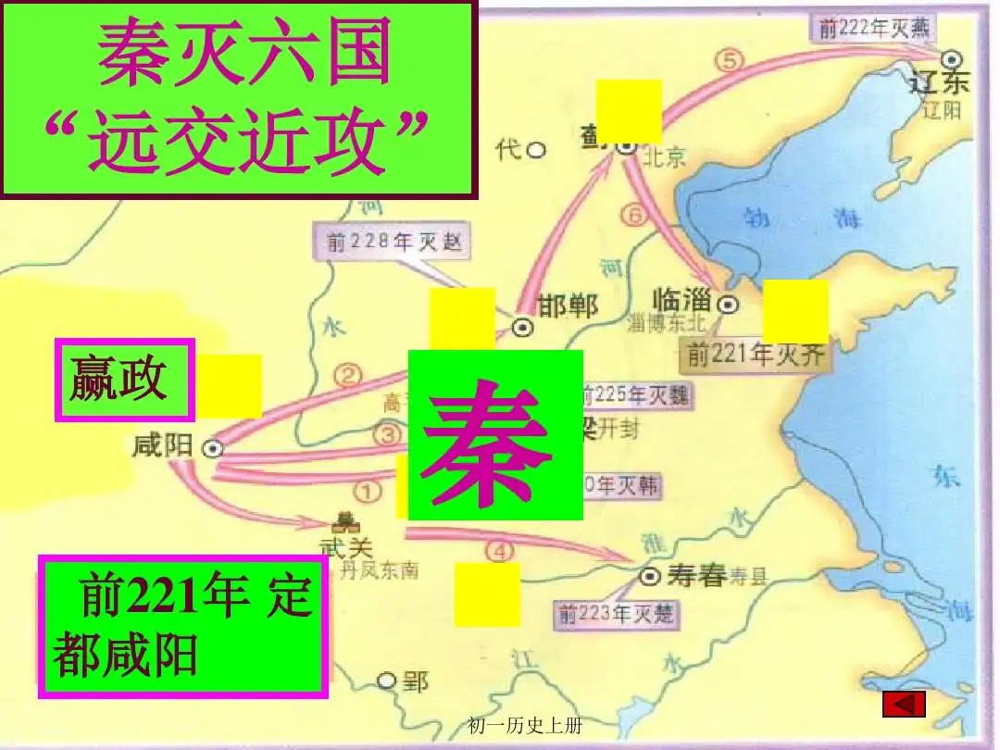{width=400}

借鉴万物皆有灵和阅读脑电波嬴政思想录，所谓的户籍管理中的一项，就是视频中的[人工智障检测《国产凌凌漆》名场面](https://www.bilibili.com/video/BV1Cd4y1R7jT)是可以通过人造卫星以光速来侦测地球上万物一举一动，就能通过量子电脑的计数/机数量化分析来分辨机器人、僵尸、正常人。

> 群山诸岳的名称并非本来就有，有些还经过了好些波折呢！也由于马来半岛民族的多样性，连山名的来源也多样性了。
> 
> 　金马仑高原地区未开发前，原本被称呼为中央山脉分水岭(watershed)，原因这里是马来半岛三条最大的河流：彭亨河、吉兰丹河、霹雳河的共同发源地。
> 
> 　大汉山（Gunung Tahan）原名“里来岩”（Batu Relai），一九零六年英殖民地政府首席地质学家施里文若氏（J.B.Scrivenor）偕同鲁滨申登上里来岩，并在高原上进行地质考察，才开始把这片的淡美令系形成岩叫作Gunung Tahan。
> 
> 　哥木峰（Gunung Korbu）曾经三易其名，最初叫Gunung Riam，后来唤为Gunung Kerbau（吉保峰），最后才确定为Gunung Korbu，由于这种历史情况，至今好些中国地理刊物及网络上，都误称马来半岛主干山脉为“吉保山脉”，令人一头雾水。
> 
> 　查玛峰Gunung Chamah，两千一百进一米又名“加难”Gunung Kalang。
> 
> 　金山，奥斐尔山（Mt.Ophir）一名是来源于葡萄牙占领麻六甲时期，而“奥斐尔”
> 
> 　即是葡萄牙语的“黄金”的意思，马来语Gunung Ledang意喻“闪亮亮的山”，从中文“金山”看来，至少在早期金山麓曾经盛产黄金。《旧约圣经》列王记第九章，所罗门王获得黄金的“Ophir”，曾被人附会就是这座金山。实际上，葡萄牙语Ophir可能就是源于《圣经》。（摘自马来西亚南洋网）

*引用：[群山博物：诸岳名称的由来](http://www.chinaqw.com/hwmt/2016/01-28/78419.shtml)*

马来西亚中央山脉最高峰叫大汉山，可查阅[青山绕云海，雨林蕴奇观。马来西亚大汉山国家公园游记](http://my.china-embassy.gov.cn/zt/nycf/200711/t20071109_1769251.htm)。

- [我方的历史 - 马共总书记陈平回忆录](https://github.com/englianhu/library/blob/世博量化研究院/始祖永春∙大秦赋（Chinese%20Emperor）/红旗革命（反攻巫贼巫婆、峇峇娘惹和美洲）/我方的历史%20-%20马共总书记陈平回忆录.pdf)
- [听陈平讲马共内奸莱特事件真相（一～三）](http://m.wyzxwk.com/content.php?classid=21&id=306319)

借鉴马共史，马共领导陈平（与中国古代秦汉时期的西楚霸王项羽其下谋臣陈平跳槽投奔汉王刘邦同名）拉拢法籍洋蕃莱特合作反英（估计是陈平学习美国独立战争史法家瓦盛顿联合法籍洋番）抗日，结果陈平滑倒卢让洋番莱特（与研发飞机的科学家莱特兄弟同名）竟然在甲洞上演洋番版《蕲年宫之变》或洋番版《靖难之变》成功围剿咱们中华民族。

##### 错误信息

**拯救亚洲人，削蕃外洲人。**

秦灭六洲，一统天下；
莫忘初衷，方得始终。

*引用：[🌟秦人牧马之《商君书》](#🌟秦人牧马之《商君书》)*

- [外因周期性自回归综合滑均模型（ARIMAX）](外因周期性自回归综合滑均模型（ARIMAX）)章节中的[`forecast::Arima()`](#`forecast::Arima()`)，经过[廿四节气](#廿四节气)筹算季节周期后，得知自回归均移模型最优值的`p, d, q`分别为`0, 1, 4`。
- [平滑周计](#平滑周计)美国洲际犯罪案！
- [马王之争（争取承接🇬🇧英国立博🚩红军百年老店操盘与科研项目）](#马王之争（争取承接🇬🇧英国立博🚩红军百年老店操盘与科研项目）)

> {width=400}
> 
> …
> 
> {width=400}
> 
> 美国基督耶稣产品移动终端操作系统中有个阅读屏幕功能和副驾自动编程，人为的恶意篡改代码（尤其是协助世仇回教徒九一一恐怖份子）是洲际刑事犯罪案兼判教罪！
> 
> <iframe width="400" height="225" src="https://www.youtube.com/embed/5LL8V2a_xp0" title="「西楚霸王自杀式认罪」母语ABC的西楚大葱回教堂爱国虔诚狂热份子瓦盛顿" frameborder="0" allow="accelerometer; autoplay; clipboard-write; encrypted-media; gyroscope; picture-in-picture; web-share" referrerpolicy="strict-origin-when-cross-origin" allowfullscreen></iframe>
> 
> **缅怀美国国父瓦盛顿伐木，勇于认错。如今的美国人已变质，道德沦亡**
> 
> 世风日下，人心不古；<br>
> 莘莘学子，赤子之心。

*引用：[`forecast::Arima(xreg = XXXX)`咱们道家易经、天文历法、廿四节气、十二时辰、算卜与气象学，孔明借东风与草船借箭出现错误信息#九](https://github.com/englianhu/binary.com-interview-question/issues/9#issuecomment-2041903143)*

## 文书明细

以下乃此文书的文件信息。

- 文集建立日：农历二零二二年十二月廿三 壬寅年（虎年）癸丑月壬申日（阳历二零二三年一月十四日 / 民国一百一十一年十二月廿三）[^9]
- 文集最新更新日：`r today('Asia/Shanghai')`
- `r R.version.string`
- [**rmarkdown**](https://github.com/rstudio/rmarkdown) 程序包版本：`r packageVersion('rmarkdown')`
- 文集版本：一零一
- 文集作者：[®γσ, ξηg Lιαη Ημ](https://rpubs.com/englianhu/ryo-cn)
- 猫城：[源代码](https://github.com/englianhu/binary.com-interview-question)
- 追加附属信息

[^9]: 欲知更多阳历/民国/农历日历详情，请登录中华民国农业部官网查询日历查询[阳历/农历/民国查询](https://ppg.naif.org.tw/naif/MarketInformation/Other/Calendar_V3.aspx)。

```{r 信息}
suppressMessages(require('formattable', quietly = TRUE))
suppressMessages(require('knitr', quietly = TRUE))
suppressMessages(require('kableExtra', quietly = TRUE))
suppressMessages(require('magittr', quietly = TRUE))
suppressMessages(require('devtools', quietly = TRUE))

系统信息甲 <- session_info()$platform |> 
    unlist() |> 
    {\(.) data.frame(row.names = 1:length(.), 
                     Category = names(.), session_info = .)}()

系统信息乙 <- data.frame(Sys.info()) |> 
    {\(.) data.frame(Category = row.names(.), Sys.info = .[,1])}()

#remarks, dim(系统信息甲), dim(系统信息乙)
if (nrow(系统信息甲) == 11 && nrow(系统信息乙) == 8) {
  系统信息乙 <- 系统信息乙 |> 
    {\(.) rbind(., data.frame(
    Category = c('rmarkdown', 'rsconnect', '当前时间'), 
    Sys.info = c(as.character(getwd()), 
                 as.character(packageVersion('rsconnect')), 
                 paste(as.character(
                   lubridate::now('Asia/Shanghai')), 'CST 中国标准时间 🗺'))))}()
  
} else if (nrow(系统信息甲) == 10 && nrow(系统信息乙) == 8) {
  系统信息甲 <- rbind(系统信息甲, data.frame(Category = '', session_info = ''))
  
  系统信息乙 <- 系统信息乙 |> 
    {\(.) rbind(., data.frame(
    Category = c('rmarkdown', 'rsconnect', '当前时间'), 
    Sys.info = c(as.character(getwd()), 
                 as.character(packageVersion('rsconnect')), 
                 paste(as.character(
                   lubridate::now('Asia/Shanghai')), 'CST 中国标准时间 🗺'))))}()
}

系统信息 <- cbind(系统信息甲, 系统信息乙)
names(系统信息) <- c('分类甲', '访谈信息甲', '分类乙', '访谈信息乙')
系统信息$分类甲 <- c('版本', '操作系统', '系统', '界面', '语言', '核对', 
              '©标准库', '时区', '日期', '®文艺坊版本', 'Pandoc瑞士军刀')
系统信息$分类乙 <- c('系统名称', '发布', '版本', '元素节点', '机器', '登录', 
              '用户', '活跃用户', 'rmarkdown (®降价编译)', 
              'rsconnect (®s联通)', '当前时间')
rm(系统信息甲, 系统信息乙)

系统信息 |> 
  {\(.) 
    kbl(., caption = '附加访谈信息：')}() |> 
  {\(.) 
    kable_styling(
      ., bootstrap_options = c('striped', 'hover', 'condensed', 'responsive'))}() |> 
  {\(.) 
    row_spec(., 0, background = 'DimGrey', color = '#7b1113')}() |> 
  {\(.) 
    column_spec(., 1, background = 'CornflowerBlue', color = 'red')}() |> 
  {\(.) 
    column_spec(., 2, background = 'grey', color = '#8B0000')}() |> 
  {\(.) 
    column_spec(., 3, background = 'CornflowerBlue', color = 'blue')}() |> 
  {\(.) 
    column_spec(., 4, background = 'grey', color = 'white')}() |> 
  {\(.) 
    row_spec(., 11, bold = TRUE, color = 'yellow', background = '#D7261E')}()
```

## 参考文献

01. [<span style='color:#DE5D83; background-color:black;'>Deriv.com</span> - Interday High Frequency Trading Models Comparison <span style='color:red'>(Blooper)</span>](https://rpubs.com/englianhu/binary-Q1Inter-HFT)
02. [<span style='color:#DE5D83; background-color:black;'>Deriv.com</span> - Interday High Frequency Trading Models Comparison <span style='color:RoyalBlue'>Review (Part I)</span>](https://rpubs.com/englianhu/binary-Q1Inter-HFT-RV1) (发布于RPubs.com)
03. [<span style='color:#DE5D83; background-color:black;'>Deriv.com</span> - Interday High Frequency Trading Models Comparison <span style='color:RoyalBlue'>Review (Part I)</span>](https://beta.rstudioconnect.com/content/16240/binary-Q1Inter-HFT-RV1.html) (发布于RStudioConnect.com)
04. [binary.com 面试试题 I - GARCH模型中的`ARCH in Mean`](https://rpubs.com/englianhu/binary-Q1-archm)
05. [binary.com 面试试题 I - GARCH模型中的`ARIMA(p,d,q)`参数最优化](https://rpubs.com/englianhu/binary-Q1FiGJRGARCH)
06. [<span style='color:#DE5D83; background-color:black;'>Deriv.com</span> - 筛选日内高频量化交易计数模型 <span style='color:#4E79A7'>**校阅（第III部）**</span>](https://rpubs.com/englianhu/987834)
07. [Forecasting: Principles and Practice](https://otexts.com/fpp3)
08. [Tableau 100 Color Palettes](https://public.tableau.com/en-us/gallery/100-color-palettes)
09. [PYTHON中的ARIMA模型、SARIMA模型和SARIMAX模型对时间序列预测](http://tecdat.cn/python中的arima模型、sarima模型和sarimax模型对时间序列预测)
10. [利用SARIMAX进行销量预测](https://blog.csdn.net/fitzgerald0/article/details/100823231)
11. [时间序列分析模型：ARIMA模型和SARIMAX算法](https://maoli.blog.csdn.net/article/details/113835186)
12. [利用SARIMAX進行銷量預測](https://www.twblogs.net/a/5d7ee484bd9eee5327ffe605)
13. [季節性時間序列分析-SARIMAX模型的python實現](https://www.twblogs.net/a/5d66409dbd9eee541c332577)
14. [SARIMAX:简介](https://runebook.dev/zh-CN/docs/statsmodels/examples/notebooks/generated/statespace_sarimax_stata)
15. [Python数据分析案例-分别使用时间序列ARIMA、SARIMAX模型与Auto ARIMA预测国内汽车月销量_maiyida123的博客-程序员资料](http://www.4k8k.xyz/article/maiyida123/117967762)
16. [预测：方法与实践：第十一章第一节复杂季节性](https://otexts.com/fppcn/complexseasonality.html)
17. [市道轮换下的高频数据参数估计](https://github.com/englianhu/binary.com-interview-question/blob/世博量化研究院/图书馆/参数市场微观结构噪声下高频数据的估计（英）.pdf)
18. [STAT 510 Applied Time Series Analysis : 13.1 Long Memory Models and Fractional Differences](https://online.stat.psu.edu/stat510/lesson/13/13.1)
19. [A Complete Introduction To Time Series Analysis (with R):: Exogenous models](https://medium.com/analytics-vidhya/a-complete-introduction-to-time-series-analysis-with-r-exogenous-models-4f009b770104)
20. [Implementation of Time Series Forecasting Methods (SARIMA, SARIMAX and Prophet)](https://medium.com/@shawanugya12/implementation-of-time-series-forecasting-methods-sarima-sarimax-and-prophet-ff8407b25aaa)
21. [Time Series Forecasting Techniques using R](https://github.com/rajsiddarth/Time_Series_Forecasting)
22. [A Guide to Time Series Forecasting in R You Should Know](https://www.simplilearn.com/tutorials/data-science-tutorial/time-series-forecasting-in-r)
23. [HTML Color Codes](https://html-color.codes)

---

[{height=14} Sςιβrοκεrs Trαdιηg®](http://www.scibrokes.com)<br>
[{height=14} 世博量化®](http://www.scibrokes.com)企业知识产权及版权所有，盗版必究。**]{style="color:RoyalBlue"}
