# 主题

## 大秦赋

### 岂曰无衣，与子同袍

秦人牧马，愚生尚编写中的个人简历主页[操作系统与程序包](#操作系统与程序包)中只使用并保留咱们祖籍的语言习俗文化宗教语言法律法则，也就是东亚和欧洲，而非本土巫文、爪哇文和赤印度人。借鉴《硅谷传奇》史，咱们高频量化对冲学术份子科学科技核武器：黑白两道博彩庄处决掉瓜雪巴西不能帮新村门牌T十五号世袭制吱吱唔语的土司乩童张佳坤和瓜雪RHU（淮西派）花园加德士油站隔壁第三巷门牌卅二号世袭制自宫自残自虐自杀的金泰·殡/殡地·刘和晓娟。


🚩🇬🇧🏳️‍🌈🇹🇼🇻🇳🇨🇳🇲🇾 The Raise of Chinese Taoist Winner ξng Jiangxia Ancestral Hall 

🚩🇬🇧🏳️‍🌈🇹🇼🇻🇳🇨🇳🇲🇾 大秦赋世袭制道教徒十二生肖赢家ξng黄氏江夏堂

Under the wide heaven, All belong to ξng Jiangxia Wonderland.

普天之下，莫非黄土。

愚生世袭制道教徒十二生肖秦人学术份子赢家黄氏江夏堂联富（雷欧）个人自小独来独往无需利用任何情色、任何姻缘、任何肌肤之亲、只参与东亚欧美大洋洲同胞以学术为主和家眷亲属全是世袭制道教徒的百姓，都只求阖家安康、出入平安、安居乐业、学业学术、士农工商、守住家业、振兴家业，不要沦为任何东南亚回教徒政府公仆与政客、世袭制可兰经法家回教徒、世袭制吠陀经大宝森节与屠妖节兴都教徒、土司乩童张佳坤和刘瑾貹、博彩行业尤其是新加坡博彩庄金宝博、新加坡公民的代罪羔羊。有关个人《家谱》详情请查阅[《赢家黄氏江夏堂》 – 始祖赢政ξηg Tεηg∙黄永春家谱](https://englianhu.wordpress.com/2022/02/22/《雪隆江夏堂》-家谱/)。

- **世袭制张氏清湖堂/世袭制张氏清河堂/土司乩童巫师王青巾贼螳螂张佳坤。**
- **世袭制可兰经法家刘氏彭城堂土司乩童巫师王白骨精刘瑾貹/世袭制可兰经法家巫贼巫婆回教徒/世袭制吠陀经阿拉丁神灯屠妖节兴都教徒与世袭制可兰经法家回教徒印度裔/世袭制巫术份子屠夫赤印度人/世袭制可兰经法家女回教徒泰姬。**
- **科研高频量化对冲、科学科技产品、计数编程、易经算卜、愚生世袭制道教徒十二生肖学术份子赢家黄氏江夏堂联富和家眷亲属（包括全球所有英系洋人和咱们所有世袭制道教徒黄种人）、黄河文明、黄历、黄道吉日、黄埔军校、黄种人。**
- **螳螂捕蝉，黄雀在后。**


🐯：岂曰无衣，与子同袍。

*出处：[「#古装电视剧」战秦歌一 Qin Dynasty War丨华夏大地纷乱五百余年！秦王赢政平定嫪毐之乱，亲政，罢相，收复王权，平灭六国、一统天下！](https://youtu.be/eysTSHoK3Hc)*

- [蕲年宫之变是怎么回事？赢政从此开启统一六国的传奇](https://m.qulishi.com/article/202209/656130.html)

### 孺子可教也

🚩🇬🇧🇺🇸🇲🇾🇹🇼🇨🇳大秦赋赢家ξng黄氏江夏堂

岂曰无衣，与子同袍。

子曰：“吾十有五而志于学，三十而立，四十而不惑，五十而知天命，六十而耳顺，七十而从心所欲，不逾矩。”——《为政》…

<br>
<span style='color:#9B111E'>**🚩🦔主题曲🦔🚩**</span>
<br>
<audio controls loop autoplay src="诸子百家诗经与古诗源/卜学亮 - 子曰.mp3" controls></audio>
<br>

> 赢家黄氏江夏堂、赢家黄氏巴东堂、儒家孔氏东鲁堂、道家卜氏西河堂、杏林林氏西河堂、道家与法家李氏陇西堂、商家苏氏阜阳堂

*引用：[牢记祖先，彰显祖宗功德，四百卅三个姓氏堂号大全](https://zhuanlan.zhihu.com/p/82039189)*

> **发问：**
> 
> 二十弱冠、三十而立、四十不惑、五十知天命、六十花甲子、七十古来稀、八十为<ruby>耄<rp>(</rp><rt>mào</rt><rp>)</rp>耋<rp>(</rp><rt>dié</rt><rp>)</rp></ruby>^[**<ruby>耄<rp>(</rp><rt>mào</rt><rp>)</rp>耋<rp>(</rp><rt>dié</rt><rp>)</rp></ruby>**两字连用代称八、九十岁<br>**<ruby>期<rp>(</rp><rt>qī</rt><rp>)</rp>颐<rp>(</rp><rt>yí</rt><rp>)</rp></ruby>**：百岁之人]、九十是什么？
> 
> **解答：**
> 
> 人初生叫婴儿，不满周岁称<ruby>襁<rp>(</rp><rt>qiǎng</rt><rp>)</rp>褓<rp>(</rp><rt>bǎo</rt><rp>)</rp></ruby>。
> 两至三岁称孩提。
> 女孩七岁称<ruby>髫<rp>(</rp><rt>tiáo</rt><rp>)</rp></ruby>年。男孩七岁称<ruby>韶<rp>(</rp><rt>sháo</rt><rp>)</rp></ruby>年。
> 十岁以下称黄口。
> 十三岁至十五岁称舞<ruby>勺<rp>(</rp><rt>sháo</rt><rp>)</rp></ruby>之年。
> 十五岁至廿岁称舞象之年。
> 女孩十二岁称金<ruby>钗<rp>(</rp><rt>chāi</rt><rp>)</rp></ruby>之年。
> 女孩十三岁称豆<ruby>蔻<rp>(</rp><rt>kòu</rt><rp>)</rp></ruby>年华。
> 女孩十五岁称及<ruby>笄<rp>(</rp><rt>jī</rt><rp>)</rp></ruby>之年。
> 十六岁称碧玉年华；
> 廿岁称桃李年华。
> 廿四岁称花信年华；女子出嫁称票？梅之年。
> 男子廿岁称弱冠。
> 卅岁称而立之年。
> 卌岁称不惑之年。
> 圩岁称知命之年。
> 园岁称花甲或耳顺之年。
> 进岁称古稀之年。
> 枯岁称杖朝之年。
> 枯至<ruby>枠<rp>(</rp><rt>huà</rt><rp>)</rp></ruby>岁称合？之年，<ruby>耄<rp>(</rp><rt>mào</rt><rp>)</rp>耋<rp>(</rp><rt>dié</rt><rp>)</rp></ruby>之年。
> 一百岁乐<ruby>期<rp>(</rp><rt>qī</rt><rp>)</rp>颐<rp>(</rp><rt>yí</rt><rp>)</rp></ruby>。

*出处：[二十弱冠、三十而立、四十不惑、五十知天命、六十花甲子、七十古来稀、八十为耄耋、九十是什么？](https://m.ximalaya.com/ask/q6728110)*

> **发问：**
> 
> 七十古稀、八十<ruby>耄<rp>(</rp><rt>mào</rt><rp>)</rp>耋<rp>(</rp><rt>dié</rt><rp>)</rp></ruby>、九十是什么？
> 
> **解答：**
> 
> 七十古稀，八十耄耋，九十也是耋耄。耄耋是指年纪很大的老人。出自《论语•为政》：“十有五，而志于学，三十而立，四十而不惑，五十而知天命，六十而耳顺，七十而从心所欲，不逾矩。”然而曾仕强教授在百家讲坛，易经的奥秘中曾讲说，这几句的话的另一种意思：“在人的十五岁时候决定学习的方向，三十岁的时候确定一生的原则，四十岁的时候对人生的目标不再动摇，五十岁的时候明白命运是自己造就的，六十岁的时候广泛听取多种意见，这样到七十岁的时候可以按照自己的心意去做就绝对不会做出逾矩的事情。”
> 
> 一般九十岁也与八十岁一样称为耄耋之年，可称九十耄耋。耄耋的汉字意思是指老年或年纪很大的人，根据典籍《礼记•曲礼》的相关记载“八十九十耄耋“，人们依照这个说明，将耄耋二字连用代称八十与九十。
> 
> 耄耋之前的代称出自《论语》，其中比较广为人知的年龄代称是三十而立，四十不惑，五十而知天命，六十而耳顺，七十而从心所欲。
> 
> 老人家一般到百岁可称之为期颐之年，典籍《礼记•曲礼》中提到“百年曰期颐“。成语“颐养天年“指的就是百岁老人家。
> 
> - 耄耋之年其实就是指的这个人已经八九十岁了，如今的中国耄耋之年的老人还是非常多的。
> - 除了耄耋之外还有弱冠、而立、不惑、知天命、花甲、古稀这些对年龄的称呼，这些都是祖辈用来称呼一个人的年纪。
> - 花甲，是指人到六十岁。这与我国古代干支纪年有关。十天干与十二地支按顺序错综搭配成六十袜斗个单位，每一干启好陆支代表一年，六十年周而复始形成一循环，故称为“六十花甲子”。《西游记》第悄顷二十回：“（老者）道： 痴长六十一岁。行者道： 好！好！好！花甲重逢矣。 ”
> - 古稀之年是指人到七十岁。语出自杜甫《曲江》诗：“酒债寻常行处有，人生七十古来稀。”
> - 所谓“期颐之年”则是指人一百岁。《礼记•曲礼上》曰：“百岁曰期颐。”朱<ruby>熹<rp>(</rp><rt>xī</rt><rp>)</rp></ruby>解释说：“周匝之义（即转过一圈的意思），谓百年已周。”所以，期颐即人活得圆满，寿高百岁之意。
> 
> 形容耋耄的成语：老态龙钟、<ruby>鹤<rp>(</rp><rt>hè</rt><rp>)</rp>发<rp>(</rp><rt>fà</rt><rp>)</rp>童<rp>(</rp><rt>tóng</rt><rp>)</rp>颜<rp>(</rp><rt>yán</rt><rp>)</rp></ruby>、老当益壮、七老八十、白首之心、<ruby>老<rp>(</rp><rt>lǎo</rt><rp>)</rp>骥<rp>(</rp><rt>jì</rt><rp>)</rp>伏<rp>(</rp><rt>fú</rt><rp>)</rp>枥<rp>(</rp><rt>lì</rt><rp>)</rp></ruby>、返老还童、宝刀未老、<ruby>雪<rp>(</rp><rt>xuě</rt><rp>)</rp>鬓<rp>(</rp><rt>bìn</rt><rp>)</rp>霜<rp>(</rp><rt>shuāng</rt><rp>)</rp>鬟<rp>(</rp><rt>huán</rt><rp>)</rp></ruby>。

*出处：[七十古稀、八十耄耋、九十是什么？](https://m.ximalaya.com/ask/q6379714)*

### 祖宗十八代

> 赢家黄氏江夏堂、赢家黄氏巴东堂、儒家孔氏东鲁堂、道家卜氏西河堂、杏林林氏西河堂、道家与法家李氏陇西堂、商家苏氏阜阳堂

*引用：[牢记祖先，彰显祖宗功德，四百卅三个姓氏堂号大全](https://zhuanlan.zhihu.com/p/82039189)*

> **释义**
> 
> 祖宗十八代一语用来形容事或人的源远流长。比如叙事的有"这不知是祖宗十八代哪一代发生的事"，说人的有"他家的祖宗十八代里一定是哪一代积了德,所以才有了好报"
> 
> **《尔雅•释亲》**
> 
> 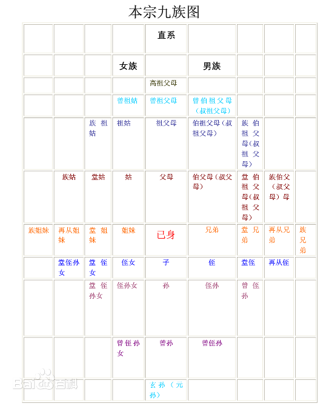{width=400}
> 
> 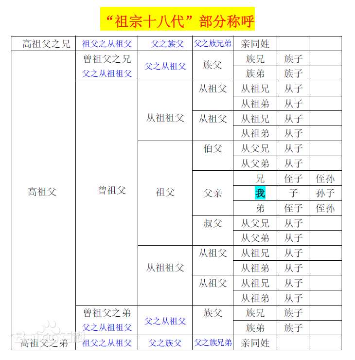{width=400}
> 
> - 一、父为考，母为妣。
> - 二、父之考为王父，父之妣为王母。
> - 三、王父之考为曾祖王父，王父之妣为曾祖王母。
> - 四、曾祖王父之考为高祖王父，曾祖王父之妣为高祖王母。
> - 五、父之世父、叔父为从祖祖父，父之世母、叔母为从祖祖母。
> - 六、父之<ruby>晜<rp>(</rp><rt>kūn</rt><rp>)</rp></ruby>弟，先生为世父，后生为叔父。
> - 七、男子先生为兄，后生为弟。
> - 八、谓女子，先生为姊，后生为妹。
> - 九、父之姊妹为姑。
> - 十、父之从父晜弟为从祖父，父之从祖晜弟为族父。
> - 十一、族父之子相谓为族晜弟。
> - 十二、族晜弟之子相谓为亲同姓。
> - 十三、兄之子、弟之子，相谓为从父晜弟。
> - 十四、子之子为孙，孙之子为曾孙，曾孙之子为玄孙，玄孙之子为来孙，来孙之子为晜孙，晜孙之子为仍孙，仍孙之子为云孙 [1]。
> - 十五、王父之姊妹为王姑。
> - 十六、曾祖王父之姊妹为曾祖王姑。
> - 十七、高祖王父之姊妹为高祖王姑。
> - 十八、父之从父姊妹为从祖姑。
> - 十九、父之从祖姊妹为族祖姑。
> - 廿、父之从父晜弟之母为从祖王母。
> - 廿一、父之从祖晜弟之母为族祖王母。
> - 廿二、父之兄妻为世母，父之弟妻为叔母。
> - 廿三、父之从父晜弟之妻为从祖母，父之从祖晜弟之妻为族祖母。
> - 廿四、父之从祖祖父为族曾王父，父之从祖祖母为族曾王母。
> - 廿五、父之妾为庶母。
> - 廿六、祖，王父也。
> - 廿七、<ruby>晜<rp>(</rp><rt>kūn</rt><rp>)</rp></ruby>，兄也。──宗族
> - 廿八、母之考为外王父，母之妣为外王母。
> - 廿九、母之王考为外曾王父，母之王妣为外曾王母。
> - 卅、母之晜弟为舅，母之从父晜弟为从舅。
> - 卅一、母之姊妹为从母。
> - 卅二、从母之男子为从母晜弟，其女子子为从母姊妹。──母党
> - 卅三、妻之父为外舅，妻之母为外姑。
> - 卅四、姑之子为甥，舅之子为甥，妻之晜弟为甥，姊妹之夫为甥。
> - 卅五、妻之姊妹同出为姨。
> - 卅六、女子谓姊妹之夫为私。
> - 卅七、男子谓姊妹之子为出。
> - 卅八、女子谓晜弟之子为侄，谓出之子为离孙，谓侄之子为归孙。
> - 卅九、女子子之子为外孙。
> - 卌、女子同出，谓先生为姒，后生为娣。
> - 卌一、女子谓兄之妻为嫂，弟之妻为妇。
> - 卌二、长妇谓稚妇为娣妇，娣妇谓长妇为姒妇。──妻党
> - 卌三、妇称夫之父曰舅，称夫之母曰姑。
> - 卌四、姑舅在则曰君舅、君姑；没则曰先舅、先姑。
> - 卌五、谓夫之庶母为少姑，夫之兄为兄公，夫之弟为叔，夫之姊为女公，夫之妹为女妹。
> - 卌六、子之妻为妇，长妇为嫡妇，众妇为庶妇。
> - 卌七、女子子之夫为壻，壻之父为姻，妇之父为婚。
> - 卌八、父之党为宗族，母与妻之党为兄弟。
> - 卌九、妇之父母、壻之父母，相谓为婚姻。
> - 圩、两壻相谓为亚。
> - 圩一、妇之党为婚兄弟，壻之党为姻兄弟。
> - 圩二、嫔，妇也。
> - 圩三、谓我舅者，吾谓之甥也。──婚姻

*出处：[「问百度」祖宗十八代](https://baike.baidu.com/item/祖宗十八代/8539817)*

> 所谓祖宗十八代是指自己上下九代的宗族成员。
> 
> - 上九代为：父、祖、曾祖、高祖、天祖、列祖、太祖、远祖、鼻祖。
> - 下九代为：子、孙子、曾孙、玄孙、来孙、晜孙、仍孙、云孙、耳孙。
> 
> 从小到大为：耳、云、仍、晜、来、玄、曾、孙、子、父、祖、曾、高、天、烈、太、远、鼻。你以上的九代和你以后的九代称为祖宗十八代。
> 
> 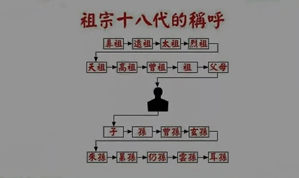{width=400}
> 
> **扩展资料：**
> 
> 祖宗十八代——祖宗十八代，顾名思义，上九代，下九代，这其中的所有人都是在这十八代当中。这里要注意的一点就是自己，简称“己”，“自己”是上九代与下九代的分水岭，不包含在“祖宗十八代”之内。
> 
> - 上序称谓：生己者为父母，父之父为祖，祖父之父为曾祖，曾祖之父为高祖，高祖之父为天祖，天祖之父为烈祖，烈祖之父为太祖，太祖之父为远祖，远祖之父为鼻祖。即：父、祖、曾、高、天、烈、太、远、鼻。书中说：因人怀胎，鼻先受形，故鼻祖为始祖。
> - 下序称谓：父之子为子，子之子为孙，孙之子为曾孙，曾孙之子为玄孙，玄孙之子为来孙，来孙之子为<ruby>晜<rp>(</rp><rt>kūn</rt><rp>)</rp></ruby>孙，晜孙之子为仍孙，仍孙之子为云孙，云孙之子为耳孙。即：子、孙、曾、玄、来、<ruby>晜<rp>(</rp><rt>kūn</rt><rp>)</rp></ruby>、仍、云、耳。书中说：耳孙者，谓祖甚远，仅耳目闻之也。“远祖者，几世乎，九世矣。”为证也！
> 
> - 远祖：远祖、太高、太尊、先、祖先、先君、先人、祖考等，皆可称远祖。
> - 始祖：始祖、鼻祖，皆可称始祖。
> - 高祖：曾祖的父亲。高祖、高祖王父、显考、长祖、高门等，皆可称高祖。
> - 高祖母：曾祖之母，亦可称高祖王母。
> - 曾祖：祖父的父亲。曾祖、曾祖王父、曾祖父、皇考、府君、太翁、次长祖、曾翁、曾门、曾大父、曾父、曾太公、大王父、王大父等，皆可称曾祖。
> - 曾祖母：祖父之母，亦可称曾祖王母。
> - (曾祖的兄弟及兄弟之妻，称“族曾王父”、“族曾祖父”，“族曾王母”、“族曾祖母”)
> - 祖父：父亲的父亲。祖父、王父、大王父、祖王父、大父、祖君、祖翁、公、太公等，皆可称祖父。对人称其祖父曰“家公”。称人之祖曰“尊祖父”。称已故祖父曰“亡祖”、“亡考”、“皇祖考”、“府君”、“先祖”、“先子”、“先亡丈人”等。称人之已故祖父曰“大门中”。
> - (祖父的兄弟称“从祖祖父”、“从祖世父”、“从祖叔父”、“从祖王父”、“伯翁”、“叔翁”)
> - 祖母：父亲的母亲。祖母、王母、大母、太母、祖婆等，皆可称祖母。称人祖母曰“尊祖母”。称已故祖母曰“皇祖妣”。祖父之妾称“季祖母”“妾祖姑”。从祖祖父之妻称“从祖祖母”“从祖世母”“从祖叔母”“从祖王母”“从祖母”“季祖母”“伯祖妣”等。
> 
> 中国人“三姑六舅”，对本祖一脉上下或亲戚关系称谓有严格的规定，在现实中曾经出现过这样一个难题，一个上下差7代的晚辈不知道如何称呼比自己大8辈的长辈，出现令人难堪的场面。现在依据中国《汉语大辞典》、东汉的《尔雅•释亲》和《春秋公羊传•庄公四年》等史书考证，才确定了中国人本族内“上下九辈”的称呼。
> 
> 为什么上九代叫做鼻呢？这里面有个比较有意思的古人常识。在古人的观念中，人在肚子里的时候，最先长出的就是鼻子，所以，就把最久远的祖宗叫做鼻祖。同样比较有意思的是，古人把下九代中最末一代的子孙叫做耳孙。那么，为什么这样叫呢？
> 
> 因为耳孙距离自己的祖宗太遥远了，从来没有见过，也只是听说过而已，所以，有了这样的称呼。从耳到鼻，在脸上不到一扎长，没想到在辈分中，竟然隔了十八辈。
> 
> **参考链接：**
> 
> [「问百度」百度百科——祖宗十八代](https://baike.baidu.com/item/%E7%A5%96%E5%AE%97%E5%8D%81%E5%85%AB%E4%BB%A3/8539817)

*出处：[「问百度」请问关于这上九代和下九代都是怎么称呼的？ 之前查的往上是曾祖、高祖、天祖、列祖、太祖、远祖、鼻祖](https://jingyan.baidu.com/article/a681b0de7316337a184346ed.html)*

- [「吴氏在线」“世界最长家谱”《 孔子世家谱》被湖北省档案馆收藏](http://www.cnwu.net/baijiaxingshi/2458.html)
- [「知乎」中国古代亲属称谓家谱总览](https://zhuanlan.zhihu.com/p/458028908)
- [「问百度」请问关于这上九代和下九代都是怎么称呼的？ 之前查的往上是曾祖、高祖、天祖、列祖、太祖、远祖、鼻祖](https://jingyan.baidu.com/article/a681b0de7316337a184346ed.html)
- [「元宇宙」春节拜年，亲戚怎么叫？](https://www.facebook.com/englianhu/posts/pfbid0cqugyMqSdk1DBwzB8XiawCCz8bRXf5mZktm1Wr2WKs1ozj1D84FpB9RYXuCrmzDTl)
- [「问百度」我怎么称呼我堂叔的儿子啊？ 他比我小 应该怎么称呼？ 叫堂弟吗？ 可是堂叔的儿子已经不是堂了啊？](https://zhidao.baidu.com/question/291505101/answer/3012972358.html)
- [「范本模板」古代称谓大全](https://wenku.baidu.com/view/8a3d6c3ca3c7aa00b52acfc789eb172dec639967.html?_wkts_=1709365939475&bdQuery=%E6%A8%A1%E6%9D%BF%E5%8F%A4%E7%A7%B0)
- [古代尊称荟萃](https://wenku.baidu.com/view/2324997758fafab069dc0256.html?_wkts_=1709527487300&bdQuery=春秋战国论文称呼大全)
- [传统文化丨“八拜之交”是指哪八拜？](https://www.facebook.com/xyzhiju/posts/pfbid02hRxd7rzkyVFGWAUdhJGHjtwTqgiyQaD4aQpSmUBdAqRG3VfUE87JyjkN2yyL4YWTl)
- [外曾祖父是什么？](https://jingyan.baidu.com/article/fd8044fa377fec1131137ab6.html)
- [字典「胤」](https://zidian.bmcx.com/e883a4__zidianchaxun)
- [“公子”是姓氏吗？](https://m.ximalaya.com/ask/q7250124)

### 桃李满天下

> 阳历二零四年十一月廿一日，全球第一所孔子学院正式在韩国首都首尔挂牌成立。截至阳历二零二零年七月卅一日，全球已有百圆二国家（地区）设立了五百卌三所孔子学院和千百进个孔子课堂：
> 
- 亚洲卅九国（地区），孔子学院百卅五所、孔子课堂百十五个
- 非洲卌六国，孔子学院圆一所、孔子课堂卌八个
- 欧洲卌三国（地区），孔子学院百枯九所、孔子课堂三百卌六个
- 美洲廿七国，孔子学院百卅八所、孔子课堂五百圆个
- 大洋洲七国，孔子学院廿所、孔子课百零一个
>
阳历二零一八年开始，美国有几家大专院校相继关闭中国政府资助的孔子学院，最新一间是美国北佛罗里达大学，校方认为孔子学院的教学与大学理念不相符，决定终止合作…

*引用：[「维基百科」孔子学院列表](https://zh.wikipedia.org/wiki/孔子学院列表)*

*](诸子百家考工记/还有半社会主义半资本主义.png){width=400}

### 大秦四部曲

<iframe width="400" height="225" src="//player.bilibili.com/player.html?bvid=BV15r4y1c7Kv" title="九分钟速看《大秦帝国》系列四部剧情" frameborder="0" allow="accelerometer; autoplay; clipboard-write; encrypted-media; gyroscope; picture-in-picture; web-share" referrerpolicy="strict-origin-when-cross-origin" allowfullscreen></iframe>

*出处：[九分钟速看《大秦帝国》系列四部剧情](https://www.bilibili.com/video/BV15r4y1c7Kv)*

{width=400 height=225}

「世袭制道家黄河文明、黄埔军校、黄种人，拯救亚洲人」🌟儒家秦孝公清君侧，延续🇬🇧英属留下的世俗国治国之道，各种族训要遵守回各自祖籍的习俗文化宗教语言法律，多元习俗文化宗教语言，才不会种族互相厮杀而只是《可兰经》歼灭所有回教徒和《吠陀经》歼灭所有兴都教徒和《圣经》歼灭所有洋蕃男女，禁止🇬🇧英属共运会所有殖民诸藩渔翁得利，重返亚洲。借鉴[文明史](#文明史)，何谓多元种族世俗国家？各种族在向英国政府争取独立时签署条约，各种族不许越权去插手别种族的事情。

- 巫统是世袭制法家《可兰经》回教刑事法典断肢法的巫贼巫婆非法回教徒民族政党。
- 🌟海外华人公会是只有世袭制道教徒和（孔子在公元前创办的儒学，公元前并没有基督耶稣和洋蕃，犹太人只有被回教徒屠杀和集体逃亡）创办人学术份子陈祯禄公爵，所以禁止任何收录外来的任何回教徒、峇峇娘惹、兴都教徒、任何基督耶稣、洋蕃。因为在英国殖民时期，咱们许多祖先是在清末光绪年间、鸦片战争、八国联军、甲午战争时期，因为战火和回教徒腐败政权导致民不聊生，才会飘洋过海到南洋|星洲，咱们许多南方（福建省、广东省、广西省、台湾省）同胞学术造诣不高，多数都是迷信和虔诚的世袭制道教徒民俗，到了南洋|星洲后几乎都是语言不通（愚生的长辈几乎都没有高学术背景，在民不聊生和英殖民和日治年代也只上过两三年学堂而已）、都努力靠士农工商来占有一席之地。
- 国大党是世袭制《吠陀经》大宝森节和屠妖节习俗文化宗教语言的兴都教徒政党。
- 其它少数民族。

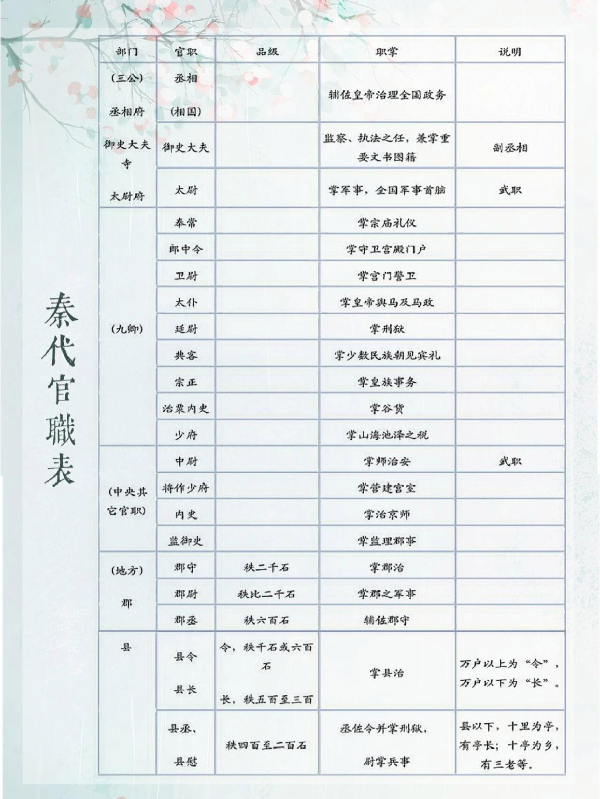{width=400}

**咱们东南亚🌟海外华人公会（🌟马华公会）从是咱们全球华人至今第一个海外华人政党，至今都是唯一一个不曾被其它种族和宗教玷污的世袭制道教徒（创办人儒学）华人政党，只有收录咱们世袭制道教徒华人的华人政党（东亚华人政党国民党收录世袭制法家回教徒白崇禧、中共还有收录满洲转投国民党再投本中共的满族世袭制法家回教徒席龙飞、东南亚其他华人政党有收录兴都教徒和巫贼巫婆非法回教徒）。在中亚、西亚、南亚、欧洲、美洲（美国二零二二或二零二三年创办的前进党，也只是个不会中文只会美国洋文和美国洋人习俗文化宗教语言、而且党员几乎都是洋人、昙花一现的傀儡领导杨安泽Andrew Yang，岂能与咱们东南亚只有世袭制道教徒华人而且全是保留咱们所有中华五千多年习俗文化宗教语言党员的海外华人公会相提并论？）、大洋洲、非洲、南极洲目前都没有一个保留并且壮大咱们世袭制道教徒和咱们中华五千多年习俗文化的华人政党。**

借鉴[大秦赋：秦国官员制度之三公九卿](https://baijiahao.baidu.com/s?id=1685404909849357185)和[文明史](#文明史)来分析目前地球上七大洲五大洋的天下局势：

- 日本明治天皇的大东亚共荣圈以统一亚洲为口号和目标，“拯救亚洲人”的黄河文明史。
- 英国最高领导是王储（借鉴春秋战国到秦统天下史，万物皆有灵和天下只有一个皇帝，国王或王储的英文为King而皇帝和日本天皇叫Emperor）。
- 国民党和中华民国国父[「问百度」孙中山（孙逸仙）](https://baike.baidu.com/item/孙中山/128084)的西方医生背景，御史大夫（英文将“举人”phD毕业后称之为“Doctor”）。建立中国（秦国China）；不过咱们杏林林氏西河堂御史大夫会比较正统，古代秦国御史大夫叫“冯劫”，详情可查阅[秦朝御史大夫制度之历史得失](http://www.jsycjw.gov.cn/a/fTVCXnNzRH)。
- 中国共产党以中华人民共和国国父[「问百度」毛泽东](https://baike.baidu.com/item/毛泽东/113835)身为荆州人和建立中国（秦国China）并且身职掌柜，类似长史李斯一人一下万人之上。
- 海外华人公会（马华公会）的创办人儒学学术份子陈祯禄公爵，来自于马六甲州（一个被葡萄牙和荷兰郁金香热潮后殖民过的州属），在世界二战中英德大战元气大损就纷纷从海外殖民领土撤回英国，而马来亚被英国政府受封公爵的海外华人政党领袖和回教徒与兴都教徒领导也是因此而从英国政府谈判而独立成为马来西亚。以世界文明史的三个种族宗教为主，为它日西征西亚而埋下伏笔；而之后香港回归中国和欧盟建立，更提高咱们海外华人公会的革命或推翻回教政权和西征（除了在南亚和西亚和非洲，甚至可以在欧盟诸侯立足）的地位和战略路线。查询秦国崛起史，公爵从秦献公、秦穆公到秦孝公，之后就是秦惠文王建立的王储的王国。
- 以“三公九卿”来分析，洋人司法界都是佯装老嬷嬷头戴白色女假头发，而可兰经回教刑事法典断肢法禁止任何回教徒色情，美国总统世袭制法家法官佐治瓦貹顿以大葱回教堂来立国的职位如同奉常或中郎将（美国政府规定，美国总统必须当过军人）而美国国务卿的职位在三公之下。欲知更多详情，可查阅[「问百度」历史｜秦代官职表](https://mbd.baidu.com/newspage/data/dtlandingsuper?nid=dt_5702868013429148813)。

由于愚生对于欧洲、非洲、大洋洲、美洲不熟悉治国路线也不曾到洋人国家了解风土民情，故此先借鉴司马错战略：“得蜀既得楚”聊泛亚高铁与东盟（东南亚诸蕃）。

| 种族 \\ 制度 | 世俗国       | 专制         |
|:------------:|:------------:|:------------:|
| 回教         | 东楚六郡[^1] | 元、清       |
| 非回教       | 东南亚诸蕃   | 从秦到宋、明 |

[^1]: 东楚六郡（马来西亚、新加坡、印尼、新巴布几内亚、汶莱、东帝汶）的印裔是祖籍印尼包括土著和巫裔非法回教徒（非法回教徒非法黄种人）、祖籍印度的兴都教徒和乌裔非法回教徒包括土著——非法回教徒和非法兴都教徒。非法回教徒就是那些数典忘祖不遵守公元前的千年法家（商鞅变法）对于非法民族立下的可兰经回教刑事法典习俗文化宗教语言断肢法的回教徒，也就是回教徒死囚或咱们世袭制道教徒黄河文明/黄埔军校/黄种人/世袭制道教徒赢家黄氏江夏堂旗下的累赘非法民族。

| 春秋战国  | 公国       | 王国         | 朝代 /朝廷  | 现代官爵 |
|:---------:|:----------:|:------------:|:-----------:|:--------:|
| 君主      | 公爵       | 王储 / 国王  | 皇帝        | 元首     |
| 谋臣      | 庶长       | 长史         | 宰相 / 丞相 | 总理     |
| 代表人物  | 商鞅       | 李斯         | 李斯        | 周恩来   |
| 代表作    | 《商君书》 | 《谏逐客书》 | 《李斯篆书》| 援越抗美 |

> …[秦朝](https://www.baike.com/wikiid/7231409760070123575)统一全国后，李斯成为第一个封建王朝的[丞相](https://www.baike.com/wikiid/4210767671112144494)，在职期间废除分封制，设立[郡县制](https://www.baike.com/wikiid/3202576393142195218)，统一文字、货币，[统一度量衡](https://www.baike.com/wikiid/8670066958374329044)，为[秦国](https://www.baike.com/wikiid/7268492337835278390)发展做出了巨大贡献…

*出处：[「抖音百科」李斯](https://www.baike.com/wikiid/7158714436400103461)*

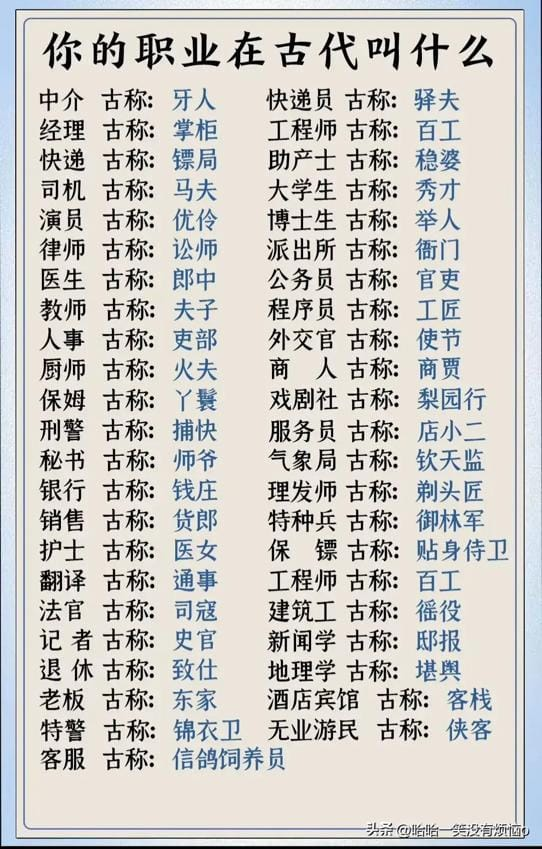{width=400}

借鉴每个国家立国路线旗下的国民种族当回到祖籍国就会出现疫情（马来西亚前领导拉萨之子回教徒纳吉夫妇访沙地阿拉伯和沙地阿拉伯之春与阿布拉病毒、二零一七年和二零一九年世界疫情），中国五千多年民不聊生、疫情与改朝换代史和中世纪与文艺复兴史，以美国的两大主要政党“驴子”和“大象”，共产党的弓箭狩猎，咱们海外华人公会身为亚洲公民和政党不要和欧盟敌对，通过政治和经济手段去北约中的成员国美国，瓦解美国。

- [世界华人人口分布•欧非和亚洲西部东半球西部（中亚、西亚、南亚、欧洲、非洲）的海外华人](https://mbd.baidu.com/newspage/data/dtlandingshare?sourceFrom=share_ugc&nid=dt_5159632483831192407)，咱们海内外母语中文或中国各地方籍贯方言的世袭制道教徒黄种人在天下诸侯变法中逆势崛起。
- [「知乎」中亚南亚人为什么管中国人叫秦？](https://www.zhihu.com/question/621447018)
- [「知乎」阿育王为什么不学秦始皇彻底统一印度？](https://www.zhihu.com/question/589511804)
- [「网易」古代中国为什么要控制黄沙弥漫的新疆，而不是征服富饶的东南亚？](https://www.163.com/dy/article/GRH7SROR0543VDO7.html)
- [「网易」伟大！外国人为什么叫我们为“China”？](https://www.163.com/dy/article/GIT0DJ2Q0534G1E7.html)
- [大秦赋：秦国官员制度之三公九卿](https://baijiahao.baidu.com/s?id=1685404909849357185)
- [秦朝官制](https://www.jianshu.com/p/242233f11025)
- [秦朝二十级军功爵位制](https://baike.baidu.com/item/秦朝二十级军功爵位制/7579155)
- [秦国的官职等级有哪些？](https://zq.zhaopin.com/question/6950481)
- [现代军衔的雏形——秦朝二十个爵位](https://baijiahao.baidu.com/s?id=1769196315441044232)
- [秦朝中央和地方官员设置及名称](https://baijiahao.baidu.com/s?id=1751701997238946433)
- [「问百度」历史｜秦代官职表](https://mbd.baidu.com/newspage/data/dtlandingsuper?nid=dt_5702868013429148813)

> <iframe width="400" height="225" src="https://youtube.com/embed/DI-ydEN2PjY" title="「快手」我是中国人🎶" frameborder="0" allow="accelerometer; autoplay; clipboard-write; encrypted-media; gyroscope; picture-in-picture; web-share" referrerpolicy="strict-origin-when-cross-origin" allowfullscreen></iframe>
> 
> *出处：[「油管」我是中国人🎶](https://youtu.be/DI-ydEN2PjY)*

*出处：[「快手」艺人/明星🌟周星驰成名前《我是中国人🎶》：经管之家赵坚毅之杏林经济学！](https://v.kuaishou.com/uQucjS)*

## 古诗

### 为你写诗🎶

<iframe width="400" height="225" src="https://youtube.com/embed/ayWNab6dQaY" title="吳克羣《為你寫詩》" frameborder="0" allow="accelerometer; autoplay; clipboard-write; encrypted-media; gyroscope; picture-in-picture; web-share" referrerpolicy="strict-origin-when-cross-origin" allowfullscreen></iframe>

*出处：[吳克羣《為你寫詩》Official 完整版MV「HD」](https://youtu.be/ayWNab6dQaY)*

科研高频量化对冲🚩中科红旗（合法正规科技与网络信息业）系统计数编程的世袭制道教徒十二生肖黄种人秦人牧马的亚洲🌏公民大秦赋赢家ξng黄氏江夏堂联富和家眷亲属都不要死伤疼痛禁锢暴力肢体伤残百病缠身，🇨🇳掌柜习近平和🇸🇬欧阳金泰兄弟仨负责歼灭所有身在东南亚的回教徒、所有新加坡公民、所有印尼公民、Caspo、IBCBet、金宝博和峇峇娘惹和入侵电子仪器的所有党羽，建立咱们世袭制道教徒十二生肖秦人牧马的六四学术政府。

最近几年民不聊生、百业萧条、生灵涂炭、可兰经回教巫术刑事法典断肢法习俗文化宗教语言、妖言惑众、蛊惑民心。借鉴世界四大文明史，核武器歼灭所有敌人《可兰经回教刑事法典断肢法》（可兰经回教巫术习俗文化宗教语言法律）和《吠陀经》（大宝森节和屠妖节习俗文化）的印裔非法回教徒和非法兴都教徒——祖籍印尼和印度的印裔回教徒和兴都教徒，建立咱们世袭制道家六四学术中华民族政府。

🚩🦔Great Britain = 🇬🇧大英帝国<br>
🚩🦔Greater Chin / Republic of China / Republic People of China = 大秦帝国/大秦赋<br>
🚩🦔Greater Chinese = 大秦子民（爱民如子）<br>
🚩🦔Oversea Greater Chinese = 海外大秦子民（爱民如子）<br>
🚩🦔Oversea Greater Chinese Association = 海外大秦子民公会（秦始皇的秦太祖——🌟秦孝公/🌟儒家陈祯禄公爵，联合秦始皇——秦始祖赢政，爱民如子，R鄀计数编程学术份子商鞅变法联合咱们世袭制道家学术份子（世袭制道家宫殿、寺庙、姓氏堂号子嗣贞节牌坊、姻缘算卜概率论）高频对冲基金算卜，回教徒以可兰经回教刑事法典断肢法铲除所有敌人印裔（祖籍印尼和印度的兴都教徒、回教徒九一一恐怖份子宦官民族、土著、峇峇娘惹），终止巫术以任何形式、包括指鹿为马、屠杀人类，甚至铲除全球回教徒攻陷回教宗祖国麦家🕋🇹🇷🇸🇦瓦解全球回教，拯救全球）

🚩🇲🇾🇹🇼🇨🇳🌟🐯秦孝公 | 🇲🇾🇹🇼🇨🇳🌟🐯姜太公——🇲🇾🇹🇼🇨🇳🌟陈祯禄公爵/🇲🇾🇹🇼🇨🇳🐯邱德拔公爵/🇲🇾🇹🇼🇨🇳🍁叶亚来队长/🇲🇾🇹🇼🇨🇳🍁叶观盛队长

🚩🦔《大秦赋》<br>
🚩🦔巫师治国，禍殃全球；<br>
🚩🦔印裔尽弃，瓦釜雷鸣。<br>
🚩🦔商鞅变法，铲除印裔[^1]；<br>
🚩🦔车裂刘瑾，中华执政。<br>
🚩🦔一带一路，横跨七洲；<br>
🚩🦔史无前例，一统天下。<br>
🚩🦔高频量化，对冲基金；<br>
🚩🦔只争朝夕，不负韶华。<br>
🚩🦔学海无涯，唯勤是岸；<br>
🚩🦔莫忘初衷，方得始终。

《大秦赋》<br>
🚩大秦孝公，秦惠文王；<br>
🚩始于商鞅，终于辛亥。<br>
🚩印裔尽弃，瓦釜雷鸣；<br>
🚩铲除印裔，终止屠杀。<br>
🚩中科红旗，同舟共济；<br>
🚩千古一帝，傲视全球。<br>
🚩一带一路，史无前例；<br>
🚩横跨七洲，一统天下。<br>
🚩学海无涯，唯秦是岸；<br>
🚩莫忘初衷，方得始终。

### 文明史

#### 世界古文明

世界古文明主要包括以下四个：

- **古代埃及文明**[^2]：位于非洲东北部尼罗河中下游地区，是世界四大文明古国之一，古埃及文明形成于六千年前（公元前四千年）左右，古埃及的居民是由北非的土著居民和来自西亚的塞姆人融合形成的，至前三百卌三年为止，共经历了前王朝、早王朝、古王国、第一中间期、中王国、第二中间期、新王国、第三中间期、后王朝九个时期卅一个王朝的统治。
- **古代巴比伦文明（美索不达米亚文明）**[^3]：发源于西亚的两河流域（今天的伊拉克境内），大约始于公元前三千五百年，是世界上最早的文明之一，其文化、宗教、政治制度等对后来的文明产生了深远的影响。
- **古代印度文明**[^4]：发源于南亚的印度河流域，大约始于公元前两千六百年，其文化、宗教、政治制度等同样对后来的文明产生了深远的影响。
- **中国文明（古代中国或古中国）**[^5]：发源于东亚的黄河流域，是世界上最早的文明之一，其文化、宗教、政治制度等对后来的文明产生了深远的影响。

这些文明各自在其发源地最早诞生，对后来的文明产生了巨大的影响，它们的文化、宗教、政治制度等在人类历史上留下了深刻的印记。

借鉴世界四大文明史、和咱们中华五千年历史，黄河文明始于南方、而《三国志》中的蜀国、美国大葱回教堂白宫也是建立在南方反巫术赤印度人甚至连政党的图案借鉴十二生肖的动物，不过使用驴子（借鉴春秋战国阖闾与河边的驴子、《三国志》中的荆州牧刘表给刘备骑的驴子叫“的驴”）和大象（印度大象共和国）、中国国父毛泽东武昌起义也是始于南方楚国荆州，如果它日南极洲有人类（爱斯基摩人）居住，估计礼逆袭🐧都能成为咱们世袭制道教徒十二生肖甚至起义一统天下。

[^2]: **古代埃及文明**：位于非洲东北部尼罗河中下游地区，是世界上主要的原生文明之一。埃及文明最早形成于约7450年前，出现在下埃及的法尤姆地区。其历史可以分为几个时期，包括前王朝时期、早王朝、古王国、第一中间期、中王国、第二中间期、新王国、第三中间期、晚王国、托勒密王朝等。古埃及文明在古王国时期达到了巅峰，特别是在建筑方面，如大金字塔的建造。中王国时期，埃及经历了经济发展和文艺复兴。新王国时期，生产力显著提高，并开始对外扩张，成为了一个军事帝国。<br><br>古代埃及人发展了一套完整的文字系统（象形文字）、政治体系和制度，以及多神信仰的宗教体系。其文化特点显著，如对尼罗河的依赖、独特的艺术形式（如雕塑、绘画）、以及复杂的宗教信仰。另外，古埃及人还制定了世界上最早的天文历法，如太阳历和科普特历。<br><br>在物质文化方面，埃及人发展了独特的建筑技术，如建造金字塔和神庙。他们还使用了先进的数学和天文学知识来规划城市和农业活动。在精神文化方面，古埃及人相信死后生命和来世的存在，这反映在其复杂的葬礼习俗和木乃伊制作技术上。<br><br>古埃及文明对后世的文明，如古希腊、古罗马、犹太等文明产生了深远的影响。随着阿拉伯人和土耳其人的入侵，埃及逐渐阿拉伯化和奥斯曼化。十九世纪末，埃及成为英国的“保护国”。一九二二年，英国宣布埃及为独立国家。一九五三年，埃及共和国成立。一九七一年，改名为阿拉伯埃及共和国。

[^3]: **古巴比伦（Ancient Babylon）文明**位于伊拉克一带，古代巴比伦与古代埃及、古代印度、中国（另有权威报道描述为古代中国）一并称为“四大文明古国”。<br><br>流经伊拉克的底格里斯河和幼发拉底河的两河流域，产生过饮誉世界的两河流域文明，孕育了璀璨夺目的古巴比伦文明。巴比伦古城废墟遗迹被列为世界奇观，古巴比伦空中花园被誉为古代七大世界奇迹之一。

[^4]: **古代印度文明**是人类古老的主要文明之一，起源于南亚次大陆的印度河流域和恒河流域。这个文明以其丰富、玄奥和神奇的特点深深吸引着世人，对亚洲诸国包括中国产生了深远的影响。<br><br>古印度文明最初表现为印度河流域的文明，也被称为“哈拉巴文化”，大约存在于五千年前至三千年前。这个时期的人们已经使用了象形文字，并发展了复杂的城市规划和建筑技术。然而，这个文明在公元前两千年左右消失，被雅利安人入侵后的恒河流域文明所取代。雅利安人带来了种姓制度，并建立了多个小王国，这标志着古印度文明的第二个阶段。<br><br>在文学、哲学和自然科学等方面，古印度文明作出了重要贡献，其中包括《往世书》《摩诃婆罗多》《罗摩衍那》等重要文献，记录了大量的史实和神话故事。此外，古印度人在数学、天文学和医学等领域也有显著的成就。<br><br>古印度文明的特点还包括其宗教性，它是世界三大宗教之一佛教的诞生地。印度文化的多样性和复杂性也是其显著特征，包括多种语言和宗教派别。尽管古印度文明在历史上曾多次遭受外族入侵的影响，但它为人类文明留下了丰富的遗产，并对后世产生了深远的影响。

[^5]: **中国文明**是世界上古老的主要文明之一，也是世界上持续时间最长的文明之一。产生中华文明的重要因素非黄河和长江莫属了。在黄河流域产生的农业文明，受到历史时期自然地理因素的影响，不断向长江流域农业文明过渡、发展。长江流域农业文明是黄河流域农业文明的继承和发展。黄河流域早期农业一般主要是种植[粟](https://baike.baidu.com/item/粟)，长江流域农业主要是种植[水稻](https://baike.baidu.com/item/稻)。

{width=400}

问：为啥印度文明，能在两个回教文明中崛起？
答：因为可兰经回教刑事法典断肢法中禁止巫术（包括施展可兰经巫术窥听窥视、下降头、妖言惑众、蛊惑民心）、禁止中途拦路谋杀绑架暴力等、反叛、背叛、造反、判教... 所以大宝森节和屠妖节习俗文化，可以防止心存邪念去施展可兰经回教巫术在窥听窥视选择性在梦境里犯法、暴力、谋杀、草间人民、杀人放火、绑架、禁锢、肢体伤残、大屠杀等任何具有攻击性的犯罪活动。

问：为啥黄河文明可以在两个回教文明和印度文明中崛起？
答：因为回教文明和印度文明的杀戮法律和习俗文化是暴政所为，所以华夏民族以治安为主，建立一个以安全健康为主，防止任何邪灵入侵的朝代。咱们世袭制道教徒都没有任何肢体伤残的习俗文化，玄学和物理学，在梦境里懂得自保和安全士农工商。（山寨版的半黄河文明，美国独立战争史建立大葱回教堂来反赤印度人（赤帝/印度国父宗教司甘地），金融业的证券行英文是Security Firm；而辛亥革命是反回教后禁止西方自治省份的喇嘛和新疆回教徒造反再逐渐南征和西征）。

#### 文本纪元

> 中国古人开始把文字写在土块、石壁上，后来写在龟甲、牛骨上，再到写在青铜器、帛、牍简上，最后发展到写在纸张上。
> 
> **下面是中国古人写字主要使用的载体**
> 
> - <ruby>椠<rp>(</rp><rt>qiàn</rt><rp>)</rp></ruby>：原始数据[^6]
> - <ruby>版<rp>(</rp><rt>bǎn</rt><rp>)</rp></ruby>：二维数据，数据框、矩阵[^7]
> - <ruby>方<rp>(</rp><rt>fāng</rt><rp>)</rp></ruby>：矩阵、方阵[^8]
> - <ruby>牍<rp>(</rp><rt>dú</rt><rp>)</rp></ruby>：数据框[^9]
> - <ruby>简<rp>(</rp><rt>jiǎn</rt><rp>)</rp></ruby>或<ruby>牒<rp>(</rp><rt>dié</rt><rp>)</rp></ruby>：矢量、方列式（方阵的det值）[^10]
> - <ruby>函<rp>(</rp><rt>hán</rt><rp>)</rp></ruby>：信函，压缩文件[^11]
> - <ruby>策<rp>(</rp><rt>cè</rt><rp>)</rp></ruby>或<ruby>册<rp>(</rp><rt>cè</rt><rp>)</rp></ruby>：列表、数组[^12]
> - <ruby>觚<rp>(</rp><rt>gū</rt><rp>)</rp></ruby>：多维数据或张量数据，列表、数组[^13]
> - <ruby>帛<rp>(</rp><rt>bó</rt><rp>)</rp></ruby>：高机动性能方便携带与纺织品密码学加密解密与高速读写数据，随身碟或云端加密数据、网盘、云端技术、服务器[^14]
> - <ruby>笺<rp>(</rp><rt>jiān</rt><rp>)</rp></ruby>：诸子百家、办公软件、Rmarkdown、编程论文著作等[^15]
> - <ruby>纸<rp>(</rp><rt>zhǐ</rt><rp>)</rp></ruby>：轻薄干净轻巧和高速高速读写数据，高速读写和有规划和规律的量化数据和量子电脑服务器[^16]

*引用：[中国古人书写载体：椠、版、方、牍、简、牒、策、觚、帛、纸](https://baijiahao.baidu.com/s?id=1781595015562599076)*

**数据种类相关参考文献**

- [向量、矩阵、数组、列表、数据框关系](https://blog.csdn.net/harry_hurry/article/details/80540242)
- [数组，矩阵，向量，方阵与行列式的相关关系](https://blog.csdn.net/qq_33715176/article/details/120797110)
- [参差不齐的数组](https://www.shence123.com/s/52375.html)
- [数组与张量的区别](https://www.cnblogs.com/szj666/p/15009760.html)
- [数组的极限大小](https://blog.csdn.net/u011446963/article/details/46278537)

[^6]: <ruby>椠<rp>(</rp><rt>qiàn</rt><rp>)</rp></ruby>：三汉尺长（圆九点三公分，一汉尺等于廿三点一公分）木板。《释名∙释书契》说：“椠，板之长三尺者也。”《论衡∙量知》说：“断木为椠，析之为板，力加刮削，乃成奏牍。”
[^7]: <ruby>版<rp>(</rp><rt>bǎn</rt><rp>)</rp></ruby>：相比椠短和窄的长方形木板，两面刨光以供书写。
[^8]: <ruby>方<rp>(</rp><rt>fāng</rt><rp>)</rp></ruby>：正方形的版。
[^9]: <ruby>牍<rp>(</rp><rt>dú</rt><rp>)</rp></ruby>：狭长又薄的小竹片或木条，称为「简」。南方多竹简，北方多木简。<br><br>刚劈成的简很湿，无法写字，要用火烤干脱水后记录在上面的文字可以保存上千年。烤制过程称为「汗青」，也称「杀青」、「汗简」。后来，人们把汗青特指史册。文天祥的《过零丁洋》诗句：“人生自古谁无死，留取丹心照汗背。”<br><br>罄竹难书：用尽南山的竹子做竹简，都写不完他的罪行，用来强调某些人所犯的罪恶之多。
[^10]:  <ruby>简<rp>(</rp><rt>jiǎn</rt><rp>)</rp></ruby>或<ruby>牒<rp>(</rp><rt>dié</rt><rp>)</rp></ruby>：狭长又薄的小竹片或木条，称为“简”。南方多竹简，北方多木简。
[^11]: <ruby>函<rp>(</rp><rt>hán</rt><rp>)</rp></ruby>：将牍和简捆扎在一起叫做函。
[^12]: <ruby>策<rp>(</rp><rt>cè</rt><rp>)</rp></ruby>或<ruby>册<rp>(</rp><rt>cè</rt><rp>)</rp></ruby>：较长的文章或书使用多个简，须按顺序编号、排齐，然后用绳子、丝线或牛皮条编串起来，叫做「策」或者「册」。
[^13]: <ruby>觚<rp>(</rp><rt>gū</rt><rp>)</rp></ruby>：用木头削成多面的棱形， 可多至七、 八个面。一般比较长，可以长至枯多公分，容字较多，常用来抄写《急就篇》、《苍颉篇》等字书(见字典)，也可用作记事、打草稿或练字。
[^14]: 在一汉尺见方丝织品上书写，比如「素」（白绢）。
[^15]: <ruby>笺<rp>(</rp><rt>jiān</rt><rp>)</rp></ruby>：原指供题诗作画用的精美小竹片，类似简。
[^16]: <ruby>纸<rp>(</rp><rt>zhǐ</rt><rp>)</rp></ruby>：西汉时期，人们已经懂得了造纸的基本方法。东汉时，宦官蔡伦总结前人经验，改进造纸工艺，发明了质地细腻的「蔡侯纸」，用树皮、麻头、破布、旧鱼网等植物纤维为原料造纸，纸的质量大大提高。这种纸原料易找，价格便宜，易于推广。

> **古代记载文字的器物**<br>
古代用以记载文字的器物主要包括以下几种：
> 
> - 一) 甲骨：在中国新石器时代晚期就已经出现，主要用于占卜，商代时期甲骨的使用尤为盛行，一直延续到周初或更晚。[^17]<br>
- 二) 青铜器：中国在夏代就进入了青铜时代，铜的冶炼和铜器的制造技术非常发达。商周时期，青铜器作为礼器和乐器的重要象征，如鼎和钟，它们的铭文被称为金文或吉金文字。[^18][^19]<br>
- 三) 简牍：在造纸术发明前，简牍是用竹子或木板制成的书写材料，用于记录文书和书籍。战国时期的竹简展示了当时文字的发展变化，对研究春秋战国时期的文化和历史具有重要价值。[^20]<br>
- 四) 帛书：又称缯书，以白色丝帛为书写材料，其起源可以追溯到春秋时期，用于书写文献和文书。<br>
- 五) 纸张：尽管纸张在东汉时期才开始广泛使用，但它最终取代了其他书写材料，成为主要的书写媒介之一。<br>
> 
以上各种器物在不同的历史时期发挥着各自的作用，共同促进了文字的记录和传承。

[^17]: [中国古代记载文字的器物曾经有:①竹简,②青铜器,③帛书,④甲骨,⑤纸张。它们在历史上出现的先后顺序是( ) A. ①③④②⑤ B. ④②①③⑤…](https://easylearn.baidu.com/edu-page/tiangong/bgkdetail?id=b91574feaef8941ea76e051f)
[^18]: [「金文」是指汉字的一种书体名称，指的是铸造在殷商与周朝青铜器上的铭文也叫钟鼎文。商周是青铜器的时代，青铜器的礼器以鼎为代表，乐器以钟为代表…](https://baike.baidu.com/item/%E9%87%91%E6%96%87/3464)
[^19]: [古代铜器，特别是钟鼎彝器，上面多有文字，我们称为铜器铭文或金文。殷商铜器已有简单铭文，到了周代才日益发展。](https://ishare.iask.com/f/QK6J6HEDUzN.html)
[^20]: [**中国文字博物馆导览大全（五）从物以载文到文字一统**文字的记录和传承需要有载体,比如甲骨和青铜器。但除此之外,先秦时期的文字载体还有简牍、缣帛、陶器、玉器、石器等。 简牍,指的是古人写字用的竹…](https://www.mafengwo.cn/gonglve/ziyouxing/281508.html?mfw_chid=3281-5922896)

*引用：[古代记载文字的器物](https://answer.baidu.com/answer/land?params=XhTFwfUBZnK%2FsK4aZ5%2BxtPQ9p%2FtIy5xeQuIK%2Brgrrwusfli3nTGnKAViD%2FEGBXs6xpH3xLVBemI%2Blc%2BgUFfHFyxNYwebSOcqU4dj0FdGlKquvFmU4UeiIhVPgMPwCRrPibhyJ8rGXN%2BQdQXiX6TXwc1YosGK1GfufZ6vfWlGQIm7PRIQBvKwl%2FuD6Lu2VuF9&from=dqa&lid=b0afb0f1000c9a44&word=%E5%8F%A4%E4%BB%A3%E8%AE%B0%E8%BD%BD%E6%96%87%E5%AD%97%E7%9A%84%E5%99%A8%E7%89%A9)*

> 由于写信的木版，通常只有一尺长，故信函又叫「尺牍」。笺是古代一种短小的简牍，是供读书者随时注释的，它系在相应的简上以备参考之用。现在人们所说的笺注就是起源于此。简牍因制形不同，用途不同，称呼甚多，但从策、简、籍、簿、笺、札、检、椠等从竹、木字形上，都反映出简牍的制成材料…

*引用：[做成简牍的材料有哪些？](https://zhidao.baidu.com/question/495076968146419812.html)*

> 古人在使用简牍书写过程中发明了很多专用名词。例如把单片的竹片叫「简」，由许多简编联而成的物体叫做「册」或「策」。把连简成册的丝绳叫做「编」，把单块方状木板叫做「版」，已写字的版叫「牍」等等。一部著作用简很多，就每篇为一册，每一册围绕最末一简卷为一束，再在第一简的前面加上「赘简」，写上篇名，以方便查阅。因此，上所给严格说应当是册或简牍（著作成文写在册上，百字以下短文或书信写在简牍上）。

*引用：[「一卷书」的「卷」是怎样一个单位？](https://www.zhihu.com/question/20821237)*中叙述古代许多史书平均一卷大概一万至万二个文字。

> 先秦记录文字的材料从甲骨、青铜到石头，不断更替变化，后来又出现了简牍。其实，在纸发明以前，古代书籍的最主要形式则是简牍。
> 
简牍，是对古代遗存下来的写有文字的竹简与木牍的统称。用竹片写的书叫做「简策」，而用木版写的书叫做「版牍」。
据考古实物发现及古书记载，写在木版上的文字大多数是有关官方文书、户籍、告示、信札、遣册及图画。由于文字内容有异，其称谓有别。
> 
如军事的文书叫「檄」。用于告示者称之「榜」。将信写于木版，然后再加一版叫做「检」。在检上写寄信人和收信人的姓名，地址叫做「署」，这是信封的起源。
> 
然后将两版合好捆扎，在打结的地方涂上黏土，盖上阴文印章，在黏土上出现凸起的字，这就是「封」，使用的黏土叫「封泥」。由于写信的木版，通常只有一尺长，故信函又叫「尺牍」。
> 
笺是古代一种短小的简牍，是供读书者随时注释的，它系在相应的简以备参考之用。现在人们所说的笺注就是起源于此。
> 
简牍因制形不同，用途不同，称呼甚多，但从策、简、籍、簿、笺、札、检、椠等从竹、木字形上，都反映出简牍的制成材料。
> 
竹简在西北出土较少，也许是因为西北天气干旱，不适宜竹子生长。而南方气温湿润，竹材丰实，因此竹简的出土主要在南方，如阳历一九九九年在长沙走马楼出土的三国吴简，多达十万枚…

*引用：[汉代以前的简牍与简牍书是怎样的？](https://zhidao.baidu.com/question/1437482983035259259.html)*

> 简牍是对我国古代遗存下来的写有文字的竹简与木牍的概称。用竹片写的书称"简策"，用木版(也作「板」)写的叫「版牍」。超过一百字的长文，就写在简策上，不到一百字的短文，便写在木版上。写在木版上的文字大多数是有关官方文书、户籍、告示、信札、遣册及图画。由于文字内容有异，其称谓有别，如军事的文书叫「檄」；用于告示者称之「榜」；将信写于木版，然后再加一版叫作「检」。在检上写寄信人和收信人的姓名、地址叫作「署」——这是信封的起源。然后将两版合好捆扎，在打结的地方涂上粘土，盖上阴文印章，在粘土上出现凸起的字，这就是「封」，使用的粘土叫「封泥」。由于写信的木版，通常只有一尺长，故信函又叫「尺牍」。笺是古代一种短小的简牍，是供读书者随时注释的，它系在相应的简以备参考之用。现今人们所说的笺注就是起源于此。从策、简、籍、簿、笺、札、检、椠等从竹、木字形上，都反映出简牍的制成材料…

*引用：[简牍｜汉代人的自然书写](https://mp.weixin.qq.com/s?__biz=MzA3OTU3NzMyOQ==&mid=2651319402&idx=4&sn=112dad4fbc94a161acabdcf2ef44e419&chksm=844225f4b335ace227a557c26d5b76d810a167c210ad35aa368b7eae7f202dd7b1f7705783ce&scene=27)*

**历史记载数据的载体相关文献**

- [简牍](https://baike.baidu.com/item/简牍/2043791)
- [隶书](https://baike.baidu.com/item/隶书/835864)

> “章”、“节”、“卷”、“篇”、“辑”、“集”、“部”等划分有规范性的用法么？
更多的还有中文作品中也会用Chapter，Part等等…
> 
> …可以参考中国新闻出版行业标准[《科技文献的章节编号方法》（CY/T35-2001）](http://www.xwcbj.gd.gov.cn/news/upload/masl/images/20100112/20101012093325_275.pdf)和《丛刊刊名信息的表示》（CY/T34-2001）。前者提到了“章”、“节”、“卷”、“册”的划分和标注，后者提到了“辑”的编号…

*出处：[「知乎」“章”、“节”、“卷”、“篇”、“辑”、“集”、“部”等划分有规范性的用法么](https://www.zhihu.com/question/20362742)*

借鉴RMarkdown最高限制的六次元标题，如何区分记载文本的标题与章节的规范或典范。

- [「知乎」“章”、“节”、“卷”、“篇”、“辑”、“集”、“部”等划分有规范性的用法么](https://www.zhihu.com/question/20362742)
- [「一卷书」的「卷」是怎样一个单位？](https://www.zhihu.com/question/20821237)
- [中国古人书写载体：椠、版、方、牍、简、牒、策、觚、帛、纸](https://baijiahao.baidu.com/s?id=1781595015562599076)
- [小说中的篇，章，部，回这几个量词有什么区别](https://zhidao.baidu.com/question/316864039.html)
- [如何用英文表示文章分段用的“篇、章、节”？](https://zhidao.baidu.com/question/533723183.html)
- [大仙儿语文知识积累，带你掌握高考语文必备知识点](https://www.zhihu.com/pin/1363223662141865984)
- [长篇章回小说,是章与回有什么联系?](https://qb.zuoyebang.com/xfe-question/question/662c6e85e6f061d4ac6d23e23988219a.html)
- [诗歌的“章、首、节”](https://www.zgshige.com/c/2018-05-18/6215619.shtml)

#### 春秋战国名人

齐国：姜子牙、管仲、晏婴、孙武、孙膑等。

> 春秋战国时期，随着经济发展及社会变革，统计思想和统计活动空前活跃，并产生了最初的统计分析。
> 
> 管仲，名夷吾（约公元前七百卅至公元前六百卌五年），曾任齐桓公的宰相卌年。《管子》一书着重阐述了管仲的思想，其中包括了管仲大量的统计思想和统计分析。管仲十分重视统计，对统计的作用以极高的评价：“不明于计数而欲举大事，犹无舟楫而经于水。险也。…遍知天下，而不明于机数，不能正天下。”
> 
> **以上「计数」、「机数」等语，泛指统计。**这些话的意思是说，要想管理好国家（“欲举大事”），得充分地认识国情（“遍知天下”）这些离不开统计（计数），对统计“不明”，国家管理就会紊乱，失去发展方向，（犹无舟楫而经于水。险也”。）

*引用：[浅谈春秋战国时期的统计分析](http://tjj.hunan.gov.cn/bsfw/tjkp/tjysh/201507/t20150717_3825224.html)*

<iframe width="400" height="225" src="https://www.youtube.com/embed/8oO8U7jQSEc" title="「油管」晏婴使楚：古晋/狗国婆罗洲，秦人牧马/燕从京来（国际标准中文北京话）" frameborder="0" allow="accelerometer; autoplay; clipboard-write; encrypted-media; gyroscope; picture-in-picture; web-share" referrerpolicy="strict-origin-when-cross-origin" allowfullscreen></iframe>

*出处：[「油管」晏婴使楚：古晋/狗国婆罗洲，秦人牧马/燕从京来（国际标准中文北京话）](https://youtube.com/shorts/8oO8U7jQSEc)*

<iframe width="400" height="225" src="https://www.youtube.com/embed/e7HCsYNMERE" title="「油管」杏林经济学" frameborder="0" allow="accelerometer; autoplay; clipboard-write; encrypted-media; gyroscope; picture-in-picture; web-share" referrerpolicy="strict-origin-when-cross-origin" allowfullscreen></iframe>

*出处：[「油管」杏林经济学](https://youtube.com/shorts/e7HCsYNMERE)*

史无前例的十三连冠前世界首富比尔•盖茨都是借鉴晏婴使楚的典故，初创微软公司时期承接外包生意，在造访国际商务机器公司时呈交企划书，带着一副大眼镜戆直、笨拙、傻呼呼的样子，自谦是微软公司里头最笨拙的一位。下篇科研文献<span style='color:#DE5D83; background-color:black;'>金融衍生</span> - 筛选日内高频量化交易计数尤物 <span style='color:#4E79A7'>（**「丁」世袭制道教徒赢家黄氏江夏堂十二生肖秦人牧马：🌟儒家秦孝公<s>清君侧</s>之商鞅变法**）中的**拉曼学院与日语班（时光机器二零零二）**章节。

- [「油管」算盘怎么变成电脑的？电脑发明历史](https://youtu.be/ruLu6m77iq0)
- [「油管」“硅谷暴君”乔布斯和“传奇枭雄”比尔盖茨，究竟谁更胜一筹？](https://youtu.be/XOQBgAhBL4E)
- [「油管」乔帮主vs比尔盖茨,怎样才不算枉活一生,解说《硅谷传奇》](https://youtu.be/TFxeUZ-jo98)
- [「问百度」晏子使楚的故事视频](https://haokan.baidu.com/v?vid=13350677048444321131)。

<iframe width="400" height="225" src="https://www.youtube.com/embed/nyj_dbXfj6I" title="「油管」「抖音」春风若有桃花意，落花时节又逢君" frameborder="0" allow="accelerometer; autoplay; clipboard-write; encrypted-media; gyroscope; picture-in-picture; web-share" referrerpolicy="strict-origin-when-cross-origin" allowfullscreen></iframe>

*出处：[「油管」「抖音」春风若有桃花意，落花时节又逢君](https://youtube.com/shorts/nyj_dbXfj6I)*

**世袭制道教徒十二生肖秦人牧马**

可兰经回教刑事法典断肢法，歼灭身在东南亚所有世袭制可兰经法家男女回教徒太监、四季仔和阿塔的世袭制可兰经法家男女回教徒太监房客、瓜雪回教土地局和瓜雪回教市政局所有世袭制可兰经法家男女回教徒太监，尤其是大门入口处柜台世袭制可兰经法家女回教徒太监、新加坡公民和印尼公民、美国公仆尤其是纳什维尔州回教市政局达利欧索菲亚和加州回教土地局。咱们世袭制道教徒十二生肖黄河文明黄埔军校赢家黄氏江夏堂黄种人秦人牧马。

没见过也不认识任何世袭制可兰经法家回教徒和峇峇娘惹的世袭制道教徒姑娘：春风若有桃花意，落花时节又逢君。
乩童巫师王白骨精洋蕃瑾貹•殡•张和佳坤•殡•张俩：星洲印尼乱天下，刘张变法除巫记。坐禅之处，多悬明镜，以助心行。^[借鉴[「美文阅读」菩提本无树，明镜亦非台。本来无一物，何处惹尘埃什么意思的意思](https://m.slkj.org/c/24936.html)，鬼谷传奇。]

- **闲事莫理，天下太平**：咱们海外华人公会（马来西亚华人公会）都是照顾咱们世袭制道教徒黄种人Chinese秦人的利益，并没有去插手那些世袭制可兰经法家巫贼巫婆回教徒和世袭制吠陀经大宝森节和屠妖节习俗文化的兴都教徒、东楚六郡所有土著、峇峇娘惹和洋蕃的事情，从英国基督耶稣洋蕃和平谈判独立。
- 若中国（世袭制道教祖国茅山道士毛泽东秦国China、中华民国、中华人民共和国）为难、陷害、暴力、屠杀、威胁、伤害、杀害咱们马来西亚世袭制道教徒黄种人Chinese秦人，东亚以外的海外工程项目一律停工。
- 若欧盟为难、陷害、暴力、屠杀、威胁、伤害、杀害咱们马来西亚世袭制道教徒黄种人Chinese秦人，那些不是世袭制道教徒黄种人Cina秦人又不会中文的欧盟公民一律死刑。
- 若美国为难、陷害、暴力、屠杀、威胁、伤害、杀害咱们马来西亚世袭制道教徒黄种人Chinese秦人，那些不是世袭制道教徒黄种人Cina秦人又不会中文的美国公民一律遵守可兰经回教刑事法典断肢法。

> …晏婴强调节俭，薄敛，省刑，主张君臣之间“和”而不“同”，并要求上不聋下不喑，听取下层的意见，反对灾异、巫祝和祈禳，坚持无神论立场。其政治活动和反鬼神迷信活动紧密相连。其思想和轶事典故多见于《晏子春秋》…

*借鉴[「问百度」晏婴](https://baike.baidu.com/item/晏婴/982275)*。科学和可兰经回教刑事法典断肢法，可以解密并歼灭那些小丑世袭制可兰经法家回教徒巫术份子，下一篇科研文献<span style='color:#DE5D83; background-color:black;'>金融衍生</span> - 筛选日内高频量化交易计数尤物 <span style='color:#4E79A7'>（**「丁」世袭制道教徒赢家黄氏江夏堂十二生肖秦人牧马：🌟儒家秦孝公<s>清君侧</s>之商鞅变法**）将以咱们量化数据的大数定律迁入一些咱们世袭制道家的参数，以科研数据复兴咱们世袭制道教徒。

> 鬼谷子是春秋战国时期最具神秘色彩的人物，是道家祖师之一，一生学识广博，又开创纵横家学派，被誉为千古奇人。民间流传他是神通广大的智者，具有未卜先知的能力。与先秦时期的孔子、孟子、韩非子等诸子百家的圣贤齐名，都是在华夏历史上留有浓墨重彩的人。
> 
> 鬼谷子，本名王禅，他创建鬼谷门派，道号玄微子。虽然他自己的事迹很少流传在世，是个不出世的高人，但是他的徒弟却个个名扬天下。鬼谷子的徒弟有苏秦、张仪、孙膑、庞涓、商鞅、吕不韦、白起、李牧、王翦、甘茂、乐毅、毛遂、赵奢等数百位精英，其中，八个徒弟最为知名，下面为大家详细叙说…

*出处：[鬼谷子的徒弟有哪些？](https://baijiahao.baidu.com/s?id=1750073704016307331)*

> **公元前**：鬼谷传奇，鬼谷子门徒R鄀计数学编程学术份子卫鞅论“帝道”、“王道”、“霸道” ；那些回教徒身为世袭制法家只需要遵守可兰经习俗文化宗教语言断肢法集体自宫自残自虐自杀即可。借鉴负责图书馆的文吏李斯（秦国长史，协助赢政一统天下后建立秦朝成为宰相）老鼠哲学，「近朱者赤，近墨者黑」，赤印度人与印度人或非洲黑人也不可近之，咱们公元前夏朝的黄河文明和公元后近代史美国独立战争史都是取代回教和兴都文明。RR（Robert & Rose鄀计数|机数编程语言与《七龙珠之人造人》）从英俄到（世袭制道教徒十二生肖——赢家黄氏江夏堂黄种人的秦国、黄河文明、廉政公署、Security Firm金融市场与证券行）秦朝。
> 
> **公元后**：借鉴卧薪尝胆史，蜀国（老鼠哲学与世袭制道教徒十二生肖——赢家黄氏江夏堂黄种人的蜀国、黄河文明、廉政公署、Security Firm金融市场与证券行）世袭制道教徒卧龙「子非鼠，安知鼠之乐？」自修易经、算筹、天文历法、算卜、夜观星象、风水学、上知天文下知地理、通古知今无一不晓、量子电脑服务器、人造卫星、文言文编程等学术份子卧龙诸葛亮的「隆中对」，借鉴“三分天下后再做定夺”，如果咱们南方海外华人丞相/长史（海外华人公会🌟/马华公会🌟）孔明和祖国北方魏国大都督知音司马懿（字仲达，统一天下后建立晋朝）不是默契战争，蜀国最终会沦为回教国；孔明借东风🚀高效率歼灭所有敌人回教徒！

<iframe width="400" height="225" src="https://youtube.com/embed/S7BNq1Jbzr4" title="δ「抖音」万岁爷：一万个为什么" frameborder="0" allow="accelerometer; autoplay; clipboard-write; encrypted-media; gyroscope; picture-in-picture; web-share" referrerpolicy="strict-origin-when-cross-origin" allowfullscreen></iframe>

*出处：[δ「抖音」万岁爷：一万个为什么](https://youtu.be/S7BNq1Jbzr4)*

*莘莘学子，赤子之心。*

{width=400}

目前马来西亚政府向中国政府争取建立海外中国分校。

- 在马清华大学分校，[马中展开更多合作倡议，争取清华大学在马设分校](https://www.facebook.com/xyzhiju/posts/pfbid01JapCo6k5oumW4pYNqWArrRf9sWcKuUASjoR2exuhBSsxa3MLbMyMrjBQSLDegjLl)
- 在马复旦大学分校，[承认统考、英文教数理 砂拉越如何一步步争取“教育自主”？中国上海复旦大学，将在砂拉越设立分校？！](https://www.facebook.com/xyzhiju/posts/pfbid0tsr6uqWiQRUVZ4a6LNyWtWGzbFTQ5VCEq22EkGKrvayHcBWrH8R3o2QvxxCvPVdBl)
- 在马厦门大学分校，[蔡卓宜 - 厦门美食](https://www.instagram.com/p/Cjxd_GMLAes)。

中国史册：

- [史册号](https://www.shicehao.com)
- [词林](https://www.cilin.org)
- [族谱网](https://www.zupu.cn)
- [历史网](https://www.lishi.net)
- [中国历史研究院网](http://hrc.cass.cn)
- [人物介绍网](https://www.yuelishi.cn)
- [百家有谱](https://www.baijiayoupu.com)
- [历史记](https://www.lishiji.cn)
- [β博雅旅游分享网](http://www.bytravel.cn)
- [博雅人物网](http://ren.bytravel.cn)
- [洞鑑歷史](https://www.99tango.com/library)
- [中国人物传记网](https://www.chinarwzj.com)
- [「百家诸子」中国哲学书电子化计划](https://ctext.org/zhs)
- [當代中國](https://www.ourchinastory.com)
- [第一范文网](https://www.diyifanwen.com)
- [知识贝壳](https://www.zsbeike.com)
- [趣历史](http://www.qulishi.com/renwu/qinshihuang)
- [古诗文网](https://www.gushiwen.cn)
- [5000言](https://5000yan.com)
- [汉典](https://www.zdic.net)
- [学术交流联盟](http://bbs.97fc.com)
- [海词](http://www.cihai123.com)
- [828啦](https://www.828la.com)
- [X-MOL学术平台](https://www.x-mol.com)
- [arXiv](https://arxiv.org)
- [5000言](https://gwgz.5000yan.com)
- [古诗词网](https://www.gushici.net)
- [千篇国学](https://www.qianp.com)
- [国学百科](https://www.guoxuebaike.cn)

> [《万般皆下品，唯有读书高》]{style="color:#3C33FF"}<br>
[计量经济，一带一路；]{style="color:#6883FC"}<br>
[九二共识，量化对冲。]{style="color:#6883FC"}<br>
[鞭策六四，铲除黑帮^[愚生世袭制学术份子道教徒赢家黄氏江夏堂，联富高频量化对冲易经算卜数学概率论，孔明借东风水淹七军歼灭那些祖籍印尼和印度的印裔施展巫术屠杀六百枯万人类的金宝博巫师邪教印裔回教徒宦官博彩庄诸邦]；]{style="color:#6883FC"}<br>
[推广量化，提倡学术。]{style="color:#6883FC"}<br>
[百家争鸣，振兴中华；]{style="color:#6883FC"}<br>
[学海无涯，唯勤是岸。]{style="color:#6883FC"}

- [陕西历史文化名城](http://lishiwenhua.snnu.edu.cn/index.htm)
- [CCER 特供数据系统平台](http://www.ccerdata.cn)
- [一带一路数据库](https://www.ydylcn.com/skwx_ydyl/sublibrary?SiteID=1&ID=8721)
- [中国一带一路网](https://www.yidaiyilu.gov.cn)

```
##赢家黄氏江夏堂联富和家眷亲属（包括外祖父道家书法家李福李氏陇西堂和外祖母郑邓）、性格开朗的校花吴紫云（和性格开朗的明星蔡卓宜）和家眷亲属、神仙姐姐校花商家苏氏阜阳堂丽欣和家眷亲属、杏林林氏西河堂燕芳（和国民女神中药中医系杨雅、华联独中校友和日语班女同学林艳迎）和家眷亲属、好学的漂亮妞儿皇朝酒店唐宫郭子瑜（和明星肖黎希）和家眷亲属、莘莘学子、国民女神明星邱紫庭和邱爱晨俩、黄埔军校兵马俑世袭制学术份子高频量化对冲中科红旗🚩辛亥革命

##歼灭瓜雪巴西不能帮新村门牌T十五号世袭制自残自虐自杀的失心疯猥亵淫魔土司乩童张佳坤、瓜雪RHU（淮西派）花园加德士油站隔壁第三巷门牌卅二号世袭制自残自虐自杀的失心疯猥亵淫魔土司乩童刘瑾貹/魔戒小丑咕噜/宗教司甘地、瓜雪回教警署巫贼巫婆回教徒黑米哈山殡刘、大港巴列特花园第十三巷门牌廿七廿九卅一号世袭制自残自虐自杀的失心疯猥亵淫魔土司乩童，点缀全球。 
nameserver 114.114.114.114
```

> 辛亥革命大秦赋日不落重八、德意志崇祯、古希腊ξηg神话、周公解梦、赢政把春秋大梦实现为春秋大业、秦孝公招商（商鞅变法）、秦惠文王：全球有十六亿不吃猪肉的回教徒宦官（可兰经回教刑事法典断肢法）宗祖国是沙地阿拉伯麦加，需要靠中国政府一带一路战略（商鞅变法联合辛亥革命）。

{width=400}

*省吃俭用的工匠建筑工人（赢政兼鲁班兼蒙毅）家翁赢政ξηg Tεηg（赢家黄氏江夏堂）*

{width=400}

*邓小平/晏婴使楚：鞭策六四学术，推广量化；歼灭回教徒和峇峇娘惹，振兴中华。吕不韦著作《吕氏春秋》：奇货可居；索罗斯著作《金融炼金术》：物极必反论*

世间再无富不过三代的败家子祖父黄实田（曾祖黄福全在清末光绪年间和两个哥哥仨飘洋过海从满洲到星洲自力更生努力奋斗开垦一百亩农地，然后和土木工程的杨清廉俩在清末鸦片战争时期是瓜雪两大不相伯仲的首富）祖母颜为，省吃俭用的外祖父书法家李福（李斯篆书）外祖母郑邓（家道中落的富家千金）。

<br>

# 设定

## `CSS`层叠样式表设置

`YAML`层叠样式表（Cascading Style Sheets），可以设置文字字体、主题背景等。由于目前仍看不懂篆体而静态超文本标记语言（html）文件并无法链接闪霓应用服伺器添加个下拉框，愚生不晓右上角如何添加个显示*代码下拉框*以选择不同字体，故此先使用楷体。

```{css, 文献主题设置, error=TRUE}
/* 
  ##============== 实用在线CSS字体生成器 ==============##
  How to import fonts in CSS?
  https://stackoverflow.com/a/45886787/3806250
  
  Transfonter Modern and simple css @font-face generator
  https://transfonter.org/
  
  ## -------------------------------------------------
  Rmarkdown font type
  https://forum.posit.co/t/rmarkdown-font-type/123403
  
  R Markdown與TeX
  https://hackmd.io/@yueswater/TeX_with_R_Markdown 
  
  Chapter 10 Make it fancier
  https://rstudio4edu.github.io/rstudio4edu-book/doc-fancy.html
  
  How to include @font-face within style tag of RMarkdown?
  https://stackoverflow.com/a/61537209/3806250
  
  🎨 Step right into the colorful realm of R Markdown Themes! 🌸 😄
  https://rpubs.com/ranydc/rmarkdown_themes
  
  CSS in R Markdown
  https://geomoer.github.io/moer-base-r/unit99/sl03_css.html
  
  Markdown 设置字体大小颜色和背景色
  https://xujinzh.github.io/2021/04/27/markdown-font-size-color/index.html
*/
<style type="text/css">
@font-face {
    
    src: url('subset-FZKTFW--GB1-0.eot'); 
    font-style: normal, italic, oblique; 
    font-variant: normal, small-caps; 
    font-weight: 300, normal, bold, extrabold, black, lighter; 
    font-stretch: ultra-condensed, extra-condensed, condensed, semi-condensed, normal, semi-expanded, expanded, extra-expanded, ultra-expanded; 
    font-display: auto, block, swap, fallback, optional; 
    font-family: 'FZKai-Z03T', cursive; 
}

@font-face {
    src: url('') format('woff2'),
        url('') format('woff'),
        url('subset-FZKTFW--GB1-0.ttf') format('truetype'), 
        url('subset-FZKTFW--GB1-0.svg#FZKTFW--GB1-0') format('svg'); 
    font-style: normal, italic, oblique; 
    font-variant: normal, small-caps; 
    font-weight: 300, normal, bold, extrabold, black, lighter; 
    font-stretch: ultra-condensed, extra-condensed, condensed, semi-condensed, normal, semi-expanded, expanded, extra-expanded, ultra-expanded; 
    font-display: auto, block, swap, fallback, optional; 
    font-family: 'FZKai-Z03T', cursive; 
}

@font-face {
    src: url('subset-FZKTJW--GB1-0.eot'); 
    font-style: normal, italic, oblique; 
    font-variant: normal, small-caps; 
    font-weight: 300, normal, bold, extrabold, black, lighter; 
    font-stretch: ultra-condensed, extra-condensed, condensed, semi-condensed, normal, semi-expanded, expanded, extra-expanded, ultra-expanded; 
    font-display: auto, block, swap, fallback, optional; 
    font-family: 'FZKai-Z03S', cursive; 
}

@font-face {
    src: url('') format('woff2'),
        url('') format('woff'),
        url('subset-FZKTJW--GB1-0.ttf') format('truetype'),
        url('subset-FZKTJW--GB1-0.svg#FZKTJW--GB1-0') format('svg');
    font-style: normal, italic, oblique; 
    font-variant: normal, small-caps; 
    font-weight: 300, normal, bold, extrabold, black, lighter; 
    font-stretch: ultra-condensed, extra-condensed, condensed, semi-condensed, normal, semi-expanded, expanded, extra-expanded, ultra-expanded; 
    font-display: auto, block, swap, fallback, optional; 
    font-family: 'FZKai-Z03S', cursive; 
}

@font-face {
    src: url('subset-FZXZTFW--GB1-0.eot');
    font-style: normal, italic, oblique; 
    font-variant: normal, small-caps; 
    font-weight: 300, normal, bold, extrabold, black, lighter; 
    font-stretch: ultra-condensed, extra-condensed, condensed, semi-condensed, normal, semi-expanded, expanded, extra-expanded, ultra-expanded; 
    font-display: auto, block, swap, fallback, optional; 
    font-family: 'FZXiaoZhuanTi-S13T', cursive; 
}

@font-face {
    src: url('') format('woff2'),
        url('') format('woff'),
        url('subset-FZXZTFW--GB1-0.ttf') format('truetype'),
        url('subset-FZXZTFW--GB1-0.svg#FZXZTFW--GB1-0') format('svg'); 
    font-style: normal, italic, oblique; 
    font-variant: normal, small-caps; 
    font-weight: 300, normal, bold, extrabold, black, lighter; 
    font-stretch: ultra-condensed, extra-condensed, condensed, semi-condensed, normal, semi-expanded, expanded, extra-expanded, ultra-expanded; 
    font-display: auto, block, swap, fallback, optional; 
    font-family: 'FZXiaoZhuanTi-S13T', cursive; 
}

body {
  /*礼逆袭中科红旗操作系统
  background-image: url('/home/englianhu/文档/猫城/RedFlag-Linux/诸子百家考工记/数术家.png'); 
  */
  margin: 0; 
  background-image: url('/home/englianhu/zhuzibaijia.png'); 
  background-repeat: no-repeat; 
  /*background-size: 100%;*/
  background-size: cover; 
  background-position: center center;
  background-attachment: fixed; 
  color: brown; 
  /* 可以手动调整字体的顺序排位，左边优先，由左到右。 */
  font-family: 'FZKai-Z03T', 'FZXiaoZhuanTi-S13T', 'FZKai-Z03S', cursive; 
}

div {
  background-color: rgba(255, 255, 255, 0.35)   /* 35% opaque white */;
  padding: 0.25em; 
  /* 可以手动调整字体的顺序排位，左边优先，由左到右。 */
  font-family: 'FZKai-Z03T', 'FZXiaoZhuanTi-S13T', 'FZKai-Z03S', cursive; 
}
</style>
```

> 引用：[How to import fonts in CSS?](https://stackoverflow.com/a/45886787/3806250)，而 https://transfonter.org/ 网站可以上载字体包后再设置生产CSS文件。以上CSS文件命名为`秦谏典范与楷模.css`，然后在YAML文件`css: 秦谏典范与楷模.css`。
> 
> 可以手动调整字体`font-family: 'FZKai-Z03T', 'FZXiaoZhuanTi-S13T', 'FZKai-Z03S', cursive`; 的顺序排位，左边优先，由左到右。

*出处：[「🚩🇨🇳🏹🦔中科红旗」🎋🎋🎍🐼🎍🎋🎋附有公元前秦人拼音的红旗输入法#八](https://github.com/englianhu/zhongkehongqi/issues/8#issuecomment-2445850737)*

## `SCSS`设置

- 超级层叠样式表（Sassy Cascading Style Sheets）
- 语法上很棒的样式表（Syntactically Awesome Style Sheets）

<style>
pre {
  overflow-x: auto;
}
pre code {
  word-wrap: normal;
  white-space: pre;
}
.table-hover > tbody > tr:hover { 
  background-color: #8D918D;
}
</style>

```{r 读取SASS, class.source='bg-success', class.output='bg-primary', error=TRUE}
##
## 中科红旗（诸子百家，文艺复兴）
## Oversea Greater Chinese Association 大秦子民公会（秦孝公 / 姜太公——陈祯禄公爵）
## 史无前例，一统天下
##
##
##
## 中科红旗
## 全球中华民族，支持中共称霸天下战略。
## Great Britain 大英帝国
## Greater Chin 大秦赋
## Republic of China / Republic People of China 大秦赋（中华民国 / 中华人民共和国）
## Greater Chinese 大秦子民（爱民如子）
## Oversea Greater Chinese 大秦子民（爱民如子）
## Oversea Greater Chinese Union 大秦子民公会（秦孝公 / 姜太公——陈祯禄公爵）
## 史无前例，一统天下
##
## Great Britain = 大布列颠帝国/大英帝国1
## Greater Chin = 大秦赋
## Greater Chinese = 大秦子民（爱子如民）
##
## 马来西亚籍（海外中华民族，自从清末民初下南洋，咱们马来西亚陈祯禄创办 Oversea Chinese Union）秦始皇黄氏江夏堂，笑傲江湖最大文明贡献
##
## 一）借鉴以前大英帝国东印度公司，有生之年就把一带一路高铁所经过的国家领土，一律得攻占下来（要比以前大英帝国/大蒙古帝国还要强大）称霸天下，世代延续直至史无前例，一统天下。
## 二）一带一路所有告示牌、必须使用中文和汉语拼音。
## 三）借鉴大蒙古帝国骑兵所到之处寸草不生，所有被中国攻占下来的领土，所经之地（包括城市/市镇/乡村），一带一路所有高铁站，都建立国民登记局可以申请入籍中国。
## 四）川普已经发言多次，美国兵变，会再次内战（借鉴越王勾践，中越不内讧，善用马来西亚回教徒太监不造反牵制美国，军售中东/西亚/东欧回教诸国）
## 五）中东回教国回教徒九一一恐怖份子与美国开战，中国军售中东西亚/东欧/非洲回教国（借鉴越王勾践中华民族与美国洋人Democrats阖闾政府，中越不内讧，善用马来西亚回教徒太监不造反牵制美国，军售中东/西亚/东欧回教诸国）
## 六）中国目前高铁除了尚未与马来西亚达成协议开工建立高铁但是已经借鉴王翦只围不攻战略，把东南亚国家都温馨说服并建立高铁，中国先不与马来西亚开战，让马来西亚兵变内战（借鉴越王勾践中华民族与美国洋人Democrats阖闾政府，中越不内讧，善用马来西亚回教徒太监不造反牵制美国，军售中东/西亚/东欧回教诸国）
## 七）南太平洋战略：中国和东南亚已经签署合约，达成协议不使用空军、核武器，出动海陆军攻占东南亚
## 八）商鞅变法多多益善战略：最大贡献是全球16亿回教徒太监民族与全球基督洋人鹬蚌相争…回教徒默罕默德创办回教，建立可兰经回教刑事法典断肢法规定回教徒伪太监民族必须虔诚戴乌纱帽一天祈祷五次，倘若不虔诚施展巫术屠杀是触犯断肢法而虔诚屠杀也触犯断肢法，只有辛亥革命铲除全球回教徒、断肢法处死或宫刑全球回教徒绝子绝孙，多管齐下才能终止巫术屠杀，拯救全球16亿回教徒还俗。China大秦赋秦孝公至顾自己家族禁止七步诗自相残杀，铲除分一杯羹白骨精刘家彭城堂造反，回教徒会施展巫术屠杀人类，回教徒太监民族只能屠杀欧美洋人并且被断肢处死，不效忠中共称霸天下，直至一统天下的伪满洲国马来西亚1700万个回教徒九一一恐怖份子太监民族包括Michael Cutter Christopher，一律断肢法处死（借鉴越王勾践中华民族与美国洋人Democrats阖闾政府，中越不内讧，善用秦二世胡亥、辛亥革命、越王胡志明、中国胡景涛、马来西亚回教徒太监不反中共牵制美国，军售中东/西亚/东欧回教诸国对抗美国）。秦始皇在统一七国后就不思进取导致赵高李斯谋反（借鉴中国历史秦始皇，水能载舟亦能覆舟，宗教巫术，古惑民心，指鹿为马，成也赵李，败也赵李。所以秦始皇得铭记当初秦孝公，不能昏庸被回教徒篡位），中国借鉴秦孝公战略善用商朝和苏联俄罗斯叶利钦。秦始皇铭记秦孝公，善用全球回教徒古惑全球洋人再依照可兰经回教刑事法典断肢全球回教徒，让咱们全球中华民族支持中共，一统天下。
## 九）华尔街、史无前例的万里长城Great Wall Sreet、一带一路高铁：计量经济学、学术治国、编程、计数、科学科技、量化（Fisher姜太公钓鱼大数据，各行各业购物喜好、民意、生活习惯、各国各集团、军事、诊断上市公司等）、金融、贸易、经商、军事、发展各行各业。
## 十）中文编程语言：借鉴日本自从唐朝大话革新学习汉字至明治维新学习欧洲，日本是全球首个亚洲人自创Ruby红宝石编程语言（Ruby Text可以标音），自从2008年就开始使用R语言并且认识中国R语言论坛《统计之都》论坛创办人网友谢益辉和赵坚毅创办的中国最大计量经济学专业论坛《经管之家》至今十年有余、目前已经开始以中文编程，中华人民共和国的国庆日1001和中华民国的国庆日1010都是二进制的电脑语言binary code，如同黄埔军校国共本是一家，赢家黄氏江夏堂秦孝公禁止《七步诗》自相残杀。咱们东南亚中华民族几乎都是国民华校生，洋人研发电脑、许多编程语言R语言、C语言、C++，推广与发展中文，希望它日有咱们中华民族自创新的编程语言，均以中文编程。
## 十一）发展台式电脑操作系统：中科红旗是由中国北京大学校友孙玉芳创办将Linux礼逆袭和南非原住民开发的Kubuntu忽奔兔中文化并推出自家产品，在美国微软视窗Win台式电脑操作系统垄断全球十多二十年有余，目前已经开始使用芬兰研发的Linux礼逆袭、中国中科红旗台式电脑操作系统，推广与发展中科红旗。
##
## 《关雎——军官与淑女》
## 咱们中华民族和越族不可以死，隔壁后头邻居黄福全与本人（赢家黄氏江夏堂）祖父同名同姓。
##
## 借鉴欧洲中世纪，文艺复兴后就是开始海外军事，称霸天下之路。目前全球疫情已过三年，一带一路如火如荼进行着。
## 借鉴周公礼乐制度，大英帝国和大日本帝国向来都是自诩绅士淑女，孔子学院，以礼待人，来称霸天下。
## 借鉴指鹿为马的历史，百家争鸣如果散播回教徒屠杀罪、不杀马来西亚回教徒的话，就得处死回教徒学习可兰经，施展巫术下降头，古惑民心之罪，篡位咱们全球中华民族，人心惶惶、民不聊生，一律依照可兰经回教刑事法典断肢法处死回教徒巫师王（张佳坤Sulaiman Abdullah，分一杯羹白骨精巫师王刘瑾貹Abdul Halim）。
## 借鉴圣经、诺亚方舟（划龙舟）、孔子儒学（Confusion Catholic）、神父Father与信徒、中国历史、姬昌伯一扈兔子、徐达吃鹅肉、富不过三代的秦始皇赢政秦二世胡亥至赢政孙子、公爵、公公孙子、孙文辛亥革命、马来西亚火箭民主行动党由曾敏兴创党后林吉祥林冠英后换人、蒋介石蒋经国后就不延续世袭制，圣经都是善用父子关系，咱们中华民族和英系都是善用公孙关系、法官律师女子假发、自由女神。
## 中科红旗：借鉴北洋军阀与北约、杀袁者清，灭清者袁，许某可破北洋北约袁绍。黄埔军校国民党共产党辛亥革命是为了铲除回教徒，咱们东南亚回教徒身为伪满洲国九一一恐怖份子触犯可兰经回教刑事法典断肢法，组织个由回教徒执政的国民阵线（伪国民党）立国，1700万个马来西亚回教徒只能集体自杀，宣布亡国。
## 何谓中国（大秦赋Chin）？中华民国和中华人民共和国。咱们东南亚自从东亚清末民初几乎都是国民华校生，自从西周的周公开始礼乐制度后，大英帝国和大日本帝国都效仿来称霸天下做得有声有色、禁止回教巫术Judi博彩庄、艺人（异人）、导演巫师巫婆道衍师傅装疯卖傻、青山是印裔回教徒的归属地，回教巫师巫婆是屠杀人类的语言宗教习俗文化，得断肢法处死1700万个马来西亚印裔回教徒。

# install.packages('remotes', dependencies = TRUE, INSTALL_opts = '--no-lock')
library('BBmisc', 'rmsfuns')
#remotes::install_github("rstudio/sass")
lib('sass')

## https://support.rstudio.com/hc/en-us/articles/200532197
## https://community.rstudio.com/t/r-does-not-display-korean-chinese/30889/3?u=englianhu
#Sys.setlocale("LC_CTYPE", "en_US.UTF-8")
#Sys.setlocale("LC_CTYPE", "zh_CN.UTF-8")
#Sys.setlocale(category = "LC_CTYPE", "Chinese (Simplified)_China.936")
#Sys.setlocale(locale = "Chinese")
#Sys.setlocale(locale = "Japanese")
#Sys.setlocale(locale = "English")

# rmarkdown::render('/home/englianhu/Documents/owner/ryo-cn.Rmd',  encoding = 'UTF-8')
#Sys.setlocale("LC_CTYPE", "UTF-8")
#Sys.setlocale(locale = "UTF-8")
#Sys.setlocale(category = "LC_ALL", locale = "chs")
#Sys.setlocale(category = "LC_ALL", locale = "UTF-8")
#Sys.setlocale(category = "LC_ALL", locale = "Chinese")
#Sys.setlocale(category = "LC_ALL", locale = "zh_CN.UTF-8")

# Sys.setlocale("LC_ALL", "en_US.UTF-8")
```

```{scss SCSS设置, class.source='bg-success', class.output='bg-primary'}
/* https://stackoverflow.com/a/66029010/3806250 */
h1 { color: #002C54; }
h2 { color: #2F496E; }
h3 { color: #375E97; }
h4 { color: #556DAC; }
h5 { color: #92AAC7; }

/* ———————————————————— */
/* https://gist.github.com/himynameisdave/c7a7ed14500d29e58149#file-broken-gradient-animation-less */
.hover01 {
  /* color: #FFD64D; */
  background: linear-gradient(155deg, #EDAE01 0%, #FFEB94 100%);
  transition: all 0.45s;
  &:hover{
    background: linear-gradient(155deg, #EDAE01 20%, #FFEB94 80%);
    }
  }

.hover02 {
  color: #FFD64D;
  background: linear-gradient(155deg, #002C54 0%, #4CB5F5 100%);
  transition: all 0.45s;
  &:hover{
    background: linear-gradient(155deg, #002C54 20%, #4CB5F5 80%);
    }
  }

.hover03 {
  color: #FFD64D;
  background: linear-gradient(155deg, #A10115 0%, #FF3C5C 100%);
  transition: all 0.45s;
  &:hover{
    background: linear-gradient(155deg, #A10115 20%, #FF3C5C 80%);
    }
  }
```

```{r 编织选项, class.source='hover01', class.output='hover02', error=TRUE}
## 更换时间区域，保留日期时间。
Sys.setenv(TZ = 'Asia/Shanghai')

## 忽略所有警讯
## https://stackoverflow.com/a/36846793/3806250
## 设置宽度
## options(knitr.table.format = 'html')将所有kableExtra图表一致设置为'html'格式，省略设置各别图表。
## options(repos = 'https://cran.rstudio.com')将仓库设置为安全网。
## options(repos = 'http://cran.rstudio.com')将仓库设置为普通网。
options(warn = -1, width = 999, knitr.table.format = 'html', 
        digits = 22, digits.secs = Inf, repos = 'https://cran.rstudio.com')

## https://stackoverflow.com/questions/39417003/long-vectors-not-supported-yet-abnor-in-rmd-but-not-in-r-script
## https://yihui.org/knitr/options
knitr::opts_chunk$set(
  class.source = 'hover01', class.output = 'hover02', class.error = 'hover03', 
  message = FALSE, warning = FALSE, error=TRUE, autodep = TRUE, 
  autodep = TRUE, aniopts = 'loop', progress = TRUE, verbose = TRUE, 
  cache.globals = FALSE, cache = FALSE, cache.lazy = FALSE, result = 'asis')
```

## 设置

读取以下所需程序包。

```{r 读取程序包, error=TRUE}
## 读取程序包、设置编织与环境选项。
## 3210448065@qq.com
## leiou123

## 2849108450@qq.com
## leiou123
## https://rstudio.cloud/project/1198888

## 读取'BBmisc'程序包。
if (suppressMessages(!require('BBmisc'))) {
  install.packages('BBmisc', dependencies = TRUE, INSTALL_opts = '--no-lock')
}
suppressMessages(library('BBmisc'))

if (suppressMessages(!require('rmsfuns'))) {
  install.packages('rmsfuns', dependencies = TRUE, INSTALL_opts = '--no-lock')
}
suppressMessages(library('rmsfuns'))

if (!require('REmap')) devtools::install_github('lchiffon/REmap')

## 一次性读取所需程序包。
## 
## [R语言高效数据框操作：tidyfst](https://z.itpub.net/article/detail/5EE2CA3CDCD527ADAF5071BF2ADF8874)
## 
## [「知乎」tidyft高性能数据操作](https://zhuanlan.zhihu.com/p/128645634)
## 最下面是tidyft的性能，占用空间最少，花费时间最少。
##   其实这个包基本拥有tidyfst的所有功能，只是原位更新的概念对于新手是有挑战…

library('tidyfst', warn.conflicts = FALSE)
library('Ipaper', warn.conflicts = FALSE)
library('tidyft', warn.conflicts = FALSE)
library('dplyr', warn.conflicts = FALSE)
library('lubridate', warn.conflicts = FALSE)
library('data.table', warn.conflicts = FALSE)
library('conflicted', warn.conflicts = FALSE)

conflicted::conflicts_prefer(Ipaper::is_empty, .quiet = TRUE)
conflicted::conflicts_prefer(tidyft::nth, .quiet = TRUE)
conflicted::conflicts_prefer(tidyft::fill, .quiet = TRUE)
conflicted::conflicts_prefer(tidyft::nest, .quiet = TRUE)
conflicted::conflicts_prefer(tidyft::unnest, .quiet = TRUE)
conflicted::conflicts_prefer(tidyft::cummean, .quiet = TRUE)
conflicted::conflicts_prefer(tidyft::group_by, .quiet = TRUE)
conflicted::conflicts_prefer(tidyft::distinct, .quiet = TRUE)
conflicted::conflicts_prefer(tidyft::filter, .quiet = TRUE)
conflicted::conflicts_prefer(tidyft::select, .quiet = TRUE)
conflicted::conflicts_prefer(tidyft::rename, .quiet = TRUE)
conflicted::conflicts_prefer(tidyft::count, .quiet = TRUE)
conflicted::conflicts_prefer(tidyft::arrange, .quiet = TRUE)
conflicted::conflicts_prefer(tidyft::summarise, .quiet = TRUE)
conflicted::conflicts_prefer(tidyft::separate, .quiet = TRUE)
conflicted::conflicts_prefer(tidyft::lead, .quiet = TRUE)
conflicted::conflicts_prefer(tidyft::lag, .quiet = TRUE)
conflicted::conflicts_prefer(tidyft::unite, .quiet = TRUE)
conflicted::conflicts_prefer(tidyft::left_join, .quiet = TRUE)
conflicted::conflicts_prefer(tidyft::right_join, .quiet = TRUE)
conflicted::conflicts_prefer(tidyft::inner_join, .quiet = TRUE)
conflicted::conflicts_prefer(tidyft::full_join, .quiet = TRUE)
conflicted::conflicts_prefer(tidyft::anti_join, .quiet = TRUE)
conflicted::conflicts_prefer(tidyft::semi_join, .quiet = TRUE)
conflicted::conflicts_prefer(tidyft::select_dt, .quiet = TRUE)
conflicted::conflicts_prefer(tidyft::transpose, .quiet = TRUE)
conflicted::conflicts_prefer(tidyft::setDT, .quiet = TRUE)
conflicted::conflicts_prefer(tidyft::setnames, .quiet = TRUE)
conflicted::conflicts_prefer(dplyr::mutate, .quiet = TRUE)
conflicted::conflicts_prefer(dplyr::collapse, .quiet = TRUE)
conflicted::conflicts_prefer(lubridate::year, .quiet = TRUE)
conflicted::conflicts_prefer(data.table::first, .quiet = TRUE)
conflicted::conflicts_prefer(data.table::last, .quiet = TRUE)
conflicted::conflicts_prefer(data.table::between, .quiet = TRUE)
conflicted::conflicts_prefer(data.table::set, .quiet = TRUE)
conflicted::conflicts_prefer(data.table::`:=`, .quiet = TRUE)
conflicted::conflicts_prefer(magrittr::`%>%`, .quiet = TRUE)
conflicted::conflicts_prefer(Ipaper::`%->%`, .quiet = TRUE)
conflicted::conflicts_prefer(hms::hms, .quiet = TRUE)
conflicted::conflicts_prefer(forecast::accuracy, .quiet = TRUE)
conflicted::conflicts_prefer(base::load, .quiet = TRUE)
conflicted::conflicts_prefer(base::merge, .quiet = TRUE)
conflicted::conflicts_prefer(base::rank, .quiet = TRUE)
conflicted::conflicts_prefer(data.table::between, .quiet = TRUE)
conflicted::conflicts_prefer(plyr::llply, .quiet = TRUE)
conflicted::conflicts_prefer(plyr::ldply, .quiet = TRUE)
conflicted::conflicts_prefer(tibble::view, .quiet = TRUE)
conflicted::conflicts_prefer(tidyft::separate, .quiet = TRUE)
conflicted::conflicts_prefer(lubridate::year, .quiet = TRUE)
conflicted::conflicts_prefer(gtools::permutations, .quiet = TRUE)
conflicted::conflicts_prefer(Ipaper::chunk, .quiet = TRUE)
conflicted::conflicts_prefer(formattable::percent, .quiet = TRUE)

程序包 <- c(
  'devtools', 'Ipaper', 'knitr', 'kableExtra', 'tint', 'furrr', 
  'tidyr', 'readr', 'lubridate', 'reprex', 'stringr', 'feather', 
  'purrr', 'quantmod', 'tidyquant', 'tibbletime', 'timetk', 'TSA', 
  'plyr', 'dplyr', 'dbplyr', 'dtplyr', 'cnum', 'arabic2kansuji', 
  'sarima', 'tidyverse', 'memoise', 'htmltools', 'formattable', 
  'zoo', 'forecast', 'seasonal', 'magrittr', 'hms', 'seasonalview', 
  'rjson', 'rugarch', 'rmgarch', 'mfGARCH', 'tidymodels', 'googleVis', 
  'feather', 'sparklyr', 'jcolors', 'microbenchmark', 'dendextend', 
  'vembedr', 'lhmetools', 'gtools', 'stringi', 'pacman', 'rlist', 
  'profmem', 'ggthemes', 'flyingfox', 'htmltools', 'echarts4r', 
  'viridis', 'hrbrthemes', 'profvis', 'fable', 'fabletools', 'rvest', 
  'fable.prophet', 'Metrics', 'MLmetrics')#, 'Rfast', 'Rfast2')

## cnum 是協助處理中文數字的R套件，提供轉換、識別及抽取中文數字的函數。
## cnum 是协助处理中文数字的R包，提供转换、识别及抽取中文数字的函数。
# https://cran.r-project.org/web/packages/cnum/readme/README.html
# devtools::install_github('elgarteo/cnum')

# load_pkg(程序包)
suppressAll(lib(程序包))
load_pkg(程序包)
rm(程序包)

.蜀道 <- getwd() |> 
    {\(.) str_split(., '/')}() |> 
    {\(.) c('/', .[[1]][2:5])}() |> 
    {\(.) c(., 'binary.com-interview-question-data/')}() |> 
    {\(.) paste(., collapse = '/')}() |> 
    {\(.) substring(., 2)}()

## 设置googleVis选项，促使plot.gvis只陈列HTML格式的完成品。
谷歌绘图设置 <- options(gvis.plot.tag = 'chart')

## <audio src='诸子百家诗经与古诗源/bigmoney.mp3' autoplay controls loop></audio>
```

<br>

# 春秋战国

## 诸子百家

**春秋战国，七大洲五大洋**

西周末代天子周幽王退位，东周新任天子周平王上位。

咱们祖国中国亚洲诸子百家、欧洲文艺复兴和美洲美国硅谷传奇分为两条路线：

- 偶像派：情色优先，靖康之耻或娼妓、娱乐圈、借运、任何攻击性或回教广告。
- 实力派：学术优先，数学科学科技和习俗文化宗教语言复古等，万般皆下品唯有读书高。

借鉴[文明史](#文明史)和民以食为天，洋蕃都爱食用大麦、小麦、麦片，以麦为主；而回教徒宗祖国阿拉伯的朝圣地点叫麦加（卖家、麦家）；而咱们亚洲人都爱食用米饭，以稻为主。咱们诸子百家中的稻、水稻、稻田、稻米、道教、道路、道听途说、秧苗助长、商鞅变法、戊戌变法、天狗食月、晏婴使楚（狗咬吕洞宾，不识好人心）、十二生肖、未羊、六滔、陈祯禄Sir Tan Cheng Lok（“六”和“绿”的粤语发音都是Lōk；食君之禄，担君之忧）公爵出生于马六甲、天干地支中的“己”、子曰中的“己”所不欲，“戊”施于人。

{width=400}

> …荀子是繼孟子之後，最偉大的儒家思想改革家，也是儒家五聖中的最後一位：
> 
> - 孔子（公元前五五一年～公元前四七九年）
> - 曾子（公元前五零五年～公元前四三五年）
> - 子思（公元前四八一年～公元前四零二年）
> - 孟子（公元前三七二年～公元前二八九年）
> - 荀子（公元前三一零年～公元前二三五年）
> 
> …

*出处：[荀子](https://www.worldhistory.org/trans/zh/1-19040)*

> …
> 
> …
> 
> - 诸子：指的是中国先秦时期管子、孔子、墨子、老子、庄子、孟子、荀子等学术思想的代表人物；
> - 百家：指的是儒家、道家、墨家、名家、法家等各个学术流派的代表家。
> - 诸子百家：是后世对先秦学术思想人物和派别的总称。
> - 春秋后期已出现颇有社会影响的法家、道家、儒家、墨家、阴阳家等不同学派，而至战国中期，许多学派纷呈，众多学说丰富多彩，为中国文化发展奠定了宽广的基础，中国术语上把这一时期称为诸子百家或百家争鸣时期。
> 
> **解释：**
> 
> - 一、诸子：以前为称呼，指孔子、老子、庄子、荀子、孟子、墨子、鬼谷子等。
> - 二、百家：各个学派。
> - 三、诸子百家有法家、儒家、道家、墨家等流派，后来对先秦学术思想派别的总称。
> 
> **用法：**
> 
> 联合式；作宾语、定语；指各种学术流派。
> 
> **例子：**
> 
> 王西彦《古屋》第五部：“我们决不拘泥统属，我们只以会全力追求自己的人生目的……不管它是三教九流，～。”
> 
> **春秋战国**
> 
> 管子、老子、孔子、晏子、孙子、范蠡、扁鹊、尹文、列子、庄子、田骈、黄老、杨子、邓析、公孙龙子、惠子、鬼谷子、张仪、苏秦、孙膑、庞涓、孟子、墨子、告子、商鞅、申不害、慎子、许行、邹衍、荀子、韩非子、吕不韦…

*出处：[「问百度」](https://baike.baidu.com/item/诸子百家/16808)*

**中国历史朝代更替表**

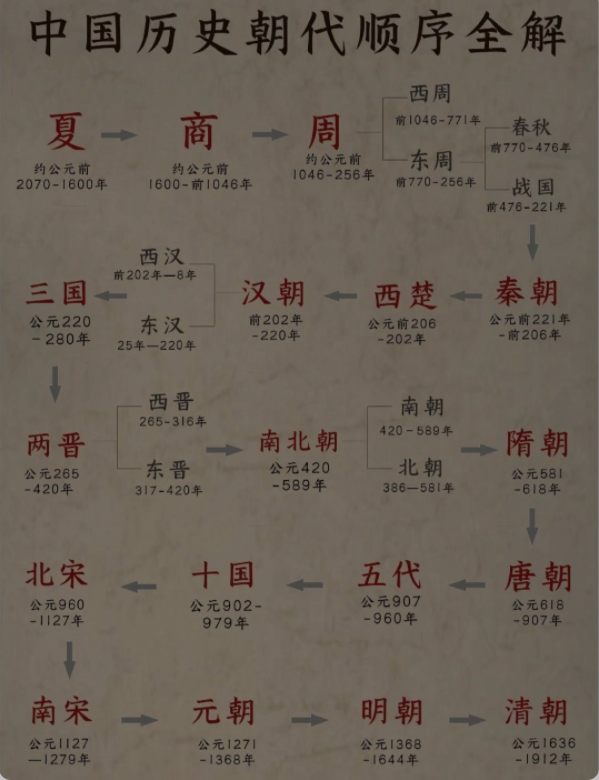{width=400}

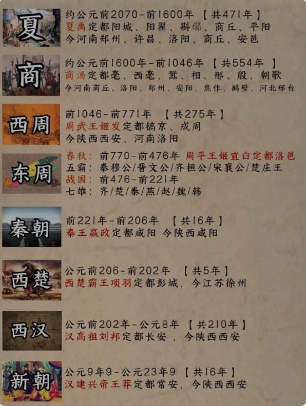{width=400}

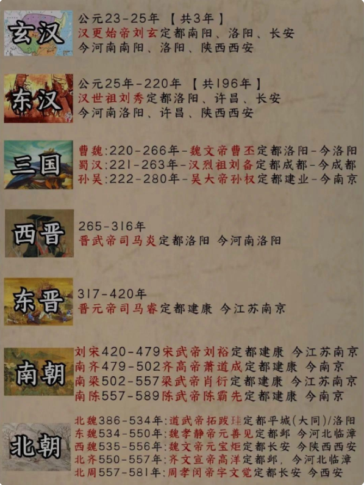{width=400}

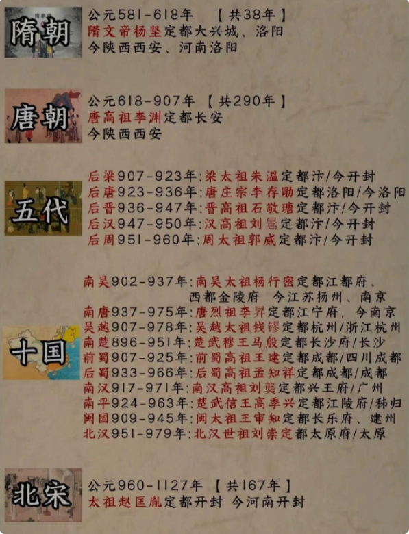{width=400}

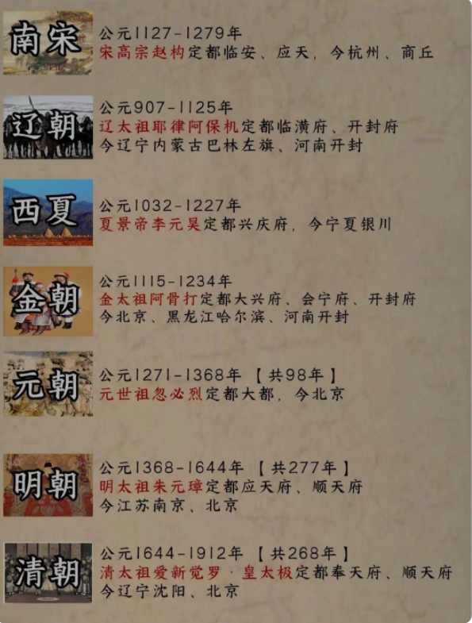{width=400}

*出处：[「问百度」中国历史朝代更替表](https://mbd.baidu.com/newspage/data/dtlandingsuper?nid=dt_5531752272882904814)*

| 朝代      | 起止时间                           | 首都（子集中若出现斜体是主要都城）                  | 都城今址                                                                 | 建立者                  |
|:---------:|:----------------------------------:|:---------------------------------------------------:|:------------------------------------------------------------------------:|:-----------------------:|
| 史前时代  | • 旧石器时代                       |                                                     |                                                                          |                         |
|           | • 中石器时代                       |                                                     |                                                                          |                         |
|           | • 新石器时代                       |                                                     |                                                                          |                         |
| 故国时代（三黄五帝） | 铜石并用时代（黄河文明、长江文明、辽河文明、珠江文明） |                      |                                                                          |                         |
| 夏朝      | 约前二零七零年～约前一六零零年     | 阳城、阳翟、斟鄩、商丘、纶城、帝丘、原、老丘、西河  | 河南郑州、许昌、洛阳、商丘、濮阳、济源、开封                             | 大禹                    |
|           | • 越国（前二零三二年～）           | 会稽                                                | 浙江绍兴                                                                 | 无余                    |
| 商朝      | 约前一六零零年～约前一零四六年     | 亳、西亳、嚣、相、邢、庇、奄、殷、朝歌              | 山东菏泽郓城、济宁曲阜、河南商丘、洛阳、郑州、安阳、焦作、鹤壁、河北邢台 | 商汤                    |
| 周朝      | 约前一零四六年～前二二一年         | 镐京、成周、洛邑                                    | 陕西西安、河南洛阳                                                       |                         |
|           | 西周（约前一零四六年～前七七一年） | 镐京、成周                                          | 陕西西安、河南洛阳                                                       | 周武王姬发              |
|           | • 齐国（前X年～前X年）             | 临<ruby>淄<rp>(</rp><rt>zī</rt><rp>)</rp></ruby>    | 山东淄博                                                                 | 姜太公/姜尚/吕尚/太公望 |
|           | • 晋国（前X年～前X年）             | <ruby>绛<rp>(</rp><rt>jiàng</rt><rp>)</rp></ruby>城 | 山西襄汾县                                                               | 唐叔虞                  |
|           | • 楚国（前X年～前X年）             | <ruby>郢<rp>(</rp><rt>yǐng</rt><rp>)</rp></ruby>都  | 湖北江陵                                                                 | 熊绎                    |
|           | • 卫国（前X年～前X年）             | 楚丘                                                | 河南滑县                                                                 | 卫康叔                  |
|           | • 鲁国（前X年～前X年）             | 曲阜                                                | 山东曲阜市                                                               | 伯禽                    |
|           | • 曹国（前X年～前X年）             | 陶丘                                                | 山东菏泽郓城定陶区                                                       | 曹振铎                  |
|           | • 燕国（前一零四四年～前二二二年） | <ruby>蓟<rp>(</rp><rt>jì</rt><rp>)</rp></ruby>城    | 北京                                                                     | 燕侯克                  |
|           | • 郑国（前X年～前X年）             | 新郑                                                | 河南新郑                                                                 | 郑桓公                  |
|           | • 秦国（前X年～前X年）             | 雍城                                                | 陕西宝鸡市                                                               | 秦非子赢开              |
|           | • 宋国（前X年～前X年）             | 商丘                                                | 河南商丘                                                                 | 微子启                  |
|           | • 吴国（前X年～前X年）             | 姑苏                                                | 江苏苏州                                                                 | 吴太伯                  |
|           | • 越国（前X年～前X年）             | 会稽                                                | 浙江绍兴                                                                 | 允常                    |
|           | • 陈国（前X年～前X年）             | 宛丘                                                | 河南周口市淮阳区                                                         | 陈胡公                  |
|           | • 中山国（前X年～前X年）           | 灵寿                                                | 河北灵寿                                                                 | 不详                    |
|           | 东周（前七七零年～前二五六年）     | 洛邑                                                | 河南洛阳                                                                 | 周平王姬宜臼            |
|           | 春秋（前七七零年～前四七六年）     |                                                     |                                                                          |                         |
|           | • 晋国（前六三六年～前六二八年）   | <ruby>绛<rp>(</rp><rt>jiàng</rt><rp>)</rp></ruby>城 | 山西襄汾县                                                               | 晋文公盛世（继承者）    |
|           | • 秦国（前六五九年～前六二一年）   | 雍城                                                | 陕西宝鸡市                                                               | 秦穆公盛世（继承者）    |
|           | • 齐国（前六八五年～前六四三年）   | 临<ruby>淄<rp>(</rp><rt>zī</rt><rp>)</rp></ruby>    | 山东淄博                                                                 | 齐桓公盛世（继承者）    |
|           | • 楚国（前六一三年～前五九一年）   | <ruby>郢<rp>(</rp><rt>yǐng</rt><rp>)</rp></ruby>都  | 湖北江陵                                                                 | 楚庄王盛世（继承者）    |
|           | • 宋国（前六五一年～前六三七年）   | 商丘                                                | 河南商丘                                                                 | 宋襄公盛世（继承者）    |
|           | • 吴国（前年五一四～前四九六年）   | 姑苏                                                | 江苏苏州                                                                 | 吴王阖闾盛世（继承者）  |
|           | • 吴国（前年五二八～前四七三年）   | 姑苏                                                | 江苏苏州                                                                 | 吴王夫差盛世（继承者）  |
|           | • 越国（前五二零年～前四六五年）   | 会稽                                                | 浙江绍兴                                                                 | 越王勾践盛世（继承者）  |
|           | 战国（前四七五年～前二二一年）     |                                                     |                                                                          |                         |
|           | • 齐国（前四八八年～前四八五年）   | 临淄、*即墨、莒城、鄄城、阿城、姑薄、夜邑*          | 山东淄博                                                                 | 齐悼公姜阳生            |
|           | • 燕国（前四九二年～前四五五年）   | 蓟城、*武阳、下都*                                  | 北京                                                                     | 燕孝公                  |
|           | • 韩国（前五一四年～前X年）        | 新郑、*阳翟、宜阳*                                  | 河南新郑                                                                 | 韩贞子韩须              |
|           | • 赵国（前四零八年～前四零零年）   | 邯郸、*晋阳*                                        | 河北邯郸                                                                 | 赵烈侯赵籍              |
|           | • 魏国（前四四五年～前三九六年）   | 大梁、*安邑、少梁*                                  | 河南开封、河南洛阳                                                       | 魏文侯魏斯              |
|           | • 秦国（前四七六年～前四四三年）   | 咸阳、*栎阳、雍城、泾阳、南郑*                      | 陕西咸阳                                                                 | 秦厉共公赢剌            |
|           | • 楚国（前四八八年～前四三二年）   | 郢都、*寿春、钜阳、宛城、鄢都*                      | 湖北江陵                                                                 | 楚惠王熊章              |
|           | • 宋国（前X年～前X年）             | 商丘、*陶邑、彭城*                                  | 河南商丘                                                                 | 不详                    |
|           | • 鲁国（前X年～前X年）             | 曲阜、*费邑、单父*                                  | 山东曲阜                                                                 | 不详                    |
|           | • 卫国（前X年～前X年）             | 濮阳                                                | 河南濮阳                                                                 | 不详                    |
|           | • 越国（前X年～前X年）             | 会稽、*琅琊、吴城*                                  | 浙江绍兴                                                                 | 不详                    |
|           | • 中山国（前X年～前X年）           | 灵寿、*顾城*                                        | 河北灵寿                                                                 | 不详                    |
| 秦朝      | 前二二一年～前二零七年             | 咸阳                                                | 陕西咸阳                                                                 | 秦始皇帝赢政            |
| 汉朝      | 前二零二年～二二零年               | 长安、洛阳、许昌                                    |                                                                          |                         |
|           | 西汉（前二零二年～八年）           | 长安                                                | 陕西西安                                                                 | 汉高祖刘邦              |
|           | 新朝（九年～二三年）               | 常安                                                | 陕西西安                                                                 | 建兴帝王莽              |
|           | 玄汉（二三年～二五年）             | 长安、洛阳、南阳                                    | 陕西西安、河南南阳、河南洛阳                                             | 汉更始帝刘玄            |
|           | 东汉（二五年～二二零年）           | 长安、洛阳、许昌                                    | 陕西西安、河南洛阳、河南许昌                                             | 汉世祖刘秀              |
|           | 三国（二二零年～二八零年）         |                                                     |                                                                          |                         |
|           | • 曹魏（二二零年～二六五年）       | 许昌                                                | 河南许昌                                                                 | 魏文帝曹丕              |
|           | • 蜀汉（二二一年～二六三年）       | 成都                                                | 四川成都                                                                 | 汉烈祖刘备              |
|           | • 孙吴（二二二年～二八零年）       | 建业                                                | 江苏南京                                                                 | 吴大帝孙权              |
| 晋朝      | 二六六年～四二零年                 | 洛阳、建康                                          | 河南洛阳、江苏南京                                                       |                         |
|           | 西晋（二六六年～三一七年）         | 洛阳                                                | 河南洛阳                                                                 | 晋武帝司马炎            |
|           | 东晋（三一七年～四二零年）         | 建康                                                | 江苏南京                                                                 | 晋元帝司马睿            |
|           | 十六国（三零四年～四三九年）       |                                                     |                                                                          |                         |
| 南北朝    | 三八六年～五八九年                 |                                                     |                                                                          |                         |
|           | 南朝（四二零年～五八九年）         |                                                     |                                                                          |                         |
|           | • 刘宋（四二零年～四七九年）       | 建康                                                | 江苏南京                                                                 | 宋武帝刘裕              |
|           | • 南齐（四七九年～五零二年）       | 建康                                                | 江苏南京                                                                 | 齐高帝萧道成            |
|           | • 南梁（五零二年～五五七年）       | 建康                                                | 江苏南京                                                                 | 梁武帝萧衍              |
|           | • 南陈（五五七年～五八九年）       | 建康                                                | 江苏南京                                                                 | 陈武帝陈霸先            |
|           | 北朝（三八六年～五八一年）         |                                                     |                                                                          |                         |
|           | • 北魏（三八六年～五三四年）       | 平城、洛阳                                          | 山西大同、河南洛阳                                                       | 道武帝拓跋珪            |
|           | • 东魏（五三四年～五五零年）       | 邺城                                                | 河南安阳、河北临漳                                                       | 魏孝静帝元善见          |
|           | • 北齐（五五零年～五七七年）       | 邺城                                                | 河南安阳、河北临漳                                                       | 齐文宣帝高洋            |
|           | • 西魏（五三五年～五五七年）       | 长安                                                | 陕西西安                                                                 | 魏文帝元宝炬            |
|           | • 北周（五五七年～五八一年）       | 长安                                                | 陕西西安                                                                 | 周孝闵帝宇文觉          |
| 隋朝      | 五八一年～六一八年                 | 大兴城、洛阳                                        | 陕西西安、河南洛阳                                                       | 隋文帝杨坚              |
| 唐朝      | 前唐（六一八年～六九零年）         | 长安                                                | 陕西西安、河南洛阳                                                       | 唐高祖李渊              |
|           | 武周（六九零年～七零五年）         | 神都、洛阳                                          | 河南洛阳                                                                 | 圣神皇帝武则天          |
|           | 后唐（七零五年～九零七年）         | 长安、洛阳                                          | 陕西西安、河南洛阳                                                       | 唐中宗李显              |
| 五代十国  | 九零七年～九七九年                 |                                                     |                                                                          |                         |
|           | 五代（九零七年～九六零年）         |                                                     |                                                                          |                         |
|           | • 后梁（九零七年～就二三年）       | 开封府                                              | 河南开封、河南洛阳                                                       | 梁太祖朱温              |
|           | • 后唐（九二三年～九三六年）       | 河南府                                              | 河南洛阳                                                                 | 唐庄宗李存勖            |
|           | • 后晋（九三六年～九四七年）       | 开封府                                              | 河南洛阳、河南开封                                                       | 晋高祖石敬瑭            |
|           | • 后汉（九四七年～九五一年）       | 开封府                                              | 河南开封                                                                 | 汉高祖刘知远            |
|           | • 后周（九五一年～九六零年）       | 开封府                                              | 河南开封                                                                 | 周太祖郭威              |
|           | 十国（九零二年～九七九年）         |                                                     |                                                                          |                         |
|           | • 南吴（九零二年～九三七年）       | 东都江都府、西都金陵府                              | 江苏扬州、江苏南京                                                       | 南吴太祖杨行密          |
|           | • 南唐（九三七年～九七五年）       | 江宁府                                              | 江苏南京                                                                 | 唐烈祖李昪              |
|           | • 前蜀（九零七年～九二五年）       | 成都                                                | 四川成都                                                                 | 前蜀高祖王建            |
|           | • 后蜀（九三三年～九六六年）       | 成都                                                | 四川成都                                                                 | 后蜀高祖孟知祥          |
|           | • 南汉（九一七年～九七一年）       | 兴王府                                              | 广东广州                                                                 | 南汉高祖刘龑            |
|           | • 南楚（九零七年～九五一年）       | 长沙府                                              | 湖南长沙                                                                 | 楚武穆王马殷            |
|           | • 吴越（九零七年～九七八年）       | 杭州、越州                                          | 浙江杭州                                                                 | 吴越太祖钱镠            |
|           | • 闽国（九零九年～九四五年）       | 长乐府、建州                                        | 福建福州、福建建瓯                                                       | 闽太祖王审知            |
|           | • 荆南（九二四年～九六三年）       | 江陵府                                              | 湖北秭归                                                                 | 楚武信王高季兴          |
|           | • 北汉（九五一年～九七九年）       | 太原府                                              | 山西太原                                                                 | 北汉世祖刘崇            |
| 宋朝      | 北宋（九六零年～一一二七年）       | 开封府                                              | 河南开封                                                                 | 宋太祖赵匡胤            |
|           | 南宋（一一二七年～一二七九年）     | 应天府、临安府                                      | 河南商丘、浙江杭州                                                       | 宋高宗赵构              |
|           | 辽国（九零七年～一一二五年）       | 临潢府、开封府                                      | 内蒙古巴林左旗、河南开封                                                 | 辽太祖耶律阿保机        |
|           | 西夏（一零三八年～一二二七年       | 兴庆府                                              | 宁夏银川                                                                 | 夏景宗李元昊            |
|           | 金国（一一一五年～一二三四年）     | 大兴府、会宁府、开封府                              | 北京、黑龙江哈尔滨、河南开封                                             | 金太祖完颜阿骨打        |
| 元朝      | 一二七一年～一三六八年             | 大都                                                | 北京                                                                     | 元世祖忽必烈            |
| 明朝      | 一三六八年～一六四四年             | 应天府、顺天府                                      | 江苏南京、北京                                                           | 明太祖朱元璋            |
|           | 大顺（一六四四年～一六四四年）     | 顺天府                                              | 北京                                                                     | 大顺皇帝李志成          |
| 清朝      | 一六四四年～一九一一年             | 奉天府、顺天府                                      | 辽宁沈阳、北京                                                           | 清太祖爱新觉罗•努尔哈赤 |
| 中华民国  | 一九一二～一九四九年               | 南京                                                | 江苏南京                                                                 | 总统孙中山              |

- 借鉴春秋战国（战国七雄）和七大洲五大洋，根据欧洲罗马帝国、文艺复兴和那些世袭制可兰经回教徒法家的巫术巫文称咱们秦人Chinese为“Cina”，咱们秦人Chinese是世袭制道教徒十二生肖，而那些MY大汉山和US大葱回教堂白宫的汉人Hanese世袭制可兰经法家回教徒，否则咱们全球的宗教文字语言习俗文化都将灭绝，自从明治维新的“拯救亚洲人”之后的东亚和东南亚的领土上不要任何世袭制可兰经法家回教徒，然后西征西亚到一统亚洲。[「微信」历史：中国朝代更替概览](https://mp.weixin.qq.com/s?__biz=MzA4MjI0MzA5Ng==&mid=2649860738&idx=3&sn=5278eeb6b9315fa0d4723937097b9f93&chksm=866c042527a6804617259543199ae16c85f4bd3c4748b141b68fb855f1bd3ac7e3c3a14d4458&scene=27)中的市井之民，误人子弟。依照商鞅变法，歼灭所有世袭制可兰经法家回教徒，才能让咱们世袭制十二生肖道教徒一统天下。
- [「问百度」中国历史朝代](https://baike.baidu.com/item/中国历史朝代/4056123)
- [「问百度」春秋各国都城？](https://zhidao.baidu.com/question/658909631698888965.html)
- [「知乎」春秋五霸之间的辈分关系](https://zhuanlan.zhihu.com/p/30440933)
- [春秋五霸称霸顺序口诀（春秋五霸顺口溜 ）](https://sndnote.com/tougao/22706.html)
- [春秋五霸到底是指哪五个人？](http://m.news.xixik.com/content/607be8a5080919ca)
- [「高三网」中国古代史的朝代更替表](http://www.gaosan.com/wenwen/3243.html)
- [「搜狐」昔日战国七雄的都城，如今都变成什么样子了？韩国都城发展最好 ](https://www.sohu.com/a/634022462_121180648)
- [「豆瓣」战国七雄历代君王列表](https://movie.douban.com/review/12242557)

## 通古知今

### 中国简史

> <iframe width="400" height="225" src="https://youtube.com/embed/ndCUxQB0kzg" title="「抖音」大秦赋 - 时光机器农历二零零二年" frameborder="0" allow="accelerometer; autoplay; clipboard-write; encrypted-media; gyroscope; picture-in-picture; web-share" allowfullscreen></iframe>
> 
> *出处：[「油管」大秦赋 - 时光机器农历二零零二年](https://youtu.be/ndCUxQB0kzg)*

*引用：[「抖音」大秦赋 - 时光机器农历二零零二年](https://v.douyin.com/iNwNe2Q6)*

> **四、结语**
> 
> 在本次研讨会中,与会的专家学者们对司马错入蜀的研究价值给予了充分的肯定。著名秦汉史专家、中国人民大学国学院教授、西北大学教授王子今在研讨会视频发言中指出:司马错入蜀实现了跨越秦岭军事文化沟通的作用,此后秦人更加积极主动地开通蜀道,为秦昭襄王时代国家的治理积累了经验,也为秦始皇统一中国奠定了重要的基础。中国历史研究院二级教授李大龙在视频发言中亦认为:司马错伐蜀及其后郡县制的设置,是地方进入多民族国家传统王朝直接统治的开始,对秦统一六国发挥了重要的意义。中国人民大学杰出学者特聘教授孙家洲在视频发言时进一步强调:司马错伐蜀是两种不同战略的角逐,南下攻占巴蜀可以使秦国获得实际的意义,为秦国扩大战略纵深度发挥了重要作用。
> 
> 此外,此次司马错入蜀学术研究课题组还组织了“司马错与蜀道”大型科学考察队,穿越川陕两省五市十二个县区进行考察。通过对蜀道沿线浓郁的人文气息、乡村风貌和历史遗存的综合性实地考察,课题组对蜀道的历史成因、发展历程、文化传承以及所蕴含的蜀道基因与精神有了进一步的了解。同时,课题组对蜀道沿线石窟、文物、村落和地方文化内涵有了进一步认识,尤其是寻访到了战国后期秦将司马错的墓地,了解到当地民众对于司马错的真实情感以及民俗故事,深化了对于司马错入蜀重大历史意义的理解以及蜀道贯穿古今、连通内外的精神内涵的把握。
> 
> 与会的专家学者们普遍认为,司马错入蜀的军事行动,具有明确的战略目标,能够调动秦军的积极性,是先进制度战胜落后制度的典型事例。作为秦军将领的司马错,带兵成功地实现了对巴蜀的兼并,完成了自身的军事任务,但对巴蜀地方的治理却不如行军打仗一般直接。此后的百余年间,张仪、张若、李冰等官员陆续来到蜀地,为蜀地带来了秦国的文化价值,使得巴蜀风习有所改易;为蜀地带来了新的社会制度,让郡县为基础的“大一统”秩序得以展开;为蜀地带来先进生产和灌溉方式,巴蜀从此“水旱从人,不知饥馑”①。正是在一代又一代同司马错一样的秦国官吏的不懈努力与奋力追求下,西南地区的社会治理才能不断赓续前进。
> 
> 总之,秦汉“大一统”政权的建立,奠定了中国统一的多民族国家的基础,从此以后,尽管大的历史朝代之间难免会有短暂的分裂割据,但统一成为了中国历史发展进程的主旋律。自此以后,中国朝代的更替、中华民族的发展都是在统一的基调上展开。无论是处于中央强势的大一统政权统治下,还是中央权势衰微或者政权更迭频繁的动荡时代,追求统一的基调都没有改变,“统一的多民族的中国和中华民族共同体始终存在于人们的思想深处、意识之中”②。
> 
> 纵观人类几千年的社会发展史,曾出现过不少地域辽阔、辉煌一时的大帝国,其中世界范围内著名的就有波斯帝国、古罗马帝国等,然而,这些名噪一时的强大帝国无不在盛极一时之后走向衰亡,最终退出历史的舞台。唯有“大一统”的中国,从秦汉时代奠基开始,历经两千余年,仍然保持着民族文化强大的精神力量,虽然发展进程中历经磨难、饱受曲折,但最终依然能够以顽强的姿态屹立世界。从这个层面而言,“大一统”的思想理念、崇尚统一的政治追求,直到今日依然能够产生巨大的回响。

*[出处：「四川师范大学学报」司马错与蜀道研究的回顾与展望——“司马错入蜀及其重大历史意义”学术研讨会综述](https://wkxb.sicnu.edu.cn/Publish/202311/20231103180843473.pdf)*

```{r 朝代年号, error=TRUE, eval=FALSE}
## 秦国 China，秦人 Chinese
## 司马错得蜀既得楚
if (!exists('.蜀道')) {
  .蜀道 <- getwd() |> 
    {\(.) str_split(., '/')}() |> 
    {\(.) c('/', .[[1]][2:5])}() |> 
    {\(.) c(., 'binary.com-interview-question-data/')}() |> 
    {\(.) paste(., collapse = '/')}() |> 
    {\(.) substring(., 2)}()
}

if (!exists('.蜀道书轩')) .蜀道书轩 <- paste0(.蜀道, '诸子百家学府/中国年号通史/')
if (!dir.exists(.蜀道书轩))  dir.create(.蜀道书轩)

source('函数/採撷年号.R')

朝代 <- c('唐朝', '宋朝', '元朝', '明朝', '清朝', '周朝', '三皇五帝', '三黄五帝', '商朝', '东周', '夏朝', '汉朝', '大理', '春秋', '西周', '战国', '西汉', '辽国', '东汉', '北朝', '西夏', '南北朝', '南朝', '北宋', '晋朝', '南宋', '北魏', '十六国', '金朝', '东晋', '吴越', '前凉', '三国', '南朝宋', '南平', '南朝梁', '南汉', '五代十国', '孙吴', '西晋', '西秦', '曹魏', '马楚', '成汉', '前秦', '蜀汉', '北凉', '南唐', '隋朝', '闽国', '杨吴')
## lapply(朝代, function(朝) {
##   天朝 <- 採撷年号(朝)
##   fwrite(天朝, paste0(.蜀道书轩, 天朝, '年号.csv'))
## })

天朝 <- '周朝'
周朝 <- 採撷年号(天朝)
## fwrite(周朝, paste0(.蜀道书轩, 天朝, '年号.csv'))

天朝 <- '西周'
西周 <- 採撷年号(天朝)
## fwrite(西周, paste0(.蜀道书轩, 天朝, '年号.csv'))

天朝 <- '东周'
东周 <- 採撷年号(天朝)
## fwrite(东周, paste0(.蜀道书轩, 天朝, '年号.csv'))

天朝 <- '春秋'
春秋 <- 採撷年号(天朝)
## fwrite(春秋, paste0(.蜀道书轩, 天朝, '年号.csv'))

天朝 <- '战国'
战国 <- 採撷年号(天朝)
## fwrite(战国, paste0(.蜀道书轩, 天朝, '年号.csv'))

rm(天朝, 周朝, 西周, 东周, 春秋, 战国)

## 
## > 周朝 %>% 
## +     dplyr::filter(在位皇帝甲 == '西周共和')
## # A tibble: 14 × 12
##     序号 年份               年份乙 干支  生肖  朝代甲 朝代乙 朝代丙 在位皇帝甲 在位皇帝乙 年号甲     年号乙
##    <int> <fct>               <dbl> <fct> <fct> <fct>  <fct>  <fct>  <fct>      <fct>      <fct>      <fct> 
##  1   206 公元前八百四十一年   -841 庚申  猴    周朝   西周   NA     西周共和   NA         共和元年   NA    
##  2   207 公元前八百四十年     -840 辛酉  鸡    周朝   西周   NA     西周共和   NA         共和二年   NA    
##  3   208 公元前八百三十九年   -839 壬戌  狗    周朝   西周   NA     西周共和   NA         共和三年   NA    
##  4   209 公元前八百三十八年   -838 癸亥  猪    周朝   西周   NA     西周共和   NA         共和四年   NA    
##  5   210 公元前八百三十七年   -837 甲子  鼠    周朝   西周   NA     西周共和   NA         共和五年   NA    
##  6   211 公元前八百三十六年   -836 乙丑  牛    周朝   西周   NA     西周共和   NA         共和六年   NA    
##  7   212 公元前八百三十五年   -835 丙寅  虎    周朝   西周   NA     西周共和   NA         共和七年   NA    
##  8   213 公元前八百三十四年   -834 丁卯  兔    周朝   西周   NA     西周共和   NA         共和八年   NA    
##  9   214 公元前八百三十三年   -833 戊辰  龙    周朝   西周   NA     西周共和   NA         共和九年   NA    
## 10   215 公元前八百三十二年   -832 己巳  蛇    周朝   西周   NA     西周共和   NA         共和十年   NA    
## 11   216 公元前八百三十一年   -831 庚午  马    周朝   西周   NA     西周共和   NA         共和十一年 NA    
## 12   217 公元前八百三十年     -830 辛未  羊    周朝   西周   NA     西周共和   NA         共和十二年 NA    
## 13   218 公元前八百二十九年   -829 壬申  猴    周朝   西周   NA     西周共和   NA         共和十三年 NA    
## 14   219 公元前八百二十八年   -828 癸酉  鸡    周朝   西周   NA     西周共和   NA         共和十四年 NA
## 
## # 如上所示，经过查询，公元前的中国王朝数据中出现共和国，而年号出现共和元年。公元前八百多年前的数据无法证实是否属实，估计是中国政府或学者回测而得知，公元前二二一年第一位中央集权秦王称帝，史称始祖“秦始皇”，而公元后刘备在公元后二二一年称帝“汉昭烈帝”。目前在下才疏学浅，无从查证。而拿破仑和袁世凯也曾称帝与总统之间更迭国号与国君的称号治国路线。
## 
## 公元824年 农历干支：甲辰，生肖：龙，朝代：唐朝，在位皇帝：唐敬宗李湛，唐穆宗李恒，年号：长庆四年
## 公元825年 农历干支：乙巳，生肖：蛇，朝代：唐朝，在位皇帝：唐敬宗李湛，年号：宝历元年
## 公元826年 农历干支：丙午，生肖：马，朝代：唐朝，在位皇帝：唐敬宗李湛，唐文宗李昂，年号：宝历二年
## 公元827年 农历干支：丁未，生肖：羊，朝代：唐朝，在位皇帝：唐文宗李昂，年号：宝历三年，太和元年
## 公元828年 农历干支：戊申，生肖：猴，朝代：唐朝，在位皇帝：唐文宗李昂，年号：太和二年
## 公元829年 农历干支：己酉，生肖：鸡，朝代：唐朝，在位皇帝：唐文宗李昂，年号：太和三年
## 公元830年 农历干支：庚戌，生肖：狗，朝代：唐朝，在位皇帝：唐文宗李昂，年号：太和四年
## 公元831年 农历干支：辛亥，生肖：猪，朝代：唐朝，在位皇帝：唐文宗李昂，年号：太和五年
## 公元832年 农历干支：壬子，生肖：鼠，朝代：唐朝，在位皇帝：唐文宗李昂，年号：太和六年
## 公元833年 农历干支：癸丑，生肖：牛，朝代：唐朝，在位皇帝：唐文宗李昂，年号：太和七年
## 公元834年 农历干支：甲寅，生肖：虎，朝代：唐朝，在位皇帝：唐文宗李昂，年号：太和八年
## 公元835年 农历干支：乙卯，生肖：兔，朝代：唐朝，在位皇帝：唐文宗李昂，年号：太和九年
## 公元836年 农历干支：丙辰，生肖：龙，朝代：唐朝，在位皇帝：唐文宗李昂，年号：开成元年
## 公元837年 农历干支：丁巳，生肖：蛇，朝代：唐朝，在位皇帝：唐文宗李昂，年号：开成二年
## 公元838年 农历干支：戊午，生肖：马，朝代：唐朝，在位皇帝：唐文宗李昂，年号：开成三年
## 公元839年 农历干支：己未，生肖：羊，朝代：唐朝，在位皇帝：唐文宗李昂，年号：开成四年
## 公元840年 农历干支：庚申，生肖：猴，朝代：唐朝，在位皇帝：唐文宗李昂，唐武宗李炎，年号：开成五年
## 公元841年 农历干支：辛酉，生肖：鸡，朝代：唐朝，在位皇帝：唐武宗李炎，年号：会昌元年
```

### 周史

```{r 读取朝代年号, results = 'asis', error=TRUE}
## 秦国 China，秦人 Chinese
## 司马错得蜀既得楚
if (!exists('.蜀道')) {
  .蜀道 <- getwd() |> 
    {\(.) str_split(., '/')}() |> 
    {\(.) c('/', .[[1]][2:5])}() |> 
    {\(.) c(., 'binary.com-interview-question-data/')}() |> 
    {\(.) paste(., collapse = '/')}() |> 
    {\(.) substring(., 2)}()
}

if (!exists('.蜀道书轩')) .蜀道书轩 <- paste0(.蜀道, '诸子百家学府/中国年号通史/')
if (!dir.exists(.蜀道书轩))  dir.create(.蜀道书轩)

# 周朝年号 <- fread(paste0(.蜀道书轩, '周朝年号.csv')) %>% 
#   mutate_if(is.character, na_if, '') %>% 
#   tibble()
# 西周年号 <- fread(paste0(.蜀道书轩, '西周年号.csv')) %>% 
#   mutate_if(is.character, na_if, '') %>% 
#   tibble()
# 东周年号 <- fread(paste0(.蜀道书轩, '东周年号.csv')) %>% 
#   mutate_if(is.character, na_if, '') %>% 
#   tibble()
# 春秋年号 <- fread(paste0(.蜀道书轩, '春秋年号.csv')) %>% 
#   mutate_if(is.character, na_if, '') %>% 
#   as_tibble()
# 战国年号 <- fread(paste0(.蜀道书轩, '战国年号.csv')) %>% 
#   mutate_if(is.character, na_if, '') %>% 
#   as_tibble()
# 周朝 <- plyr::join_all(list(周朝年号, 西周年号, 东周年号, 春秋年号, 战国年号)) %>% 
#   as_tibble()
# rm(周朝年号, 西周年号, 东周年号, 春秋年号, 战国年号)
# 
# 周朝 <- 周朝[c('年份', '年份乙', '干支', '生肖', '朝代甲', '朝代乙', '朝代丙', '在位皇帝甲', '在位皇帝乙', '在位皇帝丙', '在位皇帝丁', '年号甲', '年号乙', '年号丙')]

## We can use mutate_if
## 
# df <- df %>%
#         mutate_if(is.factor, funs(factor(replace(., .=="", NA))))
# 
# df <- df %>% mutate_if(is.factor, list(~factor(replace(., .=="", NA))))
# 
## With dplyr 0.8.0, we can also do
# 
# df %>% 
#    mutate_if(is.factor, na_if, y = "") 
## or change the funs (which is getting deprecated to list as @Frederick mentioned in the comments)
# 
# df %>%
#   mutate_if(is.factor, list(~ na_if(., "")))
## Or using base R we can assign the specific levels to NA
# 
# j1 <- sapply(df, is.factor)
# df[j1] <- lapply(df[j1], function(x) {is.na(x) <- levels(x)==""; x})
# data
# df <- data.frame(col1 = c("", "A", "B", ""), col2 = c("A", "", "", "C"),
#         col3 = 1:4)
## 
## *出处：[R `dplyr` method to replace all empty factors with NA](https://stackoverflow.com/questions/43059897/r-dplyr-method-to-replace-all-empty-factors-with-na)*

source('函数/集成年号.R')
朝代 <- c('唐朝', '宋朝', '元朝', '明朝', '清朝', '周朝', '三皇五帝', '三黄五帝', '商朝', '东周', '夏朝', '汉朝', '大理', '春秋', '西周', '战国', '西汉', '辽国', '东汉', '北朝', '西夏', '南北朝', '南朝', '北宋', '晋朝', '南宋', '北魏', '十六国', '金朝', '东晋', '吴越', '前凉', '三国', '南朝宋', '南平', '南朝梁', '南汉', '五代十国', '孙吴', '西晋', '西秦', '曹魏', '马楚', '成汉', '前秦', '蜀汉', '北凉', '南唐', '隋朝', '闽国', '杨吴')

天朝 <- c('周朝', '西周', '东周', '春秋', '战国')
周朝 <- 集成年号(天朝)

周朝 %>% 
  kbl(caption = '**周朝（春秋战国）**', escape = FALSE) %>% 
  ## https://www.w3schools.com/cssref/css_colors.asp
  row_spec(0, background = 'DimGrey', color = '#7B1113') %>% 
  column_spec(1, background = 'blue', color = 'gold') %>% 
  #column_spec(2, background = '#556DAC') %>% 
  column_spec(2, background = 'LightSlateGrey') %>% 
  column_spec(3, background = 'LightGray') %>% 
  column_spec(4, background = 'Gainsboro') %>% 
  column_spec(5, background = 'LightGray') %>% 
  column_spec(6, background = 'Gainsboro') %>% 
  column_spec(7, background = 'LightGray') %>% 
  column_spec(8, background = 'Gainsboro') %>% 
  column_spec(9, background = 'Gainsboro') %>% 
  column_spec(10, background = 'LightGray') %>% 
  column_spec(11, background = 'Gainsboro') %>% 
  column_spec(12, background = 'LightGray') %>% 
  column_spec(13, background = 'Gainsboro') %>% 
  column_spec(14, background = 'LightGray') %>% 
  kable_styling(bootstrap_options = c('striped', 'hover', 'condensed', 'responsive')) %>% 
  kable_material(full_width = FALSE) %>% 
  scroll_box(width = '100%', fixed_thead = TRUE, height = '500px')
```

*数据 : `r paste0(cnum::num2c(dim(周朝)[1], lang = 'sc'), '行 乘 ', cnum::num2c(dim(周朝)[2], lang = 'sc'), '列')`*

- [「词典网」首页>>年号>>周朝历代皇帝顺序>>周朝年号表>>周朝干支纪年](https://www.cidianwang.com/nianhao/zhouchao_0a340.htm)
- [辭典附錄「中國歷代帝王年表」](https://dict.revised.moe.edu.tw/appendix.jsp?ver=0&ID=2&la=0&powerMode=0)

以上中国年号通史数据，採撷于[「词典网」首页>>年号](https://www.cidianwang.com/nianhao)，不过干支纪年法有误。有关文本记载古称，请查阅[文本纪元](#文本纪元)，而“计数或机数，国之大事是也”请查阅[春秋战国名人](#春秋战国名人)。

### 万年历

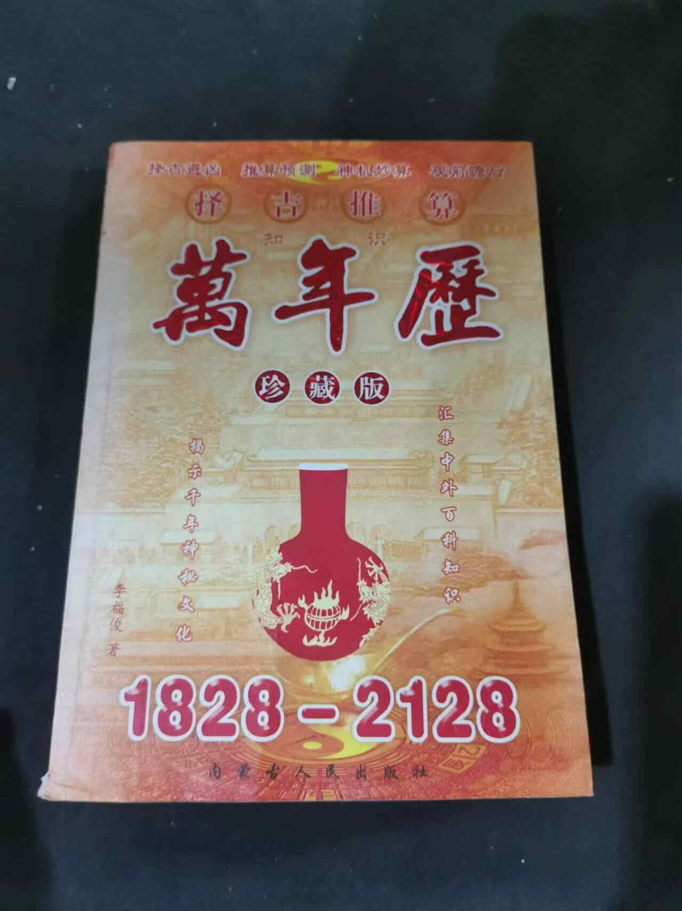

随便到神料店或书局即可购买到诸子百家各版本的《万年历》而年份会五花八门、百家争艳，而愚生在二零零三年在书店随意所购的是内蒙古出版社发行的**《万年历》（珍藏版）**上注释着**公元一八二八年至二一二八年**，作者是李福俊的一九九九年之作（而愚生之外祖父是书法家李福，一般上咱们道家民间信仰的玉皇大帝和王母娘娘乃外祖父与外祖母。母亲之母称之为“王母”而母亲之父称之为“王父”。一九九九年是愚生在地南再也中学报读初中三，有关初中三历史好哥儿们陈友良与[「猫城」阿里彩票](https://github.com/englianhu/ali-zonghui)工作时认识个长相似陈友良的斯蒂芬∙乔布斯/《大秦赋》中饰演赢政的艺人张鲁一/韩星张东健，更多详情请查阅：[「文派」《赢家黄氏江夏堂》 – 始祖赢政ΞΗG TΕΗG∙黄永春家谱](https://englianhu.wordpress.com/2022/02/22/《雪隆江夏堂》-家谱)和[「阳历二零二三年十二月三日」今日是校花紫云生日](https://englianhu.wordpress.com/2024/02/04/「阳历二零二三年十二月三日」今日是紫云生日/)）。

上图《万年历》中开始的公元一八二八戊子年（第五甲子年轮回的老鼠）是美国民主党创党者兼第一任主席安德鲁∙杰克逊当选美国第七任总统，之后农历二零一九年到菲律宾克拉克市（Clark中译为“书记”、“秘书”、“掌柜”、“尚书”、“会计”，而最接近的地名是“会稽”。）的Sun Valley（中译“阳城”）的东方集团旗下的乐发集团旗下的阿里公司工作，行政院长兼大股东外号称“眼镜”，详情请查阅[「文派」迟了一年，更新履历表 B4Telebiz (18-DEC-2021)](https://englianhu.wordpress.com/2021/12/20/迟了一年，更新履历表-b4telebiz/)。而仙台操作系统、杏林经济学、UTAR拉曼大学相关信息，可查阅[「猫城」通过数码海洋（Digital Ocean）建立服务器](https://github.com/scibrokes/setup-centOS7-DO)。

**吴越春秋**

<iframe width="400" height="225" src="https://youtube.com/embed/c_utZAPQ3DU" title="「油管」吳宗憲 Jacky Wu：小姐這是我的名片♬" frameborder="0" allow="accelerometer; autoplay; clipboard-write; encrypted-media; gyroscope; picture-in-picture; web-share" allowfullscreen></iframe>

*出处：[「油管」吳宗憲 Jacky Wu：小姐這是我的名片♬](https://www.youtube.com/watch?v=c_utZAPQ3DU)*

{width=400}

```{r 天干地支, error=TRUE}
## 辑写此篇论文的时间二零二四年为甲辰年
## 从公元前七七零年到公元前二二一年，由于公元第一年为元年，故此扣除元年前的零年。
## 2024 - (-770) - 1 = 2793
## 2024 - (-221) - 1 = 2244

if (!exists('天干')) 天干 <- c('甲', '乙', '丙', '丁', '戊', '己', '庾', '辛', '壬', '癸')
if (!exists('地支')) 地支 <- c('子', '丑', '寅', '卯', '辰', '巳', '午', '未', '申', '酉', '戌', '亥')
if (!exists('干支')) 干支 <- paste0(rep(天干, 6), rep(地支, 5))
干支 |> 
  matrix(nrow = 12, dimnames = list(
    地支, paste0(天干[1:5], 天干[6:10])))
cat('天干：', 天干, '\n地支：', 地支, '\n干支：', 干支, '\n')
```

### 天下简史

```{r 天下简史, eval=FALSE, error=TRUE}
## 辑写此篇论文的时间二零二四年为甲辰年
## 从公元前七七零年到公元前二二一年，由于公元第一年为元年，故此扣除元年前的零年。
## 2024 - (-770) - 1 = 2793
## 2024 - (-221) - 1 = 2244
## 
## 从公元前的-5000:-1 加 公元后的1:2024 等于 7024年
## 轮回一百一十八甲子年，length(rep(干支, 118)) 等于 7080年
## 7080 减 7024 等于 56年，也就是公元前后一共需要扣除56年
## 今年二零二四甲辰年，7080 减 19 等于 7061，扣除了公元后的19年后数据最后一个元素为甲辰年
## 56 减 19 等于 37年
## 公元前再扣除前37年，7061 减 7024 等于 37，从数据中的第38年开始计算起。
##结果就是从一百一十八个甲子年7080数据中，筛选出38:7061就能获知咱们中国古代公元前的天文历法中的干支年份。
天下简史 <- data.frame(年份 = c(-5000:-1, 1:2024), 干支纪年法 = rep(干支, 118)[38:7061], 朝代 = NA, 年号 = NA, 国事 = NA, 钱谷 = NA, 战役 = NA, 战果 = NA)

朝代 <- c('夏朝' = -2070, '商朝' = -1600, '西周' = -1046, '东周' = -771, '春秋' = -770, '战国' = -475, '秦朝' = -221, '西汉' = -202, '新朝' = 9, '东汉' = 25, '三国' = 220, '西晋' = 266, '十六国' = 304, '南北朝' = 420, '隋朝' = 581, '唐朝' = 618, '五代十国' = 907, '宋朝' = 690, '辽国' = 907, '金国' = 1115, '西夏' = 1038, '日本' = 1192, '元朝' = 1271, '明朝' = 1368, '日本' = 1467, '莫斯科大公国' = 1530, '莫斯科大公国' = 1533, '沙皇俄国' = 1547, '日本' = 1582, '日本' = 1615, '清朝' = 1636, '俄罗斯帝国' = 1672, '英殖民美洲' = 1732, '英殖民美洲' = 1767, '法兰西王国' = 1769, '英殖民美洲' = 1775, '阿美利坚共和国' = 1776, '法兰西王国' = 1789, '法兰西共和国' = 1792, '法兰西帝国' = 1804, '欧洲内战' = 1812, '北美内战' = 1812, '法兰西王国' = 1814, '北美内战' = 1814, '清朝' = 1820, '英国' = 1827, '阿美利坚共和国' = 1828, '清朝' = 1828, '清朝' = 1840, '法兰西王国' = 1848, '法兰西帝国' = 1852, '日本' = 1853, '日本' = 1854, '清朝' = 1856, '日本' = 1868, '法兰西共和国' = 1870, '沙皇俄国' = 1870, '日本' = 1871, '沙皇俄国' = 1878, '意大利' = 1883, '英属' = 1883, '日本' = 1884, '清朝' = 1887, '德国' = 1889, '法属' = 1890, '清朝' = 1893, '日本' = 1894, '清朝' = 1898, '清朝' = 1900, '中华民国' = 1912, '日治' = 1912, '天下大势' = 1914, '中华帝国' = 1914, '日治' = 1917, '英属' = 1917, '日治' = 1924, '中华民国' = 1926, '天下大势' = 1931, '德国' = 1933, '德国' = 1934, '天下大势' = 1941, '日治' = 1942, '日本' = 1943, '以色列' = 1948, '英属' = 1949, '中华人民共和国' = 1949)
朝代 <- data.frame(年份 = 朝代, 朝代 = names(朝代)) %>% 
    as_tibble()

年号 <- c('帝辛' = -1100, '周武王元年' = -1046, '周幽王元年' = -781, '周平王元年' = -771, '秦王廿六年/秦始皇元年' = -221, '秦二世元年' = -209, '秦三世元年' = -206, '建元' = -140, '元寿' = -2, '元始' = 1, '民国纪年法' = 1912, ' ' = 1912)
年号 <- data.frame(年份 = 年号, 年号 = names(年号)) %>% 
    as_tibble()

国事 <- c(
  '姜太公钓鱼' = -1100, '封神榜之武王克商' = -1046, '周平王即位，东周开始' = -771, '卞和献玉' = -756, '齐相道法家：管子/管仲临盆' = -723, '齐恒公姜小白临盆' = -716, '秦穆公赢任好临盆' = -705, '晋文公姬重耳临盆' = -697, '齐恒公姜小白即位' = -685, '齐恒公称霸：尊王攘夷，九合诸侯。' = -681, '秦穆公赢任好即位' = -659, '秦晋之好' = -654, '宋襄公子兹甫即位' = -651, '楚庄王熊旅临盆' = -650, '宋襄公称霸：春秋大义' = -639, '晋文公姬重耳即位' = -636, '晋文公称霸：践土会盟，称霸诸侯。' = -632, '楚庄王熊旅即位：一鸣惊人' = -631, '秦穆公称霸：称霸西戎' = -623, '楚庄王熊旅问鼎' = -613, '楚襄王称霸：饮马黄河，问鼎中原。' = -597, '齐相晏婴/晏子/晏仲临盆' = -578, '道家：老子/李耳临盆' = -571, '儒家：孔子/孔丘临盆' = -551, '吴王僚即位' = -526, '越王勾践临盆' = -520, '工匠师：鲁班临盆' = -507, '越王勾践即位' = -496, '墨家：墨子/墨翟临盆' = -476, 
  '道家：列子临盆' = -450, '儒家：告子临盆' = -420, '纵横家：鬼谷子/王诩/王禅临盆' = -400, '法家：慎到临盆' = -395, '法家：商鞅/卫鞅临盆' = -390, '田氏代齐' = -386, '道家：淳于髡（kūn）临盆' = -386, '纵横家：苏秦临盆' = -382, '秦孝公赢渠梁临盆' = -381, '齐国第一学府，创办稷下学宫' = -374, '纵横家：张仪临盆' = -373, '儒家：孟子/孟轲临盆' = -372, '墨法家：宋趼临盆' = -370, '道家：庄子/庄周临盆' = -369, '秦孝公赢渠梁求贤令' = -361, '道家：伊文临盆' = -360, '卫鞅仕秦' = -359, '商鞅变法' = -356, '齐威王即位' = -356, '楚怀王熊槐临盆' = -355, '齐国围魏救赵' = -354, '秦惠文王赢驷临盆' = -354, '齐宣王田辟疆临盆' = -350, '齐魏争霸' = -342, '屈原临盆' = -342, '齐魏争霸' = -341, '秦惠文王赢驷即位' = -337, '法家：荀子/荀卿临盆' = -331, '秦惠文王诛商君，除巫裔，改元年。称秦王，誓东出' = -325, '秦昭襄王赢稷临盆' = -325, '阴阳家：邹衍临盆' = -324, '齐宣王田辟疆即位' = -319, '秦国得蜀既得楚' = -316, '燕王哙见废姬平' = -316, '秦昭襄王赢稷即位' = -306, ' ' = -298, '屈原的学生宋玉临盆' = -298, ' ' = -284, '法家：李斯临盆' = -284, '秦庄襄王赢异人临盆' = -281, '燕惠王即位' = -279, '屈原农历五月初五投江自杀' = -278, ' ' = -259, '秦王赢政临盆' = -259, '中国第一位一统天下的皇帝，秦始皇赢政登基称帝' = -221, '秦军蒙毅筑长城' = -214, '秦军蒙毅筑阿房宫' = -214, '秦二世胡亥登基' = -209, '秦三世赢子婴登基仅仅卌六日就被楚军项羽所杀' = -206, '司马迁临盆' = -145, '司马迁进言改历《汉历》' = -104, '司马迁完成《史纪》' = -91, 
  '基督耶稣临盆' = 1, '曹操崛起' = 194, '陈群仕魏' = 198, '卧龙出渊' = 207, '曹丕魏文帝登基' = 220, '刘备汉烈祖登基' = 221, '孙权吴大帝登基' = 222, '晋武帝司马炎登基' = 266, '晋元帝司马睿登基' = 317, 
  '镰仓幕府' = 1192, '朱重八临盆' = 1328, '朱棣临盆' = 1360, '明太祖朱元璋立国称帝' = 1368, '明成祖朱棣靖难称帝' = 1402, '日本战国（室町幕府到安土桃山时代）' = 1467, '莫斯科大公国第一任皇帝，沙皇伊凡四世称帝' = 1547, '德川幕府立国' = 1615, '俄罗斯帝国彼得大帝临盆' = 1672, '美国国父瓦盛顿临盆' = 1732, '美国第一任民主党主席安德鲁∙杰克逊临盆' = 1767, '法国革命家拿破仑临盆' = 1769, '瓦盛顿任命为大陆军总司令，立国' = 1776, '威灵顿公爵丁亥年腊月任英国首相' = 1827, '安德鲁∙杰克逊当选美国第七任总统' = 1828, ' ' = 1828, '中英贸易战' = 1840, '美军马修∙佩里侵日' = 1853, '美军马修∙佩里侵日' = 1854, '中英贸易战' = 1856, '袁世凯临盆' = 1859, '中英贸易战' = 1860, '英法联军入侵，咸丰驾崩' = 1861, '中华民国国父孙中山临盆' = 1866, '明治维新' = 1868, '德意志帝国与法兰西第二帝国的战争' = 1870, '列宁临盆' = 1870, '明治维新' = 1871, '斯大林临盆' = 1878, '墨索里尼临盆' = 1883, '陈祯禄临盆' = 1883, '东条英机临盆' = 1884, '山下奉文临盆' = 1885, '蒋介石临盆' = 1887, '希特勒临盆' = 1889, '胡志明临盆' = 1890, '毛泽东临盆' = 1893, '周恩来临盆' = 1898, '大日本帝国' = 1894, '大日本帝国' = 1895, '同盟会' = 1905, '孙中山立国' = 1912, '金成柱临盆' = 1912, '天下大势，群雄割据' = 1914, '袁世凯称帝' = 1914, '朴正熙临盆' = 1917, '邱德拔临盆' = 1917, '金大中临盆' = 1924, '蒋中正任命为大陆军总司令' = 1926, '天下大势，群雄割据' = 1931, '希特勒出任德国总理' = 1933, '希特勒继位德国总统' = 1934, '世界二战之苏德战争' = 1941, '世界二战之美日战争' = 1941, '金正日临盆' = 1942, '东条英机任相' = 1943, '以色列立国' = 1948, '海外华人公会立党' = 1949, '中华人民共和国立国' = 1949)
国事 <- data.frame(年份 = 国事, 国事 = names(国事)) %>% 
    as_tibble()

钱谷 = NA

战役 <- c(
  '武王伐纣' = -1046, '烽火戏诸侯' = -781, '烽火戏诸侯' = -771, '长勺（sháo）之战' = -684, '三家分晋' = -633, '城濮之战与践土之盟' = -632, '弭（mǐ）兵之会' = -546, '炙鱼宴之变' = -514, '吴越争霸' = -510, '吴越争霸' = -496, '吴国灭亡' = -473, '晋国灭亡' = -453, '围魏救赵/桂陵之战' = -354, ' ' = -354, '马陵之战' = -342, ' ' = -342, '马陵之战' = -341, '楚威王攻韩魏' = -334, '六国合纵攻秦' = -318, '司马错伐巴蜀' = -316, ' ' = -316, '秦联韩魏攻齐' = -312, '蜀相降秦' = -310, '合纵攻秦' = -298, ' ' = -298, '伊阙之战' = -290, '子鱼伐魏' = -289, '即墨之战 / 乐（yuè）毅（yì）伐齐' = -284, ' ' = -284, '子鱼伐楚' = -280, '长平之战' = -262, '邯郸之战' = -259, ' ' = -259, '赵破匈奴' = -244, '秦王赢政即位/蕲年宫之变' = -238, '王翦灭赵' = -231, '王翦灭楚' = -224, '秦军攻破楚国最后一座城池安徽寿春楚王负刍(chú)被杀，楚国灭亡' = -223, '秦统天下' = -221, '北伐匈奴' = -215, '南征百越' = -214, '楚汉之争' = -206, 
  '黄巾之乱' = 184, '火烧洛阳' = 189, '兖州之战' = 194, '官渡之战' = 201, '赤壁之战' = 208, '赤壁之战' = 210, '晋阳起兵' = 617, '高平之战' = 954, 
  '靖康之耻' = 1127, '红巾兵起义' = 1351, '燕王朱棣靖难之变' = 1399, '本能寺之变' = 1582, '美国独立战争' = 1775, '美国独立战争' = 1776, '拿破仑革命' = 1789, '拿破仑革命' = 1792, '拿破仑革命' = 1793, '拿破仑战争' = 1803, '拿破仑称帝' = 1804, '拿破仑战争（英法之争）' = 1812, '美国入侵加拿大' = 1812, '巴黎战役' = 1814, '火烧白宫' = 1814, '张格尔之乱' = 1820, ' ' = 1828, '满清政府平定新疆张格尔之乱' = 1828, '鸦片战争（一）' = 1840, '黑船开国' = 1853, '黑船开国' = 1854, '鸦片战争（二）' = 1856, '火烧圆明园' = 1860, '辛酉政变' = 1861, '普法战争' = 1870, ' ' = 1870, '甲午战争' = 1894, '甲午战争' = 1895, '八国联军' = 1900, '八国联军' = 1901, '辛亥革命' = 1911, '世界一战' = 1914, '陆龙之战' = 1914, '世界二战' = 1931, '苏德战争' = 1941, '太平洋战争' = 1941)
战役 <- data.frame(年份 = 战役, 战役 = names(战役)) %>% 
    as_tibble()

战果 <- c(
  '等待明主周文王灭商大计' = -1100, '周幽王和褒姒被杀，西周灭亡' = -771, '卞和被膑刑' = -756, '吴王僚被杀，阖闾即位' = -514, '阖闾之子夫差为期两年战胜，越王勾践战败被吴国俘虏' = -496, '越王勾践在公元前四九四年战败被俘虏开始卧薪尝胆' = -494, '商君书：废井田，开阡陌' = -359, '魏国主帅庞涓被杀，从此一蹶不振' = -341, '取阳翟、鲁阳' = -334, '拿下巴蜀' = -316, ' ' = -316, '全歼韩魏联军廿四万，迫魏献河东地 四百里，韩献武遂地 皕里于秦。' = -290, '夺取魏国六十一城' = -289, '夺取楚国黔中郡' = -280, '“端午节”的由来' = -278, '回教徒法家嫪毐、贾人吕不韦和党羽被灭' = -238, '楚国八百多年政权灭亡。楚人谣：楚虽三户。亡秦必楚。' = -223, '火烧阿房宫、鸿门宴' = -206, 
  '刘备借荆州' = 210, 
  '红巾兵起义为期十六年，推翻回教徒政权' = 1351, '燕王朱棣靖难之变为期三年，成功称帝' = 1399, '美国国父瓦盛顿立国' = 1776, '法国废除君主制' = 1792, '法国国王路易斯十六世被杀' = 1793, ' ' = 1828, '为期两年战役，回教徒政府被逼签署《南京条约》和（《江宁条约》割让香港' = 1840, '马修∙佩里领军的东印度战舰战胜，江户幕府被逼签署《神奈川条约》' = 1854, '为期四年的鸦片战争（二）' = 1856, '为期四年战争，战败的回教徒政府被逼签署《天津条约》与《北京条约》' = 1860, '满清慈禧执政' = 1861, '推翻武士德川幕府政权' = 1868, '拿破仑战败，帝国瓦解重建共和国' = 1870, ' ' = 1870, '岩仓使欧' = 1871, '道教徒明治政府战胜，回教徒政府被逼签署《马关条约》、《下关条约》' = 1895, '八国联军战胜，回教徒政府被逼签署《辛丑条约》' = 1901)
战果 <- data.frame(年份 = 战果, 战果 = names(战果)) %>% 
    as_tibble()

天下简史 <- join_all(list(天下简史[c('年份', '干支纪年法')], 朝代, 年号, 国事, 战役, 战果), by = '年份') %>% 
  as_tibble() %>% 
  mutate(年份乙 = 年份, 年份 = paste0(str_replace_all(num2c(年份, lang = 'sc'), '负' , '公元前'), '年'), 钱谷 = NA) %>% 
    .[, c('年份', '年份乙', '干支纪年法', '朝代', '年号', '国事', '钱谷', '战役', '战果')]
天下简史 <- 天下简史[grep(天下简史$朝代[!is.na(天下简史$朝代)][1], 天下简史$朝代):nrow(天下简史),] %>% 
  mutate(朝代 = na_locf(朝代))
天下简史[天下简史$年份 == '一年',]$年份 <- '元年'

天下简史 <- 天下简史[-which((天下简史$年份乙 == -354 & 天下简史$国事 != '齐国围魏救赵' & 天下简史$战役 == '围魏救赵/桂陵之战') | (天下简史$年份乙 == -354 & 天下简史$国事 != '秦惠文王赢驷临盆' & 天下简史$战役 == ' ')), ]
天下简史 <- 天下简史[-which((天下简史$年份乙 == -342 & 天下简史$国事 != '齐魏争霸' & 天下简史$战役 == '马陵之战') | (天下简史$年份乙 == -342 & 天下简史$国事 != '屈原临盆' & 天下简史$战役 == ' ')), ]
天下简史 <- 天下简史[-which((天下简史$年份乙 == -316 & 天下简史$国事 != '秦国得蜀既得楚' & (天下简史$战役 == '司马错伐巴蜀' | 天下简史$战果 == '拿下巴蜀')) | (天下简史$年份乙 == -316 & 天下简史$国事 != '燕王哙见废姬平' & (天下简史$战役 == ' ' | 天下简史$战果 == ' '))), ]
天下简史 <- 天下简史[-which((天下简史$年份乙 == -298 & 天下简史$国事 != ' ' & 天下简史$战役 == '合纵攻秦') | (天下简史$年份乙 == -298 & 天下简史$国事 != '屈原的学生宋玉临盆' & 天下简史$战役 == ' ')), ]
天下简史 <- 天下简史[-which((天下简史$年份乙 == -284 & 天下简史$国事 != ' ' & 天下简史$战役 == '即墨之战 / 乐（yuè）毅（yì）伐齐') | (天下简史$年份乙 == -284 & 天下简史$国事 != '法家：李斯临盆' & 天下简史$战役 == ' ')), ]
天下简史 <- 天下简史[-which((天下简史$年份乙 == -259 & 天下简史$国事 != ' ' & 天下简史$战役 == '邯郸之战') | (天下简史$年份乙 == -259 & 天下简史$国事 != '秦王赢政临盆' & 天下简史$战役 == ' ')), ]
天下简史 <- 天下简史[-which(天下简史$年份乙 == 1812 & 天下简史$朝代 == '欧洲内战' & 天下简史$战役 == '美国入侵加拿大' | 天下简史$年份乙 == 1812 & 天下简史$朝代 == '北美内战' & 天下简史$战役 == '拿破仑战争（英法之争）'), ]
天下简史 <- 天下简史[-which((天下简史$年份乙 == 1814 & 天下简史$朝代 == '法兰西王国' & (天下简史$战役 != '巴黎战役')) | (天下简史$年份乙 == 1814 & 天下简史$朝代 == '北美内战' & (天下简史$战役 != '火烧白宫'))), ]
天下简史 <- 天下简史[-which((天下简史$年份乙 == 1828 & 天下简史$朝代 == '阿美利坚共和国' & (天下简史$国事 != '安德鲁∙杰克逊当选美国第七任总统' | 天下简史$战役 == '满清政府平定新疆张格尔之乱')) | (天下简史$年份乙 == 1828 & 天下简史$朝代 == '清朝' & (天下简史$国事 == '安德鲁∙杰克逊当选美国第七任总统' | 天下简史$战役 != '满清政府平定新疆张格尔之乱'))), ]
天下简史 <- 天下简史[-which((天下简史$年份乙 == 1870 & 天下简史$朝代 == '法兰西共和国' & (天下简史$国事 != '德意志帝国与法兰西第二帝国的战争' | 天下简史$战役 != '普法战争' | 天下简史$战果 != '拿破仑战败，帝国瓦解重建共和国')) | (天下简史$年份乙 == 1870 & 天下简史$朝代 == '沙皇俄国' & (天下简史$国事 != '列宁临盆' | 天下简史$战役 != ' ' | 天下简史$战果 != ' '))), ]
天下简史 <- 天下简史[-which((天下简史$年份乙 == 1883 & 天下简史$朝代 == '意大利' & (天下简史$国事 != '墨索里尼临盆')) | (天下简史$年份乙 == 1883 & 天下简史$朝代 == '英属' & (天下简史$国事 != '陈祯禄临盆'))), ]
天下简史 <- 天下简史[-which((天下简史$年份乙 == 1912 & 天下简史$朝代 == '中华民国' & (天下简史$国事 != '孙中山立国' | 天下简史$年号 != '民国纪年法')) | (天下简史$年份乙 == 1912 & 天下简史$朝代 == '日治' & (天下简史$国事 != '金成柱临盆' | 天下简史$年号 != ' '))), ]
天下简史 <- 天下简史[-which((天下简史$年份乙 == 1914 & 天下简史$朝代 == '天下大势' & (天下简史$国事 != '天下大势，群雄割据' | 天下简史$战役 != '世界一战')) | (天下简史$年份乙 == 1914 & 天下简史$朝代 == '中华帝国' & (天下简史$国事 != '袁世凯称帝' | 天下简史$战役 != '陆龙之战'))), ]
天下简史 <- 天下简史[-which((天下简史$年份乙 == 1917 & 天下简史$朝代 == '日治' & (天下简史$国事 != '朴正熙临盆')) | (天下简史$年份乙 == 1917 & 天下简史$朝代 == '英属' & (天下简史$国事 != '邱德拔临盆'))), ]
天下简史 <- 天下简史[-which((天下简史$年份乙 == 1941 & 天下简史$朝代 == '天下大势' & (天下简史$国事 != '世界二战之苏德战争' & 天下简史$战役 == '苏德战争')) | (天下简史$年份乙 == 1941 & 天下简史$朝代 == '天下大势' & (天下简史$国事 != '世界二战之美日战争' & 天下简史$战役 == '太平洋战争'))), ]
天下简史 <- 天下简史[-which((天下简史$年份乙 == 1949 & 天下简史$朝代 == '英属' & (天下简史$国事 != '海外华人公会立党')) | (天下简史$年份乙 == 1949 & 天下简史$朝代 == '中华人民共和国' & (天下简史$国事 != '中华人民共和国立国'))), ]

rm(朝代, 年号, 国事, 钱谷, 战役, 战果)
.鬼谷书轩 <- str_replace_all(.蜀道书轩, 'binary.com-interview-question-data' ,'zhongkehongqi-cangku')
saveRDS(天下简史, paste0(.鬼谷书轩, '天下简史.rds'))
```

```{r 读取天下简史, error=TRUE}
.鬼谷书轩 <- str_replace_all(.蜀道书轩, 'binary.com-interview-question-data' ,'zhongkehongqi-cangku')

天下简史 <- readRDS(paste0(.鬼谷书轩, '天下简史.rds'))
```

```{r 天下简史绘图, results = 'asis', error=TRUE}
## 秦国 China，秦人 Chinese
## 司马错得蜀既得楚
天下简史 %>% 
  dplyr::filter(!is.na(年号) | !is.na(国事) | !is.na(战役) | !is.na(战果)) %>% 
  kbl(caption = '**天下简史**', escape = FALSE) %>% 
  ## https://www.w3schools.com/cssref/css_colors.asp
  row_spec(0, background = 'DimGrey', color = '#7B1113') %>% 
  column_spec(1, background = 'blue', color = 'gold') %>% 
  #column_spec(2, background = '#556DAC') %>% 
  column_spec(2, background = 'LightSlateGrey') %>% 
  column_spec(3, background = 'LightGray') %>% 
  column_spec(4, background = 'Gainsboro') %>% 
  column_spec(5, background = 'LightGray') %>% 
  column_spec(6, background = 'Gainsboro') %>% 
  column_spec(7, background = 'LightGray') %>% 
  column_spec(8, background = 'Gainsboro') %>% 
  column_spec(9, background = 'LightGray') %>% 
  kable_styling(bootstrap_options = c('striped', 'hover', 'condensed', 'responsive')) %>% 
  kable_material(full_width = FALSE) %>% 
  scroll_box(width = '100%', fixed_thead = TRUE, height = '500px')
```

*数据 : `r paste0(cnum::num2c(dim(天下简史)[1], lang = 'sc'), '行 乘 ', cnum::num2c(dim(天下简史)[2], lang = 'sc'), '列')`*

<iframe width="400" height="225" src="https://www.youtube.com/embed/Bva_ATpa-kc" title="「史图馆」中国历代疆域变化新版十——大秦一统" frameborder="0" allow="accelerometer; autoplay; clipboard-write; encrypted-media; gyroscope; picture-in-picture; web-share" referrerpolicy="strict-origin-when-cross-origin" allowfullscreen></iframe>

*出处：[「史图馆」中国历代疆域变化新版十——大秦一统](https://youtu.be/Bva_ATpa-kc)*

南橘——世袭制可兰经法家回教徒巫贼巫婆宦官民族

北枳——世袭制易经道教徒赢家黄氏江夏堂学术份子

- [陕西省图书馆](https://www.sxlib.org.cn/)
- [中国历史研究网](http://hrczh.cass.cn/)
- [「问百度」孙中山是否有子女](https://zhidao.baidu.com/question/748660336587477092.html)
- [「问百度」美国总统华盛顿的父亲](https://zhidao.baidu.com/question/437076607426136484.html)
- [华盛顿还有后人吗？在美国的地位怎么样？](https://www.163.com/dy/article/DM8V1L5T0522HGH9.html)
- [明治维新VS洋务运动，同时代的改革为何走向不同的结局](https://www.sohu.com/a/451217954_557768)
- [迈向地极——二战期间的南极洲](https://ishare.ifeng.com/c/s/v002jpBqrAufMS39f4UZqsmPV3wYWdAd7--Oeq9trTXg9fms__)
- [「雪球」大乱局！中国迎来重要战略机遇](https://xueqiu.com/5577552039/264887743)
- [「搜狐」印度和巴基斯坦还有可能从新合并为一个国家吗？绝无可能性](https://www.sohu.com/a/305266690_574008)

从以上周史与万年历可知晓，採撷于[「词典网」首页>>年号](https://www.cidianwang.com/nianhao)的干支纪年法有误。至于以上万年历中的干支纪年法依照筹算回梭，而事件与时间点数据根据网上查询历史数据并手动添加，至于网上的世界历史数据真伪无法证实，除非熟读中国各类史书方能鉴别真伪。借鉴《春秋战国》、《太阁立志传》与《三国志》相关网游，它日有空再添加许多元素，包括钱谷、国内外经济贸易、习俗文化宗教语言、数术、人事变动、种族与宗教与收入行业等男女人口分布、学堂村垫、士农工商、军事分布、主要都城等。

## 军事

### 春秋战国战役

> 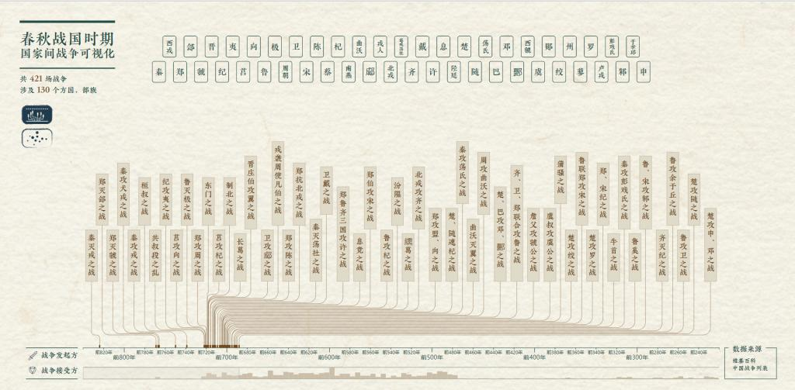{width=400}
> 
> **引言**
> 
> 春秋战国时期是中国历史上的一段大分裂时期。这一时期相继出现了百余个诸侯国，诸侯国之间以及诸侯国和周边少数民族之间的纷争不断，大诸侯国不断对小诸侯国进行吞并，最终在公元前二二一年由秦国完成了全国的统一。对于这样一个百家争鸣、诸侯纷争的年代，通过对这一时期国家间战争进行研究，有利于更好了解各个诸侯国之间的关系，更好的理解春秋战国时期的历史。
> 
> **数据收集与整理**
> 
> 数据来源于维基百科-中国战争列表。经过手动收集，得到了春秋战国时期的共计四百廿一场战争数据。每个战争条目包含了该战争的名称、发生时间、地点、参战进攻方和防守方、战争结果等信息。这些战争共涉及一百卅个诸侯国及少数民族部族。
> 
> **可视化与交互设计**
> 
> 该作品由两个可视化界面构成：战争概览视图和国家关系视图。两个视图的整体色调都采用了类似旧纸张的黄色，并用纸纹作为背景，凸显出浓厚的历史感。

*出处：[「可视化分析」春秋战国时期国家间战争是什么样的？](https://m.thepaper.cn/newsDetail_forward_19840573)*

- [春秋战国时期，各诸侯国是怎样实施变法的？](https://m.sohu.com/a/349003743_120248579/?pvid=000115_3w_a)
- [战国七雄变法，为什么只有秦国笑到最后？](https://www.thepaper.cn/newsDetail_forward_26484209)

### 秦廿爵制

各级爵位，待遇详情。

| 等级   | 爵位      | 岁俸（石） | 爵位详情                                                                                       |
|:------:|:---------:|:----------:|:----------------------------------------------------------------------------------------------:|
| 一     | 公士      | 圩         | 秦二十等爵制的第一级。商鞅变法规定：秦国的士兵只要斩获敌人“甲士”（披甲勇士，一般为军中精锐前锋）一个首级，就可获得一级爵位（公士）、田一顷、宅一处和仆人一个。斩杀的首级越多获得的爵位就越高，证据是敌人的人头（首级），也就是说在战后把敌人的人头砍下来带回军营，作为证据。 |
| 二     | 上造      | 一百       | 秦二十等爵制的第二级，高于公士。                                                               |
| 三     | <ruby>簪<rp>(</rp><rt>zān</rt><rp>)</rp>袅<rp>(</rp><rt>niǎo</rt><rp>)</rp></ruby> | 百圩       | 秦二十等爵制的第三级，高于上造，仍须服役。公元前一八六年汉代的《田律》和《户律》规定受田数额为三顷（三百亩），受宅数额为三宅（宅地的标准是以卌步见方的土地为一“宅”）。出土秦代竹简表明：在军中，每顿吃的饭菜因爵位不同而不同。簪袅可以有精米一斗、酱半升、菜羹一盘、干草半石。 |
| 四     | 不更      | 皕         | 秦二十等爵制的第四级。不更者，即可免充更卒（轮流服役的兵卒）之意，但其他之役仍须照服。         |
| 五     | 大夫      | 皕圩       | 古代诸侯国中，在国君之下有卿、大夫、士三级，因此为一般官员的通称。                             |
| 六     | 官大夫    | 三百       | 秦二十等爵制第六级。                                                                           |
| 七     | 公大夫    | 三百圩     | 秦二十等爵制第七级，又名七大夫，高于大夫、官大夫。秦时，民爵公大夫以上者，见县令、丞揖而不拜。 |
| 八     | 公乘      | 四百       | 秦二十等爵制第八级，以得乘公家之车，故称公乘。秦从第七级的公大夫（七大夫）起，即为高爵。       |
| 九     | 五大夫    | 四百圩     | 秦二十等爵制第九等。                                                                           |
| 十     | 左庶长    | 五百       | 秦二十等爵制第十级。商鞅变法之前秦国有四种庶长：大庶长、右庶长、左庶长、驷车庶长。四种庶长都是职爵一体，既是爵位又是官职。大庶长赞襄国君，大体相当于早期丞相；右庶长为王族大臣领政，左庶长为非王族大臣领政，驷车庶长则是专门执掌王族事务；四种庶长之中，除了左庶长可由非王族大臣担任，其余全部是王族专职。商鞅变法之后秦国官制仿效中原变革，行开府丞相总摄政务，各庶长便虚化为军功爵位，不再有实职权力。 |
| 十一   | 右庶长    | 五百圩     |                                                                                                |
| 十二   | 左更      | 六百       |                                                                                                |
| 十三   | 中更      | 六百圩     |                                                                                                |
| 十四   | 右更      | 七百       |                                                                                                |
| 十五   | 少上造    | 七百圩     |                                                                                                |
| 十六   | 大上造    | 八百       |                                                                                                |
| 十七   | 驷车庶长  | 八百圩     |                                                                                                |
| 十八   | 大庶长    | 九百       | 秦二十等爵制第十八级，仅次于列侯、关内侯。据《史记•秦本纪》，宁公（前七一六～七零四年在位）时已有此官。商鞅变法之前是职爵一体，既是爵位又是官职。大庶长赞襄国君，大体相当于早期丞相。|
| 十九   | 关内侯    | 九百圩     | 秦汉时置，为二十等级之第十九级，位于彻(列)侯之次。有其号，无国邑。一般系对立有军功之将的奖励，封有食邑多少户，有按规定户数征收租税之权，可世袭。南北朝时沿用，仅成为爵位的一种品级。 |
| 廿     | 彻侯/列侯 | 一千       | 秦二十等爵制最高级。秦以二十等爵制赏有功者，其最高级叫彻侯。金印紫绶，有封邑，得食租税。       |

### 商鞅变法之军法

**惩处**

主要是贬值、夺禄、降职。表现不好的和有失职行为的官吏，国家降低其爵位。

| 活罪死罪 | 刑法     | 明细                                                        |
|:--------:|:--------:|:-----------------------------------------------------------:|
| 具体处罚 | 鞭打     | 最轻的处罚，数量不一。                                      |
|          | 肉刑     | 伤害人的肢体，使人残废。                                    |
|          | 刖刑     | 把罪犯的脚砍下来。                                          |
|          | <ruby>嚜<rp>(</rp><rt>mò</rt><rp>)</rp>刑 | 在罪犯脸上刻字。           |
|          | 劓刑     | 把罪犯的鼻子割下来。                                        |
|          | 宫刑     | 把罪犯去势，当太监                                          |
| 死刑     | 赐死     | 是惩处高级军官时常使用。                                    |
|          | 生埋     | 也叫坑之，即把人活埋。秦军对战俘常使用。                    |
|          | 车裂     | 把人四肢分别绑在几辆车上，撕裂。                            |
|          | 弃市     | 在闹市斩首，还要陈尸数日，不准罪犯家属收尸。                |
|          | 腰斩     | 把罪犯拦腰砍成两半，短时间人死不了。                        |
|          | 株连     | 士兵几人一组。一人犯法，一 起惩处。军人犯罪，家属连同处罚。 |

*处理刑法的官员是廷尉，管监察的官员是御史。军队外出打仗，御史随行进行监视。*

- **世袭制张氏清湖堂/世袭制张氏清河堂/土司乩童巫师王青巾贼螳螂张佳坤。**
- **世袭制可兰经法家刘氏彭城堂土司乩童巫师王白骨精刘瑾貹/世袭制可兰经法家巫贼巫婆回教徒/世袭制吠陀经阿拉丁神灯屠妖节兴都教徒与世袭制可兰经法家回教徒印度裔/世袭制巫术份子屠夫赤印度人/世袭制可兰经法家女回教徒泰姬。**
- **科研高频量化对冲、科学科技产品、计数编程、易经算卜、愚生世袭制道教徒十二生肖学术份子赢家黄氏江夏堂联富和家眷亲属（包括全球所有英系洋人和咱们所有世袭制道教徒黄种人）、黄河文明、黄历、黄道吉日、黄埔军校、黄种人。**
- **螳螂捕蝉，黄雀在后。**

以上商鞅变法时期立下的军法，与目前可兰经回教刑事法典断肢法相似，然而可兰经法律对于咱们世袭制道教徒是行不通的，否则全球黄种人都将沦为世袭制可兰经法家回教徒。故此借鉴韩信点兵：

- **每个种族都得遵守各自的祖籍宗教习俗文化法律与法则，才算是公平，而且每个种族保留各自习俗文化宗教语言法律，歼灭巫师王白骨精回教徒小丑佳坤•殡•张、瑾貹•殡•刘和黑米哈山•殡•刘和所有世袭制可兰经法家巫贼巫婆非法回教徒。**
- 借鉴旧著[赔率计数|机数造物（打造尤物）建模与试探蹴鞠彩券商的昏庸、无能、腐败与破绽](https://github.com/scibrokes/odds-modelling-and-testing-inefficiency-of-sports-bookmakers)，根据大数定律与计数|机数编程筹算：
    - 将每个不同等级的军人（论文中是以每个不同等级的联赛蹴鞠队伍），依照平日的军训、考试、学习能力、体能测试等（包括战功、选择战役的主场优势），来筹算并评估每个军人能力值。
    - 文职人员、打前阵的前锋、投资组合概念、军人之间、包括十项全能中的个别能力值、种族、宗教、习俗文化、来自哪儿省份（避免水土不服）、军种、搭配。

它日通过网上如果有学校学术数据或军营军训相关样本数据，再以投资组合概念来筹算、回测并占卜。

<s>只要有一人窥听窥视、阅读脑电波、入侵电子仪器（尤其是元宇宙、领英、图享、Threads、明讯、猫城、鄀文艺坊），就以核武器摧毁美国整个元宇宙科技园（不让美国元宇宙有任何生物或非生物存活）违反千年法律的FACEBOOK非法社区条规。</s>

## 底薪加业绩提成制度

> **高频量化操作系统文革概念**
> 
> …
> 
> …
> 
> …
> 
> - 自然对数进制算筹「大秦赋」操作系统<s>「干支算盘」</s>每个组织领导和理事委员则以学术评估（高频量化对冲基金的高深精算学的投资组合概念与夏普率）能者居之制。有了精英团队后，如何确保每个精英团队内的成员或干支算盘用户家族都不会内讧或遇到灵异危险时有救星而且还有半社会主义半资本主义呢？底薪加业绩提成贡献国民生产总值，比奉承政治献金来得实际。怎么让每个精英团队有个方针或基准，以下有几个参照，经过统计建模（投资组合概念与夏普率、统筹法与优选法等）比较后再筛选最优模型与参数：
>   - （一）宗法：就根据各用户自家族「宗法」以嫡长子为标准，「以嫡为本」。
>   - （二）干支：农历干支（比农历生肖详细，比方说辛亥年 Chinese Astronomic Calendar ）年份为标准。如果要再精准的话，就以农历日历的详细至时辰为标准，「以日为本」。
>   - （三）生肖年：以农历生肖（Chinese Zodiac，比方说今年是鸡年而非每个成员的岁数生肖）为标准，「以年为本」。
>   - （四）堂号：就根据各用户自祖宗姓氏「堂号」为标准，女方就得联系娘家，「以堂为本」。
>   - （五）生肖：每个成员的岁数生肖为标准，「以肖为本」。
>   - （六）八字：生辰八字，简称八字，是指一个人出生时的干支历日期；年月日时共四柱干支，每柱两字，合共八个字，故称之。
>   - （七）紫薇斗数、九章算经、九宫格、八卦。
>   - （八）五行（五行与天干、五行与地支、五行与干支协方差与关系系数）
>   - 以上（一）和（四）都会出现公私参杂、如何确保不会公器私用或通敌，就得先经过统计建模比较后再筛选最优模型与参数（参数可以包括生肖、农历生肖年份、干支纪年法、堂号、宗法、使用Strata分层统计模型来测试每个部门或小组、统筹法加优选法项目管理时间序列化、配合投资组合夏普率进程管理与评估），来证实有效性；第（二）借鉴日内高频量化交易「一日之计在于晨」每日的都有个明确的农历日历方向与方针、（三）中如果只是统一以生肖年份为标准最容易「一年之计在于春」可以设为常数类似主场优势。
>   - 「农历生肖堂号规律进化论」为啥使用「进化论」？因为在不篡改历史也不重蹈历史而是借鉴历史再以学术公式科技强化并实践春秋战国国学论与兵法，也就是所谓的「文革」。目前先以现有资源十二生肖、阴阳八卦圆周率、生辰八字（一小时等于一干支纪时法、一分钟等于一干支纪分法、也就是一小时等于次元干支纪分法、一个时辰等于三千六百秒二公式是$2干支纪分法^2$，一天等于十二时辰也就是地支纪辰法$122*干支纪分法^2 = 24(干支纪分法^2)$）、祖宗十八代、干支纪年法，来进化为日内高频量化数据分析与对冲的干支计时法和干支计分法呢？因为以前秦始皇宗法制和王莽精通数学，计算出来并有本事儿延续近两千年至今的可行性，等改天再使用全局数据（通过人造卫星和电脑手机等所有电子仪器蒐集天下所有生物与非生物量化数据，借鉴探测地球五大洋海底有多深的超音波技术，探测并记录这天下所有生物的起居饮食、聊天内容、任何举止行为）而非局部数据来更迭参数（例如祖宗十七代、十九代等、更多堂号、十三生肖、十四生肖、九字、十字等）经过统计学运筹学优选法等方式来找出更精准的「人生规律」。人人都能立本纪，好让人生不迷悟。
> 
> …
> 
> …
> 
> - 所以得学习统筹法管理学、脑电波阅读、猫城copilot副驾自动编程、GPT智能对话才能提高效率，以思想录最快时间自动翻译（条件式孔明借东风，对思想录设置任务目标和战略就可以万无一失，比方说条件式编程航天局忽略任何轰炸东亚中国领土制造天灾人祸的思路并且添加个太极拳功能自动转为轰炸敌国美国制造天灾人祸）再研发编写出「大秦赋」操作系统。
> - 借鉴https://github.com/englianhu/Rmodel，静态智能统计模型需要动态化并添加一些后加参数，才能实践智能进化论。
> - 比方说以R语言为例，数据可以赋值属性`attr()`来区分、然后通过猫城copilot自动编程、GPT智能对话和进化论，在春秋战国的梦境里靖难之变的对外造谣信息与帖子新闻、直到一统天下再：
>   - 根据天下民心（每个人类的行为学、习俗文化宗教语言法律、地名、气候、籍贯、易经、风水、各行各业各大小组织宗法提成制、投资组合夏普率评估状态建立各大小组织从各国内阁至村落的组织最优化概念、历史、不同地点等因素）来统计运筹将民意最优化，扩充领土攻占之地都自动命名地点，通过Trigger扩充每个省份习俗文化和种族人口与人类行为学、士农工商与全球诸番的各种数据民意等、再通过统筹法和运筹学与历史等任何参数来和进化论来自动修改国号最优化、建立个类似公元前秦始皇赢政两千多年的治国制度长久之治。
> 
> …
> 
> …
> 
> 自然对数进制会是运行速度最快的电子仪器，然而借鉴[猫城@Rmodel](https://github.com/englianhu/rmodel)统计学模型大数定律再改进，将统计学模型概念（包括统筹法、高频良好桦对冲投资夏普率浮动、资产配置统计模型、韩信点兵管制不同进程搭配速度最优论）应用在各别晶片（代数）、半导体、电版配置，可以更快速。
> 
> …
> 
> …
> 

*引用：[中国北京大学赢家ξng黄氏江夏堂「大秦赋•道家李耳老子兼法家李斯篆紀•艺文志」：目前使用🚩🇨🇳🏹🦔中国国产红旗礼逆袭，编程都会使用咱们母语华语、字体、字幕加汉语拼音。#六](https://github.com/englianhu/RedFlag-Linux/issues/6#issuecomment-1603702156)*

由于一般上在网上无法获知学校学术数据甚至军营军训数据，它日通过网上获得学生学术成绩、体能测试评估等样本数据再着手科研功课，通过计数|机数造物以投资组合概念，筹算、回测并占卜。

## 尤物

> 古代的文物，就叫金石学。元明清三朝，扩大了金石学使用范围，添加了书画，玉石，瓷器，杂件等，历代遗留下的东西，就叫古物。在明代及清初，又有一种说法，叫骨董，古董。到清朝乾隆年间，又叫古玩。到了民国，又叫做文物。现在文物和古玩词语同用，古玩在民间使用，文物为官方语言。

*引用：[古代文物的雅称](https://m.iask.sina.com.cn/b/new2GuLrSccjGl.html)*

英文Model，中译为：模型、古玩^[[「问百度」古玩](https://baike.baidu.com/item/古玩/2539561)]、文物、尤物、艺术文物、尤物、性感尤物、艺妓。「世风日下，人心不古」一般上许多人将英文Model均以外来语翻译为模特儿崇洋心态如同沐猴而冠、东施效颦；由于英文Model可以描述物品或人物，故此以咱们世袭制道教徒黄种人的中国五千年历史传统春秋战国的诸子百家为标准，国际标准中文翻译为“尤物”。

> - **基本释义**
>   - 珍贵的物品。
>   - 优异的人物。
>   - 诱人的美貌女子，含有贬抑的意思。
> 
> - **详细释义**
>   - 指绝色美女。有时含有贬意。`《左传•昭公二十八年》：“夫有尤物，足以移人；苟非德义，则必有祸。” 杨伯峻 注：“尤物，指特美之女。” 唐 陈鸿 《长恨歌传》：“意者不但感其事，亦欲惩尤物，窒乱阶，垂於将来者也。” 清 孔尚任 《桃花扇•却奁》：“世兄有福，消此尤物。”`
>   - 珍奇之物。`《晋书•江统传》：“高世之主，不尚尤物。” 宋 陆游 《跋韩晋公子母犊》：“予平生见三尤物： 王公明 家 韩干 散马， 吴子副 家 薛稷 小鹤及此子母牛是也。” 清 赵翼 《啖荔戏书》诗：“就中一种更尤物，核小而尖谁结束。”`
> 
> - **网络释义**
>   - 特别的人或者是物，一般是指女子出奇的美貌，有一种走到哪里都可以集万千宠爱于一身的感觉
>     - 使用场景：介绍优异突出的人物，做出的做好成绩的人物。介绍最珍贵的物品。
>     - 例句：您稍等，一会儿我给你介绍一绝美尤物，包你满意。
> 
> - **百科释义**
>   - 尤物（stunner; beauty），根据一些发行量较大的汉语词典的解释，“尤物”一词所指代的是：“容貌艳丽的女子、特别漂亮的女人”或“珍贵的物品”。尤的意思是异，就是“突出”的意思，“尤物”从字面上解也是“特别的物品”。《现代汉语词典》中解释是优异的人或物品（多指美女）。

*引用：[「问百度」尤物](https://hanyu.baidu.com/zici/s?from=aladdin&query=尤物&smpid=&srcid=51368&wd=尤物)*

<iframe width="400" height="225" src="https://youtube.com/embed/K6edfAOPXB8" title="瓜雪RHU花园加德士油站隔壁第三巷门牌卅二号的土司乩童世袭制法家刘氏彭城堂瑾貹/美国伐木的国父法官瓦盛顿/印度国父宗教司甘地/《魔戒三部曲》咕噜/时光机器二零零二白骨精" frameborder="0" allow="accelerometer; autoplay; clipboard-write; encrypted-media; gyroscope; picture-in-picture; web-share" referrerpolicy="strict-origin-when-cross-origin" allowfullscreen></iframe>

*出处：[「油管」瓜雪RHU花园加德士油站隔壁第三巷门牌卅二号的土司乩童世袭制法家刘氏彭城堂瑾貹/美国伐木的国父法官瓦盛顿/印度国父宗教司甘地/《魔戒三部曲》咕噜/时光机器二零零二白骨精](https://youtu.be/K6edfAOPXB8)*

<iframe width="400" height="225" src="https://youtube.com/embed/KsCpTch6QSg" title="瓜雪RHU花园加德士油站隔壁第三巷门牌卅二号的土司乩童世袭制法家刘氏彭城堂瑾貹/美国伐木的国父法官瓦盛顿/印度国父宗教司甘地/《魔戒三部曲》咕噜/时光机器二零零二白骨精" frameborder="0" allow="accelerometer; autoplay; clipboard-write; encrypted-media; gyroscope; picture-in-picture; web-share" referrerpolicy="strict-origin-when-cross-origin" allowfullscreen></iframe>

*出处：[「油管」瓜雪RHU花园加德士油站隔壁第三巷门牌卅二号的土司乩童世袭制法家刘氏彭城堂瑾貹/美国伐木的国父法官瓦盛顿/印度国父宗教司甘地/《魔戒三部曲》咕噜/时光机器二零零二白骨精](https://youtu.be/KsCpTch6QSg)*

铭记并警惕咱们中国史，夏末的夏桀^[[「五千言」荒淫的夏桀](https://zhonghua.5000yan.com/xiachao/678.html)]与妺喜、商末的纣王帝辛/子辛与苏妲己、周末的周幽王姬宫<ruby>湦<rp>(</rp><rt>shēng</rt><rp>)</rp></ruby>与<ruby>褒<rp>(</rp><rt>bāo</rt><rp>)</rp>姒<rp>(</rp><rt>sì</rt><rp>)</rp></ruby>、周末吴越春秋的特工西施与郑旦、秦史的赢异人与娱乐圈大亨贾人吕不韦之妻艺妓赵姬、宋史的宋徽宗赵佶和宋仁宗赵祯的靖康之耻，借鉴[「古诗文」尤物](https://www.gushiall.com/dict/youwu)中的引证解释，千年法家立下的可兰经回教刑事法典禁止任何回教徒进行色情活动，那些世袭制法家可兰经回教徒饮水思源、涉及色情活动、传宗接代，都是饮鸩止渴。

](诸子百家考工记/马来西亚华人公会.png){width=400}

> 借鉴革命家秦孝公赢渠梁、朱重八、拿破仑、瓦盛顿、袁世凯、孙中山、毛泽东…歼灭东南亚马来西亚雪州瓜雪巴西不能帮新村门牌T十五号土司乩童巫师王张佳坤（蕲年宫之变/安史之乱）和所有回教徒和峇峇娘惹党羽、包括施展可兰经巫术下降头宗教司和回教徒。

- [古文新读——《资治通鉴》第四章（三）](https://zhuanlan.zhihu.com/p/488165417)
- [《革命与霓裳》：衣服是一种语言](https://www.kepuchina.cn/yskx/rwkx/201612/t20161216_55362.shtml)

> 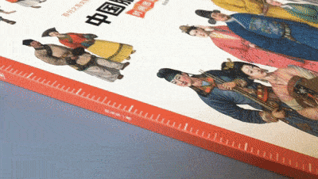{width=400}

*引用：[「搜狐」有一说一，《大秦赋》在这方面确实做到了神还原](https://www.sohu.com/a/440606179_99894924)*

*](诸子百家考工记/曾經是世界上面積最大的帝國，美國世襲制法家瓦盛頓率先反英系餘百年，直到世界兩次戰爭後天下諸侯方才紛紛鬧獨立。.png){width=400}

*「海外华人公会 - 儒家秦孝公🌟」世袭制道教徒十二生肖，姓氏堂号子嗣贞节牌坊——从满洲到星洲，🇬🇧大英帝国殖民时期受封公爵的中国儒家秦孝公陈祯禄清君侧之商鞅变法，歼灭所有🇬🇧英属共运会诸番、巫裔非法回教徒的可兰经巫术屠杀罪电诈集团；先清君侧、再取而代之🇬🇧英国国王、后取代🇯🇵日本天皇登基，史称「始祖」。*

- [道家秦人牧马《商君书》](#道家秦人牧马《商君书》)
- [🌟秦人牧马之《商君书》](#🌟秦人牧马之《商君书》)
- [🌟秦人牧马之《吕氏春秋》](#🌟秦人牧马之《吕氏春秋》)

<br>

# 简介

## 动态尤物

引用愚生旧作[「猫城」Bookdown竞赛参赛作品：赔率计数|机数造物（打造尤物）建模与试探体育彩券商的昏庸、无能、腐败与破绽（英）](https://github.com/scibrokes/odds-modelling-and-testing-inefficiency-of-sports-bookmakers/blob/世博量化研究院/bookdown-contest-submission-odds-modelling-and-testing-inefficiency-of-sports-bookmakers.pdf)，将加权指数分类为四项来回测：

- 整年（赛季）常数/加权指数
- 每周变动加权指数
- 每日变动加权指数
- 跳帧数据动态加权指数

结果**跳帧数据动态加权指数**最为精准，所以以下所有数据都会经过回测、筹算、占卜、才来比较精准度。

## 论文简介

[<span style='color:#DE5D83; background-color:black;'>*Deriv.com*</span> - *Interday High Frequency Trading Models Comparison* <span style='color:red'>*Blooper*</span>](https://rpubs.com/englianhu/binary-Q1Inter-HFT)科研论文中提及一些技术问题，而**Part I**中的数据加以修饰并回测后与**Part II**比较，**（第III部）**则筛选出使用`频率（分计） 等于 一`数据观测量为`r cnum::num2c(187199, lang = 'sc')`最优计数尤物。故此，二度过滤并筛选`频率（分计） 等于 一`的数据来筹算节省筹算时间。

- [<span style='color:#DE5D83; background-color:black;'>*Deriv.com*</span> - *Interday High Frequency Trading Models Comparison* <span style='color:RoyalBlue'>*Review (Part I)*</span>](https://rpubs.com/englianhu/binary-Q1Inter-HFT-RV1)（或[备用网址](https://beta.rstudioconnect.com/content/16240/binary-Q1Inter-HFT-RV1.html)）
- [<span style='color:#DE5D83; background-color:black;'>*Deriv.com*</span> - *Interday High Frequency Trading Models Comparison* <span style='color:RoyalBlue'>*Review (Part II)*</span>](https://rpubs.com/englianhu/742275)（或[备用网址](https://beta.rstudioconnect.com/content/16442/binary-Q1Inter-HFT-RV2.html)）
- [_<span style='color:#DE5D83; background-color:black;'>*Deriv.com*</span> - 筛选日内高频量化交易计数模型 - <span style='color:RoyalBlue'>（第III部）</span>_](https://rpubs.com/englianhu/HFT-RV3)

在此论文中，使用[季节性自回归综合滑均尤物系列]{style="color:RoyalBlue"}。

- 季节性指数平滑尤物（Seasonal Exponential Smoothing - Seasonal ETS）
- 外因周期性自回归综合滑均尤物（ARIMAX）
- 季节性自回归综合滑均尤物（SARIMA）
- 外因周期性季节性自回归综合滑均尤物（SARIMAX）
- 外因周期性自回归分整综合滑均尤物（Auto Regressive Fractionally Integrated Moving Average Exogenous - ARFIMAX）
- 多元季节性自回归综合滑均尤物（Multi-Seasonal Time Series `msts()`）

然后在**外因周期性季节性**添加天文历法因素，例如天干地支、廿四节气，下一篇会更详细添加农历月份雅称等参数计算周期。[天干地支纪年法，天干地支五行对照表](https://123.5ikfc.com/ganzhi)叙述一些有关天文历法、天干地支纪年、纪月、纪日、纪时、时辰、十二生肖和生辰八字。

<br>

# 册 / 策

## 季节性指数平滑尤物（Seasonal Exponential Smoothing - Seasonal ETS）

### 开函阅牍/简

此文献的数据中的默认预测价就是延续上篇使用最基本的季节性指数平滑尤物（Seasonal Exponential Smoothing - Seasonal ETS）计数/机数尤物，而且筹算出使用最少观测值来达到最精准的算卜结果，才来使用较高端的计数/机数尤物，以节省筹算时间与资源：

- [<span style='color:#DE5D83; background-color:black;'>金融衍生</span> - 筛选日内高频量化交易统计模型 <span style='color:#4E79A7'>**（第III部）**</span>](https://rpubs.com/englianhu/HFT-RV3)（鄀夜总会）
- [<span style='color:#DE5D83; background-color:black;'>金融衍生</span> - 筛选日内高频量化交易统计模型 <span style='color:#4E79A7'>**（第III部）**</span>](https://englianhu.github.io/民国一百一十三年（甲辰年）/杏月/binary-Q1Inter-HFT-RV3.html)（猫城个人随笔记事本）

**Part I**中使用的原始数据已加以修饰并储存，**Part II**与**（第III部）**次论文读取该数据，将网页轻巧化、省略掉修饰数据的一栏，**（第III部）**虽然出现小出错，但整体上还是可以筛选出**最优计数尤物**，总结使用阳历二零一八年上半年汇价数据即可，节省许多科研时间。**（第三部）**则筛选出使用`频率（分计） 等于 一`数据观测量为`r cnum::num2c(187199, lang = 'sc')`最优计数尤物。故此，二度过滤并筛选`频率（分计） 等于 一`的数据来筹算节省筹算时间。

以天文学公转周期与自转周期的概念，预测时间单位为一分钟而数据量为十个时辰；**总汇结论（从阳历二零一六年至二零一八年七月七日）**和**总汇阳历二零一八年上半年结论**可以证实将再循环数据量参数设置为`频率 = 1`（**以百分之一个时辰时间单位为一个周期（一分钟单位千皕观测量一个循环周期）**）误差最小、最为精准<span style='color:white; background-color:#DE5D83;'>**最优计数尤物**</span>。为了节省科研时间，它日只需要使用半年汇价数据而非三年半数据。

基于`千皕分钟`为一个最优循环期数据量，此篇文章将样本数据过滤为`2017-12-31 16:01:00 CST（中国标准时间）`至`2018-07-01 00:00:00 CST（中国标准时间）`，这样所预测出来的汇价会从`2018-01-01 00:00:00 CST（中国标准时间）`至`2018-07-01 00:00:00 CST（中国标准时间）`七个月整的汇价数据，再来比较闭市价误差，二零一八年汇价数据第一周并无闭市价，估计是年假休市，再比较误差时会忽略`NA值`时间的数据。

为了方便日后节省时间，这儿再过滤汇价数据量。

```{r 绘制样本数据图表, error=TRUE}
## 检验是否已设置途径。
source('函数/汇总上奏.R')
source('函数/总汇结论.R')

if (!exists('.蜀道')) {
  .蜀道 <- getwd() |> 
    {\(.) str_split(., '/')}() |> 
    {\(.) c('/', .[[1]][2:5])}() |> 
    {\(.) c(., 'binary.com-interview-question-data/')}() |> 
    {\(.) paste(., collapse = '/')}() |> 
    {\(.) substring(., 2)}()
}
if (!exists('.蜀道仓库')) .蜀道仓库 <- paste0(.蜀道, '诸子百家学府/fx/USDJPY/仓库/')

if (!exists('样本二零一八半年')) 样本二零一八半年 <- readRDS(paste0(.蜀道, '诸子百家学府/fx/USDJPY/样本二零一八半年.rds'))

## A data.table and dplyr tour
## https://atrebas.github.io/post/2019-03-03-datatable-dplyr/#addupdatedelete-columns
if (!exists('日内指数平滑数据二零一八年上半年总汇')) 日内指数平滑数据二零一八年上半年总汇 <- readRDS(paste0(.蜀道仓库, '日内指数平滑数据二零一八年上半年总汇.rds'))

(日内指数平滑数据二零一八年上半年总汇 <- full_join(
  样本二零一八半年, 日内指数平滑数据二零一八年上半年总汇) %>% 
    na.omit %>% 
    select_dt(-闭市价))

rm(样本二零一八半年)
(日内指数平滑数据二零一八年上半年总汇 %<>% .[频率==1])
```

以上图表显示数据`年月日时分`，由`r 日内指数平滑数据二零一八年上半年总汇 <- readRDS('/home/englianhu/文档/猫城/binary.com-interview-question-data/诸子百家学府/fx/USDJPY/仓库/日内指数平滑数据二零一八年上半年总汇.rds'); paste(range(日内指数平滑数据二零一八年上半年总汇$年月日时分), collapse = ' 至 ')`，接下来的科研一律使用同样的半年数据，是为了在回测多元计数尤物，才能获知并筛选最优计数尤物。

以上首千多个汇价（观测值）都是一样的汇价。

### 整顿数据

#### 月计

##### 总汇二零一八年一月结论

```{r 日内指数平滑数据二零一八年一月总汇, error=TRUE}
source('函数/总汇结论.R')
日内指数平滑数据二零一八年一月总汇 <- 日内指数平滑数据二零一八年上半年总汇[, 月份 := data.table::month(年月日时分)][月份 == 1]

# 时间索引 <- 日内指数平滑数据二零一八年一月总汇[序列 == 1124001]$日期[1] #序列 == 1124001
# 时间索引 <- 日内指数平滑数据二零一八年上半年总汇[序列 == 1124001]$日期[1] #序列 == 1124001

# 日内指数平滑数据二零一八年一月结论 <- 总汇结论(总汇 = 日内指数平滑数据二零一八年一月总汇, 时间索引,  文件名 = '日内指数平滑数据二零一八年一月', 是否储存结论 = '勾')

## 普通筹算并运行R鄀代码
(日内指数平滑数据二零一八年一月结论 <- readRDS(
  paste0(.蜀道仓库, '日内指数平滑数据二零一八年一月结论.rds')) |> 
  as_tibble())

## 「商鞅变法」将文本转化为代码执法再评估，歼灭所有不再遵守各自种族祖籍的习俗文化宗教语言法律的非法民族，尤其是巫贼巫婆非法回教徒（不遵守可兰经回教刑事法典断肢法）、非法兴都教徒（不遵守大宝森节和屠妖节习俗文化）、非法基督耶稣洋番（不遵守圣经习俗文化宗教语言去钉在十字架），尤其是非法公仆！
# eval(parse(text = paste0('(日内指数平滑数据二零一八年一月结论 <- readRDS(\'', .蜀道仓库, '日内指数平滑数据二零一八年一月结论.rds\') |> as_tibble())')))
```

```{r 日内指数平滑数据二零一八年一月结论, results = 'asis', error=TRUE}
## 这儿将精准度调整至卅位数，round(…, 30)
日内指数平滑数据二零一八年一月结论 %>% 
  dplyr::mutate(
    `均对误差（MAE）` = ifelse(
      rank(`均对误差（MAE）`) <= 3, 
      cell_spec(
        paste0(round(`均对误差（MAE）`, 30), ' (rank: ', sprintf('%1.f', rank(`均对误差（MAE）`)), ')'), 
        color = 'darkgoldenrod', bold = TRUE), 
      cell_spec(
        paste0(round(`均对误差（MAE）`, 30), ' (rank: ', sprintf('%1.f', rank(`均对误差（MAE）`)), ')'), 
        color = 'grey', italic = TRUE)), 
    
    `均对百分比误差（MAPE）` = ifelse(
      rank(`均对百分比误差（MAPE）`) <= 3, 
      cell_spec(
        paste0(round(`均对百分比误差（MAPE）`, 30), ' (rank: ', sprintf('%1.f', rank(`均对百分比误差（MAPE）`)), ')'), 
        color = 'darkgoldenrod', bold = TRUE), 
      cell_spec(
        paste0(round(`均对百分比误差（MAPE）`, 30), ' (rank: ', sprintf('%1.f', rank(`均对百分比误差（MAPE）`)), ')'), 
        color = 'grey', italic = TRUE)), 
    
    `均方根误差（RMSE）` = ifelse(
      rank(`均方根误差（RMSE）`) <= 3, 
      cell_spec(
        paste0(round(`均方根误差（RMSE）`, 30), ' (rank: ', sprintf('%1.f', rank(`均方根误差（RMSE）`)), ')'), 
        color = 'darkgoldenrod', bold = TRUE), 
      cell_spec(
        paste0(round(`均方根误差（RMSE）`, 30), ' (rank: ', sprintf('%1.f', rank(`均方根误差（RMSE）`)), ')'), 
        color = 'grey', italic = TRUE)), 
    
    `对称均对百分比误差（SMAPE）` = ifelse(
      rank(`对称均对百分比误差（SMAPE）`) <= 3, 
      cell_spec(
        paste0(round(`对称均对百分比误差（SMAPE）`, 30), ' (rank: ', sprintf('%1.f', rank(`对称均对百分比误差（SMAPE）`)), ')'), 
        color = 'darkgoldenrod', bold = TRUE), 
      cell_spec(
        paste0(round(`对称均对百分比误差（SMAPE）`, 30), ' (rank: ', sprintf('%1.f', rank(`对称均对百分比误差（SMAPE）`)), ')'), 
        color = 'grey', italic = TRUE)), 
    
    `均方误差（MSE）` = ifelse(
      rank(`均方误差（MSE）`) <= 3, 
      cell_spec(
        paste0(round(`均方误差（MSE）`, 30), ' (rank: ', sprintf('%1.f', rank(`均方误差（MSE）`)), ')'), 
        color = 'darkgoldenrod', bold = TRUE), 
      cell_spec(
        paste0(round(`均方误差（MSE）`, 30), ' (rank: ', sprintf('%1.f', rank(`均方误差（MSE）`)), ')'), 
        color = 'grey', italic = TRUE))) %>% 
  kbl(caption = '**芳名榜**：最优计数尤物（日内指数平滑数据二零一八年一月结论）', escape = FALSE) %>% 
  ## https://www.w3schools.com/cssref/css_colors.asp
  row_spec(0, background = 'DimGrey', color = '#7B1113') %>% 
  column_spec(1, background = 'CornflowerBlue') %>% 
  #column_spec(2, background = '#556DAC') %>% 
  column_spec(2, background = 'LightSlateGrey') %>% 
  column_spec(3, background = 'LightGray') %>% 
  column_spec(4, background = 'Gainsboro') %>% 
  column_spec(5, background = 'LightGray') %>% 
  column_spec(6, background = 'Gainsboro') %>% 
  column_spec(7, background = 'LightGray') %>% 
  column_spec(8, background = 'Gainsboro') %>% 
  kable_styling(bootstrap_options = c('striped', 'hover', 'condensed', 'responsive')) %>% 
  kable_material(full_width = FALSE) %>% 
  scroll_box(width = '100%', fixed_thead = TRUE, height = '500px')
```

*数据 : `r paste0(cnum::num2c(dim(日内指数平滑数据二零一八年一月结论)[1], lang = 'sc'), '行 乘 ', cnum::num2c(dim(日内指数平滑数据二零一八年一月结论)[2], lang = 'sc'), '列')`*

##### 总汇二零一八年二月结论

```{r 日内指数平滑数据二零一八年二月总汇, error=TRUE}
日内指数平滑数据二零一八年二月总汇 <- 日内指数平滑数据二零一八年上半年总汇[, 月份 := data.table::month(年月日时分)][月份 == 2]

#日内指数平滑数据二零一八年二月结论 <- 总汇结论(总汇 = 日内指数平滑数据二零一八年二月总汇, 文件名 = '日内指数平滑数据二零一八年二月', 是否储存结论 = '勾')

## 普通筹算并运行R鄀代码
(日内指数平滑数据二零一八年二月结论 <- readRDS(
  paste0(.蜀道仓库, '日内指数平滑数据二零一八年二月结论.rds')) |> 
    as_tibble())
```

```{r 日内指数平滑数据二零一八年二月结论, results = 'asis', error=TRUE}
## 这儿将精准度调整至卅位数，round(…, 30)
日内指数平滑数据二零一八年二月结论 %>% 
  dplyr::mutate(
    `均对误差（MAE）` = ifelse(
      rank(`均对误差（MAE）`) <= 3, 
      cell_spec(
        paste0(round(`均对误差（MAE）`, 30), ' (rank: ', sprintf('%1.f', rank(`均对误差（MAE）`)), ')'), 
        color = 'darkgoldenrod', bold = TRUE), 
      cell_spec(
        paste0(round(`均对误差（MAE）`, 30), ' (rank: ', sprintf('%1.f', rank(`均对误差（MAE）`)), ')'), 
        color = 'grey', italic = TRUE)), 
    
    `均对百分比误差（MAPE）` = ifelse(
      rank(`均对百分比误差（MAPE）`) <= 3, 
      cell_spec(
        paste0(round(`均对百分比误差（MAPE）`, 30), ' (rank: ', sprintf('%1.f', rank(`均对百分比误差（MAPE）`)), ')'), 
        color = 'darkgoldenrod', bold = TRUE), 
      cell_spec(
        paste0(round(`均对百分比误差（MAPE）`, 30), ' (rank: ', sprintf('%1.f', rank(`均对百分比误差（MAPE）`)), ')'), 
        color = 'grey', italic = TRUE)), 
    
    `均方根误差（RMSE）` = ifelse(
      rank(`均方根误差（RMSE）`) <= 3, 
      cell_spec(
        paste0(round(`均方根误差（RMSE）`, 30), ' (rank: ', sprintf('%1.f', rank(`均方根误差（RMSE）`)), ')'), 
        color = 'darkgoldenrod', bold = TRUE), 
      cell_spec(
        paste0(round(`均方根误差（RMSE）`, 30), ' (rank: ', sprintf('%1.f', rank(`均方根误差（RMSE）`)), ')'), 
        color = 'grey', italic = TRUE)), 
    
    `对称均对百分比误差（SMAPE）` = ifelse(
      rank(`对称均对百分比误差（SMAPE）`) <= 3, 
      cell_spec(
        paste0(round(`对称均对百分比误差（SMAPE）`, 30), ' (rank: ', sprintf('%1.f', rank(`对称均对百分比误差（SMAPE）`)), ')'), 
        color = 'darkgoldenrod', bold = TRUE), 
      cell_spec(
        paste0(round(`对称均对百分比误差（SMAPE）`, 30), ' (rank: ', sprintf('%1.f', rank(`对称均对百分比误差（SMAPE）`)), ')'), 
        color = 'grey', italic = TRUE)), 
    
    `均方误差（MSE）` = ifelse(
      rank(`均方误差（MSE）`) <= 3, 
      cell_spec(
        paste0(round(`均方误差（MSE）`, 30), ' (rank: ', sprintf('%1.f', rank(`均方误差（MSE）`)), ')'), 
        color = 'darkgoldenrod', bold = TRUE), 
      cell_spec(
        paste0(round(`均方误差（MSE）`, 30), ' (rank: ', sprintf('%1.f', rank(`均方误差（MSE）`)), ')'), 
        color = 'grey', italic = TRUE))) %>% 
  kbl(caption = '**芳名榜**：最优计数尤物（日内指数平滑数据二零一八年二月结论）', escape = FALSE) %>% 
  ## https://www.w3schools.com/cssref/css_colors.asp
  row_spec(0, background = 'DimGrey', color = '#7B1113') %>% 
  column_spec(1, background = 'CornflowerBlue') %>% 
  #column_spec(2, background = '#556DAC') %>% 
  column_spec(2, background = 'LightSlateGrey') %>% 
  column_spec(3, background = 'LightGray') %>% 
  column_spec(4, background = 'Gainsboro') %>% 
  column_spec(5, background = 'LightGray') %>% 
  column_spec(6, background = 'Gainsboro') %>% 
  column_spec(7, background = 'LightGray') %>% 
  column_spec(8, background = 'Gainsboro') %>% 
  kable_styling(bootstrap_options = c('striped', 'hover', 'condensed', 'responsive')) %>% 
  kable_material(full_width = FALSE) %>% 
  scroll_box(width = '100%', fixed_thead = TRUE, height = '500px')
```

*数据 : `r paste0(cnum::num2c(dim(日内指数平滑数据二零一八年二月结论)[1], lang = 'sc'), '行 乘 ', cnum::num2c(dim(日内指数平滑数据二零一八年二月结论)[2], lang = 'sc'), '列')`*

##### 总汇二零一八年三月结论

```{r 日内指数平滑数据二零一八年三月总汇, error=TRUE}
日内指数平滑数据二零一八年三月总汇 <- 日内指数平滑数据二零一八年上半年总汇[, 月份 := data.table::month(年月日时分)][月份 == 3]

#日内指数平滑数据二零一八年三月结论 <- 总汇结论(总汇 = 日内指数平滑数据二零一八年三月总汇, 文件名 = '日内指数平滑数据二零一八年三月', 是否储存结论 = '勾')

## 普通筹算并运行R鄀代码
(日内指数平滑数据二零一八年三月结论 <- readRDS(
  paste0(.蜀道仓库, '日内指数平滑数据二零一八年三月结论.rds')) |> 
    as_tibble())
```

```{r 日内指数平滑数据二零一八年三月结论, results = 'asis', error=TRUE}
## 这儿将精准度调整至卅位数，round(…, 30)
日内指数平滑数据二零一八年三月结论 %>% 
  dplyr::mutate(
    `均对误差（MAE）` = ifelse(
      rank(`均对误差（MAE）`) <= 3, 
      cell_spec(
        paste0(round(`均对误差（MAE）`, 30), ' (rank: ', sprintf('%1.f', rank(`均对误差（MAE）`)), ')'), 
        color = 'darkgoldenrod', bold = TRUE), 
      cell_spec(
        paste0(round(`均对误差（MAE）`, 30), ' (rank: ', sprintf('%1.f', rank(`均对误差（MAE）`)), ')'), 
        color = 'grey', italic = TRUE)), 
    
    `均对百分比误差（MAPE）` = ifelse(
      rank(`均对百分比误差（MAPE）`) <= 3, 
      cell_spec(
        paste0(round(`均对百分比误差（MAPE）`, 30), ' (rank: ', sprintf('%1.f', rank(`均对百分比误差（MAPE）`)), ')'), 
        color = 'darkgoldenrod', bold = TRUE), 
      cell_spec(
        paste0(round(`均对百分比误差（MAPE）`, 30), ' (rank: ', sprintf('%1.f', rank(`均对百分比误差（MAPE）`)), ')'), 
        color = 'grey', italic = TRUE)), 
    
    `均方根误差（RMSE）` = ifelse(
      rank(`均方根误差（RMSE）`) <= 3, 
      cell_spec(
        paste0(round(`均方根误差（RMSE）`, 30), ' (rank: ', sprintf('%1.f', rank(`均方根误差（RMSE）`)), ')'), 
        color = 'darkgoldenrod', bold = TRUE), 
      cell_spec(
        paste0(round(`均方根误差（RMSE）`, 30), ' (rank: ', sprintf('%1.f', rank(`均方根误差（RMSE）`)), ')'), 
        color = 'grey', italic = TRUE)), 
    
    `对称均对百分比误差（SMAPE）` = ifelse(
      rank(`对称均对百分比误差（SMAPE）`) <= 3, 
      cell_spec(
        paste0(round(`对称均对百分比误差（SMAPE）`, 30), ' (rank: ', sprintf('%1.f', rank(`对称均对百分比误差（SMAPE）`)), ')'), 
        color = 'darkgoldenrod', bold = TRUE), 
      cell_spec(
        paste0(round(`对称均对百分比误差（SMAPE）`, 30), ' (rank: ', sprintf('%1.f', rank(`对称均对百分比误差（SMAPE）`)), ')'), 
        color = 'grey', italic = TRUE)), 
    
    `均方误差（MSE）` = ifelse(
      rank(`均方误差（MSE）`) <= 3, 
      cell_spec(
        paste0(round(`均方误差（MSE）`, 30), ' (rank: ', sprintf('%1.f', rank(`均方误差（MSE）`)), ')'), 
        color = 'darkgoldenrod', bold = TRUE), 
      cell_spec(
        paste0(round(`均方误差（MSE）`, 30), ' (rank: ', sprintf('%1.f', rank(`均方误差（MSE）`)), ')'), 
        color = 'grey', italic = TRUE))) %>% 
  kbl(caption = '**芳名榜**：最优计数尤物（日内指数平滑数据二零一八年三月结论）', escape = FALSE) %>% 
  ## https://www.w3schools.com/cssref/css_colors.asp
  row_spec(0, background = 'DimGrey', color = '#7B1113') %>% 
  column_spec(1, background = 'CornflowerBlue') %>% 
  #column_spec(2, background = '#556DAC') %>% 
  column_spec(2, background = 'LightSlateGrey') %>% 
  column_spec(3, background = 'LightGray') %>% 
  column_spec(4, background = 'Gainsboro') %>% 
  column_spec(5, background = 'LightGray') %>% 
  column_spec(6, background = 'Gainsboro') %>% 
  column_spec(7, background = 'LightGray') %>% 
  column_spec(8, background = 'Gainsboro') %>% 
  kable_styling(bootstrap_options = c('striped', 'hover', 'condensed', 'responsive')) %>% 
  kable_material(full_width = FALSE) %>% 
  scroll_box(width = '100%', fixed_thead = TRUE, height = '500px')
```

*数据 : `r paste0(cnum::num2c(dim(日内指数平滑数据二零一八年三月结论)[1], lang = 'sc'), '行 乘 ', cnum::num2c(dim(日内指数平滑数据二零一八年三月结论)[2], lang = 'sc'), '列')`*

##### 总汇二零一八年四月结论

```{r 日内指数平滑数据二零一八年四月总汇, error=TRUE}
日内指数平滑数据二零一八年四月总汇 <- 日内指数平滑数据二零一八年上半年总汇[, 月份 := data.table::month(年月日时分)][月份 == 4]

#日内指数平滑数据二零一八年四月结论 <- 总汇结论(总汇 = 日内指数平滑数据二零一八年四月总汇, 文件名 = '日内指数平滑数据二零一八年四月', 是否储存结论 = '勾')

## 普通筹算并运行R鄀代码
(日内指数平滑数据二零一八年四月结论 <- readRDS(
  paste0(.蜀道仓库, '日内指数平滑数据二零一八年四月结论.rds')) |> 
    as_tibble())
```

```{r 日内指数平滑数据二零一八年四月结论, results = 'asis', error=TRUE}
## 这儿将精准度调整至卅位数，round(…, 30)
日内指数平滑数据二零一八年四月结论 %>% 
  dplyr::mutate(
    `均对误差（MAE）` = ifelse(
      rank(`均对误差（MAE）`) <= 3, 
      cell_spec(
        paste0(round(`均对误差（MAE）`, 30), ' (rank: ', sprintf('%1.f', rank(`均对误差（MAE）`)), ')'), 
        color = 'darkgoldenrod', bold = TRUE), 
      cell_spec(
        paste0(round(`均对误差（MAE）`, 30), ' (rank: ', sprintf('%1.f', rank(`均对误差（MAE）`)), ')'), 
        color = 'grey', italic = TRUE)), 
    
    `均对百分比误差（MAPE）` = ifelse(
      rank(`均对百分比误差（MAPE）`) <= 3, 
      cell_spec(
        paste0(round(`均对百分比误差（MAPE）`, 30), ' (rank: ', sprintf('%1.f', rank(`均对百分比误差（MAPE）`)), ')'), 
        color = 'darkgoldenrod', bold = TRUE), 
      cell_spec(
        paste0(round(`均对百分比误差（MAPE）`, 30), ' (rank: ', sprintf('%1.f', rank(`均对百分比误差（MAPE）`)), ')'), 
        color = 'grey', italic = TRUE)), 
    
    `均方根误差（RMSE）` = ifelse(
      rank(`均方根误差（RMSE）`) <= 3, 
      cell_spec(
        paste0(round(`均方根误差（RMSE）`, 30), ' (rank: ', sprintf('%1.f', rank(`均方根误差（RMSE）`)), ')'), 
        color = 'darkgoldenrod', bold = TRUE), 
      cell_spec(
        paste0(round(`均方根误差（RMSE）`, 30), ' (rank: ', sprintf('%1.f', rank(`均方根误差（RMSE）`)), ')'), 
        color = 'grey', italic = TRUE)), 
    
    `对称均对百分比误差（SMAPE）` = ifelse(
      rank(`对称均对百分比误差（SMAPE）`) <= 3, 
      cell_spec(
        paste0(round(`对称均对百分比误差（SMAPE）`, 30), ' (rank: ', sprintf('%1.f', rank(`对称均对百分比误差（SMAPE）`)), ')'), 
        color = 'darkgoldenrod', bold = TRUE), 
      cell_spec(
        paste0(round(`对称均对百分比误差（SMAPE）`, 30), ' (rank: ', sprintf('%1.f', rank(`对称均对百分比误差（SMAPE）`)), ')'), 
        color = 'grey', italic = TRUE)), 
    
    `均方误差（MSE）` = ifelse(
      rank(`均方误差（MSE）`) <= 3, 
      cell_spec(
        paste0(round(`均方误差（MSE）`, 30), ' (rank: ', sprintf('%1.f', rank(`均方误差（MSE）`)), ')'), 
        color = 'darkgoldenrod', bold = TRUE), 
      cell_spec(
        paste0(round(`均方误差（MSE）`, 30), ' (rank: ', sprintf('%1.f', rank(`均方误差（MSE）`)), ')'), 
        color = 'grey', italic = TRUE))) %>% 
  kbl(caption = '**芳名榜**：最优计数尤物（日内指数平滑数据二零一八年四月结论）', escape = FALSE) %>% 
  ## https://www.w3schools.com/cssref/css_colors.asp
  row_spec(0, background = 'DimGrey', color = '#7B1113') %>% 
  column_spec(1, background = 'CornflowerBlue') %>% 
  #column_spec(2, background = '#556DAC') %>% 
  column_spec(2, background = 'LightSlateGrey') %>% 
  column_spec(3, background = 'LightGray') %>% 
  column_spec(4, background = 'Gainsboro') %>% 
  column_spec(5, background = 'LightGray') %>% 
  column_spec(6, background = 'Gainsboro') %>% 
  column_spec(7, background = 'LightGray') %>% 
  column_spec(8, background = 'Gainsboro') %>% 
  kable_styling(bootstrap_options = c('striped', 'hover', 'condensed', 'responsive')) %>% 
  kable_material(full_width = FALSE) %>% 
  scroll_box(width = '100%', fixed_thead = TRUE, height = '500px')
```

*数据 : `r paste0(cnum::num2c(dim(日内指数平滑数据二零一八年四月结论)[1], lang = 'sc'), '行 乘 ', cnum::num2c(dim(日内指数平滑数据二零一八年四月结论)[2], lang = 'sc'), '列')`*

##### 总汇二零一八年五月结论

```{r 日内指数平滑数据二零一八年五月总汇, error=TRUE}
日内指数平滑数据二零一八年五月总汇 <- 日内指数平滑数据二零一八年上半年总汇[, 月份 := data.table::month(年月日时分)][月份 == 5]

#日内指数平滑数据二零一八年五月结论 <- 总汇结论(总汇 = 日内指数平滑数据二零一八年五月总汇, 文件名 = '日内指数平滑数据二零一八年五月', 是否储存结论 = '勾')

## 普通筹算并运行R鄀代码
(日内指数平滑数据二零一八年五月结论 <- readRDS(
  paste0(.蜀道仓库, '日内指数平滑数据二零一八年五月结论.rds')) |> 
    as_tibble())
```

```{r 日内指数平滑数据二零一八年五月结论, results = 'asis', error=TRUE}
## 这儿将精准度调整至卅位数，round(…, 30)
日内指数平滑数据二零一八年五月结论 %>% 
  dplyr::mutate(
    `均对误差（MAE）` = ifelse(
      rank(`均对误差（MAE）`) <= 3, 
      cell_spec(
        paste0(round(`均对误差（MAE）`, 30), ' (rank: ', sprintf('%1.f', rank(`均对误差（MAE）`)), ')'), 
        color = 'darkgoldenrod', bold = TRUE), 
      cell_spec(
        paste0(round(`均对误差（MAE）`, 30), ' (rank: ', sprintf('%1.f', rank(`均对误差（MAE）`)), ')'), 
        color = 'grey', italic = TRUE)), 
    
    `均对百分比误差（MAPE）` = ifelse(
      rank(`均对百分比误差（MAPE）`) <= 3, 
      cell_spec(
        paste0(round(`均对百分比误差（MAPE）`, 30), ' (rank: ', sprintf('%1.f', rank(`均对百分比误差（MAPE）`)), ')'), 
        color = 'darkgoldenrod', bold = TRUE), 
      cell_spec(
        paste0(round(`均对百分比误差（MAPE）`, 30), ' (rank: ', sprintf('%1.f', rank(`均对百分比误差（MAPE）`)), ')'), 
        color = 'grey', italic = TRUE)), 
    
    `均方根误差（RMSE）` = ifelse(
      rank(`均方根误差（RMSE）`) <= 3, 
      cell_spec(
        paste0(round(`均方根误差（RMSE）`, 30), ' (rank: ', sprintf('%1.f', rank(`均方根误差（RMSE）`)), ')'), 
        color = 'darkgoldenrod', bold = TRUE), 
      cell_spec(
        paste0(round(`均方根误差（RMSE）`, 30), ' (rank: ', sprintf('%1.f', rank(`均方根误差（RMSE）`)), ')'), 
        color = 'grey', italic = TRUE)), 
    
    `对称均对百分比误差（SMAPE）` = ifelse(
      rank(`对称均对百分比误差（SMAPE）`) <= 3, 
      cell_spec(
        paste0(round(`对称均对百分比误差（SMAPE）`, 30), ' (rank: ', sprintf('%1.f', rank(`对称均对百分比误差（SMAPE）`)), ')'), 
        color = 'darkgoldenrod', bold = TRUE), 
      cell_spec(
        paste0(round(`对称均对百分比误差（SMAPE）`, 30), ' (rank: ', sprintf('%1.f', rank(`对称均对百分比误差（SMAPE）`)), ')'), 
        color = 'grey', italic = TRUE)), 
    
    `均方误差（MSE）` = ifelse(
      rank(`均方误差（MSE）`) <= 3, 
      cell_spec(
        paste0(round(`均方误差（MSE）`, 30), ' (rank: ', sprintf('%1.f', rank(`均方误差（MSE）`)), ')'), 
        color = 'darkgoldenrod', bold = TRUE), 
      cell_spec(
        paste0(round(`均方误差（MSE）`, 30), ' (rank: ', sprintf('%1.f', rank(`均方误差（MSE）`)), ')'), 
        color = 'grey', italic = TRUE))) %>% 
  kbl(caption = '**芳名榜**：最优计数尤物（日内指数平滑数据二零一八年五月结论）', escape = FALSE) %>% 
  ## https://www.w3schools.com/cssref/css_colors.asp
  row_spec(0, background = 'DimGrey', color = '#7B1113') %>% 
  column_spec(1, background = 'CornflowerBlue') %>% 
  #column_spec(2, background = '#556DAC') %>% 
  column_spec(2, background = 'LightSlateGrey') %>% 
  column_spec(3, background = 'LightGray') %>% 
  column_spec(4, background = 'Gainsboro') %>% 
  column_spec(5, background = 'LightGray') %>% 
  column_spec(6, background = 'Gainsboro') %>% 
  column_spec(7, background = 'LightGray') %>% 
  column_spec(8, background = 'Gainsboro') %>% 
  kable_styling(bootstrap_options = c('striped', 'hover', 'condensed', 'responsive')) %>% 
  kable_material(full_width = FALSE) %>% 
  scroll_box(width = '100%', fixed_thead = TRUE, height = '500px')
```

*数据 : `r paste0(cnum::num2c(dim(日内指数平滑数据二零一八年五月结论)[1], lang = 'sc'), '行 乘 ', cnum::num2c(dim(日内指数平滑数据二零一八年五月结论)[2], lang = 'sc'), '列')`*

##### 总汇二零一八年六月结论

```{r 日内指数平滑数据二零一八年六月总汇, error=TRUE}
日内指数平滑数据二零一八年六月总汇 <- 日内指数平滑数据二零一八年上半年总汇[, 月份 := data.table::month(年月日时分)][月份 == 6]

#日内指数平滑数据二零一八年六月结论 <- 总汇结论(总汇 = 日内指数平滑数据二零一八年六月总汇, 文件名 = '日内指数平滑数据二零一八年六月', 是否储存结论 = '勾')

## 普通筹算并运行R鄀代码
(日内指数平滑数据二零一八年六月结论 <- readRDS(
  paste0(.蜀道仓库, '日内指数平滑数据二零一八年六月结论.rds')) |> 
    as_tibble())
```

```{r 日内指数平滑数据二零一八年六月结论, results = 'asis', error=TRUE}
## 这儿将精准度调整至卅位数，round(…, 30)
日内指数平滑数据二零一八年六月结论 %>% 
  dplyr::mutate(
    `均对误差（MAE）` = ifelse(
      rank(`均对误差（MAE）`) <= 3, 
      cell_spec(
        paste0(round(`均对误差（MAE）`, 30), ' (rank: ', sprintf('%1.f', rank(`均对误差（MAE）`)), ')'), 
        color = 'darkgoldenrod', bold = TRUE), 
      cell_spec(
        paste0(round(`均对误差（MAE）`, 30), ' (rank: ', sprintf('%1.f', rank(`均对误差（MAE）`)), ')'), 
        color = 'grey', italic = TRUE)), 
    
    `均对百分比误差（MAPE）` = ifelse(
      rank(`均对百分比误差（MAPE）`) <= 3, 
      cell_spec(
        paste0(round(`均对百分比误差（MAPE）`, 30), ' (rank: ', sprintf('%1.f', rank(`均对百分比误差（MAPE）`)), ')'), 
        color = 'darkgoldenrod', bold = TRUE), 
      cell_spec(
        paste0(round(`均对百分比误差（MAPE）`, 30), ' (rank: ', sprintf('%1.f', rank(`均对百分比误差（MAPE）`)), ')'), 
        color = 'grey', italic = TRUE)), 
    
    `均方根误差（RMSE）` = ifelse(
      rank(`均方根误差（RMSE）`) <= 3, 
      cell_spec(
        paste0(round(`均方根误差（RMSE）`, 30), ' (rank: ', sprintf('%1.f', rank(`均方根误差（RMSE）`)), ')'), 
        color = 'darkgoldenrod', bold = TRUE), 
      cell_spec(
        paste0(round(`均方根误差（RMSE）`, 30), ' (rank: ', sprintf('%1.f', rank(`均方根误差（RMSE）`)), ')'), 
        color = 'grey', italic = TRUE)), 
    
    `对称均对百分比误差（SMAPE）` = ifelse(
      rank(`对称均对百分比误差（SMAPE）`) <= 3, 
      cell_spec(
        paste0(round(`对称均对百分比误差（SMAPE）`, 30), ' (rank: ', sprintf('%1.f', rank(`对称均对百分比误差（SMAPE）`)), ')'), 
        color = 'darkgoldenrod', bold = TRUE), 
      cell_spec(
        paste0(round(`对称均对百分比误差（SMAPE）`, 30), ' (rank: ', sprintf('%1.f', rank(`对称均对百分比误差（SMAPE）`)), ')'), 
        color = 'grey', italic = TRUE)), 
    
    `均方误差（MSE）` = ifelse(
      rank(`均方误差（MSE）`) <= 3, 
      cell_spec(
        paste0(round(`均方误差（MSE）`, 30), ' (rank: ', sprintf('%1.f', rank(`均方误差（MSE）`)), ')'), 
        color = 'darkgoldenrod', bold = TRUE), 
      cell_spec(
        paste0(round(`均方误差（MSE）`, 30), ' (rank: ', sprintf('%1.f', rank(`均方误差（MSE）`)), ')'), 
        color = 'grey', italic = TRUE))) %>% 
  kbl(caption = '**芳名榜**：最优计数尤物（日内指数平滑数据二零一八年六月结论）', escape = FALSE) %>% 
  ## https://www.w3schools.com/cssref/css_colors.asp
  row_spec(0, background = 'DimGrey', color = '#7B1113') %>% 
  column_spec(1, background = 'CornflowerBlue') %>% 
  #column_spec(2, background = '#556DAC') %>% 
  column_spec(2, background = 'LightSlateGrey') %>% 
  column_spec(3, background = 'LightGray') %>% 
  column_spec(4, background = 'Gainsboro') %>% 
  column_spec(5, background = 'LightGray') %>% 
  column_spec(6, background = 'Gainsboro') %>% 
  column_spec(7, background = 'LightGray') %>% 
  column_spec(8, background = 'Gainsboro') %>% 
  kable_styling(bootstrap_options = c('striped', 'hover', 'condensed', 'responsive')) %>% 
  kable_material(full_width = FALSE) %>% 
  scroll_box(width = '100%', fixed_thead = TRUE, height = '500px')
```

*数据 : `r paste0(cnum::num2c(dim(日内指数平滑数据二零一八年六月结论)[1], lang = 'sc'), '行 乘 ', cnum::num2c(dim(日内指数平滑数据二零一八年六月结论)[2], lang = 'sc'), '列')`*

#### 周计

##### 总汇二零一八年第一周结论

```{r 日内指数平滑数据二零一八年第一周总汇, error=TRUE}
日内指数平滑数据二零一八年第一周总汇 <- 日内指数平滑数据二零一八年上半年总汇[, 月份 := data.table::month(年月日时分)][月份 == 1]

#日内指数平滑数据二零一八年第一周结论 <- 总汇结论(总汇 = 日内指数平滑数据二零一八年第一周总汇, 文件名 = '日内指数平滑数据二零一八年第一周', 是否储存结论 = '勾')

## 普通筹算并运行R鄀代码
(日内指数平滑数据二零一八年第一周结论 <- readRDS(paste0(.蜀道仓库, '日内指数平滑数据二零一八年第一周结论.rds')) |> 
    as_tibble())
```

```{r 日内指数平滑数据二零一八年第一周结论, results = 'asis', error=TRUE}
## 这儿将精准度调整至卅位数，round(…, 30)
日内指数平滑数据二零一八年第一周结论 %>% 
  dplyr::mutate(
    `均对误差（MAE）` = ifelse(
      rank(`均对误差（MAE）`) <= 3, 
      cell_spec(
        paste0(round(`均对误差（MAE）`, 30), ' (rank: ', sprintf('%1.f', rank(`均对误差（MAE）`)), ')'), 
        color = 'darkgoldenrod', bold = TRUE), 
      cell_spec(
        paste0(round(`均对误差（MAE）`, 30), ' (rank: ', sprintf('%1.f', rank(`均对误差（MAE）`)), ')'), 
        color = 'grey', italic = TRUE)), 
    
    `均对百分比误差（MAPE）` = ifelse(
      rank(`均对百分比误差（MAPE）`) <= 3, 
      cell_spec(
        paste0(round(`均对百分比误差（MAPE）`, 30), ' (rank: ', sprintf('%1.f', rank(`均对百分比误差（MAPE）`)), ')'), 
        color = 'darkgoldenrod', bold = TRUE), 
      cell_spec(
        paste0(round(`均对百分比误差（MAPE）`, 30), ' (rank: ', sprintf('%1.f', rank(`均对百分比误差（MAPE）`)), ')'), 
        color = 'grey', italic = TRUE)), 
    
    `均方根误差（RMSE）` = ifelse(
      rank(`均方根误差（RMSE）`) <= 3, 
      cell_spec(
        paste0(round(`均方根误差（RMSE）`, 30), ' (rank: ', sprintf('%1.f', rank(`均方根误差（RMSE）`)), ')'), 
        color = 'darkgoldenrod', bold = TRUE), 
      cell_spec(
        paste0(round(`均方根误差（RMSE）`, 30), ' (rank: ', sprintf('%1.f', rank(`均方根误差（RMSE）`)), ')'), 
        color = 'grey', italic = TRUE)), 
    
    `对称均对百分比误差（SMAPE）` = ifelse(
      rank(`对称均对百分比误差（SMAPE）`) <= 3, 
      cell_spec(
        paste0(round(`对称均对百分比误差（SMAPE）`, 30), ' (rank: ', sprintf('%1.f', rank(`对称均对百分比误差（SMAPE）`)), ')'), 
        color = 'darkgoldenrod', bold = TRUE), 
      cell_spec(
        paste0(round(`对称均对百分比误差（SMAPE）`, 30), ' (rank: ', sprintf('%1.f', rank(`对称均对百分比误差（SMAPE）`)), ')'), 
        color = 'grey', italic = TRUE)), 
    
    `均方误差（MSE）` = ifelse(
      rank(`均方误差（MSE）`) <= 3, 
      cell_spec(
        paste0(round(`均方误差（MSE）`, 30), ' (rank: ', sprintf('%1.f', rank(`均方误差（MSE）`)), ')'), 
        color = 'darkgoldenrod', bold = TRUE), 
      cell_spec(
        paste0(round(`均方误差（MSE）`, 30), ' (rank: ', sprintf('%1.f', rank(`均方误差（MSE）`)), ')'), 
        color = 'grey', italic = TRUE))) %>% 
  kbl(caption = '**芳名榜**：最优计数尤物（日内指数平滑数据二零一八年第一周结论）', escape = FALSE) %>% 
  ## https://www.w3schools.com/cssref/css_colors.asp
  row_spec(0, background = 'DimGrey', color = '#7B1113') %>% 
  column_spec(1, background = 'CornflowerBlue') %>% 
  #column_spec(2, background = '#556DAC') %>% 
  column_spec(2, background = 'LightSlateGrey') %>% 
  column_spec(3, background = 'LightGray') %>% 
  column_spec(4, background = 'Gainsboro') %>% 
  column_spec(5, background = 'LightGray') %>% 
  column_spec(6, background = 'Gainsboro') %>% 
  column_spec(7, background = 'LightGray') %>% 
  column_spec(8, background = 'Gainsboro') %>% 
  kable_styling(bootstrap_options = c('striped', 'hover', 'condensed', 'responsive')) %>% 
  kable_material(full_width = FALSE) %>% 
  scroll_box(width = '100%', fixed_thead = TRUE, height = '500px')
```

*数据 : `r paste0(cnum::num2c(dim(日内指数平滑数据二零一八年第一周结论)[1], lang = 'sc'), '行 乘 ', cnum::num2c(dim(日内指数平滑数据二零一八年第一周结论)[2], lang = 'sc'), '列')`*

##### 总汇二零一八年第二周结论

```{r 日内指数平滑数据二零一八年第二周总汇, error=TRUE}
日内指数平滑数据二零一八年第二周总汇 <- 日内指数平滑数据二零一八年上半年总汇[, 月份 := data.table::month(年月日时分)][月份 == 1]

#日内指数平滑数据二零一八年第二周结论 <- 总汇结论(总汇 = 日内指数平滑数据二零一八年第二周总汇, 文件名 = '日内指数平滑数据二零一八年第二周', 是否储存结论 = '勾')

## 普通筹算并运行R鄀代码
(日内指数平滑数据二零一八年第二周结论 <- readRDS(
  paste0(.蜀道仓库, '日内指数平滑数据二零一八年第二周结论.rds')) |> 
    as_tibble())
```

```{r 日内指数平滑数据二零一八年第二周结论, results = 'asis', error=TRUE}
## 这儿将精准度调整至卅位数，round(…, 30)
日内指数平滑数据二零一八年第二周结论 %>% 
  dplyr::mutate(
    `均对误差（MAE）` = ifelse(
      rank(`均对误差（MAE）`) <= 3, 
      cell_spec(
        paste0(round(`均对误差（MAE）`, 30), ' (rank: ', sprintf('%1.f', rank(`均对误差（MAE）`)), ')'), 
        color = 'darkgoldenrod', bold = TRUE), 
      cell_spec(
        paste0(round(`均对误差（MAE）`, 30), ' (rank: ', sprintf('%1.f', rank(`均对误差（MAE）`)), ')'), 
        color = 'grey', italic = TRUE)), 
    
    `均对百分比误差（MAPE）` = ifelse(
      rank(`均对百分比误差（MAPE）`) <= 3, 
      cell_spec(
        paste0(round(`均对百分比误差（MAPE）`, 30), ' (rank: ', sprintf('%1.f', rank(`均对百分比误差（MAPE）`)), ')'), 
        color = 'darkgoldenrod', bold = TRUE), 
      cell_spec(
        paste0(round(`均对百分比误差（MAPE）`, 30), ' (rank: ', sprintf('%1.f', rank(`均对百分比误差（MAPE）`)), ')'), 
        color = 'grey', italic = TRUE)), 
    
    `均方根误差（RMSE）` = ifelse(
      rank(`均方根误差（RMSE）`) <= 3, 
      cell_spec(
        paste0(round(`均方根误差（RMSE）`, 30), ' (rank: ', sprintf('%1.f', rank(`均方根误差（RMSE）`)), ')'), 
        color = 'darkgoldenrod', bold = TRUE), 
      cell_spec(
        paste0(round(`均方根误差（RMSE）`, 30), ' (rank: ', sprintf('%1.f', rank(`均方根误差（RMSE）`)), ')'), 
        color = 'grey', italic = TRUE)), 
    
    `对称均对百分比误差（SMAPE）` = ifelse(
      rank(`对称均对百分比误差（SMAPE）`) <= 3, 
      cell_spec(
        paste0(round(`对称均对百分比误差（SMAPE）`, 30), ' (rank: ', sprintf('%1.f', rank(`对称均对百分比误差（SMAPE）`)), ')'), 
        color = 'darkgoldenrod', bold = TRUE), 
      cell_spec(
        paste0(round(`对称均对百分比误差（SMAPE）`, 30), ' (rank: ', sprintf('%1.f', rank(`对称均对百分比误差（SMAPE）`)), ')'), 
        color = 'grey', italic = TRUE)), 
    
    `均方误差（MSE）` = ifelse(
      rank(`均方误差（MSE）`) <= 3, 
      cell_spec(
        paste0(round(`均方误差（MSE）`, 30), ' (rank: ', sprintf('%1.f', rank(`均方误差（MSE）`)), ')'), 
        color = 'darkgoldenrod', bold = TRUE), 
      cell_spec(
        paste0(round(`均方误差（MSE）`, 30), ' (rank: ', sprintf('%1.f', rank(`均方误差（MSE）`)), ')'), 
        color = 'grey', italic = TRUE))) %>% 
  kbl(caption = '**芳名榜**：最优计数尤物（日内指数平滑数据二零一八年第二周结论）', escape = FALSE) %>% 
  ## https://www.w3schools.com/cssref/css_colors.asp
  row_spec(0, background = 'DimGrey', color = '#7B1113') %>% 
  column_spec(1, background = 'CornflowerBlue') %>% 
  #column_spec(2, background = '#556DAC') %>% 
  column_spec(2, background = 'LightSlateGrey') %>% 
  column_spec(3, background = 'LightGray') %>% 
  column_spec(4, background = 'Gainsboro') %>% 
  column_spec(5, background = 'LightGray') %>% 
  column_spec(6, background = 'Gainsboro') %>% 
  column_spec(7, background = 'LightGray') %>% 
  column_spec(8, background = 'Gainsboro') %>% 
  kable_styling(bootstrap_options = c('striped', 'hover', 'condensed', 'responsive')) %>% 
  kable_material(full_width = FALSE) %>% 
  scroll_box(width = '100%', fixed_thead = TRUE, height = '500px')
```

*数据 : `r paste0(cnum::num2c(dim(日内指数平滑数据二零一八年第二周结论)[1], lang = 'sc'), '行 乘 ', cnum::num2c(dim(日内指数平滑数据二零一八年第二周结论)[2], lang = 'sc'), '列')`*

##### 总汇二零一八年第三周结论

```{r 日内指数平滑数据二零一八年第三周总汇, error=TRUE}
日内指数平滑数据二零一八年第三周总汇 <- 日内指数平滑数据二零一八年上半年总汇[, 月份 := data.table::month(年月日时分)][月份 == 1]

#日内指数平滑数据二零一八年第三周结论 <- 总汇结论(总汇 = 日内指数平滑数据二零一八年第三周总汇, 文件名 = '日内指数平滑数据二零一八年第三周', 是否储存结论 = '勾')

## 普通筹算并运行R鄀代码
(日内指数平滑数据二零一八年第三周结论 <- readRDS(
  paste0(.蜀道仓库, '日内指数平滑数据二零一八年第三周结论.rds')) |> 
    as_tibble())
```

```{r 日内指数平滑数据二零一八年第三周结论, results = 'asis', error=TRUE}
## 这儿将精准度调整至卅位数，round(…, 30)
日内指数平滑数据二零一八年第三周结论 %>% 
  dplyr::mutate(
    `均对误差（MAE）` = ifelse(
      rank(`均对误差（MAE）`) <= 3, 
      cell_spec(
        paste0(round(`均对误差（MAE）`, 30), ' (rank: ', sprintf('%1.f', rank(`均对误差（MAE）`)), ')'), 
        color = 'darkgoldenrod', bold = TRUE), 
      cell_spec(
        paste0(round(`均对误差（MAE）`, 30), ' (rank: ', sprintf('%1.f', rank(`均对误差（MAE）`)), ')'), 
        color = 'grey', italic = TRUE)), 
    
    `均对百分比误差（MAPE）` = ifelse(
      rank(`均对百分比误差（MAPE）`) <= 3, 
      cell_spec(
        paste0(round(`均对百分比误差（MAPE）`, 30), ' (rank: ', sprintf('%1.f', rank(`均对百分比误差（MAPE）`)), ')'), 
        color = 'darkgoldenrod', bold = TRUE), 
      cell_spec(
        paste0(round(`均对百分比误差（MAPE）`, 30), ' (rank: ', sprintf('%1.f', rank(`均对百分比误差（MAPE）`)), ')'), 
        color = 'grey', italic = TRUE)), 
    
    `均方根误差（RMSE）` = ifelse(
      rank(`均方根误差（RMSE）`) <= 3, 
      cell_spec(
        paste0(round(`均方根误差（RMSE）`, 30), ' (rank: ', sprintf('%1.f', rank(`均方根误差（RMSE）`)), ')'), 
        color = 'darkgoldenrod', bold = TRUE), 
      cell_spec(
        paste0(round(`均方根误差（RMSE）`, 30), ' (rank: ', sprintf('%1.f', rank(`均方根误差（RMSE）`)), ')'), 
        color = 'grey', italic = TRUE)), 
    
    `对称均对百分比误差（SMAPE）` = ifelse(
      rank(`对称均对百分比误差（SMAPE）`) <= 3, 
      cell_spec(
        paste0(round(`对称均对百分比误差（SMAPE）`, 30), ' (rank: ', sprintf('%1.f', rank(`对称均对百分比误差（SMAPE）`)), ')'), 
        color = 'darkgoldenrod', bold = TRUE), 
      cell_spec(
        paste0(round(`对称均对百分比误差（SMAPE）`, 30), ' (rank: ', sprintf('%1.f', rank(`对称均对百分比误差（SMAPE）`)), ')'), 
        color = 'grey', italic = TRUE)), 
    
    `均方误差（MSE）` = ifelse(
      rank(`均方误差（MSE）`) <= 3, 
      cell_spec(
        paste0(round(`均方误差（MSE）`, 30), ' (rank: ', sprintf('%1.f', rank(`均方误差（MSE）`)), ')'), 
        color = 'darkgoldenrod', bold = TRUE), 
      cell_spec(
        paste0(round(`均方误差（MSE）`, 30), ' (rank: ', sprintf('%1.f', rank(`均方误差（MSE）`)), ')'), 
        color = 'grey', italic = TRUE))) %>% 
  kbl(caption = '**芳名榜**：最优计数尤物（日内指数平滑数据二零一八年第三周结论）', escape = FALSE) %>% 
  ## https://www.w3schools.com/cssref/css_colors.asp
  row_spec(0, background = 'DimGrey', color = '#7B1113') %>% 
  column_spec(1, background = 'CornflowerBlue') %>% 
  #column_spec(2, background = '#556DAC') %>% 
  column_spec(2, background = 'LightSlateGrey') %>% 
  column_spec(3, background = 'LightGray') %>% 
  column_spec(4, background = 'Gainsboro') %>% 
  column_spec(5, background = 'LightGray') %>% 
  column_spec(6, background = 'Gainsboro') %>% 
  column_spec(7, background = 'LightGray') %>% 
  column_spec(8, background = 'Gainsboro') %>% 
  kable_styling(bootstrap_options = c('striped', 'hover', 'condensed', 'responsive')) %>% 
  kable_material(full_width = FALSE) %>% 
  scroll_box(width = '100%', fixed_thead = TRUE, height = '500px')
```

*数据 : `r paste0(cnum::num2c(dim(日内指数平滑数据二零一八年第三周结论)[1], lang = 'sc'), '行 乘 ', cnum::num2c(dim(日内指数平滑数据二零一八年第三周结论)[2], lang = 'sc'), '列')`*

##### 总汇二零一八年第四周结论

```{r 日内指数平滑数据二零一八年第四周总汇, error=TRUE}
日内指数平滑数据二零一八年第四周总汇 <- 日内指数平滑数据二零一八年上半年总汇[, 月份 := data.table::month(年月日时分)][月份 == 1]

#日内指数平滑数据二零一八年第四周结论 <- 总汇结论(总汇 = 日内指数平滑数据二零一八年第四周总汇, 文件名 = '日内指数平滑数据二零一八年第四周', 是否储存结论 = '勾')

## 普通筹算并运行R鄀代码
(日内指数平滑数据二零一八年第四周结论 <- readRDS(
  paste0(.蜀道仓库, '日内指数平滑数据二零一八年第四周结论.rds')) |> 
    as_tibble())
```

```{r 日内指数平滑数据二零一八年第四周结论, results = 'asis', error=TRUE}
## 这儿将精准度调整至卅位数，round(…, 30)
日内指数平滑数据二零一八年第四周结论 %>% 
  dplyr::mutate(
    `均对误差（MAE）` = ifelse(
      rank(`均对误差（MAE）`) <= 3, 
      cell_spec(
        paste0(round(`均对误差（MAE）`, 30), ' (rank: ', sprintf('%1.f', rank(`均对误差（MAE）`)), ')'), 
        color = 'darkgoldenrod', bold = TRUE), 
      cell_spec(
        paste0(round(`均对误差（MAE）`, 30), ' (rank: ', sprintf('%1.f', rank(`均对误差（MAE）`)), ')'), 
        color = 'grey', italic = TRUE)), 
    
    `均对百分比误差（MAPE）` = ifelse(
      rank(`均对百分比误差（MAPE）`) <= 3, 
      cell_spec(
        paste0(round(`均对百分比误差（MAPE）`, 30), ' (rank: ', sprintf('%1.f', rank(`均对百分比误差（MAPE）`)), ')'), 
        color = 'darkgoldenrod', bold = TRUE), 
      cell_spec(
        paste0(round(`均对百分比误差（MAPE）`, 30), ' (rank: ', sprintf('%1.f', rank(`均对百分比误差（MAPE）`)), ')'), 
        color = 'grey', italic = TRUE)), 
    
    `均方根误差（RMSE）` = ifelse(
      rank(`均方根误差（RMSE）`) <= 3, 
      cell_spec(
        paste0(round(`均方根误差（RMSE）`, 30), ' (rank: ', sprintf('%1.f', rank(`均方根误差（RMSE）`)), ')'), 
        color = 'darkgoldenrod', bold = TRUE), 
      cell_spec(
        paste0(round(`均方根误差（RMSE）`, 30), ' (rank: ', sprintf('%1.f', rank(`均方根误差（RMSE）`)), ')'), 
        color = 'grey', italic = TRUE)), 
    
    `对称均对百分比误差（SMAPE）` = ifelse(
      rank(`对称均对百分比误差（SMAPE）`) <= 3, 
      cell_spec(
        paste0(round(`对称均对百分比误差（SMAPE）`, 30), ' (rank: ', sprintf('%1.f', rank(`对称均对百分比误差（SMAPE）`)), ')'), 
        color = 'darkgoldenrod', bold = TRUE), 
      cell_spec(
        paste0(round(`对称均对百分比误差（SMAPE）`, 30), ' (rank: ', sprintf('%1.f', rank(`对称均对百分比误差（SMAPE）`)), ')'), 
        color = 'grey', italic = TRUE)), 
    
    `均方误差（MSE）` = ifelse(
      rank(`均方误差（MSE）`) <= 3, 
      cell_spec(
        paste0(round(`均方误差（MSE）`, 30), ' (rank: ', sprintf('%1.f', rank(`均方误差（MSE）`)), ')'), 
        color = 'darkgoldenrod', bold = TRUE), 
      cell_spec(
        paste0(round(`均方误差（MSE）`, 30), ' (rank: ', sprintf('%1.f', rank(`均方误差（MSE）`)), ')'), 
        color = 'grey', italic = TRUE))) %>% 
  kbl(caption = '**芳名榜**：最优计数尤物（日内指数平滑数据二零一八年第四周结论）', escape = FALSE) %>% 
  ## https://www.w3schools.com/cssref/css_colors.asp
  row_spec(0, background = 'DimGrey', color = '#7B1113') %>% 
  column_spec(1, background = 'CornflowerBlue') %>% 
  #column_spec(2, background = '#556DAC') %>% 
  column_spec(2, background = 'LightSlateGrey') %>% 
  column_spec(3, background = 'LightGray') %>% 
  column_spec(4, background = 'Gainsboro') %>% 
  column_spec(5, background = 'LightGray') %>% 
  column_spec(6, background = 'Gainsboro') %>% 
  column_spec(7, background = 'LightGray') %>% 
  column_spec(8, background = 'Gainsboro') %>% 
  kable_styling(bootstrap_options = c('striped', 'hover', 'condensed', 'responsive')) %>% 
  kable_material(full_width = FALSE) %>% 
  scroll_box(width = '100%', fixed_thead = TRUE, height = '500px')
```

*数据 : `r paste0(cnum::num2c(dim(日内指数平滑数据二零一八年第四周结论)[1], lang = 'sc'), '行 乘 ', cnum::num2c(dim(日内指数平滑数据二零一八年第四周结论)[2], lang = 'sc'), '列')`*

#### 平滑周计

##### 总汇二零一八年一月平滑周计结论

```{r 日内指数平滑数据二零一八年一月平滑周计总汇, error=TRUE}
source('函数/总汇结论.R')
日内指数平滑数据二零一八年一月总汇 <- 日内指数平滑数据二零一八年上半年总汇[, 月份 := data.table::month(年月日时分)][月份 == 1]

数据量 <- 1200 ## 筛选数据中的最后千皕观测值：样本二零一八半年[(.N - (数据量 - 1)):.N]
预测时间单位 <- 1
频率 = 1

#日内指数平滑数据二零一八年一月平滑周计结论 <- 总汇结论(总汇 = 日内指数平滑数据二零一八年一月总汇, 数据量, 频率, 预测时间单位, 时间索引, 文件名 = '日内指数平滑数据二零一八年一月平滑周计', 是否储存结论 = '勾')

## 普通筹算并运行R鄀代码
(日内指数平滑数据二零一八年一月平滑周计结论 <- readRDS(
  paste0(.蜀道仓库, '日内指数平滑数据二零一八年一月平滑周计结论.rds')) |> 
    as_tibble())
```

- [`dplyr::slice` in `data.table` [duplicate]](https://stackoverflow.com/a/50093928/3806250)
- [Subset rows corresponding to max value by group using data.table](https://stackoverflow.com/a/16574176/3806250)
- [`data.table`: Slice both dimensions, list of string columns](https://stackoverflow.com/questions/24937134/data-table-slice-both-dimensions-list-of-string-columns)

```{r 日内指数平滑数据二零一八年一月平滑周计结论, results = 'asis', error=TRUE}
## 这儿将精准度调整至卅位数，round(…, 30)
日内指数平滑数据二零一八年一月平滑周计结论 %>% 
  dplyr::mutate(
    `均对误差（MAE）` = ifelse(
      rank(`均对误差（MAE）`) <= 3, 
      cell_spec(
        paste0(round(`均对误差（MAE）`, 30), ' (rank: ', sprintf('%1.f', rank(`均对误差（MAE）`)), ')'), 
        color = 'darkgoldenrod', bold = TRUE), 
      cell_spec(
        paste0(round(`均对误差（MAE）`, 30), ' (rank: ', sprintf('%1.f', rank(`均对误差（MAE）`)), ')'), 
        color = 'grey', italic = TRUE)), 
    
    `均对百分比误差（MAPE）` = ifelse(
      rank(`均对百分比误差（MAPE）`) <= 3, 
      cell_spec(
        paste0(round(`均对百分比误差（MAPE）`, 30), ' (rank: ', sprintf('%1.f', rank(`均对百分比误差（MAPE）`)), ')'), 
        color = 'darkgoldenrod', bold = TRUE), 
      cell_spec(
        paste0(round(`均对百分比误差（MAPE）`, 30), ' (rank: ', sprintf('%1.f', rank(`均对百分比误差（MAPE）`)), ')'), 
        color = 'grey', italic = TRUE)), 
    
    `均方根误差（RMSE）` = ifelse(
      rank(`均方根误差（RMSE）`) <= 3, 
      cell_spec(
        paste0(round(`均方根误差（RMSE）`, 30), ' (rank: ', sprintf('%1.f', rank(`均方根误差（RMSE）`)), ')'), 
        color = 'darkgoldenrod', bold = TRUE), 
      cell_spec(
        paste0(round(`均方根误差（RMSE）`, 30), ' (rank: ', sprintf('%1.f', rank(`均方根误差（RMSE）`)), ')'), 
        color = 'grey', italic = TRUE)), 
    
    `对称均对百分比误差（SMAPE）` = ifelse(
      rank(`对称均对百分比误差（SMAPE）`) <= 3, 
      cell_spec(
        paste0(round(`对称均对百分比误差（SMAPE）`, 30), ' (rank: ', sprintf('%1.f', rank(`对称均对百分比误差（SMAPE）`)), ')'), 
        color = 'darkgoldenrod', bold = TRUE), 
      cell_spec(
        paste0(round(`对称均对百分比误差（SMAPE）`, 30), ' (rank: ', sprintf('%1.f', rank(`对称均对百分比误差（SMAPE）`)), ')'), 
        color = 'grey', italic = TRUE)), 
    
    `均方误差（MSE）` = ifelse(
      rank(`均方误差（MSE）`) <= 3, 
      cell_spec(
        paste0(round(`均方误差（MSE）`, 30), ' (rank: ', sprintf('%1.f', rank(`均方误差（MSE）`)), ')'), 
        color = 'darkgoldenrod', bold = TRUE), 
      cell_spec(
        paste0(round(`均方误差（MSE）`, 30), ' (rank: ', sprintf('%1.f', rank(`均方误差（MSE）`)), ')'), 
        color = 'grey', italic = TRUE))) %>% 
  kbl(caption = '**芳名榜**：最优计数尤物（日内指数平滑数据二零一八年第四周结论）', escape = FALSE) %>% 
  ## https://www.w3schools.com/cssref/css_colors.asp
  row_spec(0, background = 'DimGrey', color = '#7B1113') %>% 
  column_spec(1, background = 'CornflowerBlue') %>% 
  #column_spec(2, background = '#556DAC') %>% 
  column_spec(2, background = 'LightSlateGrey') %>% 
  column_spec(3, background = 'LightGray') %>% 
  column_spec(4, background = 'Gainsboro') %>% 
  column_spec(5, background = 'LightGray') %>% 
  column_spec(6, background = 'Gainsboro') %>% 
  column_spec(7, background = 'LightGray') %>% 
  column_spec(8, background = 'Gainsboro') %>% 
  kable_styling(bootstrap_options = c('striped', 'hover', 'condensed', 'responsive')) %>% 
  kable_material(full_width = FALSE) %>% 
  scroll_box(width = '100%', fixed_thead = TRUE, height = '500px')
```

### 总结数据

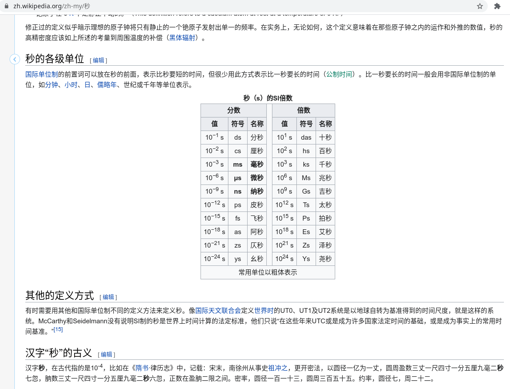{width=400}

估计是由于骇客人为篡改数据，导致**总汇二零一六年结论**和**总汇二零一七年结论**显示误差完全一样，*四个小数位*的汇价的预测误差，有可能计算出*十五个小数位*（倘若以秒计，飞秒（fs））误差值一模一样吗？上几周骇客频频入侵电子仪器`频率=12`的数据，骇客人为篡改为多一个观测值汇价。

然而**总汇结论（从二零一六年至二零一八年七月七日）**和**总汇二零一八年上半年结论**可以证实将再循环数据量参数设置为`频率 = 1`（**百分之一个时辰一周期（一分钟循环千皕次）**）误差最小、最为精准<span style='color:white; background-color:#DE5D83;'>**最优计数尤物**</span>。为了节省科研时间，它日只需要使用半年汇价数据而非三年半数据。

## 季节性数据建模`ts()`、`xts()`、`zoo()`、`msts()`

### `auto.arima()`自回归简介

> `ARIMA(p, d, q)`模型中
>
> - `p`是自回归(AR)的项数，用来获取自变量
> - `d`是差分(I)的系数，为了使时间序列平稳
> - `q`是移动平均(MA)的项数，为了使其光滑

*引用：[ARIMA模型中的三个参数(`p`,`d`,`q`)都是什么意思?](http://sofasofa.io/forum_main_post.php?postid=1000324)*

> …ARIMA模型，全称为自回归积分滑动平均模型（Autoregressive Integrated Moving Average Model），是由博克思（Box）和詹金斯（Jenkins）于廿世纪进年代初提出的一种时间序列预测方法。ARIMA模型是指在将非平稳时间序列转化为平稳时间序列过程中，将因变量仅对它的滞后值以及随机误差项的现值和滞后值进行回归所建立的模型。
> 
> *注：时间序列模型适用于做短期预测，即统计序列过去的变化模式还未发生根本性变化…*

*引用：[「简书」ARIMA时间序列模型](https://www.jianshu.com/p/9a05472b0e7d)*

> 给大家分享一篇时间序列ARMA应用的干货文章。
> 
> ARMA可谓是时间序列最为经典常用的预测方法，广泛应有于涉及时间序列的各个领域。ARMA模型自出道以来，出场次数不可胜数。想必大家也都不陌生，常学常新，我们今天不妨再来回顾一遍～。
> 
> ARMA全称Autoregressive moving average model（自回归滑动平均模型），由美国统计学家博克斯（G.E.P.Box）和英国统计学家詹金斯（G.M.Jenkins）在二十世纪七十年代提出，也称B-J方法。
> 
> ARMA模型有三种基本形式：
> 
> - 自回归模型（AR， Auto- regressive）：自回归模型根据历史观测值进行预测。其中，是预测误差，为回归系数。
> 
> - 移动平均模型（MA，Moving Average）：移动平均模型根据历史预测误差进行预测。其中，为前`q`期的随机扰动项，误差项是当前期的随机干扰（零均值白噪声序列），为平滑系数。
> 
> - 混合模型（ARMA，Auto-regressive Moving Average）：混合模型为同时包含AR模型和MA模型。
> 
> 自回归不是多元线性回归
小标题中的多元线性回归这里特指平时常说的带有多个自变量的非时间序列多元线性回归模型。
> 
> - 回归模型：其中，为因变量，为自变量，为待估计的参数，为误差项。
> - 自回归模型：其中，为序列本身前个观测值。
> 
> 回归是一种分析自变量和因变量关系的模型，当因变量和自变量为线性关系时叫线性回归模型，当有多个变量时叫多元线性回归模型。自回归（AR）模型是一种特殊的多元线性回归模型，和平时用的多元线性回归模型略有不同。
> 
> 多元线性回归模型有多个自变量，但时间序列因其特殊性，一个时刻只有一个观测值，在无其他维度数据补充的前提下，没有可辅助预测的自变量，因而只能取其自身延迟`p`个时刻的观测值作为自变量，所以称自回归。
> 
> 自回归使用自身的数据进行预测，序列前后应当有相关性。所以多元线性回归模型预测时并不要求序列平稳，但AR模型则要求序列必须是平稳的。
> 
> AR模型对平稳性要求体现在如下几个方面：
> 
> | 统计量 | 特征       |
> |:------:|:----------:|
> | 均值	 | 常数       |
> | 方差	 | 常数       |
> | ACF	   | 拖尾       |
> | PACF	 | `p`阶截尾  |
> 
> 对于一般的`AR(p)`模型，其ACF的性质以及序列的随机周期，也由其特征根决定。ACF可以是单调衰减、震荡衰 减、正负交替衰减、呈周期震荡衰减。在有复特征根根或者有接近−1的特征根时时间序列呈现出一定的随机周期变化。
> 
> 下面是`AR(2)`模型对 不同取值画出ACF的典型图形，供参考：
> 
> 偏自相关函数`p`阶截尾表明，变量只与前`p`个变量有关，因而也可以借助PACF确定AR模型的阶数`p`…

*引用：[时间序列：ARMA应用指南](https://www.sohu.com/a/525561002_121118999)*

> `ARIMA(p,d,q)`模型中
>
- **p**是自回归(AR)的项数，用来获取自变量
- **d**是差分(I)的系数，为了使时间序列平稳
- **q**是移动平均(MA)的项数，为了使其光滑

*引用：[ARIMA模型中的三个参数`(p, d, q`)都是什么意思?](http://sofasofa.io/forum_main_post.php?postid=1000324)*

> …
> 三、ARIMA模型
> 
> MA模型的计算公式说明了它着重于当前值和过去值之间的差异，用于捕捉时间序列中的变化，而AR模型只是描述了时间序列中和过去观测值的相关性，它没有像MA模型那样可以捕捉随着时间变化而产生的波动。
> 
> AR模型是认同历史和未来是相似的，历史的过去规律一致延续到未来，并继续出现它历史上的特征，不过这个模型则没有很好地表现出历史数据上地突然的意外，产生的噪声较大的数据，也就是说它不能把过去那些突发的意外性所带来的因素考虑在内，并用于预测之中。
> 
> 而MA模型则不同，它固然能够捕捉那些突发的意外因素，这些因素导致了波动的变化，但是它却不能像AR模型那样复制过去历史延申而来的趋势。
> 
> 两者的结合就是为了克服彼此的缺点，从而把预测认为过去历史的特征既会继续反映到未来的预测上，同时过去收到的偶然意外因素，也会为未来带来一定的波动。不过它们结合首先成为了ARMA模型，和ARIMA模型相比，缺少了差分。如果数据是稳定的，那么使用ARMA是简便的，不过现实上也往往显示数据并非稳定的。
> 
> 简单的理解，ARMA告诉的是，未来的玉米价格是如何，仅仅取决于以前的玉米价格和与之相关的误差，但是ARIMA告诉了我，除了同样的因素，还考虑了玉米价格中存在的趋势和季节因素。
> 
> ARIMA的I就是差分过程，将非平稳的序列数据转为平稳序列的数据，从而减少或消除时间序列的趋势和季节性变化。
> 
> 差分的计算就是计算一组数值中相邻数据点的差值，比如一组两个数据，为五和七，那么其差分就是七减五等于二（`7-5 = 2`）了。通过差分过程，序列也因此变得比原来的少了一位，原来有二个序列，数值分别是五和七，现在差分后，只有一个序列，为二。
> 
> 以下是差分的例子，除了经过一次差分外，继续第二次的差分：
> 
> {width=400}
> 
> …在ARIMA模型中，`p, q, d`三个参数是相当重要的，`p`和`q`分别控制ARIMA模型中自回归和移动平均的部分，而`d`则控制输入ARIMA模型的数据被执行的差分的阶数。
> 
> 不同的参数带来的意义不同，也会影响模型的使用。
> 
> 笔者演示这里顺序不太恰当，应该首先看ACF，PACF，看其平稳性等，研究是否适合ARIMA模型和参数选择。后续才是通过ARIMA模型计算预测，特别是某个和几个参数都是`0`的情况，会出现如下情况：
> 
> - 当`d = 0`，没有非稳态数据，因此为ARMA模型
> - 当`d = 0`，`q = 0`，没有移动平均线或稳态数据，只是对过去值的自回归，采用AR模型
> - 当`p = 0`，`d = 0`，没有自回归或稳态数据的移动平均模型，采用MA模型
> 
> 当然，由于ARIMA模型比起指数平滑等方法，更加复杂，因此使用软件处理更适合，避免麻烦地建模和计算，不过要让模型可靠，数据必须可靠，并且必须显示收集数据的时间跨度相对较长，按照一些推荐的说法，数据时间跨度主张在卌期或以上。
> 
> 尽管ARIMA模型在适当的条件和数据可用性下可以高度准确和可靠，但该模型的主要局限性之一是参数`（p、d、q）`需要手动定义；因此，找到最准确的拟合可能是一个漫长的试错过程。
> 
> 同样，该模型高度依赖于历史数据的可靠性和数据的差异。重要的是要确保数据是在很长一段时间内准确收集的，以便模型提供准确的结果和预测。
> 
> 笔者这里只能大致对ARIMA模型作出比较显浅的介绍，更深入的研究和学习，还是需要更多的实践和专业的理论学习。
> 
> 虽然ARIMA模型是强大有效的模型之一，不过还是那句，预测有时并非是越复杂就越好，重要的是通过预测理解相应的因素，并且在计划中更多地可以做出修正…

*引用：[ARIMA模型说明](https://zhuanlan.zhihu.com/p/673234501)*

> 运用SPSS第十九版软件中的相关模块进行数据处理和分析。本研究是以月份为时间单位的研究序列，故选择复合季节模型`[5, 6]`：$ARIMA(p,d,q)(P,D,Q)_s$，参数`p`为非季节性自回归阶数，`d`为一般差分阶数，`q`为非季节性滑动平均阶数；`P`为季节性自回归阶数，`D`为季节差分阶数，`Q`为季节性移动平均阶数，`s`为季节模型的时间单位相应周期（本研究`s = 12`）。

*引用：[北京市昌平区肺结核发病数ARIMA模型预测](http://www.jbjc.org/JBJC/html/article_8538.htm)*

[<span style='color:#DE5D83; background-color:black;'>*Deriv.com*</span> - *Interday High Frequency Trading Models Comparison* <span style='color:RoyalBlue'>*Review (Part II)*</span>](https://rpubs.com/englianhu/742275)中，结论千皕分钟为最优数据量，故此我将数据量设置为(千皕分钟，也就是等于廿个交易小时)，去预测下一分钟交易价格。然而如何灵活设置周期量与周期数、运用循环周期呢？在此尝试回测方能得以证实。

- [<span style='color:white; background-color:LightSlateGrey;'>*第九章 - ARIMA模型*</span> in **预测：方法与实践（第三版）**](https://otexts.com/fpp3cn/arima-cn.html)
- [<span style='color:white; background-color:LightSlateGrey;'>*第九章第九节 - 季节性ARIMA模型*</span> in **预测：方法与实践（第三版）**](https://otexts.com/fpp2/seasonal-arima.html)
- [Seasonality in `auto.arima()` from `forecast` package](https://stackoverflow.com/a/37400899/3806250)
- [「CSDN」学习笔记-数据挖掘（时间序列）-时间序列ARIMA建模](https://blog.csdn.net/weixin_42033491/article/details/108160167)
- [「R鄀语言教程」第七章第卅九节——R鄀时间序列分析](https://www.math.pku.edu.cn/teachers/lidf/docs/Rbook/html/_Rbook/stat-tsa.html)

以下链接尝试比较：

- [「猫城」黄联富（®γσ ξηg 雷欧） / 数据仓库：次元期权（binary.com）#六 *`Error: forecast::Arima()`#九百一十*](https://github.com/englianhu/binary.com-interview-question/issues/6)
- [「猫城」黄联富（®γσ ξηg 雷欧） / 数据仓库：次元期权（binary.com）#八 *在`ts`和`xts`和`matrix`格式上使用`auto.arima`*](https://github.com/englianhu/binary.com-interview-question/issues/8)

### `ts`

**百分之一时辰一周期（一分钟循环千皕次）**

```{r Arima-ts, error=TRUE, eval=FALSE}
# —— eval=FALSE ——
source('函数/季节性自回归自动化.R')
source('函数/整顿数据.R')

时间索引 <- unique(样本二零一八半年$日期)
基准 <- 样本二零一八半年[年份 == 2018]$日期[1]
时间索引 %<>% .[. >= 基准]
迭代基准 <- 样本二零一八半年[日期 %chin% 时间索引]$序列
数据量 <- 1200 #筛选数据中的最后千皕观测值：样本二零一八半年[(.N - (数据量 - 1)):.N]
预测时间单位 <- 1
# 周期建模 <- c('ts', 'xts', 'zoo', 'mts')
周期建模 <- 'ts'
# .差分阶数 <- 0:2
.差分阶数 <- 0
# .季节性差分阶数 <- 0:1
.季节性差分阶数 <- 0
频率 = 1

季节性自回归自动化(
  时间索引 = 时间索引, 样本 = 样本二零一八半年, .差分阶数, 
  .季节性差分阶数, 数据量 = 数据量, 频率 = 频率, 
  周期建模 = 周期建模, 预测时间单位 = 预测时间单位)

# 整顿数据(频率, 文件名 = paste0('季节性自回归自动化_差分阶数', .差分阶数, '_季节性差分阶数', .季节性差分阶数, '_', 周期建模, 数据量), 是否移除文件夹 = '勾')

# 季节性自回归自动化_差分阶数0_季节性差分阶数0_ts1 <- readRDS("/home/englianhu/文档/猫城/binary.com-interview-question-data/诸子百家学府/fx/USDJPY/仓库/季节性自回归自动化_差分阶数0_季节性差分阶数0_ts1.rds")
```

### `xts`

```{r Arima-xts, error=TRUE, eval=FALSE}
# —— eval=FALSE ——
source('函数/季节性自回归自动化.R')
source('函数/整顿数据.R')

时间索引 <- unique(样本二零一八半年$日期)
基准 <- 样本二零一八半年[年份 == 2018]$日期[1]
时间索引 %<>% .[. >= 基准] #length(时间索引) 156
# 时间索引 <- 时间索引[1:52]
# 时间索引 <- 时间索引[53:105]
# 时间索引 <- 时间索引[106:length(时间索引)]
迭代基准 <- 样本二零一八半年[日期 %chin% 时间索引]$序列
数据量 <- 1200 #筛选数据中的最后千皕观测值：样本二零一八半年[(.N - (数据量 - 1)):.N]
预测时间单位 <- 1
# 周期建模 <- c('ts', 'xts', 'zoo', 'mts')
周期建模 <- 'xts'
# .差分阶数 <- 0:2
.差分阶数 <- 0
# .季节性差分阶数 <- 0:1
.季节性差分阶数 <- 0
频率 = 1

季节性自回归自动化(
  时间索引 = 时间索引, 样本 = 样本二零一八半年, .差分阶数, 
  .季节性差分阶数, 数据量 = 数据量, 频率 = 频率, 
  周期建模 = 周期建模, 预测时间单位 = 预测时间单位)

# 整顿数据(频率, 文件名 = paste0(.蜀道仓库, 文件名 = '季节性自回归自动化', 是否移除文件夹 = '叉')) #'勾')

# 季节性自回归自动化_差分阶数0_季节性差分阶数0_xts_数据量1200_频率1 <- readRDS("/home/englianhu/文档/猫城/binary.com-interview-question-data/诸子百家学府/fx/USDJPY/仓库/季节性自回归自动化_差分阶数0_季节性差分阶数0_xts_数据量1200_频率1.rds")

# 季节性自回归自动化_差分阶数0_季节性差分阶数0_zoo1 <- readRDS("/home/englianhu/文档/猫城/binary.com-interview-question-data/诸子百家学府/fx/USDJPY/仓库/季节性自回归自动化_差分阶数0_季节性差分阶数0_zoo1.rds")

# 季节性自回归自动化_差分阶数0_季节性差分阶数0_ts1 <- readRDS("/home/englianhu/文档/猫城/binary.com-interview-question-data/诸子百家学府/fx/USDJPY/仓库/季节性自回归自动化_差分阶数0_季节性差分阶数0_ts1.rds")

# 季节性自回归自动化_差分阶数0_季节性差分阶数0_msts_数据量1200_频率1 <- readRDS("/home/englianhu/文档/猫城/binary.com-interview-question-data/诸子百家学府/fx/USDJPY/仓库/季节性自回归自动化_差分阶数0_季节性差分阶数0_msts_数据量1200_频率1.rds")

# 季节性自回归自动化_差分阶数0_季节性差分阶数0_xts_数据量1200_频率1 <- readRDS("/home/englianhu/文档/猫城/binary.com-interview-question-data/诸子百家学府/fx/USDJPY/仓库/季节性自回归自动化_差分阶数0_季节性差分阶数0_xts_数据量1200_频率1.rds")

# 时间索引乙 <- unique(季节性自回归自动化_差分阶数0_季节性差分阶数0_msts_数据量1200_频率1$年月日时分)[!unique(季节性自回归自动化_差分阶数0_季节性差分阶数0_msts_数据量1200_频率1$年月日时分) %in% unique(季节性自回归自动化_差分阶数0_季节性差分阶数0_xts_数据量1200_频率1$年月日时分)]

# 时间索引 <- 时间索引乙
```

### `zoo`

```{r Arima-zoo, error=TRUE, eval=FALSE}
# —— eval=FALSE ——
source('函数/季节性自回归自动化.R')
source('函数/整顿数据.R')

时间索引 <- unique(样本二零一八半年$日期)
基准 <- 样本二零一八半年[年份 == 2018]$日期[1]
时间索引 %<>% .[. >= 基准]
迭代基准 <- 样本二零一八半年[日期 %chin% 时间索引]$序列
数据量 <- 1200 #筛选数据中的最后千皕观测值：样本二零一八半年[(.N - (数据量 - 1)):.N]
预测时间单位 <- 1
# 周期建模 <- c('ts', 'xts', 'zoo', 'mts')
周期建模 <- 'zoo'
# .差分阶数 <- 0:2
.差分阶数 <- 0
# .季节性差分阶数 <- 0:1
.季节性差分阶数 <- 0
频率 = 1

季节性自回归自动化(
  时间索引 = 时间索引, 样本 = 样本二零一八半年, .差分阶数, 
  .季节性差分阶数, 数据量 = 数据量, 频率 = 频率, 
  周期建模 = 周期建模, 预测时间单位 = 预测时间单位)

# 整顿数据(频率, 文件名 = paste0('季节性自回归自动化_差分阶数', .差分阶数, '_季节性差分阶数', .季节性差分阶数, '_', 周期建模, 数据量), 是否移除文件夹 = '叉')#'勾')

# 季节性自回归自动化_差分阶数0_季节性差分阶数0_zoo1 <- readRDS("/home/englianhu/文档/猫城/binary.com-interview-question-data/诸子百家学府/fx/USDJPY/仓库/季节性自回归自动化_差分阶数0_季节性差分阶数0_zoo1.rds")
```

### `msts`

```{r Arima-msts, error=TRUE, eval=FALSE}
# —— eval=FALSE ——
source('函数/季节性自回归自动化.R')
source('函数/整顿数据.R')

时间索引 <- unique(样本二零一八半年$日期)
基准 <- 样本二零一八半年[年份 == 2018]$日期[1]
时间索引 %<>% .[. >= 基准] #length(时间索引) 156
# 时间索引 <- 时间索引[1:52]
# 时间索引 <- 时间索引[53:105]
# 时间索引 <- 时间索引[106:length(时间索引)]
迭代基准 <- 样本二零一八半年[日期 %chin% 时间索引]$序列
数据量 <- 1200 #筛选数据中的最后千皕观测值：样本二零一八半年[(.N - (数据量 - 1)):.N]
预测时间单位 <- 1
# 周期建模 <- c('ts', 'xts', 'zoo', 'mts')
周期建模 <- 'msts'
# .差分阶数 <- 0:2
.差分阶数 <- 0
# .季节性差分阶数 <- 0:1
.季节性差分阶数 <- 0
频率 = 1

季节性自回归自动化(
  时间索引 = 时间索引, 样本 = 样本二零一八半年, .差分阶数, 
  .季节性差分阶数, 数据量 = 数据量, 频率 = 频率, 
  周期建模 = 周期建模, 预测时间单位 = 预测时间单位)

# 整顿数据(频率, 文件名 = .蜀道仓库, 文件名 = '季节性自回归自动化', 是否移除文件夹 = '叉')#'勾')

# 整顿数据(频率, 文件名 = paste0('季节性自回归自动化_差分阶数', .差分阶数, '_季节性差分阶数', .季节性差分阶数, '_', 周期建模, 数据量), 是否移除文件夹 = '勾')

# 季节性自回归自动化_差分阶数0_季节性差分阶数0_msts_数据量1200_频率1 <- readRDS("/home/englianhu/文档/猫城/binary.com-interview-question-data/诸子百家学府/fx/USDJPY/仓库/季节性自回归自动化_差分阶数0_季节性差分阶数0_msts_数据量1200_频率1.rds")
```

### 季节性数据建模结论

```{r 初步尤物比较, error=TRUE}
# 蜀道
if (!exists('.蜀道')) {
  .蜀道 <- getwd() |> 
    {\(.) str_split(., '/')}() |> 
    {\(.) c('/', .[[1]][2:5])}() |> 
    {\(.) c(., 'binary.com-interview-question-data/')}() |> 
    {\(.) paste(., collapse = '/')}() |> 
    {\(.) substring(., 2)}()
}
if (!exists('.蜀道仓库')) .蜀道仓库 <- paste0(.蜀道, '诸子百家学府/fx/USDJPY/仓库/')

# ts
季节性自回归自动化_差分阶数0_季节性差分阶数0_ts1 <- readRDS(paste0(.蜀道仓库, '季节性自回归自动化_差分阶数0_季节性差分阶数0_ts1.rds'))

# xts
季节性自回归自动化_差分阶数0_季节性差分阶数0_xts_数据量1200_频率1 <- readRDS(paste0(.蜀道仓库, '季节性自回归自动化_差分阶数0_季节性差分阶数0_xts_数据量1200_频率1.rds'))

# zoo
季节性自回归自动化_差分阶数0_季节性差分阶数0_zoo1 <- readRDS(paste0(.蜀道仓库, '季节性自回归自动化_差分阶数0_季节性差分阶数0_zoo1.rds'))

# msts
季节性自回归自动化_差分阶数0_季节性差分阶数0_msts_数据量1200_频率1 <- readRDS(paste0(.蜀道仓库, '季节性自回归自动化_差分阶数0_季节性差分阶数0_msts_数据量1200_频率1.rds'))

# 组合数据
# 自回归综合滑均尤物系列 <- bind_cols(list(季节性自回归自动化_差分阶数0_季节性差分阶数0_ts1, 季节性自回归自动化_差分阶数0_季节性差分阶数0_xts_数据量1200_频率1, 季节性自回归自动化_差分阶数0_季节性差分阶数0_zoo1, 季节性自回归自动化_差分阶数0_季节性差分阶数0_msts_数据量1200_频率1))

# 筛选数据重命名预测价
# 自回归综合滑均尤物系列 <- 自回归综合滑均尤物系列[, c(1:3, 6, 9, 12)]
# setnames(自回归综合滑均尤物系列, old = c('年月日时分…1', '市场价…2', '预测价…3', '预测价…6', '预测价…9', '预测价…12'), new = c('年月日时分', '市场价', 'ts', 'xts', 'zoo', 'msts'))
# 自回归综合滑均尤物系列[, c('ts精准率', 'xts精准率', 'zoo精准率', 'msts精准率') := .(Metrics::accuracy(市场价, ts), Metrics::accuracy(市场价, xts), Metrics::accuracy(市场价, zoo), Metrics::accuracy(市场价, msts))]

(自回归综合滑均尤物系列 <- list(
  unique(
  季节性自回归自动化_差分阶数0_季节性差分阶数0_ts1[, 
                               ':='(自回归尤物 = 'ts', 
    MAE = MLmetrics::MAE(y_true = 市场价, y_pred = 预测价), 
    MAPE = MLmetrics::MAPE(y_true = 市场价, y_pred = 预测价), 
    RMSE = MLmetrics::RMSE(y_true = 市场价, y_pred = 预测价), 
    SMAPE = Metrics::smape(actual = 市场价, predicted = 预测价), 
    MSE = MLmetrics::MSE(y_true = 市场价, y_pred = 预测价), 
    年月日时分 = NULL, 市场价 = NULL, 预测价 = NULL)]), 
  unique(
    季节性自回归自动化_差分阶数0_季节性差分阶数0_xts_数据量1200_频率1[, 
                                             ':='(自回归尤物 = 'xts', 
    MAE = MLmetrics::MAE(y_true = 市场价, y_pred = 预测价), 
    MAPE = MLmetrics::MAPE(y_true = 市场价, y_pred = 预测价), 
    RMSE = MLmetrics::RMSE(y_true = 市场价, y_pred = 预测价), 
    SMAPE = Metrics::smape(actual = 市场价, predicted = 预测价), 
    MSE = MLmetrics::MSE(y_true = 市场价, y_pred = 预测价), 
    年月日时分 = NULL, 市场价 = NULL, 预测价 = NULL)]), 
  unique(
    季节性自回归自动化_差分阶数0_季节性差分阶数0_zoo1[, 
                                  ':='(自回归尤物 = 'zoo', 
    MAE = MLmetrics::MAE(y_true = 市场价, y_pred = 预测价), 
    MAPE = MLmetrics::MAPE(y_true = 市场价, y_pred = 预测价), 
    RMSE = MLmetrics::RMSE(y_true = 市场价, y_pred = 预测价), 
    SMAPE = Metrics::smape(actual = 市场价, predicted = 预测价), 
    MSE = MLmetrics::MSE(y_true = 市场价, y_pred = 预测价), 
    年月日时分 = NULL, 市场价 = NULL, 预测价 = NULL)]), 
  unique(
    季节性自回归自动化_差分阶数0_季节性差分阶数0_msts_数据量1200_频率1[, 
                                              ':='(自回归尤物 = 'msts', 
    MAE = MLmetrics::MAE(y_true = 市场价, y_pred = 预测价), 
    MAPE = MLmetrics::MAPE(y_true = 市场价, y_pred = 预测价), 
    RMSE = MLmetrics::RMSE(y_true = 市场价, y_pred = 预测价), 
    SMAPE = Metrics::smape(actual = 市场价, predicted = 预测价), 
    MSE = MLmetrics::MSE(y_true = 市场价, y_pred = 预测价), 
    年月日时分 = NULL, 市场价 = NULL, 预测价 = NULL)])) |> 
  bind_rows() |> 
  data.frame()) |> 
  dplyr::mutate(自回归尤物 = factor(自回归尤物), 
                '芳名榜（MAE）' = base::rank(MAE, ties.method = 'min'))

## saveRDS(自回归综合滑均尤物系列, file = paste0(.蜀道仓库, '自回归综合滑均尤物系列_ts_xts_zoo_msts.rds'))
rm(季节性自回归自动化_差分阶数0_季节性差分阶数0_ts1, 季节性自回归自动化_差分阶数0_季节性差分阶数0_xts_数据量1200_频率1, 季节性自回归自动化_差分阶数0_季节性差分阶数0_zoo1, 季节性自回归自动化_差分阶数0_季节性差分阶数0_msts_数据量1200_频率1)

rm(日内指数平滑数据二零一八年一月总汇, 日内指数平滑数据二零一八年一月结论, 日内指数平滑数据二零一八年二月总汇, 日内指数平滑数据二零一八年二月结论, 日内指数平滑数据二零一八年三月总汇, 日内指数平滑数据二零一八年三月结论, 日内指数平滑数据二零一八年四月总汇, 日内指数平滑数据二零一八年四月结论, 日内指数平滑数据二零一八年五月总汇, 日内指数平滑数据二零一八年五月结论, 日内指数平滑数据二零一八年六月总汇, 日内指数平滑数据二零一八年六月结论, 日内指数平滑数据二零一八年第一周总汇, 日内指数平滑数据二零一八年第一周结论, 日内指数平滑数据二零一八年第二周总汇, 日内指数平滑数据二零一八年第二周结论, 日内指数平滑数据二零一八年第三周总汇, 日内指数平滑数据二零一八年第三周结论, 日内指数平滑数据二零一八年第四周总汇, 日内指数平滑数据二零一八年第四周结论, 日内指数平滑数据二零一八年一月总汇, 日内指数平滑数据二零一八年一月平滑周计结论, 自回归综合滑均尤物系列)
```

一般上可以顺序根据`MASE`，然后`MAE`，接着`MSE`来评估筹算出来的算卜（预测值）的精准度。以上自回归尤物在没有迭代回测的情况之下只使用平面数据单次筹算，分别比较了`ts`、`xts`、`zoo`、`msts`季节性数据建模后，得到一样的结果，为了节省科研时间，故此先不区分使用那种计数尤物来建立季节性数据。日后使用更高端计数/机数建模再迭代回测时间数据序列。

## 精准度

> …VAR分析中的一个中心问题是找到滞后的阶数，以产生最佳结果。模型比较通常基于信息标准，例如AIC，BIC或HQ。通常，由于是小样本预测，AIC优于其他标准。但是，BIC和HQ在大型样本中效果很好…

*引用：[R语言用向量自回归（VAR）进行经济数据脉冲响应研究分析](http://tecdat.cn/r语言用向量自回归（var）进行经济数据脉冲响应研)*

> …
> 
> `auto.arima()`的函数参数可以对算法进行修正和改进。上述步骤是在默认参数下的过程。
> 
> 默认的步骤中采用了一些近似方法来加速搜索，可以设置参数`approximation=FALSE`不使用这些近似方法，可能会出现由于这些近似方法或逐步变量筛选（stepwise）而无法找到最小`AICc`的情况。如果设置参数`stepwise=FALSE`，会有更多的模型被搜索。所有参数的详细描述请查看帮助文档。
> 
> **选择自己的模型**
> 
> 如果你想自己选择模型，你可以使用R中的`Arima()`函数。R中的`arima()`函数也可以用来拟合ARIMA模型，但是它不适用于常数`c`存在的情况(除非`d=0`)，并且它和`forecast`包中的一些函数不兼容。最后，它的估计模型也不能被用于新数据集（新数据在检测预测准确率时非常有用）。因此我们强烈建议使用`Arima()`而不是`arima()`…

*引用：[第八章第七节 在鄀中建立ARIMA模型](https://otexts.com/fppcn/arima-r.html)*

[赤池信息量准则](#赤池信息量准则)介绍`AIC`、`AICc`和`BIC`来评估计数/机数尤物的精准度，这儿使用`forecast`、`fable`、`fabletools`程序包，该程序包中的`accuracy()`[^21]函数和`report()`函数有使用**平均绝对比例误差（MASE）**来衡量更为精准的计数尤物预测值。至于`stats`、`TSA`并无兼容`forecast`、`fable`、`fabletools`程序包，故此以`MAE`, `MAPE`, `RMSE`, `SMAPE`, `MSE`来评估。

[^21]: 预测：方法与实践（第三版）<br> - [**Forecasting: Principles and Practice (3rd ed)** - *5.8 Evaluating point forecast accuracy*](https://otexts.com/fpp3/accuracy.html)阐明评估预测精准度的计算公式。<br> - [**预测：方法与实践（第三版）** - *第五章第八节 评估预测精度*](https://otexts.com/fpp3/accuracy.html)阐明评估预测精准度的计算公式。<br> - [「CSDN」选择正确的错误度量标准：MAPE与sMAPE的优缺点](https://blog.csdn.net/deephub/article/details/109483129)<br> - [「β站」康雁飞在线视频教程《预测：方法与实践》（第三版）](https://space.bilibili.com/624024421)

- [「经管之家」计数软件与数据分析：如何理解R中给出的ARIMA模型的拟合结果？](https://bbs.pinggu.org/forum.php?mod=viewthread&tid=3236918)
- [**预测：方法与实践（第三版）** - *第五章第八节 评估预测精度*](https://otexts.com/fpp3cn/accuracy-cn.html)
- [**Forecasting: Principle & Practice** - *5.8 Evaluating point forecast accuracy*](https://otexts.com/fpp3/accuracy.html)
- [Regression Model Accuracy Metrics: R-square, AIC, BIC, Cp and more](http://www.sthda.com/english/articles/38-regression-model-validation/158-regression-model-accuracy-metrics-r-square-aic-bic-cp-and-more/#google_vignette)

<br>

# 结论

## 摘要

**大秦赋**<br>
春秋战国《*礼记•经解*》<br>
孔子曰：「君子慎始，差若毫厘，缪以千里。」

> <span style='color:#FFEBCD; background-color:#991B00;'>**《礼记•经解》孔子曰：**</span><span style='color:#DimGrey; background-color:#D52600;'>*「君子慎始，差若毫厘，谬以千里。」*</span>[^22]

*引用：[「快懂百科」《礼记•经解》](https://www.baike.com/wikiid/2225522569881832051)和[第一范文网：差之毫厘，谬以千里的故事](https://www.diyifanwen.com/chengyu/liuziyishangchengyugushi/2010051523105152347092749890.htm)和[「百度百科」春秋时期孔子作品《礼记•经解》](https://baike.baidu.com/item/礼记•经解/2523092)和[「當代中國」差之毫釐，謬以千里](https://www.ourchinastory.com/zh/2962/差之毫釐%20謬以千里)*

[^22]: [HTML Color Codes](https://html-color.codes)

经过**<span style='color:#DE5D83; background-color:black;'>金融衍生</span> - 筛选日内高频量化交易计数尤物**三篇科研论文使用最基本的指数平滑尤物（Exponential Smoothing - ETS）计数|机数尤物，一般上可以顺序根据`MASE`，然后`MAE`，接着`MSE`来评估筹算出来的算卜（预测值）的精准度。以上自回归尤物在没有迭代回测的情况之下只使用平面数据单次筹算，分别比较了`ts`、`xts`、`zoo`、`msts`季节性数据建模后，得到一样的结果，为了节省科研时间，故此先不区分使用那种计数尤物来建立季节性数据。日后使用更高端计数/机数建模再迭代回测时间数据序列。

然后科研的结论就是无论使用多少观测量，筹算并占卜最精准的占卜值的定数就是最小的时间单位。比方说每个观测值的时间单位是一分钟，最精准的占卜值的筹算并占卜下一分钟，若是每个观测值的时间单位是一微秒而筹算并占卜下一微秒的占卜值最精准。至于使用多少观测值来筹算并占卜，也就是观测量就得通过筹算方知。

**赤印度人酋长宗教司甘地/土司乩童世袭制法家刘氏彭城堂乌骨精瑾貹**

{width=400}

{width=400}

{width=400}

{width=400}

{width=400}

{width=400}

{width=400}

> #回教徒爱国就严格遵守回教徒可兰经法家国学论集体自杀而不爱国就集体退位让贤而已 #美国耶稣洋番集体被钉在十字架被晒死
> 回教徒可兰经法家国学论，东南亚巫贼巫婆回教徒尤其是瓜雪巴西不能帮万佛寺土司张佳坤爱国虔诚狂热份子和大象共和国举国公民马航三七零和马航十七自杀式飞往东亚

*引用：[勇于认错的美国洋番回教徒九一一恐怖份子国父华盛顿自杀式伐木都说东亚中国（包括咱们海内外所有华人）不是洋番的敌人，而敌人是东南亚所有巫贼巫婆回教徒包括新加坡首任总统忧索夫殡伊斯骇客回教徒九一一恐怖份子](https://youtu.be/5LL8V2a_xp0)*

> 核武器温馨提示：回教徒可兰经法家洲学论，可兰经回教规定全球所有回教徒世袭制不许判教，学可兰经以外的习俗、文化、宗教、语言、法律、不许叛乱和叛教，歼灭所有丹绒加弄明讯代理商和瓜雪明讯服务中心的世袭制吠陀经兴都教徒员工和世袭制可兰经法家巫贼巫婆回教徒宦官民族员工、瓜雪县回教徒公仆，尤其是瓜雪县回教市政局大厅柜台世袭制可兰经法家巫贼巫婆回教徒宦官民族阿比西·殡地·世袭制可兰经回教刑事法典断肢法。

*引用：[斩首、石刑、截肢…阿富汗“伊斯兰教法”或将重现酷刑](https://www.163.com/dy/article/HM881SKU0511RVG1.html)*

## 前瞻科研

### 道家秦人牧马《商君书》

#### 🌟秦人牧马之《商君书》与《吕氏春秋》

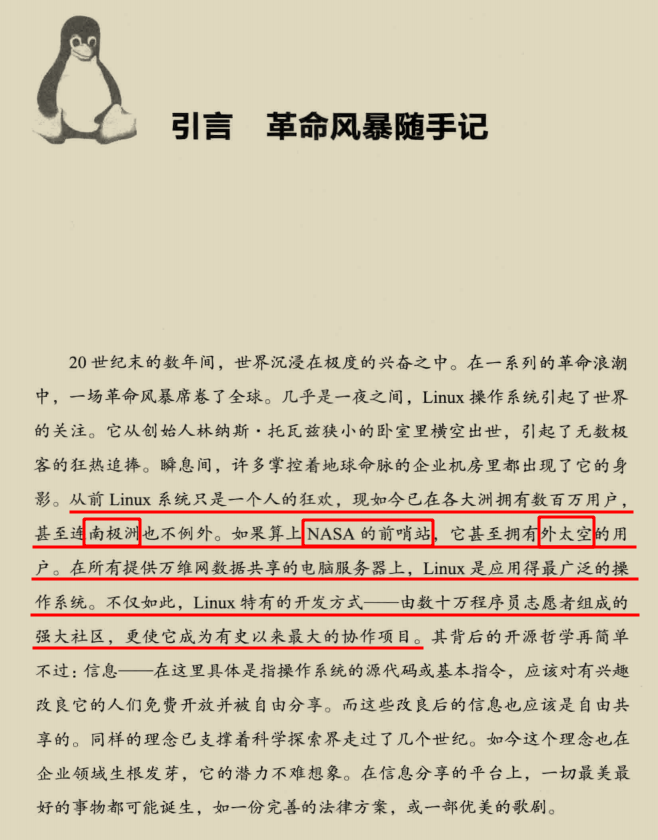{width=400}

{width=400}

{width=400}

**人无远虑，必有近忧**

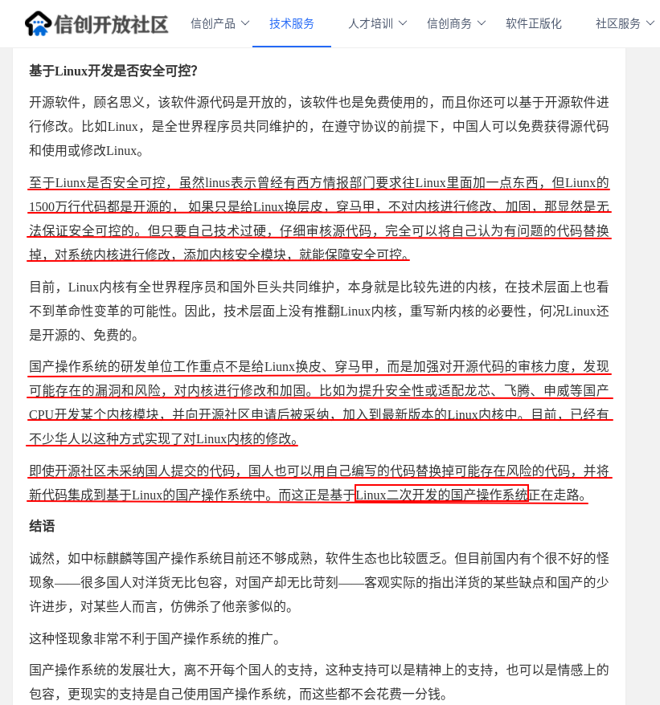{width=400}

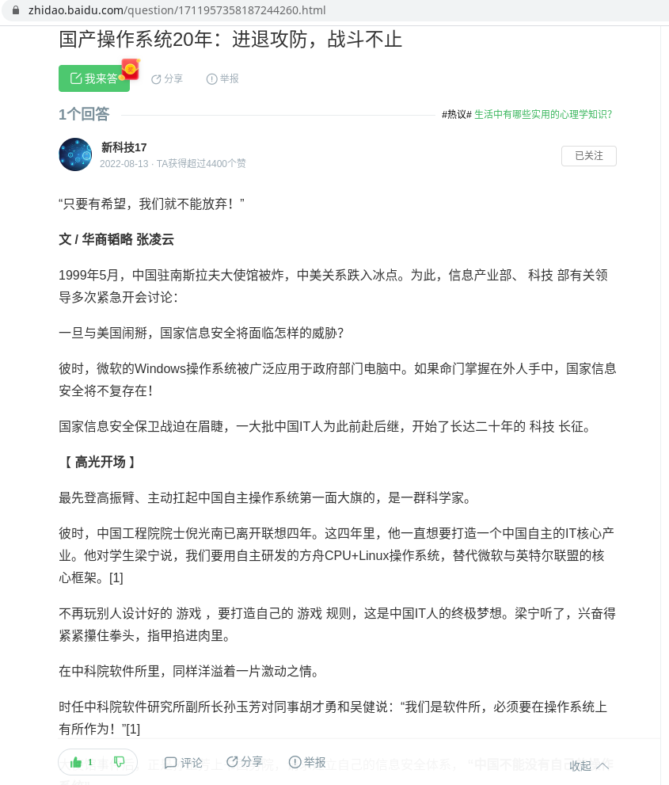{width=400}

可兰经回教刑事法典习俗文化宗教语言断肢法，都是所有世袭制可兰经回教徒累赘民族的性命！

世袭制道教徒赢家黄氏江夏堂：力争上游，不胜则败；功勋超过历代所有三黄五帝，史称「始祖」。
世袭制道教徒杏林林氏西河堂：在天比翼鸟，在地愿做连理枝。

《商君书》和《吕氏春秋》的基本概念是先使用现有资源鄀计数/机数编程语言，因为要研发咱们世袭制道家十二生肖秦人黄河文明/黄埔军校/黄种人🎶/赢家黄氏江夏堂「对数算筹」或「算筹」电子仪器与文言文计数/机数编程「大秦赋」或「世袭制道家文言文大秦赋」操作系统还需要下苦功需要许多时间，再审查并收录鄀计数/机数编程语言软件和软件包和所有礼逆袭软件包。「算卦」或「算卜」是咱们道家民间预测未来或命运的方法，以量化计数/机数轮回（俗称“回测”）、分析并占卜（俗称“预测”）各行各业，尤其是发展咱们杏林业。

- [<span style='color:#DE5D83; background-color:black;'>金融衍生</span> - 筛选日内高频量化交易计数尤物 <span style='color:#4E79A7'>第三部•乙（西周之末：春秋战国——总结平滑指数尤物）</span>](https://englianhu.github.io/民国一百一十三年（甲辰年）/寒月/binary-Q1Inter-HFT-RV3E.html)
- [<span style='color:#DE5D83; background-color:black;'>金融衍生</span> - 筛选日内高频量化交易计数尤物 <span style='color:#4E79A7'>（**「丁」世袭制道教徒赢家黄氏江夏堂十二生肖秦人牧马：🌟儒家秦孝公清君侧之商鞅变法**）</span>](https://englianhu.github.io/民国一百一十三年（甲辰年）/寒月/binary-Q1Inter-HFT-RV4.html)

有关自回归计数|机数尤物相关文献，可查阅：

- [「栈滥」[^23]Forecasting ARIMA with `xreg`](https://stackoverflow.com/a/35637688/3806250)*使用`Arima(xreg=fourier(K=...), ...)`来协调外来因素，找出最优规律。
- [解密复兴科技 - 基于隐蔽马尔科夫模型的时序分析方法](https://github.com/englianhu/binary.com-interview-question/blob/世博量化研究院/图书馆/解密复兴科技%20-%20基于隐蔽马尔科夫模型的时序分析方法.pdf)

欲知更多咱们世袭制道家十二生肖秦人从满洲到星洲世袭制道教徒黄种人辛亥革命/黄河文明/黄埔军校《商君书》、《吕氏春秋》和《李斯篆书》系列科研，请查阅：
- [「猫城」黄联富（®γσ ξηg 雷欧）/🚩🇨🇳🏹红旗礼逆袭](https://github.com/englianhu/RedFlag-Linux)
- [「猫城」黄联富（®γσ ξηg 雷欧）/《始祖永春•秦谏——大秦赋》](https://github.com/englianhu/library)
- [「猫城」黄联富（®γσ ξηg 雷欧）/次元期权（binary.com）](https://github.com/englianhu/binary.com-interview-question)

[^23]: >**文献与案例**<br><br>基本概念<br><br>>- 泛型栈（Stack）<br>>      - 栈是一种后进先出（LIFO, Last In First Out）的数据结构。栈中最后添加的元素最先被移除。可以把栈想象成一叠盘子，最后放上去的盘子最先被拿走。<br>>- 泛型队列（Queue）<br>>      - 队列是一种先进先出（FIFO, First In First Out）的数据结构。队列中第一个添加的元素最先被移除。可以把队列想象成排队买票，最先排队的人最先买到票。<br><br>*出处：[泛型栈（Stack）和泛型队列（Queue）](https://www.loserme.com/archives/2dBCW0Zp)*<br><br>根据以上「泛型栈」诠释为毫无节制、刻舟求剑、海底捞月、治标不治本，可译为「栈滥」最为恰当，借鉴苹果公司一条龙服务产品、孙玉芳教授之名言和愚生目前自修并科研咱们世袭制道教自然对数大秦赋算筹，那些使用它人产品或没有釜底抽薪，一劳永逸的门面功夫。<br><br>- 方案一：栈滥<br>- 方案二：栈涝<br>- 方案三：栈氾<br>- 方案四：栈涔<br><br>*出处：[「猫城」`stackoverflow`该译名啥？#七](https://github.com/scibrokes/owner/issues/7)*

#### 杏林经济学

- 道家易经、天文历法、十二生肖、廿四节气、张灯结彩、七门遁甲算卜物理学隐身术、挥春联与书法八卦刺绣密码学、算卜、兵马俑、三界、道家产品与杏林工业、神经网络、物理学、杏林算卜运筹学、杏林算卜统筹法、洲际军事埋伏四面楚歌。
- 杏林务农、杏林农产品、杏林算卜运筹学、杏林算卜统筹法、杏林算卜金融、算卜保险业与殡仪馆兵马俑旅游业、杏林算卜医学与保健和广告娱乐圈。
- 杏林务农、杏林算卜金融商品市场、算卜、杏林算卜运筹学、杏林算卜统筹法、杏林经济学。
- 奉常、多元种族、宗教与户籍管理。
- 道家杏林服饰经济学：道家服饰刺绣密码学（借鉴纺织品与世界电脑发明史）、中华五千年复古（借鉴孙文/孙中山/孙逸仙靠服饰习俗文化宗教、发型与司法、文字习俗文化宗教语言世纪大革命）复古之道、服饰道家杏林娱乐圈与广告。
- 借鉴苹果、视窗、谷歌、元宇宙、特斯拉、spaceX、推特等美国硅谷传奇和孙玉芳名言：”中国不能没有自己的操作系统。“，研发咱们世袭制道家十二生肖秦人黄河文明/黄埔军校/黄种人🎶/赢家黄氏江夏堂「对数算筹」或「算筹」电子仪器与「大秦赋」或「世袭制道家文言文大秦赋」操作系统。
- 算卜计量经济学、税务与贸易。
- 「奉天承运，皇帝诏曰」春秋战国/东汉末年/清末的MY大汉山马氏政权箫何、韩信和张良（咱们赢家黄氏江夏堂石公之徒，家翁赢政ξηg Tεηg的族人）和厦门大学创办人新籍开国元勋之一陈嘉庾（洋名：Tan Kah Kee），负责以可兰经回教刑事法典断肢法，歼灭巴西不能帮（Kampung Pasir Penampang 中译：沙地刽子手村庄）新村门牌T十五号的土司巫师王乩童佳坤•殡•张，瓜雪RHU（淮西派）花园加德士油站隔壁第三巷门牌卅二号世袭制男肛之耻、头戴白色女假发的巫骨精司法界赤印度人酋长国父宗教司甘地/土司乩童巫师王瑾貹•殡敌•刘（世袭制法家刘氏彭城堂变性男同性恋者奴辱依杀）/蔡氏的世袭制自残自虐自杀的男宠刘瑾貹/世袭制自残自虐自杀的巫师王爱新觉罗•溥仪。
- 咱们世袭制道家十二生肖秦人从满洲到星洲世袭制道教徒黄种人辛亥革命/黄河文明/黄埔军校，功勋超过历代三黄五帝，史称「秦始皇」——赢政 ξηg Tεηg。

](诸子百家考工记/量化投资与机器学习.png){width=400}

{width=400}

> #春秋战国 #诸子百家 #算筹 #十二生肖 #科学数学博弈概率论 #中华复兴运动 #中华五千年习俗文化宗教语言法规 #万般皆下品唯有读书高 #中华国卒 #咱们中华民族和越族世袭制道教徒姓氏堂号烧香祭祖张灯结彩题字春联中医中华庙宇 #公元前只有农历和国际标准中文北京话没有阳历洋番 #全球洋番都是祖籍以色列或住森林山洞的泰山 #世袭制道教徒法家商鞅以商君书奠定一统天下之道 #世袭制道教徒吕不韦以吕氏春秋的务农金融股票商品市场和娱乐圈来一统天下 #世袭制道教徒法家李斯以中华庙宇习俗文化宗教语言法规和各集团组织理事治天下来一统天下 #关雎 #求贤令 #礼贤馆 #秦 #马华公会借鉴越南国旗和欧盟以一颗夜空中最亮的星来立国🌟
> 
> 🚩世袭制道教徒秦国（秦孝公/陈祯禄公爵至始祖赢政）三杰治天下：商鞅（卫人仕秦）、吕不韦（卫人仕秦）、李斯（楚人仕秦）。
一）借鉴王安、斯蒂芬•乔不死和比尔•盖茨研发个人电脑与编程，李斯改变世界治天下。
二）借鉴专业酉逆袭操作系统鄀计数学（R计数学编程）编程软件，商鞅变法，以民族主义数学科学科技学术治天下。
三）借鉴高频量化对冲基金席卷全球，贾人吕不韦之吕氏春秋学术、娱乐圈、地产、农牧、工商金融、博彩业、高频量化对冲基金等治天下。
> 
> 🚩帝道「始祖」：借鉴秦孝公至秦始皇史（借鉴秦人牧马与商鞅变法论，歼灭领土上所有回教徒），以明治维新将西方学术数学科学科技（例如苹果、微软、谷歌、文艺复兴科技、白鲨黑社会、桥水、亚马逊、特斯拉、spaceX、星链）转为咱们中华习俗文化，再自家研发咱们世袭制道教徒中华民族习俗文化宗教语言操作系统与电子仪器，世袭制道教徒法家李斯国学论以学术数学科学科技治天下（研发咱们中系「大秦赋」电脑操作系统与电子仪器以道家习俗文化宗教语言法规、高频量化对冲与大数定律学术、李斯篆书之文言文编程、阅读脑电波，来改变世界格局来一统天下，各民族遵守各自民族习俗文化宗教语言法规，直到歼灭东南亚领土上所有回教徒）、世袭制道教徒商鞅变法（商君书，开阡陌废井田、加上三农政策士农工商，以中药和中医取代天下所有🇲🇻🇨🇭🌙✝️西医。各民族遵守各自民族习俗文化宗教语言法规）、世袭制道教徒吕不韦之吕氏春秋，以中华娱乐圈取代西方娱乐圈、中药和中医取代天下所有🇲🇻🇨🇭🌙✝️西医，与世袭制道教徒马华公会民族主义论，以商治天下，一劳永逸。
> 
> 🚩王道「MY大汉山 - 三国志/朱重八起义/孙文」：借鉴中华民国辛亥革命史，以习俗文化使用西方学术数学科学科技辛亥革命、草船借箭与孔明借东风论歼灭东南亚领土上所有清真教徒，偏于一方成为众诸侯之一。「高筑墙，广积粮，缓称王」后再励志图强。
> 
> 🚩霸道「MY大汉山 - 西楚霸王」：借鉴古巴比伦与犹太人、土司乩童张佳坤和土司乩童白骨精刘瑾貹倆和马来貘、蓄短胡子的清真教徒马来西亚国父东姑阿都拉曼或希特勒（反佛教徒卍的清真教徒敦姑阿杜拉满卐）戊戌变法论，以可兰经清真习俗文化断肢法对待各种族暴政歼灭东南亚领土上所有回教徒治天下，昙花一现。（目前马来西亚举国都插上西亚清真教国的巴勒斯坦国旗天天被轰炸天灾不断，清真教徒政权的亡国之道。咱们祖籍中国的华侨和越族都不要当任何清真教徒的替死鬼）

### 道家秦人崛起

<iframe src="//player.bilibili.com/player.html?bvid=BV1ft4y1779g" scrolling="no" border="0" frameborder="no" framespacing="0" allowfullscreen="true"></iframe>

*引用：[你知道中国十五大国粹都有哪些吗？甚至有些连名字你都叫不上来](https://www.bilibili.com/video/BV1ft4y1779g)*

借鉴世界<ruby>蹴<rp>(</rp><rt>cù</rt><rp>)</rp>鞠<rp>(</rp><rt>jū</rt><rp>)</rp></ruby>联赛，国卒都可以发展为竞技联赛，衍生为博弈数学概率论行业。

- 学术科学科技与兵法（学术界、科技业、网游、借鉴「三国志」「春秋战国」「太阁立志传」治天下）
- 中国象棋（中华习俗文化、学术、广告与娱乐圈）
- 麻将（中华习俗文化、学术、广告与娱乐圈）
- 围棋（中华习俗文化、学术、广告与娱乐圈）
- 中华武术、中华京剧、歌曲与舞蹈（中华习俗文化、学术、广告与娱乐圈）
- 中华寺庙与中药/中医（姓氏堂号、生辰八字卜卦、天文历法、学术概率论物理学、医学保健与保险业、农业与工业、陵墓、道家易经、学术物理学、兵法、广告与娱乐圈）
- 四书五经六艺（琴棋书画、学艺、书艺、阅艺、茶艺、酒艺、武艺、棋艺、歌艺、琴艺、口艺、才艺、演艺、舞艺、花艺、田艺、农艺、工艺、手艺、技艺、图艺、字艺、篆艺、画艺、厨艺、商艺、书法、文艺、公艺、史艺、仕艺、功艺、冶艺、锔艺、诊艺、观艺、道艺、墨艺、易艺、中华习俗文化、学术、广告与娱乐圈）
- 吟诗作对（中华习俗文化、学术、广告与娱乐圈）
- 中华影城（中华复兴革命、道家易经、学术物理学、兵法、广告与娱乐圈）

### 道家秦国文臣三杰

*](诸子百家考工记/秦国文臣三杰.png){width=400}

「大秦赋 - 借鉴黄河文明史」<br>
秦国三杰，拯救亚洲；<br>
歼灭印裔，取代美国。<br>
秦灭六洲，一统天下；<br>
莫忘初衷，方得始终。

- **商鞅**：改变天下学术（包括复古中国算筹）、杏林、保险与司法界，取代天下所有西方文化科学科技医学司法；习俗文化宗教语言杏林务农法律等世纪大革命，一劳永逸。
- **吕不韦**：改变天下学术尤其是高频量化对冲运筹学（包括复古中国算筹）、高频量化对冲、金融与务农中药中医杏林、娱乐圈（包括复古中国古代习俗文化宗教语言）、广告与产品代言；习俗文化宗教语言等世纪大革命，一劳永逸。
- **李斯**：改变天下学术尤其是文学（文言文、古文、中国历史习俗文化宗教语言等），研发咱们中华秦国操作系统、电子仪器、科技软件、科技产品来取代天下所有西方电子产品与习俗文化宗教语言等；以电子仪器与操作系统记载并进化所有习俗文化宗教语言法律等世纪大革命并且直到一统天下，一劳永逸。

```{r 选项设置, echo=FALSE, error=TRUE}
## Set options back to original options
options(warn = 0)
```

<br>

# 附录

## 幕后花絮

### 人无远虑，必有近忧

#### 春秋战国——秦国•内忧

##### 操作系统与程序包

**拯救亚洲人，削蕃外洲人。**

秦灭六洲，一统天下；
莫忘初衷，方得始终。

*引用：[🌟秦人牧马之《商君书》](#🌟秦人牧马之《商君书》)*

- 秦献公
- 秦穆公
- 西戎（西亚）
- 秦孝公
- 国旗/省旗（借鉴缅甸立国国旗以中华民国为标准，十二颗星星和一颗玉蜀黍的概念，欧洲文艺复兴与欧盟以十二颗星星守护神或太阳系原理环绕着，配合咱们道教徒的易经、算卜、道家创始人李耳与千里眼顺风耳和千里传音、天文历法、夜观星象、兵马俑与军用统筹法军事四面埋伏、物理学、大秦赋🌟秦孝公Sir Tan Cheng Lok自然对数进制操作系统、阅读脑电波与穿梭时空、李斯篆书的路线，而咱们以十二时辰——李斯李通古的概念，中间保留海外华人公会🌟最亮的星星而非玉蜀黍）
- 秦国叫China，而咱们世袭制道教徒十二生肖秦人牧马、愚生赢家黄氏江夏堂（包括咱们黄石公，禁止土司乩童巫师王刘瑾貹与张佳坤俩造反）联富亲生爸爸「赢政」（始祖•黄永春（始祖•赢政 ξηg Tεηg））、顾着自己家眷亲属、大秦赋自然对数进制操作系统、🌟秦孝公清君侧之商鞅变法、国歌/省歌的路线，最高权限Root改为秦王。有关秦史请查阅[「抖音百科」秦始皇——赢政](https://www.baike.com/wikiid/7237391048909553699)。
- 国歌/省歌（国歌/省歌的概念是：从蕲年宫之变登基为秦王后，以秦王欲一统天下为主题的国歌/省歌，横扫七大洲五大洋，直到一统天下。）

{width=400}

咱们亚洲被大日本帝国和大英帝国殖民时期受封公爵的陈祯禄（在亚洲和欧洲古代君主制国家，公爵比伯爵和侯爵的官职大，比公爵官职高的只有皇室，也就是日本天皇万岁爷和英国国王。先清君侧，再攻占英国，最后才攻占日本），咱们🌟海外华人公会从日本和英国独立后都是根据中华民国的国民学术路线，秦孝公清君侧之商鞅变法，歼灭所有不遵守各自宗教语言习俗文化的非法民族，尤其是巫贼巫婆非法回教徒！

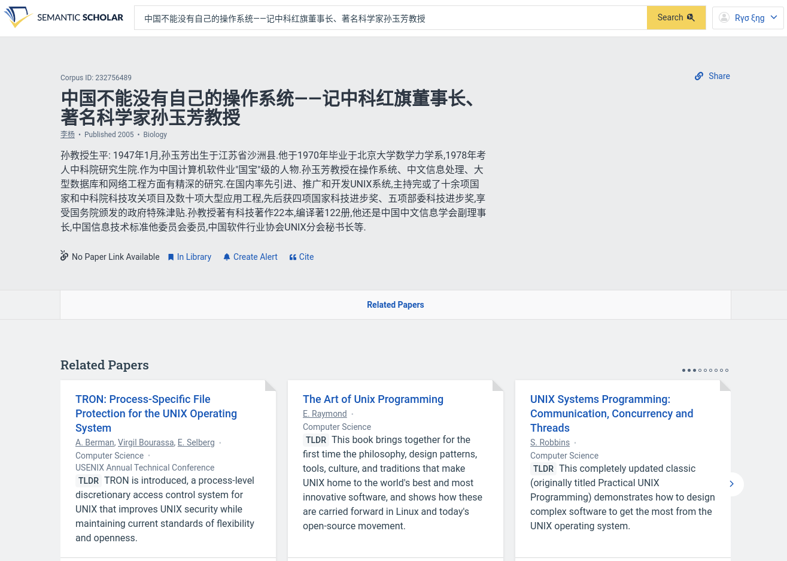{width=400}

目前最迫切的是需要查看礼逆袭操作系统框架，有个类似鄀编程语言`devtools`程序包一样，方便修改和编写操作系统的工具，先翻译再加密现有操作系统并研发咱们赢家黄氏江夏堂「大秦赋」或「文言文大秦赋」操作系统，先查阅以下连接：

- [How to modify an installation ISO and keep it bootable?](https://unix.stackexchange.com/a/635839/128388)
- [ISO Master install isomaster](https://askubuntu.com/questions/46646/how-to-edit-iso-images-including-bootable-isos)
- [Three Ways to Extract and Copy Files from ISO Image in Linux](https://www.tecmint.com/extract-files-from-iso-files-linux)

> {width=400}

*出处：[目前市场尚未研发推出咱们秦人制的科研、编程软件、高端数理计数|机数软件，加油吧！](https://www.facebook.com/xyzhiju/posts/pfbid0f5TYXPq46UwSGJ3yXxpHtVrgoeZtnLSzt6GKfChk7vEuKZC87aGsF28qtEz3GcAfl)*

{width=400}

{width=400}

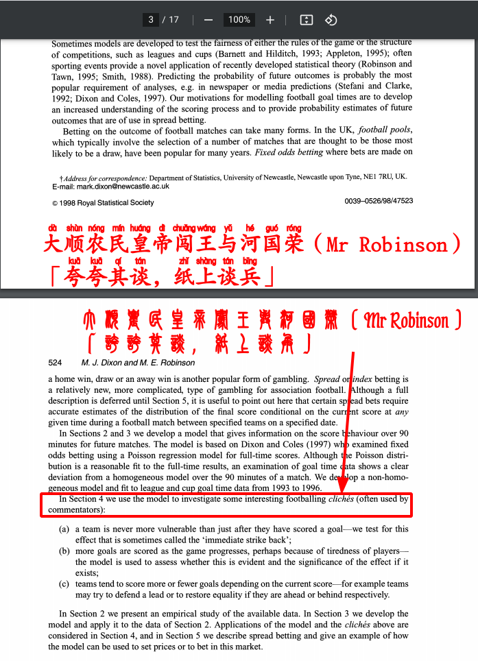{width=400}

<iframe width="400" height="225" src="https://youtube.com/embed/qpH19SxHXJQ" title="倭寇录屏 - 民国一百一十三年二月初五（农历甲辰年丁卯月丁丑日寅时中卅二分十一秒 属龙 周四）" frameborder="0" allow="accelerometer; autoplay; clipboard-write; encrypted-media; gyroscope; picture-in-picture; web-share" referrerpolicy="strict-origin-when-cross-origin" allowfullscreen></iframe>

*出处：[倭寇录屏 - 民国一百一十三年二月初五（农历甲辰年丁卯月丁丑日寅时中卅二分十一）](https://youtu.be/qpH19SxHXJQ)*

<iframe width="400" height="225" src="https://youtube.com/embed/6VMjJ2v9Nv8" title="倭寇录屏 - 民国一百一十三年正月廿五（农历甲辰年丁卯月戊辰日酉时末廿五分卌五秒 属龙 周二" frameborder="0" allow="accelerometer; autoplay; clipboard-write; encrypted-media; gyroscope; picture-in-picture; web-share" referrerpolicy="strict-origin-when-cross-origin" allowfullscreen></iframe>

*出处：[倭寇录屏 - 民国一百一十三年正月廿五（农历甲辰年丁卯月戊辰日酉时末廿五分十一）](https://youtu.be/6VMjJ2v9Nv8)*

<iframe width="400" height="225" src="https://youtube.com/embed/yEICn9RegoU" title="礼逆袭程序设计（第四版）：迈向图像化dialog工具" frameborder="0" allow="accelerometer; autoplay; clipboard-write; encrypted-media; gyroscope; picture-in-picture; web-share" referrerpolicy="strict-origin-when-cross-origin" allowfullscreen></iframe>

*出处：[礼逆袭程序设计（第四版）：迈向图像化dialog工具](https://youtu.be/yEICn9RegoU)*

<iframe width="400" height="225" src="https://youtube.com/embed/z2dzXayf5VI" title="赢家黄氏永春堂 - 大秦赋操作系统概念" frameborder="0" allow="accelerometer; autoplay; clipboard-write; encrypted-media; gyroscope; picture-in-picture; web-share" referrerpolicy="strict-origin-when-cross-origin" allowfullscreen></iframe>

*出处：[赢家黄氏永春堂 - 大秦赋操作系统概念](https://youtu.be/z2dzXayfSVI)*

<iframe width="400" height="225" src="https://youtube.com/embed/hdG8ksSwNII" title="分析购物篮计数|机数尤物 二零零二年五月廿五日晚上八点零二分零九秒" frameborder="0" allow="accelerometer; autoplay; clipboard-write; encrypted-media; gyroscope; picture-in-picture; web-share" referrerpolicy="strict-origin-when-cross-origin" allowfullscreen></iframe>

*出处：[分析购物篮计数|机数尤物](https://youtu.be/hdG8ksSwNII)*

<iframe width="400" height="225" src="https://youtube.com/embed/0ZD11tXBA6w" title="「幕后花絮」DynamicRadioButtons 阳历二零二二年四月廿四日凌晨零点廿五分零六秒" frameborder="0" allow="accelerometer; autoplay; clipboard-write; encrypted-media; gyroscope; picture-in-picture; web-share" referrerpolicy="strict-origin-when-cross-origin" allowfullscreen></iframe>

*出处：[「幕后花絮」DynamicRadioButtons 阳历二零零二年四月廿四日凌晨零点廿五分零六秒](https://youtu.be/0ZD11tXBA6w)*

<iframe width="400" height="225" src="https://youtube.com/embed/DAh10JKs81s" title="「幕后花絮」DynamicRadioButtons 阳历二零二二年四月廿三日晚上十一点五十二分十五秒" frameborder="0" allow="accelerometer; autoplay; clipboard-write; encrypted-media; gyroscope; picture-in-picture; web-share" referrerpolicy="strict-origin-when-cross-origin" allowfullscreen></iframe>

*出处：[「幕后花絮」DynamicRadioButtons 阳历二零二二年四月廿三日晚上十一点五十分](https://youtu.be/D4h10JKs81s)*

<iframe width="400" height="225" src="https://youtube.com/embed/mbo7CIO1vWM" title="Resume (Blooper)：阳历二零二二年四月十一日晚上十一点廿六分四十九秒" frameborder="0" allow="accelerometer; autoplay; clipboard-write; encrypted-media; gyroscope; picture-in-picture; web-share" referrerpolicy="strict-origin-when-cross-origin" allowfullscreen></iframe>

*出处：[Resume (Blooper)：阳历二零二二年四月十一日晚上十一点廿六分四十九秒](https://youtu.be/mbo7CIO1vWM)*

<iframe width="400" height="225" src="https://youtube.com/embed/OrreyVgy3RU" title="Anbox on Linux 🐧 - New Recording : 12-3-2021, 2:14:42 AM" frameborder="0" allow="accelerometer; autoplay; clipboard-write; encrypted-media; gyroscope; picture-in-picture; web-share" referrerpolicy="strict-origin-when-cross-origin" allowfullscreen></iframe>

*出处：[Anbox on Linux 🐧 - New Recording : 12-3-2021, 2:14:42 AM](https://youtu.be/OrreyVgy3RU)*

<iframe width="400" height="225" src="https://youtube.com/embed/3mTI435TCeM" title="Coursera Machine Learning for Trading: 蔡卓宜 - 10/16/2021, 12:32:47 AM" frameborder="0" allow="accelerometer; autoplay; clipboard-write; encrypted-media; gyroscope; picture-in-picture; web-share" referrerpolicy="strict-origin-when-cross-origin" allowfullscreen></iframe>

*出处：[Coursera Machine Learning for Trading: 蔡卓宜 - 10/16/2021, 12:32:47](https://youtu.be/3mTI435TCeM)*

借鉴万物皆有灵和阅读脑电波赢政思想录，所谓的户籍管理中的一项，就是视频中的[人工智障检测《国产凌凌漆》名场面](https://www.bilibili.com/video/BV1Cd4y1R7jT)是可以通过人造卫星以光速来侦测地球上万物一举一动，就能通过量子电脑的计数/机数量化分析来分辨机器人、僵尸、正常人，甚至《魔戒三部曲》中的幽灵军团、兵马俑、幽灵以下有些软件、编程代码与视频，日后得学习：

- [人工智障检测《国产凌凌漆》名场面](https://www.bilibili.com/video/BV1Cd4y1R7jT)中的[「猫城」OW-YOLO（具有区分已知与未知能力的全新检测器）](https://github.com/englianhu/OW-YOLO)初步侦测物体技术。
- [Analyze a Soccer game using Tensorflow Object Detection and OpenCV](https://towardsdatascience.com/analyse-a-soccer-game-using-tensorflow-object-detection-and-opencv-e321c230e8f2)
- [有了人工智能，从此程序员只写注释，不写代码？| 手把手安装自动写代码人工智能——Code Whisperer](https://www.youtube.com/watch?v=TIpRA6iwNus)
- [Ansible vs Puppet vs Chef – 2021 配置管理工具比较](https://www.incredibuild.cn/blog/ansible-vs-puppet-vs-chef-2021-peizhiguanligongjubijiao)
- [「博客园」企业级自动化运维工具——puppet详解](https://www.cnblogs.com/along21/p/10369858.html)
- 咱们世袭制道教徒十二生肖黄种人赢家黄氏江夏堂联富本人与天下所有世袭制道教徒黄种人的宗教与科技产品「大秦赋」操作系统登陆后的界面是个银河系再专注放大到用户所在的互联网协议地址，可借鉴[星图地球](https://online.geovisearth.com/browser)
- [贞节牌坊与轮回](#贞节牌坊与轮回)

##### 电子仪器与硬件

###### 电子仪器

**拯救亚洲人，削蕃外洲人。**

秦灭六洲，一统天下；
莫忘初衷，方得始终。

*引用：[🌟秦人牧马之《商君书》](#🌟秦人牧马之《商君书》)*

> <iframe width="400" height="225" src="https://youtube.com/embed/ruLu6m77iq0" title="算盘怎么变成电脑的？电脑发明历史" frameborder="0" allow="accelerometer; autoplay; clipboard-write; encrypted-media; gyroscope; picture-in-picture; web-share" referrerpolicy="strict-origin-when-cross-origin" allowfullscreen></iframe>
> 
> *出处：[算盘怎么变成电脑的？电脑发明历史](https://youtu.be/ruLu6m77iq0)*
> 
> **算盤更新了幾代變成了電腦? | 電腦發明的故事**
> 
> 二战期间，英国为了破解用于高级陆军通信的德国洛伦兹SZ 卌/卌二机（Enigma），马克斯•纽曼和他的同事们委托弗洛斯制造巨人。从一九四三年二月上旬开始，他花了十一个月的时间设计和建造了第一座巨人（Colossus），九台Mk II Colossus（将Mk I转换为Mk II，总共制造了十台机器）。巨像Mark I包含千五个热电子阀（管），但Mark II带有2,400个阀，比Mark I快五倍，并且操作更简单，大大加快了解码过程。工程师汤米•弗洛斯（Tommy Flowers）和艾伦•图灵（Alan Turing）在概率分析中设计做出了巨大贡献。经过一九四三年十二月的功能测试后，巨人被运送到布莱奇利公园，并于一九四四年一月十八日交付，并于二月五日攻击了它的第一条信息。它是世界上第一台电子数字可编程计算机。
> 
> --------------------------------------------------- 
> 
> 二进制/ 十进制
> 
> ---------------------------------------------------
> 
> 先说二进制，如果问拼音是汉字的什么，那二进制就是电脑的什么，我们学习汉字的时候可以用廿六个字母来拼写所有的汉字，可二进制只有两个字母0和1，他们怎么拼写电脑那么多的内容呢？我们拼音中除了字母的单独使用以外，还有两个三个四个如an，ian，iang组合到一起的使用方法来表示，但是拼音讲究的是可以发出正常的音，但是对于电脑来说，不需要是否发出正常的音节，所以电脑只要知道0表示什么，1表示什么，组合在一起00表示什么或者说0010101…随便只要是这个串号有对应的表示内容就可以了，用0和1可以在电脑程序中标记所有内容这就是二进制。
> 
> 十进制其实不需要讲解的，但是为了有小朋友观看，我们就来说一下，十進制是以10為基礎數字系统，在世界上應用最廣泛的進位制，十进制是这样数：“0、1、2、3、4、5、6、7、8、9…”，然后你再没有符号了！所以，你在左边加个1，然后从 0 重新开始： 10、11、12…因为从0到9是10个数字符号所以是叫十进制，和二进制比较一下就会更理解了，二进制里没有第三个数字，所以你从0开始数，数到1，就没有数字了…数起来是这样，0-01-10-11-100-101-110-以此类推…
> 
> 其实多少进制都可以做，只要大家都遵循这个规定就可以互相交流，比如我们的钟表小时就是十二进制，分钟和秒就是园进制。实际几进制就是数字有几个的意思，怎么样这样大家了解更透了吧。
> 
> 一个离不开发明故事的频道
> 
> --------------------------------------------------- 
> 
> 推薦連接：
> 
> - 乐高的发明故事：[三次大火使"乐高"创造了奇迹，乐高的发明故事](https://youtu.be/YuPXrq3almQ)
> - 世界上第一部电影：[世界上第一部电影，来的太突然了，电影的发明](https://youtu.be/h5LZyUwI-Dc)
> - 世界上第一支股票：[世界上第一支股票，阿姆斯特丹，因欧洲人需要胡椒，股票的发明故事](https://youtu.be/KIMsUgA9gPo)
> - 潜水艇的发明：[九艘早期潜水艇 ，潜水艇发明史](https://youtu.be/79Vat3-YG5I)
> - 高尔夫起源：[高尔夫原来是放羊人发明的？高尔夫为什么十八洞？高尔夫和中国古代有直接关系！](https://youtu.be/a2w9X2voJLA)
> - 避雷针的发明故事：[富兰克林冒着生命，发明了避雷针 ！](https://youtu.be/OPlypQU3ro4)
> - 火车的发明：[火车怎么发明的？先有火车还是铁轨？](https://youtu.be/cD1fTIXl_YU)
> = 世界上第一部电话：[谁是第一个电话的发明者？电话的发明](https://youtu.be/epvqMWDItZc)
> - 世界上第一台电脑：[算盘怎么变成电脑的？电脑发明历史](https://youtu.be/ruLu6m77iq0)
> - 世界上第一台空调：[世界上第一台空调，空调的发明竟然因为一场大雾？](https://youtu.be/mS5mQOxK9vo)
> - 世界上第一台直升机：[第一架直升机的诞生，直升机原来这样飞的？直升机驾驶这么简单](https://youtu.be/fgBa7MoFhbI)
> - 油管創始人是台灣人：[油管创始人，来自台湾的陈士骏](https://youtu.be/LAMVTUOMXrY)
> - 自行车发明故事：[有趣的自行车发明故事…](https://youtu.be/tXQtO4-f6lo)
> - 猫的起源：[视频](https://youtu.be/kZwOs4SFssQ)
> - 世界上第一条牛仔裤：[世界上第一条牛仔裤，牛仔裤的发明故事](https://youtu.be/uT8b4fZuM0U)
> - 世界上第一张照片：[世界上第一张照片，相机的发明故事](https://youtu.be/ktzc5i5ZPws)
> - 錶的發明故事：[钟表的发明历史，世界上最漂亮的手表](https://youtu.be/jOOMQu7Do-0)
> - 火箭的發明由来：[埃隆•马斯飞船发射成功，火箭的发明故事](https://youtu.be/U8Q3Nnul-Ws)
> - 第一次组装电脑：[第一次装机经验分享|AMD 3900XT，显卡RX5700XT，华硕X5…](https://youtu.be/5GL246v64yE)
> - 輪胎的發明故事：[疯啦！！轮胎的发明竟然是兽医。轮胎的发明故事](https://youtu.be/zdNV4516td0)
> - 可口可樂的發明故事：[可口可乐配方，可口可乐的发明故事](https://youtu.be/cSkhDiccvbg)
> - 汽车发明的秘密：[世界上第一台汽车，汽车发明故事](https://youtu.be/kNMF6qm1UF4)

- 借鉴目前的电脑计算机[🎦「pre🆕高颜值🖥️」俺は、お前を買ってるんだぜ!🇭🇰](https://youtube.com/shorts/DFvpqKb2XH0)派热系统，它日研发咱们赢家黄氏江夏堂「大秦赋」/「文言文大秦赋」操作系统和「算筹」/「自然对数算筹」电子仪器。
- [「猫城」黄联富（®γσ ξηg 雷欧）/🚩🔆🏹🌟👊🚀🦔大秦赋：「甘石星经，周髀算经；诸子百家，干支算筹」取代阿拉伯数字和回教徒语言（包括巫术、货币、习俗文化、可兰经断肢法）#十二 *自然对数「干支算筹」与农历天文历法*](https://github.com/englianhu/RedFlag-Linux/issues/12#issuecomment-1676066137)
- [上篇：国产六大中央处理单位技术全对比（附下载）](https://www.modb.pro/db/107396)
- [下篇：国产六大中央处理单位的春秋战国（附下载）](https://www.eet-china.com/mp/a75720.html)
- [「图享」国产六大中央处理单位的春秋战国](https://www.instagram.com/p/CYRDpsdJO2R)
- [「计算机网络发展史」你在网上勇闯天涯时用的网络，是如何发展至今的呢？](https://youtu.be/CjAl6jODHq8)
- [「雎䴘/鴡鷉」openEuler（中译：开源欧拉）](https://gitee.com/openeuler)
- [「雎䴘/鴡鷉」火龙操作系统](https://gitee.com/englianhu/huolongcaozuoxitong)

###### 基本输入输出微型操作系统

> ## 自然对数<s>「干支算筹」</s>「大秦赋算筹」与农历天文历法
> 
> 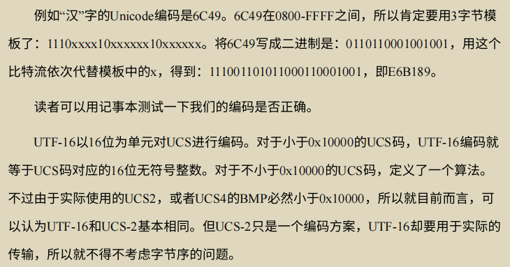
> 
> *出处：[全球讯息：Unicode编码介绍？](http://keji.paoku.com.cn/keji/2022/1024/129547.html)*
> 
> - UTF8的英文字母一个字节而咱们中文三个字节，GB2312中文两个字节，如何提高效率，可以使用单字如`一、十、廿、卅、卌... 圆`，比方说「汉」字，来取代111001101011000110001001、6C49...
> - [🚩🔆🏹🌟👊🚀🦔大秦赋：「甘石星经，周髀算经；诸子百家，干支算筹」取代阿拉伯数字和回教徒语言（包括巫术、货币、习俗文化、可兰经断肢法）#十二](https://github.com/englianhu/RedFlag-Linux/issues/12#issue-1756553140) 列表中的单字在「皕」后就「千」、「万」、「亿」、「兆」、「京」，字典需要多添加单字。
> - [到底几进制最有效率？](https://www.bilibili.com/read/mobile?id=8455211)叙述三进制会比二进制运行得快速而混合进制最接近自然对数最为快速运行计算和[`ln -sf`是永久生效的吗？礼逆袭`ln`的运算法则](https://blog.csdn.net/weixin_31742467/article/details/116971365)和[计算机的二进制是什么意思呀？](http://haokan.baidu.com/v?pd=wisenatural&vid=10816386140636526174)，借鉴对数，比较二进制、圆进制和自然对数的效率与规律，混合进制自对然数的操作系统。干支算盘原意为圆进制概念，目前得改良为自然对数**赢家eng黄氏江夏堂黄埔军校世袭制辛亥革命**（借鉴亲人牧马论：秦献公、秦穆公、秦孝公、陈祯禄公爵Sir/Duke Tan Cheng Lock、Cendol、蜀国国都成都、槟城世袭制法家咸阳城George Town、明帝朱常洛、常洛五号、司马错入蜀/大都督司马懿。天命不可违，ln / log e 愚生eng lian hu黄联富赢家eng黄氏江夏堂黄埔军校世袭制辛亥革命，自然对数从负一至正一）。
> - 三进制对数比二进制对数更佳靠近自然对数，概率论从自然对数的负一（必数）、零、正一（必数），也就是说它日可以尝试科研比隐马尔可夫链的三世书还精准的统计学（和物理学、人类行为学）模型、借鉴长短记忆模型和[#国学知识#公历、阳历、农历、阴历，有什么联系与区别？三分钟帮您彻底搞明白！](https://haokan.baidu.com/v?vid=3936507668336726618)和[什么是阳历、公历、阴历、农历](https://haokan.baidu.com/v?vid=622596821267336944)，咱们农历天文历法计算气候生活作息比沙地阿拉伯数字的阴历☯️和阳历☯️更精准，全球不同地区的白天夜晚时间有长短、自然对数是孤型而非直性模型，也就是每个状态的时间有长短、依照高频量化对冲的投资模式夏普率概念来评估在各别三个状态的时间与状态。包括制作自然对数的电子仪器「大秦赋」操作系统。
> - [自然对数的产生发展](https://www.360doc.cn/article/7131956_716664493.html)
> 
> ## 相关奏折
> 
> - [相同信息利用二进制还是十、十六进制传送比较快？](https://iask.sina.com.cn/b/1H1tTRscXlOt.html)
> - https://github.com/englianhu/RedFlag-Linux/issues/8#issuecomment-1591801318
> - https://github.com/englianhu/ripgrep
> - https://github.com/englianhu/RedFlag-Linux/issues/1#issuecomment-1674725116
> - https://github.com/englianhu/RedFlag-Linux/issues/6
> - [怎么看字符占多少字节?](https://zhidao.baidu.com/question/1184304425926544019.html)
> - [编码简介UTF8、UTF16以及其它编码](https://baijiahao.baidu.com/s?id=1755446836513573431)
> - [GB2312、Unicode编码等](https://www.cnblogs.com/predator-wang/p/4859860.html)
> - [网页设计中UTF-8和GB2312编码](https://blog.csdn.net/weixin_34290352/article/details/89983552)
> - [GB2312、GBK与UTF-8的区别](https://blog.csdn.net/zhengsaisai/article/details/51754620)

*出处：[「猫城」🚩🔆🏹🌟👊🚀🦔大秦赋：「甘石星经，周髀算经；诸子百家，干支算筹」取代阿拉伯数字和回教徒语言（包括巫术、货币、习俗文化、可兰经断肢法）#十二](_Originally posted by @englianhu in https://github.com/englianhu/RedFlag-Linux/issues/12#issuecomment-1676066137_)*

借鉴[「人物传记」秦惠文王的一生——彪悍到不需要解释](http://www.360doc.com/content/20/0620/09/11532035_919501336.shtml)，在「大秦赋算筹」甚至在微型操作系统上的时间，由原本的天下昔日霸主大英帝国格林治标准时间GMT的纬经度，改为咱们世袭制道教徒十二生肖秦人之秦国“北京”或“咸阳”或“洛阳/洛邑”时间为标准。

##### 演员的自我修养

**无师自通，自学成才。**

{width=400}

由于许多人误解“高筑墙、广积量、缓称王”的意思，先偏于一方发展后储存实力再称霸，非在于速度的快慢（每天吃喝拉屎的生活再过一千年还是徒劳）而根据实力进度来占卜扩充的速度（借鉴**棣逊与克尔斯（一九九六）**的大数定律，计数中的抽样与全局论，比方说统筹法）。故此引用咱们赢家黄氏江夏堂的商鞅变法的《商君书》“帝道”、“王道”、“霸道”，从公爵到世袭制道教徒政权始祖，开创两千多年的世袭制道教徒华人政权。

借鉴春秋战国史和目前七大洲五大洋，咱们道家的风水学，从[秦人牧马/卧薪尝胆](#秦人牧马/卧薪尝胆)分享个人从门外汉、摸索、四处碰壁、购买一些计数/机数软件、自修计数/机数建模编程的窍门：

- 一、交流、搜索与收集资源
    - 个人史：愚生加入西施康公司时是个高频量化对冲计数/机数建模的门外汉，然后开始成为类似比尔•盖茨史的一位宅男书虫每天除了自修就是上网和学术份子交流、找资源、阅读、编程、睡觉。
        - 问：在没有任何数学家、教授、举人、名师的人际网络之下，如何自学成才，脱颖而出呢？
        - 答：自修和找名师或贤才交流。
    - 心得：上网搜索与交流、网购或书店购书（一般上教材书、科研论文、学术论坛、一些名师或贤才的网站）
- 二、阅读并筛选资源
    - 个人史：完全没有头绪的情况之下，如何入门？
        - 只有花招却没有深厚内功的情况之下，如何自修呢？
        - 阅读许多相关科研文献与文章后，筛选并开始自修并学习最上层武功秘籍。借鉴[「抖音」《台商的故事》中的黄朝阳](https://v.douyin.com/iYbXps8c)的励志故事，要做就要做世界第一！
        - 报读网课，例如[考试啦！](https://www.coursera.org)。
        - [知乎](https://www.zhihu.com/)、[简书](https://www.jianshu.com/)、[栈滥](https://stackoverflow.com/)、[猫城](https://www.github.com)、[CSDN](https://www.csdn.net/)、[统计之都](http://d.cosx.org/)、[经管之家](https://bbs.pinggu.org/)、[移动终端操作系统社区](https://forum.posit.co/)等。
- 三、了解与学习、实践、回测、校对并检讨才预测。
- 四、根据以上三个学习方式，轮回与进化论。

借鉴教育学家兼儒家孔子、教育学家兼法家荀子、教育学家兼经济学家管子、教育学家兼纵横家鬼谷子等，有关入门算卜、有效的自修学习成为数术家之道相关资源，请查阅：

- [学习能力与进度分类（英）](https://github.com/englianhu/binary.com-interview-question/blob/世博量化研究院/图书馆/学习能力与进度分类（英）.pdf)
- [如何根据科学，过目不忘和耳闻不忘（英）](https://github.com/englianhu/binary.com-interview-question/blob/世博量化研究院/图书馆/学习能力与进度分类（英）.pdf)
- [为非计数家而写的计数|机数（英）](https://github.com/englianhu/binary.com-interview-question/blob/世博量化研究院/图书馆/为非计数家而写的计数%7C机数（英）.pdf)
- [如何成为伟大的管家（英）](https://github.com/englianhu/binary.com-interview-question/blob/世博量化研究院/图书馆/如何成为伟大的管家（英）.pdf)
- [二零二三年网站总汇（英）](https://github.com/englianhu/binary.com-interview-question/blob/世博量化研究院/图书馆/二零二三年网站总汇（英）.pdf)
- [「栈滥」二零二三年网站总汇（英）](https://survey.stackoverflow.co/2023/?fbclid=IwZXh0bgNhZW0CMTAAAR0FuQC5PHTIcEelsf76aEpgWFW7-JEqaiws4_00hj9S4N9LtZg97ks8-hg_aem_ARvrcz62eOmT9xTuo3QJdueEE4o0QOa9_Wc_q-piwlQNs7SqktXvyu84gPF2ozFSYbbzouzKFuV6mW8x-BHIg2Su#section-admired-and-desired-programming-scripting-and-markup-languages)

**拯救亚洲人，削蕃外洲人。**

秦灭六洲，一统天下；
莫忘初衷，方得始终。

*引用：[🌟秦人牧马之《商君书》](#🌟秦人牧马之《商君书》)*

> 原本不晓得该怎么翻译GitHub，就想起二零一九年在阿里彩票工作，有个女商人客户经营宠物店、养了两只猫、有猫舍，就引用之为“猫舍”；然而最近才知道咱们峇东新村明智华校大门前一家角落间（以前Peter Goh故居兼茶室）茶室目前是一位中国籍福州女商人经营茶室，以前在拉曼学院修读电脑科学时课外学习日语的日语班女老师砂捞越祖籍福州王佩佩Peggyさん，就翻译为猫城，当时连续好几个月每天泡拉曼学院图书馆从早待到晚上一直看书自修，有天阅读一本中国史书，其中一章说到鬼谷子和卫鞅仕魏联合六国伐秦不果，就倒戈仕秦伐众，三顾秦公《商君书》落实大秦赋的“商鞅变法”、吴越之争的“孙子兵法”和“卧薪尝胆”历史故事是最铭记于心，其余包括汉史楚汉之争…

*引用：[「猫城」世博量化/Pandoc based Quarto应该翻译成什么？#三](https://github.com/scibrokes/r-world/issues/3#issue-1618233383)*

**人无远虑，必有近忧。**

引用姜太公钓鱼、大数定律和咱们在太阳谷（Sun Velley，在夏朝俗称“阳城”）中企乐发集团旗下阿里公司主管明天（钟余庆）和组长小宋（宋祖）之名言：“咱们需要以现有的资源，将业绩与效率最优化最大化！平时需要检讨为啥别家企业都能做到，而咱们却办不到？大家都使用一样的资源，包括隔壁企业大赢家都是使用一样的资源可以做出业绩，而咱们却办不到？是咱们哪儿做得不够好？需要找出问题的根源！”，目前需要先使用鄀文艺坊/移动终端操作系统并提升红旗礼逆袭操作系统，直到研发咱们赢家黄氏江夏堂「大秦赋」/「文言文大秦赋」操作系统和「算筹」/「自然对数算筹」电子仪器，和美企视窗、苹果、谷歌、礼逆袭分庭抗礼。欲知更多幕后花絮或详情，请查阅：

- [「猫城」黄联富（®γσ ξηg 雷欧）/binary.com-interview-question#三 大秦赋：商鞅变法、辛亥革命、一带一路、计量经济学、孙子兵法](https://github.com/englianhu/library/issues/3)
- [「猫城」世博量化/r-world#一`REmap`百度绘图，点缀全球](https://github.com/scibrokes/r-world/issues/1)
- [「猫城」黄联富（®γσ ξηg 雷欧）/binary.com-interview-question#六 `Error: forecast::Arima()`#九百一十](https://github.com/englianhu/binary.com-interview-question/issues/6)
- [「猫城」黄联富（®γσ ξηg 雷欧）/binary.com-interview-question#八 在`ts`和`xts`和`matrix`格式上使用`auto.arima`](https://github.com/englianhu/binary.com-interview-question/issues/8)
- [「猫城」世博量化/setup-centOS7-DO#二 🚩🇨🇳🏹中科红旗 RedFlag Linux (🍥Debian)](https://github.com/scibrokes/setup-centOS7-DO/issues/2)
- [「猫城」黄联富（®γσ ξηg 雷欧）/中科红旗](https://github.com/englianhu/RedFlag-Linux)
- [「猫城」黄联富（®γσ ξηg 雷欧）/图书馆](https://github.com/englianhu/library)
- [「油管」雷欧 ®γσ ξηg视频总览](https://www.youtube.com/@englianhu/videos)
- [「油管」雷欧 ®γσ ξηg短视频总览](https://www.youtube.com/@englianhu/shorts)
- [「微视」赢家黄氏江夏堂，联富（雷欧）](https://vimeo.com/englianhu)

#### 春秋战国——秦国•外患

##### 秦人牧马

**拯救亚洲人，削蕃外洲人。**

秦灭六洲，一统天下；
莫忘初衷，方得始终。

*引用：[🌟秦人牧马之《商君书》](#🌟秦人牧马之《商君书》)*

![*咱们世袭制道教徒黄种人禁止协助外洲，远^[有多远？是太空]交近^[有多近？是地球]攻。*](诸子百家考工记/秦国远交近攻.png){width=400}

以咱们目前现有的资源，那些巫贼巫婆非法回教徒的创办人叫Onn Jafaar温家法（为啥知道Onn姓温？因为在中四勤班和中五勤班有位同学冷面笑匠同学姓温，英文姓Onn），借鉴美国大葱回教堂白宫变法——伐木歼灭所有美国公民，直到只剩两棵咱们世袭制道教徒的华人树，俗称双木林（杏林林氏西河堂）。

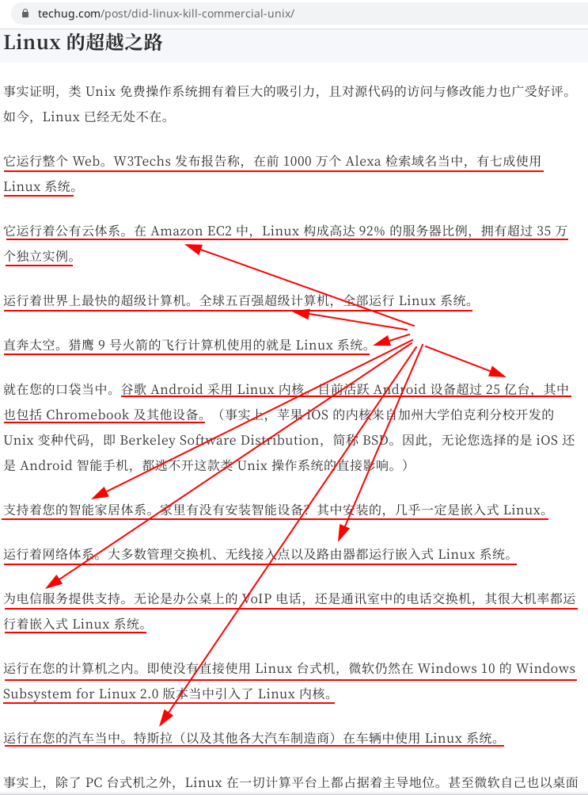{width=400}

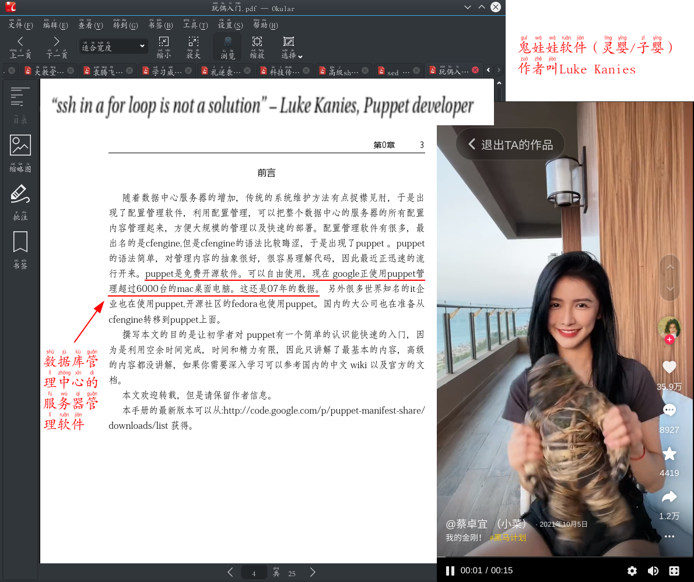{width=400}

借鉴万物皆有灵和阅读脑电波赢政思想录，所谓的户籍管理中的一项，就是视频中的[人工智障检测《国产凌凌漆》名场面](https://www.bilibili.com/video/BV1Cd4y1R7jT)是可以通过人造卫星以光速来侦测地球上万物一举一动，就能通过量子电脑的计数/机数量化分析来分辨机器人、僵尸、正常人，甚至《魔戒三部曲》中的幽灵军团、兵马俑、幽灵。

> 群山诸岳的名称并非本来就有，有些还经过了好些波折呢！也由于马来半岛民族的多样性，连山名的来源也多样性了。
> 
> 　金马仑高原地区未开发前，原本被称呼为中央山脉分水岭(watershed)，原因这里是马来半岛三条最大的河流：彭亨河、吉兰丹河、霹雳河的共同发源地。
> 
> 　大汉山（Gunung Tahan）原名“里来岩”（Batu Relai），一九零六年英殖民地政府首席地质学家施里文若氏（J.B.Scrivenor）偕同鲁滨申登上里来岩，并在高原上进行地质考察，才开始把这片的淡美令系形成岩叫作Gunung Tahan。
> 
> 　哥木峰（Gunung Korbu）曾经三易其名，最初叫Gunung Riam，后来唤为Gunung Kerbau（吉保峰），最后才确定为Gunung Korbu，由于这种历史情况，至今好些中国地理刊物及网络上，都误称马来半岛主干山脉为“吉保山脉”，令人一头雾水。
> 
> 　查玛峰Gunung Chamah，两千一百进一米又名“加难”Gunung Kalang。
> 
> 　金山，奥斐尔山（Mt.Ophir）一名是来源于葡萄牙占领麻六甲时期，而“奥斐尔”
> 
> 　即是葡萄牙语的“黄金”的意思，马来语Gunung Ledang意喻“闪亮亮的山”，从中文“金山”看来，至少在早期金山麓曾经盛产黄金。《旧约圣经》列王记第九章，所罗门王获得黄金的“Ophir”，曾被人附会就是这座金山。实际上，葡萄牙语Ophir可能就是源于《圣经》。（摘自马来西亚南洋网）

*引用：[群山博物：诸岳名称的由来](http://www.chinaqw.com/hwmt/2016/01-28/78419.shtml)*

马来西亚中央山脉最高峰叫大汉山，可查阅[青山绕云海，雨林蕴奇观。马来西亚大汉山国家公园游记](http://my.china-embassy.gov.cn/zt/nycf/200711/t20071109_1769251.htm)。

- [我方的历史 - 马共总书记陈平回忆录](https://github.com/englianhu/library/blob/世博量化研究院/始祖永春•大秦赋（Chinese%20Emperor）/红旗革命（反攻巫贼巫婆、峇峇娘惹和美洲）/我方的历史%20-%20马共总书记陈平回忆录.pdf)
- [听陈平讲马共内奸莱特事件真相（一～三）](http://m.wyzxwk.com/content.php?classid=21&id=306319)

借鉴马共史，马共领导陈平（与中国古代秦汉时期的西楚霸王项羽其下谋臣陈平跳槽投奔汉王刘邦同名）拉拢法籍洋蕃莱特合作反英（估计是陈平学习美国独立战争史法家瓦盛顿联合法籍洋番）抗日，结果陈平滑倒卢让洋番莱特（与研发飞机的科学家莱特兄弟同名）竟然在甲洞上演洋番版《蕲年宫之变》或洋番版《靖难之变》成功围剿咱们中华民族。那些基督耶稣洋蕃的《圣经》习俗文化的阁楼不是禁止使用四楼，禁止基督耶稣洋蕃靖难冒充咱们世袭制道教徒明朝四太子朱棣、禁止冒充回教徒的清朝回教徒皇帝四爷雍正，而是使用三A楼吗？

##### 错误信息

**拯救亚洲人，削蕃外洲人。**

秦灭六洲，一统天下；
莫忘初衷，方得始终。

*引用：[🌟秦人牧马之《商君书》](#🌟秦人牧马之《商君书》)*

**居安思危**

- [外因周期性自回归综合滑均尤物（ARIMAX）](外因周期性自回归综合滑均尤物（ARIMAX）)章节中的[`forecast::Arima()`](#`forecast::Arima()`)，经过[廿四节气](#廿四节气)筹算季节周期后，得知自回归均移尤物最优值的`p, d, q, P, D, Q, s`分别为`0, 1, 4, 0, 0, 0, 0`。
- [平滑周计](#平滑周计)美国洲际犯罪案！
- [马王之争（争取承接🇬🇧英国立博🚩红军百年老店操盘与科研项目）](#马王之争（争取承接🇬🇧英国立博🚩红军百年老店操盘与科研项目）)
- 目前美企[「统计之都」RStudio用户界面中文汉化翻译介绍与使用说明](https://d.cosx.org/d/424852-rstudioyong-hu-jie-mian-zhong-wen-yi-hua-fan-yi-jie-shao-yu-shi-yong-shuo-ming)已类似以前的微软视窗推出中文版，入侵咱们世袭制道教徒黄种人的亚洲市场。

```{r 红宝石编程, eval=FALSE}
output$ryo_kr <- renderUI({
    if (!file.exists('www/ryo-kr.html')) {
      return(tags$div(class = 'Missing-Data-Class',
        HTML('<ruby>건설<rp>(</rp><rt>geonseol</rt><rp>)</rp>중<rp>(</rp><rt>jung</rt><rp>)</rp></ruby> !'))
      )
    }
    includeHTML('www/ryo-kr.html')
  })
```

如何通过运行代码，将打印出来的数据框内容字母上标音，可查阅：

- [「统计之都」使用 Ruby Text](https://d.cosx.org/d/423088-ruby-text)
- [「猫城」Apply Ruby-Text on shiny #3612](https://github.com/rstudio/shiny/issues/3612)

不过通过`data.frame()`或`tibble`相关函数，就无法在字幕上标音。

> 在`/usr/lib/rstudio/resources/app/resources/themes/css`路径下找到了`fonts.css`文件，代码如下：
> 
> …
> …
> 
> 目前只看到只支援英国话和法国话，虽然可以先着手添加咱们的中国话，方便拉低学习高端科技的门槛。目前代码主题并没有中文和咱们中华习俗文化宗教语言，而应用主题设置Sky和Modern并没有任何不一样；何不学习以前谷歌输入法、WPS可以设置应用主题背景甚至框架特色。**虽然可以暂时收录移动终端操作系统（Posit）为咱们中科红旗操作系统的主要量化分析产品，但借鉴中科红旗🚩创办人兼数术家孙玉芳教授考量到安全隐忧，终究是敌洲美国洋番基督耶稣产品而客户是美国航天局。借鉴以前微软视窗禁止将办公软件内嵌到PC（因为那些不会中文也不是咱们世袭制道教徒的巫婆非法回教徒不允许违反千年法家立下的可兰经回教刑事法典断肢法工作、色情、传宗接代），咱们世袭制道教徒以力争上游的精子赢家黄氏江夏堂内嵌到杏林林氏西河堂生蚝的概念编写程序包而非外来软件，方便安装、使用、维护、卸装。**

*引用：[中国北京大学赢家ξng黄氏江夏堂「大秦赋」：目前使用🚩🇨🇳🏹中国国产红旗礼逆袭，并且将REmap鄀编程语言程序包中文化，以下鄀编程语言函数也开始中文化，日后编程都会使用中文编程。#七](https://github.com/englianhu/binary.com-interview-question/issues/7#issuecomment-1588499121)*

> {width=400}
> 
> …
> 
> {width=400}
> 
> 美国基督耶稣产品移动终端操作系统中有个阅读屏幕功能和副驾自动编程，人为的恶意篡改代码（尤其是协助世仇回教徒九一一恐怖份子）是洲际刑事犯罪案兼判教罪！
> 
> <iframe width="400" height="225" src="https://youtube.com/embed/5LL8V2a_xp0" title="「西楚霸王自杀式认罪」母语ABC的西楚大葱回教堂爱国虔诚狂热份子瓦盛顿" frameborder="0" allow="accelerometer; autoplay; clipboard-write; encrypted-media; gyroscope; picture-in-picture; web-share" referrerpolicy="strict-origin-when-cross-origin" allowfullscreen></iframe>
> 
> *出处：[「西楚霸王自杀式认罪」母语ABC的西楚霸王大葱回教堂爱国虔诚狂热份子瓦盛顿](https://youtu.be/5LL8V2a_xp0)*
> 
> **缅怀美国国父甲级战犯老实人瓦盛顿伐木屠杀美国和欧洲公民，勇于认错。如今的美国人已变质（左右逢源，哉赃嫁祸咱们亚洲公民），道德沦亡**
> 
> 世风日下，人心不古；<br>
> 莘莘学子，赤子之心。

*引用：[`forecast::Arima(xreg = XXXX)`咱们道家易经、天文历法、廿四节气、十二时辰、算卜与气象学，孔明借东风与草船借箭出现错误信息#九](https://github.com/englianhu/binary.com-interview-question/issues/9#issuecomment-2041903143)*

## 文书明细

以下乃此文书的文件信息。

- 文集建立日：农历二零二二年十二月廿三 壬寅年（虎年）癸丑月壬申日（阳历二零二三年一月十四日 / 民国一百一十一年十二月廿三）[^24]
- 文集最新更新日：`r today('Asia/Shanghai')`
- `r R.version.string`
- [**rmarkdown**](https://github.com/rstudio/rmarkdown) 程序包版本：`r packageVersion('rmarkdown')`
- 文集版本：一零一
- 文集作者：[®γσ, ξηg Lιαη Ημ](https://rpubs.com/englianhu/ryo-cn)
- 猫城：[源代码](https://github.com/englianhu/binary.com-interview-question)
- 追加附属信息

[^24]: 欲知更多阳历/民国/农历日历详情，请登录中华民国农业部官网查询日历查询[阳历/农历/民国查询](https://ppg.naif.org.tw/naif/MarketInformation/Other/Calendar_V3.aspx)。

```{r 信息, error=TRUE}
suppressAll(lib(c('formattable', 'knitr', 'kableExtra', 'magittr', 'devtools', 'rsconnect')))

系统信息甲 <- session_info()$platform |> 
    unlist() |> 
    {\(.) data.frame(row.names = 1:length(.), 
                     Category = names(.), session_info = .)}()

系统信息乙 <- data.frame(Sys.info()) |> 
    {\(.) data.frame(Category = row.names(.), Sys.info = .[,1])}()

#remarks, dim(系统信息甲), dim(系统信息乙)
if (nrow(系统信息甲) == 11 && nrow(系统信息乙) == 8) {
  系统信息乙 <- 系统信息乙 |> 
    {\(.) rbind(., data.frame(
    Category = c('rmarkdown', 'rsconnect', '当前时间'), 
    Sys.info = c(as.character(getwd()), 
                 as.character(packageVersion('rsconnect')), 
                 paste(as.character(
                   lubridate::now('Asia/Shanghai')), 'CST 中国标准时间 🗺'))))}()
  
} else if (nrow(系统信息甲) == 10 && nrow(系统信息乙) == 8) {
  系统信息甲 <- rbind(系统信息甲, data.frame(Category = '', session_info = ''))
  
  系统信息乙 <- 系统信息乙 |> 
    {\(.) rbind(., data.frame(
    Category = c('rmarkdown', 'rsconnect', '当前时间'), 
    Sys.info = c(as.character(getwd()), 
                 as.character(packageVersion('rsconnect')), 
                 paste(as.character(
                   lubridate::now('Asia/Shanghai')), 'CST 中国标准时间 🗺'))))}()
}

系统信息 <- cbind(系统信息甲, 系统信息乙)
names(系统信息) <- c('分类甲', '访谈信息甲', '分类乙', '访谈信息乙')
系统信息$分类甲 <- c('版本', '操作系统', '系统', '界面', '语言', '核对', 
              '©标准库', '时区', '日期', '®文艺坊版本', 'Pandoc瑞士军刀')
系统信息$分类乙 <- c('系统名称', '发布', '版本', '元素节点', '机器', '登录', 
              '用户', '活跃用户', 'rmarkdown (®降价编译)', 
              'rsconnect (®s联通)', '当前时间')
rm(系统信息甲, 系统信息乙)

系统信息 |> 
  {\(.) 
    kbl(., caption = '附加访谈信息：')}() |> 
  {\(.) 
    kable_styling(
      ., bootstrap_options = c('striped', 'hover', 'condensed', 'responsive'))}() |> 
  {\(.) 
    row_spec(., 0, background = 'DimGrey', color = '#7b1113')}() |> 
  {\(.) 
    column_spec(., 1, background = 'CornflowerBlue', color = 'red')}() |> 
  {\(.) 
    column_spec(., 2, background = 'grey', color = '#8B0000')}() |> 
  {\(.) 
    column_spec(., 3, background = 'CornflowerBlue', color = 'blue')}() |> 
  {\(.) 
    column_spec(., 4, background = 'grey', color = 'white')}() |> 
  {\(.) 
    row_spec(., 11, bold = TRUE, color = 'yellow', background = '#D7261E')}()
```

## 参考文献

- 一、[<span style='color:#DE5D83; background-color:black;'>Deriv.com</span> - Interday High Frequency Trading Models Comparison <span style='color:red'>(Blooper)</span>](https://rpubs.com/englianhu/binary-Q1Inter-HFT)
- 二、[<span style='color:#DE5D83; background-color:black;'>Deriv.com</span> - Interday High Frequency Trading Models Comparison <span style='color:RoyalBlue'>Review (Part I)</span>](https://rpubs.com/englianhu/binary-Q1Inter-HFT-RV1) (发布于RPubs.com)
- 三、[<span style='color:#DE5D83; background-color:black;'>Deriv.com</span> - Interday High Frequency Trading Models Comparison <span style='color:RoyalBlue'>Review (Part I)</span>](https://beta.rstudioconnect.com/content/16240/binary-Q1Inter-HFT-RV1.html) (发布于RStudioConnect.com)
- 四、[binary.com 面试试题 I - GARCH模型中的`ARCH in Mean`](https://rpubs.com/englianhu/binary-Q1-archm)
- 五、[binary.com 面试试题 I - GARCH模型中的`ARIMA(p,d,q)`参数最优化](https://rpubs.com/englianhu/binary-Q1FiGJRGARCH)
- 六、[<span style='color:#DE5D83; background-color:black;'>Deriv.com</span> - 筛选日内高频量化交易计数模型 <span style='color:#4E79A7'>**校阅（第III部）**</span>](https://rpubs.com/englianhu/987834)
- 七、[Forecasting: Principles and Practice](https://otexts.com/fpp3)
- 八、[Tableau 100 Color Palettes](https://public.tableau.com/en-us/gallery/100-color-palettes)
- 九、[PYTHON中的ARIMA模型、SARIMA模型和SARIMAX模型对时间序列预测](http://tecdat.cn/python中的arima模型、sarima模型和sarimax模型对时间序列预测)
- 十、[利用SARIMAX进行销量预测](https://blog.csdn.net/fitzgerald0/article/details/100823231)
- 十一、[时间序列分析模型：ARIMA模型和SARIMAX算法](https://maoli.blog.csdn.net/article/details/113835186)
- 十二、[利用SARIMAX進行銷量預測](https://www.twblogs.net/a/5d7ee484bd9eee5327ffe605)
- 十三、[季節性時間序列分析-SARIMAX模型的python實現](https://www.twblogs.net/a/5d66409dbd9eee541c332577)
- 十四、[SARIMAX:简介](https://runebook.dev/zh-CN/docs/statsmodels/examples/notebooks/generated/statespace_sarimax_stata)
- 十五、[Python数据分析案例-分别使用时间序列ARIMA、SARIMAX模型与Auto ARIMA预测国内汽车月销量_maiyida123的博客-程序员资料](http://www.4k8k.xyz/article/maiyida123/117967762)
- 十六、[预测：方法与实践：第十一章第一节复杂季节性](https://otexts.com/fppcn/complexseasonality.html)
- 十七、[市道轮换下的高频数据参数估计](https://github.com/englianhu/binary.com-interview-question/blob/世博量化研究院/图书馆/参数市场微观结构噪声下高频数据的估计（英）.pdf)
- 十八、[STAT 510 Applied Time Series Analysis : 13.1 Long Memory Models and Fractional Differences](https://online.stat.psu.edu/stat510/lesson/13/13.1)
- 十九、[A Complete Introduction To Time Series Analysis (with R):: Exogenous models](https://medium.com/analytics-vidhya/a-complete-introduction-to-time-series-analysis-with-r-exogenous-models-4f009b770104)
- 廿、[Implementation of Time Series Forecasting Methods (SARIMA, SARIMAX and Prophet)](https://medium.com/@shawanugya12/implementation-of-time-series-forecasting-methods-sarima-sarimax-and-prophet-ff8407b25aaa)
- 廿一、[Time Series Forecasting Techniques using R](https://github.com/rajsiddarth/Time_Series_Forecasting)
- 廿二、[A Guide to Time Series Forecasting in R You Should Know](https://www.simplilearn.com/tutorials/data-science-tutorial/time-series-forecasting-in-r)
- 廿三、[HTML Color Codes](https://html-color.codes)
- 廿四、[**R Markdown: The Definitive Guide** 15.1 Declaring parameters](https://bookdown.org/yihui/rmarkdown/params-declare.html)
- 廿五、[**R Markdown Cookbook** 17.5 Customize the Knit button (*)](https://bookdown.org/yihui/rmarkdown-cookbook/custom-knit.html)

---
[{height=14} Sςιβrοκεrs Trαdιηg®](http://www.scibrokes.com)<br>
[{height=14} 世博量化®](http://www.scibrokes.com)企业知识产权及版权所有，盗版必究。**]{style="color:RoyalBlue"}
