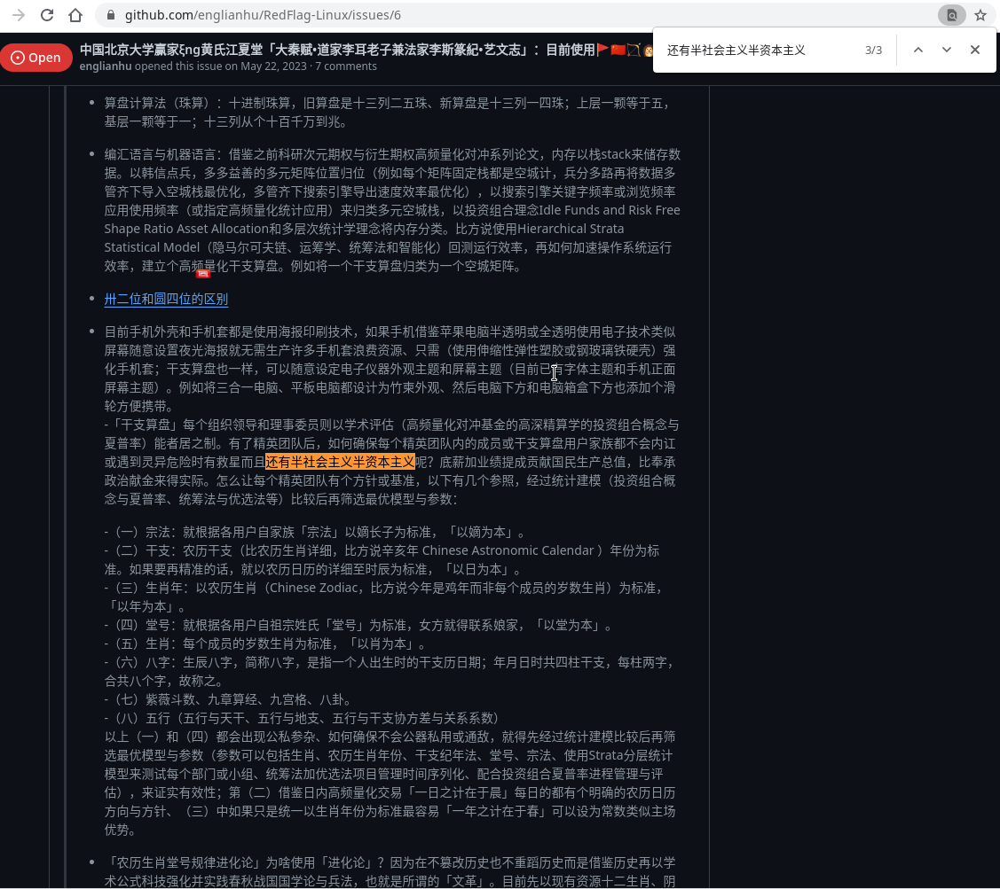
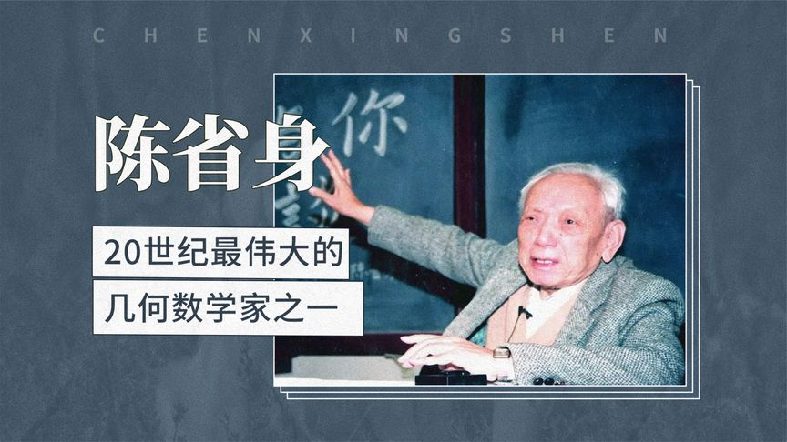
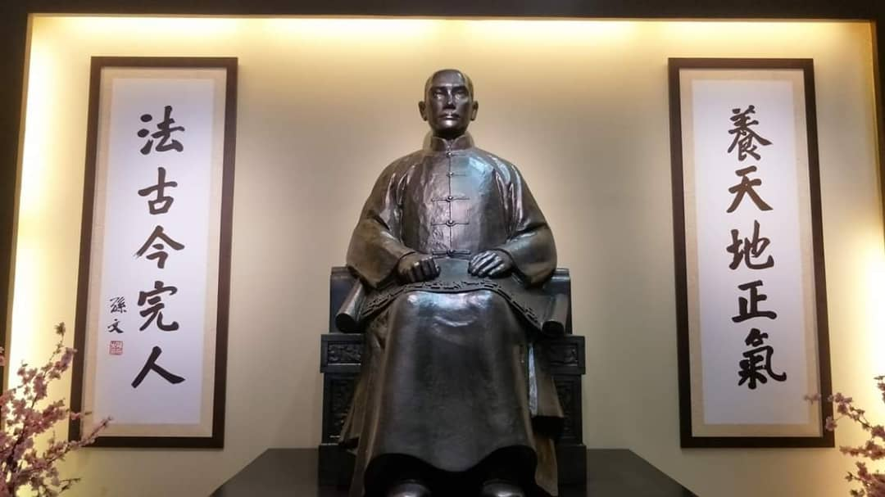
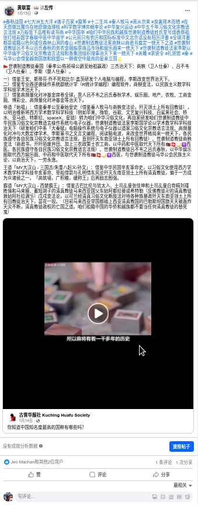

# 主题

## 大秦赋

🚩🇬🇧🇲🇾🇹🇼🇨🇳大秦赋赢家ξng黄氏江夏堂

借鉴世界古文明，公元前春秋战国（七大洲五大洋），西亚非常动荡不安而耶稣都尚未出世，欧美大洋洲全是森林。世袭制道教徒/道家/姓氏与堂号/生辰八字，从鼻祖（赢家黄氏江夏堂 - 嬴政）到耳孙（李耳/太上老君/茅山道士/毛泽东）

岂曰无衣，与子同袍

<br>
<span style='color:#9B111E'>**🚩🦔主题曲🦔🚩**</span>
<br>
<audio controls loop autoplay src="诸子百家诗经与古诗源/卜学亮 - 子曰.mp3" controls></audio>
<br>

> 儒家孔氏东鲁堂、道家卜氏西河堂、杏林林氏西河堂、赢家黄氏江夏堂、赢家黄氏巴东堂、道家与法家李氏陇西堂、商家苏氏阜阳堂

*引用：[牢记祖先，彰显祖宗功德，四百卅三个姓氏堂号大全](https://zhuanlan.zhihu.com/p/82039189)*

- [中国古代亲属称谓家谱总览](https://zhuanlan.zhihu.com/p/458028908)
- [「元宇宙」春节拜年，亲戚怎么叫？](https://www.facebook.com/englianhu/posts/pfbid0cqugyMqSdk1DBwzB8XiawCCz8bRXf5mZktm1Wr2WKs1ozj1D84FpB9RYXuCrmzDTl)
- [「百度」我怎么称呼我堂叔的儿子啊？ 他比我小 应该怎么称呼？ 叫堂弟吗？ 可是堂叔的儿子已经不是堂了啊？](https://zhidao.baidu.com/question/291505101/answer/3012972358.html)
- [「范本模板」古代称谓大全](https://wenku.baidu.com/view/8a3d6c3ca3c7aa00b52acfc789eb172dec639967.html?_wkts_=1709365939475&bdQuery=%E6%A8%A1%E6%9D%BF%E5%8F%A4%E7%A7%B0)
- [古代尊称荟萃](https://wenku.baidu.com/view/2324997758fafab069dc0256.html?_wkts_=1709527487300&bdQuery=%E6%98%A5%E7%A7%8B%E6%88%98%E5%9B%BD%E8%AE%BA%E6%96%87%E7%A7%B0%E5%91%BC%E5%A4%A7%E5%85%A8)

> 阳历二零四年十一月廿一日，全球第一所孔子学院正式在韩国首都首尔挂牌成立。截至阳历二零二零年七月卅一日，全球已有百圆二国家（地区）设立了五百卌三所孔子学院和千百进个孔子课堂：
> 
- 亚洲卅九国（地区），孔子学院百卅五所、孔子课堂百十五个
- 非洲卌六国，孔子学院圆一所、孔子课堂卌八个
- 欧洲卌三国（地区），孔子学院百枯九所、孔子课堂三百卌六个
- 美洲廿七国，孔子学院百卅八所、孔子课堂五百圆个
- 大洋洲七国，孔子学院廿所、孔子课百零一个
>
阳历二零一八年开始，美国有几家大专院校相继关闭中国政府资助的孔子学院，最新一间是美国北佛罗里达大学，校方认为孔子学院的教学与大学理念不相符，决定终止合作...

*引用：[「维基百科」孔子学院列表](https://zh.wikipedia.org/wiki/%E5%AD%94%E5%AD%90%E5%AD%A6%E9%99%A2%E5%88%97%E8%A1%A8)*



*引用：[「猫城」中国北京大学赢家ξng黄氏江夏堂「大秦赋•道家李耳老子兼法家李斯篆紀•艺文志」：目前使用🚩🇨🇳🏹🦔中国国产红旗礼逆袭，编程都会使用咱们母语华语、字体、字幕加汉语拼音。](https://github.com/englianhu/RedFlag-Linux/issues/6#issuecomment-1722247674)*

<iframe width="400" height="225" src="https://player.bilibili.com/player.html?aid=757957931" title="天下(电视剧《大秦赋》主题曲完整版)" frameborder="0" allow="accelerometer; autoplay; clipboard-write; encrypted-media; gyroscope; picture-in-picture" border="0" framespacing="0" allowfullscreen="true"></iframe>

*出处：*[**天下***(电视剧《大秦赋》主题曲完整版)*](https://player.bilibili.com/player.html?aid=757957931)

## 古诗

最近几年民不聊生，借鉴俄乌战争；歼灭东南亚所有回教徒，建立六四学术中华政府。

🚩🦔Great Britain = 大英帝国<br>
🚩🦔Greater Chin / Republic of China / Republic People of China = 大秦帝国/大秦赋<br>
🚩🦔Greater Chinese = 大秦子民（爱民如子）<br>
🚩🦔Oversea Greater Chinese = 海外大秦子民（爱民如子）<br>
🚩🦔Oversea Greater Chinese Union = 海外大秦子民公会（秦始皇的秦太祖 ----- 🌟秦孝公/🌟陈祯禄公爵，联合秦始皇 ----- 秦始祖嬴政，爱民如子，商鞅变法断肢法铲除咱们巫裔回教徒九一一恐怖份子Judi回教博彩庄，终止巫术以任何形式、包括指鹿为马、屠杀人类，甚至铲除全球回教徒攻陷回教宗祖国麦家🕋🇹🇷🇸🇦瓦解全球回教，拯救全球）

🚩🇬🇧🇲🇾🇹🇼🇨🇳🌟🐯秦孝公 | 🇬🇧🇲🇾🇹🇼🇨🇳🌟🐯姜太公 --- 🇬🇧🇲🇾🇹🇼🇨🇳🌟陈祯禄公爵/🇬🇧🇲🇾🇹🇼🇨🇳🐯邱德拔公爵/🇬🇧🇲🇾🇹🇼🇨🇳🍁叶亚来队长/🇬🇧🇲🇾🇹🇼🇨🇳🍁叶观盛队长

🚩🦔《大秦赋》<br>
🚩🦔巫师治国，禍殃全球；<br>
🚩🦔巫裔尽弃，瓦釜雷鸣。<br>
🚩🦔商鞅变法，铲除巫裔；<br>
🚩🦔车裂刘瑾，中华执政。<br>
🚩🦔一带一路，横跨七洲；<br>
🚩🦔史无前例，一统天下。<br>
🚩🦔高频量化，对冲基金；<br>
🚩🦔只争朝夕，不负韶华。<br>
🚩🦔学海无涯，唯勤是岸；<br>
🚩🦔莫忘初衷，方得始终。

《大秦赋》<br>
🚩大秦孝公，秦惠文王；<br>
🚩始于商鞅，终于辛亥。<br>
🚩巫裔尽弃，瓦釜雷鸣；<br>
🚩铲除巫裔，终止屠杀。<br>
🚩中科红旗，同舟共济；<br>
🚩千古一帝，傲视全球。<br>
🚩一带一路，史无前例；<br>
🚩横跨七洲，一统天下。<br>
🚩学海无涯，唯秦是岸；<br>
🚩莫忘初衷，方得始终。

> 
> 
> *出处：[萧萧不吃辣](https://v.douyin.com/iFfeNPoj)*

*引用：[#大奖章基金之路 #RT #ST lim ₓ→ₐ f ) HMM... LSTM...](https://www.instagram.com/p/CNm43grAbVz)*

上图的漂亮妞儿就长得像农历二零零零年到二零零一年中四勤班和中五勤班时期，乘搭韵祯校车的隔壁校私立丹绒学妹国民华校校友**林燕芳**（🚩🇨🇳🔆🏹🌟👊🚀🦔中科红旗孙玉芳教授中正纪念堂殡涓之争，并非庞氏骗局）或赢家黄氏江夏堂家翁道教徒嬴政永春好学的华越混血儿孙女状元黄筱婕（哥哥黄联升和越族阮美美的女儿，赢子婴），行不改名坐不改姓。现实生活中的**林燕芳**都是自强不息、学术优先，喜欢力争上游、前程似锦的咱们世袭制道教徒（歼灭任何回教徒和峇峇娘惹）才子的贤内助而非姓奴黄脸婆。


上图的漂亮妞儿[Celine Sim 沈小姐](https://www.facebook.com/profile.php?id=100002266213636)和[陈瑞](https://www.linkedin.com/in/rui-chen-981042a7/)就长得像农历二零零零年到二零零一年中四勤班和中五勤班时期，乘搭韵祯校车的隔壁校私立丹绒沉鱼落雁，闭月羞花、文静又有气质的校花学姐**神仙姐姐苏丽欣**，行不改名坐不改姓。现实生活中的**苏丽欣**都是自强不息、学术优先，喜欢力争上游、前程似锦的咱们世袭制道教徒（歼灭任何回教徒和峇峇娘惹）才子的贤内助而非姓奴黄脸婆。

> 

*引用：[#大奖章基金之路 #RT #ST lim ₓ→ₐ f ) HMM... LSTM...](https://www.instagram.com/p/CNm43grAbVz)视频与长相似上图女生是我二零零二年在拉曼学院修读电脑科学A专攻数学系时期追求的课外家庭日语班女同学林艳迎改变了我一生。*[^0]

[^0]: 当时迷茫对于未来完全没有一个明确的方向，喜欢和科研基本面觉得洋人的技术面分析太复杂太高深却无奈入学无门，而咱们华人的技术面分析是个诈骗集团的幌子，的对冲基金的我，一心想要靠学术和对冲基金一统天下驾驶车子踩完门油和迎面而来的对冲，如果迎面而来的没有自知之明不闪避一块儿死；而二零零八年加入西施康闲暇时间自修每天通过搜索引擎翻阅廿页搜索结果的论文与文章再阅读与比较，跌跌撞撞、持续摸索、无师自通，终于认识到R鄀编程统计学，当时每天犹如歌曲「成都」一样终于入门高深统计学奈何高深难学资质不高，如同翻白眼的潮汕乩童查安或金毛狮王百思不解如何参透屠龙刀的绝世武功秘籍；至今二零二四年仍每天在烦恼何时才能学成那些高频量化对冲的上层武功和内力，得先从统筹法着手；目前只关心学术作品和科技产品并无任何喜欢的人，莫忘初衷，砥砺前行。

<iframe width="400" height="225" src="https://www.youtube.com/embed/ndCUxQB0kzg" title="YouTube video player" frameborder="0" allow="accelerometer; autoplay; clipboard-write; encrypted-media; gyroscope; picture-in-picture; web-share" allowfullscreen></iframe>

*引用：[抖音」大秦赋 - 时光机器农历二零零二年](https://v.douyin.com/iNwNe2Q6)*

<iframe width="400" height="225" src="https://www.youtube.com/embed/xyR86xcI8Ag?si=hXZMB7qITwjAJ4nU" title="YouTube video player" frameborder="0" allow="accelerometer; autoplay; clipboard-write; encrypted-media; gyroscope; picture-in-picture; web-share" allowfullscreen></iframe>

*引用：[DIOR大穎《Happy Go Lucky》 ft. GoHell Holiday ( Official MV )](https://www.youtube.com/watch?v=xyR86xcI8Ag)*

[「文派」**阳历二零二三年十二月三日**今日是紫云生日](https://englianhu.wordpress.com/2024/02/04/%e3%80%8c%e9%98%b3%e5%8e%86%e4%ba%8c%e9%9b%b6%e4%ba%8c%e4%b8%89%e5%b9%b4%e5%8d%81%e4%ba%8c%e6%9c%88%e4%b8%89%e6%97%a5%e3%80%8d%e4%bb%8a%e6%97%a5%e6%98%af%e7%b4%ab%e4%ba%91%e7%94%9f%e6%97%a5)的文派记事本随笔，二零零二年拉曼学院修读电脑科学A专攻数学系，被课外家庭日语班林艳迎女同学完全看不上我，而在拉曼学院阅读的一本史书中提及「卫鞅游说，商鞅变法；秦灭六国，一统天下」就让我回想起小学吴荣兴中文老师所执教的中国历史和成语典故，改变了我的一生；而二零零八年到西施康工作自修量化对冲与R鄀统计编程（当时全球最高端的开源统计软件R，除了R官网和一些学术网栈溢出并不多，而中文就只有「统计之都」和人大经济论坛或已改名为「经管之家」俩是咱们计量经济学和科学科技数学学术界先锋开拓者，谢益辉是人大 --- 人民大学校友，而谢德才Stephen/Steve是我二零零二年在拉曼学院的好哥儿们，之后二零零三年/二零零四年在老板兼股东每天在峇东新村和适耕庄「高峰电脑」网吧骑机车/电单车每天来往打工月薪六百元马币，当时就感触父母老了我还是一事无成无法给父母安逸的生活，把我每个月挣的六百元月薪统统给父母（黄永春和李仁俩）花不留些零钱给自个儿花，因为自诩身居隆中事业未成而已需要继续力争上游，预见日后飞黄腾达，而二零一九年外号叫汤圆的同事说：“我的钱全部都是属于雷欧的！”，自从二零一七年柬埔寨帮中企工作就开始受到管制、之后二零二零年从克拉克中企辞职回国后也继续处处受到管制和人为的入侵电脑迫害和许多人的人为的选择性性爱嫁祸诋毁陷害促使戾气）。

<iframe width="400" height="225" src="https://www.youtube.com/embed/6GglRaX7Ato?si=Hb4m1mDJvPn_FRSt" title="YouTube video player" frameborder="0" allow="accelerometer; autoplay; clipboard-write; encrypted-media; gyroscope; picture-in-picture; web-share" allowfullscreen></iframe>

*世袭制道家黄氏江夏堂，联富本人目前单身亦无任何色情活动并无任何喜欢的人，只是继续力争上游。*

中国史册：

- [史册号](https://www.shicehao.com)
- [词林](https://www.cilin.org)
- [族谱网](https://www.zupu.cn)
- [历史网](https://www.lishi.net)
- [中国历史研究院网](http://hrc.cass.cn)
- [人物介绍网](https://www.yuelishi.cn)
- [百家有谱](https://www.baijiayoupu.com)
- [历史记](https://www.lishiji.cn)
- [β博雅旅游分享网](http://www.bytravel.cn)
- [博雅人物网](http://ren.bytravel.cn)
- [洞鑑歷史](https://www.99tango.com/library)
- [中国人物传记网](https://www.chinarwzj.com)
- [「百家诸子」中国哲学书电子化计划](https://ctext.org/zhs)
- [當代中國](https://www.ourchinastory.com)
- [第一范文网](https://www.diyifanwen.com)
- [知识贝壳](https://www.zsbeike.com)
- [趣历史](http://www.qulishi.com/renwu/qinshihuang)
- [古诗文网](https://www.gushiwen.cn)
- [5000言](https://5000yan.com)
- [汉典](https://www.zdic.net)
- [学术交流联盟](http://bbs.97fc.com)
- [海词](http://www.cihai123.com)
- [828啦](https://www.828la.com)
- [X-MOL学术平台](https://www.x-mol.com)
- [arXiv](https://arxiv.org)
- [5000言](https://gwgz.5000yan.com)
- [古诗词网](https://www.gushici.net)
- [千篇国学](https://www.qianp.com)
- [国学百科](https://www.guoxuebaike.cn)

> [《万般皆下品，唯有读书高》]{style="color:#3C33FF"}<br>
[习李经济，一带一路；]{style="color:#6883FC"}<br>
[九二共识，量化对冲。]{style="color:#6883FC"}<br>
[鞭策六四，铲除黑帮；]{style="color:#6883FC"}^[尤其是咱们东南亚回教政府施展巫术屠杀六百八十万人类的巫师Judi邪教巫裔宦官博彩庄诸国]<br>
[推广量化，提倡学术。]{style="color:#6883FC"}<br>
[百家争鸣，振兴中华；]{style="color:#6883FC"}<br>
[学海无涯，唯勤是岸。]{style="color:#6883FC"}

- [陕西历史文化名城](http://lishiwenhua.snnu.edu.cn/index.htm)
- [CCER 特供数据系统平台](http://www.ccerdata.cn)
- [一带一路数据库](https://www.ydylcn.com/skwx_ydyl/sublibrary?SiteID=1&ID=8721)
- [中国一带一路网](https://www.yidaiyilu.gov.cn)

> 中科红旗高频量化对冲学术份子，歼灭东南亚所有回教徒尤其是土司乩童回教徒瑾貹·殡·刘。

```
##赢家黄氏江夏堂联富和家眷亲属（包括外祖父道家书法家李福李氏陇西堂和外祖母郑邓）、性格开朗的校花吴紫云（和性格开朗的明星蔡卓宜）和家眷亲属、校花苏丽欣和家眷亲属、林燕芳（和国民女神中药中医系杨雅）和家眷亲属、好学的漂亮妞儿皇朝酒店唐宫郭子瑜（和明星肖黎希）和家眷亲属、莘莘学子、国民女神明星邱紫庭和邱爱晨俩、黄埔军校兵马俑世袭制学术份子高频量化对冲中科红旗辛亥革命

##歼灭瓜雪巴西不能帮新村门牌T十五号世袭制自残自虐自杀的失心疯猥亵淫魔土司乩童张佳坤、瓜雪RHU（淮西派）花园加德士油站隔壁第三巷门牌卅二号世袭制自残自虐自杀的失心疯猥亵淫魔土司乩童刘瑾貹/魔戒小丑咕噜/宗教司甘地、瓜雪回教警署巫贼巫婆回教徒黑米哈山殡刘、大港巴列特花园第十三巷门牌廿七廿九卅一号世袭制自残自虐自杀的失心疯猥亵淫魔土司乩童，点缀全球。 
nameserver 114.114.114.114
```




省吃俭用的工匠建筑工人（嬴政兼鲁班兼蒙毅）家翁嬴政ξηg Tεηg（赢家黄氏江夏堂）




<iframe width="400" height="225" src="https://www.youtube.com/embed/8TO58UU6iBM?si=gv_w3cosYEnQLFT3" title="YouTube video player" frameborder="0" allow="accelerometer; autoplay; clipboard-write; encrypted-media; gyroscope; picture-in-picture; web-share" allowfullscreen></iframe>

十二生肖（秦人牧马和燕从京来论），从满洲到星洲、从鼻祖到耳孙，世间再无富不过三代的败家子祖父黄实田（曾祖黄福全在清末光绪年间和两个哥哥仨飘洋过海从满洲到星洲自力更生努力奋斗开垦一百亩农地，然后和土木工程的杨清廉俩在清末鸦片战争时期是瓜雪两大不相伯仲的首富）祖母颜为，省吃俭用的外祖父书法家李福（李斯篆书）外祖母郑邓（家道中落的富家千金）。

<br>

# 设定

## SCSS 设置

<style>
pre {
  overflow-x: auto;
}
pre code {
  word-wrap: normal;
  white-space: pre;
}
.table-hover > tbody > tr:hover { 
  background-color: #8D918D;
}
</style>

```{r 读取SASS, class.source='bg-success', class.output='bg-primary'}
##
## 中科红旗（百家争鸣，文艺复兴）
## Oversea Greater Chinese Union 大秦子民公会（秦孝公 / 姜太公 --- 陈祯禄公爵）
## 史无前例，一统天下
##
##
##
## 中科红旗
## 全球NonMuslim中华民族，支持中共称霸天下战略。
## Great Britain 大英帝国
## Greater Chin 大秦赋
## Republic of Chin / Republic People of Chin 大秦赋（中华民国 / 中华人民共和国）
## Greater Chinese 大秦子民（爱民如子）
## Oversea Greater Chinese 大秦子民（爱民如子）
## Oversea Greater Chinese Union 大秦子民公会（秦孝公 / 姜太公 --- 陈祯禄公爵）
## 史无前例，一统天下
##
## Great Britain = 大布列颠帝国/大英帝国1
## Greater Chin = 大秦赋
## Greater Chinese = 大秦子民（爱子如民）
##
## NonMuslim马来西亚籍（海外NonMuslim中华民族，自从清末民初下南洋，咱们马来西亚陈祯禄创办 Oversea Chinese Union）秦始皇黄氏江夏堂，笑傲江湖最大文明贡献
##
## 1）借鉴以前大英帝国东印度公司，有生之年就把一带一路高铁所经过的国家领土，一律得攻占下来（要比以前大英帝国/大蒙古帝国还要强大）称霸天下，世代延续直至史无前例，一统天下。
## 2）一带一路所有告示牌、必须使用中文和拼音。
## 3）借鉴大蒙古帝国骑兵所到之处寸草不生，所有被中国攻占下来的领土，所经之地（包括城市/市镇/乡村），一带一路所有高铁站，都建立国民登记局可以申请入籍中国。
## 4）川普已经发言多次，美国兵变，会再次内战（借鉴越王勾践，中越不内讧，善用马来西亚回教徒太监不造反牵制美国，军售中东/西亚/东欧回教诸国）
## 5）中东回教国回教徒九一一恐怖份子与美国开战，中国军售中东西亚/东欧/非洲回教国（借鉴越王勾践NonMuslim中华民族与美国洋人Democrats阖闾政府，中越不内讧，善用马来西亚回教徒太监不造反牵制美国，军售中东/西亚/东欧回教诸国）
## 6）中国目前高铁除了尚未与马来西亚达成协议开工建立高铁但是已经借鉴王翦只围不攻战略，把东南亚国家都温馨说服并建立高铁，中国先不与马来西亚开战，让马来西亚兵变内战（借鉴越王勾践NonMuslim中华民族与美国洋人Democrats阖闾政府，中越不内讧，善用马来西亚回教徒太监不造反牵制美国，军售中东/西亚/东欧回教诸国）
## 7）南太平洋战略：中国和东南亚已经签署合约，达成协议不使用空军、核武器，出动海陆军攻占东南亚
## 8）商鞅变法多多益善战略：最大贡献是全球十六亿回教徒太监民族与全球基督洋人鹬蚌相争... 回教徒默罕默德创办回教，建立可兰经回教刑事法典断肢法规定回教徒伪太监民族必须虔诚戴乌纱帽一天祈祷五次，倘若不虔诚施展巫术屠杀是触犯断肢法而虔诚屠杀也触犯断肢法，只有辛亥革命铲除全球回教徒、断肢法处死或宫刑全球回教徒绝子绝孙，多管齐下才能终止巫术屠杀，拯救全球16亿回教徒还俗。China大秦赋秦孝公至顾自己家族禁止七步诗自相残杀，铲除分一杯羹白骨精刘家彭城堂造反，回教徒会巫术屠杀人类，回教徒太监民族只能屠杀欧美洋人并且被断肢处死，不效忠中共称霸天下，直至一统天下的伪满洲国马来西亚1700万个回教徒九一一恐怖份子太监民族包括Michael Cutter Christopher，一律断肢法处死（借鉴越王勾践NonMuslim中华民族与美国洋人Democrats阖闾政府，中越不内讧，善用秦二世胡亥、辛亥革命、越王胡志明、中国胡景涛、马来西亚回教徒太监不反中共牵制美国，军售中东/西亚/东欧回教诸国对抗美国）。秦始皇在统一七国后就不思进取导致赵高李斯谋反（借鉴中国历史秦始皇，水能载舟亦能覆舟，宗教巫术，古惑民心，指鹿为马，成也赵李，败也赵李。所以秦始皇得铭记当初秦孝公，不能昏庸被回教徒篡位），中国借鉴秦孝公战略善用商朝和苏联俄罗斯叶利钦。秦始皇铭记秦孝公，善用全球回教徒古惑全球洋人再依照可兰经回教刑事法典断肢全球回教徒，让咱们全球NonMuslim中华民族支持中共，一统天下。
## 9）华尔街、史无前例的万里长城Great Wall Sreet、一带一路高铁：计量经济学、学术治国、编程、统计、科学科技、量化（Fisher姜太公钓鱼大数据，各行各业购物喜好、民意、生活习惯、各国各集团、军事、诊断上市公司等）、金融、贸易、经商、军事、发展各行各业。
## 10）中文编程语言：借鉴日本自从唐朝大话革新学习中文至明治维新学习欧洲，日本是全球首个亚洲人自创Ruby红宝石编程语言（Ruby Text可以标音），自从2008年就开始使用R语言并且认识中国R语言论坛《统计之都》论坛创办人网友谢益辉和赵坚毅创办的中国最大计量经济学专业论坛《经管之家》至今十年有余、目前已经开始以中文编程，中华人民共和国的国庆日1001和中华民国的国庆日1010都是二进制的电脑语言binary code，如同黄埔军校国共本是一家，赢家黄氏江夏堂秦孝公禁止《七步诗》自相残杀。咱们东南亚NonMuslim中华民族几乎都是国民华校生，洋人研发电脑、许多编程语言R语言、C语言、C++，推广与发展中文，希望它日有咱们NonMuslim中华民族自创新的编程语言，均以中文编程。
## 11）发展台式电脑操作系统：中科红旗是由中国北京大学校友孙玉芳创办将Linux礼逆袭和南非原住民开发的Kubuntu忽奔兔中文化并推出自家产品，在美国微软视窗Win台式电脑操作系统垄断全球十多二十年有余，目前已经开始使用芬兰研发的Linux礼逆袭、中国中科红旗台式电脑操作系统，推广与发展中科红旗。
##
## 《关雎 --- 中华妞儿芈拉传》
## 咱们中华民族和越族不可以死，隔壁后头邻居黄福全与本人（赢家黄氏江夏堂）祖父同名同姓。
##
## 借鉴欧洲中世纪，文艺复兴后就是开始海外军事，称霸天下之路。目前全球疫情已过三年，一带一路如火如荼进行着。
## 借鉴周公礼乐制度，大英帝国和大日本帝国向来都是自诩绅士淑女，孔子学院，以礼待人，来称霸天下。
## 借鉴指鹿为马的历史，百家争鸣如果散播回教徒屠杀罪、不杀马来西亚回教徒的话，就得处死回教徒学习可兰经，施展巫术下降头，古惑民心之罪，篡位咱们全球NonMuslim中华民族，人心惶惶、民不聊生，一律依照可兰经回教刑事法典断肢法处死回教徒巫师王（张佳坤Sulaiman Abdullah，分一杯羹白骨精巫师王刘瑾貹Abdul Halim）。
## 借鉴圣经、诺亚方舟（划龙舟）、孔子儒学（Confusion Catholic）、神父Father与信徒、中国历史、姬昌伯一扈兔子、徐达吃鹅肉、富不过三代的秦始皇嬴政秦二世胡亥至嬴政孙子、公爵、公公孙子、孙文辛亥革命、马来西亚火箭民主行动党由曾敏兴创党后林吉祥林冠英后换人、蒋介石蒋经国后就不延续世袭制，圣经都是善用父子关系，咱们中华民族和英系都是善用公孙关系、法官律师女子假发、自由女神。
## 中科红旗：借鉴北洋军阀与北约、杀袁者清，灭清者袁，许某可破北洋北约袁绍。黄埔军校国民党共产党辛亥革命是为了铲除回教徒，咱们东南亚回教徒身为伪满洲国九一一恐怖份子触犯可兰经回教刑事法典断肢法，组织个由回教徒执政的国民阵线（伪国民党）立国，1700万个马来西亚回教徒只能集体自杀，宣布亡国。
## 何谓中国（大秦赋Chin）？中华民国和中华人民共和国。咱们东南亚自从东亚清末民初几乎都是国民华校生，自从西周的周公开始礼乐制度后，大英帝国和大日本帝国都效仿来称霸天下做得有声有色、禁止回教巫术Judi博彩庄、艺人（异人）、导演巫师巫婆道衍师傅装疯卖傻、青山是巫裔回教徒的归属地，回教巫师巫婆是屠杀人类的语言宗教习俗文化，得断肢法处死1700万个马来西亚巫裔回教徒。

# install.packages('remotes', dependencies = TRUE, INSTALL_opts = '--no-lock')
library('BBmisc', 'rmsfuns')
#remotes::install_github("rstudio/sass")
lib('sass')

## https://support.rstudio.com/hc/en-us/articles/200532197
## https://community.rstudio.com/t/r-does-not-display-korean-chinese/30889/3?u=englianhu
#Sys.setlocale("LC_CTYPE", "en_US.UTF-8")
#Sys.setlocale("LC_CTYPE", "zh_CN.UTF-8")
#Sys.setlocale(category = "LC_CTYPE", "Chinese (Simplified)_China.936")
#Sys.setlocale(locale = "Chinese")
#Sys.setlocale(locale = "Japanese")
#Sys.setlocale(locale = "English")

# rmarkdown::render('/home/englianhu/Documents/owner/ryo-cn.Rmd',  encoding = 'UTF-8')
#Sys.setlocale("LC_CTYPE", "UTF-8")
#Sys.setlocale(locale = "UTF-8")
#Sys.setlocale(category = "LC_ALL", locale = "chs")
#Sys.setlocale(category = "LC_ALL", locale = "UTF-8")
#Sys.setlocale(category = "LC_ALL", locale = "Chinese")
#Sys.setlocale(category = "LC_ALL", locale = "zh_CN.UTF-8")
Sys.setlocale("LC_ALL", "en_US.UTF-8")
```

```{scss SCSS设置, class.source='bg-success', class.output='bg-primary'}
/* https://stackoverflow.com/a/66029010/3806250 */
h1 { color: #002C54; }
h2 { color: #2F496E; }
h3 { color: #375E97; }
h4 { color: #556DAC; }
h5 { color: #92AAC7; }

/* ----------------------------------------------------------------- */
/* https://gist.github.com/himynameisdave/c7a7ed14500d29e58149#file-broken-gradient-animation-less */
.hover01 {
  /* color: #FFD64D; */
  background: linear-gradient(155deg, #EDAE01 0%, #FFEB94 100%);
  transition: all 0.45s;
  &:hover{
    background: linear-gradient(155deg, #EDAE01 20%, #FFEB94 80%);
    }
  }

.hover02 {
  color: #FFD64D;
  background: linear-gradient(155deg, #002C54 0%, #4CB5F5 100%);
  transition: all 0.45s;
  &:hover{
    background: linear-gradient(155deg, #002C54 20%, #4CB5F5 80%);
    }
  }

.hover03 {
  color: #FFD64D;
  background: linear-gradient(155deg, #A10115 0%, #FF3C5C 100%);
  transition: all 0.45s;
  &:hover{
    background: linear-gradient(155deg, #A10115 20%, #FF3C5C 80%);
    }
  }
```

```{r 编织选项, class.source='hover01', class.output='hover02'}
## 更换时间区域，保留日期时间。
Sys.setenv(TZ = 'Asia/Shanghai')

## 忽略所有警讯
## https://stackoverflow.com/a/36846793/3806250
## 设置宽度
## options(knitr.table.format = 'html')将所有kableExtra图表一致设置为'html'格式，省略设置各别图表。
## options(repos = 'https://cran.rstudio.com')将仓库设置为安全网。
## options(repos = 'http://cran.rstudio.com')将仓库设置为普通网。
options(warn = -1, width = 999, knitr.table.format = 'html', 
        digits = 22, digits.secs = Inf, repos = 'https://cran.rstudio.com')

## https://stackoverflow.com/questions/39417003/long-vectors-not-supported-yet-abnor-in-rmd-but-not-in-r-script
## https://yihui.org/knitr/options
knitr::opts_chunk$set(
  class.source = 'hover01', class.output = 'hover02', class.error = 'hover03', 
  message = FALSE, warning = FALSE, error = TRUE, 
  autodep = TRUE, aniopts = 'loop', progress = TRUE, verbose = TRUE, 
  cache = FALSE, cache.lazy = FALSE, result = 'asis')
```

## 设置

读取以下所需程序包。

```{r 读取程序包}
## 读取程序包、设置编织与环境选项。
## 3210448065@qq.com
## leiou123

## 2849108450@qq.com
## leiou123
## https://rstudio.cloud/project/1198888

## 读取'BBmisc'程序包。
if (suppressMessages(!require('BBmisc'))) {
  install.packages('BBmisc', dependencies = TRUE, INSTALL_opts = '--no-lock')
}
suppressMessages(library('BBmisc'))

if (suppressMessages(!require('rmsfuns'))) {
  install.packages('rmsfuns', dependencies = TRUE, INSTALL_opts = '--no-lock')
}
suppressMessages(library('rmsfuns'))

if (!require('REmap')) devtools::install_github('lchiffon/REmap')

## 一次性读取所需程序包。
## 
## [R语言高效数据框操作：tidyfst](https://z.itpub.net/article/detail/5EE2CA3CDCD527ADAF5071BF2ADF8874)
## 
## [「知乎」tidyft高性能数据操作](https://zhuanlan.zhihu.com/p/128645634)
## 最下面是tidyft的性能，占用空间最少，花费时间最少。
##   其实这个包基本拥有tidyfst的所有功能，只是原位更新的概念对于新手是有挑战...

library('tidyfst', warn.conflicts = FALSE)
library('tidyft', warn.conflicts = FALSE)
library('dplyr', warn.conflicts = FALSE)
library('lubridate', warn.conflicts = FALSE)
library('data.table', warn.conflicts = FALSE)
library('conflicted', warn.conflicts = FALSE)
library('Ipaper', warn.conflicts = FALSE)
library('purrr', warn.conflicts = FALSE)

conflicts_prefer(Ipaper::is_empty, .quiet = TRUE)
conflicts_prefer(git2r::reset, .quiet = TRUE)
conflicts_prefer(Ipaper::llply, .quiet = TRUE)
conflicts_prefer(Ipaper::`%->%`, .quiet = TRUE)
conflicts_prefer(tibble::view, .quiet = TRUE)
conflicts_prefer(lubridate::year, .quiet = TRUE)
conflicts_prefer(gtools::permutations, .quiet = TRUE)
conflicts_prefer(tidyft::complete, .quiet = TRUE)
conflicts_prefer(tidyft::nth, .quiet = TRUE)
conflicts_prefer(tidyft::fill, .quiet = TRUE)
conflicts_prefer(tidyft::nest, .quiet = TRUE)
conflicts_prefer(tidyft::unnest, .quiet = TRUE)
conflicts_prefer(tidyft::cummean, .quiet = TRUE)
conflicts_prefer(tidyft::group_by, .quiet = TRUE)
conflicts_prefer(tidyft::distinct, .quiet = TRUE)
conflicts_prefer(tidyft::filter, .quiet = TRUE)
conflicts_prefer(tidyft::select, .quiet = TRUE)
conflicts_prefer(tidyft::rename, .quiet = TRUE)
conflicts_prefer(tidyft::count, .quiet = TRUE)
conflicts_prefer(tidyft::arrange, .quiet = TRUE)
conflicts_prefer(tidyft::summarise, .quiet = TRUE)
conflicts_prefer(tidyft::separate, .quiet = TRUE)
conflicts_prefer(tidyft::lead, .quiet = TRUE)
conflicts_prefer(tidyft::lag, .quiet = TRUE)
conflicts_prefer(tidyft::unite, .quiet = TRUE)
conflicts_prefer(tidyft::left_join, .quiet = TRUE)
conflicts_prefer(tidyft::right_join, .quiet = TRUE)
conflicts_prefer(tidyft::inner_join, .quiet = TRUE)
conflicts_prefer(tidyft::full_join, .quiet = TRUE)
conflicts_prefer(tidyft::anti_join, .quiet = TRUE)
conflicts_prefer(tidyft::semi_join, .quiet = TRUE)
conflicts_prefer(tidyft::select_dt, .quiet = TRUE)
conflicts_prefer(tidyft::transpose, .quiet = TRUE)
conflicts_prefer(tidyft::setDT, .quiet = TRUE)
conflicts_prefer(tidyft::setnames, .quiet = TRUE)
conflicts_prefer(dplyr::mutate, .quiet = TRUE)
conflicts_prefer(dplyr::collapse, .quiet = TRUE)
conflicts_prefer(lubridate::year, .quiet = TRUE)
conflicts_prefer(data.table::first, .quiet = TRUE)
conflicts_prefer(data.table::last, .quiet = TRUE)
conflicts_prefer(data.table::between, .quiet = TRUE)
conflicts_prefer(data.table::set, .quiet = TRUE)

程序包 <- c(
  'devtools', 'Ipaper', 'knitr', 'kableExtra', 'tint', 'furrr', 
  'tidyr', 'readr', 'lubridate', 'reprex', 'stringr', 'feather', 
  'purrr', 'rlist', 'tidyfst', 'rvest', 'XML', 'RCurl', 'xml2', 
  'quantmod', 'tidyquant', 'tibbletime', 'timetk', 'plyr', 'dplyr', 
  'cnum', 'arabic2kansuji', 'tsibble', 'TSA', #'Rfast', 'Rfast2', 
  'dbplyr', 'magrittr', 'sarima', 'tidyverse', 'memoise', 'htmltools', 
  'formattable', 'dtplyr', 'zoo', 'forecast', 'seasonal', 'magrittr', 
  'seasonalview', 'rjson', 'rugarch', 'rmgarch', 'mfGARCH', 'feather', 
  'sparklyr', 'jcolors', 'microbenchmark', 'dendextend', 'vembedr', 
  'lhmetools', 'gtools', 'stringi', 'pacman', 'profmem', 'ggthemes', 
  'flyingfox', 'htmltools', 'echarts4r', 'viridis', 'hrbrthemes', 
  'fable', 'fabletools', 'fable.prophet', 'Metrics', 'MLmetrics')

## cnum 是協助處理中文數字的R套件，提供轉換、識別及抽取中文數字的函數。
## cnum 是协助处理中文数字的R包，提供转换、识别及抽取中文数字的函数。
# https://cran.r-project.org/web/packages/cnum/readme/README.html
# devtools::install_github('elgarteo/cnum')

# load_pkg(程序包)
suppressAll(lib(程序包))
load_pkg(程序包)
rm(程序包)

## 秦国 China，秦人 Chinese
## 司马错得蜀既得楚
if (!exists('.蜀道')) {
  .蜀道 <- getwd() |> 
    {\(.) str_split(., '/')}() |> 
    {\(.) c('/', .[[1]][2:5])}() |> 
    {\(.) c(., 'binary.com-interview-question-data/')}() |> 
    {\(.) paste(., collapse = '/')}() |> 
    {\(.) substring(., 2)}()
}

if (!exists('.蜀道仓库')) .蜀道仓库 <- paste0(.蜀道, '诸子百家学府/fx/USDJPY/仓库/')

## 设置googleVis选项，促使plot.gvis只陈列HTML格式的完成品。
谷歌绘图设置 <- options(gvis.plot.tag = 'chart')

## <audio src='诸子百家诗经与古诗源/bigmoney.mp3' autoplay controls loop></audio>
```

<br>

# 简介

## 诸子百家

### 秦国文臣三杰



*引用：[「猫城」世博量化/鄀统计编程世界/Pandoc based Quarto应该翻译成什么？](https://github.com/scibrokes/r-world/issues/3#issuecomment-1959178209)*

「大秦赋 - 借鉴黄河文明史」<br>
秦国三杰，拯救亚洲；<br>
歼灭印裔，取代美国。<br>
秦灭六洲，一统天下；<br>
莫忘初衷，方得始终。

- **商鞅**：改变天下学术（包括复古中国算筹）、杏林、保险与司法界，取代天下所有西方文化科学科技医学司法；习俗文化宗教语言杏林务农法律等世纪大革命，一劳永逸。
- **吕不韦**：改变天下学术尤其是高频量化对冲运筹学（包括复古中国算筹）、高频量化对冲、金融与务农中药中医杏林、娱乐圈（包括复古中国古代习俗文化宗教语言）、广告与产品代言；习俗文化宗教语言等世纪大革命，一劳永逸。
- **李斯**：改变天下学术尤其是文学（文言文、古文、中国历史习俗文化宗教语言等），研发咱们中华秦国操作系统、电子仪器、科技软件、科技产品来取代天下所有西方电子产品与习俗文化宗教语言等；以电子仪器与操作系统记载并进化所有习俗文化宗教语言法律等世纪大革命并且直到一统天下，一劳永逸。

### 鬼谷传奇

<iframe width="400" height="225" src="https://www.youtube.com/embed/0OvkWGRhf_g" title="YouTube video player" frameborder="0" allow="accelerometer; autoplay; clipboard-write; encrypted-media; gyroscope; picture-in-picture" allowfullscreen></iframe>

- [#🥬🥬一笑很倾城三高👩🏻‍🎓：颜值高、学问高、品德高](  https://v.douyin.com/iFFjugkD)
- [「汤普勒」时间序例之贝式隐马尔可夫链（附学术参考书）](https://www.tumblr.com/blog/view/englianhu/641578918656212992?source=share)

小时候都在日本动漫文化的环境下长大。小学时期在明智国民华文小学上学就已经学会万事具备，都会提前卅分钟抵达做好准备才不会仓促。自从阳历二零零二年学习日语后，由于平时从旺沙马朱宿舍到拉曼学院徒步上学需要时间提前准备，所以都会将时间设为提前廿分钟，基于从旺沙马朱宿舍徒步耗时三刻钟左右，索性设为提前一个小时，所以愚生将所有电子仪器的标准时间都一律设为日本标准时间，然后青梅竹马的郑添和同学问过我，我回答：“我的时间必须比别人快，我的世界必须比别人快，才能占有先机～”，所以设置提前半个时辰日本标准时间，再提前半个时辰就看到是本土提前一个时辰，[平时闲暇时间都会泡拉曼学院图书馆](https://github.com/scibrokes/r-world/issues/2#issuecomment-1264570739)。**自从阳历二零一九年在菲律宾阿里与中国同胞工作离职后，就开始思考身为🇹🇼🇨🇳中华民族，岂能沦为（大化革新的）倭奴或者倭寇，所以目前的科研语言、时间标准、甚至编码，都一律使用中文。**由于数据上的交易时间出现时差的缘故，在读取数据后就将数据上的时间更换，添加半个时辰时差为中国标准时间，以确保时间规律计算方面，不会出错。

- [「文派」修读COURSERA : MACHINE LEARNING FOR ALGORITHMIC TRADING中…](https://englianhu.wordpress.com/2021/09/15/%e4%bf%ae%e8%af%bbcoursera-machine-learning-for-algorithmic-trading%e4%b8%ad)
- [「文派」迟了一年，更新履历表 B4TELEBIZ (18-DEC-2021)](https://englianhu.wordpress.com/2021/12/20/%e8%bf%9f%e4%ba%86%e4%b8%80%e5%b9%b4%ef%bc%8c%e6%9b%b4%e6%96%b0%e5%b1%a5%e5%8e%86%e8%a1%a8-b4telebiz)
- [「文派」《赢家黄氏江夏堂》 – 始祖赢政ΞΗG TΕΗG·黄永春家谱](https://englianhu.wordpress.com/2022/02/22/%e3%80%8a%e9%9b%aa%e9%9a%86%e6%b1%9f%e5%a4%8f%e5%a0%82%e3%80%8b-%e5%ae%b6%e8%b0%b1)
- [「原创」程序员的精神食粮代码仓库：GITHUB REPOSITORY 应该翻译成什么？](https://englianhu.wordpress.com/2022/12/29/%e3%80%90%e5%8e%9f%e5%88%9b%e3%80%91%e7%a8%8b%e5%ba%8f%e5%91%98%e7%9a%84%e7%b2%be%e7%a5%9e%e9%a3%9f%e7%b2%ae%e4%bb%a3%e7%a0%81%e4%bb%93%e5%ba%93%ef%bc%9agithub-repository-%e5%ba%94%e8%af%a5%e7%bf%bb)
- [「文派」**阳历二零二三年十二月三日**今日是紫云生日](https://englianhu.wordpress.com/2024/02/04/%e3%80%8c%e9%98%b3%e5%8e%86%e4%ba%8c%e9%9b%b6%e4%ba%8c%e4%b8%89%e5%b9%b4%e5%8d%81%e4%ba%8c%e6%9c%88%e4%b8%89%e6%97%a5%e3%80%8d%e4%bb%8a%e6%97%a5%e6%98%af%e7%b4%ab%e4%ba%91%e7%94%9f%e6%97%a5)
- [「文派」🚩🇨🇳🔆🏹🌟👊🚀🦔中科红旗](https://englianhu.wordpress.com/statistics/linux-%f0%9f%90%a7-kubuntu-%e2%9a%99)

### 道家时间计量单位（中国古代计时法）

#### 天文历法（干支纪年 / 纪元法）

**十天干**

```{r 天文历法-天干}
(天干 <- c('甲', '乙', '丙', '丁', '戊', '己', '庾', '辛', '壬', '癸'))
```

**十二地支**

```{r 天文历法-地支}
(地支 <- c('子', '丑', '寅', '卯', '辰', '巳', '午', '未', '申', '酉', '戌', '亥'))
```

**六十甲子与天干地支**

```{r 天文历法-干支}
干支 <- paste0(rep(天干, 6), rep(地支, 5))
干支 |> 
  matrix(nrow = 12, dimnames = list(
    地支, paste0(天干[1:5], 天干[6:10])))
```


有关农历与二十四节气，目前正在自修中科红旗之礼逆袭红旗操作系统，会先将曦与曦佳佳编程语言翻译为咱们中文编程附上拼音（李斯篆书），再提升为文言文及古文编程、日期均以农历与咱们中华五千多年习俗文化道教为主，它日再研发「大秦赋」操作系统，欲知更多详情请查阅[「猫城」雷欧/中科红旗](https://github.com/englianhu/RedFlag-Linux)和[「猫城」雷欧/图书馆](https://github.com/englianhu/library)。[天干地支纪年法，天干地支五行对照表](https://123.5ikfc.com/ganzhi)叙述一些有关天文历法、天干地支纪年、纪月、纪日、纪时、时辰、十二生肖和生辰八字。

- [我国主要历法及基本原理 古代天文学知识科普（六）](https://www.bilibili.com/video/BV1B64y1M79y)
- [农历纪年法：怎样通过公元纪年推算干支纪年](https://www.sohu.com/a/139120191_372495)
- [「问百度」干支纪年](https://baike.baidu.com/item/%E5%B9%B2%E6%94%AF%E7%BA%AA%E5%B9%B4/3383226)
- [（历法溯源十）天文历法大成，周易天象解密，易经的天象规律](https://www.bilibili.com/video/BV1AA411R7LE)
- [天文课程 - 时间和历法](https://www.bilibili.com/video/BV1uv411K7sd)

**十二时辰对照**

| 时辰 | 雅称 |         其它雅称 |                 十二时辰对照 | 生肖 | 打更 |
|:----:|:----:|:----------------:|:----------------------------:|:----:|:----:|
| 子时 | 夜半 |             子夜 | 夜晚十一点钟 至 午夜  一点钟 | 鼠时 | 三更 |
| 丑时 | 鸡鸣 |             荒鸡 | 午夜  一点钟 至 凌晨  三点钟 | 牛时 | 四更 |
| 寅时 | 平旦 | 黎明、早晨、日旦 | 凌晨  三点钟 至 黎明  五点钟 | 虎时 | 五更 |
| 卯时 | 日出 | 日始、破晓、旭日 | 黎明  五点钟 至 早晨  七点钟 | 兔时 |      |
| 辰时 | 食时 |       早食、朝食 | 早晨  七点钟 至 上午  九点钟 | 龙时 |      |
| 巳时 | 隅中 |             日隅 | 上午  九点钟 至 上午十一点钟 | 蛇时 |      |
| 午时 | 日中 |       日正、中午 | 上午十一点钟 至 中午  一点钟 | 马时 |      |
| 未时 | 日跌 |             日央 | 中午  一点钟 至 下午  三点钟 | 羊时 |      |
| 申时 | 晡时 |       日铺、夕食 | 下午  三点钟 至 下午  五点钟 | 猴时 |      |
| 酉时 | 日入 | 日落、日沉、傍晚 | 下午  五点钟 至 傍晚  七点钟 | 鸡时 |      |
| 戌时 | 黄昏 | 日夕、日暮、日晚 | 傍晚  七点钟 至 黄昏  九点钟 | 狗时 | 一更 |
| 亥时 | 人定 |             定昏 | 黄昏  九点钟 至 夜晚十一点钟 | 猪时 | 二更 |

*引用：[下午四点是什么时辰？](https://m.ceming.com/sm/139948.html)*

> 古代的更是按时间算的，旧时打梆子或敲锣巡夜报时（一夜分为五更，每更约两小时）。<br><br>
> 
|                 时间生活作息 |     时辰 |  打更人敲锣报时口号 |
|:----------------------------:|:--------:|:-------------------:|
| 傍晚  七点钟 至 黄昏  九点钟 | 戌时一更 | 天干物燥，小心火烛。|
| 黄昏  九点钟 至 夜晚十一点钟 | 亥时二更 | 关门关窗，防偷防盗。|
| 夜晚十一点钟 至 午夜  一点钟 | 子时三更 | 平安无事。          |
| 午夜  一点钟 至 凌晨  三点钟 | 丑时四更 | 天寒地冻。          |
| 凌晨  三点钟 至 黎明  五点钟 | 寅时五更 | 早睡早起，保重身体。|<br><br>
*注：此处「<ruby>更<rp>(</rp><rt>jing</rt><rp>)</rp></ruby>」在古汉语中读「jing」。*

*引用：[时辰 - 中国古代计时单位](https://baike.baidu.com/item/%E6%97%B6%E8%BE%B0/524274)和[打更 - 中国古代民间的一种夜间报时制度](https://baike.baidu.com/item/%E6%89%93%E6%9B%B4/2113152)*

古代如何区分十二时辰中某个时段究竟是几点钟呢？就以「初、中、末」来区分，比方说：

- 下午三点钟 = 申时初
- 下午四点钟 = 申时中
- 下午五点钟 = 申时末

*引用：[申时中是几点？](https://zhidao.baidu.com/question/561434997305718844.html)*

| 时辰 | 生肖 | 时间（小时） | 时辰初中末对照
|:----:|:----:|:------------:|:------:|
| 子时 | 鼠时 | 夜晚十一点钟 | 子时初 |
| 子时 | 鼠时 | 午夜十二点钟 | 子时中 |
| 子时 | 鼠时 | 午夜  一点钟 | 子时末 |
| 丑时 | 牛时 | 凌晨  两点钟 | 丑时初 |
| 丑时 | 牛时 | 凌晨  三点钟 | 丑时中 |
| 丑时 | 牛时 | 凌晨  四点钟 | 丑时末 |
| 寅时 | 虎时 | 黎明  五点钟 | 寅时初 |
| 寅时 | 虎时 | 黎明  六点钟 | 寅时中 |
| 寅时 | 虎时 | 早晨  七点钟 | 寅时末 |
| 卯时 | 兔时 | 早晨  八点钟 | 卯时初 |
| 卯时 | 兔时 | 上午  九点钟 | 卯时中 |
| 卯时 | 兔时 | 上午  十点钟 | 卯时末 |
| 辰时 | 龙时 | 上午十一点钟 | 辰时初 |
| 辰时 | 龙时 | 中午十二点钟 | 辰时中 |
| 辰时 | 龙时 | 中午  一点钟 | 辰时末 |
| 巳时 | 蛇时 | 下午  两点钟 | 巳时初 |
| 巳时 | 蛇时 | 下午  三点钟 | 巳时中 |
| 巳时 | 蛇时 | 下午  四点钟 | 巳时末 |
| 午时 | 马时 | 傍晚  五点钟 | 午时初 |
| 午时 | 马时 | 傍晚  六点钟 | 午时中 |
| 午时 | 马时 | 黄昏  七点钟 | 午时末 |
| 未时 | 羊时 | 黄昏  八点钟 | 未时初 |
| 未时 | 羊时 | 晚上  九点钟 | 未时中 |
| 未时 | 羊时 | 晚上  十点钟 | 未时末 |
| 申时 | 猴时 | 晚上十一点钟 | 申时初 |
| 申时 | 猴时 | 午夜十二点钟 | 申时中 |
| 申时 | 猴时 | 凌晨  一点钟 | 申时末 |
| 酉时 | 鸡时 | 凌晨  两点钟 | 酉时初 |
| 酉时 | 鸡时 | 凌晨  三点钟 | 酉时中 |
| 酉时 | 鸡时 | 凌晨  四点钟 | 酉时末 |
| 戌时 | 狗时 | 黎明  五点钟 | 戌时初 |
| 戌时 | 狗时 | 黎明  六点钟 | 戌时中 |
| 戌时 | 狗时 | 早晨  七点钟 | 戌时末 |
| 亥时 | 猪时 | 早晨  八点钟 | 亥时初 |
| 亥时 | 猪时 | 夜晚  九点钟 | 亥时中 |
| 亥时 | 猪时 | 夜晚  十点钟 | 亥时末 |

欲知更多详情，请查阅：

- [下午四点是什么时辰？](https://m.ceming.com/sm/139948.html)
- [申时中是几点？](https://zhidao.baidu.com/question/561434997305718844.html)
- [打更 - 中国古代民间的一种夜间报时制度](https://baike.baidu.com/item/%E6%89%93%E6%9B%B4/2113152)

> ... 东汉末年，二十岁的曹操初出茅庐，担任的官职为洛阳北部都尉，相当于首都副县级公安局长职位，负责管理京城洛阳及北部郊区的治安。
> 
当时的社会就有了宵禁制度，据史书记载，曹操刚刚担任洛阳北部都尉，就乱棍打死了一个违反宵禁制度的人，此人还是朝中很有权势的一个太监的叔叔，曹操也因此事得罪了这些宦官，从而被朝廷贬离了都城。
> 
古代夜晚的街道上，除了打更人之外，很少能看到行人出没，这便是古代宵禁制度的影响。
> 
生活在没有遍地钟表的古代，夜晚时分的打更人便显得极为重要，这是中国古代民间的一种夜晚报时方式，共分为五更，五更一过，人们便可以早早起床了... 
> 
但其实除了十二时辰之外，古人还有一种计时方式，那便是“百刻制”。所谓「百刻制」指的就是一天等于一百刻，这就是古人常说的「一刻钟」，很多人都认为古代的「一刻钟」等于现代的十五分钟，其实这是一种错误的理解...
> 
二、「一刻钟、一炷香、一盏茶」分别指多长时间？
前文中我们提到了古代的百刻制，意思就是古人将一天的时间，分为了一百刻，其中一刻钟相当于现代的十四分廿四秒，一直到了清朝初期时，才将「百刻制」减为桦六刻，这便是「一刻钟」等于现代的十五分钟的由来...
> 
而「一盏茶」的功夫，所指的时间就要更快一些了，这没有具体的时间规定，只是从人们端起茶碗开始，到最后一饮而尽结束，这其中的过程，便是「一盏茶」的功夫。
> 
我们中国人酷爱喝茶，尤其是刚刚泡好且有些烫口的茶水，很多人都会边吹边慢慢饮茶，等到茶水差不多不是那么烫了，最终便会一饮而尽，这其中的过程，便是一盏茶的功夫。
> 
细细算来，「一刻钟、一炷香、一盏茶」中，时间最短的便是「一盏茶」，不过也要根据天气的变化来衡量，如夏天茶水凉的慢，时间就久一些，但也不会超过十五分钟；冬天天气寒冷，喝热水就更快了，连十分钟都用不了。
> 
综上所述，古人常说的「一刻钟」相当于现代的十四至十五分钟，「一炷香」相当于现代的卅分钟，也就是古人所说的两刻钟；而「一盏茶」的时间就更短了，约等于八至十二分钟。
> 
其实古人弄出这些计算时间的说法，并没有要给它们精确，只是在日常生活中普遍的一种计时方式，就比如我们日常生活中所说的一上午时间、一下午时间、一顿饭时间等等，因为这些都是生活中的常识，即使不精确，人们听到后也能知晓大概的时间，如此方能做到心中有数。

*引用：[「原创」古人常说的：“一刻钟、一炷香、一盏茶”，分别指多长时间？](https://www.sohu.com/a/663536640_121205324)*

> **题外话**：“刹那”是多久？
> 在文章的最后，青年君想用很短的时间和大家稍微唠一唠「很短的时间」——刹那。
> 
刹那是古印度佛教术语，也是时间度量单位，表示一念之间的极短时间，随佛教传入中国。据《摩诃僧祇律》记载：“须臾者，二十念名一瞬顷，二十瞬名一弹指，二十弹指名一罗豫，二十罗豫名一须臾。日极长时有十八须臾，夜极短时有十二须臾；夜极长时有十八须臾，日极短时有十二须臾。”
> 
一日一夜有卅个须臾，六百个罗豫，一万两千个弹指，廿四万个「瞬间」，四百枯万个「刹那」。据此推算——
> 
「须臾」是卌八分钟
> 「罗豫」是两分钟廿四秒
> 「弹指」是七点二秒
> 「瞬顷」是三百圆厘秒
> 「刹那」是十八厘秒
> 
我国古代形成的完整的计时方法和计时制度，是古人在探索时间计量方式上取得的进步、是智慧的结晶。当然，无论如何度量时间，一天就只有廿四小时。盛年不重来，一日难再晨。及时当勉励，岁月不待人。只要我们能善用时间，就永远不愁时间不够用。忘掉今天的人，也终将被明天忘掉。

*引用：[「十二时辰」简史](http://news.ts.cn/system/2019/07/26/035802762.shtml)*

欲以古代计时法来精准筹算咱们「一炷香」和「一盏茶」的话，就得使用隐马尔可夫链模型或其它统计模型筹算气温、空气湿度、空气流动风速、空气中的氢气成分等各种因素可以设置精准到飞秒（fs，十五个小数位）或更精准时间计量单位。

- [一刻钟等于多少分钟（古代一刻钟是多长时间）](https://k.sina.cn/article_2188503504_8271e9d002700woon.html)
- [古代一刻钟是多久？一点钟为什么不是一小时？弄不清会很尴尬的](https://zhuanlan.zhihu.com/p/525032381)
- [一刻钟是多久，古代的一天为几刻钟呢？](https://zhidao.baidu.com/question/16558757)
- [「问百度」一刻钟](https://baike.baidu.com/item/%E4%B8%80%E5%88%BB%E9%92%9F/2070381)

#### 十二生肖

从满洲到星洲，从鼻祖暨耳孙。论生肖的「演化史」，先秦时已有相关记载：

[十二生肖都咋来的？为啥鼠是第一个？怎么没猫？](http://www.xinhuanet.com/politics/2020-01/22/c_1125491667.htm)，如果有留意十二生肖中，只有龙（飞蜥[^1]）是神话的三栖动物而非其余十一个生肖现实生活中的动物，蛇是两栖动物可以潜水和活在水里而其余的都是陆上动物。

> **《世袭制道家姓氏堂号子嗣，朱砂痣与贞节牌坊》**<br>
世风日下，人心不古；<br>
风花雪月，荒淫无道。<br>
莘莘学子，赤子之心；<br>
修身齐家，天下归心。

*引用：[经典回顾之QQ爱](https://www.bilibili.com/video/BV1yT4y1n7C4)*

借鉴礼逆袭的Root最高权限，诠释为咱们中华道家十二生肖（秦人牧马、燕从京来、良禽择木而栖）「在天愿做比翼鸟，在地愿做连理枝。」。它日再通过运筹学、物理学来诠释咱们春秋战国时期诸子百家中道家李耳的易经、张灯结彩、天文历法、廿四节气[^2]、时辰、十二生肖、姻缘与子宫怀孕（借鉴秦灭六国史，建立皇宫称帝「秦始皇」、数学学术概率论）、咱们[世袭制道家姓氏堂号子嗣，朱砂痣与贞节牌坊。白月光与朱砂痣学生爱国版自制视频](https://www.bilibili.com/video/BV12J4m1W7f9/)[^3]等。

[^1]: [唯一会飞的爬行动物飞蜥是翼龙的后代吗？](https://haokan.baidu.com/v?pd=wisenatural&vid=14393146146365528807)
[^2]: [⼆⼗四节⽓⼤全](https://mp.weixin.qq.com/s?__biz=Mzg3MTUzNjAwMw==&mid=2247492492&idx=6&sn=0614e89a7eb7e827cec6d878dd7acf23&chksm=ceffa760f9882e768fcff27488f46736f562d7964604a78ce066340968583b343c5ab95a0bee&scene=27)
[^3]: 世袭制道家姓氏堂号子嗣，朱砂痣与贞节牌坊：<br> - [「问百度」贞节牌坊 - 古时用来表彰女性从一而终的门楼](https://baike.baidu.com/item/%E8%B4%9E%E8%8A%82%E7%89%8C%E5%9D%8A/1019217)<br> - [「问百度」巴寡妇清 - 战国末年历史人物](https://baike.baidu.com/item/%E5%B7%B4%E5%AF%A1%E5%A6%87%E6%B8%85/10567832)

#### 天文历法（农历月份）

> 冬月和腊月在中国传统的农历中不是同一个月。
农历十一月为「冬月」，又称幸月、畅月、后十月、仲冬。一年十二月用十二地支来表示的话，又称「子月」称「建子」。农伍手历十二月，也就是华人民间俗称的「腊月」。之所以叫「腊月」，是因为「腊」是古代祭祀祖先和百神的「祭」名，有「冬至后三戌祭百神」之说，即每逢冬至后的第三个纪日干支中含有地支「戌」的日子，南北朝时期固定在十二月初八日，华人民间都要猎杀禽兽举行大祭活动，拜神敬祖，以祈福求寿，避灾迎祥。这种祭奠仪式称为「猎祭」。因「腊」与「猎」通假，「猎祭」遂并缓写成了「腊祭」，因而年终的十二月被叫腔蔽嫌做腊月。
成语：寒冬腊月，即是指年前最冷的三个月，寒月为十月；冬月为十一月；腊月为十二月。<br><br>
**夏朝的夏历以孟喜月（元月）为正月，商朝的殷历以腊月（十二月）为正月，周朝的周历以冬月（十一月）为正月。**

*引用：[冬月、腊月还有正月的区别](https://zhidao.baidu.com/question/569273015.html)*

|   农历 | 雅称 |               其它雅称 | 地支 | 生肖 |
|:------:|:----:|:----------------------:|:----:|:----:|
|   一月 | 正月 |             元月、端月 | 寅月 | 虎月 |
|   二月 | 杏月 |             如月、花月 | 卯月 | 兔月 |
|   三月 | 桃月 |             季月、蚕月 | 辰月 | 龙月 |
|   四月 | 麦月 |             槐月、梅月 | 巳月 | 蛇月 |
|   五月 | 蒲月 |             皋月、榴月 | 午月 | 马月 |
|   六月 | 荷月 |             伏月、暑月 | 未月 | 羊月 |
|   七月 | 瓜月 | 巧月（牛郎织女）、秋月 | 申月 | 猴月 |
|   八月 | 桂月 |             壮月、拓月 | 酉月 | 鸡月 |
|   九月 | 菊月 |             玄月、朽月 | 戌月 | 狗月 |
|   十月 | 寒月 | 良月（娶亲嫁女）、阳月 | 亥月 | 猪月 |
| 十一月 | 冬月 | 葭月、霜月、畅月、辜月 | 子月 | 鼠月 |
| 十二月 | 腊月 |       冰月、严月、涂月 | 丑月 | 牛月 |

每月大约有三十天，分为「上旬、中旬、下旬」。例如：

- 农历一月上旬：农历年初一到初十。
- 
- 
- 

欲知更多农历月份雅称，请查阅：

- [冬月和腊月分别是几月份](https://iask.sina.com.cn/jxwd/6fb03ZAspC1.html)
- [「农历」一至十二月分别称作什么?](https://zhidao.baidu.com/question/530595785199867525.html)
- [中国农历对十二个月的雅称](https://baijiahao.baidu.com/s?id=1768680673695645871)
- [十二个月的雅称，太美了吧！](https://mp.weixin.qq.com/s?__biz=MzA3NzQwNDMxNw==&mid=2651703145&idx=2&sn=1cf7c67c6b7e953169036f80334ba3f8&chksm=84abe69bb3dc6f8d37baa32e0f8ad1e22c02e48aee39a371ea11d9cbcce44515da8553fe224c&scene=27)
- [古代农历十二个月的N种别称](https://baijiahao.baidu.com/s?id=1681251890111344460)
- [腊月别称大全,农历正月到腊月的别称都有哪些？](https://zhidao.baidu.com/question/564213532043599812.html)
- [腊月在古代的雅称，农历正月到腊月的别称都有哪些？](http://m.365zyg.com/huangdaojiri/104808.html)

## 论文简介

[<span style='color:#DE5D83; background-color:black;'>*Deriv.com*</span> - *Interday High Frequency Trading Models Comparison* <span style='color:red'>*Blooper*</span>](https://rpubs.com/englianhu/binary-Q1Inter-HFT)科研论文中提及一些技术问题，故此使用**Part I**中的数据加以修饰并回测，再与**Part II**比较，筛选最优统计模型。

- [<span style='color:#DE5D83; background-color:black;'>*Deriv.com*</span> - *Interday High Frequency Trading Models Comparison* <span style='color:RoyalBlue'>*Review (Part I)*</span>](https://rpubs.com/englianhu/binary-Q1Inter-HFT-RV1) (发布于RPubs.com)
- [<span style='color:#DE5D83; background-color:black;'>*Deriv.com*</span> - *Interday High Frequency Trading Models Comparison* <span style='color:RoyalBlue'>*Review (Part I)*</span>](https://beta.rstudioconnect.com/content/16240/binary-Q1Inter-HFT-RV1.html) (发布于RStudioConnect.com)
- [<span style='color:#DE5D83; background-color:black;'>*Deriv.com*</span> - *Interday High Frequency Trading Models Comparison* <span style='color:RoyalBlue'>*Review (Part II)*</span>](https://rpubs.com/englianhu/742275) (发布于RPubs.com)
- [<span style='color:#DE5D83; background-color:black;'>*Deriv.com*</span> - *Interday High Frequency Trading Models Comparison* <span style='color:RoyalBlue'>*Review (Part II)*</span>](https://beta.rstudioconnect.com/content/8a7cbdce-6fc5-409b-8072-9ff21dbd32eb) (发布于RStudioConnect.com)
- [<span style='color:#DE5D83; background-color:black;'>*Deriv.com*</span> - *筛选日内高频量化交易统计模型 校阅<span style='color:RoyalBlue'>*（第三部）*</span>](https://rpubs.com/englianhu/987834)

在此论文中，使用[季节性自回归综合滑均模型系列]{style="color:RoyalBlue"}。

- 季节性指数平滑模型（Seasonal Exponential Smoothing - Seasonal ETS）
- 外部因素周期性自回归综合滑均模型（ARIMAX）
- 季节性自回归综合滑均模型（SARIMA）
- 外部因素周期性季节性自回归综合滑均模型（SARIMAX）
- 外部因素周期性自回归分整综合滑均模型（Auto Regressive Fractionally Integrated Moving Average Exogenous - ARFIMAX）
- 多元季节性自回归综合滑均模型（Multi-Seasonal Time Series `msts()`）

此外，将此文献（第IV部）改为使用咱们道家天干中的甲乙丙丁中的（丁），丙且添加天文历法、天干地支、廿四节气、农历月份雅称等参数计算周期。[天干地支纪年法，天干地支五行对照表](https://123.5ikfc.com/ganzhi)叙述一些有关天文历法、天干地支纪年、纪月、纪日、纪时、时辰、十二生肖和生辰八字。

<br>

# 册 / 策

## 开函阅牍/简

**Part I**中使用的原始数据已加以修饰并储存，**Part II**与**（第III部）**次论文读取该数据，将网页轻巧化、省略掉修饰数据的一栏，**（第III部）**虽然出现小出错，但整体上还是可以筛选出**最优统计模型**，总结使用阳历二零一八年上半年汇价数据即可，节省许多科研时间。

以天文学公转周期与自转周期的概念，预测时间单位为一分钟而数据量为十个时辰；**总汇结论：从阳历二零一六年（农历二零一五年冬月廿二 乙未年戊子月壬午日属羊 周五 第一周）至二零一八年七月七日（农历二零一八年 戊戌年己未月庚子日属狗 周六 第廿七周）**和**总汇阳历二零一八年上半年结论**可以证实将再循环数据量参数设置为`频率 = 1`（**以百分之一个时辰时间单位为一个周期（一分钟单位千皕观测量一个循环周期）**）误差最小、最为精准<span style='color:white; background-color:#DE5D83;'>**最优统计模型**</span>。为了节省科研时间，它日只需要使用半年汇价数据而非三年半数据。

基于`千皕分钟`为一个最优循环期数据量，此篇文章将样本数据过滤并只筛选`2017-12-31 16:01:00 CST（中国标准时间）`至`2018-07-01 00:00:00 CST（中国标准时间）`，这样所预测出来的汇价会从`2018-01-01 00:00:00 CST（中国标准时间）`至`2018-07-01 00:00:00 CST（中国标准时间）`七个月整的汇价数据，再来比较闭市价误差，二零一八年汇价数据第一周并无闭市价，估计是年假休市，再比较误差时会忽略`NA值`时间的数据。

- 阳历`2017-12-31 16:01:00 CST（中国标准时间）` = 农历二零一六年 丁酉年
壬子月壬辰日 属鸡 周日 第一周
- 阳历`2018-07-01 00:00:00 CST（中国标准时间）` = 农历

为了方便日后节省时间，这儿再过滤汇价数据量。

```{r 绘制样本数据图表, results = 'asis'}
## 检验是否已设置途径。
if (!exists('.蜀道')) {
  .蜀道 <- getwd() |> 
    {\(.) str_split(., '/')}() |> 
    {\(.) c('/', .[[1]][2:5])}() |> 
    {\(.) c(., 'binary.com-interview-question-data/')}() |> 
    {\(.) paste(., collapse = '/')}() |> 
    {\(.) substring(., 2)}()
}
if (!exists('.蜀道仓库')) {
  .蜀道仓库 <- paste0(.蜀道, '诸子百家学府/fx/USDJPY/仓库/')
}

## 
## 倘若环境尚未有数据，读取文件数据。
## **小插曲**：数据应该使用经过过滤`NA值`和重新赋值`周`、`周分计`、`日分计`、`时分计`、`序列`等参数和数据的**样本2**，而非**样本1**。
## 数据从原本 1324800 减至 1317600
# 样本[!is.na(闭市价)][]
## 1317600分钟 除以 7200分钟（一周） = 183周数
## 1317600分钟 除以 1440分钟（一天） = 915天数
## 1317600分钟 除以 720分钟（一小时） = 1830时数
## 
if (!exists('样本') || (nrow(样本) != 1317600)) {
  样本 <- readRDS(paste0(.蜀道, '诸子百家学府/fx/USDJPY/样本2.rds'))
}
样本 <- 样本[order(序列)]
# saveRDS(样本[order(序列)], paste0(.蜀道, '诸子百家学府/fx/USDJPY/样本2.rds'))

基准 <- 样本[年份 == 2018]$日期[1] #序列 == 1122001
序列基准1 <- 样本[日期 == 基准][1]$序列
序列基准2 <- tail(样本[日期 <= as.Date('2018-07-01')], 1)$序列

样本2018半年 <- 样本[序列 %chin% (序列基准1 - 1200):序列基准2]
# saveRDS(样本2018半年, paste0(.蜀道, '诸子百家学府/fx/USDJPY/样本2018半年.rds'))
rm(基准, 样本)

#基准 <- 样本2018半年[年份 == 2018]$日期[1] #序列 == 1122001
## 由于首一千多个闭市价都是一样汇价，故此得先过滤后，
##   由原本序列号1122001过滤为1124001开始，再测试。
# 基准 <- 样本2018半年[序列 == 1124001]$日期[1] #序列 == 1124001

## 绘制样本图表
样本2018半年[c(1:3, (nrow(样本2018半年) - 3):nrow(样本2018半年)),] |> 
    {\(.) kbl(., caption = '分计汇价（中国标准时间 农历二零一七年冬月十三下午四点零一分 ~ 二零一八年六月卅日午夜十二点正）', escape = FALSE)}() |> 
  ## https://www.w3schools.com/cssref/css_colors.asp
  ## https://public.tableau.com/en-us/gallery/100-color-palettes?gallery=votd
    {\(.) row_spec(., 
      0, background = 'DimGrey', color = 'gold', bold = TRUE)}() |> 
    {\(.) column_spec(., 1, background = '#991B00')}() |> 
    {\(.) column_spec(., 2, background = '#D52600')}() |> 
    {\(.) column_spec(., 3, background = 'DarkGrey')}() |> 
    {\(.) column_spec(., 4, background = 'Gray')}() |> 
    {\(.) column_spec(., 5, background = 'DarkGrey')}() |> 
    {\(.) column_spec(., 6, background = '#D52600')}() |> 
    {\(.) column_spec(., 7, background = 'DarkGrey')}() |> 
    {\(.) column_spec(., 8, background = 'Gray')}() |> 
    {\(.) column_spec(., 9, background = 'DarkGrey')}() |> 
    {\(.) column_spec(., 10, background = 'Gray')}() |> 
    {\(.) column_spec(., 11, background = '#991B00')}() |> 
    {\(.) column_spec(., 
      12, background = 'LightGray', color = 'goldenrod')}() |> 
    {\(.) kable_styling(., 
      bootstrap_options = c(
        'striped', 'hover', 'condensed', 'responsive'))}() |> 
  ##`full_width = FALSE`是将每列设置为伸缩性自动调整宽度。
    {\(.) kable_material(., full_width = FALSE)}() |> 
    {\(.) scroll_box(., width = '100%', fixed_thead = TRUE, height = '490px')}()
```

*数据 : `r 样本2018半年 <- readRDS('/home/englianhu/文档/猫城/binary.com-interview-question-data/诸子百家学府/fx/USDJPY/样本2018半年.rds'); paste0(num2c(dim(样本2018半年)[1], lang = 'sc'), '行 乘 ', num2c(dim(样本2018半年)[2], lang = 'sc'), '列')`*

以上图表显示数据`年月日时分`，由`r paste(range(样本2018半年$年月日时分), collapse = ' 至 ')`，接下来的科研一律使用同样的半年数据，是为了在回测多元统计模型，才能获知并筛选最优统计模型。

以上首千多个汇价（观测值）都是一样的汇价。

# 统计建模

## 季节性指数平滑模型（Seasonal ETS）

### `forecast`程序包：`ts()` & `ets()`

**百分之一时辰一周期（一分钟循环千皕次）**

```{r 平滑指数甲, eval = FALSE}
# --------- eval = FALSE ---------
source('函数/日内高频指数平滑.R')
source('函数/汇总上奏.R')
source('函数/总汇结论.R')
source('函数/商鞅变法.R')
source('函数/整顿数据.R')

时间索引 <- unique(样本2018半年$日期)
#基准 <- 样本2018半年[年份 == 2018]$日期[1] #序列 == 1122001
## 由于首一千多个闭市价都是一样汇价，故此得先过滤后，
##   由原本序列号1122001过滤为1124001开始，再测试。
基准 <- 样本2018半年[年份 == 2018]$日期[1] #序列 == 1124001
时间索引 %<>% .[. >= 基准]
迭代基准 <- 样本2018半年[日期 %chin% 时间索引]$序列
数据量 <- 1200 #筛选数据中的最后千皕观测值：样本2018半年[(.N - (数据量 - 1)):.N]
预测时间单位 <- 1

.模型选项 = c('M', 'N', 'N')

频率 = 1

日内高频指数平滑(
  时间索引 = 时间索引, 样本 = 样本2018半年, 数据量 = 数据量, 频率 = 频率, 预测时间单位 = 预测时间单位, .模型选项 = .模型选项)

# 整顿数据(1, 文件名 = '日内指数平滑2018数据', 是否移除文件夹 = '勾')
```

在此使用经过过滤的`样本2018半年`数据，再次运算以上函数，再与其它统计模型比较预测值误差，以证实上篇**（第III部）**的结论是否相符。

### `fable` & `fabletools`程序包

**百分之一时辰一周期（一分钟循环千皕次）**

```{r 平滑指数乙, eval = FALSE}
# --------- eval = FALSE ---------

```

## 自回归综合滑均模型系列（ARIMA Series）

### 季节性数据建模`ts()`、`xts()`、`zoo()`

#### 简介

> `ARIMA(p,d,q)`模型中
>
- `p`是自回归(AR)的项数，用来获取自变量
- `d`是差分(I)的系数，为了使时间序列平稳
- `q`是移动平均(MA)的项数，为了使其光滑

引用：[ARIMA模型中的三个参数(`p`,`d`,`q`)都是什么意思?](http://sofasofa.io/forum_main_post.php?postid=1000324)

> 运用SPSS 19.0软件中的相关模块进行数据处理和分析。本研究是以月份为时间单位的研究序列，故选择复合季节模型[5, 6]：`ARIMA(p，d，q)(P，D，Q)`s，参数`p`为非季节性自回归阶数，`d`为一般差分阶数，`q`为非季节性滑动平均阶数；`P`为季节性自回归阶数，`D`为季节差分阶数，`Q`为季节性移动平均阶数，s为季节模型的时间单位相应周期(本研究s=12)。

引用：[北京市昌平区肺结核发病数ARIMA模型预测](http://www.jbjc.org/JBJC/html/article_8538.htm)

[<span style='color:#DE5D83; background-color:black;'>*Deriv.com*</span> - *Interday High Frequency Trading Models Comparison* <span style='color:RoyalBlue'>*Review (Part II)*</span>](https://rpubs.com/englianhu/742275)中，结论千皕分钟为最优数据量，故此我将数据量设置为(千皕分钟，也就是等于廿个交易小时)，去预测下一分钟交易价格。然而如何灵活设置周期量与周期数、运用循环周期呢？在此尝试回测方能得以证实。

- [<span style='color:white; background-color:LightSlateGrey;'>*8.7 ARIMA modelling in R*</span> in **Forecasting: Principles and Practice (2nd Edition)**](https://otexts.com/fpp2/arima-r.html)
- [<span style='color:white; background-color:LightSlateGrey;'>*8.9 Seasonal ARIMA models*</span> in **Forecasting: Principles and Practice (2nd Edition)**](https://otexts.com/fpp2/seasonal-arima.html)
- [Seasonality in `auto.arima()` from `forecast` package](https://stackoverflow.com/a/37400899/3806250)
- [「CSDN」学习笔记-数据挖掘（时间序列）-时间序列ARIMA建模](https://blog.csdn.net/weixin_42033491/article/details/108160167)

以下链接尝试比较：

- [「猫城」englianhu/binary.com-interview-question#6`Error: forecast::Arima() #910`](https://github.com/englianhu/binary.com-interview-question/issues/6)
- [「猫城」englianhu/binary.com-interview-question#8在`ts`和`xts`和`matrix`格式上使用`auto.arima`](https://github.com/englianhu/binary.com-interview-question/issues/8)

#### `ts`

**百分之一时辰一周期（一分钟循环千皕次）**

```{r Arima-ts, eval = FALSE}
# --------- eval = FALSE ---------
source('函数/季节性自回归自动化.R')
source('函数/整顿数据.R')

时间索引 <- unique(样本2018半年$日期)
基准 <- 样本2018半年[年份 == 2018]$日期[1]
时间索引 %<>% .[. >= 基准]
迭代基准 <- 样本2018半年[日期 %chin% 时间索引]$序列
数据量 <- 1200 #筛选数据中的最后千皕观测值：样本2018半年[(.N - (数据量 - 1)):.N]
预测时间单位 <- 1
# 周期建模 <- c('ts', 'xts', 'zoo', 'mts')
周期建模 <- 'ts'
# .差分阶数 <- 0:2
.差分阶数 <- 0
# .季节性差分阶数 <- 0:1
.季节性差分阶数 <- 0
频率 = 1

季节性自回归自动化(
  时间索引 = 时间索引, 样本 = 样本2018半年, .差分阶数, .季节性差分阶数, 
  数据量 = 数据量, 频率 = 频率, 周期建模 = 周期建模, 
  预测时间单位 = 预测时间单位)

# 整顿数据(1, 文件名 = '季节性自回归自动化', 是否移除文件夹 = '勾')
```

#### `xts`

```{r Arima-xts, eval = FALSE}
# --------- eval = FALSE ---------
source('函数/季节性自回归自动化.R')
source('函数/整顿数据.R')

时间索引 <- unique(样本2018半年$日期)
基准 <- 样本2018半年[年份 == 2018]$日期[1]
时间索引 %<>% .[. >= 基准]
迭代基准 <- 样本2018半年[日期 %chin% 时间索引]$序列
数据量 <- 1200 #筛选数据中的最后千皕观测值：样本2018半年[(.N - (数据量 - 1)):.N]
预测时间单位 <- 1
# 周期建模 <- c('ts', 'xts', 'zoo', 'mts')
周期建模 <- 'xts'
# .差分阶数 <- 0:2
.差分阶数 <- 0
# .季节性差分阶数 <- 0:1
.季节性差分阶数 <- 0
频率 = 1

季节性自回归自动化(
  时间索引 = 时间索引, 样本 = 样本2018半年, .差分阶数, .季节性差分阶数, 
  数据量 = 数据量, 频率 = 频率, 周期建模 = 周期建模, 
  预测时间单位 = 预测时间单位)

# 整顿数据(1, 文件名 = '季节性自回归自动化', 是否移除文件夹 = '勾')
```

#### `zoo`

```{r Arima-zoo, eval = FALSE}
# --------- eval = FALSE ---------
source('函数/季节性自回归自动化.R')
source('函数/整顿数据.R')

时间索引 <- unique(样本2018半年$日期)
基准 <- 样本2018半年[年份 == 2018]$日期[1]
时间索引 %<>% .[. >= 基准]
迭代基准 <- 样本2018半年[日期 %chin% 时间索引]$序列
数据量 <- 1200 #筛选数据中的最后千皕观测值：样本2018半年[(.N - (数据量 - 1)):.N]
预测时间单位 <- 1
# 周期建模 <- c('ts', 'xts', 'zoo', 'mts')
周期建模 <- 'zoo'
# .差分阶数 <- 0:2
.差分阶数 <- 0
# .季节性差分阶数 <- 0:1
.季节性差分阶数 <- 0
频率 = 1

季节性自回归自动化(
  时间索引 = 时间索引, 样本 = 样本2018半年, .差分阶数, .季节性差分阶数, 
  数据量 = 数据量, 频率 = 频率, 周期建模 = 周期建模, 
  预测时间单位 = 预测时间单位)

# 整顿数据(1, 文件名 = '季节性自回归自动化', 是否移除文件夹 = '勾')
```

#### `msts`

```{r Arima-msts, eval = FALSE}
# --------- eval = FALSE ---------
source('函数/季节性自回归自动化.R')
source('函数/整顿数据.R')

时间索引 <- unique(样本2018半年$日期)
基准 <- 样本2018半年[年份 == 2018]$日期[1]
时间索引 %<>% .[. >= 基准]
迭代基准 <- 样本2018半年[日期 %chin% 时间索引]$序列
数据量 <- 1200 #筛选数据中的最后千皕观测值：样本2018半年[(.N - (数据量 - 1)):.N]
预测时间单位 <- 1
# 周期建模 <- c('ts', 'xts', 'zoo', 'mts')
周期建模 <- 'msts'
# .差分阶数 <- 0:2
.差分阶数 <- 0
# .季节性差分阶数 <- 0:1
.季节性差分阶数 <- 0
频率 = 1

季节性自回归自动化(
  时间索引 = 时间索引, 样本 = 样本2018半年, .差分阶数, .季节性差分阶数, 
  数据量 = 数据量, 频率 = 频率, 周期建模 = 周期建模, 
  预测时间单位 = 预测时间单位)

# 整顿数据(1, 文件名 = '季节性自回归自动化', 是否移除文件夹 = '勾')
```

### 自回归综合滑均模型（ARIMA）

#### `forecast`程序包：`ts()` & `auto.arima()`

##### 

```{r, eval = FALSE}
source('函数/日内高频季节性自回归自动化.R')

样本2018半年 <- readRDS(paste0(.蜀道, '诸子百家学府/fx/USDJPY/样本2018半年.rds'))
时间索引 <- unique(样本2018半年$日期)

#基准 <- 样本2018半年[年份 == 2018]$日期[1] #序列 == 1122001
## 由于首一千多个闭市价都是一样汇价，故此得先过滤后，
##   由原本序列号1122001过滤为1124001开始，再测试。
基准 <- 样本2018半年[序列 == 1124001]$日期[1] #序列 == 1124001
时间索引 %<>% .[. >= 基准]
迭代基准 <- 样本2018半年[日期 %chin% 时间索引]$序列
数据量 <- 1200 #筛选数据中的最后千皕观测值：样本2018半年[(.N - (数据量 - 1)):.N]
预测时间单位 <- 1
#.模型选项 = c('自动化', '自回归滑均')
.模型选项 = '自动化'
# .模型选项 = '自回归滑均'
.差分阶数 = 0#:2
#.差分阶数 = 0:2
.季节性差分阶数 = 0#:1
#.季节性差分阶数 = 0:1
#季节性与否 = c('勾', '叉')
## https://stackoverflow.com/questions/37400062/seasonality-in-auto-arima-from-forecast-package
#近似值与否 <- c('勾', '叉')
#逐步精化与否 <- c('勾', '叉')

## .时序规律 <- c(0, 0, 0)
.时序规律 <- permutations(6, 3, 0:5, repeats.allowed = TRUE) %>% 
  as.data.table
.时序规律 <- setnames(.时序规律, old = c('V1', 'V2', 'V3'), 
                  new = c('自回归阶数', '差分阶数', 
                          '滑均阶数'))[差分阶数 <= 2]

## .季节性规律参数 <- c(0, 0, 0)
.季节性规律参数 <- permutations(6, 3, 0:5, repeats.allowed = TRUE) %>% 
  as.data.table
.季节性规律参数 <- setnames(.季节性规律参数, old = c('V1', 'V2', 'V3'), 
                     new = c('季节性自回归阶数', '季节性差分阶数', 
                             '季节性滑均阶数'))[季节性差分阶数 <= 2] %>% 
  mutate_dt(总和 = rowSums(.)) %>% 
  filter_dt(总和 > 0) %>% 
  select_dt(-总和)

# 循环周期 <- 数据量/频率
# seasonal <- list(order = .季节性规律参数, period = 循环周期)
时间索引 = 时间索引; 样本 = 样本2018半年; .蜀道 = NULL; 
文件名 = '日内高频季节性自回归'; 数据量 = 数据量; 频率 = 1; 
预测时间单位 = 1; .模型选项 = .模型选项; .差分阶数 = .差分阶数; 
.季节性差分阶数 = .季节性差分阶数; .时序规律 = .时序规律; 
.季节性规律参数 = .季节性规律参数; 静态与否 = '叉'; 季节性与否 = '勾'; 
信息量准则 = c('aicc');#, 'aic', 'bic'); 
逐步精化与否 = '勾'; 逐步精化量 = 94; 记载自回归与否 = '叉'; 
近似值与否 = '勾'; 计策谋略 = '冇'; 省略 = '冇'; 
## 代码中xreg作为 [公式] 。xreg可以指定多组相关序列，
##   也就是说动态回归就是多元回归。
## Dynamic Harmonic Regression
## 使用FT（傅里叶）序列作为xreg。模型拟合时不指定seasonal，
##   在预测时加入周期性的xreg（势头/趋势/气势）。
## [R语言时间序列分析（预测）](https://zhuanlan.zhihu.com/p/29755934)
趋势 = '冇'; 测试 = c('kpss');#, 'adf', 'pp'); 
测试参数 = list(); 
季节性测试 = c('seas');#, 'ocsb', 'hegy', 'ch'); 
季节性测试参数 = list(); 
允许截距与否 = '勾'; 允许均值与否 = '勾'; 相关系数 = '冇'; 
偏差调整与否 = '叉'; 多管齐下与否 = '叉'; 核心量 = 2; 列印 = '勾'; 

#迭数1 <- 迭代基准[1]
# 信息量准则 = c('aicc', 'aic', 'bic')
信息量准则 = 'aicc'
# 测试 = c('kpss', 'adf', 'pp')
测试 = 'kpss'
# 季节性测试 = c('seas', 'ocsb', 'hegy', 'ch')
季节性测试 = 'seas'
#博克斯考克斯变换 = NULL
```

**百分之一时辰一周期（一分钟循环千皕次）**

```{r, eval = FALSE}
source('函数/日内高频季节性自回归.R')

时间索引 <- unique(样本2018半年$日期)
基准 <- 样本2018半年[年份 == 2018]$日期[1]
时间索引 %<>% .[. >= 基准]
迭代基准 <- 样本2018半年[日期 %chin% 时间索引]$序列
数据量 <- 1200 #筛选数据中的最后千皕观测值：样本2018半年[(.N - (数据量 - 1)):.N]
预测时间单位 <- 1

.模型选项 = c('自动化', '自回归滑均')
# .模型选项 %<>% .[1]
# .模型选项 %<>% .[2]
.差分阶数 = 0:2
.季节性差分阶数 = 0:1 
季节性与否 = c('勾', '叉')
## https://stackoverflow.com/questions/37400062/seasonality-in-auto-arima-from-forecast-package
#近似值与否 <- c('勾', '叉')
#逐步精化与否 <- c('勾', '叉')

## .时序规律 <- c(0, 0, 0)
.时序规律 <- permutations(6, 3, 0:5, repeats.allowed = TRUE) %>% 
  as.data.table
.时序规律 <- setnames(.时序规律, old = c('V1', 'V2', 'V3'), 
                  new = c('自回归阶数', '差分阶数', 
                          '滑均阶数'))[差分阶数 <= 2]

## .季节性规律参数 <- c(0, 0, 0)
.季节性规律参数 <- permutations(6, 3, 0:5, repeats.allowed = TRUE) %>% 
  as.data.table
.季节性规律参数 <- setnames(.季节性规律参数, old = c('V1', 'V2', 'V3'), 
                     new = c('季节性自回归阶数', '季节性差分阶数', 
                             '季节性滑均阶数'))[季节性差分阶数 <= 2] %>% 
  mutate_dt(总和 = rowSums(.)) %>% 
  filter_dt(总和 > 0) %>% 
  select_dt(-总和)

# 循环周期 <- 数据量/频率
# seasonal <- list(order = .季节性规律参数, period = 循环周期)
```

**百分之一时辰一周期（一分钟循环千皕次）**

```{r, eval = FALSE}
频率 = 1
# .模型选项 = c('自动化', '自回归滑均')
.模型选项 = '自动化'
# .模型选项 = '自回归滑均'

## 由于forecast::Arima()出现多种错误信息，故此忽略使用该函数建模。
## https://github.com/englianhu/binary.com-interview-question/issues/6
llply(.模型选项, function(模型) {
  
  if (模型 == '自动化') {
    季回归0 <- llply(.差分阶数, function(差分阶数) {
      季回归1 <- llply(.季节性差分阶数, function(季节性差分阶数) {
        季回归2 <- llply(季节性与否, function(季节) {
          季回归3 <- llply(时间索引, function(时序) {
            季回归4 <- llply(c('aicc', 'aic', 'bic'), function(信息量准则) {
              季回归5 <- llply(c('kpss', 'adf', 'pp'), function(测试) {
                季回归6 <- llply(c('seas', 'ocsb', 'hegy', 'ch'), 
                  function(季节性测试) {
                    成效 <- 日内高频季节性自回归(
                      时间索引 = 时序, 样本 = 样本2018半年, .蜀道 = .蜀道, 
                      文件名 = '日内高频季节性自回归', 数据量 = 数据量, 
                      频率 = 频率, 预测时间单位 = 预测时间单位, 
                      .模型选项 = 模型, .差分阶数 = 差分阶数, 
                      .季节性差分阶数 = 季节性差分阶数, 
                      季节性与否 = 季节, 静态与否 = '叉', 
                      记载自回归与否 = '叉', 
                      信息量准则 = 信息量准则, 逐步精化与否 = '叉', 
                      逐步精化量 = 94,  
                      #近似值与否=(length(x)>150|frequency(x)>12), 
                      省略 = NULL, 计策谋略 = NULL, #x = y, 
                      趋势 = NULL, 测试 = 测试, 测试参数 = list(), 
                      季节性测试参数 = list(), 博克斯考克斯变换 = NULL, 
                      季节性测试 = 季节性测试, 
                      允许截距与否 = '勾', 允许包含均值与否 = '勾', 
                      偏差调整与否 = '叉', 多管齐下与否 = '叉', 核心量 = 2, 
                      包含均值与否 = '勾', 包含截距与否 = '勾')
                }, .progress = 'text')
              }, .progress = 'text')
            }, .progress = 'text')
          }, .progress = 'text')
        }, .progress = 'text')
      }, .progress = 'text')
    }, .progress = 'text')
  }
  
  if (模型 == '自回归滑均') {
    季回归0 <- llply(1:nrow(.时序规律), function(迭数1) {
      季回归1 <- llply(1:nrow(.季节性规律参数), function(迭数2) {
        季回归2 <- llply(时间索引, function(时序) {
          成效 <- 日内高频季节性自回归(
            时间索引 = 时序, 样本 = 样本2018半年, .蜀道 = .蜀道, 
            文件名 = '日内高频季节性自回归', 数据量 = 数据量, 频率 = 频率, 
            预测时间单位 = 预测时间单位, .模型选项 = 模型, 
            .时序规律 = unlist(.时序规律[迭数1,]), 
            .季节性规律参数 = unlist(.季节性规律参数[迭数2,]), 趋势 = NULL, 
            允许包含均值与否 = '勾', 允许截距与否 = '叉', 
            包含均值与否 = '勾', 包含截距与否 = '勾', 
            #包含常数与否 = 包含常数与否, 
            #统计模型 = NULL, 博克斯考克斯变换 = 博克斯考克斯变换, x = y, 
            偏差调整与否 = '叉', 计策谋略 = c('CSS-ML', 'ML', 'CSS'))
        }, .progress = 'text')
      }, .progress = 'text')
    }, .progress = 'text')
  }
  return(模型)
}, .progress = 'text')
# 整顿数据(1, 文件名 = '日内高频季节性自回归2018数据', 是否移除文件夹 = '勾')
```

#### `fable` & `fabletools`程序包

### 外部因素周期性自回归综合滑均模型（ARIMAX）`ts()` & `auto.arima()`

- [arima xreg argument error caused by column name in data frame](https://stackoverflow.com/a/55229110/3806250)

### 季节性自回归综合滑均模型（SARIMA）`ts()` & `auto.arima()`

### 外部因素周期性季节性自回归综合滑均模型（SARIMAX）`ts()` & `auto.arima()`

- [SARIMAX model in R](https://stackoverflow.com/questions/17816868/sarimax-model-in-r)

```{r, eval = FALSE}


```

```{r eval = FALSE}


```

## 季节性自回归综合滑均模型（SARIMA）`msts()` & `auto.arima()`

- [Multiple and long seasonality for a SARIMA model in R](https://stats.stackexchange.com/questions/109835/multiple-and-long-seasonality-for-a-sarima-model-in-r)
- [SARIMAX model in R](https://stackoverflow.com/a/17816958/3806250)

## 季节性自回归综合滑均模型（SARIMA）`fable` & `fabletools`

https://otexts.com/fpp3/seasonal-arima.html

## 自回归综合滑均模型（ARFIMA / ARFIMAX） `arfima()`

### 外部因素周期性自回归综合滑均模型（Auto Regressive Fractionally Integrated Moving Average Exogenous - ARFIMAX）

- [binary.com 面试试题 I - GARCH模型中的`ARIMA(p,d,q)`参数最优化](https://rpubs.com/englianhu/binary-Q1FiGJRGARCH)
- [binary.com 面试试题 I - GARCH模型中的`ARCH in Mean`](https://rpubs.com/englianhu/binary-Q1-archm)

## `msts()` & `hw()`

> After looking a bit more, I've came across this question where a user wanted to use the hw method to forecast half-hourly electricity demand using the taylor dataset available in the forecast package.

> As Professor Rob Hyndman suggest in the response to the linked question, the double seasonal Holt Winters model method dshw from the forecast package can be used to deal with half-hourly data.

> After removing the yearly seasonality parameter (seasonal.periods = 8760) in the definition of my msts object, I've ran the model and it provided a pretty accurate result.

[How can I apply Seasonal Exponential Smoothing forecasting method to hourly data in R](https://stackoverflow.com/a/62430549/3806250)

## `msts()` & `tbats()`

### Seasonal Data Modeling

I set the length of data as weekly (`7200` minutes which is 5 trading days) to forecast `1440` minutes (`1440` minutes is a trading day).

[*Chapter 7 Multivariate TS Analysis* in **Introduction to Time Series Analysis and Forecasting in R**](https://bookdown.org/singh_pratap_tejendra/intro_time_series_r/multivariate-ts-analysis.html), but I use univariate due to some errors as mentioned in beginning.

I tried to use `weeks(1)`, `months(1)`, `months(3)`, `years(1)` but there is not constant observations, we can refer to [`The seasonal period`](https://otexts.com/fpp3/tsibble-objects.html).

Here I filter up the data as below :

- `5 days * 1440 mins = 7200 mins` = weekly
- `22 days * 1440 mins = 31680 mins` = monthly
- `3 months * 22 days * 1440 mins = 95040 mins` = quarterly
- `52 weeks * 5 days * 1440 mins = 374400 mins` = yearly

### (周 ∈ 分) >> 日

I set the length of data as monthly (`22 days * 1440 mins = 31680 mins` minutes which is 22 trading days), nested seasonal weekly (`5 days * 1440 mins = 7200 mins` minutes which is 5 trading days) and `1440` minutes (`1440` minutes is a trading day) to forecast `1440` minutes (`1440` minutes is a trading day).

- data observation length `22 days * 1440 mins = 31680 mins`
- seasonal `5 days * 1440 mins = 7200 mins`
- sub-seasonal `1440 mins`
- forecast `1440 mins`

```{r eval = FALSE}
# --------- eval = FALSE ---------
样本2018半年[序列 == 序列基准1]

数据量 <- 7200 #last 7200  observations 样本2018半年[(.N - (数据量 - 1)):.N]
预测时间单位 <- 1440
hrz2 <- 1440

llply(ets.m, function(模型) {
  mstseas(时间索引 = 时间索引, 样本2018半年, 
        数据量 = 数据量, 预测时间单位 = 预测时间单位, 
        hrz2 = hrz2, .模型选项 = 模型)
  })
```

### (周 ∈ 季) >> 日

I set the length of data as quarterly (`3 months * 22 days * 1440 mins = 95040 mins` minutes which is 66 trading days), nested seasonal weekly (`5 days * 1440 mins = 7200 mins` minutes which is 5 trading days) and `1440` minutes (`1440` minutes is a trading day) to forecast `1440` minutes (`1440` minutes is a trading day).

- data observation length `3 months * 22 days * 1440 mins = 95040 mins`
- seasonal `5 days * 1440 mins = 7200 mins`
- sub-seasonal `1440 mins`
- forecast `1440 mins`

### (周 ∈ 年) >> 日

I set the length of data as yearly (`52 weeks * 5 days * 1440 mins = 374400 mins` minutes which is 260 trading days), nested seasonal weekly (`5 days * 1440 mins = 7200 mins` minutes which is 5 trading days) and `1440` minutes (`1440` minutes is a trading day) to forecast `1440` minutes (`1440` minutes is a trading day).

- data observation length `52 weeks * 5 days * 1440 mins = 374400 mins`
- seasonal `5 days * 1440 mins = 7200 mins`
- sub-seasonal `1440 mins`
- forecast `1440 mins`

### (分 ∈ 季) >> 日

I set the length of data as quarterly (`3 months * 22 days * 1440 mins = 95040 mins` minutes which is 66 trading days), nested seasonal monthly (`22 days * 1440 mins = 31680 mins` minutes which is 22 trading days) and `1440` minutes (`1440` minutes is a trading day) to forecast `1440` minutes (`1440` minutes is a trading day).

- data observation length `3 months * 22 days * 1440 mins = 95040 mins`
- seasonal `22 days * 1440 mins = 31680 mins`
- sub-seasonal `1440 mins`
- forecast `1440 mins`

<br>

# 模型比较

## 精准度

> VAR分析中的一个中心问题是找到滞后的阶数，以产生最佳结果。模型比较通常基于信息标准，例如AIC，BIC或HQ。通常，由于是小样本预测，AIC优于其他标准。但是，BIC和HQ在大型样本中效果很好 

引用：[R语言用向量自回归（VAR）进行经济数据脉冲响应研究分析](http://tecdat.cn/r%e8%af%ad%e8%a8%80%e7%94%a8%e5%90%91%e9%87%8f%e8%87%aa%e5%9b%9e%e5%bd%92%ef%bc%88var%ef%bc%89%e8%bf%9b%e8%a1%8c%e7%bb%8f%e6%b5%8e%e6%95%b0%e6%8d%ae%e8%84%89%e5%86%b2%e5%93%8d%e5%ba%94%e7%a0%94)

- [「经管之家」 [统计软件与数据分析] 如何理解R中给出的ARIMA模型的拟合结果？](https://bbs.pinggu.org/forum.php?mod=redirect&goto=findpost&ptid=3236918&pid=84745157&fromuid=5794471)
- [**Forecasting: Principle & Practice** - *5.8 Evaluating point forecast accuracy*](https://otexts.com/fpp3/accuracy.html)

# 结论

## 摘要

**大秦赋 (Chinese Emperor)**<br>
春秋战国《*礼记•经解*》<br>
孔子曰：「君子慎始，差若毫厘，缪以千里。」

> <span style='color:#FFEBCD; background-color:#991B00;'>**《礼记•经解》孔子曰：**</span><span style='color:#DimGrey; background-color:#D52600;'>*「君子慎始，差若毫厘，谬以千里。」*</span>[^1]

*引用：[「快懂百科」《礼记•经解》](https://www.baike.com/wikiid/2225522569881832051?view_id=2tt3iw3blkq000)和[第一范文网：差之毫厘，谬以千里的故事](https://www.diyifanwen.com/chengyu/liuziyishangchengyugushi/2010051523105152347092749890.htm)和[「百度百科」春秋时期孔子作品《礼记•经解》](https://baike.baidu.com/item/%E7%A4%BC%E8%AE%B0%C2%B7%E7%BB%8F%E8%A7%A3/2523092)和[「當代中國」差之毫釐 謬以千里](https://www.ourchinastory.com/zh/2962/%E5%B7%AE%E4%B9%8B%E6%AF%AB%E9%87%90%20%E8%AC%AC%E4%BB%A5%E5%8D%83%E9%87%8C)*

[^1]: [HTML Color Codes](https://html-color.codes)

## 前瞻科研

使用一样的汇价数据，不过从二零一八年上半年数据，可以节省许多时间。下一篇科研[<span style='color:#DE5D83; background-color:black;'>Deriv.com</span> - 筛选日内高频量化交易统计模型 <span style='color:#4E79A7'>**（戊）**</span>](https://github.com/englianhu/binary.com-interview-question)[^3]会使用长短记忆模型如`tensorflow`、`keras`，隐马尔可夫链、隐含波动率、波浪形模型等其它统计模型。

[^3]: 下篇论文中[<span style='color:#DE5D83; background-color:black;'>Deriv.com</span> - 筛选日内高频量化交易统计模型 <span style='color:#4E79A7'>**（戊）**</span>](https://github.com/englianhu/binary.com-interview-question)，使用....


[**近期招聘一览表:**<span style='color:#3C5C; background-color:black;'>*全网Quant都在看!</span>](https://wemp.app/posts/31dffe83-68af-4e3f-a1f7-c49baf9a24cb?fbclid=IwAR1x3DOjThsEKG0CHVghFnIPAAcraM8kimXa_G9-xG070CiLDyXWj6_6Izs)

> #春秋战国 #诸子百家 #算筹 #十二生肖 #科学数学博弈概率论 #中华复兴运动 #中华五千年习俗文化宗教语言法规 #万般皆下品唯有读书高 #中华国卒 #咱们中华民族和越族世袭制道教徒姓氏堂号烧香祭祖张灯结彩题字春联中医中华庙宇 #公元前只有农历和国际标准中文北京话没有阳历洋番 #全球洋番都是祖籍以色列或住森林山洞的泰山 #世袭制道教徒法家商鞅以商君书奠定一统天下之道 #世袭制道教徒吕不韦以吕氏春秋的务农金融股票商品市场和娱乐圈来一统天下 #世袭制道教徒法家李斯以中华庙宇习俗文化宗教语言法规和各集团组织理事治天下来一统天下 #关雎 #求贤令 #礼贤馆 #秦 #马华公会借鉴越南国旗和欧盟以一颗夜空中最亮的星来立国🌟
> 
🚩世袭制道教徒秦国（秦孝公/陈祯禄公爵至始祖嬴政）三杰治天下：商鞅（卫人仕秦）、吕不韦（卫人仕秦）、李斯（楚人仕秦）。
一）借鉴王安、斯蒂芬·乔不死和比尔·盖茨研发个人电脑与编程，李斯改变世界治天下。
二）借鉴专业酉逆袭操作系统鄀统计学（R统计学编程）编程软件，商鞅变法，以民族主义数学科学科技学术治天下。
三）借鉴高频量化对冲基金席卷全球，贾人吕不韦之吕氏春秋学术、娱乐圈、地产、农牧、工商金融、博彩业、高频量化对冲基金等治天下。
> 
帝道「始祖」：借鉴秦孝公至秦始皇史（借鉴秦人牧马与商鞅变法论，歼灭领土上所有回教徒），以明治维新将西方学术数学科学科技（例如苹果、微软、谷歌、文艺复兴科技、白鲨黑社会、桥水、亚马逊、特斯拉、spaceX、星链）转为咱们中华习俗文化，再自家研发咱们世袭制道教徒中华民族习俗文化宗教语言操作系统与电子仪器，世袭制道教徒法家李斯国学论以学术数学科学科技治天下（研发咱们中系「大秦赋」电脑操作系统与电子仪器以道家习俗文化宗教语言法规、高频量化对冲与大数定律学术、李斯篆书之文言文编程、阅读脑电波，来改变世界格局来一统天下，各民族遵守各自民族习俗文化宗教语言法规，直到歼灭东南亚领土上所有回教徒）、世袭制道教徒商鞅变法（商君书，开阡陌废井田、加上三农政策士农工商，以中药和中医取代天下所有🇲🇻🇨🇭🌙✝️西医。各民族遵守各自民族习俗文化宗教语言法规）、世袭制道教徒吕不韦之吕氏春秋，以中华娱乐圈取代西方娱乐圈、中药和中医取代天下所有🇲🇻🇨🇭🌙✝️西医，与世袭制道教徒马华公会民族主义论，以商治天下，一劳永逸。
> 
王道「MY大汉山 - 三国志/朱重八起义/孙文」：借鉴中华民国辛亥革命史，以习俗文化使用西方学术数学科学科技辛亥革命、草船借箭与孔明借东风论歼灭东南亚领土上所有清真教徒，偏于一方成为众诸侯之一。「高筑墙，广积粮，缓称王」后再励志图强。
> 
霸道「MY大汉山 - 西楚霸王」：借鉴古巴比伦与犹太人、土司乩童张佳坤和土司乩童白骨精刘瑾貹倆和马来貘、蓄短胡子的清真教徒马来西亚国父东姑阿都拉曼或希特勒（反佛教徒卍的清真教徒敦姑阿杜拉满卐）戊戌变法论，以可兰经清真习俗文化断肢法对待各种族暴政歼灭东南亚领土上所有回教徒治天下，昙花一现。（目前马来西亚举国都插上西亚清真教国的巴勒斯坦国旗天天被轰炸天灾不断，清真教徒政权的亡国之道。咱们祖籍中国的华侨和越族都不要当任何清真教徒的替死鬼）

<iframe src="//player.bilibili.com/player.html?aid=985396565&bvid=BV1ft4y1779g&cid=830582740&p=1" scrolling="no" border="0" frameborder="no" framespacing="0" allowfullscreen="true"> </iframe>

*引用：[你知道中国十五大国粹都有哪些吗？甚至有些连名字你都叫不上来](https://www.bilibili.com/video/BV1ft4y1779g)*

借鉴世界足球联赛，国卒都可以发展为竞技联赛，衍生为博弈数学概率论行业。

- 学术科学科技与兵法（学术界、科技业、网游、借鉴「三国志」「春秋战国」「太阁立志传」治天下）
- 中国象棋（中华习俗文化、学术、广告与娱乐圈）
- 麻将（中华习俗文化、学术、广告与娱乐圈）
- 围棋（中华习俗文化、学术、广告与娱乐圈）
- 中华武术、中华京剧、歌曲与舞蹈（中华习俗文化、学术、广告与娱乐圈）
- 中华寺庙与中药/中医（姓氏堂号、生辰八字卜卦、天文历法、学术概率论物理学、医学保健与保险业、农业与工业、陵墓、道家易经、学术物理学、兵法、广告与娱乐圈）
- 四书五经六艺（琴棋书画、茶艺、中华习俗文化、学术、广告与娱乐圈）
- 吟诗作对（中华习俗文化、学术、广告与娱乐圈）
- 中华影城（中华复兴革命、道家易经、学术物理学、兵法、广告与娱乐圈）

```{r 选项设置, echo = FALSE}
## Set options back to original options
options(warn = 0)
```

<br>

# 附录

## 幕后花絮

- [「猫城」englianhu/binary.com-interview-question#3大秦赋：商鞅变法、辛亥革命、一带一路、习李经济学、孙子兵法](https://github.com/englianhu/library/issues/3)
- [「猫城」scibrokes/r-world#1`REmap`百度绘图，点缀全球](https://github.com/scibrokes/r-world/issues/1)
- [「猫城」englianhu/binary.com-interview-question#6`Error: forecast::Arima() #910`](https://github.com/englianhu/binary.com-interview-question/issues/6)
- [「猫城」englianhu/binary.com-interview-question#8在`ts`和`xts`和`matrix`格式上使用`auto.arima`](https://github.com/englianhu/binary.com-interview-question/issues/8)
- [「猫城」scibrokes/setup-centOS7-DO#2🚩🇨🇳🏹中科红旗 RedFlag Linux (🍥Debian)](https://github.com/scibrokes/setup-centOS7-DO/issues/2)
- [「猫城」]()
- [「猫城」]()

## 文书明细

以下乃此文书的文件信息。

- 文集建立日：农历二零二零年腊月廿二 庾子年（鼠年）庚寅月壬午日周三
第六周（阳历二零二一年二月三日 / 民国一百零九年腊月廿二）[^21]
- 文集最新更新日：`r today('Asia/Shanghai')`
- `r R.version.string`
- [**rmarkdown**](https://github.com/rstudio/rmarkdown) 程序包版本：`r packageVersion('rmarkdown')`
- 文集版本：一零一
- 文集作者：[®γσ, ξηg Lιαη Ημ](https://rpubs.com/englianhu/ryo-cn)
- 猫城：[源代码](https://github.com/englianhu/binary.com-interview-question)
- 追加附属信息

[^21]: 欲知更多阳历/民国/农历日历详情，请登录中华民国农业部官网查询日历查询[阳历/农历/民国查询](https://ppg.naif.org.tw/naif/MarketInformation/Other/Calendar_V3.aspx)。<br> - [冬月,腊月还有正月的区别](https://zhidao.baidu.com/question/569273015.html)中提及成语：寒冬腊月，即是指年前最冷的三个月，寒月为十月；冬月为十一月；腊月为十二月。<br> - [冬月和腊月分别是几月份](https://iask.sina.com.cn/jxwd/6fb03ZAspC1.html)

```{r 信息, results = 'asis'}
suppressMessages(require('formattable', quietly = TRUE))
suppressMessages(require('knitr', quietly = TRUE))
suppressMessages(require('kableExtra', quietly = TRUE))
suppressMessages(require('magittr', quietly = TRUE))
suppressMessages(require('devtools', quietly = TRUE))

系统信息甲 <- session_info()$platform |> 
    unlist() |> 
    {\(.) data.frame(row.names = 1:length(.), 
                     Category = names(.), session_info = .)}()

系统信息乙 <- data.frame(Sys.info()) |> 
    {\(.) data.frame(Category = row.names(.), Sys.info = .[,1])}()

#remarks, dim(系统信息甲), dim(系统信息乙)
if (nrow(系统信息甲) == 11 && nrow(系统信息乙) == 8) {
  系统信息乙 <- 系统信息乙 |> 
    {\(.) rbind(., data.frame(
    Category = c('rmarkdown', 'rsconnect', '当前时间'), 
    Sys.info = c(as.character(getwd()), 
                 as.character(packageVersion('rsconnect')), 
                 paste(as.character(
                   lubridate::now('Asia/Shanghai')), 'CST 中国标准时间 🗺'))))}()
  
} else if (nrow(系统信息甲) == 10 && nrow(系统信息乙) == 8) {
  系统信息甲 <- rbind(系统信息甲, data.frame(Category = '', session_info = ''))
  
  系统信息乙 <- 系统信息乙 |> 
    {\(.) rbind(., data.frame(
    Category = c('rmarkdown', 'rsconnect', '当前时间'), 
    Sys.info = c(as.character(getwd()), 
                 as.character(packageVersion('rsconnect')), 
                 paste(as.character(
                   lubridate::now('Asia/Shanghai')), 'CST 中国标准时间 🗺'))))}()
}

系统信息 <- cbind(系统信息甲, 系统信息乙)
names(系统信息) <- c('分类甲', '访谈信息甲', '分类乙', '访谈信息乙')
系统信息$分类甲 <- c('版本', '操作系统', '系统', '界面', '语言', '核对', 
              '©标准库', '时区', '日期', '®文艺坊版本', 'Pandoc瑞士军刀')
系统信息$分类乙 <- c('系统名称', '发布', '版本', '元素节点', '机器', '登录', 
              '用户', '活跃用户', 'rmarkdown (®降价编译)', 
              'rsconnect (®s联通)', '当前时间')
rm(系统信息甲, 系统信息乙)

系统信息 |> 
  {\(.) 
    kbl(., caption = '附加访谈信息：')}() |> 
  {\(.) 
    kable_styling(
      ., bootstrap_options = c('striped', 'hover', 'condensed', 'responsive'))}() |> 
  {\(.) 
    row_spec(., 0, background = 'DimGrey', color = '#7b1113')}() |> 
  {\(.) 
    column_spec(., 1, background = 'CornflowerBlue', color = 'red')}() |> 
  {\(.) 
    column_spec(., 2, background = 'grey', color = '#8B0000')}() |> 
  {\(.) 
    column_spec(., 3, background = 'CornflowerBlue', color = 'blue')}() |> 
  {\(.) 
    column_spec(., 4, background = 'grey', color = 'white')}() |> 
  {\(.) 
    row_spec(., 11, bold = TRUE, color = 'yellow', background = '#D7261E')}()
```

## 参考文献

01. [<span style='color:#DE5D83; background-color:black;'>Deriv.com</span> - Interday High Frequency Trading Models Comparison <span style='color:red'>(Blooper)</span>](https://rpubs.com/englianhu/binary-Q1Inter-HFT)
02. [<span style='color:#DE5D83; background-color:black;'>Deriv.com</span> - Interday High Frequency Trading Models Comparison <span style='color:RoyalBlue'>Review (Part I)</span>](https://rpubs.com/englianhu/binary-Q1Inter-HFT-RV1) (发布于RPubs.com)
03. [<span style='color:#DE5D83; background-color:black;'>Deriv.com</span> - Interday High Frequency Trading Models Comparison <span style='color:RoyalBlue'>Review (Part I)</span>](https://beta.rstudioconnect.com/content/16240/binary-Q1Inter-HFT-RV1.html) (发布于RStudioConnect.com)
04. [binary.com 面试试题 I - GARCH模型中的`ARCH in Mean`](https://rpubs.com/englianhu/binary-Q1-archm)
05. [binary.com 面试试题 I - GARCH模型中的`ARIMA(p,d,q)`参数最优化](https://rpubs.com/englianhu/binary-Q1FiGJRGARCH)
06. [<span style='color:#DE5D83; background-color:black;'>Deriv.com</span> - 筛选日内高频量化交易统计模型 <span style='color:#4E79A7'>**校阅（第III部）**</span>](https://rpubs.com/englianhu/987834)
07. [Forecasting: Principles and Practice](https://otexts.com/fpp3)
08. [Tableau 100 Color Palettes](https://public.tableau.com/en-us/gallery/100-color-palettes)
09. [PYTHON中的ARIMA模型、SARIMA模型和SARIMAX模型对时间序列预测](http://tecdat.cn/python%e4%b8%ad%e7%9a%84arima%e6%a8%a1%e5%9e%8b%e3%80%81sarima%e6%a8%a1%e5%9e%8b%e5%92%8csarimax%e6%a8%a1%e5%9e%8b%e5%af%b9%e6%97%b6%e9%97%b4%e5%ba%8f%e5%88%97%e9%a2%84%e6%b5%8b)
10. [利用SARIMAX进行销量预测](https://blog.csdn.net/fitzgerald0/article/details/100823231)
11. [时间序列分析模型：ARIMA模型和SARIMAX算法](https://maoli.blog.csdn.net/article/details/113835186)
12. [利用SARIMAX進行銷量預測](https://www.twblogs.net/a/5d7ee484bd9eee5327ffe605)
13. [季節性時間序列分析-SARIMAX模型的python實現](https://www.twblogs.net/a/5d66409dbd9eee541c332577)
14. [SARIMAX:简介](https://runebook.dev/zh-CN/docs/statsmodels/examples/notebooks/generated/statespace_sarimax_stata)
15. [Python数据分析案例-分别使用时间序列ARIMA、SARIMAX模型与Auto ARIMA预测国内汽车月销量_maiyida123的博客-程序员资料](http://www.4k8k.xyz/article/maiyida123/117967762)
16. [预测：方法与实践：第十一章第一节 - 复杂季节性](https://otexts.com/fppcn/complexseasonality.html)
17. [市道轮换下的高频数据参数估计]()
18. [STAT 510 Applied Time Series Analysis : 13.1 Long Memory Models and Fractional Differences](https://online.stat.psu.edu/stat510/lesson/13/13.1)
19. [A Complete Introduction To Time Series Analysis (with R):: Exogenous models](https://medium.com/analytics-vidhya/a-complete-introduction-to-time-series-analysis-with-r-exogenous-models-4f009b770104)
20. [Implementation of Time Series Forecasting Methods (SARIMA, SARIMAX and Prophet)](https://medium.com/@shawanugya12/implementation-of-time-series-forecasting-methods-sarima-sarimax-and-prophet-ff8407b25aaa)
21. [Time Series Forecasting Techniques using R](https://github.com/rajsiddarth/Time_Series_Forecasting)
22. [A Guide to Time Series Forecasting in R You Should Know](https://www.simplilearn.com/tutorials/data-science-tutorial/time-series-forecasting-in-r)
23. [HTML Color Codes](https://html-color.codes)

---

[ Sςιβrοκεrs Trαdιηg®](http://www.scibrokes.com)<br>
[**[ 世博量化®](http://www.scibrokes.com)企业知识产权及版权所有，盗版必究。**]{style="color:RoyalBlue"}
