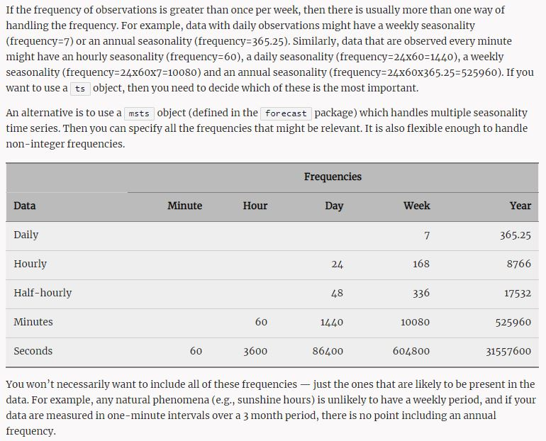

# Abstract

There has already 2 years passed by while [Binary.com-is-Rebranding-to-Deriv.com](https://derivdotcom.medium.com/binary-com-is-rebranding-to-deriv-com-and-here-is-everything-you-need-to-know-6f4a8513c84b), Here I summarized some previous research papers in [Binary.com → Deriv.com](https://englianhu.medium.com/binary-com-deriv-com-6058cdbfc3a1) and continue from this high-frequency-trading.

```{r warning=FALSE, message=FALSE}
if(!require('BBmisc')) {
  install.packages('BBmisc', dependencies = TRUE, INSTALL_opts = '--no-lock')
}
suppressPackageStartupMessages(library('BBmisc'))
# suppressPackageStartupMessages(library('rmsfuns'))

pkgs <- c('devtools', 'knitr', 'kableExtra', 'tint', 
          'devtools','readr', 'lubridate', 'data.table', 
          'feather', 'purrr', 'quantmod', 'tidyquant', 
          'tibbletime', 'furrr', 'flyingfox', 'tidyr', 
          'timetk', 'plyr', 'dplyr', 'stringr', 'magrittr', 
          'tidyverse', 'memoise', 'htmltools', 'formattable', 
          'zoo', 'forecast', 'seasonal', 'seasonalview', 
          'rugarch', 'rmgarch', 'mfGARCH', 'sparklyr', 
          'microbenchmark', 'dendextend', 'lhmetools', 
          'stringr', 'pacman', 'profmem', 'DescTools', 
          'htmltools', 'echarts4r', 'viridis', 'hrbrthemes')

# https://github.com/mpiktas/midasr
# https://github.com/onnokleen/mfGARCH
# devtools::install_github("business-science/tibbletime")
# devtools::install_github("DavisVaughan/furrr")

suppressAll(lib(pkgs))
# load_pkg(pkgs)

funs <- c('uv_fx.R', 'opt_arma.R', 'multi_seasons.R', 
          'filterFX.R', 'filter_spec.R', 'mv_fx.R', 
          'task_progress.R', 'read_umodels.R', 'convertOHLC.R')
l_ply(funs, function(x) source(paste0('./function/', x)))

# spark_install()

# if(FALSE) {
  # Not run due to side-effects
#   spark_home_set()
#   }
# sc <- spark_connect(master = 'local')

#spark_install()
#sc <- spark_connect(master = 'local')

.cl = FALSE

Sys.setenv(TZ = 'Asia/Tokyo')
## options(knitr.table.format = 'html') will set all kableExtra tables to be 'html', otherwise need to set the parameter on every single table.
options(warn = -1, knitr.table.format = 'html')#, digits.secs = 6)
rm(pkgs, funs)
```

# Introduction

By refer to <span style='color:goldenrod'>*GARCH模型中的ARIMA(p,d,q)参数最优化*</span> and <span style='color:goldenrod'>*binary.com Interview Question I - Comparison of Univariate GARCH Models*</span>, we know **Fractional Intergrated GJR-GARCH** is the best fit model. This paper we compare the MIDAS, GARCH-MIDAS and Levy Process models. Here I also test another high frequency trading model mcmcsGARCH. These paper might consider as comparison interday trading before start the high frequency trading via [Real Time FXCM](https://github.com/scibrokes/real-time-fxcm).

<span style='color:goldenrod'>*High Frequency Financial Time Series Prediction - Machine Learning Approach*</span> introduce multilayer modelling for high-frequency-trading. <span style='color:goldenrod'>*binary.com Interview Question I - Tick-Data-HiLo For Daily Trading </span><span style='color:red'>(Blooper)</span>* tried to use Hi-Lo daily dataset for modelling but failed. The paper recommend to use complete itraday dataset.

> I noticed that buying early in the morning, around 5am eastern time, tends to give lower prices and selling around 10pm eastern time gives you the highest prices. The wording is weird but i want to know your opinions on how time of day affects the bitcoin trading market. Thank you.

*Source : [Time of day affects trading prices](https://www.reddit.com/r/Bitcoin/comments/7hdtnw/time_of_day_affects_trading_prices/)*

From above quotes, we can know the seasonality of price trend daily, weekly, monthly or annually etc. MIDAS and mcsGARCH are the models designate for high frequency trading.

*A Comparison of GARCH-class Models and MIDAS Regression with Application in Volatility Prediction and Value at Risk Estimation* compares GARCH, eGARCH and MIDAS 3 models with normal and student distribution with matrix. The author concludes that the MIDAS model is the most accurate in volatility prediction but there is inconclusive for VaR 1% and 5%.

> Note that there does not seem to be an option to use SARMA models in the "rugarch" package, so you will have to let the "S" part go. But if there is a seasonal pattern (and that is quite likely when it comes to tourist arrivals), you will have to account for it somehow. Consider using exogenous seasonal variables (dummies or Fourier terms) in the conditional mean model via the argument external.regressors inside the argument mean.model in function ugarchspec. Alternatively, note that a SARMA model corresponds to a restricted ARMA model. An approximation of SARMA could thus be an ARMA with the appropriate lag order but without the SARMA-specific parameter restrictions (since those might not be available in "rugarch").

The quotes above describe about the seasonal factors onto the model which is similar with MIDAS model, kindly refer to [Fitting ARIMA-GARCH model using “rugarch” package](https://stats.stackexchange.com/questions/176550/fitting-arima-garch-model-using-rugarch-package?answertab=votes#tab-top).

# Data

## Tick Data

### Get Data

Due to the dataset gather via `getSymbols('JPY=X', src='av', api.key=api, periodicity='intraday')` is tidied but only 100 observations. Moreover I cannot select the time period from few years ago, therefore here I omit it and use the intraday data gather from [`real-time-fxcm/data/USDJPY/`](https://github.com/scibrokes/real-time-fxcm/tree/master/data/USDJPY) from `Y2015W1` to `Y2018W27`, due to the dataset is tick-data-base and more than 1 million observation per file (per week) and there has 4 years dataset where. Here I need to backtest day-by-day. There will be spent a long time to do.

- [Chapter 7 Importing Financial Data from the Internet](https://msperlin.github.io/pafdR/importingInternet.html) introduce few packages where provides api service.
- [High Frequency Data Price (Sample)](https://raw.githubusercontent.com/DavisVaughan/fin-econ-project-bitcoin/master/data/cleaned/cleaned-bitstamp-minutely.csv) is an example for intraday high-frequency-trading.

```{r warning=FALSE, message=FALSE}
cr_code <- c('AUDUSD=X', 'EURUSD=X', 'GBPUSD=X', 'CHF=X', 'CAD=X', 'CNY=X', 'JPY=X')

names(cr_code) <- c('AUDUSD', 'EURUSD', 'GBPUSD', 'USDCHF', 'USDCAD', 'USDCNY', 'USDJPY')
# names(cr_code) <- c('USDAUD', 'USDEUR', 'USDGBP', 'USDCHF', 'USDCAD', 'USDCNY', 'USDJPY')

dtr <- str_extract_all(getwd(), '.*/', '')[1]
dtr1 <- paste0(dtr, 'real-time-fxcm/data/')

## Read presaved FXCM data.
# mbase <- sapply(names(cr_code), function(x) readRDS(paste0('./data/', x, '.rds')) %>% na.omit)

fls <- sapply(names(cr_code), function(x) {
  dtr1 <- paste0(dtr1, x)
  list.files(dtr1, pattern = '^Y[0-9]{4}W[0-9]{1,2}.rds$') %>% 
    str_replace_all('.rds', '')
  })
fls[lengths(fls) == 0] <- NA_character_
fls[is.na(fls)] <- NULL

# AUDUSD <- sapply(fls[[1]], read_rds)
# EURUSD <- sapply(fls[[2]], read_rds)
# GBPUSD <- sapply(fls[[3]], read_rds)
# USDCHF <- sapply(fls[[4]], read_rds)
# USDCAD <- sapply(fls[[5]], read_rds)
# USDCNY <- sapply(fls[[6]], read_rds)
# mbase <- llply(as.list(fls[[7]]), read_rds) #185 files where 1 files contains 1 million observation.

## Here I take USDJPY as example...
dtr1s <- paste0(dtr1, names(fls[length(fls)]))
fs <- list.files(dtr1s, pattern = '^Y[0-9]{4}W[0-9]{1,2}.rds$') %>% 
  str_replace_all('.rds', '')
# eval(parse(text = paste0(fs, "<- readRDS('", fls[[7]], "') %>% as_tibble")))

t.unit <- c('seconds', 'minutes', 'hours', 'days', 'weeks', 'months', 'quarters', 'quarters')
## https://www.alphavantage.co/
## https://www.alphavantage.co/support/#api-key
# api = 'UL7EPVVEGDVC3TXC'
# getSymbols('JPY=X', src='av', api.key=api, periodicity='intraday')
```

[binary.com Interview Question I - Multivariate GARCH Models](http://rpubs.com/englianhu/binary-Q1Multi-GARCH) concludes that the multivariate will be more accurate but due to save time, here I only use univariate for models comparison.

Due to high volume of dataset, here I only use `USDJPY` since the variance is higher than the rest of currencies.

```{r warning=FALSE, message=FALSE}
## Read raw dataset.
#Y2015W1 <- read_rds(paste0(dtr1, '/', fls[[7]][1], '.rds')) %>% as_tibble

eval(parse(text = paste0(fs[1], "<- readRDS('", dtr1, "/", 
                         names(fls[length(fls)]), '/', fls[length(fls)][[1]][1], 
                         ".rds') %>% as_tibble")))

## raw dataset
Y2015W1
```

Above table shows the raw tick-dataset (shows price fluctuation in mili-seconds). As we know that the variance in unit `mili-second` is almost 0. Therefore I refer to <span style='color:goldenrod'>*High Frequency GARCH: The multiplicative component GARCH (mcsGARCH) model*</span> and use 1 minute as 1 time unit, convert from univariate `ask` and univariate `bid` to be OHLC dataset.

### Tidy Data



> For example, the `taylor` data set from the `forecast` package contains half-hourly electricity demand data from England and Wales over about 3 months in 2000. It was defined as `taylor <- msts(x, seasonal.periods=c(48,336)`.

*Source [Seasonal periods](https://robjhyndman.com/hyndsight/seasonal-periods/)*

<span style='color:goldenrod'>*A Review of Literature on Time Zone Difference and Trade*</span> study about trading across timezone and different country, if the timezone difference will affect the trading.

> I would like to use R for time series analysis. I want to make a time-series model and use functions from the packages timeDate and forecast.
I have intraday data in the CET time zone (15 minutes data, 4 data points per hour). On March 31st daylight savings time is implemented and I am missing 4 data points of the 96 that I usually have. On October 28th I have 4 data points too many as time is switched back.
For my time series model I always need 96 data points, as otherwise the intraday seasonality gets messed up.
Do you have any experiences with this? Do you know an R function or a package that would be of help to automat such data handling - something elegant? Thank you!

> I had a similar problem with hydrological data from a sensor. My timestamps were in UTC+1 (CET) and did not switch to daylight saving time (UTC+2, CEST). As I didn't want my data to be one hour off (which would be the case if UTC were used) I took the %z conversion specification of strptime. In ?strptime you'll find:
`%z` Signed offset in hours and minutes from UTC, so -0800 is 8 hours behind UTC.
For example: In 2012, the switch from Standard Time to DST occured on 2012-03-25, so there is no 02:00 on this day. If you try to convert "2012-03-25 02:00:00" to a POSIXct-Object,

```{r warning=FALSE, message=FALSE}
## https://stackoverflow.com/questions/29202021/r-how-to-extract-dates-from-a-time-series
getTStime <- function(ats){
  start <- start(ats)
  end <- end(ats)
  time <- list()
  time[[1]] <- start
  m <- 2
  while(!(identical(start, end))){
    start[2] <- start[2] + 1
    if (start[2]==1441){ #mins per day
      start[1] <- start[1] + 1
      start[2] <- 1
    }
    time[[m]] <- start
    m <- m + 1
  }
  return(time)
}

## https://stackoverflow.com/questions/13865172/handling-data-on-the-days-when-we-switch-to-daylight-savings-time-and-back-in-r
#> as.POSIXct("2012-03-25 02:00:00", tz="Europe/Vienna")
#[1] "2012-03-25 CET"
#
## you don't get an error or a warning, you just get date without the time (this behavior is documented).
## Using `format = "%z"` gives the desired result:
#
#> as.POSIXct("2012-03-25 02:00:00 +0100", format="%F %T %z", tz="Europe/Vienna")
#[1] "2012-03-25 03:00:00 CEST"

## function
as.POSIXct.no.dst <- function (
  x, tz = '', format='%Y-%m-%d %H:%M', offset='+0100', ...) {
  x <- paste(x, offset)
  format <- paste(format, '%z')
  res <- as.POSIXct(x, tz, format=format, ...)
  return(res)
  }
```

*Source : [Handling data on the days when we switch to daylight savings time and back in R](https://stackoverflow.com/questions/13865172/handling-data-on-the-days-when-we-switch-to-daylight-savings-time-and-back-in-r)*

[Why is this xts frequency always 1?](https://stackoverflow.com/questions/34454947/why-is-this-xts-frequency-always-1) talk about the frequency of `xts` dataset and we need to use `zoo` to convert it.

> So far, we have considered relatively simple seasonal patterns such as quarterly and monthly data. However, higher frequency time series often exhibit more complicated seasonal patterns. For example, daily data may have a weekly pattern as well as an annual pattern. Hourly data usually has three types of seasonality: a daily pattern, a weekly pattern, and an annual pattern. Even weekly data can be challenging to forecast as it typically has an annual pattern with seasonal period of `365.25/7≈52.179` on average.
...
The top panel of Figure 11.1 shows the number of retail banking call arrivals per 5-minute interval between 7:00am and 9:05pm each weekday over a 33 week period. The bottom panel shows the first three weeks of the same time series. There is a strong daily seasonal pattern with frequency 169 (there are 169 5-minute intervals per day), and a weak weekly seasonal pattern with frequency `169 × 5 = 845`. (Call volumes on Mondays tend to be higher than the rest of the week.) If a longer series of data were available, we may also have observed an annual seasonal pattern.

*Source : [11.1 Complex seasonality](https://otexts.org/fpp2/complexseasonality.html)*

```{r warning=FALSE, message=FALSE}
## Convert the univariate price to be OHLC price in `minutes` unit.
Y2015W1_min1 <- Y2015W1 %>% 
  convertOHLC(combine = TRUE, trade = FALSE, .unit = t.unit[2]) %>% 
  bind_rows #combined `ask/bid` price
Y2015W1_min1
```

```{r warning=FALSE, message=FALSE}
#suppressWarnings(Y2015W1 <- tbl %>% 
#       dplyr::select(date, close) %>% tk_xts %>% 
#       auto.arima(seasonal = FALSE))

## Count the observation in order to model seasonal frequency model.
Y2015W1_min1 %>% 
  dplyr::select(index) %>% 
  ddply(.(date(index)), summarise, n = length(index)) %>% 
  as_tibble
```

Kindly refer to section [Seasonal Data] or [Seasonal periods](https://robjhyndman.com/hyndsight/seasonal-periods/) to know the seasonality dataset. <span style='color:goldenrod'>*High Frequency GARCH: The multiplicative component GARCH (mcsGARCH) model*</span> use the dataset start from `00:01:00` but not `00:00:00`, therefore above dataset shows the last observation will be the start of next day.

```{r warning=FALSE, message=FALSE}
# tsz <- llply(fls[[7]], function(x) {
#     y <- read_rds(x) %>% 
#       convertOHLC(combine = TRUE, trade = FALSE, .unit = t.unit[2]) %>% 
#         bind_rows %>% 
#         dplyr::filter(index == head(index, 1) | 
#                       index == tail(index, 1)) %>% 
#       mutate(diff = difftime(index, lag(index, 1), units = 'mins'))
#     }) %>% bind_rows %>% as_tibble %>% arrange(index)
# saveRDS(tsz, 'C:/Users/scibr/Documents/GitHub/scibrokes/real-time-fxcm/data/USDJPY/tsz.rds')

## The daylight saving convertion in not tally.
tsz <- read_rds(paste0(dtr1s, '/tsz.rds')) %>% 
  dplyr::filter(index >= ymd_hms('2015-01-05 00:00:00', tz = 'Europe/Athens'))
tsz

## count the frequency of weekly observation.
tsz %>% dplyr::count(diff) %>% 
  kable(caption = 'Count data point') %>% 
  kable_styling(bootstrap_options = c('striped', 'hover', 'condensed', 'responsive')) %>%
  scroll_box(width = '100%', height = '400px')

## missing observation.
tsz %>% dplyr::filter(diff <= 6000)
```

```{r warning=FALSE, message=FALSE}
## https://stackoverflow.com/questions/34454947/why-is-this-xts-frequency-always-1
## https://www.stat.berkeley.edu/~s133/dates.html
## https://stackoverflow.com/questions/45070078/convert-forecast-time-produced-by-arima-into-standard-date-time
#How to extract below index to datetime
#Y2015W1 %>% tk_ts(end = c(1440, 7200), frequency = 1440) %>% attributes %>% .$index %>% as.POSIXct(tz = 'UTC', origin = '1970-01-01') %>% force_tz(tz = 'Europe/Athens')
Y2015W1_min1 %>% 
  tk_ts(end = c(3, 7200), frequency = 1440) %>% 
  .[,1:ncol(.)] %>% 
  head #1440 * 5 = 7200

Y2015W1_min1 %>% 
  head %>% 
  zooreg(frequency = 1440)

#Y2015W1_min1 %>% tk_ts(end = c(1440, 7200), frequency = 1440) %>% index %>% as.POSIXct(tz = 'UTC', origin = '1970-01-01')

## https://stats.stackexchange.com/questions/144158/daily-time-series-analysis
## http://manishbarnwal.com/blog/2017/05/03/time_series_and_forecasting_using_R/
#How to extract below index to datetime
#Y2015W1_min1 %>% msts(seasonal.periods=c(1440, 7200)) %>% .[,1] %>% as.numeric %>% as.POSIXct(tz = 'UTC', origin = '1970-01-01') %>% force_tz(tz = 'Europe/Athens')
Y2015W1_min1 %>% 
  head %>% 
  msts(seasonal.periods=c(1440, 7200))
```

`ts()` only can build a year-month seasonal dataset, otherwise need to decimal numeric to figure out what date within a month accordingly. `msts()` will be more user friendly which is modelling intra-and-inter seasonal dataset. <s>Now I convert all dataset again from `UTC` to `UTC+2` to be a constant weekly seasonal dataset. Due to the trading day is 5 days and 2 rest days, therefore I set a weekly seasonal period instead of daily.</s>

[2018 Time Zones - UTC](https://www.timeanddate.com/time/zone/timezone/utc) shows that has no change in *No changes, UTC all of the period* from 2010 to 2019.

> From the [Wikipedia UTC page](http://en.wikipedia.org/wiki/Coordinated_Universal_Time):
> UTC does not change with a change of seasons, but local time or civil time may change if a time zone jurisdiction observes daylight saving time or summer time. For example, UTC is 5 hours ahead of local time on the east coast of the United States during winter, but 4 hours ahead during summer.
In other words, when a time zone observes DST, its offset from UTC changes when there's a DST transition, but that's that time zone observing DST, not UTC.
Without knowing much about PHP time zone handling, it seems strange to me that you can specify "with DST" or "without DST" in a conversion - the time zones themselves specify when DST kicks in... it shouldn't have to be something you specify yourself.

*Source : [Does UTC observe daylight saving time?](https://stackoverflow.com/questions/5495803/does-utc-observe-daylight-saving-time)*

<s>Due to the `UTC` timezone has no daylight saving issue, therefore the initial trading time will be a problem where I need to cope with.</s> [Handling Data for Daylight-Saving and Non-Daylight-Saving for HFT](https://community.rstudio.com/t/handling-data-for-daylight-saving-and-non-daylight-saving-for-hft/15699/2) provides the solution for the timezone issue.

```{r eval=FALSE}
## -------- eval=FALSE --------------
## Now I simply tidy all datasets and save it prior to start the statistical modelling.
llply(fls[[7]], function(x) {
    mbase <- read_rds(x) %>% as_tibble
    ## Convert the univariate price to be OHLC price in `minutes` unit.
    mbase %<>% convertOHLC(.unit = t.unit[2], combine = TRUE) %>% 
        bind_rows #combined `ask/bid` price
    
    y <- x %>% str_replace_all('.rds$', '_tick-to-min1.rds')
    
    saveRDS(mbase, y)
    cat(y, 'saved!\n')
    })
```

## 1 Minute Data

### Get and Tidy Data

Due to [fxcm/MarketData](https://github.com/fxcm/MarketData) updated and provides 1 minute, 1 hour, 1 day datasets recently, here I directly download 1 minute dataset and tidy it.

> time is based on EST, because our server is in New Jersey USA.
it is 5:00PM at the end of the day, which is shown in GMT as 21:00 day light saving or 22:00 without day light saving.

*Source : [Inconsistency of trading date time #1](https://github.com/fxcm/MarketData/issues/1#issuecomment-427464344)*

From above quote, we can know even the `EST` converted to `UTC` will not be `00:00:00`, therefore I refer to [Handling data on the days when we switch to daylight savings time and back in R](https://stackoverflow.com/questions/13865172/handling-data-on-the-days-when-we-switch-to-daylight-savings-time-and-back-in-r) as my solution as `UTC+2` (daylight saving `UTC+3`) will get the desired result.

```{r warning=FALSE, message=FALSE}
cr_code <- c('EURUSD=X', 'GBPUSD=X', 'CHF=X', 'CAD=X', 'JPY=X')
names(cr_code) <- c('EURUSD', 'GBPUSD', 'USDCHF', 'USDCAD', 'USDJPY')

fls1 <- llply(names(cr_code), function(x) {
    fls <- list.files(paste0(dtr1, x), pattern = '^Y[0-9]{4}W[0-9]{1,2}_m1.rds$')
    if (length(fls) > 0) paste0(dtr1, x, '/', fls)
  })
names(fls1) <- names(cr_code)

dtr1s <- paste0(dtr1, names(fls1[length(fls1)]))
fs1 <- list.files(dtr1s, pattern = '^Y[0-9]{4}W[0-9]{1,2}_m1.rds$') %>% 
  str_replace_all('.rds', '')

## Read raw dataset.
# eval(parse(text = paste0(fs, "<- read_rds('", fls[[7]], "')")))
```

```{r warning=FALSE, message=FALSE}
## Read raw dataset.
eval(parse(text = paste0(fs1[1], "<- read_rds('", fls1[[5]][1], "') %>% as_tibble")))

## raw dataset
Y2015W1_m1
```

Now I try to validate the daylight saving date.

```{r warning=FALSE, message=FALSE}
# tsz2 <- llply(fls1[[5]], function(x) {
#    y <- read_rds(x) %>% dplyr::filter(DateTime == head(DateTime, 1)|
#                                      DateTime == tail(DateTime, 1)) %>% 
#        mutate(DateTime = DateTime %>% mdy_hms %>% 
#                 .POSIXct(tz = 'Europe/Athens'), 
#               diff = difftime(DateTime, lag(DateTime, 1), units = 'mins'))
#    
#    nch <- y$DateTime[1] %>% substr(nchar(.)+2, nchar(.)+3)
#    y %<>% mutate(
#        nch = nch, DateTime = if_else(
#          nch == '23', DateTime + hours(1), DateTime)) %>% 
#        dplyr::select(-nch)
#    }) %>% bind_rows %>% as_tibble %>% arrange(DateTime)
# saveRDS(tsz2, 'C:/Users/scibr/Documents/GitHub/scibrokes/real-time-fxcm/data/USDJPY/tsz2.rds')

## The daylight saving convertion in not tally.
tsz2 <- read_rds(paste0(dtr1s, '/tsz2.rds')) %>% 
  dplyr::rename(index = DateTime) %>% 
  dplyr::filter(index >= ymd_hms('2015-01-05 00:01:00', tz = 'Europe/Athens'))
tsz2

## count the frequency of weekly observation.
tsz2 %>% dplyr::count(diff) %>% 
  kable(caption = 'Count data point') %>% 
  kable_styling(bootstrap_options = c('striped', 'hover', 'condensed', 'responsive')) %>%
  scroll_box(width = '100%', height = '400px')

## missing observation.
tsz2 %>% dplyr::filter(diff <= 6000)
```

From above tables, we can know the daylight saving detection and `datetime` auto convertion is not tally. Here I united all intial observation started from `00:01:00`.

## Completion of Data

### Data Selection

[binary.com 面试试题 I - 单变量数据缺失值管理](http://rpubs.com/englianhu/handle-missing-value) and [binary.com面试试题 I - 单变量数据缺失值管理 II](http://rpubs.com/englianhu/handle-multivariate-missing-value) compares the missing values dataset and refill the missing value with `imputeTS::na.seadec()`: 

- interpolation
- kalman
- locf
- ma
- mean
- random

The papers concludes that the `imputeTS::na.seadec(algorithm = 'interpolation')` or `imputeTS::na.seadec(algorithm = 'kalman')` repaired dataset no matter how much of portion of missing value is workable since the MSE and bias is very low. The `Amelia::amelia` is accurate and the bias is small compare to `imputeTS::sea.dec` when the portion of missing value is small. The papers compare tick-data-to-1min-data and also 1min-data where both datasets gather from FXCM. It is very weird that the `tidyr::fill` and `na.locf` both are not too accurate. However, in this paper I use `tidy::fill()` method to fill the missing value, it will similar with `kalman filter` method since it will filled up the missing value ascending to fill up with direction down until the bottom of the dataset and then fill up with direction up by descending to fill up initial missing value or top. It will not occured standard error bias like open or close price higher than highest price or lower than lowest price. Moreover, the filled price will not bias a lot from the trend as time goes by.

```{r warning=FALSE, message=FALSE}
## tick-data to minute 1 dataset
#tsz <- read_rds('C:/Users/scibr/Documents/GitHub/scibrokes/real-time-fxcm/data/USDJPY/tsz.rds')
tsz %>% dplyr::count(diff) %>% 
  kable(caption = 'Count data point') %>% 
  kable_styling(bootstrap_options = c('striped', 'hover', 'condensed', 'responsive')) %>%
  scroll_box(width = '100%', height = '400px')

## minute 1 dataset
#tsz2 <- read_rds('C:/Users/scibr/Documents/GitHub/scibrokes/real-time-fxcm/data/USDJPY/tsz2.rds')
tsz2 %>% dplyr::count(diff) %>% 
  kable(caption = 'Count data point') %>% 
  kable_styling(bootstrap_options = c('striped', 'hover', 'condensed', 'responsive')) %>%
  scroll_box(width = '100%', height = '400px')
```

Above tables show both datasets are incompleted. However, when I tried to check the `Y2017W20` and `Y2017W20_m1`, the tick-dataset only start from `2017-05-15` until `2017-05-17` but the m1-dataset from `2017-05-15` until `2017-05-19`. Kindly refer to below comparison.

```{r warning=FALSE, message=FALSE}
mean(tsz$diff, na.rm=TRUE)
mean(tsz2$diff, na.rm=TRUE)
```

From above comparison, we know the dataset of `1min` is better compelete than `tick-to-1min` dataset.

```{r warning=FALSE, message=FALSE}
#left_join(tsz[c(1, ncol(tsz))], tsz2[c(1, ncol(tsz2))])
right_join(tsz[c(1, ncol(tsz))], tsz2[c(1, ncol(tsz2))])
```

- [How to fill in missing data in time series?](https://stats.stackexchange.com/questions/245615/how-to-fill-in-missing-data-in-time-series) talk about the missing data.
- [4.1 Seasonal ARIMA models](https://onlinecourses.science.psu.edu/stat510/node/67/)
- [How to fill in missing data in time series?](https://stats.stackexchange.com/questions/245615/how-to-fill-in-missing-data-in-time-series)
- [How to Handle Missing Data](https://towardsdatascience.com/how-to-handle-missing-data-8646b18db0d4)

Here I compare the mean and get to know the downloaded min1 dataset from FXCM is better than downloaded tick-dataset (converted to min1) from FXCM.

```{r eval=FALSE}
# -------- eval=FALSE -----------
## tick-data to min-1 dataset
data_tm1 <- llply(fls[[7]], function(x) {
    y <- read_rds(x) %>% 
      convertOHLC(combine = TRUE)
    
    yw <- x %>% 
      str_extract_all('Y[0-9]{4}W[0-9]{1,2}') %>% 
      str_split_fixed('[A-Z]{1}', 3) %>% 
      .[,-1]
    y %<>% mutate(
      year = as.numeric(yw[1]), week = as.numeric(yw[2]), .)
    }) %>% 
  bind_rows %>% 
  as_tibble %>% 
  arrange(index)


## min-1 dataset
data_m1 <- llply(fls1[[5]], function(x) {
    y <- read_rds(x) %>% 
      dplyr::rename(index = DateTime) %>% 
      mutate(index = index %>% mdy_hms %>% 
               .POSIXct(tz = 'Europe/Athens') %>% 
               force_tz())
    
    yw <- x %>% str_extract_all('Y[0-9]{4}W[0-9]{1,2}') %>% 
      str_split_fixed('[A-Z]{1}', 3) %>% .[,-1]
    
    nch <- y$index[1] %>% substr(nchar(.)+2, nchar(.)+3)
    y %<>% mutate(
      year = as.numeric(yw[1]), week = as.numeric(yw[2]), 
      nch = nch, index = if_else(
        nch == '23', index + hours(1), index)) %>% 
      dplyr::select(-nch)
    }) %>% 
  bind_rows %>% 
  as_tibble %>% 
  arrange(index)
```

```{r eval=FALSE}
# -------- eval=FALSE -----------
#dtm <- seq(ymd_hms('2015-01-01 00:00:00'), ymd_hms('2017-08-31 00:00:00'), by = 'minutes')
#dtm <- seq(from = ymd('2015-01-05'), to = ymd('2018-07-07'), by = 'weeks')
dtm <- data_tm1 %>% 
  dplyr::select(index, year ,week) %>% 
  mutate(index = date(index)) %>% 
  ddply(.(year, week), head, 1) %>% 
  .[-nrow(.),]

## create a seq of datetime to complete the  data point.
dttm <- llply(1:nrow(dtm), function(i) {
  x1 <- dtm$index[i] %>% 
    as.POSIXct %>% 
    with_tz(tz = 'UTC') %>% 
    force_tz()
  
  #x2 <- x1 + days(4) + hours(23) + minutes(59)
  x2 <- x1 + days(5)
  
  data_frame(index = seq.POSIXt(from = x1 + minutes(1), to = x2, by = '1 min'), 
             year = dtm[i,2], week = dtm[i,3])
  }) %>% bind_rows %>% as_tibble
```

Above chunk created a sequence of `datetime`.

```{r eval=FALSE}
## merge dataset
data_m1 <- left_join(dttm, data_m1) %>% 
  as_tibble %>% 
  unique %>% 
  arrange(index)

data_tm1 <- left_join(dttm, data_tm1) %>% 
  as_tibble %>% 
  unique %>% 
  arrange(index)

## https://stackoverflow.com/questions/43212308/na-locf-using-group-by-from-dplyr
## https://stackoverflow.com/questions/233401., eval.expr = TRUE) : 
  Scanner error: mapping values50/replace-missing-values-na-with-most-recent-non-na-by-group
## https://stackoverflow.com/questions/40040834/replace-na-with-previous-or-next-value-by-group-using-dplyr/40041172
## https://stackoverflow.com/questions/47242643/na-at-the-end-of-column-using-na-locf-function
## https://stackoverflow.com/questions/49578085/na-locf-function-is-changing-data-frame-values-from-int-to-char-in-r
## https://stackoverflow.com/questions/13616965/how-to-fill-nas-with-locf-by-factors-in-data-frame-split-by-country
## https://stackoverflow.com/questions/23340150/replace-missing-values-na-with-most-recent-non-na-by-group

# data_m1 %>% 
#     group_by(index, week) %>% 
#     mutate_all(funs(na.locf(., na.rm = FALSE)))

# data_m1 %>% split(data_m1$index) %>% 
#   llply(function(x) {
#     na.locf(na.locf(x), fromLast = TRUE)
#   }) %>% do.call(rbind, .)

# data_m1 %<>% ddply(.(index, week), na_locf) %>% as_tibble
#> data_m1 %>% anyNA
#[1] FALSE

data_m1 %<>% 
  ddply(.(year, week), function(x) {
       x %>% fill(year, week, BidOpen, BidHigh, BidLow, BidClose, 
                  AskOpen, AskHigh, AskLow, AskClose) %>% #default direction down
             fill(year, week, BidOpen, BidHigh, BidLow, BidClose, 
                  AskOpen, AskHigh, AskLow, AskClose, .direction = 'up')
    }) %>% as_tibble

data_tm1 %<>% 
  ddply(.(year, week), function(x) {
       x %>% fill(year, week, BidOpen, BidHigh, BidLow, BidClose, 
                  AskOpen, AskHigh, AskLow, AskClose) %>% #default direction down
             fill(year, week, BidOpen, BidHigh, BidLow, BidClose, 
                  AskOpen, AskHigh, AskLow, AskClose, .direction = 'up')
    }) %>% as_tibble
#> data_m1 %>% anyNA
#[1] TRUE
#> data_m1 %>% filter_all(any_vars(is.na(.)))
## A tibble: 7,200 x 11
#   index                year  week BidOpen BidHigh BidLow BidClose AskOpen AskHigh AskLow AskClose
#   <dttm>              <dbl> <dbl>   <dbl>   <dbl>  <dbl>    <dbl>   <dbl>   <dbl>  <dbl>    <dbl>
# 1 2018-01-02 00:01:00  2017    53      NA      NA     NA       NA      NA      NA     NA       NA
# 2 2018-01-02 00:02:00  2017    53      NA      NA     NA       NA      NA      NA     NA       NA
# 3 2018-01-02 00:03:00  2017    53      NA      NA     NA       NA      NA      NA     NA       NA
# 4 2018-01-02 00:04:00  2017    53      NA      NA     NA       NA      NA      NA     NA       NA
# 5 2018-01-02 00:05:00  2017    53      NA      NA     NA       NA      NA      NA     NA       NA
# 6 2018-01-02 00:06:00  2017    53      NA      NA     NA       NA      NA      NA     NA       NA
# 7 2018-01-02 00:07:00  2017    53      NA      NA     NA       NA      NA      NA     NA       NA
# 8 2018-01-02 00:08:00  2017    53      NA      NA     NA       NA      NA      NA     NA       NA
# 9 2018-01-02 00:09:00  2017    53      NA      NA     NA       NA      NA      NA     NA       NA
#10 2018-01-02 00:10:00  2017    53      NA      NA     NA       NA      NA      NA     NA       NA
## ... with 7,190 more rows

#> data_tm1 %>% anyNA
#[1] FALSE
#> data_tm1 %>% filter_all(any_vars(is.na(.)))
## A tibble: 0 x 11
## ... with 11 variables: index <dttm>, year <dbl>, week <dbl>, AskOpen <dbl>, AskHigh <dbl>, AskLow <dbl>,
##   AskClose <dbl>, BidOpen <dbl>, BidHigh <dbl>, BidLow <dbl>, BidClose <dbl>

saveRDS(data_m1, paste0(dtr1, '/data_m1.rds'))
saveRDS(data_tm1, paste0(dtr1, '/data_tm1.rds'))
```

I don't use the `data.table` and `feather` because of the storage concerns. Kindly refer to [[问答] 对大数据如何用R高效处理](http://bbs.pinggu.org/forum.php?mod=redirect&goto=findpost&ptid=6685427&pid=53936462&fromuid=5794471)和[[问答] 对大数据如何用R高效处理](http://bbs.pinggu.org/forum.php?mod=redirect&goto=findpost&ptid=6685427&pid=53936861&fromuid=5794471).

- [christophsax/feather-fwrite.R](https://gist.github.com/christophsax/3db87a48596768b232a26dfce87c3299)
- [比較 save/load, saveRDS/read_rds, feather, 與 data.table 套件的讀寫速度](http://steve-chen.tw/?p=555)

Finally, I filled-up the `NA` section of `data_m1` and `data_tm1` and eventually filled up by `tidyr::fill` function.

### Read Data

Due to the files preload all before simulate the statistical modelling will occupy the space. Here I directly read the files and simulate the algorithmic prediction in following sections.

```{r warning=FALSE, message=FALSE}
rm(list = ls()[grep('i|j|tz|nch|yw|dtm|dttm|form|data|Y2015W|tsz|tsz2|dc', ls())])

cr_code <- c('AUDUSD=X', 'EURUSD=X', 'GBPUSD=X', 'CHF=X', 'CAD=X', 'CNY=X', 'JPY=X')

names(cr_code) <- c('AUDUSD', 'EURUSD', 'GBPUSD', 'USDCHF', 'USDCAD', 'USDCNY', 'USDJPY')

data_m1 <- read_rds(paste0(dtr1s, '/data_m1.rds'))

data_m1 %>% ddply(.(year, week), head, 1) %>% 
  kable(caption = 'Weekly Initial Data Point') %>% 
  kable_styling(bootstrap_options = c('striped', 'hover', 'condensed', 'responsive')) %>%
  scroll_box(width = '100%', height = '400px')
```

```{r warning=FALSE, message=FALSE, echo=FALSE}
data_m1 %>% ddply(.(year, week), tail, 1) %>% 
  kable(caption = 'Weekly Final Data Point') %>% 
  kable_styling(bootstrap_options = c('striped', 'hover', 'condensed', 'responsive')) %>%
  scroll_box(width = '100%', height = '400px')
```

```{r warning=FALSE, message=FALSE}
## Tidy dataset for modelling.
data_m1 %<>% 
  mutate(open = (BidOpen + AskOpen)/2, close = (BidClose + AskClose)/2) %>% 
  dplyr::rename(high = BidHigh, low = AskLow) %>%  #use bid price for sell.
  dplyr::select(index, open, high, low, close)     # and ask price for buy.
```

Here I try to check if the filled dataset bias or not. Due to above I used `open = (BidOpen + AskOpen)/2`, `high = BidHigh`, `low = AskLow` and `close = (BidClose + AskClose)/2`^[For buying order, we need to refer to `ask` price and selling order need to refer to `bid` price.]. There will probably have bias.

```{r warning=FALSE, message=FALSE}
data_m1 %>% mutate(
  bias.open = if_else(open>high|open<low, 1, 0), 
  bias.high = if_else(high<open|high<low|high<close, 1, 0), 
  bias.low = if_else(low>open|low>high|low>close, 1, 0), 
  bias.close = if_else(close>high|close<low, 1, 0)) %>% 
  dplyr::filter(bias.open==1|bias.high==1|bias.low==1|bias.close==1)# %>% 
#  kable(caption = 'Bias Imputation') %>% 
#  kable_styling(bootstrap_options = c('striped', 'hover', 'condensed', 'responsive')) %>%
#  scroll_box(width = '100%', height = '400px')
```

```{r warning=FALSE, eval=FALSE}
# -------- eval=FALSE -----------
## Below prove that the dataset has no any bias or error.
> read_rds(paste0(dtr1, '/data_m1.rds')) %>% mutate(
+     open = BidOpen, high = BidHigh, low = BidLow, close = BidClose, 
+     bias.open = if_else(open>high|open<low, 1, 0), 
+     bias.high = if_else(high<open|high<low|high<close, 1, 0), 
+     bias.low = if_else(low>open|low>high|low>close, 1, 0), 
+     bias.close = if_else(close>high|close<low, 1, 0)) %>% 
+     dplyr::filter(bias.open==1|bias.high==1|bias.low==1|bias.close==1)
# A tibble: 0 x 19
# ... with 19 variables: index <dttm>, year <dbl>, week <dbl>, BidOpen <dbl>, BidHigh <dbl>, BidLow <dbl>,
#   BidClose <dbl>, AskOpen <dbl>, AskHigh <dbl>, AskLow <dbl>, AskClose <dbl>, open <dbl>, high <dbl>, low <dbl>,
#   close <dbl>, bias.open <dbl>, bias.high <dbl>, bias.low <dbl>, bias.close <dbl>

> read_rds(paste0(dtr, '/data_tm1.rds')) %>% mutate(
+     open = BidOpen, high = BidHigh, low = BidLow, close = BidClose, 
+     bias.open = if_else(open>high|open<low, 1, 0), 
+     bias.high = if_else(high<open|high<low|high<close, 1, 0), 
+     bias.low = if_else(low>open|low>high|low>close, 1, 0), 
+     bias.close = if_else(close>high|close<low, 1, 0)) %>% 
+     dplyr::filter(bias.open==1|bias.high==1|bias.low==1|bias.close==1)
# A tibble: 0 x 19
# ... with 19 variables: index <dttm>, year <dbl>, week <dbl>, AskOpen <dbl>, AskHigh <dbl>, AskLow <dbl>,
#   AskClose <dbl>, BidOpen <dbl>, BidHigh <dbl>, BidLow <dbl>, BidClose <dbl>, open <dbl>, high <dbl>, low <dbl>,
#   close <dbl>, bias.open <dbl>, bias.high <dbl>, bias.low <dbl>, bias.close <dbl>

> read_rds(paste0(dtr1, '/data_m1.rds')) %>% mutate(
+     open = AskOpen, high = AskHigh, low = AskLow, close = AskClose, 
+     bias.open = if_else(open>high|open<low, 1, 0), 
+     bias.high = if_else(high<open|high<low|high<close, 1, 0), 
+     bias.low = if_else(low>open|low>high|low>close, 1, 0), 
+     bias.close = if_else(close>high|close<low, 1, 0)) %>% 
+     dplyr::filter(bias.open==1|bias.high==1|bias.low==1|bias.close==1)
# A tibble: 0 x 19
# ... with 19 variables: index <dttm>, year <dbl>, week <dbl>, BidOpen <dbl>, BidHigh <dbl>, BidLow <dbl>,
#   BidClose <dbl>, AskOpen <dbl>, AskHigh <dbl>, AskLow <dbl>, AskClose <dbl>, open <dbl>, high <dbl>, low <dbl>,
#   close <dbl>, bias.open <dbl>, bias.high <dbl>, bias.low <dbl>, bias.close <dbl>

> read_rds(dtr1, paste0('/data_tm1.rds')) %>% mutate(
+     open = AskOpen, high = AskHigh, low = AskLow, close = AskClose, 
+     bias.open = if_else(open>high|open<low, 1, 0), 
+     bias.high = if_else(high<open|high<low|high<close, 1, 0), 
+     bias.low = if_else(low>open|low>high|low>close, 1, 0), 
+     bias.close = if_else(close>high|close<low, 1, 0)) %>% 
+     dplyr::filter(bias.open==1|bias.high==1|bias.low==1|bias.close==1)
# A tibble: 0 x 19
# ... with 19 variables: index <dttm>, year <dbl>, week <dbl>, AskOpen <dbl>, AskHigh <dbl>, AskLow <dbl>,
#   AskClose <dbl>, BidOpen <dbl>, BidHigh <dbl>, BidLow <dbl>, BidClose <dbl>, open <dbl>, high <dbl>, low <dbl>,
#   close <dbl>, bias.open <dbl>, bias.high <dbl>, bias.low <dbl>, bias.close <dbl>
```

I initially try to use `bid` for high and `ask` for low in order to produce a better prediction price for buy and sell. However, I use the mean value of OHLC all prices for this paper to avoid the statistical error/bias.

Due to `1min` dataset is better than (more complete) `tickdata-to-1min`, here I use the `1min` dataset.

```{r warning=FALSE, message=FALSE}
if(!exists('data_m1')) {
  data_m1 <- read_rds(paste0(dtr1s, '/data_m1.rds'))
}
if(names(data_m1) %>% str_detect('Bid|Ask') %>% any()) {
data_m1 %<>% 
  mutate(open = (BidOpen + AskOpen)/2, 
         high = (BidHigh + AskHigh)/2, 
         low = (BidLow + AskLow)/2, 
         close = (BidClose + AskClose)/2) %>% 
  dplyr::select(index, open, high, low, close)
}
```

```{r warning=FALSE, message=FALSE}
data_m1 %>% mutate(
  bias.open = if_else(open>high|open<low, 1, 0), 
  bias.high = if_else(high<open|high<low|high<close, 1, 0), 
  bias.low = if_else(low>open|low>high|low>close, 1, 0), 
  bias.close = if_else(close>high|close<low, 1, 0)) %>% 
  dplyr::filter(bias.open==1|bias.high==1|bias.low==1|bias.close==1)# %>% 
#  kable(caption = 'Bias Imputation') %>% 
#  kable_styling(bootstrap_options = c('striped', 'hover', 'condensed', 'responsive')) %>%
#  scroll_box(width = '100%', height = '400px')
```

```{js}
//<script type="text/javascript" src="//cdn.datacamp.com/dcl-react.js.gz"></script>
```

*Source : [DataCamp Light](https://github.com/datacamp/datacamp-light)*

You are feel free to surf [Online Coding Platform Example](https://cdn.datacamp.com/dcl-react-prod/example.html) for R, Python and also Shell.

# Modelling

## Seasonal Modelling

Below articles introduce **TBATS models** `tbats()` and **Dynamic harmonic regression with multiple seasonal periods** `auto.arima()`. Here I also includes `ts()`, **MIDAS** `midasr()`, **GARCH-MIDAS**, **mcsGARCH** and **Levy Process** for this research.

- [Forecasting: Principles and Practice - *11.1 Complex seasonality*](https://otexts.com/fpp2/complexseasonality.html#complexseasonality)
- [Forecasting: Principles and Practice - *12.1 Weekly, daily and sub-daily data*](https://otexts.com/fpp2/weekly.html#weekly)

<span style='color:red'>**Progress Function**</span>

```{r}
task_progress <- function(mbase, timeID0 = NULL, scs = 60, .pattern = '^mts|^sets', .loops = TRUE) {
  ## ------------- 定时查询进度 ----------------------
  ## 每分钟自动查询与更新以上模拟预测汇价进度（储存文件量）。
  require('magrittr')
  require('tibble')
  
  if(!is.data.frame(class(mbase))) { 
	mbase %<>% data.frame
  }
  
  if (.loops == TRUE) {
    while(1) {
      cat('Current Tokyo Time :', as.character(now('Asia/Tokyo')), '\n\n')
      
      y = as_date(mbase$index) %>% 
			unique
      y <- y[weekdays(y) != 'Saturday'] #filter and omit the weekly last price which is 12:00am on saturday
	    datee = y
	    
	    if(is.null(timeID0)) { 
		    timeID0 = y[1]
	    } else if (is.Date(timeID0)) { 
		    timeID0 = as_date(timeID0)
	    } else {
		    timeID0 = as_date(mbase$index) %>% 
		    unique
	    }
  	  
	    y = y[y >= timeID0]
      
      x = list.files(paste0('./data/fx/USDJPY/'), pattern = .pattern) %>% 
	      str_replace_all('.rds', '') %>% 
		  str_replace_all('.201', '_201') %>% 
		  str_split_fixed('_', '2') %>% 
		  as_tibble %>% 
		  dplyr::rename('Model' = 'V1', 'Date' = 'V2') %>% 
		  mutate(Model = factor(Model), Date = as_date(Date))
		
	  x = join(tibble(Date = datee), x) %>% 
		  as_tibble	  
	  x %<>% na.omit
	  
      x %<>% mutate(binary = if_else(is.na(Model), 0, 1)) %>% 
		  spread(Model, binary)
      
      z <- ldply(x[,-1], function(zz) {
		  na.omit(zz) %>% length }) %>% 
		  dplyr::rename(x = V1) %>% 
		  mutate(n = length(y), progress = percent(x/n))
      
      print(z)
      
      prg = sum(z$x)/sum(z$n)
      cat('\n================', as.character(percent(prg)), '================\n\n')
      
      if (prg == 1) break #倘若进度达到100%就停止更新。
      
      Sys.sleep(scs) #以上ldply()耗时3~5秒，而休息时间60秒。
    }
  } else {
    
    cat('Current Tokyo Time :', as.character(now('Asia/Tokyo')), '\n\n')
      
    
      y = as_date(mbase$index) %>% 
			unique
	  datee = y
		
	  if(is.null(timeID0)) { 
		  timeID0 = y[1]
	  } else if (is.Date(timeID0)) { 
		  timeID0 = as_date(timeID0)
	  } else {
		  timeID0 = as_date(mbase$index) %>% 
		  unique
	  }
	
	  y = y[y >= timeID0]
    
      x = list.files(paste0('./data/fx/USDJPY/'), pattern = .pattern) %>% 
	      str_replace_all('.rds', '') %>% 
		  str_replace_all('.201', '_201') %>% 
		  str_split_fixed('_', '2') %>% 
		  as_tibble %>% 
		  dplyr::rename('Model' = 'V1', 'Date' = 'V2') %>% 
		  mutate(Model = factor(Model), Date = as_date(Date))
		
	  x = join(tibble(Date = datee), x) %>% 
		  as_tibble
	  x %<>% na.omit
	  
      x %<>% mutate(binary = if_else(is.na(Model), 0, 1)) %>% 
		  spread(Model, binary)
        
      z <- ldply(x[,-1], function(zz) {
		  na.omit(zz) %>% length }) %>% 
		  dplyr::rename(x = V1) %>% 
		  mutate(n = length(y), progress = percent(x/n))
                
    print(z)
    
    prg = sum(z$x)/sum(z$n)
    cat('\n================', as.character(percent(prg)), '================\n\n')
    }
  }
```

## Seasonal ETS

### ETS `ts()`

The `forecast.ets()` will automatically use the optimal `ets()` which is similar theory with `auto.arima()`.

### Weekly >> Daily

I set the length of dataset as weekly but the frequency set as 1440 minutes (per day).

```{r eval=FALSE}
# --------- eval=FALSE ---------
#sq <- seq(1 , length(data_m1$index), by = 1440)
#sets <- list()
timeID <- data_m1$index %>% 
  as_date %>% 
  unique %>% 
  sort
timeID %<>% .[. > as_date('2015-01-11')]

for (dt in timeID) {
  smp <- data_m1 %>% 
    tk_xts(silent = TRUE)
  dt %<>% as_date
  smp <- smp[paste0(dt %m-% weeks(1) + seconds(59), '/', dt + seconds(59))]
  
  sets <- smp %>% 
    tk_ts(frequency = 1440) %>% 
    forecast(h = 1440) %>% 
    llply(tk_tbl)
  
  if(is.double(sets$forecast$index[1])){
    sq <- smp %>% 
      tail(1) %>% 
      index
    if(weekdays(sq) == '土曜日'|weekdays(sq) == 'Saturday') sq <- sq + days(2)
    sq <- seq(from = sq + minutes(1), sq + days(1), by = 'min')
    sets$forecast$index <- sq
    
  } else {
    sets$forecast$index <- data_m1$index[
    (which(data_m1$index == smp %>% 
             index %>% 
             xts::last()) + 1):(
     which(data_m1$index == smp %>% 
             index %>% 
             xts::last()) + 1440)]
  }
  
  if (!dir.exists(paste0('data/fx/USDJPY'))) 
    dir.create(paste0('data/fx/USDJPY'))
  
  saveRDS(sets, paste0('data/fx/USDJPY/sets.wk.1440.', 
                       as_date(sets$forecast$index[1]), '.rds'))
  
  cat(paste0(
    'data/fx/USDJPY/sets.wk.1440.', 
    as_date(sets$forecast$index[1]), '.rds saved!\n'))
  }
```

### Monthly >> Daily

I set the length of dataset as monthly but the frequency set as 1440 minutes (per day). Initial forecast will be based on weekly dataset and then accumulated date-by-date until a monthly dataset.

```{r eval=FALSE}
# --------- eval=FALSE ---------
#sq <- seq(1 , length(data_m1$index), by = 1440)
#sets <- list()
timeID <- data_m1$index %>% 
  as_date %>% 
  unique %>% 
  sort
timeID %<>% .[. > as_date('2015-01-11')]

for (dt in timeID) {
  smp <- data_m1 %>% 
    tk_xts(silent = TRUE)
  dt %<>% as_date
  smp <- smp[paste0(dt %m-% months(1) + seconds(59), '/', dt + seconds(59))]
  
  sets <- smp %>% 
    tk_ts(frequency = 1440) %>% 
    forecast(h=1440) %>% 
    llply(tk_tbl)
  
  if(is.double(sets$forecast$index[1])){
    sq <- smp %>% 
      tail(1) %>% 
      index
    if(weekdays(sq) == '土曜日'|weekdays(sq) == 'Saturday') sq <- sq + days(2)
    sq <- seq(from = sq + minutes(1), sq + days(1), by = 'min')
    sets$forecast$index <- sq
    
  } else {
    sets$forecast$index <- data_m1$index[
    (which(data_m1$index == smp %>% 
             index %>% 
             xts::last()) + 1):(
     which(data_m1$index == smp %>% 
             index %>% 
             xts::last()) + 1440)]
  }
  
  if (!dir.exists(paste0('data/fx/USDJPY'))) 
    dir.create(paste0('data/fx/USDJPY'))
  
  saveRDS(sets, paste0('data/fx/USDJPY/sets.mo.1440.', 
                       as_date(sets$forecast$index[1]), '.rds'))
  
  cat(paste0(
    'data/fx/USDJPY/sets.mo.1440.', 
    as_date(sets$forecast$index[1]), '.rds saved!\n'))
  }
```

### Quarterly >> Daily

I set the length of dataset as quarterly but the frequency set as 1440 minutes (per day). Initial forecast will be based on weekly dataset and then accumulated date-by-date until a quarterly dataset.

```{r eval=FALSE}
# --------- eval=FALSE ---------
#sq <- seq(1 , length(data_m1$index), by = 1440)
#sets <- list()
timeID <- data_m1$index %>% 
  as_date %>% 
  unique %>% 
  sort
timeID %<>% .[. > as_date('2015-01-11')]

for (dt in timeID) {
  smp <- data_m1 %>% 
    tk_xts(silent = TRUE)
  dt %<>% as_date
  smp <- smp[paste0(dt %m-% months(3) + seconds(59), '/', dt + seconds(59))]
  
  sets <- smp %>% 
    tk_ts(frequency = 1440) %>% 
    forecast(h=1440) %>% 
    llply(tk_tbl)
  
  if(is.double(sets$forecast$index[1])){
    sq <- smp %>% 
      tail(1) %>% 
      index
    if(weekdays(sq) == '土曜日'|weekdays(sq) == 'Saturday') sq <- sq + days(2)
    sq <- seq(from = sq + minutes(1), sq + days(1), by = 'min')
    sets$forecast$index <- sq
    
  } else {
    sets$forecast$index <- data_m1$index[
    (which(data_m1$index == smp %>% 
             index %>% 
             xts::last()) + 1):(
     which(data_m1$index == smp %>% 
             index %>% 
             xts::last()) + 1440)]
  }
  
  if (!dir.exists(paste0('data/fx/USDJPY'))) 
    dir.create(paste0('data/fx/USDJPY'))
  
  saveRDS(sets, paste0('data/fx/USDJPY/sets.qt.1440.', 
                       as_date(sets$forecast$index[1]), '.rds'))
  
  cat(paste0(
    'data/fx/USDJPY/sets.qt.1440.', 
    as_date(sets$forecast$index[1]), '.rds saved!\n'))
  }
```

### Yearly >> Daily

I set the length of dataset as yearly but the frequency set as 1440 minutes (per day). Initial forecast will be based on weekly dataset and then accumulated date-by-date until a yearly dataset.

```{r eval=FALSE}
# --------- eval=FALSE ---------
#sq <- seq(1 , length(data_m1$index), by = 1440)
#sets <- list()
timeID <- data_m1$index %>% 
  as_date %>% 
  unique %>% 
  sort
timeID %<>% .[. > as_date('2015-01-11')]

for (dt in timeID) {
  smp <- data_m1 %>% tk_xts(silent = TRUE)
  dt %<>% as_date
  smp <- smp[paste0(dt %m-% years(1) + seconds(59), '/', dt + seconds(59))]
  
  sets <- smp %>% 
    tk_ts(frequency = 1440) %>% 
    forecast(h=1440) %>% 
    llply(tk_tbl)
  
  if(is.double(sets$forecast$index[1])){
    sq <- smp %>% 
      tail(1) %>% 
      index
    if(weekdays(sq) == '土曜日'|weekdays(sq) == 'Saturday') sq <- sq + days(2)
    sq <- seq(from = sq + minutes(1), sq + days(1), by = 'min')
    sets$forecast$index <- sq
    
  } else {
    sets$forecast$index <- data_m1$index[
    (which(data_m1$index == smp %>% 
             index %>% 
             xts::last()) + 1):(
     which(data_m1$index == smp %>% 
             index %>% 
             xts::last()) + 1440)]
  }
  
  if (!dir.exists(paste0('data/fx/USDJPY'))) 
    dir.create(paste0('data/fx/USDJPY'))
  
  saveRDS(sets, paste0('data/fx/USDJPY/sets.yr.1440.', 
                       as_date(sets$forecast$index[1]), '.rds'))
  
  cat(paste0(
    'data/fx/USDJPY/sets.yr.1440.', 
    as_date(sets$forecast$index[1]), '.rds saved!\n'))
  }
```

### Weekly >> Weekly

I set the length of dataset as weekly but the frequency set as 7200 minutes (per week).

```{r eval=FALSE}
# --------- eval=FALSE ---------
#sq <- seq(1 , length(data_m1$index), by = 7200)
#sets <- list()
timeID <- data_m1$index %>% 
  as_date %>% 
  unique %>% 
  sort
timeID %<>% .[. > as_date('2015-01-11')]

for (dt in timeID) {
  smp <- data_m1 %>% 
    tk_xts(silent = TRUE)
  dt %<>% as_date
  smp <- smp[paste0(dt %m-% weeks(1) + seconds(59), '/', dt + seconds(59))]
  
  sets <- smp %>% 
    tk_ts(frequency = 7200) %>% 
    forecast(h = 7200) %>% 
    llply(tk_tbl)
  
  if(is.double(sets$forecast$index[1])){
    sq <- smp %>% 
      tail(1) %>% 
      index
    if(weekdays(sq) == '土曜日'|weekdays(sq) == 'Saturday') sq <- sq + days(2)
    sq <- seq(from = sq + minutes(1), sq + days(1), by = 'min')
    sets$forecast$index <- sq
    
  } else {
    sets$forecast$index <- data_m1$index[
    (which(data_m1$index == smp %>% 
             index %>% 
             xts::last()) + 1):(
     which(data_m1$index == smp %>% 
             index %>% 
             xts::last()) + 7200)]
  }
  
  if (!dir.exists(paste0('data/fx/USDJPY'))) 
    dir.create(paste0('data/fx/USDJPY'))
  
  saveRDS(sets, paste0('data/fx/USDJPY/sets.wk.7200.', 
                       as_date(sets$forecast$index[1]), '.rds'))
  
  cat(paste0(
    'data/fx/USDJPY/sets.wk.7200.', 
    as_date(sets$forecast$index[1]), '.rds saved!\n'))
  }
```

### Monthly >> Weekly

I set the length of dataset as monthly but the frequency set as 7200 minutes (per week).

```{r eval=FALSE}
# --------- eval=FALSE ---------
#sq <- seq(1 , length(data_m1$index), by = 7200)
#sets <- list()
timeID <- data_m1$index %>% 
  as_date %>% 
  unique %>% 
  sort
timeID %<>% .[. > as_date('2015-01-11')]

for (dt in timeID) {
  smp <- data_m1 %>% 
    tk_xts(silent = TRUE)
  dt %<>% as_date
  smp <- smp[paste0(dt %m-% months(1) + seconds(59), '/', dt + seconds(59))]
  
  sets <- smp %>% 
    tk_ts(frequency = 7200) %>% 
    forecast(h = 7200) %>% 
    llply(tk_tbl)
  
  if(is.double(sets$forecast$index[1])){
    sq <- smp %>% 
      tail(1) %>% 
      index
    if(weekdays(sq) == '土曜日'|weekdays(sq) == 'Saturday') sq <- sq + days(2)
    sq <- seq(from = sq + minutes(1), sq + days(1), by = 'min')
    sets$forecast$index <- sq
    
  } else {
    sets$forecast$index <- data_m1$index[
    (which(data_m1$index == smp %>% 
             index %>% 
             xts::last()) + 1):(
     which(data_m1$index == smp %>% 
             index %>% 
             xts::last()) + 7200)]
  }
  
  if (!dir.exists(paste0('data/fx/USDJPY'))) 
    dir.create(paste0('data/fx/USDJPY'))
  
  saveRDS(sets, paste0('data/fx/USDJPY/sets.mo.7200.', 
                       as_date(sets$forecast$index[1]), '.rds'))
  
  cat(paste0(
    'data/fx/USDJPY/sets.mo.7200.', 
    as_date(sets$forecast$index[1]), '.rds saved!\n'))
  }
```

### Quarterly >> Weekly

I set the length of dataset as quarterly but the frequency set as 7200 minutes (per week).

```{r eval=FALSE}
# --------- eval=FALSE ---------
#sq <- seq(1 , length(data_m1$index), by = 7200)
#sets <- list()
timeID <- data_m1$index %>% 
  as_date %>% 
  unique %>% 
  sort
timeID %<>% .[. > as_date('2015-01-11')]

for (dt in timeID) {
  smp <- data_m1 %>% 
    tk_xts(silent = TRUE)
  dt %<>% as_date
  smp <- smp[paste0(dt %m-% months(3) + seconds(59), '/', dt + seconds(59))]
  
  sets <- smp %>% 
    tk_ts(frequency = 7200) %>% 
    forecast(h = 7200) %>% 
    llply(tk_tbl)
  
  if(is.double(sets$forecast$index[1])){
    sq <- smp %>% 
      tail(1) %>% 
      index
    if(weekdays(sq) == '土曜日'|weekdays(sq) == 'Saturday') sq <- sq + days(2)
    sq <- seq(from = sq + minutes(1), sq + days(1), by = 'min')
    sets$forecast$index <- sq
    
  } else {
    sets$forecast$index <- data_m1$index[
    (which(data_m1$index == smp %>% 
             index %>% 
             xts::last()) + 1):(
     which(data_m1$index == smp %>% 
             index %>% 
             xts::last()) + 7200)]
  }
  
  if (!dir.exists(paste0('data/fx/USDJPY'))) 
    dir.create(paste0('data/fx/USDJPY'))
  
  saveRDS(sets, paste0('data/fx/USDJPY/sets.qt.7200.', 
                       as_date(sets$forecast$index[1]), '.rds'))
  
  cat(paste0(
    'data/fx/USDJPY/sets.qt.7200.', 
    as_date(sets$forecast$index[1]), '.rds saved!\n'))
  }
```

### Yearly >> Weekly

I set the length of dataset as yearly but the frequency set as 7200 minutes (per week).

```{r eval=FALSE}
# --------- eval=FALSE ---------
#sq <- seq(1 , length(data_m1$index), by = 7200)
#sets <- list()
timeID <- data_m1$index %>% 
  as_date %>% 
  unique %>% 
  sort
timeID %<>% .[. > as_date('2015-01-11')]

for (dt in timeID) {
  smp <- data_m1 %>% 
    tk_xts(silent = TRUE)
  dt %<>% as_date
  smp <- smp[paste0(dt %m-% years(1) + seconds(59), '/', dt + seconds(59))]
  
  sets <- smp %>% 
    tk_ts(frequency = 7200) %>% 
    forecast(h = 7200) %>% 
    llply(tk_tbl)
  
  if(is.double(sets$forecast$index[1])){
    sq <- smp %>% 
      tail(1) %>% 
      index
    if(weekdays(sq) == '土曜日'|weekdays(sq) == 'Saturday') sq <- sq + days(2)
    sq <- seq(from = sq + minutes(1), sq + days(1), by = 'min')
    sets$forecast$index <- sq
    
  } else {
    sets$forecast$index <- data_m1$index[
    (which(data_m1$index == smp %>% 
             index %>% 
             xts::last()) + 1):(
     which(data_m1$index == smp %>% 
             index %>% 
             xts::last()) + 7200)]
  }
  
  if (!dir.exists(paste0('data/fx/USDJPY'))) 
    dir.create(paste0('data/fx/USDJPY'))
  
  saveRDS(sets, paste0('data/fx/USDJPY/sets.yr.7200.', 
                       as_date(sets$forecast$index[1]), '.rds'))
  
  cat(paste0(
    'data/fx/USDJPY/sets.yr.7200.', 
    as_date(sets$forecast$index[1]), '.rds saved!\n'))
  }
```

## Seasonal ARIMA

### Introduce SARIMA

- [Seasonal model with auto.arima](https://stats.stackexchange.com/questions/355839/seasonal-model-with-auto-arima)
- [Seasonality not taken account of in `auto.arima()`](https://stats.stackexchange.com/questions/213201/seasonality-not-taken-account-of-in-auto-arima) ask about why there has no 
- [8.5 Non-seasonal ARIMA models](https://otexts.org/fpp2/non-seasonal-arima.html) introduce a non-seasonal ARIMA model.
- [8.9 Seasonal ARIMA models](https://otexts.org/fpp2/seasonal-arima.html) introduce the arima and also sarima models, teach we how to get the `P,D,Q`.
- [Seasonality in `auto.arima()` from forecast package](https://stackoverflow.com/questions/37400062/seasonality-in-auto-arima-from-forecast-package) ask the question which is what I am trying to know (normal arima model only get `(p,d,q)` but not `(P,D,Q)`). The answer is do NOT set both `approximation` and `stepwise` to `FALSE`.
- [Is there a way to force seasonality from `auto.arima`](https://stackoverflow.com/questions/37046275/is-there-a-way-to-force-seasonality-from-auto-arima) ask about how to model a force-seasonal-ARIMA. The topic talk about the `D` parameter in `auto.arima` which governs seasonal differencing. The example shows that `D=1` will get a smaller AIC/BIC figures than default `D=NULL`.
- [Why does `auto.arima` drop my seasonality component when `stepwise=FALSE` and `approximation=FALSE`](https://stackoverflow.com/questions/24390859/why-does-auto-arima-drop-my-seasonality-component-when-stepwise-false-and-approx) ask about why the `stepwise=FALSE` and `approximation=FALSE` got the better AIC than default model. The answer describe that normally `max.order=5` where we can get a better truly seasonal model, just increase the `max.order=10`. There is not too much gained using `approximation=FALSE`. What that does is force it to evaluate the likelihood more accurately for each model, but the approximation is quite good and much faster, so is usually acceptable.
- [How to read p,d and q of `auto.arima()`?](https://stats.stackexchange.com/questions/178577/how-to-read-p-d-and-q-of-auto-arima) ask about what is the meaning of `a$arma` and somebody answer the help page in `auto.arima()` has descibe that `a$arma` is `(p, q, P, Q, s, d, D)`.
- [In R, `auto.arima` fails to capture seasonality](https://stackoverflow.com/questions/43600827/in-r-auto.arima-fails-to-capture-seasonality) simulate an annual dataset with set `trace=TRUE`, `stepwise=FALSE` and `D=1` but didn't provides the answer to get optimal `P,D,Q`.
- [How I can get best arima model in R (closed)](https://stats.stackexchange.com/questions/160343/how-i-can-get-best-arima-model-in-r) only say the `auto.arima()` able get the best model, however does not provides the answer how to get the optimal `P,D,Q` instead of only `p,d,q`.
- [how to extract integration order (d) from auto.arima](https://stackoverflow.com/questions/19483952/how-to-extract-integration-order-d-from-auto-arima) ask that the `ndiffs()` sometimes give the different resukt than best model, describe the `a$arma`. More generally, the order `(d)` is the next to last element; the seasonal order `(D)` is the last. So `a$arma[length(a$arma)-1]` is the order d and `a$arma[length(a$arma)]` is the seasonal order.
- [How to read p,d and q of `auto.arima()`?](https://stats.stackexchange.com/questions/178577/how-to-read-p-d-and-q-of-auto-arima) describe the help page in `auto.arima()` has descibe that `a$arma` is `(p, q, P, Q, d, D)`.
- [How to interpret the second part of an auto arima result in R?](https://stackoverflow.com/questions/47119765/how-to-interpret-the-second-part-of-an-auto-arima-result-in-r) interpret the seasonal arima model.
- [extract ARIMA specificaiton](https://stackoverflow.com/questions/23617662/extract-arima-specificaiton) provides a function how to extract the `a$arma[c(1, 6, 2, 3, 7, 4, 5)]` from an `auto.arima()`.
- [How to include seasonality in auto arima with regressors in R?](https://stats.stackexchange.com/questions/295004/how-to-include-seasonality-in-auto-arima-with-regressors-in-r) use a `xreg` for seasonal model.
- [Step-by-Step Graphic Guide to Forecasting through ARIMA Modeling using R – Manufacturing Case Study Example (Part 4)](http://ucanalytics.com/blogs/step-by-step-graphic-guide-to-forecasting-through-arima-modeling-in-r-manufacturing-case-study-example/) forecast seasonal sales by using `auto.arima()`.
- [Frequency parameter and its impact on auto.arima results](https://stats.stackexchange.com/questions/187304/frequency-parameter-and-its-impact-on-auto-arima-results)^[[Seasonal periods](https://robjhyndman.com/hyndsight/seasonal-periods/) describe very details on the `seasonal period` parameters determination.] ask about the determination of frequency parameter for `seasonal period` where the author of `forecast` package provides a details and concise answer.
- [`auto.arima` Warns `NaNs` Produced on Std Error](https://stats.stackexchange.com/questions/26999/auto-arima-warns-nans-produced-on-std-error) suggested set `stepwise=FALSE` and `approximation=FALSE` is better model.

> If you look at the help file of auto.arima and navigate to the section "Value", you are directed to the help file of arima function and there you find the following (under the section "Value") regarding the arma slot:
A compact form of the specification, as a vector giving the number of AR, MA, seasonal AR and seasonal MA coefficients, plus the period and the number of non-seasonal and seasonal differences.
That is what the seven elements you reported correspond to. In your case, you have a non-seasonal `ARIMA(1,2,0)`.

*Source : How to read p,d and q of `auto.arima()`? (which is 1 among the reference link above.)*

> So far, we have restricted our attention to non-seasonal data and non-seasonal ARIMA models. However, ARIMA models are also capable of modelling a wide range of seasonal data.
A seasonal ARIMA model is formed by including additional seasonal terms in the ARIMA models we have seen so far. It is written as follows:

| ARIMA   | $\underbrace{(p, d, q)}$       | $\underbrace{(P, D, Q)_{m}}$  |
|:-------:|:------------------------------:|:-----------------------------:|
|         |             ↑                  |             ↑                 |
|         | Non-seasonal part	of the model | Seasonal part of the model    |

where m = number of observations per year. We use uppercase notation for the seasonal parts of the model, and lowercase notation for the non-seasonal parts of the model.

The seasonal part of the model consists of terms that are similar to the non-seasonal components of the model, but involve backshifts of the seasonal period. For example, an $ARIMA(1,1,1)(1,1,1)_{4}$ model (without a constant) is for quarterly data (m = 4), and can be written as

$$(1 - \phi_{1}B)~(1 - \Phi_{1}B^{4}) (1 - B) (1 - B^{4})y_{t} = (1 + \theta_{1}B)~ (1 + \Theta_{1}B^{4})\varepsilon_{t}$$

The additional seasonal terms are simply multiplied by the non-seasonal terms.

`auto.arima(euretail, stepwise=FALSE, approximation=FALSE)` is better than `auto.arima(euretail)`.

> The `auto.arima()` function uses `nsdiffs()` to determine D (the number of seasonal differences to use), and `ndiffs()` to determine d (the number of ordinary differences to use). The selection of the other model parameters `(p, q, P and Q)` are all determined by minimizing the AICc, as with non-seasonal ARIMA models.
 
*Source : 8.9 Seasonal ARIMA models (which is 1 among the reference link above.)*

Above *8.5 Non-seasonal ARIMA models* reference link describe the `auto.arima()` and the default setting is `seasonal=TRUE` where it will automatically model^[help of `auto.arima()` describe the `seasonal : If FALSE, restricts search to non-seasonal models.`] .

> The default arguments are designed for rapid estimation of models for many time series. If you are analysing just one time series, and can afford to take some more time, it is recommended that you set stepwise=FALSE and approximation=FALSE.
Non-stepwise selection can be slow, especially for seasonal data. The stepwise algorithm outlined in Hyndman & Khandakar (2008) is used except that the default method for selecting seasonal differences is now based on an estimate of seasonal strength (Wang, Smith & Hyndman, 2006) rather than the Canova-Hansen test. There are also some other minor variations to the algorithm described in Hyndman and Khandakar (2008).

*Source : help section of `auto.arima()`.*

>`ARIMA(2,1,1)(1,0,0)[12]` is seasonal ARIMA. `[12]` stands for number of periods in season, i.e. months in year in this case. `(1,0,0)` stands for seasonal part of model. Take a look at [this](https://onlinecourses.science.psu.edu/stat510/node/67).

*Source : extract ARIMA specificaiton (which is 1 among the reference link above.)*

> You can force a seasonal model by setting `D=1`, although `auto.arima()` runs for quite some time with forced seasonality. (Note that the information criteria are not comparable between the original and the differenced series.)
$$
\begin{array}{l,l,l}
&\text{Training} & \text{Test}\\
\mathrm{ARIMA}(2,1,1) & 5.729 & 7.657\\
\mathrm{SARIMA}(1,1,0)_{52}\text{ with drift} & 6.481 & 7.390\\
\text{3 harmonics, }\mathrm{ARIMA}(2,1,0) & 5.578 & 5.151\\
\text{4 harmonics, }\mathrm{ARIMA}(2,1,1) & 5.219 & 5.188
\end{array}
$$

*Source : Seasonality not taken account of in `auto.arima()` (which is 1 among the reference link above.)*

> The problem with fitting seasonal ARIMA to daily data is that the "seasonal component" may only operate on the weekends or maybe just the weekdays thus overall there is a non-significnat "seasonal component". Now what you have to do is to augment your data set with 6 dummies representing the days of the week and perhaps monthly indicators to represent annual effects. Now consider incorporating events such as holidays and include any lead, contemoraneous or lag effect around these known variables. No there may be unusual values (pulses) or level shifts or local time trends in the data. Furthermore the day-of-the-week effects may have changed over time e.g. there was no Saturday effect for the first 20 weeks but a Saturday effect for the last 50 weeks.If you wish to post tour daily data I will give it a try and maybe other readers of the list might also contribute their analysis to help guide you through this.

*Source : Auto.arima with daily data: how to capture seasonality/periodicity?*

### Modelling SARIMA

#### Seasonal Data

- [*Seasonality not taken account of in `auto.arima()`*](https://stats.stackexchange.com/a/213455/68357) compares few models and concludes that the harmonics ARIMA is the best fit model.
- Non-stepwise model will slow down the seasonal model.
- `a$arma[c(1, 6, 2, 3, 7, 4, 5)]` is $(p,d,q)(P,D,Q)_{s}$.
- [How does R's auto.arima() function determine the order of differencing when estimating a regression with seasonal ARIMA errors?](https://stats.stackexchange.com/questions/30220/how-does-rs-auto-arima-function-determine-the-order-of-differencing-when-esti?answertab=votes#tab-top) talk about the OCSB test where [Major changes to the forecast package](https://robjhyndman.com/hyndsight/forecast3/) describe the improvement in `forecast` package.
- [Frequency parameter and its impact on auto.arima results](https://stats.stackexchange.com/questions/187304/frequency-parameter-and-its-impact-on-auto-arima-results) talk about the frequency parameter for `seasonal period` while the author of `forecast` package provides [Seasonal periods](https://robjhyndman.com/hyndsight/seasonal-periods/) where describe very details on the `seasonal period` parameters determination.
- [Auto.arima with daily data: how to capture seasonality/periodicity?](https://stats.stackexchange.com/questions/14742/auto-arima-with-daily-data-how-to-capture-seasonality-periodicity), the author of `forecast` package answered `salests <- ts(data,start=2010,frequency=7)` and `modArima <- auto.arima(salests)` for weekly seasonality determination.
- [Why is this xts frequency always 1?](https://stackoverflow.com/questions/34454947/why-is-this-xts-frequency-always-1)

>**Improved auto.arima()**
The `auto.arima()` function is widely used for automatically selecting ARIMA models. It works quite well, except that selection of $D$, the order of seasonal differencing, has always been poor. Up until now, the default has been to use the Canova-Hansen test to select $D$. Because the CH test has a null hypothesis of deterministic seasonality based on dummy variables, the function will often select $D=0$. So I’ve now switched to using the OCSB test for selecting $D$ which has a null hypothesis involving a seasonal difference, so it is much more likely to choose $D=1$ than previously. I’ve done extensive testing of the forecasts obtained under the two methods, and the OCSB test leads to better forecasts. Hence it is now the default. This means that the function may return a different ARIMA model than previously when the data are seasonal.
A separate function for selecting the seasonal order has also been made visible. So you can now call `nsdiffs()` to find the recommended number of seasonal differences without calling auto.arima(). There is also a `ndiffs()` function for selecting the number of first differences. Within `auto.arima()`, `nsdiffs()` is called first to select $D$, and then `ndiffs()` is applied to `diff(x,D)` if $D > 0$ or to $x$ if $D=0$.

> **Double-seasonal Holt-Winters**
The new dshw() function implements *Taylor’s (2003)* double-seasonal Holt-Winters method. This allows for two levels of seasonality. For example, with hourly data, there is often a daily period of 24 and a weekly period of 168. These are modelled separately in the `dshw()` function.

> I am planning some major new functionality to extend this to the various types of complex seasonality discussed in my recent JASA paper. Hopefully that will be ready in the next few weeks – I have a research assistant working on the new code.

*Source : Major changes to the forecast package*

- [Forecasting Daily Data with Multiple Seasonality in R](http://www.dbenson.co.uk/Rparts/subpages/forecastR/) provides the example for seasonal modelling. Now we start modelling harmonics model (which is using `xreg`).
- [R/msts.R](https://rdrr.io/cran/forecast/src/R/msts.R) introduced a multi seasonal time series objects, intended to be used for models that support multiple seasonal periods. The msts class inherits from the ts class and has an additional "msts" attribute which contains the vector of seasonal periods. All methods that work on a ts class, should also work on a msts class.
- [Multiseasonal models for multivariate time series](https://stats.stackexchange.com/questions/355746/multiseasonal-models-for-multivariate-time-series) and [Forecast double seasonal time series with multiple linear regression in R](https://petolau.github.io/Forecast-double-seasonal-time-series-with-multiple-linear-regression-in-R/) provides example for multi-seasonal modelling.
- [How to setup `xreg` argument in `auto.arima()` in R? [closed]](https://stats.stackexchange.com/questions/41070/how-to-setup-xreg-argument-in-auto-arima-in-r) using `xreg` for multivariate modelling.
- [Find Arima equation using auto.arima, daily long-term data (msts), 3 seasonal regressors, and calculating K in fourier](https://stats.stackexchange.com/questions/135521/find-arima-equation-using-auto-arima-daily-long-term-data-msts-3-seasonal-re) introduced 3 seasonal modelling.
- [R - Putting time series with frequency of 20 min into the function `stl()`](https://stackoverflow.com/questions/17738746/r-putting-time-series-with-frequency-of-20-min-into-the-function-stl)
- ["Frequency" value for seconds/minutes intervals data in R](https://stats.stackexchange.com/questions/120806/frequency-value-for-seconds-minutes-intervals-data-in-r)
- [Time Series and Forecasting using R](http://manishbarnwal.com/blog/2017/05/03/time_series_and_forecasting_using_R/)

```
library(forecast)
# create some artifical data
modelfitsample <- data.frame(Customer_Visit=rpois(49,3000),Weekday=rep(1:7,7),
                             Christmas=c(rep(0,40),1,rep(0,8)),Day=1:49)

# Create matrix of numeric predictors
xreg <- cbind(Weekday=model.matrix(~as.factor(modelfitsample$Weekday)), 
                  Day=modelfitsample$Day,
              Christmas=modelfitsample$Christmas)

# Remove intercept
xreg <- xreg[,-1]

# Rename columns
colnames(xreg) <- c("Mon","Tue","Wed","Thu","Fri","Sat","Day","Christmas")

# Variable to be modelled
visits <- ts(modelfitsample$Customer_Visit, frequency=7)

# Find ARIMAX model
modArima <- auto.arima(visits, xreg=xreg)
```

*Source : [How to setup `xreg` argument in `auto.arima()` in R? [closed]](https://stats.stackexchange.com/questions/41070/how-to-setup-xreg-argument-in-auto-arima-in-r)*

```
library(forecast)
ts_ <- ts(PaulsData$Temperature, frequency = 1)
msts_ <- msts(ts_, c(7,30,365))
fit <- auto.arima(ts_, seasonal=F, xreg=fourier(msts_, K=c(3,5,10)))  # i,j,k
```

*Source : [Find Arima equation using auto.arima, daily long-term data (msts), 3 seasonal regressors, and calculating K in fourier](https://stats.stackexchange.com/questions/135521/find-arima-equation-using-auto-arima-daily-long-term-data-msts-3-seasonal-re)*

```{r eval=FALSE}
ts_ <- data_m1$close %>% 
  ts()
mts_ <- data_m1 %>% 
  msts(seasonal.periods = c(1440, 7200), start = index(.)[1])
fit1 <- auto.arima(ts_, seasonal = FALSE, xreg=fourier(mts_, K=c(3,5,10)))
fit2 <- auto.arima(ts_, seasonal = FALSE, xreg=mts_)
fit3 <- auto.arima(ts_, D = 1, xreg=mts_)

## https://stackoverflow.com/questions/12161984/how-to-elegantly-convert-datetime-from-decimal-to-d-m-y-hms
## https://stackoverflow.com/questions/17738746/r-putting-time-series-with-frequency-of-20-min-into-the-function-stl
## https://stats.stackexchange.com/questions/120806/frequency-value-for-seconds-minutes-intervals-data-in-r
## http://manishbarnwal.com/blog/2017/05/03/time_series_and_forecasting_using_R/
smp %>% 
  tk_ts(start = index(index)[1], frequency = c(1440, 7200)) %>% 
  forecast %>% 
  llply(tk_tbl)
```

#### Weekly >> Daily `ts()`

Here I use `ts()` for seasonal data modeling and set `auto.arima(D = 1, seasonal = TRUE)` as **sarima** model, **sarimax** models will be modeled in next paper.

- [Auto.arima with xreg in R, restriction on forecast periods](https://datascience.stackexchange.com/questions/53955/auto-arima-with-xreg-in-r-restriction-on-forecast-periods)
- [How to setup xreg argument in auto.arima() in R?](https://stats.stackexchange.com/questions/41070/how-to-setup-xreg-argument-in-auto-arima-in-r)
- [Introducing seasonality to an ARIMA model in R](https://stats.stackexchange.com/questions/329433/introducing-seasonality-to-an-arima-model-in-r)
- [Seasonality not taken account of in `auto.arima()`](https://stats.stackexchange.com/questions/213201/seasonality-not-taken-account-of-in-auto-arima)
- [purrr auto.arima xreg combination](https://stackoverflow.com/questions/52096188/purrr-auto-arima-xreg-combination)
- [Forecasting using R - Dynamic Regression (ch5).pdf](https://raw.githubusercontent.com/englianhu/binary.com-interview-question/a26550f8fa1280e4d77cd92d2420fe57cba9d0bb/reference/Forecasting%20using%20R%20-%20Dynamic%20Regression%20(ch5).pdf)
- [Daily timeseries forecasting, with weekly and annual cycle](https://stackoverflow.com/questions/35649734/daily-timeseries-forecasting-with-weekly-and-annual-cycle)
- [Forecasting Daily Data with Multiple Seasonality in R](http://www.dbenson.co.uk/Rparts/subpages/forecastR)
- [**Time Series Forecasting, a Summarize of Data visualization and prediction**](https://rpubs.com/tedding/long-term-time-series-forecasting)
- [Time Series Analysis and Forecasting with the TSstudio Package](https://rpubs.com/ramkrisp/TSstudioDemo)
- [Find Arima equation using auto.arima, daily long-term data (msts), 3 seasonal regressors, and calculating K in fourier](https://stats.stackexchange.com/questions/135521/find-arima-equation-using-auto-arima-daily-long-term-data-msts-3-seasonal-re)

I set the length of dataset as nested seasonal dataset as weekly (1 week = 5 trading days = 7200 minutes) and daily (1 trading day = 1440 minutes).

```{r eval=FALSE}
# --------- eval=FALSE ---------
# sample, not run
> suppressWarnings(Y2015W1 %>% 
                     tk_xts %>% 
                     to.daily %>% 
                     Cl %>% 
                     opt_arma(arma=TRUE))
Using column `index` for date_var.
p d q P D Q s 
0 0 0 0 0 0 1
```

```{r eval=FALSE}
# --------- eval=FALSE ---------
# eval(parse(text = paste0(fs, "<- read_rds('", fls[[7]], "') %>% as_tibble")))
# sample, not run

sarima <- list()
for(i in (1:length(fs))) {
    smp <- data_m1 %>% tk_xts(silent = TRUE)
    timeID <- c(index(smp), xts::last(index(smp)) + minutes(1)) %>% 
      .[. > force_tz(ymd_hms('2015-01-05 00:00:00 EET'))]
    
    if (dt %in% timeID) {
      smp <- smp[paste0(dt, '/', dt %m+% weeks(1) - seconds(59))]
      
      sarima[[i]] <- tryCatch({llply(price_type, function(y) {
        df = auto.arima(smp, parallel=FALSE, num.cores = 2)
        df = data.frame(Date = index(df$latestPrice[1]), 
                        Type = paste0(names(df$latestPrice), '.', y), 
                        df$latestPrice, df$forecastPrice, t(df$AIC))
        names(df)[4] %<>% str_replace_all('1', 'T+1')
        df
      }) %>% as_tibble %>% bind_rows}, error = function(e) NULL)
      
      if (!dir.exists(paste0('data/fx/', names(sarima[[i]])[3]))) 
        dir.create(paste0('data/fx/', names(sarima[[i]])[3]))
      
      saveRDS(sarima[[i]], paste0(
        'data/fx/', names(sarima[[i]])[3], '/sarima.', 
        unique(sarima[[i]]$Date), '.rds'))
      
      cat(paste0(
        'data/fx/', names(sarima[[i]])[3], '/sarima.', 
        unique(sarima[[i]]$Date), '.rds saved!\n'))
      }
  }
```

```{r eval=FALSE}
# --------- eval=FALSE ---------
# sample, not run
smp <- data_m1 %>% tk_xts(silent = TRUE)
timeID <- c(index(smp), xts::last(index(smp)) + minutes(1)) %>% 
  .[. > force_tz(ymd_hms('2015-01-05 00:00:00 EET'))]
dt <- timeID[1]
smp <- smp[paste0(dt, '/', dt %m+% weeks(1) - seconds(59))]

smp %>% tk_ts %>% forecast %>% llply(tk_tbl)

mts <- multi_seasons(smp)
aar <- multi_seasons(smp, auto_arima=TRUE)

```

Below `Arima()` and `auto.arima()` functions prove that `auto.arima()` is better model since it auto adjust the best `arima(p,d,q)` values.

```{r, eval=FALSE}
# --------- eval=FALSE ---------
# sample, not run
> n <- 2000
> m <- 200
> y <- ts(rnorm(n) + (1:n)%%100/30, f=m)

> library(forecast)
> fit <- Arima(y, order=c(2,0,1), xreg=fourier(y, K=4))
> fit
Series: y 
Regression with ARIMA(2,0,1) errors 

Coefficients:
         ar1     ar2      ma1  intercept  S1-200  C1-200   S2-200   C2-200  S3-200   C3-200   S4-200
      0.3846  0.0649  -0.2794     1.6168  0.0354  0.0308  -1.0026  -0.0222  0.0677  -0.0163  -0.5295
s.e.  0.1588  0.0324   0.1584     0.0320  0.0453  0.0452   0.0452   0.0451  0.0450   0.0450   0.0448
      C4-200
      0.0059
s.e.  0.0447

sigma^2 estimated as 1.204:  log likelihood=-3017.65
AIC=6061.3   AICc=6061.49   BIC=6134.11

> fit2 <- auto.arima(y, seasonal=FALSE, xreg=fourier(y, K=4))
> fit2
Series: y 
Regression with ARIMA(1,0,2) errors 

Coefficients:
         ar1      ma1     ma2  intercept  S1-200  C1-200   S2-200   C2-200  S3-200   C3-200   S4-200
      0.4605  -0.3566  0.0605     1.6168  0.0354  0.0309  -1.0026  -0.0222  0.0677  -0.0164  -0.5296
s.e.  0.1319   0.1322  0.0297     0.0319  0.0451  0.0451   0.0450   0.0450  0.0449   0.0449   0.0447
      C4-200
      0.0057
s.e.  0.0447

sigma^2 estimated as 1.204:  log likelihood=-3017.44
AIC=6060.87   AICc=6061.06   BIC=6133.69

> fit$aic
[1] 6061.302
> fit2$aic
[1] 6060.873
```

**Modeling**

```{r eval=FALSE}
# --------- eval=FALSE ---------
# measure as sample take from next chunk
timeID <- data_m1$index %>% 
  as_date %>% 
  unique %>% 
  sort
timeID %<>% .[. > as_date('2015-01-11')]
dt <- timeID[1]

smp <- data_m1 %>% 
    tk_xts(silent = TRUE)
dt %<>% as_date
smp <- smp[paste0(dt %m-% weeks(1) + seconds(59), '/', dt + seconds(59))]

sarimats <- smp %>% 
    tk_ts(frequency = 1440)

## 
fit_ts <- auto.arima(Op(sarimats), D = 1)#, trace = TRUE)
saveRDS(fit_ts, 'data/fx/USDJPY/sarima_ts_sample.rds')

## 
fr_ts <- forecast(fit_ts, h = 1440)
saveRDS(fr_ts, 'data/fx/USDJPY/sarima_frts_sample.rds')

## 
sq <- smp %>% 
  tail(1) %>% 
  index
if(weekdays(sq) == '土曜日'|weekdays(sq) == 'Saturday') sq <- sq + days(2)
sq <- seq(from = sq + minutes(1), sq + days(1), by = 'min')
fr_ts.sample <- as_tibble(data.frame(index = sq, fr_ts)) %>% 
  dplyr::select(index, Point.Forecast)
dt.sample <- dplyr::filter(data_m1, index %in% fr_ts.sample$index) %>% 
  dplyr::select(index, open)
fr_ts.sample <- join(dt.sample, fr_ts.sample) %>% 
  as_tibble %>% 
  dplyr::rename(sarima_ts = Point.Forecast)

if(!dir.exists(paste0('data/fx/USDJPY'))) 
    dir.create(paste0('data/fx/USDJPY'))

saveRDS(fr_ts.sample, paste0('data/fx/USDJPY/fr_ts.sample.wk.1440.', 
                         as_date(fr_ts.sample$index[1]), '.rds'))

cat(paste0(
    'data/fx/USDJPY/fr_ts.sample.wk.1440.', 
    as_date(fr_ts.sample$index[1]), '.rds saved!\n'))
```

Due to above model consume few hours, here I can only use a sample to compare the accuracy.

```{r eval=FALSE}
# --------- eval=FALSE ---------
#Not run
#sq <- seq(1 , length(data_m1$index), by = 1440)
#sets <- list()
timeID <- data_m1$index %>% 
  as_date %>% 
  unique %>% 
  sort
timeID %<>% .[. > as_date('2015-01-11')]

for (dt in timeID) {
  smp <- data_m1 %>% 
    tk_xts(silent = TRUE)
  dt %<>% as_date
  smp <- smp[paste0(dt %m-% weeks(1) + seconds(59), '/', dt + seconds(59))]
  
  sarimats <- smp %>% 
    tk_ts(frequency = 1440)
    #https://stackoverflow.com/a/37046276/3806250 #auto.arima(x, D = 1)
    #https://stackoverflow.com/a/37400899/3806250 #auto.arima(x, seasonal = TRUE)
  
  sarimats <- llply(., function(x) {
    auto.arima(x, D = 1) %>% #, trace = TRUE) %>% 
      forecast(h = 1440)
    }) %>% 
    llply(tk_tbl)
  
  ## ----------------------------------------
  ## Not yet test run
  sq <- smp %>% 
    tail(1) %>% 
    index
  if(weekdays(sq) == '土曜日'|weekdays(sq) == 'Saturday') sq <- sq + days(2)
  sq <- seq(from = sq + minutes(1), sq + days(1), by = 'min')
  dtf <- as_tibble(data.frame(index = sq, sarimats)) %>% 
    dplyr::select(index, Point.Forecast)
  dts <- dplyr::filter(data_m1, index %in% dtf$index) %>% 
    dplyr::select(index, open)
  dtf <- join(dt.sample, dtf) %>% 
    as_tibble
  
  if(!dir.exists(paste0('data/fx/USDJPY'))) 
    dir.create(paste0('data/fx/USDJPY'))

  saveRDS(dtf, paste0('data/fx/USDJPY/sarima_ts.wk.1440.', 
                        as_date(dtf$index[1]), '.rds'))

  cat(paste0('data/fx/USDJPY/sarima_ts.wk.1440.', 
             as_date(dtf$index[1]), '.rds saved!\n'))
  ## ----------------------------------------
  }
```

#### Monthly >> Weekly >> Daily `ts()`

I set the length of dataset as 3 level nested seasonal dataset as monthly (), weekly (1 week = 5 trading days = 7200 minutes) and daily (1 trading day = 1440 minutes).

#### Yearly >> Weekly >> Daily `ts()`

I set the length of dataset as 3 level nested seasonal dataset as monthly (1 year = ), weekly (1 week = 5 trading days = 7200 minutes) and daily (1 trading day = 1440 minutes).

#### Weekly >> Daily `msts()`

**Modeling**

```{r eval=FALSE}
# --------- eval=FALSE ---------
# measure as sample take from next chunk
timeID <- data_m1$index %>% 
  as_date %>% 
  unique %>% 
  sort
timeID %<>% .[. > as_date('2015-01-11')]
dt <- timeID[1]

smp <- data_m1 %>% 
    tk_xts(silent = TRUE)
dt %<>% as_date
smp <- smp[paste0(dt %m-% weeks(1) + seconds(59), '/', dt + seconds(59))]

## Dataset has 7200 observations which is 7200 mins per week
## due to not enough data to run, here I set as 60 mins and 1440 mins, therefore it can loop 5 days.
#mts <- smp %>% 
#    msts(seasonal.periods = c(1440, 7200))
sarimamsts <- smp %>% 
  msts(seasonal.periods = c(60, 1440))

##
fit_msts <- auto.arima(Op(sarimamsts), D = 1)#, trace = TRUE)
saveRDS(fit_msts, 'data/fx/USDJPY/sarima_msts_sample.rds')

##
fr_msts <- forecast(fit_msts, h = 1440)
saveRDS(fr_msts, 'data/fx/USDJPY/sarima_frmsts_sample.rds')

##

## 
sq <- smp %>% 
  tail(1) %>% 
  index
if(weekdays(sq) == '土曜日'|weekdays(sq) == 'Saturday') sq <- sq + days(2)
sq <- seq(from = sq + minutes(1), sq + days(1), by = 'min')

fr_msts.sample <- data.frame(index = sq, fr_msts) %>% 
  dplyr::select(index, Point.Forecast) %>% as_tibble
rownames(fr_msts.sample) <- NULL
dt.sample <- dplyr::filter(data_m1, index %in% fr_msts.sample$index) %>% 
  dplyr::select(index, open)
fr_msts.sample <- join(dt.sample, fr_msts.sample) %>% 
  as_tibble %>% 
  dplyr::rename(sarima_msts = Point.Forecast)

if(!dir.exists(paste0('data/fx/USDJPY'))) 
    dir.create(paste0('data/fx/USDJPY'))

saveRDS(fr_msts.sample, paste0('data/fx/USDJPY/fr_msts.sample.wk.1440.', 
                         as_date(fr_msts.sample$index[1]), '.rds'))

cat(paste0(
    'data/fx/USDJPY/fr_msts.sample.wk.1440.', 
    as_date(fr_msts.sample$index[1]), '.rds saved!\n'))
```

```{r eval=FALSE}
# --------- eval=FALSE ---------
#sq <- seq(1 , length(data_m1$index), by = 1440)
#mts <- list()
timeID <- data_m1$index %>% 
  as_date %>% 
  unique %>% 
  sort
timeID %<>% .[. > as_date('2015-01-11')]

for (dt in timeID) {
  smp <- data_m1 %>% 
    tk_xts(silent = TRUE)
  dt %<>% as_date
  smp <- smp[paste0(dt %m-% weeks(1) + seconds(59), '/', dt + seconds(59))]
  
  sarimamsts <- smp %>% 
    msts(seasonal.periods = c(1440, 7200))
  
  sarimamsts <- llply(1:ncol(sarimamsts), function(i) {
    y <- sarimamsts[,i] %>% 
      auto.arima(D = 1) %>% 
      forecast(h = 1440) %>% 
      as_tibble
      #names(y)[1] <- names(smp)[i]
      #names(y)[2:ncol(y)] <- paste0(names(y)[1], '.', names(y)[2:ncol(y)])
      #names(y)[1] <- paste0(names(smp)[i], '.Point.Forecast')
      names(y)[1] <- names(smp)[i]
      y
    }) %>% 
    bind_rows %>% 
    mutate(Model = factor('tbats'), Period = factor('dy.wk'), type = case_when(
      !is.na(open) ~ 'open', 
      !is.na(high) ~ 'high', 
      !is.na(low) ~ 'low', 
      !is.na(close) ~ 'close')) %>% 
    dlply(.(type, Period), function(x) {
      x %<>% dplyr::rename(open.Point.Forecast = open, 
                           high.Point.Forecast = high, 
                           low.Point.Forecast = low, 
                           close.Point.Forecast = close)
      names(x)[str_detect(names(x), '80|95')] <- paste0(x$type[1], '.', names(x)[str_detect(names(x), '80|95')])
      x[colSums(!is.na(x)) > 0] %>% 
        data.frame %>% 
        as_tibble %>% 
        dplyr::select(-type)
      
      }) %>% 
    bind_cols %>% 
    as_tibble 
  sarimamsts <- sarimamsts[c('open.Point.Forecast', 'high.Point.Forecast', 'low.Point.Forecast', 'close.Point.Forecast', 
               'open.Lo.80', 'open.Hi.80', 'open.Lo.95', 'open.Hi.95', 
               'high.Lo.80', 'high.Hi.80', 'high.Lo.95', 'high.Hi.95', 
               'low.Lo.80', 'low.Hi.80', 'low.Lo.95', 'low.Hi.95', 
               'close.Lo.80', 'close.Hi.80', 'close.Lo.95', 'close.Hi.95')]
  #sarimamsts[str_detect(names(sarimamsts), 'Model.|Period.')] <- NULL
  
  ## ----------------------------------------
  ## Not yet test run  if(is.numeric(index(sarimamsts)[1])){
    sq <- smp %>% 
      tail(1) %>% 
      index
    if(weekdays(sq) == '土曜日'|weekdays(sq) == 'Saturday') sq <- sq + days(2)
    sq <- seq(from = sq + minutes(1), sq + days(1), by = 'min')
    n <- nrow(sarimamsts) / length(sq)
    
    sarimamsts <- cbind(index = rep(sq, n), sarimamsts) %>% 
      as_tibble
    
  } else {
    stop('index of dataset does not assign.')
    #sarimamsts$forecast$index <- data_m1$index[
    #(which(data_m1$index == smp %>% 
    #         index %>% 
    #         xts::last()) + 1):(
    # which(data_m1$index == smp %>% 
    #         index %>% 
    #         xts::last()) + 1440)]
  }
  
  if (!dir.exists(paste0('data/fx/USDJPY'))) 
    dir.create(paste0('data/fx/USDJPY'))
  
  saveRDS(sarimamsts, paste0('data/fx/USDJPY/sarimamsts.sample.dy.wk.', 
                       as_date(sarimamsts$index[1]), '.rds'))
  
  cat(paste0(
    'data/fx/USDJPY/sarimamsts.sample.dy.wk.', 
    as_date(sarimamsts$index[1]), '.rds saved!\n'))
  ## ----------------------------------------
  }
```

Due to above model consume few hours, here I can only use a sample to compare the accuracy.

## TBATS `forecast::tbats()`

### Modelling

- [R/msts.R](https://rdrr.io/cran/forecast/src/R/msts.R) introduced a multi seasonal time series objects, intended to be used for models that support multiple seasonal periods. The msts class inherits from the ts class and has an additional "msts" attribute which contains the vector of seasonal periods. All methods that work on a ts class, should also work on a msts class.
- [About `tbats`](https://stats.stackexchange.com/tags/tbats/info) talk about the model `tbats`.
- [Find Arima equation using auto.arima, daily long-term data (msts), 3 seasonal regressors, and calculating K in fourier](https://stats.stackexchange.com/questions/135521/find-arima-equation-using-auto-arima-daily-long-term-data-msts-3-seasonal-re) introduced 3 seasonal modelling.
- [How to store forecasted values using 'forecast' library in R into a CSV file?](https://stackoverflow.com/questions/37818975/how-to-store-forecasted-values-using-forecast-library-in-r-into-a-csv-file) talk about how to retrieve the forecasted values.
- [Forecasting Time Series with Complex Seasonal Patterns using Exponential Smoothing](https://github.com/englianhu/binary.com-interview-question/blob/master/reference/Forecasting%20Time%20Series%20with%20Complex%20Seasonal%20Patterns%20using%20Exponential%20Smoothing.pdf) introduce a nested seasonal exponential smoothing model and concludes that trigonometric `tbats` model produce lower RMSE and better than `BATS` model.

### Nested Daily-Weekly Model

```{r eval=FALSE}
# --------- eval=FALSE ---------
#sq <- seq(1 , length(data_m1$index), by = 1440)
#mts <- list()
timeID <- data_m1$index %>% 
  as_date %>% 
  unique %>% 
  sort
timeID %<>% .[. > as_date('2015-01-11')]

for (dt in timeID) {
  smp <- data_m1 %>% 
    tk_xts(silent = TRUE)
  dt %<>% as_date
  smp <- smp[paste0(dt %m-% weeks(1) + seconds(59), '/', dt + seconds(59))]
  
  mts <- smp %>% 
    msts(seasonal.periods = c(1440, 7200))
  
  mts <- llply(1:ncol(mts), function(i) {
    y <- mts[,i] %>% 
      tbats %>% 
      forecast(h = 1440) %>% 
      as_tibble
      #names(y)[1] <- names(smp)[i]
      #names(y)[2:ncol(y)] <- paste0(names(y)[1], '.', names(y)[2:ncol(y)])
      #names(y)[1] <- paste0(names(smp)[i], '.Point.Forecast')
      names(y)[1] <- names(smp)[i]
      y
    }) %>% 
    bind_rows %>% 
    mutate(Model = factor('tbats'), Period = factor('dy.wk'), type = case_when(
      !is.na(open) ~ 'open', 
      !is.na(high) ~ 'high', 
      !is.na(low) ~ 'low', 
      !is.na(close) ~ 'close')) %>% 
    dlply(.(type, Period), function(x) {
      x %<>% dplyr::rename(open.Point.Forecast = open, 
                           high.Point.Forecast = high, 
                           low.Point.Forecast = low, 
                           close.Point.Forecast = close)
      names(x)[str_detect(names(x), '80|95')] <- paste0(x$type[1], '.', names(x)[str_detect(names(x), '80|95')])
      x[colSums(!is.na(x)) > 0] %>% 
        data.frame %>% 
        as_tibble %>% 
        dplyr::select(-type)
      
      }) %>% 
    bind_cols %>% 
    as_tibble 
  mts <- mts[c('open.Point.Forecast', 'high.Point.Forecast', 'low.Point.Forecast', 'close.Point.Forecast', 
               'open.Lo.80', 'open.Hi.80', 'open.Lo.95', 'open.Hi.95', 
               'high.Lo.80', 'high.Hi.80', 'high.Lo.95', 'high.Hi.95', 
               'low.Lo.80', 'low.Hi.80', 'low.Lo.95', 'low.Hi.95', 
               'close.Lo.80', 'close.Hi.80', 'close.Lo.95', 'close.Hi.95')]
  #mts[str_detect(names(mts), 'Model.|Period.')] <- NULL
  
  if(is.numeric(index(mts)[1])){
    sq <- smp %>% 
      tail(1) %>% 
      index
    if(weekdays(sq) == '土曜日'|weekdays(sq) == 'Saturday') sq <- sq + days(2)
    sq <- seq(from = sq + minutes(1), sq + days(1), by = 'min')
    n <- nrow(mts) / length(sq)
    
    mts <- cbind(index = rep(sq, n), mts) %>% 
      as_tibble
    
  } else {
    stop('index of dataset does not assign.')
    #mts$forecast$index <- data_m1$index[
    #(which(data_m1$index == smp %>% 
    #         index %>% 
    #         xts::last()) + 1):(
    # which(data_m1$index == smp %>% 
    #         index %>% 
    #         xts::last()) + 1440)]
  }
  
  if (!dir.exists(paste0('data/fx/USDJPY'))) 
    dir.create(paste0('data/fx/USDJPY'))
  
  saveRDS(mts, paste0('data/fx/USDJPY/mts.dy.wk.', 
                       as_date(mts$index[1]), '.rds'))
  
  cat(paste0(
    'data/fx/USDJPY/mts.dy.wk.', 
    as_date(mts$index[1]), '.rds saved!\n'))
  }
```

### Nested Daily-Weekly-Monthly Model

```{r eval=FALSE}
# --------- eval=FALSE ---------
#sq <- seq(1 , length(data_m1$index), by = 1440)
#mts <- list()
timeID <- data_m1$index %>% 
  as_date %>% 
  unique %>% 
  sort
timeID %<>% .[. > as_date('2015-01-11')]

for (dt in timeID) {
  smp <- data_m1 %>% 
    tk_xts(silent = TRUE)
  dt %<>% as_date
  smp <- smp[paste0(dt %m-% months(1) + seconds(59), '/', dt + seconds(59))]
  
  mts <- smp %>% 
    msts(seasonal.periods = c(1440, 7200, nrow(smp)))
  
  mts <- llply(1:ncol(mts), function(i) {
    y <- mts[,i] %>% 
      tbats %>% 
      forecast(h = 1440) %>% 
      as_tibble
      names(y)[1] <- names(smp)[i]
      y
    }) %>% 
    bind_rows %>% 
    mutate(Model = factor('tbats'), Period = factor('dy.wk.mo'), type = case_when(
      !is.na(open) ~ 'open', 
      !is.na(high) ~ 'high', 
      !is.na(low) ~ 'low', 
      !is.na(close) ~ 'close')) %>% 
    dlply(.(type, Period), function(x) {
      x %<>% dplyr::rename(open.Point.Forecast = open, 
                           high.Point.Forecast = high, 
                           low.Point.Forecast = low, 
                           close.Point.Forecast = close)
      names(x)[str_detect(names(x), '80|95')] <- paste0(x$type[1], '.', names(x)[str_detect(names(x), '80|95')])
      x[colSums(!is.na(x)) > 0] %>% 
        data.frame %>% 
        as_tibble %>% 
        dplyr::select(-type)
      
      }) %>% 
    join_all %>% 
    as_tibble
  
  if(is.numeric(index(mts)[1])){
    sq <- smp %>% 
      tail(1) %>% 
      index
    if(weekdays(sq) == '土曜日'|weekdays(sq) == 'Saturday') sq <- sq + days(2)
    sq <- seq(from = sq + minutes(1), sq + days(1), by = 'min')
    n <- nrow(mts) / length(sq)
    
    mts <- cbind(index = rep(sq, n), mts) %>% 
      as_tibble
    
  } else {
    stop('index of dataset does not assign.')
    #mts$forecast$index <- data_m1$index[
    #(which(data_m1$index == smp %>% 
    #         index %>% 
    #         xts::last()) + 1):(
    # which(data_m1$index == smp %>% 
    #         index %>% 
    #         xts::last()) + 1440)]
  }
  
  if (!dir.exists(paste0('data/fx/USDJPY'))) 
    dir.create(paste0('data/fx/USDJPY'))
  
  saveRDS(mts, paste0('data/fx/USDJPY/mts.dy.wk.mo.', 
                       as_date(mts$index[1]), '.rds'))
  
  cat(paste0(
    'data/fx/USDJPY/mts.dy.wk.mo.', 
    as_date(mts$index[1]), '.rds saved!\n'))
  }
```

### Nested Daily-Weekly-Quarterly Model

```{r eval=FALSE}
# --------- eval=FALSE ---------
#sq <- seq(1 , length(data_m1$index), by = 1440)
#mts <- list()
timeID <- data_m1$index %>% 
  as_date %>% 
  unique %>% 
  sort
timeID %<>% .[. > as_date('2015-01-11')]

for (dt in timeID) {
  smp <- data_m1 %>% 
    tk_xts(silent = TRUE)
  dt %<>% as_date
  smp <- smp[paste0(dt %m-% months(3) + seconds(59), '/', dt + seconds(59))]
  
  mts <- smp %>% 
    msts(seasonal.periods = c(1440, 7200, nrow(smp)))
  
  mts <- llply(1:ncol(mts), function(i) {
    y <- mts[,i] %>% 
      tbats %>% 
      forecast(h = 1440) %>% 
      as_tibble
      names(y)[1] <- names(smp)[i]
      y
    }) %>% 
    bind_rows %>% 
    mutate(Model = factor('tbats'), Period = factor('dy.wk.qt'), type = case_when(
      !is.na(open) ~ 'open', 
      !is.na(high) ~ 'high', 
      !is.na(low) ~ 'low', 
      !is.na(close) ~ 'close')) %>% 
    dlply(.(type, Period), function(x) {
      x %<>% dplyr::rename(open.Point.Forecast = open, 
                           high.Point.Forecast = high, 
                           low.Point.Forecast = low, 
                           close.Point.Forecast = close)
      names(x)[str_detect(names(x), '80|95')] <- paste0(x$type[1], '.', names(x)[str_detect(names(x), '80|95')])
      x[colSums(!is.na(x)) > 0] %>% 
        data.frame %>% 
        as_tibble %>% 
        dplyr::select(-type)
      
      }) %>% 
    join_all %>% 
    as_tibble
  
  if(is.numeric(index(mts)[1])){
    sq <- smp %>% 
      tail(1) %>% 
      index
    if(weekdays(sq) == '土曜日'|weekdays(sq) == 'Saturday') sq <- sq + days(2)
    sq <- seq(from = sq + minutes(1), sq + days(1), by = 'min')
    n <- nrow(mts) / length(sq)
    
    mts <- cbind(index = rep(sq, n), mts) %>% 
      as_tibble
    
  } else {
    stop('index of dataset does not assign.')
    #mts$forecast$index <- data_m1$index[
    #(which(data_m1$index == smp %>% 
    #         index %>% 
    #         xts::last()) + 1):(
    # which(data_m1$index == smp %>% 
    #         index %>% 
    #         xts::last()) + 1440)]
  }
  
  if (!dir.exists(paste0('data/fx/USDJPY'))) 
    dir.create(paste0('data/fx/USDJPY'))
  
  saveRDS(mts, paste0('data/fx/USDJPY/mts.dy.wk.qt.', 
                       as_date(mts$index[1]), '.rds'))
  
  cat(paste0(
    'data/fx/USDJPY/mts.dy.wk.qt.', 
    as_date(mts$index[1]), '.rds saved!\n'))
  }
```

Due to heavily calculation and based on the comparison section proved that 2 levels (or layers) nested model more effective than 3 levels (or layers) models, here I skip above model.

### Nested Daily-Weekly-Yearly Model

```{r eval=FALSE}
# --------- eval=FALSE ---------
#sq <- seq(1 , length(data_m1$index), by = 1440)
#mts <- list()
timeID <- data_m1$index %>% 
  as_date %>% 
  unique %>% 
  sort
timeID %<>% .[. > as_date('2015-01-11')]

for (dt in timeID) {
  smp <- data_m1 %>% 
    tk_xts(silent = TRUE)
  dt %<>% as_date
  smp <- smp[paste0(dt %m-% years(1) + seconds(59), '/', dt + seconds(59))]
  
  mts <- smp %>% 
    msts(seasonal.periods = c(1440, 7200, nrow(smp)))
  
  mts <- llply(1:ncol(mts), function(i) {
    y <- mts[,i] %>% 
      tbats %>% 
      forecast(h = 1440) %>% 
      as_tibble
      names(y)[1] <- names(smp)[i]
      y
    }) %>% 
    bind_rows %>% 
    mutate(Model = factor('tbats'), Period = factor('dy.wk.yr'), type = case_when(
      !is.na(open) ~ 'open', 
      !is.na(high) ~ 'high', 
      !is.na(low) ~ 'low', 
      !is.na(close) ~ 'close')) %>% 
    dlply(.(type, Period), function(x) {
      x %<>% dplyr::rename(open.Point.Forecast = open, 
                           high.Point.Forecast = high, 
                           low.Point.Forecast = low, 
                           close.Point.Forecast = close)
      names(x)[str_detect(names(x), '80|95')] <- paste0(x$type[1], '.', names(x)[str_detect(names(x), '80|95')])
      x[colSums(!is.na(x)) > 0] %>% 
        data.frame %>% 
        as_tibble %>% 
        dplyr::select(-type)
      
      }) %>% 
    join_all %>% 
    as_tibble
  
  if(is.numeric(index(mts)[1])){
    sq <- smp %>% 
      tail(1) %>% 
      index
    if(weekdays(sq) == '土曜日'|weekdays(sq) == 'Saturday') sq <- sq + days(2)
    sq <- seq(from = sq + minutes(1), sq + days(1), by = 'min')
    n <- nrow(mts) / length(sq)
    
    mts <- cbind(index = rep(sq, n), mts) %>% 
      as_tibble
    
  } else {
    stop('index of dataset does not assign.')
    #mts$forecast$index <- data_m1$index[
    #(which(data_m1$index == smp %>% 
    #         index %>% 
    #         xts::last()) + 1):(
    # which(data_m1$index == smp %>% 
    #         index %>% 
    #         xts::last()) + 1440)]
  }
  
  if (!dir.exists(paste0('data/fx/USDJPY'))) 
    dir.create(paste0('data/fx/USDJPY'))
  
  saveRDS(mts, paste0('data/fx/USDJPY/mts.dy.wk.yr.', 
                       as_date(mts$index[1]), '.rds'))
  
  cat(paste0(
    'data/fx/USDJPY/mts.dy.wk.yr.', 
    as_date(mts$index[1]), '.rds saved!\n'))
  }
```

Due to heavily calculation and based on the comparison section proved that 2 levels (or layers) nested model more effective than 3 levels (or layers) models, here I skip above model.

### Nested Daily-Weekly-Monthly-Quarterly-Yearly Model

```{r eval=FALSE}
# --------- eval=FALSE ---------
#sq <- seq(1 , length(data_m1$index), by = 1440)
#mts <- list()
timeID <- data_m1$index %>% 
  as_date %>% 
  unique %>% 
  sort
timeID %<>% .[. > as_date('2015-01-11')]

for (dt in timeID) {
  smp <- data_m1 %>% 
    tk_xts(silent = TRUE)
  dt %<>% as_date
  
  ##https://robjhyndman.com/hyndsight/seasonal-periods/
  yr1 <- smp[paste0(dt %m-% years(1) + seconds(59), '/', dt + seconds(59))]
  qt1 <- smp[paste0(dt %m-% months(3) + seconds(59), '/', dt + seconds(59))]
  
  mts <- smp %>% 
    msts(seasonal.periods = c(1440, 7200, nrow(qt1), nrow(yr1)))
  
  mts <- llply(1:ncol(mts), function(i) {
    y <- mts[,i] %>% 
      tbats %>% 
      forecast(h = 1440) %>% 
      as_tibble
      names(y)[1] <- names(smp)[i]
      y
    }) %>% 
    bind_rows %>% 
    mutate(Model = factor('tbats'), Period = factor('dy.wk.qt.yr'), type = case_when(
      !is.na(open) ~ 'open', 
      !is.na(high) ~ 'high', 
      !is.na(low) ~ 'low', 
      !is.na(close) ~ 'close')) %>% 
    dlply(.(type, Period), function(x) {
      x %<>% dplyr::rename(open.Point.Forecast = open, 
                           high.Point.Forecast = high, 
                           low.Point.Forecast = low, 
                           close.Point.Forecast = close)
      names(x)[str_detect(names(x), '80|95')] <- paste0(x$type[1], '.', names(x)[str_detect(names(x), '80|95')])
      x[colSums(!is.na(x)) > 0] %>% 
        data.frame %>% 
        as_tibble %>% 
        dplyr::select(-type)
      
      }) %>% 
    join_all %>% 
    as_tibble
  
  if(is.numeric(index(mts)[1])){
    sq <- smp %>% 
      tail(1) %>% 
      index
    if(weekdays(sq) == '土曜日'|weekdays(sq) == 'Saturday') sq <- sq + days(2)
    sq <- seq(from = sq + minutes(1), sq + days(1), by = 'min')
    n <- nrow(mts) / length(sq)
    
    mts <- cbind(index = rep(sq, n), mts) %>% 
      as_tibble
    
  } else {
    stop('index of dataset does not assign.')
    #mts$forecast$index <- data_m1$index[
    #(which(data_m1$index == smp %>% 
    #         index %>% 
    #         xts::last()) + 1):(
    # which(data_m1$index == smp %>% 
    #         index %>% 
    #         xts::last()) + 1440)]
  }
  
  if (!dir.exists(paste0('data/fx/USDJPY'))) 
    dir.create(paste0('data/fx/USDJPY'))
  
  saveRDS(mts, paste0('data/fx/USDJPY/mts.dy.wk.qt.yr.', 
                       as_date(mts$index[1]), '.rds'))
  
  cat(paste0(
    'data/fx/USDJPY/mts.dy.wk.qt.yr.', 
    as_date(mts$index[1]), '.rds saved!\n'))
  }
```

Due to heavily calculation and based on the comparison section proved that 2 levels (or layers) nested model more effective than 3 levels (or layers) models, here I skip above model.

### Nested Daily-Quarterly Model

```{r eval=FALSE}
# --------- eval=FALSE ---------
#sq <- seq(1 , length(data_m1$index), by = 1440)
#mts <- list()
timeID <- data_m1$index %>% 
  as_date %>% 
  unique %>% 
  sort
timeID %<>% .[. > as_date('2015-01-11')]

for (dt in timeID) {
  smp <- data_m1 %>% 
    tk_xts(silent = TRUE)
  dt %<>% as_date
  smp <- smp[paste0(dt %m-% months(3) + seconds(59), '/', dt + seconds(59))]
  
  mts <- smp %>% 
    msts(seasonal.periods = c(1440, nrow(smp)))
  
  mts <- llply(1:ncol(mts), function(i) {
    y <- mts[,i] %>% 
      tbats %>% 
      forecast(h = 1440) %>% 
      as_tibble
      names(y)[1] <- names(smp)[i]
      y
    }) %>% 
    bind_rows %>% 
    mutate(Model = factor('tbats'), Period = factor('dy.qt'), type = case_when(
      !is.na(open) ~ 'open', 
      !is.na(high) ~ 'high', 
      !is.na(low) ~ 'low', 
      !is.na(close) ~ 'close')) %>% 
    dlply(.(type, Period), function(x) {
      x %<>% dplyr::rename(open.Point.Forecast = open, 
                           high.Point.Forecast = high, 
                           low.Point.Forecast = low, 
                           close.Point.Forecast = close)
      names(x)[str_detect(names(x), '80|95')] <- paste0(x$type[1], '.', names(x)[str_detect(names(x), '80|95')])
      x[colSums(!is.na(x)) > 0] %>% 
        data.frame %>% 
        as_tibble %>% 
        dplyr::select(-type)
      
      }) %>% 
    bind_cols %>% 
    as_tibble 
  mts <- mts[c('open.Point.Forecast', 'high.Point.Forecast', 'low.Point.Forecast', 'close.Point.Forecast', 
               'open.Lo.80', 'open.Hi.80', 'open.Lo.95', 'open.Hi.95', 
               'high.Lo.80', 'high.Hi.80', 'high.Lo.95', 'high.Hi.95', 
               'low.Lo.80', 'low.Hi.80', 'low.Lo.95', 'low.Hi.95', 
               'close.Lo.80', 'close.Hi.80', 'close.Lo.95', 'close.Hi.95')]
  #mts[str_detect(names(mts), 'Model.|Period.')] <- NULL
  
  if(is.numeric(index(mts)[1])){
    sq <- smp %>% 
      tail(1) %>% 
      index
    if(weekdays(sq) == '土曜日'|weekdays(sq) == 'Saturday') sq <- sq + days(2)
    sq <- seq(from = sq + minutes(1), sq + days(1), by = 'min')
    n <- nrow(mts) / length(sq)
    
    mts <- cbind(index = rep(sq, n), mts) %>% 
      as_tibble
    
  } else {
    stop('index of dataset does not assign.')
    #mts$forecast$index <- data_m1$index[
    #(which(data_m1$index == smp %>% 
    #         index %>% 
    #         xts::last()) + 1):(
    # which(data_m1$index == smp %>% 
    #         index %>% 
    #         xts::last()) + 1440)]
  }
  
  if (!dir.exists(paste0('data/fx/USDJPY'))) 
    dir.create(paste0('data/fx/USDJPY'))
  
  saveRDS(mts, paste0('data/fx/USDJPY/mts.dy.qt.', 
                       as_date(mts$index[1]), '.rds'))
  
  cat(paste0(
    'data/fx/USDJPY/mts.dy.qt.', 
    as_date(mts$index[1]), '.rds saved!\n'))
  }
```

### Nested Daily-Yearly Model

```{r eval=FALSE}
# --------- eval=FALSE ---------
#sq <- seq(1 , length(data_m1$index), by = 1440)
#mts <- list()
timeID <- data_m1$index %>% 
  as_date %>% 
  unique %>% 
  sort
timeID %<>% .[. > as_date('2015-01-11')]

for (dt in timeID) {
  smp <- data_m1 %>% 
    tk_xts(silent = TRUE)
  dt %<>% as_date
  smp <- smp[paste0(dt %m-% years(1) + seconds(59), '/', dt + seconds(59))]
  
  mts <- smp %>% 
    msts(seasonal.periods = c(1440, nrow(smp)))
  
  mts <- llply(1:ncol(mts), function(i) {
    y <- mts[,i] %>% 
      tbats %>% 
      forecast(h = 1440) %>% 
      as_tibble
      names(y)[1] <- names(smp)[i]
      y
    }) %>% 
    bind_rows %>% 
    mutate(Model = factor('tbats'), Period = factor('dy.yr'), type = case_when(
      !is.na(open) ~ 'open', 
      !is.na(high) ~ 'high', 
      !is.na(low) ~ 'low', 
      !is.na(close) ~ 'close')) %>% 
    dlply(.(type, Period), function(x) {
      x %<>% dplyr::rename(open.Point.Forecast = open, 
                           high.Point.Forecast = high, 
                           low.Point.Forecast = low, 
                           close.Point.Forecast = close)
      names(x)[str_detect(names(x), '80|95')] <- paste0(x$type[1], '.', names(x)[str_detect(names(x), '80|95')])
      x[colSums(!is.na(x)) > 0] %<>% 
        data.frame %>% 
        as_tibble %>% 
        dplyr::select(-type)
      #x[c(ncol(x), ncol(x)-1, x[1:(ncol(x)-2)])] #Due to xts format attr, there will be not in order.
      
      }) %>% 
    bind_cols %>% 
    as_tibble 
  mts <- mts[c('open.Point.Forecast', 'high.Point.Forecast', 'low.Point.Forecast', 'close.Point.Forecast', 
               'open.Lo.80', 'open.Hi.80', 'open.Lo.95', 'open.Hi.95', 
               'high.Lo.80', 'high.Hi.80', 'high.Lo.95', 'high.Hi.95', 
               'low.Lo.80', 'low.Hi.80', 'low.Lo.95', 'low.Hi.95', 
               'close.Lo.80', 'close.Hi.80', 'close.Lo.95', 'close.Hi.95')]
  #mts[str_detect(names(mts), 'Model.|Period.')] <- NULL
  
  if(is.numeric(index(mts)[1])){
    sq <- smp %>% 
      tail(1) %>% 
      index
    if(weekdays(sq) == '土曜日'|weekdays(sq) == 'Saturday') sq <- sq + days(2)
    sq <- seq(from = sq + minutes(1), sq + days(1), by = 'min')
    n <- nrow(mts) / length(sq)
    
    mts <- cbind(index = rep(sq, n), mts) %>% 
      as_tibble
    
  } else {
    stop('index of dataset does not assign.')
    #mts$forecast$index <- data_m1$index[
    #(which(data_m1$index == smp %>% 
    #         index %>% 
    #         xts::last()) + 1):(
    # which(data_m1$index == smp %>% 
    #         index %>% 
    #         xts::last()) + 1440)]
  }
  
  if (!dir.exists(paste0('data/fx/USDJPY'))) 
    dir.create(paste0('data/fx/USDJPY'))
  
  saveRDS(mts, paste0('data/fx/USDJPY/mts.dy.yr.', 
                       as_date(mts$index[1]), '.rds'))
  
  cat(paste0(
    'data/fx/USDJPY/mts.dy.yr.', 
    as_date(mts$index[1]), '.rds saved!\n'))
  }
```

```{r eval=FALSE}
yr_2018 <- data.table(seasonal_m1)[as_date(index) > as_date('2017-12-31')]

dy.qt_dy.yr_2018 <- yr_2018[Model == 'tbats' & Period %in% c('dy.qt', 'dy.yr')]
```

### Nested Weekly-Weekly Model

Based on the comparison section proved that daily (1440 mins) nested model more effective than weekly (7200 mins) nested models, here I skip above model.

### Nested Weekly-Monthly Model

Based on the comparison section proved that daily (1440 mins) nested model more effective than weekly (7200 mins) nested models, here I skip above model.

### Nested Weekly-Quarterly Model

Based on the comparison section proved that daily (1440 mins) nested model more effective than weekly (7200 mins) nested models, here I skip above model.

### Nested Weekly-Yearly Model

Based on the comparison section proved that daily (1440 mins) nested model more effective than weekly (7200 mins) nested models, here I skip above model.

```{r eval=FALSE}
## Due to notice there have bias on `qt` and `yr` models after 2 years 2020 from 2018... might probably due to different reasons.

## mts.dy.wk.
ffl <- list.files('data/fx/USDJPY', pattern = 'mts.dy.wk.[0-9]{4}')
smp <- llply(ffl, function(x) {
    read_rds(paste0('data/fx/USDJPY/', x))
  })

smp_wk <- smp %>% 
  bind_rows()
smp_wk %<>% 
  .[c('index', 'open.Point.Forecast', 'high.Point.Forecast',
  'low.Point.Forecast', 'close.Point.Forecast')]
smp_wk <- join(data_m1, smp_wk)
smp_wk %<>% 
  tibble %>% 
  na.omit

## mts.dy.wk.mo
ffl <- list.files('data/fx/USDJPY', pattern = 'mts.dy.wk.mo.[0-9]{4}')
smp <- llply(ffl, function(x) {
    read_rds(paste0('data/fx/USDJPY/', x))
  })

smp_wk.mo <- smp %>% 
  bind_rows()
smp_wk.mo %<>% 
  .[c('index', 'open.Point.Forecast', 'high.Point.Forecast',
  'low.Point.Forecast', 'close.Point.Forecast')]
smp_wk.mo <- join(data_m1, smp_wk.mo)
smp_wk.mo %<>% 
  tibble %>% 
  na.omit

## mts.dy.qt.
ffl <- list.files('data/fx/USDJPY', pattern = 'mts.dy.qt.[0-9]{4}')
smp <- llply(ffl, function(x) {
    read_rds(paste0('data/fx/USDJPY/', x))
  })

smp_qt <- smp %>% 
  bind_rows()
smp_qt %<>% 
  .[c('index', 'open.Point.Forecast', 'high.Point.Forecast',
  'low.Point.Forecast', 'close.Point.Forecast')]
smp_qt <- join(data_m1, smp_qt)
smp_qt %<>% 
  tibble %>% 
  na.omit

## mts.dy.yr.
ffl <- list.files('data/fx/USDJPY', pattern = 'mts.dy.yr.[0-9]{4}')
smp <- llply(ffl, function(x) {
    read_rds(paste0('data/fx/USDJPY/', x))
  })

smp_yr <- smp %>% 
  bind_rows()
smp_yr %<>% 
  .[c('index', 'open.Point.Forecast', 'high.Point.Forecast', 
      'low.Point.Forecast', 'close.Point.Forecast')]
smp_yr <- join(data_m1, smp_yr)
smp_yr %<>% 
  tibble %>% 
  na.omit

rm(ffl, smp)

## trace and check the bias
smp_wkc <- smp_wk %>% 
    ddply(.(date = as_date(index)), summarise, 
          MSE.open = mean((open.Point.Forecast - open)^2, na.rm=TRUE), 
          MSE.high = mean((high.Point.Forecast - high)^2, na.rm=TRUE), 
          MSE.low = mean((low.Point.Forecast - low)^2, na.rm=TRUE), 
          MSE.close = mean((close.Point.Forecast - close)^2, na.rm=TRUE), 
          MSE.HLC = (MSE.high + MSE.low + MSE.close)/3, 
          MSE.OHLC = (MSE.open + MSE.high + MSE.low + MSE.close)/4, 
          n = length(index)) %>% 
    as_tibble
smp_wkc <- data.frame(model = factor('mts.dy.wk'), smp_wkc) %>% 
  tibble

smp_wk.moc <- smp_wk.mo %>% 
    ddply(.(date = as_date(index)), summarise, 
          MSE.open = mean((open.Point.Forecast - open)^2, na.rm=TRUE), 
          MSE.high = mean((high.Point.Forecast - high)^2, na.rm=TRUE), 
          MSE.low = mean((low.Point.Forecast - low)^2, na.rm=TRUE), 
          MSE.close = mean((close.Point.Forecast - close)^2, na.rm=TRUE), 
          MSE.HLC = (MSE.high + MSE.low + MSE.close)/3, 
          MSE.OHLC = (MSE.open + MSE.high + MSE.low + MSE.close)/4, 
          n = length(index)) %>% 
    as_tibble
smp_wk.moc <- data.frame(model = factor('mts.dy.wk.mo'), smp_wk.moc) %>% 
  tibble

smp_qtc <- smp_qt %>% 
    ddply(.(date = as_date(index)), summarise, 
          MSE.open = mean((open.Point.Forecast - open)^2, na.rm=TRUE), 
          MSE.high = mean((high.Point.Forecast - high)^2, na.rm=TRUE), 
          MSE.low = mean((low.Point.Forecast - low)^2, na.rm=TRUE), 
          MSE.close = mean((close.Point.Forecast - close)^2, na.rm=TRUE), 
          MSE.HLC = (MSE.high + MSE.low + MSE.close)/3, 
          MSE.OHLC = (MSE.open + MSE.high + MSE.low + MSE.close)/4, 
          n = length(index)) %>% 
    as_tibble
smp_qtc <- data.frame(model = factor('mts.dy.qt'), smp_qtc) %>% 
  tibble

smp_yrc <- smp_yr %>% 
    ddply(.(date = as_date(index)), summarise, 
          MSE.open = mean((open.Point.Forecast - open)^2, na.rm=TRUE), 
          MSE.high = mean((high.Point.Forecast - high)^2, na.rm=TRUE), 
          MSE.low = mean((low.Point.Forecast - low)^2, na.rm=TRUE), 
          MSE.close = mean((close.Point.Forecast - close)^2, na.rm=TRUE), 
          MSE.HLC = (MSE.high + MSE.low + MSE.close)/3, 
          MSE.OHLC = (MSE.open + MSE.high + MSE.low + MSE.close)/4, 
          n = length(index)) %>% 
    as_tibble
smp_yrc <- data.frame(model = factor('mts.dy.yr'), smp_yrc) %>% 
  tibble

smpp <- list(smp_wkc, smp_wk.moc, smp_qtc, smp_yrc) %>% 
  bind_rows

MSE.open <- smpp %>% 
    dplyr::select(date, model, MSE.open, n) %>% 
    spread(model, MSE.open) %>% 
  na.omit %>% 
    mutate(mean = rowMeans(
      select(., mts.dy.wk, mts.dy.wk.mo, mts.dy.qt, mts.dy.yr)))

MSE.high <- smpp %>% 
    dplyr::select(date, model, MSE.high, n) %>% 
    spread(model, MSE.high) %>% 
  na.omit %>% 
    mutate(mean = rowMeans(
      select(., mts.dy.wk, mts.dy.wk.mo, mts.dy.qt, mts.dy.yr)))

MSE.low <- smpp %>% 
    dplyr::select(date, model, MSE.low, n) %>% 
    spread(model, MSE.low) %>% 
  na.omit %>% 
    mutate(mean = rowMeans(
      select(., mts.dy.wk, mts.dy.wk.mo, mts.dy.qt, mts.dy.yr)))

MSE.close <- smpp %>% 
    dplyr::select(date, model, MSE.close, n) %>% 
    spread(model, MSE.close) %>% 
  na.omit %>% 
    mutate(mean = rowMeans(
      select(., mts.dy.wk, mts.dy.wk.mo, mts.dy.qt, mts.dy.yr)))

select(MSE.open, c(mts.dy.wk, mts.dy.wk.mo, mts.dy.qt, mts.dy.yr, mean)) %>% colMeans
#   mts.dy.wk mts.dy.wk.mo    mts.dy.qt    mts.dy.yr         mean 
#   0.2931847    0.3066926    0.6637179    3.0892483    1.0882109 
select(MSE.high, c(mts.dy.wk, mts.dy.wk.mo, mts.dy.qt, mts.dy.yr, mean)) %>% colMeans
#   mts.dy.wk mts.dy.wk.mo    mts.dy.qt    mts.dy.yr         mean 
#   0.2824914    0.3044910    0.6679225    3.1030069    1.0894780 
select(MSE.low, c(mts.dy.wk, mts.dy.wk.mo, mts.dy.qt, mts.dy.yr, mean)) %>% colMeans
#   mts.dy.wk mts.dy.wk.mo    mts.dy.qt    mts.dy.yr         mean 
#   0.2798276    0.3028962    0.6615109    3.0781766    1.0806028 
select(MSE.close, c(mts.dy.wk, mts.dy.wk.mo, mts.dy.qt, mts.dy.yr, mean)) %>% colMeans
#   mts.dy.wk mts.dy.wk.mo    mts.dy.qt    mts.dy.yr         mean 
#   0.2997343    0.2947651    0.6627861    3.0969951    1.0885702
```

```{r eval=FALSE}
> list(smp_wkc, smp_wk.moc, smp_qtc, smp_yrc) %>% 
  l_ply(function(x) length(x$n), .print = TRUE)
[1] 1084
[1] 1076
[1] 1084
[1] 1084

chk1 <- MSE.open %>% 
    mutate(
        diff1 = abs(mts.dy.wk - mean), 
        diff2 = abs(mts.dy.wk.mo - mean),
        diff3 = abs(mts.dy.qt - mean),
        diff4 = abs(mts.dy.yr - mean)) %>% 
    mutate_if(is.numeric, round, 4) %>% 
    data.frame

chk1a <- chk1 %>% 
  dplyr::filter(diff1 >= 0.05 | diff2 >= 0.05 | diff3 >= 0.05 | diff4 >= 0.05)
chk1a[1:100,]

```

## Seasonal Models `seasonal::seas()` 

```{r warning=FALSE, message=FALSE, eval=FALSE}
# --------- eval=FALSE ---------
#sq <- seq(1 , length(data_m1$index), by = 1440)
#mts <- list()
timeID <- data_m1$index %>% 
  as_date %>% 
  unique %>% 
  sort
timeID %<>% .[. > as_date('2015-01-11')]

for (dt in timeID) {
  smp <- data_m1 %>% 
    tk_xts(silent = TRUE)
  dt %<>% as_date
  smp <- smp[paste0(dt %m-% weeks(1) + seconds(59), '/', dt + seconds(59))]
  
  mts <- smp %>% 
    msts(seasonal.periods = c(1440, 7200))
  
  mts <- llply(1:ncol(mts), function(i) {
    y <- mts[,i] %>% 
      tbats %>% 
      forecast(h = 1440) %>% 
      as_tibble
      names(y)[1] <- names(smp)[i]
      y
    }) %>% bind_rows
  
  if(is.double(mts$forecast$index[1])){
    sq <- smp %>% 
      tail(1) %>% 
      index
    if(weekdays(sq) == '土曜日'|weekdays(sq) == 'Saturday') sq <- sq + days(2)
    sq <- seq(from = sq + minutes(1), sq + days(1), by = 'min')
    mts$forecast$index <- sq
    
  } else {
    mts$forecast$index <- data_m1$index[
    (which(data_m1$index == smp %>% 
             index %>% 
             xts::last()) + 1):(
     which(data_m1$index == smp %>% 
             index %>% 
             xts::last()) + 1440)]
  }
  
  if (!dir.exists(paste0('data/fx/USDJPY'))) 
    dir.create(paste0('data/fx/USDJPY'))
  
  saveRDS(sets, paste0('data/fx/USDJPY/sets.wk.1440.', 
                       as_date(sets$forecast$index[1]), '.rds'))
  
  cat(paste0(
    'data/fx/USDJPY/sets.wk.1440.', 
    as_date(sets$forecast$index[1]), '.rds saved!\n'))
  }
```

## MIDAS

<span style='color:goldenrod'>*Mixed Frequency Data Sampling Regression Models - The R Package midasr*</span> introduce a midas model.

## GARCH-MIDAS

## mcsGARCH

I have just noticed there has another GARCH model in `rugarch` package and then I roughly read through below articles. This `multiplicative component GARCH` model is different with normal GARCH model due to it includes the effects of volatility within a day. It is designate for intraday dataset.

- [High Frequency GARCH: The multiplicative component GARCH (mcsGARCH) model](http://www.unstarched.net/2013/03/20/high-frequency-garch-the-multiplicative-component-garch-mcmcsGARCH-model/)
- [Simulating returns from ARMA(1,1) - mcsGARCH(1,1) model](https://stackoverflow.com/questions/45177126/simulating-returns-from-arma1-1-mcmcsGARCH1-1-model?answertab=votes#tab-top)
- [Query about mcsGARCH (rugarch package)](http://r.789695.n4.nabble.com/Query-about-mcmcsGARCH-rugarch-package-td4692890.html)
- [R语言改进高频GARCH模型：乘法分量GARCH（mcsGARCH）模型](https://blog.csdn.net/qq_19600291/article/details/79542442)

```{r msemcsGARCH3, eval=FALSE}
## ------------- Simulate uv_fx() ----------------------
## uv_fx just made the model and some argument flexible.
mcsGARCH <- list()

for (dt in timeID) {
  
  for (i in seq(cr_code)) {
    
    smp <- mbase[[names(cr_code)[i]]]
    timeID2 <- c(index(smp), xts::last(index(smp)) + days(1))
    
    if (dt %in% timeID2) {
      dtr <- xts::last(index(smp[index(smp) < dt]), 1) #tail(..., 1)
      smp <- smp[paste0(dtr %m-% years(1), '/', dtr)]
      
      mcsGARCH[[i]] <- tryCatch({llply(price_type, function(y) {
        df = uv_fx(smp, .model = 'mcsGARCH', currency = cr_code[i], 
                   price = y, .cluster = .cl)
        df = data.frame(Date = index(df$latestPrice[1]), 
                        Type = paste0(names(df$latestPrice), '.', y), 
                        df$latestPrice, df$forecastPrice, t(df$AIC))
        names(df)[4] %<>% str_replace_all('1', 'T+1')
        df
      }) %>% as_tibble %>% bind_rows}, error = function(e) NULL)
      
      if (!dir.exists(paste0('data/fx/', names(mcsGARCH[[i]])[3]))) 
        dir.create(paste0('data/fx/', names(mcsGARCH[[i]])[3]))
      
      saveRDS(mcsGARCH[[i]], paste0(
        'data/fx/', names(mcsGARCH[[i]])[3], '/mcsGARCH.', 
        unique(mcsGARCH[[i]]$Date), '.rds'))
    
      cat(paste0(
        'data/fx/', names(mcsGARCH[[i]])[3], '/mcsGARCH.', 
        unique(mcsGARCH[[i]]$Date), '.rds saved!\n'))
    }
    }; rm(i)
  }
```

## Levy Process

# Comparison

## 1 min per unit

### Seasonal `ts` and `msts`

Here I read the saved models.

```{r eval=FALSE, warning=FALSE, message=FALSE}
## Get all files.
fls <- paste0('data/fx/USDJPY/', list.files(
  'data/fx/USDJPY/', pattern = '^sets|^mts'))

## Shows example.
# read_rds(grep('sets', fls, value = TRUE)[1])
# read_rds(grep('mts', fls, value = TRUE)[1]) %>% as_tibble

seasonal_m <- llply(fls, function(x) {
  
  if(str_detect(x, 'sets.wk.1440.')) {
    read_rds(x)$forecast %>% 
      mutate(Model = factor('ts'), Period = factor('wk.1440'))
    
  } else if(str_detect(x, 'sets.mo.1440.')) {
    read_rds(x)$forecast %>% 
      mutate(Model = factor('ts'), Period = factor('mo.1440'))
    
  } else if(str_detect(x, 'sets.qt.1440.')) {
    read_rds(x)$forecast %>% 
      mutate(Model = factor('ts'), Period = factor('qt.1440'))
    
  } else if(str_detect(x, 'sets.yr.1440.')) {
    read_rds(x)$forecast %>% 
      mutate(Model = factor('ts'), Period = factor('yr.1440'))
    
  } else if(str_detect(x, 'sets.wk.7200.')) {
    read_rds(x)$forecast %>% 
      mutate(Model = factor('ts'), Period = factor('wk.7200'))
    
  } else if(str_detect(x, 'sets.mo.7200.')) {
    read_rds(x)$forecast %>% 
      mutate(Model = factor('ts'), Period = factor('mo.7200'))
    
  } else if(str_detect(x, 'sets.qt.7200.')) {
    read_rds(x)$forecast %>% 
      mutate(Model = factor('ts'), Period = factor('qt.7200'))
    
  } else if(str_detect(x, 'sets.yr.7200.')) {
    read_rds(x)$forecast %>% 
      mutate(Model = factor('ts'), Period = factor('yr.7200'))
    
  } else if(str_detect(x, 'mts.dy.wk.[0-9]{4}')) {
    read_rds(x) %>% 
      mutate(Model = factor('tbats'), Period = factor('dy.wk'))
    
  } else if(str_detect(x, 'mts.dy.qt.[0-9]{4}')) {
    read_rds(x) %>% 
      mutate(Model = factor('tbats'), Period = factor('dy.qt'))
    
  } else if(str_detect(x, 'mts.dy.yr.[0-9]{4}')) {
    read_rds(x) %>% 
      mutate(Model = factor('tbats'), Period = factor('dy.yr'))
    
  } else if(str_detect(x, 'mts.wk.qt.[0-9]{4}')) {
    read_rds(x) %>% 
      mutate(Model = factor('tbats'), Period = factor('wk.qt'))
    
  } else if(str_detect(x, 'mts.wk.qt.[0-9]{4}')) {
    read_rds(x) %>% 
      mutate(Model = factor('tbats'), Period = factor('wk.yr'))
    
  } else if(str_detect(x, 'mts.qt.yr.[0-9]{4}')) {
    read_rds(x) %>% 
      mutate(Model = factor('tbats'), Period = factor('qt.yr'))
    
  }  else if(str_detect(x, 'mts.dy.wk.mo.[0-9]{4}')) {
    read_rds(x) %>% 
      mutate(Model = factor('tbats'), Period = factor('dy.wk.mo'))
    
  } else if(str_detect(x, 'mts.dy.wk.mo.qt.[0-9]{4}')) {
    read_rds(x) %>% 
      mutate(Model = factor('tbats'), Period = factor('dy.wk.mo.qt'))
    
  } else if(str_detect(x, 'mts.dy.wk.mo.yr.[0-9]{4}')) {
    read_rds(x) %>% 
      mutate(Model = factor('tbats'), Period = factor('dy.wk.mo.yr'))
    
  } else {
    cat('No such files.\n')
  }
  }) %>% 
  bind_rows %>% 
  as_tibble

# seasonal_m[c('Lo.80', 
#              'close.Lo.80', 'close.Hi.80', 'close.Lo.95', 'close.Hi.95', 
#              'high.Hi.80', 'high.Lo.95', 'high.Hi.95', 
#              'high.high.Point.Forecast', 'low.Hi.80', 'low.Lo.95', 
#              'low.Hi.95', 'open.Hi.80', 'open.Lo.95', 'open.Hi.95', 
#              'open.Lo.80', 'high.Lo.80', 'low.Lo.80', 'close.Lo.80')] <- NULL

## don't use complete.cases() since there has some NA elements in ts models.
#seasonal_m <- seasonal_m[complete.cases(seasonal_m),]
#dataset with 23
write_rds(seasonal_m, 'data/fx/USDJPY/seasonal_m.rds')
seasonal_m1 <- seasonal_m
rm(seasonal_m)

seasonal_m1 %<>% 
  .[c('index','Model','Period',
  'open.Point.Forecast','high.Point.Forecast',
  'low.Point.Forecast','close.Point.Forecast')]#,
#  'open.Point.Forecast.Hi 80','open.Point.Forecast.Lo 80',
#  'open.Point.Forecast.Lo 95','open.Point.Forecast.Hi 95',
#  'high.Point.Forecast.Lo 80','high.Point.Forecast.Hi 80',
#  'high.Point.Forecast.Lo 95','high.Point.Forecast.Hi 95',
#  'low.Point.Forecast.Lo 80','low.Point.Forecast.Hi 80',
#  'low.Point.Forecast.Lo 95','low.Point.Forecast.Hi 95',
#  'close.Point.Forecast.Lo 80','close.Point.Forecast.Hi 80',
#  'close.Point.Forecast.Lo 95','close.Point.Forecast.Hi 95')]

##
#seasonal_m <- llply(fls, function(x) {
#  read_rds(x)$forecast %>% 
#    mutate(
#      Model = case_when(
#        grepl('sets.wk.1440.', x) ~ factor('ts'), 
#        grepl('sets.mo.1440.', x) ~ factor('ts'), 
#        grepl('sets.qt.1440.', x) ~ factor('ts'), 
#        grepl('sets.yr.1440.', x) ~ factor('ts'), 
#        grepl('sets.wk.7200.', x) ~ factor('ts'), 
#        grepl('sets.mo.7200.', x) ~ factor('ts'), 
#        grepl('sets.qt.7200.', x) ~ factor('ts'), 
#        grepl('sets.yr.7200.', x) ~ factor('ts'), 
#        grepl('mts.dy.wk.[0-9]{4}', x) ~ factor('tbats'), 
#        grepl('mts.dy.wk.mo.[0-9]{4}', x) ~ factor('tbats'), 
#        grepl('mts.dy.wk.mo.qt.[0-9]{4}', x) ~ factor('tbats'), 
#        grepl('mts.dy.wk.mo.yr.[0-9]{4}', x) ~ factor('tbats'), 
#        FALSE~ stop('No such files.')), 
#      Period = factor('wk.1440'), 
#      Period = factor('mo.1440'), 
#      Period = factor('qt.1440'), 
#      Period = factor('yr.1440'), 
#      Period = factor('wk.7200'), 
#      Period = factor('mo.7200'), 
#      Period = factor('qt.7200'), 
#      Period = factor('yr.7200'), 
#      Period = factor('dy.wk'), 
#      Period = factor('dy.wk.mo'), 
#      Period = factor('dy.wk.mo.qt'), 
#      Period = factor('dy.wk.mo.yr'))
#
  #} else {
  #  stop('No such files.')
  #}
#  }) %>% 
#  bind_rows %>% 
#  as_tibble

##The last observation of Friday is Saturday 00:00:00 but not next Monday 00:00:00. Therefore the Saturday forecasted price will not be merge with Next Monday market price.
#comp %<>% .[colSums(!is.na(.)) > 0]
seasonal_m1 <- join(data_m1, seasonal_m1) %>% 
  bind_rows %>% 
  as_tibble

seasonal_m1 %<>% 
  .[c('index','Model','Period','open','high','low','close',
  'open.Point.Forecast','high.Point.Forecast',
  'low.Point.Forecast','close.Point.Forecast')]#,
#  'open.Point.Forecast.Hi 80','open.Point.Forecast.Lo 80',
#  'open.Point.Forecast.Lo 95','open.Point.Forecast.Hi 95',
#  'high.Point.Forecast.Lo 80','high.Point.Forecast.Hi 80',
#  'high.Point.Forecast.Lo 95','high.Point.Forecast.Hi 95',
#  'low.Point.Forecast.Lo 80','low.Point.Forecast.Hi 80',
#  'low.Point.Forecast.Lo 95','low.Point.Forecast.Hi 95',
#  'close.Point.Forecast.Lo 80','close.Point.Forecast.Hi 80',
#  'close.Point.Forecast.Lo 95','close.Point.Forecast.Hi 95')]

seasonal_m1 %<>% na.omit

## don't use complete.cases() since there has some NA elements in ts models.
#seasonal_m <- seasonal_m[complete.cases(seasonal_m),]
write_rds(seasonal_m1, 'data/fx/USDJPY/seasonal_m1.rds')
#zip it to be splited 99MB for each file.

## ------------------------------------------
## zip above files to be splitted small files since file sizes restriction on GitHub.
## ------------------------------------------
```

```{r warning=FALSE, message=FALSE}
#dir('data/fx/USDJPY', pattern = '*.z') %>% 
#  llply(., function(x) {
#    suppressAll(unzip(paste0('data/fx/USDJPY/', x)))
#  })
seasonal_m1 <- read_rds('data/fx/USDJPY/seasonal_m1.rds')

## https://stackoverflow.com/a/52490634/3806250
#seasonal_m1[is.nan(seasonal_m1)] <- NA
```

#### Line Graph & Trend

Below graph shows the forecast price and actual price.

##### Open Price

```{r, warning = FALSE, results = 'asis'}
grph <- seasonal_m1 %>% 
  tidyr::unite(Model, Model:Period) %>% 
  data.table
prc <- unique(grph[, .(index, open, high, low, close)])
prc <- prc[, Model := 'Market.Price'][]
grph <- grph[, (c('open', 'high', 'low', 'close')) := NULL]
names(grph) <- c('index', 'Model', 'open', 'high', 'low', 'close')
grph <- rbind(grph, prc)
rm(prc)

grph %>% as_tibble
```

```{r, warning = FALSE, eval = FALSE, results = 'asis'}
## ------------ eval = FALSE -------------------
## Due to high volume dataset and heavily ploting, here I ommit it.
grph %>% 
    group_by(Model) %>% 
    e_charts(x = index) %>% 
    e_line(open.Point.Forecast, smooth = TRUE) %>% 
  e_datazoom(
    type = 'slider', 
    toolbox = FALSE,
    bottom = -5) %>% 
  e_tooltip() %>% 
  e_title(text = 'Model', subtext = 'open.Point.Forecast', left = 'center') %>% 
  e_axis_labels(x = 'index', y = 'open.Point.Forecast') %>%
  e_x_axis(index, axisPointer = list(show = TRUE)) %>% 
  e_legend(
    orient = 'vertical', 
    type = c('scroll'), 
    #selectedMode = 'multiple', #https://echarts.apache.org/en/option.html#legend
    #selected = list('Model'), 
    left = 0, top = 80) %>% 
  e_grid(left = 150, top = 90) %>% 
  #e_theme('shine') %>% 
  e_toolbox_feature('saveAsImage', title = 'Screenshot')
```

```{r, warning = FALSE, results = 'asis'}
## https://www.r-graph-gallery.com/line-chart-several-groups-ggplot2.html
grph %>%
    ggplot(aes(x=index, y=open, group=Model, color=Model)) +
    geom_line() +
    scale_color_viridis(discrete = TRUE) +
    ggtitle(paste(c('1 min price forecasting from', paste(range(unique(grph$index)), collapse = ' to ')), collapse = ' ')) +
    theme_ipsum() +
    ylab('exchange rates USD/JPY')
```

##### High Price

```{r, warning = FALSE, results = 'asis'}
## https://www.r-graph-gallery.com/line-chart-several-groups-ggplot2.html
grph %>%
    ggplot(aes(x=index, y=high, group=Model, color=Model)) +
    geom_line() +
    scale_color_viridis(discrete = TRUE) +
    ggtitle(paste(c('1 min price forecasting from', paste(range(unique(grph$index)), collapse = ' to ')), collapse = ' ')) +
    theme_ipsum() +
    ylab('exchange rates USD/JPY')
```

##### Low Price

```{r, warning = FALSE, results = 'asis'}
## https://www.r-graph-gallery.com/line-chart-several-groups-ggplot2.html
grph %>%
    ggplot(aes(x=index, y=low, group=Model, color=Model)) +
    geom_line() +
    scale_color_viridis(discrete = TRUE) +
    ggtitle(paste(c('1 min price forecasting from', paste(range(unique(grph$index)), collapse = ' to ')), collapse = ' ')) +
    theme_ipsum() +
    ylab('exchange rates USD/JPY')
```

##### Close Price

```{r, warning = FALSE, results = 'asis'}
## https://www.r-graph-gallery.com/line-chart-several-groups-ggplot2.html
grph %>%
    ggplot(aes(x=index, y=close, group=Model, color=Model)) +
    geom_line() +
    scale_color_viridis(discrete = TRUE) +
    ggtitle(paste(c('1 min price forecasting from', paste(range(unique(grph$index)), collapse = ' to ')), collapse = ' ')) +
    theme_ipsum() +
    ylab('exchange rates USD/JPY')
```

#### MSE Table

Below table compares the models.

```{r warning = FALSE, message = FALSE}
mse1 <- seasonal_m1 %>% 
  ddply(.(Model, Period), summarise, 
        MSE.open = mean((open.Point.Forecast - open)^2, na.rm=TRUE), 
        MSE.high = mean((high.Point.Forecast - high)^2, na.rm=TRUE), 
        MSE.low = mean((low.Point.Forecast - low)^2, na.rm=TRUE), 
        MSE.close = mean((close.Point.Forecast - close)^2, na.rm=TRUE), 
        MSE.HLC = (MSE.high + MSE.low + MSE.close)/3, 
        MSE.OHLC = (MSE.open + MSE.high + MSE.low + MSE.close)/4, 
        n = length(index)) %>% 
  as_tibble
```

```{r, warning = FALSE, message = FALSE, results='asis'}
mse1 %>% 
  mutate(
    MSE.open = ifelse(
      rank(MSE.open) <= 3, 
      cell_spec(
        paste0(round(MSE.open, 7), ' (rank: ', sprintf('%1.f', rank(MSE.open)), ')'), 
        'html', color = 'darkgoldenrod', bold = TRUE), 
      cell_spec(
        paste0(round(MSE.open, 7), ' (rank: ', sprintf('%1.f', rank(MSE.open)), ')'), 
        'html', color = 'grey', italic = TRUE)), 
    MSE.high = ifelse(
      rank(MSE.high) <= 3, 
      cell_spec(
        paste0(round(MSE.high, 7), ' (rank: ', sprintf('%1.f', rank(MSE.high)), ')'), 
        'html', color = 'darkgoldenrod', bold = TRUE), 
      cell_spec(
        paste0(round(MSE.high, 7), ' (rank: ', sprintf('%1.f', rank(MSE.high)), ')'), 
        'html', color = 'grey', italic = TRUE)), 
    MSE.low = ifelse(
      rank(MSE.low) <= 3, 
      cell_spec(
        paste0(round(MSE.low, 7), ' (rank: ', sprintf('%1.f', rank(MSE.low)), ')'), 
        'html', color = 'darkgoldenrod', bold = TRUE), 
      cell_spec(
        paste0(round(MSE.low, 7), ' (rank: ', sprintf('%1.f', rank(MSE.low)), ')'), 
        'html', color = 'grey', italic = TRUE)), 
    MSE.close = ifelse(
      rank(MSE.close) <= 3, 
      cell_spec(
        paste0(round(MSE.close, 7), ' (rank: ', sprintf('%1.f', rank(MSE.close)), ')'), 
        'html', color = 'darkgoldenrod', bold = TRUE), 
      cell_spec(
        paste0(round(MSE.close, 7), ' (rank: ', sprintf('%1.f', rank(MSE.close)), ')'), 
        'html', color = 'grey', italic = TRUE)), 
    MSE.HLC = ifelse(
      rank(MSE.HLC) <= 3, 
      cell_spec(
        paste0(round(MSE.HLC, 7), ' (rank: ', sprintf('%1.f', rank(MSE.HLC)), ')'), 
        'html', color = 'darkgoldenrod', bold = TRUE), 
      cell_spec(
        paste0(round(MSE.HLC, 7), ' (rank: ', sprintf('%1.f', rank(MSE.HLC)), ')'), 
        'html', color = 'grey', italic = TRUE)), 
    MSE.OHLC = ifelse(
      rank(MSE.OHLC) <= 3, 
      cell_spec(
        paste0(round(MSE.OHLC, 7), ' (rank: ', sprintf('%1.f', rank(MSE.OHLC)), ')'), 
        'html', color = 'darkgoldenrod', bold = TRUE), 
      cell_spec(
        paste0(round(MSE.OHLC, 7), ' (rank: ', sprintf('%1.f', rank(MSE.OHLC)), ')'), 
        'html', color = 'grey', italic = TRUE))) %>% 
  kbl('html', caption = 'MSE of Seasonal Daily 1440 minutes ETS Model (Accumulated Period from Weekly)', escape = FALSE) %>% 
  ## https://www.w3schools.com/cssref/css_colors.asp
  row_spec(0, background = 'DimGrey') %>% 
  column_spec(1, background = 'CornflowerBlue') %>% 
  column_spec(2, background = 'DarkGrey') %>% 
  column_spec(3, background = 'Gainsboro') %>% 
  column_spec(4, background = 'LightGray') %>% 
  column_spec(5, background = 'Gainsboro') %>% 
  column_spec(6, background = 'LightGray') %>% 
  column_spec(7, background = 'Gainsboro') %>%  
  column_spec(8, background = 'LightGray') %>% 
  column_spec(9, background = 'LightSlateGrey') %>% 
  kable_styling(bootstrap_options = c('striped', 'hover', 'condensed', 'responsive')) %>% 
  kable_material(full_width = FALSE) %>% ##`full_width = FALSE` will auto adjust every single columns width to fit the table full width.
  scroll_box(width = '100%')#, height = '400px')
```

from above models we know the βest model.

### Interday Models

Here I summarize 1440 of 1 min data to be 1 day and choose the best fitted model. Below table compares the models.

```{r, message = FALSE, warning = FALSE, results = 'asis'}
# mse2 <- seasonal_m1 %>% 
#   ddply(.(Model, Period, index), summarise, 
#         MSE.open = mean((open.Point.Forecast - open)^2, na.rm=TRUE), 
#         MSE.high = mean((high.Point.Forecast - high)^2, na.rm=TRUE), 
#         MSE.low = mean((low.Point.Forecast - low)^2, na.rm=TRUE), 
#         MSE.close = mean((close.Point.Forecast - close)^2, na.rm=TRUE), 
#         MSE.HLC = (MSE.high + MSE.low + MSE.close)/3, 
#         MSE.OHLC = (MSE.open + MSE.high + MSE.low + MSE.close)/4, 
#         n = length(index)) %>% 
#   as_tibble

## https://tysonbarrett.com/jekyll/update/2019/10/06/datatable_memory/
## http://brooksandrew.github.io/simpleblog/articles/advanced-data-table/
seasonal_m1 <- data.table(seasonal_m1)
setorder(seasonal_m1, index)

open.accr <- seasonal_m1[, {
  open = open
  open.Point.Forecast = open.Point.Forecast
  .SD[, .(.N, open.mape = MAPE(open, open.Point.Forecast), 
          open.smape = SMAPE(open, open.Point.Forecast), 
          open.mse = MSE(open, open.Point.Forecast), 
          open.rmse = RMSE(open, open.Point.Forecast)), 
      by={index=as_date(index)}]}, 
  by=.(Model, Period)]

high.accr <- seasonal_m1[, {
  high = high
  high.Point.Forecast = high.Point.Forecast
  .SD[, .(.N, high.mape = MAPE(high, high.Point.Forecast), 
          high.smape = SMAPE(high, high.Point.Forecast), 
          high.mse = MSE(high, high.Point.Forecast), 
          high.rmse = RMSE(high, high.Point.Forecast)), 
      by={index=as_date(index)}]}, 
  by=.(Model, Period)]

low.accr <- seasonal_m1[, {
  low = low
  low.Point.Forecast = low.Point.Forecast
  .SD[, .(.N, low.mape = MAPE(low, low.Point.Forecast), 
          low.smape = SMAPE(low, low.Point.Forecast), 
          low.mse = MSE(low, low.Point.Forecast), 
          low.rmse = RMSE(low, low.Point.Forecast)), 
      by={index=as_date(index)}]}, 
  by=.(Model, Period)]

close.accr <- seasonal_m1[, {
  close = close
  close.Point.Forecast = close.Point.Forecast
  .SD[, .(.N, close.mape = MAPE(close, close.Point.Forecast), 
          close.smape = SMAPE(close, close.Point.Forecast), 
          close.mse = MSE(close, close.Point.Forecast), 
          close.rmse = RMSE(close, close.Point.Forecast)), 
      by={index=as_date(index)}]}, 
  by=.(Model, Period)]
```

```{r, warning = FALSE, message = FALSE, results = 'asis'}
open.sm <- open.accr[, list(open.mape = mean(open.mape), 
                            open.smape = mean(open.smape), 
                            open.mse = mean(open.mse), 
                            open.rmse = mean(open.rmse)), 
                       by=.(Model, Period)]

high.sm <- high.accr[, list(high.mape = mean(high.mape), 
                            high.smape = mean(high.smape), 
                            high.mse = mean(high.mse), 
                            high.rmse = mean(high.rmse)), 
                       by=.(Model, Period)]

low.sm <- low.accr[, list(low.mape = mean(low.mape), 
                          low.smape = mean(low.smape), 
                          low.mse = mean(low.mse), 
                          low.rmse = mean(low.rmse)), 
                       by=.(Model, Period)]

close.sm <- close.accr[, list(close.mape = mean(close.mape), 
                              close.smape = mean(close.smape), 
                              close.mse = mean(close.mse), 
                              close.rmse = mean(close.rmse)), 
                       by=.(Model, Period)]

daily.sm <- join_all(list(open.sm, high.sm, low.sm, close.sm)) %>% 
  tibble
```

#### Open Price

```{r, warning = FALSE, message = FALSE, results = 'asis'}
open.sm %>% 
  mutate(
    open.mape = ifelse(
      rank(open.mape) <= 3, 
      cell_spec(
        paste0(round(open.mape, 7), ' (rank: ', sprintf('%1.f', rank(open.mape)), ')'), 
        'html', color = 'darkgoldenrod', bold = TRUE), 
      cell_spec(
        paste0(round(open.mape, 7), ' (rank: ', sprintf('%1.f', rank(open.mape)), ')'), 
        'html', color = 'grey', italic = TRUE)), 
    open.smape = ifelse(
      rank(open.smape) <= 3, 
      cell_spec(
        paste0(round(open.smape, 7), ' (rank: ', sprintf('%1.f', rank(open.smape)), ')'), 
        'html', color = 'darkgoldenrod', bold = TRUE), 
      cell_spec(
        paste0(round(open.smape, 7), ' (rank: ', sprintf('%1.f', rank(open.smape)), ')'), 
        'html', color = 'grey', italic = TRUE)), 
    open.mse = ifelse(
      rank(open.mse) <= 3, 
      cell_spec(
        paste0(round(open.mse, 7), ' (rank: ', sprintf('%1.f', rank(open.mse)), ')'), 
        'html', color = 'darkgoldenrod', bold = TRUE), 
      cell_spec(
        paste0(round(open.mse, 7), ' (rank: ', sprintf('%1.f', rank(open.mse)), ')'), 
        'html', color = 'grey', italic = TRUE)), 
    open.rmse = ifelse(
      rank(open.rmse) <= 3, 
      cell_spec(
        paste0(round(open.rmse, 7), ' (rank: ', sprintf('%1.f', rank(open.rmse)), ')'), 
        'html', color = 'darkgoldenrod', bold = TRUE), 
      cell_spec(
        paste0(round(open.rmse, 7), ' (rank: ', sprintf('%1.f', rank(open.rmse)), ')'), 
        'html', color = 'grey', italic = TRUE))) %>% 
  kbl('html', caption = 'Comparison of Models (1 min summarised to 1 day per unit)', escape = FALSE) %>% 
  ## https://www.w3schools.com/cssref/css_colors.asp
  row_spec(0, background = 'DimGrey') %>% 
  column_spec(1, background = 'CornflowerBlue') %>% 
  column_spec(2, background = 'DarkGrey') %>% 
  column_spec(3, background = 'Gainsboro') %>% 
  column_spec(4, background = 'LightGray') %>% 
  column_spec(5, background = 'Gainsboro') %>% 
  column_spec(6, background = 'LightGray') %>%   
  kable_styling(bootstrap_options = c('striped', 'hover', 'condensed', 'responsive')) %>% 
  kable_material(full_width = FALSE) %>% ##`full_width = FALSE` will auto adjust every single columns width to fit the table full width.
  scroll_box(width = '100%')#, height = '400px')
```

#### High Price

```{r, warning = FALSE, message = FALSE, results = 'asis'}
high.sm %>% 
  mutate(
    high.mape = ifelse(
      rank(high.mape) <= 3, 
      cell_spec(
        paste0(round(high.mape, 7), ' (rank: ', sprintf('%1.f', rank(high.mape)), ')'), 
        'html', color = 'darkgoldenrod', bold = TRUE), 
      cell_spec(
        paste0(round(high.mape, 7), ' (rank: ', sprintf('%1.f', rank(high.mape)), ')'), 
        'html', color = 'grey', italic = TRUE)), 
    high.smape = ifelse(
      rank(high.smape) <= 3, 
      cell_spec(
        paste0(round(high.smape, 7), ' (rank: ', sprintf('%1.f', rank(high.smape)), ')'), 
        'html', color = 'darkgoldenrod', bold = TRUE), 
      cell_spec(
        paste0(round(high.smape, 7), ' (rank: ', sprintf('%1.f', rank(high.smape)), ')'), 
        'html', color = 'grey', italic = TRUE)), 
    high.mse = ifelse(
      rank(high.mse) <= 3, 
      cell_spec(
        paste0(round(high.mse, 7), ' (rank: ', sprintf('%1.f', rank(high.mse)), ')'), 
        'html', color = 'darkgoldenrod', bold = TRUE), 
      cell_spec(
        paste0(round(high.mse, 7), ' (rank: ', sprintf('%1.f', rank(high.mse)), ')'), 
        'html', color = 'grey', italic = TRUE)), 
    high.rmse = ifelse(
      rank(high.rmse) <= 3, 
      cell_spec(
        paste0(round(high.rmse, 7), ' (rank: ', sprintf('%1.f', rank(high.rmse)), ')'), 
        'html', color = 'darkgoldenrod', bold = TRUE), 
      cell_spec(
        paste0(round(high.rmse, 7), ' (rank: ', sprintf('%1.f', rank(high.rmse)), ')'), 
        'html', color = 'grey', italic = TRUE))) %>% 
  kbl('html', caption = 'Comparison of Models (1 min summarised to 1 day per unit)', escape = FALSE) %>% 
  ## https://www.w3schools.com/cssref/css_colors.asp
  row_spec(0, background = 'DimGrey') %>% 
  column_spec(1, background = 'CornflowerBlue') %>% 
  column_spec(2, background = 'DarkGrey') %>% 
  column_spec(3, background = 'Gainsboro') %>% 
  column_spec(4, background = 'LightGray') %>% 
  column_spec(5, background = 'Gainsboro') %>% 
  column_spec(6, background = 'LightGray') %>%   
  kable_styling(bootstrap_options = c('striped', 'hover', 'condensed', 'responsive')) %>% 
  kable_material(full_width = FALSE) %>% ##`full_width = FALSE` will auto adjust every single columns width to fit the table full width.
  scroll_box(width = '100%')#, height = '400px')
```

#### Low Price

```{r, warning = FALSE, message = FALSE, results = 'asis'}
low.sm %>% 
  mutate(
    low.mape = ifelse(
      rank(low.mape) <= 3, 
      cell_spec(
        paste0(round(low.mape, 7), ' (rank: ', sprintf('%1.f', rank(low.mape)), ')'), 
        'html', color = 'darkgoldenrod', bold = TRUE), 
      cell_spec(
        paste0(round(low.mape, 7), ' (rank: ', sprintf('%1.f', rank(low.mape)), ')'), 
        'html', color = 'grey', italic = TRUE)), 
    low.smape = ifelse(
      rank(low.smape) <= 3, 
      cell_spec(
        paste0(round(low.smape, 7), ' (rank: ', sprintf('%1.f', rank(low.smape)), ')'), 
        'html', color = 'darkgoldenrod', bold = TRUE), 
      cell_spec(
        paste0(round(low.smape, 7), ' (rank: ', sprintf('%1.f', rank(low.smape)), ')'), 
        'html', color = 'grey', italic = TRUE)), 
    low.mse = ifelse(
      rank(low.mse) <= 3, 
      cell_spec(
        paste0(round(low.mse, 7), ' (rank: ', sprintf('%1.f', rank(low.mse)), ')'), 
        'html', color = 'darkgoldenrod', bold = TRUE), 
      cell_spec(
        paste0(round(low.mse, 7), ' (rank: ', sprintf('%1.f', rank(low.mse)), ')'), 
        'html', color = 'grey', italic = TRUE)), 
    low.rmse = ifelse(
      rank(low.rmse) <= 3, 
      cell_spec(
        paste0(round(low.rmse, 7), ' (rank: ', sprintf('%1.f', rank(low.rmse)), ')'), 
        'html', color = 'darkgoldenrod', bold = TRUE), 
      cell_spec(
        paste0(round(low.rmse, 7), ' (rank: ', sprintf('%1.f', rank(low.rmse)), ')'), 
        'html', color = 'grey', italic = TRUE))) %>% 
  kbl('html', caption = 'Comparison of Models (1 min summarised to 1 day per unit)', escape = FALSE) %>% 
  ## https://www.w3schools.com/cssref/css_colors.asp
  row_spec(0, background = 'DimGrey') %>% 
  column_spec(1, background = 'CornflowerBlue') %>% 
  column_spec(2, background = 'DarkGrey') %>% 
  column_spec(3, background = 'Gainsboro') %>% 
  column_spec(4, background = 'LightGray') %>% 
  column_spec(5, background = 'Gainsboro') %>% 
  column_spec(6, background = 'LightGray') %>%   
  kable_styling(bootstrap_options = c('striped', 'hover', 'condensed', 'responsive')) %>% 
  kable_material(full_width = FALSE) %>% ##`full_width = FALSE` will auto adjust every single columns width to fit the table full width.
  scroll_box(width = '100%')#, height = '400px')
```

#### Close Price

```{r, warning = FALSE, message = FALSE, results = 'asis'}
close.sm %>% 
  mutate(
    close.mape = ifelse(
      rank(close.mape) <= 3, 
      cell_spec(
        paste0(round(close.mape, 7), ' (rank: ', sprintf('%1.f', rank(close.mape)), ')'), 
        'html', color = 'darkgoldenrod', bold = TRUE), 
      cell_spec(
        paste0(round(close.mape, 7), ' (rank: ', sprintf('%1.f', rank(close.mape)), ')'), 
        'html', color = 'grey', italic = TRUE)), 
    close.smape = ifelse(
      rank(close.smape) <= 3, 
      cell_spec(
        paste0(round(close.smape, 7), ' (rank: ', sprintf('%1.f', rank(close.smape)), ')'), 
        'html', color = 'darkgoldenrod', bold = TRUE), 
      cell_spec(
        paste0(round(close.smape, 7), ' (rank: ', sprintf('%1.f', rank(close.smape)), ')'), 
        'html', color = 'grey', italic = TRUE)), 
    close.mse = ifelse(
      rank(close.mse) <= 3, 
      cell_spec(
        paste0(round(close.mse, 7), ' (rank: ', sprintf('%1.f', rank(close.mse)), ')'), 
        'html', color = 'darkgoldenrod', bold = TRUE), 
      cell_spec(
        paste0(round(close.mse, 7), ' (rank: ', sprintf('%1.f', rank(close.mse)), ')'), 
        'html', color = 'grey', italic = TRUE)), 
    close.rmse = ifelse(
      rank(close.rmse) <= 3, 
      cell_spec(
        paste0(round(close.rmse, 7), ' (rank: ', sprintf('%1.f', rank(close.rmse)), ')'), 
        'html', color = 'darkgoldenrod', bold = TRUE), 
      cell_spec(
        paste0(round(close.rmse, 7), ' (rank: ', sprintf('%1.f', rank(close.rmse)), ')'), 
        'html', color = 'grey', italic = TRUE))) %>% 
  kbl('html', caption = 'Comparison of Models (1 min summarised to 1 day per unit)', escape = FALSE) %>% 
  ## https://www.w3schools.com/cssref/css_colors.asp
  row_spec(0, background = 'DimGrey') %>% 
  column_spec(1, background = 'CornflowerBlue') %>% 
  column_spec(2, background = 'DarkGrey') %>% 
  column_spec(3, background = 'Gainsboro') %>% 
  column_spec(4, background = 'LightGray') %>% 
  column_spec(5, background = 'Gainsboro') %>% 
  column_spec(6, background = 'LightGray') %>%   
  kable_styling(bootstrap_options = c('striped', 'hover', 'condensed', 'responsive')) %>% 
  kable_material(full_width = FALSE) %>% ##`full_width = FALSE` will auto adjust every single columns width to fit the table full width.
  scroll_box(width = '100%')#, height = '400px')
```

#### Summary

```{r, warning = FALSE, message = FALSE, results = 'asis'}
rm(m.op, m.hi, m.lo, m.cl)

daily.sm %>% 
  mutate(
    open.mape = ifelse(
      rank(open.mape) <= 3, 
      cell_spec(
        paste0(round(open.mape, 7), ' (rank: ', sprintf('%1.f', rank(open.mape)), ')'), 
        'html', color = 'darkgoldenrod', bold = TRUE), 
      cell_spec(
        paste0(round(open.mape, 7), ' (rank: ', sprintf('%1.f', rank(open.mape)), ')'), 
        'html', color = 'grey', italic = TRUE)), 
    open.smape = ifelse(
      rank(open.smape) <= 3, 
      cell_spec(
        paste0(round(open.smape, 7), ' (rank: ', sprintf('%1.f', rank(open.smape)), ')'), 
        'html', color = 'darkgoldenrod', bold = TRUE), 
      cell_spec(
        paste0(round(open.smape, 7), ' (rank: ', sprintf('%1.f', rank(open.smape)), ')'), 
        'html', color = 'grey', italic = TRUE)), 
    open.mse = ifelse(
      rank(open.mse) <= 3, 
      cell_spec(
        paste0(round(open.mse, 7), ' (rank: ', sprintf('%1.f', rank(open.mse)), ')'), 
        'html', color = 'darkgoldenrod', bold = TRUE), 
      cell_spec(
        paste0(round(open.mse, 7), ' (rank: ', sprintf('%1.f', rank(open.mse)), ')'), 
        'html', color = 'grey', italic = TRUE)), 
    open.rmse = ifelse(
      rank(open.rmse) <= 3, 
      cell_spec(
        paste0(round(open.rmse, 7), ' (rank: ', sprintf('%1.f', rank(open.rmse)), ')'), 
        'html', color = 'darkgoldenrod', bold = TRUE), 
      cell_spec(
        paste0(round(open.rmse, 7), ' (rank: ', sprintf('%1.f', rank(open.rmse)), ')'), 
        'html', color = 'grey', italic = TRUE)), 
    
    high.mape = ifelse(
      rank(high.mape) <= 3, 
      cell_spec(
        paste0(round(high.mape, 7), ' (rank: ', sprintf('%1.f', rank(high.mape)), ')'), 
        'html', color = 'darkgoldenrod', bold = TRUE), 
      cell_spec(
        paste0(round(high.mape, 7), ' (rank: ', sprintf('%1.f', rank(high.mape)), ')'), 
        'html', color = 'grey', italic = TRUE)), 
    high.smape = ifelse(
      rank(high.smape) <= 3, 
      cell_spec(
        paste0(round(high.smape, 7), ' (rank: ', sprintf('%1.f', rank(high.smape)), ')'), 
        'html', color = 'darkgoldenrod', bold = TRUE), 
      cell_spec(
        paste0(round(high.smape, 7), ' (rank: ', sprintf('%1.f', rank(high.smape)), ')'), 
        'html', color = 'grey', italic = TRUE)), 
    high.mse = ifelse(
      rank(high.mse) <= 3, 
      cell_spec(
        paste0(round(high.mse, 7), ' (rank: ', sprintf('%1.f', rank(high.mse)), ')'), 
        'html', color = 'darkgoldenrod', bold = TRUE), 
      cell_spec(
        paste0(round(high.mse, 7), ' (rank: ', sprintf('%1.f', rank(high.mse)), ')'), 
        'html', color = 'grey', italic = TRUE)), 
    high.rmse = ifelse(
      rank(high.rmse) <= 3, 
      cell_spec(
        paste0(round(high.rmse, 7), ' (rank: ', sprintf('%1.f', rank(high.rmse)), ')'), 
        'html', color = 'darkgoldenrod', bold = TRUE), 
      cell_spec(
        paste0(round(high.rmse, 7), ' (rank: ', sprintf('%1.f', rank(high.rmse)), ')'), 
        'html', color = 'grey', italic = TRUE)), 
    
    low.mape = ifelse(
      rank(low.mape) <= 3, 
      cell_spec(
        paste0(round(low.mape, 7), ' (rank: ', sprintf('%1.f', rank(low.mape)), ')'), 
        'html', color = 'darkgoldenrod', bold = TRUE), 
      cell_spec(
        paste0(round(low.mape, 7), ' (rank: ', sprintf('%1.f', rank(low.mape)), ')'), 
        'html', color = 'grey', italic = TRUE)), 
    low.smape = ifelse(
      rank(low.smape) <= 3, 
      cell_spec(
        paste0(round(low.smape, 7), ' (rank: ', sprintf('%1.f', rank(low.smape)), ')'), 
        'html', color = 'darkgoldenrod', bold = TRUE), 
      cell_spec(
        paste0(round(low.smape, 7), ' (rank: ', sprintf('%1.f', rank(low.smape)), ')'), 
        'html', color = 'grey', italic = TRUE)), 
    low.mse = ifelse(
      rank(low.mse) <= 3, 
      cell_spec(
        paste0(round(low.mse, 7), ' (rank: ', sprintf('%1.f', rank(low.mse)), ')'), 
        'html', color = 'darkgoldenrod', bold = TRUE), 
      cell_spec(
        paste0(round(low.mse, 7), ' (rank: ', sprintf('%1.f', rank(low.mse)), ')'), 
        'html', color = 'grey', italic = TRUE)), 
    low.rmse = ifelse(
      rank(low.rmse) <= 3, 
      cell_spec(
        paste0(round(low.rmse, 7), ' (rank: ', sprintf('%1.f', rank(low.rmse)), ')'), 
        'html', color = 'darkgoldenrod', bold = TRUE), 
      cell_spec(
        paste0(round(low.rmse, 7), ' (rank: ', sprintf('%1.f', rank(low.rmse)), ')'), 
        'html', color = 'grey', italic = TRUE)), 
    
    close.mape = ifelse(
      rank(close.mape) <= 3, 
      cell_spec(
        paste0(round(close.mape, 7), ' (rank: ', sprintf('%1.f', rank(close.mape)), ')'), 
        'html', color = 'darkgoldenrod', bold = TRUE), 
      cell_spec(
        paste0(round(close.mape, 7), ' (rank: ', sprintf('%1.f', rank(close.mape)), ')'), 
        'html', color = 'grey', italic = TRUE)), 
    close.smape = ifelse(
      rank(close.smape) <= 3, 
      cell_spec(
        paste0(round(close.smape, 7), ' (rank: ', sprintf('%1.f', rank(close.smape)), ')'), 
        'html', color = 'darkgoldenrod', bold = TRUE), 
      cell_spec(
        paste0(round(close.smape, 7), ' (rank: ', sprintf('%1.f', rank(close.smape)), ')'), 
        'html', color = 'grey', italic = TRUE)), 
    close.mse = ifelse(
      rank(close.mse) <= 3, 
      cell_spec(
        paste0(round(close.mse, 7), ' (rank: ', sprintf('%1.f', rank(close.mse)), ')'), 
        'html', color = 'darkgoldenrod', bold = TRUE), 
      cell_spec(
        paste0(round(close.mse, 7), ' (rank: ', sprintf('%1.f', rank(close.mse)), ')'), 
        'html', color = 'grey', italic = TRUE)), 
    close.rmse = ifelse(
      rank(close.rmse) <= 3, 
      cell_spec(
        paste0(round(close.rmse, 7), ' (rank: ', sprintf('%1.f', rank(close.rmse)), ')'), 
        'html', color = 'darkgoldenrod', bold = TRUE), 
      cell_spec(
        paste0(round(close.rmse, 7), ' (rank: ', sprintf('%1.f', rank(close.rmse)), ')'), 
        'html', color = 'grey', italic = TRUE))) %>% 
  kbl('html', caption = 'Comparison of Models (1 min summarised to 1 day per unit)', escape = FALSE) %>% 
  ## https://www.w3schools.com/cssref/css_colors.asp
  row_spec(0, background = 'DimGrey') %>% 
  column_spec(1, background = 'CornflowerBlue') %>% 
  column_spec(2, background = 'DarkGrey') %>% 
  #column_spec(3, background = 'LightSlateGrey') %>% 
  column_spec(3, background = 'LightGray') %>% 
  column_spec(4, background = 'Gainsboro') %>% 
  column_spec(5, background = 'LightGray') %>%   
  column_spec(6, background = 'Gainsboro') %>% 
  column_spec(7, background = 'LightGray') %>% 
  column_spec(8, background = 'Gainsboro') %>% 
  column_spec(9, background = 'LightGray') %>%   
  column_spec(10, background = 'Gainsboro') %>% 
  column_spec(11, background = 'LightGray') %>% 
  column_spec(12, background = 'Gainsboro') %>% 
  column_spec(13, background = 'LightGray') %>%   
  column_spec(14, background = 'Gainsboro') %>% 
  column_spec(15, background = 'LightGray') %>% 
  column_spec(16, background = 'Gainsboro') %>% 
  column_spec(17, background = 'LightGray') %>%   
  column_spec(18, background = 'Gainsboro') %>% 
  kable_styling(bootstrap_options = c('striped', 'hover', 'condensed', 'responsive')) %>% 
  kable_material(full_width = FALSE) %>% ##`full_width = FALSE` will auto adjust every single columns width to fit the table full width.
  scroll_box(width = '100%')#, height = '400px')
```

Above table summarized the daily `mape`, `smape`, `mse` and `rmse` values and then summarized again the models (which is nested summarize <span style='color:red'>due to daily settlement</span>), we can interpret from above table :

- Weekly or `7200 mins` length's dataset with `msts(seasonal.periods = c(1440, 7200)) %>% tbats %>% forecast(h = 1440)`.
- Quarterly length's dataset with `tk_ts(frequency = 1440) %>% forecast(h=1440)`.
- Annum length's dataset with `tk_ts(frequency = 1440) %>% forecast(h=1440)`.

### Miscellaneous

#### Best Model

```{r, warning = FALSE, message = FALSE, results = 'asis'}
#best_model <- seasonal_m1 %>% 
#    ddply(.(Model, Period), summarise, 
#        mape = MAPE(open, open.Point.Forecast), 
#        smape = SMAPE(open, open.Point.Forecast), 
#        mse = MSE(open, open.Point.Forecast), 
#        rmse = RMSE(open, open.Point.Forecast))

## https://tysonbarrett.com/jekyll/update/2019/10/06/datatable_memory/
## http://brooksandrew.github.io/simpleblog/articles/advanced-data-table/
if(!is.data.table(seasonal_m1)) seasonal_m1 <- data.table(seasonal_m1)
setorder(seasonal_m1, index)

m.op <- seasonal_m1[, {
  open = open
  open.Point.Forecast = open.Point.Forecast
  .SD[, .(.N, open.mape = MAPE(open, open.Point.Forecast), 
          open.smape = SMAPE(open, open.Point.Forecast), 
          open.mse = MSE(open, open.Point.Forecast), 
          open.rmse = RMSE(open, open.Point.Forecast)), 
      by=.(Model, Period)]}][order(Model, Period), ]

m.hi <- seasonal_m1[, {
  high = high
  high.Point.Forecast = high.Point.Forecast
  .SD[, .(.N, high.mape = MAPE(high, high.Point.Forecast), 
          high.smape = SMAPE(high, high.Point.Forecast), 
          high.mse = MSE(high, high.Point.Forecast), 
          high.rmse = RMSE(high, high.Point.Forecast)), 
      by=.(Model, Period)]}][order(Model, Period), ]

m.lo <- seasonal_m1[, {
  low = low
  low.Point.Forecast = low.Point.Forecast
  .SD[, .(.N, low.mape = MAPE(low, low.Point.Forecast), 
          low.smape = SMAPE(low, low.Point.Forecast), 
          low.mse = MSE(low, low.Point.Forecast), 
          low.rmse = RMSE(low, low.Point.Forecast)), 
      by=.(Model, Period)]}][order(Model, Period), ]

m.cl <- seasonal_m1[, {
  close = close
  close.Point.Forecast = close.Point.Forecast
  .SD[, .(.N, close.mape = MAPE(close, close.Point.Forecast), 
          close.smape = SMAPE(close, close.Point.Forecast), 
          close.mse = MSE(close, close.Point.Forecast), 
          close.rmse = RMSE(close, close.Point.Forecast)), 
      by=.(Model, Period)]}][order(Model, Period), ]

best_model <- join_all(list(m.op, m.hi, m.lo, m.cl)) %>% tibble
rm(m.op, m.hi, m.lo, m.cl)
```

```{r, warning = FALSE, message = FALSE, results = 'asis'}
best_model %>% 
  mutate(
    open.mape = ifelse(
      rank(open.mape) <= 3, 
      cell_spec(
        paste0(round(open.mape, 7), ' (rank: ', sprintf('%1.f', rank(open.mape)), ')'), 
        'html', color = 'darkgoldenrod', bold = TRUE), 
      cell_spec(
        paste0(round(open.mape, 7), ' (rank: ', sprintf('%1.f', rank(open.mape)), ')'), 
        'html', color = 'grey', italic = TRUE)), 
    open.smape = ifelse(
      rank(open.smape) <= 3, 
      cell_spec(
        paste0(round(open.smape, 7), ' (rank: ', sprintf('%1.f', rank(open.smape)), ')'), 
        'html', color = 'darkgoldenrod', bold = TRUE), 
      cell_spec(
        paste0(round(open.smape, 7), ' (rank: ', sprintf('%1.f', rank(open.smape)), ')'), 
        'html', color = 'grey', italic = TRUE)), 
    open.mse = ifelse(
      rank(open.mse) <= 3, 
      cell_spec(
        paste0(round(open.mse, 7), ' (rank: ', sprintf('%1.f', rank(open.mse)), ')'), 
        'html', color = 'darkgoldenrod', bold = TRUE), 
      cell_spec(
        paste0(round(open.mse, 7), ' (rank: ', sprintf('%1.f', rank(open.mse)), ')'), 
        'html', color = 'grey', italic = TRUE)), 
    open.rmse = ifelse(
      rank(open.rmse) <= 3, 
      cell_spec(
        paste0(round(open.rmse, 7), ' (rank: ', sprintf('%1.f', rank(open.rmse)), ')'), 
        'html', color = 'darkgoldenrod', bold = TRUE), 
      cell_spec(
        paste0(round(open.rmse, 7), ' (rank: ', sprintf('%1.f', rank(open.rmse)), ')'), 
        'html', color = 'grey', italic = TRUE)), 
    
    high.mape = ifelse(
      rank(high.mape) <= 3, 
      cell_spec(
        paste0(round(high.mape, 7), ' (rank: ', sprintf('%1.f', rank(high.mape)), ')'), 
        'html', color = 'darkgoldenrod', bold = TRUE), 
      cell_spec(
        paste0(round(high.mape, 7), ' (rank: ', sprintf('%1.f', rank(high.mape)), ')'), 
        'html', color = 'grey', italic = TRUE)), 
    high.smape = ifelse(
      rank(high.smape) <= 3, 
      cell_spec(
        paste0(round(high.smape, 7), ' (rank: ', sprintf('%1.f', rank(high.smape)), ')'), 
        'html', color = 'darkgoldenrod', bold = TRUE), 
      cell_spec(
        paste0(round(high.smape, 7), ' (rank: ', sprintf('%1.f', rank(high.smape)), ')'), 
        'html', color = 'grey', italic = TRUE)), 
    high.mse = ifelse(
      rank(high.mse) <= 3, 
      cell_spec(
        paste0(round(high.mse, 7), ' (rank: ', sprintf('%1.f', rank(high.mse)), ')'), 
        'html', color = 'darkgoldenrod', bold = TRUE), 
      cell_spec(
        paste0(round(high.mse, 7), ' (rank: ', sprintf('%1.f', rank(high.mse)), ')'), 
        'html', color = 'grey', italic = TRUE)), 
    high.rmse = ifelse(
      rank(high.rmse) <= 3, 
      cell_spec(
        paste0(round(high.rmse, 7), ' (rank: ', sprintf('%1.f', rank(high.rmse)), ')'), 
        'html', color = 'darkgoldenrod', bold = TRUE), 
      cell_spec(
        paste0(round(high.rmse, 7), ' (rank: ', sprintf('%1.f', rank(high.rmse)), ')'), 
        'html', color = 'grey', italic = TRUE)), 
    
    low.mape = ifelse(
      rank(low.mape) <= 3, 
      cell_spec(
        paste0(round(low.mape, 7), ' (rank: ', sprintf('%1.f', rank(low.mape)), ')'), 
        'html', color = 'darkgoldenrod', bold = TRUE), 
      cell_spec(
        paste0(round(low.mape, 7), ' (rank: ', sprintf('%1.f', rank(low.mape)), ')'), 
        'html', color = 'grey', italic = TRUE)), 
    low.smape = ifelse(
      rank(low.smape) <= 3, 
      cell_spec(
        paste0(round(low.smape, 7), ' (rank: ', sprintf('%1.f', rank(low.smape)), ')'), 
        'html', color = 'darkgoldenrod', bold = TRUE), 
      cell_spec(
        paste0(round(low.smape, 7), ' (rank: ', sprintf('%1.f', rank(low.smape)), ')'), 
        'html', color = 'grey', italic = TRUE)), 
    low.mse = ifelse(
      rank(low.mse) <= 3, 
      cell_spec(
        paste0(round(low.mse, 7), ' (rank: ', sprintf('%1.f', rank(low.mse)), ')'), 
        'html', color = 'darkgoldenrod', bold = TRUE), 
      cell_spec(
        paste0(round(low.mse, 7), ' (rank: ', sprintf('%1.f', rank(low.mse)), ')'), 
        'html', color = 'grey', italic = TRUE)), 
    low.rmse = ifelse(
      rank(low.rmse) <= 3, 
      cell_spec(
        paste0(round(low.rmse, 7), ' (rank: ', sprintf('%1.f', rank(low.rmse)), ')'), 
        'html', color = 'darkgoldenrod', bold = TRUE), 
      cell_spec(
        paste0(round(low.rmse, 7), ' (rank: ', sprintf('%1.f', rank(low.rmse)), ')'), 
        'html', color = 'grey', italic = TRUE)), 
    
    close.mape = ifelse(
      rank(close.mape) <= 3, 
      cell_spec(
        paste0(round(close.mape, 7), ' (rank: ', sprintf('%1.f', rank(close.mape)), ')'), 
        'html', color = 'darkgoldenrod', bold = TRUE), 
      cell_spec(
        paste0(round(close.mape, 7), ' (rank: ', sprintf('%1.f', rank(close.mape)), ')'), 
        'html', color = 'grey', italic = TRUE)), 
    close.smape = ifelse(
      rank(close.smape) <= 3, 
      cell_spec(
        paste0(round(close.smape, 7), ' (rank: ', sprintf('%1.f', rank(close.smape)), ')'), 
        'html', color = 'darkgoldenrod', bold = TRUE), 
      cell_spec(
        paste0(round(close.smape, 7), ' (rank: ', sprintf('%1.f', rank(close.smape)), ')'), 
        'html', color = 'grey', italic = TRUE)), 
    close.mse = ifelse(
      rank(close.mse) <= 3, 
      cell_spec(
        paste0(round(close.mse, 7), ' (rank: ', sprintf('%1.f', rank(close.mse)), ')'), 
        'html', color = 'darkgoldenrod', bold = TRUE), 
      cell_spec(
        paste0(round(close.mse, 7), ' (rank: ', sprintf('%1.f', rank(close.mse)), ')'), 
        'html', color = 'grey', italic = TRUE)), 
    close.rmse = ifelse(
      rank(close.rmse) <= 3, 
      cell_spec(
        paste0(round(close.rmse, 7), ' (rank: ', sprintf('%1.f', rank(close.rmse)), ')'), 
        'html', color = 'darkgoldenrod', bold = TRUE), 
      cell_spec(
        paste0(round(close.rmse, 7), ' (rank: ', sprintf('%1.f', rank(close.rmse)), ')'), 
        'html', color = 'grey', italic = TRUE))) %>% 
  kbl('html', caption = 'Comparison of Models', escape = FALSE) %>% 
  ## https://www.w3schools.com/cssref/css_colors.asp
  row_spec(0, background = 'DimGrey') %>% 
  column_spec(1, background = 'CornflowerBlue') %>% 
  column_spec(2, background = 'DarkGrey') %>% 
  column_spec(3, background = 'LightSlateGrey') %>% 
  column_spec(4, background = 'LightGray') %>% 
  column_spec(5, background = 'Gainsboro') %>% 
  column_spec(6, background = 'LightGray') %>%   
  column_spec(7, background = 'Gainsboro') %>% 
  column_spec(8, background = 'LightGray') %>% 
  column_spec(9, background = 'Gainsboro') %>% 
  column_spec(10, background = 'LightGray') %>%   
  column_spec(11, background = 'Gainsboro') %>% 
  column_spec(12, background = 'LightGray') %>% 
  column_spec(13, background = 'Gainsboro') %>% 
  column_spec(14, background = 'LightGray') %>%   
  column_spec(15, background = 'Gainsboro') %>% 
  column_spec(16, background = 'LightGray') %>% 
  column_spec(17, background = 'Gainsboro') %>% 
  column_spec(18, background = 'LightGray') %>%   
  column_spec(19, background = 'Gainsboro') %>% 
  kable_styling(bootstrap_options = c('striped', 'hover', 'condensed', 'responsive')) %>% 
  kable_material(full_width = FALSE) %>% ##`full_width = FALSE` will auto adjust every single columns width to fit the table full width.
  scroll_box(width = '100%')#, height = '400px')
```

Above table summarized the total observations with `mape`, `smape`, `mse` and `rmse` values (which is nested summarize <span style='color:red'>not daily settlement</span>), we can interpret from above table :

- Weekly or `7200 mins` length's dataset with `msts(seasonal.periods = c(1440, 7200)) %>% tbats %>% forecast(h = 1440)`.
- Quarterly length's dataset with `tk_ts(frequency = 1440) %>% forecast(h=1440)`.
- Annum length's dataset with `tk_ts(frequency = 1440) %>% forecast(h=1440)`.

#### Sarima

```{r, warning = FALSE, message = FALSE, results = 'asis'}
##Below model use open price dataset where contain 7200 mins and forecast 1440 mins.
fit_ts <- readRDS('data/fx/USDJPY/sarima_ts_sample.rds')
#fr_ts <- forecast(fit_ts, h = 1440)
fr_ts <- readRDS('data/fx/USDJPY/sarima_frts_sample.rds')
fr_ts.sample <- readRDS('data/fx/USDJPY/fr_ts.sample.wk.1440.2015-01-12.rds')

##Below model use open price dataset where contain 7200 mins and forecast nested 60mins & 1440 mins.
fit_msts <- readRDS('data/fx/USDJPY/sarima_msts_sample.rds')
fr_msts <- readRDS('data/fx/USDJPY/sarima_frmsts_sample.rds')
fr_msts.sample <- readRDS('data/fx/USDJPY/fr_msts.sample.wk.1440.2015-01-12.rds')
```

Due to heavily calculation on sarima models, here I only use 1st week `r paste('from', range(fr_ts.sample$index), collapse = ' to ')`` calculate.

```{r, warning = FALSE, message = FALSE, results = 'asis'}
cmp1 <- join(fr_ts.sample, fr_msts.sample) %>% 
  as_tibble

lst1 <- list.files('data/fx/USDJPY', pattern = '^mts.*.2015-01-12.rds$')
cmp2 <- llply(lst1, function(x) {
    readRDS(paste0('data/fx/USDJPY/', x)) %>% 
    dplyr::select(contains(c('index', 'open.Point.Forecast'))) %>% .[,1:2]
  })
names(cmp2) <- str_replace_all(lst1, '.[1-9].*', '')
cmp2 %<>% ldply %>% 
  as_tibble %>% 
  spread(.id, open.Point.Forecast)
cmp2 <- data.frame(open = cmp1$open, cmp2) %>% 
  as_tibble %>% 
  .[c(2:1, 3:ncol(.))]

lst2 <- list.files('data/fx/USDJPY', pattern = '^sets.*.2015-01-12.rds$')
cmp3 <- llply(lst2, function(x) {
    readRDS(paste0('data/fx/USDJPY/', x))$forecast %>% 
    dplyr::select(contains(c('index', 'open.Point.Forecast'))) %>% .[1:1440,1:2]
  })
names(cmp3) <- substr(lst2, 1, 12) #manual filter characters
cmp3 %<>% ldply %>% 
  as_tibble %>% 
  spread(.id, open.Point.Forecast)
cmp3 <- data.frame(open = cmp1$open, cmp3) %>% 
  as_tibble %>% 
  .[c(2:1, 3:ncol(.))]

## ------------------------
cmp1 <- data.frame(
  Model = c('sarima_ts', 'sarima_msts'), 
  n = nrow(cmp1), 
  mape = c(MAPE(cmp1$open, cmp1$sarima_ts), 
           MAPE(cmp1$open, cmp1$sarima_msts)), 
  smape = c(SMAPE(cmp1$open, cmp1$sarima_ts), 
            SMAPE(cmp1$open, cmp1$sarima_msts)), 
  mse = c(MSE(cmp1$open, cmp1$sarima_ts), 
          MSE(cmp1$open, cmp1$sarima_msts)), 
  rmse = c(RMSE(cmp1$open, cmp1$sarima_ts), 
           RMSE(cmp1$open, cmp1$sarima_msts))) %>% 
  tibble

cmp2 <- data.frame(
  Model = names(cmp2)[3:ncol(cmp2)], 
  n = nrow(cmp2), 
  mape = c(MAPE(cmp2$open, cmp2$mts.dy.qt), 
           MAPE(cmp2$open, cmp2$mts.dy.wk), 
           MAPE(cmp2$open, cmp2$mts.dy.wk.mo), 
           MAPE(cmp2$open, cmp2$mts.dy.yr)), 
  smape = c(SMAPE(cmp2$open, cmp2$mts.dy.qt), 
            SMAPE(cmp2$open, cmp2$mts.dy.wk), 
            SMAPE(cmp2$open, cmp2$mts.dy.wk.mo), 
            SMAPE(cmp2$open, cmp2$mts.dy.yr)), 
  mse = c(MSE(cmp2$open, cmp2$mts.dy.qt), 
          MSE(cmp2$open, cmp2$mts.dy.wk), 
          MSE(cmp2$open, cmp2$mts.dy.wk.mo), 
          MSE(cmp2$open, cmp2$mts.dy.yr)), 
  rmse = c(RMSE(cmp2$open, cmp2$mts.dy.qt), 
           RMSE(cmp2$open, cmp2$mts.dy.wk), 
           RMSE(cmp2$open, cmp2$mts.dy.wk.mo), 
           RMSE(cmp2$open, cmp2$mts.dy.yr))) %>% 
  tibble

cmp3 <- data.frame(
  Model = names(cmp3)[3:ncol(cmp3)], 
  n = nrow(cmp3), 
  mape = c(MAPE(cmp3$open, cmp3$sets.mo.1440), 
           MAPE(cmp3$open, cmp3$sets.mo.7200), 
           MAPE(cmp3$open, cmp3$sets.qt.1440), 
           MAPE(cmp3$open, cmp3$sets.qt.7200), 
           MAPE(cmp3$open, cmp3$sets.wk.1440), 
           MAPE(cmp3$open, cmp3$sets.wk.7200), 
           MAPE(cmp3$open, cmp3$sets.yr.1440), 
           MAPE(cmp3$open, cmp3$sets.yr.7200)), 
  smape = c(SMAPE(cmp3$open, cmp3$sets.mo.1440), 
            SMAPE(cmp3$open, cmp3$sets.mo.7200), 
            SMAPE(cmp3$open, cmp3$sets.qt.1440), 
            SMAPE(cmp3$open, cmp3$sets.qt.7200), 
            SMAPE(cmp3$open, cmp3$sets.wk.1440), 
            SMAPE(cmp3$open, cmp3$sets.wk.7200), 
            SMAPE(cmp3$open, cmp3$sets.yr.1440), 
            SMAPE(cmp3$open, cmp3$sets.yr.7200)), 
  mse = c(MSE(cmp3$open, cmp3$sets.mo.1440), 
          MSE(cmp3$open, cmp3$sets.mo.7200), 
          MSE(cmp3$open, cmp3$sets.qt.1440), 
          MSE(cmp3$open, cmp3$sets.qt.7200), 
          MSE(cmp3$open, cmp3$sets.wk.1440), 
          MSE(cmp3$open, cmp3$sets.wk.7200), 
          MSE(cmp3$open, cmp3$sets.yr.1440), 
          MSE(cmp3$open, cmp3$sets.yr.7200)), 
  rmse = c(RMSE(cmp3$open, cmp3$sets.mo.1440), 
           RMSE(cmp3$open, cmp3$sets.mo.7200), 
           RMSE(cmp3$open, cmp3$sets.qt.1440), 
           RMSE(cmp3$open, cmp3$sets.qt.7200), 
           RMSE(cmp3$open, cmp3$sets.wk.1440), 
           RMSE(cmp3$open, cmp3$sets.wk.7200), 
           RMSE(cmp3$open, cmp3$sets.yr.1440), 
           RMSE(cmp3$open, cmp3$sets.yr.7200))) %>% 
  tibble

cmp <- bind_rows(cmp1, cmp2, cmp3) %>% 
  as_tibble
```

```{r, warning = FALSE, message = FALSE, results = 'asis'}
cmp %>% 
  mutate(
    mape = ifelse(
      rank(mape) <= 3, 
      cell_spec(
        paste0(round(mape, 7), ' (rank: ', sprintf('%1.f', rank(mape)), ')'), 
        'html', color = 'darkgoldenrod', bold = TRUE), 
      cell_spec(
        paste0(round(mape, 7), ' (rank: ', sprintf('%1.f', rank(mape)), ')'), 
        'html', color = 'grey', italic = TRUE)), 
    smape = ifelse(
      rank(smape) <= 3, 
      cell_spec(
        paste0(round(smape, 7), ' (rank: ', sprintf('%1.f', rank(smape)), ')'), 
        'html', color = 'darkgoldenrod', bold = TRUE), 
      cell_spec(
        paste0(round(smape, 7), ' (rank: ', sprintf('%1.f', rank(smape)), ')'), 
        'html', color = 'grey', italic = TRUE)), 
    mse = ifelse(
      rank(mse) <= 3, 
      cell_spec(
        paste0(round(mse, 7), ' (rank: ', sprintf('%1.f', rank(mse)), ')'), 
        'html', color = 'darkgoldenrod', bold = TRUE), 
      cell_spec(
        paste0(round(mse, 7), ' (rank: ', sprintf('%1.f', rank(mse)), ')'), 
        'html', color = 'grey', italic = TRUE)), 
    rmse = ifelse(
      rank(rmse) <= 3, 
      cell_spec(
        paste0(round(rmse, 7), ' (rank: ', sprintf('%1.f', rank(rmse)), ')'), 
        'html', color = 'darkgoldenrod', bold = TRUE), 
      cell_spec(
        paste0(round(rmse, 7), ' (rank: ', sprintf('%1.f', rank(rmse)), ')'), 
        'html', color = 'grey', italic = TRUE))) %>% 
  kbl('html', caption = 'Comparison of Sarima_ts & Sarima_msts Models etc', escape = FALSE) %>% 
  ## https://www.w3schools.com/cssref/css_colors.asp
  row_spec(0, background = 'DimGrey') %>% 
  column_spec(1, background = 'CornflowerBlue') %>% 
  column_spec(2, background = 'DarkGrey') %>% 
  column_spec(3, background = 'Gainsboro') %>% 
  column_spec(4, background = 'LightGray') %>% 
  column_spec(5, background = 'Gainsboro') %>% 
  column_spec(6, background = 'LightGray') %>% 
  kable_styling(bootstrap_options = c('striped', 'hover', 'condensed', 'responsive')) %>% 
  kable_material(full_width = FALSE) %>% ##`full_width = FALSE` will auto adjust every single columns width to fit the table full width.
  scroll_box(width = '100%')#, height = '400px')
```

[Application of `auto.arima()` on both `ts()` and `msts()` seasonal datasets](https://stackoverflow.com/questions/65699784/application-of-auto-arima-on-both-ts-and-msts-seasonal-dataset) compare the `ts()` and `msts()` sarima models.

## 1 day per unit

### Interday `ETS` Model

Below I recall the `ETS` models for interday price prediction in previous paper for comparison.

```{r, warning = FALSE, message = FALSE, results = 'asis'}
ets.fls <- list.files('data', pattern = '^[A-Z]{3}\\.[A-Za-z]{4}')
ETS.MSE <- llply(ets.fls, function(x) {
    nm <- x %>% 
      str_replace_all('.rds', '') %>% 
      str_split_fixed('\\.', 2) %>% 
      as_data_frame
    names(nm) <- c('Model', 'Type')
    
    y <- paste0('data/', x) %>% 
      read_rds
    
    data.frame(nm, y) %>% as_tibble
  }) %>% bind_rows %>% 
  dplyr::select(Date, Model,Type, Point.Forecast, forClose, 
                USDJPY.Open, USDJPY.High, USDJPY.Low, USDJPY.Close)

ETS.MSE %<>% mutate(
    MSE.1 = case_when(
        substr(Type, 1, 2) == 'Op' ~ mean((Point.Forecast - USDJPY.Open)^2, 
                                          na.rm = TRUE), 
        substr(Type, 1, 2) == 'Hi' ~ mean((Point.Forecast - USDJPY.High)^2, 
                                          na.rm = TRUE), 
        substr(Type, 1, 2) == 'Mn' ~ mean((Point.Forecast - (USDJPY.High + USDJPY.Low)/2)^2, na.rm = TRUE), 
        substr(Type, 1, 2) == 'Lo' ~ mean((Point.Forecast - USDJPY.Low)^2, 
                                          na.rm = TRUE), 
        substr(Type, 1, 2) == 'Cl' ~ mean((Point.Forecast - USDJPY.Close)^2, 
                                          na.rm = TRUE)), 
    MSE.2 = case_when(
        substr(Type, 3, 4) == 'Op' ~ mean((Point.Forecast - USDJPY.Open)^2, 
                                          na.rm = TRUE), 
        substr(Type, 3, 4) == 'Hi' ~ mean((Point.Forecast - USDJPY.High)^2, 
                                          na.rm = TRUE), 
        substr(Type, 3, 4) == 'Mn' ~ mean((Point.Forecast - (USDJPY.High + USDJPY.Low)/2)^2, na.rm = TRUE), 
        substr(Type, 3, 4) == 'Lo' ~ mean((Point.Forecast - USDJPY.Low)^2, 
                                          na.rm = TRUE), 
        substr(Type, 3, 4) == 'Cl' ~ mean((Point.Forecast - USDJPY.Close)^2, 
                                          na.rm = TRUE)))

ETS.MSE %<>% 
    ddply(.(Model, Type), summarise, 
          MSE.1 = mean(MSE.1, na.rm=TRUE), 
          MSE.2 = mean(MSE.2, na.rm=TRUE))

ETS.MSE %>% mutate(
    MSE.1 = ifelse(
      rank(MSE.1) <= 3, 
      cell_spec(
        paste0(round(MSE.1, 7), ' (rank: ', sprintf('%1.f', rank(MSE.1)), ')'), 
        'html', color = 'darkgoldenrod', bold = TRUE), 
      cell_spec(
        paste0(round(MSE.1, 7), ' (rank: ', sprintf('%1.f', rank(MSE.1)), ')'), 
        'html', color = 'grey', italic = TRUE)), 
    MSE.2 = ifelse(
      rank(MSE.2) <= 3, 
      cell_spec(
        paste0(round(MSE.2, 7), ' (rank: ', sprintf('%1.f', rank(MSE.2)), ')'), 
        'html', color = 'darkgoldenrod', bold = TRUE), 
      cell_spec(
        paste0(round(MSE.2, 7), ' (rank: ', sprintf('%1.f', rank(MSE.2)), ')'), 
        'html', color = 'grey', italic = TRUE))) %>% 
  kbl('html', caption = 'MSE of daily Opened and Closed Transaction Orders', escape = FALSE) %>% 
  kable_styling(bootstrap_options = c('striped', 'hover', 'condensed', 'responsive')) %>% 
  kableExtra::group_rows('AAN', 1, 25, label_row_css = 'background-color: #e68a00; color: #fff;') %>%
  kableExtra::group_rows('AAZ', 26, 50, label_row_css = 'background-color: #ff0000; color: #fff;') %>%
  kableExtra::group_rows('ANN', 51, 75, label_row_css = 'background-color: #bf80ff; color: #fff;') %>%
  kableExtra::group_rows('ANZ', 76, 100, label_row_css = 'background-color: #66ff33; color: #fff;') %>%
  kableExtra::group_rows('AZN', 101, 125, label_row_css = 'background-color: #6666ff; color: #fff;') %>%
  kableExtra::group_rows('AZZ', 126, 150, label_row_css = 'background-color: #66e0ff; color: #fff;') %>%
  kableExtra::group_rows('MAN', 151, 175, label_row_css = 'background-color:#0066ff; color: #fff;') %>%
  kableExtra::group_rows('MAZ', 176, 200, label_row_css = 'background-color: #ff9900; color: #fff;') %>%
  kableExtra::group_rows('MMN', 201, 225, label_row_css = 'background-color: #33ff33; color: #fff;') %>%
  kableExtra::group_rows('MMZ', 226, 250, label_row_css = 'background-color: #339966; color: #fff;') %>%
  kableExtra::group_rows('MNN', 251, 275, label_row_css = 'background-color: #5900b3; color: #fff;') %>%
  kableExtra::group_rows('MNZ', 276, 300, label_row_css = 'background-color: #269900; color: #fff;') %>%
  kableExtra::group_rows('MZN', 301, 325, label_row_css = 'background-color: #808000; color: #fff;') %>%
  kableExtra::group_rows('MZZ', 326, 350, label_row_css = 'background-color: #3399ff; color: #fff;') %>%
  kableExtra::group_rows('ZAN', 351, 375, label_row_css = 'background-color: #003380; color: #fff;') %>%
  kableExtra::group_rows('ZAZ', 376, 400, label_row_css = 'background-color: #804d00; color: #fff;') %>%
  kableExtra::group_rows('ZMN', 401, 425, label_row_css = 'background-color: #d279d2; color: #fff;') %>%
  kableExtra::group_rows('ZMZ', 426, 450, label_row_css = 'background-color: #666; color: #fff;') %>%
  kableExtra::group_rows('ZNN', 451, 475, label_row_css = 'background-color: #ff3377; color: #fff;') %>%
  kableExtra::group_rows('ZNZ', 476, 500, label_row_css = 'background-color: #993399; color: #fff;') %>%
  kableExtra::group_rows('ZZN', 501, 525, label_row_css = 'background-color: #00a3cc; color: #fff;') %>%
  kableExtra::group_rows('ZZZ', 526, 550, label_row_css = 'background-color: #e60000; color: #fff;') %>%
  scroll_box(width = '100%', height = '400px')
```

*Source : [Binary.com Interview Q1 (Extention)](http://rpubs.com/englianhu/binary-Q1E)*

From above `MSE` comparison with intraday-dataset, we know that the intraday data will be more accurate than just daily dataset.

### Interday `auto.arima` Model

- [Forecasting: Principles and Practice - *11.1 Complex seasonality*](https://otexts.com/fpp2/complexseasonality.html#complexseasonality)
- [Forecasting: Principles and Practice - *12.1 Weekly, daily and sub-daily data*](https://otexts.com/fpp2/weekly.html#weekly)

```{r, warning = FALSE, message = FALSE, results = 'asis'}
ar.fls <- list.files('data', pattern = '^fundAutoArima')
ARIMA.MSE <- llply(ar.fls, function(x) {
    nm <- x %>% 
      str_replace_all('.rds', '') %>% 
      substring(nchar(.) - 3)
    
    y <- paste0('data/', x) %>% 
      read_rds
    
    data.frame(Model = 'auto.arima', Type = nm, y) %>% as_tibble
  }) %>% bind_rows %>% 
  mutate(index = Date) %>% 
  dplyr::select(index, Model, Type, Point.Forecast, forClose, 
                USDJPY.Open, USDJPY.High, USDJPY.Low, USDJPY.Close, 
                -Date)

ARIMA.MSE %<>% mutate(
  MSE.1 = case_when(
    substr(Type, 1, 2) == 'OP' ~ mean((Point.Forecast - USDJPY.Open)^2), 
    substr(Type, 1, 2) == 'HI' ~ mean((Point.Forecast - USDJPY.High)^2), 
    substr(Type, 1, 2) == 'MN' ~ mean((Point.Forecast - (USDJPY.High + USDJPY.Low)/2)^2), 
    substr(Type, 1, 2) == 'LO' ~ mean((Point.Forecast - USDJPY.Low)^2), 
    substr(Type, 1, 2) == 'CL' ~ mean((Point.Forecast - USDJPY.Close)^2)), 
  MSE.2 = case_when(
    substr(Type, 3, 4) == 'OP' ~ mean((Point.Forecast - USDJPY.Open)^2), 
    substr(Type, 3, 4) == 'HI' ~ mean((Point.Forecast - USDJPY.High)^2), 
    substr(Type, 3, 4) == 'MN' ~ mean((Point.Forecast - (USDJPY.High + USDJPY.Low)/2)^2), 
    substr(Type, 3, 4) == 'LO' ~ mean((Point.Forecast - USDJPY.Low)^2), 
    substr(Type, 3, 4) == 'CL' ~ mean((Point.Forecast - USDJPY.Close)^2)))

ARIMA.MSE %>% 
    ddply(.(Model), summarise, 
          MSE.1 = mean(MSE.1, na.rm=TRUE), 
          MSE.2 = mean(MSE.2, na.rm=TRUE)) %>% 
  arrange(MSE.1, MSE.2) %>% 
  kable(caption = 'MSE of daily Opened and Closed Transaction Orders') %>% 
  kable_styling(bootstrap_options = c('striped', 'hover', 'condensed', 'responsive'))
```

# Conclusion

From the backtest, we concludes that high-frequency-trading **1 min per unit** (`ETS`:0.46 and `auto.arima`:0.69) more accurate than interday-trading **1 day per unit**.

<span style='color:goldenrod'>*High- and Low-Frequency Correlations in European Government Bond Spreads and Their Macroeconomic Drivers*</span> introduce... suggest... DCC-MIDAS etc.

- [Time Series Forecasting, a Summarize of Data visualization and prediction](https://rpubs.com/tedding/long-term-time-series-forecasting)
- [Time Series Analysis and Forecasting with the TSstudio Package](https://rpubs.com/ramkrisp/TSstudioDemo)

`sarimax`, `tbats with xreg` I will also compare the `fracdiff()` models.

```{r option, echo = FALSE}
## Set options back to original options
options(warn = 0)
```

# Appendix

## Blooper

<span style='color:red'>**Efficiency**</span>

There cost alot of time for couple models comparison.

```{r eval = FALSE}
# Test the efficiency
> dim(data_m1)
[1] 1324800       5
> microbenchmark(data_m1$index[1], tidyquant::FIRST(data_m1$index), tail(data_m1$index, 1), data_m1$index %>% .[1], data_m1$index %>% (tidyquant::FIRST), data_m1$index %>% tail(1))
Unit: microseconds
                                 expr  min    lq    mean median    uq    max neval
                     data_m1$index[1]  8.8 10.40  16.352  11.50 14.20  106.9   100
      tidyquant::FIRST(data_m1$index) 34.4 41.25 140.854  46.30 65.15 7256.6   100
               tail(data_m1$index, 1) 20.3 24.25  39.063  27.80 36.45  180.4   100
               data_m1$index %>% .[1] 12.2 14.60  23.498  15.85 18.70  229.3   100
 data_m1$index %>% (tidyquant::FIRST) 39.7 44.05  67.244  50.25 62.60  694.6   100
            data_m1$index %>% tail(1) 25.0 30.60  64.955  36.40 57.65  613.7   100

# Test the efficiency
> system.time({
+     smp <- data_m1 %>% 
+         tk_xts(silent = TRUE);
+     dt %<>% as_date;
+     smp <- smp[paste0(dt %m-% months(3) + seconds(59), '/', dt + seconds(59))];
+     
+     mts <- smp %>% 
+         msts(seasonal.periods = c(1440, nrow(smp)))
+ })
   user  system elapsed 
   0.63    0.09    1.16 
> system.time({
+     smp <- tk_xts(data_m1, silent = TRUE);
+     dt %<>% as_date;
+     smp <- smp[paste0(dt %m-% months(3) + seconds(59), '/', dt + seconds(59))];
+     
+     mts <- msts(smp, seasonal.periods = c(1440, nrow(smp)))
+ })
   user  system elapsed 
   0.16    0.06    0.42

# Test the efficiency
> microbenchmark(
+     as_tibble(matrix(weekdays(unique(na.omit(data.table(data_m1))[weekdays(index) %in% c('Saturday', 'Sunday')]$index)), byrow = TRUE, ncol = 6)), 
+     as_tibble(matrix(weekdays(as_date(data_m1$index))[weekdays(as_date(data_m1$index)) %in% c('Saturday', 'Sunday')], byrow = TRUE, ncol = 6))
+ )
Unit: seconds
                                                                                                                                               expr
 as_tibble(matrix(weekdays(unique(na.omit(data.table(data_m1))[weekdays(index) %in%      c("Saturday", "Sunday")]$index)), byrow = TRUE, ncol = 6))
    as_tibble(matrix(weekdays(as_date(data_m1$index))[weekdays(as_date(data_m1$index)) %in%      c("Saturday", "Sunday")], byrow = TRUE, ncol = 6))
       min        lq      mean    median        uq       max neval
  4.923539  5.102061  5.388813  5.368958  5.552245  6.816211   100
 10.182849 10.652719 11.118986 11.026882 11.546361 13.484108   100
```

<span style='color:red'>**Small Mistake**</span>

Here I noticed that there have `Saturday` and `Sunday` trading days as show below when I continue R&D after 2 years from 2018. It is not a big problem since this paper only compare the models and choose the best fit model for high-frequency-trading.

```{r}
dt_data_m1 <- na.omit(data.table(data_m1))

## date breakdown
dtb <- as_tibble(matrix(unique(as.character(as_date(dt_data_m1$index))), byrow = TRUE, ncol = 6)) %>% mutate_if(is.character, as_date)
dtb %>% 
  mutate(dif = as.numeric(V1 - lag(V1))) %>% 
  dplyr::filter(dif != 7)

## weekdays breakdown
wkb <- dtb %>% 
    mutate_if(is.Date, weekdays) %>% mutate_if(is.character, as.factor)
wkb %>% 
  dplyr::filter(V1 != 'Monday')
```

```{r eval=FALSE}
## Due to the low precision and low accuracy, here I plot the graph and rerun the code to check the models.
yr_2018 <- data.table(seasonal_m1)[as_date(index) > as_date('2017-12-31')]

dy.qt_dy.yr_2018 <- yr_2018[Model == 'tbats' & Period %in% c('dy.qt', 'dy.yr')]
```

```{r, warning = FALSE, eval = FALSE, results = 'asis'}
## ------------ eval = FALSE -------------------
## Due to high volume dataset and heavily ploting, here I ommit it.
yr_2018 %>% 
    group_by(Model) %>% 
    e_charts(x = index) %>% 
    e_line(open.Point.Forecast, smooth = TRUE) %>% 
  e_datazoom(
    type = 'slider', 
    toolbox = FALSE,
    bottom = -5) %>% 
  e_tooltip() %>% 
  e_title(text = 'Model', subtext = 'open.Point.Forecast', left = 'center') %>% 
  e_axis_labels(x = 'index', y = 'open.Point.Forecast') %>%
  e_x_axis(index, axisPointer = list(show = TRUE)) %>% 
  e_legend(
    orient = 'vertical', 
    type = c('scroll'), 
    #selectedMode = 'multiple', #https://echarts.apache.org/en/option.html#legend
    #selected = list('Model'), 
    left = 0, top = 80) %>% 
  e_grid(left = 150, top = 90) %>% 
  #e_theme('shine') %>% 
  e_toolbox_feature('saveAsImage', title = 'Screenshot')
```

## Documenting File Creation 

It's useful to record some information about how your file was created.

- File creation date: 2018-08-28
- File latest updated date: `r today('Asia/Tokyo')`
- `r R.version.string`
- R version (short form): `r getRversion()`
- [**rmarkdown** package](https://github.com/rstudio/rmarkdown) version: `r packageVersion('rmarkdown')`
- File version: 1.0.1
- Author Profile: [®γσ, Eng Lian Hu](https://beta.rstudioconnect.com/content/4352/)
- GitHub: [Source Code](https://github.com/englianhu/binary.com-interview-question)
- Additional session information:

```{r, warning = FALSE, results = 'asis'}
suppressMessages(require('dplyr', quietly = TRUE))
suppressMessages(require('magrittr', quietly = TRUE))
suppressMessages(require('formattable', quietly = TRUE))
suppressMessages(require('knitr', quietly = TRUE))
suppressMessages(require('kableExtra', quietly = TRUE))

sys1 <- devtools::session_info()$platform %>% 
  unlist %>% data.frame(Category = names(.), session_info = .)
rownames(sys1) <- NULL

sys2 <- data.frame(Sys.info()) %>% mutate(Category = rownames(.)) %>% .[2:1]
names(sys2)[2] <- c('Sys.info')
rownames(sys2) <- NULL

if (nrow(sys1) == 9 & nrow(sys2) == 8) {
  sys2 %<>% rbind(., data.frame(
  Category = 'Current time', 
  Sys.info = paste(as.character(lubridate::now('Asia/Tokyo')), 'JST🗾')))
} else {
  sys1 %<>% rbind(., data.frame(
  Category = 'Current time', 
  session_info = paste(as.character(lubridate::now('Asia/Tokyo')), 'JST🗾')))
}

cbind(sys1, sys2) %>% 
  kbl(caption = 'Additional session information:') %>% 
  kable_styling(bootstrap_options = c('striped', 'hover', 'condensed', 'responsive')) %>% 
  row_spec(9, bold = T, color = 'white', background = '#D7261E')
```

## Reference

01. [Mixed Frequency Data Sampling Regression Models - The R Package midasr](https://github.com/englianhu/binary.com-interview-question/blob/master/reference/Mixed%20Frequency%20Data%20Sampling%20Regression%20Models%20-%20The%20R%20Package%20midasr.pdf)
02. [binary.com Interview Question I - Comparison of Univariate GARCH Models](http://rpubs.com/englianhu/binary-Q1Uni-GARCH)
03. [GARCH模型中的ARIMA(p,d,q)参数最优化](http://rpubs.com/englianhu/binary-Q1FiGJRGARCH)
04. [Forecasting the Return Volatility of Energy Prices - A GARCH-MIDAS Approach](https://github.com/englianhu/binary.com-interview-question/blob/master/reference/Forecasting%20the%20Return%20Volatility%20of%20Energy%20Prices%20-%20A%20GARCH-MIDAS%20Approach.pdf)
05. [Levy Processes For Finance - An Intrudction in R](https://github.com/englianhu/binary.com-interview-question/blob/master/reference/Levy%20Processes%20For%20Finance%20-%20An%20Intrudction%20in%20R.pdf)
06. [MIDAS Regressions - Further Results and New Directions](https://github.com/englianhu/binary.com-interview-question/blob/master/reference/MIDAS%20Regressions%20-%20Further%20Results%20and%20New%20Directions.pdf)
07. [High- and Low-Frequency Correlations in European Government Bond Spreads and Their Macroeconomic Drivers](https://github.com/englianhu/binary.com-interview-question/blob/master/reference/High-%20and%20Low-Frequency%20Correlations%20in%20European%20Government%20Bond%20Spreads%20and%20Their%20Macroeconomic%20Drivers.pdf)
08. [FracSim - An R Package to Simulate Multifractional Levy Motions](https://github.com/englianhu/binary.com-interview-question/blob/master/reference/FracSim%20-%20An%20R%20Package%20to%20Simulate%20Multifractional%20Levy%20Motions.pdf)
09. [Volatility Models and Their Applications](https://github.com/englianhu/binary.com-interview-question/blob/master/reference/Volatility%20Models%20and%20Their%20Applications.pdf)
10. [Using Midas to estimate a Garch-Midas model](http://forums.eviews.com/viewtopic.php?t=18001)
11. [A Comparison of GARCH-class Models and MIDAS Regression with Application in Volatility Prediction and Value at Risk Estimation](https://github.com/englianhu/binary.com-interview-question/blob/master/reference/A%20Comparison%20of%20GARCH-class%20Models%20and%20MIDAS%20Regression%20with%20Application%20in%20Volatility%20Prediction%20and%20Value%20at%20Risk%20Estimation.pdf)
12. [Importance of the Macroeconomic Variables for Variance Prediction - A GARCH-MIDAS Approach](https://github.com/englianhu/binary.com-interview-question/blob/master/reference/Importance%20of%20the%20Macroeconomic%20Variables%20for%20Variance%20Prediction%20-%20A%20GARCH-MIDAS%20Approach.pdf)
13. [Mixed Frequency Data Sampling Regression Models - The R Package midasr (paper)](https://github.com/englianhu/binary.com-interview-question/blob/master/reference/Mixed%20Frequency%20Data%20Sampling%20Regression%20Models%20-%20The%20R%20Package%20midasr%20(paper).pdf)
14. [Forecasting with `midasr` package: Inclusion of new high-frequency value](https://stackoverflow.com/questions/21114841/forecasting-with-midasr-package-inclusion-of-new-high-frequency-value?answertab=votes#tab-top)
15. [Handbook of Volatility Models and Their Applications](https://github.com/englianhu/binary.com-interview-question/blob/master/reference/Handbook%20of%20Volatility%20Models%20and%20Their%20Applications.pdf)
16. [High Frequency Financial Time Series Prediction - Machine Learning Approach](https://github.com/englianhu/binary.com-interview-question/blob/master/reference/High%20Frequency%20Financial%20Time%20Series%20Prediction%20-%20Machine%20Learning%20Approach.pdf)
17. [High Frequency GARCH: The multiplicative component GARCH (mcsGARCH) model](http://www.unstarched.net/2013/03/20/high-frequency-garch-the-multiplicative-component-garch-mcsgarch-model/)
18. [A Review of Literature on Time Zone Difference and Trade](https://github.com/englianhu/binary.com-interview-question/blob/master/reference/A%20Review%20of%20Literature%20on%20Time%20Zone%20Difference%20and%20Trade.pdf)
19. [binary.com Interview Question I - Tick-Data-HiLo For Daily Trading <span style='color:red'>(Blooper)</span>](https://rpubs.com/englianhu/binary-Q1TD)
20. [Forecasting: Principles and Practice](https://otexts.com/fpp2)

---

<span style='color:RoyalBlue'>**Powered by - Copyright® Intellectual Property Rights of  [Sςιβrοκεrs Trαdιηg®️](http://www.scibrokes.com)経営企業**</span>
