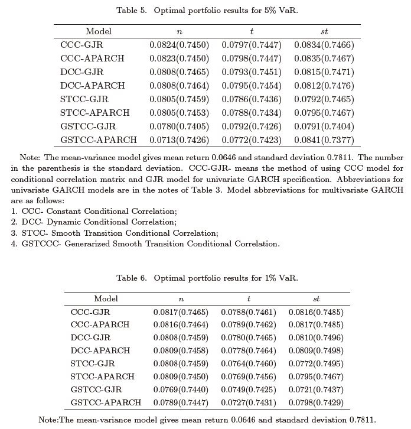
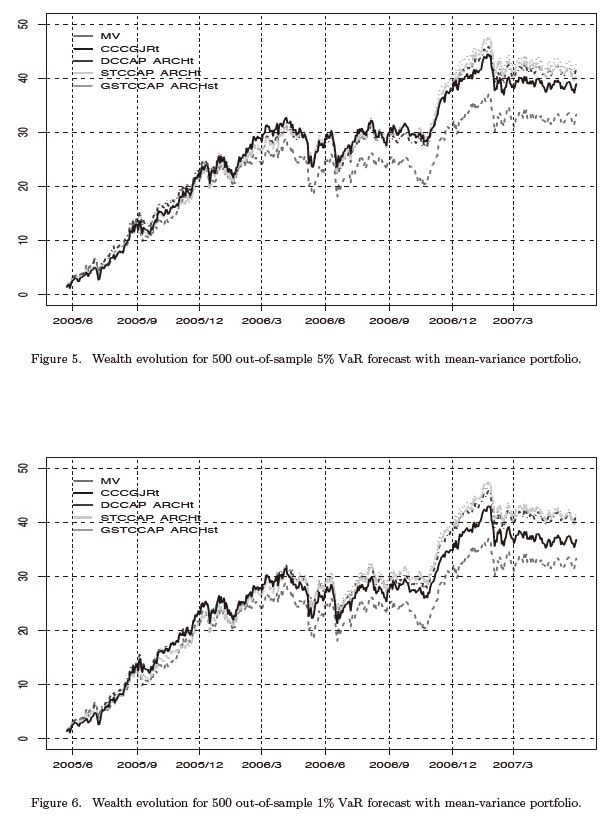
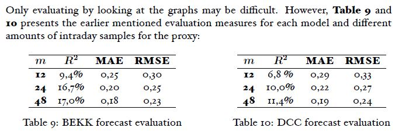
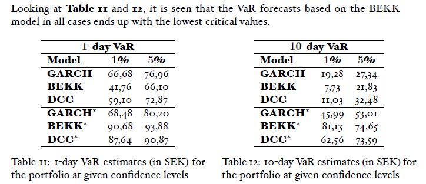
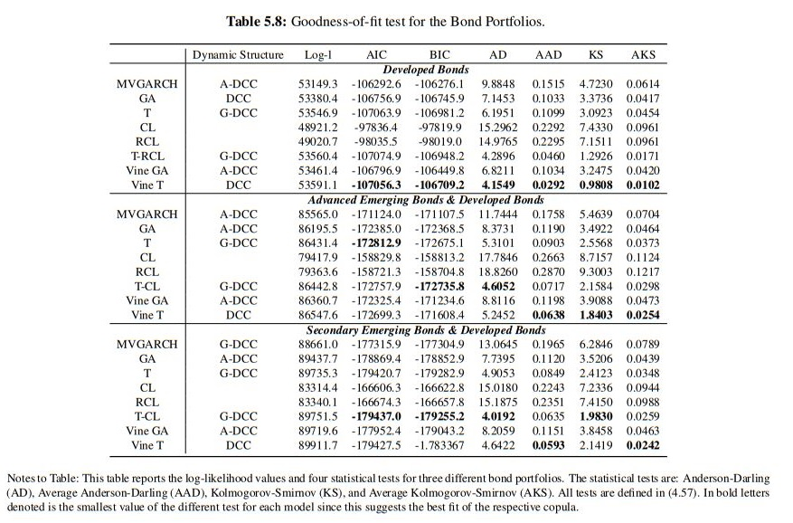

```{r setup}
suppressPackageStartupMessages(library('BBmisc'))
#'@ suppressPackageStartupMessages(library('rmsfuns'))

pkgs <- c('knitr', 'kableExtra', 'devtools', 'lubridate', 'data.table', 'quantmod', 'qrmtools', 'tidyquant', 'plyr', 'stringr', 'magrittr', 'dplyr', 'tidyverse', 'memoise', 'highcharter', 'formattable', 'DT', 'rugarch', 'ccgarch', 'mgarchBEKK', 'rmgarch')

suppressAll(lib(pkgs))
#'@ load_pkg(pkgs)

funs <- c('calc_fx.R', 'opt_arma.R', 'filterFX.R', 'filter_spec.R', 'mv_fx.R', 'read_umodels.R')
l_ply(funs, function(x) source(paste0('./function/', x)))

options(warn=-1)#, 'scipen'=100, 'digits'=4)
rm(pkgs)
```

# Introduction

From previous papers, I tried to apply few models for FOREX price forecasting and eventually got to know <span style='color:red'>Fractional Intergrated GJR-GARCH</span> is the best fit model as we can refer to *GARCH模型中的ARIMA(p,d,q)参数最优化*. **The standalone ARFIMAX model and methods** in the [A short introduction to the rugarch package](http://www.unstarched.net/r-examples/rugarch/a-short-introduction-to-the-rugarch-package/) describe the `autoarfima()` function where we can easily get the optimal MA and AR figure.

Today I am zooming into the multivariate GARCH models.

# Data

## Read Data

Similar with *GARCH模型中的ARIMA(p,d,q)参数最优化*, I use the dataset from [Binary-Q1 (Extention)](http://rpubs.com/englianhu/binary-Q1E).

```{r read-data, warning=FALSE}
cr_code <- c('AUDUSD=X', 'EURUSD=X', 'GBPUSD=X', 'CHF=X', 'CAD=X', 
             'CNY=X', 'JPY=X')

#'@ names(cr_code) <- c('AUDUSD', 'EURUSD', 'GBPUSD', 'USDCHF', 'USDCAD', 
#'@                     'USDCNY', 'USDJPY')

names(cr_code) <- c('USDAUD', 'USDEUR', 'USDGBP', 'USDCHF', 'USDCAD', 'USDCNY', 'USDJPY')

## Read presaved Yahoo data.
mbase <- sapply(names(cr_code), function(x) readRDS(paste0('./data/', x, '.rds')) %>% na.omit)

.price_types <- c('OHLC', 'HLC', 'HL', 'C')

## all currencies trading day.
timeID <- llply(mbase, function(x) as.character(index(x))) %>% 
  unlist
timeID %<>% plyr::count()
#timeID %>% dplyr::count(freq)
## A tibble: 4 x 2
#   freq     n
#  <int> <int>
#1     1     1
#2     3     1
#3     6     3
#4     7  1472
timeID %<>% dplyr::filter(freq == 7) %>% .$x %>% unique %>% as.Date %>% sort
timeID <- c(timeID, xts::last(timeID) + days(1)) #the last date + 1 in order to predict the next day of last date to make whole dataset completed.
timeID0 <- ymd('2013-01-01')
timeID %<>% .[. >= timeID0]

.cl = TRUE
```

# Modelling

## Introduce Multivariate Garch Models

Multivariate GARCH models including DCC, GO-GARCH and Copula-GARCH, CCC and BEKK. Paper *Comparison of Multivariate GARCH Models with Application to Zero-Coupon Bond Volatility* compares DCC and BEKK model on bond market with maturities of 6 months, 1 year and 2 years. The thesis concludes that the fitting performance of the BEKK is better than DCC in their case, the difference might due to the number of the parameters of BEKK model is comparatively more, so that the BEKK has a better capanility in explaning the information hidden in the hostory data. In opposite, the DCC model has an advantage over the BEKK model in the area of forecasting as the DCC model is more parsimonious than BEKK model. From my understanding means that if we compare with deviance or AIC/BIC the DCC will be more accurate. However, this paper will compare as well since forex market is not bond market.

[**R - Time Series** : Comandos R para análises de séries temporais](https://rpubs.com/EconFin/mgarch) is a website to introduce the multivariate GARCH models (in Portuguese language).

*Currency Hedging Strategies Using Dynamic Multivariate GARCH* compares DCC, BEKK, CCC and VARMA-AGARCH models to examine the conditional volatilities among the spot and two distint futures maturities, namely near-month and next-to-near-month contracts. The estimated conditionl covariances matrices from these models were used to calculate the optimal portfolios weights and optimal hedge ratios.^[Kindly refer to ] The empirical results in the paper reveal that there are not big differences either the near-month or next-to-near-month contract is used for hedge spot position on currencies. They also reveal that hedging ratios are lower for near-month contract when the USD/EUR and USD/JPY exchange rates are anlyzed. This result is explained in terms of the higher correlation between spot prices and the next-to-near-month future prices than that with near-month contract and additionally because of the lower volatility of the long maturity futures. Finally across all currencies and error densities, the CCC and VARMA-AGARCH models provide similar results in terms of hedging ratios, portfolio variance reduction and hedging effectiveness. Some difference might appear when the DCC and BEKK models are used. Below is the table summary of the paper.

```{r, echo=FALSE}
dfm1 <- data_frame(
  Model = c('CCC'), 
  Currency = c('EURS', 'GBPS', 'JPYS'), 
  AIC = c(2.738605, 2.247209, 2.827915))

dfm2 <- data_frame(
  Model = c('VARMA-AGARCH'), 
  Currency = c('EURS', 'GBPS', 'JPYS'), 
  AIC = c(2.734926, 2.241061, 2.828964))

dfm3 <- data_frame(
  Model = c('DCC'), 
  Currency = c('EURS', 'GBPS', 'JPYS'), 
  AIC = c(2.721337, 2.205663, 2.784974))

dfm4 <- data_frame(
  Model = c('BEKK'), 
  Currency = c('EURS', 'GBPS', 'JPYS'), 
  AIC = c(2.735964, 2.212324, 2.788730))

dfm <- list(dfm1, dfm2, dfm3, dfm4) %>% 
  bind_rows %>% 
  mutate_if(is.character, as.factor) %>% 
  arrange(Currency)

rm(dfm1, dfm2, dfm3, dfm4)
dfm %>% 
  kable(caption = 'Comparison Summary') %>% 
  kable_styling(bootstrap_options = c('striped', 'hover', 'condensed', 'responsive')) %>% 
  group_rows('EURS', 1, 4, label_row_css = 'background-color: #003399; color: #fff;') %>%
  group_rows('GBPS', 5, 8, label_row_css = 'background-color: #003399; color: #fff;') %>% 
  group_rows('JPYS', 9, 12, label_row_css = 'background-color: #003399; color: #fff;') %>%

  scroll_box(width = '100%', height = '400px')
```

*Table 3.1.1 : comparison of the models.*

Table above shows DCC model is the best fit model.

*Do We Really Need Both BEKK and DCC - A Tale of Two Multivariate GARCH Models* compares few models and final model should be based on model performance within the appropriate framework in which they are used (such as covariance, correlation forecasting, risk monitoringm or portfolio allocation, to cite the most relevant), the paper concludes that the cDCC (constant DCC) model^[Similar with paper *Aielli (2010)* who suggest using cDCC model insted of the DCC model of *Engle (2002)*. Similar with papers *Engle et al. (2008)* and *Engle Engle and Kelly (2009)*.] and BEKK model.

*Forecasting the Daily Dynamic Hedge Ratios by GARCH Models - Evidence from the Agricultural Futures Markets* compares few models which are bivariate GARCH, BEKK GARCH, GARCH-X, BEKK-X, Q-GARCH and GARCH-GJR in agricultural futures markets. The paper reveals that the BEKK model dominates others models for storable wheat and soybean for both forecasting horizons, and the asymmetric GJR andQ-GARCH models does the best forecasting performance for the non-storable products, live cattle and live hogs.

*Dynamic Portfolio Optimization using Generalized Dynamic Conditional Heteroskedastic Factor Models* compares . The paper studies the portfolio selection problem based on a generalized dynamic factor model (GDFM) with conditional heteroskedasticity in the idiosyncratic components. We propose a Generalized Smooth Transition Conditional Correlation (GSTCC) model for the idiosyncratic components combined with the GDFM. Among all the multivariate GARCH models that the authors propose, the generalized smooth transition conditional correlation provides the best result.





I try to surf over internet and the model has no yet widely use. Here I can only use the CCC, DCC models but the best performance GSTCC is not yet available in r packages. The `cccgarch` has STCC model but there has no examples to use it. I roughly read over the `ccgarch` package and noticed that all parameters required in matrix format which is only suitable for advance user use.

*Forecasting Conditional Correlation for Exchange Rates using Multivariate GARCH Models with Historical Value-at-Risk Application* compares the VaR for trade in USDSEK in T+1 and T+10 with intraday 30 minutes time interval. When comparing the BEKK and DCC model, the BEKK seems to perform better than the DCC in both forecasting conditional correlation and predicting VaR. On the contrary, the BEKK is much more computationally demanding, which most certainly would be even more noticeable when the number of assets increase.





## Parameter Selection

```{r dcc1, echo=FALSE, eval=FALSE}
## ---------- eval = FALSE --------------------
### ========= using cluster for sampling ===============
fit <- llply(na.omit(Cl(mbase[['USDJPY']])), function(x){
  
  armaOrder = opt_arma(x)
  
  xspec = ugarchspec(
    variance.model = list(
      model = 'gjrGARCH', garchOrder = c(1, 1), 
      submodel = NULL, external.regressors = NULL, 
      variance.targeting = FALSE), 
    mean.model = list(
      armaOrder = armaOrder[c(1, 3)], 
      include.mean = TRUE, archm = FALSE, 
      archpow = 1, arfima = TRUE, 
      external.regressors = NULL, 
      archex = FALSE), 
    fixed.pars = list(arfima = armaOrder[2]), 
    distribution.model = 'snorm')
    
  uspec = multispec(replicate(4, xspec))
  
  spec1 = dccspec(uspec = uspec, dccOrder = c(1, 1), 
                  model='aDCC', distribution = 'mvt')
  
  cl = makePSOCKcluster(4)
  multf = multifit(uspec, x, cluster = cl)
  
  fit1 = dccfit(spec1, data = x, solver = 'hybrid', 
                fit.control = list(eval.se = TRUE), 
                fit = multf, cluster = cl)
  
  return(fit1)
  })
```

My initially workable models result.

```{r wdcc-aic}
workable.dcc <- readRDS('data/fx/pt.dcc.rds')

#'@ dcc.AIC <- ldply(workable.dcc, function(x) {
#'@     ldply(x, function(y) {
#'@             list.select(y, AIC) %>% 
#'@             data.frame %>% t %>% data.frame %>% 
#'@             mutate(includes.Op = c(TRUE, FALSE))
#'@     }) %>% rename(.solver = .id)
#'@   }) %>% 
#'@   dplyr::select(.id, .solver, includes.Op, Akaike, Bayes, Shibata, Hannan.Quinn)

dcc.AIC <- ldply(workable.dcc, function(x) {
    zz <- ldply(x, function(y) {
        zz <- ldply(y, function(z) {
            z$AIC %>% 
            data.frame %>% t %>% data.frame
        })
        names(zz)[1] <- 'includes.Op'
        zz
    })
    names(zz)[1] <- '.solver'
    zz
  })

dcc.AIC %>% 
  arrange(Akaike, Bayes) %>% 
  kable(caption = 'Akaike Information Criteria') %>% 
  kable_styling(bootstrap_options = c('striped', 'hover', 'condensed', 'responsive')) %>%
  scroll_box(width = '100%', height = '400px')
```

*Table 3.2.1.1 : AIC comparison.*

From above table, `r unlist(dcc.AIC$Akaike) %>% .[which.min(.)] %>% names` with `r unlist(dcc.AIC$Akaike) %>% .[which.min(.)]` is the best fitted model.

```{r dcc-llh}
dcc.logLik <- ldply(workable.dcc, function(x) {
    zz = ldply(x, function(y) {
        zz = ldply(y, function(z) {
            attributes(z$fit)$mfit$llh
        })
        names(zz) <- c('includes.Op', 'log.Likelihood')
        zz
    })
    names(zz)[1] <- '.solver'
    zz
  })

dcc.logLik %>% 
  arrange(log.Likelihood) %>% 
  kable(caption = 'Log-Likelihood') %>% 
  kable_styling(bootstrap_options = c('striped', 'hover', 'condensed', 'responsive')) %>%
  scroll_box(width = '100%', height = '400px')
```

*Table 3.2.1.2 : Log-Likelihood comparison.*

### Close Price

```{r bk-dcc, eval=FALSE}
## ------- eval ----------
## Possible multivariate models.
md <- c('DCC', 'aDCC', 'FDCC')
sv <- c('solnp', 'nlminb', 'lbfgs', 'gosolnp')

## Includes the open price or not.
bk.base <- llply(mbase, Cl)
bk.base %<>% do.call(cbind, .) %>% na.omit

## Statistical modelling
bk.dcc <- llply(md, function(x) {
  dm <- llply(sv, function(y) {
    fit <- tryCatch(
      mv_fx(bk.base, .model = x, .solver = y, 
            .include.Op = FALSE, .Cl.only = TRUE), 
      error = function(e) cat(paste0('bk.', x, '.', y, ' error.\n')))
  
  if (!is.null('fit')) {
    eval(parse(text = paste0(
      "saveRDS(fit, 'data/fx/", paste0('bk.', x, '.', y), ".rds')")))
    cat(paste0('bk.', x, '.', y, ' saved.\n'))
  }
  })
  names(dm) <- sv
  dm
})
names(bk.dcc) <- md
```

I executed above coding and there are quite some models occured errors. The `FDCC` models do faced error even though change all possible solvers. Below I read presaved data which executed above.

```{r read-bkdcc}
fls <- list.files('data/fx', pattern = '^bk.') %>% str_replace_all('.rds', '')

bk.dcc <- sapply(fls, function(x) readRDS(paste0('data/fx/', x, '.rds'))) %>% 
  filterNull
```

Here I tried to compare the AIC values. The lowest value will be best fit model.

```{r bkdcc-aic}
##compare AIC values.
dcc.AIC <- sapply(bk.dcc, function(x) data.frame(t(x$AIC))) %>% 
    t %>% data.frame(.id = rownames(.)) %>% 
    separate(.id, c('.id', '.model', '.solver')) %>% 
    dplyr::select(.id, .model, .solver, Akaike, Bayes, Shibata, Hannan.Quinn) %>% 
  unnest
rownames(dcc.AIC) <- NULL

dcc.AIC %>% 
  arrange(Akaike, Bayes) %>% 
  kable(caption = 'Akaike Information Criteria') %>% 
  kable_styling(bootstrap_options = c('striped', 'hover', 'condensed', 'responsive')) %>%
  scroll_box(width = '100%', height = '400px')
```

*Table 3.2.3.1 : AIC comparison.*

From above table, `r unlist(dcc.AIC$Akaike) %>% .[which.min(.)] %>% names` with `r unlist(dcc.AIC$Akaike) %>% .[which.min(.)]` is the best fitted model.
After that, look at the log-likehood figure as well to compare the correlation among models. The highest value will be best fit model.

```{r bkdcc-logLik}
##compare AIC values.
dcc.logLik <- sapply(bk.dcc, function(x) attributes(x$fit)$mfit$llh) %>% 
    t %>% t %>% data.frame(.id = rownames(.)) %>% 
    separate(.id, c('.id', '.model', '.solver'))
rownames(dcc.logLik) <- NULL
names(dcc.logLik)[1] <- 'log.Likelihood'
dcc.logLik %<>% dplyr::select(.id, .model, .solver, log.Likelihood)

dcc.logLik %>% 
  arrange(log.Likelihood) %>% 
  kable(caption = 'Log-Likelihood') %>% 
  kable_styling(bootstrap_options = c('striped', 'hover', 'condensed', 'responsive'))
```

*Table 3.2.3.2 : Log-Likelihood comparison.*

```{r bkdcc-roll}
## Possible multivariate models.
md <- c('DCC', 'aDCC', 'FDCC')
sv <- c('solnp', 'nlminb', 'lbfgs', 'gosolnp')

## Includes the open price or not.
bk.base <- llply(mbase, Cl)
bk.base %<>% do.call(cbind, .) %>% na.omit

## Statistical modelling
bk.dcc <- llply(md, function(x) {
  dm <- llply(sv, function(y) {
    fit <- tryCatch(
      mv_fx(bk.base, .model = x, .solver = y, 
            .include.Op = FALSE, .Cl.only = TRUE, .roll = TRUE), 
      error = function(e) cat(paste0('roll.bk.', x, '.', y, ' error.\n')))
  
  if (!is.null('fit')) {
    eval(parse(text = paste0(
      "saveRDS(fit, 'data/fx/", paste0('roll.bk.', x, '.', y), ".rds')")))
    cat(paste0('roll.bk.', x, '.', y, ' saved.\n'))
  }
  })
  names(dm) <- sv
  dm
})
names(bk.dcc) <- md
```

### Hi-Lo Price

#### Single Currency

Multivariate modelling for single currency. Here I tried to seperate to 2 type of forecasting dataset which are `OHLC` and `HLC` to know if includes the open price will be more accurate or not.

```{r pt-dcc, eval=FALSE}
## ------------- eval ---------------
## Possible multivariate models.
md <- c('DCC', 'aDCC', 'FDCC')
sv <- c('solnp', 'nlminb', 'lbfgs', 'gosolnp')
op <- c(TRUE, FALSE)

## Includes the open price or not.
pt.base <- mbase[['USDJPY']][,1:4]

## Statistical modelling
pt.dcc <- llply(md, function(x) {
  dm <- llply(sv, function(y) {
    TF <- llply(op, function(z) {
      fit <- tryCatch(
        mv_fx(pt.base, .model = x, .solver = y, 
              .include.Op = z, .Cl.only = FALSE), 
        error = function(e) 
          cat(paste0('pt.', x, '.', y, '.', z,' error.\n')))
      
      if (!is.null('fit')) {
        eval(parse(text = paste0(
          "saveRDS(fit, 'data/fx/", 
          paste0('pt.', x, '.', y, '.', z), ".rds')")))
        cat(paste0('pt.', x, '.', y, '.', z, ' saved.\n'))
        }
    })
    names(TF) <- op
    TF
  })
  names(dm) <- sv
  dm
})
names(pt.dcc) <- md
```

I executed above coding and there are quite some models occured errors. The `FDCC` models do faced error even though change all possible solvers. Below I read presaved data which executed above.

```{r read-ptdcc}
fls <- list.files('data/fx', pattern = '^pt.[^dcc]') %>% str_replace_all('.rds', '')

pt.dcc <- sapply(fls, function(x) readRDS(paste0('data/fx/', x, '.rds'))) %>% 
  filterNull
```

Here I tried to compare the AIC values. The lowest value will be best fit model.

```{r ptdcc-aic}
##compare AIC values.
dcc.AIC <- sapply(pt.dcc, function(x) data.frame(t(data.frame(x$AIC)))) %>% 
    t %>% data.frame(.id = rownames(.)) %>% 
    separate(.id, c('.id', '.model', '.solver', 'includes.Op')) %>% 
    dplyr::select(.id, .model, .solver, includes.Op, Akaike, Bayes, Shibata, Hannan.Quinn) %>% unnest
rownames(dcc.AIC) <- NULL

dcc.AIC %>% 
  arrange(Akaike, Bayes) %>% 
  kable(caption = 'Akaike Information Criteria') %>% 
  kable_styling(bootstrap_options = c('striped', 'hover', 'condensed', 'responsive')) %>%
  scroll_box(width = '100%', height = '400px')
```

*Table 3.2.4.1 : AIC comparison.*

From above table, `r unlist(dcc.AIC$Akaike) %>% .[which.min(.)] %>% names` with `r unlist(dcc.AIC$Akaike) %>% .[which.min(.)]` is the best fitted model. After that, look at the log-likehood figure as well to compare the correlation among models. The highest value will be best fit model.

```{r ptdcc-logLik}
##compare AIC values.
dcc.logLik <- sapply(pt.dcc, function(x) attributes(x$fit)$mfit$llh) %>% 
    t %>% t %>% data.frame(.id = rownames(.)) %>% 
    separate(.id, c('.id', '.model', '.solver', 'includes.Op'))
rownames(dcc.logLik) <- NULL
names(dcc.logLik)[1] <- 'log.Likelihood'
dcc.logLik %<>% dplyr::select(.id, .model, .solver, includes.Op, log.Likelihood)

dcc.logLik %>% 
  arrange(log.Likelihood) %>% 
  kable(caption = 'Log-Likelihood') %>% 
  kable_styling(bootstrap_options = c('striped', 'hover', 'condensed', 'responsive'))
```

*Table 3.2.4.2 : Log-Likelihood comparison.*

The model `r dcc.logLik %>% dplyr::filter(log.Likelihood == max(log.Likelihood)) %>% unite(.id, .id:includes.Op) %>% .$.id %>% str_replace_all('_', '.')` which highest logLik value `r dcc.logLik$log.Likelihood[which.max(dcc.logLik$log.Likelihood)]` is the best fitted model for correlation.

```{r ptdcc-roll, eval=FALSE}
## ------------- eval ---------------
## Possible multivariate models.
md <- c('DCC', 'aDCC', 'FDCC')
sv <- c('solnp', 'nlminb', 'lbfgs', 'gosolnp')
op <- c(TRUE, FALSE)

## Includes the open price or not.
pt.base <- mbase[['USDJPY']][,1:4]

## Statistical modelling
pt.dcc <- llply(md, function(x) {
  dm <- llply(sv, function(y) {
    TF <- llply(op, function(z) {
      fit <- tryCatch(
        mv_fx(pt.base, .model = x, .solver = y, 
              .include.Op = z, .Cl.only = FALSE, .roll = TRUE), 
        error = function(e) 
          cat(paste0('roll.pt.', x, '.', y, '.', z,' error.\n')))
      
      if (!is.null('fit')) {
        eval(parse(text = paste0(
          "saveRDS(fit, 'data/fx/", 
          paste0('roll.pt.', x, '.', y, '.', z), ".rds')")))
        cat(paste0('roll.pt.', x, '.', y, '.', z, ' saved.\n'))
        }
    })
    names(TF) <- op
    TF
  })
  names(dm) <- sv
  dm
})
names(pt.dcc) <- md
```

#### Currency Basket

Multivariate modelling for a basket of currencies for `Cl` will compares in following section. The `HL` and `HLC` will be in another paper.

### Concludes Parameter Selection

I initially wonder if I need to includes the open price in the models. Therefore I tried to compare above models. However the open price might not in use the my trading strategy. Therefore here I skip it. Here I seperates to 3 selection for trading:

- Hi-Lo
- Hi-Lo-Cl
- Cl

From previous univariate models comparison, gjrGARCH almost be the most accurate across all mentioned currencies. Due to the MSE of USDJPY will be higher than other currency, here I use USDJPY to save the time to compare the models. Above solver shows that the `solnp` and `gosolnp` will be more accurate, here I only use these 2 solvers. I skip the `Open Price` because it will not use in either be punter nor banker.


*Source : [转载]詹姆斯-哈里斯-西蒙斯(James Harris Simons)*

*[转载]詹姆斯-哈里斯-西蒙斯(James Harris Simons)* describe the open price of future market and the close price of last day was highly related. There will be another research (if any). However I tried to use previous day's price to model in `VAR=TRUE`.

## DCC

### Abtract of DDC

Due to article *The GARCH DCC Model and 2 Stage DCCMVT Estimation*^[Kindly refer to [Reference] for further reading.] compares the `model = c('DCC', 'aDCC')` but not `model = 'FDCC'` with all distributions and concludes that `aDCC` with `distribution = 'mvt'` is the best fit model and distribution for multivariate GARCH model. Here I directly use `mvt` but in different `solver` parameters.

The paper [Binary.com Interview Q1 - Comparison of Univariate GARCH Models](https://rpubs.com/englianhu/binary-Q1Uni-GARCH) describes the GARCH orders. [How to identify the ARCH and GARCH lag length in dynamic conditional correlation GARCH model?](https://stats.stackexchange.com/questions/136302/how-to-identify-the-arch-and-garch-lag-length-in-dynamic-conditional-correlation?answertab=votes#tab-top) describes the GARCH(1,1) and also DCC-GARCH as well.

*Multivariate DCC-GARCH Model* introduce the DCC and CCC models. In all tests for marginal goodness of fit the DCC-GARCH with skew Student's t-distributed errors outperformed the DCC-GARCH with Gaussian and Student's t-distributed errors. Comparing the DCC-GARCH model with the CCC-GARCH model using the Kupiec test showed that the DCC-GARCH model gave a better fit to the data.

#### VAR and Robust

Below models will set `VAR=TRUE` <s>and `robust=FALSE`</s> and `VAR=FALSE` to test if it is more accurate.

> If you have a multivariate conditional mean specification (i.e. VAR) then you cannot have a univariate conditional mean specification (arma model)...they are mutually exclusive. In short, do not enter anything for mean.model in ugarchspec (include.mean is automatically set to FALSE if VAR is selected).

*source : [rmgarch:dccforecast() and mregfor](http://r.789695.n4.nabble.com/rmgarch-dccforecast-and-mregfor-td4675161.html) or [how to test significance of VAR coefficients in DCC GARCH Fit](http://r.789695.n4.nabble.com/how-to-test-significance-of-VAR-coefficients-in-DCC-GARCH-Fit-td4472274.html)*

> Currently the DCCfit object (returned from running dccfit) does not return all the information on the VAR (coefficients can be extracted by looking at the model slot and 'varcoef' list i.e. fit at model$varcoef).
> 
> A better approach is to first estimate the VAR model using the function 'varxfit' in the package which returns the standard errors and all relevant information, and then passing this returned object to the dccfit routine (example follows).

```
#################
library(rmgarch)
data(dji30ret)
Data = dji30ret[, 1:3, drop = FALSE]

vfit = varxfit(X=Data, p=1, exogen = NULL, robust = FALSE,
gamma = 0.25, delta = 0.01, nc = 10, ns = 500, postpad = "constant")

uspec = ugarchspec(mean.model = list(armaOrder = c(0,0), include.mean = 
FALSE), variance.model = list(garchOrder = c(1,1), model = "sGARCH"),
distribution.model = "norm")

spec = dccspec(uspec = multispec( replicate(3, uspec) ), VAR = TRUE,
lag = 1, dccOrder = c(1,1), asymmetric = FALSE, distribution = "mvnorm")

fit = dccfit(spec, data = Data, fit.control = list(eval.se=TRUE), 
VAR.fit = vfit)
#################
```

> The package also includes for convenience the 'varxfilter', 'varxforecast' and 'varxsim' functions which are used by the multivariate garch routines internally.
> 
> As mentioned in the documentation, a comprehensive list of examples are included in the 'inst/rmgarch.tests' folder of the package.
> 
> Regards,
> 
> Alexios

*source : [[R-SIG-Finance] how to test significance of VAR coefficients in DCC GARCH Fit](https://stat.ethz.ch/pipermail/r-sig-finance/2012q1/009792.html)*

```{r dcc-var, eval=FALSE}
.VARs = c(TRUE, FALSE)
#.rb = c(TRUE, FALSE)
```

### Hi-Lo

#### `DCC` and `VAR=FALSE`

```{r DCC-HLVARF, message=FALSE, warning=FALSE, eval=FALSE}
## ------------- Simulate mv_fx() ----------------------
## mv_fx just made the model and some argument flexible.
md <- c('DCC', 'aDCC', 'FDCC')
sv <- c('solnp')#, 'gosolnp')

## Hi-Lo.
Hi.base <- llply(mbase['USDJPY'], Hi)
Lo.base <- llply(mbase['USDJPY'], Lo)
HiLo.base <- c(Hi.base, Lo.base) %>% do.call(cbind, .) %>% na.omit

## only use USDJPY trading day.
timeID <- HiLo.base %>% 
  index %>% ymd %>% 
  .[. >= timeID0] %>% 
  c(., xts::last(.) + days(1))
tmID <- list.files('data/fx/USDJPY', 
                   pattern = '^DCC.GARCH.USDJPY.HL.[0-9]{4}-[0-9]{2}-[0-9]{2}.rds') %>% 
  str_extract_all('[0-9]{4}-[0-9]{2}-[0-9]{2}') %>% 
  unlist %>% ymd

baseDT <- ymd('2013-01-01')
timeID %<>% .[!. %in% tmID] %>% .[-1]
timeID %<>% .[. > baseDT]

DCC.GARCH.USDJPY <- list()
for (dt in timeID) {
  
  for (i in seq(cr_code[7])) {
    
    smp <- HiLo.base#[[names(cr_code)[i]]]
    timeID2 <- c(index(smp), xts::last(index(smp)) + days(1))
    
    if (dt %in% timeID2) {
      dtr <- xts::last(index(smp[index(smp) < dt]), 1) #tail(..., 1)
      dtr %<>% .[. > baseDT]
      smp <- smp[paste0(dtr %m-% years(1), '/', dtr)]
      
      DCC.GARCH.USDJPY[[i]] <- tryCatch({ldply(md[1], function(y) {
        df = tryCatch(
          mv_fx(smp, .model = y, .solver = 'solnp', .currency = cr_code[7],#[i], 
                .price_type = 'HL', .VAR = FALSE, .cluster = .cl), 
          error = function(e) cat(paste0(y, '.HL.', 'solnp', ' error.\n')))
        
        df = data.frame(Date = index(df$latestPrice[1]), 
                        Type = paste0(names(df$latestPrice), '.', y), 
                        df$latestPrice, df$forecastPrice, t(df$AIC), 
                        VaR = df$forecastVaR)
        
        names(df) %<>% str_replace_all('[0-9]{4}.[0-9]{2}.[0-9]{2}', 'T1')
        df
      })}, error = function(e) NULL)
      
      if (is.null(DCC.GARCH.USDJPY[[i]])) {
        subdir <- 'USDJPY'
      } else {
        subdir <- substr(names(DCC.GARCH.USDJPY[[i]])[3], 1, 6)
      }
      
      if (!dir.exists(paste0('data/fx/', subdir))) 
        dir.create(paste0('data/fx/', subdir))
      
      saveRDS(DCC.GARCH.USDJPY[[i]], paste0(
        'data/fx/', subdir, '/DCC.GARCH.USDJPY.HL.', 
        unique(DCC.GARCH.USDJPY[[i]]$Date), '.rds'))
      
      cat(paste0(
        'data/fx/', subdir, '/DCC.GARCH.USDJPY.HL.', 
        unique(DCC.GARCH.USDJPY[[i]]$Date), '.rds saved!\n'))
      }
    }; rm(i)
  }
```

#### `aDCC` and `VAR=FALSE`

```{r aDCC-HLVARF, message=FALSE, warning=FALSE, eval=FALSE}
## ------------- Simulate mv_fx() ----------------------
## mv_fx just made the model and some argument flexible.
md <- c('DCC', 'aDCC', 'FDCC')
sv <- c('solnp')#, 'gosolnp')

## Hi-Lo.
Hi.base <- llply(mbase['USDJPY'], Hi)
Lo.base <- llply(mbase['USDJPY'], Lo)
HiLo.base <- c(Hi.base, Lo.base) %>% do.call(cbind, .) %>% na.omit

## only use USDJPY trading day.
timeID <- HiLo.base %>% 
  index %>% ymd %>% 
  .[. >= timeID0] %>% 
  c(., xts::last(.) + days(1))
tmID <- list.files('data/fx/USDJPY', 
                   pattern = '^aDCC.GARCH.USDJPY.HL.[0-9]{4}-[0-9]{2}-[0-9]{2}.rds') %>% 
  str_extract_all('[0-9]{4}-[0-9]{2}-[0-9]{2}') %>% 
  unlist %>% ymd

baseDT <- ymd('2013-01-01')
timeID %<>% .[!. %in% tmID] %>% .[-1]
timeID %<>% .[. > baseDT]

aDCC.GARCH.USDJPY <- list()
for (dt in timeID) {
  
  for (i in seq(cr_code[7])) {
    
    smp <- HiLo.base#[[names(cr_code)[i]]]
    timeID2 <- c(index(smp), xts::last(index(smp)) + days(1))
    
    if (dt %in% timeID2) {
      dtr <- xts::last(index(smp[index(smp) < dt]), 1) #tail(..., 1)
      dtr %<>% .[. > baseDT]
      smp <- smp[paste0(dtr %m-% years(1), '/', dtr)]
      
      aDCC.GARCH.USDJPY[[i]] <- tryCatch({ldply(md[2], function(y) {
        df = tryCatch(
          mv_fx(smp, .model = y, .solver = 'solnp', .currency = cr_code[7],#[i], 
                .price_type = 'HL', .VAR = FALSE, .cluster = .cl), 
          error = function(e) cat(paste0(y, '.HL.', 'solnp', ' error.\n')))
        
        df = data.frame(Date = index(df$latestPrice[1]), 
                        Type = paste0(names(df$latestPrice), '.', y), 
                        df$latestPrice, df$forecastPrice, t(df$AIC), 
                        VaR = df$forecastVaR)
        
        names(df) %<>% str_replace_all('[0-9]{4}.[0-9]{2}.[0-9]{2}', 'T1')
        df
      })}, error = function(e) NULL)
      
      if (is.null(aDCC.GARCH.USDJPY[[i]])) {
        subdir <- 'USDJPY'
      } else {
        subdir <- substr(names(aDCC.GARCH.USDJPY[[i]])[3], 1, 6)
      }
      
      if (!dir.exists(paste0('data/fx/', subdir))) 
        dir.create(paste0('data/fx/', subdir))
      
      saveRDS(aDCC.GARCH.USDJPY[[i]], paste0(
        'data/fx/', subdir, '/aDCC.GARCH.USDJPY.HL.', 
        unique(aDCC.GARCH.USDJPY[[i]]$Date), '.rds'))
      
      cat(paste0(
        'data/fx/', subdir, '/aDCC.GARCH.USDJPY.HL.', 
        unique(aDCC.GARCH.USDJPY[[i]]$Date), '.rds saved!\n'))
      }
    }; rm(i)
  }
```

#### `FDCC` and `VAR=FALSE`

```{r FDCC-HLVARF, message=FALSE, warning=FALSE, eval=FALSE}
## ------------- Simulate mv_fx() ----------------------
## mv_fx just made the model and some argument flexible.
md <- c('DCC', 'aDCC', 'FDCC')
sv <- c('solnp')#, 'gosolnp')

## Hi-Lo.
Hi.base <- llply(mbase['USDJPY'], Hi)
Lo.base <- llply(mbase['USDJPY'], Lo)
HiLo.base <- c(Hi.base, Lo.base) %>% do.call(cbind, .) %>% na.omit

## only use USDJPY trading day.
timeID <- HiLo.base %>% 
  index %>% ymd %>% 
  .[. >= timeID0] %>% 
  c(., xts::last(.) + days(1))
tmID <- list.files('data/fx/USDJPY', 
                   pattern = '^FDCC.GARCH.USDJPY.HL.[0-9]{4}-[0-9]{2}-[0-9]{2}.rds') %>% 
  str_extract_all('[0-9]{4}-[0-9]{2}-[0-9]{2}') %>% 
  unlist %>% ymd

baseDT <- ymd('2013-01-01')
timeID %<>% .[!. %in% tmID] %>% .[-1]
timeID %<>% .[. > baseDT]

FDCC.GARCH.USDJPY <- list()
for (dt in timeID) {
  
  for (i in seq(cr_code[7])) {
    
    smp <- HiLo.base#[[names(cr_code)[i]]]
    timeID2 <- c(index(smp), xts::last(index(smp)) + days(1))
    
    if (dt %in% timeID2) {
      dtr <- xts::last(index(smp[index(smp) < dt]), 1) #tail(..., 1)
      dtr %<>% .[. > baseDT]
      smp <- smp[paste0(dtr %m-% years(1), '/', dtr)]
      
      FDCC.GARCH.USDJPY[[i]] <- tryCatch({ldply(md[3], function(y) {
        df = tryCatch(
          mv_fx(smp, .model = y, .solver = 'solnp', .currency = cr_code[7],#[i], 
                .price_type = 'HL', .VAR = FALSE, .cluster = .cl), 
          error = function(e) cat(paste0(y, '.HL.', 'solnp', ' error.\n')))
        
        df = data.frame(Date = index(df$latestPrice[1]), 
                        Type = paste0(names(df$latestPrice), '.', y), 
                        df$latestPrice, df$forecastPrice, t(df$AIC), 
                        VaR = df$forecastVaR)
        
        names(df) %<>% str_replace_all('[0-9]{4}.[0-9]{2}.[0-9]{2}', 'T1')
        df
      })}, error = function(e) NULL)
      
      if (is.null(FDCC.GARCH.USDJPY[[i]])) {
        subdir <- 'USDJPY'
      } else {
        subdir <- substr(names(FDCC.GARCH.USDJPY[[i]])[3], 1, 6)
      }
      
      if (!dir.exists(paste0('data/fx/', subdir))) 
        dir.create(paste0('data/fx/', subdir))
      
      saveRDS(FDCC.GARCH.USDJPY[[i]], paste0(
        'data/fx/', subdir, '/FDCC.GARCH.USDJPY.HL.', 
        unique(FDCC.GARCH.USDJPY[[i]]$Date), '.rds'))
      
      cat(paste0(
        'data/fx/', subdir, '/FDCC.GARCH.USDJPY.HL.', 
        unique(FDCC.GARCH.USDJPY[[i]]$Date), '.rds saved!\n'))
      }
    }; rm(i)
  }
```

### Hi-Lo-Cl

#### `DCC` and `VAR=FALSE`

```{r DCC-HLCVARF, message=FALSE, warning=FALSE, eval=FALSE}
## ------------- Simulate mv_fx() ----------------------
## mv_fx just made the model and some argument flexible.
md <- c('DCC', 'aDCC', 'FDCC')
sv <- c('solnp')#, 'gosolnp')

## Hi-Lo-Cl.
Hi.base <- llply(mbase['USDJPY'], Hi)
Lo.base <- llply(mbase['USDJPY'], Lo)
Cl.base <- llply(mbase['USDJPY'], Cl)
HiLoCl.base <- c(Hi.base, Lo.base, Cl.base) %>% 
  do.call(cbind, .) %>% na.omit
rm(Hi.base, Lo.base, Cl.base)

## only use USDJPY trading day.
timeID <- HiLoCl.base %>% index %>% ymd %>% 
  .[. >= timeID0] %>% c(., xts::last(.) + days(1))

tmID <- list.files('data/fx/USDJPY', 
                   pattern = '^DCC.GARCH.USDJPY.HLC.[0-9]{4}-[0-9]{2}-[0-9]{2}.rds') %>% 
  str_extract_all('[0-9]{4}-[0-9]{2}-[0-9]{2}') %>% 
  unlist %>% ymd

baseDT <- ymd('2013-01-01')
timeID %<>% .[!. %in% tmID] %>% .[-1]
timeID %<>% .[. > baseDT]

DCC.GARCH.USDJPY <- list()
for (dt in timeID) {
  
  for (i in seq(cr_code[7])) {
    
    smp <- HiLoCl.base#[[names(cr_code)[i]]]
    timeID2 <- c(index(smp), xts::last(index(smp)) + days(1))
    
    if (dt %in% timeID2) {
      dtr <- xts::last(index(smp[index(smp) < dt]), 1) #tail(..., 1)
      dtr %<>% .[. > baseDT]
      smp <- smp[paste0(dtr %m-% years(1), '/', dtr)]
      
      DCC.GARCH.USDJPY[[i]] <- tryCatch({llply(md[1], function(y) {
        df = tryCatch(
          mv_fx(smp, .model = y, .solver = 'solnp', .currency = cr_code[7],#[i], 
                .price_type = 'HLC', .VAR = FALSE, .cluster = .cl), 
          error = function(e) cat(paste0(y, '.HLC.', 'solnp', ' error.\n')))
        
        res = suppressAll(data.frame(Date = index(df$latestPrice[1]), 
                        Type = paste0(names(df$latestPrice), '.', y), 
                        df$latestPrice, df$forecastPrice, t(df$AIC)))
        VaR = df$forecastVaR
        
        names(res) %<>% str_replace_all('[0-9]{4}.[0-9]{2}.[0-9]{2}', 'T1')
        names(VaR) %<>% str_replace_all('[0-9]{4}.[0-9]{2}.[0-9]{2}', 'T1')
        
        return(list(res = res, VaR = VaR))
      })[[1]]}, error = function(e) NULL)
      
      if (is.null(DCC.GARCH.USDJPY[[i]])) {
        subdir <- 'USDJPY'
      } else {
        subdir <- substr(names(DCC.GARCH.USDJPY[[i]]$res)[3], 1, 6)
      }
      
      if (!dir.exists(paste0('data/fx/', subdir))) 
        dir.create(paste0('data/fx/', subdir))
      
      saveRDS(DCC.GARCH.USDJPY[[i]], paste0(
        'data/fx/', subdir, '/DCC.GARCH.USDJPY.HLC.', 
        unique(DCC.GARCH.USDJPY[[i]]$res$Date), '.rds'))
      
      cat(paste0(
        'data/fx/', subdir, '/DCC.GARCH.USDJPY.HLC.', 
        unique(DCC.GARCH.USDJPY[[i]]$res$Date), '.rds saved!\n'))
      }
    }; rm(i)
  }
```

#### `aDCC` and `VAR=FALSE`

```{r aDCC-HLCVARF, message=FALSE, warning=FALSE, eval=FALSE}
## ------------- Simulate mv_fx() ----------------------
## mv_fx just made the model and some argument flexible.
md <- c('DCC', 'aDCC', 'FDCC')
sv <- c('solnp')#, 'gosolnp')

## Hi-Lo-Cl.
Hi.base <- llply(mbase['USDJPY'], Hi)
Lo.base <- llply(mbase['USDJPY'], Lo)
Cl.base <- llply(mbase['USDJPY'], Cl)
HiLoCl.base <- c(Hi.base, Lo.base, Cl.base) %>% 
  do.call(cbind, .) %>% na.omit
rm(Hi.base, Lo.base, Cl.base)

## only use USDJPY trading day.
timeID <- HiLoCl.base %>% index %>% ymd %>% 
  .[. >= timeID0] %>% c(., xts::last(.) + days(1))

tmID <- list.files('data/fx/USDJPY', 
                   pattern = '^aDCC.GARCH.USDJPY.HLC.[0-9]{4}-[0-9]{2}-[0-9]{2}.rds') %>% 
  str_extract_all('[0-9]{4}-[0-9]{2}-[0-9]{2}') %>% 
  unlist %>% ymd

baseDT <- ymd('2013-01-01')
timeID %<>% .[!. %in% tmID] %>% .[-1]
timeID %<>% .[. > baseDT]

aDCC.GARCH.USDJPY <- list()
for (dt in timeID) {
  
  for (i in seq(cr_code[7])) {
    
    smp <- HiLoCl.base#[[names(cr_code)[i]]]
    timeID2 <- c(index(smp), xts::last(index(smp)) + days(1))
    
    if (dt %in% timeID2) {
      dtr <- xts::last(index(smp[index(smp) < dt]), 1) #tail(..., 1)
      dtr %<>% .[. > baseDT]
      smp <- smp[paste0(dtr %m-% years(1), '/', dtr)]
      
      aDCC.GARCH.USDJPY[[i]] <- tryCatch({llply(md[2], function(y) {
        df = tryCatch(
          mv_fx(smp, .model = y, .solver = 'solnp', .currency = cr_code[7],#[i], 
                .price_type = 'HLC', .VAR = FALSE, .cluster = .cl), 
          error = function(e) cat(paste0(y, '.HLC.', 'solnp', ' error.\n')))
        
        res = suppressAll(data.frame(Date = index(df$latestPrice[1]), 
                        Type = paste0(names(df$latestPrice), '.', y), 
                        df$latestPrice, df$forecastPrice, t(df$AIC)))
        VaR = df$forecastVaR
        
        names(res) %<>% str_replace_all('[0-9]{4}.[0-9]{2}.[0-9]{2}', 'T1')
        names(VaR) %<>% str_replace_all('[0-9]{4}.[0-9]{2}.[0-9]{2}', 'T1')
        
        return(list(res = res, VaR = VaR))
      })[[1]]}, error = function(e) NULL)
      
      if (is.null(aDCC.GARCH.USDJPY[[i]])) {
        subdir <- 'USDJPY'
      } else {
        subdir <- substr(names(aDCC.GARCH.USDJPY[[i]]$res)[3], 1, 6)
      }
      
      if (!dir.exists(paste0('data/fx/', subdir))) 
        dir.create(paste0('data/fx/', subdir))
      
      saveRDS(aDCC.GARCH.USDJPY[[i]], paste0(
        'data/fx/', subdir, '/aDCC.GARCH.USDJPY.HLC.', 
        unique(aDCC.GARCH.USDJPY[[i]]$res$Date), '.rds'))
      
      cat(paste0(
        'data/fx/', subdir, '/aDCC.GARCH.USDJPY.HLC.', 
        unique(aDCC.GARCH.USDJPY[[i]]$res$Date), '.rds saved!\n'))
      }
    }; rm(i)
  }
```

#### `FDCC` and `VAR=FALSE`

```{r FDCC-HLCVARF, message=FALSE, warning=FALSE, eval=FALSE}
## ------------- Simulate mv_fx() ----------------------
## mv_fx just made the model and some argument flexible.
md <- c('DCC', 'aDCC', 'FDCC')
sv <- c('solnp')#, 'gosolnp')

## Hi-Lo-Cl.
Hi.base <- llply(mbase['USDJPY'], Hi)
Lo.base <- llply(mbase['USDJPY'], Lo)
Cl.base <- llply(mbase['USDJPY'], Cl)
HiLoCl.base <- c(Hi.base, Lo.base, Cl.base) %>% 
  do.call(cbind, .) %>% na.omit
rm(Hi.base, Lo.base, Cl.base)

## only use USDJPY trading day.
timeID <- HiLoCl.base %>% index %>% ymd %>% 
  .[. >= timeID0] %>% c(., xts::last(.) + days(1))

tmID <- list.files('data/fx/USDJPY', 
                   pattern = '^FDCC.GARCH.USDJPY.HLC.[0-9]{4}-[0-9]{2}-[0-9]{2}.rds') %>% 
  str_extract_all('[0-9]{4}-[0-9]{2}-[0-9]{2}') %>% 
  unlist %>% ymd

baseDT <- ymd('2013-01-01')
timeID %<>% .[!. %in% tmID] %>% .[-1]
timeID %<>% .[. > baseDT]

FDCC.GARCH.USDJPY <- list()
for (dt in timeID) {
  
  for (i in seq(cr_code[7])) {
    
    smp <- HiLoCl.base#[[names(cr_code)[i]]]
    timeID2 <- c(index(smp), xts::last(index(smp)) + days(1))
    
    if (dt %in% timeID2) {
      dtr <- xts::last(index(smp[index(smp) < dt]), 1) #tail(..., 1)
      dtr %<>% .[. > baseDT]
      smp <- smp[paste0(dtr %m-% years(1), '/', dtr)]
      
      FDCC.GARCH.USDJPY[[i]] <- tryCatch({llply(md[3], function(y) {
        df = tryCatch(
          mv_fx(smp, .model = y, .solver = 'solnp', .currency = cr_code[7],#[i], 
                .price_type = 'HLC', .VAR = FALSE, .cluster = .cl), 
          error = function(e) cat(paste0(y, '.HLC.', 'solnp', ' error.\n')))
        
        res = suppressAll(data.frame(Date = index(df$latestPrice[1]), 
                        Type = paste0(names(df$latestPrice), '.', y), 
                        df$latestPrice, df$forecastPrice, t(df$AIC)))
        VaR = df$forecastVaR
        
        names(res) %<>% str_replace_all('[0-9]{4}.[0-9]{2}.[0-9]{2}', 'T1')
        names(VaR) %<>% str_replace_all('[0-9]{4}.[0-9]{2}.[0-9]{2}', 'T1')
        
        return(list(res = res, VaR = VaR))
      })[[1]]}, error = function(e) NULL)
      
      if (is.null(FDCC.GARCH.USDJPY[[i]])) {
        subdir <- 'USDJPY'
      } else {
        subdir <- substr(names(FDCC.GARCH.USDJPY[[i]]$res)[3], 1, 6)
      }
      
      if (!dir.exists(paste0('data/fx/', subdir))) 
        dir.create(paste0('data/fx/', subdir))
      
      if (!is.null(FDCC.GARCH.USDJPY[[i]])) {
        saveRDS(FDCC.GARCH.USDJPY[[i]], paste0(
        'data/fx/', subdir, '/FDCC.GARCH.USDJPY.HLC.', 
        unique(FDCC.GARCH.USDJPY[[i]]$res$Date), '.rds'))
      
      cat(paste0(
        'data/fx/', subdir, '/FDCC.GARCH.USDJPY.HLC.', 
        unique(FDCC.GARCH.USDJPY[[i]]$res$Date), '.rds saved!\n'))
      }
      }
    }; rm(i)
  }
```

### Cl

#### `DCC` and `VAR=FALSE`

```{r DCC-CVARF, message=FALSE, warning=FALSE, eval=FALSE}
## ------------- Simulate mv_fx() ----------------------
## mv_fx just made the model and some argument flexible.
md <- c('DCC', 'aDCC', 'FDCC')
sv <- c('solnp')#, 'gosolnp')

## Cl.
Cl.base <- llply(mbase, Cl) %>% do.call('cbind', .)
Cl.base %<>% na.omit

## all currencies trading day.
#'@ timeID <- Cl.base %>% do.call('cbind', .) %>% index %>% ymd %>% 
#'@   .[. >= timeID0] %>% c(., xts::last(.) + days(1))

#'@ tmID <- list.files('data/fx/USDJPY', 
#'@                    pattern = '^DCC.GARCH.C.[0-9]{4}-[0-9]{2}-[0-9]{2}.rds') %>% 
#'@   str_extract_all('[0-9]{4}-[0-9]{2}-[0-9]{2}') %>% 
#'@   unlist %>% ymd
timeID <- Cl.base %>% index %>% ymd %>% 
   .[. >= timeID0] %>% c(., xts::last(.) + days(1))
tmID <- list.files('data/fx/USDJPY', 
                   pattern = '^DCC.GARCH.C.[0-9]{4}-[0-9]{2}-[0-9]{2}.rds') %>% 
				   str_extract_all('[0-9]{4}-[0-9]{2}-[0-9]{2}') %>% 
				   unlist %>% ymd %>% unique

baseDT <- ymd('2013-01-01')
timeID %<>% .[!. %in% tmID] %>% .[-1]
timeID %<>% .[. > baseDT]

for (dt in timeID) {

    smp <- Cl.base
    timeID2 <- c(index(smp), xts::last(index(smp)) + days(1))
    
    if (dt %in% timeID2) {
      dtr <- xts::last(index(smp[index(smp) < dt]), 1) #tail(..., 1)
      dtr %<>% .[. > baseDT]
      smp <- smp[paste0(dtr %m-% years(1), '/', dtr)]
      
      DCC.GARCH <- tryCatch({ldply(md[1], function(y) {
        df = tryCatch(
          mv_fx(smp, .model = y, .solver = 'solnp', .currency = 'ALL', 
                .price_type = 'C', .VAR = FALSE, .cluster = .cl), 
          error = function(e) cat(paste0(y, '.C.', 'solnp', ' error.\n')))
        
        df = suppressWarnings(
            data.frame(Date = index(df$latestPrice)[1], Type = y, 
                       df$latestPrice, df$forecastPrice, t(df$AIC), 
                       VaR = df$forecastVaR))
        
        names(df) %<>% str_replace_all('[0-9]{4}.[0-9]{2}.[0-9]{2}', 'T1')
        df
      })}, error = function(e) NULL)
      
      if (is.null(DCC.GARCH)) {
        subdir <- 'USDJPY'
      } else {
        #subdir <- substr(names(DCC.GARCH)[3], 1, 6)
        subdir <- 'USDJPY'
      }
      
      if (!dir.exists(paste0('data/fx/', subdir))) 
        dir.create(paste0('data/fx/', subdir))
      
      if (!is.null(DCC.GARCH)) {
        saveRDS(DCC.GARCH, paste0(
        'data/fx/', subdir, '/DCC.GARCH.C.', 
        unique(DCC.GARCH$Date), '.rds'))
      
      cat(paste0(
        'data/fx/', subdir, '/DCC.GARCH.C.', 
        unique(DCC.GARCH$Date), '.rds saved!\n'))
      }
    }
  }
```

#### `aDCC` and `VAR=FALSE`

```{r aDCC-CVARF, message=FALSE, warning=FALSE, eval=FALSE}
## ------------- Simulate mv_fx() ----------------------
## mv_fx just made the model and some argument flexible.
md <- c('DCC', 'aDCC', 'FDCC')
sv <- c('solnp')#, 'gosolnp')

## Cl.
Cl.base <- llply(mbase, Cl) %>% do.call('cbind', .)
Cl.base %<>% na.omit

timeID <- Cl.base %>% index %>% ymd %>% 
   .[. >= timeID0] %>% c(., xts::last(.) + days(1))
tmID <- list.files('data/fx/USDJPY', 
                   pattern = '^aDCC.GARCH.C.[0-9]{4}-[0-9]{2}-[0-9]{2}.rds') %>% 
				   str_extract_all('[0-9]{4}-[0-9]{2}-[0-9]{2}') %>% 
				   unlist %>% ymd %>% unique

baseDT <- ymd('2013-01-01')
timeID %<>% .[!. %in% tmID] %>% .[-1]
timeID %<>% .[. > baseDT]

for (dt in timeID) {
  
  smp <- Cl.base
  timeID2 <- c(index(smp), xts::last(index(smp)) + days(1))
  
  if (dt %in% timeID2) {
    dtr <- xts::last(index(smp[index(smp) < dt]), 1) #tail(..., 1)
    dtr %<>% .[. > baseDT]
    smp <- smp[paste0(dtr %m-% years(1), '/', dtr)]
    
    aDCC.GARCH <- tryCatch({ldply(md[2], function(y) {
      df = tryCatch(
        mv_fx(smp, .model = y, .solver = 'solnp', .currency = 'ALL', 
              .price_type = 'C', .VAR = FALSE, .cluster = .cl), 
        error = function(e) cat(paste0(y, '.C.', 'solnp', ' error.\n')))
      
      df = suppressWarnings(
        data.frame(Date = index(df$latestPrice)[1], Type = y, 
                   df$latestPrice, df$forecastPrice, t(df$AIC), 
                   VaR = df$forecastVaR))
      
      names(df) %<>% str_replace_all('[0-9]{4}.[0-9]{2}.[0-9]{2}', 'T1')
      df
    })}, error = function(e) NULL)
    
    if (is.null(aDCC.GARCH)) {
      subdir <- 'USDJPY'
    } else {
      #subdir <- substr(names(aDCC.GARCH)[3], 1, 6)
      subdir <- 'USDJPY'
    }
      
    if (!dir.exists(paste0('data/fx/', subdir))) 
      dir.create(paste0('data/fx/', subdir))
    
    if (!is.null(aDCC.GARCH)) {
      saveRDS(aDCC.GARCH, paste0(
        'data/fx/', subdir, '/aDCC.GARCH.C.', 
        unique(aDCC.GARCH$Date), '.rds'))
      
      cat(paste0(
        'data/fx/', subdir, '/aDCC.GARCH.C.', 
        unique(aDCC.GARCH$Date), '.rds saved!\n'))
      }
    }
  }
```

#### `FDCC` and `VAR=FALSE`

```{r FDCC-CVARF, message=FALSE, warning=FALSE, eval=FALSE}
## ------------- Simulate mv_fx() ----------------------
## mv_fx just made the model and some argument flexible.
md <- c('DCC', 'aDCC', 'FDCC')
sv <- c('solnp')#, 'gosolnp')

## Cl.
Cl.base <- llply(mbase, Cl) %>% do.call('cbind', .)
Cl.base %<>% na.omit

timeID <- Cl.base %>% index %>% ymd %>% 
   .[. >= timeID0] %>% c(., xts::last(.) + days(1))
tmID <- list.files('data/fx/USDJPY', 
                   pattern = '^FDCC.GARCH.C.[0-9]{4}-[0-9]{2}-[0-9]{2}.rds') %>% 
				   str_extract_all('[0-9]{4}-[0-9]{2}-[0-9]{2}') %>% 
				   unlist %>% ymd

baseDT <- ymd('2013-01-01')
timeID %<>% .[!. %in% tmID] %>% .[-1]
timeID %<>% .[. > baseDT]

for (dt in timeID) {
  smp <- Cl.base
  timeID2 <- c(index(smp), xts::last(index(smp)) + days(1))
  
  if (dt %in% timeID2) {
    dtr <- xts::last(index(smp[index(smp) < dt]), 1) #tail(..., 1)
    dtr %<>% .[. > baseDT]
    smp <- smp[paste0(dtr %m-% years(1), '/', dtr)]
    
    FDCC.GARCH <- tryCatch({ldply(md[3], function(y) {
      df = tryCatch(
        mv_fx(smp, .model = y, .solver = 'solnp', .currency = 'ALL', 
              .price_type = 'C', .VAR = FALSE, .cluster = .cl), 
        error = function(e) cat(paste0(y, '.C.', 'solnp', ' error.\n')))
      
      df = suppressWarnings(
        data.frame(Date = index(df$latestPrice)[1], Type = y, 
                   df$latestPrice, df$forecastPrice, t(df$AIC), 
                   VaR = df$forecastVaR))
      
      names(df) %<>% str_replace_all('[0-9]{4}.[0-9]{2}.[0-9]{2}', 'T1')
      df
    })}, error = function(e) NULL)
    
    if (is.null(FDCC.GARCH)) {
      subdir <- 'USDJPY'
    } else {
      #subdir <- substr(names(FDCC.GARCH)[3], 1, 6)
      subdir <- 'USDJPY'
    }
    
    if (!dir.exists(paste0('data/fx/', subdir))) 
      dir.create(paste0('data/fx/', subdir))

    if (!is.null(FDCC.GARCH)) {
      saveRDS(FDCC.GARCH, paste0(
        'data/fx/', subdir, '/FDCC.GARCH.C.', 
        unique(FDCC.GARCH$Date), '.rds'))
      
      cat(paste0(
        'data/fx/', subdir, '/FDCC.GARCH.C.', 
        unique(FDCC.GARCH$Date), '.rds saved!\n'))
      }
    }
  }
```

### Op-Hi-Lo-Cl

#### `DCC` and `VAR=FALSE`

```{r DCC-OHLCVARF, message=FALSE, warning=FALSE, eval=FALSE}
## ------------- Simulate mv_fx() ----------------------
## mv_fx just made the model and some argument flexible.
md <- c('DCC', 'aDCC', 'FDCC')
sv <- c('solnp')#, 'gosolnp')

## Op-Hi-Lo-Cl.
Op.base <- llply(mbase['USDJPY'], Op)
Hi.base <- llply(mbase['USDJPY'], Hi)
Lo.base <- llply(mbase['USDJPY'], Lo)
Cl.base <- llply(mbase['USDJPY'], Cl)
OpHiLoCl.base <- c(Op.base, Hi.base, Lo.base, Cl.base) %>% 
  do.call(cbind, .) %>% na.omit
rm(Op.base, Hi.base, Lo.base, Cl.base)

## only use USDJPY trading day.
timeID <- OpHiLoCl.base %>% index %>% ymd %>% 
  .[. >= timeID0] %>% c(., xts::last(.) + days(1))

tmID <- list.files('data/fx/USDJPY', 
                   pattern = '^DCC.GARCH.USDJPY.OHLC.[0-9]{4}-[0-9]{2}-[0-9]{2}.rds') %>% 
  str_extract_all('[0-9]{4}-[0-9]{2}-[0-9]{2}') %>% 
  unlist %>% ymd

baseDT <- ymd('2013-01-01')
timeID %<>% .[!. %in% tmID] %>% .[-1]
timeID %<>% .[. > baseDT]

DCC.GARCH.USDJPY <- list()
for (dt in timeID) {
  
  for (i in seq(cr_code[7])) {
    
    smp <- OpHiLoCl.base#[[names(cr_code)[i]]]
    timeID2 <- c(index(smp), xts::last(index(smp)) + days(1))
    
    if (dt %in% timeID2) {
      dtr <- xts::last(index(smp[index(smp) < dt]), 1) #tail(..., 1)
      dtr %<>% .[. > baseDT]
      smp <- smp[paste0(dtr %m-% years(1), '/', dtr)]
      
      DCC.GARCH.USDJPY[[i]] <- tryCatch({llply(md[1], function(y) {
        df = tryCatch(
          mv_fx(smp, .model = y, .solver = 'solnp', .currency = cr_code[7],#[i], 
                .price_type = 'OHLC', .VAR = FALSE, .cluster = .cl), 
          error = function(e) cat(paste0(y, '.OHLC.', 'solnp', ' error.\n')))
        
        res = suppressAll(data.frame(Date = index(df$latestPrice[1]), 
                        Type = paste0(names(df$latestPrice), '.', y), 
                        df$latestPrice, df$forecastPrice, t(df$AIC)))
        VaR = df$forecastVaR
        
        names(res) %<>% str_replace_all('[0-9]{4}.[0-9]{2}.[0-9]{2}', 'T1')
        names(VaR) %<>% str_replace_all('[0-9]{4}.[0-9]{2}.[0-9]{2}', 'T1')
        
        return(list(res = res, VaR = VaR))
      })[[1]]}, error = function(e) NULL)
      
      if (is.null(DCC.GARCH.USDJPY[[i]])) {
        subdir <- 'USDJPY'
      } else {
        subdir <- substr(names(DCC.GARCH.USDJPY[[i]]$res)[3], 1, 6)
      }
      
      if (!dir.exists(paste0('data/fx/', subdir))) 
        dir.create(paste0('data/fx/', subdir))
      
      saveRDS(DCC.GARCH.USDJPY[[i]], paste0(
        'data/fx/', subdir, '/DCC.GARCH.USDJPY.OHLC.', 
        unique(DCC.GARCH.USDJPY[[i]]$res$Date), '.rds'))
      
      cat(paste0(
        'data/fx/', subdir, '/DCC.GARCH.USDJPY.OHLC.', 
        unique(DCC.GARCH.USDJPY[[i]]$res$Date), '.rds saved!\n'))
      }
    }; rm(i)
  }
```

#### `aDCC` and `VAR=FALSE`

```{r aDCC-OHLCVARF, message=FALSE, warning=FALSE, eval=FALSE}
## ------------- Simulate mv_fx() ----------------------
## mv_fx just made the model and some argument flexible.
md <- c('DCC', 'aDCC', 'FDCC')
sv <- c('solnp')#, 'gosolnp')

## Op-Hi-Lo-Cl.
Op.base <- llply(mbase['USDJPY'], Op)
Hi.base <- llply(mbase['USDJPY'], Hi)
Lo.base <- llply(mbase['USDJPY'], Lo)
Cl.base <- llply(mbase['USDJPY'], Cl)
OpHiLoCl.base <- c(Op.base, Hi.base, Lo.base, Cl.base) %>% 
  do.call(cbind, .) %>% na.omit
rm(Op.base, Hi.base, Lo.base, Cl.base)

## only use USDJPY trading day.
timeID <- OpHiLoCl.base %>% index %>% ymd %>% 
  .[. >= timeID0] %>% c(., xts::last(.) + days(1))

tmID <- list.files('data/fx/USDJPY', 
                   pattern = '^aDCC.GARCH.USDJPY.OHLC.[0-9]{4}-[0-9]{2}-[0-9]{2}.rds') %>% 
  str_extract_all('[0-9]{4}-[0-9]{2}-[0-9]{2}') %>% 
  unlist %>% ymd

baseDT <- ymd('2013-01-01')
timeID %<>% .[!. %in% tmID] %>% .[-1]
timeID %<>% .[. > baseDT]

aDCC.GARCH.USDJPY <- list()
for (dt in timeID) {
  
  for (i in seq(cr_code[7])) {
    
    smp <- OpHiLoCl.base#[[names(cr_code)[i]]]
    timeID2 <- c(index(smp), xts::last(index(smp)) + days(1))
    
    if (dt %in% timeID2) {
      dtr <- xts::last(index(smp[index(smp) < dt]), 1) #tail(..., 1)
      dtr %<>% .[. > baseDT]
      smp <- smp[paste0(dtr %m-% years(1), '/', dtr)]
      
      aDCC.GARCH.USDJPY[[i]] <- tryCatch({llply(md[2], function(y) {
        df = tryCatch(
          mv_fx(smp, .model = y, .solver = 'solnp', .currency = cr_code[7],#[i], 
                .price_type = 'OHLC', .VAR = FALSE, .cluster = .cl), 
          error = function(e) cat(paste0(y, '.OHLC.', 'solnp', ' error.\n')))
        
        res = suppressAll(data.frame(Date = index(df$latestPrice[1]), 
                        Type = paste0(names(df$latestPrice), '.', y), 
                        df$latestPrice, df$forecastPrice, t(df$AIC)))
        VaR = df$forecastVaR
        
        names(res) %<>% str_replace_all('[0-9]{4}.[0-9]{2}.[0-9]{2}', 'T1')
        names(VaR) %<>% str_replace_all('[0-9]{4}.[0-9]{2}.[0-9]{2}', 'T1')
        
        return(list(res = res, VaR = VaR))
      })[[1]]}, error = function(e) NULL)
      
      if (is.null(aDCC.GARCH.USDJPY[[i]])) {
        subdir <- 'USDJPY'
      } else {
        subdir <- substr(names(aDCC.GARCH.USDJPY[[i]]$res)[3], 1, 6)
      }
      
      if (!dir.exists(paste0('data/fx/', subdir))) 
        dir.create(paste0('data/fx/', subdir))
      
      saveRDS(aDCC.GARCH.USDJPY[[i]], paste0(
        'data/fx/', subdir, '/aDCC.GARCH.USDJPY.OHLC.', 
        unique(aDCC.GARCH.USDJPY[[i]]$res$Date), '.rds'))
      
      cat(paste0(
        'data/fx/', subdir, '/aDCC.GARCH.USDJPY.OHLC.', 
        unique(aDCC.GARCH.USDJPY[[i]]$res$Date), '.rds saved!\n'))
      }
    }; rm(i)
  }
```

#### `FDCC` and `VAR=FALSE`

```{r FDCC-OHLCVARF, message=FALSE, warning=FALSE, eval=FALSE}
## ------------- Simulate mv_fx() ----------------------
## mv_fx just made the model and some argument flexible.
md <- c('DCC', 'aDCC', 'FDCC')
sv <- c('solnp')#, 'gosolnp')

## Op-Hi-Lo-Cl.
Op.base <- llply(mbase['USDJPY'], Op)
Hi.base <- llply(mbase['USDJPY'], Hi)
Lo.base <- llply(mbase['USDJPY'], Lo)
Cl.base <- llply(mbase['USDJPY'], Cl)
OpHiLoCl.base <- c(Op.base, Hi.base, Lo.base, Cl.base) %>% 
  do.call(cbind, .) %>% na.omit
rm(Op.base, Hi.base, Lo.base, Cl.base)

## only use USDJPY trading day.
timeID <- OpHiLoCl.base %>% index %>% ymd %>% 
  .[. >= timeID0] %>% c(., xts::last(.) + days(1))

tmID <- list.files('data/fx/USDJPY', 
                   pattern = '^FDCC.GARCH.USDJPY.OHLC.[0-9]{4}-[0-9]{2}-[0-9]{2}.rds') %>% 
  str_extract_all('[0-9]{4}-[0-9]{2}-[0-9]{2}') %>% 
  unlist %>% ymd

baseDT <- ymd('2013-01-01')
timeID %<>% .[!. %in% tmID] %>% .[-1]
timeID %<>% .[. > baseDT]

FDCC.GARCH.USDJPY <- list()
for (dt in timeID) {
  
  for (i in seq(cr_code[7])) {
    
    smp <- OpHiLoCl.base#[[names(cr_code)[i]]]
    timeID2 <- c(index(smp), xts::last(index(smp)) + days(1))
    
    if (dt %in% timeID2) {
      dtr <- xts::last(index(smp[index(smp) < dt]), 1) #tail(..., 1)
      baseDT %<>% .[. > baseDT]
      smp <- smp[paste0(dtr %m-% years(1), '/', dtr)]
      
      FDCC.GARCH.USDJPY[[i]] <- tryCatch({llply(md[3], function(y) {
        df = tryCatch(
          mv_fx(smp, .model = y, .solver = 'solnp', .currency = cr_code[7],#[i], 
                .price_type = 'OHLC', .VAR = FALSE, .cluster = .cl), 
          error = function(e) cat(paste0(y, '.OHLC.', 'solnp', ' error.\n')))
        
        res = suppressAll(data.frame(Date = index(df$latestPrice[1]), 
                        Type = paste0(names(df$latestPrice), '.', y), 
                        df$latestPrice, df$forecastPrice, t(df$AIC)))
        VaR = df$forecastVaR
        
        names(res) %<>% str_replace_all('[0-9]{4}.[0-9]{2}.[0-9]{2}', 'T1')
        names(VaR) %<>% str_replace_all('[0-9]{4}.[0-9]{2}.[0-9]{2}', 'T1')
        
        return(list(res = res, VaR = VaR))
      })[[1]]}, error = function(e) NULL)
      
      if (is.null(FDCC.GARCH.USDJPY[[i]])) {
        subdir <- 'USDJPY'
      } else {
        subdir <- substr(names(FDCC.GARCH.USDJPY[[i]]$res)[3], 1, 6)
      }
      
      if (!dir.exists(paste0('data/fx/', subdir))) 
        dir.create(paste0('data/fx/', subdir))
      
      saveRDS(FDCC.GARCH.USDJPY[[i]], paste0(
        'data/fx/', subdir, '/FDCC.GARCH.USDJPY.OHLC.', 
        unique(FDCC.GARCH.USDJPY[[i]]$res$Date), '.rds'))
      
      cat(paste0(
        'data/fx/', subdir, '/FDCC.GARCH.USDJPY.OHLC.', 
        unique(FDCC.GARCH.USDJPY[[i]]$res$Date), '.rds saved!\n'))
      }
    }; rm(i)
  }
```

## GO-GARCH

### Abstract

- [Higher Moment CAPM with the GO-GARCH (NIG) model.](http://www.unstarched.net/r-examples/rmgarch/higher-moment-capm-with-the-go-garch-nig-model/)
- [VaR and Approximate VaR in the GO-GARCH (NIG) model.](http://www.unstarched.net/r-examples/rmgarch/var-and-approximate-var-in-the-go-garch-nig-model/)
- [MGARCH Comparison using the Hong & Li Misspecification Test](http://www.unstarched.net/r-examples/rmgarch/mgarch-comparison-using-the-hong-li-misspecification-test/) compares few models in `M(1,1), M(2,2), M(3,3), M(4,4)` and concludes that the `go-GARCH` model will be better than normal DCC model in `M(3,3), M(4,4)` while normal DCC model better in `M(1,1)`.
- [`mGARCH` : Generalized Orthogonal GARCH model](http://web.sgh.waw.pl/~mrubas/EFzR/KodyR/mGARCH.R)

From above example, the author .


```{r go-garch1, eval=FALSE}
# --------- draft ------------------
.dist.models <- c('mvnorm', 'manig', 'magh')

## attributes of univariate stage 1
attributes(attributes(fit)$mfit$ufit)

## attributes of univariate stage 2
names(attributes(attributes(attributes(fit)$mfit$ufit)[[1]][[1]])$fit)
names(attributes(attributes(attributes(fit)$mfit$ufit)[[1]][[2]])$fit)
names(attributes(attributes(attributes(fit)$mfit$ufit)[[1]][[3]])$fit)

## AIC
-2*as.numeric(logLik(fit))+2*(length(fit$coefficients)+1)

-2 * as.numeric(attributes(attributes(attributes(fit)$mfit$ufit)[[1]][[1]])$fit$LLH) + 2*(length(attributes(attributes(attributes(fit)$mfit$ufit)[[1]][[1]])$fit$coef) + 1)
```

### Hi-Lo

#### United ARIMA Order Multivariate

`model = 'constant'`

```{r goGARCH-HLCF, message=FALSE, warning=FALSE, eval=FALSE}
## ------------- Simulate mv_fx() ----------------------
## mv_fx just made the model and some argument flexible.
.dist.models <- c('mvnorm', 'manig', 'magh') #using default mvnorm
md <- c('constant', 'AR', 'VAR')
sv <- c('solnp')#, 'gosolnp')

## Hi-Lo.
Hi.base <- llply(mbase['USDJPY'], Hi)
Lo.base <- llply(mbase['USDJPY'], Lo)
HiLo.base <- c(Hi.base, Lo.base) %>% do.call(cbind, .) %>% na.omit

## only use USDJPY trading day.
timeID <- HiLo.base %>% 
  index %>% ymd %>% 
  .[. >= timeID0] %>% 
  c(., xts::last(.) + days(1))
tmID <- list.files('data/fx/USDJPY', 
                   pattern = '^goGARCH.USDJPY.HL.constant.mvnorm.[0-9]{4}-[0-9]{2}-[0-9]{2}.rds') %>% 
  str_extract_all('[0-9]{4}-[0-9]{2}-[0-9]{2}') %>% 
  unlist %>% ymd

timeID %<>% .[!. %in% tmID]
timeID %<>% .[. > ymd('2013-01-01')]
timeID %<>% .[. > baseDT]

goGARCH.USDJPY <- list()
for (dt in timeID) {
  
  for (i in seq(cr_code[7])) {
    
    smp <- HiLo.base#[[names(cr_code)[i]]]
    timeID2 <- c(index(smp), xts::last(index(smp)) + days(1))
    
    if (dt %in% timeID2) {
      dtr <- xts::last(index(smp[index(smp) < dt]), 1) #tail(..., 1)
      dtr %<>% .[. > baseDT]
      smp <- smp[paste0(dtr %m-% years(1), '/', dtr)]
      
      goGARCH.USDJPY[[i]] <- tryCatch({ldply(md[1], function(y) {
        df = tryCatch(
          mv_fx(smp, .mv.model = 'go-GARCH', .model = y, .solver = 'solnp', 
                .currency = cr_code[7],#[i], 
                .price_type = 'HL', .VAR = FALSE, .cluster = .cl), 
          error = function(e) cat(paste0('.HL.', y, 'solnp', ' error.\n')))
        aic = ldply(df$AIC, function(x) {
          data.frame(t(x))
          })
        df = data.frame(Date = index(df$latestPrice[1]), 
                        Type = paste0(names(df$latestPrice), '.', y), 
                        df$latestPrice, df$forecastPrice, aic, 
                        VaR = df$forecastVaR)
        
        names(df) %<>% str_replace_all('[0-9]{4}.[0-9]{2}.[0-9]{2}', 'T1')
        df
      })}, error = function(e) NULL)
      
      if (is.null(goGARCH.USDJPY[[i]])) {
        subdir <- 'USDJPY'
      } else {
        subdir <- substr(names(goGARCH.USDJPY[[i]])[3], 1, 6)
      }
      
      if (!dir.exists(paste0('data/fx/', subdir))) 
        dir.create(paste0('data/fx/', subdir))
      
      saveRDS(goGARCH.USDJPY[[i]], paste0(
        'data/fx/', subdir, '/goGARCH.USDJPY.HL.', md[1], '.', 
        .dist.models[1], '.', 
        unique(goGARCH.USDJPY[[i]]$Date), '.rds'))
      
      cat(paste0(
        'data/fx/', subdir, '/goGARCH.USDJPY.HL.', md[1], '.', 
        .dist.models[1], '.', 
        unique(goGARCH.USDJPY[[i]]$Date), '.rds saved!\n'))
      }
    }; rm(i)
  }
```

`model = 'AR'`

```{r goGARCH-HLARF, message=FALSE, warning=FALSE, eval=FALSE}
## ------------- Simulate mv_fx() ----------------------
## mv_fx just made the model and some argument flexible.
.dist.models <- c('mvnorm', 'manig', 'magh') #using default mvnorm
md <- c('constant', 'AR', 'VAR')
sv <- c('solnp')#, 'gosolnp')

## Hi-Lo.
Hi.base <- llply(mbase['USDJPY'], Hi)
Lo.base <- llply(mbase['USDJPY'], Lo)
HiLo.base <- c(Hi.base, Lo.base) %>% do.call(cbind, .) %>% na.omit

## only use USDJPY trading day.
timeID <- HiLo.base %>% 
  index %>% ymd %>% 
  .[. >= timeID0] %>% 
  c(., xts::last(.) + days(1))
tmID <- list.files('data/fx/USDJPY', 
                   pattern = '^goGARCH.USDJPY.HL.AR.mvnorm.[0-9]{4}-[0-9]{2}-[0-9]{2}.rds') %>% 
  str_extract_all('[0-9]{4}-[0-9]{2}-[0-9]{2}') %>% 
  unlist %>% ymd

timeID %<>% .[!. %in% tmID]
timeID %<>% .[. > ymd('2013-01-01')]
timeID %<>% .[. > baseDT]

goGARCH.USDJPY <- list()
for (dt in timeID) {
  
  for (i in seq(cr_code[7])) {
    
    smp <- HiLo.base#[[names(cr_code)[i]]]
    timeID2 <- c(index(smp), xts::last(index(smp)) + days(1))
    
    if (dt %in% timeID2) {
      dtr <- xts::last(index(smp[index(smp) < dt]), 1) #tail(..., 1)
      dtr %<>% .[. > baseDT]
      smp <- smp[paste0(dtr %m-% years(1), '/', dtr)]
      
      goGARCH.USDJPY[[i]] <- tryCatch({ldply(md[2], function(y) {
        df = tryCatch(
          mv_fx(smp, .mv.model = 'go-GARCH', .model = y, .solver = 'solnp', 
                .currency = cr_code[7],#[i], 
                .price_type = 'HL', .VAR = FALSE, .cluster = .cl), 
          error = function(e) cat(paste0('.HL.', y, 'solnp', ' error.\n')))
        aic = ldply(df$AIC, function(x) {
          data.frame(t(x))
          })
        df = data.frame(Date = index(df$latestPrice[1]), 
                        Type = paste0(names(df$latestPrice), '.', y), 
                        df$latestPrice, df$forecastPrice, aic, 
                        VaR = df$forecastVaR)
        
        names(df) %<>% str_replace_all('[0-9]{4}.[0-9]{2}.[0-9]{2}', 'T1')
        df
      })}, error = function(e) NULL)
      
      if (is.null(goGARCH.USDJPY[[i]])) {
        subdir <- 'USDJPY'
      } else {
        subdir <- substr(names(goGARCH.USDJPY[[i]])[3], 1, 6)
      }
      
      if (!dir.exists(paste0('data/fx/', subdir))) 
        dir.create(paste0('data/fx/', subdir))
      
      saveRDS(goGARCH.USDJPY[[i]], paste0(
        'data/fx/', subdir, '/goGARCH.USDJPY.HL.', md[2], '.', 
        .dist.models[1], '.', 
        unique(goGARCH.USDJPY[[i]]$Date), '.rds'))
      
      cat(paste0(
        'data/fx/', subdir, '/goGARCH.USDJPY.HL.', md[2], '.', 
        .dist.models[1], '.', 
        unique(goGARCH.USDJPY[[i]]$Date), '.rds saved!\n'))
      }
    }; rm(i)
  }
```

`model = 'VAR'`

```{r goGARCH-HLVARF, message=FALSE, warning=FALSE, eval=FALSE}
## ------------- Simulate mv_fx() ----------------------
## mv_fx just made the model and some argument flexible.
.dist.models <- c('mvnorm', 'manig', 'magh') #using default mvnorm
md <- c('constant', 'AR', 'VAR')
sv <- c('solnp')#, 'gosolnp')

## Hi-Lo.
Hi.base <- llply(mbase['USDJPY'], Hi)
Lo.base <- llply(mbase['USDJPY'], Lo)
HiLo.base <- c(Hi.base, Lo.base) %>% do.call(cbind, .) %>% na.omit

## only use USDJPY trading day.
timeID <- HiLo.base %>% 
  index %>% ymd %>% 
  .[. >= timeID0] %>% 
  c(., xts::last(.) + days(1))
tmID <- list.files('data/fx/USDJPY', 
                   pattern = '^goGARCH.USDJPY.HL.VAR.mvnorm.[0-9]{4}-[0-9]{2}-[0-9]{2}.rds') %>% 
  str_extract_all('[0-9]{4}-[0-9]{2}-[0-9]{2}') %>% 
  unlist %>% ymd

timeID %<>% .[!. %in% tmID]
timeID %<>% .[. > ymd('2013-01-01')]
timeID %<>% .[. > baseDT]

goGARCH.USDJPY <- list()
for (dt in timeID) {
  
  for (i in seq(cr_code[7])) {
    
    smp <- HiLo.base#[[names(cr_code)[i]]]
    timeID2 <- c(index(smp), xts::last(index(smp)) + days(1))
    
    if (dt %in% timeID2) {
      dtr <- xts::last(index(smp[index(smp) < dt]), 1) #tail(..., 1)
      dtr %<>% .[. > baseDT]
      smp <- smp[paste0(dtr %m-% years(1), '/', dtr)]
      
      goGARCH.USDJPY[[i]] <- tryCatch({ldply(md[3], function(y) {
        df = tryCatch(
          mv_fx(smp, .mv.model = 'go-GARCH', .model = y, .solver = 'solnp', 
                .currency = cr_code[7],#[i], 
                .price_type = 'HL', .VAR = FALSE, .cluster = .cl), 
          error = function(e) cat(paste0('.HL.', y, 'solnp', ' error.\n')))
        aic = ldply(df$AIC, function(x) {
          data.frame(t(x))
          })
        df = data.frame(Date = index(df$latestPrice[1]), 
                        Type = paste0(names(df$latestPrice), '.', y), 
                        df$latestPrice, df$forecastPrice, aic, 
                        VaR = df$forecastVaR)
        
        names(df) %<>% str_replace_all('[0-9]{4}.[0-9]{2}.[0-9]{2}', 'T1')
        df
      })}, error = function(e) NULL)
      
      if (is.null(goGARCH.USDJPY[[i]])) {
        subdir <- 'USDJPY'
      } else {
        subdir <- substr(names(goGARCH.USDJPY[[i]])[3], 1, 6)
      }
      
      if (!dir.exists(paste0('data/fx/', subdir))) 
        dir.create(paste0('data/fx/', subdir))
      
      saveRDS(goGARCH.USDJPY[[i]], paste0(
        'data/fx/', subdir, '/goGARCH.USDJPY.HL.', md[3], '.', 
        .dist.models[1], '.', 
        unique(goGARCH.USDJPY[[i]]$Date), '.rds'))
      
      cat(paste0(
        'data/fx/', subdir, '/goGARCH.USDJPY.HL.', md[3], '.', 
        .dist.models[1], '.', 
        unique(goGARCH.USDJPY[[i]]$Date), '.rds saved!\n'))
      }
    }; rm(i)
  }
```

#### Flexible ARIMA Order Multivariate

`model = 'constant'`

```{r mvgoGARCH-HLCF, message=FALSE, warning=FALSE, eval=FALSE}
## ------------- Simulate mv_fx() ----------------------
## mv_fx just made the model and some argument flexible.
.dist.models <- c('mvnorm', 'manig', 'magh') #using default mvnorm
md <- c('constant', 'AR', 'VAR')
sv <- c('solnp')#, 'gosolnp')

## Hi-Lo.
Hi.base <- llply(mbase['USDJPY'], Hi)
Lo.base <- llply(mbase['USDJPY'], Lo)
HiLo.base <- c(Hi.base, Lo.base) %>% do.call(cbind, .) %>% na.omit

## only use USDJPY trading day.
timeID <- HiLo.base %>% 
  index %>% ymd %>% 
  .[. >= timeID0] %>% 
  c(., xts::last(.) + days(1))
tmID <- list.files('data/fx/USDJPY', 
                   pattern = '^mvgoGARCH.USDJPY.HL.constant.mvnorm.[0-9]{4}-[0-9]{2}-[0-9]{2}.rds') %>% 
  str_extract_all('[0-9]{4}-[0-9]{2}-[0-9]{2}') %>% 
  unlist %>% ymd

timeID %<>% .[!. %in% tmID]
timeID %<>% .[. > ymd('2013-01-01')]
timeID %<>% .[. > baseDT]

mvgoGARCH.USDJPY <- list()
for (dt in timeID) {
  
  for (i in seq(cr_code[7])) {
    
    smp <- HiLo.base#[[names(cr_code)[i]]]
    timeID2 <- c(index(smp), xts::last(index(smp)) + days(1))
    
    if (dt %in% timeID2) {
      dtr <- xts::last(index(smp[index(smp) < dt]), 1) #tail(..., 1)
      dtr %<>% .[. > baseDT]
      smp <- smp[paste0(dtr %m-% years(1), '/', dtr)]
      
      mvgoGARCH.USDJPY[[i]] <- tryCatch({ldply(md[1], function(y) {
        df = tryCatch(
          mv_fx(smp, .mv.model = 'mv-goGARCH', .model = y, .solver = 'solnp', 
                .currency = cr_code[7],#[i], 
                .price_type = 'HL', .VAR = FALSE, .cluster = .cl), 
          error = function(e) cat(paste0('.HL.', y, 'solnp', ' error.\n')))
        aic = ldply(df$AIC, function(x) {
          data.frame(t(x))
          })
        df = data.frame(Date = index(df$latestPrice[1]), 
                        Type = paste0(names(df$latestPrice), '.', y), 
                        df$latestPrice, df$forecastPrice, aic, 
                        VaR = df$forecastVaR)
        
        names(df) %<>% str_replace_all('[0-9]{4}.[0-9]{2}.[0-9]{2}', 'T1')
        df
      })}, error = function(e) NULL)
      
      if (is.null(mvgoGARCH.USDJPY[[i]])) {
        subdir <- 'USDJPY'
      } else {
        subdir <- substr(names(mvgoGARCH.USDJPY[[i]])[3], 1, 6)
      }
      
      if (!dir.exists(paste0('data/fx/', subdir))) 
        dir.create(paste0('data/fx/', subdir))
      
      if (!is.null(mvgoGARCH.USDJPY[[i]])) {
        saveRDS(mvgoGARCH.USDJPY[[i]], paste0(
          'data/fx/', subdir, '/mvgoGARCH.USDJPY.F.HL.', md[1], '.', 
          .dist.models[1], '.', 
          unique(mvgoGARCH.USDJPY[[i]]$Date), '.rds'))
        
        cat(paste0(
          'data/fx/', subdir, '/mvgoGARCH.USDJPY.F.HL.', md[1], '.', 
          .dist.models[1], '.', 
          unique(mvgoGARCH.USDJPY[[i]]$Date), '.rds saved!\n'))
        }
      }
    }; rm(i)
  }
```

`model = 'AR'`

```{r mvgoGARCH-HLARF, message=FALSE, warning=FALSE, eval=FALSE}
## ------------- Simulate mv_fx() ----------------------
## mv_fx just made the model and some argument flexible.
.dist.models <- c('mvnorm', 'manig', 'magh') #using default mvnorm
md <- c('constant', 'AR', 'VAR')
sv <- c('solnp')#, 'gosolnp')

## Hi-Lo.
Hi.base <- llply(mbase['USDJPY'], Hi)
Lo.base <- llply(mbase['USDJPY'], Lo)
HiLo.base <- c(Hi.base, Lo.base) %>% do.call(cbind, .) %>% na.omit

## only use USDJPY trading day.
timeID <- HiLo.base %>% 
  index %>% ymd %>% 
  .[. >= timeID0] %>% 
  c(., xts::last(.) + days(1))
tmID <- list.files('data/fx/USDJPY', 
                   pattern = '^mvgoGARCH.USDJPY.HL.AR.mvnorm.[0-9]{4}-[0-9]{2}-[0-9]{2}.rds') %>% 
  str_extract_all('[0-9]{4}-[0-9]{2}-[0-9]{2}') %>% 
  unlist %>% ymd

timeID %<>% .[!. %in% tmID]
timeID %<>% .[. > ymd('2013-01-01')]
timeID %<>% .[. > baseDT]

mvgoGARCH.USDJPY <- list()
for (dt in timeID) {
  
  for (i in seq(cr_code[7])) {
    
    smp <- HiLo.base#[[names(cr_code)[i]]]
    timeID2 <- c(index(smp), xts::last(index(smp)) + days(1))
    
    if (dt %in% timeID2) {
      dtr <- xts::last(index(smp[index(smp) < dt]), 1) #tail(..., 1)
      dtr %<>% .[. > baseDT]
      smp <- smp[paste0(dtr %m-% years(1), '/', dtr)]
      
      mvgoGARCH.USDJPY[[i]] <- tryCatch({ldply(md[2], function(y) {
        df = tryCatch(
          mv_fx(smp, .mv.model = 'mv-goGARCH', .model = y, .solver = 'solnp', 
                .currency = cr_code[7],#[i], 
                .price_type = 'HL', .VAR = FALSE, .cluster = .cl), 
          error = function(e) cat(paste0('.HL.', y, 'solnp', ' error.\n')))
        aic = ldply(df$AIC, function(x) {
          data.frame(t(x))
          })
        df = data.frame(Date = index(df$latestPrice[1]), 
                        Type = paste0(names(df$latestPrice), '.', y), 
                        df$latestPrice, df$forecastPrice, aic, 
                        VaR = df$forecastVaR)
        
        names(df) %<>% str_replace_all('[0-9]{4}.[0-9]{2}.[0-9]{2}', 'T1')
        df
      })}, error = function(e) NULL)
      
      if (is.null(mvgoGARCH.USDJPY[[i]])) {
        subdir <- 'USDJPY'
      } else {
        subdir <- substr(names(mvgoGARCH.USDJPY[[i]])[3], 1, 6)
      }
      
      if (!dir.exists(paste0('data/fx/', subdir))) 
        dir.create(paste0('data/fx/', subdir))
      
      if (!is.null(mvgoGARCH.USDJPY[[i]])) {
        saveRDS(mvgoGARCH.USDJPY[[i]], paste0(
          'data/fx/', subdir, '/mvgoGARCH.USDJPY.F.HL.', md[2], '.', 
          .dist.models[1], '.', 
          unique(mvgoGARCH.USDJPY[[i]]$Date), '.rds'))
        
        cat(paste0(
          'data/fx/', subdir, '/mvgoGARCH.USDJPY.F.HL.', md[2], '.', 
          .dist.models[1], '.', 
          unique(mvgoGARCH.USDJPY[[i]]$Date), '.rds saved!\n'))
        }
      }
    }; rm(i)
  }
```

`model = 'VAR'`

```{r mvgoGARCH-HLVARF, message=FALSE, warning=FALSE, eval=FALSE}
## ------------- Simulate mv_fx() ----------------------
## mv_fx just made the model and some argument flexible.
.dist.models <- c('mvnorm', 'manig', 'magh') #using default mvnorm
md <- c('constant', 'AR', 'VAR')
sv <- c('solnp')#, 'gosolnp')

## Hi-Lo.
Hi.base <- llply(mbase['USDJPY'], Hi)
Lo.base <- llply(mbase['USDJPY'], Lo)
HiLo.base <- c(Hi.base, Lo.base) %>% do.call(cbind, .) %>% na.omit

## only use USDJPY trading day.
timeID <- HiLo.base %>% 
  index %>% ymd %>% 
  .[. >= timeID0] %>% 
  c(., xts::last(.) + days(1))
tmID <- list.files('data/fx/USDJPY', 
                   pattern = '^mvgoGARCH.USDJPY.HL.VAR.mvnorm.[0-9]{4}-[0-9]{2}-[0-9]{2}.rds') %>% 
  str_extract_all('[0-9]{4}-[0-9]{2}-[0-9]{2}') %>% 
  unlist %>% ymd

timeID %<>% .[!. %in% tmID]
timeID %<>% .[. > ymd('2013-01-01')]
timeID %<>% .[. > baseDT]

mvgoGARCH.USDJPY <- list()
for (dt in timeID) {
  
  for (i in seq(cr_code[7])) {
    
    smp <- HiLo.base#[[names(cr_code)[i]]]
    timeID2 <- c(index(smp), xts::last(index(smp)) + days(1))
    
    if (dt %in% timeID2) {
      dtr <- xts::last(index(smp[index(smp) < dt]), 1) #tail(..., 1)
      dtr %<>% .[. > baseDT]
      smp <- smp[paste0(dtr %m-% years(1), '/', dtr)]
      
      mvgoGARCH.USDJPY[[i]] <- tryCatch({ldply(md[3], function(y) {
        df = tryCatch(
          mv_fx(smp, .mv.model = 'go-GARCH', .model = y, .solver = 'solnp', 
                .currency = cr_code[7],#[i], 
                .price_type = 'HL', .VAR = FALSE, .cluster = .cl), 
          error = function(e) cat(paste0('.HL.', y, 'solnp', ' error.\n')))
        aic = ldply(df$AIC, function(x) {
          data.frame(t(x))
          })
        df = data.frame(Date = index(df$latestPrice[1]), 
                        Type = paste0(names(df$latestPrice), '.', y), 
                        df$latestPrice, df$forecastPrice, aic, 
                        VaR = df$forecastVaR)
        
        names(df) %<>% str_replace_all('[0-9]{4}.[0-9]{2}.[0-9]{2}', 'T1')
        df
      })}, error = function(e) NULL)
      
      if (is.null(mvgoGARCH.USDJPY[[i]])) {
        subdir <- 'USDJPY'
      } else {
        subdir <- substr(names(mvgoGARCH.USDJPY[[i]])[3], 1, 6)
      }
      
      if (!dir.exists(paste0('data/fx/', subdir))) 
        dir.create(paste0('data/fx/', subdir))
      
      if (!is.null(mvgoGARCH.USDJPY[[i]])) {
        saveRDS(mvgoGARCH.USDJPY[[i]], paste0(
          'data/fx/', subdir, '/mvgoGARCH.USDJPY.F.HL.', md[3], '.', 
          .dist.models[1], '.', 
          unique(mvgoGARCH.USDJPY[[i]]$Date), '.rds'))
        
        cat(paste0(
          'data/fx/', subdir, '/mvgoGARCH.USDJPY.F.HL.', md[3], '.', 
          .dist.models[1], '.', 
          unique(mvgoGARCH.USDJPY[[i]]$Date), '.rds saved!\n'))
        }
      }
    }; rm(i)
  }
```

### Cl

`model = 'constant'`

```{r mvgoGARCH-CCF, message=FALSE, warning=FALSE, eval=FALSE}
## ------------- Simulate mv_fx() ----------------------
## mv_fx just made the model and some argument flexible.
.dist.models <- c('mvnorm', 'manig', 'magh') #using default mvnorm
md <- c('constant', 'AR', 'VAR')
sv <- c('solnp')#, 'gosolnp')

## Cl.
Cl.base <- llply(mbase, Cl) %>% do.call('cbind', .)
Cl.base %<>% na.omit

timeID <- Cl.base %>% index %>% ymd %>% 
   .[. >= timeID0] %>% c(., xts::last(.) + days(1))
tmID <- list.files('data/fx/USDJPY', 
                   pattern = '^mvgoGARCH.USDJPY.C.constant.mvnorm.[0-9]{4}-[0-9]{2}-[0-9]{2}.rds') %>% 
				   str_extract_all('[0-9]{4}-[0-9]{2}-[0-9]{2}') %>% 
				   unlist %>% ymd %>% unique

baseDT <- ymd('2013-01-01')
timeID %<>% .[!. %in% tmID] %>% .[-1]
timeID %<>% .[. > baseDT]

mvgoGARCH.USDJPY <- list()
for (dt in timeID) {

    smp <- Cl.base
    timeID2 <- c(index(smp), xts::last(index(smp)) + days(1))
    
    if (dt %in% timeID2) {
      dtr <- xts::last(index(smp[index(smp) < dt]), 1) #tail(..., 1)
      dtr %<>% .[. > baseDT]
      smp <- smp[paste0(dtr %m-% years(1), '/', dtr)]
      
      mvgoGARCH.USDJPY[[i]] <- tryCatch({ldply(md[1], function(y) {
        df = tryCatch(
          mv_fx(smp, .mv.model = 'mv-goGARCH', .model = y, .solver = 'solnp', 
                .currency = 'ALL', .price_type = 'C', .VAR = FALSE, 
                .dist.model = .dist.models[2], .cluster = .cl), 
          error = function(e) cat(paste0('.C.', y, 'solnp', ' error.\n')))
        aic = ldply(df$AIC, function(x) {
          data.frame(t(x))
          })
        df = data.frame(Date = index(df$latestPrice[1]), 
                        Type = paste0(names(df$latestPrice), '.', y), 
                        df$latestPrice, df$forecastPrice, aic, 
                        VaR = df$forecastVaR)
        
        names(df) %<>% str_replace_all('[0-9]{4}.[0-9]{2}.[0-9]{2}', 'T1')
        df
      })}, error = function(e) NULL)
      
      if (is.null(mvgoGARCH.USDJPY[[i]])) {
        subdir <- 'USDJPY'
      } else {
        subdir <- substr(names(mvgoGARCH.USDJPY[[i]])[3], 1, 6)
      }
      
      if (!dir.exists(paste0('data/fx/', subdir))) 
        dir.create(paste0('data/fx/', subdir))
      
      if (!is.null(mvgoGARCH.USDJPY[[i]])) {
        saveRDS(mvgoGARCH.USDJPY[[i]], paste0(
          'data/fx/', subdir, '/mvgoGARCH.USDJPY.F.HL.', md[1], '.', 
          .dist.models[1], '.', 
          unique(mvgoGARCH.USDJPY[[i]]$Date), '.rds'))
        
        cat(paste0(
          'data/fx/', subdir, '/mvgoGARCH.USDJPY.F.HL.', md[1], '.', 
          .dist.models[1], '.', 
          unique(mvgoGARCH.USDJPY[[i]]$Date), '.rds saved!\n'))
        }
    }
  }

```

`model = 'AR'`

```{r mvgoGARCH-CARF, message=FALSE, warning=FALSE, eval=FALSE}
## ------------- Simulate mv_fx() ----------------------
## mv_fx just made the model and some argument flexible.
.dist.models <- c('mvnorm', 'manig', 'magh') #using default mvnorm
md <- c('constant', 'AR', 'VAR')
sv <- c('solnp')#, 'gosolnp')

## Hi-Lo.
Hi.base <- llply(mbase['USDJPY'], Hi)
Lo.base <- llply(mbase['USDJPY'], Lo)
HiLo.base <- c(Hi.base, Lo.base) %>% do.call(cbind, .) %>% na.omit

## only use USDJPY trading day.
timeID <- HiLo.base %>% 
  index %>% ymd %>% 
  .[. >= timeID0] %>% 
  c(., xts::last(.) + days(1))
tmID <- list.files('data/fx/USDJPY', 
                   pattern = '^mvgoGARCH.USDJPY.HL.AR.mvnorm.[0-9]{4}-[0-9]{2}-[0-9]{2}.rds') %>% 
  str_extract_all('[0-9]{4}-[0-9]{2}-[0-9]{2}') %>% 
  unlist %>% ymd

timeID %<>% .[!. %in% tmID]
timeID %<>% .[. > ymd('2013-01-01')]
timeID %<>% .[. > baseDT]

mvgoGARCH.USDJPY <- list()
for (dt in timeID) {
  
  for (i in seq(cr_code[7])) {
    
    smp <- HiLo.base#[[names(cr_code)[i]]]
    timeID2 <- c(index(smp), xts::last(index(smp)) + days(1))
    
    if (dt %in% timeID2) {
      dtr <- xts::last(index(smp[index(smp) < dt]), 1) #tail(..., 1)
      dtr %<>% .[. > baseDT]
      smp <- smp[paste0(dtr %m-% years(1), '/', dtr)]
      
      mvgoGARCH.USDJPY[[i]] <- tryCatch({ldply(md[2], function(y) {
        df = tryCatch(
          mv_fx(smp, .mv.model = 'mv-goGARCH', .model = y, .solver = 'solnp', 
                .currency = 'ALL', .dist.model = .dist.models[2], 
                .price_type = 'C', .VAR = FALSE, .cluster = .cl), 
          error = function(e) cat(paste0('.HL.', y, 'solnp', ' error.\n')))
        aic = ldply(df$AIC, function(x) {
          data.frame(t(x))
          })
        df = data.frame(Date = index(df$latestPrice[1]), 
                        Type = paste0(names(df$latestPrice), '.', y), 
                        df$latestPrice, df$forecastPrice, aic, 
                        VaR = df$forecastVaR)
        
        names(df) %<>% str_replace_all('[0-9]{4}.[0-9]{2}.[0-9]{2}', 'T1')
        df
      })}, error = function(e) NULL)
      
      if (is.null(mvgoGARCH.USDJPY[[i]])) {
        subdir <- 'USDJPY'
      } else {
        subdir <- substr(names(mvgoGARCH.USDJPY[[i]])[3], 1, 6)
      }
      
      if (!dir.exists(paste0('data/fx/', subdir))) 
        dir.create(paste0('data/fx/', subdir))
      
      if (!is.null(mvgoGARCH.USDJPY[[i]])) {
        saveRDS(mvgoGARCH.USDJPY[[i]], paste0(
          'data/fx/', subdir, '/mvgoGARCH.USDJPY.F.HL.', md[2], '.', 
          .dist.models[1], '.', 
          unique(mvgoGARCH.USDJPY[[i]]$Date), '.rds'))
        
        cat(paste0(
          'data/fx/', subdir, '/mvgoGARCH.USDJPY.F.HL.', md[2], '.', 
          .dist.models[1], '.', 
          unique(mvgoGARCH.USDJPY[[i]]$Date), '.rds saved!\n'))
        }
      }
    }; rm(i)
  }
```

`model = 'VAR'`

```{r mvgoGARCH-CVARF, message=FALSE, warning=FALSE, eval=FALSE}
## ------------- Simulate mv_fx() ----------------------
## mv_fx just made the model and some argument flexible.
.dist.models <- c('mvnorm', 'manig', 'magh') #using default mvnorm
md <- c('constant', 'AR', 'VAR')
sv <- c('solnp')#, 'gosolnp')

## Hi-Lo.
Hi.base <- llply(mbase['USDJPY'], Hi)
Lo.base <- llply(mbase['USDJPY'], Lo)
HiLo.base <- c(Hi.base, Lo.base) %>% do.call(cbind, .) %>% na.omit

## only use USDJPY trading day.
timeID <- HiLo.base %>% 
  index %>% ymd %>% 
  .[. >= timeID0] %>% 
  c(., xts::last(.) + days(1))
tmID <- list.files('data/fx/USDJPY', 
                   pattern = '^mvgoGARCH.USDJPY.HL.VAR.mvnorm.[0-9]{4}-[0-9]{2}-[0-9]{2}.rds') %>% 
  str_extract_all('[0-9]{4}-[0-9]{2}-[0-9]{2}') %>% 
  unlist %>% ymd

timeID %<>% .[!. %in% tmID]
timeID %<>% .[. > ymd('2013-01-01')]
timeID %<>% .[. > baseDT]

mvgoGARCH.USDJPY <- list()
for (dt in timeID) {
  
  for (i in seq(cr_code[7])) {
    
    smp <- HiLo.base#[[names(cr_code)[i]]]
    timeID2 <- c(index(smp), xts::last(index(smp)) + days(1))
    
    if (dt %in% timeID2) {
      dtr <- xts::last(index(smp[index(smp) < dt]), 1) #tail(..., 1)
      dtr %<>% .[. > baseDT]
      smp <- smp[paste0(dtr %m-% years(1), '/', dtr)]
      
      mvgoGARCH.USDJPY[[i]] <- tryCatch({ldply(md[3], function(y) {
        df = tryCatch(
          mv_fx(smp, .mv.model = 'go-GARCH', .model = y, .solver = 'solnp', 
                .currency = 'ALL', .dist.model = .dist.models[2], 
                .price_type = 'C', .VAR = FALSE, .cluster = .cl), 
          error = function(e) cat(paste0('.HL.', y, 'solnp', ' error.\n')))
        aic = ldply(df$AIC, function(x) {
          data.frame(t(x))
          })
        df = data.frame(Date = index(df$latestPrice[1]), 
                        Type = paste0(names(df$latestPrice), '.', y), 
                        df$latestPrice, df$forecastPrice, aic, 
                        VaR = df$forecastVaR)
        
        names(df) %<>% str_replace_all('[0-9]{4}.[0-9]{2}.[0-9]{2}', 'T1')
        df
      })}, error = function(e) NULL)
      
      if (is.null(mvgoGARCH.USDJPY[[i]])) {
        subdir <- 'USDJPY'
      } else {
        subdir <- substr(names(mvgoGARCH.USDJPY[[i]])[3], 1, 6)
      }
      
      if (!dir.exists(paste0('data/fx/', subdir))) 
        dir.create(paste0('data/fx/', subdir))
      
      if (!is.null(mvgoGARCH.USDJPY[[i]])) {
        saveRDS(mvgoGARCH.USDJPY[[i]], paste0(
          'data/fx/', subdir, '/mvgoGARCH.USDJPY.F.HL.', md[3], '.', 
          .dist.models[1], '.', 
          unique(mvgoGARCH.USDJPY[[i]]$Date), '.rds'))
        
        cat(paste0(
          'data/fx/', subdir, '/mvgoGARCH.USDJPY.F.HL.', md[3], '.', 
          .dist.models[1], '.', 
          unique(mvgoGARCH.USDJPY[[i]]$Date), '.rds saved!\n'))
        }
      }
    }; rm(i)
  }
```

## Copula-GARCH

### Abtract

- [多元Copula-GARCH模型及其在金融风险分析上的应用](https://github.com/englianhu/binary.com-interview-question/blob/master/reference/)
- [The Copula-GARCH Model of Conditional Dependencies - An International Stock Market](https://github.com/englianhu/binary.com-interview-question/blob/master/reference/)
- [The Copula GARCH Model](https://cran.r-project.org/web/packages/copula/vignettes/copula_GARCH.html)
- [copula with rmgarch](http://r.789695.n4.nabble.com/copula-with-rmgarch-td4616138.html)
- [dynamic copula using rmgarch package (ignore previous question, don't know how to delete it)](http://r.789695.n4.nabble.com/dynamic-copula-using-rmgarch-package-ignore-previous-question-don-t-know-how-to-delete-it-td4722071.html)

[Global Risk Evolution and Diversification - A Copula-DCC-GARCH Model Approach](https://github.com/englianhu/binary.com-interview-question/blob/master/reference/Global%20Risk%20Evolution%20and%20Diversification%20-%20A%20Copula-DCC-GARCH%20Model%20Approach.pdf) compares normal DCC model with Copula-DCC model, and concludes that the Copula-DCC better than normal DCC model.

[Multivariate GARCH and Dynamic Copula Models for Financial Time Series with an Application to Emerging Markets](https://github.com/englianhu/binary.com-interview-question/blob/master/reference/Multivariate%20GARCH%20and%20Dynamic%20Copula%20Models%20for%20Financial%20Time%20Series%20with%20an%20Application%20to%20Emerging%20Markets.pdf) compares few DCC models :

- DCC
- ADCC
- GDCC
- AG-DCC



The author concludes that different model suit for different stock and bond markets.
```
> library(rmgarch)
> data(dji30ret)
> Data <- dji30ret[, 1:3, drop = FALSE]
> uspec <- ugarchspec(mean.model = list(armaOrder = c(0,0), include.mean = FALSE), 
+          variance.model = list(garchOrder = c(1,1), model = 'sGARCH'), 
+          distribution.model = 'std')
> cspec <- cgarchspec(uspec = multispec( replicate(3, uspec) ), VAR = FALSE, 
+                     robust = FALSE, lag = 1, lag.max = NULL, 
+                     lag.criterion = c('AIC', 'HQ', 'SC', 'FPE'), 
+                     external.regressors = NULL, 
+                     robust.control = list(gamma = 0.25, delta = 0.01, nc = 10, ns = 500), 
+                     dccOrder = c(1, 1), asymmetric = FALSE, 
+                     distribution.model = list(copula='mvt', method='ML', 
+                     time.varying = TRUE, transformation = 'parametric'), 
+                     start.pars = list(), fixed.pars = list()) 
> cfit <- cgarchfit(cspec, data =Data, 
+                   spd.control = list(lower=0.1, upper=0.9, type='pwm', kernel='epanech'), 
+                   fit.control = list(eval.se=TRUE, trace=TRUE, stationarity=TRUE), 
+                   solver = "solnp", solver.control = list(), out.sample = 0, parallel = FALSE, 
+                   parallel.control = list(pkg = c('multicore', 'snowfall'), cores = 2), 
+                   fit = NULL, VAR.fit = NULL) 
```
> my questions are: 
> 1) (very silly) how to get the estimated parameters (incl. s.e. p-value)? 
> 2) how to plot the dynamics of correlation? 
> 3) how to perform goodness-of-fit tests for marginal estimations? 
> 4) how to perform  goodness-of-fit tests for copula? 

> Can I do 1-step ahead forecasting using GARCH-Copula with the help of rmgarch package? for example I need to get the returns of each assets and their covariance at T+1 based on the parameters estimated using in-sample data until T?
> I followed your Example in the help of cgarchsim. Please correct me if I am wrong: 
1) the (mean) forecast returns should be the simmean1 in your example 
2) I think rcov(sim1) only report the 1st cov out of 3500 simulations. Then how to get the mean forecast cov?

```
> #I think the Example in ?cgarchsim has a copula of errors, although none of them is serious: 
> spec = cgarchspec(uspec = multispec(replicate(3, uspec)), VAR = TRUE, 
+                   VAR.opt = list(lag = 1, lag.max = 4, 
+                   lag.criterion = c('AIC', 'HQ', 'SC', 'FPE'), 
+                   external.regressors = NULL), dccOrder = c(1,1), 
+                   distribution.model = list(copula = c('mvnorm'), method = c('ML'), 
+                   time.varying = TRUE, transformation = 'parametric'), 
+                   start.pars = list(), fixed.pars = list()) 
VAR.opt = list(lag = 1, lag.max = 4,  lag.criterion = c('AIC', 'HQ', 'SC', 'FPE'), 
+              external.regressors = NULL)
>
> sim1 = cgarchsim(fit1, n.sim = 1, n.start = 0, m.sim = 3500, 
+                  presigma = tail(sigma(fit1), 1), 
+                  startMethod = 'sample', preR = preR, 
+                  prereturns = tail( as.matrix(Dat), 4), 
+                  preresiduals = tail(residuals(.fitlist), 1), rseed = 1:3500)
>
> #if I use prereturns = tail(as.matrix(Dat), 4), it will report error. So instead, I use prereturns = tail( as.matrix(Dat), 1) 
>
> forcmean = round(rgarch:::varxforecast(X = Dat, Bcoef = fit1@mfit$vrmodel$Bcoef, p = 4, 
+                                        out.sample = 0, n.ahead = 1, n.roll = 0, 
+                                        mregfor = NULL), 5) 
```

> the rgarch package is offline. So can you suggest another way for this? 
> 
> Thank you again!

> 1. The code in the rmgarch.tests folder is up to date. The code below 
that you quote is an outdated example and not from the rmgarch.tests 
folder but from the help page for cgarchsim (which I should update 
anyway when I find the time). Please only use the examples from the 
folder indicated (there are plenty!). 
> 
> 2. You are free to look inside the returned object or work with the 
extractor functions provided. 
e.g. 
slotNames(sim1) 
names(sim1@msim) 
> 
> 3. This is the 1-ahead simulation. Why would you expect the covariance 
and correlation to be uncertain? This is a non-bayesian setup which 
means that parameter uncertainty is not taken into account and hence the 
1-ahead conditional covariance is given by the GARCH type dynamics 
without recourse to any uncertainty etc. 
> 
> -Alexios 

> 1. GHST was added recently to rugarch and I have not updated the rmgarch 
package to accomodate this (I guess it is due for an update soon). 
2. If you only want mean-covariance, you can recover the conditional 
mean forecast directly by using the 'varxforecast' function (if using 
VAR) else from the univariate model using the 'fitted' method on the 
'uGARCHfit' object (READ THE DOCUMENTATION). 
If you want a 1-ahead "scenario", use the "m.sim" option. 
3. Only THE Gaussian and Student copula are implemented. 
4. 'residuals(fit)' is NOT standardized. You have to do that yourself by 
extracting the covariance and performing the appropriate 
decomposition/transformation in the multivariate case. 
However, if you want to fit your own copula in a 2nd stage after GARCH, 
very briefly: 
- Filter data with univariate GARCH (see also 'multifit'). 
- Extract and standardize residuals: 'residuals(fit)/sigma(fit)'. 
- Transform into uniform (parametric approach) by extracting any 
conditional higher moment parameters from the GARCH fitted object and 
pass those with the standardized residuals to the "pdist" function of 
rugarch indicating the distribution used (read the documentation). For 
non-parametric or semi-parametric transformation you should look at the 
code in the cgarchfit function. 
> 
> -Alexios 

*Source : [copula with rmgarch](http://r.789695.n4.nabble.com/copula-with-rmgarch-td4616138.html)*

> (there were some mistakes in the previous code, I've corrected it and I'm reposting) 
I'm trying to simulate 1-step ahead returns 5000 times for a portfolio of 9 variables. After specifying their GJR-GARCH specifications with SPD marginals, I use the following code (which was inspired by the examples in the 'rmgarch.tests' folder). I use the first 571x9 observations for fitting and the last 570 for out-of-sample analysis. Moreover, I use a moving-window approach, in the sense that I always use the last 571 observations in the cgarchfilter rather than [1:(T+i)] as in the example. Once the simulated returns 'simx' are stored in 'simulatedreturns', I compute the return of an equally-weighted portfolio as a 570x5000 matrix, i.e. one series of return of each observation for each simulation. Last, I compute VaR (90%, 95%, 99%) as the respective quantile (0.10, 0.05, 0.01). 
> 
My problem is that, contrary to the literature I've found on the topic, VaR is severely underestimated, I obtain a number of violations which is way more than expected (should be 57 for 90%VaR, 28 for 95%VaR, 6 for 99%VaR). Is there any error in the code I have below? I've followed the example by the letter and cannot understand what went wrong. Anyone can help? Any hint is GREATLY appreciated! 
>

```
library(rugarch) 
library(rmgarch) 

data(dji30retw) 
Dat = dji30retw[, 1:9, drop = FALSE] 

model <- ugarchspec(variance.model=list(model="gjrGARCH", garchOrder=c(1,1), 
                                        variance.targeting=TRUE), 
                    mean.model=list(armaOrder=c(0,0), include.mean=F, archm=F, archpow=1), 
                    distribution.model="norm")
spec = cgarchspec(uspec = multispec(replicate(9, model)), VAR = FALSE, robust = FALSE, 
                  lag.criterion = "AIC", external.regressors = NULL, 
                  dccOrder = c(1,1), asymmetric = TRUE, 
                  distribution.model = list(copula = "mvt", method = "ML", 
                  time.varying = TRUE, transformation = "spd"))
fit = cgarchfit(spec, data = Dat, out.sample = 570, cluster = NULL, 
                spd.control = list(lower = 0.1, upper = 0.9, type = "mle", kernel = "normal"), 
                fit.control = list(eval.se=FALSE)) 
T = dim(Dat)[1]-570 
simMu = simS = filtMu = filtS = matrix(NA, ncol = 9, nrow = 570) 
simCor = simC = filtC = filtCor = array(NA, dim = c(9,9,570)) 
colSd = function(x) apply(x, 2, "sd") 
specx = spec 
for(i in 1:9) specx@umodel$fixed.pars[[i]] = as.list(fit@model$mpars[fit@model$midx[,i]==1,i]) 
setfixed(specx)<-as.list(fit@model$mpars[fit@model$midx[,10]==1,10]) 

simulatedreturns <- array(dim=c(570,9,5000)) 
for(i in 1:570){ 
  if(i==1){ 
    presigma = matrix(tail(sigma(fit), 1), ncol = 9) 
    prereturns = matrix(unlist(Dat[T, ]), ncol = 9, nrow = 1) 
    preresiduals = matrix(tail(residuals(fit),1), ncol = 9, nrow = 1) 
    preR = last(rcor(fit))[,,1] 
    diag(preR) = 1 
    preQ = fit@mfit$Qt[[length(fit@mfit$Qt)]] 
    preZ = tail(fit@mfit$Z, 1) 
    tmp = cgarchfilter(specx, Dat[2:(T+1), ], filter.control = list(n.old = T)) 
    filtMu[i,] = tail(fitted(tmp), 1) 
    filtS[i,] = tail(sigma(tmp), 1) 
    filtC[,,i] = last(rcov(tmp))[,,1] 
    filtCor[,,i] = last(rcor(tmp))[,,1] 
  } else{ 
    presigma = matrix(tail(sigma(tmp), 1), ncol = 9) 
    prereturns = matrix(unlist(Dat[(T+i-1), ]), ncol = 9, nrow = 1) 
    preresiduals = matrix(tail(residuals(tmp),1), ncol = 9, nrow = 1) 
    preR = last(rcor(tmp))[,,1] 
    diag(preR) = 1 
    preQ = tmp@mfilter$Qt[[length(tmp@mfilter$Qt)]] 
    preZ = tail(tmp@mfilter$Z, 1) 

    tmp = cgarchfilter(specx, Dat[(i+1):(T+i), ], filter.control = list(n.old = T)) 
    filtMu[i,] = tail(fitted(tmp), 1) 
    filtS[i,] = tail(sigma(tmp), 1) 
    filtC[,,i] = last(rcov(tmp))[,,1] 
    filtCor[,,i] = last(rcor(tmp))[,,1] 
  } 
  sim = cgarchsim(fit, n.sim = 1, m.sim = 5000, startMethod = "sample", 
                  preR = preR, preQ = preQ, preZ = preZ, 
                  prereturns = prereturns, presigma = presigma, 
                  preresiduals = preresiduals, cluster = NULL) 
  simx = t(sapply(sim@msim$simX, FUN = function(x) x[1,])) 
  simMu[i,] = colMeans(simx) 
  simC[,,i] = sim@msim$simH[[1]][,,1] 
  simCor[,,i] = sim@msim$simR[[1]][,,1] 
  simS[i,] = sqrt(diag(simC[,,i])) 
  simulatedreturns[i,,]=simx 
} 
```

*Source : [dynamic copula using rmgarch package (ignore previous question, don't know how to delete it)](http://r.789695.n4.nabble.com/dynamic-copula-using-rmgarch-package-ignore-previous-question-don-t-know-how-to-delete-it-td4722071.html)*

> Hi Robert, thank you for your reply (I apologize in advance if this is not the proper way to respond in the thread, I'm very new at this). 
>
i) Portfolio return is computed as equal-weighted sum of the nine series. Since in the examples in the 'rmgarchtests' folder these are directly used in the GARCH-GPD-copula specification, I assume these are log returns, and therefore transform them into simple daily returns since log returns are time-additive but not "portfolio"-additive; 
>
ii) In 'simulatedreturns' I have 570 predicted returns for 9 series simulated 5000 times. Like before, I first transform them in simple returns; 
>
iii) the simulated portfolio returns are then computed as before, as equal-weighted sum since simple returns are additive across assets; 
>
iv) for VaR estimation I don't using anything fancy, just the 'quantile' function. For each observation, I estimate the respective simulated quantile and subtract the actual return from it, and store the difference in vector 'a'. If 'a' is negative (meaning VaR is greater in absolute terms than returns) then 'b' equals 0, if 'a' is positive then 'b'=1. 
>
Since I haven't fixed the random number seed, it is possible that you obtain slightly different results. But the number of violations should be the approximately the same as mine, and nowhere close to the number expected. 
>
This is the rest of the code, with comments reported above. 
>
You have an idea what could have gone wrong? 

```
#comment i) 
#from log to simple returns 
Simple = exp(Dat)-1 

#return of equally weighted portfolio as weighted sum 
portfolioreturn <- (1/9)*rowSums(Simple) 
#since I'm only interested in returns in the testing period, I only take the last 570 observations 
portfolioreturn <- portfolioreturn[572:1141] #we're only interested in returns in the testing period 

#comment ii) 
#transform simulated log returns into simple returns 
simplereturns=exp(simulatedreturns)-1 

#comment iii) 
#return series of simulated portfolio (for each observation from 1 to 570 I have 5000 portfolio returns) 
portfolio <- matrix(nrow=570,ncol=5000) 
for (i in 1:570){ 
  for (j in 1:5000){ 
    portfolio[i,j]=(1/9)*(simplereturns[i,1,j]+simplereturns[i,2,j]+simplereturns[i,3,j]+simplereturns[i,4,j] 
                         +simplereturns[i,5,j]+simplereturns[i,6,j]+simplereturns[i,7,j]+simplereturns[i,8,j] 
                         +simplereturns[i,9,j]) 
  } 
} 

#comment iv) 
#estimation of 90%, 95% and 99% VaR as respective 10%, 5% and 1% quantiles 
#a is a vector containing the difference between quantile and actual loss 
#b is a vector equal to 0 when a is negative (as it should) and 1 when loss is greater than VaR (thus when a is positive) 
#number of violations is then computed as sum(b), summing all ones; 
a90 <- c() 
for (i in 1:570){ 
  a90[i]=quantile(portfolio[i,],0.1)-portfolioreturn[i] 
} 
b90 <- c() 
for (i in 1:570){ 
  if (a90[i]>0){b90[i]=1} 
  else {b90[i]=0} 
} 
sum(b90)#number of violations=171 (expected: 570*0.1=57) 

a95 <- c() 
for (i in 1:570){ 
  a95[i]=quantile(portfolio[i,],0.05)-portfolioreturn[i] 
} 
b95 <- c() 
for (i in 1:570){ 
  if (a95[i]>0){b95[i]=1} 
  else {b95[i]=0} 
} 
sum(b95)#number of violations=127 (expected: 570*0.05=29) 

a99 <- c() 
for (i in 1:570){ 
  a99[i]=quantile(portfolio[i,],0.01)-portfolioreturn[i] 
} 
b99 <- c() 
for (i in 1:570){ 
  if (a99[i]>0){b99[i]=1} 
  else {b99[i]=0} 
} 
sum(b99) #number of violations=69 (expected: 570*0.01=6)
```

*Source : [dynamic copula using rmgarch package (ignore previous question, don't know how to delete it)](http://r.789695.n4.nabble.com/dynamic-copula-using-rmgarch-package-ignore-previous-question-don-t-know-how-to-delete-it-td4722071.html)*

### Hi-Lo

From above [DCC] section (or refer to [Comparison Summary]), we know the `DCC` model is more accurate than `aDCC` model, here I directly use normal `DCC` model by set `asymmetric = FALSE`.

In order to forecast in Copula DCC model, just using `cGARCHsim` kindly refer to [Forecasting for DCC Copula GARCH model in R](https://stackoverflow.com/questions/34855831/forecasting-for-dcc-copula-garch-model-in-r).

#### VAR=FALSE

```{r cGARCH-HLVARF, message=FALSE, warning=FALSE, eval=FALSE}
## ------------- Simulate mv_fx() ----------------------
## mv_fx just made the model and some argument flexible.
md <- c('Kendall', 'ML')                     ## choose `Kendall`
trams <- c('parametric', 'empirical', 'spd') ## choose `parametric`
.dist.models <- c('mvnorm', 'mvt')           ##choose `mvt`
sv <- c('solnp')#, 'gosolnp')

## Hi-Lo.
Hi.base <- llply(mbase['USDJPY'], Hi)
Lo.base <- llply(mbase['USDJPY'], Lo)
HiLo.base <- c(Hi.base, Lo.base) %>% do.call(cbind, .) %>% na.omit
rm(Hi.base, Lo.base)

## only use USDJPY trading day.
timeID <- HiLo.base %>% 
  index %>% ymd %>% 
  .[. >= timeID0] %>% 
  c(., xts::last(.) + days(1))
tmID <- list.files('data/fx/USDJPY', 
                   pattern = '^copulaGARCH.USDJPY.HL.[0-9]{4}-[0-9]{2}-[0-9]{2}.rds') %>% 
  str_extract_all('[0-9]{4}-[0-9]{2}-[0-9]{2}') %>% 
  unlist %>% ymd

timeID %<>% .[!. %in% tmID]
timeID %<>% .[. > ymd('2013-01-01')]
timeID %<>% .[. > baseDT]

copulaGARCH.USDJPY <- list()
for (dt in timeID) {
  
  for (i in seq(cr_code[7])) {
    
    smp <- HiLo.base#[[names(cr_code)[i]]]
    timeID2 <- c(index(smp), xts::last(index(smp)) + days(1))
    
    if (dt %in% timeID2) {
      dtr <- xts::last(index(smp[index(smp) < dt]), 1) #tail(..., 1)
      dtr %<>% .[. > baseDT]
      smp <- smp[paste0(dtr %m-% years(1), '/', dtr)]
      
      copulaGARCH.USDJPY[[i]] <- tryCatch({ldply(md[1], function(y) {
        df = tryCatch(
          mv_fx(smp, .mv.model = 'copula-GARCH', .model = y, .tram= trams[1], 
                .solver = 'solnp', .currency = cr_code[7],#[i], 
                .dist.model = .dist.models[2], 
                .price_type = 'HL', .VAR = FALSE, .cluster = .cl), 
          error = function(e) cat(paste0(y, '.HL.', 'solnp', ' error.\n')))
        
        df = data.frame(Date = index(df$latestPrice[1]), 
                        Type = paste0(names(df$latestPrice), '.', y), 
                        df$latestPrice, df$forecastPrice, t(df$AIC), 
                        VaR = df$forecastVaR)
        
        names(df) %<>% str_replace_all('[0-9]{4}.[0-9]{2}.[0-9]{2}', 'T1')
        df
      })}, error = function(e) NULL)
      
      if (is.null(copulaGARCH.USDJPY[[i]])) {
        subdir <- 'USDJPY'
      } else {
        subdir <- substr(names(copulaGARCH.USDJPY[[i]])[3], 1, 6)
      }
      
      if (!dir.exists(paste0('data/fx/', subdir))) 
        dir.create(paste0('data/fx/', subdir))
      
      saveRDS(copulaGARCH.USDJPY[[i]], paste0(
        'data/fx/', subdir, '/copulaGARCH.USDJPY.HL.', 
        unique(copulaGARCH.USDJPY[[i]]$Date), '.rds'))
      
      cat(paste0(
        'data/fx/', subdir, '/copulaGARCH.USDJPY.HL.', 
        unique(copulaGARCH.USDJPY[[i]]$Date), '.rds saved!\n'))
      }
    }; rm(i)
  }
```

```{r, eval=FALSE}
# ---------- eval = FALSE ------------
> fit = cgarchfit(spec, data = Dat, out.sample = out, cluster = NULL, 
+                 spd.control = list(lower = 0.1, upper = 0.9, type = "mle", 
+                                    kernel = "normal"), 
+                 fit.control = list(eval.se=FALSE))
Warning messages:
1: In sqrt(ans$h) : NaNs produced
2: In retval[sort.list(q)] <- val :
  number of items to replace is not a multiple of replacement length
3: In sqrt(ans$h) : NaNs produced
4: In retval[sort.list(q)] <- val :
  number of items to replace is not a multiple of replacement length
> fit

*-------------------------------------------------*
*                  Copula GARCH Fit               *
*-------------------------------------------------*

Distribution		:  mvt
DCC Order			:  1 1
Asymmetric			:  TRUE
No. of Parameters	:  14
[VAR GARCH DCC UncQ]: [0+9+4+1]
No. of Series		:  2
No. of Observations	:  262
Log-Likelihood		:  -371.1513
Av.Log-Likelihood	:  -1.417 

Optimal Parameters
---------------------------------------------------
                      Estimate  Std. Error  t value Pr(>|t|)
[USDJPY.High].ma1     0.042109          NA       NA       NA
[USDJPY.High].omega   0.115858          NA       NA       NA
[USDJPY.High].alpha1  0.123774          NA       NA       NA
[USDJPY.High].beta1   0.000267          NA       NA       NA
[USDJPY.High].gamma1 -0.151096          NA       NA       NA
[USDJPY.Low].omega    0.102946          NA       NA       NA
[USDJPY.Low].alpha1   0.000000          NA       NA       NA
[USDJPY.Low].beta1    0.000005          NA       NA       NA
[USDJPY.Low].gamma1   0.000034          NA       NA       NA
[Joint]dcca1          0.000000          NA       NA       NA
[Joint]dccb1          0.659608          NA       NA       NA
[Joint]dccg1          0.294882          NA       NA       NA
[Joint]mshape         9.818608          NA       NA       NA

Information Criteria
---------------------
                   
Akaike       2.9325
Bayes        3.1095
Shibata      2.9278
Hannan-Quinn 3.0036


Elapsed time : 2.12783
```

#### VAR=TRUE

```{r cGARCH-HLVART, message=FALSE, warning=FALSE, eval=FALSE}
## ------------- Simulate mv_fx() ----------------------
## mv_fx just made the model and some argument flexible.
md <- c('Kendall', 'ML')                     ## choose `Kendall`
trams <- c('parametric', 'empirical', 'spd') ## choose `parametric`
.dist.models <- c('mvnorm', 'mvt')           ##choose `mvt`
sv <- c('solnp')#, 'gosolnp')

## Hi-Lo.
Hi.base <- llply(mbase['USDJPY'], Hi)
Lo.base <- llply(mbase['USDJPY'], Lo)
HiLo.base <- c(Hi.base, Lo.base) %>% do.call(cbind, .) %>% na.omit
rm(Hi.base, Lo.base)

## only use USDJPY trading day.
timeID <- HiLo.base %>% 
  index %>% ymd %>% 
  .[. >= timeID0] %>% 
  c(., xts::last(.) + days(1))
tmID <- list.files('data/fx/USDJPY', 
                   pattern = '^copulaGARCH.USDJPY.HL.[0-9]{4}-[0-9]{2}-[0-9]{2}.rds') %>% 
  str_extract_all('[0-9]{4}-[0-9]{2}-[0-9]{2}') %>% 
  unlist %>% ymd

timeID %<>% .[!. %in% tmID]
timeID %<>% .[. > ymd('2013-01-01')]
timeID %<>% .[. > baseDT]

copulaGARCH.USDJPY <- list()
for (dt in timeID) {
  
  for (i in seq(cr_code[7])) {
    
    smp <- HiLo.base#[[names(cr_code)[i]]]
    timeID2 <- c(index(smp), xts::last(index(smp)) + days(1))
    
    if (dt %in% timeID2) {
      dtr <- xts::last(index(smp[index(smp) < dt]), 1) #tail(..., 1)
      dtr %<>% .[. > baseDT]
      smp <- smp[paste0(dtr %m-% years(1), '/', dtr)]
      
      copulaGARCH.USDJPY[[i]] <- tryCatch({ldply(md[1], function(y) {
        df = tryCatch(
          mv_fx(smp, .mv.model = 'copula-GARCH', .model = y, .tram= trams[1], 
                .solver = 'solnp', .currency = cr_code[7],#[i], 
                .dist.model = .dist.models[2], 
                .price_type = 'HL', .VAR = FALSE, .cluster = .cl), 
          error = function(e) cat(paste0(y, '.HL.', 'solnp', ' error.\n')))
        
        df = data.frame(Date = index(df$latestPrice[1]), 
                        Type = paste0(names(df$latestPrice), '.', y), 
                        df$latestPrice, df$forecastPrice, t(df$AIC), 
                        VaR = df$forecastVaR)
        
        names(df) %<>% str_replace_all('[0-9]{4}.[0-9]{2}.[0-9]{2}', 'T1')
        df
      })}, error = function(e) NULL)
      
      if (is.null(copulaGARCH.USDJPY[[i]])) {
        subdir <- 'USDJPY'
      } else {
        subdir <- substr(names(copulaGARCH.USDJPY[[i]])[3], 1, 6)
      }
      
      if (!dir.exists(paste0('data/fx/', subdir))) 
        dir.create(paste0('data/fx/', subdir))
      
      saveRDS(copulaGARCH.USDJPY[[i]], paste0(
        'data/fx/', subdir, '/copulaGARCH.USDJPY.HL.', 
        unique(copulaGARCH.USDJPY[[i]]$Date), '.rds'))
      
      cat(paste0(
        'data/fx/', subdir, '/copulaGARCH.USDJPY.HL.', 
        unique(copulaGARCH.USDJPY[[i]]$Date), '.rds saved!\n'))
      }
    }; rm(i)
  }
```

### Hi-Lo-Cl

#### VAR=FALSE

```{r cGARCH-HLCVARF, message=FALSE, warning=FALSE, eval=FALSE}
## ------------- Simulate mv_fx() ----------------------
## mv_fx just made the model and some argument flexible.
md <- c('Kendall', 'ML')                     ## choose `Kendall`
trams <- c('parametric', 'empirical', 'spd') ## choose `parametric`
.dist.models <- c('mvnorm', 'mvt')           ##choose `mvt`
sv <- c('solnp')#, 'gosolnp')

## Hi-Lo-Cl.
Hi.base <- llply(mbase['USDJPY'], Hi)
Lo.base <- llply(mbase['USDJPY'], Lo)
Cl.base <- llply(mbase['USDJPY'], Cl)
HiLoCl.base <- c(Hi.base, Lo.base, Cl.base) %>% 
  do.call(cbind, .) %>% na.omit
rm(Hi.base, Lo.base, Cl.base)

## only use USDJPY trading day.
timeID <- HiLo.base %>% 
  index %>% ymd %>% 
  .[. >= timeID0] %>% 
  c(., xts::last(.) + days(1))
tmID <- list.files('data/fx/USDJPY', 
                   pattern = '^copulaGARCH.USDJPY.HLC.[0-9]{4}-[0-9]{2}-[0-9]{2}.rds') %>% 
  str_extract_all('[0-9]{4}-[0-9]{2}-[0-9]{2}') %>% 
  unlist %>% ymd

timeID %<>% .[!. %in% tmID]
timeID %<>% .[. > ymd('2013-01-01')]
timeID %<>% .[. > baseDT]

copulaGARCH.USDJPY <- list()
for (dt in timeID) {
  
  for (i in seq(cr_code[7])) {
    
    smp <- HiLoCl.base#[[names(cr_code)[i]]]
    timeID2 <- c(index(smp), xts::last(index(smp)) + days(1))
    
    if (dt %in% timeID2) {
      dtr <- xts::last(index(smp[index(smp) < dt]), 1) #tail(..., 1)
      dtr %<>% .[. > baseDT]
      smp <- smp[paste0(dtr %m-% years(1), '/', dtr)]
      
      copulaGARCH.USDJPY[[i]] <- tryCatch({llply(md[1], function(y) {
        df = tryCatch(
          mv_fx(smp, .mv.model = 'copula-GARCH', .model = y, .tram= trams[1], 
                .solver = 'solnp', .currency = cr_code[7],#[i], 
                .dist.model = .dist.models[2], 
                .price_type = 'HLC', .VAR = FALSE, .cluster = .cl), 
          error = function(e) cat(paste0(y, '.HLC.', 'solnp', ' error.\n')))
        
        res = suppressAll(data.frame(Date = index(df$latestPrice[1]), 
                        Type = paste0(names(df$latestPrice), '.', y), 
                        df$latestPrice, df$forecastPrice, t(df$AIC)))
        VaR = df$forecastVaR
        
        names(res) %<>% str_replace_all('[0-9]{4}.[0-9]{2}.[0-9]{2}', 'T1')
        names(VaR) %<>% str_replace_all('[0-9]{4}.[0-9]{2}.[0-9]{2}', 'T1')
        
        return(list(res = res, VaR = VaR))
      })[[1]]}, error = function(e) NULL)
      
      if (is.null(copulaGARCH.USDJPY[[i]])) {
        subdir <- 'USDJPY'
      } else {
        subdir <- substr(names(copulaGARCH.USDJPY[[i]]$res)[3], 1, 6)
      }
      
      if (!dir.exists(paste0('data/fx/', subdir))) 
        dir.create(paste0('data/fx/', subdir))
      
      saveRDS(copulaGARCH.USDJPY[[i]], paste0(
        'data/fx/', subdir, '/copulaGARCH.USDJPY.HLC.', 
        unique(copulaGARCH.USDJPY[[i]]$res$Date), '.rds'))
      
      cat(paste0(
        'data/fx/', subdir, '/copulaGARCH.USDJPY.HLC.', 
        unique(copulaGARCH.USDJPY[[i]]$res$Date), '.rds saved!\n'))
      }
    }; rm(i)
  }
```

```{r, eval=FALSE}
# ---------- eval = FALSE ------------
> fit

*-------------------------------------------------*
*                  Copula GARCH Fit               *
*-------------------------------------------------*

Distribution		:  mvt
DCC Order			:  1 1
Asymmetric			:  TRUE
No. of Parameters	:  22
[VAR GARCH DCC UncQ]: [0+15+4+3]
No. of Series		:  3
No. of Observations	:  262
Log-Likelihood		:  -543.0784
Av.Log-Likelihood	:  -2.073 

Optimal Parameters
---------------------------------------------------
                       Estimate  Std. Error  t value Pr(>|t|)
[USDJPY.High].ma1      0.042109          NA       NA       NA
[USDJPY.High].omega    0.115858          NA       NA       NA
[USDJPY.High].alpha1   0.123774          NA       NA       NA
[USDJPY.High].beta1    0.000267          NA       NA       NA
[USDJPY.High].gamma1  -0.151096          NA       NA       NA
[USDJPY.Low].omega     0.102946          NA       NA       NA
[USDJPY.Low].alpha1    0.000000          NA       NA       NA
[USDJPY.Low].beta1     0.000005          NA       NA       NA
[USDJPY.Low].gamma1    0.000034          NA       NA       NA
[USDJPY.Close].ar1     0.447653          NA       NA       NA
[USDJPY.Close].ma1     0.003526          NA       NA       NA
[USDJPY.Close].omega   0.120137          NA       NA       NA
[USDJPY.Close].alpha1  0.413889          NA       NA       NA
[USDJPY.Close].beta1   0.000000          NA       NA       NA
[USDJPY.Close].gamma1  0.048600          NA       NA       NA
[Joint]dcca1           0.046461          NA       NA       NA
[Joint]dccb1           0.862936          NA       NA       NA
[Joint]dccg1           0.091663          NA       NA       NA
[Joint]mshape          6.327378          NA       NA       NA

Information Criteria
---------------------
                   
Akaike       4.2907
Bayes        4.5494
Shibata      4.2811
Hannan-Quinn 4.3947


Elapsed time : 4.823512

traceback(cgarchsim(fit, n.sim = 1, m.sim = msm, startMethod = "sample", 
                  preR = preR, preQ = preQ, preZ = preZ, 
                  prereturns = prereturns, presigma = presigma, 
                  preresiduals = preresiduals, cluster = NULL))
Error in .custzdist(custom.dist, zmatrix, m.sim, n) : row dimension
				of custom innovations
 matrix must be equal to n.sim+n.start
In addition: Warning message:
In .gjrgarchpath1(spec = spec, n.sim = n.sim, n.start = n.start,  : 
ugarchpath-->warning: n.start>=MA order for arfima model...automatically setting.
```

### Op-Hi-Lo-Cl

#### VAR=FALSE

```{r, eval=FALSE}
# ---------- eval = FALSE ------------
> fit = cgarchfit(spec, data = Dat, out.sample = out, cluster = NULL, 
+                 spd.control = list(lower = 0.1, upper = 0.9, type = "mle", 
+                                    kernel = "normal"), 
+                 fit.control = list(eval.se=FALSE))
Error in optim(theta, negloglik, hessian = TRUE, ..., tmp = excess) : non-finite finite-difference value [1]
```

### Cl

#### VAR=FALSE

```{r cGARCH-CVARF, message=FALSE, warning=FALSE, eval=FALSE}
# ---------- eval = FALSE ------------
> fit = cgarchfit(spec, data = Dat, out.sample = out, cluster = NULL, 
+                 spd.control = list(lower = 0.1, upper = 0.9, type = "mle", 
+                                    kernel = "normal"), 
+                 fit.control = list(eval.se=FALSE))
Error in UseMethod("convergence") : no applicable method for 'convergence' applied to an object of class "try-error"
In addition: Warning messages:
1: In lsfit(log10(M), log10(ABSVAL), wt) : 50 missing values deleted
2: In lsfit(log10(M), log10(ABSVAL), wt) : 50 missing values deleted
```

## CCC

*Multivariate DCC-GARCH Model* introduce the DCC and CCC models. In all tests for marginal goodness of fit the DCC-GARCH with skew Student's t-distributed errors outperformed the DCC-GARCH with Gaussian and Student's t-distributed errors. Comparing the DCC-GARCH model with the CCC-GARCH model using the Kupiec test showed that the DCC-GARCH model gave a better fit to the data. Here I skip the `cccgarch` package.

> Because the restriction of constant conditional correlation may be unrealistic in practice, a class
of models termed Dynamic Conditional Correlation (DCC) due to Engle (2002) and Tse and
Tsui (2002) where introduced which allow for the correlation matrix to be time varying with
motion dynamics...

*Source : [The `rmgarch` models: Background and properties]*^[Kindly refer to [Reference] to read the paper.]

## BEKK

- [[问答] 向各位朋友求助关于MGARCH-BEKK模型的问题！万分感谢！](http://bbs.pinggu.org/forum.php?mod=viewthread&tid=2263348) discuss about the BEKK model.
- [Copulas and Financial Time Series](https://www.r-bloggers.com/copulas-and-financial-time-series/) introduce `MTS` package which has `BEKK`.

```
if (!((method == "Nelder-Mead") || (method == "BFGS") || 
        (method == "CG") || (method == "L-BFGS-B") || (method == 
        "SANN"))) {
        stop("'", method, "' method is not available")
    }
```

## mGJR (Bivariate GJR (bivariate asymmetric GARCH model))

`mGJR(eps1, eps2, order = c(1, 1, 1), params = NULL, fixed = NULL, method = "BFGS")`

```
if (!((method == "Nelder-Mead") || (method == "BFGS") || 
        (method == "CG") || (method == "L-BFGS-B") || (method == 
        "SANN"))) {
        stop("'", method, "' method is not available")
    }
```

The `mGJR()` function in `mgarchBEKK` use diversified optim function.

# Model Comparison

## Hi-Lo

### Multivariate

#### DCC Model

```{r DCC-HLcompare}
fls <- list.files('data/fx/USDJPY', pattern = 'DCC.GARCH.USDJPY.HL.[0-9]{4}-[0-9]{2}-[0-9]{2}.rds')

validate <- fls %>% 
    str_extract_all('[0-9]{4}-[0-9]{2}-[0-9]{2}') %>% 
    unlist %>% 
    plyr::count() %>% 
    tbl_df
validate %>% dplyr::filter(freq != 3) %>% 
  kable(caption = 'Count missing observation') %>% 
  kable_styling(
    bootstrap_options = c('striped', 'hover', 'condensed', 'responsive')) %>% 
  scroll_box(height = '400px')
## A tibble: 3 x 2
#  x           freq
#  <fct>      <int>
#1 2013-04-09     2
#2 2013-04-24     2
#3 2014-10-29     2

#timeID <- c('2013-04-09', '2013-04-24', '2014-10-29')
#
# llply(timeID, function(x) {
# 	grep(x, fls, value=TRUE)
# })
#[[1]]
#[1] "DCC.GARCH.USDJPY.HL.2013-04-09.rds"  "FDCC.GARCH.USDJPY.HL.2013-04-09.rds"
#
#[[2]]
#[1] "aDCC.GARCH.USDJPY.HL.2013-04-24.rds" "FDCC.GARCH.USDJPY.HL.2013-04-24.rds"
#
#[[3]]
#[1] "aDCC.GARCH.USDJPY.HL.2014-10-29.rds" "DCC.GARCH.USDJPY.HL.2014-10-29.rds"

if (nrow(validate) > 0) {
  td <- validate %>% dplyr::filter(freq != 3) %>% .$x %>% ymd
} else {
  td <- NULL
}

## get only MSE and AIC/BIC but ommit VaR.
MSE.mv <- ldply(fls, function(x) {
  dfm <- readRDS(paste0('data/fx/USDJPY/', x))
  names(dfm) %<>% str_replace_all('USDJPY', 'Price')
  dfm %>% separate(Type, c('Cat', 'Type', 'Model')) %>% 
      dplyr::select(Date, Cat, Model, Price.High, Price.Low, 
                    Price.High.T1, Price.Low.T1, 
                    Akaike, Bayes, Shibata, Hannan.Quinn) %>% 
    unique
  }) %>% tbl_df %>% 
  dplyr::filter(!Date %in% td)
```

```{r, echo=FALSE}
ddply(MSE.mv, .(Model), summarise, 
      MSE.High = mean((Price.High.T1 - Price.High)^2), 
      MSE.Low = mean((Price.Low.T1 - Price.Low)^2), 
      Mean.MSE = (MSE.High + MSE.Low)/2, 
      n = length(Model[!is.na(Model)]), 
      MSE.AIC = mean((Akaike - mean(Akaike))^2),
      Akaike = mean(Akaike), 
      MSE.BIC = mean((Bayes - mean(Bayes))^2),
      Bayes = mean(Bayes), 
      Shibata = mean(Shibata), 
      Hannan.Quinn = mean(Hannan.Quinn)) %>% 
  tbl_df %>% mutate(MSE.High = round(MSE.High, 7), 
                    MSE.Low = round(MSE.Low, 7)) %>% 
  kable(caption = 'Hi-Lo Price MSE, AIC, BIC') %>% 
  kable_styling(
    bootstrap_options = c('striped', 'hover', 'condensed', 'responsive')) %>% 
  scroll_box(width = '100%')#, height = '400px')
```

In order to compare the models, I try to compare with :

- MSE of High Price (know the accuracy of High Price)
- MSE of Low Price (know the accuracy of Low Price)
- Mean value of MSE for High and Low Price ($\frac{Hi+Lo}{2}$)
- MSE of AIC (know the accuracy of AIC)
- MSE of BIC (know the accuracy of BIC)
- Mean of AIC (Mean value of AIC)
- Mean of BIC (Mean value of BIC)

#### goGARCH Model

```{r goGARCH-HLcompare}
fls <- list.files('data/fx/USDJPY', pattern = 'goGARCH.USDJPY.HL.+.mvnorm.[0-9]{4}-[0-9]{2}-[0-9]{2}.rds')

validate <- fls %>% 
    str_extract_all('[0-9]{4}-[0-9]{2}-[0-9]{2}') %>% 
    unlist %>% 
    plyr::count() %>% 
    tbl_df
validate %>% dplyr::filter(freq != 4) %>% 
  kable(caption = 'Count missing observation') %>% 
  kable_styling(
    bootstrap_options = c('striped', 'hover', 'condensed', 'responsive')) %>% 
  scroll_box(height = '400px')

if (nrow(validate) > 0) {
  td <- validate %>% dplyr::filter(freq != 4) %>% .$x %>% ymd
} else {
  td <- NULL
}

## get only MSE and AIC/BIC but ommit VaR.
MSE.mv <- ldply(fls, function(x) {
  dfm <- readRDS(paste0('data/fx/USDJPY/', x))
  names(dfm) %<>% str_replace_all('USDJPY', 'Price')
  dfm %>% separate(Type, c('Cat', 'Type', 'Model')) %>% 
      dplyr::select(Date, Cat, Model, Price.High, Price.Low, 
                    Price.High.T1, Price.Low.T1, 
                    Akaike, Bayes, Shibata, Hannan.Quinn) %>% 
    unique
  }) %>% tbl_df %>% 
  dplyr::filter(!Date %in% td)

MSE.mv$Cat <- rep(c('u-goGARCH', 'u-goGARCH', 'u-goGARCH', 'm-goGARCH'), 
                  each = nrow(MSE.mv)/4)
MSE.mv %<>% mutate(Model = paste0(Cat, '.', Model)) %>% 
    dplyr::select(-Cat)
```

```{r, echo=FALSE}
ddply(MSE.mv, .(Model), summarise, 
      MSE.High = mean((Price.High.T1 - Price.High)^2), 
      MSE.Low = mean((Price.Low.T1 - Price.Low)^2), 
      Mean.MSE = (MSE.High + MSE.Low)/2, 
      n = length(Model[!is.na(Model)]), 
      MSE.AIC = mean((Akaike - mean(Akaike))^2),
      Akaike = mean(Akaike), 
      MSE.BIC = mean((Bayes - mean(Bayes))^2),
      Bayes = mean(Bayes), 
      Shibata = mean(Shibata), 
      Hannan.Quinn = mean(Hannan.Quinn)) %>% 
  tbl_df %>% mutate(MSE.High = round(MSE.High, 7), 
                    MSE.Low = round(MSE.Low, 7)) %>% 
  kable(caption = 'Hi-Lo Price MSE, AIC, BIC') %>% 
  kable_styling(
    bootstrap_options = c('striped', 'hover', 'condensed', 'responsive')) %>% 
  scroll_box(width = '100%') %>% #, height = '400px') %>%
  footnote(general = 'multivariate goGARCH. ', 
           number = 'double goGARCH. ', 
           general_title = 'm-goGARCH: ', 
           number_title = 'u-goGARCH: ', 
           footnote_as_chunk = T, title_format = c('bold'))
```

#### Copula-GARCH Model

```{r}
```

### Univariate

```{r uniGARCH-HL}
## Univariate
td <- validate %>% dplyr::filter(freq == 3) %>% .$x %>% ymd

## get only MSE and AIC/BIC but ommit VaR.
MSE.uni <- ldply(td, function(x) {
    dfm <- readRDS(paste0('data/fx/USDJPY/pred2.', x, '.rds'))
    names(dfm) %<>% str_replace_all('USDJPY', 'Price')
    dfm %>% separate(Type, c('Cat', 'Type')) %>% 
      dplyr::filter(Type == 'Hi' | Type == 'Lo') %>% 
      mutate(Type2 = Type) %>% 
      spread(Type, Price) %>% 
      dplyr::rename(Price.High = Hi, Price.Low = Lo) %>% 
      spread(Type2, `Price.T+1`) %>% 
      dplyr::rename(Price.High.T1 = Hi, Price.Low.T1 = Lo) %>% 
      dplyr::select(Date, Cat, Price.High, Price.Low, 
                    Price.High.T1, Price.Low.T1, 
                    Akaike, Bayes, Shibata, Hannan.Quinn)
  }) %>% tbl_df
```

```{r, echo=FALSE}
ddply(MSE.uni, .(Cat), summarise, 
      MSE.High = mean((Price.High.T1 - Price.High)^2, na.rm = TRUE), 
      MSE.Low = mean((Price.Low.T1 - Price.Low)^2, na.rm = TRUE), 
      Mean.MSE = (MSE.High + MSE.Low)/2, 
      n = length(Price.High[!is.na(Price.High)]), 
      MSE.AIC = mean((Akaike - mean(Akaike))^2, na.rm = TRUE),
      Akaike = mean(Akaike), 
      MSE.BIC = mean((Bayes - mean(Bayes))^2, na.rm = TRUE),
      Bayes = mean(Bayes), 
      Shibata = mean(Shibata), 
      Hannan.Quinn = mean(Hannan.Quinn)) %>% 
  tbl_df %>% mutate(MSE.High = round(MSE.High, 7), 
                    MSE.Low = round(MSE.Low, 7)) %>% 
  kable(caption = 'Hi-Lo Price MSE, AIC, BIC') %>% 
  kable_styling(
    bootstrap_options = c('striped', 'hover', 'condensed', 'responsive')) %>% 
  scroll_box(width = '100%')#, height = '400px')
```

## Hi-Lo-Cl

### Multivariate

```{r DCC-HLCcompare}
fls <- list.files('data/fx/USDJPY', pattern = '^DCC.GARCH.USDJPY.HLC.[0-9]{4}-[0-9]{2}-[0-9]{2}.rds|^aDCC.GARCH.USDJPY.HLC.[0-9]{4}-[0-9]{2}-[0-9]{2}.rds')

validate <- fls %>% 
    str_extract_all('[0-9]{4}-[0-9]{2}-[0-9]{2}') %>% 
    unlist %>% 
    plyr::count() %>% 
    tbl_df
validate %>% dplyr::filter(freq != 2) %>% 
  kable(caption = 'Count missing observation') %>% 
  kable_styling(
    bootstrap_options = c('striped', 'hover', 'condensed', 'responsive')) %>% 
  scroll_box(height = '400px')

td <- validate %>% dplyr::filter(freq != 2) %>% .$x %>% ymd

## get only MSE and AIC/BIC but ommit VaR.
MSE.mv <- ldply(fls, function(x) {
  dfm <- readRDS(paste0('data/fx/USDJPY/', x)) %>% .$res
  names(dfm) %<>% str_replace_all('USDJPY', 'Price')
  dfm %>% separate(Type, c('Cat', 'Type', 'Model')) %>% 
      dplyr::select(Date, Cat, Model, Price.High, Price.Low, Price.Close, 
                    Price.High.T1, Price.Low.T1, Price.Close.T1, 
                    Akaike, Bayes, Shibata, Hannan.Quinn) %>% 
    unique
  }) %>% tbl_df %>% 
  dplyr::filter(!Date %in% td)
```

```{r, echo=FALSE}
ddply(MSE.mv, .(Model), summarise, 
      MSE.High = mean((Price.High.T1 - Price.High)^2), 
      MSE.Low = mean((Price.Low.T1 - Price.Low)^2), 
      MSE.Close = mean((Price.Close.T1 - Price.Close)^2), 
      Mean.MSE = (MSE.High + MSE.Low + MSE.Close)/3, 
      n = length(Model[!is.na(Model)]), 
      MSE.AIC = mean((Akaike - mean(Akaike))^2),
      Akaike = mean(Akaike), 
      MSE.BIC = mean((Bayes - mean(Bayes))^2),
      Bayes = mean(Bayes), 
      Shibata = mean(Shibata), 
      Hannan.Quinn = mean(Hannan.Quinn)) %>% 
  tbl_df %>% mutate(MSE.High = round(MSE.High, 7), 
                    MSE.Low = round(MSE.Low, 7), 
                    MSE.Close = round(MSE.Close, 7)) %>% 
  kable(caption = 'Hi-Lo-Cl Price MSE, AIC, BIC') %>% 
  kable_styling(
    bootstrap_options = c('striped', 'hover', 'condensed', 'responsive')) %>% 
  scroll_box(width = '100%')#, height = '400px')
```

In order to compare the models, I try to compare with :

- MSE of High Price (know the accuracy of High Price)
- MSE of Low Price (know the accuracy of Low Price)
- Mean value of MSE for High and Low Price ($\frac{Hi+Lo}{2}$)
- MSE of AIC (know the accuracy of AIC)
- MSE of BIC (know the accuracy of BIC)
- Mean of AIC (Mean value of AIC)
- Mean of BIC (Mean value of BIC)

### Univariate

```{r uniGARCH}
## Univariate
td <- validate %>% dplyr::filter(freq == 2) %>% .$x %>% ymd

## get only MSE and AIC/BIC but ommit VaR.
MSE.uni <- ldply(td, function(x) {
    dfm <- readRDS(paste0('data/fx/USDJPY/pred2.', x, '.rds'))
    names(dfm) %<>% str_replace_all('USDJPY', 'Price')
    dfm %>% separate(Type, c('Cat', 'Type')) %>% 
      dplyr::filter(Type == 'Hi' | Type == 'Lo' | Type == 'Cl') %>% 
      mutate(Type2 = Type) %>% 
      spread(Type, Price) %>% 
      dplyr::rename(Price.High = Hi, Price.Low = Lo, Price.Close = Cl) %>% 
      spread(Type2, `Price.T+1`) %>% 
      dplyr::rename(Price.High.T1 = Hi, Price.Low.T1 = Lo, Price.Close.T1 = Cl) %>% 
      dplyr::select(Date, Cat, Price.High, Price.Low, Price.Close, 
                    Price.High.T1, Price.Low.T1, Price.Close.T1, 
                    Akaike, Bayes, Shibata, Hannan.Quinn)
  }) %>% tbl_df
```

```{r, echo=FALSE}
ddply(MSE.uni, .(Cat), summarise, 
      MSE.High = mean((Price.High.T1 - Price.High)^2, na.rm = TRUE), 
      MSE.Low = mean((Price.Low.T1 - Price.Low)^2, na.rm = TRUE), 
      MSE.Close = mean((Price.Close.T1 - Price.Close)^2, na.rm = TRUE), 
      Mean.MSE = (MSE.High + MSE.Low + MSE.Close)/2, 
      n = length(Price.High[!is.na(Price.High)]), 
      MSE.AIC = mean((Akaike - mean(Akaike))^2, na.rm = TRUE),
      Akaike = mean(Akaike), 
      MSE.BIC = mean((Bayes - mean(Bayes))^2, na.rm = TRUE),
      Bayes = mean(Bayes), 
      Shibata = mean(Shibata), 
      Hannan.Quinn = mean(Hannan.Quinn)) %>% 
  tbl_df %>% mutate(MSE.High = round(MSE.High, 7), 
                    MSE.Low = round(MSE.Low, 7), 
                    MSE.Close = round(MSE.Close, 7)) %>% 
  kable(caption = 'Hi-Lo-Cl Price MSE, AIC, BIC') %>% 
  kable_styling(
    bootstrap_options = c('striped', 'hover', 'condensed', 'responsive')) %>% 
  scroll_box(width = '100%')#, height = '400px')
```

## Comparison Summary

```{r}
ctble <- suppressAll(read_table2('data/fx/mv_compare.txt'))
ctble %>% 
  kable(caption = 'Hi-Lo Price MSE Comparison') %>% 
  kable_styling(
    bootstrap_options = c('striped', 'hover', 'condensed', 'responsive')) %>% 
  scroll_box(width = '100%')
```

From above table, the observation number `n` for `double-goGARCH.VAR`, `multi-goGARCH.VAR` and `Uni-gjrGARCH` should be devided by 2 since the observation for `Hi` and `Lo` are seperated to `2` rows and `<NA>` value accordingly (Other models combine the `Hi-Lo` price in `1` row.).

```{r, message=FALSE, warning=FALSE}
fls <- list.files('data/fx/USDJPY', pattern = '^DCC.GARCH.USDJPY.HL.[0-9]{4}-[0-9]{2}-[0-9]{2}.rds|^aDCC.GARCH.USDJPY.HL.[0-9]{4}-[0-9]{2}-[0-9]{2}.rds|^FDCC.GARCH.USDJPY.HL.[0-9]{4}-[0-9]{2}-[0-9]{2}.rds|goGARCH.USDJPY.HL.VAR.mvnorm.[0-9]{4}-[0-9]{2}-[0-9]{2}.rds|pred2.+.rds|^DCC.GARCH.USDJPY.HLC.[0-9]{4}-[0-9]{2}-[0-9]{2}.rds|^aDCC.GARCH.USDJPY.HLC.[0-9]{4}-[0-9]{2}-[0-9]{2}.rds|^DCC.GARCH.USDJPY.OHLC.[0-9]{4}-[0-9]{2}-[0-9]{2}.rds|^aDCC.GARCH.USDJPY.OHLC.[0-9]{4}-[0-9]{2}-[0-9]{2}.rds')

## extract date
validate <- fls %>% 
    str_extract_all('[0-9]{4}-[0-9]{2}-[0-9]{2}') %>% 
    unlist %>% 
    plyr::count() %>% 
    tbl_df
validate %>% dplyr::filter(freq != 10) %>% 
  kable(caption = 'Count missing observation') %>% 
  kable_styling(
    bootstrap_options = c('striped', 'hover', 'condensed', 'responsive')) %>% 
  scroll_box(height = '400px')

## Univariate
td <- validate %>% dplyr::filter(freq == 10) %>% .$x %>% ymd
flv <- llply(td, grep, fls, value = TRUE) %>% unlist %>% unique

## get only MSE and AIC/BIC but ommit VaR.
MSE.com <- ldply(flv, function(x) {
    dfm <- readRDS(paste0('data/fx/USDJPY/', x))#[[1]]
    
    if (!is.data.frame(dfm)) {
      dfm %<>% .$res
    }
    
    names(dfm) %<>% str_replace_all('USDJPY', 'Price')
    dfm %<>% separate(Type, c('Cat', 'Type', 'Model'))
    
    if (ncol(dfm) == 10) {
      dfm %<>% dplyr::filter(Type == 'Hi' | Type == 'Lo') %>% 
        mutate(Type2 = Type) %>% 
        spread(Type, Price) %>% 
        dplyr::rename(Price.High = Hi, Price.Low = Lo) %>% 
        spread(Type2, `Price.T+1`) %>% 
        dplyr::rename(Price.High.T1 = Hi, Price.Low.T1 = Lo) %>% 
        dplyr::select(Date, Price.High, Price.Low, 
                      Price.High.T1, Price.Low.T1, 
                      Akaike, Bayes, Shibata, Hannan.Quinn)
      dfm %<>% mutate(Model = 'gjrGARCH', Cat = 'HL')
      
    } else if (ncol(dfm) == 14) {
      dfm %<>% dplyr::select(Date, Model, Price.High, Price.Low, #Price.Close, 
                             Price.High.T1, Price.Low.T1, #Price.Close.T1, 
                             Akaike, Bayes, Shibata, Hannan.Quinn) %>% 
        unique
      dfm %<>% mutate(Cat = 'HLC')
      
    } else if (ncol(dfm) == 16) {
      
      if('Price.Open' %in% names(dfm)) {
        
        dfm %<>% dplyr::select(Date, Model, Price.High, Price.Low, 
                               Price.High.T1, Price.Low.T1, 
                               Akaike, Bayes, Shibata, Hannan.Quinn) %>% 
          mutate(Akaike = mean(Akaike), Bayes = mean(Bayes), 
                 Shibata = mean(Shibata), Hannan.Quinn = mean(Hannan.Quinn)) %>% 
          unique
        dfm %<>% mutate(Cat = 'OHLC')
        
      } else {
        dfm %<>% dplyr::select(Date, Model, Price.High, Price.Low, 
                             Price.High.T1, Price.Low.T1, 
                             Akaike, Bayes, Shibata, Hannan.Quinn) %>% 
        mutate(Akaike = mean(Akaike), Bayes = mean(Bayes), 
               Shibata = mean(Shibata), Hannan.Quinn = mean(Hannan.Quinn)) %>% 
        unique
      dfm %<>% mutate(Model = ifelse(Model == 'VAR', 'goGARCH.VAR', Model), Cat = 'HL')
      }
    } else {
      dfm %<>% dfm
    }
    
    return(dfm)
  }) %>% tbl_df
```

```{r, echo=FALSE}
ddply(MSE.com, .(Cat, Model), summarise, 
      MSE.High = mean((Price.High.T1 - Price.High)^2, na.rm = TRUE), 
      MSE.Low = mean((Price.Low.T1 - Price.Low)^2, na.rm = TRUE), 
      Mean.MSE = (MSE.High + MSE.Low)/2, 
      n = length(Price.High[!is.na(Price.High)]), 
      MSE.AIC = mean((Akaike - mean(Akaike))^2, na.rm = TRUE),
      Akaike = mean(Akaike), 
      MSE.BIC = mean((Bayes - mean(Bayes))^2, na.rm = TRUE),
      Bayes = mean(Bayes), 
      Shibata = mean(Shibata), 
      Hannan.Quinn = mean(Hannan.Quinn)) %>% 
  tbl_df %>% mutate(MSE.High = round(MSE.High, 7), 
                    MSE.Low = round(MSE.Low, 7)) %>% 
  kable(caption = 'Hi-Lo Price MSE, AIC, BIC') %>% 
  kable_styling(
    bootstrap_options = c('striped', 'hover', 'condensed', 'responsive')) %>% 
  scroll_box(width = '100%')#, height = '400px')
```

Similar with previous table, the observation number `n` for `double-goGARCH.VAR`, `multi-goGARCH.VAR` and `Uni-gjrGARCH` should be devided by `2`.

```{r, message=FALSE, warning=FALSE}
fls <- list.files('data/fx/USDJPY', pattern = 'pred2.+.rds|^DCC.GARCH.USDJPY.HLC.[0-9]{4}-[0-9]{2}-[0-9]{2}.rds|^aDCC.GARCH.USDJPY.HLC.[0-9]{4}-[0-9]{2}-[0-9]{2}.rds|DCC.GARCH.USDJPY.OHLC.[0-9]{4}-[0-9]{2}-[0-9]{2}.rds')

## extract date
validate <- fls %>% 
    str_extract_all('[0-9]{4}-[0-9]{2}-[0-9]{2}') %>% 
    unlist %>% 
    plyr::count() %>% 
    tbl_df
validate %>% dplyr::filter(freq != 5) %>% 
  kable(caption = 'Count missing observation') %>% 
  kable_styling(
    bootstrap_options = c('striped', 'hover', 'condensed', 'responsive')) %>% 
  scroll_box(height = '400px')

## Univariate
td <- validate %>% dplyr::filter(freq == 5) %>% .$x %>% ymd
flv <- llply(td, grep, fls, value = TRUE) %>% unlist %>% unique

## get only MSE and AIC/BIC but ommit VaR.
MSE.com <- ldply(flv, function(x) {
    dfm <- readRDS(paste0('data/fx/USDJPY/', x))#[[1]]
    
    if (!is.data.frame(dfm)) {
      dfm %<>% .$res
    }
    
    names(dfm) %<>% str_replace_all('USDJPY', 'Price')
    dfm %<>% separate(Type, c('Cat', 'Type', 'Model'))
    
    if (ncol(dfm) == 10) {
      dfm %<>% dplyr::filter(Type == 'Op' | Type == 'Hi' | 
                             Type == 'Lo' | Type == 'Cl') %>% 
        mutate(Type2 = Type) %>% 
        spread(Type, Price) %>% 
        dplyr::rename(Price.Open = Op, Price.High = Hi, 
                      Price.Low = Lo, Price.Close = Cl) %>% 
        spread(Type2, `Price.T+1`) %>% 
        dplyr::rename(Price.Open.T1 = Op, Price.High.T1 = Hi, 
                      Price.Low.T1 = Lo, Price.Close.T1 = Cl) %>% 
        dplyr::select(Date, Price.Open, Price.High, Price.Low, Price.Close, 
                      Price.Open.T1, Price.High.T1, Price.Low.T1, Price.Close.T1, 
                      Akaike, Bayes, Shibata, Hannan.Quinn)
      dfm %<>% mutate(Model = 'gjrGARCH', Cat = 'OHLC')
      
    } else if (ncol(dfm) == 14) {
      dfm %<>% dplyr::select(Date, Model, Price.High, Price.Low, Price.Close, 
                             Price.High.T1, Price.Low.T1, Price.Close.T1, 
                             Akaike, Bayes, Shibata, Hannan.Quinn) %>% 
        unique
      dfm %<>% mutate(Cat = 'HLC')
      
    } else if (ncol(dfm) == 16) {
      
      dfm %<>% dplyr::select(Date, Model, 
                               Price.Open, Price.High, Price.Low, Price.Close, 
                               Price.Open.T1, Price.High.T1, Price.Low.T1, 
                               Price.Close.T1, Akaike, Bayes, Shibata, Hannan.Quinn) %>% 
          mutate(Akaike = mean(Akaike), Bayes = mean(Bayes), 
                 Shibata = mean(Shibata), Hannan.Quinn = mean(Hannan.Quinn)) %>% 
          unique
        dfm %<>% mutate(Cat = 'OHLC')
      
    } else {
      dfm %<>% dfm
    }
    
    return(dfm)
  }) %>% tbl_df
```

```{r}
ddply(MSE.com, .(Cat, Model), summarise, 
      MSE.Open = mean((Price.Open.T1 - Price.Open)^2, na.rm = TRUE), 
      MSE.High = mean((Price.High.T1 - Price.High)^2, na.rm = TRUE), 
      MSE.Low = mean((Price.Low.T1 - Price.Low)^2, na.rm = TRUE), 
      MSE.Close = mean((Price.Close.T1 - Price.Close)^2, na.rm = TRUE), 
      Mean.MSE = mean(c(MSE.Open, MSE.High, MSE.Low, MSE.Close), na.rm = TRUE), 
      n = length(Price.High[!is.na(Price.High)]), 
      MSE.AIC = mean((Akaike - mean(Akaike))^2, na.rm = TRUE),
      Akaike = mean(Akaike), 
      MSE.BIC = mean((Bayes - mean(Bayes))^2, na.rm = TRUE),
      Bayes = mean(Bayes), 
      Shibata = mean(Shibata), 
      Hannan.Quinn = mean(Hannan.Quinn)) %>% 
  tbl_df %>% mutate(
    MSE.Open = round(MSE.Open, 7), 
    MSE.High = round(MSE.High, 7), 
    MSE.Low = round(MSE.Low, 7), 
    MSE.Close = round(MSE.Close, 7)) %>% 
  kable(caption = 'OHLC Price MSE, AIC, BIC') %>% 
  kable_styling(
    bootstrap_options = c('striped', 'hover', 'condensed', 'responsive')) %>% 
  scroll_box(width = '100%')#, height = '400px')
```

Similar with previous table, the observation number `n` for `Uni-gjrGARCH` should be devided by `2`. Above table shows the *Mean.MSE* of both `HLC` and `OHLC` accordingly, here I look into more details which take only HLC figures for comparison.

```{r}
ddply(MSE.com, .(Cat, Model), summarise, 
      MSE.High = mean((Price.High.T1 - Price.High)^2, na.rm = TRUE), 
      MSE.Low = mean((Price.Low.T1 - Price.Low)^2, na.rm = TRUE), 
      MSE.Close = mean((Price.Close.T1 - Price.Close)^2, na.rm = TRUE), 
      Mean.MSE = (MSE.High + MSE.Low + MSE.Close)/3, 
      n = length(Price.High[!is.na(Price.High)]), 
      MSE.AIC = mean((Akaike - mean(Akaike))^2, na.rm = TRUE),
      Akaike = mean(Akaike), 
      MSE.BIC = mean((Bayes - mean(Bayes))^2, na.rm = TRUE),
      Bayes = mean(Bayes), 
      Shibata = mean(Shibata), 
      Hannan.Quinn = mean(Hannan.Quinn)) %>% 
  tbl_df %>% mutate(
    MSE.High = round(MSE.High, 7), 
    MSE.Low = round(MSE.Low, 7), 
    MSE.Close = round(MSE.Close, 7)) %>% 
  kable(caption = 'HLC Price MSE, AIC, BIC') %>% 
  kable_styling(
    bootstrap_options = c('striped', 'hover', 'condensed', 'responsive')) %>% 
  scroll_box(width = '100%')#, height = '400px')
```

## Cl

```{r, message=FALSE, warning=FALSE}
fls <- list.files('data/fx/USDJPY', pattern = '^DCC.GARCH.C.[0-9]{4}-[0-9]{2}-[0-9]{2}.rds|^aDCC.GARCH.C.[0-9]{4}-[0-9]{2}-[0-9]{2}.rds')

fls2 <- llply(names(cr_code), function(x) {
  list.files(paste0('data/fx/', x, '/'), pattern = 'pred2.+.rds')
  }) %>% unlist

flsc <- c(fls, fls2)

## extract date
validate <- flsc %>% 
    str_extract_all('[0-9]{4}-[0-9]{2}-[0-9]{2}') %>% 
    unlist %>% 
    plyr::count() %>% 
    tbl_df
validate %>% dplyr::filter(freq != 9) %>% 
  kable(caption = 'Count missing observation') %>% 
  kable_styling(
    bootstrap_options = c('striped', 'hover', 'condensed', 'responsive')) %>% 
  scroll_box(height = '400px')

## Univariate
td <- validate %>% dplyr::filter(freq == 9) %>% .$x %>% ymd
flv <- llply(td, grep, flsc, value = TRUE) %>% unlist %>% unique

## get only MSE and AIC/BIC but ommit VaR.
MSE.com <- llply(flv, function(x) {
  
  dfm <- llply(names(cr_code), function(y) {
      fm <- tryCatch(readRDS(paste0('data/fx/', y, '/', x)), error = function(e) NULL)
      if (!is.null(fm)) {
          fm %<>% tail(., 1)
          
          if (ncol(fm) == 29) {
              fm %<>% .[,1:20]
          } else if (ncol(fm) == 8) {
              fm %<>% bind_rows
          } else {
              fm %<>% fm
          }
        }
      fm
  })
  
  dfm %<>% bind_rows
  names(dfm) %<>% str_replace_all('(Close.T1|T\\+1)', 'T1')
  names(dfm) %<>% str_replace_all('.Close', '')
  dfm$Type %<>% str_replace_all('.+.Cl', 'gjrGARCH') %>% factor
  #if (ncol(dfm) == 20) {
  #    dfm %<>% .[,c('Date', 'Type', 'USDAUD', 'USDEUR', 'USDGBP', 'USDCHF', 
  #                 'USDCAD', 'USDCNY', 'USDJPY', 'USDAUD.T+1', 'USDEUR.T+1', 
  #                 'USDGBP.T+1', 'USDCHF.T+1', 'USDCAD.T+1', 'USDCNY.T+1', 
  #                 'USDJPY.T+1', 'Akaike', 'Bayes', 'Shibata', 'Hannan.Quinn')]
  #}
  dfm
})
MSE.com %<>% bind_rows %>% tbl_df
```

```{r}
ddply(MSE.com, .(Type), summarise, 
      MSE.USDAUD = mean((USDAUD.T1 - USDAUD)^2, na.rm = TRUE), 
      MSE.USDEUR = mean((USDEUR.T1 - USDEUR)^2, na.rm = TRUE), 
      MSE.USDGBP = mean((USDGBP.T1 - USDGBP)^2, na.rm = TRUE), 
      MSE.USDCHF = mean((USDCHF.T1 - USDCHF)^2, na.rm = TRUE), 
      MSE.USDCAD = mean((USDCAD.T1 - USDCAD)^2, na.rm = TRUE), 
      MSE.USDCNY = mean((USDCNY.T1 - USDCNY)^2, na.rm = TRUE), 
      MSE.USDJPY = mean((USDJPY.T1 - USDJPY)^2, na.rm = TRUE), 
      Mean.MSE = (MSE.USDAUD + MSE.USDEUR + MSE.USDGBP + 
                  MSE.USDCHF + MSE.USDCAD + MSE.USDCNY + 
                  MSE.USDJPY)/7, 
      n = length(Type[!is.na(Type)]), 
      MSE.AIC = mean((Akaike - mean(Akaike))^2, na.rm = TRUE),
      Akaike = mean(Akaike), 
      MSE.BIC = mean((Bayes - mean(Bayes))^2, na.rm = TRUE),
      Bayes = mean(Bayes), 
      Shibata = mean(Shibata), 
      Hannan.Quinn = mean(Hannan.Quinn)) %>% 
  tbl_df %>% #mutate(
  #  MSE.USDAUD = round(MSE.USDAUD, 7), 
  #  MSE.USDEUR = round(MSE.USDEUR, 7), 
  #  MSE.USDGBP = round(MSE.USDGBP, 7), 
  #  MSE.USDCHF = round(MSE.USDCHF, 7), 
  #  MSE.USDCAD = round(MSE.USDCAD, 7), 
  #  MSE.USDCNY = round(MSE.USDCNY, 7), 
  #  MSE.USDJPY = round(MSE.USDJPY, 7)) %>% 
  kable(caption = 'Close Price MSE, AIC, BIC') %>% 
  kable_styling(
    bootstrap_options = c('striped', 'hover', 'condensed', 'responsive')) %>% 
  scroll_box(width = '100%')#, height = '400px')
```

*Table : The observation for univariate is `7 x n` since seven currencies.*

# Conclusion

> A comprehensive set of examples is available in the rmgarch.tests folder of the source. There
are 5 main files, covering the Copula, DCC, FDCC and GO-GARCH models and the fScenario
and fMoments methods for use in portfolio and risk management applications (see the parma
package)...

*Source : The `rmgarch` models: Background and properties*^[Kindly refer to [Reference] to read the paper.]

Here I believed go-GARCH, Copula-GARCH will be more accurate than normal DCC models. Due to there are a lot of errors, here I force to use normal DCC models.

*DCC.HLC* with `0.0078121` *aDCC.C* `0.0010308` is best fit models for trading.

In order to moving forward, the [binary.com Interview Question I - Interday Betting Strategy Models Comparison (Financial Betting and Stock Market)](http://rpubs.com/englianhu/binary-Q1BET) and [binary.com Interview Question I - Interday High Frequency Trading Models Comparison](http://rpubs.com/englianhu/binary-Q1Inter-HFT).

```{r option, echo = FALSE}
## Set options back to original options
options(warn = 0)
```

# Appendix

## Documenting File Creation 

It's useful to record some information about how your file was created.

- File creation date: 2018-09-04
- File latest updated date: `r today('Asia/Tokyo')`
- `r R.version.string`
- R version (short form): `r getRversion()`
- [**rmarkdown** package](https://github.com/rstudio/rmarkdown) version: `r packageVersion('rmarkdown')`
- File version: 1.0.1
- Author Profile: [®γσ, Eng Lian Hu](https://beta.rstudioconnect.com/content/3091/ryo-eng.html)
- GitHub: [Source Code](https://github.com/englianhu/binary.com-interview-question)
- Additional session information:

```{r info, echo=FALSE, warning=FALSE, results='asis'}
suppressMessages(require('dplyr', quietly = TRUE))
suppressMessages(require('formattable', quietly = TRUE))
suppressMessages(require('knitr', quietly = TRUE))
suppressMessages(require('kableExtra', quietly = TRUE))

sys1 <- devtools::session_info()$platform %>% 
  unlist %>% data.frame(Category = names(.), session_info = .)
rownames(sys1) <- NULL

#sys1 %<>% rbind(., data.frame(
#  Category = 'Current time', 
#  session_info = paste(as.character(lubridate::now('Asia/Tokyo')), 'JST'))) %>% 
#  dplyr::filter(Category != 'os')

sys2 <- data.frame(Sys.info()) %>% mutate(Category = rownames(.)) %>% .[2:1]
names(sys2)[2] <- c('Sys.info')
rownames(sys2) <- NULL

sys2 %<>% rbind(., data.frame(
  Category = 'Current time', 
  Sys.info = paste(as.character(lubridate::now('Asia/Tokyo')), 'JST')))

cbind(sys1, sys2) %>% 
  kable(caption = 'Additional session information:') %>% 
  kable_styling(bootstrap_options = c('striped', 'hover', 'condensed', 'responsive'))

rm(sys1, sys2)
```

## Reference

01. [Betting Strategy and Model Validation - Part II](https://englianhu.github.io/2017/10/Betting_Strategy_and_Model_Validation_-_Part_02/)
02. [**binary.com Job Application - Quantitative Analyst** *sample question*](https://github.com/englianhu/binary.com-interview-question)
03. [GARCH模型中的`ARIMA(p,d,q)`参数最优化](http://rpubs.com/englianhu/binary-Q1FiGJRGARCH)
04. [The `rmgarch` Models - Background and Properties](https://raw.githubusercontent.com/englianhu/binary.com-interview-question/master/reference/The%20rmgarch%20Models%20-%20Background%20and%20Properties.pdf)
05. [Financial Econometrics Practical - Univariate Volatility Modelling](https://raw.githubusercontent.com/englianhu/binary.com-interview-question/master/reference/Financial%20Econometrics%20Practical%20-%20Univariate%20Volatility%20Modelling.pdf)
06. [The GARCH-DCC Model and 2-Stage DCC(MVT) Estimation](http://www.unstarched.net/2013/01/03/the-garch-dcc-model-and-2-stage-dccmvt-estimation/)
07. [Multivariate Volatility Forecasting, Part 2 – Equicorrelation](https://eranraviv.com/multivariate-volatility-forecasting-2/)
29. [The Kelly Criterion - Implementation, Simulation and Backtest](https://github.com/englianhu/binary.com-interview-question/blob/master/reference/The%20Kelly%20Criterion%20-%20Implementation%2C%20Simulation%20and%20Backtest.pdf)
30. [The Kelly Criterion and Bet Comparison in Spread Betting](https://github.com/englianhu/binary.com-interview-question/blob/master/reference/The%20Kelly%20Criterion%20and%20Bet%20Comparisons%20in%20Spread%20Betting.pdf)
31. [The Kelly Criterion for Spread Bets](https://github.com/englianhu/binary.com-interview-question/blob/master/reference/The%20Kelly%20Criterion%20for%20Spread%20Bets.pdf)
32. [The Market for English Premier League (EPL) Odds](https://github.com/englianhu/binary.com-interview-question/blob/master/reference/The%20market%20for%20English%20Premier%20League%20(EPL)%20Odds.pdf)
33. [Valuation of Soccer Spread Bets](https://github.com/englianhu/binary.com-interview-question/blob/master/reference/Valuation%20of%20Soccer%20Spread%20Bets.pdf)
28. [Stochastic Modelling and Optimization Methods in Investments](https://github.com/englianhu/binary.com-interview-question/blob/master/reference/Stochastic%20Modeling%20and%20Optimization%20Methods%20in%20Investments.pdf)
15. [How Does the Fortune's Formula-Kelly Capital Growth Model Perform](https://github.com/englianhu/binary.com-interview-question/blob/master/reference/How%20does%20the%20Fortune's%20Formula-Kelly%20Capital%20Growth%20Model%20Perform.pdf)
16. [Information Theory and Gambling or Economics](https://github.com/englianhu/binary.com-interview-question/blob/master/reference/Information%20Theory%20and%20Gambling%20or%20Economics.pdf)
17. [Investment Portfolio Optimization with GARCH Models](https://github.com/englianhu/binary.com-interview-question/blob/master/reference/Investment%20Portfolio%20Optimization%20with%20GARCH%20Models.pdf)
18. [Kelly Criterion Revisited - Optimal Bets](https://github.com/englianhu/binary.com-interview-question/blob/master/reference/Kelly%20Criterion%20Revisited%20-%20Optimal%20Bets.pdf)
21. [Medium Term Simulations of the Full Kelly and Fractional](https://github.com/englianhu/binary.com-interview-question/blob/master/reference/Medium%20Term%20Simulations%20of%20The%20Full%20Kelly%20and%20Fractional.pdf)
23. [Money Management (V1)](https://github.com/englianhu/binary.com-interview-question/blob/master/reference/Money%20Management%20(V1).pdf)
24. [Money Management (V2)](https://github.com/englianhu/binary.com-interview-question/blob/master/reference/Money%20Management%20(V2).pdf)
25. [Optimal Betting under Parameter Uncertainty - Improving the Kelly Criterion](https://github.com/englianhu/binary.com-interview-question/blob/master/reference/Optimal%20Betting%20under%20Parameter%20Uncertainty%20-%20Improving%20the%20Kelly%20Criterion.pdf)
13. [Enhancing Trading Strategies with Order Book Signals](https://github.com/englianhu/binary.com-interview-question/blob/master/reference/Enhancing%20Trading%20Strategies%20with%20Order%20Book%20Signals.pdf)
10. [Creating Optimal Portfolios of Stocks with Time-Varying Risk](https://github.com/englianhu/binary.com-interview-question/blob/master/reference/Creating%20Optimal%20Portfolios%20of%20Stocks%20with%20Time-Varying%20Risk.pdf)
11. [Dynamic Portfolio Optimization using Generalized Dynamic Conditoinal Heteroskedastic Factor Models](https://github.com/englianhu/binary.com-interview-question/blob/master/reference/Dynamic%20Portfolio%20Optimization%20using%20Generalized%20Dynamic%20Conditional%20Heteroskedastic%20Factor%20Models.pdf)
12. [Comparison of BEKK GARCH and DCC GARCH Models - An Empirical Study](https://github.com/englianhu/binary.com-interview-question/blob/master/reference/Comparison%20of%20BEKK%20GARCH%20and%20DCC%20GARCH%20Models%20-%20An%20Empirical%20Study.pdf)
13. [Do We Really Need Both BEKK and DCC - A Tale of Two Multivariate GARCH Models](https://github.com/englianhu/binary.com-interview-question/blob/master/reference/Do%20We%20Really%20Need%20Both%20BEKK%20and%20DCC%20-%20A%20Tale%20of%20Two%20Multivariate%20GARCH%20Models.pdf)
14. [Forecasting Conditional Correlation for Exchange Rates using Multivariate GARCH Models with Historical Value-at-Risk Application](https://github.com/englianhu/binary.com-interview-question/blob/master/reference/Forecasting%20Conditional%20Correlation%20for%20Exchange%20Rates%20using%20Multivariate%20GARCH%20Models%20with%20Historical%20Value-at-Risk%20Application.pdf)
15. [Volatility Spillover and Time-Varying Conditional Correlation between the European and US Stock Markets](https://github.com/englianhu/binary.com-interview-question/blob/master/reference/Volatility%20Spillover%20and%20Time-Varying%20Conditional%20Correl%3Bation%20between%20the%20European%20and%20US%20Stock%20Markets.pdf)
16. [Applying MGARCH Models in Finance](https://github.com/englianhu/binary.com-interview-question/blob/master/reference/Applying%20MGARCH%20Models%20in%20Finance.pdf)
17. [Comparison of Multivariate GARCH Models with Application to Zero-Coupon Bond Volatility](https://github.com/englianhu/binary.com-interview-question/blob/master/reference/Comparison%20of%20Multivariate%20GARCH%20Models%20with%20Application%20to%20Zero-Coupon%20Bond%20Volatility.pdf)
18. [Forecasting the Daily Dynamic Hedge Ratios by GARCH Models - Evidence from the Agricultural Futures Markets](https://github.com/englianhu/binary.com-interview-question/blob/master/reference/Forecasting%20the%20Daily%20Dynamic%20Hedge%20Ratios%20by%20GARCH%20Models%20-%20Evidence%20from%20the%20Agricultural%20Futures%20Markets.pdf)
19. [Currency Hedging Strategies Using Dynamic Multivariate GARCH](https://github.com/englianhu/binary.com-interview-question/blob/master/reference/Currency%20Hedging%20Strategies%20Using%20Dynamic%20Multivariate%20GARCH.pdf)
20. [Multivariate DCC-GARCH Model](https://github.com/englianhu/binary.com-interview-question/blob/master/reference/Multivariate%20DCC-GARCH%20Model.pdf)
21. [Introduction to the `rugarch` Package](https://github.com/englianhu/binary.com-interview-question/blob/master/reference/Introduction%20to%20the%20rugarch%20Package.pdf)
22. [解密复兴科技 - 基于隐蔽马尔科夫模型的时序分析方法](https://github.com/scibrokes/real-time-fxcm/blob/master/reference/%E8%A7%A3%E5%AF%86%E5%A4%8D%E5%85%B4%E7%A7%91%E6%8A%80%20-%20%E5%9F%BA%E4%BA%8E%E9%9A%90%E8%94%BD%E9%A9%AC%E5%B0%94%E7%A7%91%E5%A4%AB%E6%A8%A1%E5%9E%8B%E7%9A%84%E6%97%B6%E5%BA%8F%E5%88%86%E6%9E%90%E6%96%B9%E6%B3%95.pdf)
23. [[转载]詹姆斯-哈里斯-西蒙斯(James Harris Simons)](http://blog.sina.cn/dpool/blog/s/blog_1329ec0300102w64o.html?ref=weibocard)

---

**Powered by - Copyright® Intellectual Property Rights of  [Scibrokes®](http://www.scibrokes.com)個人の経営企業**
