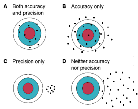

```{r setup}
suppressPackageStartupMessages(library('BBmisc'))
#'@ suppressPackageStartupMessages(library('rmsfuns'))

pkgs <- c('knitr', 'kableExtra', 'tint', 'devtools', 'lubridate', 'data.table', 'quantmod', 'tidyquant', 'plyr', 'stringr', 'magrittr', 'dplyr', 'tidyverse', 'rlist', 'memoise', 'htmltools', 'highcharter', 'formattable', 'DT', 'rugarch', 'rmgarch', 'forecast')

suppressAll(lib(pkgs))
#'@ load_pkg(pkgs)

funs <- c('uv_fx.R', 'opt_arma.R', 'filterFX.R', 'filter_spec.R', 'task_progress.R', 'read_umodels.R')
l_ply(funs, function(x) source(paste0('./function/', x)))

options(warn = -1)
rm(pkgs)
```

# Introduction

There are quite some papers study on the GARCH models.

- **EGARCH, GKR-GARCH, TGARCH, AVGARCH, NGARCH, IGARCH and APARCH Models for Pathogens at Marine Recreational Sites**
- **Predictive Accuracy of GARCH, GJR and EGARCH Models Select Exchange Rates Application**

From previous papers, I tried to apply couple models for FOREX price forecasting and eventually got to know *Fractional Intergrated GJR-GARCH* is the best fit model as we can refer to **GARCH模型中的ARMA(p,d,q)参数最优化**^[Kindly refer to paper in [Reference]]. Due to I simulate whole dataset to get the result in menmtioned paper is time consuming, I tried to apply `dccroll()` to know the mse by resampling but not only based on single `AIC`^[Only the `solver=solnp` stable but the other solvers not stable, the fluctuation of AIC value is quite high.]. I parse my `mv_fx()` function^[Due to some errors] and tested the **Binary-Q1 - Multivariate GARCH Models** and some additive parameters might probably need to be adjusted in the arguments of the function. [Arma Part Overfitting in Arma Garch Model fitting via fGarch Package](https://stackoverflow.com/questions/36312065/arma-part-overfitting-in-arma-garch-model-fitting-via-fgarch-package) is a similar study for models comparison in GARCH.

I try to use 3 methods to compare the GARCH models.

- The default setting is `forecast.length = 500, refit.every = 25, refit.window = 'recursive'`: refit couple times in order to make sure the stability of the prediction model.
- Set `n.start = ns`, `forecast.length = nrow(x) - ns`, `refit.every = 1`, `refit.window = 'moving'`: refit once only with moving to know the prediction accuracy of the Markov model.
- Similar with Markov model above, but just seperates to `ugarchfit()` and `ugarchforecast()` and save every single observation. It will be easy to find the origin of error and rerun that particular data prediction.

Besides using the `ugarchroll()`, all models in this paper are Fractional Intergrated model which optimised the arfima `q` and also adjusted arma order `p` and `q`. **AMATH546 - ECON589 HW3** also teach the use of `ugarchroll()`.

```{r dcc, eval=FALSE}
## --- eval=FALSE, not run but display chunk ---
mv_fx <- function(...) {
  ...
  mod = dccroll(dccSpec, data = mbase, solver = .solver, 
                    forecast.length = 50, cluster = cl)
  cat('step 1/1 dccroll done!\n')
  ...
}

cl = makePSOCKcluster(ncol(mbase))

## Workable
test_roll <- dccroll(dccspec(
			multispec(c(ugarchspec(), ugarchspec(), ugarchspec(), 
			            ugarchspec(), ugarchspec(), ugarchspec(), 
			            ugarchspec())), distribution = 'mvt'), 
			data = mbase, cluster = cl)

## Not workable
test_roll2 <- dccroll(dccspec(
			multispec(c(
			  uspec1 = ugarchspec(variance.model = list(model = 'gjrGARCH')), 
				uspec2 = ugarchspec(variance.model = list(model = 'gjrGARCH')), 
				uspec3 = ugarchspec(variance.model = list(model = 'gjrGARCH')), 
				uspec4 = ugarchspec(variance.model = list(model = 'gjrGARCH')), 
				uspec5 = ugarchspec(variance.model = list(model = 'gjrGARCH')), 
				uspec6 = ugarchspec(variance.model = list(model = 'gjrGARCH')), 
				uspec7 = ugarchspec(variance.model = list(model = 'gjrGARCH'))
				))), data = mbase, cluster = cl)
#Error in checkForRemoteErrors(val) : 
#  one node produced an error: infinite or missing values in 'x'

## Workable
test_roll3 <- dccroll(dccspec(
			multispec(c(
			  uspec1 = ugarchspec(
			    variance.model = list(model = 'eGARCH'), 
			    distribution.model = 'snorm'), 
				uspec2 = ugarchspec(
				  variance.model = list(model = 'eGARCH'), 
				  distribution.model = 'snorm'), 
				uspec3 = ugarchspec(
				  variance.model = list(model = 'eGARCH'), 
				  distribution.model = 'snorm'), 
				uspec4 = ugarchspec(
				  variance.model = list(model = 'eGARCH'), 
				  distribution.model = 'snorm'), 
				uspec5 = ugarchspec(
				  variance.model = list(model = 'eGARCH'), 
				  distribution.model = 'snorm'), 
				uspec6 = ugarchspec(
				  variance.model = list(model = 'eGARCH'), 
				  distribution.model = 'snorm'), 
				uspec7 = ugarchspec(
				  variance.model = list(model = 'eGARCH'), 
				  distribution.model = 'snorm')
				)), distribution = 'mvt'), data = mbase, cluster = cl)

## Not workable
test_roll4 <- dccroll(dccspec(
			multispec(c(
			  uspec1 = ugarchspec(
			    variance.model = list(model = 'gjrGARCH'), 
			    distribution.model = 'snorm'), 
			  uspec2 = ugarchspec(
			    variance.model = list(model = 'gjrGARCH'), 
			    distribution.model = 'snorm'), 
				uspec3 = ugarchspec(
				  variance.model = list(model = 'gjrGARCH'), 
				  distribution.model = 'snorm'), 
				uspec4 = ugarchspec(
				  variance.model = list(model = 'gjrGARCH'), 
				  distribution.model = 'snorm'), 
				uspec5 = ugarchspec(
				  variance.model = list(model = 'gjrGARCH'), 
				  distribution.model = 'snorm'), 
				uspec6 = ugarchspec(
				  variance.model = list(model = 'gjrGARCH'), 
				  distribution.model = 'snorm'), 
				uspec7 = ugarchspec(
				  variance.model = list(model = 'gjrGARCH'), 
				  distribution.model = 'snorm')
				)), distribution = 'mvt'), data = mbase, cluster = cl)
#Error in checkForRemoteErrors(val) : 
#  one node produced an error: infinite or missing values in 'x'
```

**Binary-Q1**^[Kindly refer to paper in [Reference]] compares all possible GARCH models in `rugarch` package while the result is in ROI (Return on Investment), due to the paper **Binary-Q1 - Tick-Data-HiLo For Daily Trading <span style='color:red'>(Blooper)</span>** found that the betting strategy is not workable in real-life. Therefore I try to compare again the GARCH models as well as suite for multivariate GARCH models.

Due to the multivartiate models will not coped with every univariate models. Here I tried to compare the accuracy of forecasting by univariate GARCH models and later will compare with the multivariate models.

# Data

## Read Data

Similar with **GARCH模型中的ARMA(p,d,q)参数最优化**, I use the dataset from **Binary-Q1 (Extention)**^[Kindly refer to paper in [Reference]] to ease the study.

```{r read-data, warning=FALSE}
cr_code <- c('AUDUSD=X', 'EURUSD=X', 'GBPUSD=X', 'CHF=X', 'CAD=X', 
             'CNY=X', 'JPY=X')

#'@ names(cr_code) <- c('AUDUSD', 'EURUSD', 'GBPUSD', 'USDCHF', 'USDCAD', 
#'@                     'USDCNY', 'USDJPY')

names(cr_code) <- c('USDAUD', 'USDEUR', 'USDGBP', 'USDCHF', 'USDCAD', 'USDCNY', 'USDJPY')

## Read presaved Yahoo data.
mbase <- sapply(names(cr_code), function(x) readRDS(paste0('./data/', x, '.rds')) %>% na.omit)

price_type <- c('Op', 'Hi', 'Lo', 'Cl')

gmds <- c('sGARCH', 'fGARCH.GARCH', 'fGARCH.TGARCH', 'fGARCH.AVGARCH', 'fGARCH.NGARCH', 'fGARCH.NAGARCH', 'fGARCH.APARCH', 'fGARCH.GJRGARCH', 'fGARCH.ALLGARCH', 'eGARCH', 'gjrGARCH', 'apARCH', 'iGARCH', 'csGARCH')

timeID <- llply(mbase, function(x) as.character(index(x))) %>% 
  unlist %>% unique %>% as.Date %>% sort
timeID <- c(timeID, xts::last(timeID) + days(1)) #the last date + 1 in order to predict the next day of last date to make whole dataset completed.
timeID0 <- ymd('2013-01-01')
timeID <- timeID[timeID >= timeID0]

.cl = FALSE
```

# Testing Prediction Result

All my previous papers applied Markov theory which is $p(x_{n}|x_{n-1}...x_{1})$, here I try to test if the model provides same result. Here I iteration 100 times.

```{r em, eval=FALSE}
## ================ eval=FALSE ====================
## sample data.
x <- mbase[['USDJPY']] %>% Cl

armaOrder = opt_arma(x)
spec = ugarchspec(
    variance.model = list(
        model = 'sGARCH', garchOrder = c(1, 1), 
        submodel = NULL, external.regressors = NULL, 
        variance.targeting = FALSE), 
    mean.model = list(
        armaOrder = armaOrder[c(1, 3)], 
        include.mean = TRUE, archm = FALSE, 
        archpow = 1, arfima = TRUE, 
        external.regressors = NULL, 
        archex = FALSE), 
    fixed.pars = list(arfima = armaOrder[2]), 
    distribution.model = 'snorm')

fit <- ugarchfit(spec, x, solver = 'hybrid')

## Execute 1 times.
fc1 = ugarchforecast(fit, n.ahead = 1)

## Execute 100 times to know if the coffecient value is applied ML method.
fc2 = replicate(100, ugarchforecast(fit, n.ahead = 1))

## retrieve the series and sigma values.
fc1 <- cbind(attributes(fc1)$`forecast`$seriesFor, attributes(fc1)$`forecast`$sigmaFor)

fc2 <- llply(fc2, function(x) cbind(attributes(x)$`forecast`$seriesFor, attributes(x)$`forecast`$sigmaFor)) %>% do.call('rbind', .)
fc2 %<>% unique

#> rbind(fc1, fc2)
#    2017-08-30 2017-08-30
#T+1   110.4566  0.6523954
#T+1   110.4566  0.6523954

#> fc1 == fc2
#    2017-08-30 2017-08-30
#T+1       TRUE       TRUE

rm(x)
```

From above test, we know that the prediction price is exactly same upon testing 100 times.

# GARCH Models

## sGARCH

### Method 1 : Resampling

Below is the backtest simulation. The default setting is `forecast.length = 500, refit.every = 25, refit.window = 'recursive'` which only apply Monte Carlo method to resampling the model.

```{r msesGARCH}
if (!file.exists('data/fx/mse.sGARCH.rds')) {
  mse.sGARCH <- ldply(mbase, function(x) {
    x <- Cl(x)
    if (.cl == TRUE) {
      .cl <- makePSOCKcluster(ncol(x))
    } else {
      .cl <- NULL
    }
    armaOrder = opt_arma(x)
    
    spec = ugarchspec(
      variance.model = list(
        model = 'sGARCH', garchOrder = c(1, 1), 
        submodel = NULL, external.regressors = NULL, 
        variance.targeting = FALSE), 
    mean.model = list(
        armaOrder = armaOrder[c(1, 3)], 
        include.mean = TRUE, archm = FALSE, 
        archpow = 1, arfima = TRUE, 
        external.regressors = NULL, 
        archex = FALSE), 
    fixed.pars = list(arfima = armaOrder[2]), 
    distribution.model = 'snorm')
    
    roll <- ugarchroll(spec, data = x, refit.window = 'recursive', 
                       cluster = .cl)
    res <- attributes(roll)$forecast$density
    
    if (!is.null(res)) {
      res %>% tbl_df %>% mutate(MSE = mean((Mu - Realized)^2)) %>% 
      .$MSE %>% unique
    } else {
      res <- NULL
    }
    return(res)
  }) %>% tbl_df
  #'@ names(mse.sGARCH)[2] <- 'MSE'
  mse.sGARCH %<>% ddply(.(.id), summarise, MSE = mean((Mu - Realized)^2))
  saveRDS(mse.sGARCH, 'data/fx/mse.sGARCH.rds')
  
} else {
  mse.sGARCH <- readRDS('data/fx/mse.sGARCH.rds')
}

mse.sGARCH %>% 
  rbind(., data.frame(.id = 'Mean', MSE = colMeans(.[2]))) %>% 
  kable(caption = 'MSE for Univariate sGARCH') %>% 
  kable_styling(bootstrap_options = c('striped', 'hover', 'condensed', 'responsive'))
```

*Table 3.1.1A : MSE of basket currencies.*

### Method 2 : Markov Chain

By refer to below article, I use `ugarchroll()` which is a wrapper for `ugarchfit()` and `ugarchforecast()` which will made the thing use :

- [estimation difference between ugarchroll and ugarchfit](http://r.789695.n4.nabble.com/estimation-difference-between-ugarchroll-and-ugarchfit-td4631122.html)
- [Window size in ugarchroll of rugarch package?](http://r.789695.n4.nabble.com/Window-size-in-ugarchroll-of-rugarch-package-td4669366.html)

There has a concern to use it which is once there has an error during the course of simulation will cause whole data gone.^[`tryCatch()` might useful for `llply()` or else we can use `for()` to skip `NULL` or error result. Normally I will add `cat()` upon completion of one prediction to know the progress of whole simulation.] All my previous preditive result based on the Markov Chain theory^[Markov Chain theory explain the statiscal predicton only can predict the next stage based on current stage. For example in soccer In-Play : 1-0 or 0-1 can be predicted during 0-0, the fit for 0-0 will not be usable anymore once there has scored. Similar concept with scoring intensity in **Dixon & Robinson 1997**, the `armaOrder` and `arfima` parameters optimised the preditive accuracy at every single stage.] with statistical modelling and prediction model and saved every single predictive result.

Below is the simulation . `n.start = ns` is the start point of simulation which is `ymd('2013-01-01')`, `forecast.length = nrow(x) - ns` is the length of forecast equal to the length from the n.start until the end of the dataset, `refit.every = 1` means re-estimate the fit value once only where `refit.window = 'moving'` where today's dataset only can predict 1 trading day in advance.

```{r msesGARCH2}
## --- eval=FALSE ---- Due to errors.
if (!file.exists('data/fx/mse.sGARCH2.rds')) {
  mse.sGARCH2 <- ldply(mbase, function(x) {
    x <- Cl(x)
    if (.cl == TRUE) {
      .cl <- makePSOCKcluster(ncol(x))
    } else {
      .cl <- NULL
    }
    armaOrder = opt_arma(x)
    
    spec = ugarchspec(
      variance.model = list(
        model = 'sGARCH', garchOrder = c(1, 1), 
        submodel = NULL, external.regressors = NULL, 
        variance.targeting = FALSE), 
    mean.model = list(
        armaOrder = armaOrder[c(1, 3)], 
        include.mean = TRUE, archm = FALSE, 
        archpow = 1, arfima = TRUE, 
        external.regressors = NULL, 
        archex = FALSE), 
    fixed.pars = list(arfima = armaOrder[2]), 
    distribution.model = 'snorm')
    
    ns <- which(index(x) == timeID0)
    n <- nrow(x) - ns

    roll <- ugarchroll(spec, data = x, n.start = ns, forecast.length = n, 
                       refit.every = 1, refit.window = 'moving', 
                       cluster = .cl)
    res <- attributes(roll)$forecast$density
    
    if (!is.null(res)) {
      res %>% tbl_df %>% mutate(MSE = mean((Mu - Realized)^2)) %>% 
      .$MSE %>% unique
    } else {
      res <- NULL
    }
    return(res)
  }) %>% tbl_df
  mse.sGARCH2 %<>% ddply(.(.id), summarise, MSE = mean((Mu - Realized)^2))
  saveRDS(mse.sGARCH2, 'data/fx/mse.sGARCH2.rds')
  
} else {
  mse.sGARCH2 <- readRDS('data/fx/mse.sGARCH2.rds')
}

if (!is.null(mse.sGARCH2)) {
  mse.sGARCH2 %>% 
    rbind(., data.frame(.id = 'Mean', MSE = colMeans(.[2]))) %>% 
    kable(caption = 'MSE for Univariate sGARCH') %>% 
    kable_styling(bootstrap_options = c('striped', 'hover', 'condensed', 'responsive'))
}
```

*Table 3.1.1B : MSE of basket currencies.*

### Method 3 : Markov Chain 2

Due to I am not statisfy and doubted onto the `AIC` result based on model comparison by using basic model above. Below I compared the Fractional Intergrated model which optimised the arfima `q` and also adjusted arma order `p` and `q` to proof if my previous study^[gjrGARCH model generated highest ROI.] in **Binary.com Interview Q1** is correct.

**Binary.com Interview Q1 - Tick-Data-HiLo For Daily Trading <span style='color:red'>(Blooper)</span>** directly use the mentioned gjrGARCH model but add another criteria which is the timing of daily High-Low price based on highest `bid` and lowest `ask` price within a day.

```{r msesGARCH3, eval=FALSE}
## ------------- Simulate uv_fx() ----------------------
## uv_fx just made the model and some argument flexible.
sGARCH <- list()

for (dt in timeID) {
  
  for (i in seq(cr_code)) {
    
    smp <- mbase[[names(cr_code)[i]]]
    timeID2 <- c(index(smp), xts::last(index(smp)) + days(1))
    
    if (dt %in% timeID2) {
      dtr <- xts::last(index(smp[index(smp) < dt]), 1) #tail(..., 1)
      smp <- smp[paste0(dtr %m-% years(1), '/', dtr)]
      
      sGARCH[[i]] <- tryCatch({ldply(price_type, function(y) {
        df = uv_fx(smp, .model = 'sGARCH', currency = cr_code[i], 
                   price = y, .cluster = .cl)
        df = data.frame(Date = index(df$latestPrice[1]), 
                        Type = paste0(names(df$latestPrice), '.', y), 
                        df$latestPrice, df$forecastPrice, t(df$AIC))
        names(df)[4] %<>% str_replace_all('1', 'T+1')
        df
      })}, error = function(e) NULL)
      
      if (!dir.exists(paste0('data/fx/', names(sGARCH[[i]])[3]))) 
        dir.create(paste0('data/fx/', names(sGARCH[[i]])[3]))
      
      saveRDS(sGARCH[[i]], paste0(
        'data/fx/', names(sGARCH[[i]])[3], '/sGARCH.', 
        unique(sGARCH[[i]]$Date), '.rds'))
    
      cat(paste0(
        'data/fx/', names(sGARCH[[i]])[3], '/sGARCH.', 
        unique(sGARCH[[i]]$Date), '.rds saved!\n'))
    }
    }; rm(i)
  }
```

## fGARCH

### GARCH

#### Method 1 : Resampling

The default setting is `forecast.length = 500, refit.every = 25, refit.window = 'recursive'`.

```{r msefGARCH-GARCH, echo=FALSE}
if (!file.exists('data/fx/mse.fGARCH.GARCH.rds')) {
  mse.fGARCH.GARCH <- ldply(mbase, function(x) {
    x <- Cl(x)
    if (.cl == TRUE) {
      .cl <- makePSOCKcluster(ncol(x))
    } else {
      .cl <- NULL
    }
    armaOrder = opt_arma(x)
    
    spec = ugarchspec(
      variance.model = list(
        model = 'fGARCH', garchOrder = c(1, 1), 
        submodel = 'GARCH', external.regressors = NULL, 
        variance.targeting = FALSE), 
    mean.model = list(
        armaOrder = armaOrder[c(1, 3)], 
        include.mean = TRUE, archm = FALSE, 
        archpow = 1, arfima = TRUE, 
        external.regressors = NULL, 
        archex = FALSE), 
    fixed.pars = list(arfima = armaOrder[2]), 
    distribution.model = 'snorm')
    
    roll <- ugarchroll(spec, data = x, refit.window = 'recursive', 
                       cluster = .cl)
    res <- attributes(roll)$forecast$density
    
    if (!is.null(res)) {
      res %>% tbl_df %>% mutate(MSE = mean((Mu - Realized)^2)) %>% 
      .$MSE %>% unique
    } else {
      res <- NULL
    }
    return(res)
  }) %>% tbl_df
  #'@ names(mse.fGARCH.GARCH)[2] <- 'MSE'
  mse.fGARCH.GARCH %<>% ddply(.(.id), summarise, MSE = mean((Mu - Realized)^2))
  saveRDS(mse.fGARCH.GARCH, 'data/fx/mse.fGARCH.GARCH.rds')
  
} else {
  mse.fGARCH.GARCH <- readRDS('data/fx/mse.fGARCH.GARCH.rds')
}

mse.fGARCH.GARCH %>% 
  rbind(., data.frame(.id = 'Mean', MSE = colMeans(.[2], na.rm = TRUE))) %>% 
  kable(caption = 'MSE for Univariate fGARCH-GARCH') %>% 
  kable_styling(bootstrap_options = c('striped', 'hover', 'condensed', 'responsive'))
```

*Table 3.2.1.1A : MSE of basket currencies.*

#### Method 2 : Markov Chain

Set `n.start = ns`, `forecast.length = nrow(x) - ns`, `refit.every = 1`, `refit.window = 'moving'`.

```{r msefGARCH-GARCH2, echo=FALSE}
if (!file.exists('data/fx/mse.fGARCH.GARCH2.rds')) {
  mse.fGARCH.GARCH2 <- ldply(mbase, function(x) {
    x <- Cl(x)
    if (.cl == TRUE) {
      .cl <- makePSOCKcluster(ncol(x))
    } else {
      .cl <- NULL
    }
    armaOrder = opt_arma(x)
    
    spec = ugarchspec(
      variance.model = list(
        model = 'fGARCH', garchOrder = c(1, 1), 
        submodel = 'GARCH', external.regressors = NULL, 
        variance.targeting = FALSE), 
    mean.model = list(
        armaOrder = armaOrder[c(1, 3)], 
        include.mean = TRUE, archm = FALSE, 
        archpow = 1, arfima = TRUE, 
        external.regressors = NULL, 
        archex = FALSE), 
    fixed.pars = list(arfima = armaOrder[2]), 
    distribution.model = 'snorm')
    
    ns <- which(index(x) == timeID0)
    n <- nrow(x) - ns

    roll <- ugarchroll(spec, data = x, n.start = ns, forecast.length = n, 
                       refit.every = 1, refit.window = 'moving', 
                       cluster = .cl)
    res <- attributes(roll)$forecast$density
    
    if (!is.null(res)) {
      res %>% tbl_df %>% mutate(MSE = mean((Mu - Realized)^2)) %>% 
      .$MSE %>% unique
    } else {
      res <- NULL
    }
    return(res)
  }) %>% tbl_df
  mse.fGARCH.GARCH2 %<>% ddply(.(.id), summarise, MSE = mean((Mu - Realized)^2))
  saveRDS(mse.fGARCH.GARCH2, 'data/fx/mse.fGARCH.GARCH2.rds')
  
} else {
  mse.fGARCH.GARCH2 <- readRDS('data/fx/mse.fGARCH.GARCH2.rds')
}

if (!is.null(mse.fGARCH.GARCH2)) {
  mse.fGARCH.GARCH2 %>% 
    rbind(., data.frame(.id = 'Mean', MSE = colMeans(.[2]))) %>% 
    kable(caption = 'MSE for Univariate fGARCH-GARCH') %>% 
    kable_styling(bootstrap_options = c('striped', 'hover', 'condensed', 'responsive'))
}
```

*Table 3.2.1.1B : MSE of basket currencies.*

#### Method 3 : Markov Chain 2

Below I compared the Fractional Intergrated model which optimised the arfima `q` and also adjusted arma order `p` and `q`.

```{r msefGARCH-GARCH3, eval=FALSE, echo=FALSE}
## ------------- Simulate uv_fx() ----------------------
## uv_fx just made the model and some argument flexible.
fGARCH.GARCH <- list()

for (dt in timeID) {
  
  for (i in seq(cr_code)) {
    
    smp <- mbase[[names(cr_code)[i]]]
    timeID2 <- c(index(smp), xts::last(index(smp)) + days(1))
    
    if (dt %in% timeID2) {
      dtr <- xts::last(index(smp[index(smp) < dt]), 1) #tail(..., 1)
      smp <- smp[paste0(dtr %m-% years(1), '/', dtr)]
      
      fGARCH.GARCH[[i]] <- tryCatch({ldply(price_type, function(y) {
        df = uv_fx(smp, .model = 'fGARCH', .submodel = 'GARCH', 
                   currency = cr_code[i], price = y, .cluster = .cl)
        df = data.frame(Date = index(df$latestPrice[1]), 
                        Type = paste0(names(df$latestPrice), '.', y), 
                        df$latestPrice, df$forecastPrice, t(df$AIC))
        names(df)[4] %<>% str_replace_all('1', 'T+1')
        df
      })}, error = function(e) NULL)
      
      if (!dir.exists(paste0('data/fx/', names(fGARCH.GARCH[[i]])[3]))) 
        dir.create(paste0('data/fx/', names(fGARCH.GARCH[[i]])[3]))
      
      saveRDS(fGARCH.GARCH[[i]], paste0(
        'data/fx/', names(fGARCH.GARCH[[i]])[3], '/fGARCH.GARCH.', 
        unique(fGARCH.GARCH[[i]]$Date), '.rds'))
      
      cat(paste0(
        'data/fx/', names(fGARCH.GARCH[[i]])[3], '/fGARCH.GARCH.', 
        unique(fGARCH.GARCH[[i]]$Date), '.rds saved!\n'))
      }
    }; rm(i)
  }
```

### TGARCH

#### Method 1 : Resampling

The default setting is `forecast.length = 500, refit.every = 25, refit.window = 'recursive'`.

```{r msefGARCH-TGARCH, echo=FALSE}
if (!file.exists('data/fx/mse.fGARCH.TGARCH.rds')) {
  mse.fGARCH.TGARCH <- ldply(mbase, function(x) {
    x <- Cl(x)
    if (.cl == TRUE) {
      .cl <- makePSOCKcluster(ncol(x))
    } else {
      .cl <- NULL
    }
    armaOrder = opt_arma(x)
    
    spec = ugarchspec(
      variance.model = list(
        model = 'fGARCH', garchOrder = c(1, 1), 
        submodel = 'TGARCH', external.regressors = NULL, 
        variance.targeting = FALSE), 
    mean.model = list(
        armaOrder = armaOrder[c(1, 3)], 
        include.mean = TRUE, archm = FALSE, 
        archpow = 1, arfima = TRUE, 
        external.regressors = NULL, 
        archex = FALSE), 
    fixed.pars = list(arfima = armaOrder[2]), 
    distribution.model = 'snorm')
    
    roll <- ugarchroll(spec, data = x, refit.window = 'recursive', 
                       cluster = .cl)
    res <- attributes(roll)$forecast$density
    
    if (!is.null(res)) {
      res %>% tbl_df %>% mutate(MSE = mean((Mu - Realized)^2)) %>% 
      .$MSE %>% unique
    } else {
      res <- NULL
    }
    return(res)
  }) %>% tbl_df
  #'@ names(mse.fGARCH.TGARCH)[2] <- 'MSE'
  mse.fGARCH.TGARCH %<>% ddply(.(.id), summarise, MSE = mean((Mu - Realized)^2))
  saveRDS(mse.fGARCH.TGARCH, 'data/fx/mse.fGARCH.TGARCH.rds')
  
} else {
  mse.fGARCH.TGARCH <- readRDS('data/fx/mse.fGARCH.TGARCH.rds')
}

mse.fGARCH.TGARCH %>% 
  rbind(., data.frame(.id = 'Mean', MSE = colMeans(.[2]))) %>% 
  kable(caption = 'MSE for Univariate fGARCH-TGARCH') %>% 
  kable_styling(bootstrap_options = c('striped', 'hover', 'condensed', 'responsive'))
```

*Table 3.2.2.1A : MSE of basket currencies.*

#### Method 2 : Markov Chain

Set `n.start = ns`, `forecast.length = nrow(x) - ns`, `refit.every = 1`, `refit.window = 'moving'`.

```{r msefGARCH-TGARCH2, echo=FALSE}
if (!file.exists('data/fx/mse.fGARCH.TGARCH2.rds')) {
  mse.fGARCH.TGARCH2 <- ldply(mbase, function(x) {
    x <- Cl(x)
    if (.cl == TRUE) {
      .cl <- makePSOCKcluster(ncol(x))
    } else {
      .cl <- NULL
    }
    armaOrder = opt_arma(x)
    
    spec = ugarchspec(
      variance.model = list(
        model = 'fGARCH', garchOrder = c(1, 1), 
        submodel = 'TGARCH', external.regressors = NULL, 
        variance.targeting = FALSE), 
    mean.model = list(
        armaOrder = armaOrder[c(1, 3)], 
        include.mean = TRUE, archm = FALSE, 
        archpow = 1, arfima = TRUE, 
        external.regressors = NULL, 
        archex = FALSE), 
    fixed.pars = list(arfima = armaOrder[2]), 
    distribution.model = 'snorm')
    
    ns <- which(index(x) == timeID0)
    n <- nrow(x) - ns

    roll <- ugarchroll(spec, data = x, n.start = ns, forecast.length = n, 
                       refit.every = 1, refit.window = 'moving', 
                       cluster = .cl)
    res <- attributes(roll)$forecast$density
    
    if (!is.null(res)) {
      res %>% tbl_df %>% mutate(MSE = mean((Mu - Realized)^2)) %>% 
      .$MSE %>% unique
    } else {
      res <- NULL
    }
    return(res)
  }) %>% tbl_df
  mse.fGARCH.TGARCH2 %<>% ddply(.(.id), summarise, MSE = mean((Mu - Realized)^2))
  saveRDS(mse.fGARCH.TGARCH2, 'data/fx/mse.fGARCH.TGARCH2.rds')
  
} else {
  mse.fGARCH.TGARCH2 <- readRDS('data/fx/mse.fGARCH.TGARCH2.rds')
}

if (!is.null(mse.fGARCH.TGARCH2)) {
  mse.fGARCH.TGARCH2 %>% 
    rbind(., data.frame(.id = 'Mean', MSE = colMeans(.[2]))) %>% 
    kable(caption = 'MSE for Univariate fGARCH-TGARCH') %>% 
    kable_styling(bootstrap_options = c('striped', 'hover', 'condensed', 'responsive'))
}
```

*Table 3.2.2.1B : MSE of basket currencies.*

#### Method 3 : Markov Chain 2

Below I compared the Fractional Intergrated model which optimised the arfima `q` and also adjusted arma order `p` and `q`.

```{r msefGARCH-TGARCH3, eval=FALSE, echo=FALSE}
## ------------- Simulate uv_fx() ----------------------
## uv_fx just made the model and some argument flexible.
fGARCH.TGARCH <- list()

for (dt in timeID) {
  
  for (i in seq(cr_code)) {
    
    smp <- mbase[[names(cr_code)[i]]]
    timeID2 <- c(index(smp), xts::last(index(smp)) + days(1))
    
    if (dt %in% timeID2) {
      dtr <- xts::last(index(smp[index(smp) < dt]), 1) #tail(..., 1)
      smp <- smp[paste0(dtr %m-% years(1), '/', dtr)]
      
      fGARCH.TGARCH[[i]] <- tryCatch({ldply(price_type, function(y) {
        df = uv_fx(smp, .model = 'fGARCH', .submodel = 'TGARCH', 
                   currency = cr_code[i], price = y, .cluster = .cl)
        df = data.frame(Date = index(df$latestPrice[1]), 
                       Type = paste0(names(df$latestPrice), '.', y), 
                        df$latestPrice, df$forecastPrice, t(df$AIC))
        names(df)[4] %<>% str_replace_all('1', 'T+1')
        df
      })}, error = function(e) NULL)
      
     if (!dir.exists(paste0('data/fx/', names(fGARCH.TGARCH[[i]])[3]))) 
       dir.create(paste0('data/fx/', names(fGARCH.TGARCH[[i]])[3]))
     
     saveRDS(fGARCH.TGARCH[[i]], paste0(
       'data/fx/', names(fGARCH.TGARCH[[i]])[3], '/fGARCH.TGARCH.', 
       unique(fGARCH.TGARCH[[i]]$Date), '.rds'))
      
      cat(paste0(
        'data/fx/', names(fGARCH.TGARCH[[i]])[3], '/fGARCH.TGARCH.', 
        unique(fGARCH.TGARCH[[i]]$Date), '.rds saved!\n'))
      }
    }; rm(i)
  }
```

### AVGARCH

#### Method 1 : Resampling

The default setting is `forecast.length = 500, refit.every = 25, refit.window = 'recursive'`.

```{r msefGARCH-AVGARCH, echo=FALSE}
if (!file.exists('data/fx/mse.fGARCH.AVGARCH.rds')) {
  mse.fGARCH.AVGARCH <- ldply(mbase, function(x) {
    x <- Cl(x)
    if (.cl == TRUE) {
      .cl <- makePSOCKcluster(ncol(x))
    } else {
      .cl <- NULL
    }
    armaOrder = opt_arma(x)
    
    spec = ugarchspec(
      variance.model = list(
        model = 'fGARCH', garchOrder = c(1, 1), 
        submodel = 'AVGARCH', external.regressors = NULL, 
        variance.targeting = FALSE), 
    mean.model = list(
        armaOrder = armaOrder[c(1, 3)], 
        include.mean = TRUE, archm = FALSE, 
        archpow = 1, arfima = TRUE, 
        external.regressors = NULL, 
        archex = FALSE), 
    fixed.pars = list(arfima = armaOrder[2]), 
    distribution.model = 'snorm')
    
    roll <- ugarchroll(spec, data = x, refit.window = 'recursive', 
                       cluster = .cl)
    res <- attributes(roll)$forecast$density
    
    if (!is.null(res)) {
      res %>% tbl_df %>% mutate(MSE = mean((Mu - Realized)^2)) %>% 
      .$MSE %>% unique
    } else {
      res <- NULL
    }
    return(res)
  }) %>% tbl_df
  #'@ names(mse.fGARCH.AVGARCH)[2] <- 'MSE'
  mse.fGARCH.AVGARCH %<>% ddply(.(.id), summarise, MSE = mean((Mu - Realized)^2))
  saveRDS(mse.fGARCH.AVGARCH, 'data/fx/mse.fGARCH.AVGARCH.rds')
  
} else {
  mse.fGARCH.AVGARCH <- readRDS('data/fx/mse.fGARCH.AVGARCH.rds')
}

mse.fGARCH.AVGARCH %>% 
  rbind(., data.frame(.id = 'Mean', MSE = colMeans(.[2]))) %>% 
  kable(caption = 'MSE for Univariate fGARCH-AVGARCH') %>% 
  kable_styling(bootstrap_options = c('striped', 'hover', 'condensed', 'responsive'))
```

*Table 3.2.3.1A : MSE of basket currencies.*

#### Method 2 : Markov Chain

Set `n.start = ns`, `forecast.length = nrow(x) - ns`, `refit.every = 1`, `refit.window = 'moving'`.

```{r msefGARCH-AVGARCH2, echo=FALSE}
if (!file.exists('data/fx/mse.fGARCH.AVGARCH2.rds')) {
  mse.fGARCH.AVGARCH2 <- ldply(mbase, function(x) {
    x <- Cl(x)
    if (.cl == TRUE) {
      .cl <- makePSOCKcluster(ncol(x))
    } else {
      .cl <- NULL
    }
    armaOrder = opt_arma(x)
    
    spec = ugarchspec(
      variance.model = list(
        model = 'fGARCH', garchOrder = c(1, 1), 
        submodel = 'AVGARCH', external.regressors = NULL, 
        variance.targeting = FALSE), 
    mean.model = list(
        armaOrder = armaOrder[c(1, 3)], 
        include.mean = TRUE, archm = FALSE, 
        archpow = 1, arfima = TRUE, 
        external.regressors = NULL, 
        archex = FALSE), 
    fixed.pars = list(arfima = armaOrder[2]), 
    distribution.model = 'snorm')
    
    ns <- which(index(x) == timeID0)
    n <- nrow(x) - ns

    roll <- ugarchroll(spec, data = x, n.start = ns, forecast.length = n, 
                       refit.every = 1, refit.window = 'moving', 
                       cluster = .cl)
    res <- attributes(roll)$forecast$density
    
    if (!is.null(res)) {
      res %>% tbl_df %>% mutate(MSE = mean((Mu - Realized)^2)) %>% 
      .$MSE %>% unique
    } else {
      res <- NULL
    }
    return(res)
  }) %>% tbl_df
  mse.fGARCH.AVGARCH2 %<>% ddply(.(.id), summarise, MSE = mean((Mu - Realized)^2))
  saveRDS(mse.fGARCH.AVGARCH2, 'data/fx/mse.fGARCH.AVGARCH2.rds')
  
} else {
  mse.fGARCH.AVGARCH2 <- readRDS('data/fx/mse.fGARCH.AVGARCH2.rds')
}

if (!is.null(mse.fGARCH.AVGARCH2)) {
  mse.fGARCH.AVGARCH2 %>% 
  rbind(., data.frame(.id = 'Mean', MSE = colMeans(.[2]))) %>% 
  kable(caption = 'MSE for Univariate fGARCH-AVGARCH') %>% 
  kable_styling(bootstrap_options = c('striped', 'hover', 'condensed', 'responsive'))
}
```

*Table 3.2.3.1B : MSE of basket currencies.*

#### Method 3 : Markov Chain 2

Below I compared the Fractional Intergrated model which optimised the arfima `q` and also adjusted arma order `p` and `q`.

```{r msefGARCH-AVGARCH3, eval=FALSE, echo=FALSE}
## ------------- Simulate uv_fx() ----------------------
## uv_fx just made the model and some argument flexible.
fGARCH.AVGARCH <- list()

for (dt in timeID) {
  
  for (i in seq(cr_code)) {
    
    smp <- mbase[[names(cr_code)[i]]]
    timeID2 <- c(index(smp), xts::last(index(smp)) + days(1))
    
    if (dt %in% timeID2) {
     dtr <- xts::last(index(smp[index(smp) < dt]), 1) #tail(..., 1)
     smp <- smp[paste0(dtr %m-% years(1), '/', dtr)]
     
      fGARCH.AVGARCH[[i]] <- tryCatch({ldply(price_type, function(y) {
        df = uv_fx(smp, .model = 'fGARCH', .submodel = 'AVGARCH', 
                   currency = cr_code[i], price = y, .cluster = .cl)
        df = data.frame(Date = index(df$latestPrice[1]), 
                       Type = paste0(names(df$latestPrice), '.', y), 
                       df$latestPrice, df$forecastPrice, t(df$AIC))
        names(df)[4] %<>% str_replace_all('1', 'T+1')
        df
     })}, error = function(e) NULL)
      
      if (!dir.exists(paste0('data/fx/', names(fGARCH.AVGARCH[[i]])[3]))) 
       dir.create(paste0('data/fx/', names(fGARCH.AVGARCH[[i]])[3]))
     
     saveRDS(fGARCH.AVGARCH[[i]], paste0(
       'data/fx/', names(fGARCH.AVGARCH[[i]])[3], '/fGARCH.AVGARCH.', 
       unique(fGARCH.AVGARCH[[i]]$Date), '.rds'))
      
      cat(paste0(
       'data/fx/', names(fGARCH.AVGARCH[[i]])[3], '/fGARCH.AVGARCH.', 
       unique(fGARCH.AVGARCH[[i]]$Date), '.rds saved!\n'))
      }
    }; rm(i)
  }
```

### NGARCH

#### Method 1 : Resampling

The default setting is `forecast.length = 500, refit.every = 25, refit.window = 'recursive'`.

```{r msefGARCH-NGARCH, echo=FALSE}
if (!file.exists('data/fx/mse.fGARCH.NGARCH.rds')) {
  mse.fGARCH.NGARCH <- ldply(mbase, function(x) {
    x <- Cl(x)
    if (.cl == TRUE) {
      .cl <- makePSOCKcluster(ncol(x))
    } else {
      .cl <- NULL
    }
    armaOrder = opt_arma(x)
    
    spec = ugarchspec(
      variance.model = list(
        model = 'fGARCH', garchOrder = c(1, 1), 
        submodel = 'NGARCH', external.regressors = NULL, 
        variance.targeting = FALSE), 
    mean.model = list(
        armaOrder = armaOrder[c(1, 3)], 
        include.mean = TRUE, archm = FALSE, 
        archpow = 1, arfima = TRUE, 
        external.regressors = NULL, 
        archex = FALSE), 
    fixed.pars = list(arfima = armaOrder[2]), 
    distribution.model = 'snorm')
    
    roll <- ugarchroll(spec, data = x, refit.window = 'recursive', 
                       cluster = .cl)
    res <- attributes(roll)$forecast$density
    
    if (!is.null(res)) {
      res %>% tbl_df %>% mutate(MSE = mean((Mu - Realized)^2)) %>% 
      .$MSE %>% unique
    } else {
      res <- NULL
    }
    return(res)
  }) %>% tbl_df
  #'@ names(mse.fGARCH.NGARCH)[2] <- 'MSE'
  mse.fGARCH.NGARCH %<>% ddply(.(.id), summarise, MSE = mean((Mu - Realized)^2))
  saveRDS(mse.fGARCH.NGARCH, 'data/fx/mse.fGARCH.NGARCH.rds')
  
} else {
  mse.fGARCH.NGARCH <- readRDS('data/fx/mse.fGARCH.NGARCH.rds')
}

mse.fGARCH.NGARCH %>% 
  rbind(., data.frame(.id = 'Mean', MSE = colMeans(.[2]))) %>% 
  kable(caption = 'MSE for Univariate fGARCH-NGARCH') %>% 
  kable_styling(bootstrap_options = c('striped', 'hover', 'condensed', 'responsive'))
```

*Table 3.2.4.1A : MSE of basket currencies.*

#### Method 2 : Markov Chain

Set `n.start = ns`, `forecast.length = nrow(x) - ns`, `refit.every = 1`, `refit.window = 'moving'`.

```{r msefGARCH-NGARCH2, echo=FALSE}
if (!file.exists('data/fx/mse.fGARCH.NGARCH2.rds')) {
  mse.fGARCH.NGARCH2 <- ldply(mbase, function(x) {
    x <- Cl(x)
    if (.cl == TRUE) {
      .cl <- makePSOCKcluster(ncol(x))
    } else {
      .cl <- NULL
    }
    armaOrder = opt_arma(x)
    
    spec = ugarchspec(
      variance.model = list(
        model = 'fGARCH', garchOrder = c(1, 1), 
        submodel = 'NGARCH', external.regressors = NULL, 
        variance.targeting = FALSE), 
    mean.model = list(
        armaOrder = armaOrder[c(1, 3)], 
        include.mean = TRUE, archm = FALSE, 
        archpow = 1, arfima = TRUE, 
        external.regressors = NULL, 
        archex = FALSE), 
    fixed.pars = list(arfima = armaOrder[2]), 
    distribution.model = 'snorm')
    
    ns <- which(index(x) == timeID0)
    n <- nrow(x) - ns

    roll <- ugarchroll(spec, data = x, n.start = ns, forecast.length = n, 
                       refit.every = 1, refit.window = 'moving', 
                       cluster = .cl)
    res <- attributes(roll)$forecast$density
    
    if (!is.null(res)) {
      res %>% tbl_df %>% mutate(MSE = mean((Mu - Realized)^2)) %>% 
      .$MSE %>% unique
    } else {
      res <- NULL
    }
    return(res)
  }) %>% tbl_df
  mse.fGARCH.NGARCH2 %<>% ddply(.(.id), summarise, MSE = mean((Mu - Realized)^2))
  saveRDS(mse.fGARCH.NGARCH2, 'data/fx/mse.fGARCH.NGARCH2.rds')
  
} else {
  mse.fGARCH.NGARCH2 <- readRDS('data/fx/mse.fGARCH.NGARCH2.rds')
}

if (!is.null(mse.fGARCH.NGARCH2)) {
  mse.fGARCH.NGARCH2 %>% 
    rbind(., data.frame(.id = 'Mean', MSE = colMeans(.[2]))) %>% 
    kable(caption = 'MSE for Univariate fGARCH-NGARCH') %>% 
    kable_styling(bootstrap_options = c('striped', 'hover', 'condensed', 'responsive'))
}
```

*Table 3.2.4.1B : MSE of basket currencies.*

#### Method 3 : Markov Chain 2

Below I compared the Fractional Intergrated model which optimised the arfima `q` and also adjusted arma order `p` and `q`.

```{r msefGARCH-NGARCH3, eval=FALSE, echo=FALSE}
## ------------- Simulate uv_fx() ----------------------
## uv_fx just made the model and some argument flexible.
fGARCH.NGARCH <- list()

for (dt in timeID) {
  
  for (i in seq(cr_code)) {
    
    smp <- mbase[[names(cr_code)[i]]]
    timeID2 <- c(index(smp), xts::last(index(smp)) + days(1))
    
    if (dt %in% timeID2) {
      dtr <- xts::last(index(smp[index(smp) < dt]), 1) #tail(..., 1)
      smp <- smp[paste0(dtr %m-% years(1), '/', dtr)]
      
      fGARCH.NGARCH[[i]] <- tryCatch({ldply(price_type, function(y) {
        df = uv_fx(smp, .model = 'fGARCH', .submodel = 'NGARCH', 
                   currency = cr_code[i], price = y, .cluster = .cl)
        df = data.frame(Date = index(df$latestPrice[1]), 
                        Type = paste0(names(df$latestPrice), '.', y), 
                        df$latestPrice, df$forecastPrice, t(df$AIC))
        names(df)[4] %<>% str_replace_all('1', 'T+1')
        df
      })}, error = function(e) NULL)
      
      if (!dir.exists(paste0('data/fx/', names(fGARCH.NGARCH[[i]])[3]))) 
        dir.create(paste0('data/fx/', names(fGARCH.NGARCH[[i]])[3]))
      
      saveRDS(fGARCH.NGARCH[[i]], paste0(
        'data/fx/', names(fGARCH.NGARCH[[i]])[3], '/fGARCH.NGARCH.', 
        unique(fGARCH.NGARCH[[i]]$Date), '.rds'))
      
      cat(paste0(
        'data/fx/', names(fGARCH.NGARCH[[i]])[3], '/fGARCH.NGARCH.', 
        unique(fGARCH.NGARCH[[i]]$Date), '.rds saved!\n'))
      }
    }; rm(i)
  }
```

### NAGARCH

#### Method 1 : Resampling

The default setting is `forecast.length = 500, refit.every = 25, refit.window = 'recursive'`.

```{r msefGARCH-NAGARCH, echo=FALSE}
if (!file.exists('data/fx/mse.fGARCH.NAGARCH.rds')) {
  mse.fGARCH.NAGARCH <- ldply(mbase, function(x) {
    x <- Cl(x)
    if (.cl == TRUE) {
      .cl <- makePSOCKcluster(ncol(x))
    } else {
      .cl <- NULL
    }
    armaOrder = opt_arma(x)
    
    spec = ugarchspec(
      variance.model = list(
        model = 'fGARCH', garchOrder = c(1, 1), 
        submodel = 'NAGARCH', external.regressors = NULL, 
        variance.targeting = FALSE), 
    mean.model = list(
        armaOrder = armaOrder[c(1, 3)], 
        include.mean = TRUE, archm = FALSE, 
        archpow = 1, arfima = TRUE, 
        external.regressors = NULL, 
        archex = FALSE), 
    fixed.pars = list(arfima = armaOrder[2]), 
    distribution.model = 'snorm')
    
    roll <- ugarchroll(spec, data = x, refit.window = 'recursive', 
                       cluster = .cl)
    res <- attributes(roll)$forecast$density
    
    if (!is.null(res)) {
      res %>% tbl_df %>% mutate(MSE = mean((Mu - Realized)^2)) %>% 
      .$MSE %>% unique
    } else {
      res <- NULL
    }
    return(res)
  }) %>% tbl_df
  #'@ names(mse.fGARCH.NAGARCH)[2] <- 'MSE'
  mse.fGARCH.NAGARCH %<>% ddply(.(.id), summarise, MSE = mean((Mu - Realized)^2))
  saveRDS(mse.fGARCH.NAGARCH, 'data/fx/mse.fGARCH.NAGARCH.rds')
  
} else {
  mse.fGARCH.NAGARCH <- readRDS('data/fx/mse.fGARCH.NAGARCH.rds')
}

mse.fGARCH.NAGARCH %>% 
  rbind(., data.frame(.id = 'Mean', MSE = colMeans(.[2]))) %>% 
  kable(caption = 'MSE for Univariate fGARCH-NAGARCH') %>% 
  kable_styling(bootstrap_options = c('striped', 'hover', 'condensed', 'responsive'))
```

*Table 3.2.5.1A : MSE of basket currencies.*

#### Method 2 : Markov Chain

Set `n.start = ns`, `forecast.length = nrow(x) - ns`, `refit.every = 1`, `refit.window = 'moving'`.

```{r msefGARCH-NAGARCH2, echo=FALSE}
if (!file.exists('data/fx/mse.fGARCH.NAGARCH2.rds')) {
  mse.fGARCH.NAGARCH2 <- ldply(mbase, function(x) {
    x <- Cl(x)
    if (.cl == TRUE) {
      .cl <- makePSOCKcluster(ncol(x))
    } else {
      .cl <- NULL
    }
    armaOrder = opt_arma(x)
    
    spec = ugarchspec(
      variance.model = list(
        model = 'fGARCH', garchOrder = c(1, 1), 
        submodel = 'NAGARCH', external.regressors = NULL, 
        variance.targeting = FALSE), 
    mean.model = list(
        armaOrder = armaOrder[c(1, 3)], 
        include.mean = TRUE, archm = FALSE, 
        archpow = 1, arfima = TRUE, 
        external.regressors = NULL, 
        archex = FALSE), 
    fixed.pars = list(arfima = armaOrder[2]), 
    distribution.model = 'snorm')
    
    ns <- which(index(x) == timeID0)
    n <- nrow(x) - ns

    roll <- ugarchroll(spec, data = x, n.start = ns, forecast.length = n, 
                       refit.every = 1, refit.window = 'moving', 
                       cluster = .cl)
    res <- attributes(roll)$forecast$density
    
    if (!is.null(res)) {
      res %>% tbl_df %>% mutate(MSE = mean((Mu - Realized)^2)) %>% 
      .$MSE %>% unique
    } else {
      res <- NULL
    }
    return(res)
  }) %>% tbl_df
  mse.fGARCH.NAGARCH2 %<>% ddply(.(.id), summarise, MSE = mean((Mu - Realized)^2))
  saveRDS(mse.fGARCH.NAGARCH2, 'data/fx/mse.fGARCH.NAGARCH2.rds')
  
} else {
  mse.fGARCH.NAGARCH2 <- readRDS('data/fx/mse.fGARCH.NAGARCH2.rds')
}

if (!is.null(mse.fGARCH.NAGARCH2)) {
  mse.fGARCH.NAGARCH2 %>% 
    rbind(., data.frame(.id = 'Mean', MSE = colMeans(.[2]))) %>% 
    kable(caption = 'MSE for Univariate fGARCH-NAGARCH') %>% 
    kable_styling(bootstrap_options = c('striped', 'hover', 'condensed', 'responsive'))
}
```

*Table 3.2.5.1B : MSE of basket currencies.*

#### Method 3 : Markov Chain 2

Below I compared the Fractional Intergrated model which optimised the arfima `q` and also adjusted arma order `p` and `q`.

```{r msefGARCH-NAGARCH3, eval=FALSE, echo=FALSE}
## ------------- Simulate uv_fx() ----------------------
## uv_fx just made the model and some argument flexible.
fGARCH.NAGARCH <- list()

for (dt in timeID) {
  
  for (i in seq(cr_code)) {
    
    smp <- mbase[[names(cr_code)[i]]]
    timeID2 <- c(index(smp), xts::last(index(smp)) + days(1))
    
    if (dt %in% timeID2) {
      dtr <- xts::last(index(smp[index(smp) < dt]), 1) #tail(..., 1)
      smp <- smp[paste0(dtr %m-% years(1), '/', dtr)]
      
      fGARCH.NAGARCH[[i]] <- tryCatch({ldply(price_type, function(y) {
        df = uv_fx(smp, .model = 'fGARCH', .submodel = 'NAGARCH', 
                   currency = cr_code[i], price = y, .cluster = .cl)
        df = data.frame(Date = index(df$latestPrice[1]), 
                        Type = paste0(names(df$latestPrice), '.', y), 
                        df$latestPrice, df$forecastPrice, t(df$AIC))
        names(df)[4] %<>% str_replace_all('1', 'T+1')
        df
      })}, error = function(e) NULL)
      
      if (!dir.exists(paste0('data/fx/', names(fGARCH.NAGARCH[[i]])[3]))) 
        dir.create(paste0('data/fx/', names(fGARCH.NAGARCH[[i]])[3]))
      
      saveRDS(fGARCH.NAGARCH[[i]], paste0(
        'data/fx/', names(fGARCH.NAGARCH[[i]])[3], '/fGARCH.NAGARCH.', 
        unique(fGARCH.NAGARCH[[i]]$Date), '.rds'))
      
      cat(paste0(
        'data/fx/', names(fGARCH.NAGARCH[[i]])[3], '/fGARCH.NAGARCH.', 
        unique(fGARCH.NAGARCH[[i]]$Date), '.rds saved!\n'))
      }
    }; rm(i)
  }
```

### APARCH

#### Method 1 : Resampling

The default setting is `forecast.length = 500, refit.every = 25, refit.window = 'recursive'`.

```{r msefGARCH-APARCH, echo=FALSE}
if (!file.exists('data/fx/mse.fGARCH.APARCH.rds')) {
  mse.fGARCH.APARCH <- ldply(mbase, function(x) {
    x <- Cl(x)
    if (.cl == TRUE) {
      .cl <- makePSOCKcluster(ncol(x))
    } else {
      .cl <- NULL
    }
    armaOrder = opt_arma(x)
    
    spec = ugarchspec(
      variance.model = list(
        model = 'fGARCH', garchOrder = c(1, 1), 
        submodel = 'APARCH', external.regressors = NULL, 
        variance.targeting = FALSE), 
    mean.model = list(
        armaOrder = armaOrder[c(1, 3)], 
        include.mean = TRUE, archm = FALSE, 
        archpow = 1, arfima = TRUE, 
        external.regressors = NULL, 
        archex = FALSE), 
    fixed.pars = list(arfima = armaOrder[2]), 
    distribution.model = 'snorm')
    
    roll <- ugarchroll(spec, data = x, refit.window = 'recursive', 
                       cluster = .cl)
    res <- attributes(roll)$forecast$density
    
    if (!is.null(res)) {
      res %>% tbl_df %>% mutate(MSE = mean((Mu - Realized)^2)) %>% 
      .$MSE %>% unique
    } else {
      res <- NULL
    }
    return(res)
  }) %>% tbl_df
  #'@ names(mse.fGARCH.APARCH)[2] <- 'MSE'
  mse.fGARCH.APARCH %<>% ddply(.(.id), summarise, MSE = mean((Mu - Realized)^2))
  saveRDS(mse.fGARCH.APARCH, 'data/fx/mse.fGARCH.APARCH.rds')
  
} else {
  mse.fGARCH.APARCH <- readRDS('data/fx/mse.fGARCH.APARCH.rds')
}

mse.fGARCH.APARCH %>% 
  rbind(., data.frame(.id = 'Mean', MSE = colMeans(.[2]))) %>% 
  kable(caption = 'MSE for Univariate fGARCH-APARCH') %>% 
  kable_styling(bootstrap_options = c('striped', 'hover', 'condensed', 'responsive'))
```

*Table 3.2.6.1A : MSE of basket currencies.*

#### Method 2 : Markov Chain

Set `n.start = ns`, `forecast.length = nrow(x) - ns`, `refit.every = 1`, `refit.window = 'moving'`.

```{r msefGARCH-APARCH2, echo=FALSE}
if (!file.exists('data/fx/mse.fGARCH.APARCH2.rds')) {
  mse.fGARCH.APARCH2 <- ldply(mbase, function(x) {
    x <- Cl(x)
    if (.cl == TRUE) {
      .cl <- makePSOCKcluster(ncol(x))
    } else {
      .cl <- NULL
    }
    armaOrder = opt_arma(x)
    
    spec = ugarchspec(
      variance.model = list(
        model = 'fGARCH', garchOrder = c(1, 1), 
        submodel = 'APARCH', external.regressors = NULL, 
        variance.targeting = FALSE), 
    mean.model = list(
        armaOrder = armaOrder[c(1, 3)], 
        include.mean = TRUE, archm = FALSE, 
        archpow = 1, arfima = TRUE, 
        external.regressors = NULL, 
        archex = FALSE), 
    fixed.pars = list(arfima = armaOrder[2]), 
    distribution.model = 'snorm')
    
    ns <- which(index(x) == timeID0)
    n <- nrow(x) - ns

    roll <- ugarchroll(spec, data = x, n.start = ns, forecast.length = n, 
                       refit.every = 1, refit.window = 'moving', 
                       cluster = .cl)
    res <- attributes(roll)$forecast$density
    
    if (!is.null(res)) {
      res %>% tbl_df %>% mutate(MSE = mean((Mu - Realized)^2)) %>% 
      .$MSE %>% unique
    } else {
      res <- NULL
    }
    return(res)
  }) %>% tbl_df
  mse.fGARCH.APARCH2 %<>% ddply(.(.id), summarise, MSE = mean((Mu - Realized)^2))
  saveRDS(mse.fGARCH.APARCH2, 'data/fx/mse.fGARCH.APARCH2.rds')
  
} else {
  mse.fGARCH.APARCH2 <- readRDS('data/fx/mse.fGARCH.APARCH2.rds')
}

if (!is.null(mse.fGARCH.APARCH2)) {
  mse.fGARCH.APARCH2 %>% 
    rbind(., data.frame(.id = 'Mean', MSE = colMeans(.[2]))) %>% 
    kable(caption = 'MSE for Univariate fGARCH-APARCH') %>% 
    kable_styling(bootstrap_options = c('striped', 'hover', 'condensed', 'responsive'))
}
```

*Table 3.2.6.1B : MSE of basket currencies.*

#### Method 3 : Markov Chain 2

Below I compared the Fractional Intergrated model which optimised the arfima `q` and also adjusted arma order `p` and `q`.

```{r msefGARCH-APARCH3, eval=FALSE, echo=FALSE}
## ------------- Simulate uv_fx() ----------------------
## uv_fx just made the model and some argument flexible.
fGARCH.APARCH <- list()

for (dt in timeID) {
  
  for (i in seq(cr_code)) {
    
    smp <- mbase[[names(cr_code)[i]]]
    timeID2 <- c(index(smp), xts::last(index(smp)) + days(1))
    
    if (dt %in% timeID2) {
      dtr <- xts::last(index(smp[index(smp) < dt]), 1) #tail(..., 1)
      smp <- smp[paste0(dtr %m-% years(1), '/', dtr)]
      
      fGARCH.APARCH[[i]] <- tryCatch({ldply(price_type, function(y) {
        df = uv_fx(smp, .model = 'fGARCH', .submodel = 'APARCH', 
                   currency = cr_code[i], price = y, .cluster = .cl)
        df = data.frame(Date = index(df$latestPrice[1]), 
                        Type = paste0(names(df$latestPrice), '.', y), 
                        df$latestPrice, df$forecastPrice, t(df$AIC))
        names(df)[4] %<>% str_replace_all('1', 'T+1')
        df
      })}, error = function(e) NULL)
      
      if (!dir.exists(paste0('data/fx/', names(fGARCH.APARCH[[i]])[3]))) 
        dir.create(paste0('data/fx/', names(fGARCH.APARCH[[i]])[3]))
      
      saveRDS(fGARCH.APARCH[[i]], paste0(
        'data/fx/', names(fGARCH.APARCH[[i]])[3], '/fGARCH.APARCH.', 
        unique(fGARCH.APARCH[[i]]$Date), '.rds'))
      
      cat(paste0(
        'data/fx/', names(fGARCH.APARCH[[i]])[3], '/fGARCH.APARCH.', 
        unique(fGARCH.APARCH[[i]]$Date), '.rds saved!\n'))
      }
    }; rm(i)
  }
```

### GJRGARCH

#### Method 1 : Resampling

The default setting is `forecast.length = 500, refit.every = 25, refit.window = 'recursive'`.

```{r msefGARCH-GJRGARCH, echo=FALSE}
if (!file.exists('data/fx/mse.fGARCH.GJRGARCH.rds')) {
  mse.fGARCH.GJRGARCH <- ldply(mbase, function(x) {
    x <- Cl(x)
    if (.cl == TRUE) {
      .cl <- makePSOCKcluster(ncol(x))
    } else {
      .cl <- NULL
    }
    armaOrder = opt_arma(x)
    
    spec = ugarchspec(
      variance.model = list(
        model = 'fGARCH', garchOrder = c(1, 1), 
        submodel = 'GJRGARCH', external.regressors = NULL, 
        variance.targeting = FALSE), 
    mean.model = list(
        armaOrder = armaOrder[c(1, 3)], 
        include.mean = TRUE, archm = FALSE, 
        archpow = 1, arfima = TRUE, 
        external.regressors = NULL, 
        archex = FALSE), 
    fixed.pars = list(arfima = armaOrder[2]), 
    distribution.model = 'snorm')
    
    roll <- ugarchroll(spec, data = x, refit.window = 'recursive', 
                       cluster = .cl)
    res <- attributes(roll)$forecast$density
    
    if (!is.null(res)) {
      res %>% tbl_df %>% mutate(MSE = mean((Mu - Realized)^2)) %>% 
      .$MSE %>% unique
    } else {
      res <- NULL
    }
    return(res)
  }) %>% tbl_df
  #'@ names(mse.fGARCH.GJRGARCH)[2] <- 'MSE'
  mse.fGARCH.GJRGARCH %<>% ddply(.(.id), summarise, MSE = mean((Mu - Realized)^2))
  saveRDS(mse.fGARCH.GJRGARCH, 'data/fx/mse.fGARCH.GJRGARCH.rds')
  
} else {
  mse.fGARCH.GJRGARCH <- readRDS('data/fx/mse.fGARCH.GJRGARCH.rds')
}

mse.fGARCH.GJRGARCH %>% 
  rbind(., data.frame(.id = 'Mean', MSE = colMeans(.[2]))) %>% 
  kable(caption = 'MSE for Univariate fGARCH-GJRGARCH') %>% 
  kable_styling(bootstrap_options = c('striped', 'hover', 'condensed', 'responsive'))
```

*Table 3.2.7.1A : MSE of basket currencies.*

#### Method 2 : Markov Chain

Set `n.start = ns`, `forecast.length = nrow(x) - ns`, `refit.every = 1`, `refit.window = 'moving'`.

```{r msefGARCH-GJRGARCH2, echo=FALSE}
if (!file.exists('data/fx/mse.fGARCH.GJRGARCH2.rds')) {
  mse.fGARCH.GJRGARCH2 <- ldply(mbase, function(x) {
    x <- Cl(x)
    if (.cl == TRUE) {
      .cl <- makePSOCKcluster(ncol(x))
    } else {
      .cl <- NULL
    }
    armaOrder = opt_arma(x)
    
    spec = ugarchspec(
      variance.model = list(
        model = 'fGARCH', garchOrder = c(1, 1), 
        submodel = 'GJRGARCH', external.regressors = NULL, 
        variance.targeting = FALSE), 
    mean.model = list(
        armaOrder = armaOrder[c(1, 3)], 
        include.mean = TRUE, archm = FALSE, 
        archpow = 1, arfima = TRUE, 
        external.regressors = NULL, 
        archex = FALSE), 
    fixed.pars = list(arfima = armaOrder[2]), 
    distribution.model = 'snorm')
    
    ns <- which(index(x) == timeID0)
    n <- nrow(x) - ns

    roll <- ugarchroll(spec, data = x, n.start = ns, forecast.length = n, 
                       refit.every = 1, refit.window = 'moving', 
                       cluster = .cl)
    res <- attributes(roll)$forecast$density
    
    if (!is.null(res)) {
      res %>% tbl_df %>% mutate(MSE = mean((Mu - Realized)^2)) %>% 
      .$MSE %>% unique
    } else {
      res <- NULL
    }
    return(res)
  }) %>% tbl_df
  mse.fGARCH.GJRGARCH2 %<>% ddply(.(.id), summarise, MSE = mean((Mu - Realized)^2))
  saveRDS(mse.fGARCH.GJRGARCH2, 'data/fx/mse.fGARCH.GJRGARCH2.rds')
  
} else {
  mse.fGARCH.GJRGARCH2 <- readRDS('data/fx/mse.fGARCH.GJRGARCH2.rds')
}

if (!is.null(mse.fGARCH.GJRGARCH2)) {
  mse.fGARCH.GJRGARCH2 %>% 
    rbind(., data.frame(.id = 'Mean', MSE = colMeans(.[2]))) %>% 
    kable(caption = 'MSE for Univariate fGARCH-GJRGARCH') %>% 
    kable_styling(bootstrap_options = c('striped', 'hover', 'condensed', 'responsive'))
}
```

*Table 3.2.7.1B : MSE of basket currencies.*

#### Method 3 : Markov Chain 2

Below I compared the Fractional Intergrated model which optimised the arfima `q` and also adjusted arma order `p` and `q`.

```{r msefGARCH-GJRGARCH3, eval=FALSE, echo=FALSE}
## ------------- Simulate uv_fx() ----------------------
## uv_fx just made the model and some argument flexible.
fGARCH.GJRGARCH <- list()

for (dt in timeID) {
  
  for (i in seq(cr_code)) {
    
    smp <- mbase[[names(cr_code)[i]]]
    timeID2 <- c(index(smp), xts::last(index(smp)) + days(1))
    
    if (dt %in% timeID2) {
      dtr <- xts::last(index(smp[index(smp) < dt]), 1) #tail(..., 1)
      smp <- smp[paste0(dtr %m-% years(1), '/', dtr)]
      
      fGARCH.GJRGARCH[[i]] <- tryCatch({ldply(price_type, function(y) {
        df = uv_fx(smp, .model = 'fGARCH', .submodel = 'GJRGARCH', 
                   currency = cr_code[i], price = y, .cluster = .cl)
        df = data.frame(Date = index(df$latestPrice[1]), 
                        Type = paste0(names(df$latestPrice), '.', y), 
                        df$latestPrice, df$forecastPrice, t(df$AIC))
        names(df)[4] %<>% str_replace_all('1', 'T+1')
        df
      })}, error = function(e) NULL)
      
      if (!dir.exists(paste0('data/fx/', names(fGARCH.GJRGARCH[[i]])[3]))) 
        dir.create(paste0('data/fx/', names(fGARCH.GJRGARCH[[i]])[3]))
      
      saveRDS(fGARCH.GJRGARCH[[i]], paste0(
        'data/fx/', names(fGARCH.GJRGARCH[[i]])[3], '/fGARCH.GJRGARCH.', 
        unique(fGARCH.GJRGARCH[[i]]$Date), '.rds'))
      
      cat(paste0(
        'data/fx/', names(fGARCH.GJRGARCH[[i]])[3], '/fGARCH.GJRGARCH.', 
        unique(fGARCH.GJRGARCH[[i]]$Date), '.rds saved!\n'))
      }
    }; rm(i)
  }
```

### ALLGARCH

#### Method 1 : Resampling

The default setting is `forecast.length = 500, refit.every = 25, refit.window = 'recursive'`.

```{r msefGARCH-ALLGARCH, echo=FALSE}
if (!file.exists('data/fx/mse.fGARCH.ALLGARCH.rds')) {
  mse.fGARCH.ALLGARCH <- ldply(mbase, function(x) {
    x <- Cl(x)
    if (.cl == TRUE) {
      .cl <- makePSOCKcluster(ncol(x))
    } else {
      .cl <- NULL
    }
    armaOrder = opt_arma(x)
    
    spec = ugarchspec(
      variance.model = list(
        model = 'fGARCH', garchOrder = c(1, 1), 
        submodel = 'ALLGARCH', external.regressors = NULL, 
        variance.targeting = FALSE), 
    mean.model = list(
        armaOrder = armaOrder[c(1, 3)], 
        include.mean = TRUE, archm = FALSE, 
        archpow = 1, arfima = TRUE, 
        external.regressors = NULL, 
        archex = FALSE), 
    fixed.pars = list(arfima = armaOrder[2]), 
    distribution.model = 'snorm')
    
    roll <- ugarchroll(spec, data = x, refit.window = 'recursive', 
                       cluster = .cl)
    
    if (!is.null(roll)) {
      res <- attributes(roll)$forecast$density %>% 
      tbl_df %>% mutate(MSE = mean((Mu - Realized)^2)) %>% 
      .$MSE %>% unique
    } else {
      res <- NULL
    }
    return(res)
  }) %>% tbl_df
  #'@ names(mse.fGARCH.ALLGARCH)[2] <- 'MSE'
  mse.fGARCH.ALLGARCH %<>% ddply(.(.id), summarise, MSE = mean((Mu - Realized)^2))
  saveRDS(mse.fGARCH.ALLGARCH, 'data/fx/mse.fGARCH.ALLGARCH.rds')
  
} else {
  mse.fGARCH.ALLGARCH <- readRDS('data/fx/mse.fGARCH.ALLGARCH.rds')
}

mse.fGARCH.ALLGARCH %>% 
  rbind(., data.frame(.id = 'Mean', MSE = colMeans(.[2]))) %>% 
  kable(caption = 'MSE for Univariate fGARCH-ALLGARCH') %>% 
  kable_styling(bootstrap_options = c('striped', 'hover', 'condensed', 'responsive'))
```

*Table 3.2.8.1A : MSE of basket currencies.*

#### Method 2 : Markov Chain

Set `n.start = ns`, `forecast.length = nrow(x) - ns`, `refit.every = 1`, `refit.window = 'moving'`.

```{r msefGARCH-ALLGARCH2, echo=FALSE}
if (!file.exists('data/fx/mse.fGARCH.ALLGARCH2.rds')) {
  mse.fGARCH.ALLGARCH2 <- ldply(mbase, function(x) {
    x <- Cl(x)
    if (.cl == TRUE) {
      .cl <- makePSOCKcluster(ncol(x))
    } else {
      .cl <- NULL
    }
    armaOrder = opt_arma(x)
    
    spec = ugarchspec(
      variance.model = list(
        model = 'fGARCH', garchOrder = c(1, 1), 
        submodel = 'ALLGARCH', external.regressors = NULL, 
        variance.targeting = FALSE), 
    mean.model = list(
        armaOrder = armaOrder[c(1, 3)], 
        include.mean = TRUE, archm = FALSE, 
        archpow = 1, arfima = TRUE, 
        external.regressors = NULL, 
        archex = FALSE), 
    fixed.pars = list(arfima = armaOrder[2]), 
    distribution.model = 'snorm')
    
    ns <- which(index(x) == timeID0)
    n <- nrow(x) - ns

    roll <- ugarchroll(spec, data = x, n.start = ns, forecast.length = n, 
                       refit.every = 1, refit.window = 'moving', 
                       cluster = .cl)
    
    if (!is.null(roll)) {
      res <- attributes(roll)$forecast$density %>% 
      tbl_df %>% mutate(MSE = mean((Mu - Realized)^2)) %>% 
      .$MSE %>% unique
    } else {
      res <- NULL
    }
    return(res)
  }) %>% tbl_df
  mse.fGARCH.ALLGARCH2 %<>% ddply(.(.id), summarise, MSE = mean((Mu - Realized)^2))
  saveRDS(mse.fGARCH.ALLGARCH2, 'data/fx/mse.fGARCH.ALLGARCH2.rds')
  
} else {
  mse.fGARCH.ALLGARCH2 <- readRDS('data/fx/mse.fGARCH.ALLGARCH2.rds')
}

if (!is.null(mse.fGARCH.ALLGARCH2)) {
  mse.fGARCH.ALLGARCH2 %>% 
    rbind(., data.frame(.id = 'Mean', MSE = colMeans(.[2]))) %>% 
    kable(caption = 'MSE for Univariate fGARCH-ALLGARCH') %>% 
    kable_styling(bootstrap_options = c('striped', 'hover', 'condensed', 'responsive'))
}
```

*Table 3.2.8.1B : MSE of basket currencies.*

#### Method 3 : Markov Chain 2

Below I compared the Fractional Intergrated model which optimised the arfima `q` and also adjusted arma order `p` and `q`.

```{r msefGARCH-ALLGARCH3, eval=FALSE, echo=FALSE}
## ------------- Simulate uv_fx() ----------------------
## uv_fx just made the model and some argument flexible.
fGARCH.ALLGARCH <- list()

for (dt in timeID) {
  
  for (i in seq(cr_code)) {
    
    smp <- mbase[[names(cr_code)[i]]]
    timeID2 <- c(index(smp), xts::last(index(smp)) + days(1))
    
    if (dt %in% timeID2) {
      dtr <- xts::last(index(smp[index(smp) < dt]), 1) #tail(..., 1)
      smp <- smp[paste0(dtr %m-% years(1), '/', dtr)]
      
      fGARCH.ALLGARCH[[i]] <- tryCatch({ldply(price_type, function(y) {
        df = uv_fx(smp, .model = 'fGARCH', .submodel = 'ALLGARCH', 
                   currency = cr_code[i], price = y, .cluster = .cl)
        df = data.frame(Date = index(df$latestPrice[1]), 
                        Type = paste0(names(df$latestPrice), '.', y), 
                        df$latestPrice, df$forecastPrice, t(df$AIC))
        names(df)[4] %<>% str_replace_all('1', 'T+1')
        df
      })}, error = function(e) NULL)
      
      if (!dir.exists(paste0('data/fx/', names(fGARCH.ALLGARCH[[i]])[3]))) 
        dir.create(paste0('data/fx/', names(fGARCH.ALLGARCH[[i]])[3]))
      
      saveRDS(fGARCH.ALLGARCH[[i]], paste0(
        'data/fx/', names(fGARCH.ALLGARCH[[i]])[3], '/fGARCH.ALLGARCH.', 
        unique(fGARCH.ALLGARCH[[i]]$Date), '.rds'))
      
      cat(paste0(
        'data/fx/', names(fGARCH.ALLGARCH[[i]])[3], '/fGARCH.ALLGARCH.', 
        unique(fGARCH.ALLGARCH[[i]]$Date), '.rds saved!\n'))
      }
    }; rm(i)
  }
```

## eGARCH

### Method 1 : Resampling

The default setting is `forecast.length = 500, refit.every = 25, refit.window = 'recursive'`.

```{r mseeGARCH, echo=FALSE}
if (!file.exists('data/fx/mse.eGARCH.rds')) {
  mse.eGARCH <- ldply(mbase, function(x) {
    x <- Cl(x)
    if (.cl == TRUE) {
      .cl <- makePSOCKcluster(ncol(x))
    } else {
      .cl <- NULL
    }
    armaOrder = opt_arma(x)
    
    spec = ugarchspec(
      variance.model = list(
        model = 'eGARCH', garchOrder = c(1, 1), 
        submodel = NULL, external.regressors = NULL, 
        variance.targeting = FALSE), 
    mean.model = list(
        armaOrder = armaOrder[c(1, 3)], 
        include.mean = TRUE, archm = FALSE, 
        archpow = 1, arfima = TRUE, 
        external.regressors = NULL, 
        archex = FALSE), 
    fixed.pars = list(arfima = armaOrder[2]), 
    distribution.model = 'snorm')
    
    roll <- ugarchroll(spec, data = x, refit.window = 'recursive', 
                       cluster = .cl)
    res <- attributes(roll)$forecast$density
    
    if (!is.null(res)) {
      res %>% tbl_df %>% mutate(MSE = mean((Mu - Realized)^2)) %>% 
      .$MSE %>% unique
    } else {
      res <- NULL
    }
    return(res)
  }) %>% tbl_df
  #'@ names(mse.eGARCH)[2] <- 'MSE'
  mse.eGARCH %<>% ddply(.(.id), summarise, MSE = mean((Mu - Realized)^2))
  saveRDS(mse.eGARCH, 'data/fx/mse.eGARCH.rds')
  
} else {
  mse.eGARCH <- readRDS('data/fx/mse.eGARCH.rds')
}

mse.eGARCH %>% 
  rbind(., data.frame(.id = 'Mean', MSE = colMeans(.[2]))) %>% 
  kable(caption = 'MSE for Univariate eGARCH') %>% 
  kable_styling(bootstrap_options = c('striped', 'hover', 'condensed', 'responsive'))
```

*Table 3.3.1A : MSE of basket currencies.*

### Method 2 : Markov Chain

Set `n.start = ns`, `forecast.length = nrow(x) - ns`, `refit.every = 1`, `refit.window = 'moving'`.

```{r mseeGARCH2, echo=FALSE}
if (!file.exists('data/fx/mse.eGARCH2.rds')) {
  mse.eGARCH2 <- ldply(mbase, function(x) {
    x <- Cl(x)
    if (.cl == TRUE) {
      .cl <- makePSOCKcluster(ncol(x))
    } else {
      .cl <- NULL
    }
    armaOrder = opt_arma(x)
    
    spec = ugarchspec(
      variance.model = list(
        model = 'eGARCH', garchOrder = c(1, 1), 
        submodel = NULL, external.regressors = NULL, 
        variance.targeting = FALSE), 
    mean.model = list(
        armaOrder = armaOrder[c(1, 3)], 
        include.mean = TRUE, archm = FALSE, 
        archpow = 1, arfima = TRUE, 
        external.regressors = NULL, 
        archex = FALSE), 
    fixed.pars = list(arfima = armaOrder[2]), 
    distribution.model = 'snorm')
    
    ns <- which(index(x) == timeID0)
    n <- nrow(x) - ns

    roll <- ugarchroll(spec, data = x, n.start = ns, forecast.length = n, 
                       refit.every = 1, refit.window = 'moving', 
                       cluster = .cl)
    res <- attributes(roll)$forecast$density
    
    if (!is.null(res)) {
      res %>% tbl_df %>% mutate(MSE = mean((Mu - Realized)^2)) %>% 
      .$MSE %>% unique
    } else {
      res <- NULL
    }
    return(res)
  }) %>% tbl_df
  mse.eGARCH2 %<>% ddply(.(.id), summarise, MSE = mean((Mu - Realized)^2))
  saveRDS(mse.eGARCH2, 'data/fx/mse.eGARCH2.rds')
  
} else {
  mse.eGARCH2 <- readRDS('data/fx/mse.eGARCH2.rds')
}

if (!is.null(mse.eGARCH2)) {
  mse.eGARCH2 %>% 
    rbind(., data.frame(.id = 'Mean', MSE = colMeans(.[2]))) %>% 
    kable(caption = 'MSE for Univariate eGARCH') %>% 
    kable_styling(bootstrap_options = c('striped', 'hover', 'condensed', 'responsive'))
}
```

*Table 3.3.1B : MSE of basket currencies.*

### Method 3 : Markov Chain 2

Below I compared the Fractional Intergrated model which optimised the arfima `q` and also adjusted arma order `p` and `q`.

```{r mseeGARCH3, eval=FALSE, echo=FALSE}
## ------------- Simulate uv_fx() ----------------------
## uv_fx just made the model and some argument flexible.
eGARCH <- list()

for (dt in timeID) {
  
  for (i in seq(cr_code)) {
    
    smp <- mbase[[names(cr_code)[i]]]
    timeID2 <- c(index(smp), xts::last(index(smp)) + days(1))
    
    if (dt %in% timeID2) {
      dtr <- xts::last(index(smp[index(smp) < dt]), 1) #tail(..., 1)
      smp <- smp[paste0(dtr %m-% years(1), '/', dtr)]
      
      eGARCH[[i]] <- tryCatch({ldply(price_type, function(y) {
        df = uv_fx(smp, .model = 'eGARCH', .submodel = NULL, 
                   currency = cr_code[i], price = y, .cluster = .cl)
        df = data.frame(Date = index(df$latestPrice[1]), 
                        Type = paste0(names(df$latestPrice), '.', y), 
                        df$latestPrice, df$forecastPrice, t(df$AIC))
        names(df)[4] %<>% str_replace_all('1', 'T+1')
        df
      })}, error = function(e) NULL)
      
      if (!dir.exists(paste0('data/fx/', names(eGARCH[[i]])[3]))) 
        dir.create(paste0('data/fx/', names(eGARCH[[i]])[3]))
      
      saveRDS(eGARCH[[i]], paste0(
        'data/fx/', names(eGARCH[[i]])[3], '/eGARCH.', 
        unique(eGARCH[[i]]$Date), '.rds'))
      
      cat(paste0(
        'data/fx/', names(eGARCH[[i]])[3], '/eGARCH.', 
        unique(eGARCH[[i]]$Date), '.rds saved!\n'))
      }
    }; rm(i)
  }
```

## gjrGARCH

### Method 1 : Resampling

The default setting is `forecast.length = 500, refit.every = 25, refit.window = 'recursive'`.

```{r msegjrGARCH, echo=FALSE}
if (!file.exists('data/fx/mse.gjrGARCH.rds')) {
  mse.gjrGARCH <- ldply(mbase, function(x) {
    x <- Cl(x)
    if (.cl == TRUE) {
      .cl <- makePSOCKcluster(ncol(x))
    } else {
      .cl <- NULL
    }
    armaOrder = opt_arma(x)
    
    spec = ugarchspec(
      variance.model = list(
        model = 'gjrGARCH', garchOrder = c(1, 1), 
        submodel = NULL, external.regressors = NULL, 
        variance.targeting = FALSE), 
    mean.model = list(
        armaOrder = armaOrder[c(1, 3)], 
        include.mean = TRUE, archm = FALSE, 
        archpow = 1, arfima = TRUE, 
        external.regressors = NULL, 
        archex = FALSE), 
    fixed.pars = list(arfima = armaOrder[2]), 
    distribution.model = 'snorm')
    
    roll <- ugarchroll(spec, data = x, refit.window = 'recursive', 
                       cluster = .cl)
    res <- attributes(roll)$forecast$density
    
    if (!is.null(res)) {
      res %>% tbl_df %>% mutate(MSE = mean((Mu - Realized)^2)) %>% 
      .$MSE %>% unique
    } else {
      res <- NULL
    }
    return(res)
  }) %>% tbl_df
  #'@ names(mse.gjrGARCH)[2] <- 'MSE'
  mse.gjrGARCH %<>% ddply(.(.id), summarise, MSE = mean((Mu - Realized)^2))
  saveRDS(mse.gjrGARCH, 'data/fx/mse.gjrGARCH.rds')
  
} else {
  mse.gjrGARCH <- readRDS('data/fx/mse.gjrGARCH.rds')
}

mse.gjrGARCH %>% 
  rbind(., data.frame(.id = 'Mean', MSE = colMeans(.[2]))) %>% 
  kable(caption = 'MSE for Univariate gjrGARCH') %>% 
  kable_styling(bootstrap_options = c('striped', 'hover', 'condensed', 'responsive'))
```

*Table 3.4.1A : MSE of basket currencies.*

### Method 2 : Markov Chain

Set `n.start = ns`, `forecast.length = nrow(x) - ns`, `refit.every = 1`, `refit.window = 'moving'`.

```{r msegjrGARCH2, echo=FALSE}
if (!file.exists('data/fx/mse.gjrGARCH2.rds')) {
  mse.gjrGARCH2 <- ldply(mbase, function(x) {
    x <- Cl(x)
    if (.cl == TRUE) {
      .cl <- makePSOCKcluster(ncol(x))
    } else {
      .cl <- NULL
    }
    armaOrder = opt_arma(x)
    
    spec = ugarchspec(
      variance.model = list(
        model = 'gjrGARCH', garchOrder = c(1, 1), 
        submodel = NULL, external.regressors = NULL, 
        variance.targeting = FALSE), 
    mean.model = list(
        armaOrder = armaOrder[c(1, 3)], 
        include.mean = TRUE, archm = FALSE, 
        archpow = 1, arfima = TRUE, 
        external.regressors = NULL, 
        archex = FALSE), 
    fixed.pars = list(arfima = armaOrder[2]), 
    distribution.model = 'snorm')
    
    ns <- which(index(x) == timeID0)
    n <- nrow(x) - ns

    roll <- ugarchroll(spec, data = x, n.start = ns, forecast.length = n, 
                       refit.every = 1, refit.window = 'moving', 
                       cluster = .cl)
    res <- attributes(roll)$forecast$density
    
    if (!is.null(res)) {
      res %>% tbl_df %>% mutate(MSE = mean((Mu - Realized)^2)) %>% 
      .$MSE %>% unique
    } else {
      res <- NULL
    }
    return(res)
  }) %>% tbl_df
  mse.gjrGARCH2 %<>% ddply(.(.id), summarise, MSE = mean((Mu - Realized)^2))
  saveRDS(mse.gjrGARCH2, 'data/fx/mse.gjrGARCH2.rds')
  
} else {
  mse.gjrGARCH2 <- readRDS('data/fx/mse.gjrGARCH2.rds')
}

if (!is.null(mse.gjrGARCH2)) {
  mse.gjrGARCH2 %>% 
    rbind(., data.frame(.id = 'Mean', MSE = colMeans(.[2]))) %>% 
    kable(caption = 'MSE for Univariate gjrGARCH') %>% 
    kable_styling(bootstrap_options = c('striped', 'hover', 'condensed', 'responsive'))
}
```

*Table 3.4.1B : MSE of basket currencies.*

### Method 3 : Markov Chain 2

Below I compared the Fractional Intergrated model which optimised the arfima `q` and also adjusted arma order `p` and `q`.

Here I do not execute this model but directly read the previous dataset due to it is the model `pred2` in **GARCH模型中的ARMA(p,d,q)参数最优化**.

```{r msegjrGARCH3, eval=FALSE, echo=FALSE}
## ------------- Simulate uv_fx() ----------------------
## uv_fx just made the model and some argument flexible.
gjrGARCH <- list()

for (dt in timeID) {
  
  for (i in seq(cr_code)) {
    
    smp <- mbase[[names(cr_code)[i]]]
    timeID2 <- c(index(smp), xts::last(index(smp)) + days(1))
    
    if (dt %in% timeID2) {
      dtr <- xts::last(index(smp[index(smp) < dt]), 1) #tail(..., 1)
      smp <- smp[paste0(dtr %m-% years(1), '/', dtr)]
      
      gjrGARCH[[i]] <- tryCatch({ldply(price_type, function(y) {
        df = uv_fx(smp, .model = 'gjrGARCH', .submodel = NULL, 
                   currency = cr_code[i], price = y, .cluster = .cl)
        df = data.frame(Date = index(df$latestPrice[1]), 
                        Type = paste0(names(df$latestPrice), '.', y), 
                        df$latestPrice, df$forecastPrice, t(df$AIC))
        names(df)[4] %<>% str_replace_all('1', 'T+1')
        df
      })}, error = function(e) NULL)
      
      if (!dir.exists(paste0('data/fx/', names(gjrGARCH[[i]])[3]))) 
        dir.create(paste0('data/fx/', names(gjrGARCH[[i]])[3]))
      
      saveRDS(gjrGARCH[[i]], paste0(
        'data/fx/', names(gjrGARCH[[i]])[3], '/gjrGARCH.', 
        unique(gjrGARCH[[i]]$Date), '.rds'))
      
      cat(paste0(
        'data/fx/', names(gjrGARCH[[i]])[3], '/gjrGARCH.', 
        unique(gjrGARCH[[i]]$Date), '.rds saved!\n'))
      }
    }; rm(i)
  }
```

## apARCH

### Method 1 : Resampling

The default setting is `forecast.length = 500, refit.every = 25, refit.window = 'recursive'`.

```{r mseapARCH, echo=FALSE}
if (!file.exists('data/fx/mse.apARCH.rds')) {
  mse.apARCH <- ldply(mbase, function(x) {
    x <- Cl(x)
    if (.cl == TRUE) {
      .cl <- makePSOCKcluster(ncol(x))
    } else {
      .cl <- NULL
    }
    armaOrder = opt_arma(x)
    
    spec = ugarchspec(
      variance.model = list(
        model = 'apARCH', garchOrder = c(1, 1), 
        submodel = NULL, external.regressors = NULL, 
        variance.targeting = FALSE), 
    mean.model = list(
        armaOrder = armaOrder[c(1, 3)], 
        include.mean = TRUE, archm = FALSE, 
        archpow = 1, arfima = TRUE, 
        external.regressors = NULL, 
        archex = FALSE), 
    fixed.pars = list(arfima = armaOrder[2]), 
    distribution.model = 'snorm')
    
    roll <- ugarchroll(spec, data = x, refit.window = 'recursive', 
                       cluster = .cl)
    res <- attributes(roll)$forecast$density
    
    if (!is.null(res)) {
      res %>% tbl_df %>% mutate(MSE = mean((Mu - Realized)^2)) %>% 
      .$MSE %>% unique
    } else {
      res <- NULL
    }
    return(res)
  }) %>% tbl_df
  #'@ names(mse.apARCH)[2] <- 'MSE'
  mse.apARCH %<>% ddply(.(.id), summarise, MSE = mean((Mu - Realized)^2))
  saveRDS(mse.apARCH, 'data/fx/mse.apARCH.rds')
  
} else {
  mse.apARCH <- readRDS('data/fx/mse.apARCH.rds')
}

mse.apARCH %>% 
  rbind(., data.frame(.id = 'Mean', MSE = colMeans(.[2]))) %>% 
  kable(caption = 'MSE for Univariate apARCH') %>% 
  kable_styling(bootstrap_options = c('striped', 'hover', 'condensed', 'responsive'))
```

*Table 3.5.1A : MSE of basket currencies.*

### Method 2 : Markov Chain

Set `n.start = ns`, `forecast.length = nrow(x) - ns`, `refit.every = 1`, `refit.window = 'moving'`.

```{r mseapARCH2, echo=FALSE}
if (!file.exists('data/fx/mse.apARCH2.rds')) {
  mse.apARCH2 <- ldply(mbase, function(x) {
    x <- Cl(x)
    if (.cl == TRUE) {
      .cl <- makePSOCKcluster(ncol(x))
    } else {
      .cl <- NULL
    }
    armaOrder = opt_arma(x)
    
    spec = ugarchspec(
      variance.model = list(
        model = 'apARCH', garchOrder = c(1, 1), 
        submodel = NULL, external.regressors = NULL, 
        variance.targeting = FALSE), 
    mean.model = list(
        armaOrder = armaOrder[c(1, 3)], 
        include.mean = TRUE, archm = FALSE, 
        archpow = 1, arfima = TRUE, 
        external.regressors = NULL, 
        archex = FALSE), 
    fixed.pars = list(arfima = armaOrder[2]), 
    distribution.model = 'snorm')
    
    ns <- which(index(x) == timeID0)
    n <- nrow(x) - ns

    roll <- ugarchroll(spec, data = x, n.start = ns, forecast.length = n, 
                       refit.every = 1, refit.window = 'moving', 
                       cluster = .cl)
    res <- attributes(roll)$forecast$density
    
    if (!is.null(res)) {
      res %>% tbl_df %>% mutate(MSE = mean((Mu - Realized)^2)) %>% 
      .$MSE %>% unique
    } else {
      res <- NULL
    }
    return(res)
  }) %>% tbl_df
  mse.apARCH2 %<>% ddply(.(.id), summarise, MSE = mean((Mu - Realized)^2))
  saveRDS(mse.apARCH2, 'data/fx/mse.apARCH2.rds')
  
} else {
  mse.apARCH2 <- readRDS('data/fx/mse.apARCH2.rds')
}

if (!is.null(mse.apARCH2)) {
  mse.apARCH2 %>% 
    rbind(., data.frame(.id = 'Mean', MSE = colMeans(.[2]))) %>% 
    kable(caption = 'MSE for Univariate apARCH') %>% 
    kable_styling(bootstrap_options = c('striped', 'hover', 'condensed', 'responsive'))
}
```

*Table 3.5.1B : MSE of basket currencies.*

### Method 3 : Markov Chain 2

Below I compared the Fractional Intergrated model which optimised the arfima `q` and also adjusted arma order `p` and `q`.

```{r mseapARCH3, eval=FALSE, echo=FALSE}
## ------------- Simulate uv_fx() ----------------------
## uv_fx just made the model and some argument flexible.
apARCH <- list()

for (dt in timeID) {
  
  for (i in seq(cr_code)) {
    
    smp <- mbase[[names(cr_code)[i]]]
    timeID2 <- c(index(smp), xts::last(index(smp)) + days(1))
    
    if (dt %in% timeID2) {
      dtr <- xts::last(index(smp[index(smp) < dt]), 1) #tail(..., 1)
      smp <- smp[paste0(dtr %m-% years(1), '/', dtr)]
      
      apARCH[[i]] <- tryCatch({ldply(price_type, function(y) {
        df = uv_fx(smp, .model = 'apARCH', .submodel = NULL, 
                   currency = cr_code[i], price = y, .cluster = .cl)
        df = data.frame(Date = index(df$latestPrice[1]), 
                        Type = paste0(names(df$latestPrice), '.', y), 
                        df$latestPrice, df$forecastPrice, t(df$AIC))
        names(df)[4] %<>% str_replace_all('1', 'T+1')
        df
      })}, error = function(e) NULL)
      
      if (!dir.exists(paste0('data/fx/', names(apARCH[[i]])[3]))) 
        dir.create(paste0('data/fx/', names(apARCH[[i]])[3]))
      
      saveRDS(apARCH[[i]], paste0(
        'data/fx/', names(apARCH[[i]])[3], '/apARCH.', 
        unique(apARCH[[i]]$Date), '.rds'))
      
      cat(paste0(
        'data/fx/', names(apARCH[[i]])[3], '/apARCH.', 
        unique(apARCH[[i]]$Date), '.rds saved!\n'))
      }
    }; rm(i)
  }
```

## iGARCH

### Method 1 : Resampling

The default setting is `forecast.length = 500, refit.every = 25, refit.window = 'recursive'`.

```{r mseiGARCH, echo=FALSE}
if (!file.exists('data/fx/mse.iGARCH.rds')) {
  mse.iGARCH <- ldply(mbase, function(x) {
    x <- Cl(x)
    if (.cl == TRUE) {
      .cl <- makePSOCKcluster(ncol(x))
    } else {
      .cl <- NULL
    }
    armaOrder = opt_arma(x)
    
    spec = ugarchspec(
      variance.model = list(
        model = 'iGARCH', garchOrder = c(1, 1), 
        submodel = NULL, external.regressors = NULL, 
        variance.targeting = FALSE), 
    mean.model = list(
        armaOrder = armaOrder[c(1, 3)], 
        include.mean = TRUE, archm = FALSE, 
        archpow = 1, arfima = TRUE, 
        external.regressors = NULL, 
        archex = FALSE), 
    fixed.pars = list(arfima = armaOrder[2]), 
    distribution.model = 'snorm')
    
    roll <- ugarchroll(spec, data = x, refit.window = 'recursive', 
                       cluster = .cl)
    res <- attributes(roll)$forecast$density
    
    if (!is.null(res)) {
      res %>% tbl_df %>% mutate(MSE = mean((Mu - Realized)^2)) %>% 
      .$MSE %>% unique
    } else {
      res <- NULL
    }
    return(res)
  }) %>% tbl_df
  #'@ names(mse.iGARCH)[2] <- 'MSE'
  mse.iGARCH %<>% ddply(.(.id), summarise, MSE = mean((Mu - Realized)^2))
  saveRDS(mse.iGARCH, 'data/fx/mse.iGARCH.rds')
  
} else {
  mse.iGARCH <- readRDS('data/fx/mse.iGARCH.rds')
}

mse.iGARCH %>% 
  rbind(., data.frame(.id = 'Mean', MSE = colMeans(.[2]))) %>% 
  kable(caption = 'MSE for Univariate iGARCH') %>% 
  kable_styling(bootstrap_options = c('striped', 'hover', 'condensed', 'responsive'))
```

*Table 3.6.1A : MSE of basket currencies.*

### Method 2 : Markov Chain

Set `n.start = ns`, `forecast.length = nrow(x) - ns`, `refit.every = 1`, `refit.window = 'moving'`.

```{r mseiGARCH2, echo=FALSE}
if (!file.exists('data/fx/mse.iGARCH2.rds')) {
  mse.iGARCH2 <- ldply(mbase, function(x) {
    x <- Cl(x)
    if (.cl == TRUE) {
      .cl <- makePSOCKcluster(ncol(x))
    } else {
      .cl <- NULL
    }
    armaOrder = opt_arma(x)
    
    spec = ugarchspec(
      variance.model = list(
        model = 'iGARCH', garchOrder = c(1, 1), 
        submodel = NULL, external.regressors = NULL, 
        variance.targeting = FALSE), 
    mean.model = list(
        armaOrder = armaOrder[c(1, 3)], 
        include.mean = TRUE, archm = FALSE, 
        archpow = 1, arfima = TRUE, 
        external.regressors = NULL, 
        archex = FALSE), 
    fixed.pars = list(arfima = armaOrder[2]), 
    distribution.model = 'snorm')
    
    ns <- which(index(x) == timeID0)
    n <- nrow(x) - ns

    roll <- ugarchroll(spec, data = x, n.start = ns, forecast.length = n, 
                       refit.every = 1, refit.window = 'moving', 
                       cluster = .cl)
    res <- attributes(roll)$forecast$density
    
    if (!is.null(res)) {
      res %>% tbl_df %>% mutate(MSE = mean((Mu - Realized)^2)) %>% 
      .$MSE %>% unique
    } else {
      res <- NULL
    }
    return(res)
  }) %>% tbl_df
  mse.iGARCH2 %<>% ddply(.(.id), summarise, MSE = mean((Mu - Realized)^2))
  saveRDS(mse.iGARCH2, 'data/fx/mse.iGARCH2.rds')
  
} else {
  mse.iGARCH2 <- readRDS('data/fx/mse.iGARCH2.rds')
}

if (!is.null(mse.iGARCH2)) {
  mse.iGARCH2 %>% 
    rbind(., data.frame(.id = 'Mean', MSE = colMeans(.[2]))) %>% 
    kable(caption = 'MSE for Univariate iGARCH') %>% 
    kable_styling(bootstrap_options = c('striped', 'hover', 'condensed', 'responsive'))
}
```

*Table 3.6.1B : MSE of basket currencies.*

### Method 3 : Markov Chain 2

Below I compared the Fractional Intergrated model which optimised the arfima `q` and also adjusted arma order `p` and `q`.

```{r mseiGARCH3, eval=FALSE, echo=FALSE}
## ------------- Simulate uv_fx() ----------------------
## uv_fx just made the model and some argument flexible.
iGARCH <- list()

for (dt in timeID) {
  
  for (i in seq(cr_code)) {
    
    smp <- mbase[[names(cr_code)[i]]]
    timeID2 <- c(index(smp), xts::last(index(smp)) + days(1))
    
    if (dt %in% timeID2) {
      dtr <- xts::last(index(smp[index(smp) < dt]), 1) #tail(..., 1)
      smp <- smp[paste0(dtr %m-% years(1), '/', dtr)]
      
      iGARCH[[i]] <- tryCatch({ldply(price_type, function(y) {
        df = uv_fx(smp, .model = 'iGARCH', .submodel = NULL, 
                   currency = cr_code[i], price = y, .cluster = .cl)
        df = data.frame(Date = index(df$latestPrice[1]), 
                        Type = paste0(names(df$latestPrice), '.', y), 
                        df$latestPrice, df$forecastPrice, t(df$AIC))
        names(df)[4] %<>% str_replace_all('1', 'T+1')
        df
      })}, error = function(e) NULL)
      
      if (!dir.exists(paste0('data/fx/', names(iGARCH[[i]])[3]))) 
        dir.create(paste0('data/fx/', names(iGARCH[[i]])[3]))
      
      saveRDS(iGARCH[[i]], paste0(
        'data/fx/', names(iGARCH[[i]])[3], '/iGARCH.', 
        unique(iGARCH[[i]]$Date), '.rds'))
      
      cat(paste0(
        'data/fx/', names(iGARCH[[i]])[3], '/iGARCH.', 
        unique(iGARCH[[i]]$Date), '.rds saved!\n'))
      }
    }; rm(i)
  }
```

## csGARCH

### Method 1 : Resampling

The default setting is `forecast.length = 500, refit.every = 25, refit.window = 'recursive'`.

```{r msecsGARCH, echo=FALSE}
if (!file.exists('data/fx/mse.csGARCH.rds')) {
  mse.csGARCH <- ldply(mbase, function(x) {
    x <- Cl(x)
    if (.cl == TRUE) {
      .cl <- makePSOCKcluster(ncol(x))
    } else {
      .cl <- NULL
    }
    armaOrder = opt_arma(x)
    
    spec = ugarchspec(
      variance.model = list(
        model = 'csGARCH', garchOrder = c(1, 1), 
        submodel = NULL, external.regressors = NULL, 
        variance.targeting = FALSE), 
    mean.model = list(
        armaOrder = armaOrder[c(1, 3)], 
        include.mean = TRUE, archm = FALSE, 
        archpow = 1, arfima = TRUE, 
        external.regressors = NULL, 
        archex = FALSE), 
    fixed.pars = list(arfima = armaOrder[2]), 
    distribution.model = 'snorm')
    
    roll <- ugarchroll(spec, data = x, refit.window = 'recursive', 
                       cluster = .cl)
    res <- attributes(roll)$forecast$density
    
    if (!is.null(res)) {
      res %>% tbl_df %>% mutate(MSE = mean((Mu - Realized)^2)) %>% 
      .$MSE %>% unique
    } else {
      res <- NULL
    }
    return(res)
  }) %>% tbl_df
  #'@ names(mse.csGARCH)[2] <- 'MSE'
  mse.csGARCH %<>% ddply(.(.id), summarise, MSE = mean((Mu - Realized)^2))
  saveRDS(mse.csGARCH, 'data/fx/mse.csGARCH.rds')
  
} else {
  mse.csGARCH <- readRDS('data/fx/mse.csGARCH.rds')
}

mse.csGARCH %>% 
  rbind(., data.frame(.id = 'Mean', MSE = colMeans(.[2]))) %>% 
  kable(caption = 'MSE for Univariate csGARCH') %>% 
  kable_styling(bootstrap_options = c('striped', 'hover', 'condensed', 'responsive'))
```

*Table 3.7.1A : MSE of basket currencies.*

### Method 2 : Markov Chain

Set `n.start = ns`, `forecast.length = nrow(x) - ns`, `refit.every = 1`, `refit.window = 'moving'`.

```{r msecsGARCH2, echo=FALSE}
if (!file.exists('data/fx/mse.csGARCH2.rds')) {
  mse.csGARCH2 <- ldply(mbase, function(x) {
    x <- Cl(x)
    if (.cl == TRUE) {
      .cl <- makePSOCKcluster(ncol(x))
    } else {
      .cl <- NULL
    }
    armaOrder = opt_arma(x)
    
    spec = ugarchspec(
      variance.model = list(
        model = 'csGARCH', garchOrder = c(1, 1), 
        submodel = NULL, external.regressors = NULL, 
        variance.targeting = FALSE), 
    mean.model = list(
        armaOrder = armaOrder[c(1, 3)], 
        include.mean = TRUE, archm = FALSE, 
        archpow = 1, arfima = TRUE, 
        external.regressors = NULL, 
        archex = FALSE), 
    fixed.pars = list(arfima = armaOrder[2]), 
    distribution.model = 'snorm')
    
    ns <- which(index(x) == timeID0)
    n <- nrow(x) - ns

    roll <- ugarchroll(spec, data = x, n.start = ns, forecast.length = n, 
                       refit.every = 1, refit.window = 'moving', 
                       cluster = .cl)
    res <- attributes(roll)$forecast$density
    
    if (!is.null(res)) {
      res %>% tbl_df %>% mutate(MSE = mean((Mu - Realized)^2)) %>% 
      .$MSE %>% unique
    } else {
      res <- NULL
    }
    return(res)
  }) %>% tbl_df
  mse.csGARCH2 %<>% ddply(.(.id), summarise, MSE = mean((Mu - Realized)^2))
  saveRDS(mse.csGARCH2, 'data/fx/mse.csGARCH2.rds')
  
} else {
  mse.csGARCH2 <- readRDS('data/fx/mse.csGARCH2.rds')
}

if (!is.null(mse.csGARCH2)) {
  mse.csGARCH2 %>% 
    rbind(., data.frame(.id = 'Mean', MSE = colMeans(.[2]))) %>% 
    kable(caption = 'MSE for Univariate csGARCH') %>% 
    kable_styling(bootstrap_options = c('striped', 'hover', 'condensed', 'responsive'))
}
```

*Table 3.7.1B : MSE of basket currencies.*

### Method 3 : Markov Chain 2

Below I compared the Fractional Intergrated model which optimised the arfima `q` and also adjusted arma order `p` and `q`.

```{r msecsGARCH3, eval=FALSE, echo=FALSE}
## ------------- Simulate uv_fx() ----------------------
## uv_fx just made the model and some argument flexible.
csGARCH <- list()

for (dt in timeID) {
  
  for (i in seq(cr_code)) {
    
    smp <- mbase[[names(cr_code)[i]]]
    timeID2 <- c(index(smp), xts::last(index(smp)) + days(1))
    
    if (dt %in% timeID2) {
      dtr <- xts::last(index(smp[index(smp) < dt]), 1) #tail(..., 1)
      smp <- smp[paste0(dtr %m-% years(1), '/', dtr)]
      
      csGARCH[[i]] <- tryCatch({ldply(price_type, function(y) {
        df = uv_fx(smp, .model = 'csGARCH', .submodel = NULL, 
                   currency = cr_code[i], price = y, .cluster = .cl)
        df = data.frame(Date = index(df$latestPrice[1]), 
                        Type = paste0(names(df$latestPrice), '.', y), 
                        df$latestPrice, df$forecastPrice, t(df$AIC))
        names(df)[4] %<>% str_replace_all('1', 'T+1')
        df
      })}, error = function(e) NULL)
      
      if (!dir.exists(paste0('data/fx/', names(csGARCH[[i]])[3]))) 
        dir.create(paste0('data/fx/', names(csGARCH[[i]])[3]))
      
      saveRDS(csGARCH[[i]], paste0(
        'data/fx/', names(csGARCH[[i]])[3], '/csGARCH.', 
        unique(csGARCH[[i]]$Date), '.rds'))
      
      cat(paste0(
        'data/fx/', names(csGARCH[[i]])[3], '/csGARCH.', 
        unique(csGARCH[[i]]$Date), '.rds saved!\n'))
      }
    }; rm(i)
  }
```

# 1st Stage Model Comparison

### MSE, AIC and BIC

Due to some unknown reasons, the NGARCH and NAGARCH always bias to confuse the model selection. Here I try to look for some supportive methods.

#### Calculate AIC for MSE

By refer to [How to Choose a Forecast for Your Time Series](http://kourentzes.com/forecasting/2016/06/17/how-to-choose-a-forecast-for-your-time-series), here I calculated the AIC of MSE to choose the best fitted model.

$$AIC = 2k - 2log(L)$$

where $k$ is the number of parameter, log is the logarithm and L is the likelihood function.

$$MSE = \sum_{i=1}^{n}(x_{i}-\mu_{i})^2$$

$$AIC = 2k+nlog(MSE)$$

#### Using Bayes instead of AIC

Below picture shows the use of BIC for Markov model (as well as few parameters used in the model) while AIC for static model. For section [Resampling Method], we can refer to AIC while section [Markov Method] and section [Markov Method 2] we refer to BIC.


#### Calculate the MSE for AIC

In order to know the stability of AIC value, here I try to measure the mean squared error of AIC as well.

#### Filter the Bias Data

As states, due to some unknown reasons, there has some data bias more than 100 times which is totally wrong. Some prediction price became AIC value and somemore the currency became `NULL` values after calculation.

Here I also filter and count the number of bias to pick the best fit model.

## Resampling Method

The default setting is `forecast.length = 500, refit.every = 25, refit.window = 'recursive'`.

```{r pick-mse1A}
## remove all mse.*objects to save memory.
eval(parse(text = paste0('rm(\'', ls()[str_detect(ls(), 'mse.')],'\')')))

models <- llply(gmds, function(txt) {
    readRDS(paste0('data/fx/mse.', txt, '.rds')) %>% 
    data.frame(Cat = txt, .)
  })
names(models) <- gmds

models <- suppressAll(bind_rows(models)) %>% tbl_df %>% 
    mutate(Cat = factor(Cat), .id = factor(.id))

models %>% ddply(.(.id, Cat), summarise, MSE = mean(MSE, na.rm=TRUE)) %>% 
  kable(caption = 'Summary') %>% 
  kable_styling(bootstrap_options = c('striped', 'hover', 'condensed', 'responsive')) %>% 
  group_rows('USD/AUD', 1, 14, label_row_css = 'background-color: #003399; color: #fff;') %>%
  group_rows('USD/CAD', 15, 25, label_row_css = 'background-color: #003399; color: #fff;') %>%
  group_rows('USD/CHF', 26, 38, label_row_css = 'background-color: #003399; color: #fff;') %>%
  group_rows('USD/CNY', 39, 49, label_row_css = 'background-color: #003399; color: #fff;') %>%
  group_rows('USD/EUR', 50, 63, label_row_css = 'background-color: #003399; color: #fff;') %>%
  group_rows('USD/GBP', 64, 76, label_row_css = 'background-color: #003399; color: #fff;') %>%
  group_rows('USD/JPY', 77, 88, label_row_css = 'background-color: #003399; color: #fff;') %>% 
  scroll_box(width = '100%', height = '400px')
```

Due to some models unable produced a result, here I only filter and display the models with 7 currencies as below.

```{r pick-mse1B}
#'@ dplyr::count(models, Cat) %>% dplyr::filter(n == 7)
cats <- dplyr::count(models, Cat) %>% dplyr::filter(n == 7) %>% .[1] %>% unlist %>% factor

models %>% ddply(.(Cat), summarise, MSE = mean(MSE, na.rm=TRUE)) %>% 
    dplyr::filter(Cat %in% cats) %>% 
  kable(caption = 'Summary') %>% 
  kable_styling(bootstrap_options = c('striped', 'hover', 'condensed', 'responsive'))
```

Now I plot a table with rank where shows all possible models.

```{r m-mse, echo=FALSE}
m.mse <- models %>% spread(.id, MSE)

tagList(
  tags$div(align = "center", 
           class = "bg-info", 
           tags$h3(class = "bg-primary", "MSE Comparison"), 
           tags$h5(align = "center", class = "text-muted", 
                   "GARCH models")), 
  as.htmlwidget(m.mse %>% formattable(list(
    
    Cat = color_tile('white', 'darkgoldenrod'), 
    
    USDAUD = formatter('span', style = x ~ formattable::style(color = ifelse(rank(x) <= 3, 'green', 'gray')), x ~ paste0(round(x, 7), ' (rank: ', sprintf('%02d', rank(x)), ')')), 
    
    USDEUR = formatter('span', style = x ~ formattable::style(color = ifelse(rank(x) <= 3, 'green', 'gray')), x ~ paste0(round(x, 7), ' (rank: ', sprintf('%02d', rank(x)), ')')), 
    
#    USDGBP = formatter('span', style = x ~ formattable::style(color = ifelse(rank(x) <= 3, 'green', 'gray')), x ~ paste0(round(x, 7), ' (rank: ', sprintf('%02d', rank(x)), ')')), 
    
    USDCHF = formatter('span', style = x ~ formattable::style(color = ifelse(rank(x) <= 3, 'green', 'gray')), x ~ paste0(round(x, 7), ' (rank: ', sprintf('%02d', rank(x)), ')')), 
    
    USDCAD = formatter('span', style = x ~ formattable::style(color = ifelse(rank(x) <= 3, 'green', 'gray')), x ~ paste0(round(x, 7), ' (rank: ', sprintf('%02d', rank(x)), ')')), 
    
    USDCNY = formatter('span', style = x ~ formattable::style(color = ifelse(rank(x) <= 3, 'green', 'gray')), x ~ paste0(round(x, 7), ' (rank: ', sprintf('%02d', rank(x)), ')')), 
    
    USDJPY = formatter('span', style = x ~ formattable::style(color = ifelse(rank(x) <= 3, 'green', 'gray')), x ~ paste0(round(x, 7), ' (rank: ', sprintf('%02d', rank(x)), ')')) 
    ))))
```

## Markov Method

Set `n.start = ns`, `forecast.length = nrow(x) - ns`, `refit.every = 1`, `refit.window = 'moving'`.

```{r pick-mse2A, warning=FALSE}
models <- llply(gmds, function(txt) {
    dfm <- tryCatch(readRDS(paste0('data/fx/mse.', txt, '2.rds')), error = function(e) cat(paste0('data/fx/mse.', txt, '2.rds error!\n')))
    if(!is.null(dfm)) dfm %>% data.frame(Cat = txt, .)
  })
names(models) <- gmds

models <- suppressAll(bind_rows(models)) %>% tbl_df %>% 
    mutate(Cat = factor(Cat), .id = factor(.id))

models %>% ddply(.(.id, Cat), summarise, MSE = mean(MSE, na.rm=TRUE)) %>% 
  kable(caption = 'Summary') %>% 
  kable_styling(bootstrap_options = c('striped', 'hover', 'condensed', 'responsive')) %>% 
#  group_rows('USD/AUD', 1, 14, label_row_css = 'background-color: #003399; color: #fff;') %>%
#  group_rows('USD/CAD', 15, 25, label_row_css = 'background-color: #003399; color: #fff;') %>%
#  group_rows('USD/CHF', 26, 38, label_row_css = 'background-color: #003399; color: #fff;') %>%
#  group_rows('USD/CNY', 39, 49, label_row_css = 'background-color: #003399; color: #fff;') %>%
#  group_rows('USD/EUR', 50, 63, label_row_css = 'background-color: #003399; color: #fff;') %>%
#  group_rows('USD/GBP', 64, 76, label_row_css = 'background-color: #003399; color: #fff;') %>%
#  group_rows('USD/JPY', 77, 88, label_row_css = 'background-color: #003399; color: #fff;') %>% 
  scroll_box(width = '100%', height = '400px')
```

Due to some models unable produced a result, here I only filter and display the models with 7 currencies as below.

```{r pick-mse2B}
#'@ dplyr::count(models, Cat) %>% dplyr::filter(n == 7)
cats <- dplyr::count(models, Cat) %>% dplyr::filter(n == 7) %>% .[1] %>% unlist %>% factor

models %>% ddply(.(Cat), summarise, MSE = mean(MSE, na.rm=TRUE)) %>% 
    dplyr::filter(Cat %in% cats) %>% 
  kable(caption = 'Summary') %>% 
  kable_styling(bootstrap_options = c('striped', 'hover', 'condensed', 'responsive'))
```

Now I plot a table with rank where shows all possible models.

```{r m-mse2, echo=FALSE}
m.mse <- models %>% spread(.id, MSE)

tagList(
  tags$div(align = "center", 
           class = "bg-info", 
           tags$h3(class = "bg-primary", "MSE Comparison"), 
           tags$h5(align = "center", class = "text-muted", 
                   "GARCH models")), 
  as.htmlwidget(m.mse %>% formattable(list(
    
    Cat = color_tile('white', 'darkgoldenrod'), 
    
    USDAUD = formatter('span', style = x ~ formattable::style(color = ifelse(rank(x) <= 3, 'green', 'gray')), x ~ paste0(round(x, 7), ' (rank: ', sprintf('%02d', rank(x)), ')')), 
    
    USDEUR = formatter('span', style = x ~ formattable::style(color = ifelse(rank(x) <= 3, 'green', 'gray')), x ~ paste0(round(x, 7), ' (rank: ', sprintf('%02d', rank(x)), ')')), 
    
 #   USDGBP = formatter('span', style = x ~ formattable::style(color = ifelse(rank(x) <= 3, 'green', 'gray')), x ~ paste0(round(x, 7), ' (rank: ', sprintf('%02d', rank(x)), ')')), 
    
    USDCHF = formatter('span', style = x ~ formattable::style(color = ifelse(rank(x) <= 3, 'green', 'gray')), x ~ paste0(round(x, 7), ' (rank: ', sprintf('%02d', rank(x)), ')')), 
    
    USDCAD = formatter('span', style = x ~ formattable::style(color = ifelse(rank(x) <= 3, 'green', 'gray')), x ~ paste0(round(x, 7), ' (rank: ', sprintf('%02d', rank(x)), ')')), 
    
    USDCNY = formatter('span', style = x ~ formattable::style(color = ifelse(rank(x) <= 3, 'green', 'gray')), x ~ paste0(round(x, 7), ' (rank: ', sprintf('%02d', rank(x)), ')')), 
    
    USDJPY = formatter('span', style = x ~ formattable::style(color = ifelse(rank(x) <= 3, 'green', 'gray')), x ~ paste0(round(x, 7), ' (rank: ', sprintf('%02d', rank(x)), ')')) 
    ))))
```

## Markov Method 2

Now, we look at the mse where I use `ugarchfit()` and `ugarchforecast`, actually it is same with above [Markov Method] but just seperate all prediction result as single file where we able to filter the error to find the most accurate model (as well as know he frequence of bias and precise among the models.).

### MSE and AIC

Below check the progress of the saved files.

```{r check-progress}
## check how many data saved in progress.
l_ply(gmds, function(x) {
  x2 <- ifelse(x == 'gjrGARCH', 'pred2', x)
  task_progress(.pattern = paste0('^', x2, '.'), .loops = FALSE)
  })

## check latest date saved in progress.
#' @ l_ply(gmds, function(x) {
#' @   x2 <- ifelse(x == 'gjrGARCH', 'pred2', x)
#' @   task_progress(.date = TRUE, .pattern = paste0('^', x2, '.'), .loops = FALSE)
#' @   })
```

```{r read-models, echo=FALSE, warning=FALSE, message=FALSE, eval=FALSE}
## ------ EVAL = FALSE -------
## read all files which contain in mbase, missing files will prompt message.
if (!exists('fx')) {
  fx <- ldply(names(cr_code), function(x) {
    tmID <- index(mbase[[x]])
    tmID <- tmID[tmID >= ymd('2013-01-01') & 
                     tmID <= ymd('2017-08-30')]
    
    dfm <- ldply(gmds, function(y) {
      y2 <- ifelse(y == 'gjrGARCH', 'pred2', y)
      
      ldply(tmID, function(z) {
        txt <- paste0('data/fx/', x, '/', y2, '.', z, '.rds')
        tryCatch(readRDS(txt) %>% tbl_df, error = function(e) 
          cat(paste(txt, 'error, no such file.\n')))
            
        }) %>% data.frame(Model = factor(y), .) %>% tbl_df
      
    }) %>% data.frame(.id = factor(x), .) %>% tbl_df
    
    names(dfm)[5:6] <- c('Price', 'Price.T1')
    dfm
  }) %>% tbl_df
}
```

```{r read-models2, warning=FALSE, message=FALSE}
if (!exists('fx')) {
  fx <- read_umodels(cr_code, gmds, mbase, .print = FALSE)
}
```

```{r missing-files, echo=FALSE, eval=FALSE}
missing <- ldply(names(cr_code), function(x) {
    tmID <- index(mbase[[x]])
    tmID <- tmID[tmID >= ymd('2013-01-01') & 
                     tmID <= ymd('2017-08-30')]
    
    dfm <- ldply(gmds, function(y) {
      y2 <- ifelse(y == 'gjrGARCH', 'pred2', y)
      
      ldply(tmID, function(z) {
        txt <- paste0('data/fx/', x, '/', y2, '.', z, '.rds')
        tryCatch({
          fm <- readRDS(txt) %>% tbl_df
          fm <- NULL
          }, error = function(e) z)
          
        }) %>% data.frame(Model = factor(y), .) %>% tbl_df
      
    }) %>% data.frame(.id = factor(x), .) %>% tbl_df

    names(dfm)[3] <- 'Date'
    dfm
  }) %>% tbl_df

miss.timeID <- missing$Date %>% unique %>% sort
```

Below I compared the Fractional Intergrated model which optimised the arfima `q` and also adjusted arma order `p` and `q`.

```{r tidy-data1, echo=FALSE, eval=FALSE}
## read all available files.
fx <- llply(gmds, function(x) {
    x2 <- ifelse(x == 'gjrGARCH', 'pred2', x)
    fx <- llply(names(cr_code), function(y) {
        fls <- list.files(paste0('data/fx/', y), 
                          pattern = paste0('^', x2, '.'))
        dfm <- ldply(fls, function(z) {
          txt <- paste0('data/fx/', y, '/', z)
            tryCatch(readRDS(txt), error = function(e) 
              cat(paste0(txt, ' error, no such file.\n')))
        }) %>% data.frame(Model = x, .) %>% tbl_df
        names(dfm)[4:5] <- c('Price', 'Price.T1')
        dfm
    })
    names(fx) <- names(cr_code)
    fx %<>% ldply %>% tbl_df
  })
names(fx) <- gmds

fx <- suppressAll(
  bind_rows(fx) %>% arrange(Date) %>% 
    mutate(.id = factor(.id), Model = factor(Model), 
           Price.T1 = lag(Price.T1, 56)) %>% 
    dplyr::filter(Date >= ymd('2013-01-01') & 
                  Date <= ymd('2017-08-30')))
```

```{r aic1}
acc <- ddply(fx, .(.id, Model), summarise, 
             mse = mean((Price.T1 - Price)^2), 
             n = length(Price), 
             Akaike = mean(Akaike), 
             Bayes = mean(Bayes), 
             Shibata = mean(Shibata), 
             Hannan.Quinn = mean(Hannan.Quinn)) %>% 
  tbl_df %>% mutate(mse = round(mse, 6))

acc %>% arrange(.id) %>% 
  kable(caption = 'Group Table Summary') %>% 
  kable_styling(bootstrap_options = c('striped', 'hover', 'condensed', 'responsive')) %>%
  group_rows('USD/AUD', 1, 14, label_row_css = 'background-color: #003399; color: #fff;') %>%
  group_rows('USD/CAD', 15, 28, label_row_css = 'background-color: #003399; color: #fff;') %>%
  group_rows('USD/CHF', 29, 42, label_row_css = 'background-color: #003399; color: #fff;') %>%
  group_rows('USD/CNY', 43, 56, label_row_css = 'background-color: #003399; color: #fff;') %>%
  group_rows('USD/EUR', 57, 70, label_row_css = 'background-color: #003399; color: #fff;') %>%
  group_rows('USD/GBP', 71, 84, label_row_css = 'background-color: #003399; color: #fff;') %>%
  group_rows('USD/JPY', 85, 98, label_row_css = 'background-color: #003399; color: #fff;') %>% 
  scroll_box(width = '100%', height = '400px')
```

```{r aic2}
acc <- ddply(fx, .(Model), summarise, 
             MSE = mean((Price.T1 - Price)^2), 
             n = length(Price), 
             AIC.MSE = mean((Akaike - mean(Akaike))^2),
             Akaike = mean(Akaike), 
             Bayes = mean(Bayes), 
             Shibata = mean(Shibata), 
             Hannan.Quinn = mean(Hannan.Quinn)) %>% 
    tbl_df %>% mutate(MSE = round(MSE, 6))

acc %>% 
  kable(caption = 'Model Summary') %>% 
  kable_styling(bootstrap_options = c('striped', 'hover', 'condensed', 'responsive')) %>% 
  scroll_box(width = '100%', height = '400px')
```

### Filtered MSE

Due to some errors, the MSE values is not accurate. I can either filter AIC and BIC values or MSE values. Since the standard deviation based on price, even though the AIC value does not bias, but finally we take price figure but not the AIC figure.

- Normally we need to follow AIC and BIC figure, but some unknown errors cause the forecast price became AIC or BIC values etc
- Some unknown error made the AIC values bias 100 times than mean AIC value in their currency accordingly.

There is the solution for filter unknown error. Here I filtered all dataset which $\sigma^2_{i} >= \mu_{i}$ and the AIC, BIC values just for reference in order to know there has .

```{r tidy-data2}
## filter all predictive error.
#'@ fx %>% mutate(diff = Price.T1 - Price, se = ifelse(abs(diff) > Price, 1, 0)) %>% .[,-c(8:10)] %>% dplyr::filter(se == 1) %>% data.frame

## filter all predictive error where sd >= 20%.
notID <- fx %>% mutate(diff = abs(Price.T1/Price), se = ifelse(diff <= 0.8 | diff >= 1.25, 1, 0)) %>% dplyr::filter(se == 1)
ntimeID <- notID %>% .$Date %>% unique

notID %>% 
  kable(caption = 'Summary') %>% 
  kable_styling(bootstrap_options = c('striped', 'hover', 'condensed', 'responsive')) %>% 
  scroll_box(width = '100%', height = '400px')

fx[,1:8] %>% dplyr::filter(!Date %in% ntimeID) %>% 
    ddply(.(Model), summarise, 
          MSE = mean((Price.T1 - Price)^2), 
          n = length(Price), 
          AIC.MSE = mean((Akaike - mean(Akaike))^2),
          Akaike = mean(Akaike), 
          Bayes = mean(Bayes)) %>% 
  kable(caption = 'Summary') %>% 
  kable_styling(bootstrap_options = c('striped', 'hover', 'condensed', 'responsive')) %>% 
  scroll_box(width = '100%', height = '400px')
```

```{r aic-mse}
fx %>% dplyr::filter(!Date %in% ntimeID) %>% 
    ddply(.(Model), summarise, 
      mse = mean((Price.T1 - Price)^2), 
      n = length(Price), 
      Akaike.mse = (-2*mse)/n+2*4/n, 
      Akaike = mean(Akaike), 
      Bayes = mean(Bayes), 
      Shibata = mean(Shibata), 
      Hannan.Quinn = mean(Hannan.Quinn)) %>% 
    tbl_df %>% mutate(mse = round(mse, 6)) %>% 
  kable(caption = 'Summary') %>% 
  kable_styling(bootstrap_options = c('striped', 'hover', 'condensed', 'responsive')) %>% 
  scroll_box(width = '100%', height = '400px')
```

```{r filter-data, echo=FALSE, eval=FALSE}
## filter gmds
gmds2 <- c('sGARCH', 'fGARCH.GARCH', 'fGARCH.TGARCH', 'fGARCH.NGARCH', 'fGARCH.NAGARCH', 'fGARCH.GJRGARCH', 'gjrGARCH', 'iGARCH', 'csGARCH')

## check completed dataset.
mdate <- llply(gmds2, function(x) {
  x2 <- ifelse(x == 'gjrGARCH', 'pred2', x)
  task_progress(.pattern = paste0('^', x2, '.'), .loops = FALSE, 
                .filter.completed.data = TRUE)
  })
names(mdate) <- gmds2

## count all dateID must contain 7 currency in order to made all date in dataset united and completed.
united.dateID <- ldply(mdate, dplyr::count, date) %>% 
  tbl_df %>% 
  dplyr::filter(n == 7) %>% 
  arrange(date) %>% 
  spread(.id, n) %>% 
  dplyr::filter(sGARCH == 7 & fGARCH.GARCH == 7 & fGARCH.TGARCH == 7 & 
         fGARCH.NGARCH == 7 & fGARCH.NAGARCH == 7 & 
         fGARCH.GJRGARCH == 7 & 
         gjrGARCH == 7 & iGARCH == 7 & csGARCH == 7) %>% 
  .$date %>% unique %>% sort

n.united.dateID <- ldply(mdate, dplyr::count, date) %>% tbl_df %>% dplyr::filter(n == 7) %>% ddply(.(.id), summarise, n = length(n))

united.fx <- ldply(names(cr_code), function(x) {

    dfm <- ldply(gmds2, function(y) {
      y2 <- ifelse(y == 'gjrGARCH', 'pred2', y)
      
      tmID <- united.dateID
      tmID <- tmID[tmID >= ymd('2013-01-01') & 
                     tmID <= ymd('2017-08-30')]
    
      ldply(tmID, function(z) {
        txt <- paste0('data/fx/', x, '/', y2, '.', z, '.rds')
        tryCatch(readRDS(txt) %>% tbl_df, error = function(e) 
          cat(paste(txt, 'error, no such file.\n')))
            
        }) %>% data.frame(Model = factor(y), .) %>% tbl_df
      
    }) %>% data.frame(.id = factor(x), .) %>% tbl_df
    
    names(dfm)[5:6] <- c('Price', 'Price.T1')
    dfm
  }) %>% tbl_df

## filter all predictive error where sd >= 20%.
notID <- united.fx %>% mutate(diff = abs(Price.T1/Price), se = ifelse(diff <= 0.8 | diff >= 1.25, 1, 0)) %>% dplyr::filter(se == 1)
ntimeID <- notID %>% .$Date %>% unique

notID %>% 
  kable(caption = 'Summary') %>% 
  kable_styling(bootstrap_options = c('striped', 'hover', 'condensed', 'responsive')) %>% 
  scroll_box(width = '100%', height = '400px')

## count the number of forecast `abs(Price.T1 - Price) >= Price` to know the 
##   precise of the prediction.
## Corrected : `abs(diff)/Price >= 0.1` to made it more accurate. Only filter the price difference < 0.1, then the price difference >= 0.1 will be counted how many times.
notID %>% dplyr::count(Model) %>% 
  kable(caption = 'Count Summary') %>% 
  kable_styling(bootstrap_options = c('striped', 'hover', 'condensed', 'responsive'))

united.fx[,1:8] %>% dplyr::filter(!Date %in% ntimeID) %>% 
    ddply(.(Model), summarise, 
          MSE = mean((Price.T1 - Price)^2), 
          n = length(Price), 
          Akaike.MSE = (-2*MSE)/n+2*4/n, 
          Akaike = mean(Akaike), 
          Bayes = mean(Bayes)) %>% 
  kable(caption = 'Summary') %>% 
  kable_styling(bootstrap_options = c('striped', 'hover', 'condensed', 'responsive'))
```

```{r plot-data, echo=FALSE, eval=FALSE}
## here we convert to xts format to plot data to compare it.
#'@ price <- united.fx[c('Date', 'Model', 'Type', 'Price', 'Price.T1')] %>% 
#'@     spread(Model, Price.T1) %>% 
#'@     split(.$Type) %>% 
#'@     llply(., function(x) xts(x[-c(1:2)], order.by = x$Date))

## here we keep as tibble format to plot data to compare it.
price <- united.fx[c('Date', 'Model', 'Type', 'Price', 'Price.T1')] %>% 
    spread(Model, Price.T1) %>% 
    split(.$Type)
```

```{r plot-data2, echo=FALSE, eval=FALSE}
llply(price, function(x) {
  highchart() %>% 
    hc_xAxis(Time = x$Date) %>% 
    hc_add_series(name = names(x[3]), data = x$Price) %>% 
    hc_add_series(name = names(x[4]), data = x$sGARCH) %>% 
    hc_add_series(name = names(x[5]), data = x$fGARCH.GARCH) %>% 
    hc_add_series(name = names(x[6]), data = x$fGARCH.TGARCH) %>% 
    hc_add_series(name = names(x[7]), data = x$fGARCH.NGARCH) %>% 
    hc_add_series(name = names(x[8]), data = x$fGARCH.NAGARCH) %>% 
    hc_add_series(name = names(x[9]), data = x$fGARCH.GJRGARCH) %>% 
    hc_add_series(name = names(x[10]), data = x$gjrGARCH) %>% 
    hc_add_series(name = names(x[11]), data = x$iGARCH) %>% 
    hc_add_series(name = names(x[12]), data = x$csGARCH)
  })
```

```{r filter-data2}
## filter gmds
gmds2 <- c('sGARCH', 'fGARCH.GARCH', 'fGARCH.TGARCH', 'fGARCH.NGARCH', 'fGARCH.NAGARCH', 'fGARCH.GJRGARCH', 'gjrGARCH', 'iGARCH', 'csGARCH')

## check completed dataset.
mdate <- dplyr::count(fx, Date, Model) %>% tbl_df

##filter 7 currency and OHLC data.
united.dateID <- mdate %>% dplyr::filter(n == 28) %>% .$Date %>% unique

## filter all predictive error where sd >= 20%.
notID <- fx %>% dplyr::filter(Date %in% united.dateID) %>% 
  mutate(diff = abs(Price.T1/Price), 
         se = ifelse(diff <= 0.8 | diff >= 1.25, 1, 0)) %>% 
  dplyr::filter(se == 1)

## prediction error details
notID %>% 
  kable(caption = 'Summary') %>% 
  kable_styling(bootstrap_options = c('striped', 'hover', 'condensed', 'responsive')) %>% 
  scroll_box(width = '100%', height = '400px')

## number of prediction error.
dplyr::count(notID, Model) %>% 
  kable(caption = 'Summary') %>% 
  kable_styling(bootstrap_options = c('striped', 'hover', 'condensed', 'responsive'))

ntimeID <- notID %>% .$Date %>% unique

fx[,1:8] %>% dplyr::filter(Date %in% united.dateID & !Date %in% ntimeID) %>% 
    ddply(.(Model), summarise, 
          MSE = mean((Price.T1 - Price)^2), 
          n = length(Price), 
          AIC.MSE = mean((Akaike - mean(Akaike))^2),
          Akaike = mean(Akaike), 
          Bayes = mean(Bayes)) %>% 
  kable(caption = 'Summary') %>% 
  kable_styling(bootstrap_options = c('striped', 'hover', 'condensed', 'responsive')) %>% 
  scroll_box(width = '100%', height = '400px')
```

```{r aic-mseB}
fx %>% dplyr::filter(Date %in% united.dateID & !Date %in% ntimeID) %>% 
    ddply(.(Model), summarise, 
      mse = mean((Price.T1 - Price)^2), 
      n = length(Price), 
      Akaike.mse = (-2*mse)/n+2*4/n, 
      Akaike = mean(Akaike), 
      Bayes = mean(Bayes), 
      Shibata = mean(Shibata), 
      Hannan.Quinn = mean(Hannan.Quinn)) %>% 
    tbl_df %>% mutate(mse = round(mse, 6)) %>% 
  kable(caption = 'Summary') %>% 
  kable_styling(bootstrap_options = c('striped', 'hover', 'condensed', 'responsive')) %>% 
  scroll_box(width = '100%', height = '400px')
```

#### Close Price

```{r close-price1}
## filtered bias closing price.
cp <- fx %>% separate(Type, c('Cur', 'Type')) %>% dplyr::select(-Cur) %>% dplyr::filter(Type == 'Cl')

## filter the dataset to know how many prediction sd < 0.1.
cp %>% dplyr::filter(!Date %in% (
  cp %>% mutate(diff = abs(Price.T1/Price), 
                se = ifelse(diff <= 0.8 | diff >= 1.25, 1, 0)) %>% 
    dplyr::filter(se == 1) %>% .$Date %>% unique)) %>% 
    ddply(.(Model), summarise, 
          MSE = mean((Price.T1 - Price)^2), 
          n = length(Price), 
          Akaike.MSE = (-2*MSE)/n+2*4/n, 
          Akaike = mean(Akaike), 
          Bayes = mean(Bayes)) %>% 
  kable(caption = 'Summary') %>% 
  kable_styling(bootstrap_options = c('striped', 'hover', 'condensed', 'responsive')) %>% 
  scroll_box(width = '100%', height = '400px')

cp %>% mutate(diff = abs(Price.T1/Price), 
         se = ifelse(diff <= 0.8 | diff >= 1.25, 1, 0)) %>% 
  dplyr::filter(se == 1) %>% dplyr::count(Model) %>% 
  kable(caption = 'Summary') %>% 
  kable_styling(bootstrap_options = c('striped', 'hover', 'condensed', 'responsive'))
```

```{r close-price2}
## selected models' filtered closing price.
cp <- fx %>% dplyr::filter(Model %in% gmds2 & 
                           Date %in% united.dateID & 
                           !Date %in% ntimeID) %>% 
  separate(Type, c('Cur', 'Type')) %>% 
  dplyr::select(-Cur) %>% dplyr::filter(Type == 'Cl')

## filter the dataset to know how many prediction sd < 0.1.
cp %>% dplyr::filter(Model %in% gmds2 & !Date %in% (
  cp %>% mutate(diff = abs(Price.T1/Price), 
                se = ifelse(diff <= 0.8 | diff >= 1.25, 1, 0)) %>% 
    dplyr::filter(se == 1) %>% .$Date %>% unique)) %>% 
    ddply(.(Model), summarise, 
          MSE = mean((Price.T1 - Price)^2), 
          n = length(Price), 
          Akaike.MSE = (-2*MSE)/n+2*4/n, 
          Akaike = mean(Akaike), 
          Bayes = mean(Bayes)) %>% 
  kable(caption = 'Summary') %>% 
  kable_styling(bootstrap_options = c('striped', 'hover', 'condensed', 'responsive')) %>% 
  scroll_box(width = '100%', height = '400px')

cp %>% mutate(diff = abs(Price.T1/Price), 
         se = ifelse(diff <= 0.8 | diff >= 1.25, 1, 0)) %>% 
  dplyr::filter(se == 1) %>% dplyr::count(Model) %>% 
  kable(caption = 'Summary') %>% 
  kable_styling(bootstrap_options = c('striped', 'hover', 'condensed', 'responsive'))
```

```{r plot-cp, echo=FALSE, eval=FALSE}
## https://www.youtube.com/watch?v=go5Au01Jrvs
price %>% ggplot(aes(Date, Price)) + 
  geom_line(aes(group = ), alpha = 1/10)
```

#### Hi-Lo Price

Here I compare the accuracy of highest price among all models.

```{r high-price1}
## filter bias highest price.
hp <- fx %>% separate(Type, c('Cur', 'Type')) %>% dplyr::select(-Cur) %>% dplyr::filter(Type == 'Hi')

## filter the dataset to know how many prediction sd < 0.1.
hp %>% dplyr::filter(!Date %in% (
  hp %>% mutate(diff = abs(Price.T1/Price), 
                se = ifelse(diff <= 0.8 | diff >= 1.25, 1, 0)) %>% 
    dplyr::filter(se == 1) %>% .$Date %>% unique)) %>% 
    ddply(.(Model), summarise, 
          MSE = mean((Price.T1 - Price)^2), 
          n = length(Price), 
          Akaike.MSE = (-2*MSE)/n+2*4/n, 
          Akaike = mean(Akaike), 
          Bayes = mean(Bayes)) %>% 
  kable(caption = 'Summary') %>% 
  kable_styling(bootstrap_options = c('striped', 'hover', 'condensed', 'responsive')) %>% 
  scroll_box(width = '100%', height = '400px')

hp %>% mutate(diff = abs(Price.T1/Price), 
              se = ifelse(diff <= 0.8 | diff >= 1.25, 1, 0)) %>% 
  dplyr::filter(se == 1) %>% dplyr::count(Model) %>% 
  kable(caption = 'Summary') %>% 
  kable_styling(bootstrap_options = c('striped', 'hover', 'condensed', 'responsive'))
```

```{r high-price2}
## selected models' filtered highest price.
hp <- fx %>% dplyr::filter(Model %in% gmds2 & 
                           Date %in% united.dateID & 
                           !Date %in% ntimeID) %>% 
  separate(Type, c('Cur', 'Type')) %>% 
  dplyr::select(-Cur) %>% dplyr::filter(Type == 'Hi')

## filter the dataset to know how many prediction sd < 0.1.
hp %>% dplyr::filter(Model %in% gmds2 & !Date %in% (
  hp %>% mutate(diff = abs(Price.T1/Price), 
         se = ifelse(diff <= 0.8 | diff >= 1.25, 1, 0)) %>% 
    dplyr::filter(se == 1) %>% .$Date %>% unique)) %>% 
    ddply(.(Model), summarise, 
          MSE = mean((Price.T1 - Price)^2), 
          n = length(Price), 
          Akaike.MSE = (-2*MSE)/n+2*4/n, 
          Akaike = mean(Akaike), 
          Bayes = mean(Bayes)) %>% 
  kable(caption = 'Summary') %>% 
  kable_styling(bootstrap_options = c('striped', 'hover', 'condensed', 'responsive')) %>% 
  scroll_box(width = '100%', height = '400px')

hp %>% mutate(diff = abs(Price.T1/Price), 
         se = ifelse(diff <= 0.8 | diff >= 1.25, 1, 0)) %>% 
  dplyr::filter(se == 1) %>% dplyr::count(Model) %>% 
  kable(caption = 'Summary') %>% 
  kable_styling(bootstrap_options = c('striped', 'hover', 'condensed', 'responsive'))
```

Then we look at the lowest price among all models.

```{r low-price}
## filtered bias lowest price.
lp <- fx %>% separate(Type, c('Cur', 'Type')) %>% dplyr::select(-Cur) %>% dplyr::filter(Type == 'Lo')

## filter the dataset to know how many prediction sd < 0.1.
lp %>% dplyr::filter(!Date %in% (
  lp %>% mutate(diff = abs(Price.T1/Price), 
                se = ifelse(diff <= 0.8 | diff >= 1.25, 1, 0)) %>% 
    dplyr::filter(se == 1) %>% .$Date %>% unique)) %>% 
    ddply(.(Model), summarise, 
          MSE = mean((Price.T1 - Price)^2), 
          n = length(Price), 
          Akaike.MSE = (-2*MSE)/n+2*4/n, 
          Akaike = mean(Akaike), 
          Bayes = mean(Bayes)) %>% 
  kable(caption = 'Summary') %>% 
  kable_styling(bootstrap_options = c('striped', 'hover', 'condensed', 'responsive')) %>% 
  scroll_box(width = '100%', height = '400px')

lp %>% mutate(diff = abs(Price.T1/Price), 
         se = ifelse(diff <= 0.8 | diff >= 1.25, 1, 0)) %>% 
  dplyr::filter(se == 1) %>% dplyr::count(Model) %>% 
  kable(caption = 'Summary') %>% 
  kable_styling(bootstrap_options = c('striped', 'hover', 'condensed', 'responsive'))
```

```{r low-price2}
## selected models' filtered lowest price.
lp <- fx %>% dplyr::filter(Model %in% gmds2 & 
                           Date %in% united.dateID & 
                           !Date %in% ntimeID) %>% 
  separate(Type, c('Cur', 'Type')) %>% 
  dplyr::select(-Cur) %>% dplyr::filter(Type == 'Lo')

## filter the dataset to know how many prediction sd < 0.1.
lp %>% dplyr::filter(Model %in% gmds2 & !Date %in% (
  lp %>% mutate(diff = abs(Price.T1/Price), 
         se = ifelse(diff <= 0.8 | diff >= 1.25, 1, 0)) %>% 
    dplyr::filter(se == 1) %>% .$Date %>% unique)) %>% 
    ddply(.(Model), summarise, 
          MSE = mean((Price.T1 - Price)^2), 
          n = length(Price), 
          Akaike.MSE = (-2*MSE)/n+2*4/n, 
          Akaike = mean(Akaike), 
          Bayes = mean(Bayes)) %>% 
  kable(caption = 'Summary') %>% 
  kable_styling(bootstrap_options = c('striped', 'hover', 'condensed', 'responsive')) %>% 
  scroll_box(width = '100%', height = '400px')

lp %>% mutate(diff = abs(Price.T1/Price), 
         se = ifelse(diff <= 0.8 | diff >= 1.25, 1, 0)) %>% 
  dplyr::filter(se == 1) %>% dplyr::count(Model) %>% 
  kable(caption = 'Summary') %>% 
  kable_styling(bootstrap_options = c('striped', 'hover', 'condensed', 'responsive'))
```

# GARCH(1,1)?

I had optimised the `mean.model` but not yet optimise the `variance.model`, **Binary.com Interview Q1 - Tick-Data-HiLo For Daily Trading (Blooper)** has provides an example for GARCH(m,n) comparison while below are the papers studied on the optimal GARCH order.

- [Optimal lag order selection for a GARCH model](https://stats.stackexchange.com/questions/175400/optimal-lag-order-selection-for-a-garch-model?answertab=votes#tab-top)
- [Does anything NOT beat the GARCH(1,1)?](http://unstarched.net/2013/01/07/does-anything-not-beat-the-garch11/)
- [How to choose the order of a GARCH model?](https://stats.stackexchange.com/questions/154754/how-to-choose-the-order-of-a-garch-model?answertab=votes#tab-top)

Above article states that the task of jointly determining the ARMA-GARCH orders is difficult...

# Distribution Model

I set `snorm` as the default distribution from the comparison of ROI in **Binary-Q1**^[Kindly refer to paper in [Reference]]. [**rgarchdist** - Distribution:Rugarch Distribution Functions](https://www.rdocumentation.org/packages/rugarch/versons/1.4-0/topics/rgarchdist) list the available distribution function for `rugarch`.

**Does anything NOT beat the GARCH(1,1)?** had compared few GARCH models which are :

- GARCH
- GJR
- EGARCH
- APARCH
- component GARCH
- AVGARCH
- NGARCH
- NAGARCH

with four distributions, the Normal, Skew-Student (Fernandez and Steel version), Normal Inverse Gaussian (`NIG`) and Johnson’s SU (`JSU`). The conditional mean was based on an ARMA(2,1) model, while the GARCH order was set at (1,1) and (2,1), giving a total combination of 64 models. To create the rolling forecasts, the `ugarchroll()` was used...

The author concludes that the normality assumption does not realistically capture the observed market dynamics, and neither does the GARCH(1,1)-N model. There were few models which did not beat it in this application. In fact, higher order GARCH models were shown to provide significant out performance on a range of tail related measures, and distributions such as the `NIG` and `JSU` appeared to provide the most realistic representation of the observed dynamics.

The author proof that the matrix relationship^[Therefore I skip [2nd Stage Model Comparison], my previous paper use 2nd stage parameter adjustment but noticed that the matrix relationship will correct.] among the distribution and models in order to get the best fit model. However there are couple of thesises proof that the best fit model for forex, stocks market is difference.

Here I skipped the distribution section due to above model comparison in section [GARCH Models] has compare the models... **Binary.com Interview Q1** has compare the models as well.

- `norm` for normal distribution.
- `snorm` for skew-normal distribution.
- `std` for student-t distribution.
- `sstd` for skew-student distribution.
- `ged` for generalized error distribution.
- `sged` for skew-generalized error distribution.
- `nig` for normal inverse gaussian distribution.
- `ghyp` for generalized hyperbolic distribution.
- `jsu` for Johnson's SU distribution.

# Solver

The article **Does anything NOT beat the GARCH(1,1)?** using `hybrid` same with my previous paper **Binary.com Interview Q1** where my paper test and choose it since it is best fit for gjrGARCH model.

- nlminb
- solnp
- lbfgs
- gosolnp
- nloptr
- hybrid

# Review on Binary.com Interview Q1

**GARCH模型中的`ARMA(p,d,q)`参数最优化** compare the accuracy of the model and the paper **Binary.com Interview Q1 - Tick-Data-HiLo For Daily Trading <span style='color:red'>(Blooper)</span>** states the wrong of the staking model in **Binary.com Interview Q1** as I use the price as odds price without calculate the loss.^[VaR or other risk amount, the loss amount will be 1 for the exchange rate since $\frac{100yen}{1}=100yen$ while I use the closed price as settled price if the forecast settled price has no within the range of Hi-Lo price within a trading day. There will be a leverage and slot unit required for financial market while a risk amount will be required for financial betting.] However, here I try to review on paper **Binary.com Interview Q1** to compare the accuracy of prediction.

In order to validate the accuracy of prediction, here I added this section to compare among the models. I added a mean mse for Hi and Lo in order to know the long term accuracy between Hi-Lo since an order stand upon the accuracy of both Hi and Lo. **binary-Q1 Multivariate GARCH Models** will be another study for both punter and banker.

```{r mse1}
## read files
fls <- list.files('data', patter = '.snorm.hybrid.rds$')
mds <- llply(fls, function(txt) {
    tryCatch(readRDS(paste0('data/', txt)), 
             error = function(e) cat(paste0('data/', txt, ' error!\n')))
    })
names(mds) <- str_replace_all(fls, '.rds', '')

## measure mse.
mds <- llply(names(mds), function(x) {
  HiLo <- x %>% str_extract_all('Hi.Lo|Lo.Hi|Hi.Cl|Lo.Cl|Op.Hi|
                                 Op.Lo|Op.Cl') %>% unlist
  if (length(HiLo) > 0) {
    dfm <- mds[[x]]
    
    if (HiLo == 'Hi.Lo') {
      dfm %<>% mutate(mse.Hi = mean((Point.Forecast - USDJPY.High)^2), 
                     mse.Lo = mean((forClose - USDJPY.Low)^2)) %>% unique
      
    } else if (HiLo == 'Lo.Hi') {
      dfm %<>% mutate(mse.Lo = mean((Point.Forecast - USDJPY.Low)^2), 
                     mse.Hi = mean((forClose - USDJPY.High)^2)) %>% unique

    } else if (HiLo == 'Hi.Cl') {
      dfm %<>% mutate(mse.Hi = mean((Point.Forecast - USDJPY.High)^2), 
                     mse.Cl = mean((forClose - USDJPY.Close)^2)) %>% unique

    } else if (HiLo == 'Lo.Cl') {
      dfm %<>% mutate(mse.Lo = mean((Point.Forecast - USDJPY.Low)^2), 
                     mse.Cl = mean((forClose - USDJPY.Close)^2)) %>% unique

    } else if (HiLo == 'Op.Hi') {
      dfm %<>% mutate(mse.Op = mean((Point.Forecast - USDJPY.Open)^2), 
                     mse.Hi = mean((forClose - USDJPY.High)^2)) %>% unique

    } else if (HiLo == 'Op.Lo') {
      dfm %<>% mutate(mse.Op = mean((Point.Forecast - USDJPY.Open)^2), 
                     mse.Lo = mean((forClose - USDJPY.Low)^2)) %>% unique

    } else if (HiLo == 'Op.Cl') {
      dfm %<>% mutate(mse.Op = mean((Point.Forecast - USDJPY.Open)^2), 
                     mse.Cl = mean((forClose - USDJPY.Close)^2)) %>% unique

    } else {
      stop('No such option.')
    }
    dfm %<>% .[, -c(1:26)] %>% unique
  }
  })
names(mds) <- str_replace_all(fls, '.rds', '')

mds %<>% ldply

mds %>%  mutate(mse.HiLo = (mse.Hi + mse.Lo)/2) %>% 
  kable(caption = 'Summary') %>% 
  kable_styling(bootstrap_options = c('striped', 'hover', 'condensed', 'responsive')) %>% 
  scroll_box(width = '100%', height = '400px')
```

Here I filtered the `sd < 20%` dataset as below.

```{r mse2}
## read files
fls <- list.files('data', patter = '.snorm.hybrid.rds$')
mds <- llply(fls, function(txt) {
    tryCatch(readRDS(paste0('data/', txt)), 
             error = function(e) cat(paste0('data/', txt, ' error!\n')))
    })
names(mds) <- str_replace_all(fls, '.rds', '')

## measure mse.
mds <- llply(names(mds), function(x) {
  HiLo <- x %>% str_extract_all('Hi.Lo|Lo.Hi|Hi.Cl|Lo.Cl|Op.Hi|
                                 Op.Lo|Op.Cl') %>% unlist
  if (length(HiLo) > 0) {
    dfm <- mds[[x]]
    
    if (HiLo == 'Hi.Lo') {
      dfm %<>% mutate(diff1 = abs(Point.Forecast/USDJPY.High), 
                      se1 = ifelse(diff1 <= 0.8 | diff1 >= 1.25, 1, 0), 
                      diff2 = abs(forClose/USDJPY.Low), 
                      se2 = ifelse(diff2 <= 0.8 | diff2 >= 1.25, 1, 0)
                      ) %>% 
        dplyr::filter(se1 != 1 & se2 != 1) %>% 
        mutate(mse.Hi = mean((Point.Forecast - USDJPY.High)^2), 
               mse.Lo = mean((forClose - USDJPY.Low)^2)) %>% unique
      
    } else if (HiLo == 'Lo.Hi') {
      dfm %<>% mutate(diff1 = abs(Point.Forecast/USDJPY.Low), 
                      se1 = ifelse(diff1 <= 0.8 | diff1 >= 1.25, 1, 0), 
                      diff2 = abs(forClose/USDJPY.High), 
                      se2 = ifelse(diff2 <= 0.8 | diff2 >= 1.25, 1, 0)
                      ) %>% 
        dplyr::filter(se1 != 1 & se2 != 1) %>% 
        mutate(mse.Lo = mean((Point.Forecast - USDJPY.Low)^2), 
               mse.Hi = mean((forClose - USDJPY.High)^2)) %>% unique

    } else if (HiLo == 'Hi.Cl') {
      dfm %<>% mutate(diff1 = abs(Point.Forecast/USDJPY.High), 
                      se1 = ifelse(diff1 <= 0.8 | diff1 >= 1.25, 1, 0), 
                      diff2 = abs(forClose/USDJPY.Close), 
                      se2 = ifelse(diff2 <= 0.8 | diff2 >= 1.25, 1, 0)
                      ) %>% 
        dplyr::filter(se1 != 1 & se2 != 1) %>% 
        mutate(mse.Hi = mean((Point.Forecast - USDJPY.High)^2), 
               mse.Cl = mean((forClose - USDJPY.Close)^2)) %>% unique

    } else if (HiLo == 'Lo.Cl') {
      dfm %<>% mutate(diff1 = abs(Point.Forecast/USDJPY.Low), 
                      se1 = ifelse(diff1 <= 0.8 | diff1 >= 1.25, 1, 0), 
                      diff2 = abs(forClose/USDJPY.Close), 
                      se2 = ifelse(diff2 <= 0.8 | diff2 >= 1.25, 1, 0)
                      ) %>% 
        dplyr::filter(se1 != 1 & se2 != 1) %>% 
        mutate(mse.Lo = mean((Point.Forecast - USDJPY.Low)^2), 
               mse.Cl = mean((forClose - USDJPY.Close)^2)) %>% unique

    } else if (HiLo == 'Op.Hi') {
      dfm %<>% mutate(diff1 = abs(Point.Forecast/USDJPY.Open), 
                      se1 = ifelse(diff1 <= 0.8 | diff1 >= 1.25, 1, 0), 
                      diff2 = abs(forClose/USDJPY.High), 
                      se2 = ifelse(diff2 <= 0.8 | diff2 >= 1.25, 1, 0)
                      ) %>% 
        dplyr::filter(se1 != 1 & se2 != 1) %>% 
        mutate(mse.Op = mean((Point.Forecast - USDJPY.Open)^2), 
               mse.Hi = mean((forClose - USDJPY.High)^2)) %>% unique

    } else if (HiLo == 'Op.Lo') {
      dfm %<>% mutate(diff1 = abs(Point.Forecast/USDJPY.Open), 
                      se1 = ifelse(diff1 <= 0.8 | diff1 >= 1.25, 1, 0), 
                      diff2 = abs(forClose/USDJPY.Low), 
                      se2 = ifelse(diff2 <= 0.8 | diff2 >= 1.25, 1, 0)
                      ) %>% 
        dplyr::filter(se1 != 1 & se2 != 1) %>% 
        mutate(mse.Op = mean((Point.Forecast - USDJPY.Open)^2), 
               mse.Lo = mean((forClose - USDJPY.Low)^2)) %>% unique

    } else if (HiLo == 'Op.Cl') {
      dfm %<>% mutate(diff1 = abs(Point.Forecast/USDJPY.Open), 
                      se1 = ifelse(diff1 <= 0.8 | diff1 >= 1.25, 1, 0), 
                      diff2 = abs(forClose/USDJPY.Close), 
                      se2 = ifelse(diff2 <= 0.8 | diff2 >= 1.25, 1, 0)
                      ) %>% 
        dplyr::filter(se1 != 1 & se2 != 1) %>% 
        mutate(mse.Op = mean((Point.Forecast - USDJPY.Open)^2), 
               mse.Cl = mean((forClose - USDJPY.Close)^2)) %>% unique

    } else {
      stop('No such option.')
    }
    dfm %<>% .[, -c(1:30)] %>% unique
  }
  })
names(mds) <- str_replace_all(fls, '.rds', '')

mds %<>% ldply

mds %>% mutate(mse.HiLo = (mse.Hi + mse.Lo)/2) %>% 
  kable(caption = 'Summary') %>% 
  kable_styling(bootstrap_options = c('striped', 'hover', 'condensed', 'responsive')) %>% 
  scroll_box(width = '100%', height = '400px')
```

Now I filtered the forecast price must be within highest and lowest price in order to made the order stand.

```{r mse3}
## read files
fls <- list.files('data', patter = '.snorm.hybrid.rds$')
mds <- llply(fls, function(txt) {
    tryCatch(readRDS(paste0('data/', txt)), 
             error = function(e) cat(paste0('data/', txt, ' error!\n')))
    })
names(mds) <- str_replace_all(fls, '.rds', '')

## measure mse.
mds <- llply(names(mds), function(x) {
  HiLo <- x %>% str_extract_all('Hi.Lo|Lo.Hi|Hi.Cl|Lo.Cl|Op.Hi|
                                 Op.Lo|Op.Cl') %>% unlist
  if (length(HiLo) > 0) {
    dfm <- mds[[x]]
    
    if (HiLo == 'Hi.Lo') {
      dfm %<>% dplyr::filter(Point.Forecast <= USDJPY.High & 
                             Point.Forecast >= USDJPY.Low & 
                             forClose <= USDJPY.High & 
                             forClose >= USDJPY.Low) %>% 
        mutate(mse.Hi = mean((Point.Forecast - USDJPY.High)^2), 
               mse.Lo = mean((forClose - USDJPY.Low)^2)) %>% unique
      
    } else if (HiLo == 'Lo.Hi') {
      dfm %<>% dplyr::filter(Point.Forecast <= USDJPY.High & 
                             Point.Forecast >= USDJPY.Low & 
                             forClose <= USDJPY.High & 
                             forClose >= USDJPY.Low) %>% 
        mutate(mse.Lo = mean((Point.Forecast - USDJPY.Low)^2), 
               mse.Hi = mean((forClose - USDJPY.High)^2)) %>% unique

    } else if (HiLo == 'Hi.Cl') {
      dfm %<>% dplyr::filter(Point.Forecast <= USDJPY.High & 
                             Point.Forecast >= USDJPY.Low & 
                             forClose <= USDJPY.High & 
                             forClose >= USDJPY.Low) %>% 
        mutate(mse.Hi = mean((Point.Forecast - USDJPY.High)^2), 
               mse.Cl = mean((forClose - USDJPY.Close)^2)) %>% unique

    } else if (HiLo == 'Lo.Cl') {
      dfm %<>% dplyr::filter(Point.Forecast <= USDJPY.High & 
                             Point.Forecast >= USDJPY.Low & 
                             forClose <= USDJPY.High & 
                             forClose >= USDJPY.Low) %>% 
        mutate(mse.Lo = mean((Point.Forecast - USDJPY.Low)^2), 
               mse.Cl = mean((forClose - USDJPY.Close)^2)) %>% unique

    } else if (HiLo == 'Op.Hi') {
      dfm %<>% dplyr::filter(Point.Forecast <= USDJPY.High & 
                             Point.Forecast >= USDJPY.Low & 
                             forClose <= USDJPY.High & 
                             forClose >= USDJPY.Low) %>% 
        mutate(mse.Op = mean((Point.Forecast - USDJPY.Open)^2), 
               mse.Hi = mean((forClose - USDJPY.High)^2)) %>% unique

    } else if (HiLo == 'Op.Lo') {
      dfm %<>% dplyr::filter(Point.Forecast <= USDJPY.High & 
                             Point.Forecast >= USDJPY.Low & 
                             forClose <= USDJPY.High & 
                             forClose >= USDJPY.Low) %>% 
        mutate(mse.Op = mean((Point.Forecast - USDJPY.Open)^2), 
               mse.Lo = mean((forClose - USDJPY.Low)^2)) %>% unique

    } else if (HiLo == 'Op.Cl') {
      dfm %<>% dplyr::filter(Point.Forecast <= USDJPY.High & 
                             Point.Forecast >= USDJPY.Low & 
                             forClose <= USDJPY.High & 
                             forClose >= USDJPY.Low) %>% 
        mutate(mse.Op = mean((Point.Forecast - USDJPY.Open)^2), 
               mse.Cl = mean((forClose - USDJPY.Close)^2)) %>% unique

    } else {
      stop('No such option.')
    }
    dfm %<>% .[, -c(1:26)] %>% unique
  }
  })
names(mds) <- str_replace_all(fls, '.rds', '')

mds %<>% ldply

mds %>% mutate(mse.HiLo = (mse.Hi + mse.Lo)/2) %>% 
  kable(caption = 'Summary') %>% 
  kable_styling(bootstrap_options = c('striped', 'hover', 'condensed', 'responsive')) %>% 
  scroll_box(width = '100%', height = '400px')
```

# Conclusion

## Conclusion Words

Due to some unknown reason, the NGARCH and NAGARCH (and other models, some currencies as well.)^[Kindly refer to section [MSE, AIC and BIC].] always bias, therefore the AIC/BIC value and the mse value opposite site to made we hard to judge if it is good to fit. Fortunately I try to filter the bias where $\sigma ≥ 20\%$ and count the number of occurance to pick the model.



## Future Works

Perhaps the other day will compare the matrix models fit with distribution and solver. The multivariate GARCH model is also on going.

```{r option, echo=FALSE}
## Set options back to original options
options(warn = 0)
```

# Appendix

## Speech and Blooper

There are a lot of time I waste just for verify and rerun the coding. `ugarchroll` function always interrupted after running few hours. The simulation wrote by me always interrupt as well, there are 14 GARCH models while I running 6 models at the meantime. `ugarchroll` for `refit.windows = 'recrusive'` cost me few days time while  `refit.windows = 'moving'` cost me weeks time and all in 24 hours without any rest.

After get the MSE value and AIC value, I forced to debug the codes upon unexpected results especially bias. For example, the MSE value judge the best fit model but AIC and BIC judge as worst model. Here I also looking for some reference like AIC for MSE which applied AIC for compare the best MSE as introduced by a professor.

Below are the blooper (behind the scene) for **GARCH模型中的ARMA(p,d,q)参数最优化** where I use almost a week to review and filter couple times.


This paper compares 14 models with 3 mthods but **GARCH模型中的ARMA(p,d,q)参数最优化** only compares 2 models.

## Documenting File Creation 

It's useful to record some information about how your file was created.

- File creation date: 2018-08-12
- File latest updated date: `r today('Asia/Tokyo')`
- `r R.version.string`
- R version (short form): `r getRversion()`
- [**rmarkdown** package](https://github.com/rstudio/rmarkdown) version: `r packageVersion('rmarkdown')`
- File version: 1.0.1
- Author Profile: [®γσ, Eng Lian Hu](https://beta.rstudioconnect.com/content/3091/ryo-eng.html)
- GitHub: [Source Code](https://github.com/englianhu/binary.com-interview-question)
- Additional session information:

```{r info, echo=FALSE, warning = FALSE, results = 'asis'}
suppressMessages(require('dplyr', quietly = TRUE))
suppressMessages(require('formattable', quietly = TRUE))

sys1 <- devtools::session_info()$platform %>% unlist %>% data.frame(Category = names(.), session_info = .)
rownames(sys1) <- NULL

sys1 %<>% rbind(., data.frame(Category = 'Current time', session_info = paste(as.character(now('Asia/Tokyo')), 'JST')))

sys2 <- data.frame(Sys.info()) %>% mutate(Category = rownames(.)) %>% .[2:1]
names(sys2)[2] <- c('Sys.info')
rownames(sys2) <- NULL

cbind(sys1, sys2) %>% 
  kable(caption = 'Additional session information:') %>% 
  kable_styling(bootstrap_options = c('striped', 'hover', 'condensed', 'responsive'))

rm(sys1, sys2)
```

## Reference

01. [GARCH模型中的`ARMA(p,d,q)`参数最优化](http://rpubs.com/englianhu/binary-Q1FiGJRGARCH)
02. [Binary.com Interview Q1](http://rpubs.com/englianhu/binary-Q1) ([Old link](https://englianhu.github.io/2017/09/binary-forex-trading-Q1.html) or [Alternate link](http://rpubs.com/englianhu/binary-forex-trading-Q1))
03. [Binary.com Interview Q1 (Extention)](http://rpubs.com/englianhu/binary-Q1E) or ([Alternate link](http://rpubs.com/englianhu/316133))
04. [Binary.com Interview Q1 - Tick-Data-HiLo For Daily Trading <span style='color:red'>(Blooper)</span>](http://rpubs.com/englianhu/binary-Q1TD)
05. [41901 Probability and Statistics](https://github.com/englianhu/binary.com-interview-question/blob/master/reference/41901%20Probability%20and%20Statistics.pdf)
06. [A Comparison of Volatility Models - Does Anything Beat a GARCH(1,1)](https://github.com/englianhu/binary.com-interview-question/blob/master/reference/A%20Comparison%20of%20Volatility%20Models%20-%20Does%20Anything%20Beat%20a%20GARCH(1%2C1).pdf)
07. [A Winners Curse for Econometric Models - On the Joint Distribution of In-Sample Fit and Out-of-Sample Fit and Its Implications for Model Selection](https://github.com/englianhu/binary.com-interview-question/blob/master/reference/A%20Winners%20Curse%20for%20Econometric%20Models%20-%20On%20the%20Joint%20Distribution%20of%20In-Sample%20Fit%20and%20Out-of-Sample%20Fit%20and%20its%20Implications%20for%20Model%20Selection.pdf)
08. [AMATH546 - ECON589 HW3](https://github.com/englianhu/binary.com-interview-question/blob/master/reference/AMATH546%20-%20ECON589%20HW3.pdf)
09. [ARMA(1,1)-GARCH(1,1) Estimation and Forecast using rugarch 1.2-2](https://github.com/englianhu/binary.com-interview-question/blob/master/reference/ARMA(1%2C1)-GARCH(1%2C1)%20Estimation%20and%20Forecast%20using%20rugarch%201.2-2.pdf)
10. [EGARCH, GKR-GARCH, TGARCH, AVGARCH, NGARCH, IGARCH and APARCH Models for Pathogens at Marine Recreational Sites](https://github.com/englianhu/binary.com-interview-question/blob/master/reference/EGARCH%2C%20GJR-GARCH%2C%20TGARCH%2C%20AVGARCH%2C%20NGARCH%2C%20%20IGARCH%20and%20APARCH%20Models%20for%20Pathogens%20at%20Marine%20Recreational%20Sites.pdf)
11. [GARCH Models in Value at Risk Estimation Empirical Evidence from Montenegrin Stock Exchange](https://github.com/englianhu/binary.com-interview-question/blob/master/reference/GARCH%20Models%20in%20Value%20at%20Risk%20Estimation%20Empirical%20Evidence%20from%20the%20Montenegrin%20Stock%20Exchange.pdf)
12. [Predicting Stock Price Returns using Garch Model](https://github.com/englianhu/binary.com-interview-question/blob/master/reference/Predicting%20Stock%20Prices%20Returns%20using%20Garch%20Model.pdf)
13. [Predictive Accuracy of GARCH, GJR and EGARCH Models Select Exchange Rates Application](https://github.com/englianhu/binary.com-interview-question/blob/master/reference/Predictive%20Accuracy%20of%20GARCH%2C%20GJR%20and%20EGARCH%20Models%20Select%20Exchange%20Rates%20Application.pdf)
14. [Which GARCH Model is Best for Value-at-Risk](https://github.com/englianhu/binary.com-interview-question/blob/master/reference/Which%20GARCH%20Model%20is%20Best%20for%20Value-at-Risk.pdf)
15. [Optimal lag order selection for a GARCH model](https://stats.stackexchange.com/questions/175400/optimal-lag-order-selection-for-a-garch-model?answertab=votes#tab-top)
16. [Does anything NOT beat the GARCH(1,1)?](http://unstarched.net/2013/01/07/does-anything-not-beat-the-garch11)
17. [How to choose the order of a GARCH model?](https://stats.stackexchange.com/questions/154754/how-to-choose-the-order-of-a-garch-model?answertab=votes#tab-top)

---

**Powered by - Copyright® Intellectual Property Rights of  [Scibrokes®](http://www.scibrokes.com)個人の経営企業**
